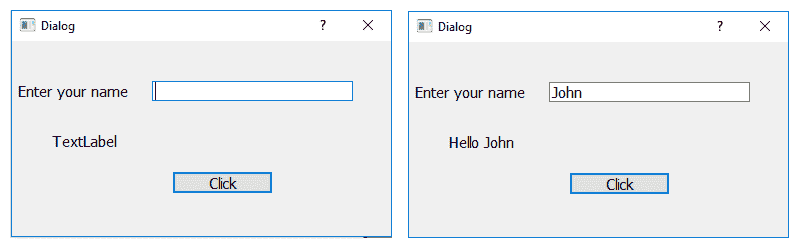
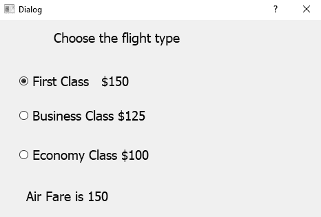
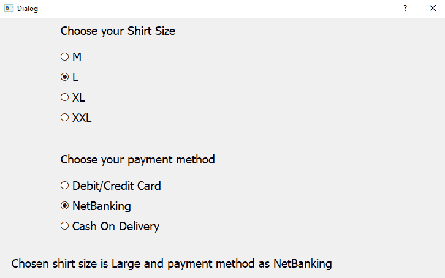
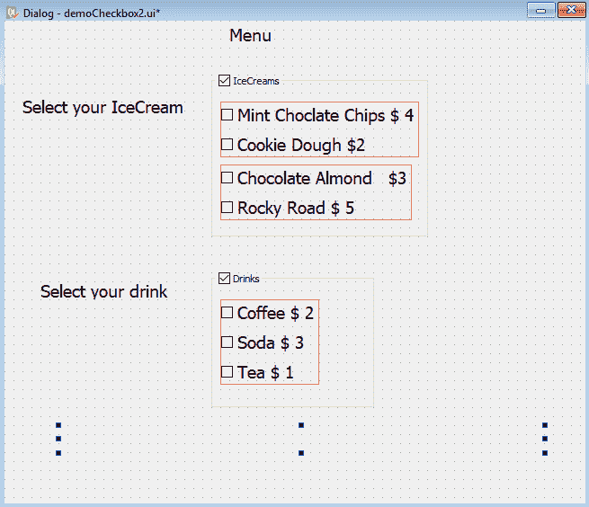

# 十三、使用 Qt 组件创建用户界面

在本章中，我们将学习使用以下小部件：

*   显示欢迎信息
*   使用单选按钮小部件
*   分组单选按钮
*   以复选框的形式显示选项
*   显示两组复选框

# 介绍

我们将学习使用 Qt 工具包创建 GUI 应用。Qt 工具包，简称 Qt，是**Trolltech**开发的跨平台应用和 UI 框架，用于开发 GUI 应用。它运行在多个平台上，包括 Windows、macOS X、Linux 和其他 UNIX 平台。它也被称为小部件工具包，因为它提供设计 GUI 所需的小部件，如按钮、标签、文本框、按钮和列表框。它包括类的跨平台集合、集成工具和跨平台 IDE。为了创建实时应用，我们将为名为**PyQt5**的 Qt 工具包使用 Python 绑定。

# PyQt

PyQt 是一组用于跨平台应用框架的 Python 绑定，它结合了 Qt 和 Python 的所有优点。使用 PyQt，您可以在 Python 代码中包含 Qt 库，从而能够用 Python 编写 GUI 应用。换句话说，PyQt 允许您通过 Python 代码访问 Qt 提供的所有工具。由于 PyQt 依赖于要运行的 Qt 库，因此在安装 PyQt 时，所需的 Qt 版本也会自动安装在您的计算机上。

GUI 应用可能由一个带有多个对话框的主窗口组成，也可能只有一个对话框。小型 GUI 应用通常至少包含一个对话框。对话框应用包含按钮。它不包含菜单栏、工具栏、状态栏或中心小部件，而主窗口应用通常包含所有这些。

对话框有以下两种类型：

*   **模式**：此对话框阻止用户与应用的其他部分交互。对话框是用户可以与之交互的应用的唯一部分。在关闭对话框之前，无法访问应用的其他部分。
*   **非模态**：此对话框与模态对话框相反。当无模式对话框处于活动状态时，用户可以自由地与对话框以及应用的其余部分进行交互。

# 创建 GUI 应用的方法

编写 GUI 应用有以下两种方法：

*   从头开始，使用简单的文本编辑器
*   Qt Designer 是一种可视化设计工具，通过它，您可以使用拖放快速创建用户界面

您将使用 Qt Designer 在 PyQt 中开发 GUI 应用，因为这是一种不用编写一行代码就可以设计用户界面的快速简便的方法。所以，双击桌面上的 Qt Designer 图标，启动 Qt Designer。

打开时，Qt Designer 要求您为新应用选择模板，如以下屏幕截图所示：


Qt Designer 提供了许多适用于不同类型应用的模板。您可以选择这些模板中的任何一个，然后单击“创建”按钮。

Qt Designer 为新应用提供以下预定义模板：

*   底部有按钮的对话框：此模板创建一个窗体，右下角有“确定”和“取消”按钮。
*   右键对话框：此模板创建一个窗体，在右上角有“确定”和“取消”按钮。
*   不带按钮的对话框：此模板创建一个空表单，您可以在其上放置小部件。对话框的超类是`QDialog`。
*   主窗口：此模板提供了一个主应用窗口，其中包含一个菜单栏和一个工具栏，如果不需要，可以将其删除。
*   小部件：该模板创建一个表单，其超类是`QWidget`而不是`QDialog`。

每个 GUI 应用都有一个顶级小部件，其余的小部件称为其子部件。顶级小部件可以是`QDialog`、`QWidget`或`QMainWindow`，具体取决于您需要的模板。如果您希望基于对话框模板创建应用，那么您继承的顶级小部件或第一个类将是`QDialog`。同样，要基于主窗口模板创建应用，顶级小部件将是`QMainWindow`，要基于小部件模板创建应用，需要继承`QWidget`类。如前所述，用于用户界面的其余小部件称为类的子小部件。

Qt Designer 在顶部显示菜单栏和工具栏。它在左侧显示了一个小部件框，其中包含用于开发应用的各种小部件，这些小部件按部分分组。您所要做的就是从表单中拖放所需的小部件。您可以在布局中排列小部件，设置其外观，提供初始属性，并将其信号连接到插槽。

# 显示欢迎信息

在此配方中，将提示用户输入其姓名，然后单击按钮。单击该按钮时，将显示欢迎消息“Hello”，后跟用户输入的名称。对于这个配方，我们需要使用三个小部件：标签、行编辑和按钮。让我们逐一了解这些小部件。

# 理解标签小部件

标签小部件是`QLabel`类的一个实例，用于显示消息和图像。因为标签小部件只显示计算结果，不接受任何输入，所以它们只用于在屏幕上提供信息

# 方法

以下是`QLabel`类提供的方法：

*   `setText()`：此方法将文本分配给标签小部件
*   `setPixmap()`：此方法将`QPixmap`类的实例`pixmap`分配给标签小部件
*   `setNum()`：此方法为标签小部件分配一个整数值或双数值
*   `clear()`：此方法清除标签小部件中的文本

`QLabel`的默认文本为 TextLabel。也就是说，当您通过拖动标签小部件并将其放置在表单上向表单添加`QLabel`类时，它将显示 TextLabel。除了使用`setText()`之外，您还可以通过在属性编辑器窗口中设置所选`QLabel`对象的文本属性，将文本指定给该对象。

# 理解行编辑小部件

行编辑小部件通常用于输入单行数据。行编辑小部件是`QLineEdit`类的一个实例，您不仅可以输入数据，还可以编辑数据。除了输入数据，您还可以在“行编辑”小部件中撤消、重做、剪切和粘贴数据

# 方法

以下是`QLineEdit`类提供的方法：

*   `setEchoMode()`：设置行编辑小部件的回显模式。也就是说，它确定如何显示行编辑小部件的内容。可供选择的方案如下：
*   `Normal`：默认模式，按输入方式显示字符
*   `NoEcho`：关闭行编辑回显，即不显示任何内容
*   `Password`：此选项用于密码字段，不显示文本；而是为用户输入的文本显示星号
*   `PasswordEchoOnEdit`：在编辑密码字段时显示实际文本，否则会显示文本的星号
*   `maxLength()`：此方法用于指定行编辑小部件中可输入的最大文本长度
*   `setText()`：此方法用于将文本分配给行编辑小部件。
*   `text()`：此方法访问行编辑小部件中输入的文本。
*   `clear()`：此方法清除或删除行编辑小部件的完整内容。
*   `setReadOnly()`：当布尔值 true 传递给此方法时，将使行编辑小部件为只读，即不可编辑。用户不能对通过行编辑小部件显示的内容进行任何更改，只能进行复制
*   `isReadOnly()`：如果行编辑小部件处于只读模式，则此方法返回布尔值 true，否则返回 false。
*   `setEnabled()`：默认启用行编辑小部件，即用户可以对其进行更改。但是如果将布尔值 false 传递给此方法，它将禁用行编辑小部件，因此用户无法编辑其内容，只能通过`setText()`方法分配文本。
*   `setFocus()`：此方法将光标定位在指定的行编辑小部件上。

# 理解按钮小部件

要在应用中显示按钮，需要创建`QPushButton`类的实例。将文本指定给按钮时，可以通过在文本中的任何字符前面加上符号和来创建快捷键。例如，如果分配给按钮的文本为`Click Me`，则字符`C`将加下划线，表示它是一个快捷键，用户可以通过按*Alt*+*C*选择按钮。如果按钮被激活，它将发出 clicked（）信号。除文本外，按钮中还可以显示图标。在按钮中显示文本和图标的方法如下：

*   `setText()`：此方法用于为按钮分配文本
*   `setIcon()`：此方法用于为按钮分配图标

# 怎么做。。。

让我们基于对话框创建一个新的应用，而不使用按钮模板。如前所述，该应用将提示用户输入名称，并且在输入名称后单击按钮，该应用将显示 hello 消息以及输入的名称。以下是创建此应用的步骤：

1.  另一个带有默认文本的标签应具有 objectName 属性`labelResponse`
2.  从“显示小部件”类别中再拖动一个标签小部件并将其放到表单上。不要更改此标签小部件的文本属性，并将其文本属性保留为默认值 TextLabel。这是因为这个标签小部件的文本属性将通过代码设置，也就是说，它将用于向用户显示 hello 消息。
3.  从 InputWidgets 类别中拖动一行编辑，并将其放到表单上。将其 objectName 属性设置为`lineEditName.`
4.  从按钮类别中拖动一个按钮小部件并将其放到表单上。将其文本属性设置为`Click`。您可以通过以下三种方式之一更改按钮小部件的文本属性：双击按钮小部件并覆盖默认文本，右键单击按钮小部件并选择更改文本。。。选项，或者从属性编辑器窗口选择文本属性并覆盖默认文本。
5.  将按钮小部件的 objectName 属性设置为`ButtonClickMe`。

6.  使用名称`demoLineEdit.ui`保存应用。现在将显示该表单，如以下屏幕截图所示：


使用 Qt Designer 创建的用户界面存储在一个`.ui`文件中，该文件包含表单的所有信息：窗口小部件、布局等。`.ui`文件是一个 XML 文件，您需要将其转换为 Python 代码。这样，您就可以在可视界面和代码中实现的行为之间保持清晰的分离。

7.  要使用`.ui`文件，首先需要将其转换为 Python 脚本。用于将`.ui`文件转换为 Python 脚本的命令实用程序是`pyuic5`。在 Windows 中，`pyuic5`实用程序与 PyQt 捆绑在一起。要进行转换，需要打开命令提示窗口，导航到保存文件的文件夹，然后发出以下命令：

```py
C:\Pythonbook\PyQt5>pyuic5 demoLineEdit.ui -o demoLineEdit.py
```

假设我们将表单保存在以下位置：`C:\Pythonbook\PyQt5>`。前面的命令显示了将`demoLineEdit.ui`文件转换为 Python 脚本`demoLineEdit.py`的过程。

The Python code generated by this method should not be modified manually, as any changes will be overwritten the next time you run the `pyuic5` command.

生成的 Python 脚本文件`demoLineEdit.py`的代码可以在本书的源代码包中看到。

8.  将`demoLineEdit.py`文件中的代码视为头文件，并将其导入到将从中调用其用户界面设计的文件中。

The header file is a term referred to those files which are imported into the current file. The command to import such files is usually written at the top in the script, hence named as header files. 

9.  让我们创建另一个名为`callLineEdit.py`的 Python 文件，并将`demoLineEdit.py`代码导入其中，如下所示：

```py
import sys
from PyQt5.QtWidgets import QDialog, QApplication
from demoLineEdit import *
class MyForm(QDialog):
    def __init__(self):
        super().__init__()
        self.ui = Ui_Dialog()
        self.ui.setupUi(self)
        self.ui.ButtonClickMe.clicked.connect(self.dispmessage)
        self.show()
    def dispmessage(self):
        self.ui.labelResponse.setText("Hello "
        +self.ui.lineEditName.text())
if __name__=="__main__":
    app = QApplication(sys.argv)
    w = MyForm()
    w.show()
    sys.exit(app.exec_())
```

# 它是如何工作的。。。

`demoLineEdit.py`文件很容易理解。创建一个名为顶级对象的类，并在前面加上`Ui_`。由于我们的应用中使用的顶级对象是`Dialog`，因此创建了`Ui_Dialog`类并存储了我们小部件的接口元素。该类有两种方法，`setupUi()`和`retranslateUi()`。`setupUi()`方法设置小部件；它创建在 Qt 设计器中定义用户界面时使用的小部件。该方法逐个创建小部件并设置其属性。`setupUi()`方法采用单个参数，即创建用户界面（子窗口小部件）的顶级窗口小部件。在我们的应用中，它是`QDialog`的一个实例。`retranslateUi()`方法转换接口。

让我们了解`callLineEdit.py`在语句方面的作用：

1.  它导入必要的模块。`QWidget`是 PyQt5 中所有用户界面对象的基类。
2.  它创建了一个新的`MyForm`类，该类继承自基类`QDialog`。
3.  为`QDialog`提供默认构造函数。默认构造函数没有父项，没有父项的小部件称为窗口。
4.  PyQt5 中的事件处理使用信号和插槽。信号是事件，时隙是在信号出现时执行的方法。例如，当您单击一个按钮时，会发生一个`clicked()`事件，也称为信号。`connect()`方法将信号与插槽连接。在这种情况下，插槽是一种方法：`dispmessage()`。也就是说，当用户点击按钮时，`dispmessage()`方法将被调用。`clicked()`在这里是一个事件，事件处理循环等待事件发生，然后分派它执行某些任务。事件处理循环继续工作，直到调用`exit()`方法或销毁主小部件。
5.  它通过`QApplication()`方法创建一个名为`app`的应用对象。每个 PyQt5 应用都必须创建`sys.argv`应用对象，该对象包含来自命令行的参数列表，并在创建应用对象时传递给方法。`sys.argv`参数有助于传递和控制脚本的启动属性。

6.  创建了一个名为`w`的`MyForm`类实例。
7.  `show()`方法将在屏幕上显示小部件。
8.  `dispmessage()`方法对按钮执行事件处理。它显示 Hello 文本以及在 Line Edit 小部件中输入的名称。
9.  `sys.exit()`方法确保干净的退出，释放内存资源。

The `exec_()` method has an underscore because `exec` is a Python keyword.

在执行前面的程序时，您会看到一个包含行编辑和按钮小部件的窗口，如下面的屏幕截图所示。当选择按钮时，将执行`dispmessage()`方法，显示 Hello 消息以及在 Line Edit 小部件中输入的用户名：



# 使用单选按钮小部件

此配方通过单选按钮显示特定航班类型，当用户选择单选按钮时，将显示与该航班相关的价格。我们首先需要了解单选按钮的工作原理

# 理解单选按钮

当您希望用户仅从可用选项中选择一个选项时，单选按钮小部件非常流行。这些选项称为互斥选项。当用户选择一个选项时，先前选择的选项将自动取消选择。单选按钮小部件是`QRadioButton`类的实例。每个单选按钮都有一个关联的文本标签。单选按钮可以处于选中（选中）或未选中（未选中）状态。如果您想要两组或多组单选按钮，其中每一组允许独占选择一个单选按钮，请将它们放入不同的按钮组中（“T1”的实例）。`QRadioButton`提供的方法如下所示。

# 方法

`QRadioButton`类提供以下方法：

*   `isChecked()`：如果按钮处于选中状态，此方法返回布尔值 true。
*   `setIcon()`：此方法显示带有单选按钮的图标。
*   `setText()`：此方法将文本分配给单选按钮。如果要为单选按钮指定快捷键，请在文本中首选字符前面加一个符号（`&`。快捷方式字符将带下划线。
*   `setChecked()`：若要使任何单选按钮显示为默认选中状态，请将布尔值 true 传递给此方法。

# 信号描述

`QRadioButton`发出的信号如下：

*   toggled（）：每当按钮将其状态从选中更改为未选中或反之亦然时，都会发出此信号
*   clicked（）：当按钮被激活（即按下并释放）或按下其快捷键时，会发出此信号
*   stateChanged（）：当单选按钮将其状态从选中更改为未选中或反之亦然时，会发出此信号

为了理解单选按钮的概念，让我们创建一个应用，要求用户选择航班类型，并以单选按钮的形式显示三个选项：头等舱、公务舱和经济舱。通过单选按钮选择选项时，将显示该航班的价格。

# 怎么做。。。

让我们基于对话框创建一个新的应用，而不使用按钮模板。此应用将显示不同的航班类型及其各自的价格。当用户选择航班类型时，其价格将显示在屏幕上：

1.  将两个标签小部件和三个单选按钮小部件拖放到表单上。
2.  将第一个标签小部件的文本属性设置为`Choose the flight type`，并删除第二个标签小部件的文本属性。第二个标签小部件的文本属性将通过代码设置；它将用于显示所选航班类型的价格。
3.  将三个单选按钮小部件的文本属性设置为`First Class $150`、`Business Class $125`和`Economy Class $100`。
4.  将第二个标签小部件的 objectName 属性设置为`labelFare`。三个单选按钮的默认对象名称为`radioButton`、`radioButton_2`和`radioButton_3`。将这三个单选按钮的 objectName 属性更改为`radioButtonFirstClass`、`radioButtonBusinessClass`和`radioButtonEconomyClass`。
5.  使用名称`demoRadioButton1.ui`保存应用。

请看以下屏幕截图：


`demoRadioButton1.ui`应用是一个 XML 文件，需要通过`pyuic5`命令实用程序转换为 Python 代码。生成的 Python 代码`demoRadioButton1.py`可以在本书的源代码包中看到。

6.  将`demoRadioButton1.py`文件作为头文件导入 Python 脚本中，您将在接下来创建该脚本以调用用户界面设计。
7.  在 Python 脚本中，编写代码，根据用户选择的单选按钮显示航班类型。将源文件命名为`callRadioButton1.py`；其代码如下所示：

```py
import sys
from PyQt5.QtWidgets import QDialog, QApplication
from demoRadioButton1 import *
class MyForm(QDialog):
    def __init__(self):
        super().__init__()
        self.ui = Ui_Dialog()
        self.ui.setupUi(self)
        self.ui.radioButtonFirstClass.toggled.connect(self.
        dispFare)
        self.ui.radioButtonBusinessClass.toggled.connect(self.
        dispFare)
        self.ui.radioButtonEconomyClass.toggled.connect(self.
        dispFare)
        self.show()
    def dispFare(self):
        fare=0
        if self.ui.radioButtonFirstClass.isChecked()==True:
            fare=150
        if self.ui.radioButtonBusinessClass.isChecked()==True:
            fare=125
        if self.ui.radioButtonEconomyClass.isChecked()==True:
            fare=100
        self.ui.labelFare.setText("Air Fare is "+str(fare))
if __name__=="__main__":
    app = QApplication(sys.argv)
    w = MyForm()
    w.show()
    sys.exit(app.exec_())
```

# 它是如何工作的。。。

单选按钮的 toggled（）事件连接到`dispFare()`功能，该功能将显示所选航班类型的价格。在`dispFare()`功能中，检查单选按钮的状态。因此，如果选择了`radioButtonFirstClass`，则将值`150`分配给票价变量。同样，如果选择了`radioButtonBusinessClass`，则将值`125`分配给`fare`变量。同样，当选择`radioButtonEconomyClass`时，值`100`被分配给`fare`变量。最后，通过`labelFare`显示`fare`变量中的值。

在执行上一个程序时，会出现一个对话框，显示三种航班类型，并提示用户选择他/她想要用于旅行的航班类型。选择航班类型时，将显示所选航班类型的价格，如以下屏幕截图所示：



# 分组单选按钮

在这个应用中，我们将学习创建两组单选按钮。用户可以从任一组中选择单选按钮，相应地，结果或文本将显示在屏幕上。

# 准备

我们将显示一个对话框，显示不同尺寸和不同付款方式的衬衫。选择衬衫尺码和付款方式时，屏幕上将显示所选衬衫尺码和付款方式。我们将创建两组单选按钮，一组是衬衫尺寸和其他付款方式。衬衫尺码组显示四个单选按钮，显示四种不同类型的尺码，如 M、L、XL 和 XXL，其中 M 代表中等尺码，L 代表大号，等等。“付款方式”组显示三个单选按钮：借记卡/信用卡、网上银行和货到付款。用户可以从任一组中选择任何单选按钮。当用户选择任何衬衫尺寸或付款方式时，将显示所选衬衫尺寸和付款方式。

# 怎么做。。。

让我们一步一步地重新创建前面的应用：

1.  基于对话框创建新的应用，而不使用按钮模板。
2.  拖放三个标签小部件和七个单选按钮小部件。在这七个单选按钮中，我们将在一个垂直布局中安排四个单选按钮，在第二个垂直布局中安排其他三个单选按钮。这两种布局将有助于对这些单选按钮进行分组。单选按钮互斥将只允许从布局或组中选择一个单选按钮。
3.  将前两个标签小部件的文本属性分别设置为`Choose your Shirt Size`和`Choose your payment method`。
4.  删除第三个标签小部件的文本属性，因为我们将通过代码显示选定的衬衫尺寸和付款方式。
5.  在属性编辑器窗口中，增加所有小部件的字体大小，以增加它们在应用中的可见性。
6.  将前四个单选按钮的文本属性设置为`M`、`L`、`XL`和`XXL`。将这四个单选按钮排列成一个垂直布局。
7.  将接下来三个单选按钮的文本属性设置为`Debit/Credit Card`、`NetBanking`和`Cash On Delivery`。将这三个单选按钮排列成第二个垂直布局。请记住，这些垂直布局有助于对这些单选按钮进行分组。
8.  将前四个单选按钮的对象名称更改为`radioButtonMedium`、`radioButtonLarge`、`radioButtonXL`和`radioButtonXXL`。

9.  将第一个`VBoxLayout`布局的 objectName 属性设置为`verticalLayout`。`VBoxLayout`布局将用于垂直对齐单选按钮。
10.  将下三个单选按钮的对象名称更改为`radioButtonDebitCard`、`radioButtonNetBanking`和`radioButtonCashOnDelivery`。
11.  将第二个`QVBoxLayout`对象的 objectName 属性设置为`verticalLayout_2`。
12.  将第三个标签小部件的 objectName 属性设置为`labelSelected`。通过此标签小部件，将显示选定的衬衫尺寸和付款方式。
13.  使用名称`demoRadioButton2.ui`保存应用。
14.  现在，将显示该表单，如以下屏幕截图所示：


然后通过`pyuic5`命令实用程序将`.ui`（XML）文件转换为 Python 代码。您可以在本书的源代码包中找到 Python 代码`demoRadioButton2.py`。

15.  导入`demoRadioButton2.py`文件，作为我们程序中的头文件，以调用用户界面设计，并在用户选择或取消选择任何单选按钮时编写代码，通过标签小部件显示所选衬衫尺寸和付款方式。

16.  让我们把程序命名为`callRadioButton2.pyw`；其代码如下所示：

```py
import sys
from PyQt5.QtWidgets import QDialog, QApplication
from demoRadioButton2 import *
class MyForm(QDialog):
    def __init__(self):
        super().__init__()
        self.ui = Ui_Dialog()
        self.ui.setupUi(self)
        self.ui.radioButtonMedium.toggled.connect(self.
        dispSelected)
        self.ui.radioButtonLarge.toggled.connect(self.
        dispSelected)
        self.ui.radioButtonXL.toggled.connect(self.dispSelected)
        self.ui.radioButtonXXL.toggled.connect(self.
        dispSelected)
        self.ui.radioButtonDebitCard.toggled.connect(self.
        dispSelected)
        self.ui.radioButtonNetBanking.toggled.connect(self.
        dispSelected)
        self.ui.radioButtonCashOnDelivery.toggled.connect(self.
        dispSelected)
        self.show()
    def dispSelected(self):
        selected1="";
        selected2=""
        if self.ui.radioButtonMedium.isChecked()==True:
            selected1="Medium"
        if self.ui.radioButtonLarge.isChecked()==True:
            selected1="Large"
        if self.ui.radioButtonXL.isChecked()==True:
            selected1="Extra Large"
        if self.ui.radioButtonXXL.isChecked()==True:
            selected1="Extra Extra Large"
        if self.ui.radioButtonDebitCard.isChecked()==True:
            selected2="Debit/Credit Card"
        if self.ui.radioButtonNetBanking.isChecked()==True:
            selected2="NetBanking"
        if self.ui.radioButtonCashOnDelivery.isChecked()==True:
            selected2="Cash On Delivery"
        self.ui.labelSelected.setText("Chosen shirt size is 
        "+selected1+" and payment method as " + selected2)
if __name__=="__main__":
    app = QApplication(sys.argv)
```

```py
    w = MyForm()
    w.show()
    sys.exit(app.exec_())
```

# 它是如何工作的。。。

所有单选按钮的 toggled（）事件连接到`dispSelected()`函数，该函数将显示所选衬衫尺寸和付款方式。在`dispSelected()`功能中，您可以检查单选按钮的状态，以确定它们是否已选中。根据第一个垂直布局中选择的单选按钮，`selected1`变量的值将设置为`Medium`、`Large`、`Extra Large`或`Extra Extra Large`。类似地，在第二个垂直布局中，根据选择的单选按钮，`selected2`变量的值将初始化为借记卡/信用卡、网上银行或货到付款。最后，分配给`selected1`变量和所选变量的衬衫尺寸和付款方式将通过`labelSelected`小部件显示。运行应用时，会出现一个对话框，提示您选择衬衫尺寸和付款方式。选择衬衫尺码和付款方式时，所选衬衫尺码和付款方式将通过标签小部件显示，如以下屏幕截图所示：



# 以复选框的形式显示选项

在创建应用时，您可能会遇到这样一种情况：您需要提供多个选项供用户选择。也就是说，您希望用户从一组选项中选择一个或多个选项。在这种情况下，您需要使用复选框。让我们了解更多有关复选框的信息。

# 准备

单选按钮只允许在组中选择一个选项，而复选框允许您选择多个选项。也就是说，选中复选框不会影响应用中的其他复选框。复选框以文本标签显示为`QCheckBox`类的实例。复选框可以处于三种状态中的任意一种：选中（已选中）、未选中（未选中）或三态（未更改）。三态是一种不变的状态；用户既没有选中也没有取消选中该复选框

# 方法应用

以下是`QCheckBox`类提供的方法：

*   `isChecked()`：如果选中复选框，此方法返回布尔值 true，否则返回 false。
*   `setTristate()`：如果不希望用户更改复选框的状态，则将布尔值 true 传递给此方法。用户将无法选中或取消选中该复选框。
*   `setIcon()`：此方法用于显示带有复选框的图标。
*   `setText()`：此方法将文本分配给复选框。要为复选框指定快捷键，请在文本中的首选字符前面加一个与符号。快捷方式字符将显示为带下划线。
*   `setChecked()`：为了使复选框显示为默认选中状态，将布尔值 true 传递给此方法。

# 信号描述

`QCheckBox`发出的信号如下：

*   clicked（）：当激活复选框（即按下并释放）或按下其快捷键时，会发出此信号
*   stateChanged（）：每当复选框将其状态从选中更改为未选中，或反之亦然，都会发出此信号

为了理解复选框小部件，让我们假设您经营一家餐厅，在那里出售多种食品，例如比萨饼。比萨饼与不同的配料一起出售，如额外的奶酪、额外的橄榄等，每种配料的价格也会在比萨饼上注明。用户可以选择带有一种或多种配料的普通比萨饼。您需要的是，当选择了一种配料时，将显示比萨饼的总价，包括所选配料。

# 怎么做。。。

本配方的重点是了解当复选框的状态从选中变为未选中或反之亦然时，如何启动操作。以下是创建此类应用的分步过程：

1.  首先，基于对话框创建一个新的应用，而不使用按钮模板。
2.  将三个标签小部件和三个复选框小部件拖放到表单上。
3.  将前两个标签小部件的文本属性设置为`Regular Pizza $10`和`Select your extra toppings`。
4.  在“属性编辑器”窗口中，增加所有三个标签和复选框的字体大小，以增加它们在应用中的可见性。
5.  将三个复选框的文本属性设置为`Extra Cheese $1`、`Extra Olives $1`和`Extra Sausages $2`。三个复选框的默认对象名称为`checkBox`、`checkBox_2`和`checkBox_3`。
6.  将其分别更改为`checkBoxCheese`、`checkBoxOlives`和`checkBoxSausages`。
7.  将标签小部件的 objectName 属性设置为`labelAmount`。

8.  使用名称`demoCheckBox1.ui`保存应用。现在，该表单将显示在以下屏幕截图中：


然后通过`pyuic5`命令实用程序将`.ui`（XML）文件转换为 Python 代码。`demoCheckBox1.py`文件中生成的 Python 代码可以在本书的源代码包中看到。

9.  导入`demoCheckBox1.py`文件，作为我们程序中的头文件，以调用用户界面设计，并在用户选择或取消选择任何复选框时，通过标签小部件编写代码来计算普通比萨饼以及所选配料的总成本。
10.  让我们把程序命名为`callCheckBox1.pyw`；其代码如下所示：

```py
import sys
from PyQt5.QtWidgets import QDialog
from PyQt5.QtWidgets import QApplication, QWidget, QPushButton
from demoCheckBox1 import *
class MyForm(QDialog):
    def __init__(self):
        super().__init__()
        self.ui = Ui_Dialog()
        self.ui.setupUi(self)
        self.ui.checkBoxCheese.stateChanged.connect(self.
        dispAmount)
        self.ui.checkBoxOlives.stateChanged.connect(self.
        dispAmount)
        self.ui.checkBoxSausages.stateChanged.connect(self.
        dispAmount)
        self.show()
    def dispAmount(self):
        amount=10
        if self.ui.checkBoxCheese.isChecked()==True:
            amount=amount+1
        if self.ui.checkBoxOlives.isChecked()==True:
            amount=amount+1
        if self.ui.checkBoxSausages.isChecked()==True:
            amount=amount+2
        self.ui.labelAmount.setText("Total amount for pizza is 
        "+str(amount))
if __name__=="__main__":
    app = QApplication(sys.argv)
    w = MyForm()
    w.show()
    sys.exit(app.exec_())
```

# 它是如何工作的。。。

复选框的 stateChanged（）事件连接到`dispAmount`函数，该函数将计算比萨饼和所选配料的成本。在`dispAmount`函数中，您可以检查复选框的状态，以确定它们是否已选中。选中复选框的浇头的成本被添加并存储在`amount`变量中。最后，通过`labelAmount`显示`amount`变量中存储的金额的相加。运行该应用时，会出现一个对话框，提示您选择要添加到普通比萨中的配料。选择任何配料时，屏幕上将显示普通比萨饼的数量以及所选配料，如以下屏幕截图所示：


The `dispAmount` function will be invoked every time the status of any checkbox changes. As a result, the total amount will be displayed via the Label widget, as soon as any checkbox is checked or unchecked.

# 显示两组复选框

在这个应用中，我们将学习创建两组复选框。用户可以从任一组中选择任意数量的复选框，并相应地显示结果。

# 准备

我们将尝试展示一个餐厅的菜单，那里提供不同类型的冰淇淋和饮料。我们将创建两组复选框，一组是冰淇淋，另一组是饮料。冰淇淋组显示四个复选框，显示四种不同类型的冰淇淋、薄荷巧克力片、饼干面团等，以及它们的价格。饮料组显示三个复选框，咖啡、苏打水等，以及它们的价格。用户可以从任一组中选择任意数量的复选框。当用户选择任何冰淇淋或饮料时，将显示所选冰淇淋和饮料的总价。

# 怎么做。。。

以下是创建应用的步骤，这些步骤解释了如何将复选框安排到不同的组中，以及如何在任何组中的任何复选框的状态发生更改时采取相应的操作：

1.  基于对话框创建新的应用，而不使用按钮模板。
2.  将四个标签小部件、七个复选框小部件和两个分组框小部件拖放到表单上。
3.  将前三个标签小部件的文本属性分别设置为`Menu`、`Select your IceCream`和`Select your drink`。
4.  删除第四个标签小部件的文本属性，因为我们将通过代码显示所选冰淇淋和饮料的总量。
5.  通过属性编辑器，增加所有小部件的字体大小，以增加它们在应用中的可见性。
6.  将前四个复选框的文本属性设置为`Mint Choclate Chips $4`、`Cookie Dough $2`、`Choclate Almond $3`和`Rocky Road $5`。将这四个复选框放入第一个分组框。
7.  将接下来三个复选框的文本属性分别设置为`Coffee $2`、`Soda $3`和`Tea $1`。将这三个复选框放入第二个分组框。

8.  将前四个复选框的对象名称更改为`checkBoxChoclateChips`、`checkBoxCookieDough`、`checkBoxChoclateAlmond`和`checkBoxRockyRoad`。
9.  将第一个组框的 objectName 属性设置为`groupBoxIceCreams`。
10.  将接下来三个复选框的 objectName 属性更改为`checkBoxCoffee`、`checkBoxSoda`和`checkBoxTea`。
11.  将第二个组框的 objectName 属性设置为`groupBoxDrinks`。
12.  将第四个标签小部件的 objectName 属性设置为`labelAmount`。
13.  使用名称`demoCheckBox2.ui`保存应用。通过此标签小部件，将显示所选冰淇淋和饮料的总量，如以下屏幕截图所示：



然后通过`pyuic5`命令实用程序将`.ui`（XML）文件转换为 Python 代码。您可以在本书的源代码包中找到生成的 Python 代码，`demoCheckbox2.py`文件。

14.  在我们的程序中导入`demoCheckBox2.py`文件作为头文件，以调用用户界面设计，并在用户选择或取消选择任何复选框时编写代码，通过标签小部件计算冰淇淋和饮料的总成本。
15.  让我们把程序命名为`callCheckBox2.pyw`；其代码如下所示：

```py
import sys
from PyQt5.QtWidgets import QDialog
from PyQt5.QtWidgets import QApplication, QWidget, QPushButton
from demoCheckBox2 import *
class MyForm(QDialog):
    def __init__(self):
        super().__init__()
        self.ui = Ui_Dialog()
        self.ui.setupUi(self)
        self.ui.checkBoxChoclateAlmond.stateChanged.connect
        (self.dispAmount)
        self.ui.checkBoxChoclateChips.stateChanged.connect(self.
        dispAmount)
        self.ui.checkBoxCookieDough.stateChanged.connect(self.
        dispAmount)
        self.ui.checkBoxRockyRoad.stateChanged.connect(self.
        dispAmount)
        self.ui.checkBoxCoffee.stateChanged.connect(self.
        dispAmount)
        self.ui.checkBoxSoda.stateChanged.connect(self.
        dispAmount)
        self.ui.checkBoxTea.stateChanged.connect(self.
        dispAmount)
        self.show()
    def dispAmount(self):
        amount=0
        if self.ui.checkBoxChoclateAlmond.isChecked()==True:
            amount=amount+3
        if self.ui.checkBoxChoclateChips.isChecked()==True:
            amount=amount+4
        if self.ui.checkBoxCookieDough.isChecked()==True:
            amount=amount+2
        if self.ui.checkBoxRockyRoad.isChecked()==True:
            amount=amount+5
        if self.ui.checkBoxCoffee.isChecked()==True:
            amount=amount+2
        if self.ui.checkBoxSoda.isChecked()==True:
            amount=amount+3
        if self.ui.checkBoxTea.isChecked()==True:
            amount=amount+1
        self.ui.labelAmount.setText("Total amount is 
        $"+str(amount))
if __name__=="__main__":
    app = QApplication(sys.argv)
    w = MyForm()
    w.show()
    sys.exit(app.exec_())
```

# 它是如何工作的。。。

所有复选框的 stateChanged（）事件连接到`dispAmount`函数，该函数将计算所选冰淇淋和饮料的成本。在`dispAmount`函数中，您可以检查复选框的状态，以确定它们是否已选中。选中复选框的冰淇淋和饮料的成本被添加并存储在`amount`变量中。最后，通过`labelAmount`小部件显示`amount`变量中存储的金额的增加。运行应用时，会出现一个对话框，提示您选择要订购的冰淇淋或饮料。选择冰淇淋或饮料时，将显示所选项目的总量，如以下屏幕截图所示：

