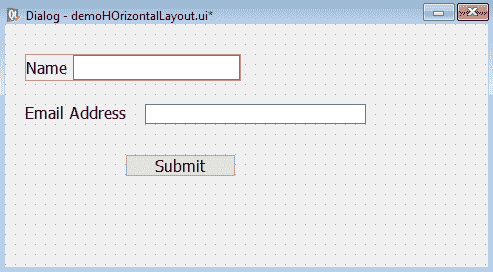
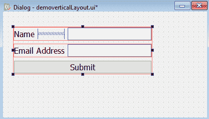
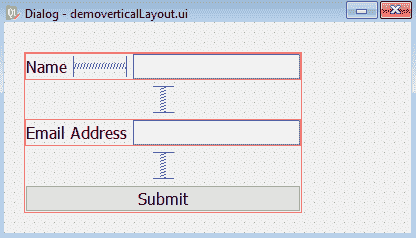
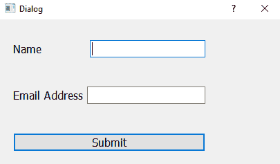
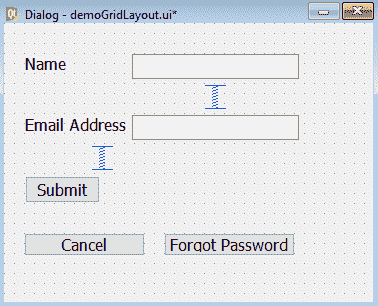
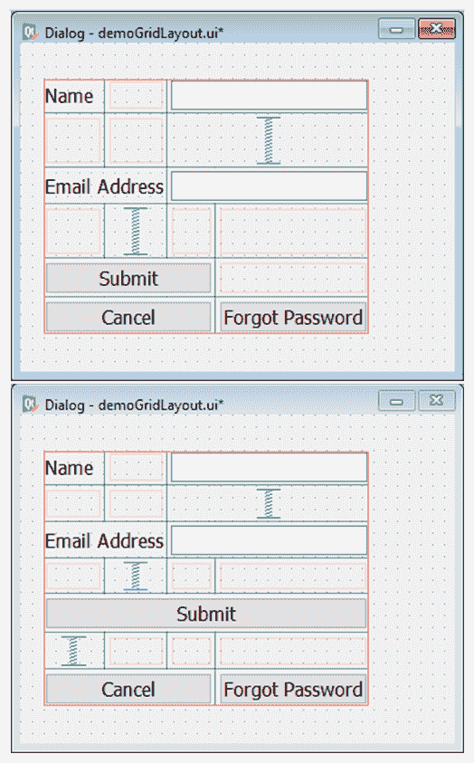

# 十七、理解布局

在本章中，我们将重点关注以下主题：

*   使用水平布局
*   使用垂直布局
*   使用网格布局
*   使用表单布局

# 理解布局

顾名思义，布局用于以所需格式排列小部件。在布局中排列某些小部件时，某些大小和对齐约束将自动应用于小部件。例如，在增加窗口的大小时，布局中的小部件也会增加大小以使用增加的空间。类似地，在减小窗口大小时，布局中的小部件也会减小大小。出现以下问题：布局如何知道小部件的建议大小？

基本上，每个小部件都有一个名为 sizeHint 的属性，该属性包含小部件的建议大小。当窗口调整大小并且布局大小也改变时，布局管理器通过小部件的 sizeHint 属性知道小部件的大小要求。

为了在小部件上应用大小约束，您可以使用以下两个属性：

*   minimumSize：如果窗口大小减小，小部件仍然不会小于 minimumSize 属性中指定的大小。
*   maximumSize：类似地，如果窗口增加，小部件将不会大于 maximumSize 属性中指定的大小。

设置上述属性时，将覆盖 sizeHint 属性中指定的值。

要在布局中排列小部件，只需使用*Ctrl*+左键单击选择所有小部件，然后单击工具栏上的布局管理器。另一种方法是右键单击以打开关联菜单。从关联菜单中，可以选择布局菜单选项，然后从弹出的子菜单中选择所需布局。

在选择所需布局时，小部件将在所选布局中布局，并且布局将由运行时不可见的小部件周围的红线指示。要查看小部件是否正确布局，您可以通过选择 form、preview 或*Ctrl*+*R*来预览表单。要中断布局，请选择表单，中断布局，输入*Ctrl*+*O*，或从工具栏中选择中断布局图标。

The layouts can be nested.

以下是 Qt Designer 提供的布局管理器：

*   水平布局
*   垂直布局
*   网格布局
*   表单布局

# 垫片

为了控制小部件之间的间距，使用了水平和垂直间隔符。当两个小部件之间保持水平间隔时，这两个小部件将被尽可能地向左和向右推。如果窗口大小增加，窗口小部件的大小将不会改变，多余的空间将被分隔符占用。类似地，当窗口大小减小时，间隔将自动减小，但小部件大小不会改变。

Spacers expand to fill empty space and shrink if the space is decreased.

让我们看一下在水平框布局中排列小部件的过程。

# 使用水平布局

水平布局将窗口小部件排列成一行，也就是说，窗口小部件使用水平布局水平对齐。让我们通过制作一个应用来理解这个概念。

# 怎么做。。。

在此应用中，我们将提示用户输入电子邮件地址和密码。本配方的主要重点是了解两对标签和行编辑小部件是如何水平对齐的。以下是创建此应用的分步过程：

1.  让我们基于没有按钮模板的对话框创建一个应用，通过在表单上拖放两个标签、两行编辑和一个按钮小部件，将两个`QLabel`、两个`QlineEdit`和一个`QPushButton`小部件添加到表单中。
2.  将两个标签小部件的文本属性设置为`Name`和`Email Address`。
3.  另外，将按钮小部件的文本属性设置为`Submit`。
4.  由于此应用的目的是了解布局而不是其他内容，因此我们不会设置应用中任何小部件的 objectName 属性。

该表单现在将显示在以下屏幕截图中：


5.  我们将在每对标签和行编辑小部件上应用水平布局。因此，单击标签小部件上的文本`Name`，并按住*Ctrl*键，单击旁边的行编辑小部件。

You can select more than one widget by using *Ctrl* + left-click.

6.  选择标签和线条编辑小部件后，右键单击并从打开的上下文菜单中选择布局菜单选项。
7.  选择布局菜单选项时，屏幕上将出现多个子菜单选项；选择“水平布局”子菜单选项。标签和行编辑小部件都将水平对齐，如以下屏幕截图所示：



8.  如果你想打破布局呢？这很简单：你可以在任何时候打破任何布局，只需选择布局并右键单击它。关联菜单将弹出；从关联菜单中选择布局菜单选项，然后选择“打断布局”子菜单选项。
9.  要将第二对标签小部件与文本`Email Address`及其旁边的行编辑小部件水平对齐，请重复步骤 6 和 7 中提到的相同过程。这对标签和行编辑小部件也将水平对齐，如下面的屏幕截图所示。

您可以看到两个小部件周围有一个红色矩形。此红色矩形是水平布局窗口：


10.  要在第一对标签和行编辑小部件之间创建一些空间，请从小部件框的“间隔符”选项卡中拖动水平间隔符小部件，并将其放置在带有文本`Name`的标签小部件和旁边的行编辑小部件之间。

The Horizontal Spacer widget initially takes up the default space between the two widgets. The spacers appear as blue springs on the form.

11.  通过拖动水平间隔符的节点来约束“线编辑”小部件的宽度，从而调整水平间隔符的大小，如以下屏幕截图所示：


12.  从第一对标签和线条编辑小部件中选择水平布局小部件的红色矩形，并将其向右拖动，使其宽度等于第二对。
13.  拖动水平布局小部件时，水平间隔符将增加其宽度，以消耗两个小部件之间的额外空白，如以下屏幕截图所示：


14.  将应用另存为`demoHorizontalLayout.ui`。

使用 Qt Designer 创建的用户界面存储在一个`.ui`文件中，该文件是一个 XML 文件，我们需要将其转换为 Python 代码。要进行转换，您需要打开一个命令提示符窗口并导航到保存该文件的文件夹，然后发出以下命令行：

```py
C:\Pythonbook\PyQt5>pyuic5 demoHorizontalLayout.ui -o demoHorizontalLayout.py
```

Python 脚本文件`demoHorizontalLayout.py`可能有以下代码：

```py
from PyQt5 import QtCore, QtGui, QtWidgets
class Ui_Dialog(object):
    def setupUi(self, Dialog):
        Dialog.setObjectName("Dialog")
        Dialog.resize(483, 243)
        self.pushButton = QtWidgets.QPushButton(Dialog)
        self.pushButton.setGeometry(QtCore.QRect(120, 130, 111, 
        23))
        font = QtGui.QFont()
        font.setPointSize(12)
        self.pushButton.setFont(font)
        self.pushButton.setObjectName("pushButton")
        self.widget = QtWidgets.QWidget(Dialog)
        self.widget.setGeometry(QtCore.QRect(20, 30, 271, 27))
        self.widget.setObjectName("widget")
        self.horizontalLayout = QtWidgets.QHBoxLayout(self.widget)
        self.horizontalLayout.setContentsMargins(0, 0, 0, 0)
        self.horizontalLayout.setObjectName("horizontalLayout")
        self.label = QtWidgets.QLabel(self.widget)
        font = QtGui.QFont()
        font.setPointSize(12)
        self.label.setFont(font)
        self.label.setObjectName("label")
        self.horizontalLayout.addWidget(self.label)
        spacerItem = QtWidgets.QSpacerItem(40, 20, QtWidgets.
        QSizePolicy.Expanding,QtWidgets.QSizePolicy.Minimum)
        self.horizontalLayout.addItem(spacerItem)
        self.lineEdit = QtWidgets.QLineEdit(self.widget)
        font = QtGui.QFont()
        font.setPointSize(12)
        self.lineEdit.setFont(font)
        self.lineEdit.setObjectName("lineEdit")
        self.horizontalLayout.addWidget(self.lineEdit)
        self.widget1 = QtWidgets.QWidget(Dialog)
        self.widget1.setGeometry(QtCore.QRect(20, 80, 276, 27))
        self.widget1.setObjectName("widget1")
        self.horizontalLayout_2 = QtWidgets.QHBoxLayout(self.
        widget1)
        self.horizontalLayout_2.setContentsMargins(0, 0, 0, 0)
        self.horizontalLayout_2.setObjectName("horizontalLayout_2")
        self.label_2 = QtWidgets.QLabel(self.widget1)
        font = QtGui.QFont()
        font.setPointSize(12)
        self.label_2.setFont(font)
        self.label_2.setObjectName("label_2")
        self.horizontalLayout_2.addWidget(self.label_2)
        self.lineEdit_2 = QtWidgets.QLineEdit(self.widget1)
        font = QtGui.QFont()
        font.setPointSize(12)
        self.lineEdit_2.setFont(font)
        self.lineEdit_2.setObjectName("lineEdit_2")
        self.horizontalLayout_2.addWidget(self.lineEdit_2)
        self.retranslateUi(Dialog)
        QtCore.QMetaObject.connectSlotsByName(Dialog)
    def retranslateUi(self, Dialog):
        _translate = QtCore.QCoreApplication.translate
        Dialog.setWindowTitle(_translate("Dialog", "Dialog"))
        self.pushButton.setText(_translate("Dialog", "Submit"))
        self.label.setText(_translate("Dialog", "Name"))
        self.label_2.setText(_translate("Dialog", "Email Address"))
if __name__ == "__main__":
    import sys
    app = QtWidgets.QApplication(sys.argv)
    Dialog = QtWidgets.QDialog()
    ui = Ui_Dialog()
    ui.setupUi(Dialog)
    Dialog.show()
    sys.exit(app.exec_())
```

# 它是如何工作的。。。

您可以在代码中看到，表单上放置了一个具有默认 objectName 属性`lineEdit`的行编辑小部件和一个具有默认 objectName 属性**Label**的标签小部件。行编辑和标签小部件都使用水平布局小部件水平对齐。水平布局小部件具有默认的 objectName 属性`horizontalLayout`。在对齐标签和行编辑小部件时，两个小部件之间的水平空间减小。因此，标签和行编辑小部件之间保留了一个分隔符。第二对，带有默认 objectName 属性`label_2`的标签和带有默认 objectName 属性`lineEdit_2`的行编辑小部件，通过水平布局与默认 objectName 属性`horizontalLayout_2`水平对齐。

运行应用时，您会发现两对标签和行编辑小部件是水平对齐的，如以下屏幕截图所示：


# 使用垂直布局

垂直布局在一列中垂直排列选定的小部件，一列在另一列的下方。在下面的应用中，您将学习在垂直布局中放置小部件的过程。

# 怎么做。。。

在此应用中，我们将提示用户输入名称和电子邮件地址。用于输入姓名和电子邮件地址的标签和文本框以及“提交”按钮将通过垂直布局一个接一个地垂直排列。以下是创建应用的步骤：

1.  启动 Qt Designer 并基于无按钮模板的对话框创建应用，然后将两个`QLabel`、两个`QlineEdit`和一个`QPushButton`小部件拖放到表单上，将两个标签、两个行编辑和一个按钮小部件拖放到表单上。
2.  将两个标签小部件的文本属性设置为`Name`和`Email Address`。
3.  将按钮小部件的文本属性设置为`Submit`。由于此应用的目的是了解布局，而不是其他内容，因此我们不会设置应用中任何小部件的 objectName 属性。该表单现在将显示在以下屏幕截图中：


4.  在小部件上应用垂直布局之前，我们需要将小部件水平对齐。因此，我们将在每对标签和行编辑小部件上应用水平布局小部件。因此，点击带有文本`Name`的标签小部件，按住*Ctrl*键，点击旁边的行编辑小部件。
5.  选择标签和线条编辑小部件后，右键单击鼠标按钮并从打开的上下文菜单中选择布局菜单选项。
6.  选择布局菜单选项时，屏幕上将显示多个子菜单选项。选择“水平布局”子菜单选项。标签和行编辑小部件都将水平对齐。
7.  要将第二对标签与文本`Email Address`及其旁边的行编辑小部件水平对齐，请重复前面步骤 5 和 6 中提到的相同过程。您可以看到两个小部件周围有一个红色矩形。此红色矩形是水平布局窗口。
8.  要在第一对标签和行编辑小部件之间创建一些空间，请从小部件框的“间隔符”选项卡中拖动水平间隔符小部件，并将其放置在带有文本`Name`的标签小部件和除此之外的行编辑小部件之间。水平分隔符最初将占用两个小部件之间的默认空间。
9.  从第一对标签和线条编辑小部件中选择水平布局小部件的红色矩形，并将其向右拖动，使其宽度等于第二对。
10.  拖动水平布局小部件时，水平间隔符将增加其宽度，以消耗两个小部件之间的额外空白，如以下屏幕截图所示：


11.  现在，选择三件事：第一个水平布局窗口、第二个水平布局窗口和提交按钮。在进行多次选择时，按住*Ctrl*键。
12.  选择这三项后，右键单击打开关联菜单。
13.  从关联菜单中，选择布局菜单选项，然后选择垂直布局子菜单选项。这三个项目将垂直对齐，提交按钮的宽度将增加以匹配最宽布局的宽度，如以下屏幕截图所示：



14.  您还可以从工具栏中选择垂直布局图标，以垂直布局排列小部件。
15.  如果要控制提交按钮的宽度，可以使用此小部件的 minimumSize 和 maximumSize 属性。您会注意到，两个水平布局之间的垂直空间大大减少。
16.  要在两个水平布局之间创建一些空间，请从窗口小部件框的“间隔”选项卡中拖动“垂直间隔”窗口小部件，并将其放置在两个水平布局之间。

The vertical spacer will initially take up the default space between the two horizontal layouts

17.  若要在第二个水平布局和“提交”按钮之间创建垂直空间，请拖动垂直间隔符并将其放置在第二个水平布局和“提交”按钮之间。
18.  选择垂直布局的红色矩形并向下拖动以增加其高度。

19.  拖动垂直布局小部件时，垂直间隔将增加其高度，以消耗两个水平布局和提交按钮之间的额外空白，如以下屏幕截图所示：



20.  将应用另存为`demoverticalLayout.ui`。

我们知道，使用 Qt Designer 创建的用户界面存储在一个`.ui`文件中，该文件是一个 XML 文件，需要将其转换为 Python 代码。要进行转换，需要打开一个命令提示符窗口并导航到保存该文件的文件夹，然后发出以下命令：

```py
C:PyQt5>pyuic5 demoverticalLayout.ui -o demoverticalLayout.py
```

Python 脚本文件`demoverticalLayout.py`可能具有以下代码：

```py
from PyQt5 import QtCore, QtGui, QtWidgets
class Ui_Dialog(object):
    def setupUi(self, Dialog):
        Dialog.setObjectName("Dialog")
        Dialog.resize(407, 211)
        self.widget = QtWidgets.QWidget(Dialog)
        self.widget.setGeometry(QtCore.QRect(20, 30, 278, 161))
        self.widget.setObjectName("widget")
        self.verticalLayout = QtWidgets.QVBoxLayout(self.widget)
        self.verticalLayout.setContentsMargins(0, 0, 0, 0)
        self.verticalLayout.setObjectName("verticalLayout")
        self.horizontalLayout = QtWidgets.QHBoxLayout()
        self.horizontalLayout.setObjectName("horizontalLayout")
        self.label = QtWidgets.QLabel(self.widget)
        font = QtGui.QFont()
        font.setPointSize(12)
        self.label.setFont(font)
        self.label.setObjectName("label")
        self.horizontalLayout.addWidget(self.label)
        spacerItem = QtWidgets.QSpacerItem(40, 20, QtWidgets.
        QSizePolicy.Expanding,QtWidgets.QSizePolicy.Minimum)
        self.horizontalLayout.addItem(spacerItem)
        self.lineEdit = QtWidgets.QLineEdit(self.widget)
        font = QtGui.QFont()
        font.setPointSize(12)
        self.lineEdit.setFont(font)
        self.lineEdit.setObjectName("lineEdit")
        self.horizontalLayout.addWidget(self.lineEdit)
        self.verticalLayout.addLayout(self.horizontalLayout)
        spacerItem1 = QtWidgets.QSpacerItem(20, 40, QtWidgets.
        QSizePolicy.Minimum, QtWidgets.QSizePolicy.Expanding)
        self.verticalLayout.addItem(spacerItem1)
        self.horizontalLayout_2 = QtWidgets.QHBoxLayout()
        self.horizontalLayout_2.setObjectName("horizontalLayout_2")
        self.label_2 = QtWidgets.QLabel(self.widget)
        font = QtGui.QFont()
        font.setPointSize(12)
        self.label_2.setFont(font)
        self.label_2.setObjectName("label_2")
        self.horizontalLayout_2.addWidget(self.label_2)
        self.lineEdit_2 = QtWidgets.QLineEdit(self.widget)
        font = QtGui.QFont()
        font.setPointSize(12)
        self.lineEdit_2.setFont(font)
        self.lineEdit_2.setObjectName("lineEdit_2")
        self.horizontalLayout_2.addWidget(self.lineEdit_2)
        self.verticalLayout.addLayout(self.horizontalLayout_2)
        spacerItem2 = QtWidgets.QSpacerItem(20, 40, QtWidgets.
        QSizePolicy.Minimum,QtWidgets.QSizePolicy.
        Expanding)
        self.verticalLayout.addItem(spacerItem2)
        self.pushButton = QtWidgets.QPushButton(self.widget)
        font = QtGui.QFont()
        font.setPointSize(12)
        self.pushButton.setFont(font)
        self.pushButton.setObjectName("pushButton")
        self.verticalLayout.addWidget(self.pushButton)
        self.retranslateUi(Dialog)
        QtCore.QMetaObject.connectSlotsByName(Dialog)
    def retranslateUi(self, Dialog):
        _translate = QtCore.QCoreApplication.translate
        Dialog.setWindowTitle(_translate("Dialog", "Dialog"))
        self.label.setText(_translate("Dialog", "Name"))
        self.label_2.setText(_translate("Dialog", "Email Address"))
        self.pushButton.setText(_translate("Dialog", "Submit"))
if __name__ == "__main__":
    import sys
    app = QtWidgets.QApplication(sys.argv)
    Dialog = QtWidgets.QDialog()
    ui = Ui_Dialog()
    ui.setupUi(Dialog)
    Dialog.show()
    sys.exit(app.exec_())
```

# 它是如何工作的。。。

您可以在代码中看到，具有默认 objectName`lineEdit`属性的行编辑小部件和具有默认 objectName`label`属性的标签小部件放置在表单上，并使用具有默认 objectName 属性`horizontalLayout`的水平布局进行水平对齐。在对齐标签和行编辑小部件时，两个小部件之间的水平空间减小。因此，标签和行编辑小部件之间保留了一个分隔符。第二对，具有默认 objectName`label_2`属性的标签小部件和具有默认 objectName`lineEdit_2`属性的行编辑小部件，使用具有默认 objectName`horizontalLayout_2`属性的水平布局进行水平对齐。然后，使用具有默认`objectName`属性`verticalLayout`的垂直布局小部件，将前两个水平布局和具有默认 objectName`pushButton`属性的提交按钮垂直对齐。通过在第一对标签和行编辑小部件之间放置水平间隔符，可以增加它们之间的水平空间。类似地，通过在两个水平布局之间放置一个称为`spacerItem1`的垂直间隔物，增加了两个水平布局之间的垂直空间。此外，在第二个水平布局和提交按钮之间放置一个称为`spacerItem2`的垂直间隔，以增加它们之间的垂直空间。

运行应用时，您会发现两对标签和行编辑小部件以及提交按钮是垂直对齐的，如以下屏幕截图所示：



# 使用网格布局

网格布局在可拉伸的网格中排列小部件。为了理解网格布局小部件如何安排小部件，让我们创建一个应用。

# 怎么做。。。

在此应用中，我们将制作一个简单的登录表单，提示用户输入电子邮件地址和密码，然后单击提交按钮。在提交按钮下方，将有两个按钮，取消和忘记密码。该应用将帮助您了解这些小部件是如何以网格模式排列的。以下是创建此应用的步骤：

1.  启动 Qt Designer 并基于无按钮模板的对话框创建应用，然后通过拖放表单上的两个标签、两个行编辑和三个按钮小部件，将两个`QLabel`、两个`QlineEdit`和三个`QPushButton`小部件添加到表单中。
2.  将两个标签小部件的文本属性设置为`Name`和`Email Address`。

3.  将三个按钮小部件的文本属性设置为`Submit`、`Cancel`和`Forgot Password`。
4.  由于此应用的目的是了解布局，而不是其他内容，因此我们不会设置应用中任何小部件的 objectName 属性。
5.  要增加两个行编辑小部件之间的垂直空间，请从小部件框的“间隔符”选项卡中拖动垂直间隔符小部件，并将其放置在两个行编辑小部件之间。垂直间隔将首先占用两行编辑小部件之间的空白。
6.  要在第二行编辑小部件和提交按钮之间创建垂直空间，请拖动垂直间隔小部件并将其放置在它们之间。

应用将显示在以下屏幕截图中：



7.  按*Ctrl*键并单击表单上的所有小部件，选择表单上的所有小部件。
8.  选择所有小部件后，右键单击鼠标按钮打开关联菜单。

9.  从关联菜单中选择布局菜单选项，然后选择网格子菜单中的布局选项。

小部件将在网格中对齐，如以下屏幕截图所示：



10.  要增加“提交”和“取消”按钮之间的垂直间距，请从窗口小部件框的“间隔符”选项卡中拖动“垂直间隔符”窗口小部件，并将其放置在它们之间。
11.  要增加“取消”和“忘记密码”按钮之间的水平间距，请从“间隔符”选项卡拖动“水平间隔符”小部件，并将其放在它们之间。

该表单现在将显示在以下屏幕截图中：


12.  将应用按名称保存为`demoGridLayout.ui`。

使用 Qt Designer 创建的用户界面存储在一个`.ui`文件中，该文件是一个 XML 文件，需要转换为 Python 代码。要进行转换，您需要打开一个命令提示符窗口并导航到保存该文件的文件夹，然后发出以下命令：

```py
C:PyQt5>pyuic5 demoGridLayout.ui -o demoGridLayout.py
```

Python 脚本文件`demoGridLayout.py`可能有以下代码：

```py
from PyQt5 import QtCore, QtGui, QtWidgets
class Ui_Dialog(object):
    def setupUi(self, Dialog):
        Dialog.setObjectName("Dialog")
        Dialog.resize(369, 279)
        self.widget = QtWidgets.QWidget(Dialog)
        self.widget.setGeometry(QtCore.QRect(20, 31, 276, 216))
        self.widget.setObjectName("widget")
        self.gridLayout = QtWidgets.QGridLayout(self.widget)
        self.gridLayout.setContentsMargins(0, 0, 0, 0)
        self.gridLayout.setObjectName("gridLayout")
        self.pushButton = QtWidgets.QPushButton(self.widget)
        font = QtGui.QFont()
        font.setPointSize(12)
        self.pushButton.setFont(font)
        self.pushButton.setObjectName("pushButton")
        self.gridLayout.addWidget(self.pushButton, 4, 0, 1, 5)
        spacerItem = QtWidgets.QSpacerItem(20, 40, QtWidgets.
        QSizePolicy.Minimum,QtWidgets.QSizePolicy.Expanding)
        self.gridLayout.addItem(spacerItem, 5, 0, 1, 1)
        self.label = QtWidgets.QLabel(self.widget)
        font = QtGui.QFont()
        font.setPointSize(12)
        self.label.setFont(font)
        self.label.setObjectName("label")
        self.gridLayout.addWidget(self.label, 0, 0, 1, 1)
        self.label_2 = QtWidgets.QLabel(self.widget)
        font = QtGui.QFont()
        font.setPointSize(12)
        self.label_2.setFont(font)
        self.label_2.setObjectName("label_2")
        self.gridLayout.addWidget(self.label_2, 2, 0, 1, 2)
        self.lineEdit_2 = QtWidgets.QLineEdit(self.widget)
        font = QtGui.QFont()
        font.setPointSize(12)
        self.lineEdit_2.setFont(font)
        self.lineEdit_2.setObjectName("lineEdit_2")
        self.gridLayout.addWidget(self.lineEdit_2, 2, 2, 1, 3)
        self.lineEdit = QtWidgets.QLineEdit(self.widget)
        font = QtGui.QFont()
        font.setPointSize(12)
        self.lineEdit.setFont(font)
        self.lineEdit.setObjectName("lineEdit")
        self.gridLayout.addWidget(self.lineEdit, 0, 2, 1, 3)
        spacerItem1 = QtWidgets.QSpacerItem(20, 40, QtWidgets.
        QSizePolicy.Minimum,QtWidgets.QSizePolicy.Expanding)
        self.gridLayout.addItem(spacerItem1, 3, 1, 1, 1)
        spacerItem2 = QtWidgets.QSpacerItem(20, 40, QtWidgets.
        QSizePolicy.Minimum,QtWidgets.QSizePolicy.Expanding)
        self.gridLayout.addItem(spacerItem2, 1, 2, 1, 3)
        self.pushButton_2 = QtWidgets.QPushButton(self.widget)
        font = QtGui.QFont()
        font.setPointSize(12)
        self.pushButton_2.setFont(font)
        self.pushButton_2.setObjectName("pushButton_2")
        self.gridLayout.addWidget(self.pushButton_2, 6, 0, 1, 3)
        self.pushButton_3 = QtWidgets.QPushButton(self.widget)
        font = QtGui.QFont()
        font.setPointSize(12)
        self.pushButton_3.setFont(font)
        self.pushButton_3.setObjectName("pushButton_3")
        self.gridLayout.addWidget(self.pushButton_3, 6, 4, 1, 1)
        spacerItem3 = QtWidgets.QSpacerItem(40, 20, QtWidgets.
        QSizePolicy.Expanding,QtWidgets.QSizePolicy.Minimum)
        self.gridLayout.addItem(spacerItem3, 6, 3, 1, 1)
        self.retranslateUi(Dialog)
        QtCore.QMetaObject.connectSlotsByName(Dialog)
    def retranslateUi(self, Dialog):
        _translate = QtCore.QCoreApplication.translate
        Dialog.setWindowTitle(_translate("Dialog", "Dialog"))
        self.pushButton.setText(_translate("Dialog", "Submit"))
        self.label.setText(_translate("Dialog", "Name"))
        self.label_2.setText(_translate("Dialog", "Email Address"))
        self.pushButton_2.setText(_translate("Dialog", "Cancel"))
        self.pushButton_3.setText(_translate("Dialog", 
        "Forgot Password"))
if __name__ == "__main__":
    import sys
    app = QtWidgets.QApplication(sys.argv)
    Dialog = QtWidgets.QDialog()
    ui = Ui_Dialog()
    ui.setupUi(Dialog)
    Dialog.show()
    sys.exit(app.exec_())
```

# 它是如何工作的。。。

您可以在代码中看到，表单上放置了一个具有默认 objectName`lineEdit`属性的行编辑小部件和一个具有默认 objectName`label`属性的标签小部件。类似地，第二对、具有默认 objectName`label_2`属性的标签小部件和具有默认 objectName`lineEdit_2`属性的行编辑小部件放置在表单上。通过在两对标签和行编辑小部件之间放置一个称为`spacerItem1`的垂直间隔符，可以增加它们之间的垂直空间。表单上还放置了一个带有文本`Submit`和对象名`pushButton`的按钮小部件。同样，通过在第二个标签（objectName）`label_2`和按钮小部件（objectName）`pushButton`之间放置一个称为`spacerItem2`的垂直间隔条）来增加它们之间的垂直间距。表单上还放置了两个具有默认 objectName 属性的按钮`pushButton_2`和`pushButton_3`。所有小部件都以可伸缩的网格布局排列，默认对象名为`gridLayout`。通过在两个按钮之间放置一个称为`spacerItem3`的垂直间隔棒，增加了两个按钮之间的垂直间距，两个按钮的对象名称为`pushButton`和`pushButton_2`。

在运行应用时，您会发现两对标签和行编辑小部件以及提交、取消和忘记密码按钮排列在可拉伸的网格中，如以下屏幕截图所示：


# 使用表单布局

表单布局被认为是几乎所有应用中要求最高的布局。在显示产品、服务等以及接受用户或客户的反馈或其他信息时，需要此两列布局。

# 准备

表单布局以两列格式排列小部件。与任何网站或订单的注册表单一样，表单分为两列，左侧列显示标签或文本，右侧列显示空文本框。类似地，表单布局在左栏和右栏中排列小部件。让我们通过应用了解表单布局的概念。

# 怎么做。。。

在这个应用中，我们将创建两列，一列用于显示消息，另一列用于接受用户的输入。除了用于从用户获取输入的两对标签和行编辑小部件外，应用还将有两个按钮，它们也将安排在表单布局中。以下是创建使用表单布局排列小部件的应用的步骤：

1.  启动 Qt Designer 并基于无按钮模板的对话框创建应用，然后通过拖放表单上的两个标签、两个行编辑和两个按钮小部件，将两个`QLabel`、两个`QLineEdit`和两个`QPushButton`小部件添加到表单中。
2.  将两个标签小部件的文本属性设置为`Name`和`Email Address`。
3.  将两个按钮小部件的文本属性设置为`Cancel`和`Submit`。
4.  由于此应用的目的是了解布局，而不是其他内容，因此我们不会设置应用中任何小部件的 objectName 属性。

应用将显示在以下屏幕截图中：


5.  按*Ctrl*键并单击表单上的所有小部件，选择表单上的所有小部件。
6.  选择所有小部件后，右键单击鼠标按钮打开关联菜单。
7.  从关联菜单中选择布局菜单选项，然后选择表单布局子菜单中的布局选项。

这些小部件将在表单布局小部件中对齐，如以下屏幕截图所示：


8.  要增加两行编辑窗口小部件之间的垂直间距，请从窗口小部件框的“间隔符”选项卡中拖动垂直间隔符窗口小部件，并将其放置在它们之间。
9.  要增加第二行编辑小部件和提交按钮之间的垂直间距，请从间隔符选项卡拖动垂直间隔符小部件，并将其放置在它们之间。
10.  选择表单布局小部件的红色矩形并垂直拖动以增加其高度。两个垂直间隔将自动增加高度，以使用小部件之间的空白空间。

该表单现在将显示在以下屏幕截图中：


11.  将应用另存为`demoFormLayout.ui`。

使用 Qt Designer 创建的用户界面存储在一个`.ui`文件中，该文件是一个 XML 文件，需要转换为 Python 代码。要进行转换，需要打开命令提示符窗口并导航到保存文件的文件夹，然后发出以下命令：

```py
C:PyQt5>pyuic5 demoFormLayout.ui -o demoFormLayout.py
```

Python 脚本文件`demoFormLayout.py`可能具有以下代码：

```py
from PyQt5 import QtCore, QtGui, QtWidgets
class Ui_Dialog(object):
    def setupUi(self, Dialog):
        Dialog.setObjectName("Dialog")
        Dialog.resize(407, 211)
        self.widget = QtWidgets.QWidget(Dialog)
        self.widget.setGeometry(QtCore.QRect(20, 30, 276, 141))
        self.widget.setObjectName("widget")
        self.formLayout = QtWidgets.QFormLayout(self.widget)
        self.formLayout.setContentsMargins(0, 0, 0, 0)
        self.formLayout.setObjectName("formLayout")
        self.label = QtWidgets.QLabel(self.widget)
        font = QtGui.QFont()
        font.setPointSize(12)
        self.label.setFont(font)
        self.label.setObjectName("label")
        self.formLayout.setWidget(0, QtWidgets.QFormLayout.
        LabelRole,self.label)
        self.lineEdit = QtWidgets.QLineEdit(self.widget)
        font = QtGui.QFont()
        font.setPointSize(12)
        self.lineEdit.setFont(font)
        self.lineEdit.setObjectName("lineEdit")
        self.formLayout.setWidget(0, QtWidgets.QFormLayout.
        FieldRole,self.lineEdit)
        self.label_2 = QtWidgets.QLabel(self.widget)
        font = QtGui.QFont()
        font.setPointSize(12)
        self.label_2.setFont(font)
        self.label_2.setObjectName("label_2")
        self.formLayout.setWidget(2, QtWidgets.QFormLayout.
        LabelRole,self.label_2)
        self.lineEdit_2 = QtWidgets.QLineEdit(self.widget)
        font = QtGui.QFont()
        font.setPointSize(12)
        self.lineEdit_2.setFont(font)
        self.lineEdit_2.setObjectName("lineEdit_2")
        self.formLayout.setWidget(2, QtWidgets.QFormLayout.
        FieldRole, self.lineEdit_2)
        self.pushButton_2 = QtWidgets.QPushButton(self.widget)
        font = QtGui.QFont()
        font.setPointSize(12)
        self.pushButton_2.setFont(font)
        self.pushButton_2.setObjectName("pushButton_2")
        self.formLayout.setWidget(4, QtWidgets.QFormLayout.
        LabelRole,self.pushButton_2)
        self.pushButton = QtWidgets.QPushButton(self.widget)
        font = QtGui.QFont()
        font.setPointSize(12)
        self.pushButton.setFont(font)
        self.pushButton.setObjectName("pushButton")
        self.formLayout.setWidget(4, QtWidgets.QFormLayout.
        FieldRole,self.pushButton)
        spacerItem = QtWidgets.QSpacerItem(20, 40, QtWidgets.
        QSizePolicy.Minimum,QtWidgets.QSizePolicy.Expanding)
        self.formLayout.setItem(1, QtWidgets.QFormLayout.FieldRole, 
        spacerItem)
        spacerItem1 = QtWidgets.QSpacerItem(20, 40, QtWidgets.
        QSizePolicy.Minimum,QtWidgets.QSizePolicy.Expanding)
        self.formLayout.setItem(3, QtWidgets.QFormLayout.FieldRole, 
        spacerItem1)
        self.retranslateUi(Dialog)
        QtCore.QMetaObject.connectSlotsByName(Dialog)
    def retranslateUi(self, Dialog):
        _translate = QtCore.QCoreApplication.translate
        Dialog.setWindowTitle(_translate("Dialog", "Dialog"))
        self.label.setText(_translate("Dialog", "Name"))
        self.label_2.setText(_translate("Dialog", "Email Address"))
        self.pushButton_2.setText(_translate("Dialog", "Cancel"))
        self.pushButton.setText(_translate("Dialog", "Submit"))
if __name__ == "__main__":
    import sys
    app = QtWidgets.QApplication(sys.argv)
    Dialog = QtWidgets.QDialog()
    ui = Ui_Dialog()
    ui.setupUi(Dialog)
    Dialog.show()
    sys.exit(app.exec_())
```

# 它是如何工作的。。。

您可以在代码中看到，表单上放置了一个具有默认 objectName`lineEdit`属性的行编辑小部件和一个具有默认 objectName`labels`属性的标签小部件。类似地，第二对、具有默认 objectName`label_2`属性的标签小部件和具有默认 objectName`lineEdit_2`属性的行编辑小部件放置在表单上。带有对象名称`pushButton`和`pushButton_2`的两个按钮放置在表单上。使用带有默认 objectName`formLayout`属性的表单布局小部件，以两列格式选择并对齐所有六个小部件。

运行应用时，您会发现两对标签和行编辑小部件以及取消和提交按钮排列在表单布局小部件中，如以下屏幕截图所示：

