# 十八、网络和管理大型文档

在本章中，我们将学习如何使用网络概念，以及如何成批查看大型文档。我们将讨论以下主题：

*   创建小型浏览器
*   创建服务器端应用
*   建立客户机-服务器通信
*   创建可停靠和浮动的登录表单
*   多文档接口
*   使用 Tab 小部件在部分中显示信息
*   创建自定义菜单栏

# 介绍

设备屏幕上的空间总是有限的，但有时您会遇到需要在屏幕上显示大量信息或服务的情况。在这种情况下，您可以使用可固定的小部件，这些小部件可以在屏幕上的任何位置浮动；MDI 可根据需要显示多个文档；选项卡小部件框，用于以不同块显示信息；或菜单，单击菜单项即可显示所需信息。此外，为了更好地理解网络概念，您需要了解客户端和服务器是如何通信的。本章将帮助您理解所有这些。

# 创建小型浏览器

现在让我们学习一种显示网页或 HTML 文档内容的技术。我们将简单地使用行编辑和按钮小部件，以便用户可以输入所需站点的 URL，然后单击按钮小部件。单击按钮后，该站点将显示在自定义小部件中。让我们看看如何。

在这个食谱中，我们将学习如何制作一个小型浏览器。由于 Qt Designer 不包含任何特定的小部件，因此本配方的重点是让您了解如何将自定义小部件升级为`QWebEngineView`，而`QWebEngineView`又可以用于显示网页

应用将提示输入 URL，当用户在输入 URL 后单击 Go 按钮时，指定的网页将在`QWebEngineView`对象中打开。

# 怎么做。。。

在这个配方中，我们只需要三个小部件：一个用于输入 URL，第二个用于单击按钮，第三个用于显示网站。以下是创建简单浏览器的步骤：

1.  基于对话框创建应用，而不使用按钮模板。
2.  通过在表单上拖放标签、行编辑、按钮和小部件，将`QLabel`、`QLineEdit`、`QPushButton`和`QWidget`小部件添加到表单中。
3.  将标签小部件的文本属性设置为`Enter URL`。
4.  将按钮小部件的文本属性设置为`Go`。
5.  将行编辑小部件的 objectName 属性设置为`lineEditURL`，将按钮小部件的 objectName 属性设置为`pushButtonGo`。
6.  将应用另存为`demoBrowser.ui`。

该表单现在将显示在以下屏幕截图中：

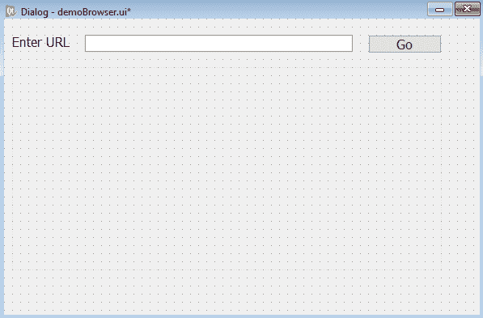

7.  下一步是将`QWidget`升级为`QWebEngineView`，因为要显示网页，需要`QWebEngineView`。
8.  通过右键单击`QWidget`对象并选择“升级到”。。。弹出菜单中的选项。
9.  在出现的对话框中，将基类名称选项保留为默认值 QWidget。
10.  在提升的类名框中输入`QWebEngineView`，在头文件框中输入`PyQt5.QtWebEngineWidgets`。

11.  选择升级按钮，将 QWidget 升级到`QWebEngineView`类，如下图所示：


使用 Qt Designer 创建的用户界面存储在一个`.ui`文件中，该文件是一个 XML 文件，需要转换为 Python 代码。

12.  要进行转换，需要打开命令提示符窗口并导航到保存文件的文件夹，然后发出以下命令：

```py
C:\Pythonbook\PyQt5>pyuic5 demoBrowser.ui -o demoBrowser.py
```

您可以在本书的源代码包中看到自动生成的 Python 脚本文件`demoBrowser.py`。

13.  将前面的代码视为头文件，并将其导入到将从中调用其用户界面设计的文件中。

14.  让我们创建另一个名为`callBrowser.pyw`的 Python 文件，并将`demoBrowser.py`代码导入其中：

```py
import sys
from PyQt5.QtCore import QUrl
from PyQt5.QtWidgets import QApplication, QDialog
from PyQt5.QtWebEngineWidgets import QWebEngineView
from demoBrowser import *
class MyForm(QDialog):
    def __init__(self):
        super().__init__()
        self.ui = Ui_Dialog()
        self.ui.setupUi(self)
        self.ui.pushButtonGo.clicked.connect(self.dispSite)
        self.show()
    def dispSite(self):
        self.ui.widget.load(QUrl(self.ui.lineEditURL.text()))
if __name__=="__main__":
    app = QApplication(sys.argv)
    w = MyForm()
    w.show()
    sys.exit(app.exec_())
```

# 它是如何工作的。。。

在`demoBrowser.py`文件中，创建了一个名为顶级对象的类，名为`Ui_ prepended`。也就是说，对于顶级对象`Dialog`，将创建`Ui_Dialog`类并存储小部件的接口元素。该类包括两种方法，`setupUi()`和`retranslateUi()`。`setupUi()`方法创建用于在 Qt Designer 中定义用户界面的小部件。此外，小部件的属性在该方法中设置。`setupUi()`方法只接受一个参数，它是应用的顶级小部件，是`QDialog`的一个实例。`retranslateUi()`方法转换接口。

在`callBrowser.pyw`文件中，您可以看到按钮小部件的 click（）事件连接到`dispSite`方法；在 Line Edit 小部件中输入 URL 后，当用户单击按钮时，`dispSite`方法将被调用。

`dispSite()`方法调用`QWidget`类的`load()`方法。回想一下，`QWidget`对象被提升为用于查看网页的`QWebEngineView`类。`QWebEngineView`类的`load()`方法随`lineEditURL`对象中输入的 URL 一起提供，因此，指定 URL 的网页将打开或加载到`QWebEngine`小部件中。

在运行应用时，您会得到一个空行编辑框和一个按钮小部件。在 Line Edit 小部件中输入所需的 URL 并单击 Go 按钮，您将发现网页在`QWebEngineView`小部件中打开，如以下屏幕截图所示：


# 创建服务器端应用

网络在现代生活中扮演着重要角色。我们需要了解如何在两台机器之间建立通信。当两台机器通信时，一台通常是服务器，另一台是客户端。客户机向服务器发送请求，服务器通过服务客户机发出的请求进行响应

在这个配方中，我们将创建一个客户机-服务器应用，其中在客户机和服务器之间建立连接，并且每个应用都能够将文本消息传输给另一个应用。也就是说，将同时执行两个应用，并且在一个应用中编写的文本将出现在另一个应用中。

# 怎么做。。。

让我们首先创建一个服务器应用，如下所示：

1.  基于对话框创建应用，而不使用按钮模板。
2.  通过拖放标签、文本编辑、行编辑和按钮小部件，将`QLabel`、`QTextEdit`、`QLineEdit`和`QPushButton`添加到表单中。

2.  将标签小部件的文本属性设置为`Server`，以指示这是服务器应用。
3.  将按钮小部件的文本属性设置为`Send`。
4.  将文本编辑小部件的 objectName 属性设置为`textEditMessages`。
5.  将行编辑小部件的 objectName 属性设置为`lineEditMessage`。
6.  将按钮小部件设置为`pushButtonSend`。
7.  将应用另存为`demoServer.ui`。表单现在将显示，如以下屏幕截图所示：

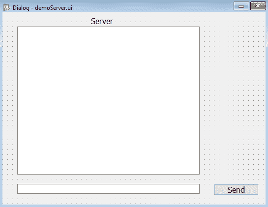

使用 Qt Designer 创建的用户界面存储在一个`.ui`文件中，该文件是一个 XML 文件，需要转换为 Python 代码。生成的文件`demoServer.py`的代码可以在本书的源代码包中看到。

# 它是如何工作的。。。

`demoServer.py`文件将被视为头文件，并将导入另一个 Python 文件，该文件将使用头文件的 GUI，并将数据从服务器传输到客户端，反之亦然。但在此之前，让我们为客户端应用创建一个 GUI。客户端应用的 GUI 与服务器应用的 GUI 完全相同，唯一的区别是此应用顶部的标签小部件将显示文本客户端。

`demoServer.py`文件是我们拖放到表单上的 GUI 小部件生成的 Python 脚本

要在服务器和客户端之间建立连接，我们需要一个套接字对象。要创建套接字对象，需要提供以下两个参数：

*   **套接字地址：**套接字地址使用某些地址族表示。每个地址族都需要某些参数来建立连接。我们将在此应用中使用`AF_INET`地址族。`AF_INET`地址族需要一对（主机、端口）来建立连接，其中参数`host`是主机名，可以是字符串格式、internet 域表示法或 IPv4 地址格式和参数；`port`是一个整数，表示用于通信的端口号。
*   **插座类型**：插座类型由几个常量表示：`SOCK_STREAM`、`SOCK_DGRAM`、`SOCK_RAW`、`SOCK_RDM`、`SOCK_SEQPACKET`。在此应用中，我们将使用最常用的插座类型`SOCK_STREAM`。

应用中使用`setsockopt()`方法设置给定套接字选项的值。它包括以下两个基本参数：

*   `SOL_SOCKET`：此参数为套接字层本身。它用于协议独立选项。
*   `SO_REUSEADDR`：此参数允许其他套接字`bind()`连接到此端口，除非该端口已经绑定了活动侦听套接字。

您可以在前面的代码中看到创建了一个`ServerThread`类，它继承了 Python 线程模块的`Thread`类。当定义了`TCP_IP`和`TCP_HOST`变量且`tcpServer`与这些变量绑定时，`run()`函数被重写。

此后，服务器等待查看是否建立了任何客户端连接。对于每个新的客户端连接，服务器在`while`循环中创建一个新的`ClientThread`。这是因为为每个客户端创建新线程不会阻止服务器的 GUI 功能。最后，连接螺纹。

# 建立客户机-服务器通信

在本教程中，我们将学习创建客户端，并了解它如何向服务器发送消息。其主要思想是了解消息是如何发送的，服务器如何侦听端口，以及如何在两者之间建立通信。

# 怎么做。。。

为了向服务器发送消息，我们将使用行编辑和按钮小部件。单击按钮后，行编辑小部件中写入的消息将传递给服务器。以下是创建客户端应用的分步过程：

1.  基于对话框创建另一个应用，而不使用按钮模板。
2.  通过拖放表单上的标签、文本编辑、行编辑和按钮小部件，将`QLabel`、`QTextEdit`、`QLineEdit`和`QPushButton`添加到表单中。
3.  将标签小部件的文本属性设置为`Client`。
4.  将按钮小部件的文本属性设置为`Send`。
5.  将文本编辑小部件的 objectName 属性设置为`textEditMessages`。
6.  将行编辑小部件的 objectName 属性设置为`lineEditMessage`。
7.  将按钮小部件设置为`pushButtonSend`。
8.  将应用按名称保存为`demoClient.ui`。

该表单现在将显示在以下屏幕截图中：

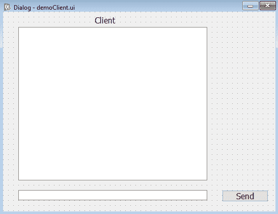

使用 Qt Designer 创建的用户界面存储在一个`.ui`文件中，该文件是一个 XML 文件，需要转换为 Python 代码。自动生成的文件`demoClient.py`的代码可以在本书的源代码包中看到。要使用`demoClient.py`文件中创建的 GUI，需要将其导入另一个 Python 文件，该文件将使用 GUI，并将数据从服务器传输到客户端，反之亦然。

9.  创建另一个名为`callServer.pyw`的 Python 文件，并将`demoServer.py`代码导入其中，`callServer.pyw`脚本中的代码如下所示：

```py
import sys, time
from PyQt5 import QtGui
from PyQt5 import QtCore
from PyQt5.QtWidgets import QApplication, QDialog
from PyQt5.QtCore import QCoreApplication
import socket
from threading import Thread
from socketserver import ThreadingMixIn
conn=None
from demoServer import *
class Window(QDialog):
    def __init__(self):
        super().__init__()
        self.ui = Ui_Dialog()
        self.ui.setupUi(self)
        self.textEditMessages=self.ui.textEditMessages
        self.ui.pushButtonSend.clicked.connect(self.dispMessage)
        self.show()

    def dispMessage(self):
        text=self.ui.lineEditMessage.text()
        global conn
        conn.send(text.encode("utf-8"))
        self.ui.textEditMessages.append("Server:   
        "+self.ui.lineEditMessage.text())
        self.ui.lineEditMessage.setText("")
class ServerThread(Thread):
    def __init__(self,window):
        Thread.__init__(self)
        self.window=window
    def run(self):
        TCP_IP = '0.0.0.0'
        TCP_PORT = 80
        BUFFER_SIZE = 1024
        tcpServer = socket.socket(socket.AF_INET,  
        socket.SOCK_STREAM)
        tcpServer.setsockopt(socket.SOL_SOCKET,         
        socket.SO_REUSEADDR, 1)
        tcpServer.bind((TCP_IP, TCP_PORT))
        threads = []
        tcpServer.listen(4)
        while True:
            global conn
            (conn, (ip,port)) = tcpServer.accept()
            newthread = ClientThread(ip,port,window)
            newthread.start()
            threads.append(newthread)
        for t in threads:
            t.join()
class ClientThread(Thread):
    def __init__(self,ip,port,window):
        Thread.__init__(self)
        self.window=window
        self.ip = ip
        self.port = port
    def run(self):
        while True :
            global conn
            data = conn.recv(1024)
            window.textEditMessages.append("Client: 
            "+data.decode("utf-8"))

if __name__=="__main__":
    app = QApplication(sys.argv)
    window = Window()
    serverThread=ServerThread(window)
    serverThread.start()
    window.exec()
    sys.exit(app.exec_())
```

# 它是如何工作的。。。

在`ClientThread`类中，`run`函数被重写。在`run`功能中，每个客户端等待从服务器接收的数据，并在文本编辑小部件中显示该数据。一个`window`类对象被传递给`ServerThread`类，该类将该对象传递给`ClientThread`，然后`ClientThread`使用该对象访问写入行编辑元素的内容。

接收到的数据是解码的，因为接收到的数据是字节形式的，必须使用 UTF-8 编码将字节转换为字符串。

我们在上一节中生成的`demoClient.py`文件需要作为头文件处理，并且需要导入到另一个 Python 文件中，该文件将使用头文件的 GUI，并将数据从客户端传输到服务器，反之亦然。那么，让我们创建另一个名为`callClient.pyw`的 Python 文件，并将`demoClient.py`代码导入其中：

```py
import sys
from PyQt5.QtWidgets import QApplication, QDialog
import socket
from threading import Thread
from socketserver import ThreadingMixIn
from demoClient import *
tcpClientA=None
class Window(QDialog):
    def __init__(self):
        super().__init__()
        self.ui = Ui_Dialog()
        self.ui.setupUi(self)
        self.textEditMessages=self.ui.textEditMessages
        self.ui.pushButtonSend.clicked.connect(self.dispMessage)
        self.show()
    def dispMessage(self):
        text=self.ui.lineEditMessage.text()
        self.ui.textEditMessages.append("Client:  
        "+self.ui.lineEditMessage.text())
        tcpClientA.send(text.encode())
        self.ui.lineEditMessage.setText("")
class ClientThread(Thread):
    def __init__(self,window):
        Thread.__init__(self)
        self.window=window
    def run(self):
        host = socket.gethostname()
        port = 80
        BUFFER_SIZE = 1024
        global tcpClientA
        tcpClientA = socket.socket(socket.AF_INET, 
        socket.SOCK_STREAM)
        tcpClientA.connect((host, port))
        while True:
            data = tcpClientA.recv(BUFFER_SIZE)
            window.textEditMessages.append("Server: 
            "+data.decode("utf-8"))
            tcpClientA.close()
if __name__=="__main__":
    app = QApplication(sys.argv)
    window = Window()
    clientThread=ClientThread(window)
    clientThread.start()
    window.exec()
    sys.exit(app.exec_())
```

`ClientThread`类是继承`Thread`类并重写`run`函数的类。在`run`函数中，通过调用`socket`类上的`hostname`方法获取服务器的 IP 地址；并且，使用端口`80`，客户端尝试连接到服务器。一旦与服务器建立了连接，客户机就会尝试在 while 循环中从服务器接收数据。

从服务器接收数据时，数据从字节格式转换为字符串格式，并显示在文本编辑小部件中。

我们需要运行这两个应用来查看客户机-服务器通信。在运行`callServer.pyw`文件时，您将获得以下屏幕截图左侧显示的输出，在运行`callClient.pyw`文件时，您将获得右侧显示的输出。两者是相同的；只有顶部的标签才能区分它们：


用户可以在底部的行编辑框中键入文本，然后按发送按钮。按下“发送”按钮时，在“行编辑”小部件中输入的文本将显示在服务器和客户端应用的文本编辑框中。文本前缀为`Server:`，表示文本是从服务器发送的，如下图所示：


类似地，如果在客户端应用的 Line Edit 小部件中写入文本，然后按下 Send 按钮，则文本将出现在两个应用的 text Edit 小部件中。文本将以`Client:`作为前缀，表示文本已从客户端发送，如以下屏幕截图所示：


# 创建可停靠和浮动的登录表单

在此配方中，我们将学习创建一个登录表单，该表单将要求用户的电子邮件地址和密码进行身份验证。此登录形式不同于通常的登录形式，因为它是一种可停靠形式。也就是说，您可以将此登录窗体停靠到窗口顶部、左侧、右侧和底部的任意一侧，甚至可以将其用作可浮动窗体。这个可停靠的登录表单将使用 Dock 小部件创建，因此让我们快速了解 Dock 小部件。

# 准备

要创建一组可分离的小部件或工具，您需要一个 Dock 小部件。Dock 小部件是用`QDockWidget`类创建的，它是一个容器，顶部有一个标题栏和按钮来调整大小。Dock 小部件包含一组小部件或工具，可以关闭、停靠在 Dock 区域或浮动并放置在桌面上的任何位置。停靠窗口小部件可以停靠在不同的停靠区域，如`LeftDockWidgetArea`、`RightDockWidgetArea`、`TopDockWidgetArea`和`BottomDockWidgetArea`。`TopDockWidgetArea`停靠区位于工具栏下方。您还可以限制停靠窗口小部件的停靠区域。执行此操作时，Dock 小部件只能停靠到指定的停靠区域。将停靠窗口拖出停靠区域时，它将成为自由浮动窗口。

以下是控制 Dock 小部件移动及其标题栏和其他按钮外观的属性：

| **物业** | **说明** |
| `DockWidgetClosable` | 使 Dock 小部件可关闭。 |
| `DockWidgetMovable` | 使停靠窗口小部件在停靠区域之间移动。 |
| `DockWidgetFloatable` | 使 Dock 小部件可浮动，也就是说，Dock 小部件可以从主窗口分离并浮动在桌面上。 |
| `DockWidgetVerticalTitleBar` | 在 Dock 小部件的左侧显示垂直标题栏。 |
| `AllDockWidgetFeatures` | 它打开诸如`DockWidgetClosable`、`DockWidgetMovable`和`DockWidgetFloatable`等属性，也就是说，Dock 小部件可以关闭、移动或浮动。 |
| `NoDockWidgetFeatures` | 如果选中，则无法关闭、移动或浮动 Dock 小部件。 |

为了为这个配方制作一个可停靠的登录表单，我们将使用停靠小部件和其他一些小部件。让我们看一下执行此操作的步骤。

# 怎么做。。。

让我们在 Dock 小部件中创建一个小的登录表单，它将提示用户输入他们的电子邮件地址和密码。由于可停靠，此登录表单可以在屏幕上的任何位置移动，并且可以浮动。以下是创建此应用的步骤：

1.  启动 Qt Designer 并创建新的主窗口应用。
2.  将 Dock 小部件拖放到窗体上。
3.  拖放您希望在 dock 区域中可用的小部件或作为 dock 小部件中的浮动窗口。
4.  在 Dock 小部件上拖放三个标签小部件、两行编辑小部件和一个按钮小部件。
5.  将三个标签小部件的文本属性设置为`Sign In`、`Email Address`和`Password`。

6.  将按钮小部件的文本属性设置为`Sign In`。
7.  我们不会设置 Line Edit 和 Push Button 小部件的 objectName 属性，也不会为 Push Button 小部件提供任何代码，因为此应用的目的是了解 Dock 小部件的工作方式。
8.  将应用另存为`demoDockWidget.ui`

该表单将显示在以下屏幕截图中：


9.  要启用 Dock 小部件中的所有功能，请选择它并在属性编辑器窗口的“功能”部分中检查其 AllDockWidgetFeatures 属性，如以下屏幕截图所示：


在前面的屏幕截图中，AllDockWidgetFeatures 属性使 Dock 小部件可关闭、可在 Dock 中移动，并可在桌面上的任何位置浮动。如果选择了 NoDockWidgetFeatures 属性，则会自动取消选中 features 部分中的所有其他属性。这意味着所有按钮都将从 Dock 小部件中消失，您将无法关闭或移动它。如果希望 Dock 小部件在应用启动时显示为可浮动的，请在“属性编辑器”窗口的“功能”部分上方检查浮动属性。

查看以下屏幕截图，其中描述了 Dock 小部件的各种功能和限制：


执行以下步骤，将所需的功能和约束应用于 Dock 小部件：

1.  选中 allowedAreas 部分中的 AllDockWidgetAreas 选项，以启用停靠小部件停靠在所有左侧、右侧、顶部和底部停靠小部件区域中。
2.  另外，通过使用属性编辑器窗口中的 windowTitle 属性，将停靠窗口的标题设置为可停靠登录表单，如前一屏幕截图所示。

3.  检查 Dock 属性，因为它是使 Dock 小部件可停靠的基本属性。如果未选中 docked 属性，则 Dock 小部件无法停靠到任何允许的区域。
4.  保留 dockWidgetArea 属性的默认值 LeftDockWidgetArea。dockWidgetArea 属性确定启动应用时希望 Dock 小部件显示为停靠的位置。dockWidgetArea 属性的 LeftDockWidgetArea 值将使 Dock 小部件首先显示为停靠在左侧 Dock 小部件区域中。如果在 allowedAreas 部分中设置了 NoDockWidgetArea 属性，则 allowedAreas 部分中的所有其他属性将自动取消选中。因此，您可以将停靠窗口移动到桌面上的任何位置，但不能将其停靠在主窗口模板的停靠区域。使用 Qt Designer 创建的用户界面存储在一个`.ui`文件中，该文件是一个 XML 文件，需要转换为 Python 代码。在 XML 文件上应用`pyuic5`命令行实用程序时，生成的文件是一个 Python 脚本文件`demoDockWidget.py`。您可以在本书的源代码包中看到生成的`demoDockWidget.py`文件的代码。
5.  将`demoDockWidget.py`文件中的代码视为头文件，并将其导入到您将调用其用户界面设计的文件中。
6.  创建另一个名为`callDockWidget.pyw`的 Python 文件，并将`demoDockWidget.py`代码导入其中：

```py
import sys
from PyQt5.QtWidgets import QMainWindow, QApplication
from demoDockWidget import *
class AppWindow(QMainWindow):
    def __init__(self):
        super().__init__()
        self.ui = Ui_MainWindow()
        self.ui.setupUi(self)
        self.show()
if __name__=="__main__":
    app = QApplication(sys.argv)
    w = AppWindow()
    w.show()
    sys.exit(app.exec_())
```

# 它是如何工作的。。。

正如您在前面的代码中所看到的，将导入必要的模块。创建了一个继承自基类`QMainWindow`的`AppWindow`类。调用了`QMainWindow`的默认构造函数。

因为每个 PyQt5 应用都需要一个应用对象，所以在前面的代码中，通过调用`QApplication()`方法创建了一个名为 app 的应用对象。为了向应用传递命令行参数和其他外部属性，`sys.argv`参数作为参数传递给`QApplication()`方法。`sys.argv`参数包含命令行参数和其他外部属性（如果有）。为了显示界面中定义的小部件，创建了一个名为`w`的`AppWindow`类实例，并对其调用了`show()`方法。要退出应用并将代码返回到 Python 解释器，该解释器可能用于错误处理，需要调用`sys.exit()`方法。

当应用被执行时，您会得到一个默认停靠在左侧可停靠区域的停靠小部件，如下面的屏幕截图所示。这是因为您已将`LeftDockWidgetArea`值分配给 Dock 小部件的`dockWidgetArea`属性：

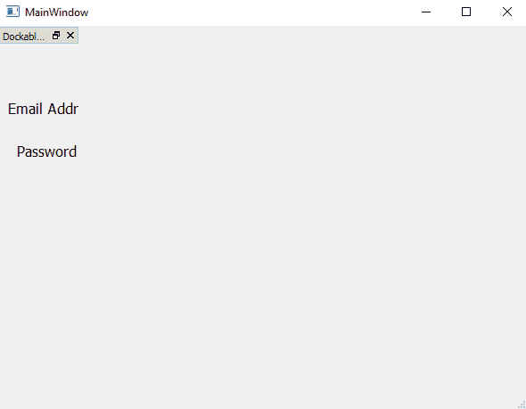

Dock 小部件中的小部件并不完全可见，因为默认的左侧和可停靠区域比 Dock 小部件中放置的小部件窄。因此，您可以拖动 Dock 小部件的右边框，使所有包含的小部件可见，如以下屏幕截图所示：


您可以将小部件拖动到任何区域。如果拖动到顶部，它将停靠在`TopDockWidgetArea`停靠区域，如下图所示：


同样，当 Dock 小部件向右拖动时，它将停靠在`RightDockWidgetArea`中

您可以将 Dock 小部件拖动到主窗口模板之外，使其成为独立的浮动窗口。Dock 窗口小部件将显示为一个独立的浮动窗口，可以移动到桌面上的任何位置：


# 多文档接口

在本教程中，我们将学习如何创建一个一次显示多个文档的应用。我们不仅能够管理多个文档，还将学习以不同格式排列文档。我们将能够使用称为“多文档接口”的概念管理多个文档，因此让我们来快速了解一下这一点。

# 准备

通常，一个应用为每个主窗口提供一个文档，这类应用称为**单文档接口**（**SDI**应用。顾名思义，**多文档界面**（**MDI**应用可以显示多个文档。MDI 应用由主窗口、菜单栏、工具栏和中心空间组成。中央空间可以显示多个文档，每个文档都可以通过单独的子窗口小部件进行管理；在 MDI 中，可以显示多个文档，每个文档都显示在自己的窗口中。这些子窗口也称为子窗口。

MDI 是通过使用`MdiArea`小部件实现的。`MdiArea`小部件提供一个显示子窗口或子窗口的区域。子窗口有一个标题和按钮来显示、隐藏和最大化其大小。每个子窗口都可以显示单个文档。通过设置`MdiArea`小部件的相应属性，子窗口可以以级联或平铺模式排列。`MdiArea`小部件是`QMdiArea`类的实例，子窗口是`QMdiSubWindow`的实例。

以下是`QMdiArea`提供的方法：

*   `subWindowList()`：此方法返回 MDI 区域中所有子窗口的列表。返回的列表按照`WindowOrder()`功能设置的顺序排列。
*   `WindowOrder`：此静态变量设置子窗口列表的排序标准。以下是可分配给此静态变量的有效值：
    *   `CreationOrder`：窗口按创建顺序返回。这是默认顺序。
    *   `StackingOrder`：窗口按堆叠顺序返回，最上面的窗口在列表中最后一个。
    *   `ActivationHistoryOrder`：窗口按激活顺序返回。
*   `activateNextSubWindow()`：此方法将焦点设置到子窗口列表中的下一个窗口。当前窗口顺序决定要激活的下一个窗口。
*   `activatePreviousSubWindow()`：此方法将焦点设置到子窗口列表中的上一个窗口。当前窗口顺序决定要激活的上一个窗口。
*   `cascadeSubWindows()`：此方法以级联方式排列子窗口。
*   `tileSubWindows()`：此方法以平铺方式排列子窗口。
*   `closeAllSubWindows()`：此方法关闭所有子窗口。
*   `setViewMode()`：此方法设置 MDI 区域的查看模式。子窗口可以以两种模式查看，即子窗口视图和选项卡式视图：
*   子窗口视图：此方法显示带有窗口边框的子窗口（默认）。如果以平铺方式排列，则可以查看多个子窗口的内容。它也由一个常量值`0`表示。
*   选项卡式视图：在选项卡栏中显示带有选项卡的子窗口。一次只能看到一个子窗口内容的内容。它也由一个常量值`1`表示。

# 怎么做。。。

让我们创建一个由两个文档组成的应用，每个文档都将通过其各自的子窗口显示。我们将学习如何根据需要排列和查看这些子窗口：

1.  启动 Qt Designer 并创建新的主窗口应用。
2.  将`MdiArea`小部件拖放到表单上。
3.  右键单击小部件并从上下文菜单中选择 Add Subwindow（添加子窗口），将子窗口添加到`MdiArea`小部件。

将子窗口添加到`MdiArea`小部件时，小部件显示为黑色背景，如以下屏幕截图所示：


4.  让我们再次右键单击`MdiArea`小部件，并向其添加一个子窗口。
5.  要知道哪个是第一个子窗口，哪个是第二个子窗口，请将标签小部件拖放到每个子窗口上。
6.  将放置在第一个子窗口中的标签小部件的文本属性设置为`First subwindow`。

7.  将放置在第二个子窗口中的标签小部件的文本属性设置为`Second subwindow`，如下图所示：

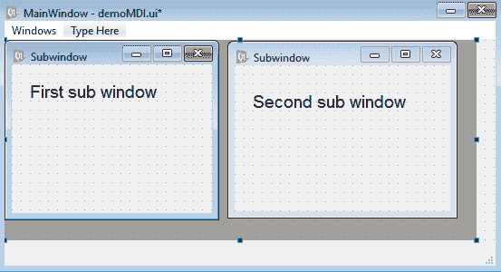

`MdiArea`小部件以以下两种模式显示放置在其子窗口中的文档：

*   子窗口视图：这是默认的视图模式。在此视图模式下，子窗口可以级联或平铺方式排列。以平铺方式排列子窗口时，可以同时看到多个子窗口的内容。
*   选项卡式视图：在此模式下，选项卡栏中显示多个选项卡。选择选项卡后，将显示与其关联的子窗口。一次只能看到一个子窗口的内容。

8.  要通过菜单选项激活子窗口视图和选项卡式视图模式，请双击菜单栏菜单中的“此处键入”占位符，并向其添加两个条目：“子窗口视图”和“选项卡式视图”。

此外，要查看子窗口在以层叠和平铺方式排列时的显示方式，请在菜单栏中添加两个菜单项“层叠视图”和“平铺视图”，如以下屏幕截图所示：

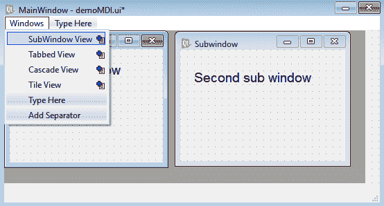

9.  将应用另存为`demoMDI.ui`。使用 Qt Designer 创建的用户界面存储在一个`.ui`文件中，该文件是一个 XML 文件，需要转换为 Python 代码。在`pyuic5`命令行实用程序的应用中，`.ui`（XML）文件将转换为 Python 代码：

```py
 C:\Pythonbook\PyQt5>pyuic5 demoMDI.ui -o demoMDI.py.
```

您可以在本书的源代码包中看到生成的 Python 代码`demoMDI.py`。

10.  将`demoMDI.py`文件中的代码视为头文件，然后将其导入到调用其用户界面设计的文件中。前面代码中的用户界面设计包括`MdiArea`以显示在其中创建的子窗口及其各自的小部件。我们将要创建的 Python 脚本将包含菜单选项的代码，用于执行不同的任务，例如层叠和平铺子窗口，将视图模式从子窗口视图更改为选项卡式视图，反之亦然。让我们将该 Python 脚本命名为`callMDI.pyw`并将`demoMDI.py`代码导入其中：

```py
import sys
from PyQt5.QtWidgets import QMainWindow, QApplication, QAction, QFileDialog
from demoMDI import *
class MyForm(QMainWindow):
    def __init__(self):
        super().__init__()
        self.ui = Ui_MainWindow()
        self.ui.setupUi(self)
        self.ui.mdiArea.addSubWindow(self.ui.subwindow)
        self.ui.mdiArea.addSubWindow(self.ui.subwindow_2)
        self.ui.actionSubWindow_View.triggered.connect
        (self.SubWindow_View)
        self.ui.actionTabbed_View.triggered.connect(self.
        Tabbed_View)
        self.ui.actionCascade_View.triggered.connect(self.
        cascadeArrange)
        self.ui.actionTile_View.triggered.connect(self.tileArrange)
        self.show()
    def SubWindow_View(self):
        self.ui.mdiArea.setViewMode(0)
    def Tabbed_View(self):
        self.ui.mdiArea.setViewMode(1)
    def cascadeArrange(self):
        self.ui.mdiArea.cascadeSubWindows()
    def tileArrange(self):
        self.ui.mdiArea.tileSubWindows()
if __name__=="__main__":
    app = QApplication(sys.argv)
    w = MyForm()
    w.show()
    sys.exit(app.exec_())
```

# 它是如何工作的。。。

在前面的代码中，您可以看到具有默认 objectName 属性的两个子窗口`subwindow`和`subwindow_2`被添加到`MdiArea`小部件中。之后，具有 objectName 属性的四个菜单选项`actionSubWindow_View`、`actionTabbed_View`、`actionCascade_View`和`actionTile_View`分别连接到四个方法`SubWindow_View`、`Tabbed_View`、`cascadeArrange`和`tileArrange`。因此，当用户选择子窗口视图菜单选项时，将调用`SubWindow_View`方法。在`SubWindow_View`方法中，通过将`0`常量值传递给`MdiArea`小部件的`setViewMode`方法来激活子窗口视图模式。“子窗口”视图显示带有窗框的子窗口。

同样，当用户选择选项卡式视图菜单选项时，将调用`Tabbed_View`方法。在`Tabbed_View`方法中，通过将`1`常量值传递给`MdiArea`小部件的`setViewMode`方法，激活选项卡式视图模式。选项卡式视图模式在选项卡栏中显示选项卡，单击选项卡时，将显示关联的子窗口。

当选择“层叠视图”菜单选项时，将调用`cascadeArrange`方法，该方法依次调用`MdiArea`小部件的`cascadeSubWindows`方法以层叠形式排列子窗口。

选择“平铺视图”菜单选项时，将调用`tileArrange`方法，该方法反过来调用`MdiArea`小部件的`tileSubWindows`方法，以平铺形式排列子窗口。

在运行应用时，子窗口最初以收缩模式出现在`MdiArea`小部件中，如下面的屏幕截图所示。您可以看到子窗口及其标题以及最小化、最大化和关闭按钮：


可以将其边框拖动到所需的大小。从 Windows 菜单中选择第一个窗口时，子窗口变为活动窗口；选择第二个窗口时，下一个子窗口将变为活动窗口。活动子窗口将显示更亮的标题和边界。在下面的屏幕截图中，您可以注意到第二个子窗口处于活动状态。可以拖动任何子窗口的边界以增大或减小其大小。您还可以最小化一个子窗口并拖动另一个子窗口的边界以占据`MdiArea`小部件的整个宽度。如果在任何子窗口中选择“最大化”，则会占用`MdiArea`的所有空间，使其他子窗口不可见：


选择 Cascade 时，子窗口以 Cascade 模式排列，如以下屏幕截图所示。如果窗口在级联模式下最大化，则顶部子窗口将占据整个`MdiArea`窗口小部件，隐藏其后面的其他子窗口，如以下屏幕截图所示：

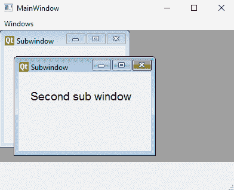

选择平铺按钮时，子窗口将展开并平铺。两个子窗口都会均匀扩展以覆盖整个工作区，如以下屏幕截图所示：

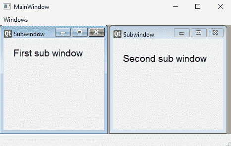

选择选项卡式视图按钮时，`MdiArea`小部件将从子窗口视图更改为选项卡式视图。您可以选择任何子窗口的选项卡使其处于活动状态，如以下屏幕截图所示：

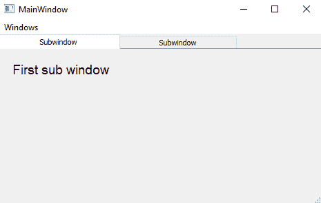

# 使用 Tab 小部件在部分中显示信息

在这个应用中，我们将制作一个小购物车，它将在一个选项卡中显示某些要销售的产品；从第一个选项卡中选择所需产品后，当用户选择第二个选项卡时，将提示他们输入首选付款选项。第三个选项卡将要求用户输入交付产品的地址。

我们将使用 Tab 小部件使我们能够选择并以块的形式填充所需的信息，所以您一定想知道，什么是 Tab 小部件？

当某些信息被划分为小部分，并且您希望显示用户所需部分的信息时，则需要使用 Tab 小部件。在选项卡小部件容器中，有许多选项卡，当用户选择任何选项卡时，将显示分配给该选项卡的信息。

# 怎么做。。。

以下是创建一个应用的分步过程，该应用使用选项卡以块的形式显示信息：

1.  让我们基于对话框创建一个新的应用，而不使用按钮模板。
2.  将 Tab 小部件拖放到表单上。将 Tab 小部件拖到对话框上时，它会显示两个默认选项卡按钮，分别标记为 Tab1 和 Tab2，如以下屏幕截图所示：


3.  您可以通过添加新的选项卡按钮，向选项卡小部件添加更多选项卡按钮，并删除现有按钮；右键单击任一选项卡按钮，然后从弹出的菜单中选择“插入页面”。您将看到两个子选项，在当前页之后和当前页之前。

4.  选择“在当前页面之后”子选项以在当前选项卡之后添加新选项卡。新选项卡将具有默认文本页面，您可以随时更改该页面。我们将要制作的应用由以下三个选项卡组成：

*   第一个选项卡显示某些产品及其价格。用户可以从第一个选项卡中选择任意数量的产品，然后单击“添加到购物车”按钮。
*   选择第二个选项卡时，将显示所有付款选项。用户可以选择通过借记卡、信用卡、网上银行或货到付款。
*   选中第三个选项卡后，将提示用户输入送货地址：客户的完整地址以及州、国家和联系电话。

我们要做的第一项任务是更改选项卡的默认文本：

1.  使用选项卡小部件的 currentTabText 属性，更改每个选项卡按钮上显示的文本。
2.  将第一个选项卡按钮的文本属性设置为`Product Listing`，将第二个选项卡按钮的文本属性设置为`Payment Method`。
3.  要添加新选项卡按钮，请右键单击“付款方式”选项卡，然后从出现的关联菜单中选择“插入页面”。
4.  从显示的两个选项“当前页面之后”和“当前页面之前”中，选择“当前页面之后”以在“付款方式”选项卡之后添加新选项卡。新选项卡将具有默认文本页。
5.  使用 currentTabText 属性，将其文本更改为`Delivery Address`。
6.  通过选择并拖动选项卡小部件的节点来展开选项卡小部件，以在选项卡按钮下方提供一个空格，如以下屏幕截图所示：


7.  选择每个选项卡按钮，并将所需的小部件放到所提供的空白空间中。例如，将四个复选框小部件放到第一个选项卡按钮 Product Listing 上，以显示可供销售的商品。
8.  在表单上放置一个按钮小部件。
9.  将四个复选框的文本属性更改为`Cell Phone $150`、`Laptop $500`、`Camera $250`和`Shoes $200`。
10.  将按钮小部件的文本属性更改为`Add to Cart`，如下图所示：

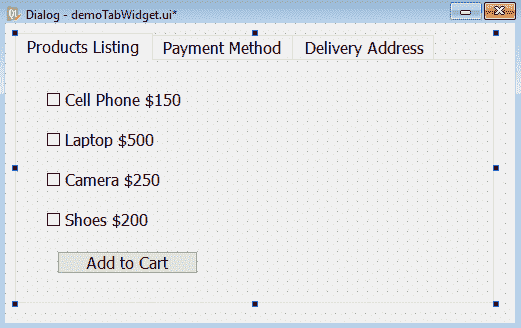

11.  同样，要提供不同的付款方式，请选择第二个选项卡，并在可用空间中放置四个单选按钮。

12.  将四个单选按钮的文本属性设置为`Debit Card`、`Credit Card`、`Net Banking`和`Cash On Delivery`，如下图所示：


13.  选择第三个选项卡，拖放几行编辑小部件，提示用户提供交付地址。
14.  将六个标签和六行编辑小部件拖放到表单上。
15.  将标签小部件的文本属性设置为`Address 1`、`Address 2`、`State`、`Country`、`Zip Code`和`Contact Number`。每个标签小部件前面的行编辑小部件将用于获取交付地址，如以下屏幕截图所示：

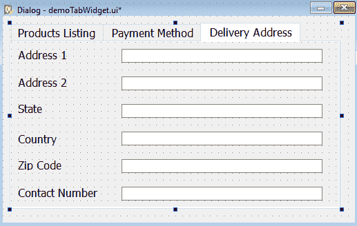

16.  将应用另存为`demoTabWidget.ui`。

17.  使用 Qt Designer 创建的用户界面存储在一个`.ui`文件中，该文件是一个 XML 文件，需要转换为 Python 代码。要进行转换，需要打开命令提示符窗口，导航到保存文件的文件夹，然后发出以下命令：

```py
C:PythonbookPyQt5>pyuic5 demoTabWidget.ui -o demoTabWidget.py
```

生成的 Python 脚本文件`demoTabWidget.py`的代码可以在本书的源代码包中看到。在自动生成的代码`demoTablWidget.py`中创建的用户界面设计通过将其导入另一个 Python 脚本来使用

18.  创建另一个名为`callTabWidget.pyw`的 Python 文件，并将`demoTabWidget.py`代码导入其中：

```py
import sys
from PyQt5.QtWidgets import QDialog, QApplication
from demoTabWidget import *
class MyForm(QDialog):
    def __init__(self):
        super().__init__()
        self.ui = Ui_Dialog()
        self.ui.setupUi(self)
        self.show()
if __name__=="__main__":
    app = QApplication(sys.argv)
    w = MyForm()
    w.show()
    sys.exit(app.exec_())
```

# 它是如何工作的。。。

正如您在`callTabWidget.pyw`中所看到的，必要的模块被导入。`MyForm`类是从基类`QDialog`创建和继承的。调用了`QDialog`的默认构造函数。

通过`QApplication()`方法创建名为`app`的应用对象。每个 PyQt5 应用都必须创建一个应用对象。创建应用对象时，`sys.argv`参数被传递给`QApplication()`方法。`sys.argv`参数包含来自命令行的参数列表，有助于传递和控制脚本的启动属性。在此之后，将创建名为`w`的`MyForm`类实例。在实例上调用`show()`方法，该方法将在屏幕上显示小部件。`sys.exit()`方法确保了一个干净的出口，释放了内存资源。

执行应用时，您会发现默认情况下选择了第一个选项卡 Products Listing，并且该选项卡中指定的可供销售的产品显示在以下屏幕截图中：


类似地，在选择其他选项卡、付款方式和交货地址时，您将看到小部件提示用户选择所需的付款方式并输入交货地址。

# 创建自定义菜单栏

一个大的应用通常被分解成小的、独立的、可管理的模块。可以通过制作不同的工具栏按钮或菜单项来调用这些模块。也就是说，我们可以在单击菜单项时调用模块。我们已经在不同的软件包中看到了文件菜单、编辑菜单等，所以让我们学习如何创建自己的自定义菜单栏。

在本食谱中，我们将学习创建一个显示特定菜单项的菜单栏。我们将学习添加菜单项，向菜单项添加子菜单项，在菜单项之间添加分隔符，向菜单项添加快捷方式和工具提示，等等。我们还将学习向这些菜单项添加操作，以便在单击任何菜单项时，都会发生特定的操作。

我们的菜单栏将包括两个菜单，绘制和编辑。“绘制”菜单将包含四个菜单项：“绘制圆”、“绘制矩形”、“绘制线”和“属性”。“属性”菜单项将包含两个子菜单项“页面设置”和“设置密码”。第二个菜单“编辑”将由三个菜单项组成：剪切、复制和粘贴。让我们创建一个新的应用来了解如何实际创建此菜单栏。 

# 怎么做…

我们将按照一步一步的程序制作两个菜单，以及每个菜单中各自的菜单项。为了快速访问，每个菜单项也将与快捷键关联。以下是创建自定义菜单栏的步骤：

1.  启动 Qt Designer 并创建基于主窗口模板的应用。

您使用默认菜单栏获得新应用，因为 Qt Designer 的主窗口模板提供了一个默认显示菜单栏的主应用窗口。默认菜单栏显示如下屏幕截图所示：


2.  我们可以通过在主窗口中单击鼠标右键并从弹出的上下文菜单中选择“删除菜单栏”选项来删除默认菜单栏。
3.  您也可以稍后通过从关联菜单中选择“创建菜单栏”选项来添加菜单栏。

The default menu bar contains Type Here placeholders. You can replace those with the menu item text.

4.  单击占位符将其高亮显示，然后键入以修改其文本。添加菜单项时，在新菜单项下方显示“此处键入”。
5.  同样，只需左键单击此处的“键入”占位符即可将其选中，只需为下一个菜单项键入文本即可。
6.  您可以通过右键单击任何菜单项来删除它，然后从弹出的上下文菜单中选择“删除操作名称”选项。

The menus and menu items in the menu bar can be arranged by dragging and dropping them at the desired location.

在写入菜单或菜单项文本时，如果在任何字符之前添加一个符号和字符（`&`，则菜单中的该字符将显示为下划线，并将被视为快捷键。稍后我们还将学习如何为菜单项指定快捷键。

7.  通过替换“此处键入”占位符创建新菜单项时，该菜单项将作为单个操作显示在“操作编辑器”框中，从中可以配置其属性。

回想一下，我们想在这个菜单栏中创建两个带有文本的菜单，`Draw`和`Edit`。“绘制”菜单将有三个菜单项：“绘制圆”、“绘制矩形”和“绘制线”。在这三个菜单项之后，将插入一个分隔符，后跟第四个名为“属性”的菜单项。“属性”菜单项将有两个子菜单项，“页面设置”和“设置密码”。编辑菜单将包含三个菜单项：剪切、复制和粘贴。

8.  双击此处的类型占位符并输入第一个菜单的文本`Draw`。

“绘图”菜单上的向下箭头键将在此处显示类型并添加分隔符选项，如以下屏幕截图所示：

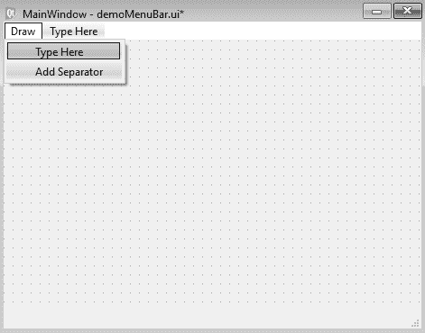

9.  双击此处键入，然后键入`Draw Circle`作为绘图菜单下的第一个菜单项。“绘制圆”菜单上的向下箭头键提供了此处的类型并再次添加分隔符选项。
10.  双击此处键入并键入菜单项`Draw Rectangle`。
11.  按向下箭头键获得两个选项，在此处键入并添加分隔符。
12.  双击此处键入并键入`Draw Line`作为第三个菜单项。
13.  按下向下箭头键后，您再次获得两个选项，在此处键入并添加分隔符，如以下屏幕截图所示：


14.  选择“添加分隔符”，在前三个菜单项后添加分隔符
15.  按分隔符后的向下箭头键，添加第四个菜单项`Properties`。之所以这样做，是因为我们希望属性菜单项有两个子菜单项。
16.  选择右箭头将子菜单项添加到“属性”菜单。
17.  按任意菜单项上的向右箭头键可向其中添加子菜单项。在子菜单项中，选择此处键入并进入第一个子菜单`Page Setup`。

18.  选择向下箭头，在页面设置子菜单项下输入`Set Password`，如下图所示：

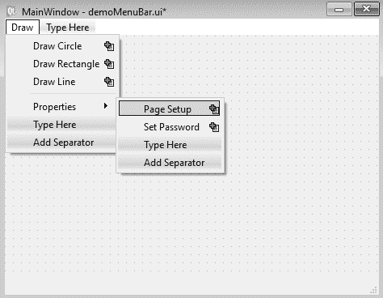

19.  第一个菜单 Draw 已完成。现在，我们需要添加另一个菜单“编辑”。选择“绘图”菜单并按向右箭头键，以指示要向菜单栏添加第二个菜单。
20.  将此处的类型替换为`Edit`。
21.  按向下箭头并添加三个菜单项：剪切、复制和粘贴，如以下屏幕截图所示：


所有菜单项的操作将自动显示在操作编辑器框中，如以下屏幕截图所示：


您可以看到，操作名称是通过在每个菜单文本前加上文本操作前缀并用下划线替换空格生成的。这些操作可用于配置菜单项。

22.  要添加当用户将鼠标悬停在任何菜单项上时显示的工具提示消息，可以使用 tooltip 属性。
23.  要将工具提示消息指定给绘图菜单的绘图圈菜单项，请在动作编辑器框中选择 actionDraw_Circle 并将工具提示属性设置为`To draw a circle`。同样，可以将工具提示消息指定给所有菜单项。

24.  要为任何菜单项指定快捷键，请从“操作编辑器”框中打开其操作，然后在快捷键框内单击。
25.  在快捷方式框中，按要指定给选定菜单项的组合键。

例如，如果在快捷框中按*Ctrl*+*C*，框中会出现 Ctrl+C，如下图所示：


对于任何菜单项，您都可以使用快捷键的任意组合，例如*Shift*+键、*Alt*键和*Ctrl*+*Shift*键。快捷键将与菜单栏中的菜单项一起自动显示。您还可以使任何菜单项可检查，也就是说，您可以使其成为切换菜单项。

26.  为此，请选择所需菜单项的操作并选中可检查复选框。每个菜单项的操作及其操作名称、菜单文本、快捷键、可检查状态和工具提示都显示在“操作编辑器”框中。下面的截图显示了设置密码子菜单项的动作，确认其快捷键为*Shift*+*P*且可检查：

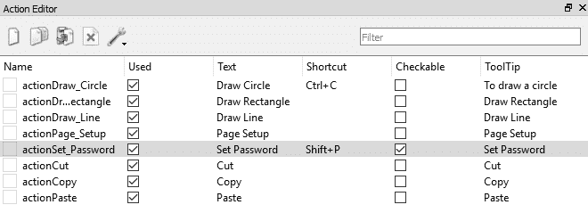

27.  对于“绘制圆”、“绘制矩形”和“绘制线”菜单项，我们将分别添加绘制圆、绘制矩形和绘制线的代码。
28.  对于其余的菜单项，我们需要它们，以便当用户选择其中任何一项时，表单上会显示一条文本消息，指示选择了哪个菜单项。
29.  要显示消息，请将标签小部件拖放到表单上。
30.  我们的菜单栏是完整的；使用名称`demoMenuBar.ui`保存应用。
31.  我们使用`pyuic5`命令行实用程序将`.ui`（XML）文件转换为 Python 代码。

生成的 Python 代码`demoMenuBar.py`可以在本书的源代码包中看到。

32.  创建一个名为`callMenuBar.pyw`的 Python 脚本，该脚本导入前面的代码`demoMenuBar.py`，以便在选择菜单项时调用菜单并使用标签小部件显示文本消息。

您希望显示一条消息，指示选择了哪个菜单项。另外，当分别选择“绘制圆”、“绘制矩形”和“绘制线”菜单项时，您希望绘制圆、矩形和线。Python`callMenuBar.pyw`脚本中的代码将显示在以下屏幕截图中：

```py
import sys
from PyQt5.QtWidgets import QMainWindow, QApplication
from PyQt5.QtGui import QPainter

from demoMenuBar import *

class AppWindow(QMainWindow):
    def __init__(self):
        super().__init__()
        self.ui = Ui_MainWindow()
        self.ui.setupUi(self)
        self.pos1 = [0,0]
        self.pos2 = [0,0]
        self.toDraw=""
        self.ui.actionDraw_Circle.triggered.connect(self.
        drawCircle)
        self.ui.actionDraw_Rectangle.triggered.connect(self.
        drawRectangle)
        self.ui.actionDraw_Line.triggered.connect(self.drawLine)
        self.ui.actionPage_Setup.triggered.connect(self.pageSetup)
        self.ui.actionSet_Password.triggered.connect(self.
        setPassword)
        self.ui.actionCut.triggered.connect(self.cutMethod)
        self.ui.actionCopy.triggered.connect(self.copyMethod)
        self.ui.actionPaste.triggered.connect(self.pasteMethod)      
        self.show()

    def paintEvent(self, event):
        qp = QPainter()
        qp.begin(self)
        if self.toDraw=="rectangle":
            width = self.pos2[0]-self.pos1[0]
            height = self.pos2[1] - self.pos1[1]    
            qp.drawRect(self.pos1[0], self.pos1[1], width, height)
        if self.toDraw=="line":
            qp.drawLine(self.pos1[0], self.pos1[1], self.pos2[0], 
            self.pos2[1])
        if self.toDraw=="circle":
            width = self.pos2[0]-self.pos1[0]
            height = self.pos2[1] - self.pos1[1]           
            rect = QtCore.QRect(self.pos1[0], self.pos1[1], width,
            height)
            startAngle = 0
            arcLength = 360 *16
            qp.drawArc(rect, startAngle, 
            arcLength)     
        qp.end()

    def mousePressEvent(self, event):
        if event.buttons() & QtCore.Qt.LeftButton:
            self.pos1[0], self.pos1[1] = event.pos().x(), 
            event.pos().y()

    def mouseReleaseEvent(self, event):
        self.pos2[0], self.pos2[1] = event.pos().x(), 
        event.pos().y()   
        self.update()

    def drawCircle(self):
        self.ui.label.setText("")
        self.toDraw="circle"

    def drawRectangle(self):
        self.ui.label.setText("")
        self.toDraw="rectangle"

    def drawLine(self):
        self.ui.label.setText("")
        self.toDraw="line"

    def pageSetup(self):
        self.ui.label.setText("Page Setup menu item is selected")

    def setPassword(self):
        self.ui.label.setText("Set Password menu item is selected")

    def cutMethod(self):
        self.ui.label.setText("Cut menu item is selected")

    def copyMethod(self):
        self.ui.label.setText("Copy menu item is selected")

    def pasteMethod(self):
        self.ui.label.setText("Paste menu item is selected")

app = QApplication(sys.argv)
w = AppWindow()
w.show()
sys.exit(app.exec_())
```

# 它是如何工作的。。。

每个菜单项操作的触发（）信号连接到其各自的方法。actionDraw_Circle 菜单项的触发（）信号连接到`drawCircle()`方法，因此无论何时从菜单栏选择 Draw Circle 菜单项，都将调用`drawCircle()`方法。同样，actionDraw_ 矩形和 actionDraw_ 线菜单的触发（）信号分别连接到`drawRectangle()`和`drawLine()`方法。在`drawCircle()`方法中，`toDraw`变量被分配一个字符串`circle`。`toDraw`变量将用于确定在`paintEvent`方法中绘制的图形。`toDraw`变量可以指定为三个字符串中的任意一个，`line`、`circle`或`rectangle`。条件分支应用于`toDraw`变量中的值，并相应地调用绘制直线、矩形或圆的方法。图形将按鼠标确定的大小绘制，即用户需要单击鼠标并拖动鼠标以确定图形的大小。

分别按下和释放鼠标左键时，会自动调用两种方法`mousePressEvent()`和`mouseReleaseEvent()`。为了存储鼠标左键按下和释放位置的`x`和`y`坐标，使用了两个数组`pos1`和`pos2`。鼠标左键按下和释放位置的`x`和`y`坐标值通过`mousePressEvent`和`mouseReleaseEvent`方法分配给`pos1`和`pos2`阵列。

在`mouseReleaseEvent`方法中，在分配鼠标按钮释放位置的`x`和`y`坐标值后，调用`self.update`方法调用`paintEvent()`方法。在`paintEvent()`方法中，根据分配给`toDraw`变量的字符串进行分支。如果为`toDraw`变量分配了`line`字符串，`QPainter`类将调用`drawLine()`方法，在两个鼠标位置之间画一条线。类似地，如果为`toDraw`变量分配了`circle`字符串，`QPainter`类将调用`drawArc()`方法以绘制一个由鼠标位置提供直径的圆。如果为`toDraw`变量分配了`rectangle`字符串，则`QPainter`类将调用`drawRect()`方法来绘制鼠标位置提供的宽度和高度的矩形。

除了“绘制圆”、“绘制矩形”和“绘制线”这三个菜单项之外，如果用户单击任何其他菜单项，将显示一条消息，指示用户单击的菜单项。因此，其余菜单项的触发（）信号连接到显示用户通过标签小部件选择的菜单项的消息信息的方法。

在运行应用时，您会发现一个包含两个菜单的菜单栏，即“绘制”和“编辑”。“绘制”菜单将显示四个菜单项“绘制圆”、“绘制矩形”、“绘制线”和“属性”，在“属性”菜单项前带有分隔符。“属性”菜单项显示两个子菜单项“页面设置”和“设置密码”，以及它们的快捷键，如以下屏幕截图所示：


若要绘制圆，请单击“绘制圆”菜单项，在窗体上的某个位置单击鼠标按钮，然后按住鼠标按钮，拖动它以定义圆的直径。释放鼠标按钮时，将在按下的鼠标和释放的鼠标位置之间绘制一个圆圈，如以下屏幕截图所示：


选择任何其他菜单项时，将显示一条消息，指示所按下的菜单项。例如，在选择“复制”菜单项时，您会收到一条消息，选择“复制”菜单项，如以下屏幕截图所示：

