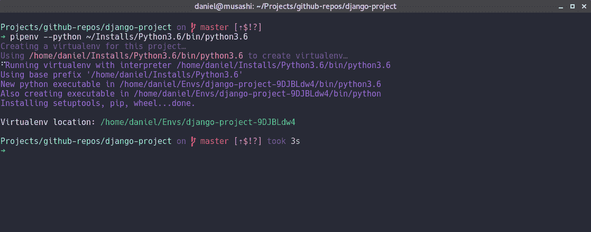
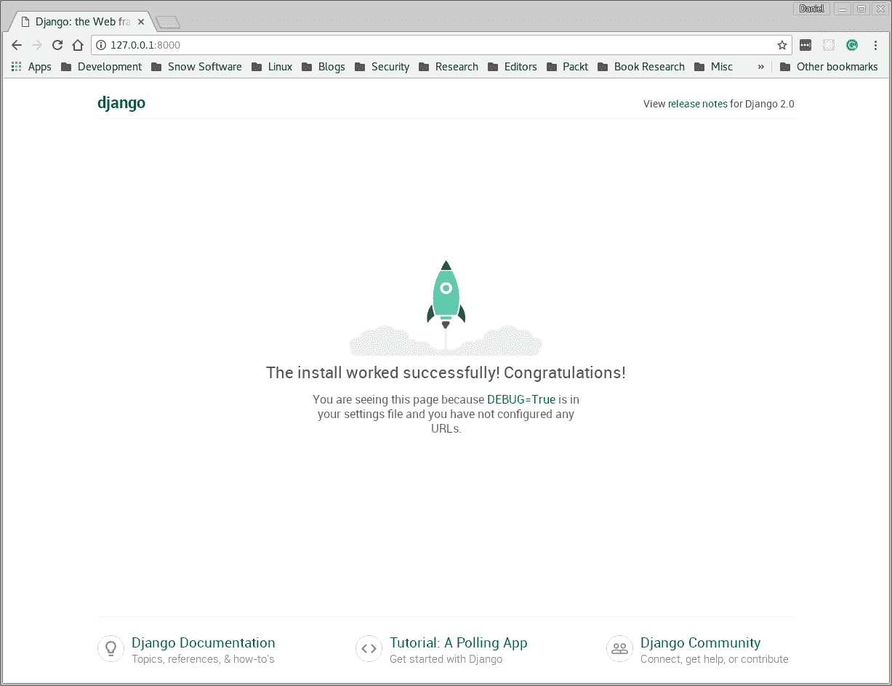
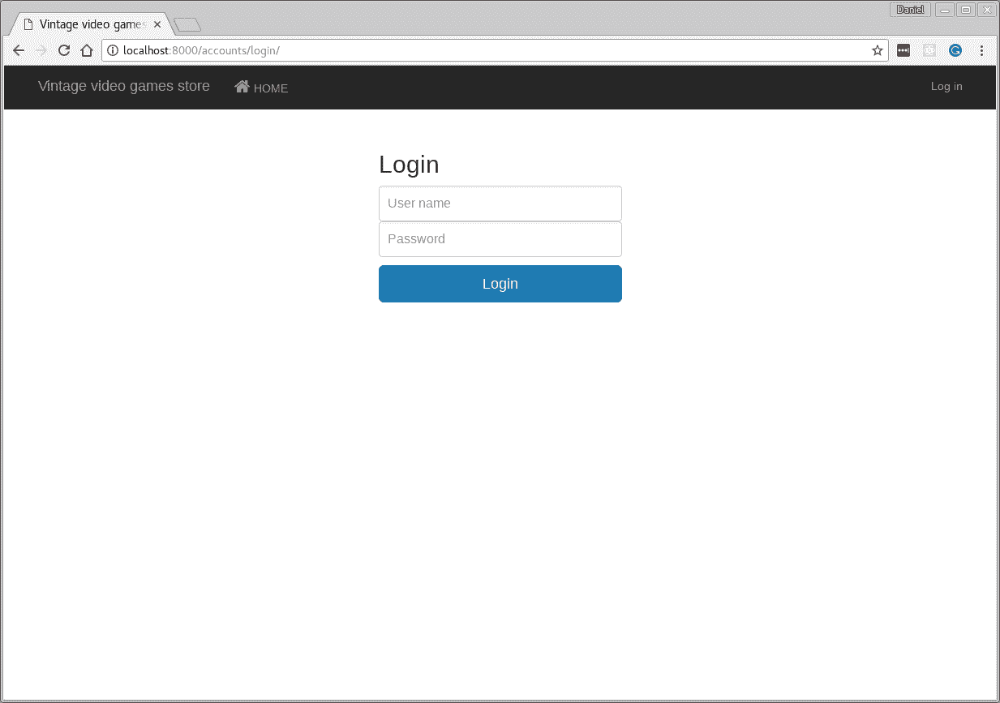
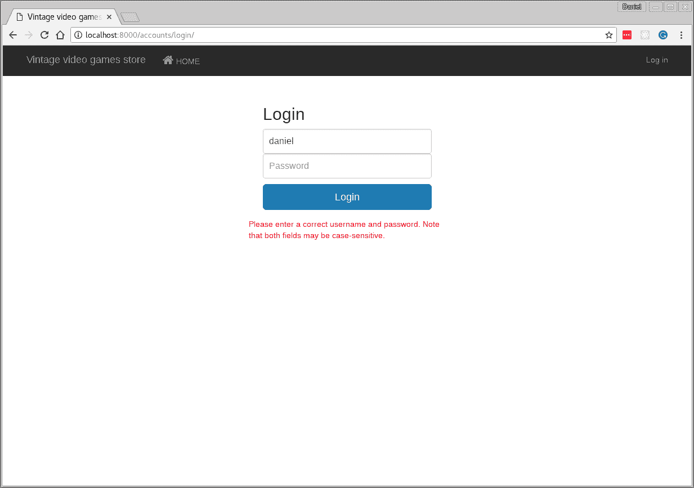
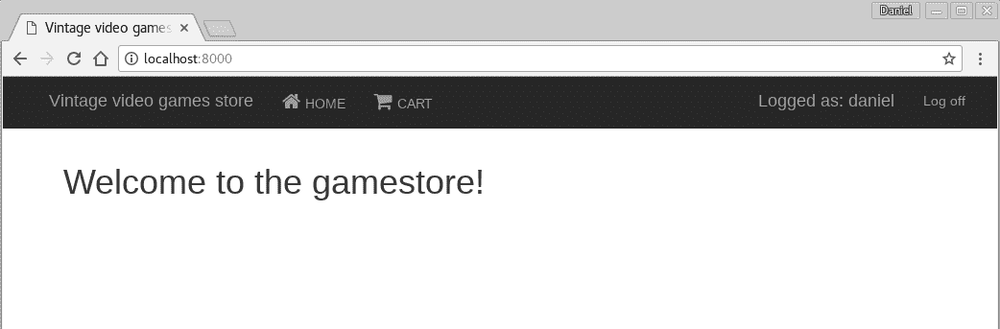
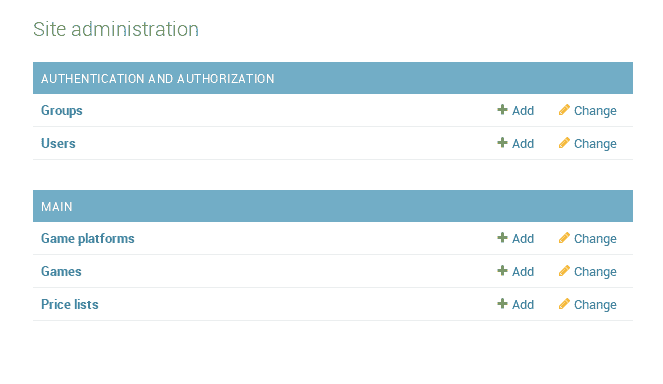
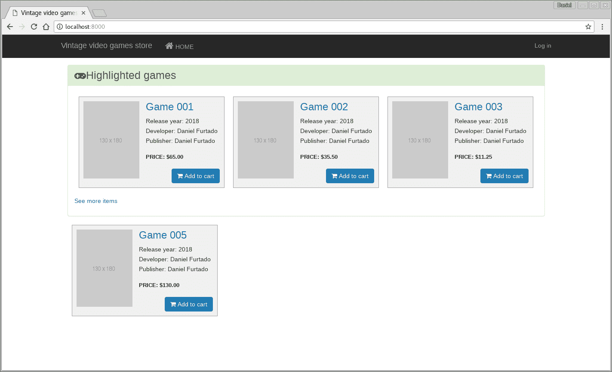

# 七、Django 在线视频游戏商店

我出生于 70 年代末，这意味着我是在电子游戏行业诞生的时候长大的。我的第一台电子游戏机是 Atari 2600，正是因为这个特殊的电子游戏机，我决定成为一名程序员并制作电子游戏。然而，我从未在游戏行业找到工作，但我仍然喜欢玩电子游戏，在业余时间，我试着开发自己的游戏。
直到今天，我仍然在互联网上到处转悠，尤其是在易趣上购买旧的电子游戏，以唤起我美好的童年记忆，那时我的家人、父母和姐姐都曾经一起玩过雅达利 2600 游戏。
由于我对复古视频游戏的兴趣，我们将开发一个复古视频游戏在线商店；这将是一个很好的方法来开发一些有趣的东西，同时也可以通过流行的 Django web 框架了解很多 web 开发方面的知识。

在本章中，我们将介绍以下内容：

*   建立环境
*   创建 Django 项目
*   创建 Django 应用
*   探索 Django 管理界面
*   学习如何使用 Django ORM 创建应用模型和执行查询

另外，我们还将使用**npm**（**节点包管理器**下载客户端依赖项。我们还将介绍如何使用 TaskRunner Gulp 创建简单任务。

为了使我们的应用更加美观，而不需要付出很多努力，我们将使用 Bootstrap。

那么，让我们开始吧！

# 建立发展环境

一如往常，我们将开始为发展创造环境。在[第 4 章](4.html)、*汇率和货币转换工具*中，您被介绍到`pipenv`，因此在本章和后续章节中，我们将使用`pipenv`创建我们的虚拟环境并管理我们的依赖关系。

首先，我们想创建一个目录，在那里保存我们的项目。在您的工作目录中，创建一个名为`django-project`的目录，如下所示：

```py
mkdir django-project && cd django-project
```

现在我们可以运行`pipenv`来创建我们的虚拟环境：

```py
pipenv --three
```

如果在其他位置安装了 Python 3，则可以使用参数`--python`并指定 Python 可执行文件所在的路径。如果一切正常，您应该会看到如下输出：



现在我们可以使用`pipenv`命令 shell 激活我们的虚拟环境：

```py
pipenv shell
```

伟大的我们现在要添加的唯一依赖项是 Django。

At the time of writing this book, Django 2.0 had been released. It has really nice features compared to its predecessor. You can see the list of new features at [https://docs.djangoproject.com/en/2.0/releases/2.0/](https://docs.djangoproject.com/en/2.0/releases/2.0/).

让我们在虚拟环境中安装 Django：

```py
pipenv install django
```

Django 2.0 已经放弃了对 Python2.0 的支持，因此，如果您计划使用 Python2 开发应用，您应该安装 Django 1.11.x 或更低版本。我强烈建议您使用 Python3 启动一个新项目。Python 2 将在几年后停止维护，并且将为 Python 3 创建新的包。Python2 的流行包将迁移到 Python3。

在我看来，Django 2 最好的新特性是新的路由语法，因为现在不需要编写正则表达式。编写以下内容更清晰、可读性更强：

```py
path('user/<int:id>/', views.get_user_by_id)
```

前面的语法更多地依赖于正则表达式：

```py
url('^user/?P<id>[0-9]/$', views.get_user_by_id)
```

这样更简单。Django 2.0 中我真正喜欢的另一个特性是，他们稍微改进了管理 UI，使其具有响应性；这是一个很好的特性，因为我曾经体验过，在一个没有响应的网站上，在一个小手机屏幕上创建一个新用户（当你在移动中无法访问桌面时）可能会很痛苦。

# 安装 Node.js

说到 web 开发，几乎不可能远离 Node.js。Node.js 是一个早在 2009 年发布的项目。它是一个 JavaScript 运行时，允许我们在服务器端运行 JavaScript。如果我们正在使用 Django 和 Python 开发一个网站，为什么还要关心 Node.js 呢？原因是 Node.js 生态系统有几个工具可以帮助我们以简单的方式管理客户端依赖关系。我们将要使用的工具之一是 npm。

把 npm 想象成 JavaScript 世界的`pip`。然而，npm 有更多的特性。我们将要使用的特性之一是 npm 脚本。

那么，让我们继续安装 Node.js。通常，开发人员需要转到 Node.js 网站并从那里下载，但我发现使用一个名为 NVM 的工具要简单得多，它允许我们在 Node.js 的不同版本之间轻松安装和切换。

要在我们的环境中安装 NVM，您可以按照[中的说明进行操作 https://github.com/creationix/nvm](https://github.com/creationix/nvm) 。

We are covering installation of NVM on Unix/Linux and macOS systems. If you are using Windows, there's an awesome version for Windows that has been developed in the Go language; it can be found at [https://github.com/coreybutler/nvm-windows](https://github.com/coreybutler/nvm-windows).

安装 NVM 后，您可以使用以下命令安装 Node.js 的最新版本：

```py
nvm install node
```

您可以使用以下命令验证安装是否正确：

```py
node --version
```

在编写本书时，Node.js 的最新版本是 v8.8.1。

您也可以在终端上键入`npm`，在那里您应该会看到与以下输出类似的输出：


# 创建新的 Django 项目

要创建新的 Django 项目，请运行以下命令：

```py
django-admin startproject gamestore
```

注意，`django-admin`创建了一个名为`gamestore`的目录，其中包含一些我们的样板代码。稍后我们将介绍 Django 创建的文件，但是，首先，我们将创建第一个 Django 应用。在 Django 世界中，您拥有项目和应用，根据 Django 文档，项目描述了 web 应用本身，应用是一个提供某种功能的 Python 包；这些应用包含它们自己的路由、视图和静态文件集，可以跨不同的 Django 项目重用。

如果你不完全理解它，不要担心；随着我们的进步，你会学到更多。

话虽如此，让我们创建项目的初始应用。运行`cd gamestore`，进入`gamestore`目录后，执行以下命令：

```py
python-admin startapp main
```

如果您列出了`gamestore`目录的内容，您应该会看到一个名为`main`的新目录；这是我们将要创建的 Django 应用的目录。

根本不需要编写任何代码，您已经拥有了一个功能齐全的 web 应用。要运行应用并查看结果，请运行以下命令：

```py
python manage.py runserver
```

您应该看到以下输出：

```py
Performing system checks...

System check identified no issues (0 silenced).

You have 14 unapplied migration(s). Your project may not work properly until you apply the migrations for app(s): admin, auth, contenttypes, sessions.
Run 'python manage.py migrate' to apply them.

December 20, 2017 - 09:27:48
Django version 2.0, using settings 'gamestore.settings'
Starting development server at http://127.0.0.1:8000/
Quit the server with CONTROL-C.
```

打开您喜爱的 web 浏览器，进入`http://127.0.0.1:8000`，您将看到以下页面：



首次启动应用时需要注意的一点是以下警告：

```py
You have 14 unapplied migration(s). Your project may not work properly until you apply the migrations for app(s): admin, auth, contenttypes, sessions.
Run 'python manage.py migrate' to apply them.
```

这意味着默认情况下在 Django 项目、`admin`、`auth`、`contenttypes`和`sessions`上注册的应用具有尚未应用于此项目的迁移（数据库更改）。我们可以使用以下命令运行这些迁移：

```py
➜ python manage.py migrate
Operations to perform:
 Apply all migrations: admin, auth, contenttypes, sessions
Running migrations:
 Applying contenttypes.0001_initial... OK
 Applying auth.0001_initial... OK
 Applying admin.0001_initial... OK
 Applying admin.0002_logentry_remove_auto_add... OK
 Applying contenttypes.0002_remove_content_type_name... OK
 Applying auth.0002_alter_permission_name_max_length... OK
 Applying auth.0003_alter_user_email_max_length... OK
 Applying auth.0004_alter_user_username_opts... OK
 Applying auth.0005_alter_user_last_login_null... OK
 Applying auth.0006_require_contenttypes_0002... OK
 Applying auth.0007_alter_validators_add_error_messages... OK
 Applying auth.0008_alter_user_username_max_length... OK
 Applying auth.0009_alter_user_last_name_max_length... OK
 Applying sessions.0001_initial... OK
```

Django 在这里创建了 SQLite 数据库中的所有表，您将在应用的`root`目录中找到 SQLite 数据库文件。

`db.sqlite3`文件是包含应用表的数据库文件。在本章中，选择 SQLite 只是为了简化应用。Django 支持大量数据库；支持最流行的数据库，如 Postgres、Oracle，甚至 MSSQL。

如果再次运行`runserver`命令，则不会出现任何迁移警告：

```py
→ python manage.py runserver
Performing system checks...

System check identified no issues (0 silenced).
December 20, 2017 - 09:50:49
Django version 2.0, using settings 'gamestore.settings'
Starting development server at http://127.0.0.1:8000/
Quit the server with CONTROL-C.
```

现在我们只需要做一件事来结束这一部分；我们需要创建一个管理员用户，这样我们就可以登录到 Django 管理员 UI 并管理我们的 web 应用。

与 Django 中的其他内容一样，这非常简单。只需运行以下命令：

```py
python manage.py createsuperuser
```

您将被要求输入用户名和电子邮件并设置密码，这是设置管理员帐户所需的全部操作。

在下一节中，我们将更详细地了解 Django 为我们创建的文件。

# 探索 Django 项目的结构

如果你看看 Django 的网站，上面写着*Django：有期限的完美主义者的网络框架，*，我非常同意这一说法。到目前为止，我们还没有编写任何代码行，我们已经有了一个正在运行的站点。只需几个命令，我们就可以创建具有相同目录结构和样板代码的新项目。让我们从发展开始。

我们可以建立一个新的数据库并创建一个超级用户，除此之外，Django 还提供了一个非常漂亮和有用的管理 UI，您可以在其中可视化我们的数据和用户。

在本节中，我们将探索 Django 在启动新项目时为我们创建的代码，以便我们能够熟悉该结构。让我们开始添加项目的其他组件。

如果您查看项目的根目录，您会发现一个名为`db.sqlite3`的文件，另一个名为`manage.py`的文件，最后是一个与项目同名的目录，在我们的例子中是`gamestore`。顾名思义，`db.sqlite3`文件就是数据库文件；此文件是在项目的根文件夹上创建的，因为我们正在使用 SQLite。您可以直接从命令行浏览此文件；我们将很快演示如何做到这一点。

第二个文件是`manage.py`。该文件由每个 Django 项目中的`django-admin`自动创建。它基本上做与`django-admin`相同的事情，加上两个额外的事情；将`DJANGO_SETTINGS_MODULE`设置为指向项目的设置文件，并将项目的包放在`sys.path`上。如果您在没有任何参数的情况下执行`manage.py`，您可以看到所有可用命令的帮助。

正如您在`manage.py`中所看到的，您有许多选项，例如管理密码、创建超级用户、管理数据库、创建和执行数据库迁移、启动新的应用和项目，以及`runserver`中的一个非常重要的选项，顾名思义，这将为您启动 Django 开发服务器。

既然我们已经了解了`manage.py`以及如何执行它的命令，我们将后退一步，学习如何检查我们刚刚创建的数据库。执行该操作的命令是`dbshell`；让我们试一试：

```py
python manage.py dbshell
```

# 跳入 SQLite

您应该进入 SQLite3 命令提示符：

```py
SQLite version 3.16.2 2017-01-06 16:32:41
Enter ".help" for usage hints.
sqlite>
```

如果要获取所有数据库表的列表，可以使用命令`.tables`：

```py
sqlite> .tables
auth_group auth_user_user_permissions
auth_group_permissions django_admin_log
auth_permission django_content_type
auth_user django_migrations
auth_user_groups django_session
```

在这里您可以看到，我们拥有通过`migrate`命令创建的所有表。

要查看每个表结构，您可以使用命令`.schema`，我们可以使用选项`--indent`，因此输出将以更可读的方式显示：

```py
sqlite> .schema --indent auth_group
CREATE TABLE IF NOT EXISTS "auth_group"(
 "id" integer NOT NULL PRIMARY KEY AUTOINCREMENT,
 "name" varchar(80) NOT NULL UNIQUE
 );
```

这些是我在处理 SQLite3 数据库时使用最多的命令，但是命令行界面提供了多种命令。您可以使用`.help`命令获取所有可用命令的列表。

SQLite3 databases are very useful when creating prototypes, creating proof of concept projects, or for creating really small projects. If our project does not fall in any of these categories, I would recommend using other SQL databases, such as MySQL, Postgres, and Oracle. There are also non-SQL databases, such as MongoDB. With Django, you can use any of these databases without any problem; if you are using the Django **ORM** (**Object relation model**), most of the time you can switch between databases, and the application will continue to work perfectly.

# 查看项目的包目录

接下来，让我们看看项目的包目录。在那里，你会发现一堆文件。您将看到的第一个文件是`settings.py`，这是一个非常重要的文件，因为您将在其中放置应用的所有设置。在此设置文件中，您可以指定要使用的应用和数据库，还可以告诉 Django 在何处搜索静态文件和模板、中间件等。

然后你有`urls.py`；此文件用于指定应用上可用的 URL。您可以在项目级别设置 URL，也可以为每个 Django 应用设置 URL。如果你检查这个`urls.py`文件的内容，你不会发现太多细节。基本上，您将看到解释如何添加新 URL 的文本，但 Django 已经（开箱即用）定义了 Django 管理站点的 URL：

```py
  from django.contrib import admin
  from django.urls import path

  urlpatterns = [
      path('admin/', admin.site.urls),
  ]
```

我们将经历向项目添加新 URL 的过程，但是我们可以解释这个文件；还记得我提到在 Django 中，你可以使用多种应用吗？所以`django.contrib.admin`也是一个应用，一个应用有自己的 URL、视图和模板集。那么它在这里做什么呢？当我们导入管理应用，然后定义一个名为`urlpatterns`的列表时，在这个列表中，我们使用一个函数路径，其中第一个参数是 URL，第二个参数可以是将要执行的视图。但在本例中，它传递的是`admin.site`应用的 URL，这意味着`admin/`将是基础 URL，并且`admin.site.urls`中定义的所有 URL 都将在其下创建。

例如，如果在`admin.site.url`中，我定义了两个 URL`users/`和`groups/`，当我有`path('admin/', admin.site.urls)`时，我将实际创建两个 URL：

*   `admin/users/`
*   `admin/groups/`

最后，我们有`wsgi.py`，这是 Django 在创建新项目时为我们创建的一个简单的 WSGI 配置。

现在我们对 Django 的项目结构更加熟悉了，是时候创建我们项目的第一个应用了。

# 创建项目的主应用

在本节中，我们将创建第一个 Django 应用。一个 Django 项目可以包含多个应用。将项目拆分为应用是一种很好的做法，原因很多；最明显的是，你可以在不同的项目中重用同一个应用。将项目拆分为多个应用的另一个原因是它强制分离关注点。您的项目将更有条理，更易于推理，我们的同事将感谢您，因为它将更易于维护。

让我们继续运行命令`startapp`，如前所示，您可以使用`django-admin`命令或`manager.py`。当我们使用`django-admin`命令创建项目时，这是测试`manager.py`命令的好机会。要创建新的 Django 应用，请运行以下命令：

```py
python manager.py startapp main
```

在这里，我们将创建一个名为`main`的应用。不要担心没有显示输出，Django 会以静默方式创建项目和应用。如果你现在得到一个目录内容列表，你会看到有一个名为`main`的目录，在`main`目录中你会发现一些文件；我们将在添加更改时解释每个文件。

因此，我们要做的第一件事是向应用添加登录页。为此，我们必须做三件事：

*   首先，我们添加一个新的 URL 告诉 Django，当我们网站的用户浏览到根目录时，它应该进入网站`/`并显示一些内容
*   第二步是添加一个视图，当用户浏览到站点的根目录``/``时将执行该视图
*   最后一步是添加一个 HTML 模板，其中包含我们希望向用户显示的内容

话虽如此，我们需要在`main`应用目录中包含一个名为`urls.py`的新文件。首先，我们添加了一些导入：

```py
from django.urls import path
from . import views
```

在前面的代码中，我们从`django.urls`导入了函数路径。path 函数将返回一个要包含在`urlpatterns`列表中的元素，我们还将视图文件导入同一目录中；我们希望导入此视图，因为我们将在该视图中定义访问特定路由时将执行的函数：

```py
  urlpatterns = [
      path(r'', views.index, name='index'),
  ]
```

然后我们使用路径函数来定义一个新的路由。函数路径的第一个参数是一个字符串，其中包含我们希望在应用中可用的 URL 模式。此模式可能包含尖括号（例如，`<int:user_id>`）以捕获在 URL 上传递的参数，但是，在这一点上，我们不打算使用它；我们只想为应用的根添加一个 URL，所以我们添加了一个空字符串`''`。第二个参数是将要执行的函数，您可以选择添加关键字参数`name`，它设置 URL 的名称。我们将在短时间内看到为什么这是有用的。

第二部分是在`views.py`文件中定义名为`index`的函数，如下所示：

```py
  from django.shortcuts import render

  def index(request):
      return render(request, 'main/index.html', {})
```

由于此时没有太多事情发生，我们首先从`django.shortcuts`导入渲染函数。Django 有自己的内置于框架中的模板引擎，可以将默认模板引擎更改为您喜欢的其他模板引擎（例如 Jinja2，它是 Python 生态系统中最流行的模板引擎之一），但为了简单起见，我们将使用默认引擎。`render`函数获取请求对象、模板和上下文对象；后者是包含要在模板中显示的数据的对象。

我们需要做的下一件事是添加一个模板，该模板将包含用户浏览应用时要显示的内容。现在，大多数 web 应用的页面包含永不更改的部分，例如顶部菜单栏或页面页脚，这些部分可以放在一个单独的模板中，其他模板可以重复使用。幸运的是，Django 模板引擎具有此功能。事实上，我们不仅可以在模板中插入子模板，还可以拥有一个基本模板，其中包含所有页面之间共享的 HTML。话虽如此，我们将在`gamestore/templates`目录中创建一个名为`base.html`的文件，该文件包含以下内容：

```py
<!DOCTYPE html>
<html lang="en">
  <head>
    <meta charset="utf-8">
    <meta http-equiv="X-UA-Compatible" content="IE=edge">
    <meta name="viewport" content="width=device-width, 
        initial-scale=1">
    <meta name="description" content="">
    <meta name="author" content="">
    <link rel="icon" href="../../favicon.ico">

    <title>Vintage video games store</title>

    
    <link href="" rel='stylesheet'>
    <link href="" 
       rel='stylesheet'>
    <link href=""
          rel='stylesheet'>
  </head>

  <body>

    <nav class="navbar navbar-inverse navbar-fixed-top">
      <div class="container">
        <div class="navbar-header">
          <button type="button" class="navbar-toggle 
             collapsed" data-toggle="collapse" data-target="#navbar"
             aria-expanded="false" aria-controls="navbar">
            <span class="sr-only">Toggle navigation</span>
            <span class="icon-bar"></span>
            <span class="icon-bar"></span>
            <span class="icon-bar"></span>
          </button>
          <a class="navbar-brand" href="/">Vintage video
         games store</a>
        </div>
        <div id="navbar" class="collapse navbar-collapse">
          <ul class="nav navbar-nav">
            <li>
              <a href="/">
                <i class="fa fa-home" aria-hidden="true"></i> HOME
              </a>
            </li>
            
            <li>
              <a href="/cart/">
                <i class="fa fa-shopping-cart" 
                   aria-hidden="true"></i> CART
              </a>
            </li>
            
          </ul>          
        </div><!--/.nav-collapse -->
      </div>
    </nav>

    <div class="container">

      <div class="starter-template">
        
          
            <div class="alert alert-info" role="alert">
              {{message}}
            </div>
          
        

        
        
      </div>
    </div>
  </body>
</html>
```

我们不打算讨论所有 HTML 部分，只讨论 Django 模板引擎的特定语法部分：

```py
  
  <link href="" rel='stylesheet'>
  <link href="" 
          rel='stylesheet'>
  <link href="" 
         rel='stylesheet'>
```

这里要注意的第一件事是``，它将告诉 Django 的模板引擎我们想要加载静态模板标签。静态模板标记用于链接静态文件。这些文件可以是图像、JavaScript 或样式表文件。你可能会问，Django 是如何找到这些文件的，答案很简单：用魔法！不，只是开玩笑；静态模板标签将在`settings.py`文件的`STATIC_ROOT`变量中指定的目录中查找文件；在我们的例子中，我们定义了`STATIC_ROOT = '/static/'`，所以当使用标签``时，链接`/static/styles/site.css`将被返回。

你可能会想，为什么不直接写`/static/styles/site.css`而不用标签呢？这样做的原因是，标签为我们提供了更大的更改灵活性，以防我们需要更新提供静态文件的路径。想象一下这样一种情况：您有一个包含数百个模板的大型应用，在所有这些模板中，您硬编码`/static/`，然后决定更改路径（而您没有团队）。要执行此更改，您需要更改每个文件。如果使用静态标记，只需将文件移动到其他位置，该标记就会更改设置文件中`STATIC_ROOT`变量的值。

我们在此模板中使用的另一个标记是`block`标记：

```py


```

`block`标记非常简单；它在基本模板中定义了一个区域，子模板可以使用该区域在该区域中注入内容。当我们创建下一个模板文件时，我们将看到它是如何工作的。

第三部分是添加模板。`index`函数将呈现一个存储在`main/index.html`的模板，这意味着它将把它留在目录`main/templates/main/`中。让我们继续创建文件夹`main/templates`，然后创建`main/templates/main`：

```py
mkdir main/templates && mkdir main/templates/main
```

在目录`main/templates/main/`中创建一个名为`index.html`的文件，内容如下：

```py



   <h1>Welcome to the gamestore!</h1>

```

如您所见，在这里，我们从扩展基本模板开始，这意味着当用户浏览到`/`时，`base.html`文件的所有内容将被 Django 模板引擎用于构建 HTML，该 HTML 将被提供回浏览器。现在，我们也使用了`block`标签；在此上下文中，这意味着引擎将在`base.html`文件中搜索名为`'content'`的块标记，如果找到，引擎将在`'content'`块中插入`h1 html`选项卡。

这都是关于代码的可重用性和可维护性的，因为您不需要插入菜单标记和标签来在应用的每个模板中加载 JavaScript 和 CSS 文件；您只需将它们插入基本模板中，并在此处使用`block`标记。内容将会改变。使用基本模板的第二个原因是，再次设想一种情况，在这种情况下，您需要更改一些内容，比如我们在`base.html`文件中定义的顶部菜单，因为菜单仅在`base.html`文件中定义。要执行更改，只需更改`base.html`中的标记，所有其他模板将继承这些更改。

我们已经准备好运行代码，看看应用到目前为止是什么样子，但是，首先，我们需要安装一些客户端依赖项。

# 安装客户端依赖项

现在我们已经安装了 NodeJS，可以安装项目的客户端依赖项了。由于本章的重点是 Django 和 Python，我们不想花太多时间设计我们的应用和浏览庞大的 CSS 文件。然而，我们确实希望我们的应用看起来很棒，出于这个原因，我们将安装两件东西：Bootstrap 和 Font-Awesome。

Bootstrap 是一个非常有名的工具包，已经存在很多年了。它有一组非常好的组件、一个网格系统和插件，当用户在桌面甚至移动设备上浏览应用时，这些插件将帮助我们使应用看起来很棒。

FontAwesome 是另一个已经存在了一段时间的项目，它是一个字体和图标框架。

要安装这些依赖项，我们可以运行 npm 的 install 命令。不过，我们会做得更好。与为 Python 依赖项创建文件的`pipenv`类似，`npm`也有类似的内容。该文件称为`package.json`，它不仅包含项目的依赖项，还包含有关包的脚本和元信息。

那么让我们继续将`package.json`文件添加到`gamestore/`目录，内容如下：

```py
    {
      "name": "gamestore",
      "version": "1.0.0",
      "description": "Retro game store website",
      "dependencies": {
         "bootstrap": "^3.3.7",
        "font-awesome": "^4.7.0"
      }
    }
```

伟大的保存文件，并在终端上运行以下命令：

```py
npm install
```

如果一切顺利，您应该会看到一条消息，说明已经安装了两个软件包。

如果您列出了`gamestore`目录的内容，您会看到`npm`创建了一个名为`node_modules`的新目录，`npm`就是在那里安装了引导和字体。

为了简单起见，我们将把需要的 CSS 文件和字体复制到`static`文件夹中。但是，在构建应用时，我建议使用诸如`webpack`之类的工具，它将绑定所有客户端依赖项，并设置`webpack`开发服务器来为 Django 应用提供文件服务。因为我们想关注 Python 和 Django，所以我们可以继续手动复制这些文件。

首先，我们可以创建 CSS 文件的目录，如下所示：

```py
mkdir static && mkdir static/styles
```

然后我们需要复制引导文件。首先，缩小的 CSS 文件：

```py
cp node_modules/bootstrap/dist/css/bootstrap.min.css static/styles/
```

接下来，我们需要复制字体文件，从缩小的 CSS 开始：

```py
cp node_modules/font-awesome/css/font-awesome.min.css static/styles/
```

字体：

```py
cp -r node_modules/font-awesome/fonts/ static/
```

我们将添加另一个 CSS 文件，该文件将包含一些自定义 CSS，我们可以将这些 CSS 添加到应用中，使应用具有个人风格。在`gamestore/static/styles`目录中添加一个名为`site.css`的文件，内容如下：

```py
  .nav.navbar-nav .fa-home,
  .nav.navbar-nav .fa-shopping-cart {
     font-size: 1.5em;
   }

   .starter-template {
      padding: 70px 15px;
   }

   h2.panel-title {
      font-size: 25px;
   }
```

第一次运行应用需要做一些事情；首先，我们需要将我们创建的主应用添加到`gamestore/gamestore`目录中`settings.py`文件的`INSTALLED_APPS`列表中。应该是这样的：

```py
INSTALLED_APPS = [
    'django.contrib.admin',
    'django.contrib.auth',
    'django.contrib.contenttypes',
    'django.contrib.sessions',
    'django.contrib.messages',
    'django.contrib.staticfiles',
    'main',
]
```

在相同的设置文件中，您将找到列表`TEMPLATES`：

```py
TEMPLATES = [
    {
        'BACKEND': 
       'django.templates.backends.django.DjangoTemplates',
        'DIRS': [],
        'APP_DIRS': True,
        'OPTIONS': {
            'context_processors': [
                'django.templates.context_processors.debug',
                'django.templates.context_processors.request',
                'django.contrib.auth.context_processors.auth',

          'django.contrib.messages.context_processors.messages',
            ],
        },
    },
]
```

`DIRS`的值为空列表。我们需要将其更改为：

```py
'DIRS': [
    os.path.join(BASE_DIR, 'templates')
]
```

这将告诉 Django 在`templates`目录中搜索模板。

然后，在`settings.py`文件的末尾添加以下行：

```py
STATICFILES_DIRS = [os.path.join(BASE_DIR, 'static'), ]
```

这将告诉 Django 在`gamestore/static`目录中搜索静态文件。

现在我们需要告诉 Django 注册我们在`main`应用中定义的 URL。那么，让我们继续打开`gamestore/gamestore`目录中的文件`urls.py`。我们需要将`"main.urls"`包括在`urlpatterns`列表中。更改后，`urls.py`文件应如下所示：

```py
from django.contrib import admin
from django.urls import path, include

urlpatterns = [
    path('admin/', admin.site.urls),
    path('', include('main.urls'))
]
```

注意，我们还需要导入`django.urls`模块的`include`功能。

伟大的现在，我们已经准备好了所有客户机站点依赖项，可以由我们的应用使用，并且我们可以第一次启动应用，以查看到目前为止我们已经实现的更改。打开终端，使用`runserver`命令启动 Django 的开发服务器，如下所示：

```py
python manage.py runserver
```

浏览至`http://localhost:8000`；您应该会看到如下屏幕截图所示的页面：


# 添加登录和注销视图

每个在线商店都需要某种用户管理。我们的应用的用户应该能够创建一个帐户，更改他们的帐户详细信息，显然，登录到我们的应用，以便他们可以下订单，还可以从应用注销。

我们将开始添加登录和注销功能。好消息是，它在 Django 中非常容易实现。

首先，我们需要向登录页面添加一个 Django 表单。Django 具有内置的认证形式；然而，我们想要定制它，所以我们将创建另一个继承自 Django 内置`AuthenticationForm`的类，并添加我们的更改。

在`gamestore/main/`中创建一个名为`forms.py`的文件，内容如下：

```py
from django import forms
from django.contrib.auth.forms import AuthenticationForm

class AuthenticationForm(AuthenticationForm):
    username = forms.CharField(
        max_length=50,
        widget=forms.TextInput({
            'class': 'form-control',
            'placeholder': 'User name'
        })
    )

    password = forms.CharField(
        label="Password",
        widget=forms.PasswordInput({
            'class': 'form-control',
            'placeholder': 'Password'
        })
    )
```

这门课很简单。首先，我们从`django`模块导入`forms`，从`django.contrib.auth.forms`模块导入`AuthenticationForm`，然后我们创建另一个类，也称为`AuthenticationForm`，它继承了 Django 的`AuthenticationForm`。然后我们定义两个属性，用户名和密码。我们将用户名定义为`CharField`的一个实例，并在其构造函数中传递一些关键字参数。他们是：

*   `max_length`，顾名思义，它将字符串的大小限制为`50`个字符。
*   我们还使用了`widget`参数，该参数指定如何在页面上呈现此属性。在本例中，我们希望将其呈现为输入文本元素，因此我们将实例传递给`TextInput`。可以将一些选项传递给`widget`；在我们的例子中，这里我们传递`'class'`，它是 CSS 类和占位符。

当模板引擎在页面上呈现此属性时，将使用所有这些选项。

我们在这里定义的第二个属性是密码。我们还将其定义为一个`CharField`，而不是通过`max_length`，这次我们将标签设置为`'Password'`。我们将`widget`设置为`PasswordInput`，这样模板引擎会将页面上的字段作为输入呈现，其类型等于密码，最后，我们为该字段类和占位符定义相同的设置。

现在我们可以开始注册新的 URL 以进行登录和注销。打开文件`gamestore/main/urls.py`。首先，我们将添加一些`import`语句：

```py
from django.contrib.auth.views import login
from django.contrib.auth.views import logout
from .forms import AuthenticationForm
```

在`import`语句之后，我们可以开始注册认证 URL。在`urlpattens`列表的末尾，添加以下代码：

```py
  path(r'accounts/login/', login, {
      'template_name': 'login.html',
      'authentication_form': AuthenticationForm
  }, name='login'),
```

因此，我们在这里创建一个新的 URL，`'accounts/login'`，当请求此 URL 时，将执行函数视图`login`。path 函数的第三个参数是一个带有一些选项的字典，`template_name`指定了当浏览到基础 URL 时将在页面上呈现的模板。我们还使用刚才创建的`AuthenticationForm`值定义`authetication_form`。最后，我们将关键字参数`name`设置为`login`；当我们需要为此 URL 创建链接时，命名 URL 非常有用，而且还可以提高可维护性，因为 URL 本身的更改不需要更改模板，因为模板通过其名称引用 URL。

现在登录已就位，让我们添加注销 URL：

```py
  path(r'accounts/logout/', logout, {
      'next_page': '/'
  }, name='logout'),
```

与登录 URL 类似，在注销 URL 中，我们使用路径函数首先传递 URL 本身（`accounts/logout`）；我们传递从 Django 内置认证视图导入的函数注销，并且作为选项，我们将`next_page`设置为`/`。这意味着当用户注销时，我们将用户重定向到应用的根页面。最后，我们还将 URL 命名为注销。

伟大的现在是添加模板的时候了。我们要添加的第一个模板是登录模板。在`gamestore/templates/`处创建一个名为`login.html`的文件，其内容如下：

```py




<div>
  <form action="." method="post" class="form-signin">

    

    <h2 class="form-signin-heading">Login</h2>
    <label for="inputUsername" class="sr-only">User name</label>
    {{form.username}}
    <label for="inputPassword" class="sr-only">Password</label>
    {{form.password}}
    <input class="btn btn-lg btn-primary btn-block" 
        type="Submit" value="Login">
  </form>
  <div class='signin-errors-container'>
    
    <ul class='form-errors'>
      
        <li>{{ error }}</li>
      
    </ul>
    
  </div>
</div>


```

在这个模板中，我们还扩展了基本模板，并使用基本模板中定义的内容块添加登录模板的内容。

首先，我们创建一个`form`标记，并将方法设置为`POST`。然后，我们添加`csrf_token`标记。我们添加此标记的原因是为了防止跨站点请求攻击，即恶意站点代表当前登录用户向我们的站点执行请求。

If you want to know more about this type of attack, you can visit the site at [https://www.owasp.org/index.php/Cross-Site_Request_Forgery_(CSRF)](https://www.owasp.org/index.php/Cross-Site_Request_Forgery_(CSRF)).

在跨站点请求伪造标记之后，我们添加了两个需要的字段：用户名和密码。

然后我们有以下标记：

```py
  <div class='signin-errors-container'>
    
    <ul class='form-errors'>
      
      <li>{{ error }}</li>
      
    </ul>
    
  </div>
```

这就是我们要显示可能的认证错误的地方。forms 对象有一个名为`non_field_error`的属性，其中包含与字段验证无关的错误。例如，如果您的用户键入了错误的用户名或密码，则错误将添加到`non_field_error`列表中。
我们创建了一个`ul`元素（无序列表），并在`non_field_errors`列表中循环添加`li`元素（列表项）和错误文本。

我们现在已经有了登录名，我们只需要将其包括到页面中，更具体地说，包括到`base.html`模板中。但是，首先，我们需要创建一个小部分模板，在页面上显示登录和注销链接。继续并将名为`_loginpartial.html`的文件添加到`gamestore/templates`目录中，该目录包含以下内容：

```py
  
  <form id="logoutForm" action="" method="post"
       class="navbar-right">
      
    <ul class="nav navbar-nav navbar-right">
      <li><span class="navbar-brand">Logged as: 
            {{ user.username }}</span></li>
      <li><a href="javascript:document.getElementById('
           logoutForm').submit()">Log off</a></li>
    </ul>

  </form>

  

  <ul class="nav navbar-nav navbar-right">
      <li><a href="">Log in</a></li>
  </ul>

  
```

此部分模板将根据用户是否经过认证呈现两种不同的内容。如果用户经过认证，它将呈现注销表单。请注意，表单的操作使用了命名的 URL；我们没有将其设置为`/accounts/logout`，而是设置为``。*Django 的 URL 标记将用 URL 替换 URL 名称。再次，我们需要添加`csrf_token`标记以防止跨站点请求伪造攻击，最后，我们定义了一个包含两项的无序列表；第一项将显示文本`Logged as:`和用户用户名，列表中的第二项将显示注销按钮。*

 *请注意，我们在 list item 元素中添加了一个锚定标记，`href`属性中包含一些 JavaScript 代码。代码非常简单；它使用函数`getElementById`获取表单，然后调用表单的提交函数将请求提交给服务器`/accounts/logout`。

这只是对实施的偏好；您可以轻松跳过此 JavaScript 代码并添加一个提交按钮。这也会产生同样的效果。

如果用户未通过认证，我们只显示`login`链接。`login`链接还使用 URL 标记，将名称`login`替换为 URL。

伟大的让我们将登录部分模板添加到基本模板。在`gamestore/templates`打开文件`base.html`，找到无序列表，如下图：

```py
  <ul class="nav navbar-nav">
    <li>
      <a href="/">
        <i class="fa fa-home" aria-hidden="true"></i> HOME
      </a>
    </li>    
  </ul>
```

我们将使用`include`标记添加`_loginpartial.html`模板：

```py
  
```

include 标记将在标记的这个位置注入`_loginpartial.html`模板的内容。

这里的最后一点是添加一些样式，这样登录页面看起来就像应用的其余部分一样。打开`gamestore/static/styles`目录下的`site.css`文件，包括以下内容：

```py
    /* Signin page */
    /* Styling extracted from http://getbootstrap.com/examples/signin/  
    */

    .form-signin {
        max-width: 330px;
        padding: 15px;
        margin: 0 auto;
    }

    .form-signin input[type="email"] {
        margin-bottom: -1px;
    }

    .form-signin input[type="email"] border-top {
        left-radius: 0;
       right-radius: 0;
    }

    .form-signin input[type="password"] {
        margin-bottom: 10px;
    }

    .form-signin input[type="password"] border-top {
        left-radius: 0;
        right-radius: 0;
    }

    .form-signin .form-signin-heading {
      margin-bottom: 10px;
    }

    .form-signin .checkbox {
      font-weight: normal;
    }

    .form-signin .form-control {
      position: relative;
      height: auto;
      -webkit-box-sizing: border-box;
      -moz-box-sizing: border-box;
      box-sizing: border-box;
      padding: 10px;
      font-size: 16px;
    }

    .form-signin .form-control:focus {
      z-index: 2;
    }

    .signin-errors-container .form-errors {
      padding: 0;
      display: flex;
      flex-direction: column;
      list-style: none;
      align-items: center;
      color: red;
    }

    .signin-errors-container .form-errors li {
      max-width: 350px;
     }
```

# 测试登录/注销表单

在我们尝试此操作之前，让我们打开`gamestore/gamestore`目录中的文件`settings.py`，并在文件末尾添加以下设置：

```py
LOGIN_REDIRECT_URL = '/'
```

这将告诉 Django，在登录后，用户将被重定向到“`/`”。

现在，我们已经准备好测试登录和注销功能，尽管数据库中可能没有任何用户。但是，我们在设置 Django 项目时创建了超级用户，所以请继续尝试使用该用户登录。运行命令`runserver`再次启动 Django 开发服务器：

```py
python manage.py runserver
```

浏览至`http://localhost:8000`并注意，您现在在页面的右上角有登录链接：


如果您点击该按钮，您将被重定向到`/accounts/login`，我们创建的登录页面模板将被呈现：



首先，尝试键入错误的密码或用户名，以便我们可以验证错误消息是否正确显示：



伟大的它起作用了！

现在使用超级用户登录，如果一切正常，应该将您重定向到应用根的 URL。上面写着，用你的用户名登录，紧接着是一个注销链接。试一试，然后单击“注销”链接：



# 创建新用户

现在我们可以登录和注销我们的应用了，我们需要添加另一个页面，以便用户可以在我们的应用上创建帐户并下订单。

在创建新帐户时，我们需要执行一些规则。这些规则是：

*   用户名字段是必需的，并且对于我们的应用来说必须是唯一的
*   电子邮件字段是必需的，并且必须是我们的应用所独有的
*   姓和名是必需的
*   这两个密码字段都是必需的，并且必须匹配

如果不遵守这些规则中的任何一条，我们将不会创建用户帐户，并且应该向用户返回一个错误。

话虽如此，让我们添加一个小的 helper 函数，它将验证字段是否具有数据库中已经存在的值。打开`gamestore/main`中的文件`forms.py`。首先，我们需要导入用户模型：

```py
from django.contrib.auth.models import User
```

然后，添加`validate_unique_user`功能：

```py
def validate_unique_user(error_message, **criteria):
    existent_user = User.objects.filter(**criteria)

    if existent_user:
        raise forms.ValidationError(error_message)
```

此函数获取错误消息和关键字参数，这些参数将用作搜索与特定值匹配的项的条件。我们创建一个名为`existent_user`的变量，并过滤通过条件的用户模型。如果变量`existent_user`的值与`None`不同，则表示我们找到了一个符合我们标准的用户。然后，我们引发一个`ValidationError`异常，并将错误消息传递给函数。

美好的现在，我们可以开始添加一个表单，该表单将包含我们希望用户在创建帐户时填写的所有字段。在同一文件`gamestore/main`目录下的`forms.py`中，添加以下类：

```py
class SignupForm(forms.Form):
    username = forms.CharField(
       max_length=10,
       widget=forms.TextInput({
           'class': 'form-control',
           'placeholder': 'First name'
       })
    )

    first_name = forms.CharField(
        max_length=100,
        widget=forms.TextInput({
            'class': 'form-control',
            'placeholder': 'First name'
        })
    )

    last_name = forms.CharField(
        max_length=200,
        widget=forms.TextInput({
            'class': 'form-control',
            'placeholder': 'Last name'
        })
    )

    email = forms.CharField(
        max_length=200,
        widget=forms.TextInput({
            'class': 'form-control',
            'placeholder': 'Email'
        })
    )

    password = forms.CharField(
        min_length=6,
        max_length=10,
        widget=forms.PasswordInput({
           'class': 'form-control',
           'placeholder': 'Password'
        })
    )

    repeat_password = forms.CharField(
        min_length=6,
        max_length=10,
        widget=forms.PasswordInput({
            'class': 'form-control',
            'placeholder': 'Repeat password'
        })
    )
```

因此，我们首先创建一个名为`SignupForm`的类，该类将从`Form`继承，我们为创建新帐户所需的每个字段定义一个属性，然后添加用户名、名字和姓氏、电子邮件以及两个密码字段。请注意，在密码字段中，我们将密码的最小长度和最大长度分别设置为`6`和`10`。

继续在同一个类`SignupForm`中，我们添加一个名为`clean_username`的方法：

```py
  def clean_username(self):
      username = self.cleaned_data['username']

      validate_unique_user(
         error_message='* Username already in use',
          username=username)

      return username
```

此方法名称中的前缀`clean`将使 Django 在解析字段的已发布数据时自动调用此方法；在这种情况下，它将在解析字段 username 时执行。

因此，我们获取用户名值，然后调用方法`validate_unique_user`，传递一条默认错误消息和一个关键字参数 username，该参数将用作筛选条件。

我们需要验证唯一性的另一个字段是电子邮件 ID，因此让我们实现`clean_email`方法，如下所示：

```py
  def clean_email(self):
      email = self.cleaned_data['email']

      validate_unique_user(
         error_message='* Email already in use',
         email=email)

      return email
```

它与干净的用户名基本相同。首先，我们从请求中获取电子邮件并将其传递给`validate_unique_user`函数。第一个参数是错误消息，第二个参数是将用作筛选条件的电子邮件。

我们为创建帐户页面定义的另一条规则是密码和（重复）密码字段必须匹配，否则将向用户显示错误。因此，让我们添加相同的内容并实现 clean 方法，但这次我们要验证的是`repeat_password`字段，而不是`password`。原因是如果我们实现了一个`clean_password`函数，那么`repeat_password`在`cleaned_data`字典中还不可用，因为数据的解析顺序与类中定义的顺序相同。因此，为了确保我们实现两种价值观`clean_repeat_password`：

```py
    def clean_repeat_password(self):
      password1 = self.cleaned_data['password']
      password2 = self.cleaned_data['repeat_password']

      if password1 != password2:
         raise forms.ValidationError('* Passwords did not match')

     return password1
```

伟大的这里我们首先定义两个变量；`password1`是`password`字段的请求值，`password2`是`repeat_password`字段的请求值。然后，我们只是比较值是否不同；如果是，我们将引发一个带有错误消息的`ValidationError`异常，通知用户密码不匹配，并且不会创建帐户。

# 创建用户创建的视图

表单和验证就绪后，我们现在可以添加视图来处理创建新帐户的请求。打开`gamestore/main`处的`views.py`文件，首先添加一些`import`语句：

```py
from django.views.decorators.csrf import csrf_protect
from .forms import SignupForm
from django.contrib.auth.models import User
```

由于我们将从`POST`请求接收数据，因此添加跨站点请求伪造检查是一个好主意，因此我们需要导入`csrf_protect`装饰器。

我们还导入刚刚创建的`SignupForm`，以便将其传递给视图或使用它解析请求数据。最后，我们导入`User`模型。

那么，让我们创建`signup`函数：

```py
@csrf_protect
def signup(request):

    if request.method == 'POST':

        form = SignupForm(request.POST)

        if form.is_valid():
            user = User.objects.create_user(
                username=form.cleaned_data['username'],
                first_name=form.cleaned_data['first_name'],
                last_name=form.cleaned_data['last_name'],
                email=form.cleaned_data['email'],
                password=form.cleaned_data['password']
            )
            user.save()

            return render(request, 
           'main/create_account_success.html', {})

    else:
        form = SignupForm()

    return render(request, 'main/signup.html', {'form': form})
```

我们首先用`csrf_protect`装饰器装饰`signup`函数。函数首先检查请求的 HTTP 方法是否等于`POST`；在这种情况下，它将创建一个`SignupForm`实例，将`POST`数据作为参数传递。然后调用表单上的函数`is_valid()`，如果表单有效，函数返回 true；否则它将返回 false。如果表单有效，我们将创建一个新用户并调用`save`函数，最后呈现`create_account_success.html`。

如果请求`HTTP`方法是一个`GET`，我们唯一要做的就是创建一个没有任何参数的`SignupForm`实例。之后，我们调用`render`函数，将`request`对象作为第一个参数传递，然后是我们要呈现的模板，最后一个参数是`SignupForm`的实例

我们将在短时间内创建此函数中引用的两个模板，但首先，我们需要在`gamestore/main`的`url.py`文件中创建一个新 URL：

```py
path(r'accounts/signup/', views.signup, name='signup'),
```

这个新的 URL 可以添加到`urlpatterns`列表的末尾。

我们还需要创建模板。我们从`signup`模板开始；在`gamestore/main/templates/main`处创建一个名为`signup.html`的文件，其内容如下：

```py




    <div class="account-details-container">
        <h1>Signup</h1>

        <form action="" method="POST">
          

          {{ form }}

          <button class="btn btn-primary">Save</button>

        </form>
    </div>


```

这个模板与我们之前创建的模板非常相似，因为它扩展了基本模板，并将一些数据注入到基本模板的内容块中。我们添加了一个带有标题文本的`h1`标记和一个动作设置为``的表单，`url`标记将更改为`/accounts/signup`，我们将方法设置为`POST`。

在表单中，我们通常使用`csrf_token`标记，该标记将与`views`文件中`signup`函数中的`@csrf_protect`装饰符一起工作，以防止跨站点请求伪造。

然后我们只需调用`{{ form }}`，它将在该区域中呈现整个表单，并在字段之后添加一个按钮来提交表单。

最后，我们创建一个模板来显示帐户已成功创建。在`gamestore/main/templates/main`目录中添加一个名为`create_account_success.html`的文件，内容如下：

```py




    <div class='create-account-msg-container'>

        <div class='circle'>
          <i class="fa fa-thumbs-o-up" aria-hidden="true"></i>
        </div>

        <h3>Your account have been successfully created!</h3>

        <a href="">Click here to login</a>

    </div>


```

伟大的为了让它看起来很棒，我们将在`gamestore/static`目录的`site.css`文件中包含一些 CSS 代码。在文件末尾添加如下所示的内容：

```py
/* Account created page */
.create-account-msg-container {
    display: flex;
    flex-direction: column;
    align-items: center;
    margin-top: 100px;
}

.create-account-msg-container .circle {
    width: 200px;
    height: 200px;
    border: solid 3px;
    display: flex;
    flex-direction: column;
    align-items: center;
    padding-top: 30px;
    border-radius: 50%;
}

.create-account-msg-container .fa-thumbs-o-up {
    font-size: 9em;
}

.create-account-msg-container a {
    font-size: 1.5em;
}

/* Sign up page */

.account-details-container #id_password,
.account-details-container #id_repeat_password {
    width:200px;
}

.account-details-container {
    max-width: 400px;
    padding: 15px;
    margin: 0 auto;
}

.account-details-container .btn.btn-primary {
    margin-top:20px;
}

.account-details-container label {
    margin-top: 20px;
}

.account-details-container .errorlist {
    padding-left: 10px;
    display: inline-block;
    list-style: none;
    color: red;
}
```

这就是创建用户页面的全部内容；让我们试一试吧！再次启动 Django developer 服务器，浏览到`http://localhost:8000/accounts/signup`，您将看到创建用户表单，如下所示：


填写完所有字段后，应重定向到确认页面，如下所示：


自己做一些测试！尝试添加无效密码，只是为了验证我们实现的验证是否正常工作。

# 创建游戏数据模型

好的，我们可以登录到我们的应用，我们可以创建新用户，我们还添加了首页模板，它目前是空白的，但我们将修复它。我们已经到了这一章的核心；我们将开始添加代表我们可以在商店购买的商品的模型。

我们将在网站上提供的游戏模型要求如下：

*   这家商店将出售不同游戏平台的游戏
*   第一页将有一个部分列出突出显示的游戏
*   商店的用户应该能够进入游戏的详细信息页面，查看有关游戏的更多信息
*   游戏应该根据不同的标准来发现，例如，开发者、出版商、发布日期等等
*   商店管理员应该能够使用 Django 管理 UI 更改产品详细信息。
*   产品的图片可以更改，如果找不到，则应显示默认图像

说到这里，让我们开始添加我们的第一个模型类。打开`gamestore/main/`中的`models.py`文件，添加以下代码：

```py
class GamePlatform(models.Model):
    name = models.CharField(max_length=100)

    def __str__(self):
        return self.name
```

在这里，我们添加了类`GamePlatform`，它将代表商店中提供的游戏平台。课程非常简单；我们只需创建一个继承自`Model`类的类，并定义一个名为`name`的属性。name 属性定义为最长为 100 个字符的`CharField`。Django 提供了多种数据类型；您可以在[中看到完整的列表 https://docs.djangoproject.com/en/2.0/ref/models/fields/](https://docs.djangoproject.com/en/2.0/ref/models/fields/) 。

然后我们重写方法`__str__`。此方法将指示打印时如何显示`GamePlatform`的实例。我重写此方法的原因是我想在 Django 管理 UI 中的`GamePlatform`列表中显示`GamePlatform`的名称。

我们将在这里添加的第二个模型类是`Game`模型。在同一文件中，添加以下代码：

```py
class Game(models.Model):
    class Meta:
        ordering = ['-promoted', 'name']

    name = models.CharField(max_length=100)

    release_year = models.IntegerField(null=True)

    developer = models.CharField(max_length=100)

    published_by = models.CharField(max_length=100)

    image = models.ImageField(
        upload_to='img/',
        default='img/placeholder.png',
        max_length=100
    )

    gameplatform = models.ForeignKey(GamePlatform,
                                     null=False,
                                     on_delete=models.CASCADE)

    highlighted = models.BooleanField(default=False)
```

与我们之前创建的模型类一样，`Game`类也继承自`Model`，我们根据规范定义了我们需要的所有字段。这里有一些新的东西需要注意；属性`release_year`定义为一个整数字段，我们设置了属性`null=True`，这意味着不需要这个字段。

另一个使用不同类型的属性是 image 属性，它被定义为`ImageField`，这将允许我们向应用的管理员提供更改游戏图像的可能性。此类型继承自`FileField`，并且在 Django 管理 UI 中，该字段将呈现为文件选择器。`ImageFile`参数`upload_to`指定图像存储的位置，默认值是游戏没有图像时渲染的默认图像。我们在这里指定的最后一个参数是`max_length`，它是图像路径的最大长度。

然后，我们定义一个`ForeignKey`。如果您不知道它是什么，外键基本上是一个文件，用于标识另一个表中的行。在本例中，我们希望游戏平台与多个游戏关联。有几个关键字参数，我们正在传递给主键的定义；首先我们传递外键类型，`null`参数设置为`False`，这意味着该字段是必需的，最后我们将删除规则设置为`CASCADE`，因此如果应用的管理员删除游戏平台，该操作将级联并删除与该特定游戏平台关联的所有游戏。

我们定义的最后一个属性是`highlighted`属性。您是否记得其中一个要求是能够突出显示某些产品，并将它们放在更可见的区域，以便用户能够轻松找到它们？这个属性就是这样做的。它是一个属性类型布尔值，默认值设置为`False`。

我最后保存的另一个细节是：您注意到模型类中有一个名为`Meta`的类吗？这是我们可以添加关于模型的元信息的方法。在本例中，我们设置了一个名为`ordering`的属性，其值为字符串数组，其中每个项表示`Game`模型的一个属性，因此我们首先设置了`-highlighted`——属性名称前面的破折号表示降序，然后还有名称，该名称将以升序显示。

让我们继续向类添加更多代码：

```py
    objects = GameManager()

    def __str__(self):
      return f'{self.gameplatform.name} - {self.name}'
```

这里，我们有两件事。首先，我们分配了一个名为`GameManager`的类的实例，稍后我将详细介绍这个类，我们还定义了特殊的方法`__str__`，它定义了当打印`Game`对象的实例时，它将显示游戏平台和一个符号破折号，然后是名称本身的名称。

在定义`Game`类之前，我们再添加一个名为`GameManager`的类：

```py
class GameManager(models.Manager):

    def get_highlighted(self):
        return self.filter(highlighted=True)

    def get_not_highlighted(self):
        return self.filter(highlighted=False)

    def get_by_platform(self, platform):
        return self.filter(gameplatform__name__iexact=platform)
```

在我们深入了解这个实现的细节之前，我只想说几句关于 Django 中的`Manager`对象的话。`Manager`是 Django 中数据库和模型类之间的接口。默认情况下，每个模型类都有一个`Manager`，它是通过属性对象访问的，那么为什么要定义我们自己的管理器呢？我为这个`models`类实现`Manager`的原因是，我想将所有与数据库操作有关的代码都留在模型中，因为它使代码更干净，更易于测试。

因此，我在这里定义了另一个类，`GameManager`，它继承了`Manager`，到目前为止，我们定义了三种方法-`get_highlighted`，将高亮显示标志设置为`True`、将高亮显示标志设置为`False`的所有游戏设置为`get_not_highlighted`、将高亮显示标志设置为`False`的所有游戏设置为`get_by_platform`，以及将给定游戏平台的所有游戏设置为`get_by_platform`。

关于这个类中的前两个方法：我本可以使用 filter 函数并传递一个参数，其中`highlighted`等于`True`或`False`，但是，正如我前面提到的，将所有这些方法放在管理器中要干净得多。

现在我们已经准备好创建数据库了。在终端中，运行以下命令：

```py
python manage.py makemigrations
```

这个命令将创建一个迁移文件，其中包含我们刚刚在模型中实现的更改。创建迁移后，我们可以运行命令`migrate`，然后将更改应用到数据库：

```py
python manage.py migrate
```

伟大的接下来，我们将创建一个模型来存储游戏的价格。

# 创建价目表数据模型

我们希望在应用中具有的另一个功能是更改产品价格的能力，以及知道价格是何时添加的，最重要的是，它是何时最后更新的。为此，我们将在`gamestore/main/`目录的`models.py`文件中创建另一个名为`PriceList`*的模型类，使用以下代码：*

```py
class PriceList(models.Model):
    added_at = models.DateTimeField(auto_now_add=True)

    last_updated = models.DateTimeField(auto_now=True)

    price_per_unit = models.DecimalField(max_digits=9,
                                         decimal_places=2, 
                                         default=0)

    game = models.OneToOneField(
        Game,
        on_delete=models.CASCADE,
        primary_key=True)

    def __str__(self):
        return self.game.name
```

正如您在这里看到的，您有两个 datetime 字段。第一个是`added_at`，它有一个属性`auto_now_add`等于`True`。它所做的是让 Django 在我们将此价格添加到表中时自动添加当前日期。`last_update`字段用另一个参数定义，`auto_now`等于`True`；这告诉 Django 在每次更新时设置当前日期。

然后，我们有一个名为`price_per_unit`的价格字段，它被定义为一个最大为`9`位和`2`小数位的`DecimalField`。此字段不是必需的，它将始终为`default`到`0`。

接下来，我们创建一个`OneToOneField`来创建`PriceList`和`Game`对象之间的链接。我们定义当一个游戏被删除时，`PriceList`表中的相关行也将被删除，我们将此字段定义为主键。

最后，我们重写`__str__`方法，使其返回游戏名称。这将有助于使用 Django 管理 UI 更新价格。

现在，我们可以再次创建迁移文件：

```py
python manage.py makemigrations
```

使用以下命令应用更改：

```py
python manage.py migrate
```

完美的现在，我们已经准备好开始添加视图和模板，以便在页面上显示我们的游戏。

# 创建游戏列表和详细信息页面

在为游戏和价格创建了模型之后，我们进入了本节有趣的部分，即创建将在页面上显示游戏的视图和模板。让我们开始吧！

因此，我们在`main/templates/main`中创建了一个名为`index.html`的模板，但是我们没有在上面显示任何内容。为了使该页面更有趣，我们将添加两个内容：

1.  页面顶部的一个部分将显示我们要突出显示的游戏。它可能是一款新游戏，一款非常流行的游戏，或者是目前价格不错的游戏。
2.  在突出显示的游戏部分之后，我们将列出所有其他游戏。

我们要添加的第一个模板是用于列出游戏的局部视图。此部分视图将共享给我们希望显示游戏列表的所有模板。此局部视图将接收两个参数：`gameslist`和`highlight_games`。我们继续在`gamestore/main/templates/main/`添加一个名为`games-list.html`的文件，内容如下：

```py



<div class='game-container'>
    
    
      <div class='item-box highlighted'>
    
      <div class='item-box'>
    
      <div class='item-image'>
      </img>
    </div>
      <div class='item-info'>
        <h3>{{game.name}}</h3>
        <p>Release year: {{game.release_year}}</p>
        <p>Developer: {{game.developer}}</p>
        <p>Publisher: {{game.published_by}}</p>
        
          <p class='price'>
            Price: 
          ${{game.pricelist.price_per_unit|floatformat:2|intcomma}}
          </p>
        
        <p class='price'>Price: Not available</p>
        
      </div>
     <a href="/cart/add/{{game.id}}" class="add-to-cart btn
        btn-primary">
       <i class="fa fa-shopping-cart" aria-hidden="true"></i>
       Add to cart
     </a>
   </div>
   
</div>
```

需要注意的是，我们在页面顶部添加了``；这是一组内置在 Django 框架中的模板过滤器，我们将使用它们来正确设置游戏价格。为了使用这些过滤器，我们需要编辑`gamestore/gamestore`目录中的`settings.py`文件，并将`django.contrib.humanize`添加到`INSTALLED_APPS`设置中。

此代码将创建一个容器，其中包含一些包含游戏图像、详细信息和“添加到购物车”按钮的框，如下所示：


现在我们想修改`gamestore/main/templates/main`处的`index.html`。我们可以用代码替换`index.html`文件的全部内容，如下所示：

```py



  
    <div class='panel panel-success'>
      <div class='panel-heading'>
        <h2 class='panel-title'><i class="fa fa-gamepad"
        aria-hidden="true"></i>Highlighted games</h2>
      </div>
      <div class='panel-body'>
        
        
        <p>
          <a href='/games-list/highlighted/'>See more items</a>
        </p>
        
      </div>
    </div>
  

  
    
    
      <p>
        <a href='/games-list/all/'>See all items</a>
      </p>
    
  


```

伟大的有趣的代码是：

```py
   
```

如您所见，我们包含了部分视图并传递了两个参数：`gameslist`和`highlight_games`。`gameslist`显然是我们希望局部视图渲染的游戏列表，而`highlight_games`将在我们希望以不同颜色显示升级的游戏时使用，以便轻松识别。在索引页面中，不使用`highlight_games`参数，但是当我们创建一个视图来列出所有游戏时，不管它是否升级，更改升级游戏的颜色可能会很有趣。

在“已升级的游戏”部分下面，我们有一个包含未升级游戏列表的部分，该部分还利用了部分视图`games-list.html`。

前端的最后一点是包含相关的 CSS 代码，所以让我们在`gamestore/static/styles/`编辑文件`site.css`并添加以下代码：

```py
.game-container {
    margin-top: 10px;
    display:flex;
    flex-direction: row;
    flex-wrap: wrap;
}

.game-container .item-box {
    flex-grow: 0;
    align-self: auto;
    width:339px;
    margin: 0px 10px 20px 10px;
    border: 1px solid #aba5a5;
    padding: 10px;
    background-color: #F0F0F0;
}

.game-container .item-box .add-to-cart {
    margin-top: 15px;
    float: right;
}

.game-container .item-box.highlighted {
    background-color:#d7e7f5;
}

.game-container .item-box .item-image {
    float: left;
}

.game-container .item-box .item-info {
    float: left;
    margin-left: 15px;
    width:100%;
    max-width:170px;
}

.game-container .item-box .item-info p {
    margin: 0 0 3px;
}

.game-container .item-box .item-info p.price {
    font-weight: bold;
    margin-top: 20px;
    text-transform: uppercase;
    font-size: 0.9em;
}

.game-container .item-box .item-info h3 {
    max-width: 150px;
    word-wrap: break-word;
    margin: 0px 0px 10px 0px;
}
```

现在我们需要修改`index`视图，因此在`gamestore/main/`编辑`views.py`文件，并在`index`功能中执行以下更改：

```py
def index(request):
    max_highlighted_games = 3
    max_game_list = 9

    highlighted_games_list = Game.objects.get_highlighted()
    games_list = Game.objects.get_not_highlighted()

    show_more_link_promoted = highlighted_games_list.count() > 
    max_highlighted_games
    show_more_link_games = games_list.count() > max_game_list

    context = {
        'highlighted_games_list': 
         highlighted_games_list[:max_highlighted_games],
        'games_list': games_list[:max_game_list],
        'show_more_link_games': show_more_link_games,
        'show_more_link_promoted': show_more_link_promoted
    }

    return render(request, 'main/index.html', context)
```

在这里，我们首先定义我们想要展示的每一类游戏的项目数量；对于升级游戏，它将是三个游戏，而非升级类别将显示最多九个游戏。

然后，我们获取提升和非提升游戏，并创建两个变量，`show_more_link_promoted`和`show_more_link_games`，如果数据库中的游戏数量超过我们之前定义的最大数量，则将其设置为`True`

我们创建一个上下文变量，该变量将包含我们希望在模板中呈现的所有数据，最后，我们调用`render`函数并将`request`与上下文一起传递给我们希望呈现的模板。

因为我们使用了`Game`模型，所以我们需要导入它：

```py
from .models import Game
```

现在我们可以在页面上看到结果了，但是，首先，我们需要创建一些游戏。为此，我们首先需要在 admin 中注册模型。为此，编辑`admin.py`文件并包含以下代码：

```py
    from django.contrib import admin

    from .models import GamePlatform
    from .models import Game
    from .models import PriceList

    admin.autodiscover()

    admin.site.register(GamePlatform)
    admin.site.register(Game)
    admin.site.register(PriceList)
```

在 Django 管理站点中注册模型将允许我们添加、编辑和删除游戏、游戏平台以及价目表中的项目。因为我们将在游戏中添加图像，所以我们需要配置 Django 保存我们通过管理站点上传的图像的位置。那么，让我们继续打开`gamestore/gamestore`目录中的文件`settings.py`，并在`STATIC_DIRS`设置的正下方添加这一行：

```py
MEDIA_ROOT = os.path.join(BASE_DIR, 'static'</span>)
```

现在，启动站点：

```py
python manage.py runserver
```

浏览至`http://localhost:8000/admin`，并以我们创建的超级用户帐户登录。您应该看到页面上列出的型号：



如果您在`Game`平台中单击第一个，您将看到一个空列表。单击页面右上方游戏平台行上的“添加”按钮，将显示以下表单：


只需键入您喜欢的任何名称，然后单击“保存”按钮保存更改。

在添加游戏之前，我们需要找到一个默认图像并将其放置在`gamestore/statimg/`。图像应命名为`placeholder.png`。

The layout that we build will work better with images that are of the size 130x180\. To make it simpler, when I am creating prototypes, and I don't want to spend too much time looking for the perfect image, I go to the site [https://placeholder.com/](https://placeholder.com/). Here, you can build a placeholder image of any size you want. To get the correct size for our application you can go directly to [http://via.placeholder.com/130x180](http://via.placeholder.com/130x180). 

当你有了默认的图像后，你可以像添加游戏平台一样开始添加游戏，只需重复多次这个过程就可以添加一些设置为升级的游戏。

添加游戏并再次访问站点后，您应该在索引页上看到游戏列表，如下所示：



在我的项目中，我添加了四个升级的游戏。请注意，因为我们在第一页上只显示了三个升级的游戏，所以我们呈现了“查看更多项目”链接。

# 添加列表游戏视图

由于我们没有在第一个页面上显示所有项目，因此我们需要构建一个页面，如果用户单击“查看更多项目”链接，该页面将显示所有项目。这应该是相当简单的，因为我们已经有了一个为我们列出游戏的局部视图。

让我们在`main`应用的`url.py`文件中再创建两个 URL，并将这两个 URL 添加到`urlpatterns`列表中：

```py
    path(r'games-list/highlighted/', views.show_highlighted_games),
    path(r'games-list/all/', views.show_all_games),
```

完美的现在我们需要添加一个模板来列出所有游戏。在`gamestore/main/templates/main`处创建一个名为`all_games.html`的文件，其内容如下：

```py




 <h2>Highlighted games</h2>
 <hr/>

 
   
   
   <div class='empty-game-list'>
   <h3>There's no promoted games available at the moment</h3>
  </div>
 

 
```

在同一文件夹中添加另一个名为`highlighted.html`的文件：

```py




<h2>All games</h2>
<hr/>


  
  
  <div class='empty-game-list'>
    <h3>There's no promoted games available at the moment</h3>
  </div>



```

这里没有我们以前没见过的东西。此模板将接收游戏列表，并将其传递给`games-list.html`局部视图，该视图将为我们完成渲染游戏的所有工作。这里有一个`if`声明，检查列表上是否有游戏。如果列表为空，它将显示一条消息，表示目前没有可用的游戏。否则，它将呈现内容。

现在最后一件事是添加视图。在`gamestore/main/`打开`views.py`文件，增加以下两个功能：

```py
def show_all_games(request):
    games = Game.objects.all()

    context = {'games': games}

    return render(request, 'main/all_games.html', context)

def show_highlighted_games(request):
    games = Game.objects.get_highlighted()

    context = {'games': games}

    return render(request, 'main/highlighted.html', context)
```

这些功能非常相似；一个获得所有游戏的列表，另一个获得仅升级游戏的列表

让我们再次打开应用。由于数据库中有更多的升级项目，让我们点击链接查看页面突出显示的游戏部分中的更多项目。您应该在下一页登陆：


完美的它的效果和预期的一样。

接下来，我们将向按钮添加功能，以便将这些项目添加到购物车。

# 创建购物车模型

看起来现在我们已经有了一个应用并在运行，我们可以显示我们的游戏，但是这里有一个大问题。你能猜到什么吗？好的，这个问题并不难，我在章节的标题中给出了答案。无论如何，我们的用户无法购买我们需要的游戏来实现购物车，这样我们就可以开始让我们的用户开心了！

现在，有很多方法可以在应用上实现购物车，但是我们只需将购物车项目保存在数据库中，而不是在用户会话中实现。

购物车的要求如下：

*   用户可以添加任意数量的项目
*   用户应该能够更改购物车中的项目；例如，他们应该能够更改项目的数量
*   应能移除物品
*   应该有一个选项来清空购物车
*   所有数据都应该经过验证
*   如果删除了拥有该购物车的用户，则还应删除该购物车及其项目

话虽如此，打开`gamestore/main`目录中的文件`models.py`，让我们添加第一个类：

```py
class ShoppingCartManager(models.Manager):

    def get_by_id(self, id):
        return self.get(pk=id)

    def get_by_user(self, user):
        return self.get(user_id=user.id)

    def create_cart(self, user):
        new_cart = self.create(user=user)
        return new_cart
```

与我们为`Game`对象创建自定义`Manager`的方式相同，我们也将为`ShoppingCart`对象创建`Manager`。我们将添加三种方法。第一个方法是`get_by_id`，顾名思义，它检索购物车，给定 ID。第二个方法是`get_by_user`，它接收`django.contrib.auth.models.User`的一个实例作为参数，并返回给定用户实例的购物车。最后一种方法是`create_cart`；当用户创建帐户时，将调用此方法

现在我们有了管理器和我们需要的方法，让我们添加`ShoppingCart`类：

```py
class ShoppingCart(models.Model):
    user = models.ForeignKey(User,
                             null=False,
                             on_delete=models.CASCADE)

    objects = ShoppingCartManager()

    def __str__(self):
        return f'{self.user.username}\'s shopping cart'
```

这门课非常简单。一如既往，我们从`Model`继承，并为类型`User`定义一个外键。此外键是必需的，如果用户被删除，它也将删除购物车。
在外键之后，我们将我们的自定义`Manager`分配给对象的属性，并且我们还实现了特殊的方法`__str__`，以便购物车在 Django 管理 UI 中以更好的方式显示。

接下来，让我们为`ShoppingCartItem`模型添加一个 manager 类，如下所示：

```py
class ShoppingCartItemManager(models.Manager):

    def get_items(self, cart):
        return self.filter(cart_id=cart.id)
```

在这里，我们只定义一个名为`get_items`的方法，它接收购物车对象并返回底层购物车的项目列表。`Manager`类之后，我们可以创建模型：

```py
class ShoppingCartItem(models.Model):
    quantity = models.IntegerField(null=False)

    price_per_unit = models.DecimalField(max_digits=9,
                                         decimal_places=2,
                                         default=0)

    cart = models.ForeignKey(ShoppingCart,
                             null=False,
                             on_delete=models.CASCADE)
    game = models.ForeignKey(Game,
                             null=False,
                             on_delete=models.CASCADE)

    objects = ShoppingCartItemManager()
```

我们首先定义两个属性：数量（一个整数值）和每项价格（一个十进制值）。我们在这个模型中也有`price_per_item`，因为当用户向购物车添加商品时，如果管理员更改了商品的价格，我们不希望价格的变化反映在已经添加到购物车的商品上。价格应与用户首次将产品添加到购物车时的价格相同。

如果用户完全删除项目并重新添加，则应反映新价格。在这两个属性之后，我们定义了两个外键，一个用于类型`ShoppingCart`，另一个用于类型`Game`。

最后，我们将`ShoppingCartItemManager`设置为对象的属性。

我们还需要导入用户模型：

```py
from django.contrib.auth.models import User
```

在尝试验证一切正常工作之前，我们应该创建并应用迁移。在终端上，运行以下命令：

```py
python manage.py makemigrations
```

与前面一样，我们需要运行 migrate 命令将迁移应用于数据库：

```py
python manage.py migrate
```

# 创建购物车表单

我们现在有了模型。让我们添加一个新表单，它将在页面上显示购物车数据以供编辑。在`gamestore/main/`处打开`forms.py`文件，在文件末尾添加以下代码：

```py
    ShoppingCartFormSet = inlineformset_factory(
      ShoppingCart,
      ShoppingCartItem,
      fields=('quantity', 'price_per_unit'),
      extra=0,
      widgets={
          'quantity': forms.TextInput({
             'class': 'form-control quantity',
          }),
          'price_per_unit': forms.HiddenInput()
      }
    )
```

这里，我们使用函数`inlineformset_factory`创建一个内联`formset`。当我们希望通过外键处理相关对象时，内联`formset`是合适的。这在我们这里的情况下是非常方便的；我们有一个与`ShoppingCartItem`相关的`ShoppingCart`模型。

因此，我们将一些参数传递给`inlineformset_factory`函数。首先是父模型（`ShoppingCart`），然后是模型（`ShoppingCartItems`。因为在购物车中，我们只想编辑数量并从购物车中删除项目，所以我们添加了一个元组，其中包含我们希望在页面上呈现的`ShoppingCartItem`字段，即`quantity`和`price_per_unit`。下一个参数`extra`指定窗体是否应在窗体上呈现任何多余的空行；在我们的例子中，我们不需要它，因为我们不想在购物车视图中添加额外的项目。

在最后一个参数`widgets`中，我们可以指定字段在表单中的呈现方式。数量字段将作为文本输入呈现，我们不希望`price_per_unit`可见，因此我们将其定义为隐藏输入，以便在我们将表单提交给服务器时将其发送回服务器。

最后，在同一文件中，让我们添加一些必要的导入：

```py
from django.forms import inlineformset_factory
from .models import ShoppingCartItem
from .models import ShoppingCart
```

打开`views.py`文件，我们添加一个基于类的视图。首先，我们需要添加一些导入语句：

```py
from django.views.generic.edit import UpdateView
from django.http import HttpResponseRedirect
from django.urls import reverse_lazy
from django.db.models import Sum, F, DecimalField

from .models import ShoppingCart
from .models import ShoppingCartItem
from .forms import ShoppingCartFormSet
```

然后，我们可以创建类，如下所示：

```py
class ShoppingCartEditView(UpdateView):
    model = ShoppingCart
    form_class = ShoppingCartFormSet
    template_name = 'main/cart.html'

    def get_context_data(self, **kwargs):
        context = super().get_context_data(**kwargs)

        items = ShoppingCartItem.objects.get_items(self.object)

        context['is_cart_empty'] = (items.count() == 0)

        order = items.aggregate(
            total_order=Sum(F('price_per_unit') * F('quantity'),
                            output_field=DecimalField())
        )

        context['total_order'] = order['total_order']

        return context

    def get_object(self):
        try:
            return ShoppingCart.objects.get_by_user(self.request.user)
        except ShoppingCart.DoesNotExist:
            new_cart = ShoppingCart.objects.create_cart(self.request.user)
            new_cart.save()
            return new_cart

    def form_valid(self, form):
        form.save()
        return HttpResponseRedirect(reverse_lazy('user-cart'))
```

这与我们目前创建的视图略有不同，因为这是一个继承自`UpdateView`的基于类的视图。实际上，Django 中的视图是可调用的对象，当使用类而不是函数时，我们可以利用继承和混合。在我们的例子中，我们使用`UpdateView`是因为它是一个显示表单的视图，可以编辑现有对象。

这个类视图首先定义一些属性，比如模型，它是我们将在表单中编辑的模型。`form_class`是用于编辑数据的表单。最后，我们有一个用于呈现表单的模板。

我们重写了`get_context_data`，因为我们在表单上下文中包含了一些额外的数据。因此，首先，我们调用基类上的`get_context_data`来构建上下文，然后我们获取当前购物车的项目列表，以便确定购物车是否为空。我们将该值设置为名为`is_cart_empty`的上下文项，可以从模板访问该项。

之后，我们要计算购物车中当前物品的总价值。为此，我们需要首先通过 do（价格*数量）计算每个项目的总价，然后将结果相加。在 Django 中，可以聚合 a`QuerySet`的值；我们已经有了包含购物车中物品列表的`QuerySet`，所以我们所要做的就是使用`aggregate`功能。在我们的例子中，我们将两个参数传递给`aggregate`函数。首先，我们得到字段`price_per_unit`乘以数量的总和，结果将存储在名为`total_order`的属性中。`aggregate`函数的第二个参数定义了输出数据类型，我们希望它是一个十进制值。

当我们得到聚合结果时，我们在上下文字典中创建一个名为`total_order`的新项，并将结果分配给它。最后，我们返回上下文。

我们还覆盖了`get_object`方法。在这种方法中，我们尝试为请求用户获取购物车。如果购物车不存在，则会引发异常`ShoppingCart.DoesNotExist`。在这种情况下，我们为用户创建一个购物车并返回它。

最后，我们还实现了`form_valid`方法，它只保存表单并将用户重定向回购物车页面。

# 创建购物车视图

现在是创建购物车视图的时候了。此视图将呈现我们刚刚创建的表单，用户应该能够更改购物车上每个项目的数量，以及删除项目。如果购物车是空的，我们应该显示一条消息说购物车是空的。

在添加视图之前，我们先打开`gamestore/main/`中的`urls.py`文件，添加以下 URL：

```py
 path(r'cart/', views.ShoppingCartEditView.as_view(), name='user-
  cart'),
```

在这里，我们定义了一个新的 URL`'cart/'`，当被访问时，它将执行基于类的视图`ShoppingCartEditView`。为了简单起见，我们还为 URL 定义了一个名称。

我们将在`gamestore/main/templates/main`创建一个名为`cart.html`的新文件，内容如下：

```py






<div class='cart-details'>

<h3>{{ shoppingcart}}</h3>



<h2>Your shopping cart is empty</h2>



<form action='' method='POST'>

  

  {{ form.management_form }}

 <button class='btn btn-success'>
  <i class="fa fa-refresh" aria-hidden="true"></i>
     Updated cart
</button>
  <hr/>
  <table class="table table-striped">
  <thead>
    <tr>
      <th scope="col">Game</th>
      <th scope="col">Quantity</th>
      <th scope="col">Price per unit</th>
      <th scope="col">Options</th>
    </tr>
  </thead>
  <tbody>
   
   <tr>
     <td>{{item_form.instance.game.name}}</td>
     <td class=
       "has-errors">
     {{item_form.quantity}}
   </td>
   <td>${{item_form.instance.price_per_unit|
            floatformat:2|intcomma}}</td>
   <td>{{item_form.DELETE}} Remove item</td>
   
     {{ hidden }}
   
  </tr>
  
  <tbody>
 </table>
 </form>
<hr/>
<div class='footer'>
  <p class='total-value'>Total of your order:
     ${{total_order|floatformat:2|intcomma}}</p>
  <button class='btn btn-primary'>
     <i class="fa fa-check" aria-hidden="true"></i>
        SEND ORDER
  </button>
</div>
  
</div>

```

模板非常简单；我们只是在表单中循环并渲染每个表单。这里需要注意的一点是，我们正在模板的开头加载`humanize`。

`humanize` is a set of template filters that we can use to format data in the template.

我们使用`humanize`中的`intcomma`过滤器来格式化购物车中所有项目的总和。`intcomma`过滤器将整数或浮点值转换为字符串，并每三位数字添加一个逗号。

您可以在新视图上尝试。但是，购物车将是空的，不会显示任何数据。接下来，我们将添加功能以在购物车中包含商品。

# 将项目添加到购物车

我们快完成购物车了。现在我们将实现一个视图，该视图将包括购物车中的项目。

我们需要做的第一件事是创建一个新的 URL。打开目录`gamestore/main/`中的文件`url.py`，将此 URL 添加到`urlpatterns`列表中：

```py
   path(r'cart/add/<int:game_id>/', views.add_to_cart),
```

完美的在这个 URL 中，我们可以传递游戏 ID，它将执行一个名为`add_to_cart`的视图。让我们添加这个新视图。打开`gamestore/main`中的`views.py`文件。首先，我们添加导入语句，如下所示：

```py
from decimal import Decimal
from django.shortcuts import get_object_or_404
from django.contrib import messages
from django.contrib.auth.decorators import login_required
```

现在，我们需要一种方法来知道特定项目是否已经添加到购物车中，因此我们转到`gametore/main`中的`models.py`并向`ShoppingCartItemManager`类添加一个新方法：

```py
def get_existing_item(self, cart, game):
    try:
        return self.get(cart_id=cart.id,
                        game_id=game.id)
    except ShoppingCartItem.DoesNotExist:
        return None
```

`get_existing_item`使用`cart id`和`game id`作为条件搜索`ShoppingCartItem`对象。如果在购物车中找不到该商品，则返回`None`；否则，它将返回购物车项目。

现在我们将视图添加到`views.py`文件中：

```py
@login_required
def add_to_cart(request, game_id):
    game = get_object_or_404(Game, pk=game_id)
    cart = ShoppingCart.objects.get_by_user(request.user)

    existing_item = ShoppingCartItem.objects.get_existing_item(cart, 
    game)

    if existing_item is None:

        price = (Decimal(0)
            if not hasattr(game, 'pricelist')
            else game.pricelist.price_per_unit)

        new_item = ShoppingCartItem(
            game=game,
            quantity=1,
            price_per_unit=price,
            cart=cart
        )
        new_item.save()
    else:
        existing_item.quantity = F('quantity') + 1
        existing_item.save()

        messages.add_message(
             request,
             messages.INFO,
             f'The game {game.name} has been added to your cart.')

        return HttpResponseRedirect(reverse_lazy('user-cart'))
```

这个函数获取一个请求和游戏 ID，我们从获取游戏和当前用户的购物车开始。然后我们将购物车和游戏传递给我们刚刚创建的`get_existing`函数。如果我们在购物车中没有特定的物品，我们将创建一个新的`ShoppingCartItem`；否则，我们只需更新数量并保存。

我们还添加了一条消息，通知用户该商品已添加到购物车中。

最后，我们将用户重定向到购物车页面。

最后，让我们打开`gamestore/static/styles`中的`site.css`文件，将样式添加到购物车视图中：

```py
.cart-details h3 {
    margin-bottom: 40px;
}

.cart-details .table tbody tr td:nth-child(2) {
    width: 10%;
}

.cart-details .table tbody tr td:nth-child(3) {
    width: 25%;
}

.cart-details .table tbody tr td:nth-child(4) {
    width: 20%;
}

.has-errors input:focus {
    border-color: red;
    box-shadow: inset 0 1px 1px rgba(0,0,0,.075), 0 0 8px rgba(255,0,0,1);
    webkit-box-shadow: inset 0 1px 1px rgba(0,0,0,.075), 0 0 8px rgba(255,0,0,1);
}

.has-errors input {
    color: red;
    border-color: red;
}

.cart-details .footer {
    display:flex;
    justify-content: space-between;
}

.cart-details .footer .total-value {
    font-size: 1.4em;
    font-weight: bold;
    margin-left: 10px;
}
```

在尝试此操作之前，我们需要在顶部菜单上添加购物车视图的链接。在`gamestore/templates`中打开`base.html`文件，找到`_loginpartial.html`文件的包含位置，并在其前面包含以下代码：

```py

<li>
  <a href="/cart/">
    <i class="fa fa-shopping-cart"
       aria-hidden="true"></i> CART
  </a>
</li>

```

现在我们应该准备好测试它了。转到第一页，尝试向购物车添加一些游戏。您应该被重定向到购物车页面：


# 总结

这是一个漫长的旅程，我们在这一章中涵盖了很多方面。在本章中，您已经了解了使用 Django 构建应用是多么容易。该框架真正尊重了“针对完美主义者的期限为的短语*框架”。*

您已经了解了如何创建新的 Django 项目和应用，并简要介绍了 Django 在启动新项目时为我们生成的样板代码。我们学习了如何创建模型和使用迁移将更改应用于数据库。

Django 表单也是我们在本章中介绍的一个主题，您应该能够为您的项目创建复杂的表单。

作为奖励，我们学习了如何安装并使用**NodeJS 版本管理器**（**NVM**）来安装 Node.js，以便使用 npm 安装项目依赖项。

在[第 5 章](5.html)*中，我们将通过微服务*构建一个 Web Messenger，我们将扩展此应用并创建处理商店库存的服务。**