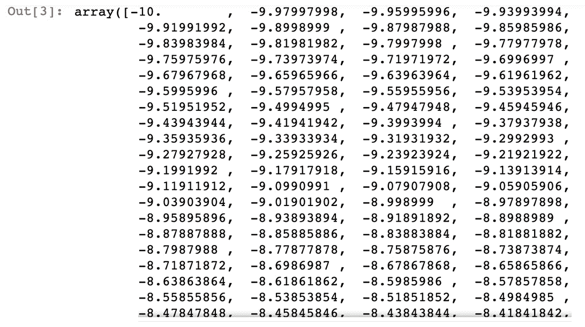
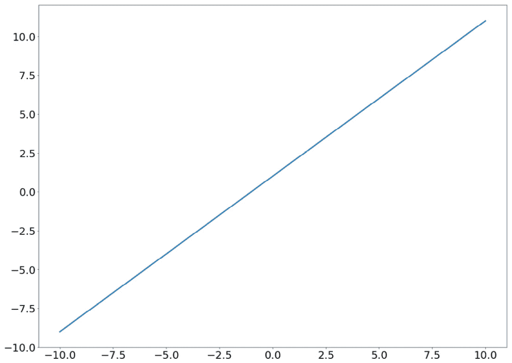
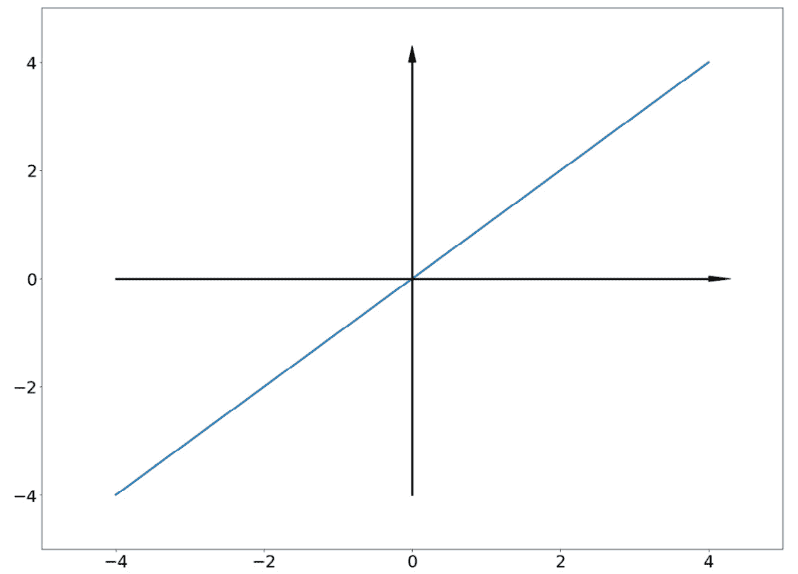
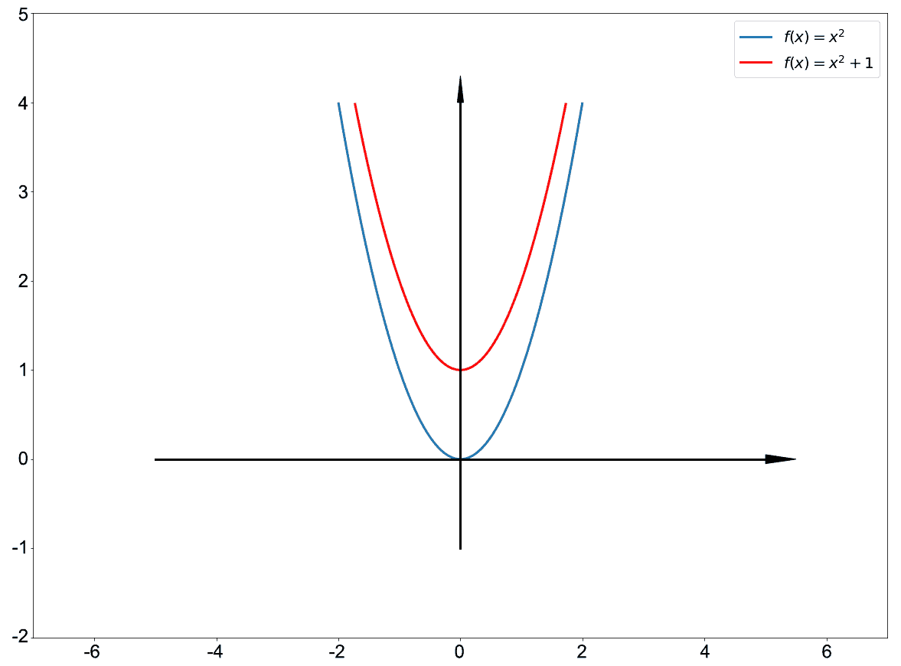
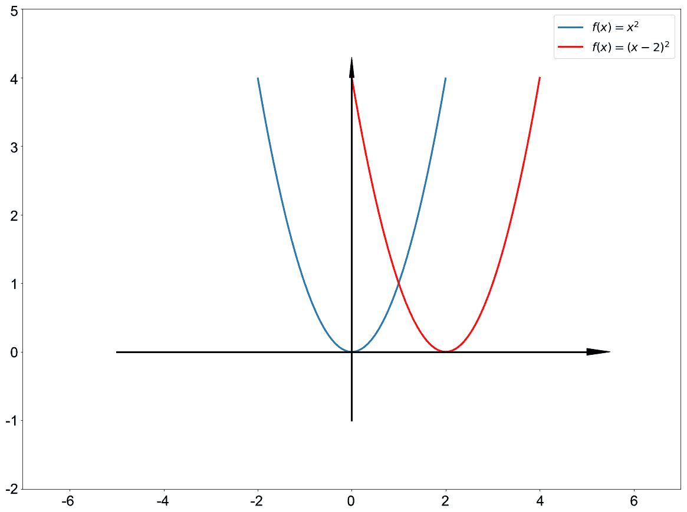
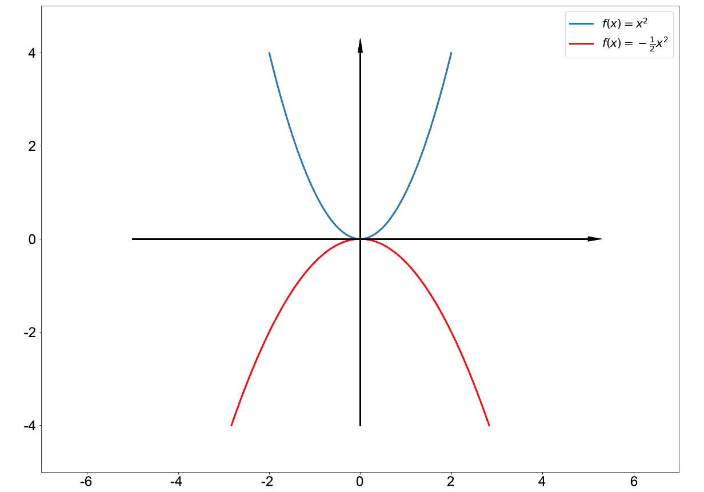
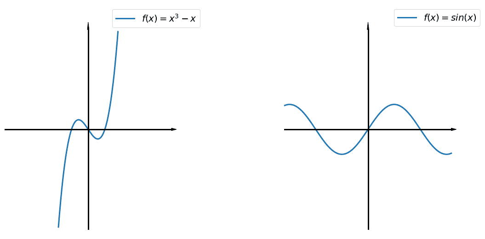
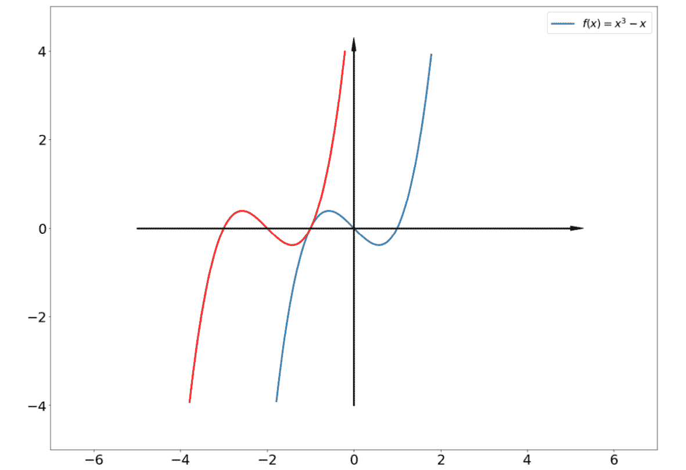
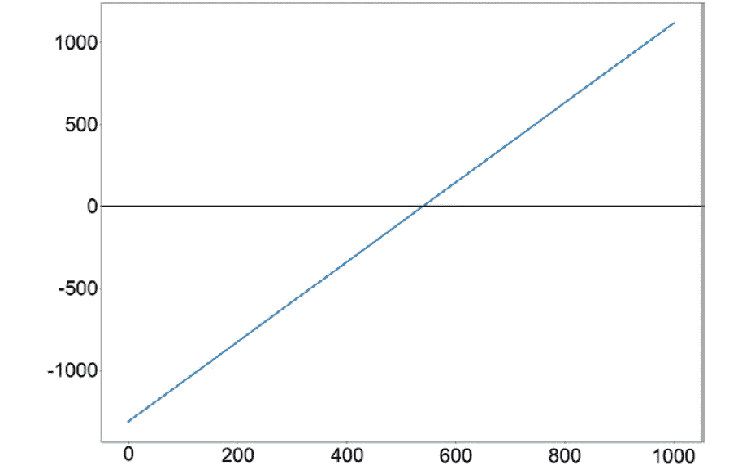
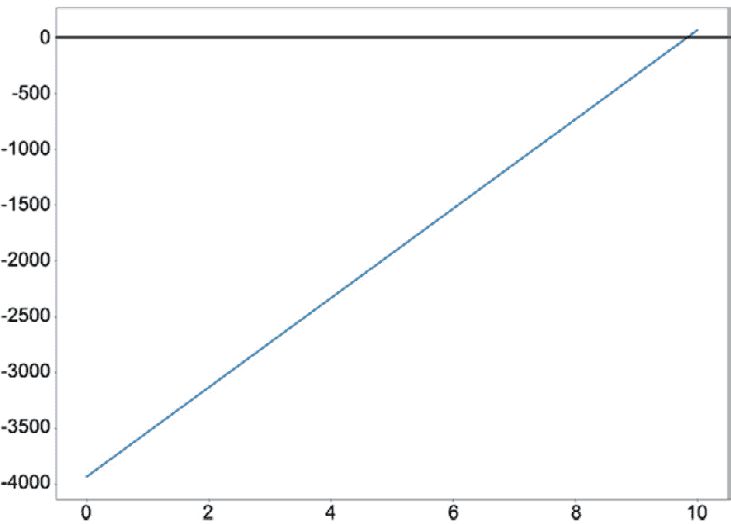

# 四、Python 函数与代数

概述

在上一章中，我们讨论了大量与统计相关的主题，包括变量、描述性统计和推断。在这一章中，我们回到数学的一般主题，并检查它的两个最基本的组成部分：函数和代数。这些主题将与它们各自在 Python 中的实现并行介绍和理论讨论。对这些主题的了解将使您能够解决一些最常见的现实生活问题，这些问题可以通过数学和编程来解决，我们将在本章的最后活动中看到一个例子。

本章结束时，您将牢牢掌握数学函数的概念以及相关概念，如域、范围和图形。此外，您还将学习如何通过 Python 编程手工求解代数方程或方程组。

# 导言

虽然数学可以分为多个子领域，如微积分、数论和几何，但每个数学学生都必须熟悉某些基本概念。其中两个概念是函数和代数，这是本章的主要主题。

函数是描述从一个对象到另一个对象的某种映射的一般数学过程。函数可以接受一个数字并生成另一个数字。它还可以接收一个数组或数字向量，并返回单个输出，甚至多个输出。函数非常重要，它们还广泛应用于其他科学领域，包括物理学、经济学，以及我们在本书中看到的编程。

本章的目标是在数学背景下对函数的概念进行具体的基础性讨论。此讨论将与其他相关主题结合，如域、范围和函数的绘图。对这些主题的深入理解将使您能够在后面的章节中探索更复杂的数学分析。

除了函数，我们还将考虑代数，数学中最重要的部分之一。虽然这个术语一般指的是对数学对象的分析和操作，从广义上讲，我们将在代数方程和方程组的上下文中考虑它。这将使我们能够研究它在数学中的重要作用，同时学习如何将这些知识应用于实际问题。

# 功能

如前所述，函数是通常接受一些输入并产生所需输出的数学对象。因此，函数通常被认为是一个数学对象到另一个数学对象的映射。当函数接收到输入并随后产生输出时，也可以使用*关系*的概念，它强调函数本身建立的可能输入集和可能输出集之间的关系。

函数通常由小写字母*f*和括号表示，括号围绕*f*接收的输入。该符号*f（x）*也表示*f*在接收*x*作为输入时产生的输出。例如，假设函数*f*输出其输入的平方；*f*可以表示为*f（x）=x*2。

我们看到在 Python 中声明函数的语法也遵循这个约定。例如，要在 Python 中声明相同的平方函数，代码如下所示：

```py
def f(x):
    return x ** 2
```

当我们想用一个数字作为输入来获得*f*的值时，我们简单地说我们在输入上调用*f*。例如：

```py
print(f(2))
print(f(-3))
```

此代码将分别打印出`4`和`9`。我们也知道，函数返回的值也可以通过赋值存储在变量中。

函数最重要的特征之一是，没有输入可以映射到不同的输出。一旦输入*x*与相应的输出*f（x）*相关联，则该输出是确定性的，并且不能有多个可能的值。另一方面，完全有可能将多个输入映射到同一输出。换句话说，*x*的多个值可以导致*f（x）*成为一个公共值。

函数也可能不必接受任何输入，也不必产生任何输出。例如，在编程环境中，其任务是读取和返回包含在特定文件中的数据的函数不需要接受任何输入。另一个例子是更新全局变量值的函数，在这种情况下，不需要返回任何内容。也就是说，这些函数可以被视为属于一般函数的特定子集，因此我们的讨论仍将围绕具有输入和输出的函数展开。

在这个即将到来的小节中，让我们考虑数学和编程中的一些常见函数类型。

## 常用功能

虽然每个函数都有其独特的方式，但我们需要了解一些特殊的函数分类，或*系列*。它们是常数、线性、多项式、对数和指数函数，总结如下表所示：


图 4.1：特殊功能系列表

花一点时间来考虑表中的第三列，它包含属于所列出的每个函数族的样本函数的图。在本节后面，我们将进一步探讨函数图的理论细节，但现在，我们看到每个函数族都给了我们一种独特的图形样式；事实上，从函数图中识别函数是我们即将进行的练习的主题。

请注意，常数函数和线性函数实际上是多项式函数族的子集（当*x*的较大幂的系数均为零时）。您可能已经注意到的另一个有趣的事实是，对数函数的输入必须是正的，这就是为什么它的曲线图没有延伸到*y*轴的左侧。相反，指数函数的输出（假定常数为正）总是正的；相应地，其图形位于*x*轴上方。这些要点直接将我们转移到下一个主题：函数的域和范围。

## 域和范围

域和范围是函数上下文中的两个基本概念。函数的域表示函数接受的所有可能输入的集合，而范围指定所有可能输出的集合。

大多数情况下，给定函数的域和范围可以通过考虑其公式化表达式来确定。例如，一个线性函数*f（x）=mx+c*接受任何实值*x*以产生实值*mx+c*，因此其域和范围都是实数集合*R*。另一方面，二次函数*f（x）=x*2 只产生非负输出，因此其范围是非负实数集。

函数的域和范围也可以用它的图来检查。考虑函数的一个输入和单个输出的图：它的域对应于图的投影到 Po.t0x x 席 T1 轴；同样，当绘图投影到*y*轴上时，获得范围。这就是为什么我们可以声称对数函数*f（x）=ln（x）*的域是正数集，其图包含在上一节的表格中。相反，指数函数*f（x）=e*x 的范围也是一组正数。

总的来说，函数的域和范围取决于函数本身的形式，并且对于函数的各种行为具有高度的信息性。其中一个通常令人感兴趣的行为是函数的根，我们将在下一小节中讨论。

## 函数根与方程

函数的根是属于其域的值，它使输出等于零。同样，函数的根取哪个值在很大程度上取决于函数本身。仍然使用上表中的示例，*图 4.1*，我们看到*f（x）=mx+c*接受*x=-c/m*的唯一根，如果*m*为非零，而*f（x）=ln（x）*具有【T10 x=1】的唯一根。有些函数可能有多个根：*f（x）=x*2*-3x+2*将*x=1*和*x=2*作为其根，而*f（x）=0*（其绘图对应于*x*轴）接受*x*的所有值作为其根。最后，如果函数的范围不包括 0，则函数本身没有任何根；这方面的例子包括*f（x）=e*x、*f（x）=x*2*+1*和*f（x）=3*。

求函数*f（x）*的所有根的过程等价于求解方程*f（x）=0*。这里的术语*方程*表示我们有两个独立的量，*f（x）*和*0*，在数学表达式中彼此相等。解方程可以说是数学中最核心的任务之一，有多种方法可以应用于特定的方程类型。

我们在这里只是介绍方程的概念，作为函数主题的一部分，我们将在本章后面的部分中再次讨论。现在，我们将继续讨论函数的最后一个重要组成部分：绘图。

## 函数的绘图

在前面的示例中，函数的绘图是输出行为相对于函数输入的可视化表示。具体地说，通过函数图，我们的目标是检查当函数的输入在其域中发生变化时，输出如何在函数范围内发生变化。

在编程环境中，可以通过在*x*轴上的一组细粒度均匀分布的值上连接对应于函数单个值的分散点来生成函数图。例如，假设我们想要可视化函数*f（x）=x+1*在`-10`和`10`之间的绘图，我们首先使用 NumPy 声明`x`的相应等距值：

```py
x = np.linspace(-10, 10, 1000)
```

此 NumPy 函数在`-10`和`10`之间生成 1000 个等距数字的数组，如`x`的输出所示：



图 4.2:NumPy 的等距数字

然后可以使用 Matplotlib 中的`plot()`函数生成绘图：

```py
plt.plot(x, x + 1)
plt.show()
```

请记住，由于矢量化，表达式`x + 1`将计算一个与`x`大小相同的数组，其元素是`x`的元素，每个元素加 1。这是 Python 语言（更具体地说是 NumPy 库）的一个重要特性，它允许我们快速生成构成函数图的点。

此代码应产生以下可视化效果：



图 4.3:Python 中 f（x）=x+1 的曲线图

相同的逻辑可以应用于不同形式的函数。我们将在下一次练习中回到这个过程。现在，让我们回到我们的理论讨论。

函数的绘图是其公式化表达式的直接可视化，包含我们需要了解的关于该函数的所有信息。特别是，我们已经指出，函数图可以帮助我们识别函数的域和范围。此外，给定一个图，我们甚至可以确定该图是否是有效函数的图。这是通过垂直线测试完成的，垂直线测试规定了以下内容。

给定二维平面上的图，如果对于每条垂直线（平行于*y*轴的每条线），该图有多个交点，则该图不是有效函数的图。这是我们前面提到的函数需求的直接推论：一个输入不能映射到多个输出。如果一个图形与一条垂直线至少有两个交点，这意味着*x*轴上的一个点可以映射到*y*轴上的至少两个点，这必然意味着这不是函数的绘图。

例如，考虑单位圆的下面的图（其中心是 Po.t0，o（0, 0）AUTT1，半径等于 Po.T2，1，Ty3T3），它不通过垂直线测试，用红线表示：


图 4.4：单位圆的垂直线测试

也就是说，单位圆实际上不是我们所考虑的关于二维平面的函数图。

本主题也标志着我们对函数定义介绍的结束。在我们继续下一节之前，让我们先做一个练习，旨在巩固我们迄今为止所学的所有概念。

## 练习 4.01：从图中识别功能

在本练习中，我们将练习分析给定函数情节的函数行为的技巧。这个过程将允许我们结合前面提到的各种主题，以及理解函数行为与其绘图之间的联系。

对于以下每个图表：

*   确定它是否对应于一个函数，如果是，则继续下一步。
*   确定函数的域、范围和公式（提示：使用标记的记号）。
*   确定函数是否至少有一个根。
*   使用 Python 复制绘图（不需要轴及其箭头）。

1.  **Horizontal line**:

    

    图 4.5：水平线

    该图确实对应于一个函数。函数为*f（x）=2*，域为实数集，范围为*{2}*。该函数没有任何根。

    以下代码可用于复制绘图：

    ```py
    import numpy as np
    import matplotlib.pyplot as plt
    x = np.linspace(-5, 5, 1000)
    plt.plot(
        x,  # evenly spaced numbers in the x-axis
        np.ones(1000) * 2  # all 2s in the y-axis
    )
    plt.show()
    ```

2.  **Rotated quadratic curve**:

    

    图 4.6：旋转二次曲线

    图形与函数不对应，因为它未通过垂直线测试。

3.  **Straight line**:

    

    图 4.7：直线

    该图对应于函数*f（x）=x*的绘图。这个函数的域和值域都是一组实数。该函数有一个根：*x=0*。

    以下代码可用于重现绘图（使用与*水平线*解决方案中相同的`x`变量）：

    ```py
    plt.plot(x, x)
    plt.show()
    ```

4.  **Quadratic curve**:

    

图 4.8：二次曲线

该图对应于函数*f（x）=x*2 的绘图。函数的域是所有实数的集合，而范围是非负数的集合。该函数还有一个根：*x=0*。

以下代码可用于复制绘图（得益于 NumPy 阵列的矢量化）：

```py
plt.plot(x, x ** 2)
plt.show()
```

通过这个快速练习，我们巩固了对函数和一些相关概念的理解，包括域、范围、垂直线测试以及使用 Python 绘制图形的过程。

笔记

要访问此特定部分的源代码，请参考[https://packt.live/2YRMZhL](https://packt.live/2YRMZhL) 。

您也可以在[在线运行此示例 https://packt.live/2YSBgj2](https://packt.live/2YSBgj2) 。

在下一节中，我们将讨论函数的转换。

# 函数变换

变换是数学函数中最重要的概念之一。正如术语名称所示，函数的转换是我们通过特定的转换技术（如移位或缩放）将函数的返回值放入后获得的输出。在最普遍的意义上，我们可以将此过程视为一个*复合函数*：将一个函数的输出传递给另一个函数。但是，由于特定的特性和用途，有一些特定类型的函数通常被用作转换，我们将在下面的小节中介绍它们，从移位开始。

由于转换最容易在应用于函数绘图的更改的上下文中理解，因此我们也将相应地构建下面的讨论。

## 班次

当函数的绘图沿*x*轴和/或*y*轴移动特定量时，函数发生移动。例如，在下面的可视化中，蓝色曲线是函数*f（x）=x*2 的图形，而红色曲线是垂直移动*1*的同一图形：



图 4.9：功能的垂直移动

我们看到，属于*f（x）=x*2 的图中的每个点*（x，y）*已经有效地转换为*（x，y+1）*。由于*y=x*2 如果*（x，y）*属于*f（x）*的图形，则移位的输出实质上是函数*f（x）=x*2*+1*的图形。

这个例子让我们概括了垂直位移的每种情况：任何给定函数*f（x）*的垂直位移通过常数*c*的输出是新函数*f（x）+c*。在我们的示例中，这是*c=1*，对应于向上移动*1*。然而，*c*也可以是负数，在这种情况下，函数下移，甚至可以是零，在这种情况下，变换是恒等变换，函数的图形不会改变。

我们看到，当一个函数的输出值增加（或减少）一个变化，或者换句话说，曲线图上点的*y*坐标时，垂直移动就完成了。以同样的方式，通过改变函数的输入值（当一个数字被添加到点的*x*坐标时），可以对函数应用水平移位。

通常，当函数*f（x）*的图形向二维平面的左侧偏移量*c*时，生成的图形是函数*f（x+c）*的绘图。相反，函数*f（x-c）*的图形对应于函数*f（x）*的*c*向右的水平位移。

仍然使用函数*f（x）=x*2 的示例，下图显示了函数向右移动*2*，或者换句话说，函数*f（x）=（x-2）*2 的图形：



图 4.10：功能的水平移动

还可以结合垂直移动和水平移动来变换函数，从而使整个图形在任何给定方向上移动。例如，假设我们想将函数*f（x）=x*2 在东北方向（向上和向右）移动量向量（*2，1*，那么转换后的函数将，正如您现在所猜测的，是*f（x）=（x-2）*2*+1*。

总的来说，作为变换的移位*会在垂直和/或水平方向上移动*函数的图形一定量。因此，移位也是一种*仿射变换*，它被定义为一种变换，将图形的所有点沿同一方向移动恒定距离。但是，移位不能更改图形的大小和比例。在下一节中，我们将讨论另一种可以进行转换的方法：缩放。

## 结垢

缩放变换根据缩放因子将函数的图形拉伸或收缩特定的量。在下面的可视化中考虑当应用于我们熟悉的函数时，缩放变换的输出，（2）：


图 4.11：函数的缩放

通过前面的缩放变换，将函数图形上的每个点*（x，y）*变换为*（x，y/2）*，有效地将图形水平缩放到更靠近*x*轴的位置。与函数*f（x）=x*2*/2*相对应的转换图比原始图宽，这是因为曲线被缩放以更接近*x*轴。更准确地说，除了原点（*0，0*之外，原始图形中的任何点都被*拉下*以更靠近*x*轴。这也会使图形的整体坡度降低。相反，将使变换图远离*x*轴的缩放变换可能是*f（x）=2x*2，或*f（x）=3x*2，从而使变换图的斜率更陡。

在这些变换中，我们将图形的*y*坐标乘以一个常数，从而控制相对于*x*轴的缩放。以类似的方式，当通过乘以函数图形的*x*坐标来应用缩放时，图形将相对于*y*轴拉伸或收缩。

通常，缩放变换的效果由*缩放因子*控制，该因子是图形的*x*或*y*坐标乘以的常数。正比例因子不会改变图形相对于轴的相对位置。

当是垂直缩放时（当*y*坐标被缩放时），小于 1 的正因子将*将*图形拉近*x*轴，而大因子将*将*图形推离轴。水平缩放的情况正好相反（当缩放*x*坐标时）；小于 1 的正因子将*将*图形推离*y*轴，大因子将*拉*。

虽然此*拉/推*效应对于负比例因子也是相同的，但当一个函数被负常数缩放时，其图形将沿着相应的轴*翻转*：



图 4.12：函数的负比例

正如我们在移位的情况中所看到的，可以同时对一个函数应用多个缩放变换以获得组合效果。

通常，移位和缩放构成函数变换的两种最常用方法。在下一个练习中，我们将练习从这两个变换对函数图的各自影响中识别这两个变换的技巧。

## 练习 4.02：功能转换识别

在此，我们旨在分析特定转换对函数图的影响，并确定转换的类型和特征。此练习将帮助我们熟悉转换如何操纵函数的行为。

下图包括一个三次函数*f（x）=x*3*-x*的曲线图，以及正弦函数*f（x）=sin（x）*的曲线图，由于其周期性，也称为正弦波：



图 4.13：三次函数和正弦波图

以下各图包括这两个函数图中的一个作为蓝色曲线，以及从中得到的特定变换结果作为红色曲线。对于每个图形：

1.  确定可能产生效果的转换。
2.  如果是移位，则确定移位向量的值（即，向上/向下移动多少，向左/向右移动多少）。
3.  如果是缩放，请确定缩放因子是正还是负，并估计其值（使用记号作为提示）。
4.  Verify your estimations by producing the same graph using Python (not including the axes and arrows).

    现在让我们看一看图表：

5.  **First transformation of a cubic curve**:

    

    图 4.14：三次曲线的第一次变换

    红色曲线是原始正弦波偏移的结果。由`2`向左水平移位，因此移位为`-2`。

    以下代码可用于复制绘图：

    ```py
    import numpy as np
    import matplotlib.pyplot as plt
    x = np.linspace(-5, 5, 1000)
    plt.plot(x, x ** 3 - x, c='blue')  
    plt.plot(x, (x + 2) ** 3 - (x + 2), c='red')  
    plt.ylim(-5, 5)
    plt.show()
    ```

6.  **Second transformation of a cubic curve**:

    

    图 4.15：三次曲线的第二次变换

    红色曲线是合成偏移的结果。这是一个水平向右移`2`和垂直向上移动`2`的组合。

    以下代码可用于重现绘图（使用相同的变量`x`：

    ```py
    plt.plot(x, x ** 3 - x, c='blue')  # original func
    plt.plot(x, (x - 2) ** 3 - (x - 2) + 2, c='red')  # transformed func
    plt.ylim(-5, 5)
    plt.show()
    ```

7.  **First transformation of a sine wave**:

    

    图 4.16：正弦波的第一次变换

    红色曲线是缩放的结果。距离*x*轴的垂直比例因子为`2`，因此比例因子为`2`。

    以下代码可用于重现绘图（使用相同的变量`x`：

    ```py
    plt.plot(x, np.sin(x), c='blue')  # original func
    plt.plot(x, np.sin(x) * 2, c='red')  # transformed func
    plt.ylim(-5, 5)
    plt.show()
    ```

8.  **Second transformation of a sine wave**:

    

图 4.17：正弦波的第二次变换

红色曲线是缩放的结果。这是一种水平缩放，将曲线拉近至*y*轴`2`因子，因此缩放因子为`2`。

以下代码可用于重现绘图（使用相同的变量`x`：

```py
plt.plot(x, np.sin(x), c='blue')  # original func
plt.plot(x, np.sin(x * 2), c='red')  # transformed func
plt.ylim(-5, 5)
plt.show()
```

因此，我们学习了如何通过检查变换对函数图的影响来识别变换类型及其变化程度。本练习还总结了本章中的函数主题。

笔记

要访问此特定部分的源代码，请参考[https://packt.live/2D2U7iR](https://packt.live/2D2U7iR) 。

您也可以在[在线运行此示例 https://packt.live/2YPtHcJ](https://packt.live/2YPtHcJ) 。

在下一节中，我们将深入探讨前面简要提到的一个相关概念：方程。

# 方程组

同样，当一个函数被赋值为 0，我们被要求找到满足该方程的函数输入值，通常为*x*，则形成一个方程。这些值称为原始函数的根。找到这些值的过程称为解方程，这是数学，特别是代数中的一个丰富主题。

在本节中，我们将讨论手工求解方程的两种基本方法，并研究 Python 中可用的计算工具，以促进自动求解方程的过程。我们将从第一种方法开始，代数运算。

## 代数运算

当我们将其归类为一种方法时，代数通常是一种将方程转化为更简单形式的技术，这样就可以很容易地找到解。翻译方程的一些典型方法是在方程两侧加/减一个常数，用非零常数乘/除两侧，或将方程的所有项移到一侧。

一个简单的例子是*3x-5=6*方程。

为了求解*x*，我们首先将左侧的数字*5*移动到右侧，将*5*添加到方程的两侧。这给了我们*3x=11*。

最后，我们将两边乘以*1/3*，得到变量*x*的值，即*x=11/3*。

这个简单的例子说明了用代数方法处理方程的整个过程背后的思想，这样我们就可以分离出*x*的值。让我们再举一个例子来说明这一点。假设我们有一个方程：*3x-7-2（19x-7）=（5x+9）/3+12*。

虽然这个方程式似乎比第一个方程式复杂得多，但过程实际上是一样的。我们首先展开括号内的术语，将涉及*x*的术语收集到一组中，然后将剩余的术语收集到另一组中。

这将为我们提供以下代数变换：


图 4.18：替换值以找到 x 的值

我们看到，这个过程通常非常简单，特别是当我们只处理*x*的*线性*项时。术语*线性*表示变量*x*乘以常数的量。总的来说，这里看到的两个方程的通用项是**线性方程**，它只包含*x*的线性项。正如我们所看到的，求解线性方程组是一个简单的过程，即使我们是手工操作。

相比之下，多项式方程是包含变量*x*且度数大于*1*的项的方程。多项式方程可以使用特定的技术有效地求解，这将在下一小节中讨论。现在，让我们考虑一个非线性方程的例子，即 Ty4Te3.3E-Tyt5，x + 2，T6，+ 3＝2（E-OrthT7，x，Ont8，+，100），Ty9T9，可以简单地用代数运算来求解。

注意，*e*是数学常数，它是自然对数函数的基础；约为*2.71828*。

笔记

有关该常数的更多信息，请访问[https://mathworld.wolfram.com/e.html](https://mathworld.wolfram.com/e.html) 。

为了求解这个方程，我们首先将方程中的项展开如下：*3e*x*e*2*+3=2e*x*+200*

左侧的转换是可能的，因为对于*a*的所有正数以及实数*x*和*y*的标识*a*x+y*=a*x*a*y。现在，我们看到，即使在这个方程中没有线性项*x*，我们仍然可以使用我们的策略来分离涉及*x*的项并将它们分组：


图 4.19：替换方程式中的值以找到 ex

现在，有了*e*x 的值，我们想提取*x*项。为此，我们将自然对数函数*f（x）=ln（x）*应用于方程的两侧。由于*x*的所有实值的*ln（e*x*）=x*，本步骤将把方程的左侧转换为简单的*x*：


图 4.20：代入方程式中的值，以求得 x

总的来说，使用代数变换求解方程的总体思路是将涉及*x*的所有项组合在一起，并将它们处理为单个项。同样，这种策略本身并不总是适用于任何方程，因为有时不可能将所有的*x*项简化为一个单独的项。这是多项式方程的情况，我们将在下一个解方程的方法：因子分解的上下文中讨论。

## 保理

虽然在技术上属于代数的总括项，**因式分解**具体表示将给定方程处理为以下形式的过程：


图 4.21：保理公式

如果这些项的乘积等于零，则至少有一项必须等于零才能满足方程。换言之，求解原始方程相当于求解方程*f*1*（x）=0*、*f*2*（x）=0*、*f*n*（x）=0*中的每一个。理想情况下，我们希望这些*f*i*（x）=0*方程比原始方程更容易求解。

让我们考虑一个开始的例子：x2＝100。

使用恒等式*x*2*-y*2*=（x-y）（x+y）*对所有实*x*和*y*值，该方程等价于*（x-10）（x+10）=0*。

因为它们的乘积是零，所以*x-10*或*x+10*也必须是零。通过求解这两个方程，我们可以得到原始方程的解：*x=10*或*x=-10*。

虽然这是一个相当简单的例子，但它能够说明许多要点。首先，通过将方程分解为不同的项乘以等于 0，将问题转化为一组更简单的子问题。此外，通过因子分解，我们可以实现简单的加法/乘法操作无法实现的功能：求解多项式方程。

让我们考虑下一个等式的例子：Po.t0×x，Ont1，3，T2，-7x，T3，2，T4，+15x＝9

我们看到，即使涉及*x*的所有术语已经组合在一起，我们也不清楚应该如何处理简单代数。

在这里，有见地的数学学生可能会注意到，该方程接受*x=1*或*x=3*作为解（因为插入这些值会使方程的左侧计算为 0）。一个多项式方程接受*x=c*作为解，这不仅意味着将方程中的*x*替换为*c*，它的计算结果将为零，还意味着方程本身可以分解为*（x-c）g（x）=0*，其中*g（x）*是方程的另一个因子项。这种技术还有另一个名字，Ruffini 法则，关于它，你可以在[上找到更多信息 https://mathworld.wolfram.com/RuffinisRule.html](https://mathworld.wolfram.com/RuffinisRule.html) 。考虑到这一点，我们尝试将给定方程中关于术语*（x-1）*的因子计算如下：


图 4.22：给定方程的因式分解

请记住，该方程也接受*x=3*作为解，我们继续将*（x*2*-6x+9】*因子乘以另一项，将*（x-3）*因子化。如果你熟悉二次公式，你可能已经知道这个方程可以分解成*（x-1）（x-3）*2*=0*。

最后，我们证明了给定的方程确实接受两个解：*x=1*和*x=3*。

次数为*n*的多项式方程是*x*的最大次数为*n*的多项式方程。总的来说，我们想将这样一个等式考虑到*n*不同的因素。这是因为可以从数学上证明一个次数为*n*的多项式方程最多只能有*n*个唯一解。

换句话说，如果我们能够成功地将一个方程转化为*n*个不同的因子，那么这些因子中的每一个都是*x*的线性项，可以使用上面讨论的第一种方法轻松求解。例如，方程*2x*3*-7x*2*+7x-2=0*可以分解为*（x-1）（x-2）（2x-1）=0*，这给了我们三种解决方案：*x=1*、*x=2*、*x=1/2*。

当然，在某些情况下，*n*次多项式方程无法分解为*x*的*n*不同线性项。考虑下面的例子方程：To.T6，x，Po.T7，3，T8，+4X - 5＝0。

它接受一个解*x=1*，因此有一个系数*（x-1）*：


图 4.23:x=1 的系数

现在，考虑术语 To 0，x，x，T1，2，2，2，5，3，3。如果我们尝试将*x*的各种值插入方程中，我们会发现没有一个值能够满足方程。这表明该方程没有解，或者更具体地说，*x*的所有值的*x*2*+x+5*都大于 0，我们将证明该说法。

当我们想证明一个变量的二次函数总是大于 0 时，我们可以利用以下事实：*（g（x））*2 对于*x*的所有实数值和*g*的所有函数总是非负的（这是因为任何实数的平方都是非负的）。如果我们可以将术语*x*2*+x+5*改写为*（g（x））*2*+c*，其中*c*是一个正常数，我们可以证明该术语始终是正的。

在这里，我们使用**完成平方技巧**将*x*项组合成一个平方。这项技术涉及使用身份*（a+b）*2*=a*2*+2ab+b*2 对*a*和*b*的所有值构造*（g（x））*2。具体来说，术语*x*可以重写为*2x（1/2）*，因为我们需要它是 2 乘以*x*乘以另一个数字的形式。所以我们有*x*2 和*2x（1/2）；*因此我们需要*（1/2）*2*=1/4*来*完成*三个数字之和的平方运算：*x*2*+x+1/4=x*2*+2x（1/2）+（1/2）*2*=（x+1/2）*2。

因此，整个术语可以转换为*x*2*+x+5=（x*2*+x+1/4）+19/4=（x+1/2）*2*+19/4*。

*（x+1/2）*2 对于*x*的任何实值都是非负的，因此整个*（x+1/2）*2*+19/4*项大于或等于*19/4*。也就是说，*x*没有实际值使得术语*x*2*+x+5*等于*0*；换句话说，方程*x*2*+x+5=0*没有解。

这是一个关于分解多项式方程的技术的概述。作为方程主题的最后一点，我们将讨论如何使用 Python 来自动化求解方程的过程。

## 使用 Python

除了手动求解方程的两种方法外，我们还可以选择利用 Python 的计算能力自动求解任何方程。在本节中，我们将在`SymPy`库的上下文中研究这个过程。

广义而言，Symphy 是 Python 中用于符号数学的最佳库之一，它是涉及符号的代数计算的总括术语（如*x*、*y*和*f（x）*）。虽然 Symphy 提供了广泛的 API，包括对不同数学子领域的支持，包括微积分、几何、逻辑和数论，但在本章中，我们将仅探讨其解决方程和（在下一节中）方程组的选项。

笔记

您可以在图书馆的官方网站[上找到更多信息 https://docs.sympy.org/latest/index.html](https://docs.sympy.org/latest/index.html) 。

首先，我们需要为 Python 环境安装库。这个过程一如既往地可以通过`pip`和`conda`完成。运行以下任一命令：

```py
$ pip install sympy
$ conda install sympy
```

在成功安装库之后，让我们使用一个具体的示例来探索它提供的选项，我们在上一节中考虑了一个等式：*x*3*-7x*2*+15x=9*。

作为符号数学的工具，Symphy 提供了一个简单的 API 来声明变量和函数。为此，我们首先从 Symphy 库导入`Symbol`类，并声明一个名为`x`的变量：

```py
from sympy import Symbol
x = Symbol('x')
```

当`x`在 Jupyter 笔记本中打印出来时，我们将看到该字母实际上被格式化为一个数学符号：


图 4.24：Jupyter 笔记本中的 SymPy 符号

现在，为了求解给定的方程，我们从`sympy.solvers`包中导入`solve()`函数。此`solve()`函数接收包含 SymPy 符号的表达式（在本例中，它是我们的变量`x`，并查找使表达式计算为 0 的`x`值。换言之，为了解决*x*3*-7x*2*+15x=9*，我们输入以下代码：

```py
from sympy.solvers import solve
solve(x ** 3 - 7 * x ** 2 + 15 * x - 9, x)
```

此代码段返回`x`的解决方案列表，在本例中为`[1, 3]`。我们看到，这与我们先前通过因子分解找到的解决方案相对应。

让我们看看我们前面解决的另一个例子：*3e*x+2*+3=2（e*x*+100）。*记住这个方程有一个根，*x=ln（197/（3e*2*-2】）*，约为 2.279。现在，我们像这样将这个方程输入到`solve()`函数中（从内置`math`库导入常数`e`后）：

```py
from math import e
solve(3 * e ** (x + 2) + 3 - 2 * (e ** x + 100), x)
```

这将为我们提供以下输出：

```py
[2.27914777845756]
```

正如我们所看到的，这是从代数分析中得到的相同解。总的来说，Symphy 能够声明变量并将任何形式的函数作为`solve()`函数的输入，因此它为我们提供了一种灵活方便的方法，用 Python 计算求解方程。

本主题还总结了我们关于方程及其求解方法的讨论。在我们继续本章的下一个主题之前，让我们先做一个练习来练习本节所学的内容。

## 练习 4.03：盈亏平衡分析介绍

盈亏平衡分析是经济学和金融工程中的一种常见做法。盈亏平衡分析的目标是找到企业收入平衡成本的具体时间点。因此，及时发现这些时间点对于企业主和利益相关者非常重要，他们有兴趣知道他们是否以及何时会盈利。

我们将在本练习中使用数学变量和函数对该场景进行建模。具体而言，我们的目标是建立一个简单的业务模型，并通过解决盈亏平衡点进行盈亏平衡分析。最后，您将更加熟悉使用数学模型、函数和变量表示现实生活情况的过程。

**场景**：一家汉堡店出售的每个汉堡的原料成本为 6.56 美元。它还每月产生 1312.13 美元的固定成本，这包括厨师的工资、租金、水电费等。餐厅老板希望进行盈亏平衡分析，以确定收入是否以及何时能够弥补成本。

1.  创建一个新的 Jupyter 笔记本，并在第一个代码单元中导入 NumPy、Matplotlib 和 SymPy:

    ```py
    import numpy as np
    import matplotlib.pyplot as plt
    from sympy.solvers import solve
    from sympy import Symbol
    ```

2.  Say the restaurant sets the price of each of the burgers it sells at $8.99 and let *x* be a variable that represents the number of burgers that need to be sold each month so that the revenue made is equal to the cost. Write down the equation for *x* in this situation.

    以*x*为出售汉堡的数量，*8.99x*为餐厅的收入，*6.56x+1312.13*为餐厅的成本。因此，*x*的方程式为：

    *8.99x=6.56x+1312.13*

3.  Solve for *x* by hand and verify the result using Python in the next cell of the Jupyter notebook. For testing purposes, store the list of solutions returned by SymPy to a variable named `sols`.

    通过简单的代数变换，我们可以将*x*解为*x=1312.13/（8.99–6.56）=539.97*。因此，这家餐厅需要销售大约 540 个汉堡才能实现收支平衡。

    以下代码可用于使用 SymPy 求解*x*：

    ```py
    x = Symbol('x')
    sols = solve(8.99 * x - 6.56 * x - 1312.13, x)
    ```

    `sols`变量的值应为`[539.971193415638]`，这与我们的解决方案相对应。

4.  Instead of solving for *x* to be the break-even point, construct a function of *x* that represents the total profit (revenue minus cost) of the restaurant every month.

    函数应该是*f（x）=8.99x-6.56x-1312.13=2.43x-1312.13*。

5.  In the next code cell of the Jupyter notebook, plot this function for the *x* values between 0 and 1000 using NumPy and Matplotlib, along with a horizontal line at 0, which should be colored black:

    ```py
    xs = np.linspace(0, 1000, 1000)
    plt.plot(xs, 2.43 * xs - 1312.13)
    plt.axhline(0, c='k')
    plt.show()
    ```

    这将生成以下曲线图：

    

    图 4.25：盈亏平衡分析的可视化

    利润曲线和水平线的交点代表盈亏平衡点。在这种情况下，我们可以看到它大致位于`540`的*x*坐标处，对应于实际的盈亏平衡点。

6.  Say the restaurant on average sells 400 burgers every month and now let *x* be the price of a burger that the restaurant can set so that they can break even. Write down the equation for *x* in this situation.

    由于*x*是一个汉堡的价格，*400x*是餐厅将获得的利润，而*（400）6.56+1312.13=3936.13*（*$6.56*是每一个汉堡和固定金额的*$1312.13*是餐厅将产生的成本。因此，*x*的方程式为*400x=3936.13*。

7.  Solve for *x* by hand and verify the result with SymPy in the Jupyter notebook. Store the list of solutions returned by SymPy in a variable named `sols1`.

    这个方程可以简单地用两边除以 400 来求解，得到*x=9.84*。求解相同等式的 Python 代码如下所示，这也会产生相同的结果：

    ```py
    sols1 = solve(400 * x - 3936.13, x)
    sols1
    ```

8.  In the next code cell, plot the function that represents the difference between profit and cost for the *x* values between `0` and `10`, together with the horizontal line at `0`:

    ```py
    xs = np.linspace(0, 10, 1000)
    plt.plot(xs, 400 * xs - 3936.13)
    plt.axhline(0, c='k')
    plt.show()
    ```

    这将生成以下曲线图：

    

图 4.26：盈亏平衡分析的可视化

同样，两条线的交点（代表盈亏平衡点）与我们推导的实际解一致。

我们的练习到此结束。在本书中，我们通过使用数学函数和变量对一个实际业务样本进行建模，介绍了盈亏平衡分析的概念。我们已经学会了如何找到要生产的产品的数量以及要达到收支平衡的正确价格。

笔记

要访问此特定部分的源代码，请参考[https://packt.live/3gn3JU3](https://packt.live/3gn3JU3) 。

您也可以在[在线运行此示例 https://packt.live/3gkeA0V](https://packt.live/3gkeA0V) 。

当然，现实生活中的业务场景更为复杂，涉及的因素也更多。我们将在本章末尾回到活动中的盈亏平衡分析任务，但在此之前，我们需要讨论本章的最后一节：方程组。

# 方程组

方程是一个等式，我们需要通过求解特定变量的值来满足它。在一个方程组中，我们有多个涉及多个变量的方程，目标仍然是一样的：求解这些变量的值，使系统中的每个方程都得到满足。

总的来说，一个系统可以拥有的方程数量没有限制。然而，可以严格证明，当一个系统的方程数目不等于它的变量数目时，该系统要么有无穷多个解，要么没有解。在本节中，我们将只考虑这两个数字匹配的情况。

此外，我们将考虑两种不同类型的方程组：线性方程组和非线性方程组。我们将考虑用手和使用 Python 来求解这两种方程系统中的每一种的方法。首先，让我们讨论线性方程组的概念。

## 线性方程组

与仅包含常数及其变量的线性项的线性方程组类似，线性方程组由线性方程组组成，线性方程组也仅包含其变量和常数的线性组合。

此类系统的一个简单示例如下：


图 4.27：线性方程组示例

我们可以看到，这个方程组有两个变量：*x*和*y*。两个方程中的每一个都包含这些变量乘以常数（线性项）以及常数本身。

为了解这个方程组，你可能已经注意到，如果我们将两个方程的各自边相加，我们会得到一个额外的方程，*3y=8*，然后我们可以解出*y=8/3*，然后解出*x=5-8/3=7/3*。

总的来说，这种方法需要将提供给我们的方程乘以不同的常数，然后将它们相加，以顺序消除变量。我们的目标是得到一个方程，该方程只剩下单个变量的线性项（以及可能的常数），从中我们可以求解该变量。然后，该变量的解值将插入原始方程中，其余变量的过程将继续。

当我们拥有的变量/方程数量相对较少时，这个过程是简单的，但随着这个数量的增加，它会变得相当混乱。在这一节中，我们将考虑一种称为“ORT T0”行减少的方法，即 T1 T1，或者 Apple T2 高斯消去法 T3，这将帮助我们形式化，然后使求解方程组的过程自动化。

假设我们被要求用*n*变量和*n*方程求解以下一般线性方程组：


图 4.28：具有 n 个变量和 n 个方程的线性方程组

这里，*c*ij 是*i*th 方程中变量*x*j 的常数系数。同样，这些*c*ij 值可以取任何常数值，这个方程组是任何线性方程组的最一般形式。

为了应用行缩减方法，我们构造了一个称为增广矩阵的矩阵，如下所示：


图 4.29：扩充矩阵

矩阵的左侧部分是一个*n*乘*n*子矩阵，其元素对应于原始方程组中的常系数；矩阵的右侧是一列，列中有*n*值，对应于原始系统中等式右侧的常量值。

现在，从这个扩充矩阵，我们可以执行三种类型的转换：

*   交换任意给定两行的位置。
*   将一行乘以一个非零常数。
*   将一行添加到任何其他行（也可能乘以非零常量）。

该方法的目标是将增广矩阵转换为*缩减行梯队形式*，或者，因为我们有一个*n*方程和*n*变量的系统，一个单位矩阵，其中*i*中的*i*第元素第 th 行是 1，该行中的其他元素都是*0*。本质上，我们希望将扩充矩阵转换为该矩阵：


图 4.30：矩阵变换

完成此操作后，*c*i*值对应于构成原始方程组解的值。换句话说，解决方案是*x*1*=c*1*、*x*2*=c*2*等等。***

 ***虽然这种数学概括看起来很吓人，但让我们通过一个具体的例子来揭开这个过程的神秘面纱。假设我们要求解以下线性方程组：


图 4.31：线性方程组

我们首先构造相应的增广矩阵：


图 4.32：相应的增广矩阵

现在，我们的目标是使用上述三种变换方法将该矩阵变换为恒等式形式。我们首先将第二行减去第一行的三倍，然后将其除以 4，得到：


图 4.33：将矩阵转换为单位矩阵的步骤 1

同样，目标是在左侧创建一个单位矩阵的结构，这可以通过强制非对角元素为零来实现。我们已经对第二行的第一个元素做了这样的操作，现在让我们尝试对第三行做同样的操作，将其减去第一行的两倍：


图 4.34：将矩阵转换为单位矩阵的步骤 2

第三行上的第二个元素将被转换为 0，这可以通过将第三行减去第二行的两倍来实现：


图 4.35：将矩阵转换为单位矩阵的步骤 3

一旦最后一行的格式正确，转换其他行也相对容易。现在我们将第二行减去第三行的三倍，再乘以-1，得到：


图 4.36：将矩阵转换为单位矩阵的步骤 4

对于第一行，我们首先将第三行添加两倍，以消除最后一个元素：


图 4.37：将矩阵转换为单位矩阵的步骤 5

最后，我们将其减去第二行的三倍，这使我们能够获得扩充矩阵的缩减行梯队形式（单位矩阵位于左侧）：


图 4.38：身份矩阵

这对应于其中*x=1*、*y=2*和*z=3*的溶液。我们可以通过将这些值插入原始方程组来确保我们的解确实是正确的，这表明它们确实满足该系统。

这就是使用行缩减方法的过程。如前所述，解线性方程组的另一种方法是矩阵解。这涉及到将给定系统表示为矩阵方程。具体而言，从任何线性方程组的一般形式：


图 4.39：线性方程组

我们可以用矩阵表示法将其改写为*Ax=c*，其中*A*是*n*乘以*n*矩阵，其中包含常数系数，*x*是包含我们必须求解的变量的向量：*x*1、*x*2、*x*n，*c*同样是包含常数系数*c*1、*c*2、*c*n 的向量。由于矩阵和向量的乘积的定义，方程*Ax=c*确实与原始方程组等价。

在这种矩阵表示法中，向量*x*可以很容易地解为*x=A*-1*c*，其中*A*-1 是*A*的*逆矩阵*。任何给定矩阵*M*的逆矩阵*M*-1】是满足方程*A*-1*=I*的矩阵，其中*I*是单位矩阵。

矩阵和向量之间的乘积称为**点积**，它输出另一个向量，其元素等于原始矩阵和向量中相应元素的乘积之和。在我们的例子中，*A*-1 和*c*之间的点积将为我们提供一个构成系统解的向量。

有些矩阵没有相应的逆矩阵；这些矩阵称为奇异矩阵。我们可以用来判断矩阵是否奇异的一个标志是，矩阵的一行正好是另一行乘以常数。

从理论上讲，这类似于一个系统的一个方程中的系数是另一个方程中的系数乘以常数的情况。如果是这种情况，我们要么有重复的信息（当两个方程有相同的信息时，系统有无穷多个解），要么有冲突的信息（当两个方程右侧的常数不匹配时，系统没有解）。

这背后的理论不在本书的范围之内。现在，我们只需要知道，如果线性方程组的相应系数矩阵没有逆矩阵，那么系统就没有定解。

所以，不是每个矩阵都有自己的逆矩阵，即使给定的矩阵有，逆矩阵的计算过程也会非常复杂。幸运的是，使用 Python 和 NumPy 可以相对轻松地完成这项工作，我们将在接下来的练习中看到这一点。具体来说，NumPy 中的`linalg`（代表线性代数）包提供了许多线性代数相关算法的高效实现。这里，我们感兴趣的是`inv()`函数，它接受表示矩阵的二维 NumPy 数组，并返回相应的逆矩阵。我们将在下一个练习中直接看到此功能的效果；有关该套餐的更多信息，请访问[https://docs.scipy.org/doc/numpy/reference/routines.linalg.html](https://docs.scipy.org/doc/numpy/reference/routines.linalg.html) 。

## 练习 4.04：使用 NumPy 的矩阵解

在本练习中，我们将编写一个程序，该程序接受线性方程组，并使用矩阵解法生成其解。同样，这将通过使用 NumPy 计算系数矩阵的逆来实现：

1.  创建一个 Jupyter 笔记本。在其第一个单元格中，从其`linalg`包

    ```py
    import numpy as np
    from numpy.linalg import inv
    ```

    中导入 NumPy 和`inv()`函数
2.  In the next code cell, declare a function named `solve_eq_sys()` (for testing purposes) that takes in two arguments: `coeff_matrix`, which stores the matrix of constant coefficients in a system of linear equations, and `c`, which stores a vector of the constant values on the right-hand side of the equations:

    ```py
    def solve_eq_sys(coeff_matrix, c):
    ```

    这两个参数完全定义了线性方程组的一个实例，`solve_eq_sys()`函数的任务是计算其解。我们进一步假设参数都存储为 NumPy 数组。

3.  Recalling that the solution for the system is *x = A*-1 *c*, we simply return the product of the inverse matrix of `coeff_matrix` and `c`.

    逆矩阵可使用 NumPy 的`inv()`函数计算：

    ```py
    inv_matrix = inv(coeff_matrix)
    ```

    最后，可以使用`dot()`方法计算解，该方法计算矩阵和向量的点积：

    ```py
    return inv_matrix.dot(c)
    ```

    我们的函数应该如下所示：

    ```py
    def solve_eq_sys(coeff_matrix, c):
        inv_matrix = inv(coeff_matrix)
        return inv_matrix.dot(c)
    ```

4.  In the next code cell, declare the corresponding coefficient matrix and `c` vector for the system of equations that we considered earlier and call the `solve_eq_sys()` function on them:

    

    图 4.40：线性方程组

    这方面的代码应为：

    ```py
    coeff_matrix = np.array([[1, 3, -2],\
                             [3, 5, 6],\
                             [2, 4, 3]])
    c = np.array([1, 31, 19])
    solve_eq_sys(coeff_matrix, c)
    ```

    此代码应产生以下输出：

    ```py
    array([1., 2., 3.])
    ```

    我们看到，该输出与我们使用行缩减方法导出的方程组的实际解完全对应：*x=1*、*y=2*和*z=3*。

5.  Now, we would like to take into account the case where our coefficient matrix is singular. We do this by testing our code on the following sample system of linear equations that has no solution:

    

    图 4.41：线性方程组样本系统

    我们看到，如果我们将第一个方程乘以`2`，我们得到的方程与第三个方程相矛盾。换言之，变量*x*、*y*和*z*的值组合不能满足系统要求。

    在下一个代码单元中，调用此系数矩阵上的`inv()`函数：

    ```py
    inv(np.array([[1, 3, -2],\
                  [3, 5, 6],\
                   [2, 6, -4]]))
    ```

    我们将看到这段代码产生了一个`LinAlgError: Singular matrix`错误，我们将在下一步中修复它。

    出于测试目的，请取消对该单元格的注释。

6.  Come back to our code and modify our current `solve_eq_sys()` function with a `try...except` block to handle this error, which will need to be imported from NumPy first:

    ```py
    from numpy.linalg import inv, LinAlgError
    ```

    现在，如果输入矩阵是奇异的，函数应该返回`False`。它应该如下所示：

    ```py
    def solve_eq_sys(coeff_matrix, c):
        try:
            inv_matrix = inv(coeff_matrix)
            return inv_matrix.dot(c)
        except LinAlgError:
            return False
    ```

7.  在下一个代码单元中，对我们在*步骤 5*：

    ```py
    coeff_matrix = np.array([[1, 3, -2],\
                             [3, 5, 6],\
                             [2, 6, -4]])
    c = np.array([1, 31, 19])
    solve_eq_sys(coeff_matrix, c)
    ```

    中使用的示例方程组调用此函数

这一次，函数返回值`False`，这是我们想要的行为。

通过本练习，我们学习了如何使用 NumPy 实现矩阵解法来求解线性方程组。这也结束了线性方程组的主题。

笔记

要访问此特定部分的源代码，请参考[https://packt.live/2NPpQpK](https://packt.live/2NPpQpK) 。

您也可以在[在线运行此示例 https://packt.live/2VBNg6w](https://packt.live/2VBNg6w) 。

在本章的下一个和最后一节中，我们将考虑不是完全线性的方程组。

## 非线性方程组

当一个系统包含一个包含其变量的一些非线性项的方程时，我们在上一节中讨论的方法不适用。例如，考虑以下系统：


图 4.42：非线性方程组示例

问题出现在非线性项*x*2 上，它使我们想要应用于系统的任何变换复杂化。

然而，我们仍然可以有一个系统的方法来解决这些类型的系统。具体地说，请注意，从任何一个方程中，我们都可以用另一个变量来求解一个变量。为此，我们对每个方程进行代数变换，使一个变量可以用另一个变量来表示。具体而言，*y*可以表示为*x*的函数，如下所示：


图 4.43：代入方程式以求得 y 的值

因此，为了使系统有一个有效的解决方案，*y*的两个值需要匹配。换言之，我们有以下方程式，其中只包含*x*：


图 4.44：在两侧替换 y 值

这只是一个关于*x*的多项式方程，我们知道，它可以通过因子分解来求解。具体来说，该方程可以分解为*（x-2）（x-1）=0*，这显然接受*x=1*和*x=2*作为解。*x*的每个值对应于*y*的一个值，可以通过在原始方程组中插入 1 和 2 来找到。最后，系统有两种解决方案：*（x=1，y=4）*和*（x=2，y=3）*。

总的来说，这种方法被称为**替代**，表示我们可以通过转换一个方程，用另一个变量来求解一个变量。然后把这个解代入另一个方程，这样我们就得到了一个单变量方程。

让我们看另一个使用以下方程组的方法应用示例：


图 4.45：方程组示例

虽然解决这个问题有多种方法，但有一种明确的方法是对第二个方程中的*y*进行求解，从而得到*y=（x*2*-1）/2*，然后可以插入第一个方程，如*x*2*-2x-（x*2*-1】*2*/4=-1*。

通过一些代数，我们可以将方程简化为*x*4*-6x*2*+8x-3=0*。

我们现在有一个只包含一个变量的方程，因此我们可以应用上一节中学习的技术来求解*x*。一旦我们有了*x*的解，我们也可以使用前面的*y=（x*2*-1）/2*替换来解*y*。

这里，因子分解可用于找到满足该方程的*x*的值。让我们试着插入一些*x*的值，例如*-1*、*0*、*1*或*2*，看看哪个值会将函数评估为 0。注意到*x=1*是一个有效解，我们首先对*（x-1）*的方程进行因子化，从而得到*（x-1）（x*3*+x*2*-5x+3）=0*。

再次，我们注意到*x=1*仍然满足方程*x*3*+x*2*-5x+3=0*，从而采取另一个分解步骤到*（x-1）*2*（x*2*+2x-3】=0*。

二次函数*x*2*+2x-3*可以分解为*（x-1）（x+3）*。最后，我们得到以下等式*（x-1）*3*（x+3）=0*。

*x*的两个值满足方程：*x=1*和*x=-3*。通过将它们插入原始系统中，我们可以对*y*进行求解，得到系统的两个解：*（x=1，y=0）*和*（x=-3，y=4）*。

不幸的是，并非所有的非线性方程组都允许我们以如此直接的方式使用替代方法。在许多情况下，必须使用微妙和巧妙的技术来解决复杂的方程组。

那么，如果我们想自动化为此类系统寻找解决方案的过程，该怎么办？这就是`sympy`库提供的符号计算能力再次派上用场的地方。我们已经看到，使用 Symphy，我们可以求解任何一个变量方程。同样的想法也适用于非线性方程组，只有在这种情况下，我们将符号函数列表传递给`solve()`函数。

假设我们想用 Symphy 来解这一节中的两个方程组；首先：


图 4.46：第一个方程组

第二：


图 4.47：第二个方程组

为此，我们首先将变量声明为 Symphy 中`Symbol`类的实例：

```py
x = Symbol('x')
y = Symbol('y')
```

然后我们可以从 Symphy 调用`solve()`函数来找到我们所拥有的方程组的解。首先：

```py
solve([x + y - 5, x ** 2 - x + 2 * y - 8],\
       x, y)
```

此代码将返回`[(1, 4), (2, 3)]`，这是我们前面推导的*x*和*y*的有效解决方案列表。至于第二个系统：

```py
solve([x ** 2 - 2 * x - y ** 2 + 1, x ** 2 - 2 * y - 1],\
       x, y)
```

此代码返回`[(-3, 4), (1, 0)]`，它也对应于我们导出的解决方案。正如我们所见，SymPy 为我们提供了一种简单的语法，可以轻松地求解方程和方程组。

此示例还标记了此部分的材质结束。为了结束这一章，我们将考虑我们先前研究过的盈亏平衡分析练习的扩展。

## 活动 4.01：多变量盈亏平衡分析

正如我们在第一次盈亏平衡分析练习结束时提到的，随着模型中变量数量的增加，盈亏平衡分析可能变得相当复杂。当一个模型中有多个变量时，需要使用一个方程组来找到盈亏平衡点，这就是我们在本活动中要做的。

回想一下，在我们的汉堡餐厅商业模式示例中，我们生产的每个汉堡的成本为 6.56 美元，而水电费、租金和其他费用的固定成本为每月 1312.13 美元。在本次活动中，我们将探讨业务的总利润如何随我们出售的汉堡数量和每个汉堡的价格而变化。

这个模型需要的另一个信息是生活在餐厅区域的人们对汉堡的需求。比如说，这家餐厅平均每月收入约为 4000 美元，因此汉堡需求量约为 4000 美元除以汉堡价格。

要完成此活动，请执行以下步骤：

1.  考虑餐馆每月生产的汉堡数量和每个汉堡的价格作为我们模型的两个变量。根据这两个变量表示餐厅的月收入、成本和总利润。
2.  构建一个与盈亏平衡点相对应的方程组：当餐厅制作的汉堡数量满足需求且收入等于成本时。
3.  用手求解这个方程组，并用 Jupyter 笔记本中的 Symphy 验证结果。
4.  在同一个 Jupyter 笔记本中，编写一个 Python 函数，该函数接受生产的汉堡数量和每个汉堡的价格的任意给定组合。其功能是返回餐厅的总利润。
5.  在下一个代码单元中，为要生产的汉堡数量创建一个潜在值列表，范围为每月 300 到 500 个。使用每个汉堡 9.76 美元的固定价格生成相应利润列表，并将其存储在名为`profits_976`的变量中（用于测试目的）。根据生产的汉堡数量绘制利润表。
6.  在下一个代码单元中，生成相同的利润列表，这次的固定价格为每个汉堡 9.99 美元，并将其存储在名为`profits_999`的变量中。创建相同的绘图，并在盈亏平衡点的上下文中进行解释。
7.  在下一个单元格中，为要生产的汉堡数量创建一个潜在值列表；它应该是 300 和 500 之间的每一个偶数（例如，300、302、304、…、500）。此外，创建一个包含 100 个 5 到 10 之间等距数字的 NumPy 数组，作为每个汉堡的潜在价格。
8.  最后，生成一个二维列表，其中在*i*索引的行中的项目和在*j*索引的列中的项目是餐厅将获得的利润，第一个列表中的*i*第个数字是它将生产的汉堡数量，第二个列表中的*j*第个数字（NumPy 数组）作为每个汉堡的价格。出于测试目的，将此列表存储在名为`profits`的变量中。
9.  Create a heatmap using Matplotlib to visualize the two-dimensional list of profits generated in the previous step as a function of the number of burgers produced (as the *y* axis) and the price of each burger (as the *x* axis).

    笔记

    此活动的解决方案见第 665 页。

# 总结

本章在数学背景下正式介绍了函数和变量的定义。还讨论了与函数相关的各种主题，如函数的域、范围和绘图。在本章的第二部分，我们讨论了方程和方程组的概念，以及求解它们的特殊方法。在这些讨论中，还研究了 SymPy 库和从 NumPy 计算矩阵逆的函数。本章结束时，我们完成了一项任务，该任务使用代数和函数为企业构建多变量盈亏平衡分析。

在下一章中，我们将继续讨论数学中的另一个重要主题：序列和级数。

FKV27

GCH43***