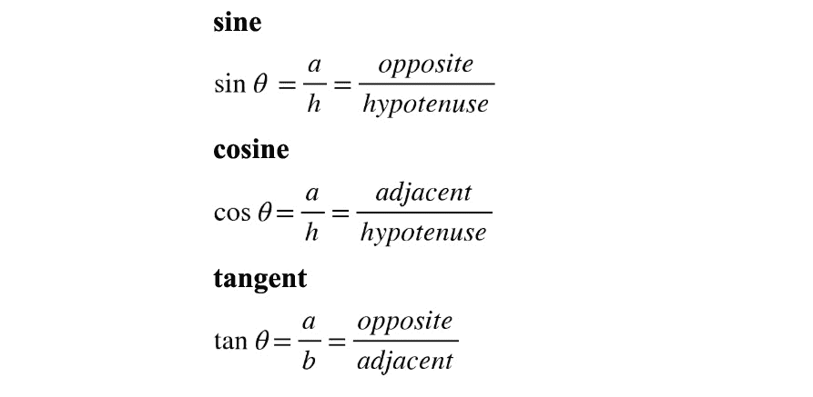
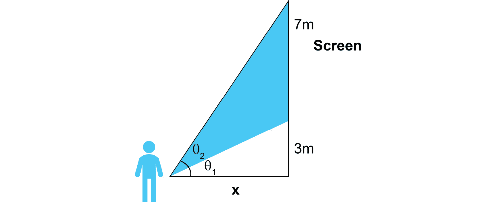
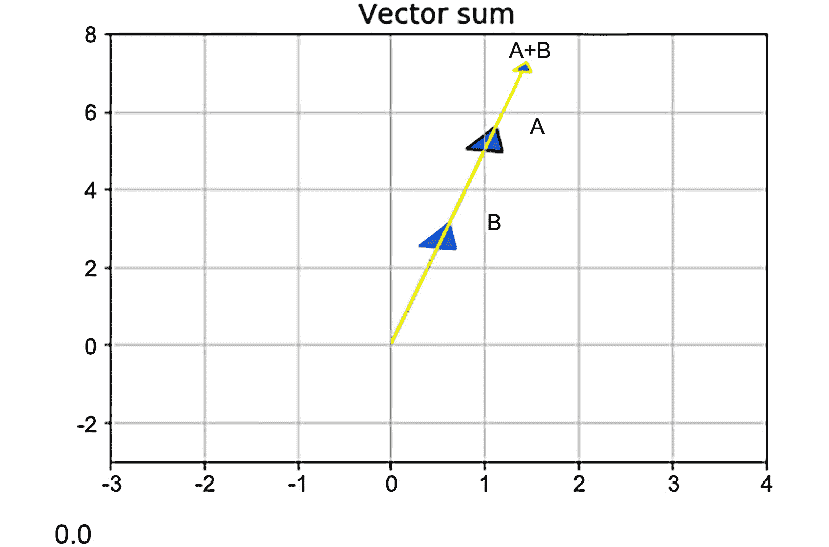
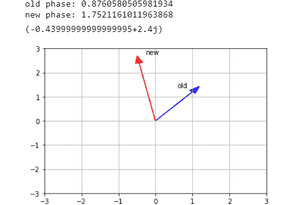
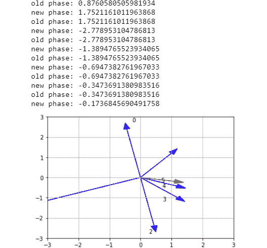

# 五、更多关于 Python 的数学知识

概述

在本章结束时，您将能够掌握序列和系列的基本概念，并编写实现这些概念的 Python 函数。您将了解基本三角函数及其应用之间的关系，例如著名的勾股定理。您将练习向量微积分，并通过在 Python 中执行向量代数来了解它的适用范围。最后，你会很高兴知道复数是一种数字；它们与三角学密切相关，对实际应用非常有用。

# 导言

在上一章中，我们介绍了 Python 中的函数和代数，从基本函数开始，然后再进行转换和求解方程。在本章中，我们将介绍序列和级数，它们在现实世界中有许多应用，例如金融，并且也是理解微积分的基础。此外，我们将探索三角、向量和复数，以便更好地理解数学世界。

任何优秀 Python 程序员的核心技能都包括对背景数学的扎实理解和有效应用。将向量和复数视为我们的*数学工具箱*的有价值的扩展，稍后将有助于有效地描述、量化和解决金融、科学或商业和社会领域的现实问题。

除其他外，序列和系列出现在定期发生利润、亏损、股息或其他付款的情况下。三角函数和三角函数是解决地理空间问题所必需的，而向量在物理和工程、机器学习等领域有着广泛的应用，其中多个不同的值组合在一起，方向的概念至关重要。复数是一些最基本的概念，在电磁学、光学、量子力学和计算机科学中有着广泛的应用。

# 序列和系列

如果你要参加一个电视节目，其中 10000 美元的问题是*“给定数字 2、4、8、16 和 32，接下来是什么？”*，你最好的猜测是什么？如果您的回答是 64，那么恭喜您刚刚接近理解数学抽象中的一个关键概念：序列。**序列**与这个词的一般意义非常相似，是事物之间相互遵循的特定顺序。在这里，*事物*是（在大多数情况下）相关的整数或实数。元素的顺序很重要。这些元素也称为序列的成员或术语。

例如，在您参与的电视节目的前一个序列中，每个术语都源于前一个数字乘以 2；这个序列没有终点，因为你能想出的术语（整数）的数量没有终点。在其他情况下，序列中的元素可以出现多次。想想一年中几个月的天数，或者只是一个随机事件结果的顺序，比如掷硬币。从古印度时代起就知道的一个著名序列是斐波那契序列-1，1，2，3，5，8，13…。这是一个序列，其中每个*新*项是前两项的总和。

也就是说，我们需要知道至少两个术语，然后才能导出其他术语。换言之，在我们能够推导和预测第三个数字之前，我们需要先读取前两个数字（在前面的序列中，1 和 1，但通常是任意两个数字）。我们知道一些序列，比如斐波那契序列，包含一些逻辑；我们可以遵循并导出序列中任何项的基本规则。

在本章中，我们将重点介绍基本序列，也称为**级数**，它们在应用数学和编程的许多领域中反复出现，属于三个基本类别：算术、几何和递归。这些不是唯一的可能性；然而，它们是最流行的序列族，并说明了它们所包含的逻辑。

数字{αn}={α1，α2，α3，…，αΝ，…}的**序列**是术语（元素或成员）的有序集合，其中有一条规则将每个自然数 n=1，2，3，…，n 与序列中的一个术语相关联。序列的长度（即其项数）可以是有限的或无限的，因此序列被称为有限的或无限的。

**系列**是一个数学序列，其总和如下：


图 5.1：系列方程

也可以使用求和符号求和，如下所示：


图 5.2：无限级数的方程

在前面的例子中，我们的级数是无限的（也就是说，它是无限序列中所有项的总和）。但是，序列（如序列）也可以是有限的。为什么一个和会有无限项？因为事实证明，在许多情况下，通过应用已知公式，求和在计算上更有效。此外，即使序列是无限的，求和也可以收敛到一个数（不是无限的）或某个函数。因此，序列可以被视为已知函数的*构建块*，它们的术语可以用来表示日益复杂的函数，从而使对其特性的研究变得直观。序列和序列在数学、物理、工程、金融等领域无处不在，自古以来就为人所知。它们在导数和其他函数的定义中作为无限和出现并特别有用。

## 算术序列

像大多数数学概念一样，序列在我们的日常生活中随处可见。你以前可能没有想过，但每次你坐出租车时，都会有一个序列*在后台运行*来计算你乘坐的总成本。每行驶一公里（或英里），有一个固定的初始费用递增。所以，在任何给定的时刻，都有一个真实的、对应的数字（到目前为止的车费）。所有这些小计的有序集合形成一个序列。同样，你长大后的身高是一系列时间（天或月）上的实数（你的身高以厘米或英寸表示）。这两个例子都构成了时间上不递减的序列——换句话说，每个项都大于或等于任何先前的项，但决不小于。然而，这两个例子之间有一个微妙的区别：虽然我们随着成长而增加身高的速度不同（儿童的成长速度快，青少年的成长速度慢，成年人的增长速度为零），但出租车票价的增长速度是恒定的。这导致我们需要引入一类特殊的序列算术序列，其定义如下。

任意两个连续项之差为常数的序列称为**算术**。因此，算术序列的公式如下：*α*n+1*-α*n*=d*

这里，*d*是常数，必须对所有*n*保持不变。当然，很明显，如果您知道参数*d*和某些（任何）项*α*n，那么可以通过直接应用前面的关系来找到项*α*n+1。通过重复，可以找到所有术语*α*n+2、*α*n+3…，以及术语*α*n-1、*α*n-2。换句话说，如果您知道参数*d*和序列*α*1 的第一项，那么我们序列的所有项都是已知的（即唯一确定的）。给出序列第*n*项的一般公式如下：

*α*n*=α*1*+（n–1）d*

在这里，*d*被称为共同差异。

相反，为了测试泛型序列是否是算术序列，只需检查其项的所有成对差异，*α*n+1–*α*n，并查看它们是否是相同的常量。在相应的算术序列中，前面序列的和变成如下：

*∑*nj*α*j*=∑*nj*【α*1*+（j–1）d]=n（α*1*+α*n*）/2*

这意味着通过知道序列的长度*n*、第一项和最后一项，我们可以确定从*α*1 到*α*n 的所有项的总和。请注意，总和（*α*1+*α*n）给出了整个序列算术平均值的两倍，因此该序列只不过是算术平均值的*n*倍。

现在，我们知道了算术序列的主要逻辑和组成部分。现在，让我们看一些具体的例子。现在，我们不需要在 Python 中导入任何特定的库，因为我们将创建自己的函数。让我们提醒自己，这些总是需要以`def`开头，后跟一个空格、函数名（我们喜欢的任何名称）和函数在括号内接受的参数列表，后跟分号。以下几行缩进（右边四处），是写入逻辑（即函数的算法或方法）的地方。例如，考虑下面的例子：

```py
def my_function(arg1, arg2):
    '''Write a function that adds two numbers 
       and returns their sum'''
    result = arg1 + arg2
    return result
```

最终语句`result`后面的内容是函数返回的内容。因此，例如，如果我们正在对前面的`my_function` 定义进行编程，它接收两个输入编号`arg1`和`arg2`，那么我们可以将其传递给一个新变量，比如说，以下变量：

```py
summed = my_function(2,9)
print(summed)
```

输出结果如下：

```py
11
```

这里，`summed`是一个新变量，它正是`my_function`返回（产生）的内容。请注意，如果函数定义中的`return`语句丢失，则语法仍然正确，并且仍然可以调用该函数。但是，`summed`变量将等于`None`。

现在，如果我们想要创建一个（任何）数字序列，我们应该在函数中包含一个迭代。这在 Python 中通过`for`或`while`循环实现。让我们看一个例子，其中一个函数给出一系列的`n`和作为输出：

```py
def my_sequence(arg1, arg2, n):
    '''Write a function that adds two numbers n times and 
       prints their sum'''
    result = 0
    for i in range(n):
        result = result + arg1 + arg2
        print(result)
```

在这里，我们初始化变量结果（到零），然后迭代地将其相加，`arg1 + arg2`。这个迭代发生了`n`次，其中`n`也是我们新函数`my_sequence`的一个参数。每次执行循环（在`for`语句之后）时，`result`增加`arg1 + arg2`，然后在屏幕上打印。为了简单起见，我们省略了`return`语句。在这里，我们使用 Python 的内置`range()`方法，该方法生成一个整数序列，从 0 开始，在给定的停止整数（我们作为输入提供的数字）之前的一个数字结束。让我们调用函数：

```py
my_sequence(2,9,4)
```

我们将获得以下输出：

```py
11
22
33
44
```

如果我们使用`while`循环，我们将得到相同的结果：

```py
def my_sequence(arg1, arg2, n):
    '''Write a function that adds two numbers n times 
       and prints their sum'''
    i = 0
    result = 0
    while i < n:
        result = result + arg1 + arg2
        i += 1
        print(result)
```

如果我们调用`my_sequence`函数，我们将获得与之前相同输入的相同输出。

## 发电机

Python 中顺序操作的另一个有趣选项是使用生成器。**生成器**是与函数类似的对象，它返回一组可编辑的项，每次返回一个值。简单地说，如果一个函数至少包含一个`yield`语句，它将成为一个生成器函数。使用生成器而不是函数的好处是，我们可以根据需要多次调用生成器（这里是无限量的调用），而无需占用系统内存。在某些情况下，它们可能是非常宝贵的工具。为了获得一系列术语中的一个术语，我们使用`next()`方法。首先，让我们定义我们的函数：

```py
def my_generator(arg1, arg2, n):
    '''Write a generator function that adds 
       two numbers n times and prints their sum'''
    i = 0
    result = 0
    while i < n:
        result = result + arg1 + arg2
        i += 1
        yield result
```

现在，让我们多次调用`next()`方法：

```py
my_gen = my_generator(2,9,4)
next(my_gen)
```

以下是输出：

```py
11
```

第二次调用该方法：

```py
next(my_gen)
```

以下是输出：

```py
22
```

第三次叫它：

```py
next(my_gen)
```

以下是输出：

```py
33
```

第四次调用该方法：

```py
next(my_gen)
```

以下是输出：

```py
44
```

因此，我们得到了与前一个示例相同的结果，但一次只能得到一个结果。如果我们重复调用`next()`方法，我们会得到一条错误消息，因为我们已经*耗尽了*我们的生成器：

```py
next(my_gen)
Traceback (most recent call last):
    File "<stdin>", line 1, in <module>
StopIteration
```

现在，我们已经准备好实现在 Python 代码中学习的序列关系。

## 练习 5.01：确定算术序列和算术序列的第 n 项

在本练习中，我们将使用一个简单的 Python 函数创建一个有限和无限的算术序列。作为输入，我们要提供序列的第一项`a1`、公共差分`d`和序列的长度`n`。我们的目标是实现以下目标：

*   序列中只有一项（第*n*项）。
*   完整的数字序列。
*   算术序列的*n*项之和，以便与前面给出的算术序列的结果进行比较。

为了计算上述目标，我们需要提供序列的第一项`a1`、公共差分`d`和序列长度`n`作为输入。让我们实施这个练习：

1.  First, we want to write a function that returns just the *n*th term, according to the general formula *α*n *= α*1 *+ (n – 1)d*:

    ```py
    def a_n(a1, d, n):
        '''Return the n-th term of the arithmetic sequence.
        :a1: first term of the sequence. Integer or real.
        :n: the n-th term in sequence
        returns: n-th term. Integer or real.'''
        an = a1 + (n - 1)*d
        return an
    ```

    通过这样做，我们获得序列的第*n*项，而不需要知道前面的任何其他项。例如，让我们使用参数`(4, 3, 10)`调用函数：

    ```py
    a_n(4, 3, 10)
    ```

    我们将获得以下输出：

    ```py
    31
    ```

2.  现在，让我们编写一个函数，将初始项`a1`增加`d``n`倍，并将所有项存储在一个列表中：

    ```py
    def a_seq(a1, d, n):
        '''Obtain the whole arithmetic sequence up to n.
        :a1: first term of the sequence. Integer or real.
        :d: common difference of the sequence. Integer or real.
        :n: length of sequence
        returns: sequence as a list.'''
        sequence = []
        for _ in range(n):
            sequence.append(a1)
            a1 = a1 + d
        return sequence
    ```

3.  To check the resulting list, add the following code:

    ```py
    a_seq(4, 3, 10)
    ```

    输出结果如下：

    ```py
    [4, 7, 10, 13, 16, 19, 22, 25, 28, 31]
    ```

    这里，我们得到了算术序列，长度为 10，从`4`开始，增加 3。

4.  Now, let's generate the infinite sequence. We can achieve this using Python generators, which we introduced earlier:

    ```py
    def infinite_a_sequence(a1, d):
        while True:
            yield a1
            a1 = a1 + d
    for i in infinite_a_sequence(4,3):
        print(i, end=" ")
    ```

    如果您运行前面的代码，您会注意到我们必须手动中止执行；否则，`for`循环将永久打印序列的元素。如前所述，使用 Python 生成器的另一种方法是直接在生成器对象上调用`next()`方法（这里是`infinite_a_sequence()`。

5.  Let's calculate the sum of the terms of our sequence by calling the `sum()` Python method:

    ```py
    sum(a_seq(4, 3, 10))
    ```

    输出结果如下：

    ```py
    175
    ```

6.  最后，实现*α*n*=α*1*+（n–1）d*公式，该公式给出了算术级数，以便我们可以将其与求和结果进行比较：

    ```py
    def a_series(a1, d, n):
        result = n * (a1 + a_n(a1, d, n)) / 2
        return result
    ```

7.  Run the function, as follows:

    ```py
    a_series(4, 3, 10)
    ```

    结果如下：

    ```py
    175.0
    ```

    笔记

    要访问此特定部分的源代码，请参考[https://packt.live/2D2S52c.](https://packt.live/2D2S52c )

    您也可以在[在线运行此示例 https://packt.live/31DjRfO.](https://packt.live/31DjRfO )

这样，我们就得到了用序列或级数求算术序列元素和的相同结果。使用两种独立的数学方法交叉验证给定结果的能力对于各级程序员都非常有用，并且是科学验证的核心。此外，了解可以解决同一问题的不同方法（这里是我们用来获得系列结果的两种方法），以及每种方法的优点（以及缺点），对于高级编写代码来说是至关重要的。

我们将研究一个不同的，但也是基本的序列类别：几何序列。

## 几何序列

根据特定社区的人口密度，传染病从一个人传播到另一个人或更多人。在大流行这样的情况下，对于中度传染性疾病来说，平均而言，每个感染该疾病的人每天感染两人是现实的。因此，如果在第一天只有一个人被感染，在第二天会有两个新感染者，在第三天，两个先前感染者中的每一个都会有另外两个人感染疾病，使新感染者的数量达到四个。同样，在第 4 天，出现了 8 例新病例，以此类推。我们可以看到，一种疾病的扩展速度并不是恒定的，因为新病例的数量取决于某一时刻现有病例的数量，这就解释了流行病是如何以指数形式出现和传播的。

前面的数字（1、2、4、8…）构成一个序列。请注意，现在还没有满足算术序列的要求：两个连续项之间的差不是常数。然而，这一比率是恒定的。这举例说明了前面的序列是一种特殊类型的序列，称为**几何**，定义为任意两个连续项的比率恒定的序列或有序数的集合。

在简洁的数学语言中，我们可以将前面的行为写成*α*n+1*=rα*n。

这里，*α*n 是第*n*天的*病例*数量，*α*n+1 是第*n+1*天的新病例数量，*r>0*是定义增长速度（或缓慢）的系数。这被称为公共比率。前面的公式是通用的，这意味着它适用于所有成员，*n*。因此，如果对*n*成立，则对*n-1*、*n-2*等成立。通过递归处理上述关系，我们可以很容易地得出*α*n*=r*n-1*α*方程。

这里，我们给出了几何序列的第*n*项，第一项为*α=α*1，公共比率为*r*。术语*α*被称为**比例因子**。

注意，*r*可以有任何非零值。如果*r>1*，则每一代*α*n+1 都比前一代大，因此序列不断增加；如果*r<1：α*n+1 随着*n*的增加趋于零，则相反。因此，在传染病的最初例子中，*r>1*表示传播增加，而*r<1*表示传播减少。

让我们编写一个 Python 函数，根据*α*n*=r*n-1*α*公式计算几何函数的*n*第项：

```py
def n_geom_seq(r, a, n):
    an = r**(n-1) * a 
    return an 
```

该函数中的输入是`r`，公共比率，`a`，比例因子，`n`，我们要找到的第*n*项。让我们用一些参数调用这个函数，`(2, 3, 10)`：

```py
n_geom_seq(2, 3, 10) 
```

结果如下：

```py
1536
```

类似地，对于算术序列的情况，我们将几何序列定义为长度为*n*的序列项的总和：


图 5.3：几何序列

或者，我们可以表示如下：


图 5.4：几何序列的替代表达式

为了更好地理解几何级数，让我们看看它在 Python 中是如何工作的，并将其可视化。我们需要定义一个允许`r`、`a`和`n`（如我们之前所做的）作为输入的函数，并计算第二个公式，即直到项*n*的序列：

```py
def sum_n(r, a, n):
    sum_n = a*(1 - r**n) / (1 - r) 
    return sum_n
```

现在，调用参数`(2, 3, 10)`的函数，正如我们前面所做的：

```py
sum_n(2, 3, 10)
```

结果如下：

```py
3069.0
```

请看以下几何序列示例图，其中*r>1*的值增加：


图 5.5:r>1 时几何序列增加

请看以下几何序列的示例图，*r<1*的值减小：


图 5.6：r<1 时几何序列减少

在本节中，我们已经了解了几何序列是如何进行的，以及如何在 Python 中轻松找到它的术语，以及几何序列。为了更好地理解序列及其应用，我们现在准备实施我们在练习中所学到的内容。

## 练习 5.02：编写函数查找序列的下一项

皮氏培养皿中的细菌数量以几何顺序增加。给定每天的细菌总数（数量），在数天内，*n*，编写一个函数，计算第*n+1*天的细菌总数。按照以下步骤完成此练习：

1.  编写一个函数，该函数允许可变数量的参数（`*args`，并计算任何元素与其前一个元素（从第二个元素开始）之间的比率。然后，检查找到的所有比率是否相同，并返回其唯一值。否则，函数返回`-1`（序列没有唯一的公共比率）：

    ```py
    def find_ratio(*args):
        arg0=args[0]
        ratios = []
        for arg in args[1:]:
            ratio = round(arg/arg0,8)
            arg0=arg
            ratios.append(ratio)
        if len(set(ratios)) == 1:
            return ratio
        else:
            return -1
    ```

2.  Now, check the `find_ratio` function for two distinct cases. First, let's use the following sequence:

    ```py
    find_ratio(1,2,4,8,16,32,64,128,256,512)
    ```

    结果如下：

    ```py
    2.0
    ```

3.  Now, let's use the following sequence:

    ```py
    find_ratio(1,2,3)
    ```

    结果如下：

    ```py
    -1
    ```

    如前面的输出所示，`find_ratio`函数打印出比率（如果存在），或者如果序列不是几何的，则打印`-1`。

4.  Now, write a second function that reads in a sequence and prints out what the next term will be. To do so, read in a (comma-separated) list of numbers, find their ratio, and from that, predict the next term:

    ```py
    def find_next(*args):
        if find_ratio(*args) == -1:
            raise ValueError('The sequence you entered' \
                             'is not a geometric sequence. '\
                             'Please check input.')
        else:
            return args[-1]*find_ratio(*args)
    ```

    注意，我们希望通过调用前面编写的`find_ratio()`函数来检查序列是否具有公共比率。如果没有，则提出错误；如果有，找到下一个术语并返回它。

5.  Check if it works by using the following sequence:

    ```py
    find_next(1,2,4)
    ```

    以下是上述代码的输出：

    ```py
    8.0
    ```

6.  Now, try this with a different sequence:

    ```py
    find_next(1.36,0.85680,0.539784,0.34006392)
    ```

    结果如下：

    ```py
    0.2142402696
    ```

它确实有效。在第一种情况下，打印了明显的结果`8.0`。在第二种情况下，发现并打印出减少几何序列的不太明显的结果。总而言之，我们能够编写一个函数来检测一个几何序列，找到它的比率，并使用它来预测下一个序列项。这在现实生活场景中非常有用，例如在需要验证复合利率的情况下。

笔记

要访问此特定部分的源代码，请参考[https://packt.live/2NUyT8N.](https://packt.live/2NUyT8N )

您也可以在[在线运行此示例 https://packt.live/3dRMwQV.](https://packt.live/3dRMwQV )

在前面的章节中，我们看到序列，无论是算术序列还是几何序列，都可以用两种等价的方式定义。我们看到序列的第*n*项是通过知道序列的给定项（通常是第一项，但不一定）和公共差或公共比率来确定的。更有趣的是，我们看到序列的第*n*项可以通过知道第*（n-1）*项来找到，而第*（n-2）*项又可以通过知道第*（n-2）*项来找到，依此类推。所以，这里有一个有趣的模式，它决定了我们研究的两种序列类型，事实上，这两种序列类型都超出了它们。事实证明，我们可以推广这种行为，并以一种不一定是算术或几何的纯粹递归方式定义序列。现在，让我们进入下一节，在这里我们将了解递归序列。

## 递归序列

**递归序列**是通过递归关系产生的元素序列*ν*n，也就是说，每个元素唯一地源于前面的元素。

*ν*n 可以依赖于它前面的一个或多个元素。例如，我们在本章前面看到的斐波那契级数是一个递归序列，*n*第项的知识需要知道*（n-1）*第项和*（n-2）*第项。另一方面，阶乘只需要它前面的元素。具体来说，它是由递归关系*n！=n（n-1），n>0*和初始条件*0！=1*。

让我们将前面的公式转换为 Python 代码：

```py
def factorial(n):
    if n == 0 or n ==1:
        return 1
    elif n == 2:
        return 2
    else:
        return n*factorial(n - 1)
```

前面的代码是阶乘函数的递归实现：为了计算*n*的结果，我们调用*n-1*的函数，然后调用*n-2*的函数，依此类推，直到达到*n=2*为止。

如果我们对案例*n=11*执行前面的函数，我们得到以下结果：

```py
factorial(11)
```

结果如下：

```py
39916800
```

请注意，虽然到目前为止我们看到的前两类序列（算术和几何）是互斥的，但递归序列族不是互斥的，这意味着序列可以是递归和算术的，也可以是递归和几何的。传统上，我们使用术语*递归*来表示这些类型的序列，这些序列与几何和算术不同，不能以非递归方式表示。

既然我们已经了解了递归序列的基本概念，我们就可以在 Python 中实现它，并编写代码来计算递归定义的任何序列的任意数量的元素。

## 练习 5.03：创建自定义递归序列

在本练习中，我们将使用上一节中解释的概念创建自定义递归序列。给定序列的前三个元素*P*n，即*P*1*=1*、*P*2*=7*、*P*3*=2*，找到通过关系递归定义的序列的下七个项：【T14P】【T15N+3】*=（3*P*n+1*-P*n+2*/（P*n*-1）*。按照以下步骤完成此练习：

1.  Define a Python function that is recursive and implements the relation given previously for the *n*th element of the sequence:

    ```py
    def p_n(n):
        if n < 1:
            return -1
        elif n == 1:
            return 1
        elif n == 2:
            return 7
        elif n == 3:
            return 2
        else:
            pn = (3*p_n(n-2) - p_n(n-1) )/ (p_n(n-3) + 1)
            return pn
    ```

    在这里，我们从定义基本情况开始，即概要中给出的已知结果：如果*n=1*，那么*P=1*，如果*n=2*，那么*P=7*，如果*n=3*，那么*P=2*。我们还包括了*n<1*的情况。这是无效的输入，按照惯例，我们的函数返回值`-1`。这使得我们的函数*有界*，并防止进入无限循环和无效输入。一旦处理完这些情况，我们就定义了递归关系。

2.  Now, let's test our function and print out the first 10 values of the sequence (three that correspond to the base cases and seven of them that are for our task):

    ```py
    for i in range(1,11):
        print(p_n(i))
    ```

    结果如下：

    ```py
    1
    7
    2
    9.5
    -0.4375
    9.645833333333334
    -1.0436507936507937
    53.29982363315697
    -5.30073825572847
    -3784.586609737289
    ```

    从前面的输出可以看出，我们的函数工作并返回序列的已知值（*P*1*=1*、*P*2*=7*、以及*P*3*=2*）和下一个术语（*P_1*到*P_10*）我们一直在寻找的。

3.  As a bonus, let's plot our findings by using the `matplotlib` module. We will create a list that holds the first nine values of the sequence and then plot it with `pyplot`:

    ```py
    from matplotlib import pyplot as plt
    plist = []
    for i in range(1,40):
        plist.append(p_n(i))

    plt.plot(plist, linestyle='--', marker='o', color='b')
    plt.show()
    ```

    结果如下：

    

图 5.7：使用 matplotlib 库创建的绘图

笔记

要访问此特定部分的源代码，请参考[https://packt.live/2D3vlPF.](https://packt.live/2D3vlPF )

您也可以在[在线运行此示例 https://packt.live/3eY05Q4\.](https://packt.live/3eY05Q4 )

我们可以看到，一个简单且定义良好的递归关系可以导致明显的随机或混沌结果。事实上，如果你继续绘制前面序列中的项，你很快就会注意到这些项的模式中没有明显的规律性，因为它们在 0 左右广泛而不对称地振荡。这促使我们得出这样的结论：即使定义递归序列并预测其第*n*项很简单，但事实并非总是相反。正如我们所看到的，给定一个序列（一个数字列表），检查它是否形成算术序列、几何序列或两者都不是很简单。然而，要回答给定序列是否由递归关系派生，更不用说这个递归是什么了，这是一个在大多数情况下都无法回答的非常重要的任务。

在本节中，我们介绍了序列是什么，它们为什么重要，以及它们如何与数学中的另一个重要概念：序列相联系。我们研究了三种一般类型的序列，即算术序列、几何序列和递归序列，并了解了如何通过几个简单的步骤在 Python 中实现它们。在下一节中，我们将深入研究三角函数，并学习如何使用 Python 轻松解决三角函数问题。

# 三角学

三角学是研究三角形，特别是三角形与边的角度关系。三角形三条边中的两条边（边）的比值给出了关于特定角度的信息，对于这对边，我们给它起了一个特定的名字，并称之为函数。一般来说，三角和数学的美妙之处在于，这些诞生于三角形内部的函数在任何其他情况下都是（抽象的）有意义的，因为三角形不存在，它们作为独立的数学对象运行。因此，切线、余弦和正弦等函数可以在数学、物理和工程的大多数领域中找到，而不必参考三角形。

让我们看看最基本的三角函数及其用法。

## 基本三角函数

我们将首先定义一个直角三角形（或简单的直角三角形），三角形 ABC。其中一个角度（下图中的角度 BCA）是一个**直角**，即 90 度角。与直角相对的一侧称为**斜边**（下图中的*h*侧），而另一侧*a*和*b*称为腿。它们也被称为与相对的*和与*相邻的*。例如，*b*侧与下图中的右下角相邻（角驾驶室或*θ*），而当我们提到顶角（角 CBA）时则相反：*


图 5.8：直角三角形

最常见的三角函数是在上图的帮助下定义的，定义如下：



图 5.9：三角函数

对于切线函数，它还认为*tanθ=sinθ/cosθ*。

此外，对于任何角度θ，以下恒等式始终成立：*sinθ*2*+cosθ*2*=1*。

通过构造，三角函数是周期的。这意味着，无论三角形边的大小如何，前面的函数都采用每隔 2π重复一次的值。这将在下一个练习中变得明显，我们将在那里绘制它们。正弦和余弦函数的范围为区间[-1,1]。这意味着，无论输入θ是什么，他们能得到的最小值是-1，最大值是 1。

最后，直角三角形的边通过著名的毕达哥拉斯定理连接：*h*2*=a*2*+b*2

在 Python 代码中，毕达哥拉斯定理的一个简单实现是编写一个函数来计算*h*，给定*a*和*b*，借助`math`模块的平方根（`sqrt`方法；例如：

```py
from math import sqrt
def hypotenuse(a,b):
    h = sqrt(a**2 + b**2)
    return h
```

为*a=3*和*b=4*调用此函数可以得到以下结果：

```py
hypotenuse(a = 3, b = 4)
```

结果如下：

```py
5.0
```

现在，让我们看一些具体的例子，以便我们能够掌握这些想法。

## 练习 5.04：绘制直角三角形

在本练习中，我们将编写 Python 函数，为给定点*p*1 和[T2】p2 绘制一个直角三角形。直角三角形将对应于三角形支腿的端点。我们还将计算任意一个非直角的三个三角函数。让我们绘制基本的三角函数：

1.  Import the `numpy` and `pyplot` libraries:

    ```py
    import numpy as np
    from matplotlib import pyplot as plt
    ```

    现在，使用毕达哥拉斯定理编写一个函数，当给定两个边*p*1 和*p*2 作为输入时，返回斜边：

    ```py
    def find_hypotenuse(p1, p2):
        p3 = round( (p1**2 + p2**2)**0.5, 8)
        return p3
    ```

2.  现在，让我们编写另一个函数来实现`sin`、`cos`和`tan`函数之间的关系。输入是给定角度的相邻、相对和斜边的长度，结果是三角值的元组：

    ```py
    def find_trig(adjacent, opposite, hypotenuse):
        '''Returns the tuple (sin, cos, tan)'''
        return opposite/hypotenuse, adjacent/hypotenuse, \
               opposite/adjacent
    ```

3.  Now, write the function that plots the triangle. For simplicity, place the right angle at the origin of the axes at (0,0), the first input point along the *x* axis at (p1, 0), and the second input point along the *y* axis at (0, p2):

    ```py
    def plot_triangle(p1, p2, lw=5):
        x = [0, p1, 0]
        y = [0, 0, p2]
        n = ['0', 'p1', 'p2']
        fig, ax = plt.subplots(figsize=(p1,p2))
        # plot points
        ax.scatter(x, y,  s=400, c="#8C4799", alpha=0.4)
        ax.annotate(find_hypotenuse(p1,p2),(p1/2,p2/2))

        # plot edges
        ax.plot([0, p1], [0, 0], lw=lw, color='r')
        ax.plot([0, 0], [0, p2], lw=lw, color='b')
        ax.plot([0, p1], [p2, 0], lw=lw, color='y')
        for i, txt in enumerate(n):
            ax.annotate(txt, (x[i], y[i]), va='center')
    ```

    在这里，我们创建了保存点的列表`x`和`y`，以及一个用于标签的列表`n`。然后，我们创建了一个`pyplot`对象，首先绘制点，然后绘制边。最后两行用来注释我们的情节；也就是说，将标签（从列表中的`n`）添加到我们的点旁边。

4.  We need to choose two points in order to define a triangle. Then, we need to call our functions to display the plot:

    ```py
    p01 = 4
    p02 = 4
    print(find_trig(p01,p02,find_hypotenuse(p01,p02)))
    plot_triangle(p01,p02)
    ```

    第一行分别打印三个三角函数`sin`、`cos`和`tan`的值。然后，我们画出三角形，在这种情况下，三角形是等腰的，因为它有两条等长的边。

    输出结果如下：

    

    图 5.10：绘制等腰三角形

    由于这种特殊形状的几何形状很简单（两个角等于π/4 的等腰正交三角形），因此在舍入误差后，结果是预期的和正确的。然后，我们检查了结果（注意，在 NumPy 中，pi 的值可以直接称为`np.pi`。

5.  Finally, to get a general overview of the `sin` and `cos` trigonometric functions, let's plot them:

    ```py
    x = np.linspace(0, 10, 200)
    sin = np.sin(x)
    cos = np.cos(x)
    plt.xticks([0, np.pi/2, np.pi, 3*np.pi/2, 2*np.pi, \
                5*np.pi/2, 3*np.pi], \
               ['0','','\u03C0','','2\u03C0','','3\u03C0'])
    plt.plot(x, sin, marker='o', label='sin')
    plt.plot(x, cos, marker='x', label='cos')
    plt.legend(loc="upper left")
    plt.ylim(-1.1, 1.6)
    plt.show()
    ```

    输出结果如下：

    

图 5.11：正弦波和余弦波三角函数图

在本练习中，我们开始探索三角领域，并了解如何在 Python 中实现有用的可视化。

笔记

要访问此特定部分的源代码，请参考[https://packt.live/2Zz0TnU.](https://packt.live/2Zz0TnU )

您也可以在[在线运行此示例 https://packt.live/2AoxS63\.](https://packt.live/2AoxS63 )

通过这一点，我们建立了主要的三角函数，并了解了它们如何提供角度和相关三角值之间的运算，由 sin、cos 或 tan 函数给出。此外，我们看到这三个函数是周期性的，即每 2π重复一次，而前两个函数是有界的，即它们可以取的值永远不会超过区间[-1,1]。这些值可以直接在 Python 或科学袖珍计算器中找到。然而，在许多情况下，需要相反的过程：如果我给某个函数给定 sin、cos 或 tan 的值，我能找到角度吗？这样的功能存在吗？我们将在下一节中回答这些问题。

## 反三角函数

反三角函数是三角函数的反函数，与它们的对应函数一样有用。逆函数是一种*反转*原始函数的操作或结果的函数。回想一下，三角函数允许角度作为输入值，并输出纯数字（比率）。反三角函数的作用正好相反：它们接受一个纯数字作为输入，并给出一个角度作为输出。因此，例如，如果一个点π被映射到点-1（正如 cos 函数所做的），那么它的逆函数需要做完全相反的事情。此映射需要在定义反函数的每个点上保持。

*sin（x）*函数的逆函数称为*arcin（x）*：如果*y=sin（x）*，则*x=arcin（y）*。回想一下*sin*是一个周期函数，所以许多不同的*x*被映射到相同的*y*。因此，反函数会将一个点映射到几个不同的点。这是不允许的，因为它与函数的定义冲突。为了避免这个缺点，我们需要将我们的*arcsin*域（以及类似的*arccos*域）限制在区间[-1,1]，而图像*y=arcsin（x）*和*y=arccos（x）【T21]分别限制在[-π/2，π/2]和[0，π]的范围内。*

我们可以如下定义三个基本的逆三角函数：

*   *弧心（x）=y，使得弧心（sin（x））=x*
*   *arccos（x）=y，使得 arccos（cos（x））=x*
*   *arctan（x）=y，使得 arctan（tan（x））=x*

在 Python 中，可以从`math`模块或`numpy`库中调用这些函数。由于三角反函数的大多数 Python 实现返回弧度，我们可能希望将结果转换为度。我们可以将弧度乘以 180，然后除以π。

让我们看看如何用代码编写。请注意，输入`x`表示为-1 和 1 之间的纯数字，而输出表示为弧度。让我们导入所需的库并声明`x`的值：

```py
from math import acos, asin, atan, cos
x = 0.5
```

现在，要打印余弦的倒数，请添加以下代码：

```py
print(acos(x))
```

结果如下：

```py
1.0471975511965979
```

要打印正弦的倒数，请添加以下代码：

```py
print(asin(x))
```

结果如下：

```py
0.5235987755982989
```

要打印 tan 的倒数，请添加以下代码：

```py
print(atan(x))
```

结果如下：

```py
0.4636476090008061
```

让我们尝试向`acos`函数添加一个超出范围[-1,1]的输入：

```py
x = -1.2
print(acos(x))
```

我们将得到一个错误，如下所示：

```py
Traceback (most recent call last):
    File "<stdin>", line 1, in <module>
```

类似的事情也会发生在`asin`身上。这是意料之中的，因为不存在可以返回`-1.2`作为 cos（或 sin）的角度*φ*。但是，在`atan`功能中允许此输入：

```py
x = -1.2
print(atan(x))
```

结果如下：

```py
-0.8760580505981934
```

最后，让我们检查一下逆`arccos(cos(x))`函数的逆给我们带来了什么：

```py
print(acos(cos(0.2)))
```

结果如下：

```py
0.2
```

正如预期的那样，我们检索`cos`函数的输入值。

逆三角函数在数学、物理和工程领域有着广泛的应用。例如，可以使用反三角函数来计算积分。不定积分如下所示：


图 5.12：逆三角函数

这里，*a*是一个参数，*C*是一个常数，借助于反三角函数，积分立即可解。

## 练习 5.05：利用逆三角函数寻找通往宝藏的最短路径

在本练习中，您将获得一张指向**B**的秘密地图，其中一些珍贵的宝藏已经存放了几个世纪。你在**A**点，指示很清楚：你必须先向南航行 20 公里，然后向西航行 33 公里，才能到达宝藏。然而，直线段**AB**最短。您需要在地图上找到角度**θ**，以便您的导航方向正确：


图 5.13：点 A、B 和 C 的图形表示

我们需要找到角度**θ**，这是段**AB**和**AC**之间的角度。遵循以下步骤：

1.  导入`atan`（反正切）函数：

    ```py
    from math import atan, pi
    ```

2.  Find the tangent of *θ* using `BC` and `AC`:

    ```py
    AC = 33
    BC = 20
    tan_th = BC/AC
    print(tan_th)
    ```

    结果如下：

    ```py
    0.6060606060606061
    ```

3.  接下来，通过取反切线函数来求角度。它的参数是*θ*：

    ```py
    theta = atan(tan_th)
    ```

    的切线
4.  Convert that into degrees and print the value:

    ```py
    theta_degrees = theta*180/pi
    print(theta_degrees)
    ```

    结果如下：

    ```py
    31.218402764346372
    ```

    因此，答案是我们需要转向 31.22 度才能正确导航。

5.  As a bonus point, calculate the distance that we will travel along the path `AB`. This is simply given by the Pythagorean theorem as follows:

    *AB*2*=AC*2*+BC*2

    在 Python 中，使用以下代码：

    ```py
    AB = (AC**2 + BC**2)**0.5
    print(AB)
    ```

    结果如下：

    ```py
    38.58756276314948
    ```

    航程为 38.59 公里。

在 Python 中，通过调用`find_hypotenuse()`函数来计算这一点很简单。正如所料，这比路径*AC+BC=53*km 要短得多。

笔记

要访问此特定部分的源代码，请参考[https://packt.live/31CF4qr.](https://packt.live/31CF4qr )

您也可以在[在线运行此示例 https://packt.live/38jfVlI.](https://packt.live/38jfVlI )

## 练习 5.06：找到与物体的最佳距离

你正在参观你的地方竞技场观看你最喜欢的表演，而你正站在竞技场的中央。除了主舞台外，还有一个观看屏幕，人们可以观看而不会错过演出的细节。屏幕底部高出眼睛 3 米，屏幕本身高 7 米。通过观察屏幕的底部和顶部来形成视角。找到您与屏幕之间的最佳距离*x*，以使视角最大化：



图 5.14：眼睛与屏幕之间形成的视觉角度 o

这是一个稍微复杂的问题，需要一点代数知识，但我们将把它分解为简单的步骤并解释逻辑。首先，请注意问题的情节在多大程度上指导我们并帮助我们找到解决方案。这显然是一个复杂的现实世界问题，转化为一个更加抽象和简单的几何图形。按照以下步骤完成此练习：

1.  Calculate *x*. This is the lower side of the triangle and also the adjacent side to the angle, *θ*1 (and also *θ=θ*1*+θ*2). The answer, *x*, will be given by the condition that the viewing angle, *θ*2 or equivalently, *tan(θ*2*)*), is maximized. From the preceding plot of the *screen*, we can immediately draw the following relations for the three angles: *θ*1 (the inner angle), *θ*2 (the outer angle), and *θ=θ*1*+θ*2:

    *谭（θ*1*）=对向/相邻=3/x*

    *tan（θ）=tan（θ*1*+θ*2*）=对向/相邻=（7+3）/x。*

    现在，使用代数来处理这两个关系，并获得*θ*2 的条件。

2.  A known identity for the tangent of a sum of two angles is as follows:

    

    图 5.15：两个角度之和的切线公式

    通过在后一个关系中用我们所发现的替换*tan（θ）*和*tan（θ*1*，并在计算代数后，我们得出以下结论：*

    **谭（θ*2*）=7x/（30+x*2*或**

    **θ*2*=arctan（7x/（30+x*2*）。**

    *换句话说，我们结合了问题的要素，发现角度*θ*1 应该随着距离*x*而变化，作为*x*的函数，如前一行所示。*

**   让我们绘制这个函数，看看它是如何变化的。首先，加载必要的库：

    ```py
    from matplotlib import pyplot as plt
    import numpy as np
    ```

    *   Then, plot the function by defining the domain, `x`, and the values, `y`, by using the `arctan` method of `numpy`. These are easily plotted with the `plot()` method of `pyplot`, as follows:

    ```py
    x = np.linspace(0.1, 50, 2000)
    y = np.arctan(7*x / (30+x**2) )
    plt.plot(x,y)
    plt.show()
    ```

    输出结果如下：

    

    图 5.16：使用 arctan 方法绘制的函数图

    从前面的图中，我们可以看到函数获得了一个最大值。

    *   Determine the function's maximum value, `y`, and the position, `x`, where this occurs:

    ```py
    ymax = max(y)
    xmax = x[list(y).index(ymax)]
    print(round(xmax,2), round(ymax,2))
    ```

    结果如下：

    ```py
    5.47 0.57
    ```

    *   Lastly, convert the found angle into degrees:

    ```py
    ymax_degrees = round(ymax * 180 / np.pi, 2)
    print(ymax_degrees)
    ```

    结果如下：

    ```py
    32.58
    ```* 

 *因此，视角*θ*2 在 32.58 度时达到最大值，当我们站在离屏幕 5.47 米的地方时出现。我们使用了三角函数和逆三角函数，用 Python 实现了它们，并找到了在现实生活中由*几何*设置引起的问题的答案。这就更清楚地说明了几何和三角学的概念是如何有效且容易地编码以提供预期结果的。

笔记

要访问此特定部分的源代码，请参考[https://packt.live/2VB3Oez.](https://packt.live/2VB3Oez )

您也可以在[在线运行此示例 https://packt.live/2VG9x2T.](https://packt.live/2VG9x2T )

现在，我们将继续学习数学中的另一个中心概念，它在代数、物理学、计算机科学和应用数据科学中有着广泛的应用：向量。

# 载体

**向量**是具有大小和方向的抽象数学对象。矢量由一个箭头表示，箭头有一个底部（尾部）和一个头部。头部显示矢量的方向，而箭头主体的长度显示其大小。

**标量**与向量相反，是唯一的数字。它是一个非向量，也就是一个纯整数，实数或复数（我们将在后面看到），没有元素，因此没有方向。

向量可以用粗体字母**和**、顶部带有箭头的字母来表示，如果讨论中的符号没有歧义，也可以用普通字母来表示。向量**A**的大小被样式化为*【A】*或简单的*A*。现在，让我们看看各种向量运算。

### 向量运算

简言之，向量是由两个、三个或更多数字组成的集合（想想列表或数组），这些数字构成了一个数学对象。该对象生活在一个称为向量空间的特定几何空间中，该空间具有一些属性，例如度量属性和维度。在数学和物理中的许多抽象情况下，向量空间可以是二维（想想你书中的一张纸的平面）、三维（我们周围的普通欧几里德空间）或更高。识别向量所需的元素或数字等于空间的维数。现在我们已经定义了一个向量空间——向量的运动场，我们可以为它配备一个轴系统（通常的*x*、*y*和*z*轴），它们标记原点并测量空间。在这样一个定义良好的空间中，我们需要确定一组数字（两个、三个或更多），以便唯一地定义一个向量，因为假设向量从轴的原点开始。向量的元素可以是整数、有理数、实数或（很少）复数。在 Python 中，它们通常由列表或 NumPy 数组表示。

与实数类似，向量上定义了一组线性运算。在两个向量 A=（a1、a2、a3）和 B=（b1、b2、b3）之间，我们可以定义如下：


图 5.17：执行向量运算时 A、B 和 C 点及其关系

现在让我们看看可以对这些向量执行的各种操作：

*   **加法**作为导致向量*C=A+B=（A*1*+B*1*、A*2*+B*2*、A*3*+B*3*的运算。*
**   **减法**作为导致向量*C=A-B=（A*1*-B*1*、A*2*-B*2*、A*3*-B*3*的运算。***   **点**（或内部或标量）*标量**C=b 的*积*。b=a*1*b*1*+a*2*b*2*+a*3*b*3。*   向量*C=A x B*的**交叉**（或外部）*积*，该向量垂直于*A*和*B*定义的平面，并具有元素*A*2*B*A3*B*2*A*3*b*1*-a*1*b*3*、a*1*b*2*-a*2*b*1）。*   两个向量*A*和*B*的**元素智慧**或哈达玛*乘积*是向量*C*，其元素是*A*和*B*元素的成对乘积；即，*C=（a*1*b*1*、a*2*b*2*、a*3*b*3）。**

 *我们可以在 Python 代码中定义和使用前面的公式，如下所示：

```py
import numpy as np
A = np.array([1,2,3]) # create vector A
B = np.array([4,5,6]) # create vector B
```

然后，要查找`A`和`B`之和，请输入以下代码：

```py
A + B
```

结果如下：

```py
array([5, 7, 9])
```

要计算差异，请输入以下代码：

```py
A - B
```

结果如下：

```py
array([-3, -3, -3])
```

要查找按元素排列的产品，请输入以下代码：

```py
A*B
```

结果如下：

```py
array([ 4, 10, 18])
```

要查找 dot 产品，请使用以下代码：

```py
A.dot(B)
```

结果如下：

```py
32
```

最后，叉积可以计算如下：

```py
np.cross(A,B)
```

结果如下：

```py
array([-3,  6, -3])
```

请注意，向量加法、减法和点积是关联和交换运算，而叉积是关联但不是交换运算。换句话说，ab 不等于 bxa，而是 bxa，这就是为什么它被称为**反置换**。

此外，向量*a*可以与标量*λ*相乘。在这种情况下，您只需将每个向量元素乘以相同的数字，即标量：*λA=λ（A*1*、A*2*、A*3*=（λA*1*、λA*2*、λA*3）

向量之间的另一个重要运算是点积，因为它可以说是数学、计算机科学及其应用中最常见的运算。点积运算是一种有趣的运算，在实数领域中没有模拟运算。事实上，它需要两个向量作为输入来产生一个标量作为输出。这意味着运算的结果（标量）与其成分（向量）的类型不同，因此逆运算（点分割）通常不存在。

定义如下：


图 5.18：θ角的图形表示

这可以用以下等式表示：

*A.B=|A|B|cos（θ）*

这里，*θ*是*A*和*B*之间的角度。

让我们看看一些典型案例：

*   If *A* and *B* are orthogonal, then the dot product vanishes:

    *A.B=0*当且仅当*θ=角度（A，B）=π/2*，因为*A*和*B*不为零。

*   如果*A*和*B*是共线和共向的，那么*θ=0*、*cos（θ）=1*和*A.B=|A | B |*。如果它们是共线且方向相反，则*θ=π*、*cos（θ）=-1*和*A.B=-|A | B |*。
*   它遵循向量自身的点积定义：*a.a=|a | | a |或| a |=√（A.A）*
*   It follows directly from *A.B = |A| |B| cos(θ)*, where the angle between the two vectors is given as follows: *θ = arccos(A.B / |A| |B|)*

    在这里，*arccos*是我们在上一节中看到的逆*cos*函数。

例如，我们可以编写一个 Python 程序，借助于`numpy`和给出角度*θ*的前面关系，计算任意两个给定向量之间的角度：

```py
import numpy as np
from math import acos
A = np.array([2,10,0])
B = np.array([9,1,-1])
```

为了找到每个向量的范数（幅值），我们可以使用以下代码：

```py
Amagn = np.sqrt(A.dot(A))
Bmagn = np.sqrt(B.dot(B))
```

此外，您还可以使用以下代码：

```py
Amagn = np.linalg.norm(A)
Bmagn = np.linalg.norm(B)
```

打印其值：

```py
print(Amagn, Bmagn)
```

您将获得以下输出：

```py
10.198039027185569
9.1104335791443
```

两种选择都会产生相同的结果，您可以通过再次打印`Amagn`和`Bmagn`立即检查结果。

最后，我们可以找到角度*θ*，如下所示：

```py
theta = acos(A.dot(B) / (Amagn * Bmagn))
print(theta)
```

结果如下：

```py
1.2646655256233297
```

现在，让我们来看一个练习，其中将执行我们刚刚了解的各种向量运算。

## 练习 5.07：可视化向量

在本练习中，我们将编写一个函数，在二维空间中绘制两个向量。我们必须找到它们的和以及它们之间的夹角。

执行以下步骤以完成此练习：

1.  导入必要的库，即`numpy`和`matplotlib`：

    ```py
    import numpy as np
    import matplotlib.pyplot as plt
    ```

2.  Create a function that admits two vectors as inputs, each as a list, plots them, and, optionally, plots their sum vector:

    ```py
    def plot_vectors(vec1, vec2, isSum = False):

        label1 = "A"; label2 = "B"; label3 = "A+B"
        orig = [0.0, 0.0]  # position of origin of axes
    ```

    `vec1`和`vec2`列表各包含两个实数。每对表示对应向量的端点（头部）坐标，而原点设置为（0,0）。标签设置为`"A"`、`"B"`和`"A+B"`，但您可以更改它们，甚至可以将它们设置为`plot_vectors`函数的变量，并带有（或不带）默认值。布尔变量`isSum`默认设置为`False`，除非明确设置为`True`，否则不会绘制总和`vec1+vec2`。

3.  Next, we put the coordinates on a `matplotlib.pyplot` object:

    ```py
        ax = plt.axes()
        ax.annotate(label1, [vec1[0]+0.5,vec1[1]+0.5] )   
        # shift position of label for better visibility
        ax.annotate(label2, [vec2[0]+0.5,vec2[1]+0.5] )
        if isSum: 
            vec3 = [vec1[0]+vec2[0], vec1[1]+vec2[1]]     
            # if isSum=True calculate the sum of the two vectors
            ax.annotate(label3, [vec3[0]+0.5,vec3[1]+0.5] )

        ax.arrow(*orig, *vec1, head_width=0.4, head_length=0.65)
        ax.arrow(*orig, *vec2, head_width=0.4, head_length=0.65, \
                 ec='blue')
        if isSum:
            ax.arrow(*orig, *vec3, head_width=0.2, \
                     head_length=0.25, ec='yellow')
            # plot the vector sum as well

        plt.grid()
        e=3 
        # shift limits by e for better visibility
        plt.xlim(min(vec1[0],vec2[0],0)-e, max(vec1[0],\
                     vec2[0],0)+e) 
        # set plot limits to the min/max of coordinates
        plt.ylim(min(vec1[1],vec2[1],0)-e, max(vec1[1],\
                     vec2[1],0)+e) 
        # so that all vectors are inside the plot area
    ```

    在这里，我们使用 annotate 方法向向量添加标签，以及 arrow 方法，以便创建向量。星形运算符`*`用于解压列表的`orig`和`vec1``vec2`中的参数，以便从`arrow()`方法正确读取它们。`plt.grid()`在绘图背景上创建一个网格以引导眼睛，这是可选的。添加了`e`参数，以便绘图限制足够宽，且绘图可读。

4.  接下来，我们给我们的图表一个标题并绘制它：

    ```py
        plt.title('Vector sum',fontsize=14)
        plt.show()
        plt.close()
    ```

5.  Now, we will write a function that calculates the angle between the two input vectors, as explained previously, with the help of the dot (inner) product:

    ```py
    def find_angle(vec1, vec2, isRadians = True, isSum = False):
        vec1 = np.array(vec1)
        vec2 = np.array(vec2)

        product12 = np.dot(vec1,vec2)
        cos_theta = product12/(np.dot(vec1,vec1)**0.5 * \
                               np.dot(vec2,vec2)**0.5 )
        cos_theta = round(cos_theta, 12)
        theta = np.arccos(cos_theta)

        plot_vectors(vec1, vec2, isSum=isSum)
        if isRadians:
            return theta
        else:
            return 180*theta/np.pi
    ```

    首先，我们将输入列表映射到`numpy`数组，以便使用此模块的方法。我们计算点积（名为`product12`），然后除以`vec1`与`vec2`的乘积。回想一下，向量的大小由点积自身的平方根（或`**0.5`）给出。根据点积的定义，我们知道这个量是两个向量之间夹角θ的 cos。最后，在对 cos 进行舍入以避免下一行的输入错误后，使用`numpy`的`arccos`方法计算θ。

6.  We want to combine the two functions that we wrote—`find_angle` and `plot_vectors`—and call the former inside the latter. We also want to give the user the option to print the result for the angle either in radians (`isRadians=True`) or degrees (`isRadians=False`). We are now ready to try our function. First, let's try this with two perpendicular vectors:

    ```py
    ve1 = [1,5]
    ve2 = [5,-1]
    find_angle(ve1, ve2, isRadians = False, isSum = True)
    ```

    结果如下：

    

    图 5.19：两个垂直矢量图

    绘图看起来不错，结果是 90 度，正如预期的那样。

7.  Now, let's try using the same function to create two co-linear vectors:

    ```py
    ve1 = [1,5]
    ve2 = [0.5,2.5]
    find_angle(ve1, ve2, isRadians = False, isSum = True)
    ```

    结果如下：

    

    图 5.20：两个共线向量的曲线图

    输出为 0 度，如预期的那样。

8.  Lastly, again, using the same function, let's create two generic vectors:

    ```py
    ve1 = [1,5]
    ve2 = [-3,-5]
    find_angle(ve1, ve2, isRadians = False, isSum = True)
    ```

    结果如下：

    

图 5.21：两种通用矢量图

总之，我们研究了向量作为生活在向量空间中的数学对象。我们已经学习了如何在 Python 中构造和表示向量，以及如何将它们可视化。向量遵循一些简单的规则，使用它们执行操作是可能的。在处理实数时，加法和减法遵循完全相同的逻辑。乘法更为复杂，定义了不同类型的乘积。最常见的积是内积或点积，由于其简单的几何表示，它在数学和物理界享有广泛的*流行*。我们学习了如何在 Python 中计算任意两个向量的点积，并且通过使用点积的知识（以及一些 NumPy 方法）找到了二重奏之间的角度。简单地说，二维向量是一对数字，它们构成一个具有有趣性质的几何对象。

笔记

要访问此特定部分的源代码，请参考[https://packt.live/2Zxu7n5\.](https://packt.live/2Zxu7n5 )

您也可以在[在线运行此示例 https://packt.live/2YPntJQ.](https://packt.live/2YPntJQ )

接下来，我们将学习如何将一对两个数字组合成一个更令人兴奋的对象，即复数。

# 复数

自古代数字系统以来，关于数字及其关系的数学思想一直在发展。从历史上看，数学思想已经从具体到抽象。例如，创建了一组自然数，这样我们周围的所有物理对象都直接对应于该集合中的某个数字。自从算术和代数发展以来，很明显，自然数或整数以外的数字是必要的，所以十进制数和有理数被引入。类似地，在毕达哥拉斯时代，人们发现有理数不能解决所有我们可以用当时已知的几何构造的数值问题。这种情况发生在引入无理数时，无理数是由其他数的平方根产生的，并且没有表示为比率。

复数是实数的一种扩展，包括一些特殊的数字，它们可以为实数所不能解决的一些方程提供解。

事实上，这样一个数字确实存在，并且具有符号*i*。它被称为虚数或虚数单位，即使它没有虚数；它和我们所看到的所有其他数字一样真实，并且，正如我们将要看到的，它具有一些非常美丽的性质。

## 复数的基本定义

我们将虚数*i*定义如下：

*i*2*=-1*

任何由实数和虚数（部分）组成的数字称为**复数**。例如，考虑下面的数字：

*z=3–i*

*z=14/11+I3*

*z=-√5–i 2.1*

前面的所有数字都是复数。它们的实部符号化为*Re（z）*，虚部符号化为*Im（z）*。对于前面的示例，我们得到以下结果：

*Re（z）=3，Im（z）=-1*

*Re（z）=14/11，Im（z）=3*

*Re（z）=-√5，Im（z）=-2.1*

让我们看一些使用代码的示例。在 Python 中，虚单位用字母*j*表示，复数形式如下：

```py
c = <real> + <imag>*1j,
```

这里，`<real>`和`<imag>`是实数。等效地，复数可以定义如下：

```py
c = complex(<real>, <imag>).
```

在代码中，它变成如下所示：

```py
a = 1
b = -3
z = complex(a, b)
print(z)
```

结果如下：

```py
(1-3j)
```

我们还可以使用`real`和`imag`函数来分离任意复数`z`的实部和虚部。首先，让我们使用`real`功能：

```py
print(z.real)
```

结果如下：

```py
1.0
```

现在，使用`imag`功能：

```py
print(z.imag)
```

结果如下：

```py
-3.0
```

换言之，任何复数都可以分解并写入为*z=Re（z）+i Im（z）*。因此，复数是两个实数的一对，可以可视化为存在于二维中的向量。因此，如前一节所述，向量的几何和代数也可以在这里应用。

在`cmath`模块中可以找到允许复数作为输入的方法和函数。本模块包含复数的数学函数。那里的函数接受整数、浮点数或复数作为输入参数。

*复共轭*被定义为复数*z**（也称*z̄*），其具有与复数*z*相同的实部和相反的虚部；也就是说，如果*z=x+iy*，那么*z*=x-iy*。注意，*zz**的乘积是实数，*x*2*+y*2，它给出了*z*的*模*的平方：

*zz*=z*z=|z |*2

将在复平面上绘制一个与向量类似的复数（如下图所示）。这是由*x*轴上的实部和*y*轴上的虚部构成的平面。复共轭只是矢量相对于实轴的反射：


图 5.22：复数图

复数*z*可以可视化为坐标为（x，y）的向量。或者，我们可以把它写成极坐标（r，φ）的向量。复共轭体*z**或*z̄*是一个与*z*相同但相对于*x*轴反射的向量。

如果复数的实部和复部均为零，则复数为零。可以对两个复数进行以下操作，*z=x+iy*和*w=u+iv*：

*   **新增**：*z+w=（x+u）+i（y+v）*
*   **减法**：*z-w=（x-u）+i（y-v）*
*   **乘法**：*z w=（x+iy）（u+iv）=（xu yv）+i（xv+yu）*
*   **分部**：*z/w=（x+iy）/（u+iv）=（ux+vy）+i（uy-xv）/（u2+v2）*

## 极坐标表示与欧拉公式

复数很容易被看作复数平面上的向量。因此，它具有由向量的大小确定的大小和由与*x*（实）轴形成的角度*φ*确定的方向。要确定这两个数字，我们需要找到*z=x+iy*的绝对值（或模数）*r*：

*r=|z=√x*2*+y*2

其角度（也称为参数*arg*或*相位*）*φ*如下所示：

*φ=arg（z）=arctan（x+iy）=arctan（y/x）*

这两种关系都源于复向量的几何结构。第一个关系只是毕达哥拉斯定理的应用，而第二个关系则是将切线关系应用于角度*φ*。

通过检查矢量的图形表示（参见上图），我们可以看到以下内容：

*cos（φ）=x/r 和*

*sin（φ）=y/r*

或

*x=r cos（φ）和*

*y=r sin（φ）*

用*z=x+iy*替换这些，我们得到以下结果：

*z=r（cos（φ）+i sin（φ））*

我们可以用 Python 编写一些代码来查找（*r*、*φ*（极坐标）一次（*x*、*y*）（笛卡尔坐标），反之亦然：

```py
def find_polar(z):
    from math import asin
    x = z.real
    y = z.imag
    r = (x**2 + y**2)**0.5
    phi = asin(y/r)
    return r, phi
find_polar(1-3j)
```

结果如下：

```py
(3.1622776601683795, -1.2490457723982544)
```

等效地，我们可以使用`cmath`模块中的`polar`方法：

```py
import cmath
z = 1-3j
cmath.polar(z)
```

结果如下：

```py
(3.1622776601683795, -1.2490457723982544)
```

笔记

不允许输入（0,0），因为它导致被零除。

因此，一个复数可以用它的模*r*和相位*φ*来表示，而不是用它的横坐标（*x*为实部）和纵坐标（*y*为虚部）。模数*r*是一个实的非负数，相位*φ*位于区间[-π，π]：对于纯实数为*0*和*π*，对于纯虚数为*π/2*或*π/2*。后者称为极坐标，而前者称为矩形或笛卡尔坐标；它们是等价的。也可以使用以下表示：

*z=re*iφ*=r（cos（φ）+i sin（φ））*

这是自然对数的底。这就是众所周知的欧拉公式。特例*φ=π*给出了以下信息：

*e*iπ*+1=0*

这就是众所周知的欧拉恒等式。

使用欧拉公式的好处是，复数乘法和除法可以获得简单的几何表示。要乘（除）两个复数，*z*1 和*z*2，我们只需乘（除）它们各自的模并加（减）它们的参数：

*z*1**z*2*=RE*iφ*=r*1**r*2*e*i（φ1+φ2）

现在，让我们用 Python 实现一些复数数学运算。我们将对两个复数的加法、减法、乘法和除法进行编码：

```py
def complex_operations2(c1, c2):
    print('Addition =', c1 + c2)
    print('Subtraction =', c1 - c2)
    print('Multiplication =', c1 * c2)
    print('Division =', c1 / c2)
```

现在，让我们对一对普通的复数来尝试这些函数，*c1=10+2j/3*和*c2=2.9+1j/3*：

```py
complex_operations2(10+2j/3, 2.9+1j/3)
```

结果如下：

```py
Addition = (12.9+1j)
Subtraction = (7.1+0.3333333333333333j)
Multiplication = (28.77777777777778+5.266666666666666j)
Division = (3.429391054896336-0.16429782240187768j)
```

对于纯实数和纯虚数，我们也可以这样做：

```py
complex_operations2(1, 1j)
```

结果如下：

```py
Addition = (1+1j)
Subtraction = (1-1j)
Multiplication = 1j
Division = -1j
```

从最后一行我们可以很容易地看到，*1/i=-i*，这与虚单位的定义一致。`cmath`库还提供了用于复数的有用函数，如`phase` 和`polar`，以及用于复数参数的三角函数：

```py
import cmath
def complex_operations1(c):
    modulus = abs(c)
    phase = cmath.phase(c)
    polar = cmath.polar(c)
    print('Modulus =', modulus)
    print('Phase =', phase)
    print('Polar Coordinates =', polar)
    print('Conjugate =',c.conjugate())
    print('Rectangular Coordinates =', \
           cmath.rect(modulus, phase))
complex_operations1(3+4j)
```

结果如下：

```py
Modulus = 5.0
Phase = 0.9272952180016122
Polar Coordinates = (5.0, 0.9272952180016122)
Conjugate = (3-4j)
Rectangular Coordinates = (3.0000000000000004+3.9999999999999996j)
```

因此，计算给定复数的模量、相位或共轭变得极其简单。注意，最后一行给出了复数的矩形（或笛卡尔）形式，给出了它的模数和相位。

现在我们已经了解了复数的算术和表示法是如何工作的，让我们继续看一个涉及逻辑的练习，并结合我们在前面章节中使用和学习的内容。

## 练习 5.08：复数的条件乘法

在本练习中，您将编写一个函数，读取复数`c`，如果复数的参数大于零，则将其自身相乘；如果其参数小于零，则取`c`的平方根；如果参数等于零，则不执行任何操作。绘制并讨论您的发现：

1.  导入必要的库，并（可选）抑制任何警告（这不是必需的，但如果您希望保持输出整洁，不受依赖于您正在使用的库版本的警告的影响，这会很有帮助）：

    ```py
    import cmath
    from matplotlib import pyplot as plt
    import warnings
    warnings.filterwarnings("ignore")
    ```

2.  现在，定义一个函数，该函数使用 Matplotlib 的`pyplot`函数绘制输入复数的向量`c`：

    ```py
    def plot_complex(c, color='b', label=None):

        ax = plt.axes()
        ax.arrow(0, 0, c.real, c.imag, head_width=0.2, \
                 head_length=0.3, color=color)
        ax.annotate(label, xy=(0.6*c.real, 1.15*c.imag))
        plt.xlim(-3,3)
        plt.ylim(-3,3)
        plt.grid(b=True, which='major') #<-- plot grid lines
    ```

3.  Now, create a function that reads the input complex number, `c`, plots it by calling the function defined previously, and then investigates the different cases, depending on the phase of the input. Plot the phases before and after the operation, as well as the result, in order to compare the resulting vector with the input vector:

    ```py
    def mult_complex(c, label1='old', label2='new'):

        phase = cmath.phase(c)
        plot_complex(c, label=label1)

        if phase == 0:
            result = -1
        elif phase < 0:
            print('old phase:', phase)
            result = cmath.sqrt(c)
            print('new phase:', cmath.phase(result))
            plot_complex(result, 'red', label=label2)
        elif phase > 0:
            print('old phase:', phase)
            result = c*c
            print('new phase:', cmath.phase(result))
            plot_complex(result, 'red', label=label2)
        return result
    ```

    注意，对于负相位，我们取`c`的平方根（使用`math.sqrt()`方法），而对于正相位，我们取`c`的平方。

4.  Now, transform a number that lies on the upper half of the complex plane:

    ```py
    mult_complex(1 + 1.2j)
    ```

    结果如下：

    

    图 5.23：位于复合平面上半部分的数字图

    这里，一个具有正变元*φ*（蓝色向量）的复数正在被转换（或映射）为一个新的复数（红色向量），该复数具有更大的模和一个新的变元，该变元是先前值的两倍。这是意料之中的：还记得 Euler 关于*c=re*iφ极性表示的公式吗？很明显，正方形*c*2 是一个具有两倍于原始参数*φ*和模*r*2 的数字。

5.  Next, transform a number that lies on the lower half of the complex plane:

    ```py
    mult_complex(1-1.2j)
    ```

    结果如下：

    

    图 5.24：位于复合平面下半部分的数字图

    在这种情况下，将计算平方根。与第一个示例类似，新变换的向量的模是原始向量模的平方根，参数是原始向量的一半。

    笔记

    有趣的事实：在这两种情况下，矢量都是逆时针旋转的。

6.  Write a `while` iteration that calls the `mult_complex()` function *n* times to check what happens if we keep the vectors rotating:

    ```py
    c0 = 1+1.2j
    n = 0
    while n < 6:
        c0 = mult_complex(c0, None, str(n))
        n+=1
    ```

    结果如下：

    

图 5.25：旋转矢量图

通过这些，我们了解了如何使用向量和向量代数来可视化几何运算。特别是，对复数进行除法和乘法可以获得几何表示，这在处理大型数据集和可视化时非常有用。

笔记

要访问此特定部分的源代码，请参考[https://packt.live/31yU8W1\.](https://packt.live/31yU8W1 )

您也可以在[在线运行此示例 https://packt.live/2BXWJOw.](https://packt.live/2BXWJOw )

## 活动 5.01：使用序列计算你的退休计划

在许多国家，一些雇主提供退休计划（也称为 401（k））。这样的计划允许你直接从薪水中供款，所以他们是一种简单有效的退休储蓄和投资方式。您的任务是编写一些代码，根据供款金额和持续时间计算并绘制月度回报。

退休计划会及时累积，就像几何级数一样。这是一种投资：你每月都会存钱，以便以后每月都能收回，并带来附加值或利息。计算退休回报的主要*要素*是您的当前余额、每月供款、雇主匹配（雇主供款）、退休年龄、回报率（您从 401（k）投资中预期的平均年回报）、预期寿命和任何其他费用。在一个现实的案例中，引入了*上限*：雇主匹配（通常在 50%到 100%之间）不能提高超过你年薪的 6%。同样，无论工资有多高，员工的供款都不能超过一年内的给定金额（通常为 18 K）。

执行以下步骤以完成此活动：

1.  确定问题的变量。这些将是我们函数的变量。确保仔细阅读活动描述，并*内化*已知和要计算的内容。
2.  确定序列并编写一个函数，用于计算某一年的退休计划值，*n*。该函数应将当前余额、年薪、年份、*n*等作为输入，并返回供款、雇主匹配以及*n*年的总退休价值的元组。
3.  识别序列并编写一个函数，计算 n 年后退休计划*的累积值。当前函数应读取输入，调用上一个函数，该函数计算每年的计划值，并将所有（每年）节省的金额相加。出于可视化目的，应将供款（每年）、雇主匹配（每年）和总价值（每年）作为元组中的列表返回。*
4.  针对所选的各种值运行函数，并确保其正常运行。
5.  Plot the results with Matplotlib.

    笔记

    有关此活动的解决方案，请参见第 672 页。

# 总结

在本章中，向您提供了序列、数列、三角、向量和复数中最核心的数学概念的一般和有益的阐述，更重要的是，使用具体和简短的示例在 Python 中实现了这些概念。作为一个真实的例子，我们检查了一个退休计划和我们储蓄的时间进度。然而，许多其他情况可以按照序列或序列建模，并通过应用向量或复数进行研究。这些概念和方法广泛应用于物理学、工程学、数据科学等领域。线性代数，即向量、矩阵和张量的研究，在很大程度上依赖于对几何和向量概念的理解，几乎在数据科学和研究神经网络时无处不在。另一方面，几何和三角学被明确用于物理运动建模（例如，在视频游戏中）以及地理空间应用中的更高级概念。然而，拥有这些概念的背景知识可以使使用和应用数据科学方法更加具体和易懂。

在下一章中，我们将讨论矩阵以及如何将它们应用于解决实际问题。我们还将研究马尔可夫链，马尔可夫链用于将有关概率、矩阵和极限的概念联系在一起。

NDN74

ETB65**