# 九、用 Python 实现进阶统计

概述

在本章中，我们将继续讨论一些进阶统计概念。我们将学习大数定律告诉我们当样本变大时样本的平均值。

在本章结束时，您将能够应用中心极限定理来描述样本平均值的分布，创建置信区间来描述具有一定置信度的平均值的可能值，使用假设检验来评估基于样本提供的证据得出的结论，并使用回归方程分析数据。

# 导言

在前几章中，我们使用描述性统计和可视化技术描述和探索了数据。我们还研究了概率、随机性，以及使用随机变量的模拟来解决问题。分布的概念也得到了检验，这在本章后面的章节中起到了更大的作用。

在应用统计思想时，有一些关于方法论的重要问题需要回答。这些问题的一些例子可能包括“我应该制作多大的样本？”或“我们对结果的信心有多大？”。在本章中，我们将介绍如何应用统计学中两个最重要的定理，从它们的实际含义开始，然后使用从这些重要思想中衍生出来的更有用的技术来解决常见问题。

在本章中，我们将解释什么是大数定律，并阐明样本大小如何影响样本均值。将讨论中心极限定理及其在置信区间和假设检验中的应用。使用 Python，我们将构造函数来计算置信区间，以描述样本统计数据和投票中的误差幅度。假设测试将在 Python 中进行，以根据一组相互矛盾的假设评估所收集样本的证据。最后，使用 Python 的线性回归功能，我们将创建一个线性模型来预测新的数据值。

# 大数定律

有许多计划和系统，人们声称可以让你成为赌场的大赢家。但这些人没有看到的是为什么赌场是利润丰厚的赚钱者；胜算总是站在赌场一边，确保赌场能够走在前面，并且永远获胜（从长远来看）。赌场所依赖的是所谓的大数定律。

在我们弄清楚赌场如何在长期内总是让自己成为赢家之前，我们需要定义几个术语。第一个是**样本平均值**或**样本平均值**。样本平均数是每个人想到平均数时所想到的。通过将结果相加并除以结果数来计算样本平均数。假设我们掷硬币 10 次，硬币正面朝上 7 次。我们计算样本平均数，或每次翻转的平均头部数，如下所示：


图 9.1：样本平均值公式

样本平均值通常表示为*x*，发音为*x bar*。

我们需要理解的第二个术语是**期望值**。期望值是基于概率，我们可以期望的平均值的理论值。对于离散的例子，比如我们的掷硬币实验，我们通过将每个结果的总和乘以它发生的概率来计算它。对于抛硬币的例子，我们取硬币每一面的正面数，1 代表正面，0 代表反面，然后乘以每一面发生的概率，在这个例子中，每一面的概率为 0.5。用数学方法写出：


图 9.2：预期值的公式

我们可以预期每抛硬币 0.5 个人头，这是有意义的，因为我们有 50%的机会在任何给定的硬币中获得人头。

另一个术语是**样本**，它是结果的集合。在本例中，硬币投掷结果的集合是我们的示例。样本的一个重要特征是它的大小，或者说你得到的结果的数量。我们有 10 枚硬币，所以我们的样本量是 10 枚。最后一个术语是**独立**的概念，即一个结果不会影响另一个结果。我们的投币是独立的；在第一次抛硬币的时候让人头落地绝对不会影响第十次抛硬币的结果。

请注意，我们的样本平均值和期望值并不相同。虽然从 10 次抛硬币的样本中得到 7 个头似乎不太可能，但这并不是一个不可能的结果。然而，我们知道，大约一半的样本应该是头部。如果我们把硬币再翻 10 次会怎么样？甚至超过 100 或 1000 次？大数定律提供了这个问题的答案。**大数定律**表明，随着样本大小的增加，样本平均值将收敛到我们的预期值。换句话说，随着我们掷硬币的次数越来越多，样本平均值应该越来越接近 0.5。

## Python 与随机数

在本章中，我们将多次使用随机库，但它并不是真正的随机库，而是我们所谓的伪随机库。**伪随机**数通常由算法生成。我们使用一个名为**种子**的数字初始化算法。很多时候，种子基于程序执行的时间或日期。但是，Python（和大多数其他语言）允许您将种子设置为所需的任何数字。如果使用相同的种子初始化算法，那么每次都会生成相同的伪随机数。当您处理随机数并希望每次都产生相同的结果时，这非常有用。

## 练习 9.01：行动中的大数定律

让我们扩展一下 Python 中的掷硬币实验。首先，让我们创建一个掷硬币模拟器。打开 Jupyter 笔记本并键入以下代码：

1.  首先需要导入`random`Python 包，设置`seed`方法：

    ```py
    # coin_flip_scenario.py
    # import the random module
    import random
    random.seed(54321)
    ```

2.  让我们为样本量定义一个变量，在本例中，将其设置为`10`：

    ```py
    # set the sample size or coin flips you what to run
    sample_size = 10
    ```

3.  我们创建一个空列表，以便收集抛硬币实验的结果：

    ```py
    # create a for loop and collect the results in a list
    # 1 = heads and 0 = tails
    result_list = []
    for i in range(sample_size):
        result = random.randint(0, 1)
        result_list.append(result)
    ```

4.  定义两个变量来编译结果（分别是每次翻转的头数和平均头数）：

    ```py
    # compile results
    num_of_heads = sum(result_list)
    avg_of_heads = float(num_of_heads) / sample_size
    ```

5.  最后，我们将结果打印到控制台：

    ```py
    # print the results
    print(f'Results: {num_of_heads} heads out of {sample_size} \
    flips.')
    print(f'Average number of heads per flip is {avg_of_heads}.')
    ```

6.  运行笔记本会得到如下结果：

    ```py
    Results: 4 heads out of 10 flips. Average number of 
    heads per flip is 0.4.
    ```

7.  因为我们在这个模拟中生成的是随机数，所以得到的结果可能会有所不同。从 10 次抛硬币中得到 4 个人头（每次抛硬币的样本平均值为 0.4 人头）似乎是合理的，但与我们预期的 0.5 人头不同。但请注意，当我们将样本量从 10 更改为 100 时会发生什么：

    ```py
    # set the sample size or coin flips you what to run
    sample_size = 100
    ```

8.  重新运行整个程序（确保包含带有`random.seed(54321)`的行），这次结果如下：

    ```py
    Results: 51 heads out of 100 flips. Average number     of heads per flip is 0.51.
    ```

请注意，样本平均值（`0.51`）现在非常接近预期值（`0.50`），样本大小为 100 而不是 10。这是大数定律的一个主要例子。

笔记

要访问此特定部分的源代码，请参阅 https://packt.live/2VCT9An.

您还可以在以下位置联机运行此示例：https://packt.live/2NOMGhk.

## 练习 9.02：随着时间的推移掷硬币的平均值

让我们回到我们的掷硬币模拟器代码，并构建它，以便在掷硬币时保持一个运行的样本平均值。我们将把一枚硬币掷 20000 次，然后用线图显示样本的平均值，以显示其随时间的变化情况，并与我们的预期值进行比较。

1.  导入`random`和`matplotlib`Python 包，设置随机种子：

    ```py
    # coin_clip_scenario_2.py
    # import the module
    import random
    import matplotlib.pyplot as plt
    random.seed(54321)
    ```

2.  定义样本大小或投币次数：

    ```py
    # set the sample size or coin flips you what to run
    sample_size = 20000
    ```

3.  初始化用于收集模拟结果的变量：

    ```py
    # initialize the variables required for our loop
    # 1 = heads and 0 = tails
    num_of_heads = 0
    heads_list = []
    trials_list = []
    freq_list = []
    ```

4.  运行模拟并收集结果：

    ```py
    # create a for loop and collect the results in a list
    for i in range(1,sample_size+1):
        result = random.randint(0, 1)
        if result == 1:
            num_of_heads += 1
        avg_of_heads = float(num_of_heads) / i
        heads_list.append(num_of_heads)
        trials_list.append(i)
        freq_list.append(avg_of_heads)
    ```

5.  将结果打印到控制台：

    ```py
    # print the results
    print(f'Results: {num_of_heads} heads out of {sample_size} flips.')
    print(f'Average number of heads is {avg_of_heads}')
    ```

6.  创建一个线图，显示随时间变化的样本平均值，并使用虚线标记我们的预期值：

    ```py
    #create a simple line graph to show our results over time
    plt.plot(trials_list, freq_list)
    plt.ylabel('Sample Average')
    plt.xlabel('Sample Size')
    plt.hlines(0.50,0,sample_size,linestyles='dashed')
    plt.show()
    ```

7.  Running our notebook will yield the following results:

    ```py
    Results: 10008 heads out of 20000 flips. Average number of 
    heads is 0.5004
    ```

    代码将生成下面的图表，它显示了随着样本量的增大（用实线表示），每次投币的平均人头数是如何变化的。请注意，在大约 2000 次抛硬币之后，样本平均值与预期值相匹配（每次抛硬币大约 0.5 个硬币）：

    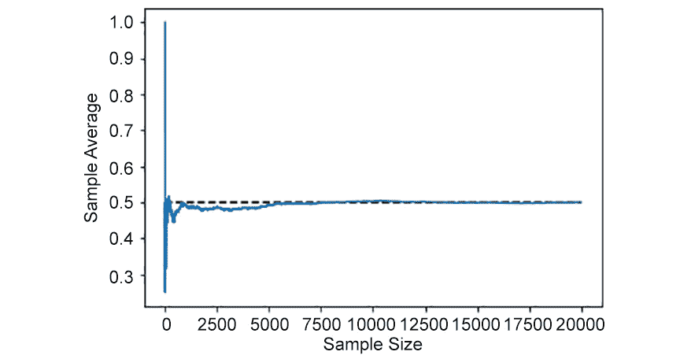

图 9.3：样本大小上每枚硬币翻转的平均人头数

笔记

要访问此特定部分的源代码，请参阅 https://packt.live/2BZcR2h.

您还可以在以下位置联机运行此示例：https://packt.live/31AIxpc.

## 大数定律在现实世界中的实际应用

从概率的角度分析，最好的赌场游戏之一是轮盘赌。玩这个游戏相对简单。游戏的核心是一个巨大的轮子，上面有空格和标签 1 到 36、0 和 00（双零）。奇数为红色，偶数为黑色，两个零位均为绿色。车轮旋转，一个球落入车轮空间，并朝车轮旋转的相反方向移动。最后，球落在车轮上 38 个点中的一个点上。球落在哪里的结果就是人们下注的结果。他们可以下很多不同类型的赌注，从一个特定的数字或球将降落在哪个颜色空间降落不等。赌场根据您下注的类型进行支付。当大多数人第一次看到轮盘赌时，他们中的很多人会问这样一个问题，“这两个绿地是怎么回事？”我们将在几页纸上清楚地看到为什么绿地对赌场非常重要，但首先让我们谈谈玩轮盘赌能带来什么。

为了给游戏增加一点简单性，我们将赌球每次落在红色数字上。赢了这样一个赌注的赔付率是 1:1，所以如果我们赌 5 美元赢了，我们就可以保留 5 美元，再赢 5 美元。如果我们输了赌注，我们将一无所获，输掉 5 美元的赌注。如果我们赌红色，以下是可能发生的概率：

*   赌红色，如果球落在红色上，我们赢：
*   赌红色，如果球落在黑色，我们输了：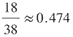
*   赌红色，如果球落在绿色，我们输了：

让我们从 1 美元下注时可以赢或输的钱的角度来看结果：

*   赌红色，如果球落在红色上，我们赢 1 美元
*   赌红色，如果球落在黑色，我们输 1 美元
*   赌红色，如果球落在绿色，我们输 1 美元

这是一个离散分布的例子。要计算离散分布的期望值，将结果的值乘以其发生的概率。如果您查看前两个列表，我们有轮盘赌游戏中每个结果的概率和价值，因此现在我们可以计算一个典型轮盘赌游戏的预期赢或输金额：

*（红色着陆概率*红色着陆赢或输）+（黑色着陆概率*黑色着陆赢或输）+（绿色着陆概率*绿色着陆赢或输）*

现在，如果我们根据我们计算的概率来计算我们能够赢得的预期金额，我们将得到*（0.474*1）+（0.474*-1）+（0.053*-1）≈ -0.05*值：

前面的计算告诉我们，每赌 1 美元，我们就可能损失 5 美分。如果我们加大赌注，我们可能会损失更多的钱。

## 练习 9.03：如果我们一直赌红色，计算轮盘赌的平均赢款

让我们重新编写模拟代码，模拟玩轮盘赌游戏，并跟踪每场游戏的总平均赢或输金额。然后，我们将像掷硬币场景一样绘制结果图：

1.  进口`random`和`matplotlib`包装：

    ```py
    # roulette simulation.py
    # import the module
    import random
    import matplotlib.pyplot as plt
    random.seed(54321)
    ```

2.  为样本大小创建一个变量，并将其设置为`10`。创建一个名为`bet`的变量，并将其设置为$1:

    ```py
    # set the number of games of roulette you want to play
    sample_size = 10
    #set the amount of money you want to bet
    bet = 1
    ```

3.  初始化用于收集模拟结果的变量：

    ```py
    # initialize the variables required for our loop
    # 1 to 36 represent numbers on roulette wheel, 37 represents 0, 38 represents 00
    net_money = 0
    wins = 0
    money_track = []
    trials_track = []
    ```

4.  运行模拟并收集结果：

    ```py
    # create a for loop and collect the results in a list
    for i in range(1,sample_size+1):
        result = random.randint(1,38)
        if result % 2 == 1 and result != 37:
            net_money += bet
            wins += 1
        else:
            net_money -= bet
        money_track.append(net_money/i)
        trials_track.append(i)
    ```

5.  打印模拟结果和平均值的期望值：

    ```py
    # print the results
    print(f'Results: You won {wins} games out of\
    {sample_size} and won an average of\
    {net_money/sample_size} dollars per game')
    print(f'Results: You are expected to win\
    {((18/38)*bet+(20/38)*(-bet))} per game')
    ```

6.  将每场游戏净货币变化的预期值和每场游戏净货币变化的样本平均值绘制成图表：

    ```py
    #create a simple line graph to show our results over time
    plt.plot(trials_track, money_track)
    plt.ylabel('Net Money')
    plt.xlabel('Number of games')
    plt.hlines(((18/38)*bet+(20/38)*(-bet)), 0,            sample_size, linestyles='dashed')
    plt.show()
    ```

7.  Run your notebook and you will get the following results:

    ```py
    Results: You won 4 games out of 10 and won an average of -0.2 dollars per game
    Results: You are expected to win -0.05263157894736842 per game
    ```

    前面的代码将生成以下图形：

    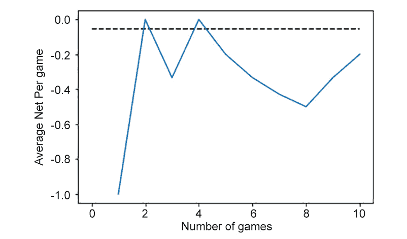

图 9.4：轮盘赌 10 局以上的平均每局净收入

在上图中，实线表示我们玩过的 10 场比赛中每场比赛的平均赢款。虚线表示每场比赛我们预计赢或输的钱数。我们应该每场损失 5 美分，但在这个特定场景中，我们最终总共损失了 20 美分，远低于每场损失 5 美分。如果从代码中删除`random.seed(54321)`并重新运行模拟，结果将不同。您可以随时尝试并更改每次下注的金额，看看会发生什么。

笔记

要访问此特定部分的源代码，请参阅 https://packt.live/3dTdlEb.

您还可以在以下位置联机运行此示例：https://packt.live/2ZtkOEV.

但这并不能反映赌场里发生的事情。没有赌场每天只开 10 局轮盘赌。那么，如果我们将游戏数量从 10 更改为 100000，我们的图形会发生什么变化？将 sample size 变量设置为 100000 并重新运行代码将生成一个如下所示的图形：


图 9.5：超过 100000 场的轮盘赌平均每场净收益

请注意，蓝线很快收敛到每场比赛的平均美元净值-0.05。具体而言，该模拟得出的净利润为-0.054 美元，与我们的预期值相差不远。实际上，从长远来看，赌场会赚钱，而赌徒在每场比赛中都会赔钱。现在，回到绿色空间的问题。如果我们把它们从游戏中移除，将会有 18 个红色和 18 个黑色空格。让我们在以下条件下重新计算我们的预期值：

*（红色着陆的概率*红色着陆的赢或输）+*

*（黑着陆概率*黑着陆赢或输）*


图 9.6：计算预期值的公式

这意味着没有绿地，赌场和赌徒从长远来看都不会赢或输；双方都将带着与开始时相同的金额离开。

# 中心极限定理

通过快速回顾上一节，大数定律告诉我们，随着样本的增大，样本平均值与总体平均值的匹配度越高。虽然这告诉了我们应该期望样本值的平均值，但它并没有告诉我们关于分布的任何信息。为此，我们需要中心极限定理。**中心极限定理**（**CLT**）指出，如果我们有足够大的样本量，样本平均值的分布是近似正态的，总体平均值的平均值和总体标准偏差的标准偏差除以*n*的平方根。这一点很重要，因为我们不仅知道总体平均值的典型值，还知道分布的形状和方差。

## 正态分布与 CLT

在*第 8 章*、*基本概率概念及其应用*中，我们研究了一种称为*正态分布*的连续分布，也称为钟形曲线或高斯曲线（这三个名称的含义相同）。虽然出现了许多正态分布的例子，但这并不是它特殊的主要原因。正态分布之所以特殊，是因为许多统计量的分布遵循正态分布，包括样本均值。

了解样本均值的分布对于我们每天最终解决的许多典型统计问题至关重要。我们获取均值和方差信息，并将其放在一起，以了解样本均值随样本的变化情况。这告诉我们样本均值是我们期望出现的还是我们不期望出现的，需要进一步研究。我们可以从假定相同的人群中抽取两个不同的样本，并证明它们事实上彼此存在显著差异。

## 均匀分布的随机抽样

我们可以通过在 Python 中构建两个模拟来说明和验证 CLT，这就是我们将在下面的练习中所做的。我们要进行的第一个模拟是从均匀分布中随机抽取样本。**均匀分布**是指每个结果都有同等可能被挑选的分布。如果我们绘制一个均匀分布图，它看起来就像一条横穿页面的水平直线。均匀分布的一些例子是掷骰子、掷硬币或典型的随机数生成器。

## 练习 9.04：显示均匀分布的样本平均值

让我们从随机数生成器中抽取一个随机样本，该生成器生成 0 到 100 之间的随机数，并计算样本平均值：

1.  导入我们将要使用的以下 Python 包并设置`seed`：

    ```py
    # sample_from_uniform_dist.py
    # import the module
    import random
    import matplotlib.pyplot as plt
    import math
    import numpy as np
    import scipy.stats as stats
    random.seed(54312)
    ```

2.  为每个样本的大小和要采集的样本总数创建一个变量。由于 CLT 声明我们需要足够大的样本，因此我们选择了 30 个样本。接下来，我们需要大量的示例方法来绘制图表，并将该值设置为 10000:

    ```py
    # select the sample size you want to take
    sample_size = 30
    # select the number of sample mean you want to simulate
    calc_means = 10000
    ```

3.  初始化我们将用于收集样本均值的列表，并在模拟中运行指定次数，收集每个样本的样本均值：

    ```py
    mean_list = []
    # run our loop and collect a sample
    for j in range(calc_means):
        # initialize the variables to track our results
        sample_list = []
        for i in range(sample_size):
            sample_list.append(random.randint(0, 100))
        sample_mean = sum(sample_list) / sample_size
        mean_list.append(sample_mean)
    ```

4.  Create a histogram of the sample means that we collected. Over the top of the histogram, we will overlay what the CLT says the distribution of the sample mean should look like:

    ```py
    """
    create a histogram of our sample and compare it 
    to what the CLT says it should be 
    """
    n, bins, patches = plt.hist(mean_list, \
                                math.floor(math.sqrt(calc_means)),\
                                density=True, facecolor='g', alpha=0.75)
    plt.grid(True)
    mu = 50
    sigma = math.sqrt(((100 ** 2) / 12)) / (math.sqrt(sample_size))
    x = np.linspace(mu - 3 * sigma, mu + 3 * sigma, 100)
    plt.plot(x, stats.norm.pdf(x, mu, sigma))
    plt.show()
    ```

    在笔记本中运行此代码将得到以下结果：

    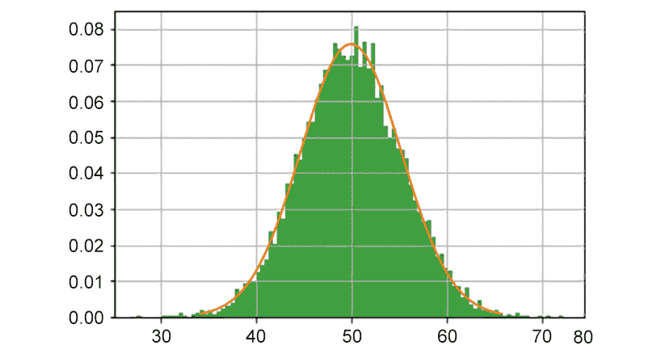

图 9.7：来自均匀分布（样本量为 30）的 10000 个样本的样本平均分布

CLT 给出的预期分布几乎完美地覆盖了我们模拟结果的直方图。您可以随意试验和更改用于生成图形的样本大小和样本数。

笔记

要访问此特定部分的源代码，请参阅 https://packt.live/31JG77I.

您还可以在以下位置联机运行此示例：https://packt.live/3ggAq5m.

## 指数分布的随机抽样

我们知道 CLT 适用于从均匀分布中获取的样本平均数，但是对于看起来一点也不像均匀分布的东西呢？CLT 并没有限制我们从中提取的样本的分布，所以它对看起来一点也不像正态分布的东西有效吗？让我们看看指数分布。**指数分布**是一种从左到右迅速下降的分布，在趋于稳定并接近零之前，但并不十分接近零。下图为典型的指数分布：

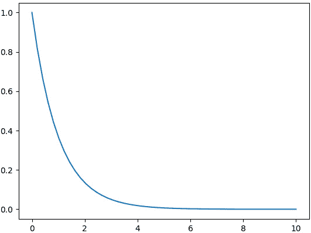

图 9.8：指数分布示例

现实世界中有很多指数分布的例子。例如，高温液体冷却的速度、放射性衰变以及机械零件失效的建模。

## 练习 9.05：从指数分布中取样

在本练习中，我们将随机采样指数分布。以下是我们可以用来模拟指数分布绘图的代码：

1.  导入我们需要的 Python 包。为了查看取较小样本的效果，我们将样本大小设置为`5`（参考以下代码），但样本数量保持在`10000`：

    ```py
    # sample_from_exp_dist.py
    # import the module
    import random
    import matplotlib.pyplot as plt
    import math
    import numpy as np
    import scipy.stats as stats
    # select the sample size you want to take
    sample_size = 5
    # select the number of sample mean you want to simulate
    calc_means = 10000
    ```

2.  初始化用于收集模拟结果的变量。运行模拟，但这次从指数分布而不是均匀分布取样：

    ```py
    mean_list = []
    # run our loop and collect a sample
    for j in range(calc_means):
        # initialize the variables to track our results
        sample_list = []
        for i in range(sample_size):
            draw = np.random.exponential(1)
            sample_list.append(draw)
        sample_mean = sum(sample_list) / sample_size
        mean_list.append(sample_mean)
    ```

3.  创建一个样本直方图意味着我们收集并覆盖了 CLT 所说的我们应该从中得到的信息：

    ```py
    """ create a histogram of our sample and compare it to what the CLT says it should be """
    n, bins, patches = plt.hist(mean_list, \
                       math.floor(math.sqrt(calc_means)), \
                       density=True, facecolor='g', \
                       alpha=0.75)
    plt.grid(True)
    mu = 1
    sigma = 1 / (math.sqrt(sample_size))
    x = np.linspace(mu - 3 * sigma, mu + 3 * sigma, 100)
    plt.plot(x, stats.norm.pdf(x, mu, sigma))
    plt.show()
    ```

4.  Running the code that we typed in our Jupyter notebook will give us the following graph:

    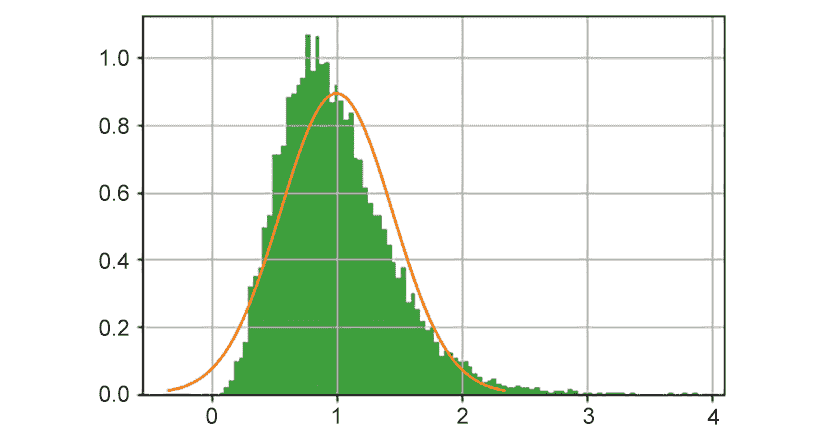

图 9.9：指数分布（样本量为 5）中 10000 个样本的平均样本分布

在上一个题为*练习 9.04**的练习中，*显示了均匀分布*的样本平均值，橙色线告诉我们 CLT 希望我们拥有什么。虽然我们的绿色柱状图与我们预期的相似，但它明显向右倾斜，根本不是钟形曲线。但请记住，CLT 要求我们采集足够大的样本。显然，5 不够大，所以让我们将样本大小从 5 增加到 50，然后重新运行代码。这样做会产生如下结果：*

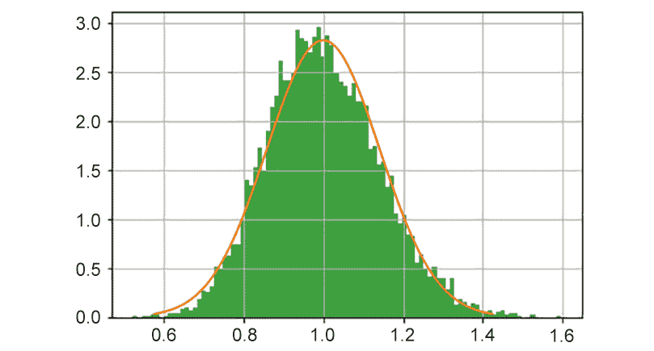

图 9.10：指数分布中 10000 个样本的样本平均值分布，样本量为 50

这看起来更接近我们的预期。显然，50 的样本量足够大，而 5 的样本量则不够。但现在你脑子里可能会闪过一个问题：“什么样的样本量足够大，我们如何知道？”。答案确实取决于潜在的分布；基础分布越偏斜，您必须获取的样本就越大，以确保为 CLT 提供足够大的样本。

笔记

要访问此特定部分的源代码，请参阅 https://packt.live/2D2phXE.

您还可以在以下位置联机运行此示例：https://packt.live/2NRcvNP.

在本章的后面，我们将讨论如何计算所需的样本大小，但是我们只考虑 CLT 适用于 30 或更大的样本。

# 置信区间

正如我们在前面的模拟中所看到的，我们的样本平均值可能因样本而异。虽然在模拟中，我们有权采集 10000 个样本，但在现实世界中我们无法做到这一点；这将过于昂贵和耗时。通常，我们只获得足够的资源来收集一个样本。那么，我们如何才能对样本的结果充满信心呢？在报告样本平均值时，我们有没有办法解释这种可变性？

好消息是 CLT 为我们提供了样本均值方差的概念。我们可以应用 CLT，并通过使用置信区间考虑采样可变性。更一般而言，**置信区间**是基于分布的统计值范围（统计的一个示例是样本平均值），该分布对包含平均值真实值的可能性具有一定程度的置信度。我们并不总是只计算样本均值的置信区间；这个想法适用于从样本中计算的任何统计数据（唯一的区别是如何计算）。置信区间可用于计算我们需要采集的样本量以及误差幅度。

## 计算样本均值的置信区间

我们将计算的第一类置信区间是**z-置信区间**，它将根据标准正态模型（有时称为 z-分布）为我们的样本平均值提供一个区间（或范围）。

为了计算样本平均值的 z 置信区间，我们需要知道四件事：

*   样本均值
*   样本量
*   总体方差
*   临界值或某种程度的信心

样本的平均值和大小是根据我们收集的样本计算出来的。总体方差不是我们从样本中计算出来的；总体方差是给定给我们的一个值。通常，它是先前研究和研究中给出的一些可接受的方差值。谜题的最后一块是临界值或置信水平；这就是正态分布和 CLT 的作用。为了了解临界值是什么，让我们看看标准正态分布（这是一个平均值为 0，方差为 1 的正态分布）及其曲线下的面积：


图 9.11：标准正态模型示例

我们知道在正态分布中，我们的平均值在中心（在本例中为 0）。从-1 到 1 的曲线下方的面积占总面积的 68%。另一种说法是，该分布所描述的值中有 68%介于-1 和 1 之间。大约 95%的值介于-2 和 2 之间。将其应用于样本平均数的分布，我们可以找到 95%样本平均数的取值范围。参照*图 9.7*：


图 9.12：来自均匀分布（样本量为 30）的 10000 个样本的样本平均分布

如果我们看，钟形曲线的中心是 50，这是从 0 到 100 的均匀分布的期望值。从 0 到 100 的均匀分布的预期标准偏差约为 5.27（。因此，应用与之前相同的逻辑，我们的值中约 68%在 45 到 55 之间，约 95%在 40 到 60 之间。这些范围是我们的置信区间。

这里给出了计算 z 置信区间的更正式的方程：


图 9.13：计算 z-置信区间的公式

在这个等式中：

*   *x*为样本平均值。
*   *n*为样本量。
*   *σ*为总体标准差。
*   *Z*是我们信心水平的临界值。

我们的最终置信区间是两个数字：一个上限是两项相加，一个下限是两项相减。幸运的是，这是我们可以用 Python 编写的函数，如下所示：

```py
def z_confidence_interval(data, st_dev, con_lvl):
    import statistics as st
    import scipy.stats as sp
    import math
    sample_mean = st.mean(data)
    n = len(data)
    crit_value = sp.norm.ppf(((1 - con_lvl) / 2) + \
                             con_lvl)
    lower_limit = sample_mean - (crit_value * \
                                 (st_dev/math.sqrt(n)))
    higher_limit = sample_mean + (crit_value * \
                                  (st_dev / math.sqrt(n)))
    print (f'Your {con_lvl} z confidence interval         is ({lower_limit}, {higher_limit})')
    return (lower_limit,higher_limit)
```

此函数将以下内容作为输入：我们收集的数据、总体标准偏差（提供给我们）以及置信水平。它将把置信度打印到控制台，并将其作为元组返回。

## 练习 9.06：查找轮询数据的置信区间

你正在进行一场政治竞选，并决定组织 30 个焦点小组，每组约 10 人。你得到了结果，并且想要向你的候选人报告在一个典型的 10 人小组中会投票给他们的人数。由于每个焦点组都有一些变化，因此您决定最准确的方法是给出 95%的 z 置信区间。根据以往经验，假设标准偏差为 2.89。让我们使用 Python 对此进行建模：

1.  导入`random`Python 包并将种子设置为`39809`。这将确保每次运行程序时得到相同的结果：

    ```py
    import random
    random.seed(39809)
    ```

2.  初始化我们的样本列表，并从焦点小组收集样本。从那里，我们只需将信息输入我们的函数：

    ```py
    sample_list = []
    for i in range(30):
        sample_list.append(random.randint(0, 10))
    z_confidence_interval(sample_list,2.89,0.95)
    ```

3.  如果所有操作都正确，则在运行笔记本时应打印以下内容：

    ```py
    Your 0.95 z confidence interval is (3.965845784931483, 6.034154215068517)
    ```

这告诉我们，在一个典型的焦点小组中，每个小组中有 4 到 6 人将投票给我们的候选人。这向你表明，竞选活动应该继续努力，说服更多的人投票支持你的候选人。

笔记

要访问此特定部分的源代码，请参阅 https://packt.live/2Zp6XiU.

您还可以在以下位置联机运行此示例：https://packt.live/3eUBL1B.

## 小样本置信区间

当您有足够大的样本时，z 置信区间有效（请记住我们的经验法则，样本大小为 30 或更大）；但是如果你的样品不够大怎么办？然后您可以使用一个**t 置信区间**，它与 z 置信区间基本相同，但有两个例外：

*   t-置信区间并不假设您知道总体标准偏差，因此我们使用样本标准偏差。
*   它使用 t 分布来计算临界值，而不是 z（标准正态）分布。两者之间的区别在于，t 分布不太集中在平均值周围，因此不知道总体标准偏差。

为了计算 t-置信区间，我们需要知道两件事；第一个是自由度，计算为样本量减去 1（*n-1*。第二是信心水平。t 置信区间的公式如下所示：


图 9.14：计算 t-置信区间的公式

在这个等式中：

*   *x*为样本平均值。
*   *t*n-1 是具有*n-1*自由度的临界值。
*   *s*为样品标准偏差。
*   *n*为样本量。

就像 z-区间一样，我们的最终答案是一个下限和一个上限。我们将用 Python 编写一个函数来完成所有计算工作：

```py
def t_confidence_interval(data, con_lvl):
    import statistics as st
    import scipy.stats as sp
    import math
    sample_mean = st.mean(data)
    sample_st_dev = st.stdev(data)
    n = len(data)
    crit_value = sp.t.ppf(((1 - con_lvl) / 2) + \
                          con_lvl, n-1)
    lower_limit = sample_mean - (crit_value * \
                  (sample_st_dev/math.sqrt(n)))
    higher_limit = sample_mean + (crit_value * \
                   (sample_st_dev/math.sqrt(n)))
    print(f'Your {con_lvl} t confidence interval is \
({lower_limit},{higher_limit})')
    return (lower_limit,higher_limit)
```

让我们使用与 z 置信区间相同的样本列表。`t_confidence_interval`函数的使用方法与我们的 z-置信区间函数相同；我们将输入要计算 t 置信区间的数据列表，并指定我们的置信水平。不需要包括总体标准偏差；t 置信区间使用样本标准偏差，并将自动为我们计算。`t_confidence_interval`功能的正确用法如下：

```py
t_confidence_interval(sample_list,0.95)
```

如果所有操作都正确，则在运行上述代码时，应在笔记本中输出以下内容：

```py
Your 0.95 t confidence interval is (3.827357936126168,6.172642063873832)
```

注意，t 置信区间比 z 置信区间宽。这是因为我们在使用样本标准偏差估计总体标准偏差时比使用已知值有更多的不确定性。

t-置信区间的优点在于，它不仅可以用于小样本或不知道总体标准偏差的情况；它可以用于任何使用 z 置信区间的情况。事实上，随着样本量的增大，t 分布越接近 z（标准正态）分布。因此，如果您在查看之前的研究时不确定给定或发现的总体标准偏差值，您可以始终谨慎使用 t 置信区间。

## 某一比例的置信区间

让我们回到政治竞选的例子。在不同的焦点小组给出了不确定的结果后，一项新的民意调查显示，你的候选人赢得了比赛，在 350 人的样本中，54%的人表示他们会投你的候选人的票，而你的对手则得到了另外 46%的票。你想计算这个比例的置信区间，这样你就可以考虑取样变异性。

我们知道如何计算样本均值的置信区间，但如何计算比例的置信区间？样本的百分比不同于样本的平均值。幸运的是，有一个计算样本比例置信区间的公式：


图 9.15：计算置信区间的公式

在这个等式中：

*   *p̂*为样本比例。在这个例子中，54%的人投了你的票。
*   *n*为样本量。例如，这是 350 人。
*   *Z*是标准正态分布的临界值。我们的计算方法与 z-置信区间相同。

在我们可以应用此方法之前，需要满足一些条件：

*   我们样本中的观察结果是独立的，因此，在我们的示例中，一个人的回答不会影响另一个人的回答。
*   我们需要至少 10 次成功和 10 次失败，所以我们需要至少 10 个人投票给我们，10 个人投票给你的对手。

同样，我们可以用 Python 创建一个函数来为我们进行计算：

```py
def prop_confidenct_interval(p_hat, n, con_lvl):
    import math
    import scipy.stats as sp
    crit_value = sp.norm.ppf(((1 - con_lvl) / 2) + \
                             con_lvl)
    lower_limit = p_hat - (crit_value * (math.sqrt(\
                 (p_hat * (1-p_hat)) / n)))
    higher_limit = p_hat + (crit_value * (math.sqrt(\
                  (p_hat * (1 - p_hat)) / n)))
    print(f'Your {con_lvl} proportional confidence \
interval is ({lower_limit},{higher_limit})')
    return (lower_limit,higher_limit)
```

与我们创建的其他函数不同，我们不提供数据值列表。相反，我们可以直接输入统计数据并设置置信水平。为了为我们的调查创建置信区间，我们输入如下信息：

```py
prop_confidenct_interval(0.54,350, 0.95)
```

并在控制台中打印以下结果：

```py
Your 0.95 proportional confidence interval is (0.4877856513683282,0.5922143486316719)
```

这告诉我们，我们可以有 95%的信心，我们的候选人将获得的选票比例的真实值在 48.8%到 59.2%之间。因此，民意调查的结果是不确定的，它表明我们还有更多的工作要做，以说服人们投票给我们的候选人。请注意，这是民意测验通常获得误差幅度的地方。**误差幅度**是距离我们的点估计器（*p*在本例中）和任一边界的距离（因为置信区间是对称的；不管我们使用上限还是下限）。对于本次调查，我们的误差幅度为*0.592-0.54=0.052*。

因此，前一次调查的误差幅度约为 5.2%。无论是政治性的还是其他方面的，当你在接受任何民意调查结果时，都要记住这一点。

# 假设检验

在上一节中，我们进行了模拟，其中样本平均值在不同样本之间变化，尽管样本来自同一人群。但是，我们如何知道我们计算的样本均值是否与预先设定的值或甚至是不同的样本显著不同？我们如何知道差异是行动中的可变性，还是衡量标准不同？答案在于进行假设检验。

**假设检验**是一种统计检验，旨在确定统计数据是否与我们预期的显著不同。假设检验的例子包括检查样本平均值是否与预先设定的标准显著不同，或者比较两个不同的样本，看看它们在统计上是否不同或相同。

## 部分假设检验

任何假设检验都有三个主要部分：假设、检验统计量和 p 值。*假设*是您正在进行测试的内容，以确定它们是否应该被拒绝或接受。任何测试总是有两个假设：一个**无效假设**（通常称为使用符号*H*0）和一个**替代假设**（通常称为使用符号*H*a）。无效假设是我们一直假设或已知为真的假设；换句话说，这就是我们预先制定的标准。替代假设是我们将要与我们的空值进行比较的替代假设；实际上，这是我们想要证明的事实。

以下是几种假设的一些例子：

*   你是一家制造公司的领导者，你的流程通常每小时消耗 15 升燃料。您的公司正在测试此流程的更改，以尝试使用更少的燃油。他们采集了 24 小时的样本，发现新工艺每小时使用 13.7 升燃料。公司需要知道这种减少是否显著，或者是否可以归因于过程中的差异。您的无效假设将是该过程通常使用的：*H*O*：μ=15*。我们想尝试证明新工艺使用更少的燃料，因此我们的替代假设是：*H*A*：μ<15*。
*   理查德是你们城市的商业面包师。他想知道是否要为他的工厂的面包制作部分投资新设备。通常，他的工厂一个班次可以生产 15000 条面包。理查德派了一个班次去尝试新设备，每班 5 次，他们平均每班能做 17500 个面包。你让 Richard 测试一下，看看这是否有显著的不同；无效假设将基于他通常所做的（*H*O*：μ=15000*），替代假设将是他想要尝试和证明的（*H*A*：μ=15000*）。
*   琳达是公司质量控制部门的分析师。该公司生产的一个零件需要 15 英寸长。由于该公司无法测量所制造的每个零件，Linda 抽取了 100 个零件的样本，发现该样本的平均长度为 14.89 英寸。她告诉你，他们希望每个零件都是 15 英寸（*H*O*：μ=15*），他们想尝试找出样本是否证明平均零件通常不是 15 英寸（*H*A*：μ）≠ 15*）。

上述每种情况都描述了您将遇到的三种典型假设测试之一：上尾测试、下尾测试和双尾测试。了解您正在进行的测试类型是必要的，这样您就可以编写假设并正确计算 p 值。

**检验统计量**是一个数字，描述了我们观察到的样本与我们假设或已知的测试平均值的比较情况。这是我们进行的不同测试之间差异最大的部分；它基于我们正在测试的特定统计数据和使用的测试。这是统计测试中最数学化的部分，通常用公式表示。**p 值**是我们假设检验的最后一部分；它通常被定义为，如果我们假设零假设为真，那么看到我们收集的样本的概率。我们将该值与某些显著性水平进行比较（0.05 是最常用的显著性水平）；如果我们的 p 值小于我们的显著性水平，那么我们拒绝无效假设，并有证据证明替代假设是正确的。同样，如果我们的 p 值大于我们的显著性水平，我们无法拒绝无效假设，也没有任何证据表明替代假设是正确的。

## Z 检验

就像我们的 z-置信区间一样，有一个基于标准正态模型的假设检验，称为**z-检验**。就像 z-置信区间一样，z-检验假设我们知道总体标准偏差，并且我们有足够大的样本（经验法则是样本量至少为 30）。z 测试的基本设置如下所示：

*   *H*O*：μ=μ*O（别担心；*μ*O 是我们通常认为的平均值，只是一个数字）
*   *H*A*：μ<μ*O 或*H*A*：μ>μ*O 或*H*A*μ≠ μ*O（*μ*O 将始终与我们对无效假设的结果相匹配）
*   Test statistics: 

    哪里：

    *x*为样本平均值。

    *σ*是已知的总体标准偏差。

    *n*为样本量。

*   P 值：

虽然一旦掌握了诀窍，这些数学都不难，但我们可以使用 Python 使计算变得非常简单。

## 练习 9.07：Z 测试正在进行

让我们从已知人口均值的分布中抽取一个随机样本，看看我们的 Z 检验是否可以选择正确的假设：

1.  让我们从导入我们需要的所有库开始这个练习，以便能够运行我们的代码并设置`seed`值：

    ```py
    import scipy.stats as st
    import numpy as np
    import pandas as pd
    import math as mt
    import statistics as stat
    import statsmodels.stats.weightstats as mod
    import statsmodels.stats.proportion as prop
    np.random.seed(12345)
    ```

2.  我们将编写一个函数来为我们进行 z 测试。输入将是一个样本（以列表的形式）、总体标准偏差（记住，指定这是 z 检验的要求之一）、假设值、检验的显著性水平和检验类型（上、下或双尾检验）。我们将根据给定列表计算样本平均数和样本量。然后，我们将获取输入并计算测试统计数据。然后，根据我们决定进行的假设检验，我们相应地计算一个 p 值。最后，我们将 p 值与显著性水平进行比较，如果 p 值小于显著性水平，我们将拒绝无效假设。否则，我们无法拒绝无效假设：

    ```py
    def z_test(sample, pop_st_dev, hypoth_value, \
               sig_level, test_type):
        sample_mean = stat.mean(sample)
        sample_size = len(sample)
        test_statistic = (sample_mean - hypoth_value) / \
                         (pop_st_dev / (mt.sqrt(sample_size)))
        if test_type == 'lower':
            p_value = st.norm.cdf(test_statistic)
        if test_type == 'upper':
            p_value = 1 - st.norm.cdf(test_statistic)
        if test_type == 'two':
            p_value = 2 * (1 - st.norm.cdf(abs(            test_statistic)))
        print(f'P Value = {p_value}')
        if p_value < sig_level:
            print(f'Results are significant. Reject the Null')
        else:
            print(f'Results are insignificant. '\
                   'Do Not Reject the Null')
    ```

3.  We draw a random sample size of `50` from a normal distribution with a mean of `15` and a standard deviation of `1`. We will print the sample mean to the console so we know what it is (it will be different every time you run this code since we take a random sample every time). We use our z-test function to conduct a lower-tailed test since we want to see whether our mean is significantly less than `16`. We specify the list that contains our data (`data1`), the population standard deviation (we know this is `1`), the value of the hypothesis (we want to see whether it is significantly less than `16`), the level of significance (most of the time this will be `0.05`), and finally the type of test (since we want to see whether the mean is lower than `16`, this is a lower-tailed test):

    ```py
    # 1 - Lower Tailed Test
    # Randomly Sample from Normal Distribution mu=     and st_dev = 3
    data1 = np.random.normal(15, 1, 50)
    # Test to see if Mean is significantly less then 16
    print(f'Sample mean: {stat.mean(data1)}')
    z_test(data1,1,16,0.05,'lower')
    # most of the time, the null should be rejected
    ```

    当我们运行此代码时，我们应该得到如下内容：

    ```py
    Sample mean: 14.94804802516884
    P Value = 5.094688086201483e-14
    Results are significant.  Reject the Null
    (-7.43842374885694, 5.094688086201483e-14)
    ```

    由于我们的检验统计量的 p 值小于 0.05（从科学记数法中写出，为 0.0000000000000 509），我们知道，基于 50 的样本量，样本平均值 15.06 明显小于 16。由于我们从平均值为 15 的人群中抽取样本，测试结果与我们预期的一致。同样，由于我们一开始是随机抽样，你的结果可能会有所不同，但是，对于大多数样本来说，这个测试应该拒绝无效假设。在返回的元组中，第一个值是测试统计量，第二个值是我们的 p 值。

4.  Next, let's test to see whether our mean is significantly larger than `14`. Following the same pattern as the lower-tailed test, our code will appear as follows:

    ```py
    #test to see if the mean is significantly more than 14
    print(f'Sample mean: {stat.mean(data1)}')
    z_test(data1,1,14,0.05,'upper')
    #most of the time the null should reject
    ```

    运行代码时，控制台中将显示以下输出：

    ```py
    Sample mean: 14.94804802516884
    P Value = 1.0159539876042345e-11
    Results are significant.  Reject the Null
    (6.703711874874011, 1.0159539876042345e-11)
    ```

5.  For our final z-test, we will perform a two-tailed test and see whether our sample mean differs significantly from `15`. In this test, we really do not have a preference whether it is higher or lower than `15`; we just want to see whether it is different:

    ```py
    #test to see if the mean is significantly different than 15
    print(f'Sample mean: {stat.mean(data1)}')
    z_test(data1,1,15,0.05,'two')
    #most of the type we should not reject the null
    ```

    当我们运行此代码时，结果如下所示：

    ```py
    Sample mean: 14.94804802516884
    P Value = 0.7133535345453159
    Results are insignificant.  Do Not Reject the Null
    (-0.3673559369914646, 0.7133535345453159)
    ```

这个结果是有意义的，因为我们对平均值为 15 的人群进行了抽样。

笔记

要访问此特定部分的源代码，请参阅 https://packt.live/2C24ItD.

您还可以在以下位置联机运行此示例：https://packt.live/2NNyntn.

## 比例 Z 检验

z 检验最常用的不是检验样本均值的显著性，而是检验百分比的显著性。所需的假设与比例 z 置信区间的要求相同：随机抽样、独立性，以及至少 10 次成功和 10 次失败。我们将计算该测试的测试统计数据，如下所示：


图 9.16：计算测试统计数据的公式

我们将采用与样本平均值 z 检验相同的方法计算 p 值。我们不需要为此测试创建函数；一个已经存在于名为`proportions_ztest`的`statsmodels.stats.proportion`Python 包中。此函数的语法如下所示：

```py
proportions_ztest(x,n,Po, alternative=['smaller',\
                                       'larger','two-sided'])
```

在这里：

`x`是我们样本中的成功次数。

`n`是我们样品的尺寸。

`Po`是我们想要测试的假设值。

备选方案指定下尾、上尾或双尾测试。

这个函数的输出是一个元组；第一个元素是检验统计量，第二个元素是 p 值。让我们回到我们的投票例子：你们的竞选团队自己进行了一次投票，并对 350 人进行了抽样调查。350 人中有 193 人说他们会投你的票。我们想看看我们收集的样本是否是大多数人会投票给你的证据。

我们将 z 检验的结果分配给一个名为`results`的变量。我们调用函数，其中`193`是将投票给我们的成功者/人的数量，样本量为`350`。由于我们想测试我们的样本是否是我们拥有多数选票的证据，因此我们想进行上尾测试，假设值为`0.50`：

```py
#z-test for proportion
results = prop.proportions_ztest(193,350,.50, \
                                 alternative='larger')
print(results)
```

运行代码时，将向控制台打印以下内容：

```py
(1.93454148164361, 0.026523293494118718)
```

我们的 p 值约为 0.027，这是一个显著的结果，为 0.05。这告诉我们，我们的样本是我们拥有多数选票的证据。

## T 检验

虽然 z 检验对于对某一比例进行假设检验很有用，但在检验样本平均值时却不太实用，因为我们通常不知道总体的标准偏差。在其他情况下，我们的样本量非常小。对于这种情况，我们可以使用 t 检验，它类似于我们的 t 置信区间。就像 t-置信区间一样，不需要知道总体标准偏差；你可以用样本来估计它。

t 检验的公式如下所示：


图 9.17：计算 t 检验的公式

在这个等式中：

*   *x*为样本平均值。
*   *μ*O 是我们测试的假设值。
*   *s*为样品标准偏差。
*   *n*为样本量。

我们将使用 t 分布而不是标准正态分布来计算 p 值。然而，我们不打算过多地关注这个特定测试的机制，因为它与我们已经讨论过的其他假设测试一样。我们将创建一个函数来进行 t 检验，类似于 z 检验：

```py
def t_test(sample, hypoth_value, sig_level, test_type):
    sample_mean = stat.mean(sample)
    sample_st_dev = stat.stdev(sample)
    sample_size = len(sample)
    test_statistic = (sample_mean - hypoth_value) / \
                     (sample_st_dev/(mt.sqrt(sample_size)))
    if test_type == 'lower':
        p_value = st.t.cdf(test_statistic,df=sample_size-1)
    if test_type == 'upper':
        p_value = 1 - st.t.cdf(test_statistic,df=sample_size-1)
    if test_type == 'two':
        p_value = 2 * (1 - st.t.cdf(abs(test_statistic), \
                                    df=sample_size-1))
    print(f'P Value = {p_value}')
    if p_value < sig_level:
        print(f'Results are significant.  Reject the Null')
    else:
        print(f'Results are insignificant. '\
               'Do Not Reject the Null')
```

在上述代码中：

*   `sample`是您的样品的测量值列表。
*   `hypoth_value`是您正在测试的值。
*   `sig_level`为显著性水平。
*   `test_type`是测试类型的下、上或两种。

## 练习 9.08：T 检验

我们将检查两个不同的样本：一个大样本和一个小样本。两个样本将从平均值为 50、标准偏差为 10 的正态分布中随机选择。两个样本之间的唯一区别是，大样本的尺寸为 100，小样本的尺寸为 10：

1.  首先，让我们导入我们将使用的库，设置种子，然后随机生成我们的大样本：

    ```py
    import scipy.stats as st
    import numpy as np
    import pandas as pd
    import math as mt
    import statistics as stat
    import statsmodels.stats.weightstats as mod
    import statsmodels.stats.proportion as prop
    np.random.seed(1)
    data1 = np.random.normal(50, 10, 100)
    ```

2.  为我们的 t 测试创建函数：

    ```py
    def t_test(sample, hypoth_value, sig_level, test_type):
        sample_mean = stat.mean(sample)
        sample_st_dev = stat.stdev(sample)
        sample_size = len(sample)
        test_statistic = (sample_mean - hypoth_value) / \
                         (sample_st_dev/(mt.sqrt(sample_size)))
        if test_type == 'lower':
            p_value = st.t.cdf(test_statistic,df=sample_size-1)
        if test_type == 'upper':
            p_value = 1 - st.t.cdf(test_statistic,df=sample_size-1)
        if test_type == 'two':
            p_value = 2 * (1 - st.t.cdf(abs(test_statistic), \
                                        df=sample_size-1))
        print(f'P Value = {p_value}')
        if p_value < sig_level:
            print(f'Results are significant.  Reject the Null')
        else:
            print(f'Results are insignificant. '\
                   'Do Not Reject the Null')
    ```

3.  We will run three different tests: one to see whether the sample mean differs significantly from `50`, whether the sample mean is significantly lower than `51`, and whether the sample mean is significantly higher than `48`:

    ```py
    print('large sample')
    print(f'Sample mean: {stat.mean(data1)}')
    t_test(data1,50,0.05,'two')
    t_test(data1,51,0.05,'lower')
    t_test(data1,48,0.05,'upper')
    ```

    运行此代码将导致以下结果：

    ```py
    large sample
    Sample mean: 50.60582852075699
    P Value = 0.4974609984410545
    Results are insignificant.  Do Not Reject the Null
    P Value = 0.32933701868279674
    Results are insignificant.  Do Not Reject the Null
    P Value = 0.002109341573010237
    Results are significant.  Reject the Null
    ```

    第一次测试不重要，我们没有证据表明平均值与`50`有显著差异。第二个测试也不重要；样本不能证明平均值显著大于`51`。最后一个检验是显著的；样本证明平均值显著高于`48`。

4.  Now, we will run the same three tests, only this time we will use a sample with a size of `5` (we will use the first `5` elements from the large sample):

    ```py
    # select the first 5 elements of the data set
    data2 = data1[:5]
    print(data2)
    #two-tailed test = Is the sample mean significantly 
    #different from 50?
    print('small sample')
    print(f'Sample mean: {stat.mean(data2)}')
    t_test(data2,50,0.05,'two')
    #lower tailed = Is the sample mean significantly 
    #lower than 51?
    t_test(data2,51,0.05,'lower')
    #upper tailed = is the sample mean significantly 
    #more than 48?
    t_test(data2,48,0.05,'upper')
    ```

    运行上述代码会产生以下结果：

    ```py
    [66.24345364 43.88243586 44.71828248 39.27031378 58.65407629]
    small sample
    Sample mean: 50.553712409836436
    P Value = 0.918572770568147
    Results are insignificant.  Do Not Reject the Null
    P Value = 0.4671568669546634
    Results are insignificant.  Do Not Reject the Null
    P Value = 0.32103491333328793
    Results are insignificant.  Do Not Reject the Null
    ```

前两次测试的结果没有变化，而第三次测试的结果确实发生了变化，尽管样本平均数几乎相同。差异的原因在于样本量小；由于小样本导致的确定性较低，因此测试更为保守，不太可能拒绝无效假设。这可以在我们的测试统计方程中显示：


图 9.18：计算 t 检验统计数据的公式

注意分母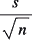；如果*n*较小，则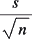的值将较大（对于常数*s*。这会导致测试统计数据分母的值变大，从而导致总体测试统计数据变小。

笔记

要访问此特定部分的源代码，请参阅 https://packt.live/38mMShg.

您还可以在以下位置联机运行此示例：https://packt.live/3gkBdlK.

## 2 样本 T 检验或 A/B 检验

我们将看到的最后一个测试是两样本 t 检验。这是一个假设检验，比较两个不同样本的平均值，可以告诉您一个平均值是否显著高于、显著低于或显著不同于另一个平均值。其中一个应用是 A/B 测试。A/B 测试是指向两个不同的组展示一个网站或应用程序的两个不同版本，并收集某种性能度量。衡量性能的例子可以是花费的金额、点击广告的人数，或者人们在手机游戏内的微交易上花费的金额。收集完数据后，测试两个样本平均值，看看两个不同版本之间的差异是否显著。

零假设和替代假设在两个样本测试中的作用与在一个样本测试中的作用稍有不同。不是将样本均值与某个值进行比较，而是将其与另一个均值进行比较。我们通常通过将差值与零进行比较来说明这一点。使用一些代数，您可以找出应如何建立替代假设：

*   上尾（平均值 1 大于平均值 2）：
*   下尾（平均值 1 小于平均值 2）：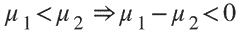
*   双尾（平均值 1 与平均值 2 不同）：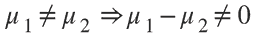

对于两样本 t 检验，无效假设将始终设置为 0（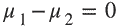。换句话说，无效假设是指两种方法之间没有差异，另一种是指存在差异。2 样本 t 检验的检验统计量如下所示：

具有一定的自由度

好消息是，我们不必手工计算，也不必费劲地创建自己的函数来计算。`scipy.stats`包中有一个函数用于此测试。功能如下：

```py
scipy.stats.ttest_ind(x1,x2,equal_var=False)
```

在这里：

*   `x1`是第一个样本中的数据列表。
*   `x2`是第二个样本中的数据列表。
*   我们将`equal_var`设置为`False`，因为我们不知道两个样本的方差是否相同。

此函数返回两个值：有符号测试统计值和 p 值。有些人可能已经注意到，没有选项来指定您正在执行的测试。这是因为此函数始终假定您正在进行双尾测试。那么，你如何利用这一点来获得单尾测试的结果呢？由于 t 分布是对称的，单尾检验的 p 值将是双尾检验的 p 值的一半。第二件要看的是检验统计的符号。对于低尾检验，只有当检验统计量为负时，才会拒绝零假设。同样，对于上尾检验，只有当检验统计量为正时，才会拒绝零假设。因此，对于单尾测试：

*   **降低**：如果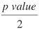小于您的显著性水平且您的检验统计为阴性，则拒绝无效假设。
*   **上**：如果小于您的显著性水平且您的检验统计为阳性，则拒绝无效假设。

## 练习 9.09：A/B 测试示例

我们有两个样本，一个来自平均值为 50 的正态分布，另一个来自平均值为 100 的分布。两个样本的大小均为 100。在本练习中，我们将确定一个样本的样本平均值是否与另一个显著不同、更低或更高：

1.  首先，让我们导入我们将使用的库：

    ```py
    import scipy.stats as st
    import numpy as np
    ```

2.  Let's draw our random samples and print the sample means so we know what they are. Remember to set the seed:

    ```py
    # Randomly Sample from Normal Distributions 
    np.random.seed(16172)
    sample1 = np.random.normal(50, 10, 100)
    sample2 = np.random.normal(100,10,100)
    print(f'Sample mean 1: {stat.mean(sample1)}')
    print(f'Sample mean 2: {stat.mean(sample2)}')
    ```

    结果如下：

    ```py
    Sample mean 1: 50.54824784997514
    Sample mean 2: 97.95949096047315
    ```

3.  We will perform a 2-sample t-test using the function from the `scipy` package and print the results:

    ```py
    two_tail_results = st.ttest_ind(sample1, sample2, \
                                    equal_var=False)
    print(two_tail_results)
    ```

    结果如下：

    ```py
    Ttest_indResult(statistic=-33.72952277672986,     pvalue=6.3445365508664585e-84)
    ```

    由于默认情况下，函数进行双尾测试，我们知道样本 1 的平均值与样本 2 的平均值显著不同。如果我们想做一个低尾测试（样本 1 的平均值明显小于样本 2），我们将使用相同的代码。唯一的区别是我们将 p 值除以 2，然后检查我们的测试统计是否为负。由于我们的 p 值除以 2 小于 0.05，且我们的检验统计为负，我们知道样本 1 的平均值显著小于样本 2 的平均值。

4.  If we want to test whether the mean of sample 2 is significantly greater than the mean of sample 1, we just switch the position of sample 1 and sample 2 in the function:

    ```py
    upper_tail = st.ttest_ind(sample2, sample1, equal_var=False)
    print(upper_tail)
    ```

    结果如下：

    ```py
    Ttest_indResult(statistic=33.72952277672986, 
    pvalue=6.3445365508664585e-84)
    ```

就像低尾检验一样，我们将 p 值除以 2。然而，我们将检查测试统计是否为阳性。由于 p 值除以 2 小于 0.05 且检验统计量为正，我们知道样本 2 的平均值显著高于样本 1 的平均值。

笔记

要访问此特定部分的源代码，请参阅 https://packt.live/3iuHmOr.

您还可以在以下位置联机运行此示例：https://packt.live/3ghpdl4.

## 线性回归简介

我们已经研究了如何描述和测试样本统计数据，但若我们想使用数据的特征来描述另一个特征呢？例如，移动应用程序的价格如何影响下载数量？为此，我们将使用线性回归对数据进行建模。**线性回归**是我们使用一个或多个自变量的线性方程来描述单个因变量。通常，我们的回归方程为斜率截距形式，如下所示：


图 9.19：线性回归公式

在这里：

*   β1 是我们方程的斜率，通常称为系数。
*   βO 是方程的截距。

我们如何计算出系数和截距的值？它从**残差**开始，即预测 y 值和实际 y 值之间的差值。另一种看待残差的方法是，这是我们方程的预测偏离的量。虽然我们在这里不会详细讨论，但我们使用微积分计算出使所有残差总和最小化的*β*1、*β*O 的值。我们也不一定局限于一个系数；我们可以有多个（两个或更多）系数，如下所示：


图 9.20：多系数线性回归公式

幸运的是，我们可以使用 Python 为我们完成所有计算，特别是`sklearn`包中的线性模型函数。

## 练习 9.10：线性回归

我们的任务是利用红酒的其他特性来预测红酒的 pH 值。数据集可以从 GitHub 存储库下载，网址为 https://packt.live/3imVXv5.

笔记

这是 UCI 机器学习库提供的葡萄酒质量数据集(http://archive.ics.uci.edu/ml). 尔湾，加州大学：加利福尼亚大学信息与计算机科学学院。*P.Cortez、A.Cerdeira、F.Almeida、T.Matos 和 J.Reiss*。通过物理化学性质的数据挖掘建模葡萄酒偏好。《决策支持系统》，爱思唯尔，47（4）：547-5532009。

1.  导入我们需要的包并读取数据：

    ```py
    # import packages and read in data
    import pandas as pd
    import statistics as st
    import scipy.stats as sp
    import math
    import sklearn.linear_model as lm
    import matplotlib.pyplot as plt
    from mpl_toolkits import mplot3d
    import numpy as np
    data = pd.read_csv("winequality-red.csv")
    ```

2.  将数据分为我们需要的两列（我们将尝试使用柠檬酸的量来预测`pH`水平）。设置`pH`水平为因变量，柠檬酸为自变量：

    ```py
    data1 = data[['pH','citric acid']]
    plt.scatter(x=data1['citric acid'], y=data1['pH'])
    y = data1['pH']
    x = data1[['citric acid']]
    ```

3.  Fit the linear model and graph the data as a scatter plot and our linear regression model:

    ```py
    model = lm.LinearRegression()
    model.fit(x,y)
    plt.scatter(x, y,color='g')
    plt.plot(x, model.predict(x),color='k')
    plt.show()
    ```

    输出结果如下：

    

    图 9.21：线性方程似乎很适合我们的数据

    如果你看这张图片，你会发现这条线与数据吻合得很好。我们再加一个自变量；在这种情况下，检测残余糖的量，并观察其是否改善了预测。

4.  这一次，我们将自变量设置为柠檬酸和残糖，并拟合模型：

    ```py
    #can we predict the pH of the wine using 
    #citric acid and residual sugar?
    data2 = data[['pH','citric acid','residual sugar']]
    y = data2['pH']
    x = data2[['citric acid', 'residual sugar']]
    model = lm.LinearRegression()
    model.fit(x,y)
    y_pred = model.predict(x)
    ```

5.  Create a three-dimensional scatter plot and graph the line in the `3d` space to check to see whether it fits our data well:

    ```py
    threedee = plt.figure().gca(projection='3d')
    threedee.scatter(data2['citric acid'],     data2['residual sugar'],data2['pH'])
    threedee.set_xlabel('citric acid')
    threedee.set_ylabel('residual sugar')
    threedee.set_zlabel('pH')
    xline = np.linspace(0, 1, 100)
    yline = np.linspace(0, 16, 100)
    zline = xline*(-0.429) + yline*(-0.000877)+3.430
    threedee.plot3D(xline, yline, zline, 'red')
    plt.show()
    ```

    输出结果如下：

    

图 9.22：线性方程似乎与我们的数据不太吻合

如果你看这张图片，我们的线性模型似乎不像我们拟合的第一个模型那样拟合数据。基于此，我们的最终模型中可能不会涉及残余糖。

笔记

要访问此特定部分的源代码，请参阅 https://packt.live/2Anl3ZA.

您还可以在以下位置联机运行此示例：https://packt.live/3eOmPlv.

## 活动 9.01：标准化测试性能 rmance

您的任务是描述 2015 年 PISA 测试的结果，并调查互联网基础设施普及率对测试分数的可能影响。

要下载数据集，请转到位于的 GitHub 存储库 https://packt.live/3gi2hCg，下载`pisa_test_scores.csv`文件，并将该文件保存到您的工作目录中。

笔记

PISA 考试成绩数据集基于世界银行提供的数据(https://datacatalog.worldbank.org/dataset/education-statistics). 世界银行 Edstats。

保存该文件后，请执行以下操作：

1.  用置信区间描述学生在阅读、科学和数学方面的典型分数。
2.  使用假设检验，评估互联网基础设施的普及是否会导致更高的测试分数。
3.  Construct a linear model that uses reading and writing scores to predict the mathematics score.

    笔记

    可在第 688 页找到此活动的解决方案。

# 总结

在本章中，我们研究了大数定律，以及样本大小如何影响样本均值统计的稳定性。通过 CLT，检验了置信区间和假设检验的理论基础。置信区间用于描述样本统计，如样本平均数、样本比例和误差幅度。假设检验是利用收集到的样本证据来评估两个相反的假设。

下一章将开始学习微积分，你将研究诸如瞬时变化率和求曲线斜率等主题。在研究了这一点之后，我们将研究积分，即寻找曲线下的区域。最后，我们将使用导数来寻找复杂方程和图形的最优值。

NKJ24

VBM37