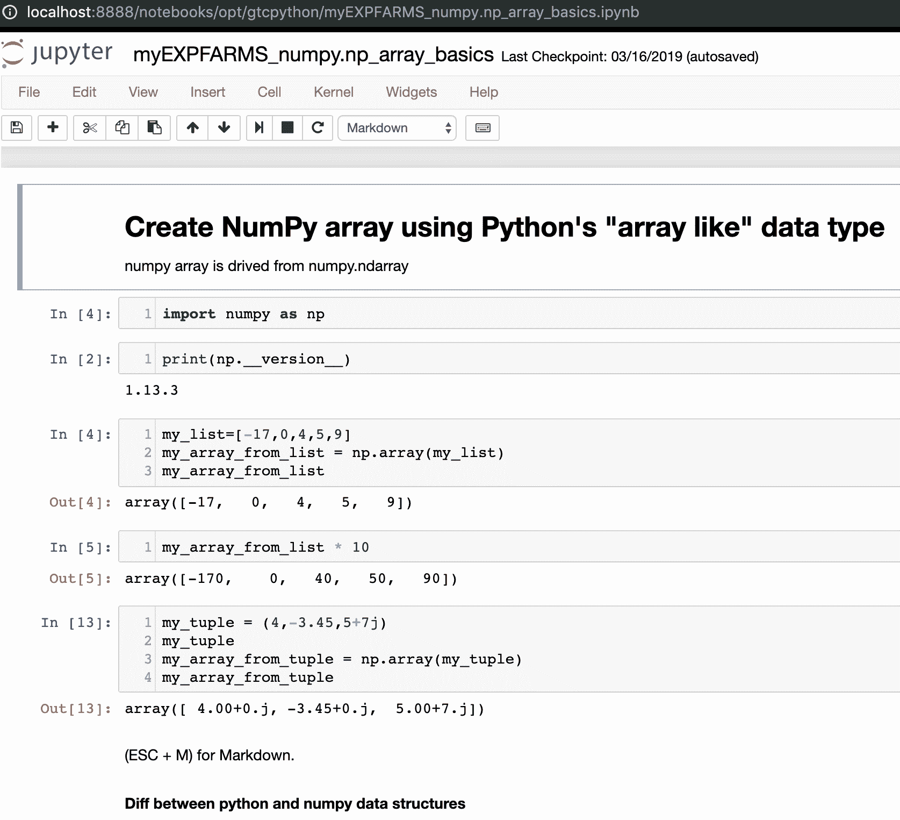
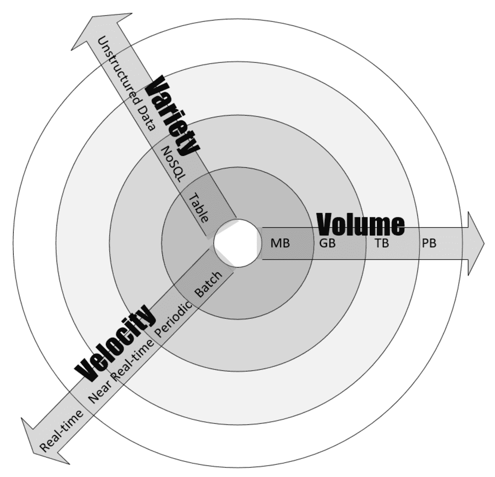
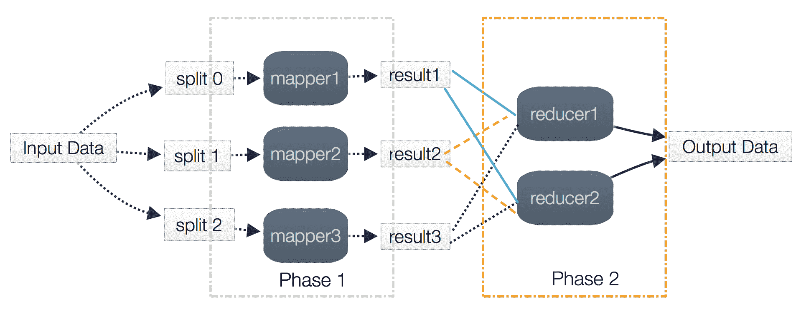
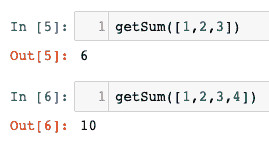
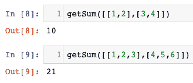
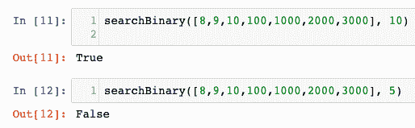
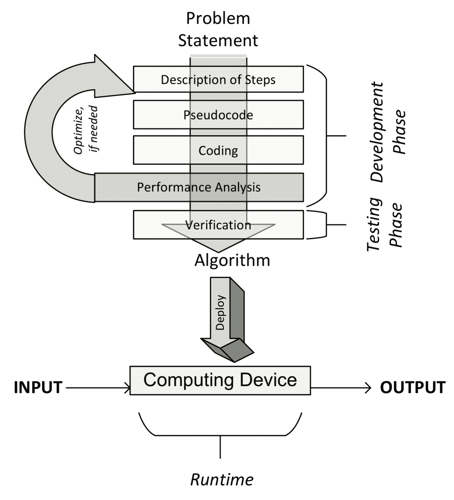

# 算法概述

本书涵盖了理解、分类、选择和实现重要算法所需的信息。除了解释它们的逻辑，本书还讨论了适合不同算法类的数据结构、开发环境和生产环境。我们关注的是越来越重要的现代机器学习算法。除了逻辑，还提供了使用算法解决实际日常问题的实例。

本章深入了解了算法的基本原理。本节首先介绍了理解不同算法工作原理所需的基本概念。这一节总结了人们是如何开始使用算法来数学地描述某类问题的。它还提到了不同算法的局限性。下一节将解释指定算法逻辑的各种方法。由于本书使用 Python 编写算法，因此将解释如何设置运行示例的环境。然后，讨论了量化算法性能并与其他算法进行比较的各种方法。最后，本章讨论了验证算法特定实现的各种方法。

综上所述，本章包括以下要点：

*   什么是算法？
*   指定算法的逻辑
*   介绍 Python 包
*   算法设计技术
*   性能分析
*   验证算法

# 什么是算法？

在最简单的术语中，算法是一组规则，用于执行某些计算以解决问题。它旨在根据精确定义的指令，为任何有效输入生成结果。如果您在英语词典（如 American Heritage）中查找单词 algorithm，则其定义如下：

"An algorithm is a finite set of unambiguous instructions that, given some set of initial conditions, can be performed in a prescribed sequence to achieve a certain goal and that has a recognizable set of end conditions."

设计算法是以最有效的方式创建数学配方的一种努力，可以有效地用于解决实际问题。该配方可作为开发更可重用和通用的数学解决方案的基础，该解决方案可应用于更广泛的类似问题。

# 算法的阶段

下图说明了开发、部署和最终使用算法的不同阶段：


正如我们所看到的，这个过程从理解问题陈述中的需求开始，该问题陈述详细说明了需要做什么。一旦清楚地说明了问题，它就会把我们带到开发阶段。

开发阶段包括两个阶段：

*   **设计阶段**：在设计阶段，设想并记录了算法的架构、逻辑和实现细节。在设计算法时，我们同时考虑了准确性和性能。在搜索给定问题的解决方案时，在许多情况下，我们最终会有多个备选算法。算法的设计阶段是一个迭代过程，涉及比较不同的候选算法。某些算法可能提供简单快速的解决方案，但可能会影响精度。其他算法可能非常精确，但由于其复杂性，可能需要相当长的时间才能运行。其中一些复杂算法可能比其他算法更有效。在做出选择之前，应仔细研究候选算法的所有内在权衡。特别是对于一个复杂的问题，设计一个有效的算法是非常重要的。正确设计的算法将产生一个有效的解决方案，该解决方案将能够同时提供令人满意的性能和合理的精度。
*   **编码阶段**：**在编码阶段，将设计的算法转换成计算机程序。重要的是，实际的程序实现了设计阶段建议的所有逻辑和体系结构**

 **算法的设计和编码阶段本质上是迭代的。提出同时满足功能性和非功能性需求的设计可能需要花费大量的时间和精力。功能需求是指规定给定输入数据集的正确输出的需求。算法的非功能性需求主要是关于给定大小数据的性能。本章后面将讨论算法的验证和性能分析。验证算法就是验证算法是否满足其功能需求。算法的性能分析是关于验证它是否满足其主要的非功能性需求：性能。

一旦用您选择的编程语言设计和实现，算法的代码就可以部署了。部署算法涉及到设计代码将在其中运行的实际生产环境。生产环境需要根据算法的数据和处理需求进行设计。例如，对于可并行化算法，需要具有适当数量的计算机节点的集群来高效执行算法。对于数据密集型算法，可能需要设计数据进入管道以及缓存和存储数据的策略。在[第 13 章](13.html)、*大规模算法*和[第 14 章](14.html)、*实践考虑*中对生产环境的设计进行了更详细的讨论。一旦设计并实现了生产环境，就部署了算法，该算法将接收输入数据，对其进行处理，并根据需求生成输出。

# 指定算法的逻辑

在设计算法时，重要的是找到不同的方法来指定其细节。需要能够捕获其逻辑和体系结构。一般来说，就像建造一个家一样，在实际实现算法之前指定算法的结构是很重要的。对于更复杂的分布式算法，预先规划其逻辑在运行时在集群中的分布方式对于迭代高效的设计过程非常重要。通过伪代码和执行计划，这些需求都得到了满足，并将在下一节中讨论。

# 理解伪代码

指定算法逻辑的最简单方法是以半结构化方式编写算法的高层描述，称为**伪码**。在用伪代码编写逻辑之前，最好先用通俗易懂的英语编写主要步骤来描述其主要流程。然后，将此英文描述转换为伪代码，这是一种结构化的编写此英文描述的方式，它密切代表了算法的逻辑和流程。编写良好的算法伪代码应合理详细地描述算法的高级步骤，即使详细代码与算法的主要流程和结构无关。下图显示了步骤的流程：


请注意，一旦编写了伪代码（我们将在下一节中看到），就可以使用我们选择的编程语言编写算法了。

# 伪码的一个实例

图 1.3 显示了名为**SRPMP**的资源分配算法的伪代码。<sub>在集群计算中，存在许多需要在一组可用资源上运行并行任务的情况，统称为**资源池**。该算法将任务分配给资源并创建一个映射集，称为`Ω`。请注意，所提供的伪代码捕获了算法的逻辑和流程，这将在下一节中进一步解释：</sub>

```py
1: BEGIN Mapping_Phase
2: Ω = { }
3: k = 1
4: FOREACH Ti∈T
5:     ωi = RA(Δk,Ti)
6:     add {ωi,Ti} to Ω
7:     state_changeTi [STATE 0: Idle/Unmapped] → [STATE 1: Idle/Mapped]
8:     k=k+1
9:     IF (k>q)
10:       k=1
11:    ENDIF
12: END FOREACH
13: END Mapping_Phase
```

让我们逐行分析这个算法：

1.  我们通过执行算法开始映射。`Ω`映射集为空
2.  选择第一个分区作为`T<sub>1</sub>`任务的资源池（参见前面代码的第 3 行）。**收视点**（**TRPS**）为每个`T<sub>i</sub>`迭代调用**类风湿****关节炎**（**RA***算法选择其中一个分区作为资源池的任务。*
**   RA 算法返回为`T<sub>i</sub>`任务选择的资源集，由`ω<sub>i</sub>`表示（参见前面代码的第 5 行）。*   将`T<sub>i</sub>`和`ω<sub>i</sub>`添加到映射集中（参见前面代码的第 6 行）。*   `T<sub>i</sub>`的状态由`STATE 0:Idle/Mapping`变为`STATE 1:Idle/Mapped`（见前面代码第 7 行）。*   注意，对于第一次迭代，选择了`k=1`和第一个分区。对于每个后续迭代，`k`的值增加到`k>q`。*   如果`k`大于`q`，则再次重置为`1`（参见前面代码的第 9 行和第 10 行）。*   重复此过程，直到确定所有任务和它们将使用的资源集之间的映射并将其存储在名为`Ω`的映射集中。*   一旦在映射阶段将每个任务映射到一组资源，就会执行它。*

 *# 使用代码片段

随着简单但功能强大的编码语言（如 Python）的流行，另一种方法也越来越流行，即在编程语言中直接以某种简化的版本表示算法的逻辑。与伪代码一样，所选代码捕获了所提出算法的重要逻辑和结构，避免了详细的代码。所选代码有时称为**片段**。在本书中，只要有可能，就使用代码片段而不是伪代码，因为它们节省了一个额外的步骤。例如，让我们看一个关于 Python 函数的简单片段，该函数可用于交换两个变量：

```py
define swap(x, y)
    buffer = x
    x = y
    y = buffer
```

Note that snippets cannot always replace pseudocode. In pseudocode, sometimes we abstract many lines of code as one line of pseudocode, expressing the logic of the algorithm without becoming distracted by unnecessary coding details.

# 创建执行计划

伪代码和代码片段并不总是足以指定与更复杂的分布式算法相关的所有逻辑。例如，分布式算法通常需要在运行时划分为具有优先顺序的不同编码阶段。将较大的问题划分为具有正确优先约束的最佳阶段数的正确策略对于算法的有效执行至关重要

我们需要找到一种方法来表示这种策略，并完整地表示算法的逻辑和结构。执行计划是详细说明如何将算法细分为一组任务的方法之一。任务可以是映射器或还原器，它们可以分组在称为**阶段**的块中。下图显示了在执行算法之前由 Apache Spark 运行时生成的执行计划。它详细说明了为执行我们的算法而创建的作业将分为的运行时任务：


请注意，上图中有五个任务，它们被分为两个不同的阶段：阶段 11 和阶段 12。

# 介绍 Python 包

一旦设计完成，算法需要按照设计用编程语言实现。在本书中，我选择了编程语言 Python。我选择它是因为 Python 是一种灵活的开源编程语言。Python 也是越来越重要的云计算基础设施的首选语言，如**亚马逊网络服务**（**AWS**）、微软 Azure 和**谷歌云平台**（**GCP**）。

Python 官方主页位于[https://www.python.org/](https://www.python.org/) ，其中还包含安装说明和有用的初学者指南

如果您以前没有使用过 Python，那么浏览本自学入门指南是一个好主意。对 Python 的基本理解将帮助您更好地理解本书中介绍的概念。

对于本书，我希望您使用最新版本的 Python 3。在撰写本文时，最新版本是 3.7.3，我们将使用它来运行本书中的练习。

# Python 包

Python 是一种通用语言。它的设计方式只提供了最低限度的功能。根据您打算使用 Python 的用例，需要安装其他软件包。安装附加软件包的最简单方法是通过 pip 安装程序。此`pip`命令可用于安装附加软件包：

```py
pip install a_package
```

已经安装的软件包需要定期更新以获得最新的功能。这是通过使用`upgrade`标志实现的：

```py
pip install a_package --upgrade
```

另一个用于科学计算的 Python 发行版是 Anaconda，可从[下载 http://continuum.io/downloads](http://continuum.io/downloads) 。

除了使用`pip`命令安装新软件包外，对于 Anaconda 发行版，我们还可以选择使用以下命令安装新软件包：

```py
conda install a_package
```

要更新现有软件包，Anaconda 发行版提供了使用以下命令的选项：

```py
conda update a_package
```

有各种各样的 Python 包可用。与算法相关的一些重要软件包将在下一节中介绍。

# SciPy 生态系统

科学 Python（SciPy）-发音为*sigh pie-*是为科学界创建的一组 Python 包。它包含许多函数，包括各种随机数生成器、线性代数例程和优化器。SciPy 是一个全面的软件包，随着时间的推移，人们开发了许多扩展来根据自己的需要定制和扩展软件包。

以下是构成该生态系统一部分的主要软件包：

*   **NumPy**：**对于算法而言，创建多维数据结构（如数组和矩阵）的能力非常重要。NumPy 提供了一组对统计和数据分析非常重要的数组和矩阵数据类型。有关 NumPy 的详细信息，请访问[http://www.numpy.org/](http://www.numpy.org/) 。**
***   **scikit 学习**：**此机器学习扩展是 SciPy 最流行的扩展之一。Scikit learn 提供了一系列重要的机器学习算法，包括分类、回归、聚类和模型验证。您可以在[找到有关 Scikit learn 的更多详细信息 http://scikit-learn.org/](http://scikit-learn.org/) 。*****   **熊猫**：**熊猫是一个开源软件库。它包含表格复杂数据结构，广泛用于各种算法中的表格数据输入、输出和处理。pandas 库包含许多有用的函数，并提供高度优化的性能。有关大熊猫的更多详细信息，请访问[http://pandas.pydata.org/](http://pandas.pydata.org/) 。*****   **Matplotlib**：**Matplotlib 提供了创建强大可视化效果的工具。数据可以表示为直线图、散点图、条形图、直方图、饼图等。更多信息请参见[https://matplotlib.org/](https://matplotlib.org/) 。*****   **Seaborn**：**Seaborn 可以被认为与 R 中流行的 ggplot2 库类似。它基于 Matplotlib，提供了一个高级界面，用于绘制精彩的统计图形。更多详细信息请参见[https://seaborn.pydata.org/](https://seaborn.pydata.org/) 。*****   **iPython**：**iPython 是一个增强的交互式控制台，旨在促进 Python 代码的编写、测试和调试*****   **运行 Python 程序**：**交互编程模式对于学习和实验代码非常有用。Python 程序可以保存在扩展名为`.py`的文本文件中，并且该文件可以从控制台运行。**************

 ******# 通过 Jupyter 笔记本实现 Python

运行 Python 程序的另一种方法是通过 Jupyter 笔记本。Jupyter 笔记本提供了一个基于浏览器的用户界面来开发代码。Jupyter 笔记本用于展示本书中的代码示例。通过文本和图形对代码进行注释和描述的能力使它成为展示和解释算法的完美工具，也是学习的绝佳工具。

要启动笔记本电脑，您需要启动`Juypter-notebook`流程，然后打开您喜爱的浏览器并导航到`http://localhost:8888`：



请注意，Jupyter 笔记本由称为**单元**的不同块组成

# 算法设计技术

算法是对现实世界问题的数学解决方案。在设计算法时，在设计和微调算法时，我们会考虑以下三个设计问题：

*   **关注点 1**：该算法是否产生了我们预期的结果？
*   **关注点 2**：这是获得这些结果的最佳方式吗？
*   **关注点 3**：该算法将如何在更大的数据集上执行？

在设计解决方案之前，更好地理解问题本身的复杂性是很重要的。例如，如果我们根据问题的需求和复杂性来描述问题，它可以帮助我们设计适当的解决方案。根据问题的特点，一般可将算法分为以下几种：

*   **数据密集型算法：**数据密集型算法设计用于处理大量数据。预计它们的处理要求相对简单。应用于大型文件的压缩算法是数据密集型算法的一个很好的例子。对于此类算法，数据的大小预计将远大于处理引擎（单个节点或集群）的内存，并且可能需要开发迭代处理设计以根据需求有效地处理数据
*   **计算密集型算法**：计算密集型算法具有相当高的处理要求，但不涉及大量数据。一个简单的例子是寻找一个非常大的素数的算法。找到一种将算法划分为不同阶段的策略，使至少部分阶段并行化，这是使算法性能最大化的关键。
*   **数据和计算密集型算法**：有一些算法处理大量数据，也有相当大的计算需求。用于对实时视频提要执行情感分析的算法是一个很好的例子，说明在完成任务时，数据和处理需求都是巨大的。此类算法是资源最密集的算法，需要仔细设计算法并智能分配可用资源。

为了根据问题的复杂性和需求来描述问题，如果我们更深入地研究它的数据和计算维度，这将有所帮助，我们将在下一节中进行。

# 数据维度

为了对问题的数据维度进行分类，我们查看其**体积**、**速度**和**变化**（**3Vs**），其定义如下：

*   **卷**：该卷是算法将处理的数据的预期大小。
*   **速度**：速度是使用算法时新数据生成的预期速率。它可以是零。
*   **多样性**：多样性量化了所设计的算法需要处理多少种不同类型的数据。

下图更详细地显示了数据的 3V。此图的中心显示了可能最简单的数据，具有小容量、低变化和低速度。当我们离开中心时，数据的复杂性会增加。它可以在三个维度中的一个或多个维度上增加。例如，在速度维度上，我们将批处理过程作为最简单的过程，然后是周期过程，然后是近实时过程。最后，我们讨论了实时过程，这是在数据速度方面最复杂的处理过程。例如，由一组监控摄像机收集的实时视频源的集合将具有高容量、高速度和高多样性，并且可能需要适当的设计来有效地存储和处理数据。另一方面，在 Excel 中创建的简单`.csv`文件将具有低容量、低速度和低变化：



例如，如果输入的数据是一个简单的`csv`文件，那么数据的体积、速度和多样性都会很低。另一方面，如果输入的数据是安全摄像机的实时流，那么数据的体积、速度和多样性将非常高，在设计算法时应该记住这个问题。

# 计算尺寸

计算维度是关于手头问题的处理和计算需求。算法的处理要求将决定哪种设计对其最有效。例如，深度学习算法通常需要大量的处理能力。这意味着，对于深度学习算法，尽可能采用多节点并行体系结构非常重要。

# 实例

假设我们要对视频进行情绪分析。情绪分析是我们试图用悲伤、快乐、恐惧、喜悦、沮丧和狂喜等人类情绪标记视频的不同部分。这是一项需要大量计算能力的计算密集型工作。如下图所示，为了设计计算维度，我们将处理分为五个任务，包括两个阶段。所有数据转换和准备都在三个映射器中实现。为此，我们将视频分成三个不同的分区，称为**分割**。执行映射器后，生成的处理视频被输入到两个聚合器，称为**还原器**。为了进行所需的情绪分析，还原者根据情绪对视频进行分组。最后，将结果合并到输出中：



Note that the number of mappers directly translates to the runtime parallelism of the algorithm. The optimal number of mappers and reducers is dependent on the characteristics of the data, the type of algorithm that is needed to be used, and the number of resources available. 

# 性能分析

分析算法的性能是其设计的一个重要部分。评估算法性能的方法之一是分析其复杂性。

复杂性理论是研究算法有多复杂的理论。为了有用，任何算法都应该具有三个关键特性：

*   应该是正确的。如果一个算法不能给你正确的答案，它对你没有多大好处。
*   一个好的算法应该是可以理解的。如果世界上最好的算法太复杂，无法在计算机上实现，那么它对你没有任何好处。
*   一个好的算法应该是有效的。即使一个算法产生一个正确的结果，如果它需要一千年的时间或者需要十亿 TB 的内存，它也不会对你有多大帮助。

有两种可能的分析类型来量化算法的复杂性：

*   空间复杂性分析：估计执行算法所需的运行时内存需求。
*   时间复杂性分析：估计算法运行所需的时间。

# 空间复杂性分析

空间复杂性分析估计算法处理输入数据所需的内存量。在处理输入数据时，算法需要在内存中存储瞬态临时数据结构。算法的设计方式会影响这些数据结构的数量、类型和大小。在分布式计算时代，需要处理的数据量越来越大，空间复杂性分析变得越来越重要。这些数据结构的大小、类型和数量将决定底层硬件的内存需求。用于分布式计算的现代内存中数据结构，如**弹性分布式数据集**（**RDDs**）——需要具有高效的资源分配机制，能够在算法的不同执行阶段了解内存需求。

空间复杂度分析是有效设计算法的必要条件。如果在设计特定算法时未进行适当的空间复杂度分析，则瞬态临时数据结构的内存可用性不足可能会触发不必要的磁盘溢出，这可能会极大地影响算法的性能和效率。

在本章中，我们将深入探讨时间复杂性。空间复杂度将在[第 13 章](13.html)、*大规模算法*中进行详细讨论，其中我们将处理具有复杂运行时内存需求的大规模分布式算法。

# 时间复杂度分析

时间复杂度分析根据算法的结构估计算法完成指定任务所需的时间。与空间复杂度相比，时间复杂度不依赖于算法将运行的任何硬件。时间复杂度分析完全取决于算法本身的结构。时间复杂度分析的总体目标是试图回答这些重要问题，该算法是否可以扩展？该算法处理较大数据集的能力如何？

为了回答这些问题，我们需要确定随着数据大小的增加对算法性能的影响，并确保算法的设计方式不仅使其精确，而且具有良好的可伸缩性。在当今“大数据”世界中，算法的性能对于更大的数据集变得越来越重要

在许多情况下，我们可能有多种方法可用于设计算法。在这种情况下，进行时间复杂性分析的目标如下：

"Given a certain problem and more than one algorithm, which one is the most efficient to use in terms of time efficiency?"

计算算法时间复杂度有两种基本方法：

*   **一种实现后评测方法**：在该方法中，实现了不同的候选算法，并比较了它们的性能
*   **一种预实现理论方法**：在这种方法中，在运行算法之前，对每个算法的性能进行数学近似。

理论方法的优点在于它只取决于算法本身的结构。它不取决于运行算法所使用的实际硬件、运行时选择的软件堆栈或用于实现算法的编程语言。

# 评估绩效

典型算法的性能取决于作为输入的数据类型。例如，如果数据已经根据我们试图解决的问题的上下文进行了排序，那么算法的执行速度可能会非常快。如果使用排序后的输入对这个特定的算法进行基准测试，那么它将给出一个不切实际的好性能值，这在大多数情况下都不能真实反映其真实性能。为了处理算法对输入数据的依赖性，在执行性能分析时，我们需要考虑不同类型的情况。

# 最佳案例

在最好的情况下，作为输入的数据以算法将提供最佳性能的方式组织。最佳案例分析给出了性能的上限*。*

# 最坏的情况

第二种评估算法性能的方法是，在给定的条件下，尝试找到完成任务所需的最大可能时间。这种对算法的最坏情况分析非常有用，因为我们可以保证，无论条件如何，算法的性能总是比我们分析得出的数字要好。在处理具有较大数据集的复杂问题时，最坏情况分析对于估计性能特别有用。最坏情况分析给出了算法性能的下界

# 一般情况

首先，将各种可能的输入划分为不同的组。然后，根据每组的一个代表性输入进行绩效分析。最后，它计算每个组的平均绩效

平均情况分析并不总是准确的，因为它需要考虑所有不同的组合和可能性的输入到算法，这并不总是容易做到的。

# 选择算法

您如何知道哪一个是更好的解决方案？你怎么知道哪个算法运行得更快？时间复杂性和大 O 表示法（本章后面将讨论）是回答这类问题的好工具。

为了看看它可能是有用的，让我们举一个简单的例子，其中的目标是排序一个数字列表。有几种算法可以完成这项工作。问题是如何选择正确的。

首先，我们可以观察到，如果列表中没有太多的数字，那么我们选择哪种算法对数字列表进行排序并不重要。因此，如果列表中只有 10 个数字（n=10），那么我们选择哪种算法并不重要，因为它可能不会花费超过几微秒的时间，即使是设计非常糟糕的算法。但是，一旦列表的大小变为 100 万，现在选择正确的算法将产生影响。一个写得非常糟糕的算法甚至可能需要几个小时才能运行，而一个设计良好的算法可能在几秒钟内完成对列表的排序。因此，对于较大的输入数据集，投入时间和精力，执行性能分析，并选择正确设计的算法，以高效的方式完成所需的工作，是非常有意义的。

# 大 O 符号

大 O 表示法用于量化输入大小增长时各种算法的性能。大 O 表示法是用于进行最坏情况分析的最流行的方法之一。本节将讨论不同类型的大 O 表示法类型。

# 恒定时间（O（1））复杂性

如果一个算法的运行时间与输入数据的大小无关，则称之为在恒定时间内运行。它由 O（1）表示。我们以访问数组的*n*<sup>th</sup>元素为例。无论数组大小如何，都需要固定的时间才能得到结果。例如，以下函数将返回数组的第一个元素，其复杂度为 O（1）：

```py
def getFirst(myList):
    return myList[0]
```

输出如下所示：


*   使用`push`向堆栈中添加新元素或使用`pop`从堆栈中移除元素。无论堆栈大小如何，添加或删除元素都需要相同的时间。
*   访问哈希表的元素（如[第 2 章](02.html)、*算法中使用的数据结构*中所述）。
*   桶排序（如[第 2 章](02.html)所述，算法中使用的*数据结构）。*

# 线性时间（O（n））复杂度

如果执行时间与输入大小成正比，则称算法具有线性时间的复杂性，用 O（n）表示。一个简单的示例是在一维数据结构中添加元素：

```py
def getSum(myList):
    sum = 0
    for item in myList:
        sum = sum + item
    return sum
```

注意算法的主循环。主循环中的迭代次数随着*n*值的增加而线性增加，在下图中产生 O（n）复杂度：



数组操作的其他一些示例如下：

*   搜索元素
*   在数组的所有元素中查找最小值

# 二次时间（O（n2））复杂度

如果算法的执行时间与输入大小的平方成正比，则称算法以二次时间运行；例如，对二维数组求和的简单函数如下：

```py
def getSum(myList):
    sum = 0
    for row in myList:
        for item in row:
            sum += item
    return sum
```

请注意另一个主循环中的嵌套内部循环。此嵌套循环为前面的代码提供了 O（n<sup>2</sup>的复杂性）：



另一个例子是**气泡排序算法**（如[第 2 章](02.html)所述，算法中使用的*数据结构）。*

# 对数时间（O（logn））复杂度

如果算法的执行时间与输入大小的对数成正比，则称算法以对数时间运行。每次迭代时，输入大小都会减少一个常数倍数。对数的一个例子是二进制搜索。二进制搜索算法用于在一维数据结构（如 Python 列表）中查找特定元素。数据结构中的元素需要按降序排序。二进制搜索算法在名为`searchBinary`的函数中实现，如下所示：

```py
def searchBinary(myList,item):
    first = 0
    last = len(myList)-1
    foundFlag = False
    while( first<=last and not foundFlag):
        mid = (first + last)//2
        if myList[mid] == item :
            foundFlag = True
        else:
            if item < myList[mid]:
                last = mid - 1
            else:
                first = mid + 1
    return foundFlag
```

主循环利用列表是有序的这一事实。它在每次迭代中将列表一分为二，直到得到结果：



定义函数后，测试它以搜索第 11 行和第 12 行中的特定元素。在[第 3 章](03.html)、*排序和搜索算法*中进一步讨论了二进制搜索算法。

请注意，在介绍的四种大 O 表示法类型中，O（n<sup>2</sup>的性能最差，O（logn）的性能最好。事实上，O（logn）的性能可以被认为是任何算法性能的黄金标准（尽管这并不总是能够实现）。另一方面，O（n<sup>2</sup>）没有 O（n<sup>3</sup>）那么糟糕，但是，属于这一类的算法不能用于大数据，因为时间复杂性限制了它们实际处理的数据量。

降低算法复杂性的一种方法是降低其准确性，产生一种称为**近似算法**的算法

算法性能评估的整个过程本质上是迭代的，如下图所示：



# 验证算法

验证算法可以确认它实际上为我们试图解决的问题提供了数学解决方案。验证过程应检查结果，以获得尽可能多的可能值和类型的输入值。

# 精确、近似和随机算法

验证算法还取决于算法的类型，因为测试技术不同。让我们首先区分确定性算法和随机算法。

对于确定性算法，特定的输入总是生成完全相同的输出。但对于某些类型的算法，还将随机数序列作为输入，这使得每次运行算法时的输出都不同。[第 6 章](06.html)*无监督机器学习算法*中详述的 k-均值聚类算法就是此类算法的一个示例：


根据用于简化逻辑以使其运行更快的假设或近似，算法也可分为以下两种类型：

*   **精确算法：**精确算法有望在不引入任何假设或近似的情况下产生精确解。
*   **一个近似算法：**当问题复杂度太大，无法在给定资源下处理时，我们通过做出一些假设来简化问题。基于这些简化或假设的算法称为近似算法，它不能给出精确解。

让我们看一个例子来了解精确算法和近似算法之间的区别著名的旅行商问题，它是在 1930 年提出的。旅行推销员向您挑战，让您找到某个特定推销员访问每个城市（从一系列城市中）然后返回原点的最短路线，这就是他被命名为旅行推销员的原因。提供解决方案的第一次尝试将包括生成所有城市排列，并选择最便宜的城市组合。这种提供解决方案的方法的复杂性是 O（n！），其中*n*是城市的数量。很明显，超过 30 个城市*的时间复杂性开始变得难以管理。*

如果城市数量超过 30 个，降低复杂性的一种方法是引入一些近似值和假设

对于近似算法，在收集需求时设置精度期望值很重要。验证近似算法就是验证结果的误差是否在可接受的范围内。

# 解释能力

当算法用于关键案例时，在需要时，有能力解释每个结果背后的原因变得非常重要。这对于确保基于算法结果的决策不会引入偏差是必要的。

准确识别直接或间接用于做出特定决策的特征的能力称为算法的**可解释性**。当用于关键用例时，需要评估算法的偏差和偏见。算法的道德分析已经成为验证过程中的标准部分，这些算法可能会影响与人们生活相关的决策。

对于处理深度学习的算法来说，解释性很难实现。例如，如果一个算法被用来拒绝一个人的抵押申请，那么具有透明度和解释原因的能力是很重要的

算法的可解释性是一个活跃的研究领域。最近开发的有效技术之一是**局部可解释模型不可知解释**（**石灰**），这是在**的 22<sup>nd</sup>**计算机械协会**（**ACM**的会议记录中提出的 2016 年知识发现与数据挖掘国际会议**（**SIGKDD**）知识发现特别兴趣小组。LIME 基于这样一个概念，即对每个实例的输入进行微小更改，然后努力映射该实例的局部决策边界。然后，它可以量化每个变量对该实例的影响。

# 总结

本章是关于学习算法的基础知识。首先，我们了解了开发算法的不同阶段。我们讨论了设计算法所需的指定算法逻辑的不同方法。然后，我们研究了如何设计算法。我们学习了分析算法性能的两种不同方法。最后，我们研究了验证算法的不同方面。

读完本章后，我们应该能够理解算法的伪代码。我们应该了解开发和部署算法的不同阶段。我们还学习了如何使用大 O 表示法来评估算法的性能。

下一章是关于算法中使用的数据结构。我们将从查看 Python 中可用的数据结构开始。然后，我们将研究如何使用这些数据结构来创建更复杂的数据结构，例如开发复杂算法所需的堆栈、队列和树。*********