# 图算法

有一类计算问题最好用图来表示。这些问题可以使用一类称为**图算法**的算法来解决。例如，可以使用图形算法在数据的图形表示中高效地搜索值。为了有效地工作，这些算法首先需要发现图的结构。他们还需要找到正确的策略来跟踪图形的边，以读取存储在顶点中的数据。由于图算法需要搜索值才能工作，高效的搜索策略是设计高效图算法的核心。使用图算法是在通过有意义的关系链接的复杂、相互关联的数据结构中搜索信息的最有效方法之一。在当今大数据、社交媒体和分布式数据时代，这些技术变得越来越重要和有用。

在本章中，我们将首先介绍图形算法背后的基本概念。然后，我们将介绍网络分析理论的基础知识。接下来，我们将研究可用于遍历图的各种技术。最后，我们将看一个案例研究，展示如何将图算法用于欺诈检测。

在本章中，我们将介绍以下概念：

*   不同的图形表示方法
*   网络理论分析导论
*   理解图遍历
*   案例研究：欺诈分析
*   在问题空间中建立邻域的技术

在本章结束时，您将很好地理解什么是图，以及如何使用图来表示互连的数据结构，并从通过直接或间接关系关联的实体中挖掘信息，以及使用图来解决一些复杂的现实问题。

# 图的表示

图是用顶点和边表示数据的结构。图形表示为`aGraph`=(𝓥, 𝓔), 在哪里𝓥表示一组顶点和顶点𝓔表示一组边。请注意，`aGraph`具有|𝓥| 顶点和|𝓔| 边缘。

一个顶点，𝓋 ∈ 𝓥, 表示真实世界的对象，例如人、计算机或活动。边缘,，𝓋 ∈ 𝓔, 连接网络中的两个顶点：

e(𝓋 <sub>1</sub>𝓋 <sub>2</sub>e∈ 𝓔&𝓋 <sub>i</sub>∈ 𝓥

前面的等式表明，在图中，所有边都属于一个集合𝓔, 所有顶点都属于一个集合，𝓥.

边连接两个顶点，因此表示它们之间的关系。例如，它可以表示以下关系：

*   人与人之间的友谊
*   与 LinkedIn 上的朋友有联系的人
*   群集中两个节点的物理连接
*   参加研究会议的人

在本章中，我们将使用`networkx`Python 包来表示图。让我们尝试使用 Python 中的`networtx`包创建一个简单的图。首先，让我们尝试创建一个空图`aGraph`，没有顶点或节点：

```py
import networkx as nx
G = nx.Graph()
```

让我们添加一个顶点：

```py
G.add_node("Mike")
```

我们还可以使用列表添加一组顶点：

```py
G.add_nodes_from(["Amine", "Wassim", "Nick"])
```

我们还可以在现有顶点之间添加一条边，如图所示：

```py
G.add_edge("Mike", "Amine") 
```

现在，让我们打印边和顶点：

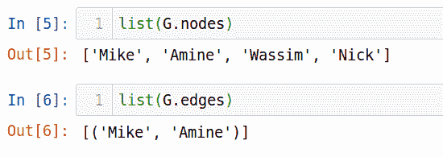

请注意，如果要添加边，这也会导致添加关联顶点（如果它们不存在），如下所示：

```py
G.add_edge("Amine","Imran")
```

如果我们打印节点列表，下面是我们观察到的输出：


请注意，添加已存在顶点的请求将被静默忽略。根据我们创建的图形类型，请求被忽略或接受。

# 图的类型

图表可分为四类，即：

*   无向图
*   有向图
*   无向多重图
*   有向多重图

现在让我们详细查看每一个。

# 无向图

在大多数情况下，图的组成节点表示的关系可以认为是无向的。这种关系不会对关系施加任何秩序。这样的边称为**无向边**，生成的图称为**无向图**。无向图如下所示：

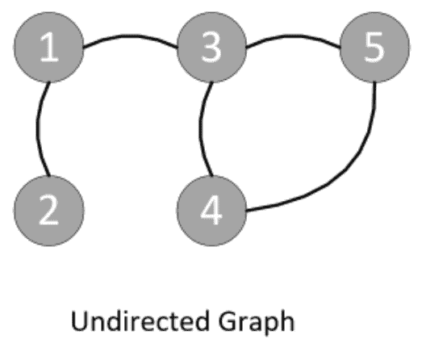

无向关系的一些示例如下：

*   迈克和阿明（迈克和阿明相互认识）。
*   节点 A 和节点 B 已连接（这是对等连接）。

# 有向图

图中节点之间的关系具有某种方向感的图称为**有向图**。此处显示了一个有向图：


定向关系的一些示例如下：

*   迈克和他的房子（迈克住在一所房子里，但他的房子不住在迈克家里）。
*   约翰管理保罗（约翰是保罗的经理）。

# 无向多重图

有时，节点之间有多种类型的关系。在这种情况下，可以有多条边连接相同的两个节点。这类图在同一节点上允许多条平行边，称为**多图**。我们必须明确指出一个特定的图是否是多重图。平行边可以表示节点之间不同类型的关系。

下图显示了一个多重图：


多向关系的一个例子是，如果迈克和约翰是同班同学，同时也是同事。

# 有向多重图

如果多图中节点之间存在方向关系，我们称之为**有向多图**：


有向多重图的一个例子是，Mike 在办公室向 John 报告，John 教 Mike Python 编程语言。

# 特殊类型的边

边将图的各个顶点连接在一起，并表示它们之间的关系。除简单边外，它们还可以是以下特殊类型：

*   **自边**：有时，某个特定的顶点可能与自身有关系。例如，约翰把钱从他的商业帐户转到他的个人帐户。这种特殊的关系可以用一条自向边来表示。
*   **超边**：有时同一条边连接多个顶点。连接多个顶点以表示这种关系的边称为超边。例如，假设迈克、约翰和莎拉三人都在从事一个特定的项目。

A graph that has one or more hyperedges is called a **hypergraph**.

自边和超边图的图表如下所示：

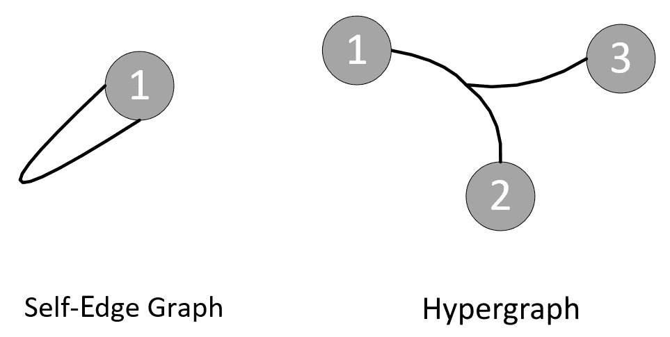

请注意，一个特定的图可以有多个特殊类型的边节点。这意味着一个特定的图可以同时具有自边和超边。

# 以自我为中心的网络

特定顶点的直接邻域*m*可能有足够的重要信息来对节点进行结论性分析。“自我中心”或“自我网络”就是基于这一理念。特定顶点*m*的 egonet 由直接连接到*m*的所有顶点加上节点*m*本身组成。节点*m*称为**自我**，其连接的一跳邻居称为**改变**。

特定节点 3 的 ego 网络如下图所示：

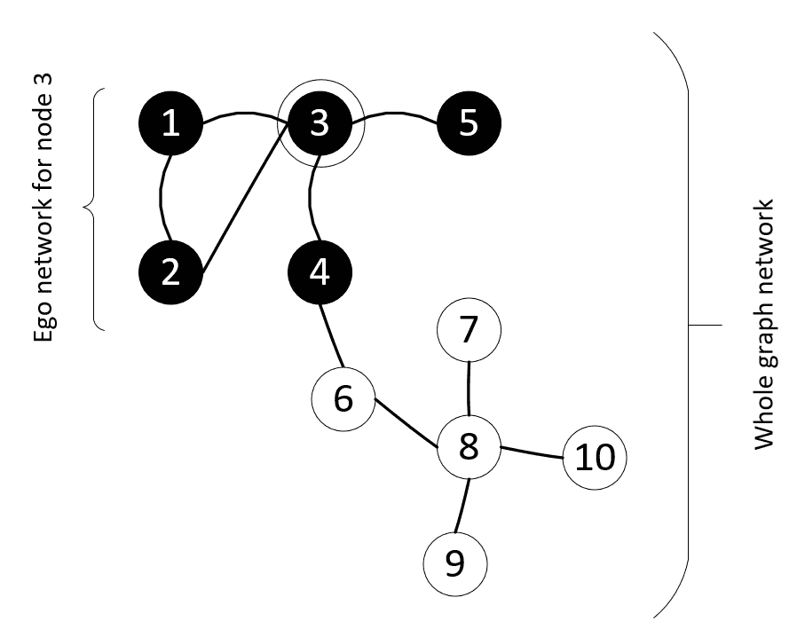

请注意，egonet 表示一个度邻域。这一概念可以推广到 n 度邻域，它由远离感兴趣顶点的所有顶点组成。

# 社会网络分析

**社会网络分析**（**SNA**是图论的重要应用之一。如果以下情况适用，则网络图分析被视为社会网络分析：

*   图的顶点表示人。
*   它们之间的边缘代表了它们之间的社会关系，如友谊、共同爱好、亲属关系、性关系、不喜欢等等
*   我们试图通过图表分析来回答的商业问题具有很强的社会性。

人类行为反映在 SNA 中，在进行 SNA 工作时应始终牢记在心。通过将人际关系映射到图表中，SNA 可以很好地洞察人际互动，从而帮助我们了解他们的行为。

通过在每个人周围创建一个社区，并根据其社会关系分析个人的行为，您可以产生有趣的、有时令人惊讶的见解。基于个人工作职能的孤立分析个人的替代方法只能提供有限的见解。

因此，SNA 可用于以下方面：

*   了解用户在社交媒体平台（如 Facebook、Twitter 或 LinkedIn）上的行为
*   理解欺诈
*   理解社会的犯罪行为

LinkedIn has contributed a lot to the research and development of new techniques related to SNA. In fact, LinkedIn can be thought of as a pioneer of many algorithms in this area.

因此，SNA 由于其固有的分布式和互联的社会网络体系结构，是图论最强大的用例之一。另一种抽象图形的方法是将其视为网络，并应用为网络设计的算法。这整个领域称为**网络分析理论**，我们将在下面讨论。

# 网络分析理论简介

我们知道互联数据可以表示为一个网络。在网络分析理论中，我们研究了用于探索和分析网络数据的方法的细节。在本节中，我们来看一下网络分析理论的一些重要方面

首先，请注意，网络中的顶点充当基本单元。网络是一个相互连接的顶点网络，其中每个连接代表正在调查的各种实体之间的关系。在我们试图解决的问题的背景下，量化网络中顶点的有用性和重要性非常重要。有各种技术可以帮助我们量化重要性

让我们看看网络分析理论中使用的一些重要概念。

# 理解最短路径

路径是开始节点和结束节点之间的节点序列，其中没有节点在路径上出现两次。路径表示所选起点和终点顶点之间的路线。它将是一组顶点*p*，连接起始顶点和结束顶点。*p*中没有重复顶点

路径的长度是通过计算组成边来计算的。在所有选项中，长度最小的路径称为**最短路径**。最短路径的计算在图论算法中被广泛使用，但计算起来并不总是那么简单。可以使用不同的算法来查找起始节点和结束节点之间的最短路径。可用于查找起始节点和结束节点之间最短距离的最流行算法之一是**Dijkstra 算法**，该算法于 20 世纪 50 年代末发布。它计算图形中的最短路径。可由**全球定位系统**（**GPS**设备）使用，计算源与目的地之间的最小距离。Dijkstra 算法也用于网络路由算法

There is a battle between Google and Apple to design the best shortest-distance algorithm for Google Maps and Apple Maps. The challenge they face is making the algorithm fast enough to calculate the shortest path within seconds.

在本章后面，我们将讨论**广度优先搜索**（**BFS**）**算法**，该算法可以修改为 Dijkstra 算法。BFS 假设遍历给定图中每条路径的成本相同。对于 Dijkstra 算法，遍历图的成本可能不同，需要将其合并到 Dijkstra 算法中来修改 BFS。

如前所述，Dijkstra 算法是一种计算最短路径的单源算法。如果我们想求解所有对最短路径，那么可以使用**Floyd Warshall 算法**

# 创建社区

找到在感兴趣的节点周围创建邻域的策略对于图算法至关重要。创建邻域的方法基于选择与感兴趣顶点的直接关联。创建邻域的一种方法是选择 k 阶策略，该策略选择远离感兴趣顶点的*k*跳数的顶点。

让我们看看创建社区的各种标准。

# 三角形

在图论中，找到相互连接良好的顶点对于分析非常重要。一种技术是尝试识别网络中的三角形，三角形是由三个相互直接连接的节点组成的子图

让我们看看欺诈检测的用例，在本章末尾我们也将其作为一个案例研究。如果一个节点的 egonet，*m*由三个顶点组成，包括顶点*m*，那么这个 egonet 就是一个三角形。顶点*m*将是自我，两个相连的顶点将发生变化，即顶点*A*和顶点*B*。如果两个变更都是已知的欺诈案例，我们可以安全地将 vertex*m*声明为欺诈。如果其中一人涉及欺诈，我们无法拿出确凿的证据，但我们需要对欺诈证据进行进一步调查。

# 密集

让我们首先定义一个完全连接的网络。我们将每个顶点直接连接到其他顶点的图称为**全连通网络**

如果我们有一个完全连接的网络，*N*，那么网络中的边数可以表示为：


现在，这就是密度发挥作用的地方。密度测量观察到的边数到最大边数，如果**边****<sub>观察到的</sub>**是我们想要观察的边数。它的框架如下所示：

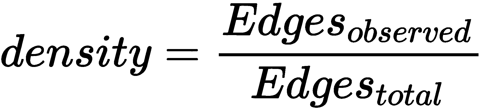

请注意，对于三角形，网络密度为`1`，这表示可能连接的最高网络。

# 理解中心性度量

对于理解图或子图中特定顶点的中心性，有不同的度量方法。例如，他们可以量化一个人在社交网络中的重要性或一座城市建筑的重要性。

以下中心度度量广泛用于图形分析：

*   度
*   中间性
*   亲密
*   特征向量

让我们详细讨论一下。

# 度

连接到特定顶点的边数称为其**度**。它可以指示特定顶点的连接程度及其在网络中快速传播消息的能力。

让我们考虑一下：𝓥, 𝓔), 在哪里𝓥表示一组顶点和顶点𝓔表示一组边。回想一下，`aGraph`具有|𝓥| 顶点和|𝓔| 如果我们将节点的阶数除以(|𝓥|-1），称为**度中心度**：


现在，让我们看一个具体的例子。考虑下面的图表：

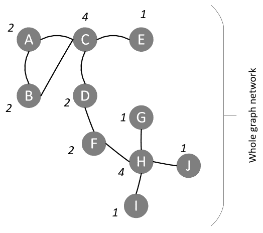

在前面的图中，顶点 C 的阶数为 4。其度中心度可计算如下：

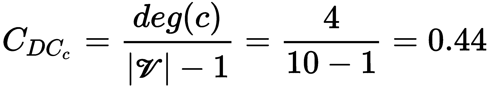

# 中间性

介数是图中中心性的度量。在社交媒体的背景下，它将量化一个人参与某个亚群体交流的可能性。对于计算机网络，当顶点失效时，介数将量化图节点之间通信的负面影响。

To calculate the betweenness of vertex *a* in a certain `aGraph` = (𝓥, 𝓔), follow these steps:

1.  计算`aGraph`中每对顶点之间的最短路径。让我们用来表示这一点。
2.  从开始，计算通过顶点*a*的最短路径数。让我们用来表示这一点。
3.  用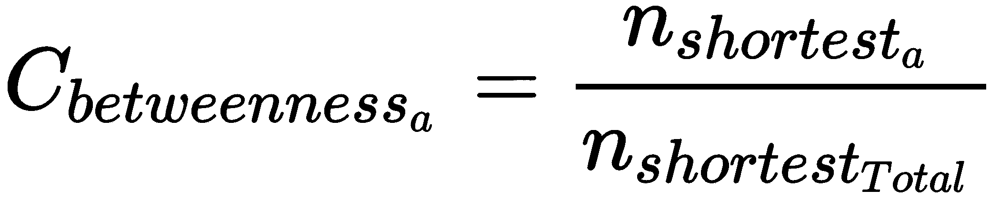计算介数。

# 公平与亲近

让我们来画一张图。图*g*中的顶点*a*的公平性定义为顶点*a*与其他顶点的距离之和。请注意，特定顶点的中心性量化了其与所有其他顶点的总距离。

公平的反面是亲密。

# 特征向量中心性

特征向量中心性为图中的所有顶点提供分数，以衡量它们在网络中的重要性。分数将是特定节点与整个网络中其他重要节点的连通性的指标。当谷歌创建**PageRank 算法**时，该算法为互联网上的每个网页分配一个分数（以表达其重要性），该思想源自特征向量中心度度量

# 使用 Python 计算中心性度量

让我们创建一个网络，然后尝试计算其中心性度量。以下代码块说明了这一点：

```py
import networkx as nx
import matplotlib.pyplot as plt
vertices = range(1,10)
edges = [(7,2), (2,3), (7,4), (4,5), (7,3), (7,5), (1,6),(1,7),(2,8),(2,9)]
G = nx.Graph()
G.add_nodes_from(vertices) 
G.add_edges_from(edges)
nx.draw(G, with_labels=True,node_color='y',node_size=800)
```

此代码生成的图形如下所示：


到目前为止，我们已经研究了不同的中心性度量。让我们为前面的示例计算它们：

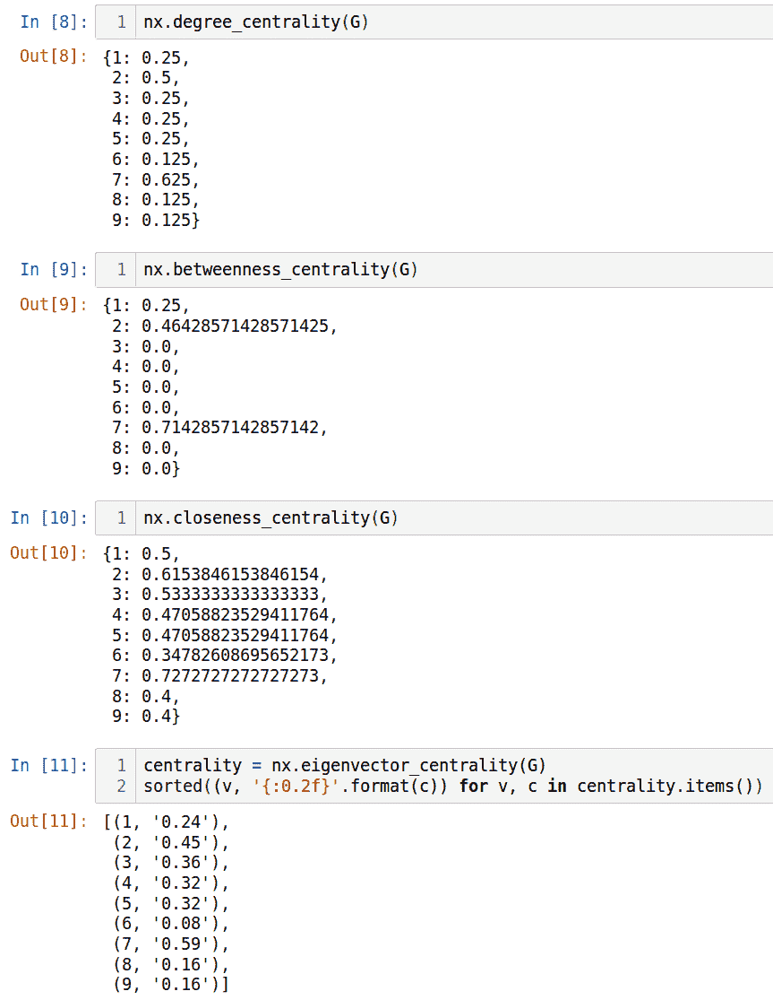

请注意，中心性度量应给出图或子图中特定顶点的中心性度量。查看图表，标记为 7 的顶点似乎位于最中心位置。顶点 7 在所有四个中心性度量中具有最高的值，因此反映了它在这方面的重要性。

现在让我们看看如何从图表中检索信息。图是一种复杂的数据结构，它的顶点和边上都存储着大量的信息。让我们来看看一些策略，这些策略可以用来高效地在图形中导航，以便从图形中收集信息来回答查询。

# 理解图遍历

为了利用图形，需要从中挖掘信息。图遍历被定义为确保以有序的方式访问每个顶点和边的策略。努力确保每个顶点和边只访问一次；不多也不少。大体上，可以有两种不同的方式遍历图形以搜索其中的数据。按广度走称为**广度优先搜索**（**BFS**），按深度走称为**深度优先搜索**（**DFS**）。让我们逐一看一看。

# 广度优先搜索

当我们正在处理的`aGraph`中有一个分层或分层的邻里概念时，BFS 工作得最好。例如，当 LinkedIn 中的一个人的连接被表示为一个图形时，会出现第一级连接，然后出现第二级连接，这些连接直接转换为层。

BFS 算法从根顶点开始，探索邻域顶点中的顶点。然后它移动到下一个邻域级别并重复该过程。

让我们看看 BFS 算法。为此，我们首先考虑下面的无向图：

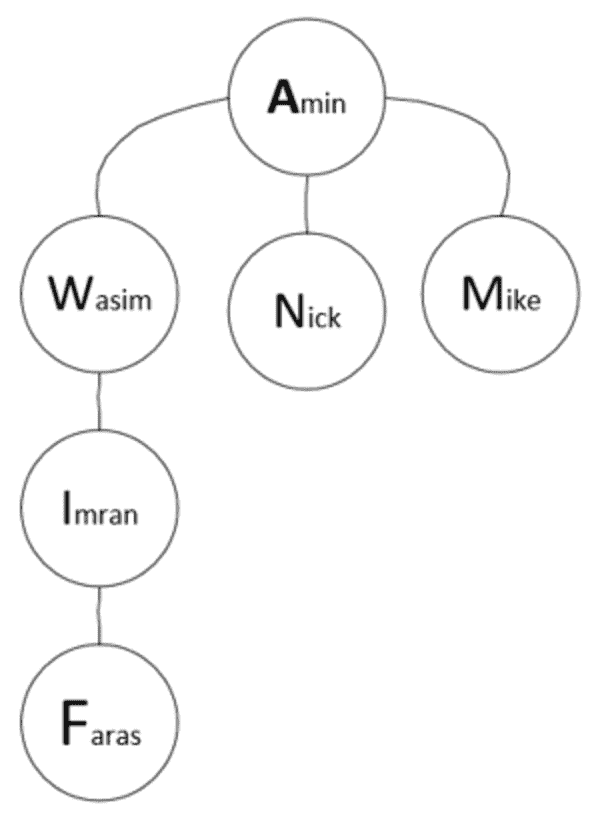

让我们首先计算每个顶点的直接邻域，并将其存储在一个名为**邻接列表**的列表中。在 Python 中，我们可以使用字典数据结构来存储它：

```py
graph={ 'Amin'   : {'Wasim', 'Nick', 'Mike'},
         'Wasim' : {'Imran', 'Amin'}, 
         'Imran' : {'Wasim','Faras'}, 
         'Faras' : {'Imran'},
         'Mike'  : {'Amin'}, 
         'Nick' :  {'Amin'}}
```

为了在 Python 中实现它，我们进行如下操作。

我们将首先解释初始化，然后是主循环。

# 初始化

我们将使用两种数据结构：

*   `visited`：包含所有访问过的顶点。最初，它将是空的
*   `queue`：包含我们希望在下一次迭代中访问的所有顶点。

# 主回路

接下来，我们将实现主循环。它将继续循环，直到队列中没有一个元素为止。对于队列中的每个节点，如果它已经被访问过，那么它将访问它的邻居。

我们可以在 Python 中实现此主循环，如下所示：

1.  首先，我们从队列中弹出第一个节点，并选择该节点作为此迭代的当前节点。

```py
node = queue.pop(0)
```

2.  然后，我们检查节点是否不在已访问列表中。如果不是，我们将其添加到访问节点列表中，并使用邻居表示其直接连接的节点

```py
 visited.append(node)
 neighbours = graph[node]
```

3.  现在，我们将向队列中添加节点的邻居：

```py
for neighbour in neighbours:
    queue.append(neighbour)
```

4.  主循环完成后，返回`visited`数据结构，其中包含所有遍历的节点。
5.  包含初始化和主循环的完整代码如下所示：


让我们看看我们使用 BFS 定义的图的穷举搜索遍历模式。要访问所有节点，遍历模式如下图所示。可以观察到，在执行时，它始终维护两个数据结构：

*   **已访问**：包含所有已访问的节点
*   **队列**：包含尚未访问的节点

以下是算法的工作原理：

1.  它从第一个节点开始，这是级别 1 上唯一的节点 Amin。
2.  然后，它移动到第二层，逐个访问所有三个节点 Wasim、Nick 和 Mike。
3.  之后，它移动到第三层和第四层，这两层只有一个节点，分别是 Imran 和 Faras。

一旦访问了所有节点，它们将被添加到已访问的数据结构中，迭代将停止：


现在，让我们尝试使用 BFS 从该图中找到一个特定的人。让我们指定我们正在搜索的数据并观察结果：

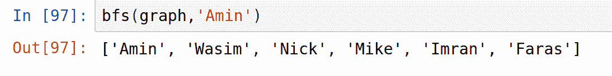

现在让我们研究深度优先搜索算法。

# 深度优先搜索

DFS 是 BFS 的替代品，用于从图形中搜索数据。区别 DFS 和 BFS 的因素是，从根顶点开始后，算法在每个唯一的单路径中一个接一个地尽可能向下。对于每个路径，一旦成功达到最终深度，它会将与该路径关联的所有顶点标记为已访问。完成路径后，算法返回。如果它可以从根节点找到另一条尚未访问的路径，则该算法将重复前面的过程。该算法在新分支中不断移动，直到所有分支都被访问

请注意，图可能具有循环方法。如前所述，我们使用布尔标志跟踪已处理的顶点，以避免循环迭代。

为了实现 DFS，我们将使用堆栈数据结构，这在[第 2 章](02.html)、*算法中使用的数据结构*中进行了详细讨论。请记住，堆栈基于**后进先出**（**后进先出**原则。这与 BFS 使用的队列形成对比，BFS 使用的是**先进先出**（**FIFO**原则。

以下代码用于 DFS：

```py
def dfs(graph, start, visited=None):
    if visited is None:
        visited = set()
    visited.add(start)
    print(start)
    for next in graph[start] - visited:
        dfs(graph, next, visited)
    return visited
```

让我们再次使用以下代码来测试前面定义的`dfs`函数：

```py
graph={ 'Amin' : {'Wasim', 'Nick', 'Mike'},
         'Wasim' : {'Imran', 'Amin'}, 
         'Imran' : {'Wasim','Faras'}, 
         'Faras' : {'Imran'},
         'Mike'  :{'Amin'}, 
         'Nick'  :{'Amin'}}
```

如果我们运行此算法，输出将如下所示：


让我们使用 DFS 方法查看此图的详尽遍历模式：

1.  迭代从顶部节点 Amin 开始。
2.  然后，它移到第二层，瓦西姆。从那里开始，它向较低的层移动，直到到达末端，即 Imran 和 Fares 节点。
3.  在完成第一个完整的分支后，它返回到第二层去拜访尼克和迈克。

遍历模式如下图所示：


Note that DFS can be used in trees as well.

现在让我们看一个案例研究，它解释了我们在本章中讨论的概念如何用于解决现实问题。

# 案例研究-欺诈分析

让我们看看如何使用 SNA 来检测欺诈。由于人类是社会性动物，人们的行为据说会受到周围人的影响。**嗜同性**一词被创造出来，用来表示他们的社交网络对一个人的影响。**嗜同性网络**是一组由于某些共同因素而可能相互联系的人；例如，有相同的出身或爱好，属于同一帮派或同一所大学，或其他因素的组合。

如果我们想分析同质网络中的欺诈行为，我们可以利用被调查者与网络中其他人之间的关系，他们参与欺诈的风险已经被仔细计算过。由于公司的原因而对某人进行诽谤有时也被称为联想罪。

为了理解这个过程，让我们先看一个简单的案例。为此，让我们使用一个有九个顶点和八条边的网络。在该网络中，有四个顶点是已知的欺诈案例，分类为**欺诈**（**F**）。其余 5 人没有欺诈相关病史，被归类为**非欺诈**（**NF**）

我们将编写一个包含以下步骤的代码来生成此图：

1.  让我们导入我们需要的包：

```py
import networkx as nx
import matplotlib.pyplot as plt
```

2.  定义`vertices`和`edges`的数据结构：

```py
vertices = range(1,10)
edges= [(7,2), (2,3), (7,4), (4,5), (7,3), (7,5), (1,6),(1,7),(2,8),(2,9)]
```

3.  让我们首先实例化该图：

```py
G = nx.Graph()
```

4.  现在，让我们画一张图表：

```py
G.add_nodes_from(vertices) 
G.add_edges_from(edges)
pos=nx.spring_layout(G)
```

5.  让我们定义 NF 节点：

```py
nx.draw_networkx_nodes( G,pos,
                        nodelist=[1,4,3,8,9],
                        with_labels=True,
                        node_color='g',
                        node_size=1300) 
```

6.  现在，让我们创建已知参与欺诈的节点：

```py
nx.draw_networkx_nodes(G,pos, 
                        nodelist=[2,5,6,7],
                        with_labels=True,
                        node_color='r',
                        node_size=1300) 
```

7.  让我们为节点创建标签：

```py
nx.draw_networkx_edges(G,pos,edges,width=3,alpha=0.5,edge_color='b') labels={} labels[1]=r'1 NF' labels[2]=r'2 F' labels[3]=r'3 NF' labels[4]=r'4 NF' labels[5]=r'5 F' labels[6]=r'6 F' labels[7]=r'7 F' labels[8]=r'8 NF' labels[9]=r'9 NF' 
nx.draw_networkx_labels(G,pos,labels,font_size=16)
```

一旦前面的代码运行，它将向我们显示如下图形：

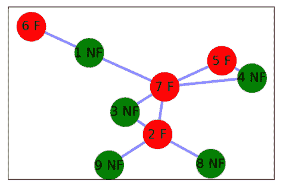

请注意，我们已经进行了详细的分析，将每个节点划分为图或非图。假设我们在网络中添加了另一个名为*q*的顶点，如下图所示。我们没有此人的先验信息以及此人是否涉及欺诈。我们想根据此人与社交网络现有成员的链接将其归类为**NF**或**F**：

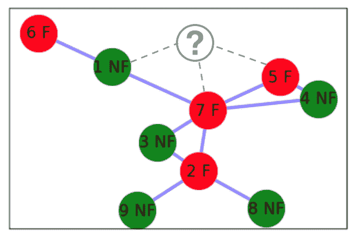

我们设计了两种方法来将这个新人分类，以节点*q*为代表，分别为**F**或**NF**：

*   使用一种简单的方法，该方法不使用中心度指标和有关欺诈类型的附加信息
*   使用 watchtower 方法，这是一种先进的技术，使用现有节点的中心性指标以及有关欺诈类型的附加信息

我们将详细讨论每种方法。

# 进行简单的欺诈分析

欺诈分析的简单技术基于这样一种假设，即在网络中，一个人的行为受其所联系的人的影响。在网络中，如果两个顶点相互关联，则它们更可能具有相似的行为

基于这个假设，我们设计了一种简单的技术。如果我们想找到某个节点*a*属于*F*的概率，则概率由*P（F/q）*表示，计算如下：

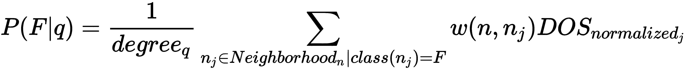

让我们将此应用于上图，其中*邻域<sub>n</sub>n*表示顶点*n*的邻域，*w（n，nj）*表示*n*与*n*j*j*之间连接的权重。另外，*度<sub>q</sub>*是节点*q*的度。然后，概率计算如下：


根据该分析，此人参与欺诈的可能性为 67%。我们需要设定一个门槛。如果阈值为 30%，则此人高于阈值，我们可以安全地将其标记为 F。

请注意，需要为网络中的每个新节点重复此过程。

现在，让我们来看一种先进的欺诈分析方法。

# 介绍了望台欺诈分析方法

以前的简单欺诈分析技术有以下两个局限性：

*   它不评估社交网络中每个顶点的重要性。与涉及欺诈的中心的连接可能与与远程孤立人员的关系具有不同的含义。
*   当将某人标记为现有网络中已知的欺诈案件时，我们不考虑犯罪的严重程度。

watchtower 欺诈分析方法解决了这两个限制。首先，让我们看两个概念。

# 取得负面结果

如果一个人被认为参与了欺诈，我们就说这个人有负面的结果。并非所有负面结果都具有相同的严重性或严重性。一个已知的冒充他人的人会有一种更严重的负面结果，而不是一个试图用一张过期的 20 美元的礼品卡，以一种创新的方式使其有效的人。

从 1 分到 10 分，我们对各种负面结果的评分如下：

| **阴性结果** | **阴性结果评分** |
| 模仿 | 10 |
| 涉及信用卡盗窃案 | 8. |
| 假支票提交 | 7. |
| 犯罪记录 | 6. |
| 没有记录 | 0 |

请注意，这些分数将基于我们对欺诈案件及其历史数据影响的分析。

# 怀疑程度

**怀疑程度**（**DOS**）量化了我们对某人可能参与欺诈的怀疑程度。DOS 值为 0 表示该人员为低风险人员，DOS 值为 9 表示该人员为高风险人员

对历史数据的分析表明，职业欺诈者在其社交网络中占有重要地位。为了结合这一点，我们首先计算网络中每个顶点的所有四个中心度度量。然后取这些顶点的平均值。这就意味着这个特定的人在网络中的重要性。

如果与顶点相关的人员涉及欺诈，我们通过使用上表中所示的预定义值对该人员进行评分来说明这一负面结果。这样做是为了使犯罪的严重性反映在每个人的价值上。

最后，我们将中心性指标的平均值与负结果分数相乘，得到 DOS 的值。我们通过将 DOS 除以网络中 DOS 的最大值来规范化 DOS。

让我们计算前一个网络中九个节点的 DOS：

|  | **节点 1** | **节点 2** | **节点 3** | **节点 4** | **节点 5** | **节点 6** | **节点 7** | **节点 8** | **节点 9** |
| 中心度 | 0.25 | 0.5 | 0.25 | 0.25 | 0.25 | 0.13 | 0.63 | 0.13 | 0.13 |
| 中间性 | 0.25 | 0.47 | 0 | 0 | 0 | 0 | 0.71 | 0 | 0 |
| 亲密 | 0.5 | 0.61 | 0.53 | 0.47 | 0.47 | 0.34 | 0.72 | 0.4 | 0.4 |
| 特征向量 | 0.24 | 0.45 | 0.36 | 0.32 | 0.32 | 0.08 | 0.59 | 0.16 | 0.16 |
| 中心性
指标的平均值 | 0.31 | 0.51 | 0.29 | 0.26 | 0.26 | 0.14 | 0.66 | 0.17 | 0.17 |
| 负结果分数 | 0 | 6. | 0 | 0 | 7. | 8. | 10 | 0 | 0 |
| 磁盘操作系统 | 0 | 3. | 0 | 0 | 1.82 | 1.1 | 6.625 | 0 | 0 |
| 规范化 DOS | 0 | 0.47 | 0 | 0 | 0.27 | 0.17 | 1. | 0 | 0 |

下图显示了每个节点及其规范化 DOS：


为了计算已添加的新节点的 DOS，我们将使用以下公式：


使用相关值，我们将计算 DOS，如下所示：

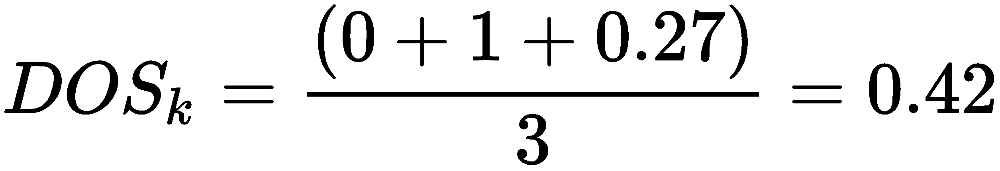

这将表明与添加到系统中的新节点相关的欺诈风险。这意味着在 0 到 1 的范围内，此人的 DOS 值为 0.42。我们可以为 DOS 创建不同的风险箱，如下所示：

| DOS 的**值** | **风险分类** |
| DOS=0 | 没有风险 |
| 0 | 低风险 |
| 0.10 | 中等风险 |
| DOS>0.3 | 高风险 |

根据这些标准，可以看出新员工是高风险人群，应予以标记。

通常，进行此类分析时不涉及时间维度。但是现在，有一些先进的技术可以随着时间的推移观察图形的增长。这使得研究人员能够在网络演化过程中观察顶点之间的关系。尽管这种对图形的时间序列分析将使问题的复杂性增加很多倍，但它可能会进一步洞察欺诈的证据，而这在其他情况下是不可能的。

# 总结

在本章中，我们学习了基于图的算法。读完本章后，我希望我们能够使用不同的技术来表示、搜索和处理以图形表示的数据。我们还发展了计算两个顶点之间最短距离的技能，并在问题空间中建立了邻域。这些知识将帮助我们使用图论来解决欺诈检测等问题。

在下一章中，我们将重点讨论不同的无监督机器学习算法。本章讨论的许多用例技术补充了无监督学习算法，下一章将详细讨论这些算法。在数据集中查找欺诈证据就是此类用例的一个例子。