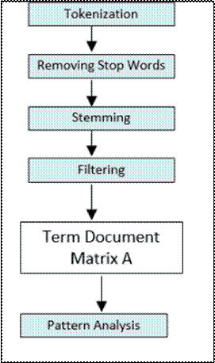
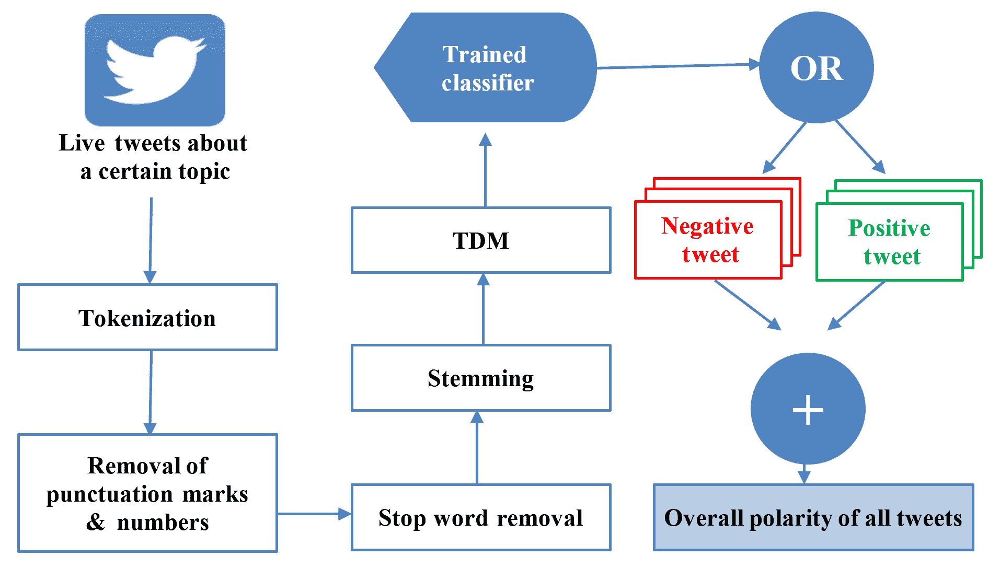
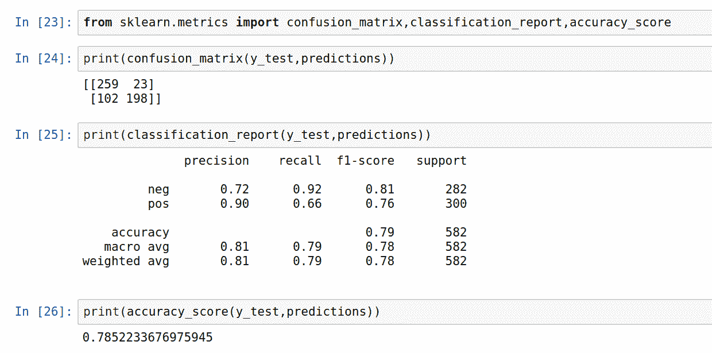

# 九、自然语言处理算法

本章介绍了**自然语言处理**（**NLP**算法）。本章从理论到实践，循序渐进。首先介绍 NLP 的基本原理，然后介绍基本算法。然后，本文将介绍一种最流行的神经网络，它被广泛用于为文本数据的重要用例设计和实现解决方案。在最终学习如何使用 NLP 来训练一个机器学习模型来预测电影评论的极性之前，我们将先看看 NLP 的局限性。

本章将包括以下章节：

*   介绍 NLP
*   基于单词包（基于弓）的 NLP
*   单词嵌入简介
*   递归神经网络在自然语言处理中的应用
*   使用 NLP 进行情绪分析
*   案例研究：电影评论情绪分析

本章结束时，您将了解 NLP 使用的基本技术。您应该能够理解如何使用 NLP 来解决一些有趣的现实问题。

让我们从基本概念开始。

# 介绍 NLP

NLP 用于研究方法，以形式化和制定计算机与人类（自然）语言之间的交互。NLP 是一门综合性学科，涉及使用计算机语言学算法和人机交互技术和方法来处理复杂的非结构化数据。NLP 可用于多种情况，包括以下情况：

*   **主题识别**：**在文本库中发现主题，并根据发现的主题对库中的文档进行分类**
***   **情绪分析**：根据文本所包含的积极或消极情绪对文本进行分类*   **机器翻译**：将文本从一种人类口语翻译成另一种*   **文语转换**：将口语转换为文本*   **主观解读**：利用现有信息对问题进行智能解读和回答*   **实体识别**：**从文本中识别实体（如人、地点或事物）*****   **假新闻检测**：根据内容标记假新闻****

 ****让我们从讨论 NLP 时使用的一些术语开始。

# 理解 NLP 术语

自然语言处理是一门综合性学科。在围绕某一领域的文献中，我们会注意到，有时，不同的术语用于指定同一事物。我们将首先了解一些与 NLP 相关的基本术语。让我们从规范化开始，它是 NLP 处理的基本类型之一，通常对输入数据执行。

# 规范化

在训练机器学习模型的背景下，对输入文本数据执行归一化以提高其质量。标准化通常涉及以下处理步骤：

*   将所有文本转换为大写或小写
*   删除标点符号
*   删除数字

请注意，尽管通常需要前面的处理步骤，但实际的处理步骤取决于我们要解决的问题。它们会因用例而异，例如，如果文本中的数字表示在我们试图解决的问题的上下文中可能具有某种价值的东西，那么我们可能不需要在规范化阶段从文本中删除数字。

# 语料库

我们用来解决问题的一组输入文档称为**语料库**。语料库充当 NLP 问题的输入数据。

# 符号化

当我们使用 NLP 时，第一项工作是将文本划分为标记列表。这个过程称为**标记化**。结果令牌的粒度将根据目标而变化，例如，每个令牌可以由以下内容组成：

*   一句话
*   词的组合
*   一句话
*   段落

# 命名实体识别

在 NLP 中，有许多用例需要从非结构化数据中将某些单词和数字识别为属于预定义类别，例如电话号码、邮政编码、姓名、地点或国家。这用于为非结构化数据提供结构。此过程称为**命名实体识别**（**NER**。

# 停止语

在单词级标记化之后，我们有一个文本中使用的单词列表。其中一些词是几乎所有文档中都会出现的常用词。这些词语不会对它们出现在其中的文档提供任何额外的见解。这些词被称为**停止词**。它们通常在数据处理阶段被删除。停止词的例子有*是*、*我们、*和*是*。

# 情绪分析

情感分析，或观点挖掘，是从文本中提取积极或消极情感的过程。

# 词干化和柠檬化

在文本数据中，大多数单词可能以稍微不同的形式出现。将每个单词还原为其词源或词干，称为**词干分析**。它用于根据单词的相似含义对单词进行分组，以减少需要分析的单词总数。从本质上讲，词干分析减少了问题的总体条件性。

例如，{use，used，using，uses}=>use。

最常用的英语词干提取算法是波特算法。

词干分析是一个粗糙的过程，可能导致切掉单词的词尾。这可能导致单词拼写错误。对于许多用例，每个单词只是问题空间中某个级别的标识符，拼写错误的单词并不重要。如果需要拼写正确的单词，那么应该使用柠檬化而不是词干。

Algorithms lack common sense. For the human brain, treating similar words the same is straightforward. For an algorithm, we have to guide it and provide the grouping criteria.

从根本上讲，有三种不同的方式实现 NLP。这三种技术在复杂程度上不同，如下所示：

*   **基于**的单词包（基于 Bo**W**的）NLP
*   传统 NLP 分类器
*   利用深度学习进行自然语言处理

# NLTK

**自然语言工具包**（**NLTK**是 Python 中处理 NLP 任务使用最广泛的包。NLTK 是用于 NLP 的最古老和最流行的 Python 库之一。NLTK 非常棒，因为它基本上为构建任何 NLP 流程提供了一个快速启动，它为您提供了基本的工具，然后您可以将这些工具链接在一起以实现您的目标，而不是从头构建所有这些工具。很多工具都打包到 NLTK 中，在下一节中，我们将下载该包并探索其中的一些工具。

让我们看看基于 BoW 的 NLP。

# 基于弓的自然语言处理

将输入文本表示为一包令牌称为基于**弓的处理**。使用 BoW 的缺点是我们放弃了大部分语法和标记化，这有时会导致失去单词的上下文。在 BoW 方法中，我们首先量化要分析的每个文档上下文中每个单词的重要性。 

基本上，有三种不同的方式来量化每个文档中单词的重要性：

*   **二进制**：如果单词出现在文本中，则特征值为 1，否则为 0。
*   **计数**：一个特征将单词在文本中出现的次数作为其值，否则为 0。
*   **术语频率/反向文档频率**：特征值将是单个文档中单词的唯一性与整个文档库中单词的唯一性的比率。显然，对于诸如、in 等常用词（称为停止词），**术语频率–反向文档频率**（**TF-IDF**）分数较低。对于更独特的词，例如，特定领域的术语，分数会更高。

注意，通过使用 BoW，我们丢弃了信息，即文本中单词的顺序。这通常有效，但可能会导致精度降低。

让我们看一个具体的例子。我们将训练一个模型，可以将餐厅的评价分为负面评价和正面评价。输入文件是一个 strutted 文件，其中评审将被分类为肯定或否定。

为此，让我们首先处理输入数据

处理步骤如下图所示：



让我们通过以下步骤来实现此处理管道：

1.  首先，我们导入我们需要的包：

```py
import numpy as np
import pandas as pd
```

2.  然后我们从`CSV`文件导入数据集：


3.  **接下来，我们清理数据：**

 **```py
# Cleaning the texts
import re
import nltk
nltk.download('stopwords')
from nltk.corpus import stopwords
from nltk.stem.porter import PorterStemmer
corpus = []
for i in range(0, 1000):
    review = re.sub('[^a-zA-Z]', ' ', dataset['Review'][i])
    review = review.lower()
    review = review.split()
    ps = PorterStemmer()
    review = [ps.stem(word) for word in review if not word in set(stopwords.words('english'))]
    review = ' '.join(review)
    corpus.append(review)
```

4.  现在让我们定义特征（由`y`表示）和标签（由`X`表示）：

```py
from sklearn.feature_extraction.text import CountVectorizer
cv = CountVectorizer(max_features = 1500)
X = cv.fit_transform(corpus).toarray()
y = dataset.iloc[:, 1].values
```

5.  让我们将数据分为测试数据和培训数据：

```py
from sklearn.model_selection import train_test_split
X_train, X_test, y_train, y_test = train_test_split(X, y, test_size = 0.20, random_state = 0)
```

6.  为了训练模型，我们使用朴素贝叶斯算法：

```py
from sklearn.naive_bayes import GaussianNB
classifier = GaussianNB()
classifier.fit(X_train, y_train)
```

7.  让我们预测测试集结果：

```py
y_pred = classifier.predict(X_test)
```

8.  混淆矩阵如下所示：


通过观察混淆矩阵，我们可以估计错误分类。

# 单词嵌入简介

在前面的部分中，我们研究了如何使用 BoW 作为输入文本数据的抽象来执行 NLP。NLP 的主要进步之一是我们能够以密集向量的形式创建单词的有意义的数字表示。这种技术称为单词嵌入。Yoshua Bengio 在他的论文*中首次引入了这个术语，这是一个神经概率语言模型*。NLP 问题中的每个单词都可以看作是一个分类对象。将每个单词映射到以向量表示的数字列表称为单词嵌入。换句话说，用于将单词转换为实数的方法称为单词嵌入。嵌入的一个区别特征是它使用密集向量，而不是使用使用稀疏矩阵向量的传统方法。

在 NLP 中使用 BoW 基本上有两个问题：

*   **语义上下文丢失**：当我们标记数据时，其上下文丢失。一个词可能有不同的含义，这取决于它在句子中的使用位置；这在解释复杂的人类表情，如幽默或讽刺时变得更加重要。
*   **稀疏输入**：当我们标记时，每个单词都成为一个特征。正如我们在前面的示例中所看到的，每个单词都是一个特征。它会导致稀疏的数据结构

# 词的邻域

关于如何向算法呈现文本数据（特别是单个单词或词素）的关键见解来自语言学。在单词嵌入中，我们关注每个单词的邻域，并使用它来确定其含义和重要性。单词的邻域是围绕某个特定单词的一组单词。一个词的上下文由它的邻域决定

注意，在 BoW 中，一个单词失去了上下文，因为它的上下文来自它所在的邻居。

# 词嵌入的性质

好的单词嵌入具有以下四个特性：

*   **它们是密集的**：事实上，嵌入本质上是因子模型。因此，嵌入向量的每个分量表示（潜在）特征的数量。我们通常不知道该特征代表什么；然而，我们将有很少的零，如果有任何零，将导致稀疏输入。
*   **它们是低维的**：嵌入具有预定义的维度（选择为超参数）。我们在前面看到，在弓形表示中，我们需要为每个单词输入|*V*，因此输入的总大小为|*V***n*，其中*n*是我们用作输入的单词数。通过单词嵌入，我们的输入大小将是*d***n*，其中*d*通常在 50 到 300 之间。考虑到大型文本语料库通常比 300 个单词大得多，这意味着我们在输入大小上有了很大的节省，我们看到这可以在数据实例总数较少的情况下提高准确性。
*   **他们嵌入了域语义**：这个属性可能是最令人惊讶的，但也是最有用的。经过适当培训后，嵌入程序可以了解其域的含义
*   **易于泛化**：最后，web 嵌入能够提取泛化的抽象模式。例如，我们可以对猫、鹿、狗等（嵌入）进行训练，模型将理解我们指的是动物。请注意，该模型从未针对绵羊进行过训练，但该模型仍能正确地对其进行分类。通过使用嵌入，我们可以期望得到正确的答案

现在，让我们探讨一下如何将 RNN 用于自然语言处理。

# 将 RNN 用于 NLP

RNN 是一种传统的带反馈的前馈网络。考虑 RNN 的一个简单方法是，它是一个具有状态的神经网络。RNN 与任何类型的数据一起使用，用于生成和预测各种数据序列。训练 RNN 模型是关于制定这些数据序列。RNN 可以用于文本数据，因为句子只是单词序列。当我们将 RNN 用于 NLP 时，我们可以将其用于以下用途：

*   打字时预测下一个单词

*   按照文本中已使用的样式生成新文本：


还记得导致正确预测的单词组合吗？RNNs 的学习过程基于语料库中的文本。通过减少预测的下一个单词和实际的下一个单词之间的误差来训练它们

# 使用 NLP 进行情绪分析

本节介绍的方法基于对高速传入流 tweet 进行分类的用例。手头的任务是提取 tweet 中关于所选主题的隐含情感。情绪分类实时量化每条推文中的极性，然后聚合所有推文中的总情绪，以捕获所选主题的总体情绪。为了应对 Twitter 流数据的内容和行为所带来的挑战，并高效地执行实时分析，我们通过使用经过训练的分类器来使用 NLP。然后将经过训练的分类器插入推特流，以确定每条推特的极性（正、负或中性），然后聚合并确定关于某个主题的所有推特的整体极性。让我们看看这是如何一步一步完成的。

首先，我们必须训练分类器。为了训练分类器，我们需要一个已经准备好的数据集，该数据集包含历史推特数据，并跟踪实时数据的模式和趋势。因此，我们使用了网站[www.mountain140.com](http://www.sentiment140.com/)上的数据集，该数据集包含一个人类标记的语料库（分析所基于的大量文本集合），拥有 160 多万条推特。这个数据集中的 tweet 被标记为三个极性之一：零表示负面，两个表示中性，四个表示正面。除了 tweet 文本之外，语料库还提供 tweet ID、日期、标志和发 tweet 的用户。现在，让我们看看在实时推特到达*训练的*分类器之前对其执行的每个操作：

1.  tweet 首先被拆分为单独的单词，称为 tokens（标记化）。
2.  标记化的输出创建了一个 BoW，它是文本中单个单词的集合。
3.  通过删除数字、标点符号和停止词（停止词删除），可以进一步过滤这些推文。停止词是非常常见的词，如*是*、*是*、*是*、*是*。由于它们不包含任何附加信息，因此这些单词将被删除。
4.  此外，非字母字符，如**@*和数字，通过模式匹配被删除，因为它们在情感分析中不具有相关性。正则表达式仅用于匹配字母字符，其余的将被忽略。这有助于减少推特流的混乱。*
**   前一阶段的结果被带到词干分析阶段。在这一阶段，派生词被简化为它们的词根。例如，像*fish*这样的词与*fishing*和*fishes*具有相同的词根。为此，我们使用标准 NLP 库，该库提供了各种算法，如波特词干分析。*

 *6.  一旦数据被处理，它就被转换成一种称为**术语文档矩阵**（**TDM**的结构。TDM 表示过滤语料库中每项工作的术语和频率。
7.  从 TDM，tweet 到达经过训练的分类器（经过训练后，它可以处理 tweet），该分类器计算每个单词的**情感极性重要性**（**SPI**），该值为-5 到+5 之间的数字。正号或负号表示特定单词所代表的情绪类型，其大小表示情绪的强度。这意味着推特可以分为正面或负面（参考下图）。一旦我们计算出单个 tweet 的极性，我们将它们的总 SPI 相加，以找到源的聚合情绪。例如，总极性大于 1 表示我们观察到的时间段内 tweet 的聚合情绪为正。

To retrieve the real-time raw tweets, we use the Scala library *Twitter4J*, a Java library that provides a package for a real-time Twitter streaming API. The API requires the user to register a developer account with Twitter and fill in some authentication parameters. This API allows you to either get random tweets or filter tweets using chosen keywords. We used filters to retrieve tweets related to our chosen keywords.

整体架构如下图所示：



情绪分析有多种应用。它可以用于对客户的反馈进行分类。社会媒体极性分析可以被政府用来发现其政策的有效性。它还可以量化各种广告活动的成功程度

在下一节中，我们将学习如何实际应用情绪分析来预测电影评论的情绪。

# 案例研究：电影评论情绪分析

让我们使用 NLP 进行电影评论情绪分析。为此，我们将使用[上提供的一些开源电影评论数据 http://www.cs.cornell.edu/people/pabo/movie-review-data/](http://www.cs.cornell.edu/people/pabo/movie-review-data/) ：

1.  首先，我们将导入包含电影评论的数据集：

```py
import numpy as np
import pandas as pd
```

2.  现在，让我们加载电影的数据并打印前几行以观察其结构

```py
df=pd.read_csv("moviereviews.tsv",sep='\t')
df.head()
```


注意，数据集有`2000`电影评论。其中一半是负数，一半是正数。

3.  现在，让我们开始准备用于训练模型的数据集。首先，让我们删除数据中缺少的任何值

```py
df.dropna(inplace=True)
```

4.  现在我们还需要删除空白。空格不为空，但需要删除。为此，我们需要迭代输入`DataFrame`中的每一行。我们将使用`.itertuples()`访问每个字段：

```py
blanks=[] 

for i,lb,rv in df.itertuples():
    if rv.isspace():
        blanks.append(i)
df.drop(blanks,inplace=True)      
```

请注意，我们在索引、标签和审阅列中使用了`i`、`lb`和`rv`。

让我们将数据分为测试和训练数据集：

1.  第一步是指定特征和标签，然后将数据拆分为列车和测试集：

```py
from sklearn.model_selection import train_test_split

X = df['review']
y = df['label']

X_train, X_test, y_train, y_test = train_test_split(X, y, test_size=0.3, random_state=42)
```

现在我们有了测试和培训数据集。

2.  现在，让我们将集合分为训练和测试：

```py
from sklearn.pipeline import Pipeline
from sklearn.feature_extraction.text import TfidfVectorizer
from sklearn.naive_bayes import MultinomialNB

# Naïve Bayes:
text_clf_nb = Pipeline([('tfidf', TfidfVectorizer()),
                     ('clf', MultinomialNB()),
])
```

请注意，我们使用`tfidf`来量化集合中数据点的重要性。

接下来，让我们使用朴素贝叶斯算法训练模型，然后测试训练后的模型

让我们按照以下步骤来训练模型：

1.  现在，让我们使用我们创建的测试和训练数据集来训练模型：

```py
text_clf_nb.fit(X_train, y_train)
```

2.  让我们运行预测并分析结果：

```py
# Form a prediction set
predictions = text_clf_nb.predict(X_test)
```

现在让我们通过打印混淆矩阵来查看模型的性能。我们还将关注*精度*、*召回*、*f1 分数*和*精度*



这些性能指标为我们提供了预测质量的度量。以 0.78 的准确度，现在我们已经成功地训练了一个模型，可以预测我们可以为特定电影预测什么类型的评论。

# 总结

在本章中，我们讨论了与 NLP 相关的算法。首先，我们看了与 NLP 相关的术语。接下来，我们研究了实施 NLP 战略的方法。然后我们研究了单词嵌入的概念以及神经网络在自然语言处理中的应用。最后，我们看了一个实际的例子，在这个例子中，我们使用本章中开发的概念来预测基于文本的电影评论的情绪。读完本章后，用户应该能够使用 NLP 进行文本分类和情感分析。

在下一章中，我们将介绍推荐引擎。我们将研究不同类型的推荐引擎，以及如何使用它们来解决一些实际问题。*******