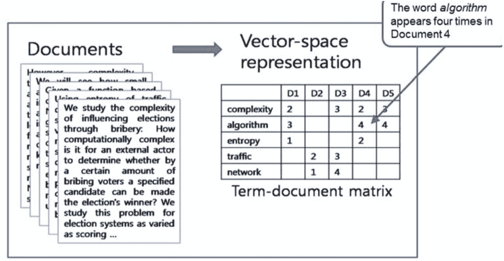
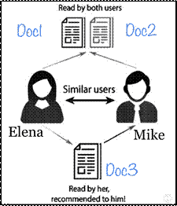
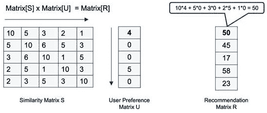
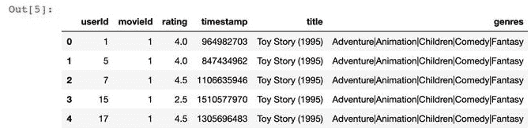
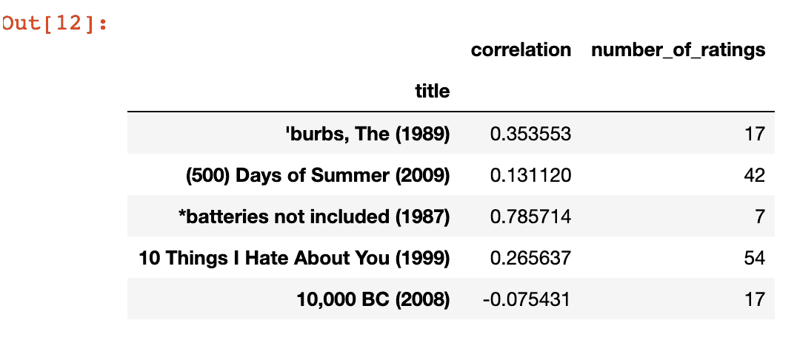

# 十、推荐引擎

**推荐引擎是一种使用有关用户偏好和产品详细信息的可用信息提供知情推荐的方法。推荐引擎的目标是了解一组项目之间的相似性模式和/或制定用户和项目之间的交互。

本章首先介绍推荐引擎的基础知识。然后，讨论了各种类型的推荐引擎。接下来，本章将讨论如何使用推荐引擎向不同的用户推荐项目和产品，以及推荐引擎的各种限制。最后，我们将学习使用推荐引擎来解决实际问题。

本章讨论了以下概念：

*   介绍推荐引擎
*   推荐引擎的类型
*   了解推荐系统的局限性
*   实际应用领域
*   创建向订阅者推荐电影的推荐引擎的实际示例

在本章结束时，您应该能够理解如何使用推荐引擎根据某些偏好标准推荐各种项目。

让我们从介绍推荐引擎的背景概念开始。

# 引入推荐系统

推荐系统代表了研究人员最初开发的预测用户最有可能感兴趣的项目的方法。推荐系统对商品提供个性化建议的能力使其成为在线购买世界中最重要的技术。

当用于电子商务应用程序时，推荐引擎使用复杂的算法来改善购物者的购物体验，并允许服务提供商根据用户的偏好定制产品。

In 2009, Netflix offered 1 million dollars to anyone who could provide an algorithm that could improve its existing recommendation engine (Cinematch) by more than 10%. The prize was won by BellKor's Pragmatic Chaos team.

# 推荐引擎的类型

通常，有三种不同类型的推荐引擎：

*   基于内容的推荐引擎
*   协同过滤引擎
*   混合推荐引擎

# 基于内容的推荐引擎

基于内容的推荐引擎的基本思想是建议与用户先前感兴趣的项目相似的项目。基于内容的推荐引擎的有效性取决于我们量化项目与其他项目相似性的能力。

让我们看看下面的图表。如果**用户 1**已阅读**文件 1**，则我们可以向用户推荐**文件 2**，类似于**文件 1:**


现在，问题是如何确定哪些项目彼此相似。让我们研究两种寻找不同项目之间相似性的方法。

# 查找非结构化文档之间的相似性

确定不同文档之间相似性的一种方法是首先处理输入文档。处理非结构化文档后得到的数据结构称为**术语文档矩阵**（**TDM**），如下图所示：



TDM 将所有词汇表作为行，将所有文档作为列。它可用于根据选定的距离度量确定哪些文档与其他文档相似。例如，谷歌新闻（GoogleNews）根据与用户已经感兴趣的新闻项目的相似性向用户推荐新闻。

一旦有了 TDM，有两种方法可以量化文档之间的相似性：

*   **使用频率计数**：这意味着我们假设一个单词的重要性与每个单词的频率成正比。这是计算重要性的最简单方法。

*   **使用 TFIDF**（简称**T****erm 频率–反向文档频率**）：这是一个数字，用于计算每个单词在我们试图解决的问题上下文中的重要性。它是两个术语的倍数：
    *   **术语频率**（**TF**）：一个单词或术语在文档中出现的次数。词频与单词的重要性直接相关。
    *   **逆文档频率**（**IDF**）：首先，**文档频率**（**DF**）是包含我们正在搜索的术语的文档数。作为 DF 的反面，IDF 为我们提供了一个词所代表的唯一性的度量，并将其与重要性联系起来。
    *   由于 TF 和 IDF 都量化了一个单词在我们试图解决的问题中的重要性，因此它们的组合 TF-IDF 是衡量每个单词重要性的好方法，是使用简单频率计数的更复杂的替代方法。

# 使用共现矩阵

该方法基于这样的假设：如果两件物品大部分时间一起购买，那么它们很可能相似，或者至少属于通常一起购买的相同类别的物品。

例如，如果人们大部分时间都在一起使用剃须凝胶和剃须刀，那么如果有人买了剃须刀，建议他们也买剃须凝胶是有道理的

 *让我们分析这四位用户的历史购买模式：

|  | **剃须刀** | **苹果** | **剃须膏** | **自行车** | **鹰嘴豆泥** |
| 迈克 | 1. | 1. | 1. | 0 | 1. |
| 泰勒 | 1. | o | 1. | 1. | 1. |
| 埃琳娜 | 0 | 0 | 0 | 1. | 0 |
| 胺 | 1. | 0 | 1. | 0 | 0 |

这将创建以下共生矩阵：

|  | **剃须刀** | **苹果** | **剃须膏** | **自行车** | **鹰嘴豆泥** |
| 剃须刀 | - | 1. | 3. | 1. | 1. |
| 苹果 | 1. | - | 1. | 0 | 1. |
| 剃须膏 | 3. | 1. | - | 1. | 2. |
| 自行车 | 1. | 0 | 1. | - | 1. |
| 鹰嘴豆泥 | 1. | 1. | 2. | 1. | - |

前面的共生矩阵总结了一起购买两个项目的可能性。让我们看看如何使用它。

# 协同过滤推荐引擎

协同过滤的建议基于对用户历史购买模式的分析。基本假设是，如果两个用户对几乎相同的项目感兴趣，我们可以将两个用户分类为相似的。换句话说，我们可以假设如下：

*   如果两个用户的购买历史重叠超过阈值，我们可以将他们归类为相似用户。
*   查看类似用户的历史记录，在购买历史记录中不重叠的项目将通过协作过滤成为未来推荐的基础。

 *例如，让我们看一个具体的例子。我们有两个用户，**Mike**和**Elena**，如下图所示：



注意以下几点：

*   迈克和埃琳娜都对完全相同的文件**Doc1**和**Doc2**感兴趣
*   根据它们相似的历史模式，我们可以将它们都归类为相似的用户。
*   如果埃琳娜现在读的是**Doc3**，那么我们也可以向迈克推荐**Doc3**。

Note that this strategy of suggesting items to the users based on their history will not always work.

让我们假设埃琳娜和迈克对**Doc1**感兴趣，这是关于摄影的（因为他们都热爱摄影）。此外，他们两人都对**Doc2**感兴趣，这也是关于云计算的，因为他们两人都对这个主题感兴趣。基于协同过滤，我们将他们分类为相似用户。现在埃琳娜开始阅读**Doc3**，这是一本关于女性时尚的杂志。如果我们遵循协同过滤算法，我们会建议迈克阅读它，他可能对它不太感兴趣。

Back in 2012, the American superstore, Target, was experimenting with the use of using collaborative filtering for recommending products to buyers. The algorithm classified a father similar to his teen-aged daughter based on their profiles. Target ended up sending a discount coupon for diapers, baby formula, and crib to the father. He was not aware of his daughter's pregnancy.

请注意，协同过滤算法不依赖于任何其他信息，它是一个独立的算法，基于用户不断变化的行为和协同推荐。

# 混合推荐引擎

到目前为止，我们已经讨论了基于内容和基于协同过滤的推荐引擎。这两种类型的推荐引擎可以组合起来创建一个混合推荐引擎。为此，我们遵循以下步骤：

*   生成项目的相似性矩阵。
*   生成用户的偏好矩阵。
*   生成建议。

让我们逐一研究这些步骤。

# 生成项目的相似性矩阵

在混合推荐中，我们首先使用基于内容的推荐创建项目的相似性矩阵。这可以通过使用共现矩阵或使用任何距离度量来量化项目之间的相似性来实现

假设我们现在有五个项目。使用基于内容的建议，我们生成一个矩阵，该矩阵捕获项目之间的相似性，如下所示：


让我们看看如何将这个相似性矩阵与偏好矩阵结合起来生成推荐。

# 生成用户的参考向量

根据系统中每个用户的历史记录，我们将生成一个偏好向量，以捕获这些用户的兴趣。

假设我们想为一家名为*KentStreetOnline*的在线商店生成推荐，该商店销售 100 种独特的商品。KentStreetOnline 很受欢迎，拥有 100 万活跃用户。需要注意的是，我们只需要生成一个维度为 100×100 的相似矩阵。我们还需要为每个用户生成一个偏好向量；这意味着我们需要为 100 万用户中的每一个生成 100 万个偏好向量。

 *性能向量的每个条目表示一个项目的首选项。第一行的值表示**项目 1**的偏好权重为**4**。例如，第二行的值表示对**项目 2**没有偏好

如下图所示：


现在，让我们看看如何根据相似度矩阵 s 和用户偏好矩阵 U 生成推荐。

# 生成建议

为了提出建议，我们可以将矩阵相乘。用户更有可能对频繁出现的项目感兴趣，而他们对该项目给予了较高的评价：

*矩阵[S]x 矩阵[U]=矩阵[R]*

该计算如下图所示：



为每个用户生成一个单独的结果矩阵。推荐矩阵*矩阵【R】*中的数字量化了用户对每个项目的预期兴趣。例如，在结果矩阵中，第四项的数量最大，为 58。因此，强烈建议该特定用户使用此项。

现在，让我们看看不同推荐系统的局限性。

# 了解推荐系统的局限性

推荐引擎使用预测算法向一群用户推荐推荐。这是一项强大的技术，但我们应该意识到它的局限性。让我们看看推荐系统的各种局限性。

# 冷启动问题

很明显，要使协同过滤发挥作用，我们需要有关于用户偏好的历史数据。对于新用户，我们可能没有任何数据，因此我们的用户相似性算法将基于可能不准确的假设。对于基于内容的建议，我们可能无法立即获得有关新项目的详细信息。这种拥有关于项目和用户的数据以生成高质量建议的要求被称为**冷启动问题**。

# 元数据要求

基于内容的方法需要明确的项目描述来度量相似性。此类明确详细的描述可能不可用，从而影响预测的质量。

# 数据稀疏性问题

在大量的项目中，用户只对少数项目进行了评级，从而形成了非常稀疏的用户/项目评级矩阵。

Amazon has around a billion users and a billion items. Amazon's recommendation engine is said to have the sparsest data for any recommendation engine in the world.

# 因社会影响而产生的偏见

社会影响力在推荐人中扮演着重要的角色。社会关系可以被视为影响用户偏好的因素。朋友们倾向于购买相似的物品，并给出相似的评分。

# 有限数据

由于评论数量有限，推荐系统很难准确衡量用户的相似性。

# 实际应用领域

让我们看看推荐系统在实际世界中的应用：

*   Netflix 上三分之二的电影是推荐的。
*   亚马逊 35%的销售额来自推荐。
*   在谷歌新闻上，推荐的点击率提高了 38%。
*   试图预测用户对某个项目的偏好是基于其他项目的过去评级。
*   他们可以根据大学生的需要和喜好向他们推荐课程。
*   他们可以将简历与在线工作门户上的工作进行匹配。

现在，让我们尝试使用推荐引擎来解决一个实际问题。

# 实用示例–创建推荐引擎

让我们构建一个推荐引擎，可以向一群用户推荐电影。我们将使用明尼苏达大学 GulpLes 研究小组的数据。

遵循以下步骤：

1.  首先，我们将导入相关软件包：

```py
import pandas as pd 
import numpy as np
```

2.  现在，让我们导入`user_id`和`item_id`数据集：

```py
df_reviews = pd.read_csv('reviews.csv')
df_movie_titles = pd.read_csv('movies.csv',index_col=False)
```

3.  我们通过电影 ID 合并两个数据帧：

```py
df = pd.merge(df_users, df_movie_titles, on='movieId')
```

运行上述代码后，df DataFrame 的标头如下所示：



各栏的详情如下：

4.  为了查看输入数据的汇总趋势，让我们通过`title`和`rating`列使用`groupby`计算每部电影的平均收视率和计数：

。

5.  现在让我们为推荐引擎准备数据。为此，我们将数据集转换为矩阵，矩阵将具有以下特征：

我们将使用数据帧的`pivot_table`功能来完成：

```py
movie_matrix = df.pivot_table(index='userId', columns='title', values='rating')
```

请注意，前面的代码将生成一个非常稀疏的矩阵。

6.  现在，让我们使用我们创建的推荐矩阵来推荐电影。为此，让我们考虑一个观看过电影的特定用户，AUTT0VATA（2009）AUTT1。首先，我们会找到所有对*阿凡达（2009）*感兴趣的用户：

```py
Avatar_user_rating = movie_matrix['Avatar (2009)']
Avatar_user_rating = Avatar_user_rating.dropna()
Avatar_user_rating.head()
```

7.  现在，让我们尝试推荐与*阿凡达（2009）*相关的电影。为此，我们将计算`Avatar_user_rating`数据帧与`movie_matrix`的相关性，如下所示：

```py
similar_to_Avatar=movie_matrix.corrwith(Avatar_user_rating)
corr_Avatar = pd.DataFrame(similar_to_Avatar, columns=['correlation'])
corr_Avatar.dropna(inplace=True)
corr_Avatar = corr_Avatar.join(df_ratings['number_of_ratings'])
corr_Avatar.head()
```

这将给出以下输出：



这意味着我们可以使用这些电影作为用户的推荐。

# 总结

在本章中，我们学习了推荐引擎。我们研究了如何根据所要解决的问题选择合适的推荐引擎。我们还研究了如何为推荐引擎准备数据以创建相似性矩阵。我们还学习了如何使用推荐引擎来解决实际问题，例如根据用户过去的模式向用户推荐电影

在下一章中，我们将重点介绍用于理解和处理数据的算法。***