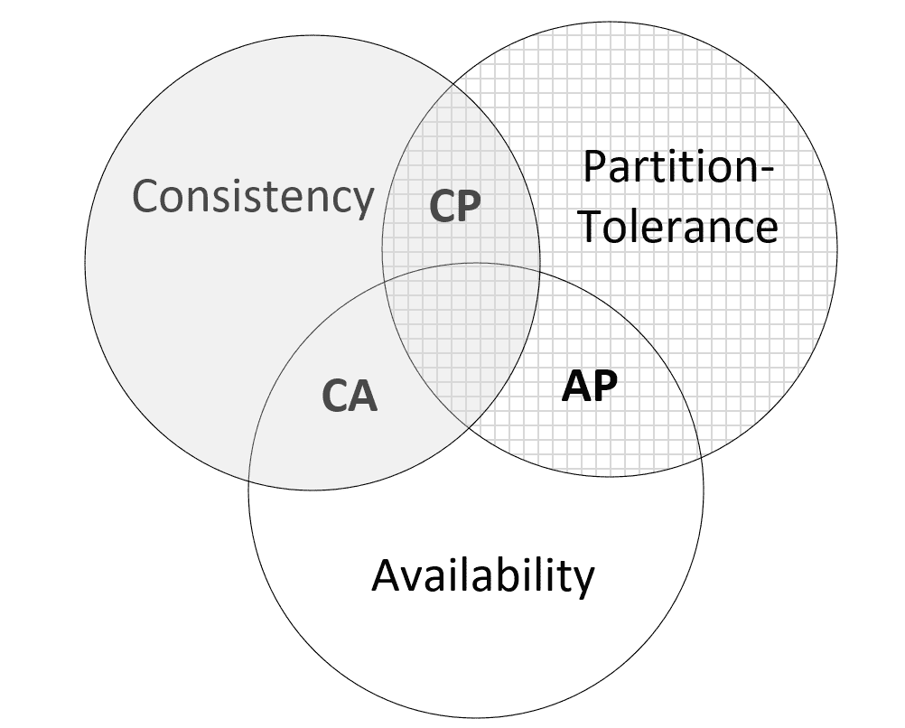
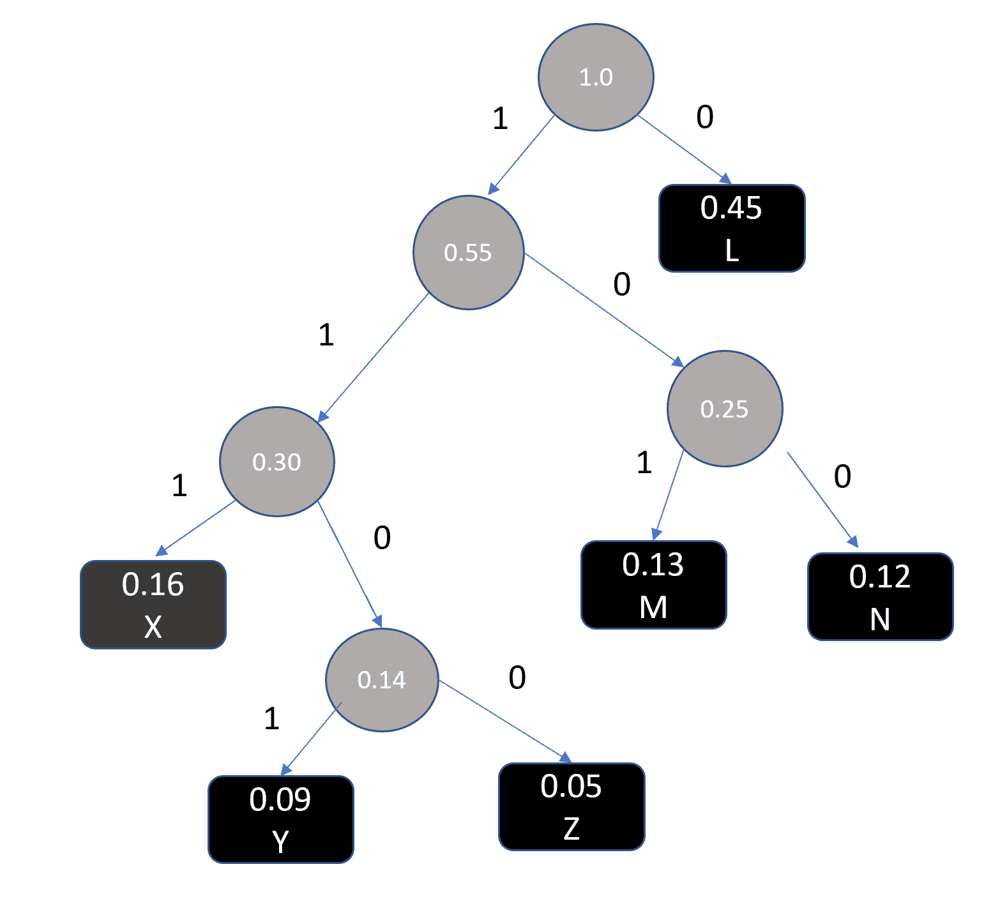
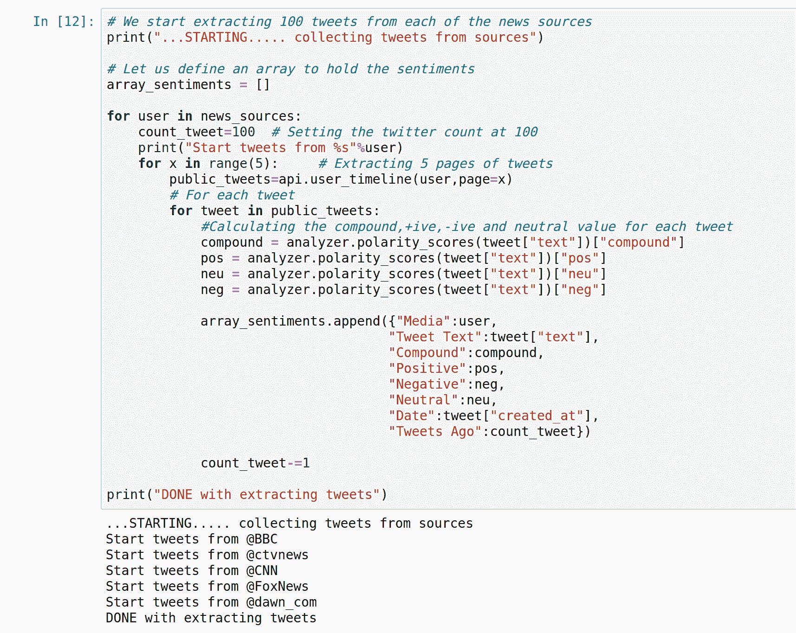

# 十一、数据算法

本章介绍以数据为中心的算法，特别是重点介绍以数据为中心的算法的三个方面：存储、流和压缩。本章首先简要概述以数据为中心的算法，然后我们将讨论可用于数据存储的各种策略。接下来，描述了如何将算法应用于流数据，然后讨论了不同的数据压缩方法。最后，我们将学习如何使用本章中开发的概念，使用最先进的传感器网络监控高速公路上行驶的汽车速度。

在本章结束时，您应该能够理解各种以数据为中心的算法设计中涉及的概念和权衡。

本章讨论以下概念：

*   数据分类
*   数据存储算法
*   如何使用算法压缩数据
*   如何使用算法来流化数据

让我们首先介绍一下基本概念。

# 数据算法简介

无论我们意识到与否，我们都生活在一个大数据时代。为了了解不断生成的数据量，只需查看谷歌发布的 2019 年数据。正如我们所知，谷歌照片是一个多媒体存储库，用于存储谷歌创建的照片。2019 年，谷歌照片平均每天上传 12 亿张照片和视频。此外，每天平均每分钟有 400 小时的视频（相当于 1 PB 的数据）上传到 YouTube。我们可以有把握地说，正在生成的数据量已经爆炸式增长。

当前对数据驱动算法的兴趣是由数据包含有价值的信息和模式这一事实驱动的。如果使用得当，数据可以成为决策、营销、治理和趋势分析的基础。

由于显而易见的原因，处理数据的算法变得越来越重要。设计能够处理数据的算法是一个活跃的研究领域。毫无疑问，探索利用数据提供量化效益的最佳方法是世界各地各种组织、企业和政府的重点。但原始形式的数据很少有用。要从原始数据中挖掘信息，它需要处理、准备和分析。

为此，我们首先需要将其存储在某个地方。高效的数据存储方法变得越来越重要。请注意，由于单节点系统的物理存储限制，大数据只能存储在由多个通过高速通信链路连接的节点组成的分布式存储中。因此，对于学习数据算法，我们从研究不同的数据存储算法开始是有意义的

首先，让我们将数据分类为不同的类别。

# 数据分类

让我们看看如何在设计数据算法时对数据进行分类。如[第 2 章](02.html)中所述，算法中使用的*数据结构，可通过量化数据的体积、种类和速度对其进行分类。这种分类可以成为设计用于数据存储和处理的数据算法的基础。*

让我们在数据算法的上下文中逐一研究这些特征：

*   **卷**量化算法中需要存储和处理的数据量。随着容量的增加，任务变得数据密集，需要调配足够的资源来存储、缓存和处理数据。大数据是一个术语，它模糊地定义了单个节点无法处理的大量数据。
*   **速度**定义生成新数据的速率。通常，高速数据称为“热数据”或“热数据流”，低速数据称为“冷数据流”或简称“冷数据”。在许多应用中，数据将是热流和冷流的混合，在与算法一起使用之前，首先需要准备并组合成一个表
*   **多样性**是指不同类型的结构化和非结构化数据，需要组合成一个表才能被算法使用。

下一节将帮助我们理解所涉及的权衡，并在设计存储算法时介绍各种设计选择。

# 介绍数据存储算法

可靠、高效的数据存储库是分布式系统的核心。如果此数据存储库是为分析而创建的，则也称为数据湖。数据存储库将来自不同域的数据汇集到一个位置。让我们首先了解与在分布式存储库中存储数据相关的不同问题。

# 了解数据存储策略

在数字计算的最初几年，设计数据存储库的常用方法是使用单节点体系结构。随着数据集规模的不断扩大，分布式数据存储现已成为主流。在分布式环境中存储数据的正确策略取决于数据类型、预期使用模式及其非功能性需求。为了进一步分析分布式数据存储的需求，让我们从**一致性可用性分区容差（CAP）**定理开始，它为我们设计分布式系统的数据存储策略提供了基础

# 提出 CAP 定理

1998 年，Eric Brewer 提出了一个定理，后来成为著名的 CAP 定理。它强调了设计分布式存储系统时所涉及的各种权衡。

为了理解 CAP 定理，首先，让我们定义分布式存储系统的以下三个特征：一致性、可用性和分区容差。事实上，CAP 是由以下三个特征组成的首字母缩略词：

*   **一致性**（或简称 C）：分布式存储由多个节点组成。这些节点中的任何一个都可以用来读取、写入或更新数据存储库中的记录。一致性保证在某一时刻，*t<sub>1</sub>*，无论我们使用哪个节点读取数据，我们都会得到相同的结果。每个*读取*操作要么返回分布式存储库中一致的最新数据，要么给出错误消息
*   **可用性**（或简称 A）：**可用性保证分布式存储系统中的任何节点都能够立即处理请求，无论是否一致。**
***   **分区容差**（或简称 P）：在分布式系统中，多个节点通过通信网络连接。分区容差可确保在一小部分节点（一个或多个）之间发生通信故障时，系统仍能正常运行。请注意，为了保证分区容差，需要跨足够数量的节点复制数据。**

 **利用这三个特征，CAP 定理仔细总结了分布式系统的体系结构和设计中涉及的权衡。具体来说，CAP 定理指出，在存储系统中，我们只能具有以下两个特征：一致性或 C、可用性或 a，以及分区容差或 P。

如下图所示：



CAP 定理还意味着我们可以有三种类型的分布式存储系统：

*   CA 系统（实现一致性可用性）
*   AP 系统（实现可用性分区容差）
*   CP 系统（实现一致性分区容差）

让我们逐一调查一下

# CA 系统

传统的单节点系统是 CA 系统。这是因为如果我们没有一个分布式系统，那么我们就不需要担心分区容差。在这种情况下，我们可以有一个同时具有一致性和可用性的系统，即 CA 系统。

传统的单节点数据库（如 Oracle 或 MySQL）都是 CA 系统的示例。

# AP 系统

AP 系统是针对可用性进行优化的分布式存储系统。设计为高度响应的系统，如果需要，它们可以牺牲一致性以适应高速数据。这意味着这些是分布式存储系统，旨在立即处理用户的请求。典型的用户请求是读取或写入快速变化的数据。典型的 AP 系统用于实时监控系统，如传感器网络

高速分布式数据库，如 Cassandra，是 AP 系统的好例子。

让我们看看 AP 系统可以在哪里使用。如果加拿大交通部希望通过安装在公路不同位置的传感器网络监测渥太华一条公路上的交通，建议使用 AP 系统实现分布式数据存储

# CP 系统

CP 系统具有一致性和分区容差。这意味着这些是分布式存储系统，在读取进程获取值之前，它们经过调优以保证一致性

CP 系统的一个典型用例是我们希望以 JSON 格式存储文档文件。MongoDB 之类的文档数据存储是为在分布式环境中实现一致性而优化的 CP 系统。

分布式数据存储正日益成为现代 IT 基础设施中最重要的部分。分布式数据存储应该根据数据的特点和我们想要解决的问题的要求仔细设计。将数据存储划分为 CA、AP 和 CP 系统有助于我们理解设计数据存储系统时所涉及的各种权衡

现在，让我们看看流式数据算法。

# 提出流数据算法

数据可以分为有界数据和无界数据。有界数据是静止的数据，通常通过批处理进行处理。流式处理基本上是对无界数据的数据处理。让我们看一个例子。假设我们正在分析一家银行的欺诈交易。如果我们想在 7 天前寻找欺诈交易，我们必须查看静止的数据；这是一个批处理过程的示例。

另一方面，如果我们想实时检测欺诈，这就是流媒体的一个例子。因此，流数据算法是那些处理数据流的算法。其基本思想是将输入数据流分成若干批，然后由处理节点进行处理。流式算法需要具有容错性，并且应该能够处理数据的传入速度。随着实时趋势分析需求的增加，流处理的需求也在增加。请注意，为了使流媒体工作，必须快速处理数据，并且在设计算法时，需要始终牢记这一点。

# 流媒体的应用

流式数据有很多应用，其利用方式也很有意义。部分申请如下：

*   欺诈检测
*   系统监控
*   智能订单路由
*   实时仪表盘
*   公路沿线的交通传感器
*   信用卡交易
*   多用户在线游戏中的用户移动

现在，让我们看看如何使用 Python 实现流式处理。

# 提出了数据压缩算法

数据压缩算法涉及到减小数据大小的过程。

在本章中，我们将深入研究一种特定的数据压缩算法，称为无损压缩算法。

# 无损压缩算法

这些算法能够对数据进行压缩，从而在不丢失任何信息的情况下对数据进行解压缩。当解压缩后检索准确的原始文件非常重要时，可以使用它们。无损压缩算法的典型用途如下：

*   压缩文件
*   压缩和打包源代码和可执行文件
*   将大量小文件转换为少量大文件的步骤

# 了解无损压缩的基本技术

数据压缩基于这样一个原理：已知大多数数据使用的比特数超过其熵所表示的最佳比特数。回想一下，熵是一个用来指定数据携带的信息的术语。这意味着相同信息的更优化位表示是可能的。探索和制定更有效的位表示成为设计压缩算法的基础。无损数据压缩利用这种冗余来压缩数据而不丢失任何信息。在 80 年代末，Ziv 和 Lempel 提出了基于字典的数据压缩技术，可用于实现无损数据压缩。这些技术由于其速度和良好的压缩率而一炮打响。这些技术被用于创建流行的基于 Unix 的*压缩*工具。此外，无处不在的`gif`图像格式使用了这些压缩技术，这些技术被证明非常流行，因为它们可以用较少的比特数表示相同的信息，从而节省空间和通信带宽。这些技术后来成为开发`zip`实用程序及其变体的基础。调制解调器中使用的压缩标准 V.44 也基于此。

现在，让我们在接下来的部分中逐一了解这些技术。

# 哈夫曼编码

哈夫曼编码是最古老的数据压缩方法之一，它基于创建哈夫曼树，用于对数据进行编码和解码。哈夫曼编码可以利用某些数据（例如字母表中的某些字符）在数据流中更频繁出现的事实，以更紧凑的形式表示数据内容。通过使用不同长度的编码（最频繁的字符更短，最不频繁的字符更长），数据消耗更少的空间

现在，让我们学习一些与哈夫曼编码相关的术语：

*   **编码**：数据上下文中的编码表示将数据从一种形式表示为另一种形式的方法。我们希望结果形式简洁
*   **码字**：编码形式的特定字符称为码字。
*   **定长编码**：当每个编码字符，即码字，使用相同的位数时。
*   **可变长度编码**：码字可以使用不同的位数。
*   **对代码**的评估：这是每个码字的预期位数。
*   **前缀自由码**：这意味着没有任何码字是任何其他码字的前缀。
*   **解码**：表示变长码必须不带前缀。

要理解最后两个术语，您需要先查看下表：

| **字符** | **频率** | **定长码** | **变长码** |
| L | .45 | 000 | 0 |
| M | .13 | 001 | 101 |
| N | .12 | 010 | 100 |
| X | .16 | 011 | 111 |
| Y | .09 | 100 | 1101 |
| Z | .05 | 101 | 1100 |

现在，我们可以推断如下：

*   **定长编码：**本表定长编码为 3。
*   **变长码：**本表变长码为*45（1）+.13（3）+.12（3）+.16（3）+.09（4）+.05（4）=2.24*。

下图显示了根据前一示例创建的哈夫曼树：



请注意，哈夫曼编码是将数据转换为支持压缩的哈夫曼树。解码或解压缩将数据恢复为原始格式。

# 一个实际的例子——Twitter 实时情绪分析

据说 Twitter 每秒有近 7000 条关于各种主题的推文。让我们尝试构建一个情绪分析器，它可以实时捕获来自不同新闻来源的新闻的情绪。我们将首先导入所需的软件包：

1.  导入所需的包：

```py
import tweepy,json,time
import numpy as np
import pandas as pd
import matplotlib.pyplot as plt
from vaderSentiment.vaderSentiment import SentimentIntensityAnalyzer
analyzer = SentimentIntensityAnalyzer()
```

请注意，我们使用以下两个软件包：

2.  **维德**情绪分析，代表**价感知词典和情绪推理器**。它是为社交媒体开发的流行的基于规则的情绪分析工具之一。如果以前从未使用过，则首先必须运行以下程序：

```py
pip install vaderSentiment
```

3.  `Tweepy`，这是一个访问 Twitter 的基于 Python 的 API。同样，如果您以前从未使用过它，则需要首先运行以下命令：

```py
pip install Tweepy
```

4.  下一步有点棘手。您需要请求使用 Twitter 创建开发人员帐户，以访问实时推文流。拥有 API 键后，可以使用以下变量表示它们：

```py
twitter_access_token = <your_twitter_access_token>
twitter_access_token_secret = <your_twitter_access_token_secret>
twitter_consumer_key = <your_consumer_key>
twitter_consumer_secret = <your_twitter_consumer_secret>
```

5.  然后让我们配置`Tweepy`API 身份验证。为此，我们需要提供先前创建的变量：

```py
auth = tweepy.OAuthHandler(twitter_consumer_key, twitter_consumer_secret)
auth.set_access_token(twitter_access_token, twitter_access_token_secret)
api = tweepy.API(auth, parser=tweepy.parsers.JSONParser())
```

6.  现在是有趣的部分。我们将选择要监控的新闻源的推特句柄进行情绪分析。对于本例，我们选择了以下新闻来源：

```py
news_sources = ("@BBC", "@ctvnews", "@CNN","@FoxNews", "@dawn_com")
```

7.  现在，让我们创建主循环。这个循环将以一个名为`array_sentiments`的空数组开始，以保存情感。然后，我们将循环浏览所有五个新闻来源，每个都收集 100 条推文。然后，对于每条 tweet，我们将计算其极性：



8.  现在，让我们创建一个图表，显示来自各个新闻来源的新闻的极性：


请注意，每个新闻来源都用不同的颜色表示。

9.  现在，让我们看一下汇总统计数据：


前面的数字概括了这种情绪的趋势。例如，BBC 的情绪被认为是最积极的，而加拿大新闻频道 CTVnews 似乎承载着最消极的情绪。

# 总结

在本章中，我们介绍了以数据为中心的算法的设计。我们关注以数据为中心的算法的三个方面：存储、压缩和流。

我们研究了数据的特征如何决定数据存储设计。我们研究了两种不同类型的数据压缩算法。然后，我们研究了如何使用数据流算法从文本数据流中计算单词的实际示例。

在下一章中，我们将介绍密码算法。我们将学习如何利用这些算法的强大功能来保护交换和存储的消息。**