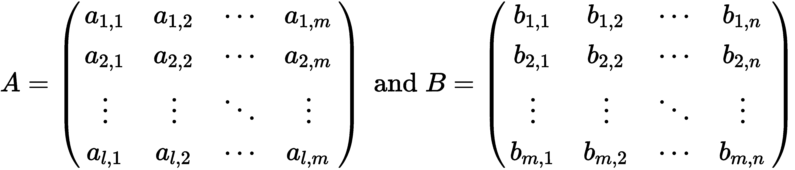
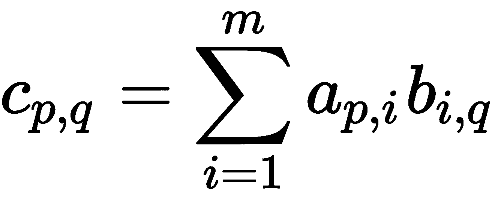
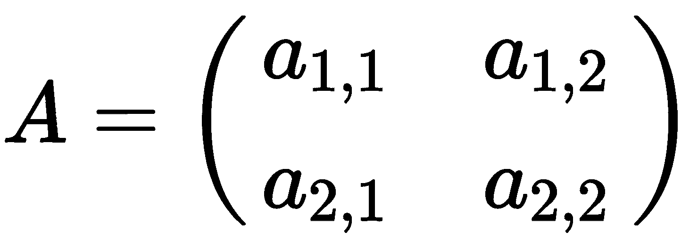
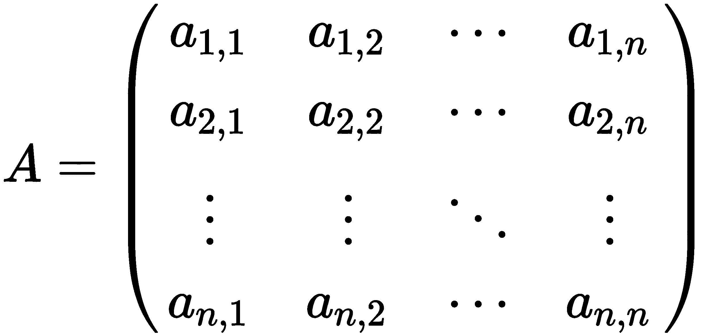
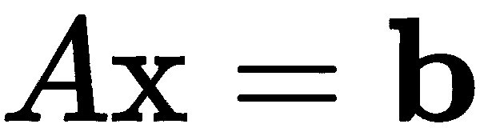
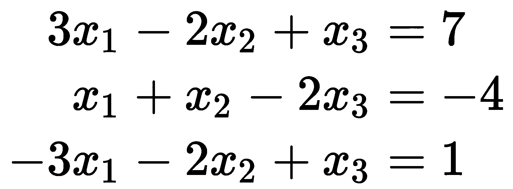
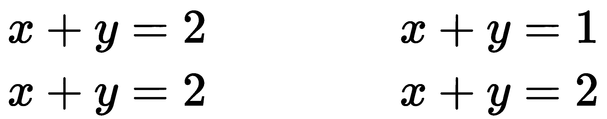
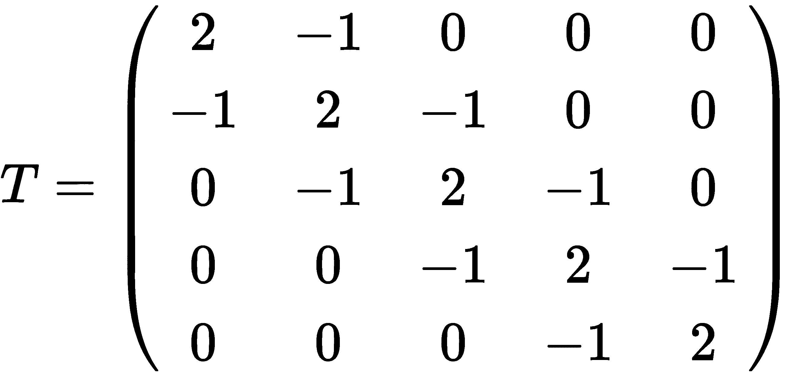

Basic Packages, Functions, and Concepts

在开始学习任何实用的方法之前，我们将使用本章的开头介绍几个核心的数学概念和结构以及它们的 Python 表示。特别是，我们将介绍基本的数值类型、基本的数学函数（三角函数、指数函数和对数）和矩阵。由于矩阵与线性方程组的解之间的联系，矩阵在大多数计算应用中是基本的。在本章中，我们将探讨其中的一些应用程序，但矩阵将在本书中扮演重要角色。

我们将按此顺序介绍以下主要主题：

*   Python 数字类型
*   基本数学函数
*   NumPy 阵列
*   矩阵

# 技术要求

在本章以及本书中，我们将使用 Python 版本 3.8，这是撰写本文时 Python 的最新版本。本书中的大部分代码都适用于 3.6 版 Python 的最新版本。我们将使用 Python3.6 在不同方面引入的特性，包括 f 字符串。这意味着您可能需要更改出现在任何终端命令中的`python3.8`，以匹配您的 Python 版本。这可能是 Python 的另一个版本，例如`python3.6`或`python3.7`，或者是更通用的命令，例如`python3`或`python`。对于后面的命令，需要使用以下命令检查 Python 版本是否至少为 3.6：

```py
          python --version

```

Python 具有内置的数值类型和基本数学函数，足以满足只涉及小型计算的小型应用程序。NumPy 包提供高性能数组类型和相关例程（包括在数组上高效运行的基本数学函数）。这个包将在本章和本书其余部分的许多食谱中使用。我们还将在本章后面的食谱中使用 SciPy 软件包。这两个都可以使用您首选的软件包管理器安装，例如`pip`：

```py
          python3.8 -m pip install numpy scipy

```

按照惯例，我们以较短的别名导入这些包。我们使用以下`import`语句将`numpy`作为`np`和`scipy`作为`sp`导入：

```py
import numpy as np
import scipy as sp
```

这些约定在这些软件包的官方文档中使用，以及使用这些软件包的许多教程和其他材料。

本章的代码可以在 GitHub 存储库的[的`Chapter 01`文件夹中找到 https://github.com/PacktPublishing/Applying-Math-with-Python/tree/master/Chapter%2001](https://github.com/PacktPublishing/Applying-Math-with-Python/tree/master/Chapter%2001) 。

查看以下视频以查看代码的运行：[https://bit.ly/3g3eBXv](https://bit.ly/3g3eBXv) 。

# Python 数字类型

Python 提供了基本的数字类型，例如任意大小的整数和浮点数（双精度）作为标准，但它还提供了一些额外的类型，这些类型在精度特别重要的特定应用程序中非常有用。Python 还提供（内置）对复数的支持，这对于一些更高级的数学应用程序很有用。

## 小数型

对于需要精确算术运算的十进制数字的应用程序，请使用 Python 标准库中`decimal`模块中的`Decimal`类型：

```py
from decimal import Decimal
num1 = Decimal('1.1')
num2 = Decimal('1.563')
num1 + num2  # Decimal('2.663')
```

使用 float 对象执行此计算得到的结果为 2.66300000000000003，其中包括一个小错误，这是由于某些数字不能使用 2 的有限幂和精确表示。例如，0.1 具有不终止的二进制扩展 0.000110011。因此，此数字的任何浮点表示都会带来一个小错误。注意，`Decimal`的参数是作为字符串而不是浮点数给出的。

`Decimal`类型基于 IBM 通用十进制算术规范（[http://speleotrove.com/decimal/decarith.html](http://speleotrove.com/decimal/decarith.html) ），这是浮点运算的替代规范，它使用 10 的幂而不是 2 的幂来精确表示十进制数。这意味着它可以安全地用于金融领域的计算，因为四舍五入误差的累积将产生可怕的后果。然而，`Decimal`格式的内存效率较低，因为它必须存储十进制数字而不是二进制数字（位），并且比传统的浮点数计算成本更高。

`decimal`包还提供了一个`Context`对象，它允许对`Decimal`对象的精度、显示和属性进行细粒度控制。可以使用`decimal`模块中的`getcontext`功能访问当前（默认）上下文。由`getcontext`返回的`Context`对象具有许多可以修改的属性。例如，我们可以设置算术运算的精度：

```py
from decimal import getcontext
ctx = getcontext()
num = Decimal('1.1')
num**4  # Decimal('1.4641')
ctx.prec = 4 # set new precision
num**4  # Decimal('1.464')
```

当我们将精度设置为`4`而不是默认的`28`时，我们看到 1.1 的四次方四舍五入为 4 位有效数字。

甚至可以使用`localcontext`函数在本地设置上下文，该函数返回一个上下文管理器，在`with`块末尾恢复原始环境：

```py
from decimal import localcontext
num = Decimal("1.1")
with localcontext() as ctx:
    ctx.prec = 2
    num**4  # Decimal('1.5')
num**4  # Decimal('1.4641')

```

这意味着可以在`with`块内自由修改上下文，并在最后返回默认值。

## 分数型

或者，对于需要精确表示整数分数的应用程序，例如在处理比例或概率时，Python 标准库中的`fractions`模块中有`Fraction`类型。用法类似，只是我们通常给出分数的分子和分母作为参数：

```py
from fractions import Fraction
num1 = Fraction(1, 3)
num2 = Fraction(1, 7)
num1 * num2  # Fraction(1, 21)
```

`Fraction`类型只存储两个整数，分子和分母，并且使用分数加法和乘法的基本规则执行算术。

## 复合型

Python 还支持复数，包括一个表示代码中复杂单元`1j`的文字字符。这可能不同于表示复数的习惯用法，您熟悉复数的其他来源。大多数数学文本通常使用符号*i*来表示复杂单元：

```py
z = 1 + 1j
z + 2  # 3 + 1j
z.conjugate()  # 1 - 1j
```

Python 标准库的`cmath`模块中提供了特殊的支持“复数”的数学函数。

# 基本数学函数

基本的数学函数出现在许多应用中。例如，对数可以用来缩放指数增长的数据，从而得到线性数据。在处理几何信息时，指数函数和三角函数是常见的固定装置，*伽马函数*出现在组合数学中，*高斯误差函数*在统计学*中很重要。*

Python 标准库中的`math`模块提供了所有的标准数学函数，以及常用常量和一些实用函数，可以使用以下命令导入：

```py
import math
```

导入后，我们可以使用此模块中包含的任何数学函数。例如，为了找到一个非负数的平方根，我们将使用`math`中的`sqrt`函数：

```py
import math
math.sqrt(4)  #  2.0
```

尝试使用带有否定参数的`sqrt`函数将引发 ValueError。此`sqrt`函数未定义负数的平方根，它只处理*实数*。负数的平方根这将是一个复数，可以使用 Python 标准库中`cmath`模块中的替代`sqrt`函数找到。

在`math`模块中，三角函数正弦、余弦和切线的常用缩写分别为`sin`、`cos`和`tan`。`pi`常数保持π的值，约为 3.1416：

```py
theta = pi/4
math.cos(theta)  # 0.7071067811865476
math.sin(theta)  # 0.7071067811865475
math.tan(theta)  # 0.9999999999999999
```

逆三角函数在`math`模块中命名为`acos`、`asin`和`atan`：

```py
math.asin(-1)  # -1.5707963267948966
math.acos(-1)  # 3.141592653589793
math.atan(1)  # 0.7853981633974483
```

`math`模块中的`log`函数执行对数运算。它有一个可选参数来指定对数的底（请注意，第二个参数仅是位置参数）。默认情况下，没有可选参数，它是以*e*为底的*自然对数*。*e*常数可通过`math.e`访问：

```py
math.log(10) # 2.302585092994046
math.log(10, 10) # 1.0
```

`math`模块还包含函数`gamma`，它是伽马函数，函数`erf`是高斯误差函数，它在统计中很重要。这两个函数都由积分定义。伽马函数由积分定义


误差函数的定义如下：


误差函数定义中的积分不能用微积分计算，必须用数值计算：

```py
math.gamma(5) # 24.0
math.erf(2) # 0.9953222650189527
```

除了三角函数、对数和指数函数等标准函数外，`math`模块还包含各种数量的理论函数和组合函数。这些包括功能`comb`和`factorial`，它们在各种应用中都很有用。如果顺序不重要，则使用参数*n*和*k*调用的`comb`函数返回从*n*集合中选择*k*项的方法数，无需重复。例如，先拾取 1 后拾取 2 与先拾取 2 后拾取 1 相同。这个数字有时写为*<sup>n</sup>C<sub>k</sub>*。用参数*n*调用的阶乘返回阶乘*n！=n（n-1）（n-2）*…1：

```py
math.comb(5, 2)  # 10
math.factorial(5)  # 120
```

将阶乘应用于负数会引发`ValueError`。整数*n、*的阶乘与伽马函数在*n+1*处的值一致；就是，


`math`模块还包含一个函数，该函数返回其参数`gcd`中的*最大公约数*。*a*和*b*的最大公约数是最大的整数*k*，因此*k*将*a*和*b*精确分开：

```py
math.gcd(2, 4)  # 2
math.gcd(2, 3)  # 1
```

还有许多用于处理浮点数的函数。`fsum`函数对一组数字进行加法运算，并跟踪每一步的总和，以减少结果中的误差。以下示例很好地说明了这一点：

```py
nums = [0.1]*10  # list containing 0.1 ten times
sum(nums)  # 0.9999999999999999
math.fsum(nums)  # 1.0
```

如果参数之间的差异小于容差，`isclose`函数返回`True`。这在单元测试中尤其有用，在单元测试中，基于机器架构或数据可变性的结果可能会有微小的变化。

最后，来自`math`的`floor`和`ceil`函数提供了它们的论点的底限。数字*x*的*楼层*是*f*与*f 的最大整数≤ x*，*x*的*上限*是*c*与*x 的最小整数≤ c*。在将一个数除以另一个数得到的浮点数与整数进行转换时，这些函数非常有用。

`math`模块包含用 C 实现的函数（假设您运行的是 CPython），因此比用 Python 实现的要快得多。如果需要将函数应用于相对较小的数字集合，则此模块是一个不错的选择。如果您想同时将这些函数应用于大量数据，最好使用 NumPy 包中的等效函数，这样对处理数组更有效。​ 通常，如果您已经导入了 NumPy 包，那么最好始终使用这些函数的 NumPy 等价物来限制出错的机会。

# NumPy 阵列

NumPy 提供了用于在 Python 中操作这些数组的高性能数组类型和例程。这些阵列对于处理性能至关重要的大型数据集非常有用。NumPy 是 Python 中数值和科学计算堆栈的基础。在后台，NumPy 利用低级库处理向量和矩阵，例如**基本线性代数子程序**（**BLAS**包，**线性代数包**（**LAPACK**包）包含更高级的线性代数例程。

传统上，NumPy 包是以较短的别名`np`导入的，可以使用以下`import`语句来完成：

```py
import numpy as np
```

特别是，NumPy 文档和更广泛的科学 Python 生态系统（SciPy、Pandas 等）中使用了此约定。

NumPy 库提供的基本类型是`ndarray`类型（以下称为 NumPy 数组）。通常，您不会创建自己的这种类型的实例，而是使用一个助手例程，如`array`来正确设置该类型。`array`例程从一个类似数组的对象创建 NumPy 数组，该对象通常是一个数字列表或一个（数字）列表。例如，我们可以通过提供包含所需元素的列表来创建一个简单数组：

```py
ary = np.array([1, 2, 3, 4])  # array([1, 2, 3, 4])
```

NumPy 数组类型（`ndarray`是一个围绕底层 C 数组结构的 Python 包装器。阵列操作是用 C 语言实现的，并针对性能进行了优化。NumPy 数组必须由同质数据组成（所有元素都具有相同的类型），尽管这种类型可以是指向任意 Python 对象的指针。如果没有使用`dtype`关键字参数显式提供适当的数据类型，NumPy 将在创建过程中推断出适当的数据类型：

```py
np.array([1, 2, 3, 4], dtype=np.float32)
# array([1., 2., 3., 4.], dtype=float32)
```

在引擎盖下，任何形状的 NumPy 数组都是一个缓冲区，包含作为平面（一维）数组的原始数据，以及指定元素类型等细节的附加元数据集合。

创建后，可以使用数组的`dtype`属性访问数据类型。修改`dtype`属性将产生不良后果，因为构成数组中数据的原始字节将被重新解释为新的数据类型。例如，如果我们使用 Python 整数创建一个数组，NumPy 将把这些整数转换为数组中的 64 位整数。更改`dtype`值将导致 NumPy 将这些 64 位整数重新解释为新的数据类型：

```py
arr = np.array([1, 2, 3, 4])
print(arr.dtype) # dtype('int64')
arr.dtype = np.float32
print(arr)
# [1.e-45 0.e+00 3.e-45 0.e+00 4.e-45 0.e+00 6.e-45 0.e+00]
```

每个 64 位整数都被重新解释为两个 32 位浮点数，这显然给出了无意义的值。相反，如果您希望在创建后更改数据类型，请使用`astype`方法指定新类型。更改数据类型的正确方法如下所示：

```py
arr = arr.astype(np.float32)
print(arr)
# [1\. 2\. 3\. 4.]
```

NumPy 还提供了许多用于创建各种标准阵列的例程。`zeros`例程创建一个指定形状的数组，其中每个元素都是`0`，而`ones`例程创建一个数组，其中每个元素都是`1`。

## 元素访问

NumPy 数组支持`getitem`协议，因此可以像访问列表一样访问数组中的元素，并支持所有的算术运算，这些运算是按组件执行的。这意味着我们可以使用索引表示法和索引从指定的索引中检索元素，如下所示：

```py
ary = np.array([1, 2, 3, 4])
ary[0]  # 1
ary[2]  # 3
```

这还包括用于从现有数组中提取数据数组的常用切片语法。数组的切片也是一个数组，包含切片指定的元素。例如，我们可以检索包含`ary`前两个元素的数组，或者检索包含偶数索引元素的数组，如下所示：

```py
first_two = ary[:2]  # array([1, 2])
even_idx = ary[::2]  # array([1, 3])
```

切片的语法为`start:stop:step`。我们可以省略`start`和`stop`中的任何一个或两者，分别从所有元素的开头或结尾开始。我们也可以省略`step`参数，在这种情况下，我们还可以删除尾随的`:`。`step`参数描述所选范围内应选择的元素。`1`值选择每一个元素，或者，如配方中一样，`2`值选择每一个第二个元素（从`0`开始给出偶数编号的元素）。此语法与切片 Python 列表的语法相同。

## 数组算法与函数

NumPy 提供了许多*通用函数*（ufunc），它们是可以在 NumPy 数组类型上高效运行的例程。特别是，在*基本数学函数*一节中讨论的所有基本数学函数在 NumPy 中都有可在 NumPy 阵列上运行的类似物。通用功能还可以执行*广播*，以允许它们在不同但兼容形状的阵列上操作。

NumPy 阵列上的算术运算是按组件执行的。以下示例最能说明这一点：

```py
arr_a = np.array([1, 2, 3, 4])
arr_b = np.array([1, 0, -3, 1])
arr_a + arr_b  # array([2, 2, 0, 5])
arr_a - arr_b  # array([0, 2, 6, 3])
arr_a * arr_b  # array([ 1, 0, -9, 4])
arr_b / arr_a  # array([ 1\. , 0\. , -1\. , 0.25])
arr_b**arr_a  # array([1, 0, -27, 1])
```

请注意，数组必须是相同的形状，这意味着具有相同的长度。在不同形状的数组上使用算术运算将导致`ValueError`。加法、减法、乘法或除以一个数字将生成一个数组，其中操作已应用于每个组件。例如，我们可以使用以下命令将数组中的所有元素乘以`2`：

```py
arr = np.array([1, 2, 3, 4])
new = 2*arr
print(new)
# [2, 4, 6, 8]
```

## 有用的数组创建例程

要在两个给定端点之间以固定间隔生成数字数组，可以使用`arange`例程或`linspace`例程。这两个例程之间的区别在于`linspace`在两个端点（包括两个端点）之间生成一个相等间距的数值（默认值为 50），而`arange`在给定步长下生成数值，最大不超过上限，但不包括上限。`linspace`例程在关闭间隔*a 中生成值≤ x≤ b*和`arange`例程在半开区间*a 中生成值≤ x<b*：

```py
np.linspace(0, 1, 5)  # array([0., 0.25, 0.5, 0.75, 1.0])
np.arange(0, 1, 0.3)  # array([0.0, 0.3, 0.6, 0.9])
```

请注意，使用`linspace`生成的数组正好有 5 个点，由第三个参数指定，包括两个端点`0`和`1`。`arange`生成的数组有 4 个点，不包括右端点`1`；0.3 的附加步长等于 1.2，大于 1。

## 高维阵列

NumPy 可以创建任意数量的维度数组，这些数组使用与简单一维数组相同的`array`例程创建。数组的维数由提供给`array`例程的嵌套列表数指定。例如，我们可以通过提供列表列表来创建二维数组，其中内部列表的每个成员都是一个数字，例如：

```py
mat = np.array([[1, 2], [3, 4]])
```

NumPy 数组有一个`shape`*属性，该属性描述每个维度中元素的排列。对于二维数组，形状可以解释为数组的行数和列数。*

 *NumPy 将该形状存储为数组对象上的`shape`属性，数组对象是一个元组。此元组中的元素数是维度数：

```py
vec = np.array([1, 2])
mat.shape  # (2, 2)
vec.shape  # (2,)
```

由于 NumPy 数组中的数据存储在平面（一维）数组中，因此只需更改关联的元数据，就可以以很小的成本重塑数组。这是在 NumPy 阵列上使用`reshape`方法完成的：

```py
mat.reshape(4,)  # array([1, 2, 3, 4])
```

请注意，元素的总数必须保持不变。矩阵`mat`原来有形状`(2, 2)`共 4 个元素，后者是形状`(4,)`的一维数组，同样有 4 个元素。当元素总数不匹配时，尝试重塑将导致`ValueError`。

要创建更高维度的数组，只需添加更多级别的嵌套列表。为了更清楚地说明这一点，在下面的示例中，在构造数组之前，我们将第三维中每个元素的列表分开：

```py
mat1 = [[1, 2], [3, 4]]
mat2 = [[5, 6], [7, 8]]
mat3 = [[9, 10], [11, 12]]
arr_3d = np.array([mat1, mat2, mat3])
arr_3d.shape  # (3, 2, 2)
```

Note that the first element of the shape is the outermost, and the last element is the innermost.

这意味着向数组添加额外维度只需提供相关元数据即可。使用`array`例程，通过参数中每个列表的长度来描述`shape`元数据。最外层列表的长度定义了该维度对应的`shape`参数，依此类推。

NumPy 数组内存中的大小与维数没有显著关系，而只与元素总数有关，元素总数是`shape`参数的乘积。但是，请注意，在高维数组中，元素的总数往往更大。

要访问多维数组中的元素，可以使用常用的索引表示法，但需要在每个维度中提供索引，而不是提供单个数字。对于 2×2 矩阵，这意味着指定所需元素的行和列：

```py
mat[0, 0]  # 1 - top left element
mat[1, 1]  # 4 - bottom right element
```

索引表示法还支持在每个维度中进行切片，因此我们可以使用切片`mat[:, 0]`提取单个列的所有成员，如下所示：

```py
mat[:, 0]
# array([1, 3])
```

请注意，切片的结果是一维数组。

数组创建函数`zeros`和`ones`可以通过简单地指定具有多个维度参数的形状来创建多维数组。

# 矩阵

NumPy 数组也用作*矩阵*，这是数学和计算编程的基础。*矩阵*只是一个二维数组。矩阵在许多应用中是核心，如几何变换和联立方程，但在其他领域（如统计学）中也是有用的工具。矩阵本身只有在我们为其配备了*矩阵运算*之后才具有独特性（与任何其他数组相比）。矩阵具有按元素的加减运算，就像 NumPy 数组一样，第三种运算称为*标量乘法*，其中我们将矩阵的每个元素乘以一个常量，以及*矩阵乘法*的不同概念。矩阵乘法从根本上不同于其他乘法概念，我们将在后面看到。

矩阵最重要的属性之一是其形状，其定义与 NumPy 数组完全相同。具有*m*行和*n*列的矩阵通常被描述为*m×n*矩阵。行数与列数相同的矩阵称为*平方*矩阵，这些矩阵在向量和矩阵理论中起着特殊作用。

*单位矩阵*（大小为*n*的）是*n×*n 矩阵，其中*i*、*i*第项为 1，*i*、*j*-第项为*i*为零≠ *j*。有一个数组创建例程，为指定的*n*值提供一个*n×n*单位矩阵：

```py
np.eye(3)
# array([[1., 0., 0.],
#        [0., 1., 0.],
#        [0., 0., 1.]])
```

## 基本方法和性质

有大量与矩阵相关的术语和数量。我们在这里只提到两个这样的属性，因为它们以后会很有用。这些是矩阵的*转置*，其中行和列是互换的，以及正方形矩阵的*轨迹*，它是沿着*前导对角线*的元素之和。主对角线由元素*a<sub>ii</sub>*组成，沿矩阵左上角到右下角的直线排列。

NumPy 数组可以通过调用`array`对象上的`transpose`方法轻松进行转置。事实上，由于这是一种常见的操作，数组有一个方便的属性`T`，返回矩阵的转置。换位反转矩阵（数组）形状的顺序，使行变为列，列变为行。例如，如果我们从一个 3×2 矩阵（3 行 2 列）开始，那么它的转置将是一个 2×3 矩阵，如以下示例中所示：

```py
mat = np.array([[1, 2], [3, 4]])
mat.transpose()
# array([[1, 3],
#       [2, 4]])
mat.T
# array([[1, 3],
#       [2, 4]])
```

与矩阵相关的另一个偶尔有用的量是*轨迹*。方阵*a*的轨迹与前面代码中的条目相同，定义为沿*主对角线的元素之和，该主对角线由左上角对角到右下角的元素组成。轨迹的公式如下所示：*

 *

NumPy 数组有一个返回矩阵跟踪的`trace`方法：

```py
A = np.array([[1, 2], [3, 4]])
A.trace()  # 5
```

也可以使用不绑定到数组的`np.trace`函数访问跟踪。

## 矩阵乘法

矩阵乘法是对两个矩阵执行的运算，它保留了两个矩阵的某些结构和特征。形式上，如果*A*是*l×m*矩阵，而*B*是*m×n*矩阵，那么



那么*A*和*B*的矩阵积*C*是一个*l×n*矩阵，其（*p*、*q*）第条分录由下式给出：



注意，为了定义矩阵乘法，第一个矩阵**的列数必须**与第二个矩阵的行数相匹配。对于*A*和*B 的矩阵积，如果定义了*，我们通常会写*AB*。矩阵乘法是一种特殊的运算。它不像大多数其他算术运算一样是*可交换的*：即使*AB*和*BA*都可以计算，也不需要它们相等。实际上，这意味着矩阵的乘法顺序很重要。这源于矩阵代数作为线性映射表示的起源，其中乘法对应于函数的组合。

Python 为矩阵乘法`@`保留了一个运算符，这是在 Python 3.5 中添加的。NumPy 数组实现了执行矩阵乘法的运算符。请注意，这与数组`*`的组件式乘法有根本不同：

```py
A = np.array([[1, 2], [3, 4]])
B = np.array([[-1, 1], [0, 1]])
A @ B
# array([[-1, 3], 
#        [-3, 7]])
A * B # different from A @ B
# array([[-1, 2], 
#        [ 0, 4]])
```

单位矩阵是矩阵乘法下的一个*中性元*。也就是说，如果*A*是任何*l×m*矩阵，并且*I*是*m*×*m*单位矩阵，那么*AI=A*。可以使用 NumPy 阵列轻松检查特定示例：

```py
A = np.array([[1, 2], [3, 4]])
I = np.eye(2)
A @ I
# array([[1, 2],
#        [3, 4]])
```

## 行列式与逆

方阵的*行列式*在大多数应用中都很重要，因为它与求矩阵的逆密切相关。如果行数和列数相等，则矩阵为*平方*。特别是，具有非零行列式的矩阵具有（唯一）逆，这转化为某些方程组的唯一解。矩阵的行列式是递归定义的。对于 2×2 矩阵



*A*的*行列式*由以下公式定义


对于一般的*n*×*n*矩阵



其中*n*>2，我们为 1 定义子矩阵*A<sub>i，j</sub>*≤ *i*、*j*≤ *n*，是从*A*中删除*i*第行和*j*第列的结果。子矩阵*A<sub>i，j</sub>*是一个*（n-1）×*（*n*-1）矩阵，因此我们可以计算行列式。然后我们将*A*的行列式定义为数量


事实上，前面等式中出现的索引 1 可以替换为任何 1≤ 我≤ *n*与结果相同。

用于计算矩阵行列式的 NumPy 例程包含在一个名为`linalg`的单独模块中。本模块包含*线性代数*的许多常用例程，这是涵盖向量和矩阵代数的数学分支。计算方阵行列式的例程为`det`例程：

```py
from numpy import linalg
linalg.det(A)  # -2.0000000000000004
```

请注意，在计算行列式时出现了浮点舍入错误。

The SciPy package, if installed, also offers a`linalg` module that extends NumPy's`linalg`. The SciPy version not only includes additional routines, but it is also always compiled with BLAS and LAPACK support, while for the NumPy version, this is optional. Thus, the SciPy variant may be preferable, depending on how NumPy was compiled, if speed is important.

*n×*n 矩阵*A*的*逆*是*n×**n*矩阵*B*的（必然唯一的）【T14 AB=*BA*=【T18 I】，其中【T20 I 表示*n×**n*单位矩阵，这里执行的乘法是矩阵乘法。不是每个方阵都有逆矩阵；那些不是的有时被称为*奇异*矩阵。事实上，当且仅当矩阵的行列式不是 0 时，矩阵是非奇异的（即具有逆矩阵）。当*A*有一个倒数时，通常用*A<sup>-1</sup>*来表示。

来自`linalg`模块的`inv`例程计算矩阵的逆矩阵（如果存在）：

```py
linalg.inv(A)
# array([[-2\. , 1\. ],
#        [ 1.5, -0.5]])
```

我们可以通过矩阵乘以（任一侧）逆并检查我们是否得到 2×2 单位矩阵来检查`inv`例程给出的矩阵是否确实是`A`的矩阵逆：

```py
Ainv = linalg.inv(A)
Ainv @ A
# Approximately
# array([[1., 0.],
#        [0., 1.]])
A @ Ainv
# Approximately
# array([[1., 0.],
#        [0., 1.]])
```

在这些计算中会有一个浮点错误，由于矩阵逆的计算方式，它被隐藏在`Approximately`注释后面。

`linalg`包还包含许多其他方法，如`norm`，用于计算矩阵的各种范数。它还包含以各种方式分解矩阵和求解方程组的函数。

还有指数函数`expm`、对数`logm`、正弦`sinm`、余弦`cosm`和切线`tanm`的矩阵类似物。请注意，这些函数与基本 NumPy 包中的标准`exp`、`log`、`sin`、`cos`和`tan`函数不同，这些函数逐个元素应用相应的函数。相反，矩阵指数函数是使用矩阵的“幂级数”定义的


其中*A*为*n×n*矩阵，*A<sup>k</sup>*为*A*的*k*th*矩阵幂*；即*A*矩阵自身乘以*k*次。注意，这个“幂级数”总是在适当的意义上收敛。按照惯例，我们取*A<sup>0</sup>*=*I*，其中*I*为*n×n*单位矩阵。这完全类似于实数或复数的指数函数的常用幂级数定义，但使用矩阵和矩阵乘法代替数字和（规则）乘法。其他函数以类似的方式定义，但我们将跳过细节。

## 方程组

解（线性）方程组是数学中研究矩阵的主要动机之一。这类问题经常出现在各种应用程序中。我们从一个线性方程组开始，写为


其中*n*至少为两个，*a<sub>i、j</sub>*<sub xmlns:epub="http://www.idpf.org/2007/ops">和*b<sub>i</sub>*是已知值，*x<sub>i</sub>*值是我们希望找到的未知值。</sub>

在我们能解出这样一个方程组之前，我们需要把这个问题转化为一个矩阵方程。这是通过将系数*a<sub>i，j</sub>*收集到一个*n×n*矩阵中，并利用矩阵乘法的特性将该矩阵与方程组关联来实现的。所以，让我们


是包含从方程中提取的系数的矩阵。然后，如果我们将**x**作为包含*x<sub>i</sub>*值的未知（列）向量，将**b**作为包含已知值*b<sub>i</sub>*的（列）向量，那么我们可以将方程组重写为单矩阵方程



我们现在可以用矩阵技术来解决这个问题。在这种情况下，我们将列向量视为一个*n×1*矩阵，因此前面等式中的乘法是矩阵乘法。为了解这个矩阵方程，我们使用`linalg`模块中的`solve`例程。为了说明该技术，我们将求解以下方程组作为示例：



这些方程有三个未知值，*x<sub>1</sub>*、*x<sub>2</sub>*和*x<sub>3</sub>*。首先，我们创建系数矩阵和向量**b**。由于我们使用 NumPy 作为处理矩阵和向量的方法，因此我们为矩阵*a*创建了二维 NumPy 数组，为**b**创建了一维数组：

```py
import numpy as np
from numpy import linalg

A = np.array([[3, -2, 1], [1, 1, -2], [-3, -2, 1]])
b = np.array([7, -4, 1])
```

现在，可以使用`solve`例程找到方程组的解：

```py
linalg.solve(A, b)  # array([ 1., -1., 2.])
```

这确实是方程组的解，可以通过计算`A @ x`并对照`b`数组检查结果来轻松验证。此计算中可能存在浮点舍入错误。

`solve`函数需要两个输入，即系数矩阵*A*和右侧向量**b**。它使用 LAPACK 例程解决方程组，将矩阵*A*分解为更简单的矩阵，以快速简化为更简单的问题，通过简单的替换即可解决。这种求解矩阵方程的技术非常强大和高效，并且不太容易出现困扰其他方法的浮点舍入错误。例如，如果逆矩阵*a*已知，则可通过（左侧）乘以矩阵*a*的逆矩阵来计算方程组的解。然而，这通常不如使用`solve`例程好，因为它可能较慢或导致更大的数值误差。

在我们使用的示例中，系数矩阵*A*是平方的。也就是说，方程的数量与未知值的数量相同。在这种情况下，当（且仅当）矩阵*a*的行列式不是 0 时，方程组具有唯一解。在*A*的行列式为 0 的情况下，可能发生以下两种情况之一：系统可能没有解，在这种情况下，我们说系统*不一致*；或者可以有无限多个解决方案。一致和不一致系统之间的差异通常由向量**b**确定。例如，考虑下列方程组：



左手方程组是一致的，有无穷多个解；例如，取*x*=1 和*y=1*或*x=0*和*y=2*都是解决方案。右边的方程组不一致，没有解。在上述两种情况下，`solve`例程将失败，因为系数矩阵是奇异的。

系数矩阵不需要为平方，系统才可解。例如，如果方程式多于未知值（系数矩阵的行数多于列数）。这样一个系统被认为是*超过了*，如果它是一致的，它将有一个解决方案。如果方程式少于未知值，则系统在规定条件下称为*。*在指定的方程组下，如果它们是一致的，通常会有无穷多个解，因为没有足够的信息来唯一指定所有未知值。不幸的是，`solve`例程将无法为系数矩阵不是平方的系统找到解，即使系统确实有解。

## 特征向量

考虑矩阵方程 Po.T0\. A，T1，T2，X，To，T3，To＝La，T4，x，To，T5。有解此方程的**x**的数字λ称为*特征值*，相应的向量**x**称为*特征向量。*特征值对和相应的特征向量编码关于矩阵*A*的信息，因此在出现矩阵的许多应用中都很重要。

我们将演示使用以下矩阵计算特征值和特征向量：


我们必须首先将其定义为 NumPy 数组：

```py
import numpy as np
from numpy import linalg
A = np.array([[3, -1, 4], [-1, 0, -1], [4, -1, 2]])
```

`linalg`模块中的`eig`例程用于查找方阵的特征值和特征向量。此例程返回一对`(v, B)`，其中`v`是包含特征值的一维数组，`B`是列为相应特征向量的二维数组：

```py
v, B = linalg.eig(A)
```

只有实数项的矩阵完全可能有复特征值和特征向量。因此，`eig`例程的返回类型有时会是复数类型，如`complex32`或`complex64`。在一些应用中，复特征值具有特殊的意义，而在其它应用中，我们只考虑实际特征值。

我们可以使用以下顺序从`eig`的输出中提取特征值/特征向量对：

```py
i = 0 # first eigenvalue/eigenvector pair
lambda0 = v[i]
print(lambda0)
# 6.823156164525971
x0 = B[:, i] # ith column of B
print(x0)
# array([ 0.73271846, -0.20260301, 0.649672352])

```

`eig`例程返回的特征向量被*归一化*，因此它们的范数（长度）为 1。（将*欧几里德范数*定义为数组成员的平方和的平方根。）我们可以通过使用`linalg`中的`norm`例程计算向量的范数来检查情况：

```py
linalg.norm(x0)  # 1.0  - eigenvectors are normalized.
```

最后，我们可以通过计算乘积`A @ x0`并检查在达到浮点精度时，该乘积是否等于`lambda0*x0`，来检查这些值是否确实满足特征值/特征向量对的定义：

```py
lhs = A @ x0
rhs = lambda0*x0
linalg.norm(lhs - rhs)  # 2.8435583831733384e-15 - very small.
```

此处计算的范数表示等式*A*x=λ**x**的左侧`lhs`和右侧`rhs`之间的“距离”。由于这个距离非常小（小数点后 0 到 14 位），我们可以相当确信它们实际上是相同的。这不是零的事实可能是由于浮点精度错误。

`eig`例程是低级 LAPACK 例程的包装，用于计算特征值和特征向量。求特征值和特征向量的理论步骤是首先通过求解方程来求特征值


其中*I*是合适的单位矩阵，用于求取λ值。左侧确定的方程为λ中的多项式，称为*a*的*特征多项式*。通过求解矩阵方程，可以找到相应的特征向量


其中λ*<sub>j</sub>*是已经找到的特征值之一。在实践中，这个过程有点低效，并且有其他策略可以更有效地计算特征值和特征向量。

特征值和特征向量的一个关键应用是*主成分分析*，这是减少大型复杂数据集以更好地理解内部结构的关键技术。

我们只能计算方阵的特征值和特征向量；对于非平方矩阵，该定义没有意义。将特征值和特征值推广到非方矩阵，称为*奇异值*。

## 稀疏矩阵

前面讨论过的线性方程组在整个数学中，尤其是在数学计算中非常常见。在许多应用中，系数矩阵将非常大，有数千行和数千列，并且可能从其他来源获得，而不是简单地手工输入。在许多情况下，它也将是一个*稀疏*矩阵，其中大多数条目为 0。

若大量元素为零，则矩阵为*稀疏*。为了调用矩阵稀疏，需要为零的元素的确切数量没有很好的定义。稀疏矩阵可以更有效地表示，例如，通过简单地存储索引（*i*、*j*）和非零的值*a<sub>i、j</sub>*。假设矩阵确实足够稀疏，那么稀疏矩阵的所有算法都可以极大地提高性能。

稀疏矩阵出现在许多应用中，通常遵循某种模式。特别是，求解**偏微分方程**（**PDEs**）的几种技术涉及求解稀疏矩阵方程（参见[第 3 章](03.html)、*微积分和微分方程】*，与网络相关的矩阵通常是稀疏的。`sparse.csgraph`模块中包含与网络（图）相关的稀疏矩阵的附加例程。我们将在[第 5 章](05.html)*中进一步讨论这些问题，使用树和网络*。

`sparse`模块包含几个不同的类，表示存储稀疏矩阵的不同方法。存储稀疏矩阵的最基本方法是存储三个数组，其中两个包含表示非零元素索引的整数，第三个包含对应元素的数据。这是`coo_matrix`类的格式。然后是压缩列 CSC（`csc_matrix`和压缩行 CSR（`csr_matrix`格式，它们分别提供有效的列或行切片。`sparse`中还有三个额外的稀疏矩阵类，包括`dia_matrix`，它们有效地存储非零项沿对角线带出现的矩阵。

SciPy 的`sparse`模块包含用于创建和使用稀疏矩阵的例程。我们使用以下`import`语句从 SciPy 导入`sparse`模块：

```py
import numpy as np
from scipy import sparse
```

稀疏矩阵可以从完整（密集）矩阵或其他类型的数据结构中创建。这是使用特定格式的构造函数完成的，您希望以该格式存储稀疏矩阵。

例如，我们可以使用以下命令获取密集矩阵并以 CSR 格式存储：

```py
A = np.array([[1., 0., 0.], [0., 1., 0.], [0., 0., 1.]])
sp_A = sparse.csr_matrix(A)
```

如果手动生成稀疏矩阵，则该矩阵可能遵循某种模式，例如以下*三对角*矩阵：



在这里，非零条目出现在对角线上和对角线两侧，每行中的非零条目遵循相同的模式。为了创建这样一个矩阵，我们可以使用`sparse`中的一个数组创建例程，例如`diags`，这是一个方便的例程，用于创建具有对角模式的矩阵：

```py
T = sparse.diags([-1, 2, -1], (-1, 0, 1), shape=(5, 5), format="csr")
```

这将创建前面描述的矩阵*T*，并以压缩稀疏行 CSR 格式将其存储为稀疏矩阵。第一个参数指定应出现在输出矩阵中的值，第二个参数是相对于应放置值的对角线位置的位置。所以元组中的 0 索引表示对角线条目，-1 位于行中对角线的左侧，+1 位于行中对角线的右侧。`shape`关键字参数给出生成矩阵的维度，`format`指定矩阵的存储格式。如果使用可选参数未提供格式，则将使用合理的默认值。阵列`T`可以通过`toarray`方法扩展成完整的*密集*矩阵：

```py
T.toarray()
# array([[ 2, -1,  0,  0,  0],
#        [-1,  2, -1,  0,  0],
#        [ 0, -1,  2, -1,  0],
#        [ 0,  0, -1,  2, -1],
#        [ 0,  0,  0, -1,  2]])
```

当矩阵很小时（如这里所示），稀疏求解例程与常规求解例程之间的性能差别很小。

矩阵以稀疏格式存储后，我们可以使用`sparse`的`linalg`子模块中的稀疏求解例程。例如，我们可以使用本模块中的`spsolve`例程求解矩阵方程。`spsolve`例程将矩阵转换为 CSR 或 CSC，如果没有以以下格式之一提供，可能会增加计算时间：

```py
from scipy.sparse import linalg
linalg.spsolve(T.tocsr(), np.array([1, 2, 3, 4, 5]))
# array([ 5.83333333, 10.66666667, 13.5 , 13.33333333, 9.16666667])
```

`sparse.linalg`模块还包含 NumPy（或 SciPy）的`linalg`模块中可以找到的许多例程，它们接受稀疏矩阵而不是完整的 NumPy 数组，例如`eig`和`inv`。

# 总结

Python 通过一些基本的数值类型、算术和基本的数学函数提供了对数学的内置支持。但是，对于涉及大型数值数组的更严肃的计算，应该使用 NumPy 和 SciPy 软件包。NumPy 提供了高性能的数组类型和基本例程，而 SciPy 提供了用于求解方程和处理稀疏矩阵（以及其他许多事情）的更具体的工具。

NumPy 阵列可以是多维的。特别是，二维数组具有矩阵属性，可以使用 NumPy 或 SciPy 的`linalg`模块访问这些属性（前者是后者的子集）。此外，Python 中还有一个用于矩阵乘法的特殊运算符`@`，它是为 NumPy 数组实现的。

在下一章中，我们将开始看一些食谱。

# 进一步阅读

有许多数学教科书描述了矩阵和线性代数的基本性质，即向量和矩阵的研究。*Blyth，T.和 Robertson，E.（2013）是一篇很好的介绍性文章。基本线性代数**。伦敦：斯普林格伦敦有限公司*。

NumPy 和 SciPy 是 Python 数学和科学计算生态系统的一部分，拥有大量文档，可从官方网站[访问 https://scipy.org](https://scipy.org) 。我们将在本书中看到这个生态系统中的其他几个包。

有关 NumPy 和 SciPy 在幕后使用的 BLAS 和 LAPACK 库的更多信息，请访问以下链接：BLAS:[https://www.netlib.org/blas/](https://www.netlib.org/blas/) 和 LAPACK:[https://www.netlib.org/lapack/](https://www.netlib.org/lapack/) 。**