# 七、回归和预测

统计学家或数据科学家最重要的任务之一是系统地理解两组数据之间的关系。这可能意味着两组数据之间的“连续”关系，其中一个值直接取决于另一个变量的值。或者，它可以表示分类关系，其中一个值根据另一个值进行分类。处理这类问题的工具是*回归*。回归最基本的形式是通过两组数据的散点图拟合一条直线，并进行一些分析，以确定这条直线“拟合”数据的程度。当然，我们通常需要更复杂的东西来模拟现实世界中存在的更复杂的关系。

时间序列代表这些回归类型问题的一个特殊类别，其中我们有一个在一段时间内不断变化的值。与更简单的问题不同，时间序列数据通常在连续值之间具有复杂的依赖关系；例如，一个值可能取决于前两个值，甚至可能取决于前一个“噪波”。时间序列建模在科学和经济学中都很重要，有各种各样的工具来建模时间序列数据。处理时间序列数据的基本技术称为**ARIMA**，代表**自回归综合移动平均值**。该模型包含两个基本组件，一个**自回归**（**AR****组件和一个**移动平均值**（**MA**组件），以构建观测数据的模型。**

 **在本章中，我们将学习如何对两组数据之间的关系进行建模，量化这种关系的强度，并对其他值（未来）进行预测。然后，我们将学习如何使用逻辑回归，这是一个简单的线性模型的变化，在分类问题。最后，我们将使用 ARIMA 为时间序列数据建立模型，并在这些模型的基础上为不同类型的数据建立模型。我们将通过使用一个名为 Prophet 的库自动生成时间序列数据的模型来完成本章。

在本章中，我们将介绍以下配方：

*   使用基本线性回归
*   使用多元线性回归
*   对数回归分类
*   时间序列数据的 ARMA 建模
*   基于 ARIMA 的时间序列数据预测
*   利用 ARIMA 预测季节数据
*   用 Prophet 建模时间序列

让我们开始吧！

# 技术要求

在本章中，我们通常需要以别名`np`导入 NumPy 包，以`plt`导入 Matplotlib`pyplot`模块，以`pd`导入 Pandas 包。我们可以使用以下命令执行此操作：

```py
import numpy as np
import matplotlib.pyplot as plt
import pandas as pd
```

在本章中，我们还需要一些新的软件包。statsmodels 软件包用于回归和时间序列分析，`scikit-learn`软件包（`sklearn`提供通用数据科学和机器学习工具，Prophet 软件包（`fbprophet`用于自动建模时间序列数据。可以使用您喜爱的软件包管理器安装这些软件包，例如`pip`：

```py
          python3.8 -m pip install statsmodels sklearn fbprophet

```

Prophet 软件包由于其依赖性，很难安装在某些操作系统上。如果安装`fbprophet`导致出现问题，您可能希望尝试使用 Python 的 Anaconda 发行版及其包管理器`conda`，后者更严格地处理依赖关系：

```py
          conda install fbprophet

```

最后，我们还需要一个名为`tsdata`的小模块，它包含在本章的存储库中。此模块包含一系列用于生成样本时间序列数据的实用程序。

本章的代码可以在 GitHub 存储库的[的`Chapter 07`文件夹中找到 https://github.com/PacktPublishing/Applying-Math-with-Python/tree/master/Chapter%2007](https://github.com/PacktPublishing/Applying-Math-with-Python/tree/master/Chapter%2007) 。

查看以下视频以查看代码的运行：[https://bit.ly/2Ct8m0B](https://bit.ly/2Ct8m0B) 。

# 使用基本线性回归

线性回归是一种建模两组数据之间依赖关系的工具，因此我们最终可以使用该模型进行预测。这个名字来源于这样一个事实：我们基于第二个数据集形成一组数据的线性模型（直线）。在文献中，我们希望建模的变量通常称为*响应*变量，我们在该模型中使用的变量是*预测*变量。

在这个配方中，我们将学习如何使用 statsmodels 包执行简单的线性回归来建模两组数据之间的关系。

## 准备

对于这个配方，我们需要以别名`sm`导入 statsmodels`api`模块，以`np`导入 NumPy 包，以`plt`导入 Matplotlib`pyplot`模块，以及 NumPy 默认随机数生成器的实例。所有这些都可以通过以下命令实现：

```py
import statsmodels.api as sm
import numpy as np
import matplotlib.pyplot as plt
from numpy.random import default_rng
rng = default_rng(12345)
```

## 怎么做。。。

以下步骤概述了如何使用 statsmodels 包对两组数据执行简单线性回归：

1.  首先，我们生成一些可以分析的示例数据。我们将生成两组数据来说明良好拟合和较差拟合：

```py
x = np.linspace(0, 5, 25)
rng.shuffle(x)
trend = 2.0
shift = 5.0
y1 = trend*x + shift + rng.normal(0, 0.5, size=25)
y2 = trend*x + shift + rng.normal(0, 5, size=25)
```

2.  执行回归分析的第一步是创建数据集的散点图。我们将在同一组轴上执行此操作：

```py
fig, ax = plt.subplots()
ax.scatter(x, y1, c="b", label="Good correlation")
ax.scatter(x, y2, c="r", label="Bad correlation")
ax.legend()
ax.set_xlabel("X"),
ax.set_ylabel("Y")
ax.set_title("Scatter plot of data with best fit lines")
```

3.  我们需要使用`sm.add_constant`实用程序，以便建模步骤将包括一个常量值：

```py
pred_x = sm.add_constant(x)
```

4.  现在，我们可以为第一组数据创建一个`OLS`模型，并使用`fit`方法来拟合该模型。然后，我们使用`summary`方法打印数据摘要：

```py
model1 = sm.OLS(y1, pred_x).fit()
print(model1.summary())
```

5.  我们对第二组数据重复模型拟合，并打印摘要：

```py
model2 = sm.OLS(y2, pred_x).fit()
print(model2.summary())
```

6.  现在，我们使用`linspace`创建一个新的*x*值范围，我们可以使用它在散点图上绘制趋势线。我们需要添加`constant`列以与我们创建的模型交互：

```py
model_x = sm.add_constant(np.linspace(0, 5))
```

7.  接下来，我们在模型对象上使用`predict`方法，以便我们可以使用该模型预测我们在上一步中生成的*x*每个值的响应值：

```py
model_y1 = model1.predict(model_x)
model_y2 = model2.predict(model_x)
```

8.  最后，我们在散点图顶部绘制前两步计算的模型数据：

```py
ax.plot(model_x[:, 1], model_y1, 'b')
ax.plot(model_x[:, 1], model_y2, 'r')
```

散点图以及我们添加的最佳拟合线（模型）如下图所示：


Figure 7.1: Scatter plot of data with lines of best fit computed using least squares regression

## 它是如何工作的。。。

初等数学告诉我们，直线方程由以下公式给出：

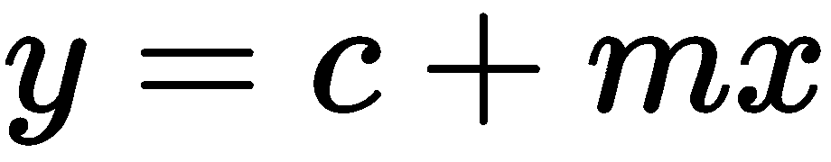

这里，*c*是直线与*y*轴相交的值，通常称为*y**截距*，*m*是直线的*坡度*。在线性回归上下文中，我们试图找到响应变量*Y*和预测变量*X*之间的关系，其具有直线形式，因此发生以下情况：


在这里，*c*和*m*现在是要找到的参数。我们可以用不同的方式来写，如下所示：


这里，*E*是一个错误项，通常取决于*X*。为了找到“最佳”模型，我们需要找到*c*和*m*参数的值，对于这些参数，误差项*E*最小（在适当的意义上）。求取参数值以使误差最小化的基本方法是最小二乘法，它为此处使用的回归类型命名为：*普通最小二乘法*。一旦我们使用这种方法在响应变量和预测变量之间建立了某种关系，我们的下一个任务就是评估这个模型实际代表这种关系的程度。为此，我们通过以下等式得出*残差*：

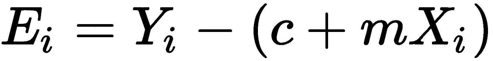

我们对每个数据点，*X<sub>i</sub>*和*Y<sub>i</sub>*执行此操作。为了对数据之间的关系进行建模，提供严格的统计分析，我们需要残差来满足某些假设。首先，我们需要它们在概率意义上是独立的。第二，我们需要它们是正态分布，大约为 0，有一个共同的方差。（在实践中，我们可以稍微放宽这些限制，仍然可以对模型的准确性做出合理的评论。）

在此配方中，我们使用线性关系从预测数据生成响应数据。我们创建的两个响应数据集之间的差异是每个值处错误的“大小”。对于第一个数据集`y1`，残差正态分布，标准偏差为 0.5，而对于第二个数据集`y2`，残差的标准偏差为 5.0。我们可以在*图 7.1*中所示的散点图中看到这种变化，其中`y1`的数据通常非常接近最佳拟合线——这与用于生成数据的实际关系非常吻合——而`y2`的数据离最佳拟合线远得多。

statsmodels 包中的`OLS`对象是普通最小二乘回归的主界面。我们以数组的形式提供响应数据和预测数据。为了在模型中有一个常数项，我们需要在预测数据中添加一列常数项。`sm.add_constant`例程是添加此常量列的简单实用程序。`OLS`类的`fit`方法计算模型的参数，并返回一个结果对象（`model1`和`model2`，其中包含最佳拟合模型的参数。`summary`方法创建一个字符串，其中包含关于模型的信息和关于拟合优度的各种统计信息。`predict`方法将模型应用于新数据。顾名思义，它可以用于使用该模型进行预测。

摘要中除了参数值本身之外，还报告了两个统计信息。第一个是*R<sup>2</sup>*值，或调整后的版本，用于测量模型解释的总可变性的可变性。此值将介于 0 和 1 之间。值越高表示拟合效果越好。第二个是 F 统计 p 值，表示模型的总体意义。与方差分析测试一样，小 F 统计表明该模型具有显著性，这意味着该模型更有可能对数据进行精确建模。

在该配方中，第一个模型`model1`的调整后*R<sup>2</sup>*值为 0.986，表明该模型与数据非常接近，p 值为 6.43e-19，表明显著性较高。第二个模型的调整后的*R<sup>2</sup>*值为 0.361，表示模型与数据的拟合程度较低；p 值为 0.000893，表示显著性较高。尽管第二个模型与数据的拟合程度较低，但就统计而言，这并不是说它没有用处。该模型仍然是重要的，尽管比第一个模型要小，但它并没有考虑到数据中的所有可变性（或至少是其中的一个重要部分）。这可能表明数据中存在其他（非线性）结构，或者数据相关性较小，这意味着响应和预测数据之间的关系较弱（由于我们构建数据的方式，我们知道后者是正确的）。

## 还有更多。。。

简单线性回归是统计学家工具箱中一个很好的通用工具。它非常适合于发现已知（或怀疑）以某种方式连接的两组数据之间关系的性质。一组数据对另一组数据依赖程度的统计度量称为*相关性*。我们可以使用相关系数来衡量相关性，比如*斯皮尔曼等级相关系数*。高正相关系数表示数据之间存在强正关系，如本配方中所示，而高负相关系数表示强负关系，其中通过数据的最佳拟合线斜率为负。相关系数为 0 表示数据不相关：数据之间没有关系。

如果数据集明显相关，但不是线性（直线）关系，则可能遵循多项式关系，例如，其中一个值与另一个平方相关。有时，可以对一组数据应用变换（如对数），然后使用线性回归拟合变换后的数据。当两组数据之间存在幂律关系时，对数尤其有用。

# 使用多元线性回归

如前一个配方中所示，简单线性回归非常适合于生成一个响应变量和一个预测变量之间关系的简单模型。不幸的是，更常见的是，只有一个响应变量依赖于许多预测变量。此外，我们可能不知道集合中的哪些变量是好的预测变量。对于这项任务，我们需要多线性回归。

在这个配方中，我们将学习如何使用多线性回归来探索一个响应变量和几个预测变量之间的关系。

## 准备

对于此配方，我们需要将 NumPy 包作为`np`导入，将 Matplotlib`pyplot`模块作为`plt`导入，将 Pandas 包作为`pd`导入，并使用以下命令创建 NumPy 默认随机数生成器的实例：

```py
from numpy.random import default_rng
rng = default_rng(12345)
```

我们还需要将 statsmodels`api`模块导入为`sm`，可以使用以下命令导入：

```py
import statsmodels.api as sm
```

## 怎么做。。。

以下步骤向您展示了如何使用多线性回归来探索几个预测因子与响应变量之间的关系：

1.  首先，我们需要创建预测数据进行分析。这将采取熊猫`DataFrame`的形式，有四个术语。在此阶段，我们将通过添加一列“1”来添加常量项：

```py
p_vars = pd.DataFrame({
"const": np.ones((100,)),
"X1": rng.uniform(0, 15, size=100),
"X2": rng.uniform(0, 25, size=100),
"X3": rng.uniform(5, 25, size=100)
})

```

2.  接下来，我们将仅使用前两个变量生成响应数据：

```py
residuals = rng.normal(0.0, 12.0, size=100)
Y = -10.0 + 5.0*p_vars["X1"] - 2.0*p_vars["X2"] + residuals
```

3.  现在，我们将针对每个预测变量生成响应数据的散点图：

```py
fig, (ax1, ax2, ax3) = plt.subplots(1, 3, sharey=True,
   tight_layout=True)
ax1.scatter(p_vars["X1"], Y)
ax2.scatter(p_vars["X2"], Y)
ax3.scatter(p_vars["X3"], Y)

```

4.  然后，我们将向每个散点图添加轴标签和标题，因为这是一种良好的做法：

```py
ax1.set_title("Y against X1")
ax1.set_xlabel("X1")
ax1.set_ylabel("Y")
ax2.set_title("Y against X2")
ax2.set_xlabel("X2")
ax3.set_title("Y against X3")
ax3.set_xlabel("X3")
```

```py
        下图显示了结果图：
        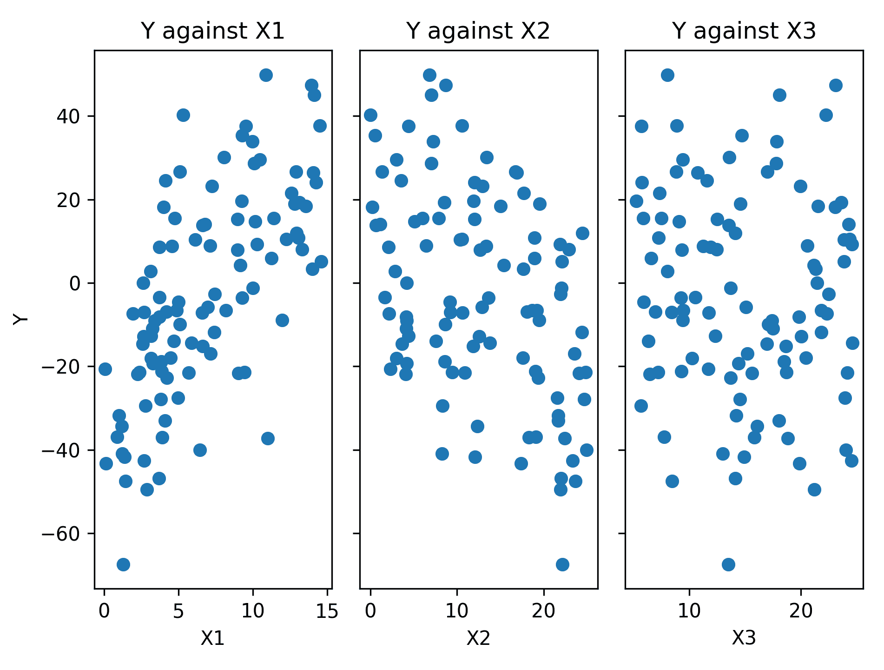
        Figure 7.2: Scatter plots of the response data against each of the predictor variables
        如我们所见，响应数据与前两个预测列`X1`和`X2`之间似乎存在某种相关性。鉴于我们如何生成数据，这就是我们所期望的。

          5.  我们使用相同的`OLS`类执行多线性回归；即提供响应阵列和预测器`DataFrame`：

```
model = sm.OLS(Y, p_vars).fit()
print(model.summary())
```py

        `print`语句的输出如下：

```
                    OLS Regression Results 
==================================================================
Dep. Variable: y                  R-squared: 0.770
Model: OLS Adj.                   R-squared: 0.762
Method: Least Squares             F-statistic: 106.8
Date: Thu, 23 Apr 2020            Prob (F-statistic): 1.77e-30
Time: 12:47:30                    Log-Likelihood: -389.38
No. Observations: 100             AIC: 786.8
Df Residuals: 96                  BIC: 797.2
Df Model: 3 
Covariance Type: nonrobust 
===================================================================
         coef    std err     t      P>|t|      [0.025     0.975]
-------------------------------------------------------------------
const   -9.8676    4.028   -2.450    0.016     -17.863    -1.872
X1       4.7234    0.303    15.602   0.000       4.122     5.324
X2      -1.8945    0.166   -11.413   0.000     -2.224     -1.565
X3      -0.0910    0.206   -0.441    0.660     -0.500      0.318
===================================================================
Omnibus: 0.296                Durbin-Watson: 1.881
Prob(Omnibus): 0.862          Jarque-Bera (JB): 0.292
Skew: 0.123                   Prob(JB): 0.864
Kurtosis: 2.904               Cond. No. 72.9
===================================================================
```py

        在汇总数据中，我们可以看到`X3`变量不显著，因为其 p 值为 0.66。

          6.  由于第三个预测变量不显著，我们删除该列并再次执行回归：

```
second_model = sm.OLS(Y, p_vars.loc[:, "const":"X2"]).fit()
print(second_model.summary())

```py

        这导致拟合优度统计数据略有增加。
        它是如何工作的。。。
        多线性回归的工作原理与简单线性回归基本相同。我们在这里遵循与前一个配方相同的过程，其中我们使用 statsmodels 包将多线性模型拟合到数据中。当然，在幕后也有一些不同之处。我们使用多线性回归生成的模型在形式上与前面配方中的简单线性模型非常相似。其形式如下：
        
        此处，*Y*为响应变量，*X<sub>i</sub>*为预测变量，*E*为误差项，*β*<sub>*i*</sub>为待计算参数。在这种情况下，同样的要求也是必要的：残差必须是独立的，正态分布，平均值为 0，标准偏差为公共标准偏差。
        在这个配方中，我们提供的预测数据是熊猫`DataFrame`，而不是普通的 NumPy 数组。请注意，我们打印的摘要数据中采用了列的名称。与第一个配方不同，*使用基本线性回归*，我们在`DataFrame`中包含常量列，而不是使用 statsmodels 中的`add_constant`实用程序。
        在第一次回归的输出中，我们可以看到该模型是一个相当好的拟合，调整后的*R<sup>2</sup>*值为 0.762，并且具有高度显著性（我们可以通过查看回归 F 统计 p 值看到这一点）。然而，仔细观察各个参数，我们可以看到前两个预测值都是显著的，但常数和第三个预测值则不太显著。特别是，第三个预测参数`X3`与 0 没有显著差异，p 值为 0.66。考虑到我们的反应数据是在没有使用这个变量的情况下构建的，这不应该令人惊讶。在分析的最后一步，我们在没有预测变量`X3`的情况下重复回归，这是对拟合的轻微改善。
        对数回归分类
        对数回归解决了与普通线性回归不同的问题。它通常用于分类问题，通常，我们希望根据一些预测变量将数据分为两个不同的组。这种技术的基础是使用对数执行的转换。将原来的分类问题转化为一个为**对数赔率***构建模型的问题。*该模型可用简单线性回归完成。我们将逆变换应用于线性模型，这为我们提供了一个模型，即给定预测数据，预期结果将发生的概率。我们在这里应用的转换称为**逻辑函数**，它为该方法命名。然后，我们获得的概率可以用于我们最初打算解决的分类问题。
        在本食谱中，我们将学习如何执行逻辑回归，并在分类问题中使用此技术。
        准备
        对于此配方，我们需要使用以下命令创建 NumPy 默认随机数生成器的实例：NumPy 包导入为`np`、Matplotlib`pyplot`模块导入为`plt`、熊猫包导入为`pd`：

```
from numpy.random import default_rng
rng = default_rng(12345)
```py

        我们还需要`scikit-learn`包中的几个组件来执行逻辑回归。可以按如下方式导入这些文件：

```
from sklearn.linear_model import LogisticRegression
from sklearn.metrics import classification_report
```py

        怎么做。。。
        按照以下步骤使用逻辑回归来解决一个简单的分类问题：

          1.  首先，我们需要创建一些样本数据，用于演示如何使用逻辑回归。我们首先创建预测变量：

```
df = pd.DataFrame({
    "var1": np.concatenate([rng.normal(3.0, 1.5, size=50),
        rng.normal(-4.0, 2.0, size=50)]),
    "var2": rng.uniform(size=100),
    "var3": np.concatenate([rng.normal(-2.0, 2.0, size=50),
        rng.normal(1.5, 0.8, size=50)])
})
```py

          2.  现在，我们使用三个预测变量中的两个，将响应变量创建为一系列布尔值：

```
score = 4.0 + df["var1"] - df["var3"]
Y = score >= 0
```py

          3.  接下来，我们将`var3`数据与`var1`数据的点散点图（根据响应变量进行样式化），这些点是用于构建响应变量的变量：

```
fig1, ax1 = plt.subplots()
ax1.plot(df.loc[Y, "var1"], df.loc[Y, "var3"], "bo", label="True 
   data")
ax1.plot(df.loc[~Y, "var1"], df.loc[~Y, "var3"], "rx", label="False
   data")
ax1.legend()
ax1.set_xlabel("var1")
ax1.set_ylabel("var3")
ax1.set_title("Scatter plot of var3 against var1")
```py

        下图显示了结果图：
        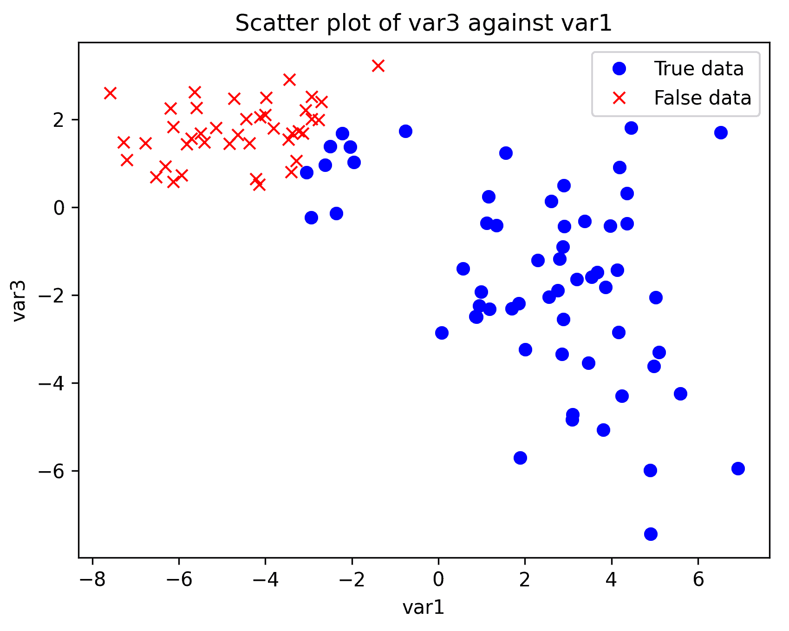
        Figure 7.3: Scatter plot of the var3 data against var1, with classification marked

          4.  接下来，我们从`scikit-learn`包中创建一个`LogisticRegression`对象，并将模型与我们的数据相匹配：

```
model = LogisticRegression()
model.fit(df, Y)
```py

          5.  接下来，我们准备一些不同于我们用来拟合模型的额外数据，以测试我们模型的准确性：

```
test_df = pd.DataFrame({
    "var1": np.concatenate([rng.normal(3.0, 1.5, size=50),
        rng.normal(-4.0, 2.0, size=50)]),
    "var2": rng.uniform(size=100),
    "var3": np.concatenate([rng.normal(-2.0, 2.0, size=50),
        rng.normal(1.5, 0.8, size=50)])
})
test_scores = 4.0 + test_df["var1"] - test_df["var3"]
test_Y = test_scores >= 0
```py

          6.  然后，我们根据我们的逻辑回归模型生成预测结果：

```
test_predicts = model.predict(test_df)
```py

          7.  最后，我们使用`scikit-learn`中的`classification_report`实用程序根据已知响应值打印预测分类摘要，以测试模型的准确性。我们将此摘要打印到终端：

```
print(classification_report(test_Y, test_predicts))
```py

        此例程生成的报告如下所示：

```
                 precision     recall      f1-score      support

       False       1.00        1.00         1.00          18
        True       1.00        1.00         1.00          32

    accuracy                                1.00          50
   macro avg       1.00        1.00         1.00          50
weighted avg       1.00        1.00         1.00          50
```py

        它是如何工作的。。。
        Logistic 回归通过形成*对数优势*比率*（*或*logit*的线性模型来工作，对于单个预测变量*x*，其具有以下形式：
        
        这里，*p*（*x*）表示对给定预测因子*x*作出反应的真实结果的概率。重新排列这会使概率的逻辑函数发生变化：
        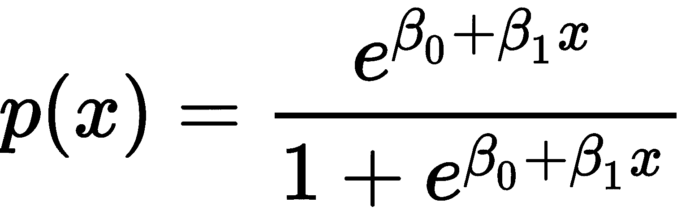
        使用最大似然法估计对数优势的参数。
        `scikit-learn`中`linear_model`模块的`LogisticRegression`类是逻辑回归的一个实现，非常容易使用。首先，我们使用我们需要的任何自定义参数创建这个类的一个新模型实例，然后在此对象上使用`fit`方法将模型拟合（或训练）到样本数据。拟合完成后，我们可以访问使用`get_params`方法估算的参数。
        拟合模型上的`predict`方法允许我们传入新的（看不见的）数据，并对每个样本的分类进行预测。我们还可以使用`predict_proba`方法得到逻辑函数实际给出的概率估计。
        一旦我们建立了预测数据分类的模型，我们就需要验证该模型。这意味着我们必须用一些以前看不见的数据测试模型，并检查它是否正确地对新数据进行分类。为此，我们可以使用`classification_report`，它获取一组新数据和模型生成的预测，并计算模型正确预测的数据比例。这是模型的*精度*。
        我们使用`scikit-learn`实用程序生成的分类报告将预测结果与已知响应值进行比较。这是在使用模型进行实际预测之前验证模型的常用方法。在这个配方中，我们看到每个类别（`True`和`False`的报告精度为 1.00，这表明该模型在使用该数据预测分类方面表现完美。实际上，模型的精度不太可能达到 100%。
        还有更多。。。
        有许多软件包提供了使用逻辑回归解决分类问题的工具。statsmodels 包具有用于创建逻辑回归模型的`Logit`类。我们在这个配方中使用了`scikit-learn`包，它有一个类似的接口。`Scikit-learn`是一个通用的机器学习库，并有多种其他工具用于分类问题。
        时间序列数据的 ARMA 建模
        顾名思义，时间序列跟踪一系列不同时间间隔上的值。它们在金融业尤为重要，在金融业中，股票价值会随着时间的推移而被跟踪，并被用来对未来某个时间的价值进行预测（称为预测）。从这些数据中得出的良好预测可以用来进行更好的投资。时间序列也出现在许多其他常见情况中，例如天气监测、医学以及任何从传感器获取数据的地方。
        与其他类型的数据不同，时间序列通常没有独立的数据点。这意味着我们用于建模独立数据的方法不会特别有效。因此，我们需要使用替代技术对具有此属性的数据进行建模。时间序列中的值可以通过两种方式依赖于以前的值。第一种情况是，该值与一个或多个以前的值之间存在直接关系。这是*自相关*特性，由*自回归*模型建模。第二种情况是，添加到值中的噪波取决于一个或多个以前的噪波项。这是一个*移动平均线*模型。这些模型中涉及的术语数量称为模型的*顺序*。
        在此配方中，我们将学习如何使用 ARMA 术语创建平稳时间序列数据的模型。
        准备
        对于该配方，我们需要 Matplotlib`pyplot`模块作为`plt`导入，statsmodels 包`api`模块作为`sm`导入。我们还需要从本书存储库的`tsdata`包中导入`generate_sample_data`例程，该程序使用 NumPy 和 Pandas 生成样本数据进行分析：

```
from tsdata import generate_sample_data
```py

        怎么做。。。
        按照以下步骤为平稳时间序列数据创建自回归移动平均模型：

          1.  首先，我们需要生成要分析的样本数据：

```
sample_ts, _ = generate_sample_data()
```py

          2.  一如既往，分析的第一步是绘制数据图，以便我们能够直观地识别任何结构：

```
ts_fig, ts_ax = plt.subplots()
sample_ts.plot(ax=ts_ax, label="Observed")
ts_ax.set_title("Time series data")
ts_ax.set_xlabel("Date")
ts_ax.set_ylabel("Value")
```py

        下图显示了结果图。在这里，我们可以看到似乎没有潜在趋势，这意味着数据可能是固定的：
        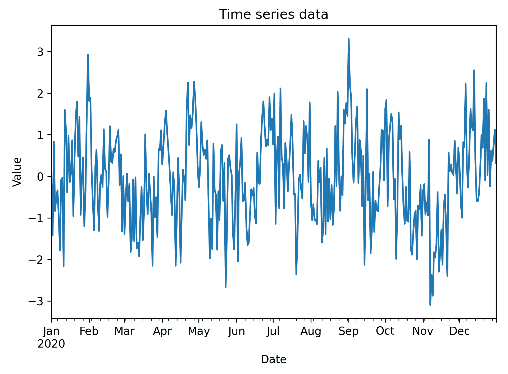
        Figure 7.4: Plot of the time series data that we will analyze. There doesn't appear to be a trend in this data

          3.  接下来，我们计算增广 Dickey-Fuller 检验。零假设是时间序列不是平稳的：

```
adf_results = sm.tsa.adfuller(sample_ts)
adf_pvalue = adf_results[1]
print("Augmented Dickey-Fuller test:\nP-value:", adf_pvalue)
```py

        在这种情况下，报告的 p 值为 0.000376，因此我们拒绝了零假设，并得出该序列是平稳的结论。

          4.  接下来，我们需要确定我们应该适合的模型的顺序。为此，我们将绘制时间序列的**自相关函数**（**ACF**）和**偏自相关函数**（**PACF**）：

```
ap_fig, (acf_ax, pacf_ax) = plt.subplots(2, 1, sharex=True,
   tight_layout=True)
sm.graphics.tsa.plot_acf(sample_ts, ax=acf_ax, 
   title="Observed autocorrelation")
sm.graphics.tsa.plot_pacf(sample_ts, ax=pacf_ax, 
   title="Observed partial autocorrelation")
pacf_ax.set_xlabel("Lags")
pacf_ax.set_ylabel("Value")
acf_ax.set_ylabel("Value")
```py

        下图显示了我们时间序列的 ACF 和 PACF 图。这些图表明存在自回归和移动平均过程：
        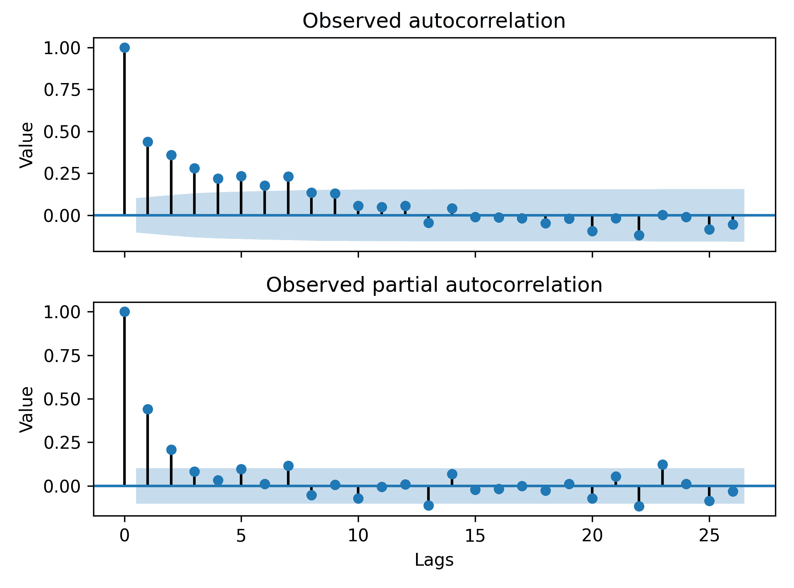
        Figure 7.5: ACF and PACF for the sample time series data

          5.  接下来，我们使用 statsmodels 的`tsa`模块中的`ARMA`类为数据创建 ARMA 模型。该型号将具有 1 阶 AR 和 1 阶 MA：

```
​arma_model = sm.tsa.ARMA(sample_ts, order=(1, 1))
```py

          6.  现在，我们将模型与数据进行拟合，得到结果模型。我们将这些结果的摘要打印到终端：

```
arma_results = arma_model.fit()
print(arma_results.summary())
```py

        已安装模型的汇总数据如下所示：

```
                        ARMA Model Results 
===================================================================
Dep. Variable: y           No. Observations: 366
Model: ARMA(1, 1)          Log Likelihood -513.038
Method: css-mle            S.D. of innovations 0.982
Date: Fri, 01 May 2020     AIC 1034.077
Time: 12:40:00             BIC 1049.687
Sample: 01-01-2020         HQIC 1040.280
      - 12-31-2020 
===================================================================
          coef   std err     z     P>|z|    [0.025    0.975]
-------------------------------------------------------------------
const   -0.0242   0.143   -0.169    0.866   -0.305    0.256
ar.L1.y  0.8292   0.057    14.562   0.000    0.718    0.941
ma.L1.y -0.5189   0.090    -5.792   0.000   -0.695    -0.343
                          Roots 
===================================================================
        Real       Imaginary       Modulus      Frequency
-------------------------------------------------------------------
AR.1    1.2059     +0.0000j        1.2059        0.0000
MA.1    1.9271     +0.0000j        1.9271        0.0000
-------------------------------------------------------------------
```py

        在这里，我们可以看到 AR 和 MA 分量的估计参数都与 0 显著不同。这是因为`P >|z|`列中的值是 0 到 3 位小数。

          7.  接下来，我们需要验证模型预测的残差（误差）中没有其他结构。为此，我们绘制了残差的 ACF 和 PACF：

```
residuals = arma_results.resid
rap_fig, (racf_ax, rpacf_ax) = plt.subplots(2, 1, 
    sharex=True, tight_layout=True)
sm.graphics.tsa.plot_acf(residuals, ax=racf_ax, 
    title="Residual autocorrelation")
sm.graphics.tsa.plot_pacf(residuals, ax=rpacf_ax, 
    title="Residual partial autocorrelation")
rpacf_ax.set_xlabel("Lags")
rpacf_ax.set_ylabel("Value")
racf_ax.set_ylabel("Value")
```py

        残差的 ACF 和 PACF 可以在下图中看到。在这里，我们可以看到，除了 0 之外，在滞后处没有显著的峰值，因此我们得出结论，残差中没有剩余的结构：
        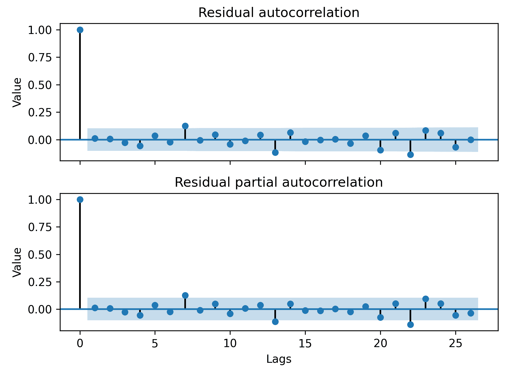
        Figure 7.6: ACF and PACF for the residuals from our model

          8.  现在我们已经验证了我们的模型没有丢失任何结构，我们在实际时间序列数据的顶部绘制拟合到每个数据点的值，以查看模型是否适合数据。我们在*步骤 2*中创建的图中绘制该模型：

```
fitted = arma_results.fittedvalues
fitted.plot(c="r", ax=ts_ax, label="Fitted")
ts_ax.legend()
```py

        更新后的图如下图所示：
        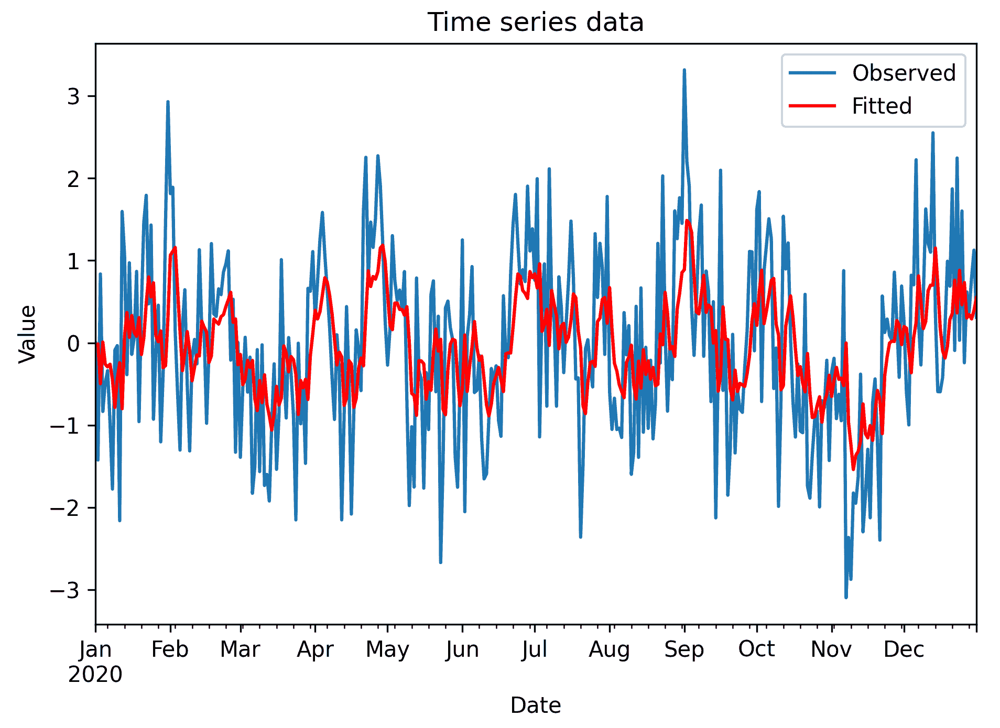
        Figure 7.7: Plot of the fitted time series data over the observed time series data
        拟合值给出了时间序列行为的合理近似值，但减少了底层结构的噪声。
        它是如何工作的。。。
        如果时间序列没有趋势，它就是平稳的。它们通常倾向于朝一个方向而不是另一个方向移动。平稳过程很重要，因为我们通常可以从任意时间序列中去除趋势，并对潜在的平稳序列建模。我们在本配方中使用的 ARMA 模型是建模平稳时间序列行为的基本方法。ARMA 模型的两个部分是自回归和移动平均部分，分别对术语和噪声与先前术语和噪声的依赖关系进行建模。
        一阶自回归模型具有以下形式：
        
        这里，*φ<sub>i</sub>*表示参数，*ε<sub>t</sub>*表示给定步长下的噪声。通常假设噪声为正态分布，平均值为 0，标准偏差在所有时间步长上都是恒定的。*Y<sub>t</sub>*值表示时间步长*t*处的时间序列值。在这个模型中，每个值都依赖于前一个值，尽管它也可能依赖于一些常数和一些噪声。当*φ<sub>1</sub>*参数严格位于-1 和 1 之间时，该模型将产生一个平稳的时间序列。
        一阶移动平均模型与自回归模型非常相似，由以下等式给出：
        
        这里，*θ<sub>i</sub>*的变体是参数。将这两个模型放在一起，我们得到一个 ARMA（1，1）模型，其形式如下：
        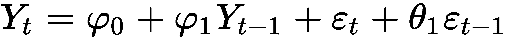
        一般来说，我们可以有一个 ARMA（p，q）模型，它有一个阶数为*p*AR 的分量和一个阶数为 qma 的分量。我们通常参考数量*p*和*q*作为模型的订单。
        确定 AR 和 MA 分量的阶数是构建 ARMA 模型最棘手的方面。ACF 和 PACF 对此提供了一些信息，但即使如此，也可能相当困难。例如，当滞后增加时，自回归过程将在 ACF 上显示某种衰减或振荡模式，并且在 PACF 上显示少量峰值以及与 0 没有显著差异的值。PAF 图上出现的峰值数量可作为过程的顺序。对于移动平均线过程，情况正好相反。ACF 图上通常有少量有效峰值，PACF 图上通常有衰减或振荡模式。当然，有时候，这并不明显。
        在此配方中，我们绘制了样本时间序列数据的 ACF 和 PACF。在*图 7.5*（顶部）中的自相关图中，我们可以看到峰值迅速衰减，直到它们位于零的置信区间内（意味着它们不显著）。这表明存在自回归成分。在*图 7.5*（底部）中的偏自相关图上，我们可以看到只有两个峰值可以被认为不为零，这表明一个阶数为 1 或 2 的自回归过程。你应该尽量保持模型的顺序尽可能小。因此，我们选择了一个 1 阶自回归分量。在此假设下，偏自相关图上的第二个峰值表示衰减（而非孤立峰值），这表明存在移动平均过程。为了保持模型简单，我们尝试了一个 1 阶移动平均过程。这就是我们在这个配方中使用的模型是如何决定的。请注意，这不是一个精确的过程，您可能会做出不同的决定。
        我们使用增广 Dickey-Fuller 检验来检验我们观察到的时间序列是平稳的可能性。这是一个统计测试，如[第 6 章](06.html)、*处理数据和统计*中所示，从数据生成测试统计。该检验统计量进而确定一个 p 值，该值用于确定是否接受或拒绝无效假设。对于该测试，无效假设是，在采样的时间序列中存在单位根。另一种假设——我们真正感兴趣的假设——是观察到的时间序列是（趋势）平稳的。如果 p 值足够小，那么我们可以用指定的置信度得出结论，即观测到的时间序列是平稳的。在此配方中，p 值为 0.000 至小数点后 3 位，这表明序列很可能是平稳的。平稳性是对数据使用 ARMA 模型的基本假设。
        一旦我们确定了序列是平稳的，并且确定了模型的阶数，我们就必须使模型与我们拥有的样本数据相适应。模型的参数使用最大似然估计进行估计。在本配方中，在*步骤 6*中使用`fit`方法学习参数。
        statsmodels 包提供了用于处理时间序列的各种工具，包括用于计算和绘制时间序列数据的 ACF 和 PACF、各种测试统计数据以及为时间序列创建 ARMA 模型的实用程序。还有一些工具可以自动估计模型的顺序。
        我们可以使用**Akaike 信息准则**（**AIC**）、**贝叶斯信息准则**（**BIC**）和**Hannan Quinn 信息准则**（**HQIC**）将此模型与其他模型进行比较，以查看哪个模型最能描述数据。在每种情况下，值越小越好。
        When using ARMA to model time series data, as in all kinds of mathematical modeling tasks, it is best to pick the simplest model that describes the data to the extent that is needed. For ARMA models, this usually means picking the smallest order model that describes the structure of the observed data.
        还有更多。。。
        为 ARMA 模型寻找最佳的订单组合可能相当困难。通常，拟合模型的最佳方法是测试多个不同的配置，并选择产生最佳拟合的顺序。例如，我们可以在这个配方中尝试 ARMA（0，1）或 ARMA（1，0），并将其与 ARMA（1，1）模型进行比较，通过考虑摘要中报告的**Akaike 信息标准**（**AIC**统计数据，我们用来确定哪一个模型产生了最佳拟合。事实上，如果我们建立这些模型，我们将看到 ARMA（1，1）的 AIC 值——我们在本配方中使用的模型——是这三个模型中的“最佳”。
        基于 ARIMA 的时间序列数据预测
        在前面的方法中，我们使用 ARMA 模型生成了一个平稳时间序列的模型，该模型由一个**自回归**（**AR**）分量和一个**m****移动平均**（**MA**分量组成。不幸的是，该模型不能适应具有某种潜在趋势的时间序列；也就是说，它们不是平稳的时间序列。我们通常可以通过*差分*观察到的时间序列一次或多次，直到我们获得可以使用 ARMA 建模的平稳时间序列。将差分引入 ARMA 模型称为 ARIMA 模型，它代表**自回归**（**AR****集成**（**I**）**移动平均**（**MA**）。
        差分是计算数据序列中连续项的差分的过程。因此，应用一阶差分量从下一步的值中减去当前步骤的值（*t<sub>i+1</sub>-t<sub>i</sub>*。这会从数据中去除潜在的向上或向下线性趋势。这有助于将任意时间序列简化为可以使用 ARMA 建模的平稳时间序列。高阶差分可以消除高阶趋势，以达到类似的效果。
        ARIMA 模型有三个参数，通常标记为*p*、*d*和*q*。*p*和*q*阶数参数分别是自回归分量和移动平均分量的阶数，就像它们用于 ARMA 模型一样。三阶参数*d*是要应用的差分顺序。具有这些顺序的 ARIMA 模型通常被写成 ARIMA（*p*、*d*、*q*）。当然，在开始拟合模型之前，我们需要确定应该包含哪些阶差。
        在此配方中，我们将学习如何将 ARIMA 模型拟合到非平稳时间序列，并使用此模型对未来值进行预测。
        准备
        对于该配方，我们需要 NumPy 包作为`np`导入，Pandas 包作为`pd`导入，Matplotlib`pyplot`模块作为`plt`导入，statsmodels`api`模块作为`sm`导入。我们还需要从`tsdata`模块中创建样本时间序列数据的实用程序，该模块包含在本书的存储库中：

```
from tsdata import generate_sample_data
```py

        怎么做。。。
        以下步骤说明如何为时间序列数据构建 ARIMA 模型，并使用此模型进行预测：

          1.  首先，我们使用`generate_sample_data`例程加载样本数据：

```
sample_ts, test_ts = generate_sample_data(trend=0.2, undiff=True)
```py

          2.  通常，下一步是绘制时间序列，以便我们能够直观地识别数据的趋势：

```
ts_fig, ts_ax = plt.subplots(tight_layout=True)
sample_ts.plot(ax=ts_ax, c="b", label="Observed")
ts_ax.set_title("Training time series data")
ts_ax.set_xlabel("Date")
ts_ax.set_ylabel("Value")
```py

        结果图如下图所示。正如我们所见，数据中有明显的上升趋势，因此时间序列肯定不是平稳的：
        
        Figure 7.8: Plot of the sample time series. There is an obvious positive trend in the data.

          3.  接下来，我们对序列进行差分，以查看一级差分是否足以消除趋势：

```
diffs = sample_ts.diff().dropna()
```py

          4.  现在，我们绘制差分时间序列的 ACF 和 PACF：

```
ap_fig, (acf_ax, pacf_ax) = plt.subplots(1, 2, 
   tight_layout=True, sharex=True)
sm.graphics.tsa.plot_acf(diffs, ax=acf_ax)
sm.graphics.tsa.plot_pacf(diffs, ax=pacf_ax)
acf_ax.set_ylabel("Value")
pacf_ax.set_xlabel("Lag")
pacf_ax.set_ylabel("Value")
```py

        ACF 和 PACF 可以在下图中看到。我们可以看到，数据中似乎没有任何趋势，似乎存在自回归成分和移动平均成分：
        
        Figure 7.9: ACF and PACF for the differenced time series

          5.  现在，我们用一阶差分、一个自回归分量和一个移动平均分量构造 ARIMA 模型。我们将其与观察到的时间序列相匹配，并打印模型摘要：

```
model = sm.tsa.ARIMA(sample_ts, order=(1,1,1))
fitted = model.fit(trend="c")
print(fitted.summary())
```py

        打印的摘要信息如下所示：

```
                       ARIMA Model Results 
==================================================================
Dep. Variable: D.y             No. Observations: 365
Model: ARIMA(1, 1, 1)          Log Likelihood -512.905
Method: css-mle                S.D. of innovations 0.986
Date: Sat, 02 May 2020         AIC 1033.810
Time: 14:47:25                 BIC 1049.409
Sample: 01-02-2020             HQIC 1040.009
      - 12-31-2020 
==================================================================
          coef     std err     z      P>|z|     [0.025    0.975]
------------------------------------------------------------------
const     0.9548    0.148     6.464    0.000     0.665    1.244
ar.L1.D.y 0.8342    0.056     14.992   0.000     0.725    0.943
ma.L1.D.y -0.5204   0.088    -5.903    0.000    -0.693   -0.348
                             Roots 
==================================================================
           Real      Imaginary       Modulus        Frequency
------------------------------------------------------------------
AR.1      1.1987      +0.0000j       1.1987          0.0000
MA.1      1.9216      +0.0000j       1.9216          0.0000
------------------------------------------------------------------
```py

        在这里，我们可以看到，我们估计的所有三个系数都与 0 显著不同，因为这三个系数在`P>|z|`列中都有 0 到 3 个小数位。

          6.  现在，我们可以使用`forecast`方法生成未来值的预测。这还返回预测的标准误差和置信区间：

```
forecast, std_err, fc_ci = fitted.forecast(steps=50)
forecast_dates = pd.date_range("2021-01-01", periods=50)
forecast = pd.Series(forecast, index=forecast_dates)
```py

          7.  接下来，我们在包含时间序列数据的图上绘制预测值及其置信区间：

```
forecast.plot(ax=ts_ax, c="g", label="Forecast")
ts_ax.fill_between(forecast_dates, fc_ci[:, 0], fc_ci[:, 1],
                   color="r", alpha=0.4)
```py

          8.  最后，我们将要生成的实际未来值与*步骤 1*中的样本一起添加到绘图中（如果您重复*步骤 1*中的绘图命令以在此处重新生成整个绘图，可能会更容易）：

```
test_ts.plot(ax=ts_ax, c="k", label="Actual")
ts_ax.legend()
```py

        包含预测时间序列和实际未来值的最终图如下图所示：
        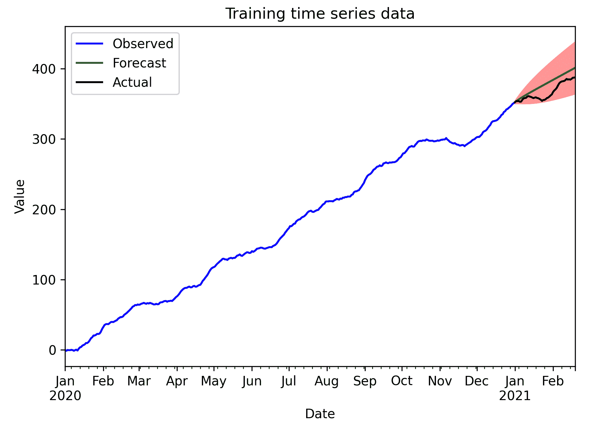
        Figure 7.10: Plot of the sample time series with forecast values and actual future values for comparison
        在这里，我们可以看到实际未来值在预测值的置信区间内。
        它是如何工作的。。。
        ARIMA 模型——顺序为*p*、*d*和*q–*的模型，只是一个应用于时间序列的 ARMA（*p*、*q*模型。这是通过对原始时间序列数据应用*d*阶差分得到的。为时间序列数据生成模型是一种相当简单的方法。statsmodels`ARIMA`类处理模型的创建，而`fit`方法将此模型与数据相匹配。我们通过了`trend="c"`关键字参数，因为我们从*图 7.9*中知道，时间序列具有恒定的趋势。
        使用最大似然法和参数的最终估计值对模型进行拟合——在这种情况下，一个参数用于自回归分量，一个参数用于移动平均分量，常数趋势参数和噪声方差。这些参数在摘要中报告。从该输出中，我们可以看到 AR 系数（0.8342）和 MA 常数（-0.5204）的估计值与用于生成数据的真实估计值非常接近，AR 系数为 0.8，MA 系数为-0.5。这些参数在本章代码库中的`tsdata.py`文件的`generate_sample_data`例程中设置。这将在*步骤 1*中生成样本数据。您可能已经注意到常量参数（0.9548）不是 0.2，正如在*步骤 1*中的`generate_sample_data`调用所指定的。事实上，它离时间序列的实际漂移并不遥远。
        拟合模型上的`forecast`方法（`fit`方法的输出）使用该模型对给定步骤数后的值进行预测。在此配方中，我们预测超过样本时间序列范围的时间步数最多为 50 个。`forecast`方法的输出是一个元组，包含预测值、预测的标准误差和预测的置信区间（默认情况下，95%置信度）。由于我们将时间序列作为一个熊猫序列提供，因此这些时间序列作为`Series`对象返回（置信区间为`DataFrame`。
        当您为时间序列数据构建 ARIMA 模型时，您需要确保使用最小的顺序差分来消除基本趋势。应用比需要更多的差分被称为*过度差分*，可能会导致模型出现问题。
        利用 ARIMA 预测季节数据
        时间序列通常显示周期性行为，因此值中的峰值或凹陷以固定的间隔出现。这种行为在时间序列分析中称为*季节性*。我们在本章中使用的建模时间序列数据的方法显然没有考虑季节性。幸运的是，将标准 ARIMA 模型与季节性相结合相对容易，从而形成有时称为 SARIMA 模型的模型。
        在本食谱中，我们将学习如何对包含季节性行为的时间序列数据建模，并使用此模型生成预测。
        准备
        对于该配方，我们需要 NumPy 包作为`np`导入，Pandas 包作为`pd`导入，Matplotlib`pyplot`模块作为`plt`导入，statsmodels`api`模块作为`sm`导入。我们还需要从`tsdata`模块中创建样本时间序列数据的实用程序，该模块包含在本书的存储库中：

```
from tsdata import generate_sample_data
```py

        怎么做。。。
        按照以下步骤为样本时间序列数据生成季节性 ARIMA 模型，并使用此模型生成预测：

          1.  首先，我们使用`generate_sample_data`例程生成样本时间序列进行分析：

```
sample_ts, test_ts = generate_sample_data(undiff=True,
   seasonal=True)
```py

          2.  与往常一样，我们的第一步是通过绘制样本时间序列图来目视检查数据：

```
ts_fig, ts_ax = plt.subplots(tight_layout=True)
sample_ts.plot(ax=ts_ax, title="Time series", label="Observed")
ts_ax.set_xlabel("Date")
ts_ax.set_ylabel("Value")
```py

        样本时间序列数据的曲线图如下图所示。在此，我们可以看到数据中似乎存在周期性峰值：
        
        Figure 7.11: Plot of the sample time series data

          3.  接下来，我们绘制样本时间序列的 ACF 和 PACF：

```
ap_fig, (acf_ax, pacf_ax) = plt.subplots(2, 1, 
   sharex=True, tight_layout=True)
sm.graphics.tsa.plot_acf(sample_ts, ax=acf_ax)
sm.graphics.tsa.plot_pacf(sample_ts, ax=pacf_ax)
pacf_ax.set_xlabel("Lag")
acf_ax.set_ylabel("Value")
pacf_ax.set_ylabel("Value")
```py

        样本时间序列的 ACF 和 PACF 如下图所示：
        
        Figure 7.12: ACF and PACF for the sample time series
        这些曲线图可能表明存在自回归成分，但也表明具有滞后 7 的 PACF 出现显著峰值。

          4.  接下来，我们对时间序列进行差分，并生成差分序列的 ACF 和 PACF 图。这将使模型的顺序更加清晰：

```
diffs = sample_ts.diff().dropna()
dap_fig, (dacf_ax, dpacf_ax) = plt.subplots(2, 1, sharex=True,
   tight_layout=True)
sm.graphics.tsa.plot_acf(diffs, ax=dacf_ax, 
   title="Differenced ACF")
sm.graphics.tsa.plot_pacf(diffs, ax=dpacf_ax, 
   title="Differenced PACF")
dpacf_ax.set_xlabel("Lag")
dacf_ax.set_ylabel("Value")
dpacf_ax.set_ylabel("Value")
```py

        差分时间序列的 ACF 和 PACF 如下图所示。我们可以看到，绝对存在滞后 7 的季节性成分：
        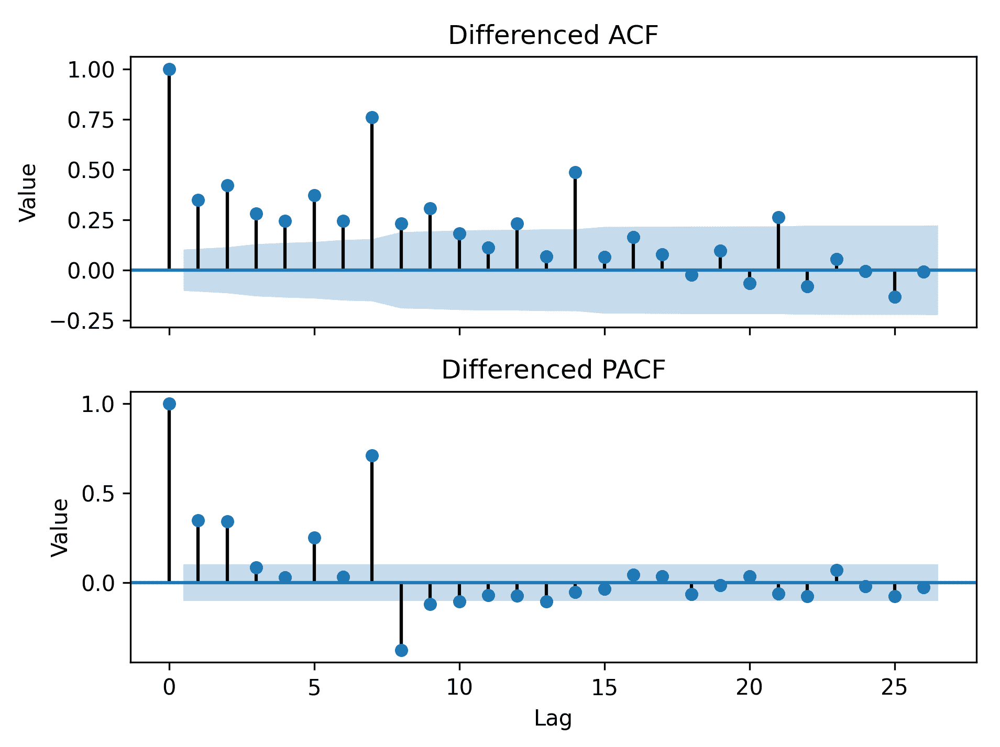
        Figure 7.13: Plot of the ACF and PACF for the differenced time series

          5.  现在，我们需要创建一个保存模型的`SARIMAX`对象，具有 ARIMA 顺序`(1, 1, 1)`和季节性 ARIMA 顺序`(1, 0, 0, 7)`。我们将此模型与样本时间序列相匹配，并打印摘要统计信息。我们在时间序列数据的顶部绘制预测值：

```
model = sm.tsa.SARIMAX(sample_ts, order=(1, 1, 1), 
   seasonal_order=(1, 0, 0, 7))
fitted_seasonal = model.fit()
print(fitted_seasonal.summary())
fitted_seasonal.fittedvalues.plot(ax=ts_ax, c="r",
   label="Predicted")
```py

        打印到终端的摘要统计信息如下所示：

```
                       SARIMAX Results 
===================================================================
Dep. Variable: y                      No. Observations: 366
Model: SARIMAX(1, 1, 1)x(1, 0, [], 7) Log Likelihood -509.941
Date: Mon, 04 May 2020                AIC 1027.881
Time: 18:03:27                        BIC 1043.481
Sample: 01-01-2020                    HQIC 1034.081
      - 12-31-2020 
Covariance Type:                      opg 
===================================================================
        coef     std err     z       P>|z|      [0.025     0.975]
-------------------------------------------------------------------
ar.L1   0.7939    0.065     12.136    0.000      0.666     0.922
ma.L1   -0.4544   0.095    -4.793     0.000     -0.640    -0.269
ar.S.L7  0.7764   0.034     22.951    0.000      0.710     0.843
sigma2   0.9388   0.073     12.783    0.000      0.795     1.083
===================================================================
Ljung-Box (Q): 31.89                Jarque-Bera (JB): 0.47
Prob(Q): 0.82                       Prob(JB): 0.79
Heteroskedasticity (H): 1.15        Skew: -0.03
Prob(H) (two-sided): 0.43           Kurtosis: 2.84
===================================================================

Warnings:
[1] Covariance matrix calculated using the outer product 
     of gradients (complex-step).
```py

          6.  该模型似乎是合理的拟合，因此我们继续前进，并预测未来的`50`时间步：

```
forecast_result = fitted_seasonal.get_forecast(steps=50)
forecast_index = pd.date_range("2021-01-01", periods=50)
forecast = forecast_result.predicted_mean
```py

          7.  最后，我们将预测值与这些预测的置信区间一起添加到样本时间序列图中：

```
forecast.plot(ax=ts_ax, c="g", label="Forecasts")
conf = forecast_result.conf_int()
ts_ax.fill_between(forecast_index, conf["lower y"],
   conf["upper y"], color="r", alpha=0.4)
test_ts.plot(ax=ts_ax, color="k", label="Actual future")
ts_ax.legend()
```py

        时间序列的最终曲线图以及预测和预测的置信区间如下图所示：
        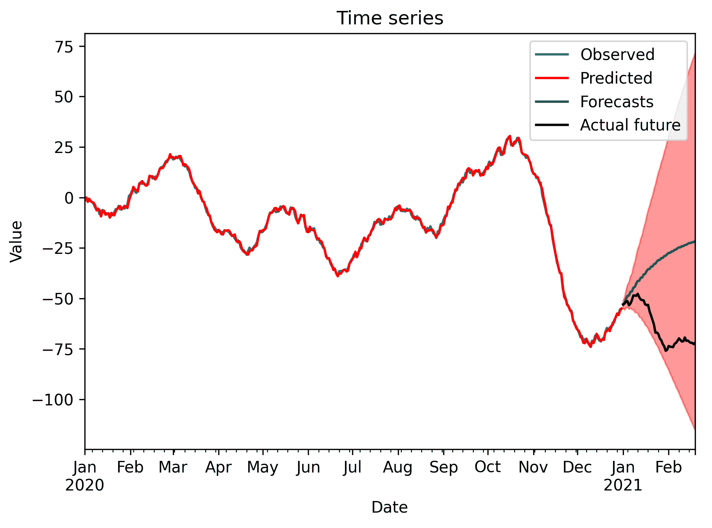
        Figure 7.14: Plot of the sample time series, along with the forecasts and confidence interval
        它是如何工作的。。。
        调整 ARIMA 模型以纳入季节性是一项相对简单的任务。季节性成分类似于自回归成分，其中滞后从大于 1 的某个数字开始。在该配方中，时间序列表现出周期 7（每周）的季节性，这意味着模型近似由以下等式给出：
        
        此处*φ<sub>1</sub>*和*Φ**<sub>1</sub>**为参数，*ε<sub>t</sub>*为时间步长*t*处的噪声。标准 ARIMA 模型易于调整，以包括该附加滞后项。* *SARIMA 模型将这一额外的季节性因素纳入 ARIMA 模型。在基础 ARIMA 模型的三个订单条款之上，它还有四个额外的订单条款。这四个附加参数是季节 AR、差分和 MA 分量，以及季节性周期。在这个配方中，我们将季节 AR 定为 1 级，没有季节差异或 MA 成分（0 级），季节周期为 7。这为我们提供了在本配方的*步骤 5*中使用的额外参数（1,0,0,7）。

季节性在建模时间序列数据时显然很重要，时间序列数据是在一段时间内（包括天、月或年）测量的。它通常根据它们所处的时间范围，包含某种季节性成分。例如，几天内每小时测量的国家电力消耗时间序列可能有 24 小时的季节性成分，因为电力消耗可能在夜间下降。

如果您正在分析的时间序列数据没有覆盖足够大的时间段，则长期季节性模式可能会被隐藏。数据趋势也是如此。当试图从观察到的数据所代表的相对较短的时间段生成长期预测时，这可能会导致一些有趣的问题。

statsmodels 包中的`SARIMAX`类提供了使用季节性 ARIMA 模型对时间序列数据进行建模的方法。事实上，它还可以模拟对模型有额外影响的外部因素，有时称为*外部回归*。（我们将不在这里介绍这些内容）这个类的工作原理与我们在前面的食谱中使用的`ARMA`和`ARIMA`类非常相似。首先，我们通过提供 ARIMA 过程和季节过程的数据和订单来创建模型对象，然后在此对象上使用`fit`方法来创建拟合模型对象。我们使用`get_forecasts`方法生成一个包含预测和置信区间数据的对象，然后我们可以绘制该对象，从而生成*图 7.14*。

## 还有更多。。。

本配方中使用的`SARIMAX`类与上一配方中使用的`ARIMA`类在接口上有一点不同。在撰写本文时，statsmodels 包（v0.11）包括第二个`ARIMA`类，该类构建在`SARIMAX`类之上，因此提供了相同的接口。然而，在撰写本文时，这个新的`ARIMA`类并没有提供与此配方中使用的相同的功能。

# 使用 Prophet 对时间序列数据建模

到目前为止，我们看到的时间序列数据建模工具是非常通用和灵活的方法，但它们需要一些时间序列分析的知识才能建立起来。构建一个好的模型所需的分析，可用于对未来做出合理的预测，这可能需要大量的时间，并且可能不适合您的应用程序。Prophet 库旨在快速自动建模时间序列数据，无需用户输入，并对未来进行预测。

在本食谱中，我们将学习如何使用 Prophet 从样本时间序列生成预测。

## 准备

对于该配方，我们需要将 Pandas 包作为`pd`导入，Matplotlib`pyplot`包作为`plt`导入，以及 Prophet 库中的`Prophet`对象，可以使用以下命令导入：

```
from fbprophet import Prophet
```py

我们还需要从`tsdata`模块导入`generate_sample_data`例程，该模块包含在本书的代码库中：

```
from tsdata import generate_sample_data
```py

## 怎么做。。。

以下步骤向您展示了如何使用 Prophet 软件包为样本时间序列生成预测：

1.  首先，我们使用`generate_sample_data`生成样本时间序列数据：

```
sample_ts, test_ts = generate_sample_data(undiff=True, trend=0.2)
```py

2.  我们需要将样本数据转换为 Prophet 期望的`DataFrame`：

```
df_for_prophet = pd.DataFrame({
    "ds": sample_ts.index,   # dates
    "y": sample_ts.values    # values
})
```py

3.  接下来，我们使用`Prophet`类建立一个模型，并将其拟合到样本时间序列中：

```
model = Prophet()
model.fit(df_for_prophet)
```py

4.  现在，我们创建一个新的`DataFrame`，其中包含原始时间序列的时间间隔，以及预测的附加时段：

```
forecast_df = model.make_future_dataframe(periods=50)
```py

5.  然后，我们使用`predict`方法在我们刚刚创建的时间段生成预测：

```
forecast = model.predict(forecast_df)
```py

6.  最后，我们在样本时间序列数据上绘制预测，以及置信区间和真实未来值：

```
fig, ax = plt.subplots(tight_layout=True)
sample_ts.plot(ax=ax, label="Observed", title="Forecasts")
forecast.plot(x="ds", y="yhat", ax=ax, c="r", 
    label="Predicted")
ax.fill_between(forecast["ds"].values, forecast["yhat_lower"].values, 
    forecast["yhat_upper"].values, color="r", alpha=0.4)
test_ts.plot(ax=ax, c="k", label="Future")
ax.legend()
ax.set_xlabel("Date")
ax.set_ylabel("Value")
```py

下图显示了时间序列图和预测：

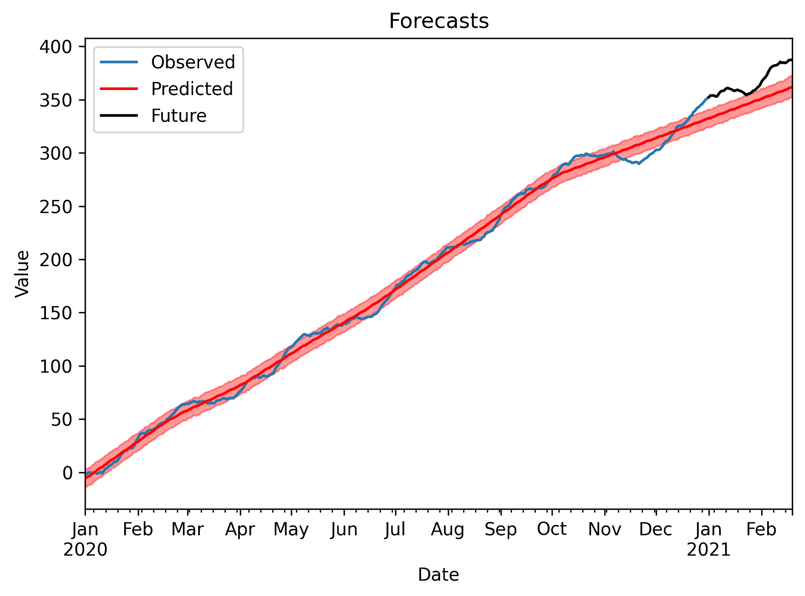

        Figure 7.15: Plot of sample time series data, along with forecasts and a confidence interval

## 它是如何工作的。。。

Prophet 是一个用于根据样本数据自动生成时间序列数据模型的软件包，用户只需很少的额外输入。在实践中，它非常容易使用；我们只需要创建一个`Prophet`类的实例，调用`fit`方法，然后我们就可以使用该模型生成预测并理解我们的数据。

`Prophet`类需要特定格式的数据：日期/时间索引为`DataFrame`列，响应数据为`y`（时间序列值）。此`DataFrame`应具有整数索引。模型拟合后，我们使用`make_future_dataframe`以正确的格式创建一个`DataFrame`，具有适当的日期间隔，并为将来的时间间隔添加行。然后`predict`方法采用`DataFrame`并使用模型生成值，以预测值填充这些时间间隔。我们还可以在该预测的`DataFrame`中获得其他信息，如置信区间。

## 还有更多。。。

Prophet 在建模时间序列数据方面做得相当好，用户没有任何输入。但是，可以使用`Prophet`类中的各种方法自定义模型。例如，在拟合模型之前，我们可以使用`Prophet`类的`add_seasonality`方法提供有关数据季节性的信息。

有用于自动生成时间序列数据模型的替代软件包。例如，流行的机器学习库（如 TensorFlow）可用于对时间序列数据建模。

# 进一步阅读

一本关于统计学回归的好教材是门登霍尔、比弗和比弗的《概率与统计学》一书，如第 6 章*中提到的*处理数据和统计学*。以下书籍很好地介绍了现代数据科学中的分类和回归：*

*   *James，G.和 Witten，D.，2013 年。统计学习导论：在 R 的应用。纽约：斯普林格。*

*   *Müller，A.和 Guido，S.，2016 年。Python 机器学习入门。塞巴斯托波尔：奥莱利媒体。*

时间序列分析的良好介绍可在以下书籍中找到：

*   *Cryer，J.和 Chan，K.，2008 年。时间序列分析。纽约：斯普林格。** 
```**