# 开始使用树莓皮 3 电脑

在本章中，我们将介绍以下主题：

*   将外围设备连接到 Raspberry Pi
*   使用 NOOBS 设置 Raspberry Pi SD 卡
*   通过 LAN 连接器联网并将 Raspberry Pi 连接到 internet
*   在 Raspberry Pi 上使用内置 Wi-Fi 和蓝牙
*   手动配置网络
*   直接与笔记本电脑或计算机联网
*   通过 USB Wi-Fi 加密狗联网并将 Raspberry Pi 连接至互联网
*   通过代理服务器连接到 internet
*   使用 VNC 通过网络远程连接到 Raspberry Pi
*   使用 SSH（和 X11 转发）通过网络远程连接到 Raspberry Pi
*   与 SMB 共享 Raspberry Pi 的主文件夹
*   保持树莓皮最新

# 介绍

本章介绍树莓皮 3 和第一次设置它的过程。我们将把 Raspberry Pi 连接到合适的显示器、电源和外围设备。我们将在 SD 卡上安装操作系统。这是系统启动所必需的。接下来，我们将确保通过本地网络成功连接到互联网。

最后，我们将利用网络提供从其他计算机和设备远程连接和/或控制 Raspberry Pi 的方法，并确保系统保持最新。

一旦您完成了本章中的步骤，您的 Raspberry Pi 就可以用于编程了。如果您已经设置并运行了 Raspberry Pi，请确保查看以下部分，因为这里有许多有用的提示。

# 树莓皮引种

树莓 Pi 是由损坏的 RasBuri Pi 基金会 To1T1 创建的一个单板计算机，这是一个慈善机构，主要目的是在英国向孩子们介绍低水平的计算机技能。其目的是重新点燃 20 世纪 80 年代的微型计算机革命，这场革命产生了整整一代熟练的程序员。

即使在 2012 年 2 月底这款电脑发布之前，很明显 Raspberry Pi 已经在全世界获得了巨大的追随者，在撰写本书时，已经售出了 1000 多万台。下图显示了几种不同的 Raspberry Pi 模型：

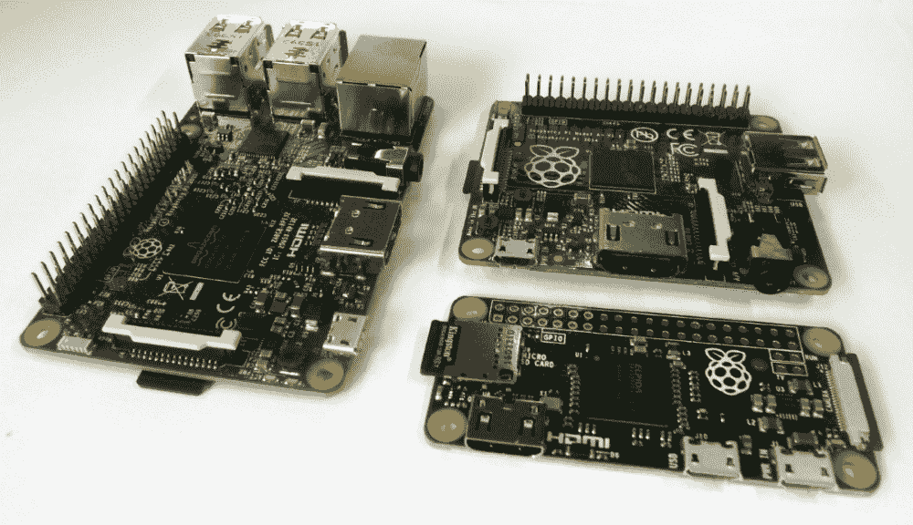

The Raspberry Pi Model 3B, Model A+, and Pi Zero

# 你叫什么名字？

Raspberry Pi 这个名字结合了创造一个基于水果的名称（如苹果、黑莓和杏子）的替代计算机的愿望，以及对一个可以使用**Python**（缩写为**Pi**编程的简单计算机的最初概念的认同。

在本书中，我们将使用这台小型计算机，了解如何设置它，然后使用 Python 编程语言一章一章地探索它的功能。

# 为什么是 Python？

人们经常会问，“为什么选择 Python 作为 Raspberry Pi 上使用的语言？”事实上，Python 只是可以在 Raspberry Pi 上使用的众多编程语言之一。

您可以选择多种编程语言，从高级图形块编程，如**Scratch**，到传统的**C**，再到**BASIC**，甚至是原始的**机器代码汇编程序**。一个好的程序员通常必须能够使用多种语言编写代码，才能充分利用每种语言的优缺点，以最好地满足其所需应用程序的需要。了解不同的语言（和编程技术）如何克服将您想要的转换为您得到的*的挑战是很有用的，因为这也是您在编程时试图做的事情。*

 *在学习编程时，Python 被选为一个很好的起点，因为它提供了一套丰富的编码工具，同时仍然允许编写简单的程序，而不必大惊小怪。这使得初学者能够逐步了解现代编程语言所基于的概念和方法，而不需要他们从一开始就知道所有这些。它是非常模块化的，有许多附加库，可以导入这些库以快速扩展功能。你会发现，随着时间的推移，这会鼓励你做同样的事情，你会想创建你自己的模块，你可以插入到你自己的程序中，从而迈出结构化编程的第一步。

Python 解决了格式和表示方面的问题。缩进将增加更好的可读性，因此缩进在 Python 中非常重要。它们定义了如何将代码块分组在一起。一般来说，Python 速度很慢；因为它是解释的，所以在运行程序时创建模块需要时间。如果您需要响应时间紧迫的事件，这可能是一个问题。但是，您可以预编译 Python 或使用其他语言编写的模块来克服这一问题。

它隐藏了细节；这既是优点也是缺点。这对于初学者来说是非常好的，但是当您不得不对数据类型等方面进行二次猜测时，这可能会很困难。然而，这反过来又迫使你考虑所有的可能性，这可能是一件好事。

# Python 2 和 Python 3

对于初学者来说，一个巨大的困惑是 Raspberry Pi 上有两个版本的 Python（**版本 2.7**和**版本 3.6**，它们彼此不兼容，因此为 Python 2.7 编写的代码可能无法与 Python 3.6 一起运行（反之亦然）。

Python Software Foundation Apple T1。T1 不断地致力于改进和向前推进语言，这有时意味着他们必须牺牲向后兼容性来接受新的改进（并且，重要的是，去除冗余和遗留的做事方式）。

Supporting Python 2 and Python 3

有许多工具可以简化从 Python2 到 Python3 的转换，包括诸如`2to3`之类的转换器，它将解析和更新您的代码以使用 Python3 方法。这个过程并不完美，在某些情况下，您需要手动重写部分并完全重新测试所有内容。您可以编写同时支持这两种功能的代码和库。`import __future__`语句允许您导入 Python3 的友好方法，并使用 Python2.7 运行它们。

# 您应该使用哪个版本的 Python？

本质上，选择使用哪个版本取决于您打算做什么。例如，您可能需要 Python2.7 库，但 Python3.6 尚未提供这些库。Python3 从 2008 年开始提供，因此这些库往往是较旧或较大的库，尚未翻译。在许多情况下，传统图书馆有新的替代品；然而，他们的支持可能会有所不同。

在本书中，我们使用了 Python 3.6，它也与 Python 3.5 和 3.3 兼容。

# 树莓皮家族——皮的简史

自发布以来，Raspberry Pi 经过多次迭代，对原始 Raspberry Pi B 型机组进行了大小更新和改进。虽然一开始可能会让人困惑，但有三种基本类型的树莓皮可用（和一种特殊型号）。

主打旗舰车型为**车型 B**。它拥有所有的连接和功能，以及最大的 RAM 和最新的处理器。多年来，出现了几种版本，最著名的是 B 型（有 256 MB，然后是 512 MB RAM）和 B+型（将 26 针 GPIO 增加到 40 针，改用 microSD 卡插槽，并有四个 USB 端口，而不是两个）。这些原始型号均采用 Broadcom BCM2835**片上系统**（**SOC**），由单核 700 MHz ARM11 和 VideoCore IV**图形处理单元**（**GPU**组成。

2015 年，Raspberry Pi 2 型号 B（也称为 2B）推出了新的 Broadcom BCM2836 SOC，提供了一个四核 32 位 ARM Cortex A7 1.2 GHz 处理器和 GPU，具有 1 GB 的 RAM。改进后的 SOC 增加了对 Ubuntu 和 Windows10IoT 的支持。最后，我们推出了最新的 Raspberry Pi 3 B 型，使用了另一款全新的 Broadcom BCM2837 SOC，它提供了四核 64 位 ARM Cortex-A53 和 GPU，以及车载 Wi-Fi 和蓝牙。

**型号 A**一直被定位为精简版。虽然具有与型号 B 相同的 SOC，但存在由单个 USB 端口和非有线网络（LAN）组成的有限连接。型号 A+再次添加了更多 GPIO 引脚和 microSD 插槽。然而，RAM 后来升级到 512 MB 的 RAM，并且仍然只有一个 USB 端口/没有 LAN。型号 A 上的 Broadcom BCM2835 SOC 尚未更新（因此仍然是单核 ARM11）；但是，型号 3A（最有可能使用 BCM2837）。

**Pi Zero**是 Raspberry Pi 的超紧凑版本，用于成本和空间都很高的嵌入式应用。它与其他型号具有相同的 40 针 GPIO 和 microSD 卡插槽，但缺少车载显示器（CSI 和 DSI）连接。它仍然有 HDMI（通过迷你 HDMI）和一个移动中的微型 USB**（**OTG**连接。尽管 Pi Zero 的第一个版本中没有出现，但最新的型号还包括车载摄像头的 CSI 连接。**

**Pi Zero was famously released in 2015 and was given away with Raspberry Pi foundation's magazine *The MagPi*, giving the magazine the benefit of being the first magazine to give away a computer on its cover! This did make me rather proud since (as you may have read in my biography at the start of this book) I was one of the founders of the magazine.

该特殊模型称为**计算模块**。它采用 200 针 SODIMM 卡的形式。它适用于工业用途或商业产品，其中所有外部接口将由主机/主板提供，模块将插入其中。示例产品包括 Slice 媒体播放器（[http://fiveninjas.com](http://fiveninjas.com) 和奥托摄像机。当前模块使用 BCM2835，尽管它是一个更新的计算模块（CM3）。

Raspberry Pi Wikipedia 页面提供了所有不同变体及其规格的完整列表：
[https://en.wikipedia.org/wiki/Raspberry_Pi#Specifications](https://en.wikipedia.org/wiki/Raspberry_Pi#Specifications%20)

此外，Raspberry Pi 产品页面为您提供了有关可用型号和附件规格的详细信息： [https://www.raspberrypi.org/products/](https://www.raspberrypi.org/products/) 

# 选择哪种圆周率？

本书的所有章节都将兼容 Raspberry Pi 的所有当前版本，但建议首先使用型号 3B。这提供了最佳性能（尤其适用于[第 5 章](05.html)中使用的 OpenCV 示例中的 GPU 示例、*检测图像*中的边缘和轮廓）、大量连接和内置 Wi-Fi，非常方便。

对于需要低功耗或减轻重量/尺寸，但不需要 3B 型的全部处理能力的项目，建议使用 Pi Zero。然而，由于其超低成本，PiZero 非常适合在开发完成项目后部署它。

# 连接到树莓皮

有很多方法可以连接 Raspberry Pi，并使用各种接口来查看和控制内容。通常情况下，大多数用户需要电源、显示器（带音频）和键盘和鼠标等输入方法。要访问互联网，请参考*网络，并使用 Raspberry Pi*配方上的内置 Wi-Fi 和蓝牙，通过 LAN 连接器或*将您的 Raspberry Pi 连接到互联网。*

# 准备

在您可以使用 Raspberry Pi 之前，您需要一张 SD 卡，上面安装有操作系统或带有**新的开箱即用系统**（**NOOBS**），如*使用 NOOBS 设置 Raspberry Pi SD 卡*配方中所述。

下一节将详细介绍可以连接到 Raspberry Pi 的设备类型，重要的是，如何以及在何处插入这些设备。

正如您稍后将发现的，一旦您设置了 Raspberry Pi，您可能会决定远程连接并通过网络链接使用它，在这种情况下，您只需要电源和网络连接。参考以下章节：*使用 VNC*通过网络远程连接到 Raspberry Pi，*使用 SSH（和 X11 转发）*通过网络远程连接到 Raspberry Pi。

# 怎么做。。。

树莓皮的布局如下图所示：


The Raspberry Pi connection layout (Model 3 B, Model A+, and Pi Zero)

有关上图的更多信息如下所示：

*   **显示**：覆盆子 Pi 支持以下三种主要显示连接；如果 HDMI 和复合视频都已连接，则默认为仅 HDMI：
    *   **HDMI**：为了获得最佳效果，请使用具有 HDMI 连接的电视或显示器，从而实现最佳分辨率显示（1080p）和数字音频输出。如果您的显示器具有 DVI 连接，则可以使用适配器通过 HDMI 进行连接。有几种类型的 DVI 连接；有些支持模拟（DVI-A），有些支持数字（DVI-D），有些同时支持两者（DVI-I）。Raspberry Pi 只能通过 HDMI 提供数字信号，因此建议使用 HDMI-to-DVI-D 适配器（在下面的屏幕截图中用勾号显示）。这缺少四个额外的模拟引脚（在下面的屏幕截图中用十字标记显示），因此允许它同时安装在 DVI-D 和 DVI-I 型插座中：


HDMI-to-DVI connection (DVI-D adaptor)

如果您希望使用较旧的显示器（带有 VGA 连接），则需要额外的 HDMI 到 VGA 转换器。Raspberry Pi 还支持基本的 VGA 适配器（VGA Gert666 适配器），它直接从 GPIO 引脚驱动。但是，这会耗尽 40 针标题中除 4 针以外的所有针（旧款 26 针型号不支持 VGA 输出）：


HDMI-to-VGA adapter


3.5 mm phono analogue connections

当使用 RCA 连接或 DVI 输入时，必须通过模拟音频连接单独提供音频。为了简化制造过程（通过避免通孔组件），Pi Zero 没有模拟音频或用于模拟视频的 RCA 插座（尽管可以通过一些修改添加）：

*   **立体声模拟音频（除 Pi 零外的所有音频）**：为耳机或放大扬声器提供模拟音频输出。音频可以通过桌面上的 Raspberry Pi 配置工具在模拟（立体声插座）和数字（HDMI）之间切换，或者通过使用`amixer`或`alsamixer`的命令行切换。

To find out more information about a particular command in the Terminal, you can use the following `man` command before the terminal reads the manual (most commands should have one):

` man amixer`

一些命令还支持`--help`选项以获得更简洁的帮助，如下所示：

` amixer --help`

*   **网络（不包括型号 A 和 Pi Zero）**：网络连接将在本章后面的*网络和通过 LAN 连接器*将您的树莓 Pi 连接到互联网配方中讨论。如果我们使用型号 A Raspberry Pi，则可以添加 USB 网络适配器以添加有线甚至无线网络（请参阅*网络并通过 USB Wi-Fi 加密狗*将您的 Raspberry Pi 连接到互联网）。
*   **车载 Wi-Fi 和蓝牙（仅适用于型号 3B）**：型号 3B 内置 802.11n Wi-Fi 和蓝牙 4.1；请参阅在覆盆子 Pi 上使用内置 Wi-Fi 和蓝牙的*配方。*
*   **USB（1x 型号 A/Zero、2x 型号 1B、4x 型号 2B 和 3B）**：使用键盘和鼠标：
    *   覆盆子 Pi 应该适用于大多数 USB 键盘和鼠标。您还可以使用无线鼠标和键盘，它们使用 RF 加密狗。但是，使用蓝牙加密狗的项目需要额外配置。
    *   如果您的电源供电不足或设备消耗的电流过大，您可能会遇到键盘键卡滞，严重时还会导致 SD 卡损坏。

USB power can be more of an issue with the early Model B revision 1 boards that were available prior to October 2012\. They included additional **Polyfuses** on the USB output and tripped if an excess of 140 mA was drawn. The Polyfuses can take several hours or days to recover completely, thus causing unpredictable behavior to remain even when the power is improved.

您可以识别修订版 1 电路板，因为它缺少后续型号中存在的四个安装孔。

*   **Micro USB 电源**：Raspberry Pi 需要一个 5V 电源，通过 Micro USB 连接可以舒适地提供至少 1000 毫安（建议 1500 毫安或以上，尤其是耗电量更大的型号 2 和型号 3）。可以使用便携式电池组为装置供电，例如适合为平板电脑供电或充电的电池组。同样，确保它们能够在 1000 mA 或更高的电压下提供 5V 电压。

在连接电源之前，您应该将所有其他连接连接到 Raspberry Pi。但是，USB 设备、音频和网络在运行时可以连接和删除，不会出现问题。

# 还有更多。。。

除了您希望在计算机上看到的标准主连接之外，Raspberry Pi 还有许多其他连接。

# 辅助硬件连接

以下每个连接都为 Raspberry Pi 提供了额外的接口：

*   **20 x 2 GPIO 引脚头（型号 A+、B+、2 B、3 B 和 Pi 零）**：这是 Raspberry Pi 的主要 40 引脚 GPIO 头，用于直接与硬件组件接口。本书中的章节也与旧型号的 Raspberry Pi 兼容，该型号具有 13 x 2 GPIO 引脚头。
*   **P5 8 x 2 GPIO 引脚头（仅适用于 1 B 型 2.0 版）**：我们在本书中未使用此项。
*   **复位连接**：这在较新型号上存在（未安装插脚）。当引脚 1（复位）和引脚 2（接地）连接在一起时，会触发复位。我们在[第 7 章](07.html)中的*一个受控关机按钮*概念中使用了这一点，*使用 Python 驱动硬件*。
*   **GPU/LAN JTAG**：**联合测试行动小组**（**JTAG**）是用于配置和测试处理器的编程和调试接口。这些在较新型号上作为表面焊盘出现。使用此接口需要专业 JTAG 设备。我们在书中没有使用这一点。
*   **直接摄像头 CSI**：此连接支持 Raspberry Pi 摄像头模块。请注意，与其他型号相比，Pi Zero 的 CSI 连接器更小，因此它需要不同的带状连接器。
*   **直接显示 DSI**：此连接支持直接连接的显示器，如 7 英寸 800 x 600 电容式触摸屏。

# 使用 NOOBS 设置 Raspberry Pi SD 卡

Raspberry Pi 要求在启动之前将操作系统加载到 SD 卡上。设置 SD 卡最简单的方法是使用**NOOBS**；你可能会发现你可以买一张 SD 卡，上面已经装了 NOOBS。

NOOBS 提供了一个初始开始菜单，该菜单提供了在 SD 卡上安装多个可用操作系统的选项。

# 准备

由于 NOOBS 创建了一个**恢复**分区来保留原始安装映像，因此建议使用 8GB 或更大的 SD 卡。您还需要 SD 卡读卡器（经验表明，某些内置读卡器可能会导致问题，因此建议使用外部 USB 类型的读卡器）。

如果您使用的是以前使用过的 SD 卡，则可能需要重新格式化以删除以前的分区和数据。NOOBS 期望 SD 卡由单个 FAT32 分区组成。

如果使用 Windows 或 macOS X，您可以使用 SD 协会的格式化程序，如以下屏幕截图所示（可在[上找到）https://www.sdcard.org/downloads/formatter_4/](https://www.sdcard.org/downloads/formatter_4/) ：


Getting rid of any partitions on the SD card, using SD formatter

从“选项设置”对话框中，设置格式大小调整。这将删除以前创建的所有 SD 卡分区。

如果使用 Linux，您可以使用`gparted`清除任何以前的分区，并将其重新格式化为 FAT32 分区。

完整的 NOOBS 包（通常略高于 1GB）包含 Raspbian，这是内置的最流行的 Raspberry Pi 操作系统映像。还提供了没有预加载操作系统的精简版 NOOBS（尽管需要 20 MB 的较小初始下载和 Raspberry Pi 上的网络连接才能直接下载您想要使用的操作系统）。

NOOBS 可在[处获得 http://www.raspberrypi.org/downloads](http://www.raspberrypi.org/downloads) ，文件可在[上查阅 https://github.com/raspberrypi/noobs](https://github.com/raspberrypi/noobs) 。

# 怎么做。。。

通过执行以下步骤，我们将准备 SD 卡以运行 NOOBS。这将允许我们选择并安装要使用的操作系统：

1.  准备好 SD 卡。
2.  在新格式化的 SD 卡或新 SD 卡上，复制`NOOBS_vX.zip`文件的内容。复制完成后，您应该会看到 SD 卡的以下屏幕截图：

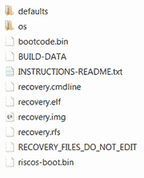

NOOBS files extracted onto the SD card The files may vary slightly with different versions of NOOBS, and the icons displayed may be different on your computer.

3.  现在，您可以将卡放入 Raspberry Pi，将其连接到键盘和显示器，然后打开电源。请参考*连接覆盆子皮*配方，了解您需要什么以及如何做到这一点的详细信息。

默认情况下，NOOBS 将通过 HDMI 连接显示。如果您有其他类型的屏幕（或看不到任何内容），则需要根据以下功能按 1、2、3 或 4 手动选择输出类型：

*   键 1 代表标准 HDMI 模式（默认模式）
*   键 2 代表安全 HDMI 模式（如果未检测到输出，则可选择 HDMI 设置）
*   键 3 代表复合 PAL（用于通过 RCA 模拟视频连接进行的连接）
*   图例 4 表示复合 NTSC（同样，用于通过 RCA 连接器的连接）

还将为已安装的操作系统设置此显示设置。

过一会儿，您将看到 NOOBS 选择屏幕，其中列出了可用的发行版（脱机版本仅包括 Raspbian）。还有更多的发行版可用，但只有选定的发行版可以直接通过 NOOBS 系统使用。单击 Raspbian，因为这是本书中使用的操作系统。

按*输入*或点击安装操作系统，确认您希望覆盖
卡上的所有数据。这将覆盖以前使用 NOOBS 安装的任何发行版，但不会删除 NOOBS 系统；打开电源后，您可以随时按*Shift*键返回。

根据卡的速度，将数据写入卡大约需要 20 到 40 分钟。当它完成并且图像应用成功消息出现时，点击 OK，Raspberry Pi 将开始引导到`Raspberry Pi Desktop`。

# 它是如何工作的。。。

以这种方式将映像文件写入 SD 卡的目的是确保 SD 卡使用正确引导操作系统所需的预期文件系统分区和文件进行格式化。

当 Raspberry Pi 通电时，它加载 GPU 内部内存中包含的一些特殊代码（Raspberry Pi 基金会通常称为**二进制 blob**。二进制 blob 提供读取 SD 卡上的`BOOT`分区所需的指令，该指令（在安装 NOOBS 的情况下）将从`RECOVERY`分区加载 NOOBS。如果此时按下*Shift*，NOOBS 将加载恢复和安装菜单。否则，NOOBS 将开始加载由存储在`SETTINGS`分区中的首选项指定的操作系统。

加载操作系统时，将通过`BOOT`分区引导，使用`config.txt`中定义的设置和`cmdline.txt`中的选项，最终加载到`root`分区上的桌面。请参阅下图：


NOOBS creates several partitions on the SD card to allow the installation of multiple
operating systems and to provide recovery

NOOBS 允许用户在同一张卡上选择性地安装多个操作系统，并提供一个引导菜单在它们之间进行选择（带有一个选项，可在超时期间设置默认值）。

如果以后添加、删除或重新安装操作系统，请首先确保您制作了任何文件的副本，包括希望保留的系统设置，因为 NOOBS 可能会覆盖 SD 卡上的所有内容。

# 还有更多。。。

当您第一次直接启动 Raspberry Pi 时，桌面将被加载。您可以使用 Raspberry Pi 配置菜单（在桌面上的首选项菜单下或通过`sudo raspi-config`命令）配置系统设置。使用此菜单，您可以更改 SD 卡或设置常规首选项：

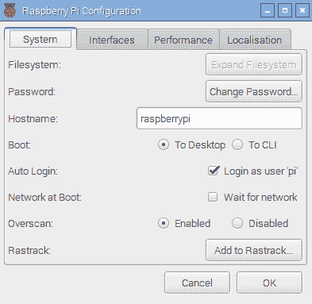

# 更改默认用户密码

确保登录后更改`pi`用户帐户的默认密码，因为默认密码是众所周知的。如果您连接到公共网络，这一点尤为重要。您可以使用`passwd`命令执行此操作，如以下屏幕截图所示：

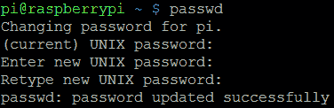

Setting a new password for the Pi user

这提供了更大的信心，因为如果您以后连接到另一个网络，只有您才能访问您的文件并控制您的 Raspberry Pi。

# 确保安全关机

为了避免任何数据损坏，您必须通过发出`shutdown`命令确保正确关闭 Raspberry Pi，如下所示：

```py
sudo shutdown -h now  
```

或者，使用这个：

```py
sudo halt  
```

您必须等待此命令完成后，才能从 Raspberry Pi 上断开电源（SD 卡访问指示灯停止闪烁后至少等待 10 秒钟）。

您也可以使用`reboot`命令重新启动系统，如下所示：

```py
sudo reboot  
```

# 手动准备 SD 卡

使用 NOOBS 的另一种方法是手动将操作系统映像写入 SD 卡。虽然这原本是安装操作系统的唯一方法，但一些用户仍然喜欢它。它允许 SD 卡在用于覆盆子 Pi 之前进行准备。它还可以更方便地访问启动和配置文件，并为用户留下更多可用空间（与 NOOBS 不同，不包括`RECOVERY`分区）。

默认的 Raspbian 映像实际上由两个分区组成，`BOOT`和`SYSTEM`，这两个分区将装入 2GB SD 卡（建议使用 4GB 或更大的容量）。

您需要一台运行 Windows/Mac OS X/Linux 的计算机（尽管可以使用另一个 Raspberry Pi 来写您的卡；请准备等待很长时间）。

下载要使用的最新版本的操作系统。就本书而言，假设您使用的是[上提供的最新版本的 Raspbianhttp://www.raspberrypi.org/downloads](http://www.raspberrypi.org/downloads) 。

根据您计划用于写入 SD 卡的计算机类型，执行以下步骤（您需要的`.img`文件有时会被压缩，因此在开始之前，您需要解压缩该文件）。

以下步骤适用于 Windows：

1.  确保您已经下载了 Raspbian 图像（如前所述），并将其解压缩到一个方便的文件夹中，以获得一个`.img`文件。
2.  获取可在[获取的`Win32DiskImager.exe`文件 http://www.sourceforge.net/projects/win32diskimager](http://www.sourceforge.net/projects/win32diskimager) 。
3.  从下载位置运行`Win32DiskImager.exe`。
4.  单击文件夹图标并导航到`.img`文件的位置，然后单击保存。
5.  如果您还没有这样做，请将 SD 卡插入读卡器并插入计算机。
6.  从小下拉框中选择与 SD 卡对应的设备驱动器号。再次检查这是正确的设备（因为当您写入图像时，程序将覆盖设备上的任何内容）。

The drive letter may not be listed until you select a source image file.

7.  最后，单击写入按钮，等待程序将图像写入 SD 卡，如以下屏幕截图所示：


Manually writing operating system images to the SD card, using Disk Imager

8.  完成后，您可以退出该程序。你的 SD 卡准备好了。

以下步骤适用于最常见的 Linux 发行版，如 Ubuntu 和 Debian：

1.  使用您首选的 web 浏览器，下载 Raspbian 图像并将其保存在合适的位置。
2.  从文件管理器中提取文件或在终端中找到文件夹，并使用以下命令解压缩`.img`文件：

```py
unzip filename.zip  
```

3.  如果您还没有这样做，请将 SD 卡插入读卡器并插入计算机。
4.  使用`df -h`命令，识别 SD 卡的**sdX**标识符。每个分区将显示为 sdX1、sdX2 等，其中 X 将是设备 ID 的`a`、`b`、`c`、`d`等。
5.  确保 SD 卡上的所有分区都已使用
    `umount /dev/sdXn`命令为每个分区卸载，其中`sdXn`是正在卸载的分区。
6.  使用以下命令将图像文件写入 SD 卡：

```py
sudo dd if=filename.img of=/dev/sdX bs=4M  
```

7.  该过程将花费一些时间写入 SD 卡，完成后返回终端提示。
8.  在将 SD 卡从计算机中卸下之前，请使用以下命令卸载 SD 卡：

```py
umount /dev/sdX1  
```

以下步骤适用于大多数 OS X 版本：

1.  使用您首选的 web 浏览器，下载 Raspbian 图像并将其保存在合适的位置。
2.  使用以下命令从文件管理器中提取文件或在终端中找到文件夹并解压缩`.img`文件：

```py
unzip filename.zip  
```

3.  如果您还没有这样做，请将 SD 卡插入读卡器并插入计算机。

4.  使用`diskutil list`命令并识别 SD 卡的**磁盘**标识符。每个分区将显示为磁盘 s1、磁盘 s2 等，其中设备 ID 的磁盘将显示为`1`、`2`、`3`、`4`等。

If rdisk# is listed, use this for faster writing (this uses a raw path and skips data buffering).

5.  确保使用`unmountdisk /dev/diskX`命令卸载 SD 卡，其中`diskX`是正在卸载的设备。
6.  使用以下命令将图像文件写入 SD 卡：

```py
sudo dd if=filename.img of=/dev/diskX bs=1M  
```

7.  该过程将花费一些时间写入 SD 卡，完成后返回终端提示。
8.  在将 SD 卡从计算机中卸下之前，请使用
    以下命令卸载 SD 卡：

```py
unmountdisk /dev/diskX  
```

请参阅下图：


The boot process of a manually installed OS image

# 扩展系统以适应 SD 卡

手动写入的图像将具有固定的大小（通常制作为适合最小尺寸的 SD 卡）。要充分利用 SD 卡，您需要扩展系统分区以填充 SD 卡的其余部分。这可以使用 Raspberry Pi 配置工具实现。

选择`Expand Filesystem,`，如下图所示：


Raspberry Pi Configuration tool

# 访问恢复/启动分区

Windows 和 macOS X 不支持`ext4`格式，因此当您读取 SD 卡时，只能访问**文件分配表**（**FAT**分区）。此外，Windows 仅支持 SD 卡上的第一个分区，因此如果您安装了 NOOBS，则只有`RECOVERY`分区可见。如果您已手动写入卡，您将能够访问`BOOT`分区。

`data`分区（如果您通过 NOOBS 安装了一个）和`root`分区是`ext4`格式的，在非 Linux 系统上通常不可见。

If you do need to read files from the SD card using Windows, a freeware program, **Linux Reader** (available at [www.diskinternals.com/linux-reader](https://www.diskinternals.com/linux-reader)) can provide read-only access to all of the partitions on the SD card.

从 Raspberry Pi 访问分区。要查看当前安装的分区，请使用`df`，如下图所示：

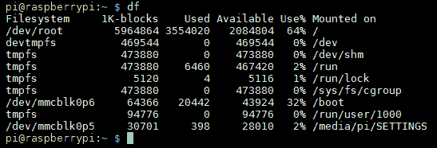

The result of the df command

要从 Raspbian 内访问`BOOT`分区，请使用以下命令：

```py
cd /boot/  
```

要访问`RECOVERY`或`data`分区，我们必须通过执行
以下步骤来装载它：

1.  在系统引用分区时，通过列出所有分区，甚至是未安装的分区，来确定该分区的名称。`sudo fdisk -l`命令列出了分区，如下图所示：

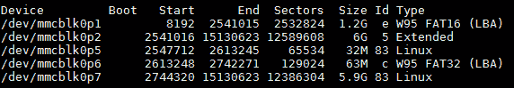

NOOBS installation and data partition

下表显示了分区的名称及其含义

| **分区名称** | **意思是** |
| `mmcblk0p1` | （`VFAT``RECOVERY` |
| `mmcblk0p2` | （扩展分区）包含（`root`、`data`、`BOOT`） |
| `mmcblk0p5` | （`ext4``root` |
| `mmcblk0p6` | （`VFAT``BOOT` |
| `mmcblk0p7` | （`ext4``SETTINGS` |

如果在同一卡上安装了其他操作系统，上表中显示的分区标识符将不同。

2.  创建文件夹并将其设置为分区的装入点；对于`RECOVERY`分区，使用以下命令：

```py
mkdir ~/recovery
sudo mount -t vfat /dev/mmcblk0p1 ~/recovery  
```

要确保每次启动系统时都安装了它们，请执行以下步骤：

1.  将`sudo`挂载命令添加到`exit 0`之前的`/etc/rc.local`中。如果您有不同的用户名，则需要更改`pi`以匹配：

```py
sudo nano /etc/rc.local
sudo mount -t vfat /dev/mmcblk0p1 /home/pi/recovery  
```

2.  按*Ctrl*+*X*、*Y*和*Enter*保存并退出。

Commands added to `/etc/rc.local` will be run for any user who logs on to Raspberry Pi. If you only want the drive to be mounted for the current user, the commands can be added to `.bash_profile` instead.

如果必须在同一卡上安装其他操作系统，则此处显示的分区标识符将不同。

# 使用工具备份 SD 卡以防出现故障

您可以使用**Win32 Disk Imager**将 SD 卡插入读卡器，启动程序，并创建一个文件名来存储图像，从而制作 SD 卡的完整备份映像。只需单击“读取”按钮即可从 SD 卡读取图像并将其写入新的图像文件。

要备份您的系统，或使用 Raspberry Pi 克隆到另一个 SD 卡，请使用 SD 卡复印机（可通过附件 SD 卡复印机从桌面菜单获得）。

将 SD 卡插入读卡器，插入 Raspberry Pi 的备用 USB 端口，然后选择新的存储设备，如以下屏幕截图所示：

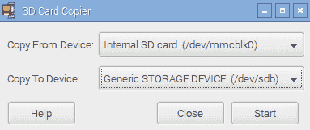

SD Card Copier program

在继续之前，SD 卡复印机将确认您希望格式化和覆盖目标设备，如果有足够的空间，则复制系统。

`dd`命令同样可用于备份卡，如下所示：

*   对于 Linux，使用设备 ID 替换`sdX`，使用以下命令：

```py
sudo dd if=/dev/sdX of=image.img.gz bs=1M  
```

*   对于 OS X，使用设备 ID 替换`diskX`，使用以下命令：

```py
sudo dd if=/dev/diskX of=image.img.gz bs=1M
```

*   您也可以使用`gzip`和 split 来压缩卡片的内容，并根据需要将其拆分为多个文件，以便存档，如下所示：

```py
sudo dd if=/dev/sdX bs=1M | gzip -c | split -d -b 2000m - image.img.gz

```

*   要恢复分割图像，请使用以下命令：

```py
sudo cat image.img.gz* | gzip -dc | dd of=/dev/sdX bs=1M  
```

# 使用 CAT6 以太网电缆，通过以太网端口联网并将 Raspberry Pi 连接到 internet

将 Raspberry Pi 连接到 internet 的最简单方法是使用型号 B 上的内置 LAN 连接。如果您使用的是型号 a Raspberry Pi，则可以使用 USB 到 LAN 适配器（请参阅*网络的*部分，并通过 USB Wi-Fi 加密狗将 Raspberry Pi 连接到 internet*关于如何配置的详细信息）。*

# 准备

您将需要访问合适的有线网络，该网络将连接到互联网，以及标准网络电缆（带有用于连接 Raspberry Pi 的**RJ45**型连接器）。

# 怎么做。。。

许多网络使用由路由器或交换机控制的**动态主机配置协议**（**DHCP**）自动进行连接和配置。如果是这种情况，只需将网络电缆插入路由器或网络交换机上的备用网络端口（或墙壁网络插座，如果适用）。

或者，如果 DHCP 服务器不可用，您必须手动配置设置（有关详细信息，请参阅*有更多…*部分）。

您可以通过以下步骤确认此功能是否成功运行：

1.  确保 Raspberry Pi 两侧的两个 LED 亮起（左侧橙色 LED 表示连接，右侧绿色 LED 闪烁表示活动）。这将表明存在与路由器的物理连接，并且设备已通电并正常工作。
2.  使用`ping`命令测试到本地网络的链接。首先，找出网络上另一台计算机的 IP 地址（或者路由器的地址，通常是`192.168.0.1`或`192.168.1.254`）。现在，在 Raspberry Pi 终端上，使用`ping`命令（使用`-c 4`参数只发送四条消息；否则，按*Ctrl*+*C*停止）ping IP 地址，如下所示：

```py
sudo ping 192.168.1.254 -c 4
```

3.  测试到 internet 的链接（如果您通常通过代理服务器连接到 internet，此操作将失败），如下所示：

```py
sudo ping www.raspberrypi.org -c 4

```

4.  最后，您可以通过在 Raspberry Pi 上使用`hostname -I`发现
    IP 地址来测试回 Raspberry Pi 的链接。然后，您可以在网络上的另一台计算机上使用 ping 命令以确保其可访问（使用 Raspberry Pi 的 IP 地址代替[www.raspberrypi.org](https://www.raspberrypi.org/)）。Windows 版本的`ping`命令将执行五次 ping 并自动停止，不需要`-c 4`选项。

如果上述测试失败，则需要检查连接，然后确认网络的正确配置。

# 还有更多。。。

如果您发现自己经常在网络上使用 Raspberry Pi，那么您就不必在每次连接时都查找 IP 地址。

在某些网络上，您可能可以使用 Raspberry Pi 的主机名而不是其 IP 地址（默认值为`raspberrypi`）。为此，您可能需要一些额外的软件，如**Bonjour**，以确保网络上的主机名已正确注册。如果您有 macOS X，您将已经运行了 Bonjour。

在 Windows 上，您可以安装 iTunes（如果您没有），其中也包括该服务，也可以单独安装（通过 Apple Bonjour 安装程序，可从[获得）https://support.apple.com/kb/DL999](https://support.apple.com/kb/DL999) ）。然后您可以使用主机名`raspberrypi`或`raspberrypi.local`通过网络连接到 Raspberry Pi。如果需要更改主机名，则可以使用 Raspberry Pi 配置工具（如前所示）进行更改。

或者，您可能会发现通过手动设置 IP 地址将 IP 地址固定为已知值很有帮助。但是，在连接到另一个网络时，请记住将其切换回使用 DHCP。

一些路由器还可以选择设置**静态 IP DHCP 地址**，因此 Raspberry Pi 始终使用相同的地址（设置方式取决于路由器本身）。

如果您打算使用后面介绍的远程访问解决方案之一，则了解 Raspberry Pi 的 IP 地址或使用主机名尤其有用，这样可以避免显示。

# 在 Raspberry Pi 上使用内置 Wi-Fi 和蓝牙

许多家庭网络通过 Wi-Fi 提供无线网络；如果您有树莓皮 3，那么您可以使用车载 Broadcom Wi-Fi 连接到它。Raspberry Pi 3 还支持蓝牙，因此您可以连接大多数标准蓝牙设备，并像在任何其他计算机上一样使用它们。

此方法也适用于任何受支持的 USB Wi-Fi 和蓝牙设备；有关识别设备和安装固件（如果需要）的额外帮助，请参阅*网络和通过 USB Wi-Fi 加密狗*将 Raspberry Pi 连接到互联网的方法。

# 准备

Raspbian 的最新版本包括一些有用的实用程序，可以通过图形界面快速轻松地配置 Wi-Fi 和蓝牙。

**Note**: If you need to configure the Wi-Fi via the command line, then see the *Networking and connecting your Raspberry Pi to the internet via a USB Wi-Fi dongle* recipe for details.

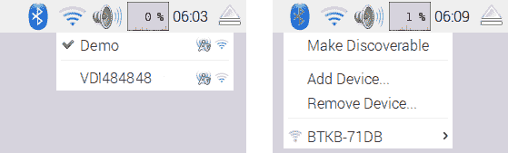

Wi-Fi and Bluetooth configuration applications

您可以使用内置蓝牙连接无线键盘、鼠标，甚至无线扬声器。这对于存在额外电缆和电线问题的项目尤其有用，例如机器人项目，或者 Raspberry Pi 安装在难以到达的位置（充当服务器或安全摄像头）。

# 怎么做。。。

以下是各种方法。

# 连接到您的 Wi-Fi 网络

要配置 Wi-Fi 连接，请单击网络符号以列出本地可用的 Wi-Fi 网络：

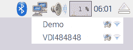

Wi-Fi listing of the available access points in the area

选择所需的网络（例如，`Demo`），如果需要，输入您的密码（也称为`Pre Shared Key`）：


Providing the password for the access point

过一会儿，您会看到您已连接到网络，图标将变为 Wi-Fi 符号。如果遇到问题，请确保密码/密钥正确：


Successful connection to an access point

就是这样；就这么简单！

现在，您可以通过使用 web 浏览器导航到网站或在终端中使用以下命令来测试连接并确保其正常工作：

```py
sudo ping www.raspberrypi.com
```

# 连接到蓝牙设备

首先，我们需要通过点击蓝牙图标并选择**使可发现**将蓝牙设备置于可发现模式。您还需要使要连接的设备可发现并准备配对；这可能因设备而异（例如按配对按钮）：

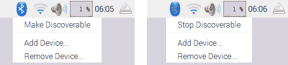

Setting the Bluetooth up as discoverable

接下来，选择**添加设备。。。**并选择目标设备和**对**：

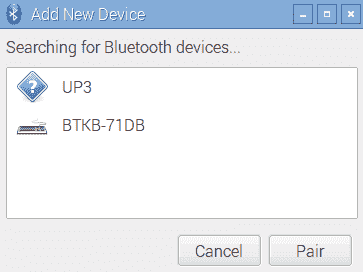

Selecting and pairing the required device

然后开始配对过程；例如，BTKB-71DB 键盘需要在键盘上输入配对代码`467572`才能完成配对。其他设备可能使用默认配对代码，通常设置为 0000、1111、1234 或类似：


Following the instructions to pair the device with the required pairing code

一旦该过程完成，设备将被列出，并在每次设备出现和启动时自动连接。

# 手动配置网络

如果您的网络不包括 DHCP 服务器或已禁用 DHCP 服务器（通常，这些服务器内置于大多数现代 ADSL/电缆调制解调器或路由器中），则可能需要手动配置网络设置。

# 准备

开始之前，您需要确定网络的网络设置。

您需要从路由器的设置或连接到网络的其他计算机中查找以下信息：

*   **IPv4 地址**：需要选择与网络上其他计算机类似的地址（通常，前三个数字应该匹配，即如果`netmask`是`255.255.255.0`，则为`192.168.1.X`，但不应该已经被其他计算机使用。但是，避免将`x.x.x.255`作为最后一个地址，因为这是作为广播地址保留的。
*   **子网掩码**：该数字确定计算机将响应的地址范围（对于家庭网络，通常为`255.255.255.0`，最多允许 254 个地址）。这有时也称为**网络掩码**。
*   **默认网关地址**：该地址通常是路由器的 IP 地址，计算机通过该地址连接到互联网。
*   **DNS 服务器**：**域名服务**（**DNS**服务器）通过查找将名称转换为 IP 地址。通常，它们已经在路由器上配置好了，在这种情况下，您可以使用路由器的地址。或者，您的**互联网服务提供商**（**ISP**）可以提供一些地址，或者您可以使用位于`8.8.8.8`和`8.8.4.4`地址的谷歌公共 DNS 服务器。在某些系统中，它们也被称为**名称服务器**。

对于 Windows，您可以通过连接到 internet 并运行以下命令来获取此信息：

```py
ipconfig /all  
```

找到活动连接（如果使用有线连接，通常称为`Local Area Connection 1`或类似连接，或者如果使用 Wi-Fi，则称为无线网络连接），并查找所需信息，如下所示：


The ipconfig/all command shows useful information about your network settings

对于 Linux 和 macOS X，您可以通过以下命令获得所需信息（注意它是`ifconfig`而不是`ipconfig`：

```py
ifconfig  
```

DNS 服务器称为名称服务器，通常列在`resolv.conf`文件中。您可以按如下方式使用`less`命令查看其内容（查看完毕后按 Q 退出）：

```py
less /etc/resolv.conf  
```

# 怎么做。。。

要设置网络接口设置，请使用以下代码编辑`/etc/network/interfaces`：

```py
sudo nano /etc/network/interfaces  
```

现在执行以下步骤：

1.  我们可以添加特定网络的详细信息，我们要分配给它的 IP`address`号，网络的`netmask`地址和`gateway`地址，如下所示：

```py
iface eth0 inet static
 address 192.168.1.10
 netmask 255.255.255.0
 gateway 192.168.1.254

```

2.  按*Ctrl*+*X*、*Y*和*Enter*保存并退出。
3.  要设置 DNS 的名称服务器，请使用以下代码编辑`/etc/resolv.conf`：

```py
sudo nano /etc/resolv.conf

```

4.  按如下方式添加 DNS 服务器的地址：

```py
nameserver 8.8.8.8
nameserver 8.8.4.4  
```

5.  按*Ctrl*+*X*、*Y*和*Enter*保存并退出。

# 还有更多。。。

您可以通过编辑`BOOT`分区中的`cmdline.txt`并使用`ip`将设置添加到启动命令行来配置网络设置。

`ip`选项采用以下形式：

```py
ip=client-ip:nfsserver-ip:gw-ip:netmask:hostname:device:autoconf  
```

*   `client-ip`选项是要分配给 Raspberry Pi 的 IP 地址
*   如果需要手动设置，则`gw-ip`选项将设置网关服务器地址
*   `netmask`选项将直接设置网络的`netmask`
*   `hostname`选项将允许您更改默认的`raspberrypi`主机名
*   如果存在多个网络设备，`device`选项允许您指定默认网络设备
*   `autoconf`选项允许打开或关闭自动配置

# 直接与笔记本电脑或计算机联网

可以使用一根网线将 Raspberry Pi LAN 端口直接连接到笔记本电脑或计算机。这将在计算机之间创建一个本地网络链接，如果使用**互联网连接共享**（**ICS**）的话，您可以在不需要集线器或路由器的情况下连接到一个正常的网络上做所有事情，包括连接到互联网，如下所示：

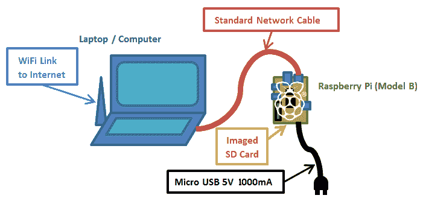

Make use of Raspberry Pi, with just a network cable, a standard imaged SD card, and power.

ICS 允许 Raspberry Pi 通过另一台计算机连接到 internet。但是，由于 Raspberry Pi 不会自动分配自己的 IP 地址，因此需要一些额外的配置，以便计算机通过链路进行通信。

我们将使用 ICS 共享来自另一个网络链路的连接，例如笔记本电脑上的内置 Wi-Fi。或者，如果不需要互联网或者计算机只有一个网络适配器，我们可以使用直接网络链接（请参阅*下的*直接网络链接*部分，有更多…*部分）。

Although this setup should work for most computers, some setups are more difficult than the others. For additional information, see [www.pihardware.com/guides/direct-network-connection](http://www.pihardware.com/guides/direct-network-connection).

# 准备

您需要带电源和标准网线的覆盆子 Pi。

Raspberry Pi Model B LAN chip includes **Auto-MDIX** (**Automatic Medium-Dependent Interface Crossover**). Removing the need to use a special crossover cable (a special network cable wired so that the transmit lines connect to receive lines for direct network links), the chip will decide and change the setup as required automatically.

使用键盘和显示器执行附加测试也可能有帮助，特别是如果这是您第一次尝试此功能。

为了确保您可以将网络设置恢复到其原始值，您应该检查它是否具有固定 IP 地址或网络是否已自动配置。

要检查 Windows 10 上的网络设置，请执行以下步骤：

1.  从开始菜单中打开设置，然后选择网络和 Internet，然后选择以太网，然后从相关设置列表中单击更改适配器选项。

要检查 Windows 7 和 Vista 上的网络设置，请执行以下步骤：

1.  从控制面板打开网络和共享中心，然后单击左侧的更改适配器设置。
2.  要检查 Windows XP 上的网络设置，请从“控制面板”打开“网络连接”。
3.  查找与有线网络适配器相关的项目（默认情况下，这通常称为以太网或局域网连接，如以下屏幕截图所示）：


Locating your wired network connection

4.  右键单击其图标，然后单击属性。将出现一个对话框，如此屏幕截图所示：

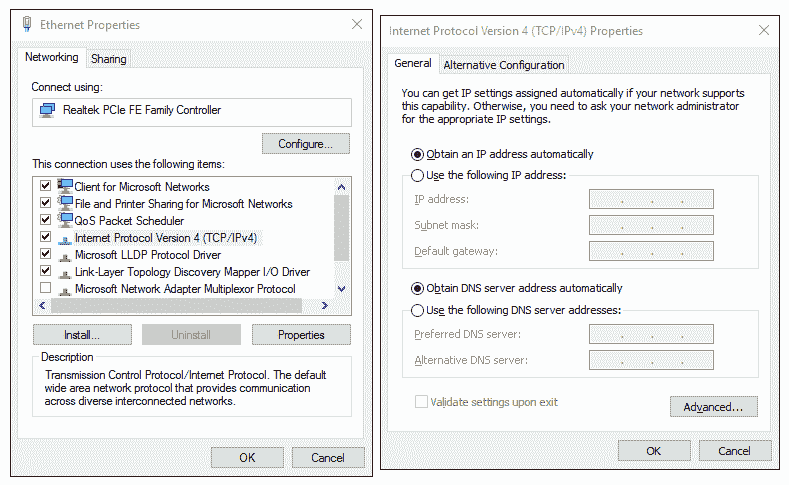

Selecting the TCP/IP properties and checking the settings

5.  如果有两个版本（另一个是版本 6），请选择名为 Internet 协议（TCP/IP）或 Internet 协议版本 4（TCP/IPv4）的项目，然后单击属性按钮。
6.  您可以通过使用自动设置或特定 IP 地址确认网络已设置（如果是，请注意此地址和其他详细信息，因为您可能希望在以后恢复设置）。

要检查 Linux 上的网络设置，请执行以下步骤：

1.  打开“网络设置”对话框并选择“配置接口”。请参阅以下屏幕截图：


Linux Network Settings dialog box

2.  如果手动设置了任何设置，请确保记下它们，以便以后可以根据需要恢复它们。

要检查 macOS X 上的网络设置，请执行以下步骤：

1.  打开系统首选项并单击网络。然后，您可以确认 IP 地址是否自动分配（使用 DHCP）。

2.  如果手动设置了任何设置，请确保记下这些设置，以便以后可以在需要时还原它们。请参阅以下屏幕截图：


OS X Network Settings dialog box

如果您只需要在没有互联网连接的情况下访问或控制 Raspberry Pi，请参阅*中的*直接网络链接*部分，这里有更多。。。*部分。

# 怎么做。。。

首先，我们需要在网络设备上启用 ICS。在这种情况下，我们将共享互联网，通过以太网连接到 Raspberry Pi 的无线网络连接可用。

对于 Windows，请执行以下步骤：

1.  返回网络适配器列表，右键单击将
    链接到互联网的连接（在本例中为 WiFi 或无线网络连接设备），然后单击属性：

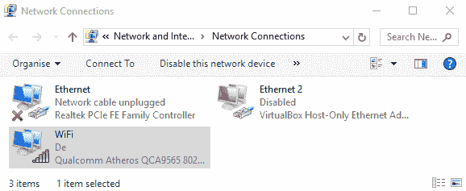

Locating your wired network connection

2.  在窗口顶部，选择第二个选项卡（在 Windows XP 中称为高级；在 Windows 7 和 Windows 10 中称为共享），如以下屏幕截图所示：


Selecting the TCP/IP properties and noting the allocated IP address

3.  在 Internet 连接共享部分，选中允许其他网络用户通过此计算机的 Internet 连接进行连接的复选框（如果存在，请使用下拉框选择家庭网络连接：选项为以太网或局域网连接）。单击 OK 并确认您以前是否为局域网连接设置了固定 IP 地址。

对于 macOS X，要启用 ICS，请执行以下步骤：

1.  单击系统首选项，然后单击共享。
2.  单击 Internet 共享并选择要共享 Internet 的连接（在本例中，将是 Wi-Fi 机场）。然后选择将 Raspberry Pi 连接到的连接（在本例中为以太网）。

对于 Linux，要启用 ICS，请执行以下步骤：

1.  从系统菜单中，单击首选项，然后单击网络连接。选择要共享的连接（在本例中为无线连接），然后单击编辑或配置。在“IPv4 设置”选项卡中，将“方法”选项更改为“共享给其他计算机”。

网络适配器的 IP 地址将是要在 Raspberry Pi 上使用的**网关 IP**地址，并将在相同范围内分配一个 IP 地址（除最后一个数字外，所有 IP 地址都将匹配）。例如，如果计算机的有线连接现在有`192.168.137.1`，则 Raspberry Pi 的网关 IP 将为`192.168.137.1`，其自身的 IP 地址可能设置为`192.168.137.10`。

幸运的是，由于操作系统的更新，Raspbian 现在将自动分配合适的 IP 地址以加入网络，并适当设置网关。然而，除非我们有一个屏幕连接到 Raspberry Pi 或扫描我们网络上的设备，否则我们不知道 Raspberry Pi 给了自己什么 IP 地址。

幸运的是（正如*网络中提到的，通过*部分中的 LAN 连接器*将您的 Raspberry Pi 连接到互联网，还有更多……*部分），苹果的**Bonjour**软件将自动确保网络上的主机名正确注册。如前所述，如果您有一个 MacOSX，您将已经运行了 Bonjour。在 Windows 上，您可以安装 iTunes，也可以单独安装（可从[获得）https://support.apple.com/kb/DL999](https://support.apple.com/kb/DL999) 。默认情况下，可以使用主机名**raspberrypi**。

我们现在准备测试新连接，如下所示：

1.  将网络电缆连接到 Raspberry Pi 和计算机的网络端口，然后接通 Raspberry Pi 的电源，确保您已重新插入 SD 卡（如果先前已卸下 SD 卡）。要重新启动 Raspberry Pi，如果您在那里编辑了文件，请使用`sudo reboot`重新启动它。
2.  让树莓皮充分通电一两分钟。我们现在可以测试连接。

3.  从连接的笔记本电脑或计算机上，通过使用 Raspberry Pi 的主机名 ping 测试连接，如以下命令所示（在 Linux 或 OS X 上，添加`-c 4`以限制四条消息，或按 Ctrl+C 退出）：

```py
ping raspberrypi  
```

希望你能找到一个正常的联系，并收到来自
树莓 Pi 的回复。

如果您有一个键盘和一个屏幕连接到 Raspberry Pi，您可以执行以下
步骤：

1.  您可以从 Raspberry Pi 终端 ping 计算机作为回报（例如，`192.168.137.1`），如下所示：

```py
sudo ping 192.168.137.1 -c 4  
```

2.  假设您不通过代理服务器访问互联网，您可以使用`ping`连接到一个知名网站，测试到互联网的链接，如下所示：

```py
sudo ping www.raspberrypi.org -c 4  
```

如果一切顺利，你将有完整的互联网可通过你的电脑 Raspberry Pi，让你浏览网页以及更新和安装新软件。

如果连接失败，请执行以下步骤：

1.  重复该过程，确保前三组数字与 Raspberry Pi 和网络适配器 IP 地址匹配。
2.  您还可以检查 Raspberry Pi 通电时，是否使用以下命令设置了正确的 IP 地址：

```py
hostname -I  
```

3.  检查防火墙设置，确保防火墙未阻止内部网络连接。

# 它是如何工作的。。。

当我们在主计算机上启用 ICS 时，操作系统将自动为计算机分配一个新的 IP 地址。一旦连接并通电，Raspberry Pi 将自己设置为兼容的 IP 地址，并将主计算机 IP 地址用作 Internet 网关。

通过使用 Apple Bonjour，我们可以使用`raspberrypi`主机名从连接的计算机连接到 Raspberry Pi。

最后，我们检查计算机是否可以通过与 Raspberry Pi 的直接网络链接，通过另一种方式，以及通过互联网进行通信。

# 还有更多。。。

如果您不需要 Raspberry Pi 上的 internet，或者您的计算机只有一个网络适配器，您仍然可以通过直接网络链接将计算机连接在一起。请参阅下图：

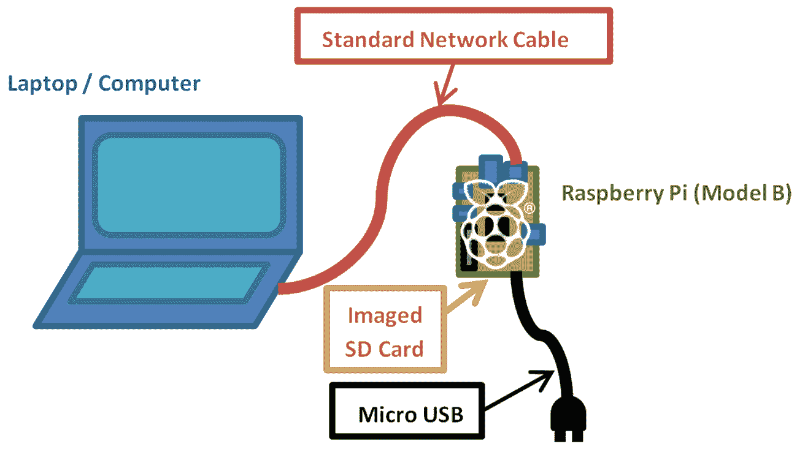

Connecting and using Raspberry Pi with just a network cable, a standard imaged SD card, and power

# 直接网络链接

要使网络链接在两台计算机之间工作，它们需要使用相同的地址范围。允许的地址范围由子网掩码决定（例如，`255.255.0.0`或`255.255.255.0`意味着除最后两个 IP 地址外，所有 IP 地址都应该相同，或者只是 IP 地址中的最后一个数字；否则，它们将被过滤）。

要在不启用 ICS 的情况下使用直接链接，请检查要连接到的适配器的 IP 设置，并确定它是自动分配还是固定到
特定 IP 地址。

大多数直接连接到另一台计算机的 PC 将分配范围为`169.254.X.X`的 IP 地址（子网掩码为`255.255.0.0`）。但是，我们必须确保网络适配器设置为自动获取 IP 地址。

为了使 Raspberry Pi 能够通过直接链接进行通信，它需要在相同的地址范围内有一个 IP 地址`169.254.X.X`。如前所述，Raspberry Pi 将自动为自己提供合适的 IP 地址并连接到网络。

因此，假设我们有 Apple Bonjour（前面提到过），我们只需要知道给定给 Raspberry Pi 的主机名（`raspberrypi`。

# 另见

如果没有键盘或屏幕连接到 Raspberry Pi，则可以使用此网络链接远程访问 Raspberry Pi，就像在普通网络上一样（只需使用为连接设置的新 IP 地址）。参考*使用 VNC*通过网络远程连接 Raspberry Pi 和*使用 SSH（和 X11 转发）*通过网络远程连接 Raspberry Pi。

在我的网站[上有很多附加信息 https://pihw.wordpress.com/guides/direct-network-connection](https://pihw.wordpress.com/guides/direct-network-connection) ，包括额外的故障排除提示和其他几种无需专用屏幕和键盘即可连接到 Raspberry Pi 的方法。

# 通过 USB Wi-Fi 加密狗联网并将 Raspberry Pi 连接至互联网

通过在 Raspberry Pi 的 USB 端口上添加一个**USB Wi-Fi 加密狗**，即使没有内置 Wi-Fi 的机型也可以连接并使用 Wi-Fi 网络。

# 准备

您需要获得合适的 USB Wi-Fi 加密狗，在某些情况下，您可能需要一个带电源的 USB 集线器（这取决于您拥有的 Raspberry Pi 的硬件版本和电源质量）。USB Wi-Fi 加密狗的一般适用性因内部使用的芯片组和可用的 Linux 支持级别而异。您可能会发现，一些 USB Wi-Fi 加密狗在不安装其他驱动程序的情况下可以正常工作（在这种情况下，您可以跳到为无线网络配置它）。

支持的 Wi-Fi 适配器列表位于[http://elinux.org/RPi_USB_Wi-Fi_Adapters](http://elinux.org/RPi_USB_Wi-Fi_Adapters) 。

您需要确保您的 Wi-Fi 适配器也与预期网络兼容；例如，它支持相同类型的信号**802.11bgn**和加密**WEP**、**WPA**和**WPA2**（尽管大多数网络向后兼容）。

您还需要网络的以下详细信息：

*   **服务集标识符（SSID）**：这是您的 Wi-Fi 网络的名称，如果您使用以下命令，则应可见：

```py
sudo iwlist scan | grep SSID  
```

*   **加密类型和密钥**：该值将为 None、WEP、WPA 或 WPA2，密钥将是您在将手机或笔记本电脑连接到无线网络时通常输入的代码（有时会在路由器上打印）。

您需要一个工作的 internet 连接（即有线以太网）来下载所需的驱动程序。否则，您可能能够找到所需的固件文件（它们将是`.deb`文件）并将其复制到 Raspberry Pi（即，通过 USB 闪存驱动器；如果您在桌面模式下运行，驱动器应自动安装）。使用以下命令将文件复制到适当的位置并安装：

```py
sudo apt-get install firmware_file.deb  
```

# 怎么做。。。

此任务分为两个阶段：首先，我们为 Wi-Fi 适配器识别并安装固件，然后我们需要为无线网络配置固件。

我们将尝试识别您的 Wi-Fi 适配器（处理连接的部分）的芯片组；这可能与设备的实际制造商不匹配。

使用以下命令可以找到受支持固件的大致列表：

```py
sudo apt-cache search wireless firmware  
```

这将产生与以下输出类似的结果（忽略包标题中没有`firmware`的任何结果）：

```py
atmel-firmware - Firmware for Atmel at76c50x wireless networking chips.
firmware-atheros - Binary firmware for Atheros wireless cards
firmware-brcm80211 - Binary firmware for Broadcom 802.11 wireless cards
firmware-ipw2x00 - Binary firmware for Intel Pro Wireless 2100, 2200 and 2915
firmware-iwlwifi - Binary firmware for Intel PRO/Wireless 3945 and 802.11n cards
firmware-libertas - Binary firmware for Marvell Libertas 8xxx wireless cards
firmware-ralink - Binary firmware for Ralink wireless cards
firmware-realtek - Binary firmware for Realtek wired and wireless network adapters
libertas-firmware - Firmware for Marvell's libertas wireless chip series (dummy package)
zd1211-firmware - Firmware images for the zd1211rw wireless driver  
```

要查找无线适配器的芯片组，请将 Wi-Fi 适配器插入 Raspberry Pi，然后从终端运行以下命令：

```py
dmesg | grep 'Product:|Manufacturer:'
```

This command stitches together two commands into one. First, `dmesg` displays the message buffer of the kernel (this is an internal record of system events that have occurred since power on, such as detected USB devices). You can try the command on its own to observe the complete output.

`|`（管道）向`grep`命令发送输出；`grep 'Product:|Manufacturer'`检查它，只返回包含`Product`或`Manufacturer`的行（因此我们应该得到列为`Product`和`Manufacturer`的任何项目的摘要）。如果您找不到任何东西或想查看所有 USB 设备，请尝试使用`grep 'usb'`命令。

这应该会返回类似于以下输出的东西在这种情况下，我有一个`ZyXEL`设备，它有一个`ZyDAS`芯片组（快速谷歌搜索显示`zd1211-firmware`是针对`ZyDAS`设备的）：

```py
[    1.893367] usb usb1: Product: DWC OTG Controller
[    1.900217] usb usb1: Manufacturer: Linux 3.6.11+ dwc_otg_hcd
[    3.348259] usb 1-1.2: Product: ZyXEL G-202
[    3.355062] usb 1-1.2: Manufacturer: ZyDAS  
```

一旦您确定了您的设备和正确的固件，您就可以像通过`apt-get`提供的任何其他软件包一样安装它（其中`zd1211-firmware`可以替换为您所需的固件）。这在以下命令中显示：

```py
sudo apt-get install zd1211-firmware  
```

卸下并重新插入 USB Wi-Fi 加密狗，以便检测并加载驱动程序。我们现在可以测试新适配器是否正确安装了`ifconfig`。输出如下所示：

```py
wlan0     IEEE 802.11bg  ESSID:off/any
 Mode:Managed  Access Point: Not-Associated   Tx-Power=20 dBm
 Retry  long limit:7   RTS thr:off   Fragment thr:off
 Power Management:off  
```

该命令将显示系统上存在的网络适配器。对于 Wi-Fi，如果您安装了多个，则通常为`wlan0`或`wlan1`等。如果没有，请仔细检查所选固件，或者尝试其他固件，或者在站点上查看故障排除提示。

一旦我们为 Wi-Fi 适配器安装了固件，我们将需要为我们希望连接的网络配置它。我们可以使用上一个配方中所示的 GUI，也可以通过终端手动配置 GUI，如以下步骤所示：

1.  我们需要将无线适配器添加到`/etc/network/interfaces`中设置的网络接口列表中，如下所示：

```py
sudo nano -c /etc/network/interfaces   
```

如果需要，使用前面的`wlan#`值代替`wlan0`，添加以下命令：

```py
allow-hotplug wlan0
iface wlan0 inet manual
wpa-conf /etc/wpa_supplicant/wpa_supplicant.conf  
```

更改完成后，按*Ctrl*+*X*、*Y*和*Enter*保存并退出。

2.  我们现在将把我们网络的 Wi-Fi 网络设置存储在`wpa_supplicant.conf`文件中（如果您的网络没有使用`wpa`加密，请不要担心；它只是该文件的默认名称）：

```py
sudo nano -c /etc/wpa_supplicant/wpa_supplicant.conf  
```

它应包括以下内容：

```py
ctrl_interface=DIR=/var/run/wpa_supplicant GROUP=netdev 
update_config=1 
country=GB 
```

网络设置可以按如下方式写入该文件（即，如果 SSID 设置为`theSSID`：

```py
network={ 
  ssid="theSSID" 
  key_mgmt=NONE 
} 
```

```py
network={ 
  ssid="theSSID" 
  key_mgmt=NONE 
  wep_key0="theWEPkey" 
} 
```

```py
network={ 
  ssid="theSSID" 
  key_mgmt=WPA-PSK 
  psk="theWPAkey"     
} 
```

3.  您可以使用以下命令启用适配器（如果需要，再次更换`wlan0`：

```py
sudo ifup wlan0

```

使用以下命令列出无线网络连接：

```py
iwconfig

```

您应该可以看到与 SSID 连接的无线网络，如下所示：

```py
wlan0     IEEE 802.11bg  ESSID:"theSSID"
 Mode:Managed  Frequency:2.442 GHz  Access Point: 
       00:24:BB:FF:FF:FF
 Bit Rate=48 Mb/s   Tx-Power=20 dBm
 Retry  long limit:7   RTS thr:off   Fragment thr:off
 Power Management:off
 Link Quality=32/100  Signal level=32/100
 Rx invalid nwid:0  Rx invalid crypt:0  Rx invalid frag:0
 Tx excessive retries:0  Invalid misc:15   Missed beacon:0  
```

如果没有，请调整您的设置，使用`sudo ifdown wlan0`关闭网络接口，然后使用`sudo ifup wlan0`重新打开。这将确认您已成功连接到 Wi-Fi 网络。

4.  最后，我们需要检查我们是否可以访问互联网。这里，我们假设网络自动配置了 DHCP，并且没有使用代理服务器。如果没有，请参考*通过代理服务器*连接互联网的方法。

拔下有线网络电缆（如果仍然连接），然后查看是否可以 ping Raspberry Pi 网站，如下所示：

```py
**sudo ping** www.raspberrypi.org  
```

If you want to quickly know the IP address currently in use by Raspberry Pi, you can use `hostname -I`, or to find out which adapter is connected to which IP address, use `ifconfig`.

# 还有更多。。。

Raspberry Pi 的 A 型版本没有内置的网络端口，因此为了获得网络连接，必须添加 USB 网络适配器（如前一节所述，可以是 Wi-Fi 加密狗，也可以是 LAN-to-USB 适配器，如下一节所述）。

# 使用 USB 有线网络适配器

就像 USB Wi-Fi 一样，适配器支持将取决于使用的芯片组和可用的驱动程序。除非设备附带 Linux 驱动程序，否则您可能需要搜索 internet 以获得合适的 Debian Linux 驱动程序。

如果找到合适的`.deb`文件，可以使用以下命令安装：

```py
sudo apt-get install firmware_file.deb  
```

另外，请使用`ifconfig`进行检查，因为某些设备将自动支持，显示为`eth1`（或`eth0`在 A 型上），并立即准备好使用。

# 通过代理服务器连接到 internet

有些网络，例如工作场所或学校内的网络，通常要求您通过代理服务器连接到 internet。

# 准备

您需要尝试连接到的代理服务器的地址，包括用户名和密码（如果需要）。

您应该确认 Raspberry Pi 已连接到网络，并且可以访问代理服务器。

使用`ping`命令进行检查，如下所示：

```py
ping proxy.address.com -c 4  
```

如果失败（您没有得到响应），则需要确保网络设置正确后才能继续。

# 怎么做。。。

1.  使用`nano`创建一个新文件，如下所示（如果文件中已经有一些内容，您可以在末尾添加代码）：

```py
sudo nano -c ~/.bash_profile
```

2.  要在使用代理服务器时通过**Midori**等程序进行基本的 web 浏览，您可以使用以下脚本：

```py
function proxyenable { 
# Define proxy settings 
PROXY_ADDR="proxy.address.com:port" 
# Login name (leave blank if not required): 
LOGIN_USER="login_name" 
# Login Password (leave blank to prompt): 
LOGIN_PWD= 
#If login specified - check for password 
if [[ -z $LOGIN_USER ]]; then 
  #No login for proxy 
  PROXY_FULL=$PROXY_ADDR 
else 
  #Login needed for proxy Prompt for password -s option hides input 
  if [[ -z $LOGIN_PWD ]]; then 
    read -s -p "Provide proxy password (then Enter):" LOGIN_PWD 
    echo 
  fi 
  PROXY_FULL=$LOGIN_USER:$LOGIN_PWD@$PROXY_ADDR 
fi 
#Web Proxy Enable: http_proxy or HTTP_PROXY environment variables 
export http_proxy="http://$PROXY_FULL/" 
export HTTP_PROXY=$http_proxy 
export https_proxy="https://$PROXY_FULL/" 
export HTTPS_PROXY=$https_proxy 
export ftp_proxy="ftp://$PROXY_FULL/" 
export FTP_PROXY=$ftp_proxy 
#Set proxy for apt-get 
sudo cat <<EOF | sudo tee /etc/apt/apt.conf.d/80proxy > /dev/null 
Acquire::http::proxy "http://$PROXY_FULL/"; 
Acquire::ftp::proxy "ftp://$PROXY_FULL/"; 
Acquire::https::proxy "https://$PROXY_FULL/"; 
EOF 
#Remove info no longer needed from environment 
unset LOGIN_USER LOGIN_PWD PROXY_ADDR PROXY_FULL 
echo Proxy Enabled 
} 

function proxydisable { 
#Disable proxy values, apt-get and git settings 
unset http_proxy HTTP_PROXY https_proxy HTTPS_PROXY 
unset ftp_proxy FTP_PROXY 
sudo rm /etc/apt/apt.conf.d/80proxy 
echo Proxy Disabled 
} 
```

3.  完成后，按*Ctrl*+*X*、*Y*和*回车键保存并退出。*

The script is added to the user's own `.bash_profile` file, which is run when that particular user logs in. This will ensure that the proxy settings are kept separately for each user. If you want all users to use the same settings, you can add the code to `/etc/rc.local` instead (this file must have `exit 0` at the end).

# 它是如何工作的。。。

许多使用互联网的程序会在连接之前检查`http_proxy`或`HTTP_PROXY`环境变量。如果它们存在，它们将使用代理设置通过进行连接。一些程序也可能使用`HTTPS`和`FTP`协议，因此我们也可以在此处为它们设置代理设置。

If a username is required for the proxy server, a password will be prompted for. It is generally not recommended to store your passwords inside scripts unless you are confident that no one else will have access to your device (either physically or through the internet).

最后一部分允许使用`sudo`命令执行的任何程序在充当超级用户时使用代理环境变量（大多数程序将首先尝试使用正常权限访问网络，即使是作为超级用户运行，因此并不总是需要）。

# 还有更多。。。

我们还需要允许某些程序使用代理设置，这些程序在访问网络时使用超级用户权限（这取决于程序；大多数程序不需要）。我们需要通过执行以下步骤将命令添加到`/etc/sudoers.d/`中存储的文件中：

1.  使用以下命令打开一个新的`sudoer`文件：

```py
sudo visudo -f /etc/sudoers.d/proxy  
```

2.  在文件中输入以下文本（单行）：

```py
Defaults env_keep += "http_proxy HTTP_PROXY https_proxy HTTPS_PROXY ftp_proxy FTP_PROXY"  
```

3.  完成后，按*Ctrl*+*X*、*Y*和*回车键保存并退出；*不要更改`proxy.tmp`文件名（这对于`visudo`来说是正常的；完成后会将其更改为代理）。
4.  如果提示`What now?`，则说明命令中存在错误。按*X*退出，不保存，重新输入命令。
5.  重新启动后（使用`sudo reboot`，您将能够使用以下命令分别启用和禁用代理：

```py
proxyenable
proxydisable  
```

It is important to use `visudo` here, as it ensures the permissions of the file are created correctly for the `sudoers` directory (read only by the `root` user).

# 使用 VNC 通过网络远程连接到 Raspberry Pi

通常，最好通过网络远程连接和控制 Raspberry Pi，例如，使用笔记本电脑或台式计算机作为屏幕和键盘，或者当 Raspberry Pi 连接到其他地方时，甚至可能连接到它需要接近的某些硬件。

VNC 只是远程连接到 Raspberry Pi 的一种方式。它将创建一个可远程控制和访问的新桌面会话。这里的 VNC 会话与 Raspberry Pi 显示器上可能处于活动状态的会话是分开的。

# 准备

确保您的 Raspberry Pi 已通电并连接到 internet。我们将使用互联网连接安装使用`apt-get`的程序。这是一个允许我们直接从官方存储库查找和安装应用程序的程序。

# 怎么做。。。

1.  首先，我们需要使用以下命令在 Raspberry Pi 上安装 TightVNC 服务器。建议先运行一个`update`命令，以获取要安装的软件包的最新版本，如下所示：

```py
sudo apt-get update
sudo apt-get install tightvncserver  
```

2.  接受安装提示并等待安装完成。要启动会话，请使用以下命令：

```py
vncserver :1  
```

3.  第一次运行此操作时，它会要求您输入密码（不超过八个字符）以访问桌面（您将在从计算机连接时使用此密码）。

以下消息应确认已启动新的桌面会话：

```py
New 'X' desktop is raspberrypi:1  
```

如果您还不知道 Raspberry Pi 的 IP 地址，请使用`hostname -I`并记下它。

接下来，我们需要运行一个 VNC 客户机。**VNC 查看器**是合适的程序，可在[上获得 http://www.realvnc.com/](http://www.realvnc.com/) 应该可以在 Windows、Linux 和 OS X 上使用。

运行 VNC Viewer 时，系统将提示您输入服务器地址和加密类型。将树莓 Pi 的 IP 地址与`:1`一起使用。也就是说，对于 IP 地址`192.168.1.69`，使用`192.168.1.69:1`地址。

您可以将加密类型保留为“关闭”或“自动”。

根据您的网络，您可以使用主机名；默认为`raspberrypi`，即`raspberrypi:1`。

您可能会收到关于之前未连接到计算机或未加密的警告。如果您使用的是公共网络或通过 internet 进行连接，则应启用加密（以阻止其他人截获您的数据）。

# 还有更多。。。

可以向命令行添加选项，以指定分辨率和显示的颜色深度。分辨率和颜色深度越高（可以调整为每像素使用 8 位到 32 位，以提供低或高颜色细节），通过网络链路传输的数据就越多。如果您发现刷新速率有点慢，请尝试按如下方式减少这些数字：

```py
vncserver :1 -geometry 1280x780 -depth 24  
```

为了允许 VNC 服务器在您打开时自动启动，您可以将`vncserver`命令添加到`.bash_profile`（每次 Raspberry Pi 启动时都会执行此命令）。

按如下方式使用`nano`编辑器（`-c`选项允许显示行号）：

```py
sudo nano -c ~/.bash_profile  
```

在文件末尾添加以下行：

```py
vncserver :1  
```

下次通电时，您应该能够使用 VNC 从
另一台计算机远程连接。

# 使用 SSH（和 X11 转发）通过网络远程连接到 Raspberry Pi

**安全外壳**（**SSH**）通常是进行远程连接的首选方法，因为它只允许终端连接，并且通常需要较少的资源。

SSH 的一个额外功能是能够将**X11**数据传输到您机器上运行的**X Windows**服务器。这允许您启动通常在 Raspberry Pi desktop 上运行的程序，这些程序将显示在本地计算机上自己的窗口中，如下所示：


X11 forwarding on a local display

X11 转发可用于显示 Windows 计算机上 Raspberry Pi 上运行的应用程序。

# 准备

如果您正在运行最新版本的 Raspbian，默认情况下将启用 SSH 和 X11 转发（否则，请仔细检查*如何工作…*部分中解释的设置）。

# 怎么做。。。

Linux 和 OS X 内置了对 X11 转发的支持，但如果您使用的是 Windows，则需要在计算机上安装并运行 X Windows 服务器。

从**Xming**站点[下载并运行`xming`http://sourceforge.net/projects/xming/](http://sourceforge.net/projects/xming/) ）。

安装`xming`，按照安装步骤进行，包括安装**腻子**如果您还没有的话。您也可以从[单独下载腻子 http://www.putty.org/](http://www.putty.org/) 。

接下来，我们需要确保我们使用的 SSH 程序在连接时启用了 X11。

对于窗户，我们将使用腻子连接到树莓皮。

在 PuTTY 配置对话框中，导航到连接| SSH | X11，并勾选启用 X11 转发复选框。如果您将 X 显示位置选项留空，它将假定默认的`Server 0:0`如下所示（运行时，您可以通过将鼠标移到系统托盘中的 Xming 图标上来确认服务器编号）：


Enabling X11 forwarding within the PuTTY configuration

在会话设置中输入 Raspberry Pi 的 IP 地址（您可能还会发现，您可以在此处使用 Raspberry Pi 的主机名；默认主机名为`raspberrypi`。

使用合适的名称`RaspberryPi`保存设置，然后单击“打开”连接到您的 Raspberry Pi。

您可能会看到一条警告消息弹出，说明您以前没有连接到计算机（这允许您在继续之前检查是否一切正常）：

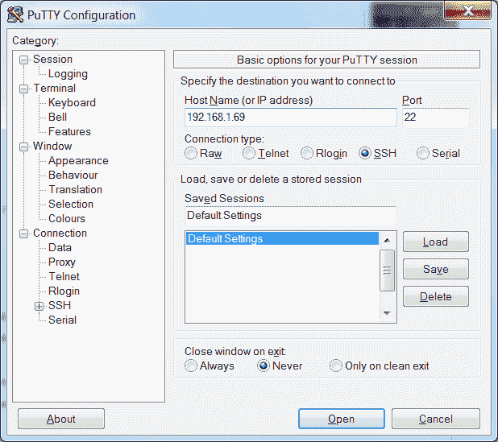

Opening an SSH connection to Raspberry Pi using PuTTY

对于 OSX 或 Linux，单击终端打开到 Raspberry Pi 的连接。

使用以下命令连接默认的`pi`用户名，IP 地址为`192.168.1.69`；`-X`选项启用 X11 转发：

```py
ssh -X pi@192.168.1.69  
```

如果一切正常，您应该会收到输入密码的提示（记住`pi`用户的默认值是`raspberry`。

通过从计算机的“开始”菜单启动 Xming 程序，确保 Xming 正在运行。然后，在终端窗口中，键入一个通常在 Raspberry Pi 桌面中运行的程序，例如`leafpad`或`scratch`。稍等片刻，该程序就会出现在您的计算机桌面上（如果出现错误，您可能忘记启动 Xming，因此请运行它并重试）。

# 它是如何工作的。。。

X Windows 和 X11 提供了 Raspberry Pi（以及许多其他基于 Linux 的计算机）可以作为桌面的一部分显示和控制图形窗口的方法。

为了使 X11 转发在网络连接上工作，我们需要在 Raspberry Pi 上同时启用 SSH 和 X11 转发。执行以下步骤：

1.  要打开（或关闭）SSH，您可以访问桌面上 Preferences 菜单下的 Raspberry Pi Configuration
    程序，并单击 Interfaces 选项卡中的 SSH，如以下屏幕截图所示（大多数发行版通常默认启用 SSH，以帮助允许远程连接，而无需监视器进行配置）：

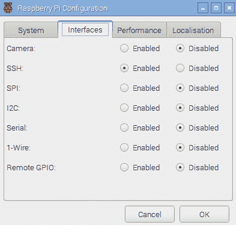

The advanced settings menu in the raspi-config tool

2.  确保 Raspberry Pi 上启用了 X11 转发（同样，大多数发行版现在默认启用了此功能）。
3.  将`nano`与以下命令一起使用：

```py
sudo nano /etc/ssh/sshd_config  
```

4.  在`/etc/ssh/sshd_config`文件中查找控制 X11 转发的一行，并确保其显示为`yes`（前面没有`#`符号），如下所示：

```py
X11Forwarding yes  
```

5.  按*Ctrl*+*X*、*Y*和*输入*并重新启动（如果需要更改）即可保存，如下所示：

```py
sudo reboot  
```

# 还有更多。。。

SSH 和 X11 转发是远程控制 Raspberry Pi 的便捷方式；在下面的部分中，我们将探讨如何有效地使用它的一些附加提示。

# 使用 X11 转发运行多个程序

如果您想运行一个**X 程序**，但仍然可以使用同一个终端控制台进行其他操作，您可以在后台用`&`运行如下命令：

```py
leafpad &  
```

只要记住，你运行的程序越多，一切都会变得越慢。您可以通过键入`fg`切换到后台程序，并使用`bg`检查后台任务。

# 作为带有 X11 转发的桌面运行

您甚至可以通过 X11 运行一个完整的桌面会话，尽管它对用户不是特别友好，而且 VNC 将产生更好的结果。要实现这一点，您必须使用`lxsession`而不是`startx`（按照您通常从终端启动桌面的方式）。

另一种选择是使用`lxpanel`，它提供了程序菜单栏，您可以从菜单中启动和运行程序，就像在桌面上一样。

# 使用 X11 转发运行 Pygame 和 Tkinter

在运行**Pygame**或**Tkinter**脚本时，您可能会出现以下错误（或类似错误）：

```py
_tkinter.TclError: couldn't connect to display "localhost:10.0"  
```

在这种情况下，请使用以下命令修复错误：

```py
sudo cp ~/.Xauthority ~root/ 
```

# 与 SMB 共享 Raspberry Pi 的主文件夹

当您将 Raspberry Pi 连接到网络时，您可以通过设置文件共享来访问主文件夹；这使传输文件变得更加容易，并提供了一种快速、简便的数据备份方法。**服务器消息块**（**SMB**是一种与 Windows 文件共享、OS X 和 Linux 兼容的协议。

# 准备

确保您的 Raspberry Pi 已通电，并在与 internet 的正常连接下运行。

您还需要同一本地网络上的另一台计算机来测试新共享。

# 怎么做。。。

首先，我们需要安装`samba`，这是一款处理文件夹共享的软件，其格式与 Windows 共享方法兼容：

1.  确保您按以下方式使用`update`以获取最新的可用软件包列表：

```py
sudo apt-get update
sudo apt-get install samba  
```

安装将需要大约 20 MB 的空间，需要几分钟的时间。

2.  安装完成后，我们可以制作配置文件的副本，如下所示，以便在需要时恢复默认值：

```py
sudo cp /etc/samba/smb.conf /etc/samba/smb.conf.backup
sudo nano /etc/samba/smb.conf  
```

向下滚动找到名为`Authentication`的部分；将`# security = user`行更改为`security = user`。

如文件中所述，此设置确保您必须输入 Raspberry Pi 的用户名和密码才能访问文件（这对于共享网络很重要）。

找到名为`Share Definitions`和`[homes]`的区段，并将`read only = yes`行更改为`read only = no`。

这将允许我们查看文件并将文件写入共享主文件夹。完成后，按*Ctrl*+*X*、*Y*和*回车键保存并退出。*

If you have changed the default user from `pi` to something else, substitute it in the following instructions.

3.  现在我们可以添加`pi`（默认用户）来使用`samba`：

```py
sudo pdbedit -a -u pi
```

4.  现在，输入一个密码（您可以使用与登录相同的密码，也可以选择不同的密码，但不要使用默认的树莓密码，这很容易让人猜到）。重新启动`samba`使用新的配置文件，如下所示：

```py
sudo /etc/init.d/samba restart
[ ok ] Stopping Samba daemons: nmbd smbd.
[ ok ] Starting Samba daemons: nmbd smbd.  
```

5.  要进行测试，您需要知道 Raspberry Pi 的`hostname`（默认`hostname`为`raspberrypi`或其 IP 地址。您可以使用以下命令找到这两个选项：

```py
hostname
```

6.  IP 地址增加`-I`：

```py
hostname -I  
```

在网络上的另一台计算机上，在浏览器路径中输入`\raspberrypipi`地址。

根据您的网络，计算机应在网络上找到 Raspberry Pi，并提示输入用户名和密码。如果使用`hostname`找不到共享，可以直接使用 IP 地址，其中`192.168.1.69`应该更改为匹配 IP 地址`\192.168.1.69pi`。

# 保持树莓皮最新

Raspberry Pi 使用的 Linux 映像经常更新，以包括对系统的增强、修复和改进，以及添加对新硬件的支持或对最新主板的更改。您安装的许多软件包也可以更新。

如果您计划在另一个 Raspberry Pi 板（尤其是较新的板）上使用相同的系统映像，这一点尤其重要，因为较旧的映像将不支持任何配线更改或替代 RAM 芯片。新的固件应该在旧的 Raspberry Pi 板上工作，但旧的固件可能与最新的硬件不兼容。

幸运的是，您不必每次有新版本时都重新刷新 SD 卡，因为您可以对其进行更新。

# 准备

您需要连接到 internet 才能更新系统。最好先备份您的映像（至少备份一份重要文件）。

您可以使用`uname -a`命令检查当前版本的固件，如下所示：

```py
Linux raspberrypi 4.4.9-v7+ #884 SMP Fri May 6 17:28:59 BST 2016 armv7l GNU/Linux  
```

可以使用`/opt/vc/bin/vcgencmd version`命令检查 GPU 固件，如下所示：

```py
 May  6 2016 13:53:23
Copyright (c) 2012 Broadcom
version 0cc642d53eab041e67c8c373d989fef5847448f8 (clean) (release)
```

如果在较新的板上使用较旧版本的固件（2012 年 11 月之前），这一点很重要，因为原始的 B 型板只有 254 MB RAM。升级允许固件使用额外内存（如果可用）。

`free -h`命令将详细说明主处理器可用的 RAM（总 RAM 在 GPU 和 ARM 内核之间分配），并给出以下输出：

```py
                 total       used       free     shared    buffers     cached
    Mem:          925M       224M       701M       7.1M        14M       123M
    -/+ buffers/cache:        86M       839M
    Swap:          99M         0B        99M

```

然后，您可以在重新启动后重新检查前面的输出，以确认它们已被更新（尽管它们可能已经是最新的）。

# 怎么做。。。

1.  在运行任何升级或安装任何软件包之前，请确保存储库中有最新的软件包列表。`update`命令获取可用软件和版本的最新列表：

```py
sudo apt-get update  
```

2.  如果您只想获得当前软件包的升级，`upgrade`将使其全部更新：

```py
sudo apt-get upgrade
```

3.  为确保您正在运行最新版本的 Raspbian，您可以运行`dist-upgrade`（请注意：这可能需要一个小时左右，具体取决于需要升级的数量）。这将执行`upgrade`将执行的所有更新，但也将删除冗余包并清理：

```py
sudo apt-get dist-upgrade  
```

这两种方法都将升级软件，包括引导和启动时使用的固件（`bootcode.bin`和`start.elf`。

4.  要更新固件，可以使用以下命令：

```py
sudo rpi-update  
```

# 还有更多。。。

您经常会发现，您需要对安装程序执行干净的安装，然而，这意味着您必须从头开始安装所有内容。为了避免这种情况，我开发了 Pi 厨房项目（[https://github.com/PiHw/Pi-Kitchen](https://github.com/PiHw/Pi-Kitchen) ），基于*凯文山*的基础。这旨在为创建可自动部署到 SD 卡的自定义设置提供一个灵活的平台：


Pi Kitchen allows Raspberry Pi to be configured before powering up

Pi Kitchen 允许配置一系列口味，可以从 NOOBS 菜单中选择。每种口味都由一系列配方组成，每种配方都为最终的操作系统提供了特定的功能。方法包括为 Wi-Fi 设备设置自定义驱动程序、映射网络上的共享驱动程序，以及提供一个功能齐全的现成 web 服务器，所有这些结合起来都可以实现所需的设置。

这个项目是 beta 版的，作为概念验证而开发的，但是一旦你配置好了所有的东西，将完全工作的设置直接部署到 SD 卡上会非常有用。最终，该项目可以与 Kevin Hill 的 NOOBS 高级版本结合，名为**PINN 不是 NOOBS**（**PINN**），旨在为高级用户提供额外功能，例如允许将操作系统和配置存储在网络或外部 USB 记忆棒上。***