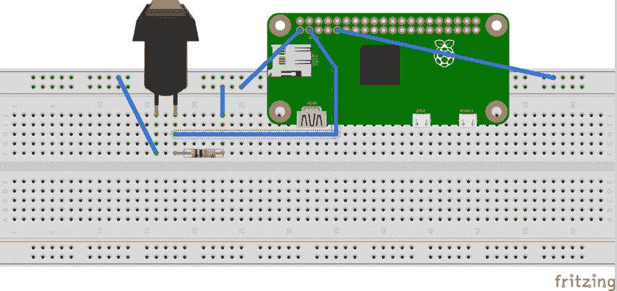

# 条件语句、函数和列表

在本章中，我们将以您在上一章学到的知识为基础。您将了解条件语句以及如何使用逻辑运算符检查使用条件语句的条件。接下来，您将学习用 Python 编写简单函数，并讨论使用触觉开关（瞬时按钮）将输入接口连接到 Raspberry Pi 的 GPIO 头。我们还将讨论使用 Raspberry Pi Zero 的电机控制（这是最终项目的准备），并使用开关输入控制电机。让我们开始吧！
在本章中，我们将讨论以下主题：

*   Python 中的条件语句
    *   使用条件输入根据 GPIO 引脚状态执行操作
    *   使用条件语句中断循环
*   Python 中的函数
    *   GPIO 回调函数
*   Python 中的电机控制

# 条件语句

在 Python 中，条件语句用于通过测试条件是`true`还是`false`来确定是否满足特定条件。条件语句用于确定程序的执行方式。例如，可以使用条件语句来确定是否是打开灯光的时间。语法如下：

```py
if condition_is_true:

  do_something()
```

通常使用逻辑运算符测试条件，并执行缩进块下的任务集。让我们考虑一个例子，Apple T0~（可用于本章下载），其中用户输入到一个程序需要用一个 Tyl T1 或 Ty2 T2 问题来验证：

```py
check_address = input("Is your address correct(yes/no)? ") 
if check_address == "yes": 
  print("Thanks. Your address has been saved") 
if check_address == "no": 
  del(address) 
  print("Your address has been deleted. Try again")
```

在本例中，程序需要一个`yes`或`no`输入。如果用户提供输入`yes`，条件`if check_address == "yes"`为`true`，则屏幕上打印消息`Your address has been saved`。

同样，如果用户输入为`no`，则程序在逻辑测试条件`if check_address == "no"`下执行缩进代码块，并删除变量`address`。

# if-else 语句

在前面的示例中，我们使用一个`if`语句来测试每个条件。在 Python 中，有一个名为`if-else`语句的替代选项。如果主条件不是`true`，`if-else`语句允许测试替代条件：

```py
check_address = input("Is your address correct(yes/no)? ") 
if check_address == "yes": 
  print("Thanks. Your address has been saved") 
else: 
  del(address) 
  print("Your address has been deleted. Try again")
```

在本例中，如果用户输入为`yes`，则执行`if`下的缩进代码块。否则，执行`else`下的代码块。

# if-elif-else 语句

在上例中，程序对除`yes`之外的任何用户输入执行`else`块下的任何代码，也就是说，如果用户没有提供任何输入或提供随机字符而不是`no`，则`if-elif-else`语句的工作如下：

```py
check_address = input("Is your address correct(yes/no)? ") 
if check_address == "yes": 
  print("Thanks. Your address has been saved") 
elif check_address == "no": 
  del(address) 
  print("Your address has been deleted. Try again") 
else: 
  print("Invalid input. Try again")
```

如果用户输入为`yes`，则执行`if`语句下的缩进代码块。如果用户输入为`no`，则执行`elif`（*否则为*下的缩进代码块。如果用户输入是其他内容，程序将打印消息：`Invalid input. Try again`。

需要注意的是，代码块缩进确定了在满足特定条件时需要执行的代码块。我们建议修改条件语句块的缩进，并了解程序执行情况。这将有助于理解 Python 中缩进的重要性。

在我们目前讨论的三个示例中，可以注意到`if`语句不需要由`else`语句补充。`else`和`elif`语句需要有前面的`if`语句，否则程序执行会导致错误。

# 打破循环

条件语句可用于中断循环执行（`for`循环和`while`循环）。当满足特定条件时，可以使用`if`语句中断循环：

```py
i = 0 
while True: 
  print("The value of i is ", i) 
  i += 1 
  if i > 100: 
    break
```

在前面的示例中，`while`循环在无限循环中执行。`i`的值递增并打印在屏幕上。当`i`的值大于`100`并且`i`的值从 1 打印到 100 时，程序将跳出`while`循环。

# 条件语句的应用：使用 GPIO 执行任务

在上一章中，我们讨论了将输出接口到 Raspberry Pi 的 GPIO。让我们讨论一个简单的按钮被按下的例子。通过读取 GPIO 引脚状态检测按钮按下。我们将使用条件语句来执行基于 GPIO 引脚状态的任务。

让我们将一个按钮连接到 Raspberry Pi 的 GPIO。您只需要开始一个按钮、上拉电阻器和几根跨接导线。后面给出的图显示了将按钮连接到 Raspberry Pi Zero 的图示。按钮的一个端子连接到 Raspberry Pi Zero 的 GPIO 引脚的接地引脚。

按钮界面示意图如下所示：


Raspberry Pi GPIO schematic

使用 10 K 电阻器将按钮的另一个端子拉高至 3.3 V。按钮端子和 10 K 电阻器的接头连接至 GPIO 引脚 2（请参阅前一章中共享的 BCM GPIO 引脚图）。



Interfacing the push button to the Raspberry Pi Zero's GPIO - an image generated using Fritzing

让我们查看查看按钮状态所需的代码。我们使用循环和条件语句来读取使用 Raspberry Pi Zero 的按钮输入。

我们将使用上一章介绍的`gpiozero`库。本节的代码示例为`GPIO_button_test.py`，可随本章一起下载。

在后面的章节中，我们将讨论**面向对象编程**（**OOP**。现在，让我们简要讨论一下本例中类的概念。Python 中的**类**是包含定义对象的所有属性的蓝图。例如，`gpiozero`库的`Button`类包含将按钮连接到 Raspberry Pi Zero 的 GPIO 接口所需的所有属性。这些属性包括按钮状态和检查按钮状态所需的功能等。为了连接按钮并读取其状态，我们需要使用此蓝图。创建此蓝图副本的过程称为实例化。

让我们开始导入`gpiozero`库并实例化`gpiozero`库的`Button`类（我们将在后面的章节中讨论 Python 的类、对象及其属性）。该按钮与 GPIO 引脚 2 连接。我们需要在实例化期间将 pin 码作为参数传递：

```py
from gpiozero import Button 

#button is interfaced to GPIO 2 
button = Button(2)
```

`gpiozero`图书馆的文档可在[获取 http://gpiozero.readthedocs.io/en/v1.2.0/api_input.html](http://gpiozero.readthedocs.io/en/v1.2.0/api_input.html) 。根据文档，`Button`类中有一个名为`is_pressed`的变量，可以使用条件语句进行测试，以确定按钮是否被按下：

```py
if button.is_pressed: 
    print("Button pressed")
```

无论何时按下按钮，屏幕上都会显示信息`Button pressed`。让我们将此代码片段粘贴到无限循环中：

```py
from gpiozero import Button 

#button is interfaced to GPIO 2 
button = Button(2)

while True: 
  if button.is_pressed: 
    print("Button pressed")
```

在无限`while`循环中，只要按下按钮，程序就会不断检查按钮是否按下并打印消息。松开按钮后，将返回检查按钮是否按下。

# 通过计数按钮按下来打破循环

让我们回顾另一个示例，其中我们希望计算按钮按下的次数，并在按钮收到预定的按下次数时打破无限循环：

```py
i = 0 
while True: 
  if button.is_pressed: 
    button.wait_for_release() 
    i += 1 
    print("Button pressed") 

  if i >= 10: 
    break
```

上述示例可作为`GPIO_button_loop_break.py`与本章一起下载。

在本例中，程序检查`is_pressed`变量的状态。当收到按钮按下时，程序可以暂停，直到使用`wait_for_release`方法释放按钮。松开按钮时，用于存储按下次数的变量将递增 1。

当按钮被按下 10 次时，程序将跳出无限循环。


A red momentary push button interfaced to Raspberry Pi Zero GPIO pin 2

# Python 中的函数

我们简要讨论了 Python 中的函数。函数执行一组预定义的任务。`print`是 Python 中函数的一个示例。它可以在屏幕上打印一些东西。让我们讨论一下用 Python 编写自己的函数。

可以使用`def`关键字在 Python 中声明函数。函数可定义如下：

```py
def my_func(): 
   print("This is a simple function")
```

在这个函数`my_func`中，`print`语句写在缩进的代码块下。在代码执行期间调用函数时，将执行在函数定义下缩进的任何代码块。该功能可按`my_func()`执行。

# 向函数传递参数：

函数总是用括号定义的。括号用于将任何必需的参数传递给函数。参数是执行函数所需的参数。在前面的示例中，没有传递给函数的参数。

让我们回顾一个将参数传递给函数的示例：

```py
def add_function(a, b): 
  c = a + b 
  print("The sum of a and b is ", c)
```

在本例中，`a`和`b`是函数的参数。该函数添加`a`和`b`并在屏幕上打印总和。调用函数`add_function`时，将参数`3`和`2`作为`add_function(3,2)`传递，其中`a`分别为`3`和`b`分别为`2`。

因此，执行函数需要参数`a`和`b`，否则调用不带参数的函数将导致错误。通过为参数设置默认值，可以避免与缺少参数相关的错误：

```py
def add_function(a=0, b=0): 
  c = a + b 
  print("The sum of a and b is ", c)
```

前面的函数需要两个参数。如果我们只向这个函数传递一个参数，那么另一个默认为零。例如，`add_function(a=3)`、`b`默认为`0`，或者`add_function(b=2)`、`a`默认为`0`。当调用函数时未提供参数时，它默认为零（在函数中声明）。

类似地，`print`函数打印作为参数传递的任何变量。如果在没有任何参数的情况下调用`print`函数，则会打印一个空行。

# 从函数返回值

函数可以执行一组定义的操作，最后返回一个值。让我们考虑下面的例子：

```py
def square(a): 
   return a**2
```

在本例中，函数返回参数的平方。在 Python 中，`return`关键字用于在执行完成时返回请求的值。

# 函数中变量的作用域

Python 程序中有两种类型的变量：局部变量和全局变量。**局部变量**是函数的局部变量，也就是说，它是在函数中声明的变量，在该函数中是可访问的。示例如下：

```py
def add_function(): 
  a = 3 
  b = 2 
  c = a + b 
  print("The sum of a and b is ", c)
```

在本例中，变量`a`和`b`是函数`add_function`的局部变量。让我们考虑一个例子 T3。

```py
a = 3 
b = 2 
def add_function(): 
  c = a + b 
  print("The sum of a and b is ", c) 

add_function()
```

在本例中，变量`a`和`b`在 Python 脚本的主体中声明。它们可以在整个程序中访问。现在，让我们来考虑这个例子：

```py
a = 3 
def my_function(): 
  a = 5 
  print("The value of a is ", a)

my_function() 
print("The value of a is ", a)
```

程序输出为：

```py
      The value of a is

      5

      The value of a is

      3
```

在这种情况下，调用`my_function`时，脚本主体的`print`语句中`a`的值为`5`，而`a`的值为`3`。在 Python 中，不可能显式修改函数中全局变量的值。为了修改全局变量的值，我们需要使用`global`关键字：

```py
a = 3 
def my_function(): 
  global a 
  a = 5 
  print("The value of a is ", a)

my_function() 
print("The value of a is ", a)
```

一般来说，不建议修改函数内部的变量，因为修改变量不是一种非常安全的做法。最佳实践是将变量作为参数传递并返回修改后的值。考虑下面的例子：

```py
a = 3 
def my_function(a): 
  a = 5 
  print("The value of a is ", a) 
  return a 

a = my_function(a) 
print("The value of a is ", a)
```

在前面的程序中，`a`的值为`3`。它作为参数传递给`my_function`。函数返回`5`，保存到`a`。我们能够安全地修改`a`的值。

# GPIO 回调函数

让我们通过 GPIO 示例来回顾函数的一些用法。函数可用于处理与 Raspberry Pi 的 GPIO 引脚相关的特定事件。例如，`gpiozero`库提供在按下或释放按钮时调用函数的功能：

```py
from gpiozero import Button 

def button_pressed(): 
  print("button pressed")

def button_released(): 
  print("button released")

#button is interfaced to GPIO 2 
button = Button(2) 
button.when_pressed = button_pressed 
button.when_released = button_released

while True: 
  pass
```

在本例中，我们使用库的 GPIO 类的属性`when_pressed`和`when_released`。按下按钮时，执行功能`button_pressed`。同样，当释放按钮时，执行功能`button_released`。我们利用`while`循环来避免退出程序，并持续监听按钮事件。`pass`关键字用于避免错误，执行`pass`关键字时不会发生任何事情。

这种能够针对不同事件执行不同功能的功能在*家庭自动化*等应用中非常有用。例如，它可以用于在黑暗时打开灯光，反之亦然。

# Python 中的直流电机控制

在本节中，我们将讨论使用 Raspberry Pi Zero 的电机控制。为什么要讨论电机控制？随着本书中不同主题的深入，我们将最终构建一个移动机器人。因此，我们需要讨论用 Python 编写代码以使用 Raspberry Pi 控制电机。

为了控制电机，我们需要一个**H 桥电机驱动器**（讨论 H 桥超出了我们的范围。H 桥电机驱动器有几种资源：[http://www.mcmanis.com/chuck/robotics/tutorial/h-bridge/](http://www.mcmanis.com/chuck/robotics/tutorial/h-bridge/) ）。有几个电机驱动器套件专为树莓 Pi 设计。在本节中，我们将使用以下工具包：[https://www.pololu.com/product/2753](https://www.pololu.com/product/2753) 。

**Pololu**产品页面还提供了如何连接电机的说明。让我们开始编写一些 Python 代码来操作马达：

```py
from gpiozero import Motor 
from gpiozero import OutputDevice 
import time

motor_1_direction = OutputDevice(13) 
motor_2_direction = OutputDevice(12)

motor = Motor(5, 6)

motor_1_direction.on() 
motor_2_direction.on()

motor.forward()

time.sleep(10)

motor.stop()

motor_1_direction.off() 
motor_2_direction.off()
```


Raspberry Pi based motor control

为了控制电机，让我们声明引脚，电机的速度引脚和方向引脚。根据电机驱动器文件，电机分别由 GPIO 引脚 12、13 和 5、6 控制。

```py
from gpiozero import Motor 
from gpiozero import OutputDevice 
import time 

motor_1_direction = OutputDevice(13) 
motor_2_direction = OutputDevice(12) 

motor = Motor(5, 6)
```

控制电机非常简单，只需使用`on()`方法打开电机，并使用`forward()`方法向前移动电机：

```py
motor.forward()
```

同样，可以通过调用`reverse()`方法来反转电机方向。可通过以下方式停止电机：

```py
motor.stop()
```

# 读者面临的一些小型项目挑战

以下是一些小型项目对我们的读者提出的挑战：

*   在本章中，我们讨论了 Raspberry Pi 和控制电机的接口输入。考虑一个项目，我们可以驱动一个移动机器人，从触须开关读取输入，然后操作一个移动机器人。有可能结合限位开关和电机建造一个跟墙机器人吗？
*   在本章中，我们讨论了如何控制直流电机。我们如何使用树莓 Pi 控制步进电机？
*   我们如何连接一个运动传感器，用树莓皮零控制家里的灯光？

# 总结

在本章中，我们讨论了条件语句以及 Python 中条件语句的应用。我们还讨论了 Python 中的函数，将参数传递给函数，从函数返回值，以及 Python 程序中的变量范围。我们讨论了 Python 中的回调函数和运动控制。