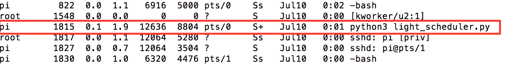

# 文件 I/O 和 Python 实用程序

在本章中，我们将详细讨论文件 I/O，即文件的读取、写入和附加。我们还将讨论 Python 实用程序，这些实用程序支持操作文件和与操作系统交互。每个主题都有不同程度的复杂性，我们将通过一个例子来讨论。让我们开始吧！

# 文件 I/O

我们讨论文件 I/O 有两个原因：

*   在 Linux 操作系统的世界中，一切都是一个文件。在 Raspberry Pi 上与外围设备的交互类似于文件的读写。例如：在[第 12 章](12.html)、*通信接口*中，我们讨论了串口通信。您应该能够观察到串行端口通信类似于文件读/写操作。
*   我们在每个项目中都以某种形式使用文件 I/O。例如：将传感器数据写入 CSV 文件或读取 web 服务器的预配置选项，等等。

因此，我们认为将 Python 中的文件 I/O 作为自己的一章来讨论会很有用（详细文档可从这里获得：[https://docs.python.org/3/tutorial/inputoutput.html#reading-和编写文件](https://docs.python.org/3/tutorial/inputoutput.html#reading-and-writing-files)，并讨论在 Raspberry Pi Zero 上开发应用程序时它可以发挥作用的示例。

# 从文件中读取

让我们创建一个简单的文本文件，`read_file.txt`包含以下文本：`I am learning Python Programming using the Raspberry Pi Zero`并将其保存到 code samples 目录（或您选择的任何位置）。

要读取文件，我们需要使用 Python 的内置函数：`open`打开文件。让我们快速查看代码片段，演示如何打开一个文本文件来读取它的内容并将其打印到屏幕上：

```py
if __name__ == "__main__":
    # open text file to read
    file = open('read_line.txt', 'r')
    # read from file and store it to data
    data = file.read()
    print(data)
    file.close()
```

让我们详细讨论此代码段：

1.  读取文本文件内容的第一步是使用内置功能`open`打开文件。所讨论的文件需要作为参数传递，并带有一个标志`r`，表明我们正在打开文件以读取内容（在讨论每个读/写文件时，我们将讨论其他标志选项）
2.  打开文件后，`open`函数返回存储在`file`变量中的指针（指向文件对象的地址）。

```py
       file = open('read_line.txt', 'r')
```

3.  此文件指针用于读取文件内容并将其打印到屏幕上：

```py
       data = file.read() 
       print(data)
```

4.  读取文件内容后，调用`close()`函数关闭文件。

使用 IDLE3 或命令行终端运行前面的代码片段（可与本章一起下载-`read_from_file.py`。文本文件的内容将按如下方式打印到屏幕上：

```py
    I am learning Python Programming using the Raspberry Pi Zero
```

# 阅读台词

有时，有必要逐行读取文件的内容。在 Python 中，有两个选项可以执行此操作：`readline()`和`readlines()`：

*   `readline()`：顾名思义，这个内置功能可以一次读取一行。让我们用一个例子来回顾一下：

```py
       if __name__ == "__main__": 
          # open text file to read
          file = open('read_line.txt', 'r') 

          # read a line from the file
          data = file.readline() 
          print(data) 

          # read another line from the file 
          data = file.readline() 
          print(data) 

          file.close()
```

当执行前面的代码段时（可随本章下载为`read_line_from_file.py`，打开`read_line.txt`文件，`readline()`函数返回一行。此行存储在变量数据中。由于该函数在该程序中调用了两次，因此输出如下：

```py
 I am learning Python Programming using the Raspberry Pi Zero. 

 This is the second line.
```

每次调用`readline`函数时都会返回一个新行，当到达文件末尾时，它会返回一个空字符串。

*   `readlines()`：此函数以行形式读取文件的全部内容，并将每个内容存储到列表中：

```py
       if __name__ == "__main__": 
           # open text file to read
           file = open('read_lines.txt', 'r') 

           # read a line from the file
           data = file.readlines() 
           for line in data: 
               print(line) 

           file.close()
```

由于文件的行存储为列表，因此可以通过迭代列表来检索：

```py
       data = file.readlines() 
           for line in data: 
               print(line)
```

前面的代码片段可作为`read_lines_from_file.py`与本章一起下载。

# 写入文件

执行以下步骤以写入文件：

1.  写入文件的第一步是打开具有写入标志的文件：`w`。如果作为参数传递的文件名不存在，将创建一个新文件：

```py
      file = open('write_file.txt', 'w')
```

2.  打开文件后，下一步是将要写入的字符串作为参数传递给`write()`函数：

```py
      file.write('I am excited to learn Python using
      Raspberry Pi Zero')
```

3.  让我们将代码放在一起，将字符串写入文本文件，关闭它，重新打开文件，并将文件内容打印到屏幕上：

```py
       if __name__ == "__main__": 
          # open text file to write
          file = open('write_file.txt', 'w') 
          # write a line from the file
          file.write('I am excited to learn Python using
          Raspberry Pi Zero \n') 
          file.close() 

          file = open('write_file.txt', 'r') 
          data = file.read() 
          print(data) 
          file.close()
```

4.  上述代码片段可与本章一起下载（`write_to_file.py`。
5.  执行前面的代码段时，输出如下所示：

```py
       I am excited to learn Python using Raspberry Pi Zero
```

# 附加到文件

每当使用写入标志`w`打开文件时，文件内容将被删除并重新打开以写入数据。有一个备用标志`a`可以将数据追加到文件的末尾。如果文件（作为要打开的参数传递）不存在，此标志还会创建一个新文件。让我们考虑下面的代码片段，在这里我们将一行添加到文本文件 OutT2^。

```py
if __name__ == "__main__": 
   # open text file to append
   file = open('write_file.txt', 'a') 
   # append a line from the file
   file.write('This is a line appended to the file\n') 
   file.close() 

   file = open('write_file.txt', 'r') 
   data = file.read() 
   print(data) 
   file.close()
```

当执行前面的代码片段时（可与本章一起下载-`append_to_file.py`，字符串`This is a line appended to the file`被追加到文件文本的末尾。该文件的内容将包括以下内容：

```py
    I am excited to learn Python using Raspberry Pi Zero
 This is a line appended to the file
```

# 寻找

打开文件后，文件 I/O 中使用的文件指针将从文件的开头移动到结尾。可以将指针移动到特定位置并从该位置读取数据。当我们对文件的特定行感兴趣时，这一点特别有用。让我们从前面的例子中考虑文本文件。该文件的内容包括：

```py
    I am excited to learn Python using Raspberry Pi Zero
 This is a line appended to the file
```

让我们尝试跳过第一行，使用`seek`只读取第二行：

```py
if __name__ == "__main__": 
   # open text file to read

   file = open('write_file.txt', 'r') 

   # read the second line from the file
   file.seek(53) 

   data = file.read() 
   print(data) 
   file.close()
```

在前面的示例中（与本章一起作为`seek_in_file.py`下载），`seek`函数用于将指针移动到第一行末尾的字节`53`。然后读取文件内容并将其存储到变量中。执行此代码段时，输出如下所示：

```py
    This is a line appended to the file
```

因此，seek 允许将文件指针移动到特定位置。

# 读取 n 字节

`seek`功能允许将指针移动到特定位置，并从该位置读取一个字节或`n`字节。让我们重温阅读`write_file.txt`并尝试阅读句子`I am excited to learn Python using Raspberry Pi Zero`中的`excited`一词。

```py
if __name__ == "__main__": 
   # open text file to read and write 
   file = open('write_file.txt', 'r') 

   # set the pointer to the desired position 
   file.seek(5) 
   data = file.read(1) 
   print(data) 

   # rewind the pointer
   file.seek(5) 
   data = file.read(7) 
   print(data) 
   file.close()
```

上述代码可通过以下步骤进行解释：

1.  在第一步中，使用`read`标志打开文件，并将文件指针设置为第五个字节（使用`seek`）——文本文件内容中字母`e`的位置。
2.  现在，我们从文件中读取一个字节，将其作为参数传递给`read`函数。当整数作为参数传递时，`read`函数返回文件中相应的字节数。当没有传递任何参数时，它将读取整个文件。如果文件为空，`read`函数返回空字符串：

```py
       file.seek(5) 
       data = file.read(1) 
       print(data)
```

3.  在第二部分中，我们尝试从文本文件中读取单词`excited`。我们将指针的位置倒回第五个字节。然后我们从文件中读取七个字节（单词`excited`的长度）。
4.  执行代码段时（可随本章下载为`seek_to_read.py`，程序应打印字母`e`和单词`excited`：

```py
       file.seek(5) 
       data = file.read(7) 
       print(data)
```

# r+

我们讨论了使用`r`和`w`标志读取和写入文件。还有一个叫`r+`。此标志允许读取和写入文件。让我们回顾一个使我们能够理解此标志的示例。

让我们再次回顾一下`write_file.txt`的内容：

```py
    I am excited to learn Python using Raspberry Pi Zero
 This is a line appended to the file
```

我们将第二行修改为：`This is a line that was modified`。代码示例可与本章一起下载为`seek_to_write.py`。

```py
if __name__ == "__main__": 
   # open text file to read and write 
   file = open('write_file.txt', 'r+') 

   # set the pointer to the desired position 
   file.seek(68) 
   file.write('that was modified \n') 

   # rewind the pointer to the beginning of the file
   file.seek(0) 
   data = file.read() 
   print(data) 
   file.close()
```

让我们回顾一下此示例的工作原理：

1.  本例中的第一步是使用`r+`标志打开文件。这样可以读取和写入文件。
2.  下一步是移动到文件的第 68 个字节
3.  `that was modified`字符串在该位置写入文件。字符串末尾的空格用于覆盖第二个句子的原始内容。
4.  现在，文件指针设置为文件的开头，并读取其内容。
5.  执行上述代码段时，修改后的文件内容将按如下方式打印到屏幕上：

```py
       I am excited to learn Python using Raspberry Pi Zero
 This is a line that was modified
```

还有另一个`a+`标志，允许将数据追加到文件末尾并同时读取。我们将让读者使用到目前为止讨论的示例来解决这个问题。

We have discussed different examples on reading and writing to files in Python. It can be overwhelming without sufficient experience in programming. We strongly recommend working through the different code samples provided in this chapter

# 对读者的挑战

使用`a+`标志打开`write_file.txt`文件（在不同示例中讨论），并在文件中添加一行。使用`seek`设置文件指针并打印其内容。您只能在程序中打开该文件一次。

# 带关键字的

到目前为止，我们讨论了可用于以不同模式打开文件的不同标志。我们讨论的示例遵循一种常见模式：打开文件、执行读/写操作和关闭文件。使用`with`关键字与文件交互是一种优雅的方式。
如果在与文件交互的代码块执行过程中出现任何错误，`with`关键字确保在退出代码块时关闭文件并清理相关资源。一如既往，让我们用一个例子来回顾一下`with`关键字：

```py
if __name__ == "__main__": 
   with open('write_file.txt', 'r+') as file: 
         # read the contents of the file and print to the screen 
         print(file.read()) 
         file.write("This is a line appended to the file") 

         #rewind the file and read its contents 
         file.seek(0) 
         print(file.read()) 
   # the file is automatically closed at this point 
   print("Exited the with keyword code block")
```

在前面的示例（`with_keyword_example`中，我们跳过了关闭文件，因为一旦缩进代码块的执行完成，`with`关键字负责关闭文件。`with`关键字还负责关闭文件，同时由于错误而离开代码块。这可确保在任何情况下都能正确清理资源。接下来，我们将在文件 I/O 中使用`with`关键字。

# 配置分析器

让我们讨论一下 Python 编程的一些方面，这些方面在使用 Raspberry Pi 开发应用程序时特别有用。Python 中提供的`configparser`就是这样一个工具。`configparser`模块（[https://docs.python.org/3.4/library/configparser.html](https://docs.python.org/3.4/library/configparser.html) 用于读取/写入应用程序的配置文件。

在软件开发中，配置文件通常用于在 Raspberry Pi 的上下文中存储常量，如访问凭证、设备 ID 等，`configparser`可用于存储所有正在使用的 GPIO 引脚列表、通过 I<sup>2</sup>C 接口连接的传感器地址等。让我们讨论三个我们学习使用`configparser`模块的例子。在第一个示例中，我们将使用`configparser`创建一个`config`文件。

在第二个示例中，我们将使用`configparser`读取配置值，在第三个示例中，我们将在最后一个示例中讨论修改配置文件。

**例 1**：

在第一个示例中，让我们创建一个配置文件，该文件存储的信息包括设备 ID、正在使用的 GPIO 引脚、传感器接口地址、调试开关和访问凭据：

```py
import configparser 

if __name__ == "__main__": 
   # initialize ConfigParser 
   config_parser = configparser.ConfigParser() 

   # Let's create a config file 
   with open('raspi.cfg', 'w') as config_file: 
         #Let's add a section called ApplicationInfo 
         config_parser.add_section('AppInfo') 

         #let's add config information under this section 
         config_parser.set('AppInfo', 'id', '123') 
         config_parser.set('AppInfo', 'gpio', '2') 
         config_parser.set('AppInfo', 'debug_switch', 'True') 
         config_parser.set('AppInfo', 'sensor_address', '0x62') 

         #Let's add another section for credentials 
         config_parser.add_section('Credentials') 
         config_parser.set('Credentials', 'token', 'abcxyz123') 
         config_parser.write(config_file) 
   print("Config File Creation Complete")
```

让我们详细讨论前面的代码示例（可与本章一起下载为`config_parser_write.py`：

1.  第一步是导入`configparser`模块并创建`ConfigParser`类的实例。此实例将被称为`config_parser`：

```py
       config_parser = configparser.ConfigParser()
```

2.  现在，我们使用`with`关键字打开一个名为`raspi.cfg`的配置文件。由于该文件不存在，因此将创建一个新的配置文件。
3.  配置文件将由两部分组成，即`AppInfo`和`Credentials`。

4.  这两个部分可以使用`add_section`方法创建，如下所示：

```py
       config_parser.add_section('AppInfo') 
       config_parser.add_section('Credentials')
```

5.  每个部分将由一组不同的常数组成。可以使用`set`方法将每个常数添加到相关部分。`set`方法所需的参数包括节名（参数/常量将位于节名下）、参数/常量的名称及其对应的值。例如：`id`参数可以添加到`AppInfo`部分，并指定一个值`123`，如下所示：

```py
       config_parser.set('AppInfo', 'id', '123')
```

6.  最后一步是将这些配置值保存到文件中。这是通过`config_parser`方法`write`实现的。一旦程序在`with`关键字下退出缩进块，文件即关闭：

```py
       config_parser.write(config_file)
```

We strongly recommend trying the code snippets yourself and use these snippets as a reference. You will learn a lot by making mistakes and possibly arrive with a better solution than the one discussed here.

当执行前面的代码段时，将创建一个名为`raspi.cfg`的配置文件。配置文件的内容将包括如下所示的内容：

```py
[AppInfo] 
id = 123 
gpio = 2 
debug_switch = True 
sensor_address = 0x62 

[Credentials] 
token = abcxyz123
```

**例 2**：

让我们讨论一个示例，其中我们从上一个示例中创建的配置文件中读取配置参数：

```py
import configparser 

if __name__ == "__main__": 
   # initialize ConfigParser 
   config_parser = configparser.ConfigParser() 

   # Let's read the config file 
   config_parser.read('raspi.cfg') 

   # Read config variables 
   device_id = config_parser.get('AppInfo', 'id') 
   debug_switch = config_parser.get('AppInfo', 'debug_switch') 
   sensor_address = config_parser.get('AppInfo', 'sensor_address') 

   # execute the code if the debug switch is true 
   if debug_switch == "True":
         print("The device id is " + device_id) 
         print("The sensor_address is " + sensor_address)
```

If the config files are created in the format shown, the `ConfigParser` class should be able to parse it. It is not really necessary to create config files using a Python program. We just wanted to show programmatic creation of config files as it is easier to programmatically create config files for multiple devices at the same time.

上述示例可与本章一起下载（`config_parser_read.py`。让我们讨论一下这个代码示例是如何工作的：

1.  第一步是初始化名为`config_parser`的`ConfigParser`类的实例。
2.  第二步是使用实例方法`read`加载和读取配置文件。
3.  因为我们知道配置文件的结构，所以让我们继续阅读`AppInfo`部分下的一些常量。可使用`get`方法读取配置文件参数。必需的参数包括 config 参数所在的部分和参数的名称。例如：配置`id`参数位于`AppInfo`部分下。因此，该方法所需的参数包括`AppInfo`和`id`：

```py
      device_id = config_parser.get('AppInfo', 'id')
```

4.  既然配置参数已读入变量，那么让我们在程序中使用它。例如：让我们测试`debug_switch`变量（用于确定程序是否处于调试模式的开关）是否正确，并打印从文件中检索到的其他配置参数：

```py
       if debug_switch == "True":
           print("The device id is " + device_id) 
           print("The sensor_address is " + sensor_address)
```

**例 3**：

让我们讨论一个示例，其中我们希望修改现有的配置文件。这在执行固件更新后需要更新配置文件中的固件版本号的情况下特别有用。

以下代码片段可作为`config_parser_modify.py`与本章一起下载：

```py
import configparser 

if __name__ == "__main__": 
   # initialize ConfigParser 
   config_parser = configparser.ConfigParser() 

   # Let's read the config file 
   config_parser.read('raspi.cfg') 

   # Set firmware version 
   config_parser.set('AppInfo', 'fw_version', 'A3') 

   # write the updated config to the config file 
   with open('raspi.cfg', 'w') as config_file: 
       config_parser.write(config_file)
```

让我们讨论一下它是如何工作的：

1.  和往常一样，第一步是初始化`ConfigParser`类的实例。使用`read`方法加载配置文件：

```py
       # initialize ConfigParser 
       config_parser = configparser.ConfigParser() 

       # Let's read the config file 
       config_parser.read('raspi.cfg')
```

2.  使用`set`方法更新所需参数（在前面的示例中讨论）：

```py
       # Set firmware version 
       config_parser.set('AppInfo', 'fw_version', 'A3')
```

3.  更新后的配置使用`write`方法保存到配置文件中：

```py
       with open('raspi.cfg', 'w') as config_file: 
          config_parser.write(config_file)
```

# 对读者的挑战

以示例 3 为参考，将配置参数`debug_switch`更新为值`False`。重复例子 2，看看会发生什么。

# 读取/写入 CSV 文件

在本节中，我们将讨论如何读取/写入 CSV 文件。本模块（[https://docs.python.org/3.4/library/csv.html](https://docs.python.org/3.4/library/csv.html) 在数据记录应用中非常有用。因为我们将在下一章讨论数据记录，所以让我们回顾一下对 CSV 文件的读/写。

# 写入 CSV 文件

让我们考虑一个场景，我们正在读取来自不同传感器的数据。该数据需要记录到 CSV 文件中，其中每列对应于特定传感器的读数。我们将讨论一个示例，其中我们将值`123`、`456`和`789`记录在 CSV 文件的第一行，第二行将由值组成，包括`Red`、`Green`和`Blue`：

1.  写入 CSV 文件的第一步是使用`with`关键字打开 CSV 文件：

```py
       with open("csv_example.csv", 'w') as csv_file:
```

2.  下一步是初始化 CSV 模块的`writer`类的实例：

```py
       csv_writer = csv.writer(csv_file)
```

3.  现在，通过创建一个包含所有需要添加到行中的元素的列表，将每一行添加到文件中。例如：第一行可以添加到列表中，如下所示：

```py
       csv_writer.writerow([123, 456, 789])
```

4.  总而言之，我们有：

```py
       import csv 
       if __name__ == "__main__": 
          # initialize csv writer 
          with open("csv_example.csv", 'w') as csv_file: 
                csv_writer = csv.writer(csv_file) 
                csv_writer.writerow([123, 456, 789]) 
                csv_writer.writerow(["Red", "Green", "Blue"])
```

5.  当执行上述代码段时（可作为`csv_write.py`与本章一起下载），将在本地目录中创建一个 CSV 文件，其内容如下：

```py
 123,456,789
 Red,Green,Blue
```

# 读取 CSV 文件

让我们讨论一个示例，在该示例中，我们阅读了上一节中创建的 CSV 文件的内容：

1.  读取 CSV 文件的第一步是以读取模式打开它：

```py
       with open("csv_example.csv", 'r') as csv_file:
```

2.  接下来，我们从 CSV 模块初始化`reader`类的一个实例。CSV 文件的内容加载到对象`csv_reader`：

```py
       csv_reader = csv.reader(csv_file)
```

3.  现在已加载 CSV 文件的内容，可以按如下方式检索 CSV 文件的每一行：

```py
       for row in csv_reader: 
           print(row)
```

4.  总而言之：

```py
       import csv 

       if __name__ == "__main__": 
          # initialize csv writer 
          with open("csv_example.csv", 'r') as csv_file: 
                csv_reader = csv.reader(csv_file) 

                for row in csv_reader: 
                      print(row)
```

5.  当执行前面的代码片段时（可作为`csv_read.py`与本章一起下载），文件的内容逐行打印，其中每行都是包含逗号分隔值的列表：

```py
       ['123', '456', '789']
 ['Red', 'Green', 'Blue']
```

# Python 实用程序

Python 附带了几个实用程序，可以与其他文件和操作系统本身进行交互。我们已经确定了我们在过去的项目中使用的所有 Python 实用程序。让我们讨论一下不同的模块及其用途，因为我们可能会在本书的最后一个项目中使用它们。

# 操作系统模块

顾名思义，本模块（[https://docs.python.org/3.1/library/os.html](https://docs.python.org/3.1/library/os.html) 允许与操作系统交互。让我们用例子来讨论它的一些应用。

# 检查文件是否存在

`os`模块可用于检查特定目录中是否存在文件。例如：我们广泛使用了`write_file.txt`文件。在打开此文件进行读写之前，我们可以检查该文件是否存在：

```py
import os
if __name__ == "__main__":
    # Check if file exists
    if os.path.isfile('/home/pi/Desktop/code_samples/write_file.txt'):
        print('The file exists!')
    else:
        print('The file does not exist!')
```

在前面的代码片段中，我们使用了`os.path`模块提供的`isfile()`函数。当一个文件的位置被传递一个参数给函数时，如果该文件存在于该位置，它将返回`True`。在本例中，由于文件`write_file.txt`存在于代码示例目录中，因此函数返回`True`。因此，信息`The file exists`被打印到屏幕上：

```py
if os.path.isfile('/home/pi/Desktop/code_samples/write_file.txt'): 
    print('The file exists!') 
else: 
    print('The file does not exist!')
```

# 检查文件夹是否存在

与`os.path.isfile()`类似，还有一个函数名为`os.path.isdir()`。如果特定位置存在文件夹，则返回`True`。我们一直在审查 Raspberry Pi 桌面上名为`code_samples`的文件夹中的所有代码示例。其存在可通过以下方式确认：

```py
# Confirm code_samples' existence 
if os.path.isdir('/home/pi/Desktop/code_samples'): 
    print('The directory exists!') 
else: 
    print('The directory does not exist!')
```

# 删除文件

`os`模块还支持使用`remove()`功能删除文件。任何作为参数传递给函数的文件都将被删除。在*文件 I/O*部分，我们讨论了使用文本文件`read_file.txt`读取文件。让我们通过将文件作为参数传递给`remove()`函数来删除该文件：

```py
os.remove('/home/pi/Desktop/code_samples/read_file.txt')
```

# 终止进程

通过将进程`pid`传递给`kill()`函数，可以终止在 Raspberry Pi 上运行的应用程序。在上一章中，我们讨论了在 Raspberry Pi 上作为后台进程运行的`light_scheduler`示例。为了演示终止进程，我们将尝试终止该进程。我们需要确定`light_scheduler`流程的`pid`流程（您可以选择一个由您作为用户启动的应用程序，但不要接触根流程）。可使用以下命令从命令行终端检索进程`pid`：

```py
 ps aux
```

它吐出当前在 Raspberry Pi 上运行的进程（如下图所示）。`light_scheduler`申请的流程`pid`为 1815：



light_scheduler daemon's PID

假设我们知道需要终止的应用程序的进程`pid`，让我们使用`kill()`来回顾终止函数。终止函数所需的参数包括进程`pid`和需要发送到进程以终止应用程序的信号（`signal.SIGKILL`：

```py
import os
import signal
if __name__ == "__main__":
    #kill the application
    try:
        os.kill(1815, signal.SIGKILL)
    except OSError as error:
        print("OS Error " + str(error))
```

`signal`模块（[https://docs.python.org/3/library/signal.html)](https://docs.python.org/2/library/signal.html))包含表示可用于停止应用程序的信号的常数。在这个代码片段中，我们使用了`SIGKILL`信号。尝试运行`ps`命令（`ps aux`，您会注意到`light_scheduler`应用程序已被终止。

# 监视进程

在前面的示例中，我们讨论了使用`kill()`函数终止应用程序。您可能已经注意到，我们使用了名为`try`/`except`的关键字试图终止应用程序。我们将在下一章详细讨论这些关键字。

还可以使用`try`/`except`关键字使用`kill()`功能监控应用程序是否正在运行。在介绍使用`try`/`except`关键字捕获异常的概念后，我们将讨论使用`kill()`功能的监控过程。

`os`模块中讨论的所有示例都可以作为`os_utils.py`随本章一起下载。

# glob 模块

`glob`模块（[https://docs.python.org/3/library/glob.html](https://docs.python.org/3/library/glob.html) 允许识别特定扩展名的文件或具有特定模式的文件。例如，可以按如下方式列出文件夹中的所有 Python 文件：

```py
# List all files
for file in glob.glob('*.py'):
    print(file)
```

`glob()`函数返回包含`.py`扩展名的文件列表。使用`for`循环遍历列表并打印每个文件。执行前面的代码段时，输出包含属于本章的所有代码示例的列表（输出被截断以表示）：

```py
read_from_file.py
config_parser_read.py
append_to_file.py
read_line_from_file.py
config_parser_modify.py
python_utils.py
config_parser_write.py
csv_write.py
```

本模块特别有助于列出具有特定模式的文件。例如：让我们考虑一个场景，您希望上传从实验的不同实验中创建的文件。您只对以下格式的文件感兴趣：`file1xx.txt`其中`x`表示`0`和`9`之间的任何数字。这些文件可以按如下方式排序和列出：

```py
# List all files of the format 1xx.txt
for file in glob.glob('txt_files/file1[0-9][0-9].txt'):
    print(file)
```

在上例中，`[0-9]`表示文件名可以包含`0`和`9`之间的任何数字。由于我们正在查找`file1xx.txt`格式的文件，因此传递给`glob()`函数的参数的搜索模式是`file1[0-9][0-9].txt`。

执行上述代码段时，输出包含指定格式的所有文本文件：

```py
txt_files/file126.txt
txt_files/file125.txt
txt_files/file124.txt
txt_files/file123.txt
txt_files/file127.txt
```

我们看到这篇文章解释了如何使用表达式对文件进行排序：[http://www.linuxjournal.com/content/bash-extended-globbing](http://www.linuxjournal.com/content/bash-extended-globbing) 。同样的概念可以扩展到使用`glob`模块搜索文件。

# 对读者的挑战

与`glob`模块讨论的示例可与本章一起下载为`glob_example.py`。在其中一个示例中，我们讨论了列出特定格式的文件。您将如何列出以下格式的文件：`filexxxx.*`？（此处`x`表示`0`和`9`之间的任何数字。`*`表示任何文件扩展名。）

# 航天飞机模块

`shutil`模块（[https://docs.python.org/3/library/shutil.html](https://docs.python.org/3/library/shutil.html) 允许使用`move()`和`copy()`方法在文件夹之间移动和复制文件。在上一节中，我们列出了文件夹`txt_files`中的所有文本文件。让我们使用`move()`将这些文件移动到当前目录（执行代码的地方），在`txt_files`中再次复制这些文件，最后从当前目录中删除文本文件：

```py
import glob
import shutil
import os
if __name__ == "__main__":
    # move files to the current directory
    for file in glob.glob('txt_files/file1[0-9][0-9].txt'):
        shutil.move(file, '.')
    # make a copy of files in the folder 'txt_files' and delete them
    for file in glob.glob('file1[0-9][0-9].txt'):
        shutil.copy(file, 'txt_files')
        os.remove(file)
```

在前面的示例中（与本章一起作为`shutil_example.py`下载），通过将源和目标分别指定为第一个和第二个参数，将文件从源移动和复制到目标。

使用`glob`模块识别要移动（或复制）的文件。然后，使用相应的方法移动或复制每个文件。

# 子流程模块

我们在前一章中简要讨论了该模块。`subprocess`模块（[https://docs.python.org/3.2/library/subprocess.html](https://docs.python.org/3.2/library/subprocess.html) 允许从 Python 程序中启动另一个程序。`subprocess`模块中常用的函数之一是`Popen`。需要从程序内部启动的任何进程都需要作为列表参数传递给`Popen`函数：

```py
import subprocess
if __name__ == "__main__":
    subprocess.Popen(['aplay', 'tone.wav'])
```

在前面的示例中，`tone.wav`（需要播放的波形文件）和需要运行的命令作为列表参数传递给函数。来自`subprocess`模块的其他几个命令也有类似的用途。我们把它留给你去探索。

# 系统模块

`sys`模块（[https://docs.python.org/3/library/sys.html](https://docs.python.org/3/library/sys.html) 允许与 Python 运行时解释器交互。`sys`模块的功能之一是解析作为程序输入提供的命令行参数。让我们编写一个程序，读取并打印作为参数传递给程序的文件内容：

```py
import sys
if __name__ == "__main__":
    with open(sys.argv[1], 'r') as read_file:
        print(read_file.read())
```

尝试按如下方式运行前面的示例：

```py
python3 sys_example.py read_lines.txt
```

上述示例与本章一起作为`sys_example.py`下载。运行程序时传递的命令行参数列表在`sys`模块中作为`argv`列表提供。`argv[0]`通常是 Python 程序的名称，`argv[1]`通常是传递给函数的第一个参数。

当以`read_lines.txt`为参数执行`sys_example.py`时，程序应打印文本文件的内容：

```py
I am learning Python Programming using the Raspberry Pi Zero.
This is the second line.
Line 3.
Line 4.
Line 5.
Line 6.
Line 7.
```

# 总结

在本章中，我们讨论了文件 I/O–读取和写入文件，以及用于读取、写入和追加文件的不同标志。我们讨论了将文件指针移动到文件中的不同点，以检索特定内容或覆盖特定位置的文件内容。我们讨论了 Python 中的`ConfigParser`模块及其在存储/检索应用程序的配置参数以及读取和写入 CSV 文件方面的应用。

最后，我们讨论了在我们的项目中有潜在用途的不同 Python 实用程序。在我们的最终项目中，我们将广泛使用文件 I/O 和讨论过的 Python 实用程序。我们强烈建议您在进入本书中讨论的最终项目之前，先熟悉本章中讨论的概念。

在接下来的章节中，我们将讨论将存储在 CSV 文件中的传感器数据上传到云中，以及在应用程序执行过程中遇到的日志错误。下一章见！