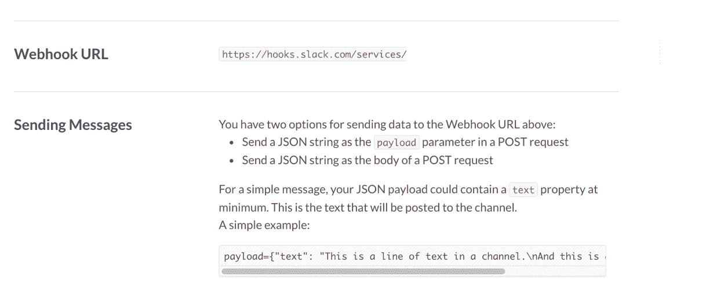
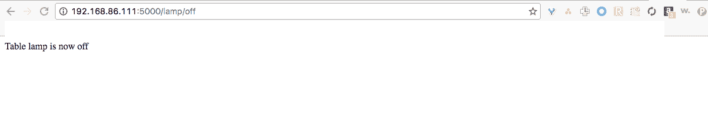

# 十五、Requests 和 Web 框架

本章的主要主题是 Python 中的请求和 web 框架。我们将讨论支持从 Web 检索数据（例如，获取天气更新）、将数据上载到远程服务器（例如，日志传感器数据）或控制本地网络上的设备的库和框架。我们还将讨论有助于学习本章核心主题的主题。

# try/except 关键字

到目前为止，我们已经检查并测试了所有假设理想条件的示例，即程序的执行不会遇到错误。相反，由于外部因素，例如无效的用户输入和较差的互联网连接，或者程序员导致的程序逻辑错误，应用程序不时会失败。在这种情况下，我们希望程序报告/记录错误的性质，并在退出程序之前继续执行或清理资源。`try`/`except`关键字提供了一种捕获程序执行过程中发生的错误并采取补救措施的机制。因为可以在代码的关键部分捕获并记录错误，`try`/`except`关键字在调试应用程序时特别有用。

让我们通过比较两个例子来理解`try`/`except`关键字。让我们构建一个简单的猜测游戏，要求用户猜测 0 到 9 之间的数字：

1.  使用 Python 的`random`模块生成一个随机数（介于 0 和 9 之间）。如果用户对生成的数字的猜测是正确的，Python 程序将宣布用户为赢家并退出游戏。
2.  如果用户输入的是字母`x`，则程序退出游戏。

3.  使用`int()`函数将用户输入转换为整数。执行健全性检查以确定用户输入是否为介于 0 和 9 之间的数字。
4.  将整数与随机数进行比较。如果两者相同，则宣布用户为赢家，程序退出游戏。

让我们观察一下，当我们故意向该程序提供错误输入时会发生什么情况（此处显示的代码片段可与本章一起下载为`guessing_game.py`：

```py
import random

if __name__ == "__main__":
    while True:
        # generate a random number between 0 and 9
        rand_num = random.randrange(0,10)

        # prompt the user for a number
        value = input("Enter a number between 0 and 9: ")

        if value == 'x':
            print("Thanks for playing! Bye!")
            break

        input_value = int(value)

        if input_value < 0 or input_value > 9:
            print("Input invalid. Enter a number between 0 and 9.")

        if input_value == rand_num:
            print("Your guess is correct! You win!")
            break
        else:
            print("Nope! The random value was %s" % rand_num)
```

让我们执行前面的代码片段，并向程序提供输入`hello`：

```py
    Enter a number between 0 and 9: hello
 Traceback (most recent call last):
 File "guessing_game.py", line 12, in <module>
 input_value = int(value)
 ValueError: invalid literal for int() with base 10: 'hello'
```

在前面的示例中，程序尝试将用户输入`hello`转换为整数时失败。程序执行以异常结束。异常会突出显示发生错误的行。在这种情况下，发生在第 10 行：

```py
    File "guessing_game.py", line 12, in <module>
 input_value = int(value)
```

异常中还突出显示了错误的性质。在本例中，最后一行表示抛出的异常为`ValueError`：

```py
    ValueError: invalid literal for int() with base 10: 'hello'
```

让我们讨论相同的示例（可与本章一起下载为`try_and_except.py`），该示例使用了`try`/`except`关键字。捕获此异常并将其打印到屏幕后，可以继续玩游戏。我们有以下代码：

```py
import random

if __name__ == "__main__":
    while True:
        # generate a random number between 0 and 9
        rand_num = random.randrange(0,10)

        # prompt the user for a number
        value = input("Enter a number between 0 and 9: ")

        if value == 'x':
            print("Thanks for playing! Bye!")

        try:
            input_value = int(value)
        except ValueError as error:
            print("The value is invalid %s" % error)
            continue

        if input_value < 0 or input_value > 9:
            print("Input invalid. Enter a number between 0 and 9.")
            continue

        if input_value == rand_num:
            print("Your guess is correct! You win!")
            break
        else:
            print("Nope! The random value was %s" % rand_num)
```

让我们讨论一下同一个示例如何使用`try`/`except`关键字：

1.  从前面的示例中，我们知道当用户提供错误的输入（例如，一个字母而不是 0 到 9 之间的数字）时，异常发生在第 10 行（其中用户输入被转换为整数），错误的性质被命名为`ValueError`。
2.  通过将其包装在`try...except`块中，可以避免程序执行中断：

```py
      try: 
         input_value = int(value) 
      except ValueError as error:
         print("The value is invalid %s" % error)
```

3.  在接收到用户输入时，程序尝试将用户输入转换为`try`块下的整数。
4.  如果发生了`ValueError`，则`error`被`except`块捕获，并将以下消息与实际错误消息一起打印到屏幕上：

```py
       except ValueError as error:
           print("The value is invalid %s" % error)
```

5.  尝试执行代码示例并尝试提供无效输入。您会注意到，程序会打印错误消息（以及错误的性质），并返回游戏循环的顶部，继续寻找有效的用户输入：

```py
       Enter a number between 0 and 9: 3
 Nope! The random value was 5
 Enter a number between 0 and 9: hello
 The value is invalid invalid literal for int() with
       base 10: 'hello'
 Enter a number between 0 and 10: 4
 Nope! The random value was 6
```

`try...except`块带来了巨大的处理能力成本。因此，保持`try...except`块尽可能短是很重要的。因为我们知道错误发生在尝试将用户输入转换为整数的行上，所以我们将其包装在一个`try...except`块中以捕获错误。

因此，`try`/`except`关键字用于防止程序执行中由于错误而出现任何异常行为。它允许记录错误并采取补救措施。与`try...except`块类似，还有`try...except...else`和`try...except...else`代码块。让我们用几个例子快速回顾一下这些选项。

# 试试……除了……别的

当我们希望某个代码块仅在没有引发异常的情况下执行时，`try...except...else`块特别有用。为了演示这个概念，让我们使用以下代码块重写猜谜游戏示例：

```py
try:
    input_value = int(value)
except ValueError as error:
    print("The value is invalid %s" % error)
else:
    if input_value < 0 or input_value > 9:
        print("Input invalid. Enter a number between 0 and 9.")
    elif input_value == rand_num:
        print("Your guess is correct! You win!")
        break
    else:
        print("Nope! The random value was %s" % rand_num)
```

使用`try...except...else`块修改的猜谜游戏示例可与本章一起下载为`try_except_else.py`。在此示例中，仅当收到有效的用户输入时，程序才会将用户输入与随机数进行比较。否则，它将跳过`else`块，返回循环的顶部以接受下一个用户输入。因此，当我们希望在没有由于`try`块中的代码而引发异常的情况下执行特定的代码块时，使用`try...except...else`。

# 尝试…除了…其他…最后

顾名思义，`finally`块用于在离开`try`块时执行代码块。即使在引发异常后，也会执行此代码块。这在我们需要在进入下一阶段之前清理资源和释放内存的场景中非常有用。

让我们用我们的猜谜游戏来演示`finally`块的功能。为了理解`finally`关键字是如何工作的，让我们使用一个名为`count`的计数器变量在`finally`块中递增，另一个名为`valid_count`的计数器变量在`else`块中递增。我们有以下代码：

```py
count = 0
valid_count = 0
while True:
  # generate a random number between 0 and 9
  rand_num = random.randrange(0,10)

  # prompt the user for a number
  value = input("Enter a number between 0 and 9: ")

  if value == 'x':
      print("Thanks for playing! Bye!")

  try:
      input_value = int(value)
  except ValueError as error:
      print("The value is invalid %s" % error)
  else:
      if input_value < 0 or input_value > 9:
          print("Input invalid. Enter a number between 0 and 9.")
          continue

      valid_count += 1
      if input_value == rand_num:
          print("Your guess is correct! You win!")
          break
      else:
          print("Nope! The random value was %s" % rand_num)
  finally:
      count += 1

print("You won the game in %d attempts "\
      "and %d inputs were valid" % (count, valid_count))
```

前面的代码片段来自`try_except_else_finally.py`代码示例（可与本章一起下载）。尝试执行代码示例并玩游戏。您将注意到赢得游戏所需的总尝试次数以及有效的输入次数：

```py
    Enter a number between 0 and 9: g
 The value is invalid invalid literal for int() with
    base 10: 'g'
 Enter a number between 0 and 9: 3
 Your guess is correct! You win!
 You won the game in 9 attempts and 8 inputs were valid
```

这说明了`try-except-else-finally`块是如何工作的。`else`关键字下的任何代码在关键代码块（在`try`关键字下）成功执行时执行，而`finally`关键字下的代码块在退出`try...except`块时执行（用于在退出代码块时清理资源）。

尝试在玩游戏时提供无效输入，使用前面的代码示例来理解代码块流。

# 连接到 Internet–web 请求

现在我们讨论了`try`/`except`关键字，让我们利用它来构建一个连接到互联网的简单应用程序。我们将编写一个简单的应用程序，从 Internet 检索当前时间。我们将使用 Python 的`requests`库（[http://requests.readthedocs.io/en/master/#](http://requests.readthedocs.io/en/master/#) ）。

`requests`模块可以连接到 Web 并检索信息。为此，我们需要使用`requests`模块中的`get()`方法发出请求：

```py
import requests
response = requests.get('http://nist.time.gov/actualtime.cgi')
```

在前面的代码片段中，我们将 URL 作为参数传递给`get()`方法。在本例中，URL 以 Unix 格式（[返回当前时间 https://en.wikipedia.org/wiki/Unix_time](https://en.wikipedia.org/wiki/Unix_time) 。

让我们利用`try`/`except`关键字请求获取当前时间：

```py
#!/usr/bin/python3

import requests

if __name__ == "__main__":
  # Source for link: http://stackoverflow.com/a/30635751/822170
  try:
    response = requests.get('http://nist.time.gov/actualtime.cgi')
    print(response.text)
  except requests.exceptions.ConnectionError as error:
    print("Something went wrong. Try again")
```

在前面的示例中（与本章一起作为`internet_access.py`下载），请求在`try`块下发出，响应（由`response.text`返回）打印到屏幕上。

如果在执行检索当前时间的请求时出错，则会引发`ConnectionError`（[http://requests.readthedocs.io/en/master/user/quickstart/#errors-和例外情况](http://requests.readthedocs.io/en/master/user/quickstart/#errors-and-exceptions)。此错误可能是由于缺少 Internet 连接或 URL 不正确造成的。此错误被`except`块捕获。试着运行这个例子，它应该从`time.gov`返回当前时间：

```py
    <timestamp time="1474421525322329" delay="0"/>
```

# 请求的应用-检索天气信息

让我们利用 ALE T0 模块检索旧金山市的天气信息。我们将利用**OpenWeatherMap**API（[OpenWeatherMap.org](http://openweathermap.org)来检索天气信息：

1.  为了使用 API，请注册 API 帐户并获得 API 密钥（免费）：


An API key from openweathermap.org

2.  根据 API 文档（[openweathermap.org/current](http://openweathermap.org/current)），可以使用`http://api.openweathermap.org/data/2.5/weather?zip=SanFrancisco&appid=API_KEY&units=imperial`作为 URL 检索城市的天气信息。

3.  用您帐户中的密钥替换`API_KEY`，并使用它在浏览器中检索当前天气信息。您应该能够以以下格式检索天气信息：

```py
 {"coord":{"lon":-122.42,"lat":37.77},"weather":[{"id":800, 
       "main":"Clear","description":"clear sky","icon":"01n"}],"base": 
       "stations","main":{"temp":71.82,"pressure":1011,"humidity":50, 
       "temp_min":68,"temp_max":75.99},"wind":
       {"speed":13.04,"deg":291},
       "clouds":{"all":0},"dt":1474505391,"sys":{"type":3,"id":9966, 
       "message":0.0143,"country":"US","sunrise":1474552682, 
       "sunset":1474596336},"id":5391959,"name":"San 
       Francisco","cod":200}
```

天气信息（如前所示）以 JSON 格式返回。**JavaScript 对象表示法**（**JSON**）是一种广泛用于在 Web 上交换数据的数据格式。JSON 格式的主要优点是它是一种可读的格式，许多流行的编程语言都支持用 JSON 格式封装数据。如前面的代码片段所示，JSON 格式支持以可读的名称/值对交换信息。

让我们回顾一下使用`requests`模块检索天气并解析 JSON 数据：

1.  将上一示例（`internet_access.py`中的 URL 替换为本示例中讨论的 URL。这将以 JSON 格式返回天气信息。

2.  requests 模块提供了一种解析 JSON 数据的方法。响应可以按如下方式进行分析：

```py
       response = requests.get(URL) 
       json_data = response.json()
```

3.  `json()`函数解析来自 OpenWeatherMap API 的响应，并返回不同天气参数（`json_data`及其值）的字典。
4.  由于我们从 API 文档中了解响应格式，因此可以从解析的响应中检索当前温度，如下所示：

```py
       print(json_data['main']['temp'])
```

5.  综上所述，我们有：

```py
       #!/usr/bin/python3

       import requests

       # generate your own API key
       APP_ID = '5d6f02fd4472611a20f4ce602010ee0c'
       ZIP = 94103
       URL = """http://api.openweathermap.org/data/2.5/weather?zip={}
       &appid={}&units=imperial""".format(ZIP, APP_ID)

       if __name__ == "__main__":
         # API Documentation: http://openweathermap.org/
         current#current_JSON
         try:
           # encode data payload and post it
           response = requests.get(URL)
           json_data = response.json()
           print("Temperature is %s degrees Fahrenheit" %
           json_data['main']['temp'])
         except requests.exceptions.ConnectionError as error:
           print("The error is %s" % error)
```

上述示例与本章一起作为`weather_example.py`下载。该示例应显示当前温度，如下所示：

```py
    Temperature is 68.79 degrees Fahrenheit
```

# 请求的应用–将事件发布到 Internet

在前面的示例中，我们从 Internet 检索信息。让我们考虑一个例子，在那里我们必须在互联网上发布传感器事件。这可能是一个猫门打开，而你不在家，或有人在你的门阶上踩在门垫。因为我们在上一章中讨论了传感器与 Raspberry Pi Zero 的接口，所以让我们讨论一个场景，在该场景中，我们可以将这些事件发布到*Slack*——一个工作场所通信工具、Twitter 或云服务，如**Phant**（[https://data.sparkfun.com/](https://data.sparkfun.com/) ）。

在本例中，我们将使用`requests`将这些事件发布到 Slack。每当发生传感器事件（如 cat 门打开）时，让我们向自己发送一条关于松弛的直接信息。我们需要一个 URL 将这些传感器事件发布到 Slack。让我们回顾一下生成 URL 以将传感器事件发布到 Slack：

1.  生成 URL 的第一步是创建一个*传入的 webhook*。webhook 是一种类型请求，它可以将作为有效负载承载的消息发布到诸如 Slack 之类的应用程序。

2.  如果您是名为*TeamX*的 Slack 团队的成员，请在浏览器中启动您团队的应用程序目录，即`teamx.slack.com/apps`：


Launch your team's app directory

3.  在你的应用程序目录中搜索`incoming webhooks`并选择第一个选项，Incoming WebHooks（如下面的屏幕截图所示）：


Select incoming webhooks

4.  单击添加配置：


Add Configuration

5.  当事件发生时，让我们向自己发送一条私人消息。选择 Private to（you）作为选项，并通过单击 Add Incoming WebHooks integration 创建 webhook：


Select Privately to you

6.  我们已生成一个 URL，用于发送有关传感器事件的直接消息（URL 部分隐藏）：



Generated URL

7.  现在，我们可以使用前面提到的 URL 在 Slack 上向自己发送直接消息。传感器事件可以作为 JSON 有效负载发布到 Slack。让我们回顾一下向 Slack 发布传感器事件。
8.  例如，让我们考虑当猫门打开时发出一条信息。第一步是为消息准备 JSON 负载。根据 Slack API 文件（[https://api.slack.com/custom-integrations)](https://api.slack.com/custom-integrations))，消息有效负载需要采用以下格式：

```py
       payload = {"text": "The cat door was just opened!"}
```

9.  为了发布此事件，我们将使用`requests`模块中的`post()`方法。发布数据负载时，需要将其编码为 JSON 格式：

```py
       response = requests.post(URL, json.dumps(payload))
```

10.  综上所述，我们有：

```py
       #!/usr/bin/python3

       import requests
       import json

       # generate your own URL
       URL = 'https://hooks.slack.com/services/'

       if __name__ == "__main__":
         payload = {"text": "The cat door was just opened!"}
         try:
           # encode data payload and post it
           response = requests.post(URL, json.dumps(payload))
           print(response.text)
         except requests.exceptions.ConnectionError as error:
           print("The error is %s" % error)
```

11.  发布消息时，请求返回`ok`作为响应。这表明该职位是成功的。
12.  生成您自己的 URL 并执行前面的示例（可与本章一起下载为`slack_post.py`。您将在 Slack 上收到一条直接消息：


Direct message on Slack

现在，尝试将传感器连接到 Raspberry Pi Zero（在前面的章节中讨论过），并将传感器事件发布到 Slack。

还可以将传感器事件发布到 Twitter 上，让您的 Raspberry Pi Zero 检查新电子邮件等。有关更多示例，请访问本书的网站。

# FlaskWeb 框架

在最后一节中，我们将讨论 Python 中的 web 框架。我们将讨论烧瓶框架（[http://flask.pocoo.org/](http://flask.pocoo.org/) ）。基于 Python 的框架支持使用 Raspberry Pi Zero 将传感器连接到网络。这使得能够从网络中的任何位置控制设备并从传感器读取数据。让我们开始吧！

# 安装烧瓶

第一步是安装烧瓶框架。可按如下方式进行：

```py
    sudo pip3 install flask
```

# 构建我们的第一个示例

Flask 框架文档解释了如何构建第一个示例。修改文档中的示例，如下所示：

```py
#!/usr/bin/python3

from flask import Flask
app = Flask(__name__)

@app.route("/")
def hello():
    return "Hello World!"

if __name__ == "__main__":
    app.run('0.0.0.0')
```

启动此示例（与本章一起作为`flask_example.py`下载），它应该在网络可见的 Raspberry Pi Zero 上启动一个服务器。在另一台计算机上，启动浏览器并输入 Raspberry Pi Zero 的 IP 地址以及端口号`5000`作为后缀（如以下快照所示）。它会将您带到服务器的索引页，其中显示消息 Hello World！：


The Flask framework-based web server on the Raspberry Pi Zero

您可以使用命令行终端上的`ifconfig`命令找到 Raspberry Pi Zero 的 IP 地址。

# 使用 Flask 框架控制设备

让我们尝试使用 Flask 框架打开/关闭家用电器。在前面的章节中，我们使用*功率开关 Tail II*使用树莓 Pi Zero 控制台灯。让我们尝试使用 Flask 框架来控制它。连接动力开关尾部，如下图所示：


Controlling a table lamp using the Flask framework

根据 Flask 框架文档，可以将 URL 路由到特定函数。例如，可以使用`route()`将`/lamp/<control>`绑定到`control()`函数：

```py
@app.route("/lamp/<control>") 
def control(control): 
  if control == "on": 
    lights.on() 
  elif control == "off": 
    lights.off() 
  return "Table lamp is now %s" % control
```

在前面的代码片段中，`<control>`是一个变量，可以作为参数传递给绑定函数。这使我们能够打开/关闭灯。例如，`<IP address>:5000/lamp/on`打开灯，反之亦然。综上所述，我们有：

```py
#!/usr/bin/python3 

from flask import Flask 
from gpiozero import OutputDevice 

app = Flask(__name__) 
lights = OutputDevice(2) 

@app.route("/lamp/<control>") 
def control(control): 
  if control == "on": 
    lights.on() 
  elif control == "off": 
    lights.off() 
  return "Table lamp is now %s" % control 

if __name__ == "__main__": 
    app.run('0.0.0.0')
```

上述示例与本章一起作为`appliance_control.py`下载。启动基于 Flask 的 web 服务器，并在另一台计算机上打开 web 服务器。要打开指示灯，请输入`<IP Address of the Raspberry Pi Zero>:5000/lamp/on`作为 URL:

这将打开指示灯：



因此，我们构建了一个简单的框架，可以控制网络中的设备。可以将按钮包括到 HTML 页面，并将它们路由到特定 URL 以执行特定功能。Python 中还有其他几个框架支持开发 web 应用程序。我们只是向您介绍了 Python 可以使用的不同应用程序。我们建议您在本书的网站上查看更多示例，例如使用 Flask 框架控制万圣节装饰和其他节日装饰。

# 总结

在本章中，我们讨论了 Python 中的`try`/`except`关键字。我们还讨论了开发从 Internet 检索信息的应用程序，以及将传感器事件发布到 Internet。我们还讨论了用于 Python 的 Flask web 框架，并演示了在网络中对设备的控制。在下一章中，我们将讨论 Python 中的一些高级主题。