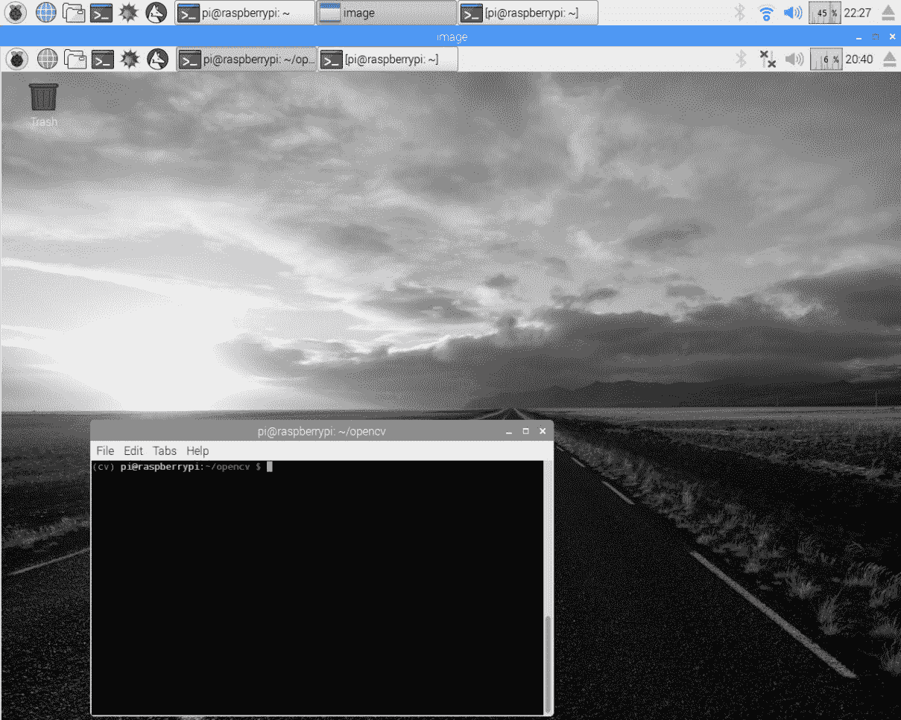
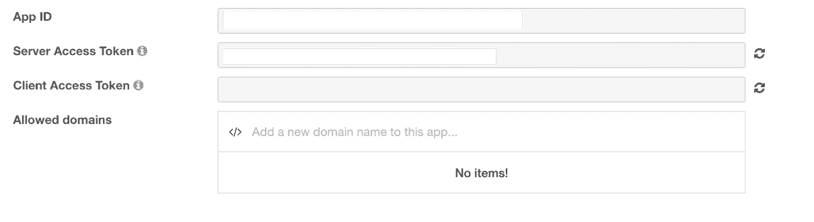
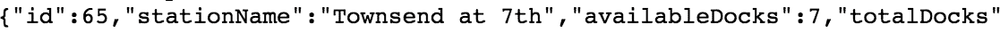
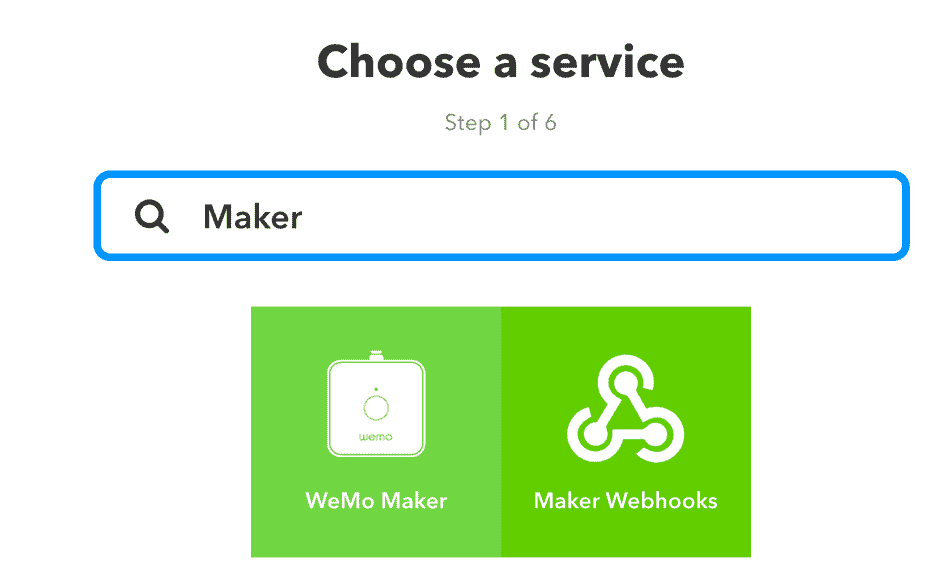
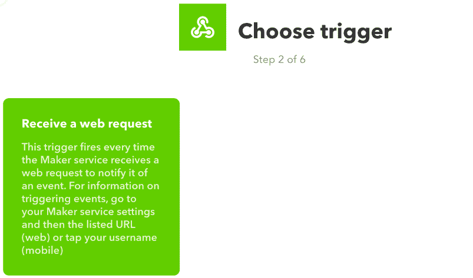
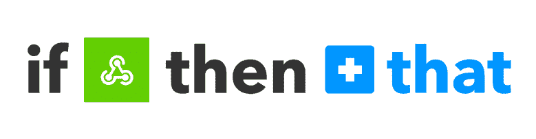
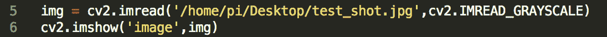

# 十六、使用 Python 可以开发的很棒的东西

在本章中，我们将讨论 Python 中的一些高级主题。我们还将讨论一些独特的主题（如图像处理），让您开始使用 Python 进行应用程序开发。

# 利用 RespberryPi 零点进行图像处理

Raspberry Pi Zero 是一款由 1GHz 处理器供电的廉价硬件。虽然运行某些高级图像处理操作功能不强，但它可以帮助您在 25 美元的预算（覆盆子皮零和一台相机的成本）下学习基本知识。

We recommend using a 16 GB card (or higher) with your Raspberry Pi Zero in order to install the image processing tool set discussed in this section.

例如，你可以用 RespberryPi 零来追踪你后院里的一只鸟。在本章中，我们将讨论在 Raspberry Pi Zero 上开始图像处理的不同方法。

为了使用本节中的相机测试一些示例，需要 Raspberry Pi Zero v1.3 或更高版本。检查 Raspberry Pi Zero 的背面，以验证电路板版本：


Identifying your Raspberry Pi Zero's version

# OpenCV

**OpenCV**是一个开源工具箱，由用于图像处理的不同软件工具组成。OpenCV 是一个跨平台的工具箱，支持不同的操作系统。由于 OpenCV 是在开源许可下提供的，世界各地的研究人员通过开发工具和技术为其发展做出了贡献。这使得开发应用程序相对容易。OpenCV 的一些应用包括人脸识别和车牌识别。

Due to its limited processing power, it can take several hours to complete the installation of the framework. It took us approximately 10 hours at our end.

我们按照说明从[开始在 Raspberry Pi Zero 上安装 OpenCVhttp://www.pyimagesearch.com/2015/10/26/how-to-install-opencv-3-on-raspbian-jessie/](http://www.pyimagesearch.com/2015/10/26/how-to-install-opencv-3-on-raspbian-jessie/) 。我们专门按照说明使用 Python 3.x 绑定安装 OpenCV，并验证了安装过程。我们花了大约 10 个小时在 Raspberry Pi Zero 上完成 OpenCV 的安装。我们不是为了不重新发明轮子而重复这些指示。

# 安装的验证

让我们确保 OpenCV 安装及其 Python 绑定工作正常。启动命令行终端，通过执行`workon cv`命令确保您已经启动了`cv`虚拟环境（您可以验证您是否在`cv`虚拟环境中）：


Verify that you are in the cv virtual environment

现在，让我们确保我们的安装工作正常。从命令行启动 Python 解释器并尝试导入`cv2`模块：

```py
    >>> import cv2
 >>> cv2.__version__
 '3.0.0'
```

这证明 OpenCV 安装在 Raspberry Pi Zero 上。让我们编写一个涉及 OpenCV 的*hello world*示例。在本例中，我们将打开一个图像（可以是 Raspberry Pi Zero 桌面上的任何彩色图像），并将其转换为灰度后显示。我们将使用以下文档编写第一个示例：[http://docs.opencv.org/3.0-beta/doc/py_tutorials/py_gui/py_image_display/py_image_display.html](http://docs.opencv.org/3.0-beta/doc/py_tutorials/py_gui/py_image_display/py_image_display.html) 。

根据文档，我们需要使用`imread()`函数读取图像文件的内容。我们还需要指定要读取图像的格式。在本例中，我们将以灰度格式读取图像。这由作为第二个参数传递给函数的`cv2.IMREAD_GRAYSCALE`指定：

```py
import cv2 

img = cv2.imread('/home/pi/screenshot.jpg',cv2.IMREAD_GRAYSCALE)
```

现在图像以灰度格式加载并保存到`img`变量中，我们需要在新窗口中显示它。这是通过`imshow()`功能启用的。根据文档，我们可以通过将窗口名称指定为第一个参数，将图像指定为第二个参数来显示图像：

```py
cv2.imshow('image',img)
```

在本例中，我们将打开一个名为`image`的窗口，并显示在上一步中加载的`img`的内容。我们将显示图像，直到收到击键。这是通过使用`cv2.waitKey()`功能实现的。根据文档，`waitkey()`功能监听键盘事件：

```py
cv2.waitKey(0)
```

`0`参数表示我们将无限期地等待击键。根据文档，当持续时间（以毫秒为单位）作为参数传递时，`waitkey()`函数在指定的持续时间内监听击键。当按下任一键时，通过`destroyAllWindows()`功能关闭窗口：

```py
cv2.destroyAllWindows()
```

综上所述，我们有：

```py
import cv2

img = cv2.imread('/home/pi/screenshot.jpg',cv2.IMREAD_GRAYSCALE)
cv2.imshow('image',img)
cv2.waitKey(0)
cv2.destroyAllWindows()
```

前面的代码示例可作为`opencv_test.py`与本章一起下载。安装完 OpenCV 库后，请尝试加载图像，如本例所示。它应该加载灰度图像，如下图所示：



The Raspberry Pi desktop loaded in grayscale

只要按任何键，这个窗口都会关闭。

# 对读者的挑战

在前面的示例中，按任意键都会关闭窗口。查看文档，确定是否可以按鼠标按钮关闭所有窗口。

# 将摄像头安装到 Raspberry Zero 上

测试下一个示例需要一个摄像头连接器和一个摄像头。这里提供了一个购买相机和适配器的来源：

| **名称** | **来源** |
| RespberryPi 零摄像头适配器 | [https://thepihut.com/products/raspberry-pi-zero-camera-adapter](https://thepihut.com/products/raspberry-pi-zero-camera-adapter) |
| RespberryPi 照相机 | [https://thepihut.com/products/raspberry-pi-camera-module](https://thepihut.com/products/raspberry-pi-camera-module) |

执行以下步骤将摄像头安装到 Raspberry Pi Zero：

1.  第一步是将摄像头连接到树莓 Pi Zero。可以如下图所示安装摄像头适配器。提起接头卡舌，滑动摄像头适配器，然后轻轻按下接头：


2.  我们需要在 Raspberry Pi Zero 上启用摄像头接口。在桌面上，转到“首选项”并启动 Raspberry Pi 配置。在 Raspberry Pi 配置的接口选项卡下，启用相机并保存配置：


Enable the camera interface

3.  让我们从命令行终端运行以下命令，通过拍照来测试相机：

```py
       raspistill -o /home/pi/Desktop/test.jpg
```

4.  它应该拍摄一张照片并保存到你的 Raspberry Pi 的桌面上。确认摄像头功能正常。如果您无法让摄像头正常工作，我们建议您使用 Raspberry Pi 基金会发布的故障排除指南：[https://www.raspberrypi.org/documentation/raspbian/applications/camera.md](https://www.raspberrypi.org/documentation/raspbian/applications/camera.md) 。

摄像机电缆有点笨重，在拍照时会使事情变得困难。我们建议使用摄像机支架。在[中，我们发现这一条非常有用（如下图所示）http://a.co/hQolR7O](http://a.co/hQolR7O) ：


Use a mount for your Raspberry Pi's camera

让我们旋转一下相机，并将其与 OpenCV 库一起使用：

1.  我们将使用相机拍摄一张照片，并使用 OpenCV 框架显示它。为了用 Python 访问摄像头，我们需要`picamera`包。可按如下方式安装：

```py
       pip3 install picamera
```

2.  让我们用一个简单的程序来确保包按预期工作。`picamera`包的文件可从[获取 https://picamera.readthedocs.io/en/release-1.12/api_camera.html](https://picamera.readthedocs.io/en/release-1.12/api_camera.html) 。
3.  第一步是初始化`PiCamera`类。然后沿垂直轴翻转图像。这只是因为相机是倒置安装在支架上才需要的。对于其他安装件，这可能不是必需的：

```py
       with PiCamera() as camera: 
       camera.vflip = True
```

4.  在拍照之前，我们可以使用`start_preview()`方法预览要拍摄的图片：

```py
       camera.start_preview()
```

5.  让我们先预览`10`秒，然后再拍照。我们可以使用`capture()`方法拍照：

```py
       sleep(10) 
       camera.capture("/home/pi/Desktop/desktop_shot.jpg") 
       camera.stop_preview()
```

6.  `capture()`方法需要文件位置作为参数（如前面的代码段所示）。完成后，我们可以使用`stop_preview()`关闭相机预览。
7.  总而言之，我们有：

```py
       from picamera import PiCamera 
       from time import sleep

       if __name__ == "__main__": 
         with PiCamera() as camera: 
           camera.vflip = True 
           camera.start_preview() 
           sleep(10) 
           camera.capture("/home/pi/Desktop/desktop_shot.jpg") 
           camera.stop_preview()
```

前面的代码示例可作为`picamera_test.py`与本章一起下载。使用相机拍摄的快照如下图所示：


Image captured using the Raspberry Pi camera module

8.  让我们将此示例与上一个示例结合起来，将此图像转换为灰度并显示，直到按下一个键为止。确保您仍在`cv`虚拟环境工作区内。
9.  让我们将捕获的图像转换为灰度，如下所示：

```py
       img = cv2.imread("/home/pi/Desktop/desktop_shot.jpg",
       cv2.IMREAD_GRAYSCALE)
```

以下是捕获时转换的图像：


Image converted to grayscale upon capture

10.  现在我们可以按如下方式显示灰度图像：

```py
       cv2.imshow("image", img) 
       cv2.waitKey(0) 
       cv2.destroyAllWindows()
```

修改后的示例可作为`picamera_opencvtest.py`下载。

到目前为止，我们已经演示了用 Python 开发图像处理应用程序。我们还建议查看 OpenCV Python 绑定文档中提供的示例（本节介绍部分提供的链接）。

# 语音识别

在本节中，我们将讨论用 Python 开发一个涉及语音识别的语音识别示例。我们将使用`requests`模块（在上一章中讨论）使用`wit.ai`（[转录音频 https://wit.ai/](https://wit.ai/) ）。

There are several speech recognition tools, including Google's Speech API, IBM Watson, Microsoft Bing's speech recognition API. We are demonstrating `wit.ai` as an example.

语音识别在我们希望对语音命令启用 Raspberry Pi Zero 响应的应用程序中非常有用

让我们回顾一下如何使用`wit.ai`在 Python 中构建语音识别应用程序（其文档可在[中找到）https://github.com/wit-ai/pywit](https://github.com/wit-ai/pywit) 。为了执行语音识别和识别语音命令，我们需要一个麦克风。但是，我们将使用现成的音频样本进行演示。我们将利用研究出版物（可在[上获得）提供的音频样本 http://ecs.utdallas.edu/loizou/speech/noizeus/clean.zip](http://ecs.utdallas.edu/loizou/speech/noizeus/clean.zip) ）。

The `wit.ai` API license states that the tool is free to use, but the audio uploaded to their servers are used to tune their speech transcription tool.

我们现在将尝试转录`sp02.wav`音频样本，执行以下步骤：

1.  第一步是使用`wit.ai`注册一个账户。记下 API，如以下屏幕截图所示：



2.  第一步是安装请求库。它可以按如下方式安装：

```py
       pip3 install requests 
```

3.  根据`wit.ai`文档，我们需要在请求中添加自定义头，其中包括 API 密钥（将`$TOKEN`替换为您帐户中的令牌）。我们还需要在标题中指定文件格式。在这种情况下，它是一个`.wav`文件，采样频率为 8000 Hz：

```py
       import requests 

       if __name__ == "__main__": 
         url = 'https://api.wit.ai/speech?v=20161002' 
         headers = {"Authorization": "Bearer $TOKEN", 
                    "Content-Type": "audio/wav"}
```

4.  为了转录音频样本，我们需要在请求正文中附加音频样本：

```py
       files = open('sp02.wav', 'rb') 
       response = requests.post(url, headers=headers, data=files) 
       print(response.status_code) 
       print(response.text)
```

5.  把所有这些放在一起，我们可以得到：

```py
       #!/usr/bin/python3 

       import requests 

       if __name__ == "__main__": 
         url = 'https://api.wit.ai/speech?v=20161002' 
         headers = {"Authorization": "Bearer $TOKEN", 
                    "Content-Type": "audio/wav"} 
         files = open('sp02.wav', 'rb') 
         response = requests.post(url, headers=headers, data=files) 
         print(response.status_code) 
         print(response.text)
```

前面的代码示例可作为`wit_ai.py`与本章一起下载。尝试执行前面的代码样本，它应该转录音频样本：`sp02.wav`。我们有以下代码：

```py
200
{
  "msg_id" : "fae9cc3a-f7ed-4831-87ba-6a08e95f515b",
  "_text" : "he knew the the great young actress",
  "outcomes" : [ {
    "_text" : "he knew the the great young actress",
    "confidence" : 0.678,
    "intent" : "DataQuery",
    "entities" : {
      "value" : [ {
        "confidence" : 0.7145905790744499,
        "type" : "value",
        "value" : "he",
        "suggested" : true
      }, {
        "confidence" : 0.5699616515542044,
        "type" : "value",
        "value" : "the",
        "suggested" : true
      }, {
        "confidence" : 0.5981701138805214,
        "type" : "value",
        "value" : "great",
        "suggested" : true
      }, {
        "confidence" : 0.8999612482250062,
        "type" : "value",
        "value" : "actress",
        "suggested" : true
      } ]
    }
  } ],
  "WARNING" : "DEPRECATED"
}
```

音频样本包含以下录音：*他知道这位伟大的年轻女演员的技巧*。根据`wit.ai`API，抄本是*他认识这位伟大的年轻女演员*。文字错误率为 22%（[https://en.wikipedia.org/wiki/Word_error_rate](https://en.wikipedia.org/wiki/Word_error_rate) ）。

# 自动化路由任务

在本节中，我们将讨论用 Python 自动化路由任务。我们举了两个例子，以证明 RespberryPi 零作为个人助理的能力。第一个例子涉及改善你的通勤情况，而第二个例子则有助于提高你的词汇量。让我们开始吧。

# 改善每日通勤

许多城市和公共交通系统已开始与公众共享数据，以提高透明度和运营效率。交通系统已经开始通过 API 向公众分享咨询和交通信息。这使得任何人都可以开发为通勤者提供信息的移动应用程序。有时，它有助于缓解公共交通系统内的拥堵。

这个例子的灵感来自一位朋友，他在旧金山的自行车共享站跟踪自行车的可用性。在旧金山湾地区，有一个自行车共享计划，使通勤者可以租用自行车从一个中转中心到他们的工作。在像旧金山这样拥挤的城市，在给定的车站自行车的可用性取决于一天的时间。

这位朋友想根据最近的自行车共享站的自行车供应情况来安排他的一天。如果车站的自行车所剩无几，这位朋友宁愿早点离开去租一辆自行车。他正在寻找一个简单的黑客程序，当自行车数量低于某个阈值时，该程序会向他的手机发送通知。旧金山的自行车共享计划在[上提供该数据 http://feeds.bayareabikeshare.com/stations/stations.json](http://feeds.bayareabikeshare.com/stations/stations.json) 。

让我们回顾一下构建一个简单的示例，该示例支持向移动设备发送推送通知。为了发送移动推送通知，我们将使用**如果是，那么**（**IFTTT**）——一种能够将您的项目连接到第三方服务的服务。

在本例中，我们将解析 JSON 格式的可用数据，检查特定站点的可用自行车数量，如果低于指定阈值，则会在移动设备上触发通知。

让我们开始：

1.  第一步是从自行车共享服务检索自行车可用性。此数据以 JSON 格式在[中提供 http://feeds.bayareabikeshare.com/stations/stations.json](http://feeds.bayareabikeshare.com/stations/stations.json) 。数据包括网络中自行车的可用性。
2.  每个站点的自行车可用性都提供了参数，例如站点 ID、站点名称、地址、可用自行车数量等。
3.  在这个例子中，我们将检索在旧金山的 Type T0EY 站的自行车可用性。站点 ID 为`65`（在浏览器中打开前面提到的链接以查找`id`。让我们编写一些 Python 代码来检索自行车可用性数据并解析这些信息：

```py
       import requests 

       BIKE_URL = http://feeds.bayareabikeshare.com/stations 
       /stations.json 

       # fetch the bike share information 
       response = requests.get(BIKE_URL) 
       parsed_data = response.json()
```

第一步是使用`GET`请求（通过`requests`模块）获取数据。`requests`模块提供内置 JSON 解码器。JSON 数据可以通过调用`json()`函数进行解析。

4.  现在，通过执行以下步骤，我们可以在`Townsend at 7th`处迭代浏览站点字典并找到自行车可用性：

1.  在检索到的数据中，每个站点的数据都有一个 ID。所涉及的站点 ID 是`65`（在浏览器中打开前面提供的数据源 URL 以了解数据格式；数据片段显示在以下屏幕截图中）：



A snippet of the bike share data feed fetched using a browser

2.  我们需要遍历这些值，并确定站点`id`是否与`Townsend at 7th`匹配：

```py
              station_list = parsed_data['stationBeanList'] 
              for station in station_list: 
                if station['id'] == 65 and 
                   station['availableBikes'] < 2: 
                  print("The available bikes is %d" % station
                  ['availableBikes'])
```

如果车站的可用自行车数量少于`2`，我们会向移动设备发送移动通知。

5.  为了接收移动通知，您需要通过 IFTTT 应用程序安装*IF（适用于苹果和 Android 设备）。*
6.  我们还需要在 IFTTT 上设置一个触发移动通知的方法。在[注册帐户 https://ifttt.com/](https://ifttt.com/) 。

IFTTT 是一项服务，它可以创建将设备连接到不同应用程序和自动化任务的配方。例如，可以将 Raspberry Pi Zero 跟踪的事件记录到 Google 驱动器上的电子表格中。

IFTTT 上的所有配方都遵循一个通用模板-*如果这个然后那个*，也就是说，如果发生了特定事件，则会触发特定操作。对于本例，我们需要创建一个小程序，在收到 web 请求时触发移动通知。

7.  您可以使用帐户下的下拉菜单开始创建小程序，如以下屏幕截图所示：


Start creating a recipe on IFTTT

8.  它将带您进入配方设置页面（如下所示）。单击此项并设置传入的 web 请求：


Click on this

9.  选择 Maker Webhooks 频道作为传入触发器：



Select the Maker Webhooks channel

10.  选择接收 web 请求。来自 Raspberry Pi 的 web 请求将充当发送移动通知的触发器：



Select Receive a web request

11.  创建名为`mobile_notify`的触发器：


Create a new trigger named mobile_notify

12.  现在是为传入触发器创建操作的时候了。点击那个。



Click on that

13.  选择通知：


Select Notifications

14.  现在，让我们格式化我们希望在设备上接收的通知：


Setup notification for your device

15.  在移动通知中，我们需要接收自行车共享站的可用自行车数量。点击+配料按钮并选择`Value1`。


设置邮件格式以满足您的需要。例如，当 Raspberry Pi 触发通知时，最好接收以下格式的消息：`Time to go home! Only 2 bikes are available at Townsend & 7th!`


16.  一旦您对消息格式感到满意，请选择“创建操作”，您的食谱就应该准备好了！


Create a recipe

17.  为了在我们的移动设备上触发通知，我们需要一个 URL 来发出`POST`请求和一个触发键。这可在您的 IFTTT 帐户的服务| Maker Webhooks |设置下获得。

触发器可位于此处：


在新浏览器窗口中打开前面屏幕截图中列出的 URL。它提供了`POST`请求的 URL，以及如何进行 web 请求的说明（如下屏幕截图所示）：


Making a POST request using the earlier-mentioned URL (key concealed for privacy)

18.  在发出请求时（如 IFTTT 文档中所述），如果我们在请求的 JSON 正文中包含自行车的数量（使用`Value1`），它可以显示在移动通知上。
19.  让我们重温 Python 示例，在自行车数量低于某个阈值时发出 web 请求。将`IFTTT`URL 和您的 IFTTT 访问密钥（从您的 IFTTT 帐户检索）保存到您的代码中，如下所示：

```py
       IFTTT_URL = "https://maker.ifttt.com/trigger/mobile_notify/ 
       with/key/$KEY"
```

20.  当自行车数量低于某个阈值时，我们需要使用 JSON 正文中编码的自行车信息发出`POST`请求：

```py
       for station in station_list: 
         if station['id'] == 65 and 
            station['availableBikes'] < 3: 
           print("The available bikes is %d" % 
           station['availableBikes']) 
           payload = {"value1": station['availableBikes']} 
           response = requests.post(IFTTT_URL, json=payload) 
           if response.status_code == 200: 
             print("Notification successfully triggered")
```

21.  在前面的代码片段中，如果少于三辆自行车，则使用`requests`模块发出`POST`请求。可用自行车的数量通过`value1`键进行编码：

```py
       payload = {"value1": station['availableBikes']}
```

22.  综上所述，我们有：

```py
       #!/usr/bin/python3 

       import requests 
       import datetime 

       BIKE_URL = "http://feeds.bayareabikeshare.com/stations/
       stations.json" 
       # find your key from ifttt 
       IFTTT_URL = "https://maker.ifttt.com/trigger/mobile_notify/
       with/key/$KEY" 

       if __name__ == "__main__": 
         # fetch the bike share information 
         response = requests.get(BIKE_URL) 
         parsed_data = response.json() 
         station_list = parsed_data['stationBeanList'] 
         for station in station_list: 
           if station['id'] == 65 and 
              station['availableBikes'] < 10: 
             print("The available bikes is %d" % station
             ['availableBikes']) 
  payload = {"value1": station['availableBikes']} 
             response = requests.post(IFTTT_URL, json=payload) 
             if response.status_code == 200: 
               print("Notification successfully triggered")
```

前面的代码示例可作为`bike_share.py`与本章一起下载。在 IFTTT 上设置配方后尝试执行它。如有必要，调整可用自行车数量的阈值。您应该在设备上收到移动通知：


Notification on your mobile device

# 对读者的挑战

在本例中，将获取并解析自行车信息，如有必要，将触发通知。您将如何修改此代码示例以确保它在一天中的给定时间之间执行？（提示：使用`datetime`模块）。

您将如何构建作为视觉辅助的桌面显示器？

# 项目挑战

试着找出你所在地区的交通系统是否向用户提供了这些数据。您将如何利用这些数据来帮助通勤者节省时间？例如，您将如何使用这些数据向您的朋友/同事提供公交系统咨询？

On completion of the book, we will post a similar example using the data from San Francisco **Bay Area Rapid Transit** (**BART**).

# 提高你的词汇量

使用 Python 可以提高您的词汇表！想象一下，设置一个大型显示器，安装在显眼的位置，并每天更新。我们将使用`wordnik`API（在[注册 API 密钥）https://www.wordnik.com/signup](https://www.wordnik.com/signup) ：

1.  第一步是为`python3`安装`wordnik`API 客户端：

```py
       git clone https://github.com/wordnik/wordnik-python3.git
 cd wordnik-python3/
 sudo python3 setup.py install
```

There are restrictions on the wordnik API usage. Refer to the API documentation for more details.

2.  让我们回顾一下如何使用`wordnik`Python 客户端编写第一个示例。为了获取当天的单词，我们需要初始化`WordsApi`类。根据 API 文档，这可以按如下方式完成：

```py
       # sign up for an API key 
       API_KEY = 'API_KEY' 
       apiUrl = 'http://api.wordnik.com/v4' 
       client = swagger.ApiClient(API_KEY, apiUrl) 
       wordsApi = WordsApi.WordsApi(client)
```

3.  既然`WordsApi`类已经初始化，让我们继续获取当天的单词：

```py
       example = wordsApi.getWordOfTheDay()
```

4.  这将返回一个`WordOfTheDay`对象。根据`wordnik`Python 客户端文档，该对象由不同的参数组成，包括单词、同义词、源、用法等。当天的单词及其同义词可以打印如下：

```py
       print("The word of the day is %s" % example.word) 
       print("The definition is %s" %example.definitions[0].text)
```

5.  综上所述，我们有：

```py
       #!/usr/bin/python3 

       from wordnik import * 

       # sign up for an API key 
       API_KEY = 'API_KEY' 
       apiUrl = 'http://api.wordnik.com/v4' 

       if __name__ == "__main__": 
         client = swagger.ApiClient(API_KEY, apiUrl) 
         wordsApi = WordsApi.WordsApi(client) 
         example = wordsApi.getWordOfTheDay() 
         print("The word of the day is %s" % example.word) 
         print("The definition is %s" %example.definitions[0].text)
```

前面的代码片段可作为`wordOfTheDay.py`与本章一起下载。注册 API 密钥，您应该能够检索当天的单词：

```py
       The word of the day is transpare
 The definition is To be, or cause to be, transparent; to appear,
       or cause to appear, or be seen, through something.
```

# 对读者的挑战

您将如何将此应用程序后台监控，以便每日更新 word？（提示：cronjob 或`datetime`）。

# 项目挑战

可以使用`wordnik`API 构建文字游戏。想一想一个既有趣又有助于提高词汇量的文字游戏。您将如何着手构建向玩家提示问题并接受答案输入的内容？

尝试在显示器上显示当天的单词。您将如何实现这一点？

# 登录中

日志记录（[https://docs.python.org/3/library/logging.html](https://docs.python.org/3/library/logging.html) 有助于故障排除。通过追溯应用程序记录的事件序列，它有助于确定问题的根本原因。让我们使用一个简单的应用程序来回顾日志记录。为了查看日志记录，让我们通过发出`POST`请求来查看日志记录：

1.  记录日志的第一步是设置日志文件位置和日志级别：

```py
       logging.basicConfig(format='%(asctime)s : %(levelname)s :
       %(message)s', filename='log_file.log', level=logging.INFO)
```

初始化`logging`类时，我们需要指定将信息、错误等记录到文件中的格式。在这种情况下，格式如下：

```py
       format='%(asctime)s : %(levelname)s : %(message)s'
```

日志消息的格式如下：

```py
       2016-10-25 20:28:07,940 : INFO : Starting new HTTPS
       connection (1):
       maker.ifttt.com
```

日志消息保存到名为`log_file.log`的文件中。

日志记录级别决定应用程序所需的日志记录级别。不同的日志级别包括`DEBUG`、`INFO`、`WARN`和`ERROR`。

在本例中，我们将日志记录级别设置为`INFO`。因此，属于`INFO`、`WARNING`或`ERROR`级别的任何日志消息都会保存到该文件中。

如果日志记录级别设置为`ERROR`，则仅将这些日志消息保存到文件中。

2.  让我们根据`POST`请求的结果记录一条消息：

```py
       response = requests.post(IFTTT_URL, json=payload) 
       if response.status_code == 200: 
         logging.info("Notification successfully triggered") 
       else: 
         logging.error("POST request failed")
```

3.  综上所述，我们有：

```py
       #!/usr/bin/python3 

       import requests 
       import logging 

       # find your key from ifttt 
       IFTTT_URL = "https://maker.ifttt.com/trigger/rf_trigger/
       with/key/$key" 

       if __name__ == "__main__": 
         # fetch the bike share information 
         logging.basicConfig(format='%(asctime)s : %(levelname)s
         : %(message)s', filename='log_file.log', level=logging.INFO) 
         payload = {"value1": "Sample_1", "value2": "Sample_2"} 
         response = requests.post(IFTTT_URL, json=payload) 
         if response.status_code == 200: 
           logging.info("Notification successfully triggered") 
         else: 
           logging.error("POST request failed")
```

前面的代码示例（`logging_example.py`可与本章一起下载。这是对 Python 中日志记录概念的一个非常软的介绍。

# Python 中的线程

在本节中，我们将讨论 Python 中线程的概念。线程允许同时运行多个进程。例如，我们可以运行电机，同时监听来自传感器的传入事件。让我们用一个例子来说明这一点。

我们将模拟一种情况，在这种情况下，我们希望处理来自相同类型传感器的事件。在本例中，我们只是将一些内容打印到屏幕上。我们需要定义一个函数来侦听来自每个传感器的事件：

```py
def sensor_processing(string): 
  for num in range(5): 
    time.sleep(5) 
    print("%s: Iteration: %d" %(string, num))
```

我们可以利用前面的函数，使用 Python 中的`threading`模块，同时监听来自三个不同传感器的传感器事件：

```py
thread_1 = threading.Thread(target=sensor_processing, args=("Sensor 1",)) 
thread_1.start() 

thread_2 = threading.Thread(target=sensor_processing, args=("Sensor 2",)) 
thread_2.start() 

thread_3 = threading.Thread(target=sensor_processing, args=("Sensor 3",)) 
thread_3.start()
```

综上所述，我们有：

```py
import threading 
import time 

def sensor_processing(string): 
  for num in range(5): 
    time.sleep(5) 
    print("%s: Iteration: %d" %(string, num)) 

if __name__ == '__main__': 
  thread_1 = threading.Thread(target=sensor_processing, args=("Sensor 1",)) 
  thread_1.start() 

  thread_2 = threading.Thread(target=sensor_processing, args=("Sensor 2",)) 
  thread_2.start() 

  thread_3 = threading.Thread(target=sensor_processing, args=("Sensor 3",)) 
  thread_3.start()
```

前面的代码示例（可作为`threading_example.py`下载）启动三个线程，同时侦听来自三个传感器的事件。输出如下所示：

```py
Thread 1: Iteration: 0 
Thread 2: Iteration: 0 
Thread 3: Iteration: 0 
Thread 2: Iteration: 1 
Thread 1: Iteration: 1 
Thread 3: Iteration: 1 
Thread 2: Iteration: 2 
Thread 1: Iteration: 2 
Thread 3: Iteration: 2 
Thread 1: Iteration: 3 
Thread 2: Iteration: 3 
Thread 3: Iteration: 3 
Thread 1: Iteration: 4 
Thread 2: Iteration: 4 
Thread 3: Iteration: 4
```

# Python 的 PEP8 样式指南

**PEP8**是 Python 的风格指南，帮助程序员编写可读代码。遵循某些约定以使代码可读性很重要。编码约定的一些示例包括：

*   内联注释应以`# `开头，后跟一个空格。
*   变量应具有以下约定：`first_var`。
*   避免在每行上出现尾随空格。例如，`if name == "test":`后面不应该跟空格。

You can read the entire PEP8 standards at [https://www.python.org/dev/peps/pep-0008/#block-comments](https://www.python.org/dev/peps/pep-0008/#block-comments).

# 验证 PEP8 指南

有一些工具可以验证代码的 PEP8 标准。编写代码示例后，请确保您的代码符合 PEP8 标准。这可以使用`pep8`包完成。它可以按如下方式安装：

```py
    pip3 install pep8
```

让我们检查一下我们的一个代码示例是否按照 PEP8 约定编写。这可以通过以下方式完成：

```py
    pep8 opencv_test.py
```

检查显示以下错误：

```py
    opencv_test.py:5:50: E231 missing whitespace after ','
 opencv_test.py:6:19: E231 missing whitespace after ','
```

如输出所示，`5`和`6`行的逗号后缺少空格：



Missing trailing whitespace after the comma

让我们来解决这个问题，我们的代码应该遵守 PEP8 约定。重新检查文件，错误就会消失。为了使代码可读，在将代码签入公共存储库之前，请始终运行 PEP8 检查。

# 总结

在本章中，我们讨论了 Python 中的高级主题。我们讨论了一些主题，包括语音识别、构建通勤者信息工具和改进词汇表的 Python 客户端。Python 中有一些高级工具，广泛应用于数据科学、人工智能等领域。我们希望本章讨论的主题是学习此类工具的第一步。