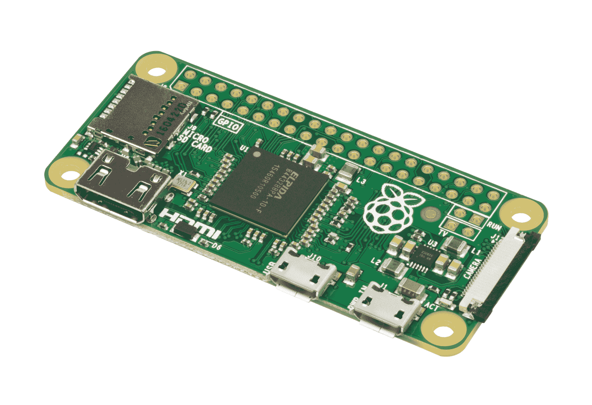
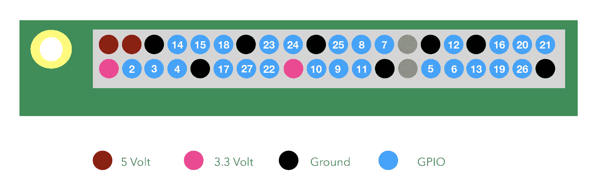
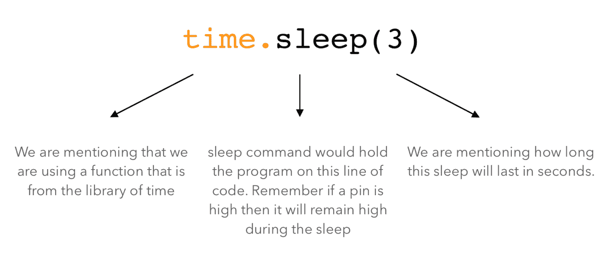
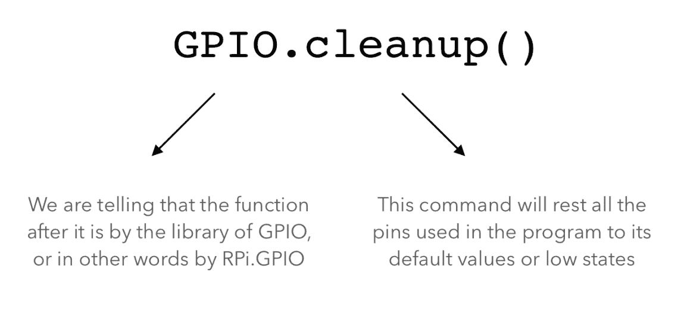
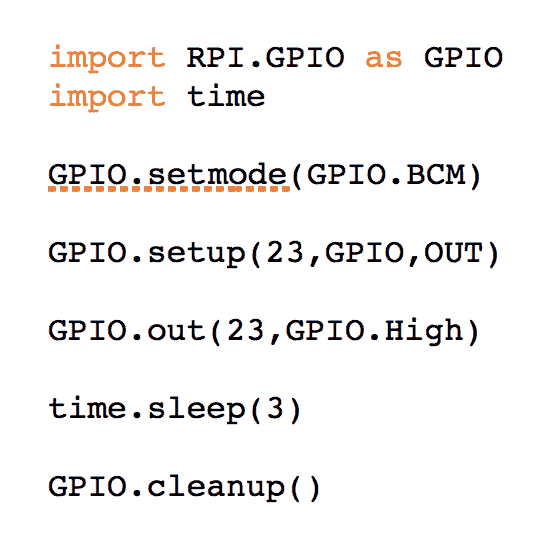
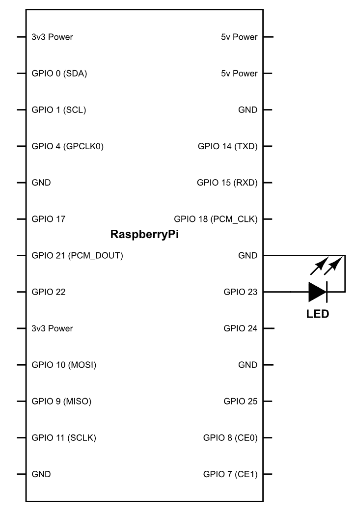
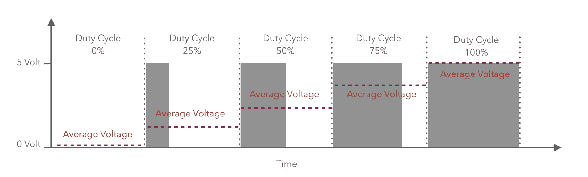

# 十七、机器人学 101

我们一提到机器人这个词，科幻小说的想法就开始围绕着我们。我们可能会想起卡通连续剧*杰特森一家*或者想到电影*终结者*。但是，事实上，机器人作为一个物种已经不再属于科幻小说了。它们尽可能真实。环顾四周，指出任何物体；如果没有机器人，它可能不会被制造出来。现代时代是由机器人塑造的。

但是，你也可以退一步想想，等一下，他说的不是机器人而是机器吗？嗯，是的，你说得很对，但同时也大错特错了。正是漫画和科幻小说赋予了一个类似人类的机器人形象，称为**机器人**。但机器人远不止这些。

不幸的是，我们没有一个具体的、普遍认可的机器人定义，但是，正如我想说的那样，*任何能够执行物理和智能任务的机器都可以称为机器人。*

现在，你可能会说，根据我的定义，即使是自动洗衣机也可以被称为机器人。从技术上讲，是的，我们为什么不叫它机器人呢？想想它为你做了什么，以及这些年来采用了什么样的自动化。喂入这种布料后，它会自动清洗、漂洗和烘干，就像你在 19 世纪所做的那样。我想说的一点是，我们能想到的机器人种类繁多，可以从根本上改变我们的生活方式。我们需要以更广阔的视角思考，而不仅仅是将机器人限制为仿人机器人形式的人类适应。

我们生活在机器人和自动化的黄金时代，在这个时代，新产品的开发尽可能简单。感谢开源世界，十年前可能需要一个工程师团队完成的事情，现在可以由一个人坐在卧室里几分钟就能完成。同时，你还可以使用硬件马力，只需几百美元，你就可以在自己家里真正地建造一台超级计算机。我们周围都是问题，有些简单，有些复杂，等待解决。整个过程中唯一缺失的环节就是你：一个有能力利用这些技术解决世界问题的创新思维。

为了让你的大脑能够做到这一点，我们将从了解机器人技术的根源和基础开始。这本书的目标不仅是让书中提到的项目，而且让你了解如何利用资源来构建你的梦想项目。

最后，我要祝贺你在正确的时间进入这个令人惊叹的未来领域。我总是告诉我的学生一条规则，我也想与你们分享：

*   首先是科学家
*   二是研究人员
*   三是工程师
*   第四是技术员
*   最后一位是技工

这意味着，在生命周期中，您输入任何字段的时间越早，您可以获得的层次结构越高。你来得越晚，爬到山顶就越难。

说够了，我们直接谈正事吧！本章将介绍以下主题：

*   硬件武库
*   设置RespberryPi
*   程序设计
*   玩弄电压

# 硬件武库

谈到机器人，它们由几个基本的有形组件组成，如下所示：

*   计算单元
*   传感器
*   执行器
*   底盘
*   电源

首先，我们将讨论微控制器，在本书的过程中，我们将在需要时详细讨论其他有形组件。

每当你买笔记本电脑或电脑的时候，你一定听说过微处理器这个词。这是必须做出所有决定的主要单位。我称之为*国王*，但没有帝国的国王是什么？为了让国王工作，他需要一些能为他做事情的下属，就像微处理器需要几个下属一样，比如 RAM、存储器、I/O 设备等等。现在的问题是，当我们把所有这些东西放进去时，整个装置变得昂贵和笨重。但是，正如我们所知，当涉及到机器人时，随后的重量和尺寸是非常重要的因素，因此我们无法承受一个庞大的系统来运行机器人。

因此，我们做了一个叫做 SoC 的东西。现在，这是一个单人秀，因为这个小芯片，拥有所有必要的系统，可以在这个小芯片组内部工作。所以，现在您不需要添加 RAM 或存储或任何其他东西，它就可以工作了。这些小型微控制器可以变得非常强大，但缺点是，一旦制造商制作了 SoC，之后就无法对其进行任何更改。无法更改存储器、RAM 或 I/O 的大小。但我们通常可以接受这些限制，因为在为机器人编程时，在运行一些重要的人工智能或机器学习代码之前，可能无法使用微控制器的全部功能。

一个如此伟大的硬件是RespberryPi。是的，听起来很好吃，但还有很多。这是一个超小型但功能极其强大的微控制器。它通常被称为原型板，因为世界各地的机器人专家都使用它来展示他们的想法，并在短时间内将其变成现实。它在全球各地都可以买到，而且非常便宜。你可以在一台 10 美元的设备上播放高清电影，上网冲浪，做更多的事情。我想不出像这样可笑的事情。它相当容易使用，您可以使用 Python 对其进行编程

所以，基本上，它勾选了我们所有的方框。这将是我们在本书中使用的主要武器。

让我给你介绍RespberryPi！这就是它看起来的样子：



市场上有各种型号的覆盆子皮。但我们将使用RespberryPi零 W；这将花费你大约 10 美元，而且比一个巨无霸汉堡更容易购买。一定要确保你买的是带有 W 的RespberryPi零，据说它代表无线功能，如 Wi-Fi 和蓝牙。还有一些事情，你将不得不订购或安排它的工作。以下是项目列表：

*   Micro USB 到标准 USB 适配器
*   键盘
*   老鼠
*   Micro SD 存储卡，16 或 32 GB
*   微型 SD 卡读卡器
*   微型 USB 电源适配器（2 安培或更多）
*   Micro HDMI 至 HDMI 端口
*   试验板
*   跳线束（公对公、公对母、母对母）
*   3V 发光二极管


正如您从图像中立即看到的，机上有一个微型 HDMI 端口，您可以通过它连接高清显示器或电视屏幕。第二个是微型 SD 卡插槽。这将是此计算机的主存储设备。除此之外，您还可以找到两个 USB 插座和一个摄像头总线。你可能认为这就是它，但最好的还在后头。Raspberry Pi 有一个名为**GPIO**的东西，它代表**通用输入/输出**。这些被伪装成树莓圆周率一角上的 40 个小通孔端口；这就是它的特别之处。

现在，按照惯例，你会把与电脑兼容的东西连接到电脑上。所以，连接鼠标、键盘或操纵杆就像插入 USB 端口一样简单，但如果你需要将电脑连接到灯泡或空调，该怎么办？没错，你不能。这就是 GPIO 来拯救这一天的原因。这些引脚在机器人技术方面非常有用，因为它们可用于连接各种组件，如传感器/电机。这些管脚的美妙之处在于，根据我们对其编程的目的，它们可以用作输入或输出。因此，我们将在后面看到，这些引脚中的每一个都可以根据我们的需要在程序中定义为输入或输出。

现在，在这 40 个引脚中，有 26 个是 GPIO。其余引脚为通用电源或接地端口。还有两个称为**ID EEPROM**的端口，目前我们不需要：



正如您所见，Raspberry Pi 能够为我们提供两种类型的电源：3.3V 和 5V。这些基本上满足了我们的大多数目的。

# 设置RespberryPi

稍后我们将讨论 GPIO 和其他与 Raspberry Pi 有关的内容。首先，我们将首次了解如何设立该委员会。

您需要做的第一件事是确保 Raspberry Pi 的操作系统已经就绪。我假设您使用的是 Windows PC，但如果您也在其他操作系统上使用，则不会有太大区别。

要安装操作系统，请启动电脑并执行以下步骤：

1.  进入[www.raspberrypi.org](http://www.raspberrypi.org)并点击下载
2.  现在单击 RASPBIAN，您将看到以下两个选项：
    *   带桌面的拉斯宾拉伸
    *   拉斯宾拉伸岩
3.  我们将下载 RASPBIAN STRETCH 和桌面；这将为我们提供 Raspberry Pi 的 GUI 界面
4.  下载后，将包解压缩到文件夹中

现在我们需要把它复制到RespberryPi的存储卡上。您需要复制的存储卡必须采用低级格式化。基本上有两种格式。一种是简单地删除索引，另一种是我们称之为低级别格式化的方法，即从索引及其物理内存位置删除所有数据。将有一个按钮来切换低级格式。为该功能格式化存储卡之前，请确保已单击它。我建议通过[www.sdcard.org](http://www.sdcard.org)使用 SD 卡格式化程序。现在打开格式化程序，只需使用 32KB 选项格式化即可。

Find more details and more up-to-date information here: [https://www.raspberrypi.org/documentation/installation/installing-img/README.md](https://www.raspberrypi.org/documentation/installation/installing-img/README.md).

完成后，您必须将图像复制到 SD 卡上。最简单的方法是使用 WinDisk Imager。你可以在线下载，没有任何问题。然后只需选择图像和 SD 卡上的位置，然后开始复制图像。

这可能需要几分钟。完成后，您的 SD 将准备就绪。将其插入覆盆子皮，我们将准备为其通电。但在通电之前，请使用 Micro HDMI 至 HDMI 连接线插入显示器，使用 Micro USB 将键盘和鼠标连接至 Raspberry Pi，然后使用 Micro USB 适配器至标准 USB 适配器将其通电。现在，使用 Raspberry Pi 上的另一个 USB 端口，使用 micro USB 电源适配器为其通电。

一旦你启动它，你会看到一个启动屏幕，几秒钟之内你就能看到桌面。所以，最后，我们的树莓圆周率是启动和运行。

继续探索一些选项，上网冲浪，在 YouTube 上观看一些 cat 视频，熟悉这个强大的设备。

到现在为止，你一定已经在欣赏RespberryPi的力量了。它可能比你的普通电脑稍慢一些。但是，得了吧，这东西只要 10 美元！

# 让我们来计划一下

在本章中，我们将让您熟悉 Python 以及如何在此设备上使用 GPIO。要执行此操作，请继续并单击左上角的树莓图标。您将看到 Python 控制台 3.0。也可能有一个较旧版本的 Python。我们将在本书中使用较新的版本。

一旦窗口打开，您将看到操场，您将在那里进行编码。现在我们准备为 Python 机器人编写第一个代码。现在让我们看看是怎么做的。

我们要写的第一件事是：


几乎所有的时候，当我们开始写一个程序时，我们都会从写前一行开始。现在，在我们了解它的作用之前，我们需要了解库。通常，在编写代码时，我们必须在多个位置反复编写代码。这需要很多时间，当然不是很酷！

所以，为了解决这个问题，我们创建了函数。函数是一个微型程序，我们可能认为它会被反复使用。在这个微型程序中，我们也提到了它的名称。

假设有一个代码，我们需要一次又一次地将两个数字相乘。所以，我们要做的就是编写一次代码，并将其作为一个函数。我们也将此函数命名为`Multiply`。

所以现在，每当我们需要两个数字相乘时，我们不必再编写它的代码；相反，我们只需要调用函数来完成它，而不是编写乘法代码。问题是，我们如何判断哪些数字必须相乘？

这也有一个解决办法。正如您稍后可能看到的，无论何时调用函数，我们都会在其后面加上开始括号和结束括号，例如`multiply()`。

如果括号为空，则表示未提供任何用户输入。例如，如果我们必须乘以`2`和`3`，我们只需写`Multiply(2,3)`。

我们将输入为`2`和`3`。括号中输入的位置也很重要，因为括号中的位置将定义输入在程序中的位置。

现在，让我们假设您创建了如下函数：

*   添加
*   减
*   乘
*   分

假设你把它们叠在一起。然后，组合在一起的一堆函数将被称为库。这些库可以有数百个函数。有些函数已经用 Python 语言编写，这样程序员的工作就更简单了。其他的可以定义为开源或者由您在方便的时候开发。

现在，回到正题。我们给图书馆打电话`RPi.GPIO`；这是一个由 Raspberry Pi 定义的库。这将有功能，将使您的生活更容易，当谈到编程树莓 Pi。因此，在程序中，一旦我们调用了库，所有的函数都可以由您使用，随时可以使用。

在下一行中，我们写`Import.time`。正如您一定猜到的，这用于导入库时间。我们将很快了解它的作用。

下一行代码如下：


在我们了解它的功能之前，让我们了解更多关于 GPIOs 的知识。这些引脚根据其在 Raspberry Pi 中的物理位置进行硬编号。但是，为了便于理解和方便，我们可以更改软件中管脚的编号。但在这段代码中，我们将不会对其进行处理，而是将其设置为 Broadcom 的默认设置，Broadcom 是 Raspberry Pi 微控制器的制造商。

此行使用名为`setmode`的`RPi.GPIO`库函数。此功能的作用是将`setmode`的引脚配置设置为（`GPIO.BCM`）-`BCM`是`GPIO`的进一步功能。

现在我们可以使用基脚配置。除此之外，GPIO 引脚的一个特点是它可以用作输入和输出。但唯一的条件是我们必须指定它是否必须在程序本身中用作输入或输出。它不能同时执行这两个功能。这是如何做到的：


下一行代码如下：


同样，我们正在使用名为`output`的库`GPIO`的函数。它的作用是在我们想要的状态下设置电路板的特定引脚。因此，这里我们已经提到，pin 编号`23`必须设置为高。为了清楚起见，high 表示打开，low 表示关闭。

下一行代码如下：



在这一行中，我们使用的是库时间中的函数。睡眠功能基本上冻结了所有 GPIO 引脚的状态。因此，例如，如果引脚`23`为高电平，那么它将保持高电平，直到`time`功能`sleep`被执行。在函数`sleep`中，我们将该值定义为`3`秒

因此，在 3 秒钟内，Raspberry Pi 的 pin 状态将保持在这行代码之前的状态。

最后，代码的最后一行是：



这将是每个节目后的共同景象。GPIO 库的此功能将重置程序中使用的每个管脚的状态。所有管脚的状态将为低。记住，它只会影响程序中使用的管脚，而不会影响任何其他管脚。例如，我们在程序中使用了 pin`23`，因此它只会影响 pin`23`，而不会影响 Raspberry Pi 中的任何其他 pin。

最后，您的程序将如下所示：



现在，您必须记住的一点是，我们正在编写的任何代码都将一行接一行地执行。所以，假设我们将`import RPI.GPIO as GPIO`保持在底部，那么整个程序将无法运行。为什么？因为它一进入`GPIO.setmode(GPIO.BCM)`就不会理解`GPIO`是什么，也不会理解`setmode`是什么。因此，我们总是在开始编写代码时导入库。

现在，使用相同的概念，它将以以下方式执行程序：

*   `GPIO.out(23,GPIO.High)`：将引脚`23`转高/开启
*   `time.sleep(3)`：pin 仍处于高位时等待 3 秒
*   `GPIO.cleanup()`：最后将引脚`23`的状态设置为低

现在，为了查看程序是否正常工作，让我们附加一些硬件来检查我们所写的是否正在实际发生。

I am assuming that readers are already aware of how breadboard is used. If you are not familiar with it, just go ahead and google it. It will take 5 minutes to understand. It is super easy and will come in handy.

现在，继续连接试验板上的 LED，然后将 LED 的接地连接到 Raspberry Pi 中的接地引脚，并将正极/VCC 设置为引脚编号`23`（参考引脚图）。

您也可以参考下图：



完成后，继续运行代码，看看会发生什么！

LED 将发光 3 秒钟，然后再次关闭，与我们预期的完全一致。现在，让我们对代码进行一些修改。这一次，我们将再添加几行粗体标记：

```py
import RPi.GPIO as GPIO
from time
import sleep
GPIO.setmode(GPIO.BOARD)
GPIO.setup(23, GPIO.OUT)
while True:
 for i in range(3):
  GPIO.output(23, GPIO.HIGH)
sleep(.5)
GPIO.output(23, GPIO.LOW)
sleep(.5)
sleep(1)
GPIO.cleanup()
```

在理解代码中的内容之前，您会注意到并非每一行都是对齐的，它们是预期的。这是什么意思

与其他代码行缩进在一起的行称为块。例如，如果你有一个语句，比如

```py
while True:
 for i in range(3):
  GPIO.output(23, GPIO.HIGH)
sleep(.5)
GPIO.output(23, GPIO.LOW)
sleep(.5)
sleep(1)
GPIO.cleanup()
```

现在在这一行中，让我们看看代码将如何运行。

*   当真循环运行时，它将运行其中的代码，即

```py
for i in range(3):
  GPIO.output(23, GPIO.HIGH)
sleep(.5)
GPIO.output(23, GPIO.LOW)
sleep(.5)
sleep(1)
```

*   此后，代码`for I in range (3):`将运行。它将在 for 循环中运行代码，直到`I`的值在范围内，因此下面的代码将运行

```py
GPIO.output(23, GPIO.HIGH)
sleep(.5)
GPIO.output(23, GPIO.LOW)
sleep(.5)
```

上述代码可以引用到`for`循环中的一个代码块。代码块可以通过缩进代码来生成

现在，让我们看看它的作用。`While True`是一个循环，它将在其内部反复运行`for`循环，直到条件不为 false 为止。我们在这里使用的条件是：

```py
for i in range(3):
```

最大范围是`3`，每次语句运行时，它都会将`i`的值增加`+1`。所以它基本上起到了计数器的作用。让我们看看这个程序实际上会做什么。

它将检查`i`的值，然后将其增加`1`。随着代码的进行，它将使 LED 高亮度发光 0.5 秒，然后将其关闭 0.5 秒。然后它将等待 1 秒。这将重复，直到 while 循环为 false，因为在`i`的值大于`3`的情况下，它将退出程序并终止。运行程序，看看它是否真的发生了。

现在，您已经了解了用 Raspberry Pi 编程是多么容易了。为了更进一步，我们将制作另一个程序并对硬件进行一些更改。

我们将连接另外五个从引脚号 7 到 12 的 LED。我们将使它们以一种模式打开和关闭。

一旦连接，我们将编写如下代码：

```py
import RPi.GPIO as GPIO
from time
import sleep
GPIO.setmode(GPIO.BOARD)
GPIO.setup(7, GPIO.OUT)
GPIO.setup(8, GPIO.OUTPUT)
GPIO.setup(9, GPIO.OUTPUT)
GPIO.setup(10, GPIO.OUTPUT)
GPIO.setup(11, GPIO.OUTPUT)
while True:
  for i in range(7, 12):
  GPIO.output(i, GPIO.HIGH)
sleep(1)
GPIO.cleanup()
```

现在代码相当简单。让我们看看这意味着什么：


在我告诉您有关代码的更多信息之前，让我们继续运行它。

当您运行它时，您将了解到，根据该语句，它正在逐个寻址管脚，并在每 1 秒后将其切换到高电平。

# 玩弄电压

到现在为止，一直都还不错！但是你注意到一件事了吗？我们一直使用树莓 Pi 作为开关，简单地打开和关闭各种组件。但是，如果我们需要改变刚刚编程的 LED 的强度，该怎么办？有可能吗？答案是否定的。但我们仍然可以以某种方式完成它！

让我们看看如何。计算机以二进制方式工作，这意味着它们可以表示`0`或`1`。这是因为，任何系统中的主计算单元都基于晶体管，该晶体管可以是 on 或 off，表示`0`或`1`。因此，如果我们从技术上看到这一点，由于二进制结构，计算机只能进行切换。然而，有一个诀窍。这种技巧被称为**脉宽调制**（**PWM**。

现在，在我详细解释之前，让我们先在 pin 码`18`上插入一个 LED，然后将此代码复制到 Raspberry Pi 并运行它：

```py
import RPi.GPIO as GPIO
import time                             
GPIO.setmode(GPIO.BCM)       
GPIO.setup(18,GPIO.OUT)         

pwm= GPIO.PWM(18,1)
duty_cycle = 50
pwm.start(duty_cycle)

time.sleep(10)

GPIO.cleanup()
```

你注意到了什么？LED 将每秒闪烁一次。现在让我们稍微调整一下，将`PWM(18,1)`更改为`PWM(18,5)`。让我们运行，看看会发生什么。

您会注意到它现在在一秒钟内闪烁五次。所以数字`5`基本上代表了频率，因为 LED 现在在一秒钟内闪烁五次。现在，再次重写代码并将`5`增加到`50`。当您将其增加到`50`时，它会在一秒钟内或以 50 赫兹的频率打开和关闭 LED 50 次。所以，在你看来，它似乎总是开着的

现在是有趣的部分。转到您的代码并将`duty_cycle = 50`更改为`duty_cycle = 10`。

你注意到了什么？您一定已经看到 LED 现在的发光强度要低得多。事实上，它将是原来的一半

让我们看看实际发生了什么：



从图中可以看出，函数基本上是在创建一个脉冲，我们正在改变它的特性。第一个特征是频率，即在一秒钟内产生的脉冲。在代码行`pwm= GPIO.PWM(18,1)`中，我们基本上是告诉微控制器每秒在引脚编号`1`上产生一个脉冲。在第二行中，占空比是一个百分比值。它确定脉冲高的时间百分比。在脉冲的剩余时间内，引脚输出将关闭。因此，对于以下代码，以下项目符号点将是特征：

```py
pwm= GPIO.PWM(18,1)
duty_cycle = 50
```

*   每个脉冲的时间/宽度为 1 秒
*   它将打开的时间百分比为 50%
*   关闭的时间百分比为 50%
*   它将开启的时间是 0.5 秒
*   它将关闭的时间是 0.5 秒

当我们将频率增加到 50 赫兹以上时，人类的眼睛很难判断它是在开还是关。理论上，在 50%的时间内，引脚将保持高位，而在其余时间，引脚将保持低位。所以，如果我们取平均值，那么我们可以很容易地说，总电压将是原来的一半。使用这种方法，我们可以根据我们的要求调节任何引脚的电压输出。

# 总结

现在，您必须已经了解了如何将 GPIO 用作输出，以及如何通过应用条件来改变它们的行为。

在下一章中，我们将了解如何将这些引脚也用作输入。回来吧，在那儿见！