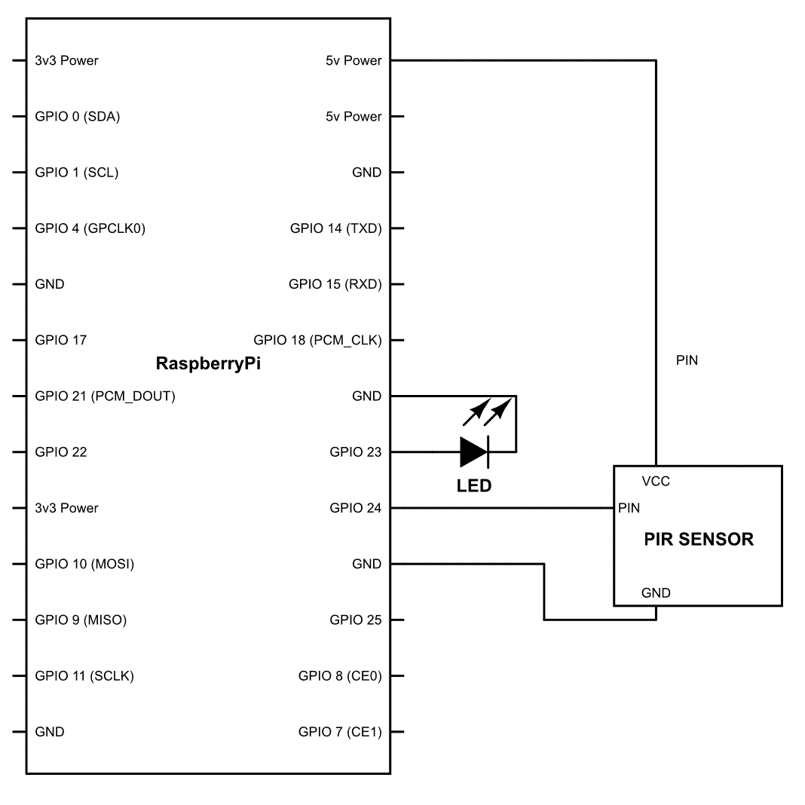
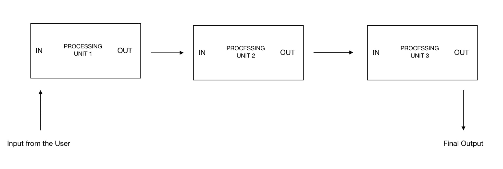
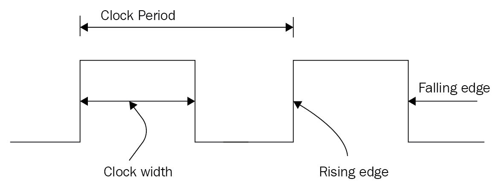
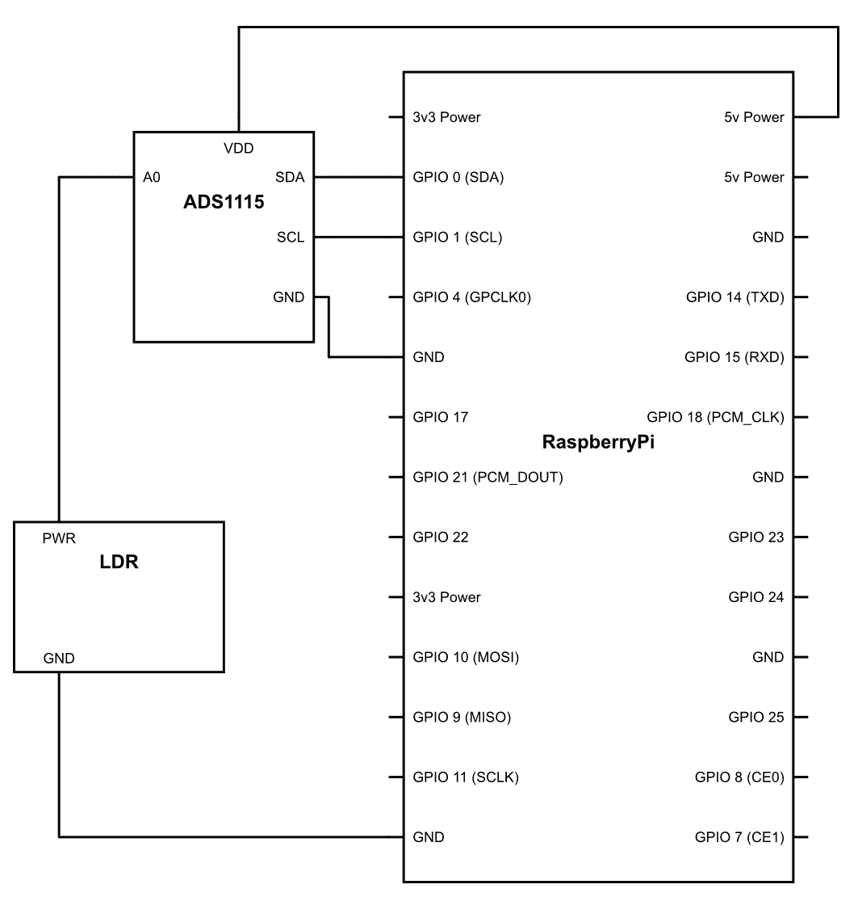

# 十八、使用 GPIOs 作为输入

在上一章中，我们了解了如何将 GPIO 用于输出。但是，顾名思义，GPIO 可以用于输入和输出目的。在本章中，我们将了解如何继续使用这些引脚将数据输入到 Raspberry Pi。

我们将在本章中介绍的主题包括：

*   深入研究 GPIOs
*   接口 PIR 传感器
*   连接超声波接近传感器
*   通过 I2C 接口

# 深入研究 GPIOs

我相信您还记得上一章中的这行代码：

```py
GPIO.setup(18,GPIO.OUT)
```

如前所述，这基本上告诉我们该引脚在特定程序中的 GPIO 行为。现在，您一定已经猜到，通过更改这一行代码，我们可以更改 pin 的行为，并将其从输出转换为输入。这就是你要做的：

```py
GPIO.setup(18,GPIO.IN)
```

一旦您在程序中写入这行代码，微控制器就会知道，在程序运行期间，管脚编号`18`将仅用于输入目的

为了理解这实际上是如何工作的，让我们回到我们的硬件，看看它是如何工作的。首先，您需要将 LED 连接到任何引脚；我们将在本程序中使用 pin 码`23`。第二，您需要在引脚编号`24`上连接一个开关。您可以参考下图进行连接：


连接后，您可以继续编写此程序：

```py
import time import RPi.GPIO as GPIO
GPIO.setmode(GPIO.BCM)
GPIO.setup(24,GPIO.IN)
GPIO.setup(23,GPIO.OUT)
while True:
  button_state = GPIO.input(24)
    if button_state == True:
      GPIO.output(23,GPIO.HIGH)
    else:
      GPIO.output(23,GPIO.LOW)
  time.sleep(0.5)
GPIO.cleanup()
```

程序上传后，只要按下按钮，LED 就会自动点亮

让我们了解到底发生了什么。`while True:`基本上是一个无限循环；一旦你应用了这个循环，在它里面运行的代码就会一次又一次地重复，直到有什么东西打断了它，我所说的中断是指一些导致程序停止并退出的中断。现在，理想情况下，只要有无限循环，我们就按*Ctrl*+*C*退出程序

```py
button_state = GPIO.input(24)  
```

在上面的一行中，程序了解它必须查看的位置；在这个节目里。在这一行中，我们告诉程序我们正在寻找 GPIO`24`，这是一个输入：

```py
if button_state == True:
   GPIO.output(23,GPIO.HIGH)  
```

如果按钮为高电平，即当按下按钮且电流达到管脚编号`24`时，GPIO 管脚编号`23`将设置为高电平：

```py
  else:
   GPIO.output(23,GPIO.LOW)
```

如果 pin 码`24`不正确，它将遵循这一行代码，并将 pin 码`23`保持在低位，即关闭

因此，这是您第一个使用 GPIOs 进行输入的程序。

# 接口 PIR 传感器

到目前为止，一切都很好！在本单元中，我们将继续介绍第一个传感器，这是一个被动红外传感器，通常称为 PIR 传感器。该传感器是一种非常特殊的传感器，在自动化项目中非常常用。其低能耗也使其成为物联网项目的绝佳竞争者。让我们看看它是如何工作的。

你一定已经注意到，当我们将金属加热到高温时，它的颜色会慢慢变为深红色，当我们进一步加热时，它会变得更亮，并慢慢从红色变为黄色，如下图所示，图中显示了一个红热的钢片。现在，随着温度的升高，辐射的波长减小；这就是为什么随着温度的升高，颜色从红色变为黄色，因为黄色的波长比红色短


但有趣的是，即使物体温度不够高，它们也会发出辐射；事实上，任何高于绝对零度的物体都会发出某种形式的辐射。有些我们可以用肉眼看到，有些我们看不见。因此，在室温下，物体发出的红外辐射比可见光波长更高。因此，我们不能用眼睛看到它。尽管如此，它仍然存在。

这个 PIR 传感器的作用是，它感应到周围物体发出的红外光，每当物体移动时，它都能感应到其图案的整体变化，并以此为基础，能检测到附近是否有任何移动。

我们假设，只要房间里有人，就会发生一些固有的运动，因此这种传感器通常被用作占用传感器。现在，让我们连接此传感器，看看如何使用它：



按照上图连接后，继续并上传代码：

```py
import time import RPi.GPIO as GPIO
GPIO.setmode(GPIO.BCM)
GPIO.setup(23,GPIO.IN) 
GPIO.setup(24,GPIO.OUT)
while True:
 if GPIO.input(23) == 1: 
  GPIO.output(24,GPIO.HIGH)
 else: 
  GPIO.output(24,GPIO.LOW)

 time.sleep(1)
GPIO.cleanup()
```

现在，让我们看看发生了什么。逻辑很简单。一旦 PIR 传感器检测到移动，它就会将其输出引脚转到高位。我们所要做的就是监视这个 pin 码，基本上就是这样

该逻辑与按钮开关的逻辑完全相似，也将以类似的方式工作。所以不需要太多解释

# 连接超声波接近传感器

首先是基础。接近传感器是一种传感器，用于从中感应物体的接近程度。世界上有很多传感器可以用来完成这项任务，还有许多技术可以让我们做到这一点。正如名字所说，超声波接近传感器的工作原理是超声波。工作原理很容易理解。超声波传感器发送一束超声波；这些波是人耳听不见的，但尽管如此，它仍然是一种声波，其行为也像声波。

现在，我们知道，声音从不同的表面反弹，形成回声。当你在一个空房间里说话时，你一定经历过这种回声。你可以听到自己的声音，但稍有延迟。这种延迟是由声音的特性引起的。声音是波，因此它有速度。声波有固定的传播速度。所以，要覆盖一段特定的距离，它们需要一些时间。通过计算这个时间，我们可以得出声波在从表面反弹之前要走多远

类似地，在这个传感器中，我们向特定方向发射超声波，然后感应反射回来的回声。当然，接收回音会有延迟；延迟将与物体与传感器的距离成正比，基于此延迟，我们可以轻松计算距离

现在，要使用接近传感器，我们需要了解传感器的物理结构，以便正确连接。传感器中有四个针脚，分别为：

*   VCC（正极）
*   触发
*   回响
*   地（地）

我显然不需要解释 VCC 和地面的作用。那么，让我们直接进入触发。每当引脚处于高位 10 微秒时，超声波传感器将向目标发送 8 个周期的 40 kHz 声波。一旦触发循环完成，**回波**设置为高。一旦接收回回波信号，**回波**引脚被设置回低电平。下面是一个图表，展示了它是如何实际发生的：


这就是我们现在需要知道的全部。随后，我们将在前进中了解更多。现在，要继续并使其带电，请按照图连接：


建立连接后，需要运行以下代码：

```py
import RPi.GPIO as GPIO
import time

GPIO.setmode(GPIO.BCM)
GPIO.setup(23,GPIO.OUT) 
GPIO.setup(24,GPIO.IN) 

while True:
     pulse_start = 0
     pulse_stop = 0
     duration = 0
     distance = 0

     GPIO.output(23,GPIO.LOW)
     time.sleep(0.1) 
     GPIO.output(23,GPIO.HIGH)
     time.sleep(0.000010)
     GPIO.output(23,GPIO.LOW)

     while GPIO.input(24)==0:
         pulse_start = time.time()

     while GPIO.input(24)==1:
         pulse_stop = time.time()

     duration = pulse_stop - pulse_start

     distance = duration*17150.0
     distance = round(distance,2)
     print ("distance" + str(distance)) 

     time.sleep(0.2)
}
```

现在，运行此程序后，屏幕上的输出将每隔 0.2 秒显示一次对象的距离。现在，您一定想知道这是如何传达所有这些读数的：

```py
GPIO.setup(23,GPIO.OUT) 
```

我们正在指定引脚`23`在需要时为传感器的**触发器**引脚提供脉冲：

```py
GPIO.setup(24,GPIO.IN)
```

我们正在分配引脚`24`来接收逻辑，以确认接收到回波信号：

```py
pulse_start = 0
 pulse_stop = 0
 duration = 0
 distance = 0
```

我们将使用前面的变量，每次循环开始时，我们都给它们分配一个值，即`0`；这是为了擦除我们在编程过程中存储的先前读数：

```py
GPIO.output(23,GPIO.HIGH)
  time.sleep(0.000010)
  GPIO.output(23,GPIO.LOW)
```

我们将触发针编号`23`保持在高位 0.000010 秒，以便超声波传感器能够发送一个简短的超声波脉冲：

```py
  while GPIO.input(24)==0: 
 pulse_start = time.time()
```

此 while 语句将持续记下`pulse_start`变量的时间，直到时间引脚号`24`变低。时间的最终读数将存储在`pulse_start`变量中，就像记下脉冲发送的时间一样：

```py
while GPIO.input(24)==1:
 pulse_stop = time.time()
```

此循环中的`while`语句将开始记录引脚号`24`上的输入高的时间，并将持续记录时间，直到引脚号`24`保持高。时间的最终读数将存储在`pulse_stop`变量中，如记录接收脉冲的时间：

```py
 duration = pulse_stop - pulse_start
```

在本声明中，我们计算脉冲从传感器传输到物体并反弹到传感器接收器所需的总时间：

```py
 distance = duration*17150.0
```

这是制造商给出的一个算术公式，用于将超声波传播的持续时间转换为实际距离（厘米）。你可能会问我们是怎么得到这个等式的？

让我给你简要介绍一下。在基础物理中，我们会记住这个简单的方程式：*速度*=*距离*/*时间*。

现在你可能还记得，声速是 343 米每秒，现在 1 米有 100 厘米，因此要把这个速度转换成厘米每秒，我们必须把速度乘以 100，因此速度是 34300 厘米每秒

现在我们知道了方程中的一个元素，速度。让我们把速度的值放到方程中。现在方程看起来是这样的：*34300*=*距离*/*时间*。

现在我们知道一件事，声音传播的距离是实际距离的两倍。怎样因为声音首先从传感器传到物体。然后它从表面反弹并回到传感器。所以从本质上说，它覆盖了两倍的距离。因此，为了适应这个等式，我们必须做一个小的改变：*34300*/*2*=*距离*/*时间*

现在我们想要从这个方程中得到的是距离，所以让我们把所有其他部分都带到另一边。现在的公式是这样的：*17150***时间*=*距离*

这就是距离的公式。

```py
distance = round(distance,2)
```

由于超声波所经过的距离是实际距离的两倍（一次用于接近物体，另一次用于反弹到传感器），我们将其除以一半以获得实际距离：

```py
print 'Distance = ',distance
```

最后，我们将通过以下语句打印测量的距离。引号`'...'`中的任何内容都将按其书写方式书写。但是，`distance`没有引号，距离是一个变量。因此，存储在距离中的变量将写入屏幕上的最终输出：

```py
 time.sleep(0.25)
```

代码将在此行上暂停 0.2 秒。如果我们没有这个停顿，那么这些值将以难以置信的速度出现，这对我们来说是难以阅读或理解的。如果您正在修补，我建议删除此语句并运行代码，看看会发生什么

# 通过 I2C 接口

到目前为止，一切顺利。电子电路可能非常有趣，虽然它们看起来非常复杂，但我们经常发现工作可能非常简单。在上一节中，我们一次连接一个传感器。我们可以继续连接多个传感器，但我们受到现有 GPIO 数量的限制。我们还看到，一些传感器（如超声波传感器）可能会使用多个 GPIO 引脚进行工作。这进一步减少了我们可以与微控制器接口的传感器数量。一旦我们转向更复杂的电路，我们也会意识到布线可能会非常混乱，如果出现问题，那么找到问题所在就成了一项乏味的任务。

现在，在设计机器人系统时，我们面临着一个更大的问题，那就是在一个系统中完成的所有工作都必须同步计时的问题。大多数系统目前本质上是连续的，因为一个单元的输出变成了另一个单元的输入：



现在，对于要完成的任务，**处理单元 1**必须在需要时将输入传递给**处理单元 2**，而**处理单元 3**也是如此。如果数据没有完全定时，则**处理单元 2**会一直等待**处理单元 1**的输入，或者更糟糕的是，**处理单元 1**会在不需要数据的时候将数据发送给**处理单元 2**。在这种情况下，数据将丢失，进程将出现一些错误

因此，为了解决这个问题，当时的计算机科学家发明了一种脉冲系统。时钟脉冲是一种非常简单的方波，占空比为 50%（回忆**脉宽调制**（**PWM**）。电路设计用于在时钟脉冲的上升沿或下降沿执行一次操作。由于这种同步，电路的每个部分都知道何时工作。下面是时钟脉冲的样子：



现在，回到正题，我们有两个问题：

*   可以连接到机器人的设备/传感器数量存在物理限制
*   如何对传感器和互连电路进行计时，使其协调工作

为了解决这些问题，我们使用了一个非常常用的协议**I2C**，它代表**内部集成电路**。当我们需要在同一组 GPIO 上连接多个设备时，例如当我们只有一组 GPIO 引脚可以连接多个传感器时，此协议非常有用。这是由于分配给每个硬件的唯一地址而实现的。该地址用于识别传感器，然后与传感器进行相应的通信。现在，要实现 I2C 协议，我们需要两条线路；这些线路如下：

*   资料
*   时钟

正如您可能已经猜到的，时钟线用于向连接到它的设备发送时钟脉冲，数据是数据来回流动的总线

现在，整个 I2C 架构在主从配置上工作，其中主设备始终为从设备生成时钟信号，并且从设备必须不断查找主设备发送的时钟脉冲和数据包。让我们看看是怎么做的。

如前所述，有两条线：数据线，称为**串行数据**（**SDA**），时钟线，称为**串行时钟**（**SCL**）。从现在起，我们将使用术语 SCL 和 SDA：


Lets look at the main pointers shown in the diagram:

*   **启动条件**：为了启动通信，创建一个启动条件，指示通信即将发生。主机通过在 SCL 之前保持 SDA 线低位来描述这种情况。这表示所有从设备都已准备好进行通信。
*   **地址帧**：一旦通信开始，主机发送需要通信的设备的地址。这是一个 7 位地址。在每个时钟脉冲中，发送一位，因此需要七个时钟脉冲来发送 7 位地址。之后的 7 位地址是读/写位。这向设备指示主设备是否希望在此操作中写入数据，或者是否希望读取某些数据。因此，总地址帧为 8 位，需要发送 8 个时钟脉冲。在这八个脉冲之后，在第九个时钟脉冲期间，主机等待来自设备的确认。当 SDA 线路被正在寻址的从属设备拉低时，该确认由从属设备发送。通过这种策略，主设备知道它发送的地址已被接收，并且从设备现在已准备好进行通信。如果没有发送回确认，那么由主机决定必须做什么
*   **数据帧**：确认发送后，根据是读操作还是写操作，主设备将数据写入从设备，或者在读操作中，从设备将数据发送到主设备。此数据帧的长度可以是任意的。
*   **停止帧**：数据传输完成后，主机发出停止条件，表示通信必须停止。当 SDA 线在 SCL 线从低到高之后从低到高时，就会出现这种情况

这就是 I2C 通信的基本原理。对于每个设备，我们都有一个 7 位地址，因此我们可以在一条总线上连接多达 128 个设备。那是很多设备。超出物理极限的可能性几乎可以忽略不计。现在让我们来看看如何通过这个协议连接传感器。一般来说，I2C 不需要做核心编程，因为它既冗长又繁琐。这就是开源的魔力所在。全球有很多开发人员都在开发这些传感器，他们中的大多数人都非常慷慨，可以制作一个库并共享，以便于编程。这些图书馆都是在线的，其中大部分都负责复杂的交流过程

现在是时候我们接口我们的第一个 I2C 设备，这是一个模拟到数字转换器。你一定想知道为什么我们首先使用这个转换器。回想一下我们开始理解 GPIO 引脚的时候。这些魔术管脚可以用作输入和输出；您可能还记得，这些管脚可以是开的，也可以是关的。这些都是数字管脚，不仅用于输出，也用于输入。但是有大量的传感器通过模拟通信工作。由于 Raspberry Pi 的数字结构，很难直接连接这些传感器。因此，我们使用一个**模数转换器**（**ADC**），该转换器将传感器的模拟值转换为 Raspberry Pi 可以理解的数字位。

我们将连接一个 LDR，电阻器将根据落在其上的光线量改变电阻值。因此，电压将取决于有多少光落在 LDR 上

现在让我们看看它实际上是如何做到的。拿起你的 Pi，我们走吧。首先，我们需要在 Raspberry Pi 上启用 I2C；按照此处列出的步骤操作：

1.  打开终端（*Ctrl*+*Shift*+*T*）
2.  类型`sudo raspi-config`
3.  选择接口选项：


4.  然后转到高级选项：


5.  然后选择 I2C 以启用它。然后选择是：


现在安装`adafruit`库与 ADC1115 接口：

1.  打开终端并复制以下命令：

```py
sudo apt-get install build-essential python-dev python-smbus python-pip 
```

此命令将库和依赖项下载到 Raspberry Pi

2.  现在键入以下内容：

```py
sudo pip install adafruit-ads1x15
```

此命令将库和依赖项安装到 Raspberry Pi。

现在软件已经设置好了，让我们准备好硬件。将 Raspberry Pi 连接至 ADS1115，如下图所示：



准备好后，继续以 Pi 格式上载此代码：

```py
import time
import Adafruit_ADS1x15
import RPi.GPIO as GPIO
LED =14

GPIO.setmode(GPIO.BCM)
GPIO.setup(LED,GPIO.OUT)

adc = Adafruit_ADS1x15.ADS1115()
GAIN = 1
channel=0
adc.start_adc(channel, gain=GAIN)

while True:
    value = adc.get_last_result()
    print(str(value))
    time.sleep(0.1)
    if value >= 100:
        GPIO.output(LED,1)
    else :
        GPIO.output(LED,0)

adc.stop_adc()
```

请注意，有时此代码可能无法工作，在这种情况下，请尝试调整 threshold 的值：

```py
if value >= 100:
```

您可能已经注意到，当 LDR 朝向光源时，LED 也会打开，当它远离光源时，LED 会关闭

现在你已经连接了一个 I2C 设备。让我们了解一下这段代码实际上是如何工作的：

```py
import Adafruit_ADS1x15
```

前一行代码导入代码中的`Adafruit_ADS1x15`库，以便我们可以在程序中使用它的所有函数。

```py
adc = Adafruit_ADS1x15.ADS1115()
```

前一行代码创建库`Adafruit_ADS1x115`的实例。行`.ADS1115()`是创建实例为`adc`的函数。明白了吗？让我用英语说

现在，我们可以简单地编写`adc`来调用库函数，而不是一直编写`Adafruit_ADS1x15`。此外，您可以使用任何单词代替`adc`；它可以是你的猫的名字，也可以是你邻居的名字，但它仍然有效：

```py
GAIN = 1
```

这是将进行感测的值。`1`描述感应将在全范围内发生。这对于我们的 ADC 来说是从 0V 到+/-4.096V 的电压范围。现在，改变增益将导致传感范围的改变。也就是说，如果我们将增益值更改为`2`，则发生传感的范围将是原始范围 I.w.0 至+/-2.048 伏的一半

现在你必须问电压范围是多少，为什么我们要改变增益

原因很简单。有不同类型的模拟传感器。其输出电压范围广泛。有些传感器的输出电压范围为 0.5 伏至 4 伏，其他传感器的输出电压范围为 0.1 伏至 0.98 伏。现在，如果我们将增益设置为`1`，那么所有这些传感器都可以轻松连接。因为它们都在 0 到 4.098 伏的感应范围内。然而，由于它是一个 16 位 ADC，因此 ADC 可以提供的离散值总数介于 2<sup>16</sup>或 65536 读数之间。因此，在增益为`1`时，ADC 可以检测到的最小电压变化为：*4.096*/*65536*=*0.000062*。

但如果将增益增加到`4`，则传感范围将仅减少到`0`至+/-1.0245。因此，这将能够在 0.1 伏到 0.98 伏的输出范围内工作。但现在让我们看看它能检测到的最小电压变化：*1.0245*/*65536*=*0.00001563*。

现在你可以看到，可以检测到的最小电压非常低。这对于与传感器的兼容性是一件好事。

现在，你想获得什么样的价值取决于你自己。LDR 的工作电压为 5V，因此我们最好使用`1`的整个增益读数：

```py
channel=0
```

当您仔细观察 ADC 硬件时，您会注意到有各种管脚，包括**A0**、**A1**、**A2**和**A4**这是一种四通道 ADC，它可以转换四个模拟输入并将其转换为数字数据。由于我们只使用一个数据流，我们将让 Pi 知道它连接在哪个管脚上。下面一行，我们告诉 Pi 开始转换数据的过程：

```py
adc.start_adc(channel, gain=GAIN)
```

在下一行中，我们指示 ADC 停止转换，代码就到此结束

```py
adc.stop_adc()
```

# 总结

本章介绍了如何将传感器与 GPIO 连接，以便传感器能够检索数据