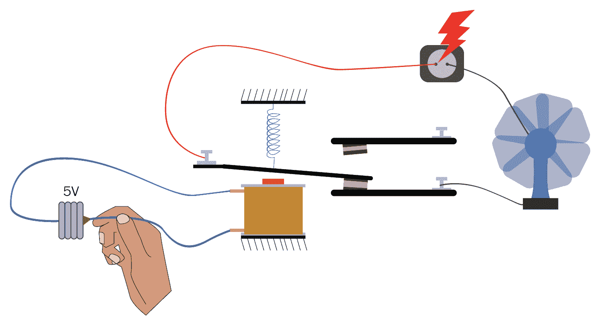
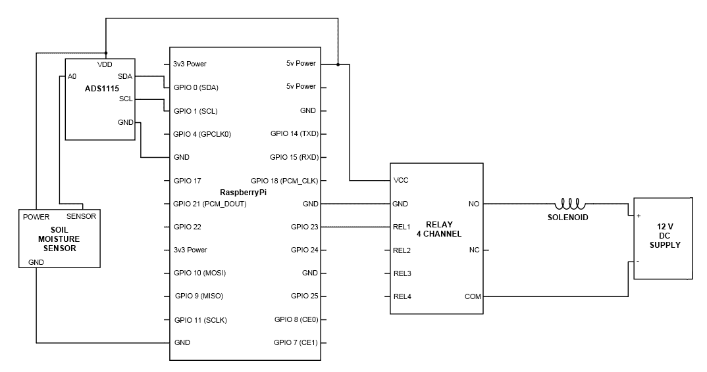

# 十九、制造园丁机器人

好了，我的朋友们，你们已经了解了输入和输出的一些基本知识；现在是时候做点什么了，我们可以把一些日常责任交给他们。这个机器人可能看起来不像机器人，但相信我，它会让你的生活更轻松。你花园里的大多数植物都会为你的成功而祝福

我们将讨论以下主题：

*   使用电磁阀
*   制造机器人
*   让它更智能
*   让它真正智能化

# 使用电磁阀

我们将要做的是一个自动化系统，它将在你的工厂需要的时候给他们浇水。所以从技术上讲，一旦设置好了，你就不必担心给你的绿色生物浇水了。无论你是在家里，在办公室，还是在度假，无论发生什么事情，这都会保持它的工作

现在，你一定想知道它将如何浇灌植物，所以让我告诉你，对于这个世界上的每一个问题，都有一个解决方案。在我们的例子中，这种解决方案称为电磁阀。它的基本功能是切换液体的流动。市场上有各种电磁阀可供选择；一些识别特征如下所示：

*   **尺寸**：有半英寸、四分之三英寸、1 英寸等多种尺寸。这基本上将决定电磁阀的流量。
*   **介质**：是否指流体、气体、蒸汽等。
*   **正常状态**：
    *   **常开**：该阀在无电源时，允许液体在关闭状态下流动
    *   **常闭**：当阀门无电源时，该阀门将在关闭状态下停止液体流动
*   **通道数**：一个简单的阀门将有一个入口和一个出口。因此，当它打开时，它将允许液体从入口流向出口。但是，也可以有其他类型的阀门，例如可能有两个出口和一个进口的三通阀。它可以调节液体流动的位置

在阀门方面也可以有更多的细节，但现在我们只需要知道这些。关于电磁阀需要注意的一点是，这些阀门可以打开或关闭。不可能在两者之间达到任何状态或通过这些阀门控制流量。为此，我们可以使用伺服阀或电动阀。但到目前为止，我们不需要它

在本章中，我们将使用一个半英寸的水/流体阀门，它是常闭的。当你仔细观察这个阀门时，你会发现它在 12 伏电压下工作，电流消耗接近 1 安培。这对覆盆子皮来说是一个很大的电流。Raspberry Pi 可以为每个引脚提供的电流上限约为 50 毫安。所以如果我们把这个阀门连接到 RespberryPi 上，它肯定不会工作

我们现在该怎么办？这个问题的答案是接力。继电器的基本工作是重新铺设电路。基本上，它是一个电子控制开关。继电器的基本工作是打开和关闭电流/电压消耗高于控制单元所能提供的电流/电压消耗的设备。如图所示，这是一个相当简单的设备。有两条线路。一个用蓝色表示，这是一个低电压和低电流电路。这个电路正在给线圈通电。另一个电路用红色和黑色表示。该电路是一个高电压、大电流电路

如您所见，在初始阶段，高压-大电流电路不完整，烤箱无法工作：


现在，在第二张图中，您可以看到蓝色电路连接到 5V 电源，线圈通电。每当线圈通电时，它就会形成一个电磁铁，吸引大功率电路的金属片，使电路完整，从而为烤箱通电：



这就是电磁阀的工作原理。线圈的消耗几乎不到几毫安，因此很容易通过微控制器驱动线圈。这进而使最终电路之间发生接触

市场上有各种各样的继电器；一些识别特征如下所示：

*   **最大输出电压**：能够处理的最大电压
*   **最大输出电流**：连接到它的任何输出设备所能承受的最大电流
*   **信号电压**：需要开关元件的电压
*   **正常状态**：
    *   **正常关闭**：在未收到信号之前，不允许任何电流流动
    *   **正常开启**：允许电流流动，直到没有收到信号为止

现在，回到我们的园艺机器人，连接到它的电磁阀将工作在 1 安培和 12 伏，所以任何继电器可以提供等于或大于 1 安培和 12 伏将工作

通常，市场上可用的继电器为 120V 和 12 安培直流。需要记住的一件重要事情是，交流和直流电压和电流有两个单独的额定值。由于我们的电磁阀将在 12V 下工作，我们将只考虑直流上限。

# 制造机器人

现在，让我们开始制作机器人。首先，你需要把水龙头和螺线管以及螺线管和洒水器连接起来。您还必须建立连接，如下所示：



现在让我们开始编程。我们将在这个机器人中连接土壤湿度传感器。该传感器的工作是确定土壤中的水量。通过确定这一点，我们可以了解花园是否需要水。该土壤湿度传感器是一个模拟传感器，因此我们将使用 ADC 将模拟读数转换为 Pi 数字值。让我们开始吧：

```py
import time
import RPi.GPIO as GPIO
import Adafruit_ADS1x15
water_valve_pin = 23
moisture_percentage = 20
GPIO.setmode(GPIO.BCM)
GPIO.setwarnings(False)
GPIO.setup(water_valve_pin, GPIO.OUT)
adc = Adafruit_ADS1x15.ADS1115()
channel = 0
GAIN = 1
while True:
 adc.start_adc(channel, gain=GAIN)
 moisture_value = adc.get_last_result()
 moisture_value= int(moisture_value/327)
 print moisture_value
 if moisture_value < moisture_percentage:
 GPIO.output(water_valve_pin, GPIO.HIGH)
 time.sleep(5)
 else:
 GPIO.output(water_valve_pin, GPIO.LOW)
```

在运行此代码之前，让我们先了解它实际上在做什么：

```py
moisture_percentage = 20
```

`moisture_percentage = 20`是作为阈值的百分比；如果土壤湿度低于 20%，那么你的花园需要水。正是这种情况，你的机器人将继续寻找；一旦满足此条件，则可以采取适当的措施。此百分比也可以根据您花园的需要更改为`30`、`40`或任何其他值：

```py
moisture_value = int(moisture_value/327)
```

ADC 是一个 16 位设备，有 16 个二进制数字可以表示一个值。因此，该值可以在`0`和`2<sup>15</sup>`之间，或者换句话说，在`0`和`32768`之间。现在，通过简单的数学计算，ADC 将给出以下读数：`32768/100`或`327.68`。因此，为了找出土壤中的水分百分比，我们必须将 ADC 给出的实际值除以`327.68`。

代码的其余部分相当简单，一旦您看完它，就不难理解了

# 让它更智能

祝贺你制作了第一个机器人！但是你注意到一个问题了吗？我们制造的机器人一直在寻找湿度值，当它发现湿度值很低时，它突然抽水，确保土壤湿度始终超过 20%。然而，这不是必需的。一般来说，我们每天给花园浇水一两次。如果我们多浇水，可能对植物不好。

所以，让我们继续，让它稍微智能化一点，让它只在特定时间水分水平较低时给植物浇水。这一次，我们不需要对硬件进行任何更改；我们只需要调整代码

让我们继续上传以下代码，然后看看到底发生了什么：

```py
from time import sleep
from datetime import datetime
import RPi.GPIO as GPIO
import Adafruit_ADS1x15
water_valve_pin = 23
moisture_percentage = 20
GPIO.setmode(GPIO.BCM)
GPIO.setwarnings(False)
GPIO.setup(water_valve_pin, GPIO.OUT)
adc = Adafruit_ADS1x15.ADS1115()
GAIN = 1
def check_moisture():
 adc.start_adc(0,gain= GAIN)
 moisture_value = adc.get_last_result()
 moisture_value = int(moisture_value/327)
 if moisture_value < moisture_level:
 GPIO.output(water_valve_pin, GPIO.HIGH)
 sleep(5)
 GPIO.output(water_valve_pin, GPIO.LOW)
 else:
 GPIO.output(water_valve_pin, GPIO.LOW)
while True:
 H = datetime.now().strftime('%H')
 M = datetime.now().strftime('%M')
 if H == ‘07’ and M <= ‘10’:
 check_moisture()
 if H == ‘17’ and M <= ‘01’:
 check_moisture()
```

这段代码对您来说可能有点陌生，但相信我，它是最简单的。让我们一步一步地看看发生了什么：

```py
from datetime import datetime
```

这行代码正在从日期时间库导入日间实例。这是一个默认为 Python 的库。我们需要做的就是给它打电话。现在，它所做的是在没有任何喧嚣的情况下，帮助我们确定代码中的时间：

```py
def check_moisture():
```

有好几次我们不得不一次又一次地做某事。这些代码集可以是几行重复的代码或多页代码。因此，重写该代码毫无意义。我们可以创建一个函数。在这个函数中，我们可以定义调用它时将发生什么。在这一行中，我们创建了一个名为`check_moisture()`的函数；现在，每当在程序中调用此函数时，都会执行一组活动。将要执行的活动集由用户定义。所以，每当我们写`def`时，就意味着我们正在定义一个函数；然后，我们写下需要定义的函数名

一旦完成，那么我们在缩进中写的任何内容都将在调用函数后完成。请记住，无论何时调用或定义函数，它都会在函数名称的末尾用一个开括号和一个闭括号表示：

```py
 moisture_value = adc.get_last_result()
```

`adc.get_last_result()`是`adc`的一个函数。它所做的活动只是从前面定义的 pin（pin 编号`0`）中获取结果，并将读数获取到变量`moisture_value`。因此，在第`moisture_value`行之后将是 ADC 的管脚编号`0`的读数，或者换句话说，水分传感器的读数：

```py
H = datetime.now().strftime('%H')
```

代码`datetime`是`.now()`的实例和方法。此函数的作用是更新时间。现在，`date time.now()`更新了日期和时间的所有参数，包括小时、分钟、秒，甚至日期。这取决于我们是否想要全部或日期和时间的任何特定部分。目前，我们希望将小时值放入变量`H`，因此我们使用`.strftime('%H')`方法。`strftime`表示时间的字符串格式。所以不管它输出什么值，都是字符串格式。`('%H') `意味着它只会给我们小时数的值。同样，我们也可以通过使用`('%M')`和`('%S)`以分钟为单位获得时间。我们还可以使用以下语法获取日期、月份和年份的值：

*   获取日期：`('%d')`
*   取月份：`('%m')`
*   获取年份：`('%Y')`

```py
if H == ‘07’ and M <= ‘10’:
```

在前面的条件中，我们正在检查时间是否为 7 点钟；此外，我们还将检查时间是否小于或等于 10 分钟。因此，这段代码将仅在时间为`7`小时且介于`0`和`10`分钟之间时运行`if`语句中的语句

需要特别注意的一点是，我们在两个条件之间使用了一个`and`，因此只有当两个语句都完全正确时，它才会运行其中的代码。我们还可以在它内部使用一些其他语句，例如`or`，在这种情况下，如果其中一条语句为 true，它将运行代码

如果我们在本`if`语句中将`and`替换为`or`，则它将在每小时的 0 到 10 分钟内运行代码，并在上午 7:00 到上午 7:59 之间的整个时间内连续运行代码：

```py
check_moisture()
```

您可能还记得，之前我们定义了一个名为`check_moisture()`的函数。在定义该函数的同时，我们还定义了每次调用该函数时将发生的一组活动。

现在是调用该函数的时候了。当程序到达代码的这一端时，它将执行先前在函数中定义的一组活动

所以我们有了它。现在，只要您运行此代码，它就会等待您在程序中定义的时间。一旦达到特定时间，它将检查湿度。如果湿度小于设定值，则会开始给植物浇水，直到湿度达到该阈值以上

# 让它真正智能化

了不起的工作！我们已经开始建造比我们自己更聪明的东西。但现在我们想更进一步，让它比我们更聪明，这就是机器人在这里的目的。不仅要做我们所做的，而且要以更好的方式做这一切

那么，我们可以改进什么呢？嗯，在寒冷的冬天，我们不需要很多水，但到了夏天，我们需要的水比冬天喝的要多得多。植物也是如此

在冬天，它们需要的水量要少得多。此外，甚至土壤中水分的蒸发速度也较慢。因此，在这两种情况下，我们需要为花园提供不同数量的水。问题是，我们如何做到这一点？

首先，要知道外面是热还是冷，我们需要一个传感器。我们将使用名为 DHT11 的传感器。这是一个便宜但坚固的传感器，它能为我们提供温度和湿度的读数。最棒的是，它是超便宜的，价格在 2 美元左右

它有四个引脚。但如果你认为它对 I2C 协议有效，那么你就错了。它有自己的数据传输方法。对所有传感器使用一个协议是很好的，但通常您也会发现，有各种传感器或设备使用不同的或全新的协议。DHT11 就是这样一种传感器。在这种情况下，我们可以选择要么理解整个通信方法，要么简单地从制造商那里获取库并使用它。目前，我们将选择后者

现在让我们看看 DHT11 的引脚是什么样子的：


这里你可以看到，只有一个信号管脚可以完成所有的数字通信。电源有两个引脚，其中一个引脚未使用。也就是说，pin 没有重要用途。它可能只是用于焊接或将来使用。该传感器工作在 5V 电源上，只需要几毫安，因此我们可以简单地使用 Raspberry Pi 为其通电。现在，对于数据通信，我们将信号引脚连接到 GPIO 引脚号`4`。

在开始编写代码之前，让我们首先安装用于 DHT11 和 Raspberry Pi 之间通信的库。我们以前在 ADS1115 库中已经做过这项工作，但在这一部分中，我们需要注意一些小技巧。让我们开始吧。

首先，我们需要确保您的 Raspberry Pi 的操作系统是最新的。因此，将 Raspberry Pi 连接到 internet，在 Raspberry Pi 中打开命令提示符，然后键入以下命令：

```py
sudo apt-get update
```

此命令将自动更新 Raspberry Pi 的 raspbian 操作系统。然后继续并键入以下内容：

```py
sudo apt-get install build-essential python-dev python-openssl
```

在此命令中，我们正在安装以下软件包：

*   `build-essential`
*   `python-dev`
*   `python-openssl`

您一定想知道我们为什么要安装所有这些。长话短说，这些是我们将要安装的用于 DHT11 通信的库的依赖项。如果这些软件包没有安装在 Raspberry Pi 上，我们将无法使用该库。

最后，我们必须安装库；这是一个通用库，其中还提供与 DHT11 传感器通信的功能。这应该足以满足我们方便沟通的需要。以下是安装它的命令：

```py
sudo python setup.py install
```

好吧，我们可以走了。我们的系统已准备好与 DHT11 通话。让我们先看看到目前为止我们所做的是否符合我们的要求。为此，按如下方式连接 DHT11；您可以让电磁阀和土壤湿度传感器等其他部件保持连接状态。他们不应该干涉。现在，在 Pi 中上载以下代码：

```py
from time import sleep
from datetime import datetime
import RPi.GPIO as GPIO
import Adafruit_DHT
sensor = 11
pin = 4
GPIO.setmode(GPIO.BCM)
GPIO.setwarnings(False)
while True:
 humidity, temperature = Adafruit_DHT.read_retry(sensor, pin)
 print("Temperature: " +temperature+ "C")
 print("Humidity: " +humidity+ "%")
 time.sleep(2)
```

上传此代码后，您将在屏幕上看到传感器的读数。此代码只是为您提供传感器的原始读数。这段代码非常简单，您将很好地理解这里编写的所有内容，除了以下几行代码：

```py
import Adafruit_DHT
```

在这一行代码中，我们正在代码中导入`Adafruit_DHT`库。这与将用于与 DHT11 传感器通信的库相同：

```py
sensor = 11 
```

有不同版本的 DHT 可用，如 DHT11、DHT22 等。我们需要告诉程序我们正在使用哪个传感器。因此，我们为变量传感器分配了一个值。稍后，您将看到我们将如何使用它：

```py
pin = 4  
```

在这一行中，我们将值`4`分配给一个名为`pin`的变量。此变量将用于告诉程序我们在树莓 Pi 的哪个引脚上连接了 DHT11：

```py
humidity, temperature = Adafruit_DHT.read_retry(sensor, pin)
```

在这一行中，我们使用了名为`Adafruit_DHT.read_retry()`的`Adafruit`库的方法。现在，它读取 DHT 传感器，并将传感器的读数提供给变量`humidity`和`temperature`。需要注意的是，DHT11 给出的读数每 2 秒更新一次。因此，您将收到的读数将在每 2 秒后刷新一次

一旦该代码通过，我们就可以确保传感器按照我们想要的方式工作。最后，是时候将所有传感器集成在一起，形成一个完全智能的机器人了。由于电磁阀、湿度传感器和温度传感器已经连接好，我们所需要做的就是将代码上传到 Pi 上，看看神奇之处：

```py
from time import sleep
from datetime import datetime
import RPi.GPIO as GPIO
import Adafruit_ADS1x15
import Adafruit_DHT
water_valve_pin = 23
sensor = 11
pin = 4
GPIO.setmode(GPIO.BCM)
GPIO.setwarnings(False)
GPIO.setup(water_valve_pin, GPIO.OUT)
Channel =0
GAIN = 1
adc = Adafruit_ADS1x15.ADS1115()
def check_moisture(m):
 adc.start_adc(channel, gain=GAIN)
 moisture_value = adc.get_last_result()
 moisture_value = int(moisture_value/327)
 print moisture_value
 if moisture_value < m:
 GPIO.output(water_valve_pin, GPIO.HIGH)
 sleep(5)
 GPIO.output(water_valve_pin, GPIO.LOW)
 else:
 GPIO.output(water_valve_pin, GPIO.LOW)
while True:
 humidity, temperature = Adafruit_DHT.read_retry(sensor, pin)
 H = datetime.now().strftime(‘%H’)
 M = datetime.now().strftime(‘%M’)
 if H == ‘07’ and M <= ‘10’:
 if temperature < 15:
 check_moisture(20)
 elif temperature >= 15 and temperature < 28:
 check_moisture(30)
 elif temperature >= 28:
 check_moisture(40)
 if H == ‘17’ and M <= ‘10’:
 if temperature < 15:

 check_moisture(20)
 elif temperature >= 15 and temperature < 28:
 check_moisture(30)
 elif temperature >= 28:
 check_moisture(40)
```

相当长的代码，对吗？看起来可能是这样，但一旦您逐行编写它，您肯定会明白它可能比我们迄今为止编写的所有代码都长，但它一点也不复杂。您可能已经理解了该程序的大部分内容，但是让我来解释一下我们在这里使用的一些新东西：

```py
def check_moisture(m):
  adc.start_adc(channel, gain = GAIN)

moisture_value = adc.get_last_result()
moisture_value = int(moisture_value / 327)
print moisture_value

if moisture_value < m:
  GPIO.output(water_valve_pin, GPIO.HIGH)
  sleep(5)
  GPIO.output(water_valve_pin, GPIO.LOW)
else :
  GPIO.output(water_valve_pin, GPIO.LOW)
```

在这一行中，我们定义了一个名为`check_moisture()`的函数。之前，如果你还记得的话，当我们制作函数`check_moisture`时，我们基本上是在检查湿度值是否大于或小于 20%。如果我们必须检查 30%、40%和 50%的湿度，该怎么办？我们会为此单独设置一个函数吗？

显然不是！我们要做的是将参数传递给函数，参数基本上是放在函数括号内的变量。现在我们可以给这个变量赋值，例如，`check_moisture(30)`-现在在函数执行期间，`m`的值将是`30`。再次，如果你把它叫做`check_moisture(40)`，那么`m`的值就是`40`

现在，如您所见，我们在整个函数中比较`m`的值：

```py
   if moisture_value < m:
```

`if`语句将检查调用函数时分配的`m`值。这使我们的工作非常简单

让我们看看程序的其他部分在做什么：

```py
            if temperature < 15:
                check_moisture(20)
```

每次达到所需时间，它都会继续检查温度。如果温度低于`15`，则调用参数值为`20`的函数`check_moisture `。因此，如果水分低于 20%，则将水供应至花园：

```py
 elif temperature >= 15 and temperature < 28:
                check_moisture(30)
```

`elif`或`else if`语句在`if`语句之后使用。通俗地说，这意味着如果前面的`if`语句不正确，那么它将检查此`if`语句。因此，在前一行中，它将检查温度是否在`15`和`28`摄氏度之间。如果这是真的，那么它将检查土壤的湿度。该函数的参数在此行中为`30`。因此，它将检查湿度是否小于`30`。如果是这样，那么它将为花园供水：

```py
 elif temperature >= 28:
                check_moisture(40)
```

类似地，在这一行代码中，我们正在检查温度，如果温度等于或大于`28`摄氏度，那么它将把值`40`作为参数传递给函数`check_moisture`。因此，这一次它将检查湿度是否为`28`或更高。

如您所见，现在系统将检查环境温度，并在此基础上，调节发电厂的水量。最好的部分是，它是一致的，将提供适当数量的水所需的植物

The values mentioned in this entire chapter are simply assumed values. I would strongly recommend to tweak it based on where you live and what kind of plants you have in your garden to get the best out of the system.

# 总结

在本章中，我们讨论了一些主题，如螺线管集成和土壤湿度传感器，以构建自动浇灌后院花园的机器人。接下来，我们将介绍电机的基础知识。