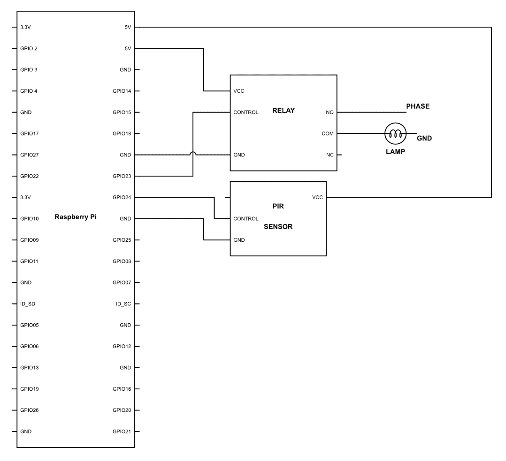
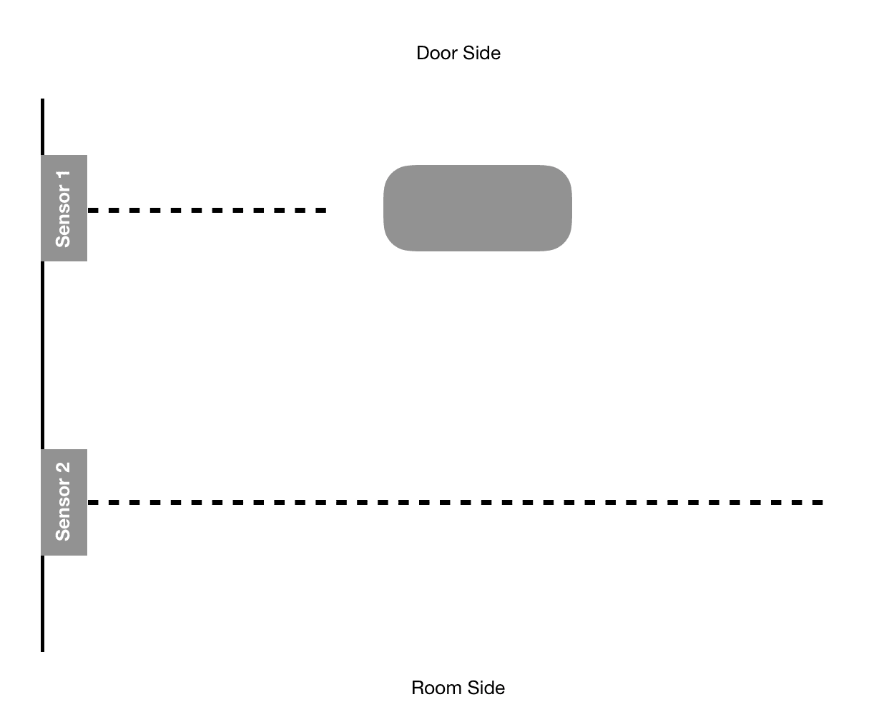
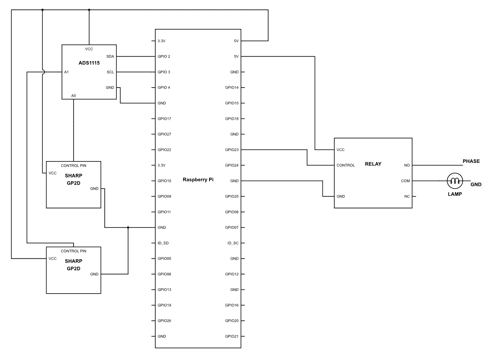
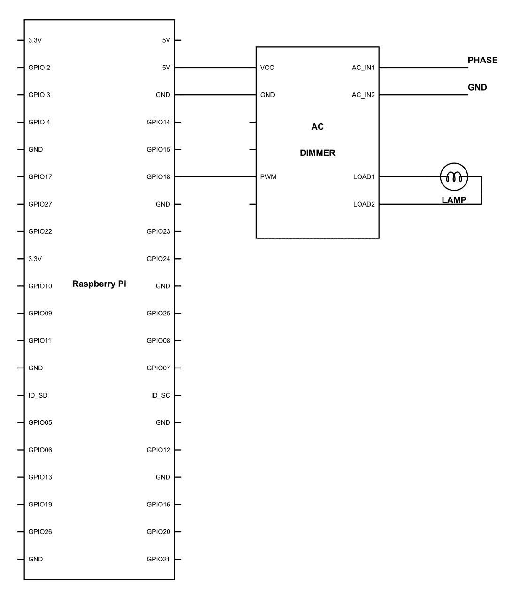
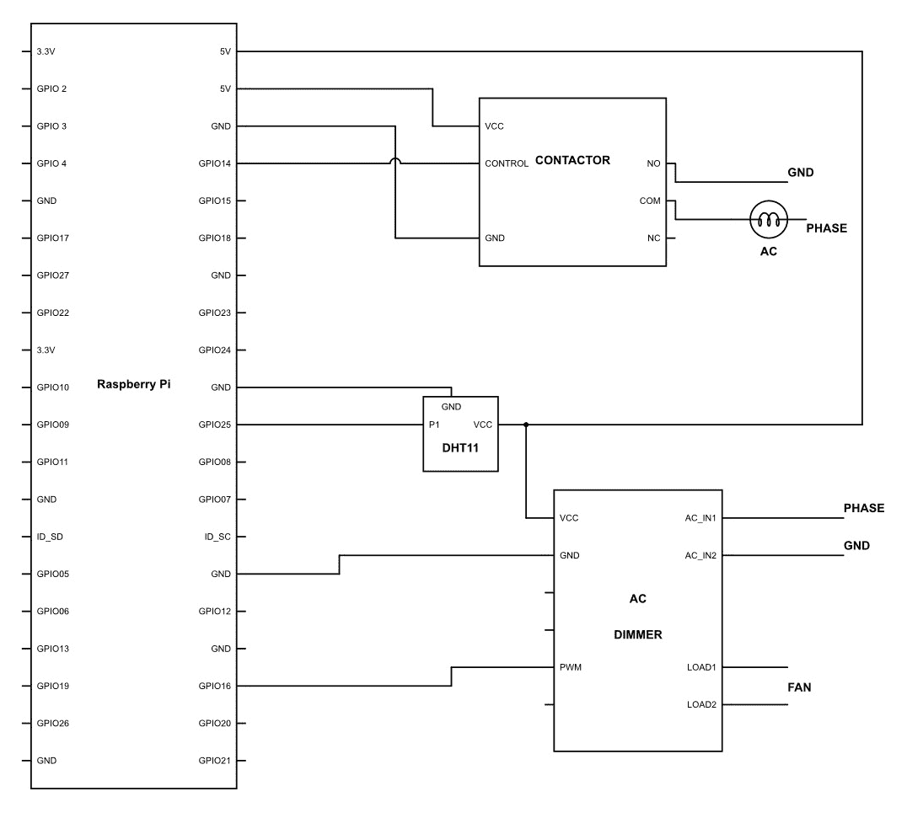

# 二十五、用Jarvis识别人类

到目前为止，我们已经在上一章中了解了如何将多层条件组合在一起，以获得所需的功能。我们刚刚完成了让 Jarvis 为您服务的第一步。现在，是时候让它更有能力了。

在本章中，我们将使它能够控制您家中的更多电子设备，这些电子设备可以在您不告诉系统任何信息的情况下自动控制。因此，毫不拖延，让我们直接开始，看看我们的桶里有什么。

# 把灯打开，Jarvis

智能家居的一个基本功能是，无论何时，只要你在身边，就可以为你打开电灯。这是任何系统都能为您做的最基本的事情之一。我们会在你一进屋就开灯，然后我们会让系统越来越智能化。

所以，我们需要做的第一件事是识别你是否在房间里。有多种方法可以做到这一点。生命的一个重要特征是运动的存在。你可能会说植物不会动，它们会动；他们长大了，不是吗？因此，检测运动是检测是否有人在场的关键一步！

这一步对您来说并不困难，因为我们之前已经连接了该传感器。我们谈论的是好的老式 PIR 传感器。因此，传感器将感应该区域内的任何移动。如果有任何移动，Jarvis将打开灯。我相信这是你现在可以自己做的事情。您仍然可以在此处参考代码和电路图：



现在上传以下代码：

```py
import RPi.GPIO as GPIO
import time
GPIO.setmode(GPIO.BCM)
GPIO.setwarnings(False)
PIR = 24
LIGHT = 23
GPIO.setup(DOPPLER,GPIO.IN)
GPIO.setup(BUZZER,GPIO.OUT)
While True:
   if GPIO.input(PIR) == 1:
       GPIO.output(LIGHT,GPIO.HIGH)
   if GPIO.input(PIR) == 0:
       GPIO.output(LIGHT,GPIO.LOW)
```

在前面的代码中，我们只是在检测到运动后立即打开灯光，但问题是它只会在运动存在时打开灯光。这是什么意思？简单，当有一些运动时，它将保持灯亮，一旦运动停止，它将关闭灯。

对于想减肥的人来说，这可能是一个非常好的代码，但对我们大多数人来说，这将是一个恼人的代码。因此，让我们包含一个小循环，我们在前一章中使用了它，并使其更好一些：

```py
import RPi.GPIO as GPIO
import time

GPIO.setmode(GPIO.BCM)
GPIO.setwarnings(False)

PIR = 24
LIGHT = 23
TIME = 5

GPIO.setup(PIR,GPIO.IN)
GPIO.setup(BUZZER,GPIO.OUT)

While True:

   If GPIO.input(PIR) == 1:

       M = datetime.datetime.now().strftime('%M')
       M_final= M + TIME

       for M < M_final:

         GPIO.output(LIGHT,GPIO.HIGH)
         M = datetime.datetime.now().strftime('%M')

         if GPIO.input(PIR) == 1:
            M_final = M_final + 1 

    if GPIO.input(PIR) = 0:

        GPIO.output(LIGHT, GPIO.LOW)}

```

因此，在这个程序中，我们所做的只是添加了一个`for`循环，它在一定时间内打开灯。可以通过更改变量`TIME`的值来切换该时间的长短。

该循环中还有一个有趣的部分，如下所示：

```py
         if GPIO.input(PIR) == 1
            M_final = M_final + 1 
```

你可能会想，我们为什么要这样做？无论何时打开灯，它都将保持打开 5 分钟。然后，它将关闭并等待移动发生。因此，本质上，这个代码的问题是，如果你在房间里，灯打开，那么 5 分钟内，它将看到是否检测到任何运动。当它在 5 分钟后搜索运动时，您有可能处于运动状态。但在大多数情况下，情况并非如此。因此，我们使用 PIR 传感器检测运动。无论何时检测到移动，`M_final`的值都会使用`M_final = M_final + 1`行递增，从而增加灯光打开的时间。

# 理解运动

到现在为止，你一定已经明白了，PIR 传感器并不是我们打开或关闭灯的最理想的传感器。主要是因为，尽管运动是存在的最佳指示器之一，但有时你可能根本不动，例如，在休息、看书、看电影等时。

我们现在该怎么办？好吧，我们可以玩个小把戏。还记得在上一章中，我们使用接近传感器来检测一个人是否穿越了特定区域吗？我们将在这里植入类似的逻辑；但是，我们将改进代码，使其更好，而不仅仅是复制粘贴代码。

因此，我们将使用其中两种传感器，而不是使用单个红外接近传感器。安装如下图所示：



现在很明显，每当有人从门侧走到房间侧，**传感器 1**在检测到尸体时会显示较低的读数。然后，当他走向房间一侧时，**传感器 2**将显示类似的读数。

如果第一个**传感器 1**被触发，然后**传感器 2**被触发，那么我们可以安全地假设该人员正在从门侧移动到房间侧。类似地，如果发生了相反的情况，则可以理解该人正在走出房间。

现在，这相当简单。但我们如何在现实生活中实施它呢？首先，我们需要按如下方式连接电路：



完成后，上传以下代码：

```py
import GPIO library
import RPi.GPIO as GPIO
import time

import Adafruit_ADS1x15
adc0 = Adafruit_ADS1x15.ADS1115()

GAIN = 1
LIGHT = 23

adc0.start_adc(0, gain=GAIN)
adc1.start_adc(1, gain=GAIN)

GPIO.setmode(GPIO.BCM)
GPIO.setwarnings(False)

while True:

   F_value = adc0.get_last_result()
   F1 =    (1.0 / (F_value / 13.15)) - 0.35

   time.sleep(0.1)

   F_value = adc0.get_last_result()
   F2 =    (1.0 / (F_value / 13.15)) - 0.35

   F0_final = F1-F2

   if F0 > 10 :

        Time0 =  time.time()

   F_value = adc1.get_last_result()
   F1 =    (1.0 / (F_value / 13.15)) - 0.35

   time.sleep(0.1)

   F_value = adc1.get_last_result()
   F2 =    (1.0 / (F_value / 13.15)) - 0.35

   F1_final = F1-F2

   if F1 > 10: 

        Time1 =  time.time()

    if Time1 > Time0:

        GPIO.output(LIGHT, GPIO.HIGH)

    if Time1 < Time0:

        GPIO.output(LIGHT, GPIO.LOW)      }
```

现在，让我们看看我们在这里做什么。和往常一样，大多数语法都非常简单明了。最重要的部分是逻辑。因此，让我们以适当的步骤了解我们正在做什么。

```py
   F_value = adc0.get_last_result()
   F1 =    (1.0 / (F_value / 13.15)) - 0.35

   time.sleep(0.1)

   F_value = adc0.get_last_result()
   F2 =    (1.0 / (F_value / 13.15)) - 0.35
```

在前面的代码行中，我们获取红外接近传感器的值，计算与其对应的距离，并将该值存储在一个名为`F1`的变量中。完成后，我们将使用`time.sleep(0.1)`功能暂停`0.1`秒。此后，我们再次读取同一传感器的读数，并将该值存储在名为`F2`的变量中。我们为什么要这样做？我们在前面的章节中已经理解了这一点。

```py
  F0_final = F1-F2
```

一旦获得了`F1`和`F0`的值，我们将计算差值，以确定是否有人通过了它。如果没有人通过，那么读数将几乎相同，差异也不会很大。但是，如果一个人通过了测试，那么读数将相当可观，该值将存储在一个名为`F0_final`的变量中。

```py
   if F0 > 10 :

        Time0 =  time.time()
```

如果`F0`值或第一次和第二次读数之间的距离差大于 10 厘米，则`if`条件为真。一旦为真，它会将`Time0`变量的值设置为时间的当前值。`time.time()`功能将记录准确的时间

```py
   F_value = adc1.get_last_result()
   F1 =    (1.0 / (F_value / 13.15)) - 0.35

   time.sleep(0.1)

   F_value = adc1.get_last_result()
   F2 =    (1.0 / (F_value / 13.15)) - 0.35

```

```py
   F1_final = F1-F2

   if F1 > 10: 

        Time1 =  time.time()
```

现在，我们将对**传感器 2**执行完全相同的步骤。这里没有什么新鲜事要说；这是不言自明的。

```py
    if Time1 > Time0:

        GPIO.output(LIGHT, GPIO.HIGH)
```

完成所有这些之后，我们比较`if Time1 > Time0`。我们为什么要比较呢？因为`Time0`是**传感器 1**记录的时间。如果该人员正在内部移动，则首先触发**传感器 1**，然后触发**传感器 2**。因此，**传感器 2**记录的时间会更长，而**传感器 1**记录的时间会更早。如果发生这种情况，那么我们可以假设这个人正在进来。如果有人进来，我们只需要打开灯，这正是我们在做的

```py
    if Time1 < Time0:

        GPIO.output(LIGHT, GPIO.LOW)
```

同样，当一个人外出时，第一个被触发的传感器是**传感器 2**，之后会触发**传感器 1**。使`Time1`标注的时间早于`Time2`；因此，只要这种情况是真的，我们就会知道这个人正在搬出房间，灯可以关掉。

继续，把它安装在门附近，看看它的反应如何。我相信这将比我们通过 PIR 所做的要好得多。享受它的乐趣，并尝试找出它可能存在的任何缺陷

# 完善动议

您能在以前的代码中找到任何缺陷吗？他们不难找到；当房间里只有一个人的时候，代码工作得非常出色。如果安装在多人来来往往的地方，那么可能会很有挑战性。这是因为每当有人外出时，灯都会熄灭。

现在问题已经很明显了，是时候让代码变得更好了。为此，硬件将保持完全相同；我们只需要让代码更智能。让我们看看如何做到这一点：

```py
import GPIO library
   import RPi.GPIO as GPIO
   import time
   import time
   import Adafruit_ADS1x15
   adc0 = Adafruit_ADS1x15.ADS1115()
GAIN = 1
 adc0.start_adc(0, gain=GAIN)
adc1.start_adc(1, gain=GAIN)
GPIO.setmode(GPIO.BCM)
GPIO.setwarnings(False)
PCount = 0
while True:
   F_value = adc0.get_last_result()
   F1 = (1.0 / (F_value / 13.15)) - 0.35
   time.sleep(0.1)
   F_value = adc0.get_last_result()
   F2 = (1.0 / (F_value / 13.15)) - 0.35
   F0_final = F1-F2
   if F0 > 10 :
        Time0 = time.time()
   F_value = adc1.get_last_result()
   F1 = (1.0 / (F_value / 13.15)) - 0.35
   time.sleep(0.1)
   F_value = adc1.get_last_result()
   F2 = (1.0 / (F_value / 13.15)) - 0.35
   F1_final = F1-F2
   if F1 > 10:
        Time1 = time.time()
    if Time1 > Time0:
        PCount = PCount + 1
    if Time1 < Time0:
        PCount = PCount - 1

if PCount > 0:

           GPIO.output(LIGHT, GPIO.HIGH)
       else if PCount = 0:
          GPIO.output(LIGHT, GPIO.LOW)        
```

我们所做的是一些非常基本的事情。我们已经声明了一个名为`PCount`的变量。声明此变量是为了统计房间或家中的人数。正如您在代码的前几行中所看到的，我们已经将`PCount`的值声明为`0`。我们假设，一旦我们开始这样做，里面的人数将是`0`

```py
    if Time1 > Time0:

        PCount = PCount + 1
```

当满足条件`if Time1 > Time0:`时，`PCount`值增加`1`。众所周知，只有当一个人在家里行走时，这种情况才会出现。

```py
    if Time1 < Time0:

        PCount = PCount - 1
```

同样，当一个人在室外行走时，条件`if Time1 < Time0:`为真；每当发生这种情况时，`PCount`的值就会减少`1`

```py
    if PCount > 0:

       GPIO.output(LIGHT, GPIO.HIGH)
```

现在我们已经开始计算房间里的人数，我们现在正在应用该条件，如果`PCount`的人数超过`0`，该条件将启用。因此，当室内人数超过`0`时，指示灯将亮起

```py
    else if PCount = 0:

       GPIO.output(LIGHT, GPIO.LOW)
```

同样，如果`PCount`或室内人数达到`0`时，灯将关闭

因此，被钉死了！ 

# 控制强度

我们现在已经控制了很多光线。是我们控制风扇和其他空气循环系统的时候了。每当我们谈论风扇或任何其他空气循环装置时，本质上我们谈论的是电机。正如我们之前所了解到的，电机是简单的设备，可以使用电机驱动器轻松控制。但正如你所知，当时我们控制的是直流电机。直流电机是非常简单的设备。但是，当我们谈论家用电器时，这些设备中的大多数将使用交流电或交流电。我假设您必须了解这是什么，以及它与 DC 的区别。

既然您知道我们家庭使用的电机是交流电机，那么您还必须考虑这样一个事实，即它们的控制机制将与直流电机大不相同。如果你这么认为的话，你是对的。然而，电子学的好处是，没有什么是真正困难或复杂的。基本原理基本相同。那么，让我们看看如何在交流电源中控制电机的速度。

如前所述，我们可以简单地将 PWM 信号发送给直流电机，电机将以 PWM 信号产生的平均电压的速度运行。现在，你一定认为这也适用于交流。问题是，是的，如果你想控制一个灯光或类似的设备，它是可以做到的，在波形失真的情况下，这些设备的特性不会有任何重大变化。然而，当我们谈论任何其他组件时，我们会遇到一个大问题。交流波形如下所示：


这基本上意味着电势是周期性变化的。在大多数家庭中，这是每秒 50 次。现在，想象一下，如果我们有一个 PWM 控制的设备，它正在切换只允许电源以一定间隔通过的电路。然后，正弦波的不同部分将被传递到最终输出。


正如您在前面的 PWM 中所看到的，幸运的是，PWM 信号与交流电源的相位匹配；但是，因此，只有相位的正端被传输到最终输出，而不是负端。这将对我们的负载造成严重问题，并且连接的设备很可能无法工作。


我们还有另一个例子，PWM 是随机的，它让波的随机部分通过。在这一点上，我们可以清楚地看到，任意波的任何部分都被传输，正负端电压不同步，这将再次成为一个巨大的问题。因此，我们不使用 PWM，而是使用一些真正有趣的东西。

最常用的方法称为**相位触发控制**。有时它也被称为相位角控制或相位切割。它本质上是在相位的某些部分切割波，让波的其余部分通过。困惑的让我在这里向你展示：


现在，正如你所看到的，交流波的后半部分后面的相位被截断了，并且没有通过最终输出。这使得最终输出仅为总输入的 50%。这项技术的作用是，它保持电源的交流特性，同时仍然能够降低产生的总电压。类似地，正如您在下一张图中所看到的，在 75%的波已经通过之后，波被截断。这导致输出相对较低：


现在你一定在问，我们到底是怎么做的？它由一个相对复杂的电路完成，该电路检测波的相位角，然后打开或控制双向晶闸管，这是一种高功率双向半导体。这会导致电源在特定阶段通过或停止。我们将把这个电路的精确工作留到下一次，因为它相当复杂，与本书无关。

现在说到基本点，我们知道什么是相位切割，我们也知道双向晶闸管是让我们这样做的基本设备。但问题是我们如何使用树莓圆周率来进行测试。

因此，首先，我们需要一个交流调光模块。该模块已经具有相位检测和斩波的所有组件。所以我们需要做的就是用简单的 PWM 控制它。

虽然我可能不必演示如何连接电路或代码应该是什么，但为了理解，让我们使用此模块将灯泡连接到 Arduino，然后控制灯泡。现在，首先要记住的是负载应该是一个灯泡，而不是其他任何东西，比如 LED 灯。因此，继续连接电路，如下图所示：



完成后，继续并上载以下代码：

```py
import RPi.GPIO as GPIO
import time                             
GPIO.setmode(GPIO.BCM)       
GPIO.setup(18,GPIO.OUT)         
I = 0
pwm= GPIO.PWM(18,50)

for I < 100:

    I = I+1
    pwm.start(I)
    time.sleep(0.1)

GPIO.cleanup()}
```

正如预期的那样，附加的灯光将首先开始发出非常微弱的辉光，并逐渐增加强度，直到达到 100%。这就是控制如此复杂的过程是多么简单。

# 智能温度控制

既然基本工作已经完成，让我们继续用这个系统做一些有意义的事情。把你的空调设置到完美的温度不是很困难吗？不管你做什么，你最终都会觉得不舒服。这是由于一天中体温的生理变化造成的。

当你醒来时，你的体温相对较低。温度高达 1°F，低于正常体温。随着时间的推移，体温会上升，直到你上床睡觉。一旦你睡着了，你的体温又开始下降，在早上 4:00-6:00 左右达到最低点。这就是为什么当你睡觉时感觉温暖的东西，当你醒来时却很冷的原因。现代空调有一种叫做睡眠模式的东西。它的作用是，它只是在夜间增加温度。这样你在任何时候都不会觉得冷。但话说回来，它的效果如何也是一个问题。

因此，现在我们对机器人技术非常了解，我们将继续制作一个我们自己的系统来处理所有事情

在这一部分中，我们将把空调和风扇连接在一起，这样它们就可以同时工作，让你睡个好觉。现在，在开始之前，我想让你看看接力赛中提到的收视率。正如你所看到的，继电器只能处理 250V 和 5 安培的电流。现在，如果你仔细看一下你的空调小册子，你就会很容易理解为什么我要向你展示所有这些。空调的功耗将远远高于继电器的处理能力。所以，如果你试图用正常的继电器来运行你的空调，那么你最终肯定会弄坏继电器。您的设备有可能比继电器的额定电流低。但是对于任何带有电机的设备，请记住，该设备的初始功耗远高于标称功耗。因此，如果您的空调需要 10 安培的标称电流，那么启动负载可能高达 15 安培。你一定在想，这不是问题，我们为什么不买一个等级更高的继电器呢。嗯，没错！这正是我们将要做的。但电子产品的命名有时会很棘手。处理高功率、高电压机电开关的设备通常被称为承包商而不是继电器。从技术上讲，他们有相同的工作原理；然而，存在结构差异，这在此时不是我们所关心的。因此，我们将使用承包商进行空调切换，并使用调光器进行风扇转速控制。现在已经解决了这个问题，让我们继续连接硬件，如下图所示：



```py
import RPi.GPIO as GPIO
import time 
import Adafruit_DHT

GPIO.setmode(GPIO.BCM)

FAN = 18
AC = 17

pwm= GPIO.PWM(18,50)
GPIO.setup(FAN,GPIO.OUT)
GPIO.setup(AC, GPIO.OUT)

while True:

    humidity, temperature = Adafruit_DHT.read_retry(sensor, pin)

    if temperature =>20 && temperature <=30:

        Duty = 50 + ((temperature-25)*10)
        pwm.start(Duty)

    if temperature <22 :

         GPIO.output(AC, GPIO.LOW)

    if temperature >= 24

         GPIO.output(AC, GPIO.HIGH)}

```

这里使用的逻辑非常基本。让我们看看它在做什么：

```py
    humidity, temperature = Adafruit_DHT.read_retry(sensor, pin)

    if temperature =>20 && temperature <=30:

        Duty = 50 + ((temperature-25)*10)
        pwm.start(Duty)
```

这里我们取`humidity`和`temperature`的值。到目前为止还不错，但我们能更进一步，让它更智能吗？前面的逻辑一定帮助你睡得更好，但我们能让它对你来说完美吗？

在我们的身体里有多种指标可以让我们了解身体的状态。例如，如果你累了，你可能不会走得很快或说话声音很大。相反，你会做相反的事情！同样，有多种因素表明我们的睡眠周期是如何进行的。

这些因素包括：体温、呼吸频率、快速眼动睡眠和身体运动。测量准确的体温或呼吸频率以及 REM 睡眠是一项挑战。但是，当我们谈论身体运动时，我认为我们已经完善了它。因此，根据身体运动，我们将感觉到我们睡得有多好，需要什么样的温度调节。

如果你注意到，每当有人在睡觉时开始感到寒冷，身体就会进入胎儿姿势，活动就会少很多。这是自动发生的。然而，当一个人感到舒适时，就不可避免地会有一些动作，比如换侧和手臂或腿的动作。当一个人感到寒冷时，这种情况不会发生。通过这些动作，我们可以判断一个人是否感到寒冷。现在我们已经了解了身体的生理变化，让我们试着围绕它建立一个程序，看看我们能实现什么。

为此，首先，我们需要按如下方式连接电路：


完成后，继续编写以下代码：

```py
import RPi.GPIO as GPIO
import time 
import Adafruit_DHT

GPIO.setmode(GPIO.BCM)

FAN = 18
AC = 17
PIR = 22
PIN = 11
Sensor = 4

pwm= GPIO.PWM(18,50)
GPIO.setup(FAN,GPIO.OUT)
GPIO.setup(AC, GPIO.OUT)

while True:

    humidity, temperature = Adafruit_DHT.read_retry(sensor, pin)
    H = datetime.datetime.now().strftime('%H') 
    M = datetime.datetime.now().strftime('%M')

    if H <= 6 && H <= 22:

        if M <=58 :

           M = datetime.datetime.now().strftime('%M')
           humidity, temperature = Adafruit_DHT.read_retry(sensor, pin)

           if GPIO.input(PIR) == 0 :

                Movement = Movement + 1
                time.sleep(10)

           if temperature < 28:

                if Movement > 5 :

                    Duty = Duty + 10
                    pwm.start(Duty)
                    Movement = 0     

        if M = 59 : 

            if Movement = 0 :

                Duty = Duty -10
                pwm.start(Duty)

            Movement = 0

        if temperature <22 :

           GPIO.output(AC, GPIO.LOW)

       if temperature >= 24 && H <= 6 && H >= 22:

           GPIO.output(AC, GPIO.HIGH)

        if temperature > 27

            pwm.start(100)

    for H > 7 && H < 20 

        GPIO.output(AC, GPIO.LOW)

    if H = 20 

        GPIO.output(AC,GPIO.HIGH)

}
```

让我们看看引擎盖下面发生了什么：

```py
    if H <= 6 && H <= 22:

        if M <=58 :

           M = datetime.datetime.now().strftime('%M')
           humidity, temperature = Adafruit_DHT.read_retry(sensor, pin)
```

首先你会看到我们有一个条件：`if H,= 6 && H<= 22:`。只有当时间范围在上午 10 点到晚上 6 点之间时，这种情况才会出现。这是因为这是我们通常睡觉的时候。因此，只有到了睡觉的时候，这种逻辑才会起作用。

第二个条件是`if M <= 58`，只有在`0`和`58`分钟之间的时间才会为真。因此，当时间为`M = 59`时，该条件将不起作用。我们将看到有这种逻辑的原因。

此后，我们计算时间并将值存储在一个名为`M`的变量中。我们还计算湿度和温度值，并将其存储在称为`temperature`和`humidity`的变量中：

```py
           if GPIO.input(PIR) == 0 :

                Movement = Movement + 1
                time.sleep(10)

```

现在，在这一行中，我们正在实现一个条件，如果 PIR 的读数较高，则该条件将为真。也就是说，将检测到一些运动。无论何时发生这种情况，`Movement`变量将增加`1`。最后，我们使用`time.sleep(10)`函数等待`10`秒。这样做是因为 PIR 可能在一段时间内很高。在这种情况下，该条件将一次又一次地为真，这反过来将使`Movement`的值增加几倍。

我们增加`Movement`值的目的是计算人员移动的次数。因此，在一个时间内将其倍数增加将违背目标。

```py
           if temperature < 28:

                if Movement > 5 :

                    Duty = Duty + 10
                    pwm.start(Duty)
                    Movement = 0
```

现在我们有另一个条件，上面写着`if temperature < 28`。当条件为真时，不需要太多解释。因此，每当条件为真时，如果`Movement`的计数数大于`5`，则`Duty`的值将增加`10`。因此，我们将 PWM 发送到交流调光器，从而提高风扇的转速。最后，我们将`Movement`的值重置为`0`。

所以本质上，我们只是在计算运动的数量。只有当温度低于 28°C 时，才会计算此移动。如果移动量大于`5`，则我们会将风扇速度提高 10%。

```py
        if M = 59 : 

            if Movement = 0 :

                Duty = Duty -10
                pwm.start(Duty)

            Movement = 0
```

在上一节中，逻辑仅在时间介于`0`和`58`之间时起作用，即计数发生的时间。当`M`的值为`59`时，将检查条件`if Movement = 0`，如果为真，则将`Duty`的值递减`10`。这反过来将使风扇转速降低 10%。此外，一旦执行此条件，`Movement`的值将重置为`0`。这样，下一个小时就可以开始一个新的循环

现在它的基本意思是计数将按小时进行。如果`Movement`大于`5`，则`Duty`的值将立即增加。但是，如果情况并非如此，则程序将等待直到分钟接近`59`的值，并且无论何时，它将检查是否有任何移动，在这种情况下，风扇转速将降低。

```py
        if temperature <22 :

           GPIO.output(AC, GPIO.LOW)

        if temperature >= 24 && H <= 6 && H >= 22: 

           GPIO.output(AC, GPIO.HIGH)

        if temperature > 27

            pwm.start(100)
```

所有这些代码都非常简单。如果温度低于`22`，则空调将关闭。此外，如果温度等于或大于`24`，且时间在晚上 10:00 到早上 6:00 之间，则 AC 将接通。最后，如果温度高于`27`，则风扇将接通至 100%转速。

```py
    for H > 7 && H < 20 

        GPIO.output(AC, GPIO.LOW)

    if H = 20 

        GPIO.output(AC,GPIO.HIGH)
```

最后，我们通过使用条件`for H > 7 && H <20`来确保在此期间 AC 始终关闭。此外，如果`H = 20`，则应打开空调，以便在您准备睡觉之前使房间冷却。

# 添加更多

正如您现在所了解的，我们可以根据需要控制任何交流电器。我们已经了解了开关，也完善了改变光强度和风扇速度的方法。但是你注意到一件事了吗？随着我们的系统变得越来越复杂，所需的 GPIO 数量迟早会增加。总有一天，你会希望有越来越多的设备连接到你的树莓 Pi；但是，由于缺少物理端口，您将无法执行此操作。

这是电子学中非常常见的情况。和往常一样，这个问题也有解决办法。这种解决方案称为多路复用器。多路复用器的基本工作是将任何计算机系统中的端口数相乘。现在你一定在想，它是怎么做到的？

这个概念非常简单。让我们首先看一下多路复用器的示意图：


在上图中，您可以看到多路复用器有两个端，一个是信号输出线，另一个与之相反。我们需要了解的第一件事是，多路复用器是一个双向设备，也就是说，它将数据从多路复用器发送到连接的设备，反之亦然。

现在，首先，我们有电源线，这是非常基本的。它是用来给多路复用器本身通电的。然后我们有**信号线**，它有两个端口，**Sig**和**EN**。**EN**代表启用，这意味着直到**EN**不高时，数据通信将不会以任何方式发生。然后我们有一个叫做**Sig**的东西。这是连接到 Raspberry Pi 的 GPIO 进行数据通信的端口。接下来是选择行。如您所见，我们为其提供了四个端口，即，**S0**、**S1**、**S2**和**S3**。选择行用于选择需要选择的特定端口。下表将阐明具体发生的情况：

| **S0** | **S1** | **S3** | **S4** | **所选输出** |
| 0 | 0 | 0 | 0 | C0 |
| 1. | 0 | 0 | 0 | C1 |
| 0 | 1. | 0 | 0 | C2 |
| 1. | 1. | 0 | 0 | C3 |
| 0 | 0 | 1. | 0 | 补体第四成份 |
| 1. | 0 | 1. | 0 | 碳五 |
| 0 | 1. | 1. | 0 | C6 |
| 1. | 1. | 1. | 0 | C7 |
| 0 | 0 | 0 | 1. | C8 |
| 1. | 0 | 0 | 1. | C9 |
| 0 | 1. | 0 | 1. | C10 |
| 1. | 1. | 0 | 1. | C11 |
| 0 | 0 | 1. | 1. | C12 |
| 1. | 0 | 1. | 1. | C13 |
| 0 | 1. | 1. | 1. | C14 |
| 1. | 1. | 1. | 1. | C15 |

在上表中，您可以看到，通过在选择行上使用各种逻辑组合，可以寻址各种行。比如说，我们在选择管脚上有以下序列-S0=1、S1=0、S2=1、S3=1。如果这是 Raspberry Pi 选择管脚上的输入，则将选择管脚编号 C13。这基本上意味着现在 C13 可以与多路复用器的引脚**Sig**进行数据通信。此外，我们必须记住，enable 引脚必须高，才能进行数据传输。

以类似的方式，我们可以继续处理多路复用器的所有 16 个引脚。因此，如果我们从逻辑上看，那么通过使用六个 Raspberry Pi 引脚，我们可以继续使用 16 个 GPIO。现在我们已经了解了多路复用的基本原理，让我们继续尝试使用其中一种。


连接硬件后，让我们继续上传以下代码：

```py
import RPi.GPIO as GPIO
import time

GPIO.setmode(GPIO.BCM)
GPIO.setwarnings(False)

S0 = 21
S1 = 22
S2 = 23
S3 = 24

GPIO.setup(S0,GPIO.OUT)
GPIO.setup(S1,GPIO.OUT) 
GPIO.setup(S2,GPIO.OUT)

While True:

    GPIO.output(S0,1)
    GPIO.output(S1,0)
    GPIO.output(S2,1)
    GPIO.output(S4,1)

    time.sleep(1)

    GPIO.output(S0,1)
    GPIO.output(S1,1)
    GPIO.output(S2,1)
    GPIO.output(S4,1)

    time.sleep(1)

    GPIO.output(S0,1)
    GPIO.output(S1,0)
    GPIO.output(S2,0)
    GPIO.output(S4,1)

    time.sleep(1)

    'GPIO.output(S0,0)
    GPIO.output(S1,0)
    GPIO.output(S2,0)
    GPIO.output(S4,1)

    time.sleep(1)

    GPIO.output(S0,0)
    GPIO.output(S1,1)
    GPIO.output(S2,0)
    GPIO.output(S4,1)

    time.sleep(1) }
```

在这里，我们实际上是在一个接一个地触发选择线，以寻址 LED 连接的每个端口。无论何时，与之对应的 LED 都会发光。另外，它发光的原因是信号端口`Sig`连接到 3.3V 的树莓 Pi。因此，将逻辑高电平发送到它所连接的任何端口。

这是多路复用器工作的基本方式之一。当我们使用多个设备和传感器时，这会非常有用。

# 总结

在本章中，我们使 Jarvis 能够在不同条件下自动化您的家用电器，并将各种属性应用于系统。因此，继续尝试许多其他场景，在这些场景下，您可以增强您的家庭自动化系统。

在下一章中，我们将启用 Jarvis 物联网，从而使用 Wi-Fi 和互联网从您的手机控制设备。