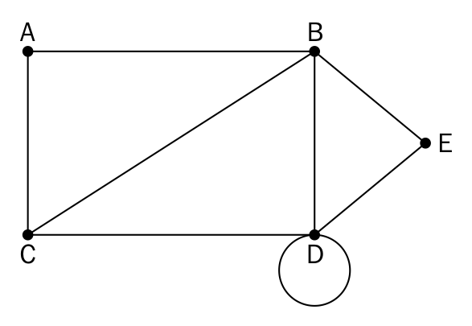
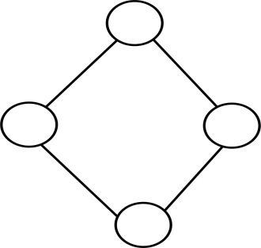
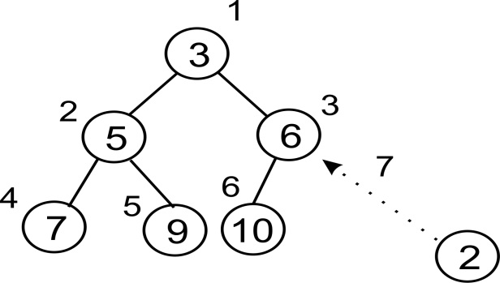
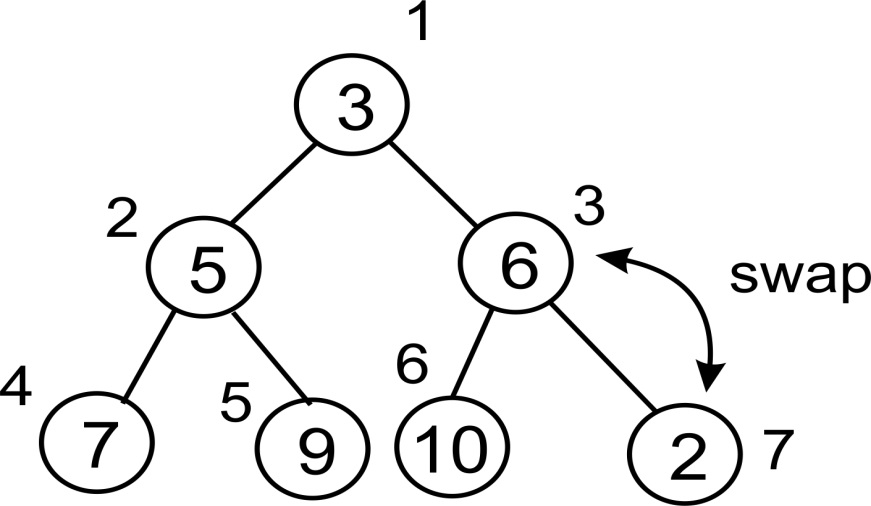

# 十一、图和其他算法

在本章中，我们将讨论图形。这是一个来自数学分支图论的概念。

图用于解决许多计算问题。它们的结构也比我们已经研究过的其他数据结构少得多，像遍历这样的事情可能会非常不传统，我们将看到。

在本章结束时，您应该能够执行以下操作：

*   了解什么是图形
*   了解图形的类型及其组成
*   知道如何表示图形并遍历它
*   了解什么是优先级队列的基本概念
*   能够实现优先级队列
*   能够确定列表中的第 i 个最小元素

# 图

图是在顶点之间形成连接的一组顶点和边。在更正式的方法中，图 G 是一组 V 顶点和一组 E 边的有序对，在正式的数学表示法中以`G = (V, E)`给出。

此处给出了一个图形示例：



现在让我们看一下图的一些定义：

*   **节点或顶点**：一个点，通常在图形中用点表示。顶点或节点是 A、B、C、D 和 E。
*   **边**：这是两个顶点之间的连接。连接 A 和 B 的线是边的一个示例。
*   **循环**：当来自节点的边入射到自身时，该边形成循环。
*   **顶点的度数**：这是入射到给定顶点上的顶点数。顶点 B 的度数为`4`。
*   **邻接**：指节点与其邻居之间的连接。节点 C 与节点 A 相邻，因为它们之间有一条边。
*   **路径**：一系列顶点，其中每个相邻对由一条边连接。

# 有向图与无向图

图可以根据它们是无向的还是有向的进行分类。无向图只是将边表示为节点之间的直线。关于节点之间的关系，除了节点已连接这一事实外，没有其他信息：



在有向图中，边除了提供连接节点外，还提供方向。也就是说，将用箭头绘制为直线的边将指向边连接两个节点的方向：


边的箭头决定流向。只能从上图中的**A**移动到**B**。不是**B**到**A**。

# 加权图

加权图为边添加了一点额外的信息。这可以是一个数字值，表示某些内容。比如说，下图表示从点**A**到点**D**的不同方式。您可以直接从**A**到**D**，也可以选择通过**B**和**C**。与每条边关联的是到下一个节点的旅程所需的时间（以分钟为单位）：


也许旅行**广告**会要求你骑自行车（或步行）。**B**和**C**可能代表公交车站。在**B**你必须换乘另一辆公交车。最后，**CD**可能需要走一小段路才能到达**D**。

在本例中，**AD**和**ABCD**代表两条不同的路径。**一条**路径就是您*在两个节点之间通过*的一系列边。沿着这些路径，您可以看到整个旅程**AD**需要**40**分钟，而旅程**ABCD**需要**25**分钟。如果你唯一关心的是时间，那么你最好还是沿着**ABCD**行驶，即使换车也会带来额外的不便。

边可以定向，并且可以保存其他信息，例如所用的时间或与沿路径移动相关联的任何其他值，这一事实表明了一些有趣的事情。在我们之前使用的数据结构中，我们在节点之间绘制的*线*只是连接器。即使他们有从一个节点指向另一个节点的箭头，这也很容易通过使用`next`或`previous`、`parent`或`child`在节点类中表示。

对于图形，将边视为对象和节点一样有意义。与节点一样，边可以包含跟随特定路径所需的额外信息。

# 图形表示

图形可以用两种主要形式表示。一种方法是使用邻接矩阵，另一种方法是使用邻接列表。

我们将使用下图来开发两种类型的图形表示：


# 邻接表

一个简单的列表可以用来表示一个图表。列表的索引将表示图中的节点或顶点。在每个索引处，可以存储该顶点的相邻节点：


框中的数字表示顶点。索引**0**表示顶点**A**，相邻节点为**B**和**C**。

使用列表进行表示是非常有限制的，因为我们缺乏直接使用顶点标签的能力。因此，字典更合适。为了在图中表示图形，我们可以使用以下语句：

```py
    graph = dict() 
    graph['A'] = ['B', 'C'] 
    graph['B'] = ['E','A'] 
    graph['C'] = ['A', 'B', 'E','F'] 
    graph['E'] = ['B', 'C'] 
    graph['F'] = ['C'] 
```

现在我们很容易确定顶点**A**具有相邻的顶点**B**和**C**。顶点 F 的唯一邻居是顶点**C**。

# 邻接矩阵

另一种表示图形的方法是使用邻接矩阵。矩阵是二维数组。这里的想法是用 1 或 0 表示单元，这取决于两个顶点是否由边连接。

给定邻接列表，应该可以创建邻接矩阵。需要图形键的排序列表：

```py
    matrix_elements = sorted(graph.keys()) 
    cols = rows = len(matrix_elements) 
```

键的长度用于提供矩阵的尺寸，矩阵存储在`cols`和`rows`中。`cols`和`rows`中的这些值相等：

```py
    adjacency_matrix = [[0 for x in range(rows)] for y in range(cols)] 
    edges_list = [] 
```

然后我们通过`rows`数组建立一个`cols`数组，用零填充它。`edges_list`变量将存储构成图形边缘的元组。例如，节点 A 和 B 之间的边将存储为（A，B）。

多维数组使用嵌套的 for 循环填充：

```py
    for key in matrix_elements: 
        for neighbor in graph[key]: 
            edges_list.append((key,neighbor)) 
```

通过`graph[key]`获得顶点的邻域。然后使用键结合`neighbor`创建存储在`edges_list`中的元组。

迭代的输出如下所示：

```py
>>> [('A', 'B'), ('A', 'C'), ('B', 'E'), ('B', 'A'), ('C', 'A'), 
     ('C', 'B'), ('C', 'E'), ('C', 'F'), ('E', 'B'), ('E', 'C'), 
     ('F', 'C')]
```

现在需要做的是使用 1 填充多维数组，用线`adjacency_matrix[index_of_first_vertex][index_of_second_vertex] = 1`标记存在的边：

```py
    for edge in edges_list: 
        index_of_first_vertex = matrix_elements.index(edge[0]) 
        index_of_second_vertex = matrix_elements.index(edge[1]) 
        adjacecy_matrix[index_of_first_vertex][index_of_second_vertex] = 1 
```

`matrix_elements`数组的`rows`和`cols`从 A 到 E 开始，索引为 0 到 5。`for`循环遍历我们的元组列表，并使用`index`方法获得存储边的相应索引。

生成的邻接矩阵如下所示：

```py
>>>
[0, 1, 1, 0, 0]
[1, 0, 0, 1, 0]
[1, 1, 0, 1, 1]
[0, 1, 1, 0, 0]
[0, 0, 1, 0, 0]
```

在第 1 列和第 1 行，0 表示 A 和 A 之间没有边。在第 2 列和第 3 行，C 和 B 之间有边。

# 图遍历

由于图不一定具有有序结构，因此遍历图可能更复杂。遍历通常包括跟踪哪些节点或顶点已被访问，哪些尚未访问。一个常见的策略是沿着一条路走，直到到达一个死胡同，然后再向上走，直到有另一条路。我们还可以迭代地从一个节点移动到另一个节点，以便遍历整个图或其中的一部分。在下一节中，我们将讨论图遍历的广度和深度优先搜索算法。

# 广度优先搜索

广度优先搜索算法从一个节点开始，选择该节点或顶点作为其根节点，并访问相邻节点，然后在图的下一级上搜索相邻节点。

将下面的图表视为图表：


该图是无向图的一个示例。我们继续使用这种类型的图来帮助简化解释，而不会过于冗长。

图表的邻接列表如下所示：

```py
    graph = dict() 
    graph['A'] = ['B', 'G', 'D'] 
    graph['B'] = ['A', 'F', 'E'] 
    graph['C'] = ['F', 'H'] 
    graph['D'] = ['F', 'A'] 
    graph['E'] = ['B', 'G'] 
    graph['F'] = ['B', 'D', 'C'] 
    graph['G'] = ['A', 'E'] 
    graph['H'] = ['C'] 
```

在尝试首先遍历此图时，我们将使用队列。该算法创建一个列表来存储遍历过程中访问过的节点。我们将从节点 A 开始遍历。

节点 A 排队并添加到已访问节点的列表中。然后，我们使用一个`while`循环来实现图的遍历。在`while`循环中，节点 A 退出队列。其未访问的相邻节点 B、G 和 D 按字母顺序排序并排队。队列现在将包含节点 B、D 和 G。这些节点也将添加到已访问节点的列表中。此时，我们开始`while`循环的另一次迭代，因为队列不是空的，这也意味着我们没有真正完成遍历。

节点 B 已退出队列。在其相邻节点 A、F 和 E 中，节点 A 已被访问。因此，我们只按字母顺序将节点 E 和 F 排队。然后将节点 E 和 F 添加到已访问节点的列表中。

现在，我们的队列在这一点上包含以下节点：D、G、E 和 F。访问的节点列表包含 A、B、D、G、E、F。

节点 D 已退出队列，但其所有相邻节点都已访问，因此我们只需将其退出队列。队列前面的下一个节点是 G。我们将节点 G 退出队列，但我们还发现其所有相邻节点都已被访问，因为它们位于已访问节点列表中。节点 G 也将退出队列。我们也退出了节点 E 的队列，因为它的所有节点都已被访问。现在队列中唯一的节点是节点 F。

节点 F 已退出队列，我们意识到在其相邻节点 B、D 和 C 中，只有节点 C 未被访问。然后，我们将节点 C 排队，并将其添加到访问的节点列表中。节点 C 已退出队列。节点 C 具有相邻的节点 F 和 H，但 F 已被访问，留下节点 H。节点 H 排队并添加到已访问节点列表中。

最后，`while`循环的最后一次迭代将导致节点 H 退出队列。其唯一的相邻节点 C 已被访问。一旦队列完全为空，循环就会中断。

在图中遍历图的输出是 A，B，D，G，E，F，C，H。

宽度优先搜索的代码如下所示：

```py
    from collections import deque 

    def breadth_first_search(graph, root): 
        visited_vertices = list() 
        graph_queue = deque([root]) 
        visited_vertices.append(root) 
        node = root 

        while len(graph_queue) > 0: 
            node = graph_queue.popleft() 
            adj_nodes = graph[node] 

            remaining_elements = 
                set(adj_nodes).difference(set(visited_vertices)) 
            if len(remaining_elements) > 0: 
                for elem in sorted(remaining_elements): 
                    visited_vertices.append(elem) 
                    graph_queue.append(elem) 

        return visited_vertices 
```

When we want to find out whether a set of nodes are in the list of visited nodes, we use the statement `remaining_elements = set(adj_nodes).difference(set(visited_vertices))`. This uses the set object's difference method to find the nodes that are in `adj_nodes` but not in `visited_vertices`.

在最坏情况下，将遍历每个顶点或节点和边，因此算法的时间复杂度为`O(|V| + |E|)`，其中`|V|`为顶点或节点数，`|E|`为图中的边数。

# 深度优先搜索

顾名思义，该算法在遍历图中任何特定路径的宽度之前，先遍历该路径的深度。因此，在兄弟节点之前先访问子节点。它适用于有限图，需要使用栈来维护算法的状态：

```py
    def depth_first_search(graph, root): 
        visited_vertices = list() 
        graph_stack = list() 

        graph_stack.append(root) 
        node = root 
```

该算法首先创建一个列表来存储访问的节点。`graph_stack`栈变量用于帮助遍历过程。为了保持连续性，我们使用常规 Python 列表作为栈。

名为`root`的起始节点与图的邻接矩阵 graph 一起传递。`root`被推到栈上。`node = root`保存栈中的第一个节点：

```py
        while len(graph_stack) > 0: 

            if node not in visited_vertices: 
                visited_vertices.append(node) 

            adj_nodes = graph[node] 

            if set(adj_nodes).issubset(set(visited_vertices)): 
                graph_stack.pop() 
            if len(graph_stack) > 0: 
                node = graph_stack[-1] 
                continue 
            else: 
                remaining_elements = 
                set(adj_nodes).difference(set(visited_vertices)) 

            first_adj_node = sorted(remaining_elements)[0] 
            graph_stack.append(first_adj_node) 
            node = first_adj_node 
                return visited_vertices 
```

如果栈不是空的，`while`循环的主体将被执行。如果`node`不在访问节点列表中，我们将其添加。`node`的所有相邻节点由`adj_nodes = graph[node]`采集。如果访问了所有相邻节点，我们将从栈中弹出该节点，并将`node`设置为`graph_stack[-1]`。`graph_stack[-1]`是栈上的顶部节点。`continue`语句跳回 while 循环测试条件的开头。

另一方面，如果未访问所有相邻节点，则通过使用语句`remaining_elements = set(adj_nodes).difference(set(visited_vertices))`查找`adj_nodes`和`visited_vertices`之间的差异来获得尚未访问的节点。

`sorted(remaining_elements)`中的第一项被分配给`first_adj_node`，并推送到栈上。然后，我们将栈顶部指向该节点。

当`while`循环存在时，我们将返回`visited_vertices`。

干运行该算法将被证明是有用的。考虑下面的图表：


该图的邻接列表如下所示：

```py
    graph = dict() 
    graph['A'] = ['B', 'S'] 
    graph['B'] = ['A'] 
    graph['S'] = ['A','G','C'] 
    graph['D'] = ['C'] 
    graph['G'] = ['S','F','H'] 
    graph['H'] = ['G','E'] 
    graph['E'] = ['C','H'] 
    graph['F'] = ['C','G'] 
    graph['C'] = ['D','S','E','F'] 
```

节点 A 被选为我们的开始节点。节点 A 被推到栈上并添加到`visisted_vertices`列表中。在这样做时，我们将其标记为已被访问。栈`graph_stack`是用一个简单的 Python 列表实现的。我们的栈现在只有一个元素。我们检查节点 A 的相邻节点 B 和 s。为了测试是否访问了 A 的所有相邻节点，我们使用 if 语句：

```py
    if set(adj_nodes).issubset(set(visited_vertices)): 
        graph_stack.pop() 
        if len(graph_stack) > 0: 
            node = graph_stack[-1] 
        continue 
```

如果访问了所有节点，则弹出栈顶部。如果栈`graph_stack`不是空的，我们将栈顶部的节点分配给`node`并开始`while`循环体的另一次执行。如果`adj_nodes`中的所有节点都是`visited_vertices`的子集，则语句`set(adj_nodes).issubset(set(visited_vertices))`将计算为`True`。如果 If 语句失败，则表示仍有一些节点需要访问。我们通过`remaining_elements = set(adj_nodes).difference(set(visited_vertices))`获得该节点列表。

从图中，节点**B**和**S**将存储在`remaining_elements`中。我们将按字母顺序访问列表：

```py
    first_adj_node = sorted(remaining_elements)[0] 
    graph_stack.append(first_adj_node) 
    node = first_adj_node 
```

我们对`remaining_elements`进行排序，并将第一个节点返回给`first_adj_node`。这将返回 B。我们通过将节点 B 附加到`graph_stack`将其推送到栈上。我们通过将节点 B 分配给`node`来准备访问。

在`while`循环的下一次迭代中，我们将节点 B 添加到`visited nodes`的列表中。我们发现 B 的唯一相邻节点 A 已经被访问过。因为已经访问了 B 的所有相邻节点，所以我们将其从栈中弹出，将节点 A 作为栈上的唯一元素。我们返回到节点 A 并检查其所有相邻节点是否都已被访问。节点 A 现在将 S 作为唯一未访问的节点。我们将 S 推到栈中，然后再次开始整个过程。

遍历的输出是 A-B-S-C-D-E-H-G-F。

深度优先搜索在解决迷宫问题、查找连接组件和查找图的桥等方面有应用。

# 其他有用的图形方法

通常，您需要查找两个节点之间的路径。您可能还希望找到节点之间的所有路径。另一个有用的方法是找到节点之间的最短路径。在未加权图中，这将是它们之间边数最少的路径。如您所见，在加权图中，这可能涉及计算通过一组边的总权重。

当然，在不同的情况下，您可能希望找到最长或最短的路径。

# 优先级队列和堆

优先级队列基本上是一种队列类型，它总是按优先级顺序返回项目。例如，此优先级可能是，最低的项总是首先弹出。尽管它被称为队列，但优先级队列通常使用堆实现，因为它在这方面非常有效。

考虑到，在商店中，客户排队的服务只在队列的前排。每位顾客都会花一些时间排队接受服务。如果队列中的客户等待时间为 4、30、2 和 1，则在队列中花费的平均时间为`(4 + 34 + 36 + 37)/4`，即`27.75`。然而，如果我们改变服务顺序，使等待时间最少的客户首先得到服务，那么我们得到的平均等待时间就不同了。这样，我们通过`(1 + 3 + 7 + 37)/4`计算新的平均等待时间，现在等于`12`，这是一个更好的平均等待时间。显然，从最短的等待时间开始为客户服务是有好处的。这种按优先级或其他标准选择下一项的方法是创建优先级队列的基础。

堆是满足 heap 属性的数据结构。heap 属性声明父节点与其子节点之间必须存在某种关系。此属性必须应用于整个堆。

在最小堆中，父级和子级之间的关系是父级必须始终小于或等于其子级。因此，堆中最低的元素必须是根节点。

另一方面，在最大堆中，父堆大于或等于其子堆。由此可知，最大值构成根节点。

正如您刚才提到的，堆是树，更具体地说，是二叉树。

虽然我们将使用二叉树，但实际上我们将使用一个列表来表示它。这是可能的，因为堆将存储一个完整的二叉树。完整的二叉树是指在开始填充下一行之前，必须完全填充每一行的二叉树：


为了简化索引的计算，我们将列表中的第一项（索引 0）留空。之后，我们将树节点从上到下、从左到右放置到列表中：


如果仔细观察，您将注意到可以非常容易地检索任何节点 n 的子节点。左侧子项位于`2n`，右侧子项位于`2n + 1`。这永远是正确的。

我们将研究一个最小堆实现。反转逻辑以获得最大堆应该不难：

```py
     class Heap: 
        def __init__(self): 
            self.heap = [0] 
            self.size = 0 
```

我们用零来初始化堆列表，以表示伪第一个元素（请记住，我们这样做只是为了简化数学）。我们还创建一个变量来保存堆的大小。这样做是不必要的，因为我们可以检查列表的大小，但我们必须始终记住将其减少一。所以我们选择保留一个单独的变量。

# 插入

插入项目本身非常简单。我们将新元素添加到列表的末尾（我们理解为树的底部）。然后我们将堆的大小增加 1。

但是在每次插入之后，如果需要，我们需要将新元素上浮。请记住，min 堆中最低的元素必须是根元素。我们首先创建一个名为`float`的助手方法来处理这个问题。让我们看看它是如何表现的。假设我们有以下堆并希望插入值`2`：



新元素已占用第三行或第三层的最后一个插槽。其指标值为**7**。现在我们将该值与其父级进行比较。父项位于索引`7/2 = 3`（整数除法）。该元素包含**6**，因此我们交换**2**：



我们的新元素已被交换并上移到索引**3**。我们还没有到达堆的顶部（`3 / 2 > 0`，所以我们继续。我们元素的新父元素位于索引`3/2 = 1`。因此，我们进行比较，必要时再次交换：


在最终交换之后，剩下的堆如下所示。请注意它是如何遵循堆的定义的：


下面是我们刚才描述的实现：

```py
    def float(self, k): 
```

我们将循环，直到到达根节点，这样我们就可以继续将元素浮动到所需的高度。由于我们使用整数除法，一旦我们小于 2，循环就会发生：

```py
        while k // 2 > 0: 
```

比较父项和子项。如果父项大于子项，则交换两个值：

```py
        if self.heap[k] < self.heap[k//2]: 
            self.heap[k], self.heap[k//2] = self.heap[k//2], 
            self.heap[k] 
```

最后，让我们不要忘记向上移动树：

```py
        k //= 2 
```

此方法确保元素的顺序正确。现在我们只需要从`insert`方法调用它：

```py
    def insert(self, item): 
        self.heap.append(item) 
        self.size += 1 
        self.float(self.size) 
```

注意 insert 中的最后一行调用了`float()`方法，以便根据需要重新组织堆。

# 流行音乐

就像插入一样，`pop()`本身就是一个简单的操作。我们移除根节点并将堆的大小减小一。但是，一旦根被弹出，我们就需要一个新的根节点。

为了使这尽可能简单，我们只需获取列表中的最后一项，并使其成为新的根。也就是说，我们把它移到列表的开头。但是现在我们可能在堆的顶部没有最低的元素，所以我们执行与 float 操作相反的操作：我们让新的根节点根据需要下沉。

与 insert 一样，让我们看看整个操作是如何在现有堆上工作的。想象一下下面的堆。我们弹出`root`元素，使堆暂时无根：


因为我们不能有一个无根堆，所以我们需要用一些东西填充这个槽。如果我们选择向上移动其中一个子树，我们将必须找出如何重新平衡整个树结构。因此，我们做了一些真正有趣的事情。我们向上移动列表中最后一个元素，以填充`root`元素的位置：


现在这个元素显然不是堆中最低的。这就是我们开始沉沦的地方。首先，我们需要确定在哪里把它沉下去。我们比较这两个子元素，以便最低的元素是根下沉时向上浮动的元素：


正确的孩子显然不那么重要。其索引为**3**，表示根索引`* 2 + 1`。我们继续将新的根节点与此索引处的值进行比较：


现在我们的节点已经跳到索引**3**。我们需要将它与它的孩子中较小的孩子进行比较。但是，现在我们只有一个子级，所以我们不需要担心与哪个子级进行比较（对于最小堆，它总是较小的子级）：


这里没有必要交换。既然也没有行了，我们就完了。再次注意，`sink()`操作完成后，我们的堆是如何遵循堆的定义的。

现在我们可以开始实施这一点了。在我们执行`sink()`方法之前，请注意我们需要如何确定将父节点与哪个子节点进行比较。好吧，让我们把这个选择放在它自己的小方法中，只是为了让代码看起来更简单一些：

```py
    def minindex(self, k): 
```

我们可能会超出列表的末尾，在这种情况下，我们将返回左边子级的索引：

```py
        if k * 2 + 1 > self.size: 
            return k * 2 
```

否则，我们只返回两个孩子中较小者的索引：

```py
        elif self.heap[k*2] < self.heap[k*2+1]: 
            return k * 2 
        else: 
            return k * 2 + 1 
```

现在我们可以创建`sink`函数：

```py
    def sink(self, k): 
```

与前面一样，我们将循环，以便尽可能地降低元素：

```py
        while k * 2 <= self.size: 
```

接下来，我们需要知道要与哪个左边的孩子或右边的孩子进行比较。这就是我们使用`minindex()`功能的地方：

```py
            mi = self.minindex(k) 
```

正如我们在`float()`方法中所做的那样，我们比较父项和子项，看看是否需要交换：

```py
            if self.heap[k] > self.heap[mi]: 
                self.heap[k], self.heap[mi] = self.heap[mi], 
                self.heap[k] 
```

我们需要确保沿着树向下移动，以免陷入循环：

```py
            k = mi 
```

现在唯一剩下的就是实现`pop()`本身。这非常简单，因为咕噜工作是通过`sink()`方法执行的：

```py
    def pop(self): 
        item = self.heap[1] 
        self.heap[1] = self.heap[self.size] 
        self.size -= 1 
        self.heap.pop() 
        self.sink(1) 
        return item
```

# 测试堆

现在我们只需要一些代码来测试堆。我们首先创建堆并插入一些数据：

```py
    h = Heap() 
    for i in (4, 8, 7, 2, 9, 10, 5, 1, 3, 6): 
        h.insert(i) 
```

我们可以打印堆列表，只是为了检查元素的顺序。如果将其重新绘制为树结构，则应注意它满足堆的必需属性：

```py
    print(h.heap) 
```

现在，我们将弹出项目，一次一个。注意这些项目是如何按照从低到高的顺序排列的。还要注意堆列表在每次 pop 之后是如何变化的。每次弹出后，最好拿出笔和纸，将此列表重新绘制为一棵树，以充分了解`sink()`方法的工作原理：

```py
    for i in range(10): 
        n = h.pop() 
        print(n) 
        print(h.heap) 
```

在关于排序算法的章节中，我们将重新组织堆排序算法的代码。

一旦您让最小堆正常工作并了解它是如何工作的，那么实现最大堆应该是一项简单的任务。你所要做的就是颠倒逻辑。

# 选择算法

选择算法属于一类算法，旨在解决查找列表中第 i 个最小元素的问题。当列表按升序排序时，列表中的第一个元素将是列表中最小的项。列表中的第二个元素将是列表中第二小的元素。列表中的最后一个元素将是列表中最后一个最小的元素，但这也将符合列表中最大元素的条件。

在创建堆数据结构时，我们已经了解到调用`pop`方法将返回堆中最小的元素。从最小堆弹出的第一个元素是列表中第一个最小的元素。类似地，从最小堆弹出的第七个元素将是列表中第七小的元素。因此，要找到列表中第 i 个最小的元素，需要我们弹出堆*i*次。这是查找列表中第 i 个最小元素的一种非常简单有效的方法。

但在[第 14 章](14.html)*选择算法*中，我们将研究另一种方法，通过该方法我们可以找到列表中的第 i 个最小元素。

选择算法可用于过滤噪声数据，查找列表中的中值、最小值和最大值元素，甚至可用于计算机象棋程序。

# 总结

本章讨论了图和堆。我们研究了使用列表和字典在 Python 中表示图形的方法。为了遍历图，我们研究了广度优先搜索和深度优先搜索。

然后，我们将注意力转移到堆和优先级队列上，以了解它们的实现。本章最后使用堆的概念来查找列表中第 i 个最小的元素。

图表的主题非常复杂，仅仅一章是不够的。节点之旅将在本章结束。下一章将引导我们进入搜索领域，以及我们可以有效搜索列表中项目的各种方法。