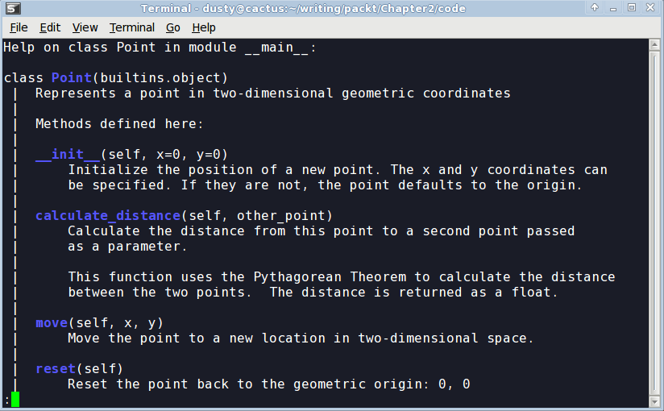
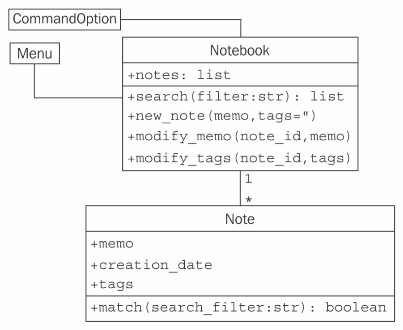

# Python 中的对象

所以，我们现在有一个设计在手，并准备将该设计转化为一个工作程序！当然，这种情况通常不会发生。在本书中，我们将看到优秀软件设计的示例和提示，但我们的重点是面向对象编程。那么，让我们看看 Python 语法，它允许我们创建面向对象的软件。

完成本章后，我们将了解以下内容：

*   如何在 Python 中创建类和实例化对象
*   如何向 Python 对象添加属性和行为
*   如何将类组织成包和模块
*   如何建议人们不要破坏我们的数据

# 创建 Python 类

我们不需要编写太多 Python 代码就可以意识到 Python 是一种非常干净的语言。当我们想做某事时，我们可以直接做，而不必设置一堆必备代码。正如您可能已经看到的，Python 中无处不在的*hello world*只是一行。

类似地，Python 3 中最简单的类如下所示：

```py
class MyFirstClass: 
    pass 
```

这是我们的第一个面向对象程序！类定义以`class`关键字开始。后面是标识类的名称（由我们选择），并以冒号结尾。

The class name must follow standard Python variable naming rules (it must start with a letter or underscore, and can only be comprised of letters, underscores, or numbers). In addition, the Python style guide (search the web for *PEP 8*) recommends that classes should be named using **CapWords** notation (start with a capital letter; any subsequent words should also start with a capital).

类定义行后面是类内容（缩进）。与其他 Python 构造一样，缩进用于划分类，而不是像许多其他语言那样使用大括号、关键字或括号。另外，按照样式指南，除非您有令人信服的理由不使用缩进，否则请使用四个空格进行缩进（例如使用其他人使用制表符进行缩进的代码）。

因为我们的第一个类实际上没有添加任何数据或行为，所以我们只需在第二行使用`pass`关键字来表示不需要采取进一步的操作。

我们可能认为，对于这个最基本的类，我们无能为力，但它确实允许我们实例化该类的对象。我们可以将该类加载到 Python3 解释器中，以便交互地使用它。为此，将前面提到的类定义保存在名为`first_class.py`的文件中，然后运行`python -i first_class.py`命令。`-i`参数告诉 Python*运行代码，然后转到交互式解释器*。以下解释器会话演示了与此类的基本交互：

```py
>>> a = MyFirstClass()
>>> b = MyFirstClass()
>>> print(a)
<__main__.MyFirstClass object at 0xb7b7faec>
>>> print(b)
<__main__.MyFirstClass object at 0xb7b7fbac>
>>>  
```

这段代码实例化了新类中的两个对象，分别名为`a`和`b`。创建类的实例很简单，只需键入类名，后跟一对括号。它看起来很像一个普通的函数调用，但是 Python 知道我们在*调用*一个类而不是一个函数，所以它知道它的任务是创建一个新对象。打印时，这两个对象告诉我们它们是哪个类以及它们所在的内存地址。内存地址在 Python 代码中使用不多，但在这里，它们演示了所涉及的两个不同对象。

# 添加属性

现在，我们有一个基本的类，但它是相当无用的。它不包含任何数据，也不做任何事情。要将属性指定给给定对象，我们必须做什么？

事实上，我们不必在类定义中做任何特殊的事情。我们可以使用点表示法在实例化对象上设置任意属性：

```py
class Point: 
    pass 

p1 = Point() 
p2 = Point() 

p1.x = 5 
p1.y = 4 

p2.x = 3 
p2.y = 6 

print(p1.x, p1.y) 
print(p2.x, p2.y) 
```

如果我们运行这段代码，最后的两个`print`语句告诉我们两个对象上的新属性值：

```py
5 4
3 6
```

此代码创建一个空的`Point`类，没有数据或行为。然后，它创建该类的两个实例，并为每个实例分配`x`和`y`坐标，以标识二维中的一个点。我们需要做的就是使用`<object>.<attribute> = <value>`语法为对象的属性赋值。这有时被称为**点符号**。在读取标准库或第三方库提供的对象的属性时，您可能遇到过相同的表示法。该值可以是任何内容：Python 原语、内置数据类型或其他对象。它甚至可以是一个函数或另一个类！

# 让它做点什么

现在，拥有具有属性的对象很好，但是面向对象编程实际上是关于对象之间的交互。我们感兴趣的是调用导致这些属性发生事件的操作。我们有数据；现在是向我们的类添加行为的时候了。

让我们在`Point`课上模拟几个动作。我们可以从名为`reset`的**方法**开始，该方法将点移动到原点（原点是`x`和`y`均为零的位置）。这是一个很好的介绍性操作，因为它不需要任何参数：

```py
class Point: 
 def reset(self): 
        self.x = 0 
        self.y = 0 

p = Point() 
p.reset() 
print(p.x, p.y) 
```

此`print`语句向我们显示了属性上的两个零：

```py
0 0  
```

在 Python 中，方法的格式与函数的格式相同。它以`def`关键字开头，后跟空格和方法名称。后面是一组括号，其中包含参数列表（稍后我们将讨论该`self`参数），并以冒号结尾。下一行缩进以包含方法内的语句。这些语句可以是在对象本身上操作的任意 Python 代码，也可以是传入的任何参数，只要方法认为合适。

# 自言自语

从语法上讲，方法和普通函数之间的一个区别是所有方法都有一个必需的参数。该论点按惯例命名为`self`；我从未见过 Python 程序员为这个变量使用任何其他名称（约定是一个非常强大的东西）。然而，没有什么能阻止你叫它`this`甚至`Martha`。

方法的`self`参数是对调用该方法的对象的引用。我们可以像访问任何其他对象一样访问该对象的属性和方法。这正是我们在`reset`方法中设置`self`对象的`x`和`y`属性时所做的。

Pay attention to the difference between a **class** and an **object** in this discussion. We can think of the **method** as a function attached to a class. The **self** parameter is a specific instance of that class. When you call the method on two different objects, you are calling the same method twice, but passing two different **objects** as the **self** parameter.

请注意，当我们调用`p.reset()`方法时，我们不必将`self`参数传递给它。Python 自动为我们处理这一部分。它知道我们正在对`p`对象调用一个方法，因此它会自动将该对象传递给该方法。

然而，该方法实际上只是一个碰巧位于类上的函数。我们可以调用类上的函数，而不是调用对象上的方法，显式地将对象作为`self`参数传递：

```py
>>> p = Point() 
>>> Point.reset(p) 
>>> print(p.x, p.y) 
```

输出与上一个示例中的相同，因为在内部发生了完全相同的过程。

如果我们忘记在类定义中包含`self`参数，会发生什么？Python 将显示一条错误消息，如下所示：

```py
>>> class Point:
... def reset():
... pass
...
>>> p = Point()
>>> p.reset()
Traceback (most recent call last):
 File "<stdin>", line 1, in <module>
TypeError: reset() takes 0 positional arguments but 1 was given
```

错误消息并不像可能的那样清楚（嘿，傻瓜，你忘了`self`参数会提供更多信息）。请记住，当您看到指示缺少参数的错误消息时，首先要检查的是您是否忘记了方法定义中的`self`。

# 更多论据

那么，我们如何将多个参数传递给一个方法呢？让我们添加一个新方法，允许我们将点移动到任意位置，而不仅仅是原点。我们还可以包括一个接受另一个`Point`对象作为输入并返回它们之间距离的对象：

```py
import math

class Point:
 def move(self, x, y):
        self.x = x
        self.y = y

    def reset(self):
        self.move(0, 0)

 def calculate_distance(self, other_point):
        return math.sqrt(
            (self.x - other_point.x) ** 2
            + (self.y - other_point.y) ** 2
        )

# how to use it:
point1 = Point()
point2 = Point()

point1.reset()
point2.move(5, 0)
print(point2.calculate_distance(point1))
assert point2.calculate_distance(point1) == point1.calculate_distance(
    point2
)
point1.move(3, 4)
print(point1.calculate_distance(point2))
print(point1.calculate_distance(point1))
```

最后的`print`语句给出了以下输出：

```py
5.0
4.47213595499958
0.0  
```

这里发生了很多事情。该类现在有三个方法。`move`方法接受两个参数`x`和`y`，并设置`self`对象上的值，与上一示例中的旧`reset`方法非常相似。旧的`reset`方法现在调用`move`，因为重置只是移动到特定的已知位置。

`calculate_distance`方法使用不太复杂的毕达哥拉斯定理来计算两点之间的距离。我希望你理解数学（`**2`表示平方，`math.sqrt`计算平方根），但这不是我们当前关注的重点，学习如何编写方法的要求。

上例末尾的示例代码显示了如何使用参数调用方法：只需将参数包含在括号内，并使用相同的点符号访问该方法。我只是选择了一些随机位置来测试这些方法。测试代码调用每个方法并在控制台上打印结果。`assert`功能是一个简单的测试工具；如果`assert`之后的语句计算为`False`（或零、空或`None`，则程序将跳转。在这种情况下，我们使用它来确保距离是相同的，无论哪一点称为另一点的`calculate_distance`方法。

# 初始化对象

如果我们没有在`Point`对象上明确设置`x`和`y`位置，无论是使用`move`还是直接访问它们，我们都有一个没有实际位置的断点。当我们尝试访问它时会发生什么？

好吧，让我们试试看。*试试看*是一个非常有用的 Python 学习工具。打开你的交互式解释器，然后打字。下面的交互式会话显示了如果尝试访问缺少的属性会发生什么。如果您将上一个示例保存为文件或使用随本书分发的示例，则可以使用`python -i more_arguments.py`命令将其加载到 Python 解释器中：

```py
>>> point = Point()
>>> point.x = 5
>>> print(point.x)
5
>>> print(point.y)
Traceback (most recent call last):
 File "<stdin>", line 1, in <module>
AttributeError: 'Point' object has no attribute 'y' 
```

至少它抛出了一个有用的异常。我们将在[第 18 章](18.html)中详细介绍异常情况，*期待意外的*。您可能以前见过它们（尤其是无处不在的 SyntaxError，这意味着您键入了错误的内容！）。在这一点上，只需意识到这意味着出了问题。

输出对调试很有用。在交互式解释器中，它告诉我们错误发生在第 1 行，这只是部分正确（在交互式会话中，一次只执行一行）。如果我们在一个文件中运行一个脚本，它会告诉我们确切的行号，从而很容易找到有问题的代码。此外，它告诉我们错误是一个`AttributeError`，并给出了一条有用的消息，告诉我们该错误的含义。

我们可以捕获此错误并从中恢复，但在这种情况下，感觉应该指定某种默认值。也许默认情况下，每个新对象都应该是`reset()`，或者如果我们可以强迫用户在创建对象时告诉我们这些位置应该是什么，那就太好了。

大多数面向对象编程语言都有**构造函数**的概念，这是一种特殊的方法，在创建对象时创建并初始化对象。Python 有点不同；它有一个构造函数*和*一个初始值设定项。构造函数很少被使用，除非你正在做一些非常奇特的事情。因此，我们将从更常见的初始化方法开始讨论。

Python 初始化方法与任何其他方法相同，只是它有一个特殊的名称`__init__`。前导和尾随的双下划线意味着这是一种特殊的方法，Python 解释器会将其视为特例。

Never name a method of your own with leading and trailing double underscores. It may mean nothing to Python today, but there's always the possibility that the designers of Python will add a function that has a special purpose with that name in the future, and when they do, your code will break.

让我们在`Point`类上添加一个初始化函数，当`Point`对象实例化时，需要用户提供`x`和`y`坐标：

```py
class Point: 
 def __init__(self, x, y): 
        self.move(x, y) 

    def move(self, x, y): 
        self.x = x 
        self.y = y 

    def reset(self): 
        self.move(0, 0) 

# Constructing a Point 
point = Point(3, 5) 
print(point.x, point.y) 
```

现在，我们的点不能没有`y`坐标！如果我们试图构造一个不包含正确初始化参数的点，它将失败，并出现一个与我们之前忘记了`self`参数时收到的错误类似的`not enough arguments`错误。

如果我们不想让这两个参数成为必需的，我们可以使用 Python 函数用于提供默认参数的相同语法。关键字参数语法在每个变量名后附加一个等号。如果调用对象不提供此参数，则使用默认参数。变量对函数仍然可用，但它们将具有参数列表中指定的值。下面是一个例子：

```py
class Point: 
    def __init__(self, x=0, y=0): 
        self.move(x, y) 
```

大多数时候，我们将初始化语句放在一个`__init__`函数中。但正如前面提到的，Python 除了其初始化函数之外还有一个构造函数。您可能永远不需要使用另一个 Python 构造函数（在十多年的专业 Python 编码中，我只能想到两种情况，其中一种情况下，我可能不应该使用它！），但知道它的存在会有所帮助，因此我们将简要介绍它。

构造函数被称为`__new__`，而不是`__init__`，并且只接受一个参数；正在构造的**类**（在构造对象之前称为*，因此没有`self`参数）。它还必须返回新创建的对象。当涉及到元编程的复杂艺术时，这具有有趣的可能性，但在日常 Python 中不是很有用。实际上，您几乎不需要使用`__new__`。`__init__`方法几乎总是足够的。*

# 自我解释

Python 是一种非常易于阅读的编程语言；有人可能会说这是自我记录。然而，在执行面向对象编程时，编写 API 文档以清楚地总结每个对象和方法的功能是很重要的。使文件保持最新是困难的；最好的方法是将其直接写入我们的代码中。

Python 通过使用**docstrings**来支持这一点。每个类、函数或方法头都可以有一个标准 Python 字符串作为定义后的第一行（以冒号结尾的行）。此行的缩进方式应与其后的代码相同。

docstring 是简单的 Python 字符串，用撇号（`'`或引号（`"`字符）括起来。通常，docstring 很长，跨越多行（样式指南建议行长度不应超过 80 个字符），可以将其格式化为多行字符串，用匹配的三撇号（`'''`或三引号（`"""`字符）括起来。

docstring 应该清楚、简洁地概括它所描述的类或方法的用途。它应该解释任何使用不明显的参数，并且是一个包含如何使用 API 的简短示例的好地方。API 的非怀疑用户应注意的任何警告或问题也应予以注意。

为了说明 docstring 的使用，我们将在本节结束时使用我们完整记录的`Point`类：

```py
import math

class Point:
    "Represents a point in two-dimensional geometric coordinates"

    def __init__(self, x=0, y=0):
        """Initialize the position of a new point. The x and y
           coordinates can be specified. If they are not, the
           point defaults to the origin."""
        self.move(x, y)

    def move(self, x, y):
        "Move the point to a new location in 2D space."
        self.x = x
        self.y = y

    def reset(self):
        "Reset the point back to the geometric origin: 0, 0"
        self.move(0, 0)

    def calculate_distance(self, other_point):
        """Calculate the distance from this point to a second
        point passed as a parameter.

        This function uses the Pythagorean Theorem to calculate
        the distance between the two points. The distance is
        returned as a float."""

        return math.sqrt(
            (self.x - other_point.x) ** 2
            + (self.y - other_point.y) ** 2
        )
```

尝试将此文件键入或加载（记住，它是`python -i point.py`）到交互式解释器中。然后，在 Python 提示下输入`help(Point)<enter>`。

您应该可以看到该类格式良好的文档，如以下屏幕截图所示：



# 模块和包

现在我们知道了如何创建类和实例化对象。您不需要编写太多的类（或者非面向对象的代码），就可以开始忘记它们。对于小程序，我们可以将所有类放在一个文件中，并在文件末尾添加一个小脚本以开始它们的交互。然而，随着项目的发展，在我们定义的许多类中，很难找到一个需要编辑的类。这就是**模块**的用武之地。模块只是 Python 文件，仅此而已。我们的小程序中的单个文件是一个模块。两个 Python 文件是两个模块。如果在同一文件夹中有两个文件，则可以从一个模块加载一个类，以便在另一个模块中使用。

例如，如果我们正在构建一个电子商务系统，我们可能会在数据库中存储大量数据。我们可以将所有与数据库访问相关的类和函数放在一个单独的文件中（我们称之为合理的：`database.py`。然后，我们的其他模块（例如，客户模型、产品信息和库存）可以从该模块导入类以访问数据库。

`import`语句用于从模块中导入模块或特定类或函数。在上一节的`Point`课中，我们已经看到了一个这样的例子。我们使用`import`语句获取 Python 的内置`math`模块，并在`distance`计算中使用其`sqrt`函数。

这里有一个具体的例子。假设我们有一个名为`database.py`的模块，其中包含一个名为`Database`的类。第二个名为`products.py`的模块负责与产品相关的查询。此时，我们不需要过多考虑这些文件的内容。我们知道的是`products.py`需要实例化`database.py`中的`Database`类，以便能够对数据库中的 product 表执行查询。

`import`语句语法有几种变体可用于访问类：

```py
import database 
db = database.Database() 
# Do queries on db 
```

此版本将`database`模块导入`products`名称空间（模块或函数中当前可访问的名称列表），因此可以使用`database.<something>`符号访问`database`模块中的任何类或函数。或者，我们可以使用`from...import`语法仅导入所需的一个类：

```py
from database import Database 
db = Database() 
# Do queries on db 
```

如果出于某种原因，`products`已经有了一个名为`Database`的类，我们不希望这两个名称混淆，我们可以在`products`模块中使用时重命名该类：

```py
from database import Database as DB 
db = DB() 
# Do queries on db 
```

我们还可以在一个语句中导入多个项。如果我们的`database`模块还包含一个`Query`类，我们可以使用以下代码导入这两个类：

```py
from database import Database, Query 
```

有消息称，我们可以使用以下语法从`database`模块导入所有类和函数：

```py
from database import * 
```

**不要这样做。**大多数有经验的 Python 程序员都会告诉你，永远不要使用这种语法（一些人会告诉你，在某些非常特殊的情况下，这种语法很有用，但我不同意）。他们会使用晦涩的理由，比如*它会把名称空间*弄得杂乱无章，这对初学者来说没有多大意义。了解为什么要避免这种语法的一种方法是使用它，并在两年后尝试理解您的代码。但是现在我们可以通过快速的解释来节省一些时间和两年糟糕的代码编写！

当我们使用`from database import Database`显式导入文件顶部的`database`类时，我们可以很容易地看到`Database`类的来源。稍后我们可能会在文件中使用`db = Database()`400 行，我们可以快速查看导入以了解`Database`类的来源。然后，如果我们需要澄清如何使用`Database`类，我们可以访问原始文件（或者在交互式解释器中导入模块并使用`help(database.Database)`命令）。但是，如果我们使用`from database import *`语法，则需要更长的时间才能找到该类所在的位置。代码维护成了一场噩梦。

此外，大多数代码编辑器都能够提供额外的功能，如可靠的代码完成、跳转到类定义的能力，或者在使用正常导入时提供内联文档。`import *`语法通常会完全破坏它们可靠地执行此操作的能力。

最后，使用`import *`语法可以将意外对象引入本地名称空间。当然，它将导入从中导入的模块中定义的所有类和函数，但它也将导入自己导入到该文件中的任何类或模块！

模块中使用的每个名称都应该来自指定的位置，无论它是在该模块中定义的，还是从另一个模块显式导入的。不应该有神奇的变数，似乎来自稀薄的空气。我们应该*始终*能够立即识别当前名称空间中的名称的来源。我保证，如果你使用这种邪恶的语法，总有一天你会有非常令人沮丧的时刻*这门课到底从哪里来？*

For fun, try typing `import this` into your interactive interpreter. It prints a nice poem (with a couple of inside jokes you can ignore) summarizing some of the idioms that Pythonistas tend to practice. Specific to this discussion, note the line *Explicit is better than implicit*. Explicitly importing names into your namespace makes your code much easier to navigate than the implicit `import *` syntax.

# 组织模块

当一个项目成长为越来越多的模块的集合时，我们可能会发现我们想要添加另一个抽象级别，在模块级别上添加某种嵌套的层次结构。但是，我们不能将模块放在模块中；一个文件毕竟只能保存一个文件，而模块只是文件。

但是，文件可以放在文件夹中，模块也可以放在文件夹中。**包**是文件夹中的模块集合。包的名称是文件夹的名称。我们需要告诉 Python 文件夹是一个包，以便将其与目录中的其他文件夹区分开来。为此，请在名为`__init__.py`的文件夹中放置一个（通常为空）文件。如果忘记了此文件，我们将无法从该文件夹导入模块。

让我们将模块放入工作文件夹中的`ecommerce`包中，其中还将包含启动程序的`main.py`文件。让我们在`ecommerce`包中添加另一个包，用于各种支付选项。文件夹层次结构如下所示：

```py
parent_directory/ 
    main.py 
    ecommerce/ 
        __init__.py 
        database.py 
        products.py 
        payments/ 
            __init__.py 
            square.py 
            stripe.py 
```

在包之间导入模块或类时，我们必须小心语法。在 Python3 中，有两种导入模块的方法：绝对导入和相对导入。

# 绝对进口

**绝对导入**指定要导入的模块、函数或类的完整路径。如果我们需要访问`products`模块内的`Product`类，我们可以使用这些语法中的任何一种来执行绝对导入：

```py
import ecommerce.products 
product = ecommerce.products.Product() 

//or

from ecommerce.products import Product 
product = Product() 

//or

from ecommerce import products 
product = products.Product() 
```

`import`语句使用句点运算符分隔包或模块。

这些语句可以在任何模块中使用。我们可以在`main.py`、`database`模块或两个支付模块中的任何一个模块中使用此语法实例化一个`Product`类。事实上，假设 Python 可以使用这些包，它将能够导入它们。例如，包也可以安装在 Python 站点包文件夹中，或者可以自定义环境变量`PYTHONPATH`，以便动态地告诉 Python 要搜索哪些文件夹来搜索要导入的包和模块。

那么，有了这些选择，我们应该选择哪种语法？这取决于你的个人品味和手头的应用程序。如果`products`模块中有几十个我想要使用的类和函数，我通常使用`from ecommerce import products`语法导入模块名称，然后使用`products.Product`访问各个类。如果我只需要`products`模块中的一两个类，我可以使用`from ecommerce.products import Product`语法直接导入它们。我个人并不经常使用第一种语法，除非我有某种名称冲突（例如，我需要访问两个名为`products`的完全不同的模块，并且需要将它们分开）。做任何你认为让你的代码看起来更优雅的事情。

# 相对进口

在处理包内的相关模块时，指定完整路径似乎有点多余；我们知道父模块的名称。这就是**相对进口**的来源。相对导入基本上是指查找相对于当前模块定位的类、函数或模块。例如，如果我们在`products`模块中工作，并且我们想要从它旁边的`database`模块导入`Database`类，那么我们可以使用相对导入：

```py
from .database import Database 
```

`database`前面的句点表示*使用当前包*中的数据库模块。在本例中，当前包是包含我们当前正在编辑的`products.py`文件的包，即`ecommerce`包。

如果我们正在编辑`ecommerce.payments`包中的`paypal`模块，例如，我们希望*使用父包*中的数据库包。这可以通过两个时段轻松完成，如下所示：

```py
from ..database import Database 
```

我们可以使用更多的句点来进一步提升层次结构。当然，我们也可以从一边往下走，从另一边往后退。我们没有足够深入的示例层次结构来恰当地说明这一点，但是如果我们有一个包含`email`模块的`ecommerce.contact`包，并且想要将`send_mail`函数导入我们的`paypal`模块，那么以下内容将是有效的导入：

```py
from ..contact.email import send_mail 
```

此导入使用两个句点指示支付包的父项*，然后使用正常的`package.module`语法返回联系人包。*

最后，我们可以直接从包中导入代码，而不仅仅是包中的模块。在本例中，我们有一个`ecommerce`包，其中包含两个名为`database.py`和`products.py`的模块。数据库模块包含一个从很多地方访问的`db`变量。如果可以将其作为`import ecommerce.db`而不是`import ecommerce.database.db`导入，不是很方便吗？

还记得将目录定义为包的`__init__.py`文件吗？这个文件可以包含我们喜欢的任何变量或类声明，它们将作为包的一部分提供。在我们的示例中，如果`ecommerce/__init__.py`文件包含以下行：

```py
from .database import db 
```

然后，我们可以使用以下导入从`main.py`或任何其他文件访问`db`属性：

```py
from ecommerce import db 
```

如果`__init__.py`文件是一个模块而不是一个包，那么将其视为`ecommerce.py`文件可能会有所帮助。如果您将所有代码放在一个模块中，然后决定将其分解为一个模块包，那么这也很有用。新软件包的`__init__.py`文件仍然可以是其他模块与其对话的主要联系点，但代码可以在内部组织成几个不同的模块或子软件包。

不过，我建议不要在`__init__.py`文件中放入太多代码。程序员不希望在这个文件中出现实际的逻辑，就像`from x import *`一样，如果他们正在寻找某个特定代码段的声明，并且在检查`__init__.py`之前找不到它，那么它可能会让他们陷入困境。

# 组织模块内容

在任何一个模块中，我们都可以指定变量、类或函数。它们是存储全局状态的一种简便方法，不会产生名称空间冲突。例如，我们一直在将`Database`类导入到各个模块中，然后对其进行实例化，但是从`database`模块全局只提供一个`database`对象可能更有意义。`database`模块可能如下所示：

```py
class Database: 
    # the database implementation 
    pass 

database = Database() 
```

然后我们可以使用我们讨论过的任何导入方法来访问`database`对象，例如：

```py
from ecommerce.database import database 
```

前一个类的一个问题是，`database`对象是在模块首次导入时立即创建的，通常是在程序启动时。这并不总是理想的，因为连接到数据库可能需要一段时间，减慢启动速度，或者数据库连接信息可能还不可用。我们可以通过调用`initialize_database`函数来创建模块级变量，将创建数据库的时间延迟到实际需要时：

```py
class Database: 
    # the database implementation 
    pass 

database = None 

def initialize_database(): 
    global database 
    database = Database() 
```

`global`关键字告诉 Python，`initialize_database`中的数据库变量是我们刚刚定义的模块级变量。如果我们没有将变量指定为全局变量，Python 将创建一个新的局部变量，当方法退出时，该变量将被丢弃，模块级值保持不变。

正如这两个示例所示，所有模块级代码在导入时立即执行。但是，如果它位于方法或函数内部，则将创建该函数，但在调用该函数之前不会执行其内部代码。对于执行执行的脚本（例如我们的电子商务示例中的主脚本），这可能是一件棘手的事情。有时，我们编写一个程序来做一些有用的事情，然后发现我们想要将一个函数或类从该模块导入到另一个程序中。然而，一旦我们导入它，模块级的任何代码都会立即执行。如果我们不小心，我们最终可能会运行第一个程序，而实际上我们只想访问该模块中的几个函数。

为了解决这个问题，我们应该始终将启动代码放在一个函数中（通常称为`main`），并且只在我们知道我们正在以脚本的形式运行模块时执行该函数，而不是在我们的代码从其他脚本导入时执行该函数。我们可以通过**在条件语句中保护**对`main`的调用来实现这一点，如下所示：

```py
class UsefulClass:
    """This class might be useful to other modules."""

    pass

def main():
    """Creates a useful class and does something with it for our module."""
    useful = UsefulClass()
    print(useful)

if __name__ == "__main__":
    main()
```

每个模块都有一个`__name__`特殊变量（记住，Python 对特殊变量使用双下划线，例如类的`__init__`方法），用于指定导入模块时模块的名称。直接使用`python module.py`执行模块时，不会导入模块，因此将`__name__`任意设置为`"__main__"`字符串。将所有脚本包装在一个`if __name__ == "__main__":`测试中是一项策略，以防您编写的函数可能希望在将来某个时候被其他代码导入。

所以，方法在类中，在模块中，在包中。就这些吗？

事实上，不是。这是 Python 程序中的典型顺序，但它不是唯一可能的布局。类可以在任何地方定义。它们通常在模块级别定义，但也可以在函数或方法内部定义，如下所示：

```py
def format_string(string, formatter=None):
    """Format a string using the formatter object, which 
    is expected to have a format() method that accepts 
    a string."""

    class DefaultFormatter:
        """Format a string in title case."""

        def format(self, string):
            return str(string).title()

    if not formatter:
        formatter = DefaultFormatter()

    return formatter.format(string)

hello_string = "hello world, how are you today?"
print(" input: " + hello_string)
print("output: " + format_string(hello_string))
```

产出如下：

```py
 input: hello world, how are you today?
output: Hello World, How Are You Today?
```

`format_string`函数接受字符串和可选的格式化程序对象，然后将格式化程序应用于该字符串。如果没有提供格式化程序，它将创建一个自己的格式化程序作为本地类并实例化它。由于该类是在函数范围内创建的，因此不能从该函数之外的任何位置访问该类。同样，函数也可以在其他函数中定义；通常，任何 Python 语句都可以在任何时候执行。

这些内部类和函数有时对一次性项很有用，这些一次性项在模块级别不需要或不应该有自己的作用域，或者只在单个方法中有意义。然而，经常使用这种技术的 Python 代码并不常见。

# 谁可以访问我的数据？

大多数面向对象编程语言都有**访问控制**的概念。这与抽象有关。对象上的某些属性和方法被标记为私有，这意味着只有该对象才能访问它们。其他类被标记为 protected，这意味着只有该类和任何子类具有访问权限。其余的是公共的，这意味着允许任何其他对象访问它们。

Python 不会这样做。Python 并不真的相信有一天会阻碍你的法律的实施。相反，它提供了非强制性的指导方针和最佳实践。从技术上讲，类上的所有方法和属性都是公开的。如果我们想建议某个方法不应该公开使用，我们可以在 docstrings 中添加一个注释，表明该方法仅用于内部使用（最好是解释面向公众的 API 是如何工作的！）。

按照惯例，我们还应该在内部属性或方法前面加下划线字符`_`。Python 程序员会将其解释为*这是一个内部变量，在直接访问*之前要考虑三次。但是，如果他们认为这样做符合他们的最佳利益，那么解释器内部没有任何东西可以阻止他们访问它。因为，如果他们这么认为，我们为什么要阻止他们？我们可能不知道我们的课程将来会有什么用途。

您还可以做另一件事来强烈建议外部对象不要访问属性或方法：在其前面加上双下划线`__`。这将对相关属性执行**名称损坏**。本质上，名称混乱意味着，如果外部对象真的想调用该方法，那么它们仍然可以调用该方法，但这需要额外的工作，并且强烈表明您要求属性保持**私有**。下面是一个示例代码段：

```py
class SecretString:
    """A not-at-all secure way to store a secret string."""

    def __init__(self, plain_string, pass_phrase):
 self.__plain_string = plain_string
 self.__pass_phrase = pass_phrase

    def decrypt(self, pass_phrase):
        """Only show the string if the pass_phrase is correct."""
 if pass_phrase == self.__pass_phrase:
 return self.__plain_string
        else:
            return ""
```

如果我们加载这个类并在交互式解释器中测试它，我们可以看到它对外界隐藏了纯文本字符串：

```py
>>> secret_string = SecretString("ACME: Top Secret", "antwerp")
>>> print(secret_string.decrypt("antwerp"))
ACME: Top Secret
>>> print(secret_string.__plain_string)
Traceback (most recent call last):
 File "<stdin>", line 1, in <module>
AttributeError: 'SecretString' object has no attribute
'__plain_string'  
```

它看起来很有效；没有密码短语，任何人都无法访问我们的`plain_string`属性，因此它必须是安全的。在我们太激动之前，让我们看看入侵我们的安全系统有多容易：

```py
>>> print(secret_string._SecretString__plain_string)
ACME: Top Secret  
```

哦，不！有人发现了我们的秘密线索。幸好我们查过了。

这就是工作中的 Python 名称混乱。当我们使用双下划线时，属性的前缀为`_<classname>`。当类中的方法在内部访问变量时，它们会自动取消混合。当外部类希望访问它时，它们必须自己修改名称。因此，名称篡改并不能保证隐私；它只是强烈建议这样做。大多数 Python 程序员不会在另一个对象上使用双下划线变量，除非他们有非常令人信服的理由这样做。

然而，大多数 Python 程序员也不会在没有令人信服的理由的情况下使用一个下划线变量。因此，在 Python 中使用名称被破坏的变量几乎没有什么好的理由，这样做可能会导致悲伤。例如，一个名称被破坏的变量可能对一个未知的子类很有用，它必须自己进行破坏。允许其他对象访问您的隐藏信息（如果他们愿意）。只需使用一个下划线前缀或一些清晰的 docstring，让他们知道您认为这不是一个好主意。

# 第三方图书馆

Python 附带了一个可爱的标准库，它是运行 Python 的每台机器上可用的包和模块的集合。然而，您很快就会发现它并没有包含您需要的所有内容。发生这种情况时，您有两种选择：

*   自己写一个支持包
*   使用别人的代码

我们不会详细介绍如何将软件包转换为库，但如果您有需要解决的问题，并且不想对其进行编码（最好的程序员非常懒惰，喜欢重用现有的、经过验证的代码，而不是编写自己的代码），您可能会在**上找到您想要的库 Python 包索引**（**PyPI**）位于[http://pypi.python.org/](http://pypi.python.org/) 。一旦确定了要安装的软件包，就可以使用名为`pip`的工具来安装它。然而，`pip`并不随 Python 提供，但 Python 3.4 及更高版本包含一个名为`ensurepip`的有用工具。您可以使用以下命令安装它：

```py
$python -m ensurepip  
```

在 Linux、macOS 或其他 Unix 系统上，这可能会失败，在这种情况下，您需要成为 root 用户才能使其正常工作。在大多数现代 Unix 系统上，这可以通过`sudo python -m ensurepip`完成。

If you are using an older version of Python than Python 3.4, you'll need to download and install `pip` yourself, since `ensurepip` isn't available. You can do this by following the instructions at: [http://pip.readthedocs.org/](http://pip.readthedocs.org/).

安装`pip`后，您知道要安装的软件包的名称，可以使用以下语法进行安装：

```py
$pip install requests  
```

但是，如果您这样做，您将直接将第三方库安装到系统 Python 目录中，或者，更可能的情况是，您将得到一个错误，您没有这样做的权限。您可以以管理员身份强制安装，但 Python 社区的共识是，您应该只使用系统安装程序将第三方库安装到系统 Python 目录中。

相反，Python3.4（及更高版本）提供了`venv`工具。这个实用程序基本上在您的工作目录中为您提供了一个名为*虚拟环境*的小型 Python 安装。激活迷你 Python 时，与 Python 相关的命令将在该目录而不是系统目录下工作。因此，当您运行`pip`或`python`时，它根本不会触及系统 Python。以下是如何使用它：

```py
cd project_directory
python -m venv env
source env/bin/activate  # on Linux or macOS
env/bin/activate.bat     # on Windows  
```

通常，您将为所处理的每个 Python 项目创建不同的虚拟环境。您可以将虚拟环境存储在任何地方，但我传统上将我的虚拟环境保存在与其他项目文件相同的目录中（但在版本控制中被忽略），因此首先我们将`cd`保存到该目录中。然后，我们运行`venv`实用程序来创建一个名为`env`的虚拟环境。最后，我们使用最后两行中的一行（取决于操作系统，如注释中所示）来激活环境。每次我们想要使用特定的 virtualenv 时，我们都需要执行这一行，然后在我们完成这个项目时使用`deactivate`命令。

虚拟环境是分离第三方依赖关系的极好方法。通常会有不同的项目依赖于特定库的不同版本（例如，较旧的网站可能运行在 Django 1.8 上，而较新的版本运行在 Django 2.1 上）。将每个项目保存在单独的 VirtualNV 中，可以轻松地在 Django 的任一版本中工作。此外，如果您试图使用不同的工具安装同一个软件包，它可以防止系统安装的软件包与`pip`安装的软件包之间发生冲突。

There are several third-party tools for managing virtual environments effectively. Some of these include `pyenv`, `virtualenvwrapper`, and `conda`. My personal preference at the time of writing is `pyenv`, but there is no clear winner here. Do a quick web search and see what works for you.

# 个案研究

为了将这一切联系起来，让我们构建一个简单的命令行笔记本应用程序。这是一项相当简单的任务，因此我们不会尝试使用多个包。但是，我们将看到类、函数、方法和 docstring 的常见用法。

让我们从快速分析开始：笔记是储存在笔记本中的简短备忘录。每个便笺都应该记录它的书写日期，并且可以添加标签以便于查询。应该可以修改注释。我们还需要能够搜索笔记。所有这些事情都应该从命令行完成。

一个明显的对象是`Note`对象；一个不太明显的是`Notebook`容器对象。标记和日期似乎也是对象，但我们可以使用 Python 标准库中的日期和逗号分隔的字符串作为标记。为了避免复杂性，在原型中，我们不需要为这些对象定义单独的类。

`Note`对象具有`memo`本身、`tags`和`creation_date`的属性。每个注释还需要一个唯一的整数`id`，以便用户可以在菜单界面中选择它们。Notes 可以有一个方法来修改 Notes 内容，另一个方法用于标记，或者我们可以让笔记本直接访问这些属性。为了便于搜索，我们应该在`Note`对象上放置`match`方法。此方法将接受一个字符串，并可以告诉我们注释是否与字符串匹配，而无需直接访问属性。这样，如果我们想要修改搜索参数（例如，搜索标签而不是注释内容，或者使搜索不区分大小写），我们只需要在一个地方进行。

`Notebook`对象显然将注释列表作为属性。它还需要一个搜索方法，返回一个过滤注释列表。

但是我们如何与这些物体互动呢？我们已经指定了一个命令行应用程序，这可能意味着我们可以使用不同的选项运行程序来添加或编辑命令，或者我们有某种菜单，允许我们选择对笔记本做的不同事情。我们应该尝试将其设计为支持任何一个接口，并且将来可以添加一些接口，例如 GUI 工具包或基于 web 的接口。

作为一项设计决策，我们现在将实现菜单界面，但将记住命令行选项版本，以确保我们在设计`Notebook`类时考虑可扩展性。

如果我们有两个命令行接口，每个接口都与`Notebook`对象交互，那么`Notebook`将需要一些方法来与这些接口交互。除了我们已经讨论过的`search`方法之外，我们还需要能够`add`一个新的注释，以及`modify`一个现有的注释。接口还需要能够列出所有注释，但它们可以通过直接访问`notes`列表属性来做到这一点。

我们可能遗漏了一些细节，但我们对需要编写的代码有一个非常好的概述。我们可以在一个简单的类图中总结所有这些分析：



在编写任何代码之前，让我们定义此项目的文件夹结构。菜单界面显然应该在它自己的模块中，因为它将是一个可执行脚本，将来我们可能会有其他可执行脚本访问笔记本。`Notebook`和`Note`对象可以生活在一个模块中。这些模块都可以存在于同一个顶级目录中，而无需将它们放入包中。空的`command_option.py`模块有助于提醒我们未来计划添加新的用户界面：

```py
parent_directory/ 
    notebook.py 
    menu.py 
    command_option.py 
```

现在让我们看一些代码。我们首先定义`Note`类，因为它看起来很简单。以下示例完整介绍了`Note`。示例中的 docstring 解释了它们是如何组合在一起的，如下所示：

```py
import datetime

# Store the next available id for all new notes
last_id = 0

class Note:
    """Represent a note in the notebook. Match against a
    string in searches and store tags for each note."""

    def __init__(self, memo, tags=""):
        """initialize a note with memo and optional
        space-separated tags. Automatically set the note's
        creation date and a unique id."""
        self.memo = memo
        self.tags = tags
        self.creation_date = datetime.date.today()
        global last_id
        last_id += 1
        self.id = last_id

    def match(self, filter):
        """Determine if this note matches the filter
        text. Return True if it matches, False otherwise.

        Search is case sensitive and matches both text and
        tags."""
        return filter in self.memo or filter in self.tags
```

在继续之前，我们应该快速启动交互式解释器并测试代码。经常测试，因为事情从来不会按你期望的方式进行。事实上，当我测试这个示例的第一个版本时，我发现我忘记了`match`函数中的`self`参数！我们将在[第 24 章](24.html)、*测试面向对象程序*中讨论自动测试。现在，使用解释器检查一些事情就足够了：

```py
>>> from notebook import Note
>>> n1 = Note("hello first")
>>> n2 = Note("hello again")
>>> n1.id
1
>>> n2.id
2
>>> n1.match('hello')
True
>>> n2.match('second')
False  
```

看起来一切都在按预期进行。接下来，让我们创建笔记本：

```py
class Notebook:
    """Represent a collection of notes that can be tagged,
    modified, and searched."""

    def __init__(self):
        """Initialize a notebook with an empty list."""
        self.notes = []

    def new_note(self, memo, tags=""):
        """Create a new note and add it to the list."""
        self.notes.append(Note(memo, tags))

    def modify_memo(self, note_id, memo):
        """Find the note with the given id and change its
        memo to the given value."""
        for note in self.notes:
            if note.id == note_id:
                note.memo = memo
                break

    def modify_tags(self, note_id, tags):
        """Find the note with the given id and change its
        tags to the given value."""
        for note in self.notes:
            if note.id == note_id:
                note.tags = tags
                break

    def search(self, filter):
        """Find all notes that match the given filter
        string."""
        return [note for note in self.notes if note.match(filter)]
```

我们马上就把它清理干净。首先，让我们测试它以确保它工作正常：

```py
>>> from notebook import Note, Notebook
>>> n = Notebook()
>>> n.new_note("hello world")
>>> n.new_note("hello again")
>>> n.notes
[<notebook.Note object at 0xb730a78c>, <notebook.Note object at 0xb73103ac>]
>>> n.notes[0].id
1
>>> n.notes[1].id
2
>>> n.notes[0].memo
'hello world'
>>> n.search("hello")
[<notebook.Note object at 0xb730a78c>, <notebook.Note object at 0xb73103ac>]
>>> n.search("world")
[<notebook.Note object at 0xb730a78c>]
>>> n.modify_memo(1, "hi world")
>>> n.notes[0].memo
'hi world'  
```

它确实有效。代码有点混乱；我们的`modify_tags`和`modify_memo`方法几乎相同。这不是好的编码实践。让我们看看如何改进它。

这两种方法都试图在对注释执行某些操作之前，使用给定的 ID 标识该注释。因此，让我们添加一个方法来定位具有特定 ID 的便笺。我们将在方法名称前加一个下划线，以表明该方法仅供内部使用，但当然，如果需要，我们的菜单界面可以访问该方法：

```py
    def _find_note(self, note_id):
        """Locate the note with the given id."""
        for note in self.notes:
            if note.id == note_id:
                return note
        return None

    def modify_memo(self, note_id, memo):
        """Find the note with the given id and change its
        memo to the given value."""
        self._find_note(note_id).memo = memo

    def modify_tags(self, note_id, tags):
        """Find the note with the given id and change its
        tags to the given value."""
        self._find_note(note_id).tags = tags
```

这应该暂时有效。让我们看看菜单界面。该界面需要提供一个菜单，并允许用户输入选择。这是我们的第一次尝试：

```py
import sys
from notebook import Notebook

class Menu:
    """Display a menu and respond to choices when run."""

    def __init__(self):
        self.notebook = Notebook()
        self.choices = {
            "1": self.show_notes,
            "2": self.search_notes,
            "3": self.add_note,
            "4": self.modify_note,
            "5": self.quit,
        }

    def display_menu(self):
        print(
            """
Notebook Menu

1\. Show all Notes
2\. Search Notes
3\. Add Note
4\. Modify Note
5\. Quit
"""
        )

    def run(self):
        """Display the menu and respond to choices."""
        while True:
            self.display_menu()
            choice = input("Enter an option: ")
            action = self.choices.get(choice)
            if action:
                action()
            else:
                print("{0} is not a valid choice".format(choice))

    def show_notes(self, notes=None):
        if not notes:
            notes = self.notebook.notes
        for note in notes:
            print("{0}: {1}\n{2}".format(note.id, note.tags, note.memo))

    def search_notes(self):
        filter = input("Search for: ")
        notes = self.notebook.search(filter)
        self.show_notes(notes)

    def add_note(self):
        memo = input("Enter a memo: ")
        self.notebook.new_note(memo)
        print("Your note has been added.")

    def modify_note(self):
        id = input("Enter a note id: ")
        memo = input("Enter a memo: ")
        tags = input("Enter tags: ")
        if memo:
            self.notebook.modify_memo(id, memo)
        if tags:
            self.notebook.modify_tags(id, tags)

    def quit(self):
        print("Thank you for using your notebook today.")
        sys.exit(0)

if __name__ == "__main__":
    Menu().run()
```

此代码首先使用绝对导入导入笔记本对象。相对导入不起作用，因为我们没有将代码放入包中。`Menu`类的`run`方法反复显示菜单，并通过调用笔记本上的函数来响应选择。这是使用 Python 特有的习惯用法来完成的；这是命令模式的轻量级版本，我们将在[第 22 章](22.html)、*Python 设计模式 I*中讨论。用户输入的选项是字符串。在 menu 的`__init__`方法中，我们创建一个字典，将字符串映射到 menu 对象本身上的函数。然后，当用户做出选择时，我们从字典中检索对象。`action`变量实际上是指一个特定的方法，它通过在变量后面加上空括号（因为这些方法都不需要参数）来调用。当然，用户可能输入了不适当的选择，因此我们在调用之前检查该操作是否确实存在。

每种方法都请求用户输入，并在与之相关联的`Notebook`对象上调用适当的方法。对于`search`的实现，我们注意到过滤完笔记后，需要向用户展示，所以我们让`show_notes`函数起双重作用；它接受一个可选的`notes`参数。如果已提供，则仅显示过滤后的注释，如果未提供，则显示所有注释。由于`notes`参数是可选的，因此仍然可以在没有参数的情况下调用`show_notes`作为空菜单项。

如果我们测试这段代码，我们会发现如果我们试图修改注释，它就会失败。有两个错误，即：

*   当我们输入一个不存在的便笺 ID 时，笔记本崩溃。我们永远不应该相信我们的用户输入正确的数据！
*   即使我们输入了正确的 ID，它也会崩溃，因为注释 ID 是整数，但我们的菜单传递的是字符串。

后一个错误可以通过修改`Notebook`类的`_find_note`方法来解决，该方法使用字符串而不是注释中存储的整数来比较值，如下所示：

```py
    def _find_note(self, note_id):
        """Locate the note with the given id."""
        for note in self.notes:
            if str(note.id) == str(note_id):
                return note
        return None
```

我们只需将输入（`note_id`和便笺的 ID 转换为字符串，然后再进行比较。我们也可以将输入转换为整数，但是如果用户输入的是字母`a`而不是数字`1`，我们就会遇到问题。

用户输入不存在的便笺 ID 的问题可以通过更改笔记本上的两个`modify`方法来解决，检查`_find_note`是否返回便笺，如下所示：

```py
    def modify_memo(self, note_id, memo):
        """Find the note with the given id and change its
        memo to the given value."""
        note = self._find_note(note_id)
        if note:
            note.memo = memo
            return True
        return False
```

此方法已更新为返回`True`或`False`，具体取决于是否找到注释。如果用户输入了无效注释，菜单可以使用此返回值显示错误。

This code is a bit unwieldy. It would look a bit better if it raised an exception instead. We'll cover those in [Chapter 18](18.html), *Expecting the Unexpected*.

# 练习

编写一些面向对象的代码。目标是使用您在本章中学习的原则和语法，确保您理解我们所涵盖的主题。如果您一直在处理一个 Python 项目，请回顾一下，看看是否有一些对象可以创建并向其中添加属性或方法。如果它很大，试着把它分成几个模块甚至包，然后使用语法。

如果你没有这样的项目，试着开始一个新的。它不一定是你想要完成的事情；只需删掉一些基本的设计部分。你不需要完全实现每件事；通常，只要一个`print("this method will do something")`就可以完成整体设计。这被称为**自上而下设计**，在这种设计中，您可以计算出不同的交互，并在实际实现它们之前描述它们应该如何工作。相反，**自下而上的设计**，首先实现细节，然后将它们联系在一起。这两种模式在不同的时间都很有用，但是为了理解面向对象的原则，自顶向下的工作流更合适。

如果你想不出主意，试着写一个待办事项应用程序。（提示：这类似于笔记本应用程序的设计，但有额外的日期管理方法。）它可以跟踪您每天想做的事情，并允许您将它们标记为已完成。

现在试着设计一个更大的项目。和以前一样，它实际上不需要做任何事情，但请确保您试验了包和模块导入语法。在各个模块中添加一些函数，并尝试从其他模块和包中导入它们。使用相对导入和绝对导入。看到差异，试着想象一下你想使用每一个的场景。

# 总结

在本章中，我们学习了用 Python 创建类、分配属性和方法是多么简单。与许多语言不同，Python 区分构造函数和初始值设定项。它对访问控制持放松的态度。范围有许多不同的级别，包括包、模块、类和函数。我们理解了相对导入和绝对导入之间的区别，以及如何管理 Python 不附带的第三方包。

在下一章中，我们将学习如何使用继承共享实现。