# 比特币数据分析

在本章中，我们将探讨使用 Python 对比特币价格数据的操纵和可视化。我们还将探索比特币交易图，以及使用 Python 收集和分析*比特币骰子*游戏数据。

# 操作和可视化比特币价格数据

在本节中，我们将介绍以下主题：

*   为数据分析做好准备
*   获取、读取和清理比特币价格数据
*   探索、操作和可视化已清理的数据

We first need to install several Python libraries, which includes installing the `pandas` module for reading in data, and also doing some exploratory analysis. We'll also be installing `matplotlib` for creating plots and charts, as well as Jupyter Notebooks, as they are the best for this kind of work involving data analysis.

# 为数据分析做好准备

要安装 Python 模块，请打开命令行程序。在命令行中，要安装`pandas`，请执行以下命令：

```py
pip install pandas
```

同样，要安装`matplotlib`，请执行以下命令：

```py
pip install matplotlib
```

要安装 Jupyter，请执行以下命令：

```py
pip install jupyter
```

完成所需模块的安装后，通过执行`jupyter notebook `命令启动 Jupyter 笔记本。这将打开一个新的浏览器窗口或选项卡，其中将显示我们执行`jupyter notebook `命令的文件夹中已经存在的文件列表。下面的屏幕截图显示了`jupyter notebook`命令：

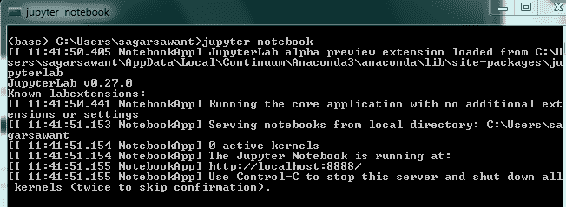

接下来，选择创建一个新的 Python 3 笔记本，如以下屏幕截图所示：


# 获取、读取和清理比特币价格数据

我们将从导入必要的模块开始。

导入`pandas`使您能够读入数据并开始探索它。下面的屏幕截图显示了`import pandas`命令：

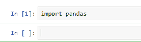

另外，导入`matplotlib`从数据中绘制绘图。

我们需要为`pandas`和`matplotlib`设置一些选项。下面的屏幕截图显示了导入`matplotlib`的命令：

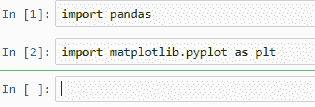

我们将设置的第一个选项称为`options.mode.chained_assignment = None`。

The preceding option is to make sure that the operations are for the cleanup, which will be performed on the pandas DataFrame objects; we want the cleanup to happen on the original DataFrame objects and not on copies.

以下屏幕截图显示了`options.mode.chained_assignment = None `选项：


另外，设置`matplotlib`以可视化和显示以下屏幕截图中显示的所有图表：


我们拥有的价格数据来自`coindesk.com`，如下图所示，可免费下载：

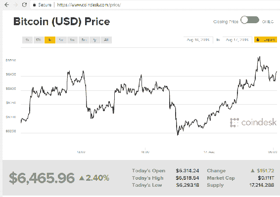

下载 CSV 格式的数据，并使用`pandas`读取该数据。这是一个 CSV 文件，所以我们将使用`pandas`中的`read_CSV`方法，如下图所示：

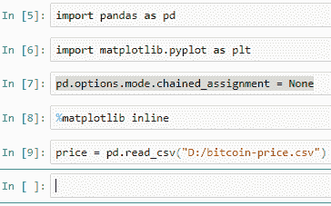

# 数据帧

熊猫数据对象中的数据称为数据帧。数据帧采用表格数据格式。现在，打印一些记录，看看这是什么样子。要打印出来，我们可以在 price 数据帧上调用一个名为`head()`的方法。

当我们这样做的时候，我们会得到两列-`Date`和`Close Price`-用于当天的美元比特币。对于从 0 开始的行，我们还有一个默认索引，该索引在读取数据时默认由 pandas 插入。以下屏幕截图显示了两列，`Date`和`Close Price`：


要获取此数据的顶级信息，请对其调用`info()`方法。调用此方法后，我们得到 2592 条记录。有两列：`Date`和`Close Price`。`Date`有 2592 条`type`对象的非空记录，表示`Date`字段已被读取为文本。我们以后必须将其更改为适当的日期时间格式。我们将收盘价作为数字浮动类型。有 2590 条非空记录，比`Date`字段少两条记录。

以下截图显示了`info()`方法的详细信息：

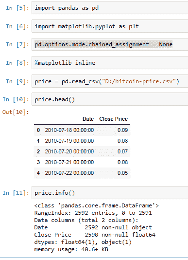

要从底部打印记录，请调用`tail()`方法。此方法显示最后两条记录不应存在，因为它们不是日期或价格。在进行进一步分析之前，我们需要删除这些内容。

我们可以看到收盘价有 NaN 值，这意味着它缺少值。我们可以使用这个因子从数据帧中删除这两条记录。我们对 price 调用 drop any 方法，它将删除一个或多个列为 null 或缺少值的记录。

Bear in mind that we are just removing it from the DataFrame price and not from the CSV file from which we read the data.

下面截图中的代码显示了`tail()`方法的实现：


另外，再次查看底部的行，以查看我们要删除的记录是否已被删除。我们可以在下面的屏幕截图中看到，它们实际上已被删除：


# 数据清理

我们需要做的另一项数据清理任务是将`Date`列从对象或文本格式转换为日期时间格式。我们使用熊猫`to_datetime`方法来实现这一点。

这里，我们要求`to_datetime`方法转换`Date`字段或`price`数据帧，并提供格式。然后我们将`Date`字段分配回数据帧，如以下屏幕截图所示：

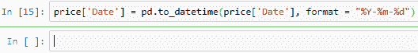

这就是我们在前面将链式赋值设置为等于`null`的原因，因为我们希望在原始数据帧上进行更改。

再次调用`info()`方法，查看数据清理是否有影响。我们可以看到，`Date`字段现在是我们想要的日期时间格式，数据中没有非空记录，如下图所示：


# 将索引设置为日期列

我们还需要将索引设置为`Date`列，并将`Date`列作为单独的列删除。这将帮助我们对日期数据运行一些有趣的查询。

下面截图中的代码显示了如何将索引设置为`Date`列：

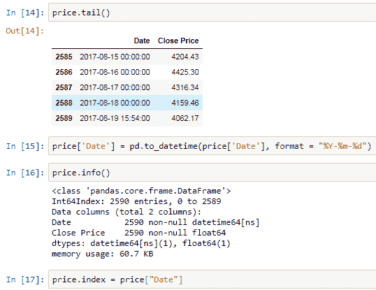

接下来，删除`Date`列作为一个单独的列，因为它已经被设置为索引，如下面的屏幕截图所示：

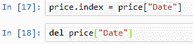

现在，`Date`列可以看作一个索引，不再是一个单独的列，如下面的屏幕截图所示：

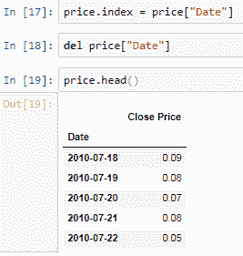

# 探索、操作和可视化已清理的数据

数据清理完成后，从数据探索任务开始。我们可以使用 pandas 的日期时间功能来运行一些有趣的查询。

例如，如果我们想获取某一特定年份的所有记录，请将该年份传递给方括号内的数据框。以下屏幕截图显示了 2010 年的价格数据：


我们还可以指定是否需要特定日期的数据。

以下屏幕截图显示了 2017 年 8 月 1 日起比特币的美元价格：


我们还可以指定是否需要跨越特定日期的特定时段的数据。

以下屏幕截图显示了 2017 年 8 月 1 日起的数据：


统计信息也可以使用 pandas 方法检索。例如，要从该数据集中获取最低价格，我们可以使用`min()`方法，如下图所示：

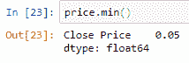

要获取最高价格，请使用`max ()`方法，如下图所示：


使用`describe ()`方法，一次可以接收到一大堆统计信息，如下图所示：

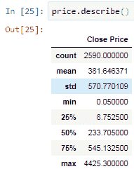

# 数据可视化

使用`pandas`和`matplotlib`从数据开始创建绘图非常容易。为了绘制整个数据，我们将调用`price``DataFrame`上的`plot`方法，我们将得到一个图，其中*x*轴是日期，*y*轴是价格数据。

下面的屏幕截图描述了该图，*x*轴为日期，*y*轴为价格数据：

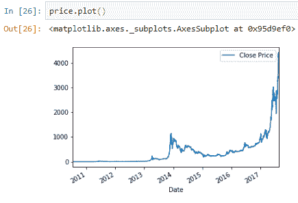

我们还可以放大某个时间段。例如，为了只绘制 2017 年的数据，首先选择 2017 年的数据，然后对数据子集调用`plot ()`方法。

在以下屏幕截图中，我们绘制了 2017 年以后的价格数据图：

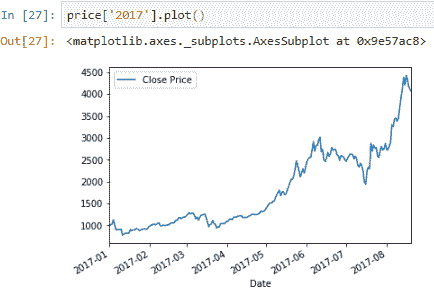

在下一节中，我们将了解如何使用比特币交易图。

# 探索比特币交易图

在本节中，我们将学习如何获取区块链数据，并提供如何探索、清理、分析和可视化这些数据的逐步信息。

# 比特币和区块链图

`Blockchain.info`是查看最新比特币统计数据和图表的最佳地点之一。有不同种类的关于比特币和区块链的图表可供分析。我们还可以下载 CSV、JSON 等多种格式的数据。在上一节中，我们已经下载了一些 CSV 格式的数据，现在我们将在 Jupyter 笔记本中探索这些数据。

我们首先导入所需的模块。我们需要`pandas`来读取、探索和清理数据，我们需要`matplotlib`来创建图形。

查看显示流通中比特币总数的数据。读取包含此数据的 CSV 文件并创建一个`pandas``DataFrame`。

以下屏幕截图显示了流通中比特币总数的数据：


# 探索、清理和分析数据

为了探索这些数据，我们使用`head()`方法从顶部查看记录，并在数据框上调用`info()`方法以获取更多信息，例如有多少条记录，有多少条空记录或缺失记录，或者各个列的数据类型是什么。

我们可以看到，`Date`列显示为 object。我们将此时间更改为最新时间以可视化此数据。为此，我们使用`to_datetime`方法，并将转换后的值分配回 DataFrame 的同一列。

以下屏幕截图描述了比特币的日期格式：


将数据帧的索引设置为`Date`列，并将`Date`列作为单独的列删除。执行此步骤以利用熊猫的时间序列特征。

现在，通过调用数据帧上的`info`和`head`再次检查更改是否发生。

以下屏幕截图显示了特定日期范围内的比特币：

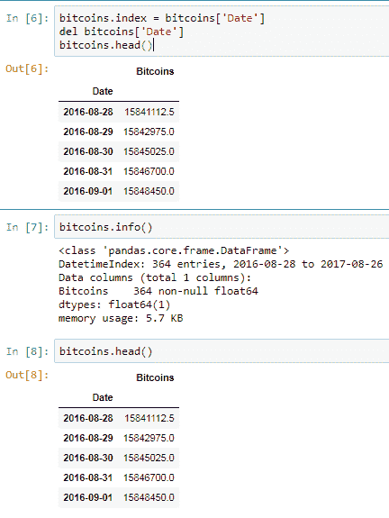

现在，我们准备从这些数据创建一个图表。在数据帧上调用`plot ()`方法，然后调用`show ()`方法显示图形。

它显示了在我们有此记录的时间段内已经开采的比特币总数。

以下屏幕截图描述了上述数据的图表：

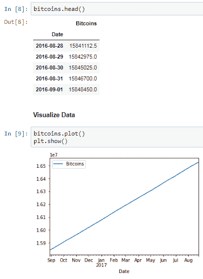

# 可视化数据

让我们看另一个例子。在这里，我们查看读取到数据中的块数据的事务：


最初，我们使用`head`和`info`方法直观地探索这些数据，如以下屏幕截图所示：

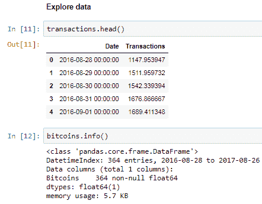

接下来，我们清理、转换和重塑数据，如以下屏幕截图所示：

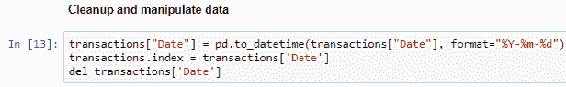

最后，我们在块数据中可视化事务，如以下屏幕截图所示：


同样，关于显示挖掘困难的数据，我们还应该看另一个例子。挖掘数据的步骤如下：

1.  读取数据，如以下屏幕截图所示：


2.  浏览数据，如以下屏幕截图所示：

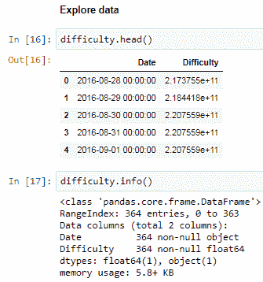

3.  清理数据，如以下屏幕截图所示：

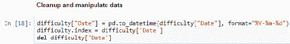

4.  最后，可视化数据，如以下屏幕截图所示：


我们可以看到，多年来采矿难度逐渐增加，而且呈上升趋势。这些只是事务图的几个示例。比特币和区块链生态系统中还有许多其他数据可供您探索。

在下一个模块中，我们将了解如何收集和分析*比特币骰子*游戏数据。

# 收集和分析比特币骰子游戏数据

在本节中，我们将查看来自骰子游戏门户的数据，从 API 中读取数据，并使用`pandas`将其转换为表格格式。我们还将导出数据并找到需要清理的内容。我们将清理、操作和重塑数据，为分析做好准备，最后，我们将从干净的数据中绘制一个简单的图。

# 从游戏 Web API 获取数据

用户可以从 MegaDice.com 浏览骰子游戏数据，该数据可从网站的 API 链接[获得 https://www.megadice.com](https://www.megadice.com) 。

我们将使用`pandas read_JSON`方法从 MegaDice API 链接读取个人获奖者历史数据。我们从这些数据中创建一个名为`leaders`的`pandas DataFrame`，并调用`head ()`方法来查看这些数据的外观。

以下截图中的代码显示了`pandas``DataFrame`、`leaders`的创建：


我们导入的数据有 703 列，其中大部分是单独的日期。我们将删除最后一列 queryTimeInSeconds，它实际上不是实际数据的一部分，不应该存在。此列显示在以下屏幕截图中：

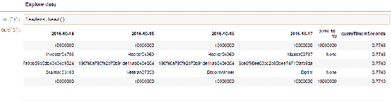

由于列太多而行很少，我们希望列是行，其中每个状态都有一行记录。为了执行此操作，我们需要将列翻转为行，反之亦然。为此，我们需要执行以下步骤：

1.  首先，我们重置索引，以便将当前索引作为另一列引入。当我们翻转`DataFrame`时，此列的值将成为列名。用`head ()`方法确认，如下图截图所示：

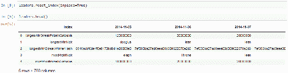

2.  接下来，使用名为`T`的方法翻转数据帧，或进行转置，如下图所示：


3.  现在，在下面的屏幕截图中，我们可以看到我们的行索引变成了日期，而我们前面的行变成了列：


我们已经得到了我们想要的列和行，但是还有一些其他的事情需要做。我们希望日期值采用日期时间格式，但目前是文本格式。但是，数据帧的转置将日期值更改为索引。我们需要首先使用`reset_index`方法将它们转换成一列，如下面的屏幕截图所示：

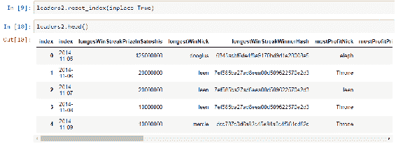

现在，我们可以将此文本数据转换为适当的日期时间格式，如以下屏幕截图所示：

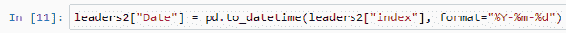

调用`info ()`方法进行确认。我们有一个新的列`Date`，它的日期时间格式是正确的。在列名索引中，日期值必须为文本格式，如以下屏幕截图所示：

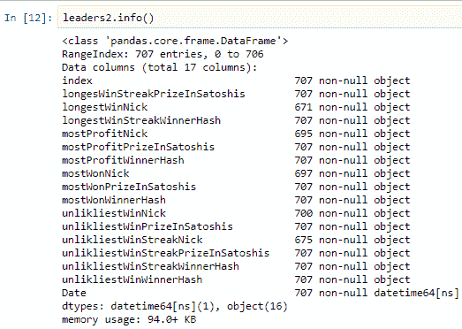

我们将把索引设置回正确的`Date`列，并将`Date`列作为一个单独的列删除，如下面的屏幕截图所示：


现在，我们在`Date`字段上正确地索引了数据帧：


使用`plot ()`方法绘制该数据的样本图，并使用`plt.show ()`方法显示，如下图所示：

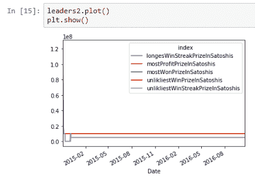

现在，这些数据可以用作`pandas`时间序列函数，或者可以为不同的日期子集可视化的多个块，等等。

# 总结

在本章中，我们学习了如何准备数据分析的设置。我们了解了如何获取、读取和清理价格数据。我们还学习了如何探索、操作和可视化清理后的数据。

我们还探索了一些我们可以创建的比特币和区块链图。我们了解了从哪里获取相关数据，并在 Jupyter 笔记本中读取这些数据，然后导入必要的模块。我们清理并处理了这些数据，最后，我们用这些数据和一个笔记本创建了图形，但没有使用 Python。

我们还探索了骰子游戏门户网站上的数据。我们添加了来自 API 的数据，并使用 pandas 将其转换为表格格式。我们研究了数据，找到了需要清理的地方。我们清理和处理了数据，并准备好进行分析。