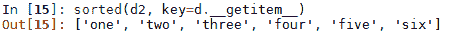
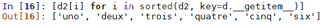
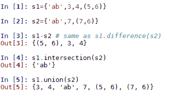
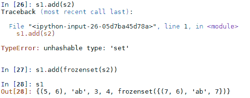
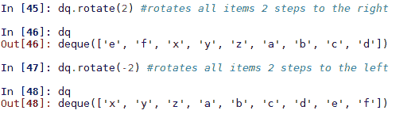
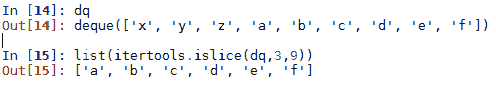

# Python 数据类型和结构

在本章中，我们将更详细地研究 Python 数据类型。我们已经介绍了两种数据类型，字符串和列表，`str()`和`list()`。但是，这些数据类型是不够的，我们通常需要更专门的数据对象来表示/存储数据。Python 还有其他各种用于存储和管理数据的标准数据类型，我们将在本章中讨论。除了内置类型之外，还有几个内部模块，允许我们在处理数据结构时解决常见问题。首先，我们将回顾所有数据类型通用的一些操作和表达式，我们将讨论 Python 中与数据类型更相关的内容。

本章的目标如下：

*   了解 Python 3.7 支持的各种重要内置数据类型
*   探索内置数据类型的各种附加高性能替代集合

# 技术要求

本章中使用的所有代码都在以下 GitHub 链接中给出：[https://github.com/PacktPublishing/Hands-On-Data-Structures-and-Algorithms-with-Python-Second-Edition/tree/master/Chapter02](https://github.com/PacktPublishing/Hands-On-Data-Structures-and-Algorithms-with-Python-Second-Edition/tree/master/Chapter02) 。

# 内置数据类型

Python 数据类型可以分为三类：数值型、序列型和映射型。还有表示`Null`的`None`对象，或者没有值。不要忘记，类、文件和异常等其他对象也可以适当地视为*类型*；但是，这里不考虑这些问题。

Python 中的每个值都有一个数据类型。与许多编程语言不同，在 Python 中，不需要显式声明变量的类型。Python 在内部跟踪对象类型。

下表概述了 Python 内置数据类型：

| **类别** | **名称** | **说明** |
| 没有一个 | `None` | 它是一个空对象。 |
| 数字的 | `int` | 这是一个整数数据类型。 |
|  | `float` | 此数据类型可以存储浮点数。 |
|  | `complex` | 它存储一个复数。 |
|  | `bool` | 它是布尔类型，返回`True`或`False`。 |
| 序列 | `str` | 它用于存储字符串。 |
|  | `liXst` | 它可以存储任意对象的列表。 |
|  | `Tuple` | 它可以存储一组任意项目。 |
|  | `range` | 它用于创建一系列整数。 |
| 映射 | `dict` | 它是一种字典数据类型，以*键/值*对存储数据。 |
|  | `set` | 它是一个可变的、无序的独特项目集合。 |
|  | `frozenset` | 这是一个不变的集合。 |

# 无类型

`None`类型是不可变的。用作`None`表示没有值；它与许多编程语言（如 C 语言和 C++语言）相似。对象返回`None`时，实际上没有什么可返回的。它也由`False`布尔表达式返回。`None`通常用作函数参数中的默认值，用于检测函数调用是否传递了值

# 数字类型

数字类型包括整数（`int`），即无限范围的整数、浮点数（`float`）、复数（`complex`），它们由两个浮点数表示，以及 Python 中的布尔值（`bool`）。Python 提供了`int`数据类型，允许标准算术运算符（`+`、`-`、`*`和`/`处理它们，类似于其他编程语言。布尔数据类型有两个可能的值，`True`和`False`。这些值分别映射到`1`和`0`。让我们考虑一个例子：

```py
>>> a=4; b=5   # Operator (=) assigns the value to variable
>>>print(a, "is of type", type(a))
4 is of type 
<class 'int'>
>>> 9/5  
1.8
>>>c= b/a  *# division returns a floating point number* *>>>* print(c, "is of type", type(c))
1.25 is of type <class 'float'>
>>> c   # No need to explicitly declare the datatype
1.25
```

`a`和`b`变量为`int`类型，`c`为浮点类型。除法运算符（`/`总是返回一个`float`类型；但是，如果您希望在除法后得到`int`类型，可以使用楼层除法运算符（`//`），它会丢弃任何小数部分，并返回小于或等于`x`的最大整数值。考虑下面的例子：

```py
>>> a=4; b=5   
>>>d= b//a
*>>>* print(d, "is of type", type(d))1 is of type <class 'int'>
>>>7/5  # true division
1.4
>>> -7//5  # floor division operator
-2
```

建议读者小心使用除法运算符，因为它的函数因 Python 版本而异。在 Python 2 中，除法运算符只返回`integer`，而不返回`float`。

指数运算符（`**`可用于获取数字的幂（例如，`x ** y`），模运算符（`%`返回除法的余数（例如，`a% b`返回`a/b`的余数）：

```py
>>> a=7; b=5 
>>> e= b**a  # The operator (**)calculates power 
>>>e
78125
>>>a%b
2
```

复数由两个浮点数表示。使用`j`运算符分配它们，以表示复数的虚部。我们可以分别使用`f.real`和`f.imag`访问实部和虚部，如下面的代码片段所示。复数通常用于科学计算。Python 支持复数的加法、减法、乘法、幂、共轭等，如下所示：

```py
>>> f=3+5j
>>>print(f, "is of type", type(f))(3+5j) is of type <class 'complex'>
>>> f.real
3.0
>>> f.imag
5.0
>>> f*2   # multiplication
(6+10j)
>>> f+3  # addition
(6+5j)
>>> f -1  # subtraction
(2+5j)  
```

在 Python 中，布尔类型使用真值表示，即`True`和`False`；类似于`0`和`1`*。*Python 中有一个`bool`类，返回`True`或`False`。布尔值可以与逻辑运算符组合，如`and`、`or`和`not`：

```py
>>>bool(2)
True
>>>bool(-2)
True
>>>bool(0)
False
```

布尔运算返回`True`或`False`。布尔运算按优先级排序，因此，如果表达式中发生多个布尔运算，则优先级最高的运算将首先发生。下表按优先级降序列出了三个布尔运算符：

| **操作员** | **示例** |
| `not x` | 若`x`为`True`则返回`False`，若`x`为`False`则返回`True`。 |
| `x and y` | 如果`x`和`y`都是`True`，则返回`True`；否则返回`False`。 |
| `x or``y` | 如果`x`或`y`中的任一方为`True`，则返回`True`；否则返回`False`。 |

Python 在计算布尔表达式时非常有效，因为它只在需要时计算运算符。例如，如果表达式`x or y`中的`x`为`True`，则无需对`y`求值，因为该表达式为`True`，这就是为什么在 Python 中不对`y`求值的原因。类似地，在表达式`x and y`*中，如果`x`是`False`，解释器将简单地计算`x`并返回`False`，而不计算`y`。*

 *比较运算符（`<`、`<=`、`>`、`>=`、`==`和`!=`处理数字、列表和其他收集对象，如果条件成立，则返回`True`。对于集合对象，比较运算符比较元素的数量，如果每个集合对象在结构上等效，并且每个元素的值相同，则等价运算符（`==`返回`True`。让我们看一个例子：

```py
>>>See_boolean = (4 * 3 > 10) and (6 + 5 >= 11)
>>>print(See_boolean)
True
>>>if (See_boolean):
...    print("Boolean expression returned True")
   else:
...  print("Boolean expression returned False")
...

Boolean expression returned True
```

# 表示错误

应该注意的是，浮点数的本机双精度表示会导致一些意外的结果。例如，考虑以下内容：

```py
>>> 1-0.9
0.09999999999999998
>>> 1-0.9==.1
False
```

这是因为大多数十进制分数不能精确地表示为二进制分数，这就是大多数底层硬件表示浮点数的方式。对于可能存在此问题的算法或应用程序，Python 提供了一个十进制模块。此模块允许精确表示十进制数，并有助于更好地控制特性，如舍入行为、有效位数和精度。它定义了两个对象，`Decimal`类型表示十进制数，`Context`类型表示各种计算参数，如精度、舍入和错误处理。在以下代码段中可以看到其用法示例：

```py
>>> import decimal
>>> x=decimal.Decimal(3.14)
>>> y=decimal.Decimal(2.74)
>>> x*y
Decimal('8.603600000000001010036498883')
>>> decimal.getcontext().prec=4
>>> x*y
Decimal('8.604')
```

在这里，我们创建了一个全局上下文，并将精度设置为`4`。`Decimal`对象可以像您对待`int`或`float`一样对待。它们接受所有相同的数学运算，可以用作字典键、放置在集合中，等等。此外，`Decimal`对象还有几种数学运算方法，如自然指数、`x.exp()`；自然对数，`x.ln()`；以 10 为底的对数`x.log10()`。

Python 还有一个实现有理数类型的`fractions`模块。以下示例显示了创建分数的几种方法：

```py
>>> import fractions
>>> fractions.Fraction(3,4)
Fraction(3, 4)
>>> fractions.Fraction(0.5)
Fraction(1, 2)
>>> fractions.Fraction("0.25") 
Fraction(1, 4)
```

这里还值得一提的是 NumPy 扩展。它具有数学对象的类型，如数组、向量和矩阵，以及线性代数、傅立叶变换计算、特征向量、逻辑运算等功能。

# 成员资格、标识和逻辑操作

成员操作符（`in`和`not in`测试序列中的变量，如列表或字符串，并执行您期望的操作；如果在`y`中发现`x`变量，则`x in y`返回`True`。`is`运算符比较对象标识。例如，以下代码段显示了与对象标识的对比度等价性：

```py
>>> x=[1,2,3]
>>> y=[1,2,3]
>>> x==y  # test equivalence 
True
>>> x is y   # test object identity
False
>>> x=y   # assignment
>>> x is y
True
```

# 序列

序列是由非负整数索引的有序对象集。序列包括`string`、`list`、`tuple`和`range`对象。列表和元组是任意对象的序列，而字符串是字符序列。但是，`string`、`tuple`和`range`对象是不可变的，`list`对象是可变的。所有序列类型都有许多共同的操作。请注意，对于不可变类型，任何操作都只会返回一个值，而不会实际更改该值。

对于所有序列，如前一章所述，索引和切片运算符适用。在[第 1 章](01.html)、*Python 对象、类型和表达式*中详细讨论了`string`和`list`数据类型。这里，我们介绍了所有序列类型（`string`、`list`、`tuple`和`range`对象）所共有的一些重要方法和操作。

所有序列都有以下方法：

| **方法** | **说明** |
| `len(s)` | 返回`s`中的元素数。 |
| `min(s,[,default=obj, key=func])` | 返回`s`中的最小值（字符串按字母顺序排列）。 |
| `max(s,[,default=obj, key=func])` | 返回`s`中的最大值（字符串按字母顺序排列）。 |
| `sum(s,[,start=0])` | 返回元素的总和（如果为`s`，则返回`TypeError`不是数字）。 |
| `all(s)` | 如果`s`中的所有元素都是`True`（即不是`0`、`False`或`Null`，则返回`True`。 |
| `any(s)` | 检查`s`中是否有`True`项。 |

此外，所有序列都支持以下操作：

| **操作** | **说明** |
| `s+r` | 连接相同类型的两个序列。 |
| `s*n` | 制作`s`的`n`份，其中`n`为整数。 |
| `v1,v2...,vn=s` | 将`n`变量从`s`解包到`v1`、`v2`等。 |
| `s[i]` | 索引返回`s`的`i`元素。 |
| `s[i:j:stride]` | 切片返回`i`和`j`之间的元素，可选择步长。 |
| `x in s` | 如果`x`元素在`s`中，则返回`True`。 |
| `x not in s` | 如果`x`元素不在`s`中，则返回`True`。 |

让我们考虑一个示例代码片段，它实现了在 OutT0A.数据类型上的一些先前操作：

```py
>>>list() # an empty list   
>>>list1 = [1,2,3, 4]
>>>list1.append(1)  # append value 1 at the end of the list
>>>list1
[1, 2, 3, 4, 1]
>>>list2 = list1 *2    
[1, 2, 3, 4, 1, 1, 2, 3, 4, 1]
>>> min(list1)
1
>>> max(list1)
4
>>>list1.insert(0,2)  # insert an value 2 at index 0
>>> list1
[2, 1, 2, 3, 4, 1]
>>>list1.reverse()
>>> list1
[1, 4, 3, 2, 1, 2]
>>>list2=[11,12]
>>>list1.extend(list2)
>>> list1
[1, 4, 3, 2, 1, 2, 11, 12]
>>>sum(list1)
36
>>> len(list1)
8
>>> list1.sort()
>>> list1
[1, 1, 2, 2, 3, 4, 11, 12]
>>>list1.remove(12)   #remove value 12 form the list
>>> list1
[1, 1, 2, 2, 3, 4, 11]
```

# 学习元组

元组是任意对象的不可变序列。元组是以逗号分隔的值序列；然而，通常的做法是将它们括在括号中。当我们想要在一行中设置多个变量，或者允许函数返回不同对象的多个值时，元组非常有用。元组是一个有序的项序列，类似于`list`数据类型。唯一的区别是元组是不可变的；因此，一旦创建，它们就不能被修改，这与`list`不同。元组由大于零的整数索引。元组是**可散列的**，这意味着我们可以对它们的列表进行排序，它们可以用作字典的键。

我们还可以使用内置函数创建元组：`tuple()`。在没有参数的情况下，这将创建一个空元组。如果`tuple()`的参数是一个序列，那么这将创建该序列元素的元组。重要的是要记住，当创建一个包含一个元素但没有尾随逗号的元组时，要使用尾随逗号，这将被解释为字符串。元组的一个重要用途是通过将元组放置在赋值的左侧，允许我们一次赋值多个变量

考虑一个例子：

```py
>>> t= tuple()   # create an empty tuple
>>> type(t)
<class 'tuple'>
>>> t=('a',)  # create a tuple with 1 element
>>> t
('a',)
>>> print('type is ',type(t))
type is  <class 'tuple'>
>>> tpl=('a','b','c')
>>> tpl('a', 'b', 'c')
>>> tuple('sequence')
('s', 'e', 'q', 'u', 'e', 'n', 'c', 'e')
>>> x,y,z= tpl   #multiple assignment 
>>> x
'a'
>>> y
'b'
>>> z
'c'
>>> 'a' in tpl  # Membership can be tested
True
>>> 'z' in tpl
False
```

大多数操作符（例如用于切片和索引的操作符）的工作方式与它们在列表上的工作方式相同。然而，由于元组是不可变的，因此尝试修改元组的元素将得到`TypeError`。我们可以使用`==`、`>`和`<`操作符，以与比较其他序列相同的方式比较元组。考虑一个示例代码片段：

```py
>>> tupl = 1, 2,3,4,5  # braces are optional
>>>print("tuple value at index 1 is ", tupl[1])
tuple value at index 1 is  2
>>> print("tuple[1:3] is ", tupl[1:3])
tuple[1:3] is (2, 3)
>>>tupl2 = (11, 12,13)
>>>tupl3= tupl + tupl2   # tuple concatenation
>>> tupl3
(1, 2, 3, 4, 5, 11, 12, 13)
>>> tupl*2      # repetition for tuples
(1, 2, 3, 4, 5, 1, 2, 3, 4, 5)
>>> 5 in tupl    # membership test
True
>>> tupl[-1]     # negative indexing
5
>>> len(tupl)   # length function for tuple
5
>>> max(tupl)
5
>>> min(tupl)
1
>>> tupl[1] = 5 # modification in tuple is not allowed.
Traceback (most recent call last):  
  File "<stdin>", line 1, in <module>
TypeError: 'tuple' object does not support item assignment
>>>print (tupl== tupl2)
False
>>>print (tupl>tupl2)
False
```

让我们考虑另一个例子来更好地理解元组。例如，我们可以使用多个赋值来交换元组中的值：

```py
>>> l = ['one','two']
>>> x,y = l
('one', 'two')
>>> x,y = y,x
>>> x,y
('two', 'one')
```

# 从字典开始

在 Python 中，`Dictionary`数据类型是最流行和最有用的数据类型之一。字典将数据存储在键和值对的映射中。词典主要是对象的集合；它们由数字、字符串或任何其他不可变对象索引。键在字典中应该是唯一的；但是，可以更改字典中的值。Python 字典是唯一的内置映射类型；可以将它们视为从一组键到一组值的映射。它们是使用`{key:value}`语法创建的。例如，以下代码可用于创建使用不同方法将单词映射到数字的词典：

```py
>>>a= {'Monday':1,'Tuesday':2,'Wednesday':3} #creates a dictionary 
>>>b =dict({'Monday':1 , 'Tuesday': 2, 'Wednesday': 3})
>>> b
{'Monday': 1, 'Tuesday': 2, 'Wednesday': 3}
>>> c= dict(zip(['Monday','Tuesday','Wednesday'], [1,2,3]))
>>> c={'Monday': 1, 'Tuesday': 2, 'Wednesday': 3}
>>> d= dict([('Monday',1), ('Tuesday',2), ('Wednesday',3)])
>>>d
{'Monday': 1, 'Tuesday': 2, 'Wednesday': 3}
```

我们可以添加键和值。我们还可以更新多个值，并使用`in`操作符测试值的成员身份或出现情况，如以下代码示例所示：

```py
>>>d['Thursday']=4     #add an item
>>>d.update({'Friday':5,'Saturday':6})  #add multiple items
>>>d
{'Monday': 1, 'Tuesday': 2, 'Wednesday': 3, 'Thursday': 4, 'Friday': 5, 'Saturday': 6}
>>>'Wednesday' in d  # membership test (only in keys)
True
>>>5 in d       # membership do not check in values
False

```

如果列表很长，`in`运算符在列表中查找元素会花费太多时间。在列表中查找元素所需的运行时间随着列表大小的增加而线性增加。然而，字典中的`in`运算符使用哈希函数，这使得字典非常高效，因为查找元素所花费的时间与字典的大小无关。

请注意，当我们打印出字典的`{key: value}`对时，它没有特定的顺序。这不是问题，因为我们使用指定键查找每个字典值，而不是整数的有序序列，字符串和列表就是这样：

```py
>>> dict(zip('packt', range(5)))
{'p': 0, 'a': 1, 'c': 2, 'k': 3, 't': 4}
>>> a = dict(zip('packt', range(5)))
>>> len(a)   # length of dictionary a
5
>>> a['c']  # to check the value of a key
2
>>> a.pop('a')  
1
>>> a{'p': 0, 'c': 2, 'k': 3, 't': 4}
>>> b= a.copy()   # make a copy of the dictionary
>>> b
{'p': 0, 'c': 2, 'k': 3, 't': 4}
>>> a.keys()
dict_keys(['p', 'c', 'k', 't'])
>>> a.values()
dict_values([0, 2, 3, 4])
>>> a.items()
dict_items([('p', 0), ('c', 2), ('k', 3), ('t', 4)])
>>> a.update({'a':1})   # add an item in the dictionary
>>> a{'p': 0, 'c': 2, 'k': 3, 't': 4, 'a': 1}
>>> a.update(a=22)  # update the value of key 'a'
>>> a{'p': 0, 'c': 2, 'k': 3, 't': 4, 'a': 22}

```

下表包含所有字典方法及其说明：

| **方法** | **说明** |
| `len(d)` | 返回字典中的项目总数，`d`。 |
| `d.clear()` | 从字典`d`中删除所有项。 |
| `d.copy()` | 返回字典的浅表副本`d`。 |
| `d.fromkeys(s[,value])` | 返回一个新字典，其中包含来自`s`序列的键和设置为`value`的值。 |
| `d.get(k[,v])` | 如果找到则返回`d[k]`；否则返回`v`（`v`未给出则返回`None`。 |
| `d.items()` | 返回字典的所有`key:value`对`d`。 |
| `d.keys()` | 返回字典`d`中定义的所有键。 |
| `d.pop(k[,default])` | 返回`d[k]`并将其从`d`中删除。 |
| `d.popitem()` | 从字典中删除一个随机的`key:value`对`d`，并将其作为元组返回。 |
| `d.setdefault(k[,v])` | 返回`d[k]`。如果未找到，则返回`v`并将`d[k]`设置为`v`。 |
| `d.update(b)` | 将`b`字典中的所有对象添加到`d`字典中。 |
| `d.values()` | 返回字典`d`中的所有值。 |

# python

需要注意的是，`in`运算符应用于词典时，其工作方式与应用于列表时略有不同。当我们在列表上使用`in`运算符时，查找元素所需的时间与列表大小之间的关系被认为是线性的。也就是说，随着列表的大小变大，查找元素所需的相应时间最多呈线性增长。算法运行时间与其输入大小之间的关系通常被称为其时间复杂度。我们将在下一章（及后续章节）中更多地讨论这一重要主题。

与`list`对象不同，当`in`操作符应用于字典时，它使用哈希算法，这会增加每次查找时间，几乎与字典的大小无关。这使得字典作为处理大量索引数据的一种方式非常有用。我们将在[第 4 章](04.html)、*列表和指针结构*和[第 14 章](14.html)、*实现、应用程序和工具*中进一步讨论增长率哈希这一重要话题。

# 分类词典

如果要对字典的键或值进行简单排序，可以执行以下操作：

```py
>>> d = {'one': 1, 'two': 2, 'three': 3, 'four': 4, 'five': 5, 'six': 6} 
>>> sorted(list(d)) 
['five', 'four', 'one', 'six', 'three', 'two']  
>>> sorted(list(d.values())) 
[1, 2, 3, 4, 5, 6] 

```

请注意，前面代码中的第一行按字母顺序对键进行排序，第二行按整数值的顺序对值进行排序。

`sorted()`方法有两个值得关注的可选参数：`key`和`reverse`。`key`参数与字典键无关，而是将函数传递给排序算法以确定排序顺序的一种方式。例如，在下面的代码中，我们使用`__getitem__`特殊方法根据字典值对字典键进行排序：


本质上，前面的代码所做的是，对于`d`中的每个键，它使用相应的值进行排序。我们还可以根据字典键的排序顺序对值进行排序。然而，由于字典没有通过使用键的值来返回键的方法，与列表的`list.index`方法相当，使用可选键参数来返回键有点棘手。另一种方法是使用列表理解，如下例所示：


`sorted()`方法也有一个可选的`reverse`参数，不出所料，这正好是它所说的反转排序列表的顺序，如以下示例所示：


现在，假设我们得到了以下词典，以英语单词为关键字，以法语单词为值。我们的任务是将字符串值按正确的数字顺序排列：

```py
d2={'one':'uno','two':'deux','three':'trois','four':'quatre','five':'cinq','six':'six'}
```

当然，当我们打印这本词典时，它不可能按正确的顺序打印。因为所有键和值都是字符串，所以我们没有数字排序的上下文。为了将这些项目按正确顺序排列，我们需要使用我们创建的第一本词典，将单词映射到数字，以此将我们的英语词典排序为法语词典：



请注意，我们使用第一个字典`d`的值对第二个字典`d2`的键进行排序。由于两个词典中的键相同，我们可以使用列表理解对法语到英语词典的值进行排序：



当然，我们可以定义自己的自定义方法，将其用作排序方法的关键参数。例如，这里我们定义了一个函数，它只返回字符串的最后一个字母：

```py
def corder(string): 
    return (string[len(string)-1])
```

然后，我们可以将其用作排序函数的键，按每个元素的最后一个字母对其进行排序：


# 文本分析词典

字典的一个常见用法是按顺序计算相似项的出现次数；一个典型的例子是计算正文中单词的出现次数。下面的代码创建一个字典，其中文本中的每个单词都用作键，出现的次数作为其值。这使用了一种非常常见的嵌套循环习惯用法。在这里，我们使用它在外循环中遍历文件中的行，在内循环中遍历字典的键：

```py
def wordcount(fname):  
   try: 
        fhand=open(fname) 
   except:
        print('File can not be opened') 
        exit() 

   count=dict() 
   for line in fhand: 
        words=line.split() 
        for word in words: 
            if word not in count: 
                count[word]=1  
            else: 
                count[word]+=1 
   return(count)

```

这将返回一个字典，其中包含文本文件中每个唯一单词的元素。一个常见的任务是将这些项过滤到我们感兴趣的子集中。在运行代码时，需要在同一目录中保存一个文本文件。这里我们使用了`alice.txt`，这是*爱丽丝梦游仙境*中的一小段摘录。要获得相同的结果，您可以从[davejulian.net/bo5630](http://davejulian.net/bo5630)下载`alice.txt`或使用您自己的文本文件。在下面的代码中，我们创建了另一个已过滤的字典，其中包含来自`count`的项目子集：

```py
count=wordcount('alice.txt') 
filtered={key:value for key, value in count.items() if value <20 and value>16 }
```

打印过滤后的词典时，我们会得到以下结果：

```py
{'once': 18, 'eyes': 18, 'There': 19, 'this,': 17, 'before': 19, 'take': 18, 'tried': 18, 'even': 17, 'things': 19, 'sort': 17, 'her,': 18, '`And': 17, 'sat': 17, '`But': 19, "it,'": 18, 'cried': 18, '`Oh,': 19, 'and,': 19, "`I'm": 19, 'voice': 17, 'being': 19, 'till': 19, 'Mouse': 17, '`but': 19, 'Queen,': 17}
```

注意用于构建过滤字典的**字典理解**的使用。字典理解的工作方式与我们在[第 1 章](01.html)、*Python 对象、类型和表达式*中看到的列表理解的工作方式相同。

# 设置

集合是唯一项的无序集合。集合本身是可变的，我们可以从集合中添加和删除项；但是，项目本身必须是不可变的。集合的一个重要区别是它们不能包含重复的项。集合通常用于执行数学运算，例如交集、并集、差集和补集。

与序列类型不同，集合类型不提供任何索引或切片操作。Python 中有两种类型的 set 对象，可变的`set`对象和不可变的`frozenset`对象。集合是使用花括号中逗号分隔的值创建的。顺便说一下，我们不能使用`a={}`创建一个空集，因为这将创建一个字典。要创建一个空集，我们可以编写`a=set()`或`a=frozenset()`。

集合的方法和操作如下表所示：

| **方法** | **说明** |
| `len(a)` | 提供`a`集合中的元素总数。 |
| `a.copy()` | 提供`a`集合的另一个副本。 |
| `a.difference(t)` | 提供一组在`a`集中但不在`t`中的元素。 |
| `a.intersection(t)` | 提供两个集合中的一组元素，`a`和`t`。 |
| `a.isdisjoint(t)` | 返回`True`，如果两个集合`a`和`t`中没有共同的元素。 |
| `a.issubset(t)` | 如果`a`集合的所有元素也在`t`集合中，则返回`True`。 |
| `a.issuperset(t)` | 如果`t`集合的所有元素也在`a`集合中，则返回`True`。 |

| `a.symmetric_difference(t)` | 返回一组在`a`或`t`集中的元素，但不同时在这两个集中。 |
| `a.union(t)` | 返回`a`或`t`集合中的一组元素。 |

在上表中，`t`参数可以是任何支持迭代的 Python 对象，并且所有方法都可用于`set`和`frozenset`对象。需要注意的是，这些方法的运算符版本要求其参数为集合，而这些方法本身可以接受任何 iterable 类型。例如，`s-[1,2,3]`对于任何集合，`s`将生成不支持的操作数类型。使用等效项，`s.difference([1,2,3])`将返回一个结果。

可变`set`对象有其他方法，如下表所述：

| **方法** | **说明** |
| `s.add(item)` | 在`s`中增加一个项目；如果项目已添加，则不会发生任何事情。 |
| `s.clear()` | 从集合`s`中删除所有元素。 |
| `s.difference_update(t)` | 从`s`集合中删除其他集合`t`中的元素。 |
| `s.discard(item)` | 从集合`s`中删除该项。 |
| `s.intersection_update(t)` | 从集合`s`中移除不在集合`s`和`t`交叉处的项目。 |
| `s.pop()` | 返回集合`s`中的任意项，并将其从集合`s`中移除。 |
| `s.remove(item)` | 从`s`集合中删除该项。 |
| `s.symetric_difference_update(t)` | 删除`s`集合中不在集合`s`和`t`对称差中的所有元素。 |
| `s.update(t)` | 将 iterable 对象`t`中的所有项追加到`s`集合。 |

这里，考虑一个简单的例子，演示添加、删除、丢弃和清除操作：

```py
>>> s1 = set()
>>> s1.add(1)
>>> s1.add(2)
>>> s1.add(3)
>>> s1.add(4)
>>> s1
{1, 2, 3, 4}
>>> s1.remove(4)
>>> s1
{1, 2, 3}
>>> s1.discard(3)
>>> s1
{1, 2}
>>>s1.clear()
>>>s1
set()
```

以下示例演示了一些简单的集合操作及其结果：



请注意，`set`对象并不关心其成员是否都属于同一类型，只要它们都是不可变的。如果试图在集合中使用易变对象（如列表或字典），则会收到不可修复的类型错误。所有可哈希类型都有一个哈希值，该值在实例的整个生命周期内不会更改。所有内置的不可变类型都是可散列的。所有内置可变类型都不可散列，因此它们不能用作集合的元素或字典的键。

请注意，在前面的代码中，当我们打印出`s1`和`s2`的并集时，只有一个元素的值为`'ab'`。这是集合的自然属性，因为集合不包含重复项。

除了这些内置方法之外，我们还可以对集合执行许多其他操作。例如，要测试集合的成员资格，请使用以下命令：


我们可以使用以下方法循环集合中的元素：


# 不变集

Python 有一个名为`frozenset`的不可变集合类型。它的工作原理与`set`非常相似，只是不允许使用`add()`或`clear()`方法等改变值的方法或操作。这种不变性有几种有用的方法。

例如，由于正规集是可变的，因此不可散列，因此它们不能用作其他集的成员。另一方面，`frozenset`是不可变的，因此可以用作集的成员：



此外，`frozenset`的不可变属性意味着我们可以将其用作字典的键，如下例所示：


# 数据结构和算法模块

除了内置类型之外，我们还可以使用几个 Python 模块来扩展内置类型和函数。在许多情况下，这些 Python 模块可以提供效率和编程优势，从而简化代码。

到目前为止，我们已经研究了字符串、列表、集合和字典的内置数据类型，以及十进制和小数模块。它们通常用术语**摘要****数据类型**（**ADTs**来描述。ADT 可以被视为可对数据执行的一组操作的数学规范。它们是由它们的行为而不是它们的实现来定义的。除了我们已经研究过的 ADT 之外，还有几个 Python 库为内置数据类型提供扩展。这些将在下一节中讨论。

# 收藏

`collections`模块为内置数据类型提供了更专业、高性能的替代方案，以及创建命名元组的实用函数。下表列出了“集合”模块的数据类型和操作及其说明：

| **数据类型或操作** | **说明** |
| `namedtuple()` | 创建具有命名字段的元组子类。 |
| `deque` | 带有快速附件的列表，并在任意一端弹出。 |
| `ChainMap` | 类创建多个映射的单个视图。 |
| `Counter` | 用于计算哈希对象的字典子类。 |
| `OrderedDict` | 记住条目顺序的字典子类。 |
| `defaultdict` | 调用函数以提供缺失值的字典子类。 |
| `UserDict UserList UserString` | 这三种数据类型只是其底层基类的包装器。它们的使用在很大程度上已被直接对各自的基类进行子类化的能力所取代。可用于作为属性访问基础对象。 |

# 双向队列

双端队列或 DEQUE（通常发音为*deck*）是类似列表的对象，支持线程安全、内存高效的附件。DEQUE 是可变的，支持列表的一些操作，例如索引。Deques 可以通过索引进行分配，如`dq[1] = z`；但是，我们不能直接对 deques 进行切片。例如，`dq[1:2]`产生`TypeError`（我们将很快研究一种从 deque 返回切片作为列表的方法）。

deque 相对于列表的主要优点是，在 deque 的开头插入项目比在列表的开头插入项目快得多，尽管在 deque 的结尾插入项目比在列表上的等效操作稍微慢一点。DEQUE 是线程安全的，可以使用`pickle`模块进行序列化。

思考 deques 的一个有用方法是填充和消费项目。DEQUE 中的项目通常从任意一端依次填充和消费：


我们可以使用`pop()`和`popleft()`方法来消费 deque 中的物品，如下例所示：


我们也可以使用`rotate(n)`方法，将`n`步的所有项目向右移动和旋转`n`整数的正值或`n`步的负值向左移动和旋转，使用正整数作为参数，如下例所示：



请注意，我们可以使用`rotate`和`pop`方法删除所选元素。还有一种简单的方法值得了解，它可以返回一个 deque 片段，作为一个列表，如下所示：



`itertools.islice()`方法的工作方式与 slice 在列表上的工作方式相同，不同之处在于它不是将列表作为参数，而是将 iterable 作为列表，并通过开始和停止索引返回选定的值。

deque 的一个有用特性是，它们支持一个限制 deque 大小的`maxlen`可选参数。这使得它非常适合称为**循环缓冲区**的数据结构。这是一个固定大小的结构，有效地端到端连接，通常用于缓冲数据流。以下是一个基本示例：

```py
dq2=deque([],maxlen=3) 
for i in range(6):
    dq2.append(i) 
    print(dq2)
```

这将打印出以下内容：


在本例中，我们从右侧填充，从左侧消费。请注意，一旦缓冲区已满，将首先使用最旧的值，并从右侧替换值。在实现循环列表时，我们将在[第 4 章](04.html)、*列表和指针结构*中再次介绍循环缓冲区。

# 链映射对象

`collections.chainmap`类是在 Python3.2 中添加的，它提供了一种链接多个字典或其他映射的方法，以便将它们视为一个对象。此外，还有一个`maps`属性、一个`new_child()`方法和一个`parents`属性。`ChainMap`对象的底层映射存储在一个列表中，可以使用`maps[i]`属性检索`ith`字典。注意，即使字典本身是无序的，`ChainMap`对象也是字典的有序列表。

`ChainMap`在我们使用大量包含相关数据的词典的应用程序中非常有用。消费应用程序需要具有优先级的数据，如果两个字典中的同一个键出现在基础列表的开头，则会被赋予优先级。`ChainMap`通常用于模拟嵌套上下文，例如当我们有多个覆盖配置设置时。以下示例演示了`ChainMap`的一个可能用例：

```py
>>> import collections
>>> dict1= {'a':1, 'b':2, 'c':3}
>>> dict2 = {'d':4, 'e':5}
>>> chainmap = collections.ChainMap(dict1, dict2)  # linking two dictionaries
>>> chainmap
ChainMap({'a': 1, 'b': 2, 'c': 3}, {'d': 4, 'e': 5})
>>> chainmap.maps
[{'a': 1, 'b': 2, 'c': 3}, {'d': 4, 'e': 5}]
>>> chainmap.values
<bound method Mapping.values of ChainMap({'a': 1, 'b': 2, 'c': 3}, {'d': 4, 'e': 5})
>>>> chainmap['b']   #accessing values 
2
>>> chainmap['e']
5
```

使用`ChainMap`对象而不仅仅是字典的优点是我们保留了以前设置的值。添加子上下文将覆盖同一键的值，但不会将其从数据结构中删除。当我们可能需要保留更改记录以便可以轻松回滚到以前的设置时，这可能非常有用。

通过为`map()`方法提供适当的索引，我们可以检索和更改任何字典中的任何值。此索引表示`ChainMap`中的一个字典。此外，我们还可以使用`parents()`方法检索父设置，即默认设置：

```py
>>> from collections import ChainMap
>>> defaults= {'theme':'Default','language':'eng','showIndex':True, 'showFooter':True}
>>> cm= ChainMap(defaults)   #creates a chainMap with defaults configuration
>>> cm.maps[{'theme': 'Default', 'language': 'eng', 'showIndex': True, 'showFooter': True}]
>>> cm.values()
ValuesView(ChainMap({'theme': 'Default', 'language': 'eng', 'showIndex': True, 'showFooter': True}))
>>> cm2= cm.new_child({'theme':'bluesky'}) # create a new chainMap with a child that overrides the parent.
>>> cm2['theme']  #returns the overridden theme'bluesky'
>>> cm2.pop('theme')  # removes the child theme value
'bluesky' 
>>> cm2['theme']
'Default'
>>> cm2.maps[{}, {'theme': 'Default', 'language': 'eng', 'showIndex': True, 'showFooter': True}]
>>> cm2.parents
ChainMap({'theme': 'Default', 'language': 'eng', 'showIndex': True, 'showFooter': True})
```

# 反对象

`Counter`是字典的一个子类，其中每个字典键都是一个可哈希对象，关联的值是该对象的整数计数。有三种方法可以初始化计数器。我们可以将任何序列对象、`key:value`对字典或`(object=value,...)`格式的元组传递给它，如下例所示：

```py
>>> from collections import Counter
>>> Counter('anysequence')
Counter({'e': 3, 'n': 2, 'a': 1, 'y': 1, 's': 1, 'q': 1, 'u': 1, 'c': 1})
>>> c1 = Counter('anysequence')
>>> c2= Counter({'a':1, 'c': 1, 'e':3})
>>> c3= Counter(a=1, c= 1, e=3)
>>> c1
Counter({'e': 3, 'n': 2, 'a': 1, 'y': 1, 's': 1, 'q': 1, 'u': 1, 'c': 1})
>>> c2
Counter({'e': 3, 'a': 1, 'c': 1})
>>> c3
Counter({'e': 3, 'a': 1, 'c': 1})
```

我们还可以创建一个空的计数器对象，并通过将其`update`方法传递给 iterable 或 dictionary 来填充它。注意`update`方法如何添加计数，而不是用新值替换计数。填充计数器后，我们可以使用与字典相同的方式访问存储值，如下例所示：

```py
>>> from collections import Counter
>>> ct = Counter()  # creates an empty counter object
>>> ct
Counter()
>>> ct.update('abca') # populates the object
>>> ct
Counter({'a': 2, 'b': 1, 'c': 1})
>>> ct.update({'a':3}) # update the count of 'a'
>>> ct
Counter({'a': 5, 'b': 1, 'c': 1})
>>> for item in ct:
 ...  print('%s: %d' % (item, ct[item]))
 ...
a: 5
b: 1
c: 1
```

计数器对象和字典之间最显著的区别是，计数器对象对缺少的项返回零计数，而不是引发键错误。我们可以使用`Counter`对象的`elements()`方法创建一个迭代器。这将返回一个迭代器，其中不包括小于 1 的计数，并且顺序不保证。在下面的代码中，我们执行一些更新，从`Counter`元素创建一个迭代器，并使用`sorted()`按字母顺序对键进行排序：

```py
>>> ct
Counter({'a': 5, 'b': 1, 'c': 1})
>>> ct['x']
0
>>> ct.update({'a':-3, 'b':-2, 'e':2})
>>> ct
Counter({'a': 2, 'e': 2, 'c': 1, 'b': -1})
>>>sorted(ct.elements())
['a', 'a', 'c', 'e', 'e']
```

另外两种`Counter`方法值得一提的是`most_common()`和`subtract()`。最常用的方法采用正整数参数，该参数确定要返回的最常用元素的数量。元素作为（键、值）元组列表返回。

subtract 方法的工作原理与 update 完全相同，不同之处在于它不添加值，而是将值减去，如下例所示：

```py
>>> ct.most_common()
[('a', 2), ('e', 2), ('c', 1), ('b', -1)]
>>> ct.subtract({'e':2})
>>> ct
Counter({'a': 2, 'c': 1, 'e': 0, 'b': -1})
```

# 有序词典

关于有序字典，重要的是它们记住了插入顺序，所以当我们对它们进行迭代时，它们会按照插入顺序返回值。这与普通字典不同，普通字典的顺序是任意的。当我们测试两个字典是否相等时，这种相等仅基于它们的键和值；然而，对于`OrderedDict`，插入顺序也被视为具有相同键和值的两个`OrderedDict`对象之间的相等测试，但不同的插入顺序将返回`False`：

```py
>>> import collections
>>> od1=  collections.OrderedDict()
>>> od1['one'] = 1
>>> od1['two'] = 2
>>> od2 =  collections.OrderedDict()
>>> od2['two'] = 2
>>> od2['one'] = 1
>>> od1==od2
False
```

类似地，当我们使用`update`从列表中添加值时，`OrderedDict`将保持与列表相同的顺序。这是迭代值时返回的顺序，如以下示例所示：

```py
>>> kvs = [('three',3), ('four',4), ('five',5)]
>>> od1.update(kvs)
>>> od1
OrderedDict([('one', 1), ('two', 2), ('three', 3), ('four', 4), ('five', 5)])
>>> for k, v in od1.items(): print(k, v)
```

```py
...
one 1
two 2
three 3
four 4
five 5
```

`OrderedDict`通常与排序方法结合使用，以创建排序字典。在以下示例中，我们使用 Lambda 函数对值进行排序，这里我们使用数值表达式对整数值进行排序：

```py
>>> od3 = collections.OrderedDict(sorted(od1.items(), key= lambda t : (4*t[1])- t[1]**2))
>>>od3
OrderedDict([('five', 5), ('four', 4), ('one', 1), ('three', 3), ('two', 2)])
>>> od3.values() 
odict_values([5, 4, 1, 3, 2])
```

# 默认命令

`defaultdict`对象是`dict`的子类，因此它们共享方法和操作。它是初始化字典的一种方便方法。有了`dict`，Python 在试图访问字典中还没有的密钥时会抛出`KeyError`。`defaultdict`重写一个方法`missing (key)`，并创建一个新的实例变量`default_factory`。使用`defaultdict`时，它不会抛出错误，而是运行作为`default_factory`参数提供的函数，该函数将生成一个值。`defaultdict`的一个简单用法是将`default_factory`设置为`int`，并使用它快速统计字典中的项目计数，如下例所示：

```py
>>> from collections import defaultdict
>>> dd = defaultdict(int)
>>> words = str.split('red blue green red yellow blue red green green red')
>>> for word in words: dd[word] +=1
...
>>> dd
defaultdict(<class 'int'>, {'red': 4, 'blue': 2, 'green': 3, 'yellow': 1})

```

您会注意到，如果我们尝试使用普通字典执行此操作，则在尝试添加第一个键时，会出现一个键错误。我们作为参数提供给`defaultdict`的`int`实际上是只返回零的`int()`函数。

当然，我们可以创建一个函数来确定字典的值。例如，如果提供的参数是原色，则以下函数返回`True`，即`red`、`green`或`blue`，否则返回`False`：

```py
def isprimary(c):
     if (c=='red') or (c=='blue') or (c=='green'): 
         return True 
     else: 
         return False
```

# 学习命名元组

`namedtuple`方法返回一个类似元组的对象，该对象的字段可以通过命名索引以及普通元组的整数索引访问。这允许代码在一定程度上是自文档化的，并且更具可读性。它在有大量元组的应用程序中特别有用，我们需要轻松跟踪每个元组代表的内容。此外，`namedtuple`继承了元组的方法，并且与元组向后兼容。

字段名作为逗号和/或空格分隔的值传递给`namedtuple`方法。它们也可以作为字符串序列传递。字段名是单个字符串，可以是任何不以数字或下划线开头的合法 Python 标识符。此处显示了一个典型示例：

```py
>>> from collections import namedtuple
>>> space = namedtuple('space', 'x y z')
>>> s1= space(x=2.0, y=4.0, z=10) # we can also use space(2.0,4.0, 10)
>>> s1
space(x=2.0, y=4.0, z=10)
>>> s1.x * s1.y * s1.z   # calculate the volume
80.0
```

除了继承的元组方法外，命名的元组还定义了自己的三个方法，`_make()`、`asdict()`和`_replace`。这些方法以下划线开头，以防止与字段名发生潜在冲突。`_make()`方法将 iterable 作为参数，并将其转换为命名元组对象，如下例所示：

```py
>>> sl = [4,5,6]
>>> space._make(sl)
space(x=4, y=5, z=6)
>>> s1._1
4
```

`_asdict`方法返回一个`OrderedDict`对象，其中字段名映射到索引键，值映射到字典值。`_replace`方法返回元组的新实例，替换指定的值。此外，`_fields`返回列出字段名称的字符串元组。`_fields_defaults`方法提供将字段名称映射到默认值的字典。考虑示例代码片段：

```py
>>> s1._asdict()
OrderedDict([('x', 3), ('_1', 4), ('z', 5)])
>>> s1._replace(x=7, z=9)
space2(x=7, _1=4, z=9)
>>> space._fields
('x', 'y', 'z')
>>> space._fields_defaults
{}
```

# 阵列

`array`模块定义了一个数据类型数组，该数组类似于列表数据类型，只是其内容必须是基础表示的单一类型，这是由机器架构或基础 C 实现决定的。

数组的类型在创建时确定，并由以下类型代码之一指示：

| **代码** | **C 型** | **Python 类型** | **最小字节数** |
| “b” | `signedchar` | int | 1. |
| “B” | `unsignedchar` | int | 1. |
| “你” | `Py_UNICODE` | 单字字符 | 2. |
| “h” | `signedshort` | int | 2. |
| “H” | `unsignedshort` | int | 2. |

| “我很高兴 | `signedint` | int | 2. |
| “我很高兴 | `unsignedint` | int | 2. |
| “我 | `signedlong` | int | 4. |
| “我 | `unsignedlong` | int | 8. |
| “q” | `signedlonglong` | int | 8. |
| “Q” | `unsignedlonlong` | int | 8. |
| “f” | `float` | 浮动 | 4. |
| “d” | `double` | 浮动 | 8. |

数组对象支持以下属性和方法：

| **属性或方法** | **说明** |
| `a.itemsize` | 一个数组项的大小（以字节为单位）。 |
| `a.append(x)` | 在`a`数组的末尾追加一个`x`元素。 |
| `a.buffer_info()` | 返回一个元组，其中包含用于存储数组的当前内存位置和缓冲区长度。 |
| `a.byteswap()` | 交换`a`数组中每个项的字节顺序。 |
| `a.count(x)` | 返回`a`数组中`x`的出现次数。 |
| `a.extend(b)` | 将 iterable`b`中的所有元素追加到`a`数组的末尾。 |
| `a.frombytes(s)` | 追加`s`字符串中的元素，其中该字符串是一个机器值数组。 |
| `a.fromfile(f,n)` | 从文件中读取`n`机器值，并将其追加到数组末尾。 |
| `a.fromlist(l)` | 将`l`列表中的所有元素追加到数组中。 |
| `a.fromunicode(s)` | 使用 Unicode 字符串`s`扩展`u`类型的数组。 |
| `index(x)` | 返回`x`元素的第一个（最小）索引。 |
| `a.insert(i,x)` | 在`i`索引位置的数组中插入一个值为`x`的项。 |

| `a.pop([i])` | 返回索引`I`处的项，并将其从数组中移除。 |
| `a.remove(x)` | 从数组中删除第一个出现的`x`项。 |
| `a.reverse()` | 反转`a`数组中项目的顺序。 |
| `a.tofile(f)` | 将所有元素写入`f`文件对象。 |
| `a.tolist()` | 将数组转换为列表。 |
| `a.tounicode()` | 将`u`类型的数组转换为 Unicode 字符串 |

数组对象支持所有常规序列操作，如索引、切片、串联和乘法。

与列表相反，使用数组是存储相同类型数据的更有效的方法。在下面的示例中，我们创建了一个从`0`到一百万减去`1`的整数数组，以及一个相同的列表。在整数数组中存储一百万个整数需要相当于一个列表 90%的内存：

```py
>>> import array
>>> ba = array.array('i', range(10**6))
>>> bl = list(range(10**6))
>>> import sys
>>> 100*sys.getsizeof(ba)/sys.getsizeof(bl)
90.92989871246161
```

因为我们对节省空间感兴趣，也就是说，我们正在处理大型数据集和有限的内存大小，所以我们通常对阵列执行就地操作，并且只在需要时创建副本。通常，枚举用于对每个元素执行操作。在下面的代码片段中，我们将执行向数组中的每个项添加一个的简单操作。

应该注意的是，在对创建列表的数组执行操作（如列表理解）时，首先使用数组的内存效率增益将被抵消。当我们需要创建新的数据对象时，解决方案是使用生成器表达式来执行操作。

使用此模块创建的数组不适用于需要向量运算矩阵的工作。在下一章中，我们将构建自己的抽象数据类型来处理这些操作。对于数值计算工作同样重要的是 NumPy 扩展，可访问[www.NumPy.org](http://www.numpy.org/)。

# 总结

在最后两章中，我们介绍了 Python 的语言特性和数据类型。我们查看了内置的数据类型和一些内部 Python 模块，最显著的是`collections`模块。还有其他几个与本书主题相关的 Python 模块，但与其单独研究它们，不如在我们开始使用它们时，它们的用法和功能就不言而喻了。还有一些外部库，例如 SciPy。

在下一章中，我们将介绍算法设计的基本理论和技术。*