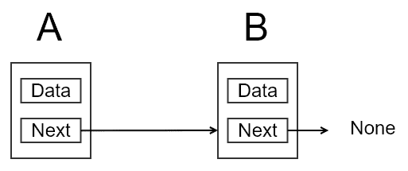
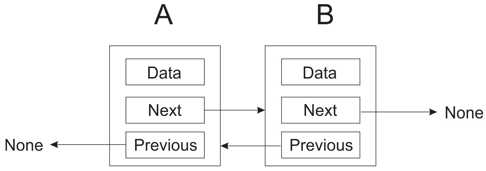
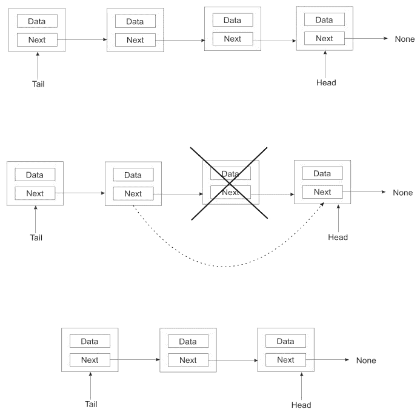
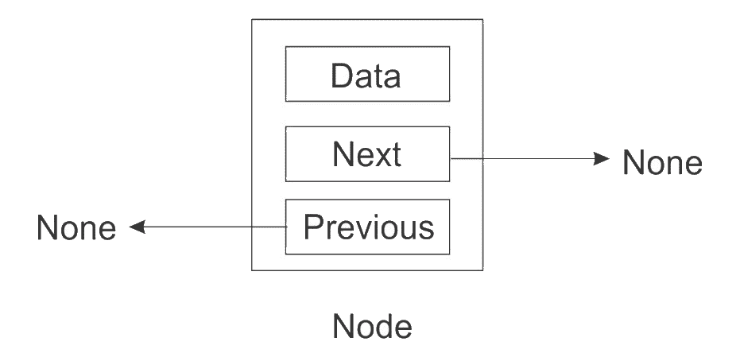
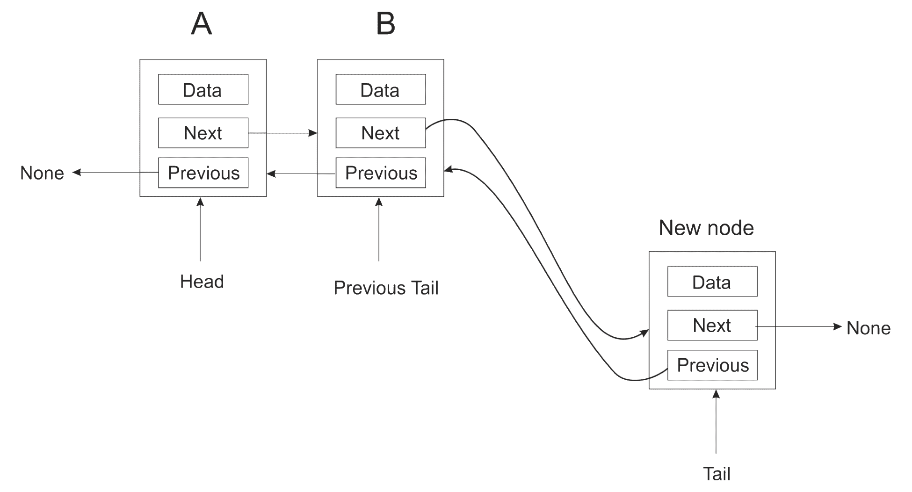
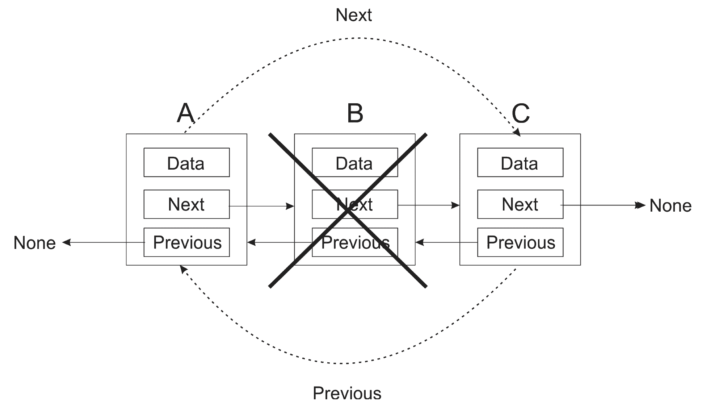
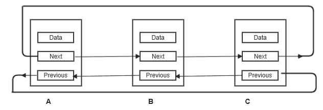

# 列表和指针结构

我们已经讨论了 Python 中的**列表**，这些列表方便且功能强大。通常，大多数情况下，我们使用 Python 的内置列表实现来存储任何数据。然而，在本章中，我们将了解列表是如何工作的，并将研究列表的内部结构。

Python 的列表实现非常强大，可以包含几个不同的用例。节点的概念在列表中非常重要。我们将在本章中讨论它们，并将在本书中提及它们。因此，我们建议读者仔细研究本章的内容。

本章的重点如下：

*   理解 Python 中的指针
*   理解节点的概念和实现
*   实现单链表、双链表和循环链表

# 技术要求

根据本章讨论的概念执行程序将有助于您更好地理解它们。我们提供了本章中所有程序和概念的源代码。我们还通过以下链接在 GitHub 上提供完整的源代码文件：[https://github.com/PacktPublishing/Hands-On-Data-Structures-and-Algorithms-with-Python-Second-Edition/tree/master/Chapter04](https://github.com/PacktPublishing/Hands-On-Data-Structures-and-Algorithms-with-Python-Second-Edition/tree/master/Chapter04) 。

我们假设您已经在系统上安装了 Python。

# 从一个例子开始

让我们提醒您指针的概念，因为我们将在本章中讨论它们。首先，想象你有一栋房子想卖掉。由于时间不够，您需要联系代理商以找到感兴趣的买家。所以，你捡起你的房子，交给经纪人，经纪人会把房子交给任何想买房子的人。你说可笑？现在假设您有一些处理图像的 Python 函数。因此，在函数之间传递高分辨率图像数据。

当然，你不能带着你的房子到处走。你要做的就是把房子的地址写在一张废纸上，交给经纪人。房子仍在原处，但包含房子方向的便条被传递。你甚至可以把它写在几张纸上。每一个都足够小，可以放进你的钱包，但它们都指向同一所房子。

事实证明，Python 领域的情况并没有太大的不同。这些大型图像文件保留在内存中的一个位置。

您要做的是创建变量，将这些图像的位置保存在内存中。这些变量很小，很容易在不同的函数之间传递。

这就是指针的最大好处，它们允许您用一个简单的内存地址指向一个可能很大的内存段。

计算机硬件中存在对指针的支持，称为间接寻址。

在 Python 中，与其他一些语言（如 C 或 Pascal）不同，您不直接操作指针。这导致一些人认为 Python 中没有使用指针。没有比这更离谱的了。在 Python 交互式 shell 中考虑这个任务：

```py
>>> s = set()
```

我们通常会说`s`是**集合**类型的变量。也就是说，`s`是一套。然而，这并不是绝对正确的；变量`s`相当于一个集合的引用（一个*安全*指针）。集合构造函数在内存中的某个位置创建集合，并返回该集合开始的内存位置。这就是存储在`s`中的内容。Python 对我们隐藏了这种复杂性。我们可以放心地假设`s`是一个集合，并且一切正常。

# 阵列

数组是数据的顺序列表。顺序意味着每个元素存储在内存中前一个元素之后。如果您的阵列非常大，并且内存不足，则可能无法找到足够大的存储空间来容纳整个阵列。这将导致问题。

当然，硬币的另一面是阵列速度非常快。由于每个元素都继承了内存中的前一个元素，因此不需要在不同的内存位置之间跳转。在您自己的实际应用程序中选择列表和数组时，这一点非常重要。

我们已经在[第 2 章](02.html)、*Python 数据类型和结构*中讨论了数组。我们查看了数组数据类型，并讨论了可以对其执行的各种操作。

# 指针结构

与数组相反，指针结构是可以在内存中展开的项的列表。这是因为每个项目都包含一个或多个指向结构中其他项目的链接。这些链接的类型取决于我们拥有的结构类型。如果我们处理的是链表，那么我们将拥有指向结构中下一个（可能是上一个）项的链接。在树的情况下，我们有父子链接以及兄弟链接

指针结构有几个好处。首先，它们不需要顺序存储空间。其次，当你向结构中添加更多的节点时，它们可以从小处开始任意增长。然而，指针的这种灵活性是有代价的。我们需要额外的空间来存储地址。例如，如果您有一个整数列表，则每个节点将通过存储一个整数以及一个用于存储指向下一个节点的指针的额外整数来占用空间。

# 节点

列表（以及其他一些数据结构）的核心是节点的概念。在我们进一步讨论之前，让我们先考虑一下这个想法。

首先，让我们考虑一个例子。我们将创建几个字符串：

```py
>>> a = "eggs"
>>> b = "ham"
>>> c = "spam"
```

现在有三个变量，每个变量都有一个唯一的名称、类型和值。目前，没有办法显示这些变量之间的关系。节点允许我们展示这些变量如何相互关联。节点是数据的容器，以及到其他节点的一个或多个链接。链接是指针。

一种简单的节点类型是只有到下一个节点的链接的节点。正如我们对指针所知，字符串实际上并不存储在节点中，而是有一个指向实际字符串的指针。考虑下面的图中的示例，其中有两个节点。第一个节点有一个指向存储在内存中的字符串（**卵**）的指针和另一个存储另一个节点地址的指针：


因此，这个简单节点的存储需求是两个内存地址。节点的数据属性是指向字符串**鸡蛋**和**火腿**的指针。

# 查找端点

我们已经创建了三个节点，一个包含**鸡蛋**，一个包含**火腿**，另一个包含**垃圾邮件**。**鸡蛋**节点指向**火腿**节点，火腿节点又指向**垃圾邮件**节点。但是**垃圾邮件**节点指向什么？因为这是列表中的最后一个元素，所以我们需要确保它的下一个成员有一个值来说明这一点。

如果我们让最后一个元素不指向任何东西，那么我们就把这个事实弄清楚了。在 Python 中，我们将使用特殊值**None**表示 nothing。考虑下面的图表。节点**B**是列表中的最后一个元素，因此指向**无**：



最后一个节点的下一个点指向**无**。因此，它是节点链中的最后一个节点。

# 节点类

下面是我们到目前为止讨论的一个简单的节点实现：

```py
class Node:

    def __init__ (self, data=None):
        self.data = data 
        self.next = None
```

**Next**指针被初始化为`None`，这意味着除非您更改**Next**的值，否则节点将成为端点。这是一个好主意，这样我们就不会忘记正确终止列表。

您可以根据需要向 node 类添加其他内容。只需确保记住节点和数据之间的区别。如果您的节点将包含客户数据，那么创建一个`Customer`类并将所有数据放在那里。

您可能要做的一件事是实现`_str_ `方法，以便在将节点对象传递到打印时调用包含对象的`_str_`方法：

```py
def _str_ (self):
   return str(data)
```

# 其他节点类型

我们已经讨论过一个节点，它有一个指向下一个节点的指针来链接数据项，但是，它可能是最简单的节点类型。此外，根据我们的需求，我们可以创建许多其他类型的节点。

有时我们想要从节点**A**到节点**B**，但同时我们可能需要从节点**B**到节点**A**。在这种情况下，除了**下一个**指针外，我们还添加了一个**上一个**指针：



如上图所示，除了数据和**下一个**指针外，我们还创建了***上一个**指针。还需要注意的是，指向**B**的**N****ext**指针是**None**，而节点**A**中的**上一个**指针也是**None**-也就是说，我们已经到达了列表的两个端点的边界。第一个节点**A**之前的指针指向**None**，因为它没有前置项，就像最后一个项目**B**下一个指针指向**None**一样因为它没有后续节点。*

 *# 介绍清单

列表是一种重要且流行的数据结构。链表有三种：单链表、双链表和循环链表。我们将在本章中更详细地讨论这些数据结构。我们还将在后面的小节中讨论各种重要操作，如`append`操作、`delete`操作以及可以在这些列表上执行的`traversing`和`searching`操作

# 单链表

单链表是两个连续节点之间只有一个指针的列表。它只能在一个方向上穿过；也就是说，可以从列表中的第一个节点移动到最后一个节点，但不能从最后一个节点移动到第一个节点。

实际上，我们可以使用前面创建的 node 类来实现一个非常简单的单链表。例如，我们创建了存储三个字符串的三个节点`n1`、`n2`和`n3`：

```py
>>> n1 = Node('eggs')
>>> n2 = Node('ham')
>>> n3 = Node('spam')
```

接下来，我们将节点链接在一起，以便它们形成一个链：

```py
>>> n1.next = n2
>>> n2.next = n3
```

要遍历列表，可以执行以下操作。我们首先将`current`变量设置为列表中的第一项，然后通过循环遍历整个列表，如下代码所示：

```py
current = n1  
while current:
     print(current.data)
     current = current.next
```

在循环中，我们打印出当前元素，然后设置`current`指向列表中的下一个元素。我们一直这样做，直到我们到达列表的末尾。

但是，这种过于简单的列表实现存在几个问题：

*   它需要程序员做太多的手工工作
*   它太容易出错（这是第一点的结果）
*   列表的太多内部工作向程序员公开

我们将在以下章节中讨论所有这些问题。

# 单链表类

列表是一个独立于节点的概念。我们首先创建一个非常简单的类来保存列表。我们从一个构造函数开始，该构造函数保存对列表中第一个节点的引用（即下面代码中的`tail`）。由于此列表最初为空，我们将首先将此引用设置为`None`：

```py
class SinglyLinkedList:
    def __init__ (self):
        self.tail = None
```

# 追加操作

我们需要执行的第一个操作是将项目附加到列表中。此操作有时称为插入操作。在这里我们有机会躲开`Node`班。我们列表类的用户应该永远不必与`Node`对象交互。这些纯粹是内部使用。

`append()`方法的第一次尝试可能如下所示：

```py
class SinglyLinkedList:
    # ...
    def append(self, data):
         # Encapsulate the data in a Node 
         node = Node(data)
         if self.tail == None:
             self.tail = node 
         else:
             current = self.tail 
             while current.next:
                 current = current.next 
             current.next = node
```

我们将数据封装在节点中，使其具有下一个指针属性。从这里，我们检查列表中是否存在任何现有节点（即，`self.tail`是否指向`Node`）。如果存在`None`，则将新节点作为列表的第一个节点；否则，我们通过遍历列表到最后一个节点，将最后一个节点的下一个指针更新到新节点来找到插入点。

考虑下面的示例代码来追加三个节点：

```py
>>> words = SinglyLinkedList()
>>> words.append('egg')
>>> words.append('ham')
>>> words.append('spam')
```

列表遍历将像我们前面讨论的那样工作。您将从列表本身获取列表的第一个元素，然后通过`next`指针遍历列表：

```py
>>> current = words.tail
>>> while current:
        print(current.data)
        current = current.next
```

# 更快的追加操作

上一节中的 append 方法有一个大问题：它必须遍历整个列表才能找到插入点。当列表中只有几个项目时，这可能不是问题，但当列表很长时，这将是一个大问题，因为我们每次都需要遍历整个列表来添加一个项目。每个附加都将比前一个稍慢。追加操作的当前实现被`O(n)`减慢，这在长列表的情况下是不可取的。

为了解决这个问题，我们不仅存储对列表中第一个节点的引用，还存储对最后一个节点的引用。这样，我们就可以在列表的末尾快速添加一个新节点。追加操作的最坏情况运行时间现在从`O(n)`减少到`O(1)`。我们所要做的就是确保前一个最后节点指向将要附加到列表中的新节点。以下是我们的更新代码：

```py
class SinglyLinkedList:
    def init (self):
        # ...
        self.tail = None

    def append(self, data):
        node = Node(data)
       if self.head:
            self.head.next = node 
            self.head = node
       else:
            self.tail = node 
            self.head = node
```

注意到正在使用的公约。我们添加新节点的点是通过`self.head`。`self.tail`变量指向列表中的第一个节点。

# 获取列表的大小

我们希望能够通过计算节点的数量来获得列表的大小。我们可以这样做的一种方法是遍历整个列表，并在执行过程中增加一个计数器：

```py
def size(self):
 count = 0
 current = self.tail
 while current:
     count += 1
     current = current.next 
 return count
```

这个很好用。然而，列表遍历可能是一项昂贵的操作，我们应该尽可能避免。因此，我们将选择对该方法进行另一次重写。我们向`SinglyLinkedList`类添加一个 size 成员，并在构造函数中将其初始化为`0`。然后在 append 方法中将大小增加 1：

```py
class SinglyLinkedList:
    def init (self):
        # ...
```

```py

        self.size = 0

    def append(self, data):
        # ...
        self.size += 1
```

因为我们现在只读取节点对象的 size 属性，而不使用循环来计算列表中的节点数，所以我们将最坏情况下的运行时间从`O(n)`减少到`O(1)`。

# 改进列表遍历

如果您注意到在前面的列表遍历中，我们将向客户机/用户公开节点类。然而，希望客户端节点不与节点对象交互。我们需要使用`node.data`获取节点的内容，`node.next`获取下一个节点。我们可以通过创建一个返回生成器的方法来访问数据。情况如下：

```py
def iter(self):
    current = self.tail 
    while current:
        val = current.data 
        current = current.next 
        yield val
```

现在，列表遍历更简单，看起来也更好。我们可以完全忽略一个事实，即列表之外有一个节点：

```py
for word in words.iter():
    print(word)
```

请注意，由于`iter()`方法生成节点的数据成员，因此我们的客户机代码根本不需要担心这一点。

# 删除节点

对列表执行的另一个常见操作是删除节点。这看起来很简单，但我们首先必须决定如何选择要删除的节点。它将由索引号或节点包含的数据确定吗？在这里，我们将根据节点包含的数据选择删除节点。

以下是从列表中删除节点时考虑的特殊情况的示意图：



当我们想要删除位于两个其他节点之间的节点时，我们所要做的就是使前一个节点指向要删除的下一个节点的后续节点。也就是说，我们只需从链中剪切要删除的节点，并直接指向下一个节点，如上图所示。

以下是`delete()`方法的实现情况：

```py
def delete(self, data): 
    current = self.tail 
    prev = self.tail 
    while current:
        if current.data == data:
            if current == self.tail:
                self.tail = current.next 
            else:
                prev.next = current.next 
            self.count -= 1
            return
        prev = current
        current = current.next
```

移除节点的`delete`操作具有时间复杂性`O(n).`

# 列表搜索

我们可能还需要一种方法来检查列表是否包含项目。由于我们之前编写的`iter()`方法，此方法相当容易实现。循环的每个过程都会将当前数据与正在搜索的数据进行比较。如果找到匹配项，则返回`True`，否则返回`False`：

```py
def search(self, data):
    for node in self.iter():
        if data == node:
            return True 
    return False
```

# 清理清单

我们可能需要尽快清理清单；有一个非常简单的方法。我们可以通过将指针的头和尾设置为`None`来清除列表：

```py
def clear(self):
    """ Clear the entire list. """
    self.tail = None
    self.head = None
```

# 双链表

我们已经讨论了单链表以及可以对其执行的重要操作。现在，我们将在本节中重点讨论双链接列表的主题

双链表与单链表非常相似，因为我们在一起使用相同的基本概念字符串节点，就像在单链表中一样。单链表和双链表之间的唯一区别在于，在单链表中，每个连续节点之间只有一个链接，而在双链表中，我们有两个指针—指向下一个节点的指针和指向前一个节点的指针。见*节点*下图；有一个指向下一个节点和上一个节点的指针，该指针被设置为`None`，因为没有节点连接到该节点。考虑下面的图表：



单链表中的节点只能确定与其关联的下一个节点。但是，没有方法或链接可以从此引用的节点返回。流的方向只是单向的。

在一个双链表中，我们解决了这个问题，并且不仅包括引用下一个节点的能力，还包括引用上一个节点的能力。考虑下面的示例图来理解两个连续节点之间的链接的性质。这里，节点**A**是引用节点**B**；此外，还有一个回节点**a**的链接：


由于存在指向下一个和上一个节点的两个指针，双链接列表就具备了某些功能。

双链接列表可以在任何方向上遍历。双链接列表中的节点可以在需要时轻松引用其前一个节点，而无需变量来跟踪该节点。但是，在单链接列表中，可能很难移回列表的开头或开头，以便在列表的开头进行一些更改，这在双链接列表中非常容易。

# 双链表节点

创建双链表节点的 Python 代码包括其初始化方法、`prev`指针、`next`指针和`data`实例变量。新建节点时，所有这些变量默认为`None`：

```py
class Node(object):
    def __init__ (self, data=None, next=None, prev=None):
       self.data = data 
       self.next = next 
       self.prev = prev
```

`prev`变量引用前一个节点，`next`变量保留对下一个节点的引用，`data`变量存储数据。

# 双链表类

双链表类捕获函数将在其上运行的数据。对于`size`方法，我们将 count 实例变量设置为`0`；它可以用来跟踪链表中项目的数量。`head`和`tail`将在开始向列表中插入节点时指向列表的开头和结尾。考虑下面的 Python 代码来创建一个类：

```py
class DoublyLinkedList(object):
    def init (self): 
        self.head = None
        self.tail = None
        self.count = 0
```

We adopt a new convention where `self.head` points to the beginner node of the list and `self.tail` points to the latest node added to the list. This is contrary to the convention we used in the singly linked list. There are no fixed rules as to the naming of the head and tail node pointers.

双链接列表还需要返回列表大小、在列表中插入项目以及从列表中删除节点的功能。我们将在以下小节中讨论并提供双链接列表上的重要功能和代码。让我们从追加操作开始。

# 追加操作

`append`操作用于在列表末尾添加元素，检查列表的`head`是否为`None`很重要。如果是`None`，则表示列表为空，否则列表中会有一些节点，列表中会追加一个新节点。如果一个新节点要添加到空列表中，它的`head`应该指向新创建的节点，列表的尾部也应该通过`head`指向这个新创建的节点。在这一系列步骤结束时，头部和尾部现在将指向同一个节点。下图说明了向空列表中添加新节点时双链接列表的`head`和`tail`指针：


以下代码用于将项目附加到双链接列表：

```py
def append(self, data):
    """ Append an item to the list. """

    new_node = Node(data, None, None)
    if self.head is None:
        self.head = new_node
        self.tail = self.head
    else:
        new_node.prev = self.tail 
        self.tail.next = new_node 
        self.tail = new_node
        self.count += 1
```

前面程序的`If`部分是在空节点上增加一个节点；如果列表不为空，则执行前面程序的`else`部分。如果要将新节点添加到列表中，则新节点的前一个变量将设置为列表的尾部：

```py
new_node.prev = self.tail
```

尾部的下一个指针（或变量）必须设置为新节点：

```py
self.tail.next = new_node
```

最后，我们更新尾部指针以指向新节点：

```py
self.tail = new_node
```

由于追加操作将节点数增加 1，因此我们将计数器增加 1：

```py
self.count += 1
```

下图显示了现有列表追加操作的可视表示形式：



# 删除操作

与单链表相比，双链表中的删除操作更容易

与单链表不同，在单链表中，我们需要在遍历列表的整个长度时跟踪以前遇到的节点，而双链表避免了整个步骤。这可以通过使用上一个指针来实现。

双链表中的`delete`操作可能会遇到以下四种情况：

*   在列表中找不到要删除的搜索项目
*   要删除的搜索项位于列表的开头
*   要删除的搜索项位于列表的末尾
*   要删除的搜索项位于列表中间。

要删除的节点是通过将数据实例变量与传递给方法的数据相匹配来标识的。如果数据与节点的数据变量匹配，则将删除该匹配节点。以下是从双链接列表中删除节点的完整代码。我们将逐步讨论此代码的每个部分：

```py
def delete(self, data):
    """ Delete a node from the list. """ 
    current = self.head 
    node_deleted = False 
    if current is None:       #Item to be deleted is not found in the list
        node_deleted = False 

    elif current.data == data:   #Item to be deleted is found at starting of list
        self.head = current.next  
        self.head.prev = None 
        node_deleted = True 

    elif self.tail.data == data:   #Item to be deleted is found at the end of list.
        self.tail = self.tail.prev  
        self.tail.next = None 
        node_deleted = True 
    else: 
        while current:          #search item to be deleted, and delete that node
            if current.data == data: 
                current.prev.next = current.next  
                current.next.prev = current.prev 
                node_deleted = True 
            current = current.next 

    if node_deleted: 
        self.count -= 1
```

最初，我们创建一个`node_deleted`变量来表示列表中已删除的节点，并将其初始化为`False`。如果找到匹配的节点，则将`node_deleted`变量设置为`True`并随后删除。在 delete 方法中，`current`变量最初设置为列表的`head`（即，它指向列表的`self.head`），请参见以下代码片段：

```py
def delete(self, data): 
    current = self.head 
    node_deleted = False
    ...
```

接下来，我们使用一组`if...else`语句来搜索列表的各个部分，以找到具有要删除的指定数据的节点。

首先，我们在`head`节点搜索要删除的数据，如果数据在`head`节点匹配，该节点将被删除。由于`current`指向`head`，如果`current`为`None`，则表示列表为空，没有节点可以找到要删除的节点。以下是其代码片段：

```py
if current is None:
  node_deleted = False
```

但是，如果`current`（现在指向 head）包含正在搜索的数据，这意味着我们在`head`节点找到了要删除的数据，那么`self.head`被标记为指向`current`节点。由于`head`后面现在没有节点，`self.head.prev`设置为`None`。考虑下面的代码片段：

```py
elif current.data == data: 
    self.head = current.next 
    self.head.prev = None
    node_deleted = True
```

类似地，如果在列表的`tail`端找到要删除的节点，我们通过将其上一个节点设置为指向`None`来删除最后一个节点。这是双链接列表中的`delete`操作中的第三种可能情况，该操作搜索要删除的节点时可能会在列表的末尾找到。`self.tail`设置为指向`self.tail.prev`，`self.tail.next`设置为`None`，因为后面没有节点。考虑下面的代码片段：

```py
elif self.tail.data == data:
   self.tail = self.tail.prev 
   self.tail.next = None
   node_deleted = True
```

最后，我们通过遍历整个节点列表来搜索要删除的节点。如果要删除的数据与某个节点匹配，则该节点将被删除。要删除一个节点，我们使用代码`current.prev.next = current.next`使`current`节点的前一个节点指向当前节点的下一个节点。在该步骤之后，我们使用`current.next.prev = current.prev`使当前节点的下一个节点指向`current`节点的前一个节点。考虑下面的代码片段：

```py
else
    while current:
       if current.data == data:
             current.prev.next = current.next 
             current.next.prev = current.prev 
             node_deleted = True
       current = current.next
```

为了更好地理解双链表中的删除操作的概念，请考虑下面的示例图。下图中有三个节点，**A**、**B**和**C**。为了删除节点中的节点 To6 T6，B，To.T7，我们将使 To.t8}作为节点的下一个节点，点为节点 To9To.To10-T11.，同时使 OrdT12Ac C To13T.指向 PoT T14。



在这样一次操作之后，我们将得到以下列表：


最后，检查`node_delete`变量，以确定是否确实删除了节点。如果删除了任何节点，则我们将 count 变量减少`1`，这将跟踪列表中的节点总数。请参阅以下代码片段，在删除任何节点的情况下，将 count 变量递减`1`：

```py
if node_deleted:
  self.count -= 1
```

# 列表搜索

在双链接列表中搜索项目的方式与我们在单链接列表中搜索项目的方式类似。我们使用`iter()`方法检查所有节点中的数据。当我们通过列表中的所有数据运行循环时，每个节点都与`contain`方法中传递的数据相匹配。如果我们在列表中找到该项，`True`返回，表示找到了该项，否则返回`False`，表示列表中没有找到该项。这方面的 Python 代码如下所示：

```py
def contain(self, data):
    for node_data in self.iter():
       if data == node_data:
       return True 
    return False
```

双链表中的追加操作具有运行时间复杂性`O(1)`，删除操作具有运行时间复杂性`O(n)`。

# 循环清单

循环链表是链表的特例。在循环链表中，端点彼此连接。这意味着列表中的最后一个节点指向第一个节点，也就是说，在循环链表中，所有节点都指向下一个节点（如果是双链表，则指向前一个节点），没有结束节点，因此没有节点指向`Null`。循环列表可以基于单链接列表和双链接列表。对于双链接循环列表，第一个节点指向最后一个节点，最后一个节点指向第一个节点。考虑循环链表的以下图，基于单链表，其中最后一个节点胡 t1 t1 c c Ty2 t2 再次连接到第一个节点 AUTT3。


下图显示了基于双链表的循环链表的概念，其中最后一个节点**C**通过`next`指针再次连接到第一个节点**a**。节点**A**也通过`previous`指针与节点**C**相连，形成循环列表：



这里，我们将看一个单链接循环列表的实现。一旦我们理解了基本概念，就可以直接实现双链接循环列表。

我们可以重用我们在单链表小节中创建的节点类。事实上，我们也可以重用`SinglyLinkedList`类的大部分部分。因此，我们将重点讨论循环列表实现不同于普通单链表的方法。

# 附加元素

要将元素附加到单链接列表中的循环列表中，我们只需包含一个新功能，以便新添加或附加的节点指向`tail`节点。下面的代码演示了这一点。与单链表实现相比，还有一行以粗体显示：

```py
def append(self, data): 
    node = Node(data)
    if self.head:
        self.head.next = node 
        self.head = node
    else:
       self.head = node
       self.tail = node

    self.head.next = self.tail 
    self.size += 1
```

# 删除循环列表中的元素

要删除循环列表中的节点，看起来我们可以像在追加操作中一样，只需确保`head`指向`tail`即可。删除操作中只有一行需要更改。只有当我们移除`tail`节点时，我们才需要确保`head`节点被更新为指向新的尾部节点。这将为我们提供以下实现（粗体字体代码行是单链表中删除操作实现的补充）：

```py
def delete(self, data): 
     current = self.tail 
     prev = self.tail 
       while current:
           if current.data == data:
              if current == self.tail:
                  self.tail = current.next 
                  self.head.next = self.tail
              else:
                  prev.next = current.next
              self.size -= 1 
              return
           prev = current
           current = current.next
```

然而，这段代码有一个严重的问题。对于循环列表，我们不能循环直到`current`变成`None`，因为对于循环链表，当前节点永远不会指向`None`。如果删除现有节点，您将看不到这一点，但尝试删除不存在的节点，您将陷入无限循环。

因此，我们需要找到一种不同的方法来控制`while`循环。我们无法检查`current`是否已到达`head`，因为这样它将永远不会检查最后一个节点。但是我们可以使用`prev`，因为它落后`current`一个节点。然而，有一种特殊情况。第一次循环迭代`current`和`prev`将指向同一个节点，即尾部节点。我们希望确保循环在这里运行，因为我们需要考虑单节点列表。更新后的 delete 方法现在如下所示：

```py
def delete(self, data): 
    current = self.tail 
    prev = self.tail
    while prev == current or prev != self.head:
        if current.data == data:
            if current == self.tail: 
                self.tail = current.next 
                self.head.next = self.tail
            else:
                prev.next = current.next 
                self.size -= 1
    return
    prev = current
    current = current.next
```

# 循环遍历循环列表

遍历循环链表非常方便，因为我们不需要寻找起点。我们可以从任何地方开始，当我们再次到达同一个节点时，我们只需要小心地停止遍历。我们可以使用与本章开头讨论的相同的`iter()`方法。它应该适用于我们的循环列表；唯一的区别是，当我们在循环列表中迭代时，我们必须提到一个退出条件，否则程序将陷入循环，它将无限期运行。我们可以使用一个计数器变量来设置退出条件。考虑下面的示例代码：

```py
words = CircularList() 
words.append('eggs') 
words.append('ham') 
words.append('spam')
counter = 0

for word in words.iter():
    print(word)
    counter += 1
    if counter > 1000:
        break
```

一旦我们打印出 1000 个元素，我们就打破了循环。

# 总结

在本章中，我们研究了链表。我们研究了列表的基础概念，例如节点和指向其他节点的指针。我们实现了这些类型的列表中发生的主要操作，并查看了最坏情况下的运行时间比较。

在下一章中，我们将研究通常使用列表、堆栈和队列实现的另外两种数据结构。*