# 六、树

**树**是数据结构的分层形式。对于我们到目前为止讨论过的其他数据结构，如列表、队列和栈，这些项是按顺序存储的。然而，在树数据结构的情况下，项目之间存在*父子*关系。树数据结构的顶部称为**根节点**。这是树中所有其他节点的祖先。

树型数据结构因其在各种重要应用中的应用而非常重要。树用于许多事情，例如解析表达式、搜索、存储数据、操作数据、排序、优先级队列等等。某些文档类型，如 XML 和 HTML，也可以用树的形式表示。在本章中，我们将介绍树木的一些用途。

在本章中，我们将介绍以下主题：

*   树木的术语和定义
*   二叉树和二叉搜索树
*   树遍历
*   三元搜索树

# 技术要求

本章中讨论的所有源代码都在本书的 GitHub 存储库中的[中提供 https://github.com/PacktPublishing/Hands-On-Data-Structures-and-Algorithms-with-Python-3.x-Second-Edition/tree/master/Chapter06](https://github.com/PacktPublishing/Hands-On-Data-Structures-and-Algorithms-with-Python-3.x-Second-Edition/tree/master/Chapter06) 。

# 术语

让我们考虑一些与树型数据结构相关的术语。

要理解树，我们首先需要理解与树相关的基本概念。树是一种数据结构，其中数据以分层形式组织。下图包含一个典型的树，由字母为**A**到**M**的字符节点组成：

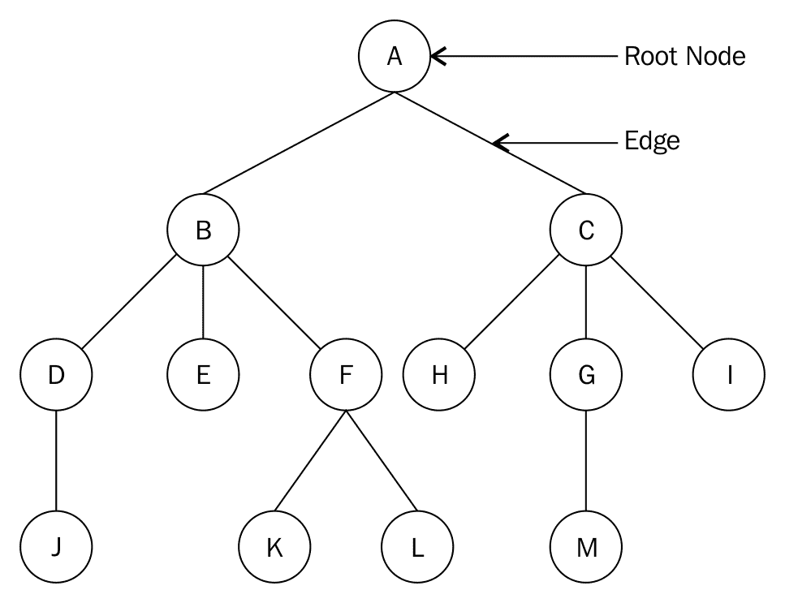

以下是与树关联的术语列表：

*   **节点**：上图中每个带圆圈的字母代表一个节点。节点是实际存储数据的任何数据结构。
*   **根节点**：根节点是树中所有其他节点连接的第一个节点。在每棵树中，总是有一个唯一的根节点。我们示例树中的根节点是节点 A。
*   **子树**：树的子树是一棵树，其节点是另一棵树的后代。例如，节点 F、K 和 L 构成由所有节点组成的原始树的子树。
*   **度**：给定节点的子节点总数称为该节点的**度。一棵树只有一个节点，其度为 0。上图中节点 A 的阶数为 2，节点 B 的阶数为 3，节点 C 的阶数为 3，类似地，节点 G 的阶数为 1。**
*   **叶节点**：叶节点没有子节点，是给定树的终端节点。叶节点的阶数始终为 0。在上图中，节点 J、E、K、L、H、M 和 I 都是叶节点。
*   **边缘**：树中任意给定两个节点之间的连接称为**边缘**。给定树中的边总数最多比树中的节点总数少一个。前面的示例树结构中显示了一个示例边。
*   **父**：树中具有另一子树的节点是该子树的父节点。例如，节点 B 是节点 D、E 和 F 的父节点，节点 F 是节点 K 和 L 的父节点
*   **子**：这是一个连接到其父节点的节点，是该节点的后代节点。例如，节点 B 和 C 是节点 A 的子节点，而节点 H、G 和 I 是节点 C 的子节点
*   **同级**：父节点相同的节点都是同级节点。例如，节点 B 和 C 是兄弟节点，同样，节点 D、E 和 F 也是兄弟节点
*   **级别**：树的根节点被认为处于级别 0。根节点的子节点在级别 1 考虑，级别 1 的子节点在级别 2 考虑，依此类推。例如，根节点位于级别 0，节点 B 和 C 位于级别 1，节点 D、E、F、H、G 和 I 位于级别 2。
*   **树高**：树的最长路径上的节点总数为树高。例如，在前面的示例树中，树的高度是 4，因为最长路径，`A-B-D-J`或`A-C-G-M`或`A-B-F-K`都有 4 个节点。
*   **深度**：节点的深度是从树根到该节点的边数。在前面的树示例中，节点 H 的深度为 2。

我们将从考虑树中的节点和抽象类开始处理树。

# 树节点

在线性数据结构中，数据项按顺序依次存储，而非线性数据结构按非线性顺序存储数据项，其中一个数据项可以连接到多个数据项。线性数据结构中的所有数据项都可以在一次过程中遍历，而在非线性数据结构的情况下这是不可能的。树是非线性的数据结构；它们存储的数据不同于其他线性数据结构，如*数组*、*列表、**栈、*和*队列。*

在树数据结构中，节点以*父子*关系排列。树中的节点之间不应存在任何循环。树结构有节点形成层次结构，没有节点的树称为**空树**。

首先，我们将讨论一种最重要、最特殊的树，即*二叉树。*二叉树是节点的集合，其中树中的节点可以有零、1 或 2 个子节点。简单二叉树最多有两个子树，即左子树和右子树。例如，在下面的二叉树示例中，有一个根节点有两个子树（左子树和右子树）：


如果一棵二叉树的所有节点都有零个或两个子节点，并且没有节点有`1`子节点，则称之为**完全****二叉树**。如果一棵二叉树完全填充，则称之为**完全二叉树**，最底层可能存在异常，从左到右填充。

就像在我们以前的实现中一样，节点是数据的容器，并保存对其他节点的引用。在二叉树节点中，这些引用指向左、右两个子节点。让我们看一下以下用 Python 构建二叉树`node`类的代码：

```py
    class Node: 
        def __init__(self, data): 
            self.data = data 
            self.right_child = None 
            self.left_child = None 
```

要测试这个类，我们必须首先创建四个节点-`n1`、`n2`、`n3`和`n4`：

```py
    n1 = Node("root node")  
    n2 = Node("left child node") 
    n3 = Node("right child node") 
    n4 = Node("left grandchild node") 
```

接下来，我们根据二叉树的属性将节点彼此连接起来。我们将`n1`作为根节点，将`n2`和`n3`作为其子节点。最后，我们将`n4`作为`n2`的左撇子。查看下图，了解如何将这些节点相互连接：

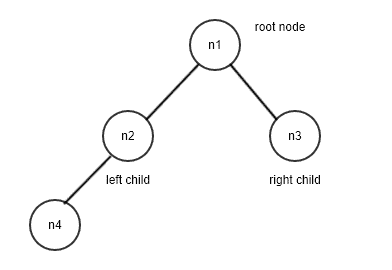

下一个代码段应如下所示，以便根据上图将节点相互连接：

```py
    n1.left_child = n2 
    n1.right_child = n3 
    n2.left_child = n4 
```

在这里，我们设置了一个非常简单的四节点树结构。我们希望在树上执行的第一个重要操作是遍历。为了理解遍历，让我们遍历这个二叉树的左子树。我们将从根节点开始，打印出节点，然后沿着树向下移动到左下一个节点。我们一直这样做，直到到达左子树的末尾，如下所示：

```py
    current = n1 
    while current: 
        print(current.data) 
        current = current.left_child 
```

遍历前面代码块的输出如下：

```py
root node 
left child node 
left grandchild node
```

# 树遍历

访问树中所有节点的方法称为**树遍历**。可以进行**深度优先****搜索**（**DFS**）或**广度优先搜索**（**BFS**）。我们将在后面的小节中讨论这两种方法。

# 深度优先遍历

在深度优先遍历中，我们从根开始遍历树，并在每个子级上尽可能深入到树中，然后继续遍历到下一个同级。我们使用递归方法进行树遍历。深度优先遍历有三种形式，即顺序、预序和后序。

# 顺序遍历和中缀表示法

为了使树遍历工作如下。首先，我们检查当前节点是否为 null 或空。如果不是空的，我们就遍历树。为了进行树遍历，我们遵循以下步骤：

1.  我们开始遍历左子树并递归调用`inorder`函数
2.  接下来，我们访问根节点
3.  最后，我们遍历右子树并递归调用`inorder`函数

简而言之，为了遍历树，我们按照（左子树、根、右子树）的顺序访问树中的节点

让我们考虑一个例子来理解树遍历的顺序：


在顺序遍历的示例二叉树中，首先，我们递归地访问根节点**A**的左子树。节点**A**的左子树以节点**B**为根，因此我们再次转到根节点**B**的左子树，即节点**D**。我们递归地转到根节点**D**的左子树，得到根节点**D**的左子树。所以，我们首先访问左边的子节点，即**G**，然后访问根节点**D**，然后访问右边的子节点**H**。

接下来，我们访问节点**B**，然后访问节点**E**。通过这种方式，我们访问了具有根节点**A**的左子树。那么接下来我们访问根节点**A**。之后，我们将访问根节点为**A**的右子树。在这里，我们转到根节点**C**的左边子树，它是空的，所以接下来我们访问节点**C**，然后访问节点**C**的右边子节点，即节点**F**。

因此，该示例树的顺序遍历为`G–D-H-B-E-A-C-F`。

返回树中节点的`inorder`列表的递归函数的 Python 实现如下所示：

```py
    def inorder(self, root_node): 
        current = root_node 
        if current is None: 
            return 
        self.inorder(current.left_child) 
        print(current.data) 
        self.inorder(current.right_child) 
```

我们通过打印已访问的节点来访问该节点。在这种情况下，我们首先使用`current.left_child`递归调用`inorder`函数，然后访问根节点，最后再次使用`current.right_child`递归调用`inorder`函数。

**中缀**表示法（也称为反向波兰表示法）是一种常用的表示算术表达式的表示法，其中运算符位于操作数之间。使用这种表示算术表达式的方式是很常见的，因为这是我们在学校通常教授的方式。例如，运算符在操作数之间插入（中缀），如`3 + 4`中所示。必要时，可以使用括号构建更复杂的表达式，如`(4 + 5) * (5 - 3)`。

表达式树是一种特殊的**二叉树**，可用于表示算术表达式。这是为了遍历表达式树生成中缀符号。例如，考虑下面的表达式树：


前面表达式树的顺序遍历为我们提供了中缀符号，即`(5 + 3)`。

# 预序遍历和前缀表示法

预排序树遍历的工作如下。首先，我们检查当前节点是否为 null 或空。如果不是空的，我们就遍历树。预订单树遍历的工作原理如下：

1.  我们从根节点开始遍历
2.  接下来，我们遍历左子树，用左子树递归调用`preorder`函数
3.  接下来，我们访问右子树，并使用右子树递归调用`preorder`函数

因此，为了以预排序模式遍历树，我们按照根节点、左子树和右子树节点的顺序访问树

考虑下面的示例树来理解预序遍历：


在前面的二叉树示例中，首先，我们访问根节点**a**。接下来，我们转到根节点**A**的左子树。节点**A**的左子树以节点**B**为根，因此我们访问该根节点并转到根节点**B**的左子树，即节点**D**。然后我们访问节点**D**并转到根节点**D**的左子树，然后我们访问左子**G**，这是根节点**D**的子树。接下来，我们访问具有根节点**D**的子树的右个子树，即节点**H**。接下来，我们访问具有根节点**B**的子树的右个子树，即节点**E**。这样，我们就访问了根节点**A**和根节点**A**的左子树。现在，我们将访问根节点**A**的右子树。在这里，我们访问根节点**C**，然后我们访问根节点**C**的左侧子树，该子树为空，因此接下来我们访问节点**C**的右侧子节点，即节点**F**。

此示例树的预顺序遍历将为`A-B-D-G-H-E-C-F`。

`pre-order`树遍历的递归函数如下：

```py
    def preorder(self, root_node): 
        current = root_node 
        if current is None: 
            return 
        print(current.data) 
        self.preorder(current.left_child) 
        self.preorder(current.right_child) 
```

前缀表示法通常称为波兰语表示法。在这种表示法中，运算符位于其操作数之前。LISP 程序员非常熟悉前缀表示法。例如，将两个数字 3 和 4 相加的算术表达式将显示为`+ 3 4`。由于优先级没有歧义，因此不需要括号：`* + 4 5 - 5 3`。

让我们考虑另一个例子，即，{ T0}。这也可以在前缀表示法中表示为`* (+ 3 4) 5`

表达式树的预序遍历会导致算术表达式的前缀表示法。例如，考虑下面的表达式树：


前一棵树的前序遍历将以前缀表示法给出表达式`+- 8 3 3`。

# 后序遍历和后缀表示法

`Post-order`树遍历工作如下。首先，我们检查当前节点是否为 null 或空。如果不是空的，我们就遍历树。`Post-order`树木穿越工作如下：

1.  我们开始遍历左子树并递归调用`postorder`函数

2.  接下来，我们遍历右子树并递归调用 postorder 函数
3.  最后，我们访问根节点

所以简而言之，关于`post-order`树遍历，我们按照左子树、右子树的顺序访问树中的节点，最后访问根节点

考虑下面的示例树来理解后序树遍历：


在上图中，我们首先递归访问根节点**A**的左子树。我们到达最后一个左子树，即根节点 D，然后访问它的左节点，即节点**G**。然后，我们访问正确的子节点 H，然后访问根节点 D。按照相同的规则，我们接下来访问节点**B**的正确子节点，即节点**E**。然后，我们访问节点**B**。在此基础上，我们遍历节点**A**的右子树。在这里，我们首先到达右最后一个子树并访问节点**F**，然后访问节点**C**。最后，我们访问根节点**A**。

此示例树的后序遍历将为`G-H-D-E-B-F-C-A`。

树遍历的`post-order`方法实现如下：

```py
    def postorder(self, root_node): 
        current = root_node 
        if current is None: 
            return 
        self.postorder(current.left_child) 
        self.postorder(current.right_child) 

        print(current.data)
```

后缀或**反向波兰符号**（**RPN**）将运算符放在其操作数之后，如`3 4 +`中所示。与波兰语符号一样，对运算符的优先级没有进一步的混淆，因此不需要括号：`4 5 + 5 3 - *`。

以下表达式树的后序遍历将给出算术表达式的后缀表示法：


前面表达式树的后缀符号为`8 3 -3 +`。

# 宽度优先遍历

宽度优先遍历从树的根开始，然后访问下一级树上的每个节点。然后，我们移动到树中的下一个级别，依此类推。这种树遍历是广度优先的，因为它在深入树之前遍历一个级别中的所有节点，从而使树变宽

让我们考虑下面的示例树，并使用广度优先遍历方法遍历它：


在上图中，我们首先访问**级别 0**的根节点，即值为**4**的节点。我们通过打印其值来访问此节点。接下来，我们移动到**级别 1**并访问该级别上的所有节点，即值为**2**和**8**的节点。最后，我们移动到树中的下一个级别，即**级别 3**，并访问该级别的所有节点。该层节点为**1**、**3**、**5**和**10**。

因此，该树的宽度优先树遍历如下-**4**、**2**、**8**、**1**、**3**、**5**和**10**。

这种遍历模式是使用队列数据结构实现的。从根节点开始，我们将其推送到队列中。队列前面的节点将被访问（退出队列）并打印或存储以供以后使用。左侧节点添加到队列中，然后是右侧节点。因为队列不是空的，所以我们重复这个过程。

该算法的 Python 实现将根节点**4**入队，出队，并访问该节点。接下来，节点**2**和**8**被排队，因为它们分别是下一级的左节点和右节点。节点**2**已退出队列以便可以访问。接下来，其左侧和右侧节点，即节点**1**和**3**排队。此时，队列前面的节点为**8**。我们出列并访问节点**8**，然后对其左侧和右侧节点进行排队。此过程将继续，直到队列为空。

宽度优先遍历的 Python 实现如下所示：

```py
    from collections import deque 
    class Tree: 
        def breadth_first_traversal(self): 
            list_of_nodes = [] 
            traversal_queue = deque([self.root_node]) 
```

我们将根节点排队，并在`list_of_nodes`列表中保留访问节点的列表。`dequeue`类用于维护队列：

```py
        while len(traversal_queue) > 0: 
            node = traversal_queue.popleft() 
            list_of_nodes.append(node.data) 
               if node.left_child: 
                traversal_queue.append(node.left_child) 

            if node.right_child: 
                traversal_queue.append(node.right_child) 
        return list_of_nodes
```

如果`traversal_queue`中的元素数大于零，则执行循环体。队列前面的节点弹出并附加到`list_of_nodes`列表中。如果左节点提供的`node`存在，则第一条`if`语句将`enqueue`左子节点。第二条`if`语句对右侧子节点执行相同的操作。

`list_of_nodes`列表在最后一条语句中返回。

# 二叉树

二叉树是每个节点最多有两个子节点的树。二叉树中的节点以左子树和右子树的形式组织。如果树有根 R 和两个子树，即左子树`T1`和右子树`T2`，则它们的根分别称为`left successor`和`right successor`

下图是具有五个节点的二叉树示例：

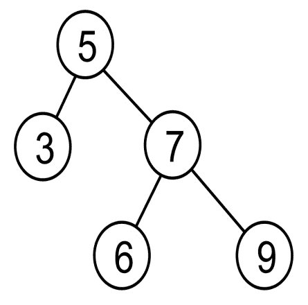

以下是我们对上图的观察结果：

*   如果节点不存在，则每个节点保留对左右节点的引用
*   根节点用**5**表示
*   根节点有两个子树，左子树有一个节点，即一个值为**3**的节点，右子树有三个值为**7**、**6**和**9**的节点
*   值为**3**的节点为左后继节点，值为**7**的节点为右后继节点

对于元素在树中的排列方式，常规二叉树没有其他规则。它应该只满足每个节点最多有两个子节点的条件。

# 二叉搜索树

**二叉搜索树**（**BST**是一种特殊的二叉树。它是计算机科学应用中最重要和最常用的数据结构之一。二叉搜索树是一种结构上为二叉树的树，在其节点中非常有效地存储数据。它提供了非常快速的搜索操作，其他操作（如插入和删除）也非常简单方便。

如果二叉树中任何节点的值大于其左子树所有节点的值，且小于或等于右子树所有节点的值，则称为二叉搜索树。例如，如果**K1**、**K2**和**K3**是三节点树中的键值（如下图所示），则应满足以下条件：

1.  *K2<的键值=K1*
2.  键值*K3>K1*

下图描述了这一点：

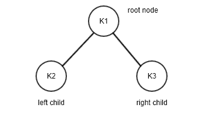

让我们考虑另一个例子，以便我们更好地理解二叉搜索树。考虑下面的树：


这是 BST 的一个示例。在此树中，左子树中的所有节点都小于或等于该节点的值。此外，此节点的右子树中的所有节点都大于父节点的节点

在测试树的 BST 属性时，我们注意到根节点的左子树中的所有节点的值都小于 5。同样，右子树中的所有节点的值都大于 5。此属性适用于 BST 中的所有节点，没有例外。

考虑另一个二叉树的例子，让我们看看它是否是一个二叉搜索树。尽管下图与前一个图相似，但由于节点**7**大于根节点**5**，因此不符合 BST 的条件；但是，它位于根节点的左侧。节点**4**在其父节点**7**的右子树上，不正确。因此，下图不是二进制搜索树：

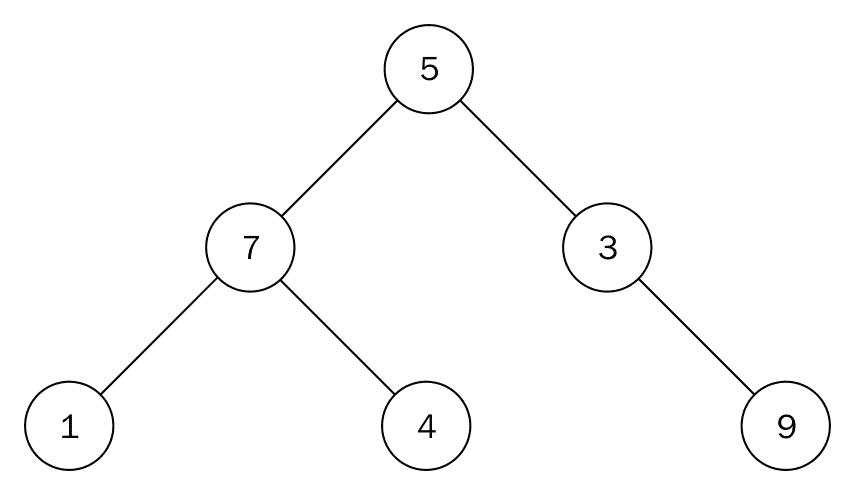

# 二叉搜索树的实现

让我们开始用 Python 实现 BST。我们需要跟踪树的根节点，因此我们首先创建一个`Tree`类来保存对根节点的引用：

```py
    class Tree: 
        def __init__(self): 
            self.root_node = None 
```

这就是保持树状态所需的全部内容。让我们在下一节中检查树上的主要操作。

# 二叉搜索树操作

可以在二元搜索树上执行的操作有`insert`、`delete`、`finding min`、`finding max`、`searching`等。我们将在后面的小节中讨论它们。

# 查找最小和最大节点

二叉搜索树的结构使得搜索具有最大值或最小值的节点非常容易

为了找到树中具有最小值的节点，我们从树的根开始遍历，每次都访问左侧节点，直到到达树的末尾。类似地，我们递归地遍历右子树，直到到达终点，以找到树中具有最大值的节点。

例如，考虑下面的图表；我们从节点**6**向下移动到**3**，然后从节点**3**向下移动到**1**找到值最小的节点。同样，为了从树中找到最大值节点，我们从树的根向下到树的右侧，然后从节点**6**到节点**8**，然后从节点**8**到节点**10**找到值最大的节点。下面是一个 BST 树示例：

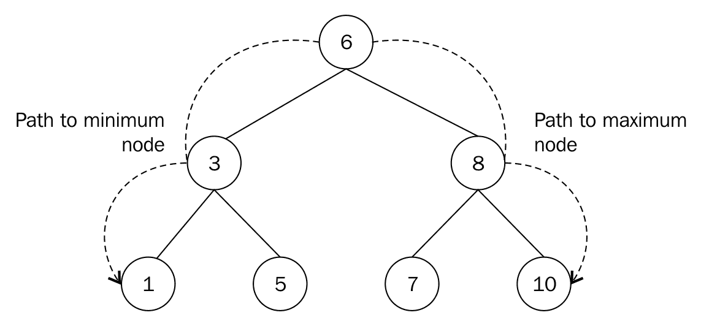

查找最小和最大节点的概念也适用于子树。因此，具有根节点**8**的子树中的最小节点是节点**7**。类似地，该子树中具有最大值的节点是**10**。

返回最小节点的方法的 Python 实现如下所示：

```py
    def find_min(self): 
        current = self.root_node 
        while current.left_child: 
            current = current.left_child 

        return current 
```

`while`循环继续获取左节点并访问它，直到最后一个左节点指向`None`。这是一个非常简单的方法。

类似地，以下是返回最大节点的方法的代码：

```py
    def find_max(self): 
        current = self.root_node 
        while current.right_child: 
            current = current.right_child 

        return current 
```

在 BST 中查找最小值或最大值的运行时间复杂度为 O（*h*，其中`h`是树的高度。

基本上还有两个其他操作，即`insert`和`delete`，它们对 BST 非常重要。在树上应用这些操作时，确保维护 BST 树的属性非常重要。

# 插入节点

在二叉搜索树上实现的最重要的操作之一是在树中插入数据项。正如我们已经讨论过的，关于二叉搜索树的属性，对于树中的每个节点，左侧子节点包含的数据应小于其自身值，右侧子节点包含的数据应大于其自身值。因此，每当我们在二叉搜索树中插入一个项时，我们必须确保二叉搜索树的属性满足。

例如，我们通过在树中插入数据项**5**、**3**、**7**和**1**来创建一个二元搜索树。考虑以下事项：

1.  **插入 5:**我们从第一个数据项**5**开始。为此，我们将创建一个数据属性设置为**5**的节点，因为它是第一个节点。
2.  **插入 3:**现在，我们要添加第二个值为**3**的节点，以便将数据值**3**与根节点的现有节点值**5**进行比较：

由于节点值**3**小于**5**，将其放置在节点**5**的左子树中。我们的 BST 将如下所示：


树满足 BST 规则，其中左子树中的所有节点都小于父节点。

3.  **插入 7:**要将另一个值为**7**的节点添加到树中，我们从值为**5**的根节点开始进行比较：

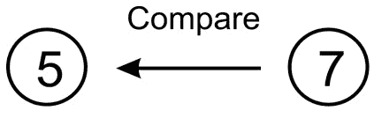

由于**7**大于**5**，因此将值为**7**的节点置于该根的右侧

4.  **插入 1:**让我们添加另一个值为**1**的节点。从树根开始，我们对**1**和**5**进行比较：


此比较显示**1**小于**5**，因此我们转到**5**的左侧节点，该节点的值为**3**：


当我们将**1**与**3**进行比较时，由于**1**小于**3**，我们在节点**3**下方向左移动了一个级别。但是，那里没有节点。因此，我们创建一个值为**1**的节点，并将其与节点**3**的左指针关联，以获得以下结构。这里有**4**节点的最终二叉搜索树：

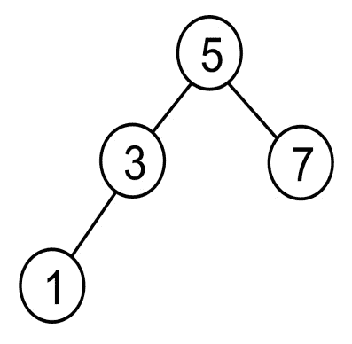

我们可以看到这个例子只包含整数或数字。因此，如果我们需要将字符串数据存储在二进制搜索树中，在这种情况下，字符串将按字母顺序进行比较。而且，如果我们想在 BST 中存储我们自己的自定义数据类型，我们必须确保我们的类支持排序。

`insert`方法在 BST 中添加节点的 Python 实现如下：

```py
def insert(self, data):
    node = Node(data) 
    if self.root_node is None: 
        self.root_node = node 
    else: 
        current = self.root_node 
        parent = None  
    while True: 
        parent = current 
        if node.data < parent.data: 
            current = current.left_child 
            if current is None: 
                    parent.left_child = node 
                    return 
            else: 
                    current = current.right_child 
                    if current is None: 
                        parent.right_child = node 
                        return
```

现在，让我们一步一步地理解这个`insert`函数的每个指令。我们将从函数声明开始：

```py
    def insert(self, data):
```

现在，您将习惯于将数据封装在节点中这一事实。这样，我们将`node`类隐藏在客户机代码之外，客户机代码只需要处理树：

```py
        node = Node(data) 
```

将进行第一次检查，以确定是否有根节点。否则，新节点将成为根节点（没有根节点的树是不可能的）：

```py
        if self.root_node is None: 
            self.root_node = node 
        else: 
```

当我们沿着树走下去时，我们需要跟踪我们正在处理的当前节点及其父节点。`current`变量始终用于此目的：

```py
        current = self.root_node 
        parent = None 
        while True: 
            parent = current 
```

在这里，我们必须进行比较。如果新节点中保存的数据少于当前节点中保存的数据，那么我们将检查当前节点是否有左子节点。如果没有，这就是我们插入新节点的地方。否则，我们将继续遍历：

```py
        if node.data < current.data: 
            current = current.left_child 
            if current is None: 
                parent.left_child = node 
                return 
```

现在，我们需要处理大于或等于的情况。如果当前节点没有正确的子节点，则新节点将作为正确的子节点插入。否则，我们向下移动并继续查找插入点：

```py
        else: 
            current = current.right_child 
            if current is None: 
                parent.right_child = node 
                return 
```

在 BST 中插入节点需要`O(h)`，其中`h`是树的高度。

# 删除节点

BST 上的另一个重要操作是节点的`deletion`或`removal`。在此过程中，我们需要考虑三种情况。要删除的节点可能具有以下内容：

*   **无子节点**：如果没有叶子节点，直接移除该节点
*   **一个子**：在这种情况下，我们将该节点的值与其子节点交换，然后删除该节点
*   **两个子**：在这种情况下，我们首先找到顺序继承者或前置者，与之交换值，然后删除该节点

第一种情况最容易处理。如果要删除的节点没有子节点，我们只需将其从其父节点中删除：

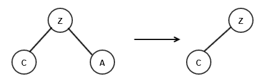

在前面的示例中，节点**A**没有子节点，因此我们只需将其从父节点**Z**中删除即可。

另一方面，当我们要移除的节点有一个子节点时，该节点的父节点将指向该特定节点的子节点。让我们来看看下面的图表，在这里我们想删除节点 ORT T0。6 个 Ty1 T1。谁有一个孩子，即，节点 ORT T2。5


为了删除以节点**5**为唯一子节点的节点**6**，我们将节点**9**的左指针指向节点**5**。这里，我们需要确保子和父关系遵循二叉搜索树的属性。

当我们要删除的节点有两个子节点时，会出现更复杂的情况。考虑下面的示例树，在这里我们想删除节点 AUT0 T0。9

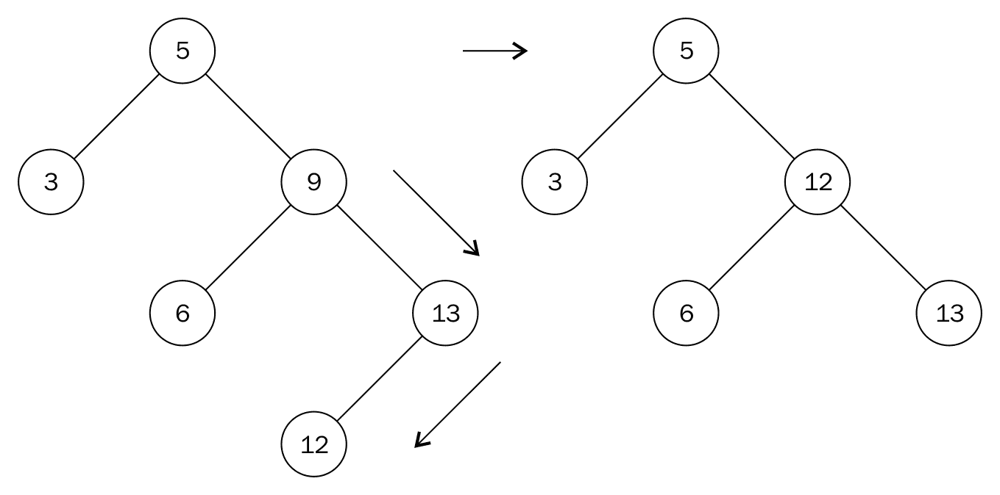

我们不能简单地将节点**9**替换为节点**6**或**13**。我们需要做的是找到节点**9**的下一个最大后代。这是节点**12**。为了到达节点**12**，我们移动到节点**9**的右侧节点。然后，我们向左移动以找到最左边的节点。节点**12**被称为节点**9**的顺序后继节点。第二步类似于在子树中查找最大节点的移动。

我们将节点**9**的值替换为**12**的值，并移除节点**12**。在移除节点**12**后，我们最终得到了一种更简单的节点移除形式，这在前面已经提到过。节点 12 没有子节点，因此我们相应地应用删除没有子节点的节点的规则。

我们的`node`类没有对父类的引用。因此，我们需要使用 helper 方法来`search`并返回节点及其父节点。此方法类似于`search`方法：

```py
    def get_node_with_parent(self, data): 
        parent = None 
        current = self.root_node 
        if current is None: 
            return (parent, None) 
        while True: 
            if current.data == data: 
                return (parent, current) 
            elif current.data > data: 
                parent = current 
                current = current.left_child 
            else: 
                parent = current 
                current = current.right_child 

        return (parent, current) 
```

唯一的区别是，在更新循环中的当前变量之前，我们将其父变量存储为`parent = current`。实际删除节点的方法从以下搜索开始：

```py
    def remove(self, data): 
        parent, node = self.get_node_with_parent(data) 

        if parent is None and node is None: 
            return False 

        # Get children count 
        children_count = 0 

        if node.left_child and node.right_child: 
            children_count = 2 
        elif (node.left_child is None) and (node.right_child is None): 
            children_count = 0 
        else: 
            children_count = 1 
```

我们通过`parent, node = self.get_node_with_parent(data)`行将父节点和找到的节点分别传递给`parent`和`node`。重要的是要知道节点中要删除的子节点的数量，我们在`if`语句中这样做。

在我们知道一个节点要删除的子节点的数量之后，我们需要处理可以删除节点的各种条件。`if`语句的第一部分处理节点没有子节点的情况：

```py
        if children_count == 0: 
            if parent: 
                if parent.right_child is node: 
                    parent.right_child = None 
                else: 
                    parent.left_child = None 
            else: 
                self.root_node = None
```

如果要删除的节点只有一个子节点，`if`语句的`elif`部分执行以下操作：

```py
        elif children_count == 1: 
            next_node = None 
            if node.left_child: 
                next_node = node.left_child 
            else: 
                next_node = node.right_child 

            if parent: 
                if parent.left_child is node: 
                    parent.left_child = next_node 
                else: 
                    parent.right_child = next_node 
            else: 
                self.root_node = next_node 
```

`next_node`用于跟踪单个节点。它是要删除的节点的子节点。然后我们将`parent.left_child`或`parent.right_child`连接到`next_node`。

最后，我们处理要删除的节点有两个子节点的情况：

```py
        ... 
        else: 
            parent_of_leftmost_node = node 
            leftmost_node = node.right_child 
            while leftmost_node.left_child: 
                parent_of_leftmost_node = leftmost_node 
                leftmost_node = leftmost_node.left_child 

            node.data = leftmost_node.data 
```

在查找顺序后继节点时，我们使用`leftmost_node = node.right_child`移动到右侧节点。只要存在左节点，`leftmost_node.left_child`将计算为`True`，并且`while`循环将运行。当我们到达最左边的节点时，它要么是一个叶节点（意味着它没有子节点），要么是一个右子节点。

我们将要删除的节点更新为顺序后续节点的值`node.data = leftmost_node.data`：

```py
    if parent_of_leftmost_node.left_child == leftmost_node: 
       parent_of_leftmost_node.left_child = leftmost_node.right_child 
    else: 
       parent_of_leftmost_node.right_child = leftmost_node.right_child
```

前面的语句允许我们将最左侧节点的父节点与任何子节点正确连接。观察等号右侧如何保持不变。这是因为顺序继承人只能有一个正确的子女作为其唯一的子女。

`remove`操作取`O(*h*)`，其中`h`为树的高度。

# 搜索树

二叉搜索树是一种树数据结构，其中所有节点都遵循这样的属性：节点左子树中的所有节点的键值较低，而其右子树中的键值较大。因此，搜索具有给定键值的元素非常容易。让我们考虑一个示例性的二叉搜索树，该节点具有节点 T0（1），T1，2，3，3，3，5，5，5，5，5，5，4，7，7，4，2，11，10，3，13，13。

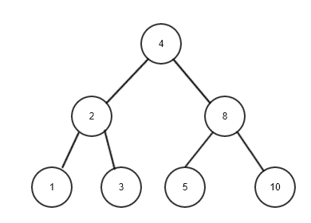

在前面的树中，如果我们希望搜索值为**5**的节点，那么我们从根节点开始，并将其与根节点进行比较。由于节点**5**的值比根节点**4**的值大，我们移动到右子树。在右子树中，我们将节点**8**作为根节点；我们将节点**5**与节点**8**进行比较。由于要搜索的节点的值小于节点**8**，因此我们移动到左子树。当我们移动到左子树时，我们将左子树节点**5**与值为**5**的所需节点进行比较。这是一场比赛，所以我们返回`"item found"`。

以下是二叉搜索树中`searching`方法的实现：

```py
  def search(self, data):
        current = self.root_node
        while True:
            if current is None:
                return None
            elif current.data is data:
                return data
            elif current.data > data:
                current = current.left_child
            else:
                current = current.right_child

```

在前面的代码中，如果找到数据，我们将返回数据，如果没有找到数据，我们将返回`None`，我们从根节点开始搜索。接下来，如果要搜索的数据项在树中不存在，我们将返回`None`到客户机代码。我们也可能已经找到了数据，在这种情况下，我们返回数据。

如果我们正在搜索的数据小于当前节点的数据，我们将沿着树向左走。此外，在代码的`else`部分，我们检查我们正在搜索的数据是否大于当前节点中保存的数据，这意味着我们沿着树向右走

最后，我们可以编写一些客户端代码来测试 BST 的工作方式。我们必须创建一棵树，并在`1`和`10`之间插入一些数字。然后，我们搜索该范围内的所有数字。将打印树中存在的内容：

```py
    tree = Tree() 
    tree.insert(5) 
    tree.insert(2) 
    tree.insert(7) 
    tree.insert(9) 
    tree.insert(1) 

    for i in range(1, 10): 
        found = tree.search(i) 
        print("{}: {}".format(i, found)) 
```

# 二叉搜索树的好处

与数组和链表相比，二叉搜索树是更好的选择。BST 对于大多数操作（如搜索、插入和删除）都是快速的，而数组提供快速搜索，但插入和删除操作相对较慢。以类似的方式，链表在执行插入和删除操作时非常有效，但在执行搜索操作时速度较慢。从二叉搜索树中搜索元素的`best-case`运行时间复杂度为`O(log n)`，`worst-case`时间复杂度为`O(n)`，而在列表中搜索的`best-case`和`worst-case`时间复杂度均为`O(n)`。

下表提供了数组、链表和二叉搜索树数据结构的比较：

| **属性** | **阵列** | **链表** | **英国夏令时** |
| **数据结构** | 线性的 | 线性的 | 非线性。 |
| **易用性** | 易于创建和使用。搜索、插入和删除的平均案例复杂度为`O(n)`。 | 插入和删除速度很快，尤其是使用双链接列表时。 | 元素访问、插入和删除速度快，平均案例复杂度为`O(log n)`。 |
| **接入复杂度** | 易于访问的元素。复杂性是`O(1)`。 | 只能按顺序访问，速度太慢了。平均和最坏情况复杂度为`O(n)`。 | 访问速度快，但当树不平衡时，访问速度慢，最坏情况复杂度为`O(n)`。 |
| **搜索复杂度** | 平均和最坏情况复杂度为`O(n)`。 | 由于顺序搜索，速度较慢。平均和最坏情况复杂度为`O(n)`。 | 搜索的最坏情况复杂度为`O(n)`。 |
| **插入复杂性** | 插入速度慢。平均和最坏情况复杂度为`O(n)`。 | 平均和最坏情况复杂度为`O(1)`。 | 插入的最坏情况复杂性为`O(n)`。 |
| **删除复杂性** | 删除速度很慢。平均和最坏情况复杂度为`O(n)`。 | 平均和最坏情况复杂度为`O(1)`。 | 删除的最坏情况复杂度为`O(n)`。 |

让我们考虑一个例子来理解二进制搜索树是存储数据的一个好的选择。假设我们有以下数据节点-ORT T0，5 个 T1 T1，2 个 T2，3 个 T3，7 个，5 个，5 个，1 个；如果我们使用一个列表来存储这些数据，最坏的情况是我们需要搜索包含七个元素的整个列表来查找该项。因此，在该数据节点中搜索**9**项需要进行七次比较：

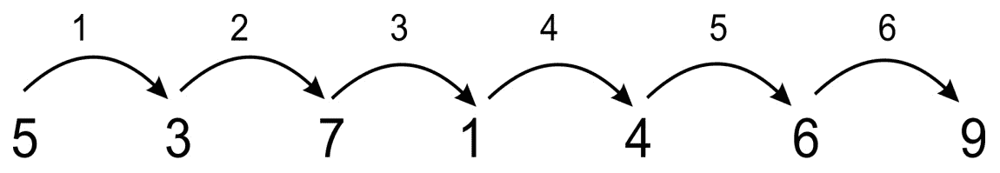

但是，如果我们使用二元搜索树来存储这些值，如下图所示，在最坏的情况下，我们需要进行三次比较来搜索项目**9**：

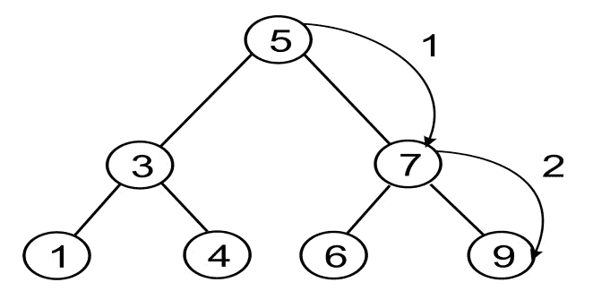

然而，需要注意的是，搜索的效率也取决于我们如何构建二叉搜索树。如果树没有被正确建造，它可能会很慢。例如，如果我们按照{**1**、**3**、**4**、**5**、**6**、**7**、**9**的顺序将元素插入到树中，如下图所示，那么树的效率不会比列表更高：


因此，选择自平衡树有助于改进`search`操作。在这里，我们应该注意到，在大多数情况下，二叉搜索树是更好的选择；然而，我们应该努力平衡这棵树

# 平衡树

在上一节中我们已经看到，如果节点按顺序插入到树中，它会变慢，行为或多或少类似于列表；也就是说，每个节点只有一个子节点。为了提高树数据结构的性能，我们通常希望尽可能降低树的高度，通过填充树中的每一行来平衡树。此过程称为**平衡树**。

有不同类型的自平衡树，如红黑树、AA 树和替罪羊树。在修改树的每个操作（如插入或删除）期间，这些操作将平衡树。还有一些外部算法可以平衡树。这些方法的好处是，您不需要在每个操作上平衡树，可以将平衡保留到需要的位置。

# 表达式树

算术表达式由运算符和操作数的组合表示，其中运算符可以是一元运算符或二元运算符。一个算术表达式也可以用一个称为表达式树的**二叉树**来表示。这个树结构也可以用来解析算术和布尔表达式。在表达式树中，所有叶节点包含操作数，非叶节点包含运算符。我们还应该注意，对于一元运算符，表达式树的一个子树（右子树或左子树）将为空

例如，`3 + 4`的表达式树如下所示：


对于稍微复杂一点的表达式，`(4 + 5) * (5-3)`，我们将得到以下结果：

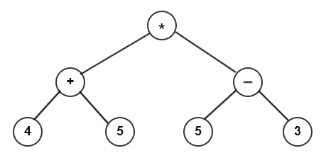

算术表达式可以使用三种符号（即中缀、后缀和前缀）表示，如前一节关于树遍历的讨论。因此，为给定的算术表达式计算表达式树变得很容易。反向波兰符号提供了更快的计算。在下面的小节中，我们将向您展示如何为给定的后缀符号构造表达式树。

# 解析反向波兰语表达式

现在，我们将为用后缀符号编写的表达式建立一棵树。然后，我们将计算结果。我们将使用一个简单的树实现。为了保持简单，因为我们将通过合并较小的树来增长树，所以我们只需要一个树节点实现：

```py
    class TreeNode: 
        def __init__(self, data=None): 
            self.data = data 
            self.right = None 
            self.left = None 
```

为了构建树，我们将借助栈登记这些项。让我们创建一个算术表达式并设置栈：

```py
        expr = "4 5 + 5 3 - *".split() 
        stack = Stack() 
```

由于 Python 是一种努力尝试使用合理默认值的语言，它的`split()`方法在默认情况下会拆分为空白。（如果你仔细想想，这很可能是你所期望的。）结果是`expr`是一个包含`4`、`5`、`+`、`5`、`3`、`-`和`*`值的列表。

`expr`列表中的每个元素要么是运算符，要么是操作数。如果我们得到一个操作数，那么我们将其嵌入到树节点中，并将其推送到栈上。另一方面，如果我们得到一个操作符，那么我们将该操作符嵌入到树节点中，并将其两个操作数弹出到节点的左、右子节点中。在这方面，我们必须注意确保第一次流行音乐进入正确的儿童；否则，我们将遇到减法和除法的问题。

以下是构建树的代码：

```py
    for term in expr: 
        if term in "+-*/": 
            node = TreeNode(term) 
            node.right = stack.pop() 
            node.left = stack.pop() 
        else: 
            node = TreeNode(int(term)) 
        stack.push(node) 
```

请注意，对于操作数，我们执行从`string`到`int`的转换。如果希望支持浮点操作数，可以使用`float()`。

在这个操作结束时，我们应该在栈中有一个元素，它保存完整的树。如果要计算表达式，我们将构建以下小函数：

```py
    def calc(node): 
        if node.data is "+": 
            return calc(node.left) + calc(node.right) 
        elif node.data is "-": 
            return calc(node.left) - calc(node.right) 
        elif node.data is "*": 
            return calc(node.left) * calc(node.right) 
        elif node.data is "/": 
            return calc(node.left) / calc(node.right) 
        else: 
            return node.data 
```

在前面的代码中，我们将节点传递给函数。如果节点包含一个操作数，那么我们只返回该值。如果我们得到一个操作符，那么我们将在节点的两个子节点上执行该操作符表示的操作。但是，由于一个或多个子节点也可能包含运算符或操作数，因此我们在两个子节点上递归调用`calc()`函数（请记住，每个节点的所有子节点也是节点）。

现在，我们只需要将根节点从栈中弹出，并将其传递到`calc()`函数中。然后，我们应该得到计算结果：

```py
    root = stack.pop() 
    result = calc(root) 
    print(result) 
```

运行此程序应产生结果`18`，这是`(4 + 5) * (5 - 3)`的结果。

# 堆

堆数据结构是树的特殊化，其中节点以特定方式排序。堆分为`max`堆和`min`堆。

在`max`堆中，每个父节点值必须始终大于或等于其子节点。因此，根节点必须是树中的最大值。考虑下面的 MAX 堆图，其中所有节点与它们的子节点相比具有更大的值：


在最小堆中，每个父节点必须小于或等于其两个子节点。因此，根节点保持最低的值。考虑下面的图为 min 堆，其中所有节点与它们的子节点相比具有较小的值：

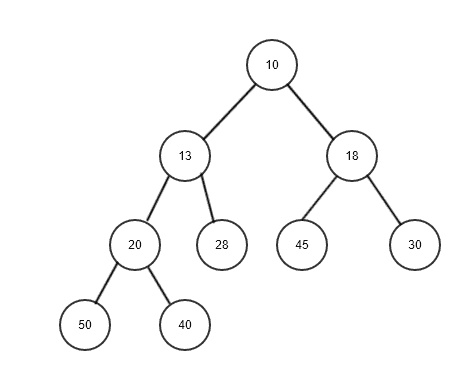

堆用于许多不同的事情。首先，它们用于实现优先级队列。还有一种非常有效的排序算法，称为**堆排序**，它使用堆。我们将在后续章节中深入研究这些问题。

# 三元搜索树

三元树是一种数据结构，其中树的每个节点最多可包含`3`子节点。与二叉搜索树不同的是，二叉树中的节点最多可以有`2`子节点，而三叉树中的节点最多可以有`3`子节点。三元树数据结构也被认为是 trie 数据结构的特例。在 trie 数据结构中，当我们使用 trie 数据结构存储字符串时，每个节点包含 26 个指向其子节点的指针，而三元搜索树数据结构中有 3 个指向其子节点的指针。

三元搜索树可以表示为：

*   每个节点在其中存储一个字符
*   它具有指向存储与当前节点相等的值的节点的相等指针
*   它的左指针指向存储小于当前节点的值的节点
*   它具有指向存储大于当前节点的值的节点的右指针
*   每个节点都有一个标志变量，用于跟踪该节点是否为字符串的结尾

为了更好地理解三元搜索树的数据结构，我们将通过一个例子来演示它，我们将字符串**PUT**、**CAT**、**SIT**、**SING**和**PUSH**插入一个空的三元树，如下图所示：


在三元搜索树中插入值与我们在二元搜索树中的操作非常相似。在三元搜索树中，我们按照以下步骤在三元搜索树中插入字符串：

1.  由于树最初是空的，我们首先用第一个字符**P**创建根节点，然后为字符**U**创建另一个节点，最后是字符**T**。

2.  接下来，我们希望添加单词**CAT**。首先，我们将第一个字符**C**与根节点字符**P**进行比较。因为它不匹配，并且比根节点小，所以我们在根节点的左侧为角色**C**创建一个新节点。此外，我们还为角色**A**和**T**创建节点。
3.  接下来，我们添加一个新词，**SIT**。首先，我们将第一个字符**S**与根节点字符**P**进行比较。由于不匹配，且字符**S**大于字符**P**，我们在右侧为字符**S**创建了一个新节点。此外，我们还为字符**I**和**T**创建节点。
4.  接下来，我们在三元搜索树中插入一个新词**SING**。我们首先将第一个字符**S**与根节点进行比较。由于不匹配，且字符**S**大于根节点**P**，因此我们查看右侧的下一个字符，即**S**。这里，字符匹配，所以我们比较下一个字符，即**I**；这也符合。接下来，我们比较树中的字符**N**和字符**T**。这里，字符不匹配，因此我们移动到节点**T**的左侧。这里，我们为角色**N**创建一个新节点。此外，我们还为角色**G**创建了另一个新节点。
5.  然后，我们在三元搜索树中添加一个新节点**PUSH**。首先，我们将单词的第一个字符**P**与根节点进行比较。由于匹配，我们将查看三元树中的下一个字符。这里，字符**U**也与单词的下一个字符匹配。所以，我们来看看这个词的下一个字符，即**S**。它与树中的下一个字符**t**不匹配。因此，我们在节点**T**左侧为角色**S**创建一个新节点，因为角色**S**小于**T**。接下来，我们为下一个角色**H**创建另一个节点。

注意，三元树中的每个节点通过使用标志变量跟踪哪个节点是叶节点还是非叶节点

三元搜索树对于字符串搜索相关应用非常有效，例如当我们希望搜索以给定前缀开头的所有字符串时，或者当我们希望搜索以给定特定号码开头的电话号码时，拼写检查等。

# 总结

在本章中，我们介绍了树数据结构及其用途。我们特别研究了二叉树，它是一种树的子类型，每个节点最多有两个子节点。我们还研究了如何将二叉树用作具有 BST 的可搜索数据结构。还使用队列递归在 Python 中实现了广度优先和深度优先搜索遍历模式。

我们还研究了如何使用二叉树来表示算术或布尔表达式。然后，我们构建了一个表达式树来表示算术表达式。之后，我们向您展示了如何使用栈解析用 RPN 编写的表达式，构建表达式树，最后遍历它以获得算术表达式的结果。

最后，我们提到了堆，一种树结构的特殊化。我们试图至少为本章中的堆奠定理论基础，这样我们就可以在即将到来的章节中实现不同目的的堆。

在下一章中，我们将讨论哈希表和符号表的细节