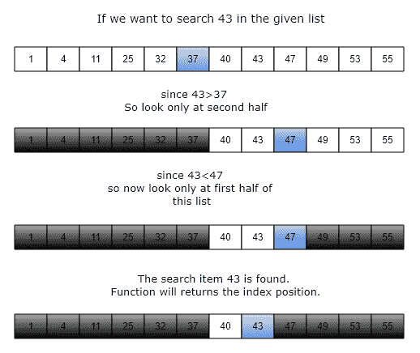
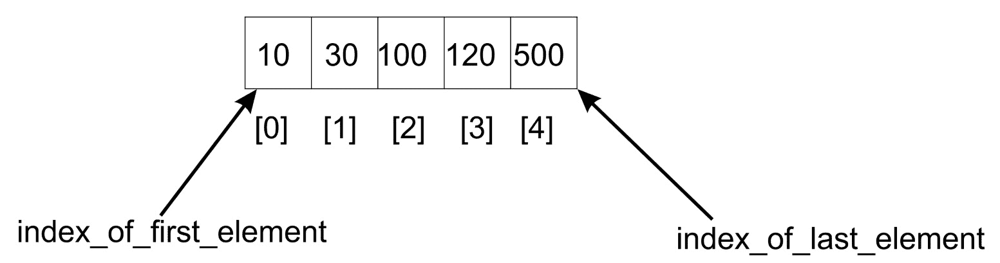
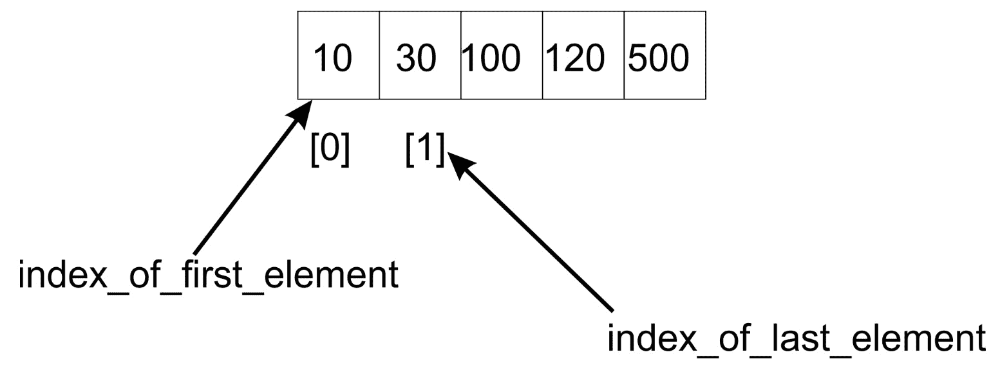
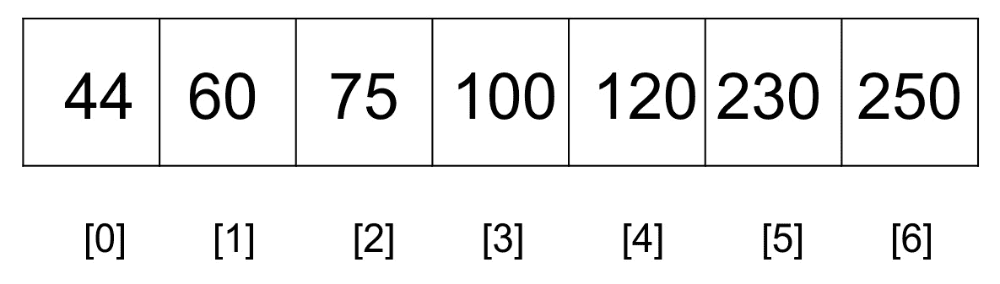
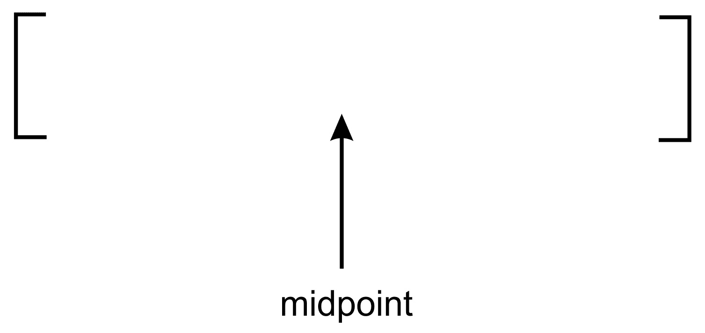
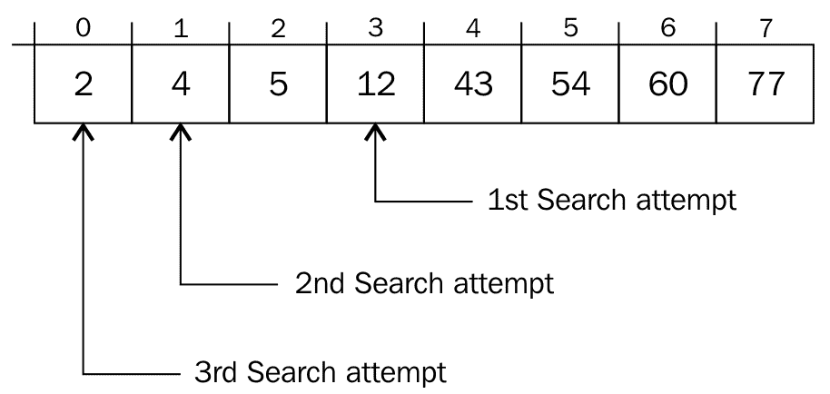

# 搜索

所有数据结构最重要的操作之一是从存储的数据中搜索元素。在数据结构中搜索元素有多种方法；在本章中，我们将探讨可用于在项目集合中查找元素的不同策略。

搜索操作是排序的一个非常重要的操作。如果不使用某种搜索操作，几乎不可能对数据进行排序。如果搜索算法有效，则排序算法将很快。在本章中，我们将讨论不同的搜索算法。

搜索操作的性能很大程度上受将要搜索的项目是否已经排序的影响，我们将在后面的部分中看到这一点。

在本章结束时，您将能够执行以下操作：

*   了解各种搜索算法
*   了解流行搜索算法的实现
*   了解二进制搜索算法的实现
*   了解插值的实现

# 技术要求

本章中使用的源代码可从以下 GitHub 链接获得：[https://github.com/PacktPublishing/Hands-On-Data-Structures-and-Algorithms-with-Python-3.7-Second-Edition/tree/master/Chapter09](https://github.com/PacktPublishing/Hands-On-Data-Structures-and-Algorithms-with-Python-3.7-Second-Edition/tree/master/Chapter09) 。

# 搜索简介

搜索算法分为两大类：

*   搜索算法应用于已排序的项目列表；也就是说，应用于已排序的项目集
*   搜索算法应用于未排序的无序项目集

# 线性搜索

*搜索*操作是从存储的数据中找出给定的项目。如果搜索项在存储列表中可用，则返回其所在的索引位置，否则返回未找到该项。在列表中搜索项目的最简单方法是线性搜索方法，在该方法中，我们在整个列表中逐个查找项目。

我们以`5`列表项`{60, 1, 88, 10, 11, 100}`为例来了解线性搜索算法，如下图所示：


前面的列表包含可通过列表索引访问的元素。为了在列表中找到一个元素，我们采用了线性搜索技术。这种技术通过使用索引从列表的开头移动到末尾来遍历元素列表。检查每个元素，如果它与搜索项目不匹配，则检查下一个项目。通过从一个项目跳到下一个项目，列表按顺序遍历。

We use list items with integer values in this chapter to help you understand the concept, since integers can be compared easily; however, a list item can hold any other data type as well.

# 无序线性搜索

线性搜索方法取决于列表项是按顺序排序还是不按任何顺序存储。首先让我们看看列表中是否有未排序的项。

考虑一个示例列表，其中包含元素 60, 1, 88、10 和 100 的无序列表。列表中的项目没有数量级。要对这样的列表执行搜索操作，从第一个项目开始，并将其与搜索项目进行比较。如果搜索项不匹配，则检查列表中的下一个元素。这将一直持续到我们到达列表中的最后一个元素或找到匹配项为止。

以下是 Python 中对无序项列表进行线性搜索的实现：

```py
    def search(unordered_list, term): 
       unordered_list_size = len(unordered_list) 
        for i in range(unordered_list_size): 
            if term == unordered_list[i]: 
                return i 

        return None 
```

`search`函数采用两个参数；第一个是保存数据的列表，第二个参数是我们正在寻找的项目，称为**搜索词**。

获取数组的大小并确定执行`for`循环的次数。以下代码描述了这一点：

```py
        if term == unordered_list[i]: 
            ... 
```

在`for`循环的每一次过程中，我们测试搜索项是否等于索引项。如果这是真的，则存在匹配项，无需进一步进行搜索。我们返回在列表中找到搜索项的索引位置。

如果循环运行到列表末尾，但未找到匹配项，则返回`None`表示列表中没有此类项。

在无序的项目列表中，没有关于如何插入元素的指导规则。因此，它会影响执行搜索的方式。因此，我们必须逐一访问清单中的所有项目。如下图所示，对术语**66**的搜索从第一个元素开始，并移动到列表中的下一个元素。

因此，将第一个**60**与**66**进行比较，如果不相等，我们将**66**与下一个元素**1**进行比较，然后将**88**进行比较，依此类推，直到在列表中找到搜索项：


无序线性搜索的最坏情况运行时间为`O(n)`。在查找搜索词之前，可能需要访问所有元素。最坏的情况是搜索词位于列表的最后一个位置。

# 有序线性搜索

线性搜索中的另一种情况是列表元素已排序；然后改进我们的搜索算法。假设元素已按升序排序，搜索操作可以利用列表的有序性，使搜索更加高效。

算法简化为以下步骤：

1.  按顺序在列表中移动
2.  如果搜索项目大于循环中当前正在检查的对象或项目，则退出并返回`None`

在遍历列表的过程中，如果搜索项大于当前项，则无需继续搜索。

让我们考虑一个例子，看看它是如何工作的。我们获取一个项目列表，如下图所示，我们希望搜索术语`5`：


当搜索操作开始时，将第一个元素与搜索项（**5**）进行比较，未找到匹配项。但是，列表中有更多元素，因此搜索操作将继续检查下一个元素。在排序列表中继续前进的一个更令人信服的原因是，我们知道搜索项可能匹配大于**2**的任何元素。

经过第四次比较，我们得出结论，在**6**所在的列表中，后面的任何位置都找不到搜索项。换句话说，如果当前项大于搜索项，则表示无需进一步搜索列表。

以下是列表已排序时线性搜索的实现：

```py
    def search(ordered_list, term): 
        ordered_list_size = len(ordered_list) 
        for i in range(ordered_list_size): 
            if term == ordered_list[i]: 
                return i 
            elif ordered_list[i] > term: 
                return None 

        return None 
```

在前面的代码中，`if`语句现在用于检查搜索项是否在列表中找到。`elif`测试`ordered_list[i] > term`的条件。如果比较结果为`True`，则该方法返回`None`。

方法中的最后一行返回`None`，因为循环可能会遍历列表，但列表中的搜索项仍然不匹配。

有序线性搜索的最坏情况时间复杂度为`O(n)`。通常，这种搜索被认为效率低下，尤其是在处理大型数据集时。

# 二进制搜索

二进制搜索是一种搜索策略，用于在**排序的**数组或列表中查找元素；因此，二进制搜索算法从给定的排序项列表中查找给定项。搜索元素是一种非常快速高效的算法，唯一的缺点是我们需要一个排序列表。二进制搜索算法的最坏情况运行时间复杂度为`O(log n)`，而线性搜索算法的最坏情况运行时间复杂度为`O(n)`。

二进制搜索算法的工作原理如下。它通过将给定列表除以一半开始搜索项。如果搜索项小于中间值，则只在列表的前半部分查找搜索项，如果搜索项大于中间值，则只在列表的后半部分查找。我们每次都重复相同的过程，直到找到搜索项或检查完整个列表。

让我们通过一个例子来理解二进制搜索。假设我们有一本 1000 页的书，我们希望达到 250 页。我们知道每本书都有从`1`开始的顺序页码。因此，根据二进制搜索类比，我们首先检查搜索项 250，它小于 500（这是本书的中点）。因此，我们只在书的前半部分搜索所需页面。我们再次看到了书的前半部分的中点，也就是说，用第 500 页作为参考，我们找到了中点，即 250 页。这使我们更接近于找到第 250 页。然后我们在书中找到所需的页面

让我们考虑另一个例子来理解二进制搜索的工作原理。我们想从 12 项列表中搜索一项**43**，如下图所示：



我们通过将该项与列表的中间项进行比较来开始搜索该项，在本例中，中间项为**37**。如果搜索项小于中间值，我们只查看列表的前半部分；否则，我们将看另一半。所以我们只需要在下半部分搜索项目。我们遵循相同的概念，直到在列表中找到搜索项**43**，如上图所示。

以下是有序项目列表上二进制搜索算法的实现：

```py
def binary_search(ordered_list, term): 

    size_of_list = len(ordered_list) - 1 
    index_of_first_element = 0 
    index_of_last_element = size_of_list 
    while index_of_first_element <= index_of_last_element: 
        mid_point = (index_of_first_element + index_of_last_element)//2 
        if ordered_list[mid_point] == term: 
            return mid_point 
        if term > ordered_list[mid_point]: 
            index_of_first_element = mid_point + 1 
        else: 
            index_of_last_element = mid_point - 1 
    if index_of_first_element > index_of_last_element: 
        return None
```

假设我们必须找到**10**项在列表中的位置，如下所示：



该算法使用`while`循环来迭代调整列表中的限制，我们必须在其中找到搜索项。停止`while`循环的终止条件是启动指数`index_of_first_element`和`index_of_last_element`指数之间的差值应为正值。

该算法首先通过将第一个元素（**0**的索引添加到最后一个元素（**4**的索引中，并将其除以**2**来找到列表的中点，从而找到中间索引`mid_point`：

```py
mid_point = (index_of_first_element + index_of_last_element)//2 
```

在这种情况下，中点是`100`，在列表的中间位置找不到值**10**。由于我们搜索的是**10**项，该项小于中点，因此它位于列表的前半部分，因此我们将索引范围调整为`index_of_first_element`到`mid_point-1`，如下图所示，但是如果我们搜索的是**120**，在这种情况下，由于 120 大于中间值（100），我们将搜索列表后半部分的项目，需要将列表索引范围更改为`mid_point +1 `到`index_of_last_element`。如下图所示：



我们的新指标`index_of_first_element`和`index_of_last_element`现在分别为**0**和**1**，我们计算的中点`(0 + 1)/2`，等于`0`。新的中点是**0**，因此我们找到中间项，并将其与搜索项`ordered_list[0]`进行比较，从而得到值**10**。现在，我们的搜索项被找到，索引位置被返回。

通过调整`index_of_first_element`和`index_of_last_element`的索引，只要`index_of_first_element`小于`index_of_last_element`，我们的列表大小就会减少一半。如果情况并非如此，则很可能我们的搜索词不在列表中。

我们讨论的实现是迭代的。我们还可以通过应用相同的原理并移动标记搜索列表开始和结束的指针来开发算法的递归变体。考虑下面的代码：

```py
def binary_search(ordered_list, first_element_index, last_element_index, term): 

    if (last_element_index < first_element_index): 
        return None 
    else: 
        mid_point = first_element_index + ((last_element_index - first_element_index) // 2) 

        if ordered_list[mid_point] > term: 
            return binary_search(ordered_list, first_element_index, mid_point-1,term) 
        elif ordered_list[mid_point] < term: 
            return binary_search(ordered_list, mid_point+1, last_element_index, term) 
        else: 
            return mid_point 
```

对二进制搜索算法递归实现的调用及其输出如下：

```py
    store = [2, 4, 5, 12, 43, 54, 60, 77]
    print(binary_search(store, 0, 7, 2))   

Output:
>> 0
```

这里，递归二进制搜索和迭代二进制搜索之间的唯一区别是函数定义和计算`mid_point`的方式。`((last_element_index - first_element_index) // 2)`操作后的`mid_point`计算必须将其结果添加到`first_element_index`中。这样，我们就定义了尝试搜索的列表部分。

二进制搜索算法的最坏情况时间复杂度为`O(log n)`。在每次迭代中，列表的一半跟随`log(n)`元素的数量及其进度。

It goes without saying that `log x` is assumed to be referring to log base two.

# 插值搜索

插值搜索算法是二进制搜索算法的改进版本。当排序列表中存在均匀分布的元素时，它的执行效率非常高。在二进制搜索中，我们总是从列表的中间开始搜索，而在插值搜索中，我们根据要搜索的项目确定开始位置。在插值搜索算法中，起始搜索位置很可能最接近列表的起点或终点，具体取决于搜索项。如果搜索项靠近列表中的第一个元素，则开始搜索位置可能靠近列表的开始位置。

插值搜索是二进制搜索算法的另一个变体，与人类对任何项目列表执行搜索的方式非常相似。它基于对索引位置的良好猜测，其中搜索项可能在已排序的项列表中找到。它的工作方式与二进制搜索算法类似，除了确定分割标准以分割数据以减少比较次数的方法。在二进制搜索的情况下，我们将数据分成相等的两半，在插值搜索的情况下，我们使用以下公式将数据分割：

```py
mid_point = lower_bound_index + (( upper_bound_index - lower_bound_index)// (input_list[upper_bound_index] - input_list[lower_bound_index])) * (search_value - input_list[lower_bound_index]) 
```

在前面的公式中，`lower_bound_index`变量是下限索引，是`upper_bound_index`列表中最小值的索引，表示列表中最高值的索引位置。`input_list[lower_bound_index] `和`input_list[lower_bound_index]`变量分别是列表中的最低值和最高值。`search_term`变量包含要搜索的项目的值。

让我们考虑一个例子来理解插值搜索算法是如何使用下面的清单 T0 项目的：



要找到**120**，我们知道应该查看列表的右侧部分。我们对二进制搜索的初始处理通常首先检查中间元素，以确定它是否匹配搜索项。

一种更人性化的方法是选择一个中间元素，这样不仅可以将数组一分为二，而且可以尽可能接近搜索项。使用以下规则计算中间位置：

```py
mid_point = (index_of_first_element + index_of_last_element)//2 
```

在插值搜索算法的情况下，我们将用一个更好的公式来代替这个公式，使我们更接近搜索项。`mid_point`将接收`nearest_mid`函数的返回值，该返回值使用以下方法计算：

```py
def nearest_mid(input_list, lower_bound_index, upper_bound_index, search_value):

    return lower_bound_index + (( upper_bound_index -lower_bound_index)// (input_list[upper_bound_index] -input_list[lower_bound_index])) * (search_value -input_list[lower_bound_index]) 
```

`nearest_mid`函数将执行搜索的列表作为参数。`lower_bound_index`和`upper_bound_index`参数表示我们希望在其中找到搜索项的列表中的边界。此外，`search_value`表示正在搜索的值。

根据我们的搜索列表，**44**、**60**、**75**、**100**、**120**、**230**和**250**，`nearest_mid`将使用以下值进行计算：

```py
lower_bound_index = 0
upper_bound_index = 6
input_list[upper_bound_index] = 250
input_list[lower_bound_index] = 44
search_value = 230
```

让我们计算`mid_point`值：

```py
mid_point= 0 + [(6-0)//(250-44) * (230-44)
         = 5 
```

现在可以看到，`mid_point`值将收到`5`值。因此，在插值搜索的情况下，算法将从索引位置`5`、**开始搜索，这是我们搜索项位置的索引。因此，将在第一次比较中找到要搜索的项目，而在二进制搜索的情况下，我们将选择**100**作为`mid_point`，这将需要再次运行该算法。**

 **下面给出了一个更直观的示例，说明了典型的二进制搜索与插值的区别。在一个典型的二进制搜索中，它找到了一个看起来是中间列表的中间点：



可以看出，席中点实际上是站在前面列表的中间。这是除以列表 2 的结果。

另一方面，在插值搜索的情况下，**中点**被移动到最可能匹配项目的位置：


在插值搜索中，**中点**通常更向左或向右。这是由于除法获得**中点**时使用的乘法器的影响造成的。在上图中，我们的**中点**已向右倾斜。

除了我们计算**中点**的方式外，插值算法的实现与二进制搜索的实现相同。

这里，我们提供插值搜索算法的实现，如下代码所示：

```py
def interpolation_search(ordered_list, term): 

    size_of_list = len(ordered_list) - 1 

    index_of_first_element = 0 
    index_of_last_element = size_of_list 

    while index_of_first_element <= index_of_last_element: 
        mid_point = nearest_mid(ordered_list, index_of_first_element, index_of_last_element, term) 

        if mid_point > index_of_last_element or mid_point < index_of_first_element: 
            return None 

        if ordered_list[mid_point] == term: 
            return mid_point 

        if term > ordered_list[mid_point]: 
            index_of_first_element = mid_point + 1 
        else: 
            index_of_last_element = mid_point - 1 

    if index_of_first_element > index_of_last_element: 
        return None 
```

`nearest_mid`函数使用乘法运算。这会产生大于`upper_bound_index`或小于`lower_bound_index`的值。出现这种情况时，表示搜索词`term`不在列表中。因此，返回`None`以表示此情况。

那么当`ordered_list[mid_point]`不等于搜索项时会发生什么呢？好的，我们现在必须重新调整`index_of_first_element`和`index_of_last_element`，以便算法将重点放在数组中可能包含搜索项的部分。这与我们在二进制搜索中所做的完全相同：

```py
if term > ordered_list[mid_point]: 
    index_of_first_element = mid_point + 1 
```

如果搜索项大于存储在`ordered_list[mid_point]`的值，那么我们只调整`index_of_first_element`变量以指向`mid_point + 1`索引。

下图显示了如何进行调整。调整`index_of_first_element`并指向`mid_point+1`指标：


The diagram only illustrates the adjustment of the midpoint. In interpolation, the midpoint rarely divide the list into two equal halves.

另一方面，如果搜索项小于存储在`ordered_list[mid_point]`的值，则我们只调整`index_of_last_element`变量以指向索引`mid_point - 1`。此逻辑在 if 语句`index_of_last_element = mid_point - 1`的 else 部分中捕获：


该图显示了重新计算最后一个元素的**索引【U】对**中点**位置的影响。**

让我们用一个更实际的例子来了解二进制搜索和插值算法的内部工作原理。

例如，考虑以下元素列表：

```py
[ 2, 4, 5, 12, 43, 54, 60, 77] 
```

在索引 0 处存储值 2，在索引 7 处存储值 77。现在，假设我们想要在列表中找到元素 2。这两种不同的算法将如何进行？

如果我们将此列表传递给`interpolation search`函数，`nearest_mid`函数将使用`mid_point`计算公式返回一个等于`0`的值，如下所示：

```py
mid_point= 0 + [(7-0)//(77-2) * (2-2)
         = 0 
```

当我们得到`mid_point`值`0`时，我们使用索引`0`处的值开始插值搜索。仅通过一次比较，我们就找到了搜索词。

另一方面，二进制搜索算法需要进行三次比较才能得出搜索项，如下图所示：



计算的第一个`mid_point`值为`3`。第二个`mid_point`值为`1`，找到搜索项的最后一个`mid_point`值为`0`。

因此，很明显，在大多数情况下，插值搜索算法的性能优于二进制搜索

# 选择搜索算法

与有序和无序线性搜索函数相比，二进制搜索和插值搜索算法的性能更好。由于顺序探测列表中的元素以查找搜索项，有序和无序线性搜索的时间复杂度为`O(n)`。当列表很大时，这会导致非常差的性能。

另一方面，二进制搜索操作在尝试搜索时将列表一分为二。在每次迭代中，我们比线性策略更快地接近搜索项。时间复杂度产生`O(log n)`。尽管使用二进制搜索的速度有所提高，但它的主要缺点是不能应用于未排序的项目列表，也不建议将其用于较小大小的列表，因为排序开销较大

在很大程度上，找到包含搜索词的列表部分的能力决定了搜索算法的性能。在插值搜索算法中，中点的计算方式使我们更快地获得搜索项的概率更高。插值搜索的平均情况时间复杂度为`O( log ( log n))`，而插值搜索算法的最坏情况时间复杂度为`O(n)`。这表明插值搜索优于二进制搜索，并且在大多数情况下提供更快的搜索

# 总结

在本章中，我们讨论了两种重要的搜索算法。讨论了线性搜索算法和二进制搜索算法的实现，并进行了比较。本章还详细讨论了二进制搜索变量插值搜索。

我们将在下一章中使用搜索排序算法的概念。我们还将使用我们获得的知识对项目列表执行排序算法。**