# 设置 Python 环境

在本章中，我们将简要介绍 Python 编程语言以及当前版本之间的差异。Python 有两个活动版本，在开发过程中决定使用哪一个版本很重要。在本章中，我们将下载 Python 二进制文件并将其安装到操作系统中。

在本章末尾，我们将安装世界各地专业开发人员使用的最先进的**集成开发编辑器**（**IDE**）之一：PyCharm。PyCharm 提供了智能代码完成、代码检查、动态错误突出显示和快速修复、自动代码重构和丰富的导航功能，在编写和开发 Python 代码时，我们将在本书中介绍这些功能。

本章将介绍以下主题：

*   Python 简介
*   安装 pyide
*   探索一些俏皮的魅力特征

# Python 简介

Python 是一种高级编程语言，提供了友好的语法；对于初学者和专家程序员来说，它都很容易学习和使用。

Python 最初是由 Guido van Rossum 在 1991 年开发的；这取决于 C、C++和其他 UNIX shell 工具的混合。Python 作为一种通用编程语言而闻名，如今它被应用于许多领域，如软件开发、web 开发、网络自动化、系统管理和科学领域。由于有大量可供下载的模块，涵盖了许多领域，Python 可以将开发时间缩短到最低限度。

Python 语法被设计为可读的；它与英语有一些相似之处，而代码结构本身很漂亮。Python 核心开发人员提供了 20 条信息规则，称为 Python 的 Zen，这些规则影响了 Python 语言的设计；其中大部分涉及构建干净、有组织且可读的代码。以下是一些规则：

Beautiful is better than ugly.
Explicit is better than implicit.
Simple is better than complex.
Complex is better than complicated.

你可以在[上阅读更多关于 Python 禅宗的内容 https://www.python.org/dev/peps/pep-0020/](https://www.python.org/dev/peps/pep-0020/) 。

# Python 版本

Python 有两个主要版本：Python2.x 和 Python3.x。两个版本之间存在细微的差异；最明显的是它们的`print`函数处理多个字符串的方式。此外，所有新功能将只添加到 3.x，而 2.x 将在完全退役前收到安全更新。这不是一个容易的迁移，因为许多应用程序都是在 Python2.x 上构建的。

# 为什么有两个活动版本？

我将引用 Python 官方网站的理由：

<q class="calibre21">"Guido van Rossum (the original creator of the Python language) decided to clean up Python 2.x properly, with less regard for backwards compatibility than is the case for new releases in the 2.x range. The most drastic improvement is the better Unicode support (with all text strings being Unicode by default) as well as saner bytes/Unicode separation.</q> <q class="calibre21">"Besides, several aspects of the core language (such as print and exec being statements, integers using floor division) have been adjusted to be easier for newcomers to learn and to be more consistent with the rest of the language, and old cruft has been removed (for example, all classes are now new-style, "range()" returns a memory efficient iterable, not a list as in 2.x)."</q>

您可以在[上阅读有关此主题的更多信息 https://wiki.python.org/moin/Python2orPython3](https://wiki.python.org/moin/Python2orPython3) 。

# 你应该只学习 Python 3 吗？

这取决于*。*学习 Python 3 将为您的代码提供未来证明，您将使用开发人员提供的最新功能。但是，请注意，一些第三方模块和框架缺乏对 Python3 的支持，并且在不久的将来将继续这样做，直到它们将其库完全移植到 Python3。

另外，请注意，一些网络供应商，如 Cisco，对 Python3.x 提供了有限的支持，因为 Python2.x 版本中已经包含了大多数必需的功能。例如，以下是 Cisco 设备支持的 Python 版本；您将看到所有设备都支持 2.x，而不是 3.x：


Source: [https://developer.cisco.com/site/python/](https://developer.cisco.com/site/python/)

# 这是否意味着我不能编写同时在 Python2 和 Python3 上运行的代码？

不，当然，您可以用 Python 2.x 编写代码并使其与两个版本兼容，但是您需要先导入一些库，例如`__future__`模块，以使其向后兼容。这个模块包含一些调整 Python2.x 行为并使其与 Python3.x 完全相同的函数。请看以下示例，了解两个版本之间的差异：

```py
#python 2 only
print "Welcome to Enterprise Automation"

```

以下代码适用于 Python 2 和 3：

```py
# python 2 and 3
print("Welcome to Enterprise Automation")
```

现在，如果需要打印多个字符串，Python 2 语法如下：

```py
# python 2, multiple strings
print "welcome", "to", "Enterprise", "Automation"

# python 3, multiple strings
print ("welcome", "to", "Enterprise", "Automation")
```

如果在 Python2 中尝试使用括号打印多个字符串，它会将其解释为元组，这是错误的。因此，我们将在代码开始时导入`__future__`模块，以防止这种行为，并指示 Python 打印多个字符串。

输出结果如下：


# Python 安装

无论您选择使用流行的 Python 版本（2.x）还是使用 Python 3.x 构建经得起未来考验的代码，您都需要从官方网站下载 Python 二进制文件并将其安装到操作系统中。Python 提供了对不同平台（Windows、Mac、Linux、Raspberry PI 等）的支持：

1.  转到[https://www.python.org/downloads/](https://www.python.org/downloads/) 并选择 2.x 或 3.x 的最新版本：


2.  从下载页面选择您的平台，以及 x86 或 x64 版本：


3.  像往常一样安装软件包。在安装过程中选择 addpythonthepath 选项非常重要，以便从命令行访问 python（对于 Windows）。否则，Windows 将无法识别 Python 命令，并将抛出错误：


4.  通过打开操作系统中的命令行或终端并键入`python`，验证安装是否完成。这将访问 Python 控制台，并验证 Python 是否已成功安装在您的系统上：

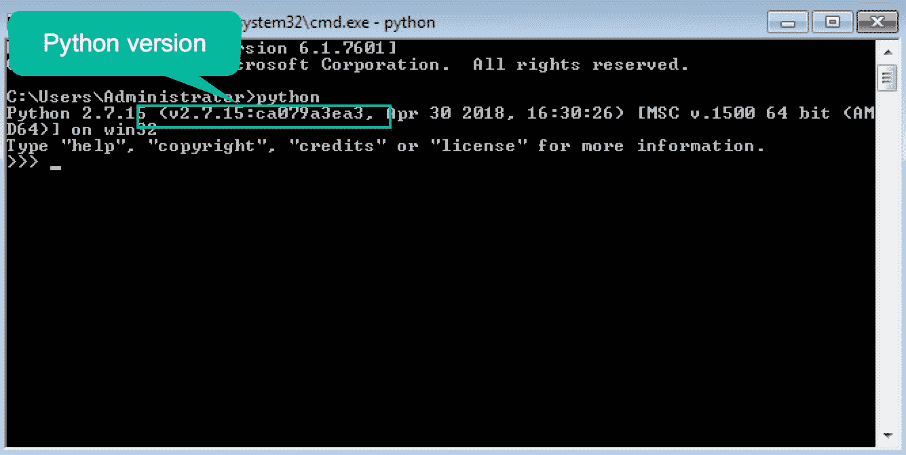

# 安装 pyide

PyCharm 是一个成熟的 IDE，世界各地的许多开发人员都使用它来编写和开发 Python 代码。IDE 由 Jetbrains 公司开发，提供丰富的代码分析和完成、语法突出显示、单元测试、代码覆盖、错误发现和其他 Python linting 操作。

此外，PyCharm 专业版支持 PythonWeb 框架，如 Django、web2py 和 Flask，还支持与 Docker 和 vagrant 的集成，以便在这些框架上运行代码。它提供了与多个版本控制系统的惊人集成，如 Git（和 GitHub）、CVS 和 subversion。

在接下来的几个步骤中，我们将安装 PyCharm 社区版：

1.  进入 PyCharm 下载页面（[https://www.jetbrains.com/pycharm/download/](https://www.jetbrains.com/pycharm/download/)) 并选择您的平台。此外，选择下载社区版（永远免费）或专业版（社区版完全适合运行本书中的代码）：


2.  按常规安装软件，但请确保选择以下选项：
    *   32 位或 64 位启动器（取决于您的操作系统）。
    *   创建关联（这将使 PyCharm 成为 Python 文件的默认应用程序）。
    *   JetBrains 下载并安装 JRE x86：


3.  等待 PyCharm 从 internet 下载附加软件包并安装，然后选择运行 PyCharm 社区版：

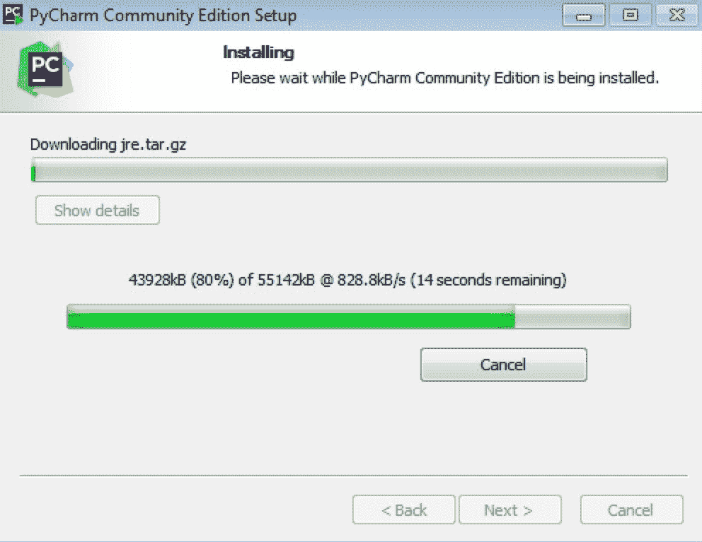

4.  由于这是一个全新的安装，我们不会从导入任何设置

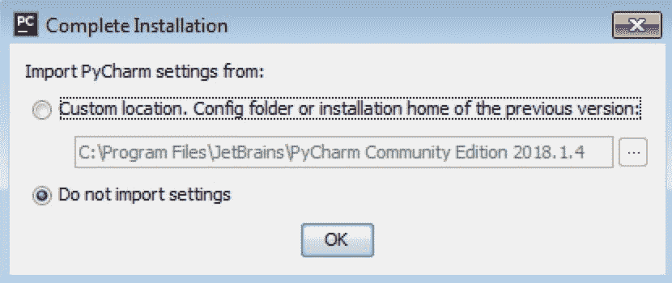

5.  选择所需的 UI 主题（默认或*darcula，*暗模式）。您可以安装一些附加插件，如 Markdown 和 BashSupport，这将使 PyCharm 能够识别和支持这些语言。完成后，单击开始使用 PyCharm：


# 在 PyCharm 中设置 Python 项目

在 PyCharm 内部，Python 项目是您开发的 Python 文件和内置或从第三方安装的 Python 模块的集合。在开始开发代码之前，您需要创建一个新项目并将其保存到计算机中的特定位置。此外，您还需要为此项目选择默认解释器。默认情况下，PyCharm 将扫描系统上的默认位置并搜索 Python 解释器。另一个选项是使用 Python`virtualenv`创建一个完全隔离的环境。`virtualenv`地址的基本问题是它的包依赖性。假设您正在处理多个不同的 Python 项目，其中一个项目需要一个特定版本的*x*包。另一方面，另一个项目需要一个与同一个包完全不同的版本。请注意，所有已安装的 Python 软件包都会转到`/usr/lib/python2.7/site-packages`，并且不能存储同一软件包的不同版本。`virtualenv`将通过创建一个拥有自己的安装目录和软件包的环境来解决这个问题；每次处理这两个项目中的任何一个时，PyCharm（在`virtualenv`的帮助下）都会激活相应的环境，以避免包之间发生任何冲突。

按照以下步骤设置项目：

1.  选择“创建新项目”：


2.  选择项目设置：

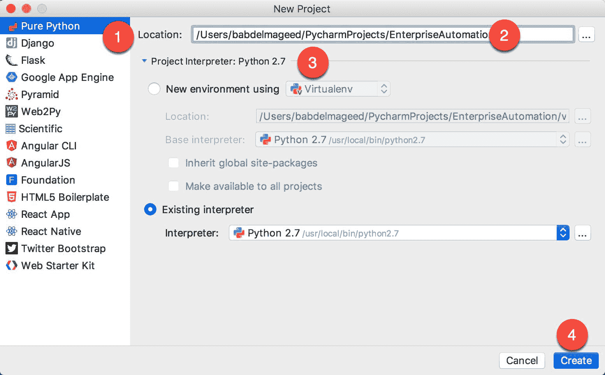

3.  在项目内创建新的 Python 文件：

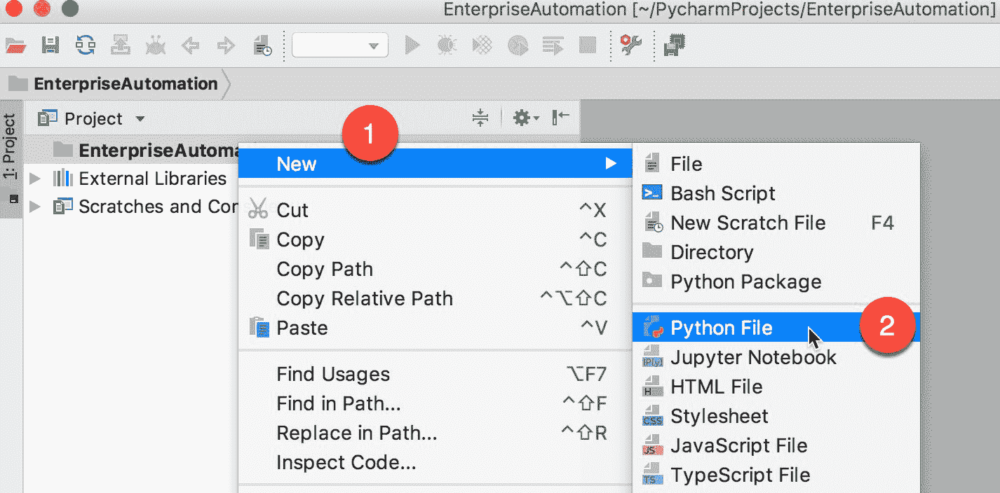

打开一个新的空白文件，您可以直接将 Python 代码写入其中。例如，尝试导入`__future__`模块，PyCharm 会自动打开一个弹出窗口，显示所有可能的完成，如下图所示：


4.  运行您的代码：

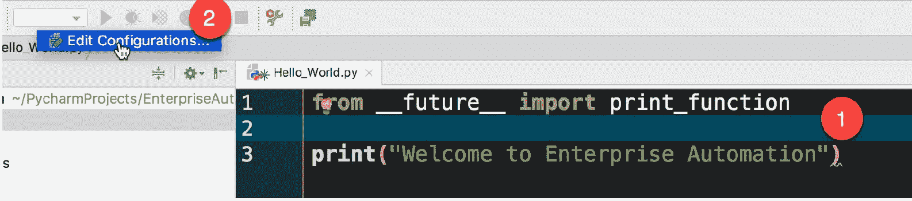

5.  为运行文件配置新的 Python 设置：

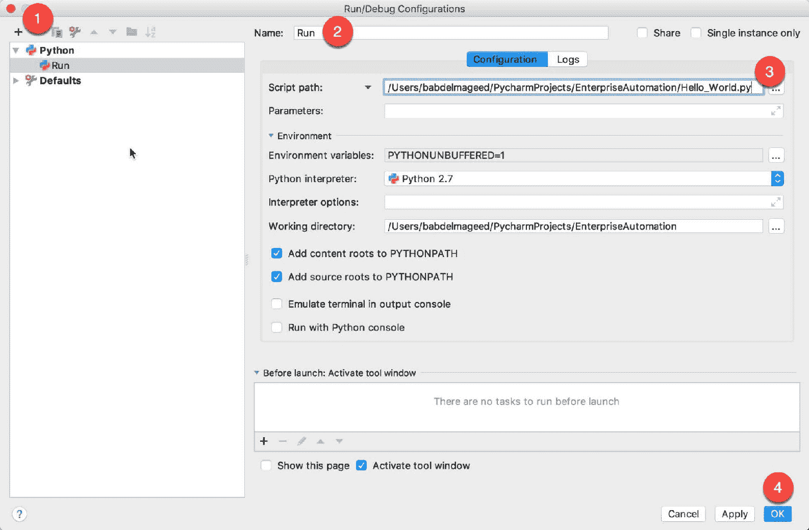

6.  运行代码：

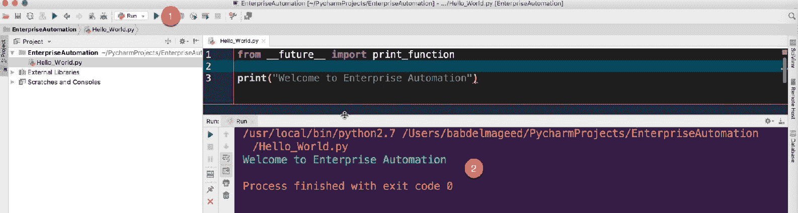

# 探索一些俏皮的魅力特征

在本节中，我们将探讨 PyCharm 的一些特性。PyCharm 拥有大量现成的工具，包括集成的调试器和测试运行器、Python profiler、内置终端、与主要 VCS 和内置数据库工具的集成、与远程解释器的远程开发功能、集成的 SSH 终端，以及与 Docker 和 Vagrant 的集成。有关其他功能的列表，请查看官方网站（[https://www.jetbrains.com/pycharm/features/](https://www.jetbrains.com/pycharm/features/) ）。

# 代码调试

代码调试是一个可以帮助您了解错误原因的过程，方法是向代码提供输入，遍历代码的每一行，并查看代码最后的计算结果。Python 语言包含一些调试工具，可以从代码中获得见解，从一个简单的`print`函数开始，断言命令，直到完成代码的单元测试。PyCharm 提供了调试代码和查看计算值的简单方法。

要调试 PyCharm 中的代码（例如，带有`if`子句的嵌套`for`循环），需要在希望 PyCharm 停止程序执行的行上设置断点。当 PyCharm 点击这一行时，它将暂停程序并转储内存以查看每个变量的内容：

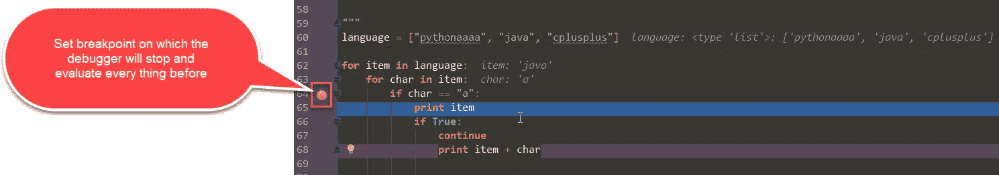

请注意，在第一次迭代时，每个变量的值都会在其旁边打印：

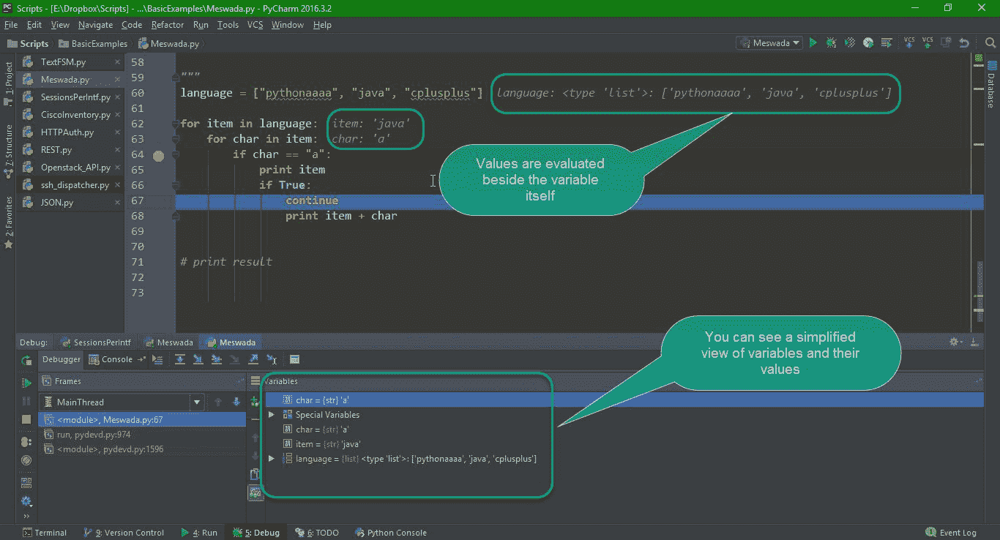

此外，您还可以右键单击断点并为任何变量添加特定条件。如果将变量计算为特定值，则将打印日志消息：


# 代码重构

重构代码是改变代码中特定变量名结构的过程。例如，您可以为变量选择一个名称，并将其用于包含多个源文件的项目，然后决定将变量重命名为更具描述性的名称。PyCharm 提供了许多重构技术，以确保在不中断操作的情况下更新代码。

PyCharm 执行以下操作：

*   重构本身
*   扫描项目中的每个文件，并确保更新对变量的引用
*   如果某些东西不能自动更新，它会给你一个警告并打开一个菜单，这样你就可以决定怎么做
*   在重构代码之前保存代码，以便以后还原

让我们看一个例子。假设我们的项目中有三个 Python 文件，分别称为`refactor_1.py`、`refactor_2.py`和`refactor_3.py`。第一个文件包含`important_funtion(x)`，该文件也用于`refactor_2.py`和`refactor_3.py`。


在`refactor_1.py`文件中复制以下代码：

```py
def important_function(x):
    print(x)
```

在`refactor_2.py`文件中复制以下代码：

```py
from refactor_1 import important_function
important_function(2)
```

在`refactor_3.py`文件中复制以下代码：

```py
from refactor_1 import important_function
important_function(10)
```

要执行重构，您需要右键单击方法本身，选择 Refactor | Rename，然后输入方法的新名称：


请注意，IDE 底部将打开一个窗口，列出此函数的所有引用、每个函数的当前值以及重构后将影响的文件：


如果选择 Do Refactor，所有引用都将用新名称更新，并且代码不会被破坏。

# 从 GUI 安装软件包

PyCharm 可用于使用 GUI 为现有解释器（或`virtualenv`）安装软件包。此外，您还可以看到所有已安装软件包的列表，以及这些软件包是否可以升级。

首先，您需要转到文件|设置|项目|项目解释器：

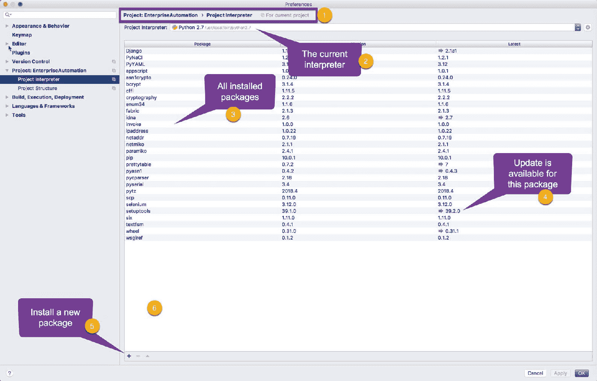

如前面的屏幕截图所示，PyCharm 提供了已安装软件包及其当前版本的列表。您可以单击+符号向项目解释器添加新包，然后在搜索框中输入包的首字母缩写：

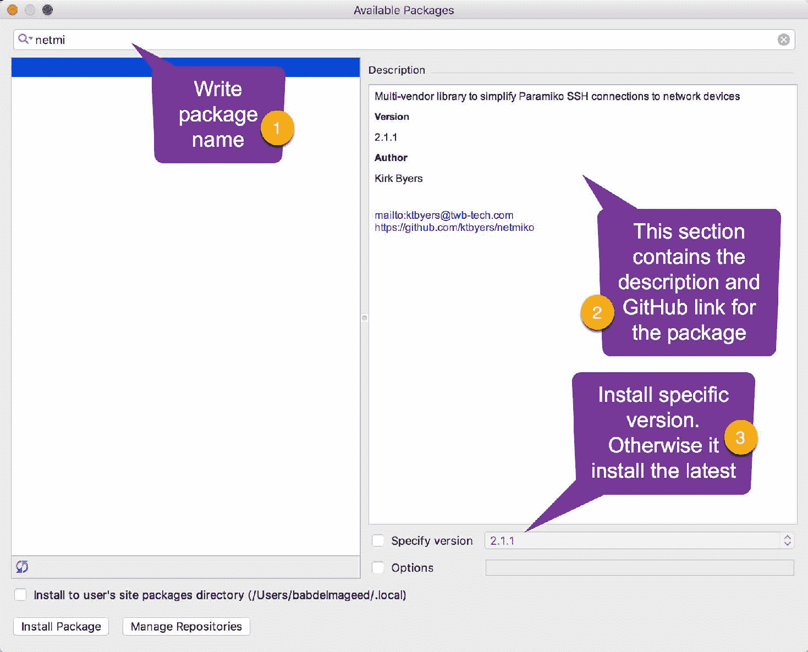

您应该看到可用软件包的列表，其中包含每个软件包的名称和说明。此外，您还可以指定要安装在解释器上的特定版本。一旦您点击安装包，PyCharm 将在您的系统上执行一个`pip`命令（并且可能会请求您的许可）；然后将包下载到安装目录并执行`setup.py`文件。

# 总结

在本章中，您学习了 Python2 和 Python3 之间的区别，以及如何根据需要决定使用哪一种。此外，您还学习了如何安装 Python 解释器，以及如何使用 PyCharm 作为高级编辑器来编写和管理代码的生命周期。

在下一章中，我们将讨论 Python 包结构和自动化中使用的常见 Python 包。