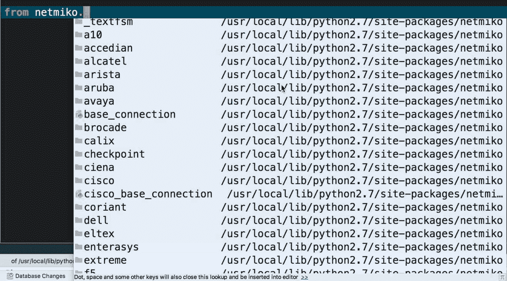
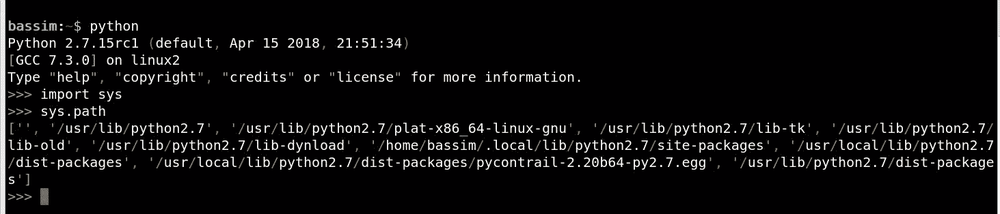
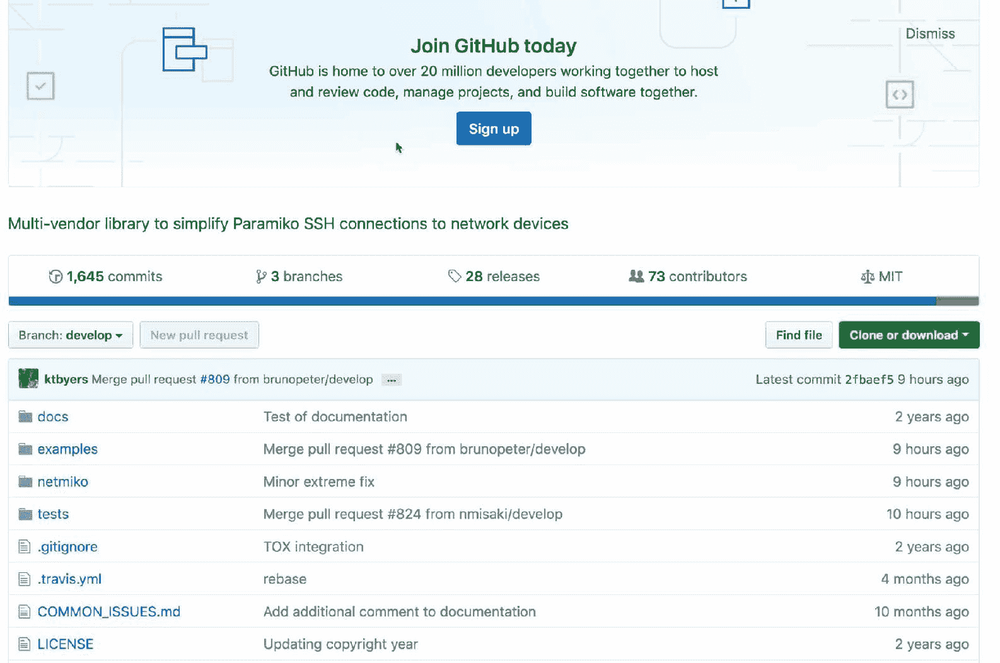
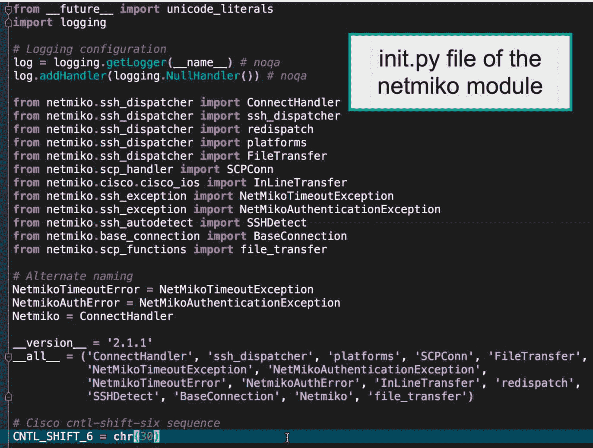
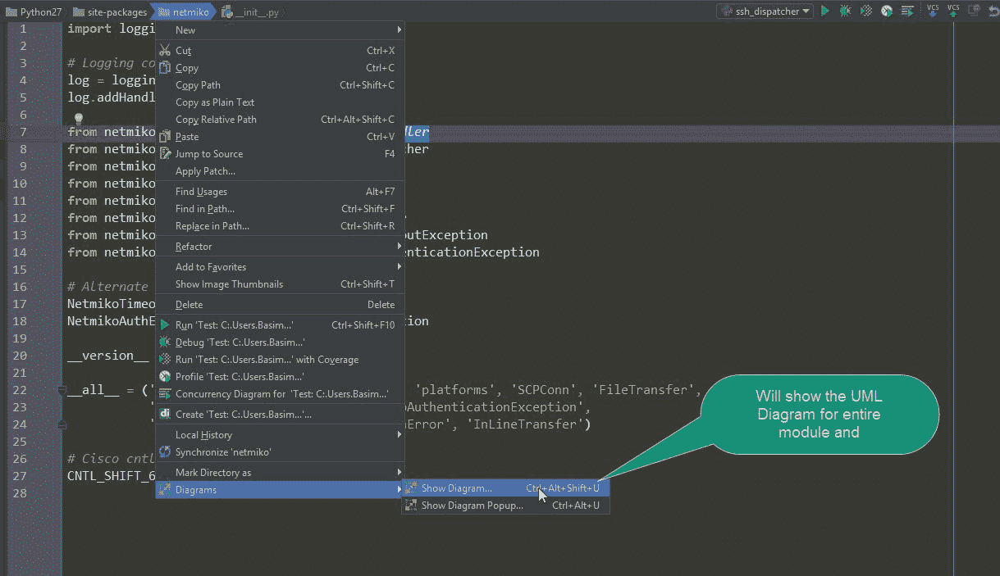
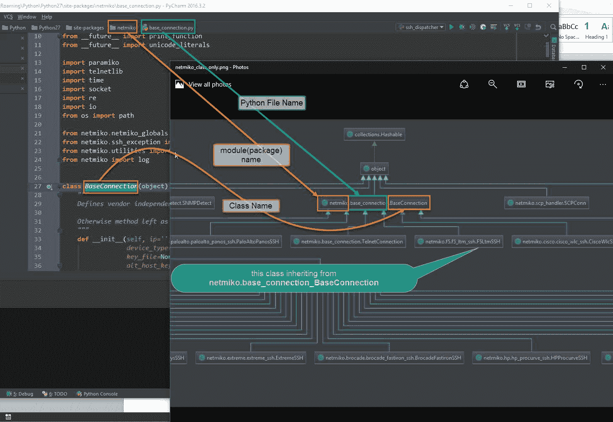
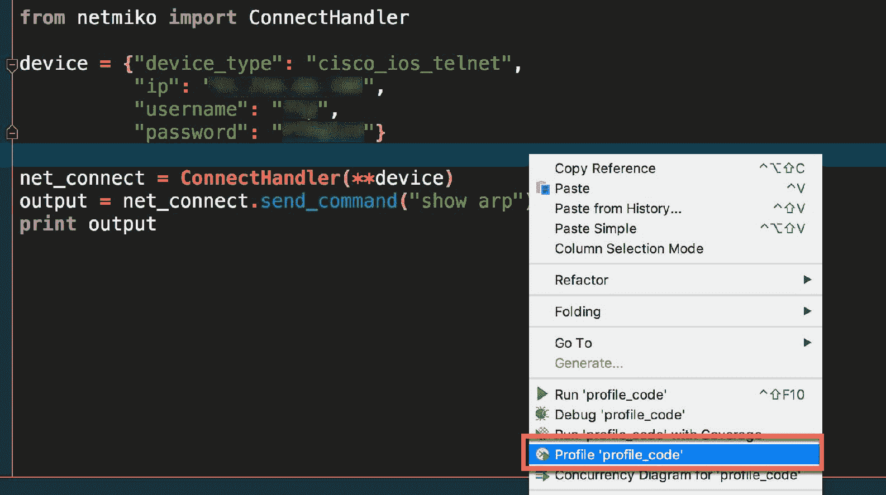

# 二、自动化中使用的公共库

本章将向您介绍 Python 包的结构以及目前用于自动化系统和网络基础设施的常用库。越来越多的 Python 包涵盖了网络自动化、系统管理以及管理公共和私有云。

此外，了解如何访问模块源代码以及 Python 包中的小部分如何相互关联也很重要，这样我们就可以修改代码、添加或删除功能，并再次与社区共享代码。

本章将介绍以下主题：

*   理解 Python 包
*   公共 Python 库
*   访问模块源代码

# 理解 Python 包

Python 核心代码实际上很小，其设计目的是保持简单性。大多数功能将通过添加第三方软件包和模块实现。

模块是一个 Python 文件，其中包含将在代码中使用的函数、语句和类。首先要做的是`import`模块然后开始使用其功能。

另一方面，**包**收集相互连接的相关模块，并将它们放在一个层次结构中。一些大型软件包，如`matplotlib`或`django`中有数百个模块，开发人员通常将相关模块分类到子目录中。例如，`netmiko`包包含多个子目录，每个子目录包含用于连接不同供应商的网络设备的模块：



这样做使包维护人员能够灵活地添加或删除每个模块的特性，而不会破坏全局包操作。

# 包搜索路径

通常，Python 在某些特定的系统路径中搜索模块。您可以通过导入`sys`模块并打印`sys.path`来打印这些路径。这将实际返回`PYTHONPATH`环境变量和操作系统内部的字符串；注意，结果只是一个普通的 Python 列表。您可以使用`insert()`等列表功能向搜索范围添加更多路径。

但是，最好在默认搜索路径中安装程序包，以便在与其他开发人员共享时代码不会中断：



具有单个模块的简单包结构如下所示：


每个包中的`__init__`文件（在全局目录或子目录中）将告诉 Python 解释器该目录是一个 Python 包，每个以`.py`结尾的文件将是一个模块文件，可以在代码中导入。`init`文件的第二个功能是在导入包后执行其中的任何代码。但是，大多数开发人员将其保留为空，只使用它将目录标记为 Python 包。

# 公共 Python 库

在下一节中，我们将探讨用于网络、系统和云自动化的常见 Python 库。

# 网络 Python 库

如今的网络环境包含来自许多供应商的多个设备，每个设备都扮演着不同的角色。网络设备的设计和自动化框架对于网络工程师来说是必不可少的，以便自动化重复的任务，提高他们通常的工作方式，同时减少人为错误。大型企业和服务提供商通常倾向于设计一个工作流，该工作流可以自动化不同的网络任务，并提高网络弹性和灵活性。工作流包含一系列相关任务，这些任务共同构成一个流程或工作流，当网络上需要更改时将执行该流程或工作流。

网络自动化框架可以在无需人工干预的情况下执行的一些任务包括：

*   问题的根本原因分析
*   检查和更新设备操作系统
*   发现节点之间的拓扑和关系
*   安全审计和合规性报告
*   根据应用程序需要从网络设备安装和退出路由
*   管理设备配置和回滚

以下是一些用于自动化网络设备的 Python 库：

| **网络库** | **说明** | **链路** |
| 奈特米科 | 多供应商库，支持网络设备的 SSHing 和 Telnet，并在其上执行命令。支持包括 Cisco、Arista、Juniper、HP、Ciena 和许多其他供应商。 | [https://github.com/ktbyers/netmiko](https://github.com/ktbyers/netmiko) |
| 凝固汽油弹 | 一个 Python 库，用作官方供应商 API 的包装器。它提供了抽象方法，可以连接到多个供应商的设备，并从中提取信息，同时以结构化格式返回输出。这可以很容易地由软件处理。 | [https://github.com/napalm-automation/napalm](https://github.com/napalm-automation/napalm) |
| 皮耶兹 | 用于管理和自动化 Juniper 设备的 Python 库。它可以从 Python 客户端在设备上执行 CRUD 操作。此外，它还可以检索有关设备的信息，例如管理 IP、序列号和版本。返回的输出将是 JSON 或 XML 格式。 | [https://github.com/Juniper/py-junos-eznc](https://github.com/Juniper/py-junos-eznc) |
| infoblox 客户端 | 一个 Python 客户机，用于通过接口与 infoblox NIOS 交互，该接口基于称为 WAPI 的 REST。 | [https://github.com/infobloxopen/infoblox-client](https://github.com/infobloxopen/infoblox-client) |
| NX-API | Cisco Nexus（仅限某些平台）系列 API，通过 HTTP 和 HTTPS 公开 CLI。您可以在提供的沙盒门户中输入 show 命令，它将转换为对设备的 API 调用，并以 JSON 和 XML 格式返回输出。 | [https://developer.cisco.com/docs/nx-os/#!使用 nx api cli](https://developer.cisco.com/docs/nx-os/#!working-with-nx-api-cli) |
| 皮亚皮 | 一个 Python 库，充当 Arista EOS eAPI 的包装器，用于配置 Arista EOS 设备。该库支持通过 HTTP 和 HTTPs 进行 eAPI 调用。 | [https://github.com/arista-eosplus/pyeapi](https://github.com/arista-eosplus/pyeapi) |
| NetAddress | 用于处理网络地址（如 IPv4、IPv6 和第 2 层地址（MAC 地址））的 Python 库。它可以对 IP 块进行迭代、切片、排序和汇总。 | [https://github.com/drkjam/netaddr](https://github.com/drkjam/netaddr) |
| 顺反式沥青 | 一个 Python 库，能够解析 Cisco IOS 样式的配置并以结构化格式返回输出。该库还支持基于大括号分隔的配置（如 Juniper 和 F5）的设备配置。 | [https://github.com/mpenning/ciscoconfparse](https://github.com/mpenning/ciscoconfparse) |
| NSoT | 用于跟踪网络设备的资源清册和元数据的数据库。它提供了一个基于 Python Django 的前端 GUI。后端基于存储数据的 SQLite 数据库。此外，它还使用 pynsot 绑定为清单提供 API 接口。 | [https://github.com/dropbox/nsot](https://github.com/dropbox/nsot) |
| 诺尼尔 | 基于 Python 的新自动化框架，直接从 Python 代码中使用，无需自定义**DSL**（**领域特定语言**）。Python 代码称为 runbook，包含一组可以针对存储在清单中的设备运行的任务（还支持 Ansible 清单格式）。这些任务可以利用其他库（如凝固汽油弹）获取信息或配置设备。 | [https://github.com/nornir-automation/nornir](https://github.com/nornir-automation/nornir) |

# 系统和云 Python 库

下面是一些可用于系统和云管理的 python 包。**亚马逊网络服务**（**AWS**）和谷歌等公共云提供商倾向于提供对其资源的开放和标准访问，以便轻松与组织 DevOps 模式集成。持续集成、测试和部署等阶段需要*连续*访问基础设施（虚拟化或裸机服务器），以完成代码生命周期。这不能手动完成，需要自动化：

| **图书馆** | **说明** | **链路** |
| 配置分析器 | Python 标准库，用于解析和处理 INI 文件。 | [https://github.com/python/cpython/blob/master/Lib/configparser.py](https://github.com/python/cpython/blob/master/Lib/configparser.py) |
| 帕拉米科 | Paramiko 是 SSHv2 协议的 Python（2.7,3.4+）实现，提供客户端和服务器功能。 | [https://github.com/paramiko/paramiko](https://github.com/paramiko/paramiko) |
| 熊猫 | 提供高性能、易于使用的数据结构和数据分析工具的库。 | [https://github.com/pandas-dev/pandas](https://github.com/pandas-dev/pandas) |
| `boto3` | 管理不同 AWS 操作的官方 Python 接口，例如创建 EC2 实例和 S3 存储。 | [https://github.com/boto/boto3](https://github.com/boto/boto3) |
| `google-api-python-client` | 谷歌云平台的谷歌官方 API 客户端库。 | [https://github.com/google/google-api-python-client](https://github.com/google/google-api-python-client) |
| `pyVmomi` | VMWare 提供的管理 ESXi 和 vCenter 的官方 Python SDK。 | [https://github.com/vmware/pyvmomi](https://github.com/vmware/pyvmomi) |
| PyMYSQL | 用于 MySQL DBMS 的纯 python MySQL 驱动程序。 | [https://github.com/PyMySQL/PyMySQL](https://github.com/PyMySQL/PyMySQL) |
| 心理医生 | 符合 DP-API 2.0 标准的 python PostgresSQL 适配器。 | [http://initd.org/psycopg/](http://initd.org/psycopg/) |
| 德扬戈 | 基于 Python 的高级开源 web 框架。该框架遵循**MVT**（**模型、视图和模板**架构设计，用于构建 web 应用程序，无需 web 开发和常见安全错误。 | [https://www.djangoproject.com/](https://www.djangoproject.com/) |
| `Fabric` | 一个简单的 Python 工具，用于基于 SSH 在远程设备上执行命令和软件部署。 | [https://github.com/fabric/fabric](https://github.com/fabric/fabric) |
| 斯卡皮 | 一个出色的基于 Python 的数据包操作，能够处理广泛的协议，并可以构建具有任何网络层组合的数据包；它还可以通过电线发送它们。 | [https://github.com/secdev/scapy](https://github.com/secdev/scapy) |
| 硒 | 用于自动执行 web 浏览器任务和 web 验收测试的 python 库。该库与用于 Firefox、Chrome 和 Internet Explorer 的 Selenium webdrivers 一起在 web 浏览器上运行测试。 | [https://pypi.org/project/selenium/](https://pypi.org/project/selenium/) |

您可以在以下链接中找到更多分类为不同区域的 python 包：[https://github.com/vinta/awesome-python](https://github.com/vinta/awesome-python) 。

# 访问模块源代码

您可以通过两种方式访问使用的任何模块的源代码。首先，进入[github.com](https://github.com/)的`module`页面，在一个地方查看所有文件、发布、提交和问题，如下面的屏幕截图所示。我已经通过`netmiko`模块维护器阅读了所有共享代码的访问权限，可以看到提交和文件内容的完整列表：



第二种方法是使用`pip`或 PyCharm GUI 在 Python 站点包目录中安装包本身。`pip`实际做的是去 GitHub 下载模块内容并运行`setup.py`来安装和注册模块。您可以看到模块文件，但这次您对所有文件都有完全的读/写访问权限，并且可以更改原始代码。例如，以下代码利用`netmiko`库连接到 Cisco 设备并在其上执行`show arp`命令：

```py
from netmiko import ConnectHandler

device = {"device_type": "cisco_ios",
          "ip": "10.10.88.110",
          "username": "admin",
          "password": "access123"}

net_connect = ConnectHandler(**device)
output = net_connect.send_command("show arp")
```

如果我想查看 netmiko 源代码，我可以去安装 netmiko 库的站点包并列出所有文件*或*我可以使用*Ctrl*并在 PyCharm 中左键单击模块名称。这将在新选项卡中打开源代码：



# 可视化 Python 代码

有没有想过 Python 自定义模块或类是如何制造的？开发人员如何编写 Python 代码并将其粘合在一起以创建这个漂亮而神奇的*x*模块？引擎盖下面发生了什么？

当然，文档是一个良好的开端，但我们都知道，它通常不会随着开发人员添加的每个新步骤或细节而更新。

例如，我们都知道 Kirk Byers 创建和维护的强大的 netmiko 库（[https://github.com/ktbyers/netmiko](https://github.com/ktbyers/netmiko) ）利用另一个流行的 SSH 库 Paramiko（[http://www.paramiko.org/](http://www.paramiko.org/) ）。但是我们不了解细节以及这些类之间的关系。如果您需要了解 netmiko（或任何其他库）背后的魔力，以便处理请求并返回结果，请遵循以下步骤（需要 PyCharm 专业版）。

Code visualization and inspection in PyCharm is not supported in PyCharm community edition and is only supported in the professional version.

以下是您需要遵循的步骤：

1.  转到 Python 库位置文件夹中的 netmiko 模块源代码（在 Windows 上通常为`C:\Python27\Lib\site-packages`，在 Linux 上通常为`/usr/local/lib/pyhon2.7/dist-packages`），然后从 PyCharm 打开该文件。
2.  右键单击地址栏中显示的模块名称，然后选择 Diagrams | Show Diagram。从弹出窗口中选择 Python 类图：



3.  PyCharm 将开始在`netmiko`模块中的所有类和文件之间构建依赖关系树，然后将其显示在同一窗口中。注意：此过程可能需要一些时间，具体取决于您的计算机内存。此外，最好将图形另存为外部图像以查看：


根据结果图，您可以看到 Netmiko 支持很多供应商，如 HP Comware、entrasys、Cisco ASA、Force10、Arista、Avaya 等，所有这些类都继承自`netmiko.cisco_base_connection.CicsoSSHConnection`父类（我认为这是因为它们使用与 Cisco 相同的 SSH 样式）。这反过来又继承了另一个名为`netmiko.cisco_base_connection.BaseConnection`的大型父类。

此外，您可以看到，Juniper 有自己的类（`netmiko.juniper.juniper_ssh.JuniperSSH`，它直接连接到大父级。最后，我们连接到 python 中所有父类的父类：`Object`类（记住 python 中的所有内容最终都是一个对象）。

您可以找到许多有趣的东西，例如*SCP 传输*类和*SNMP*类，每一个都可以找到用于初始化该类的方法和参数。

因此`ConnectHandler`方法主要用于检查供应商类中的`device_type`可用性，并根据返回的数据使用相应的 SSH 类：



可视化代码的另一种方法是查看代码执行过程中哪些模块和函数被命中。这称为评测，它允许您在运行时检查函数。

首先，您需要像往常一样编写代码，然后右键单击空白区域并选择 profile，而不是像往常一样运行代码：



等待代码执行。这次 PyCharm 将检查从代码中调用的每个文件，并为执行生成*调用图*，以便您可以轻松知道使用了哪些文件和函数，并计算每个文件和函数的执行时间：


正如您在前面的图中所看到的，我们在`profile_code.py`（图的底部）中的代码将调用`ConnectHandler()`函数，该函数将依次执行`__init__.py`，并继续执行。在图的左侧，您可以看到它在代码执行期间接触的所有文件。

# 总结

在本章中，我们探讨了 Python 中提供的一些最流行的网络、系统和云包。此外，我们还学习了如何访问模块源代码并将其可视化，以便更好地理解内部代码。我们在运行时查看了代码的调用流。在下一章中，我们将开始构建一个实验室环境，并将代码应用于该环境。