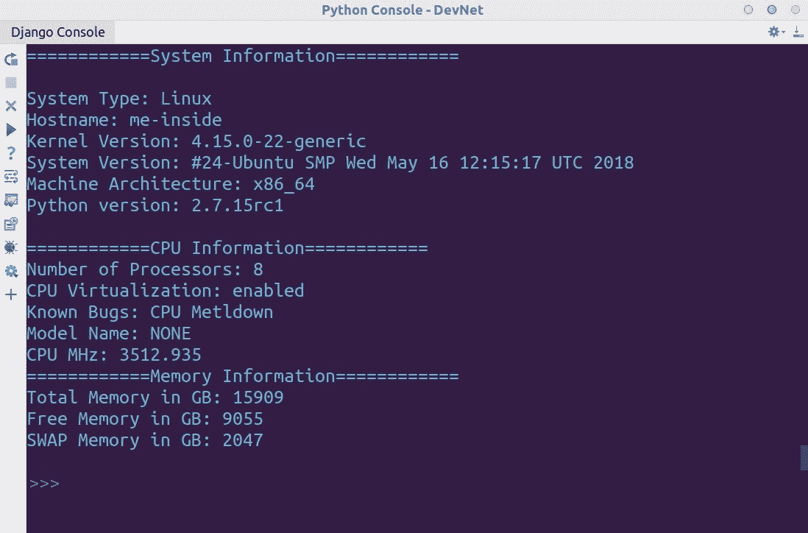
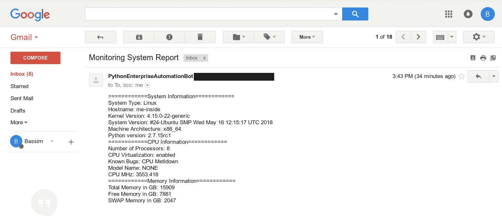

# 十一、生成系统报告和系统监控

收集数据和生成定期系统报告是任何系统管理员的基本任务，自动化这些任务可以帮助我们尽早发现问题，以便为问题提供解决方案。在本章中，我们将看到一些行之有效的方法，用于自动化从服务器收集数据并将数据生成正式报告。我们将学习如何使用 Python 和 Ansible 管理新用户和现有用户。此外，我们将深入日志分析和监控系统**关键绩效指标**（**KPI**）。您可以计划定期运行监视脚本。

本章将介绍以下主题：

*   从 Linux 收集数据
*   在 Ansible 中管理用户

# 从 Linux 收集数据

本机 Linux 命令提供有关当前系统状态和运行状况的有用数据。然而，这些 Linux 命令和实用程序中的每一个都只关注从系统的一个方面获取数据。我们需要利用 Python 模块将这些细节返回给管理员，并生成有用的系统报告。

我们将把报告分为两部分。第一部分是通过`platform`模块获取系统的一般信息，第二部分是从 CPU 和内存方面探索硬件资源。

我们将首先利用`platform`模块，它是 Python 内部的内置库。`platform`模块包含许多方法，可用于获取 Python 操作系统的详细信息：

```py
import platform
system = platform.system()
print(system)
```


在 Windows 计算机上运行相同的脚本将导致不同的输出，反映当前系统。因此，当我们在 Windows PC 上运行它时，我们将得到`Windows`作为脚本的输出：


另一个有用的函数是`uname()`，它与 Linux 命令（`uname -a`的作用相同：检索机器的主机名、体系结构和内核，但采用结构化格式，以便您可以通过引用其索引来匹配任何值：

```py
import platform
from pprint import pprint
uname = platform.uname()
pprint(uname)
```


第一个值是系统类型，我们使用`system()`方法获得，第二个值是当前机器的主机名。

您可以使用 PyCharm 中的 autocomplete 浏览并列出`platform`模块中所有可用的函数；您可以按*CTRL*+*Q*查看每个功能的文档：


设计脚本的第二部分是使用 Linux 文件提供的信息来探索 Linux 机器中的硬件配置。请记住，CPU、内存和网络信息可以从`/proc/`下访问；我们将阅读此信息，并使用 Python 中的标准`open()`函数访问它。您可以通过阅读和探索`/proc/`获得更多关于可用资源的信息。

**脚本：**

这是导入`platform`模块的第一步。仅此任务需要它：

```py
#!/usr/bin/python
__author__ = "Bassim Aly"
__EMAIL__ = "basim.alyy@gmail.com"

import platform
```

此代码段包含本练习中使用的函数；我们将设计两个功能-`check_feature()`和`get_value_from_string()`：

```py
def check_feature(feature,string):
    if feature in string.lower():
        return True
    else:
        return False

def get_value_from_string(key,string):
    value = "NONE"
    for line in string.split("\n"):
        if key in line:
            value = line.split(":")[1].strip()
    return value
```

最后，以下是 Python 脚本的主体，它包含获取所需信息的 Python 逻辑：

```py
cpu_features = []
with open('/proc/cpuinfo') as cpus:
    cpu_data = cpus.read()
    num_of_cpus = cpu_data.count("processor")
    cpu_features.append("Number of Processors: {0}".format(num_of_cpus))
    one_processor_data = cpu_data.split("processor")[1]
    print one_processor_data
    if check_feature("vmx",one_processor_data):
        cpu_features.append("CPU Virtualization: enabled")
    if check_feature("cpu_meltdown",one_processor_data):
        cpu_features.append("Known Bugs: CPU Metldown ")
    model_name = get_value_from_string("model name ",one_processor_data)
    cpu_features.append("Model Name: {0}".format(model_name))

    cpu_mhz = get_value_from_string("cpu MHz",one_processor_data)
    cpu_features.append("CPU MHz: {0}".format((cpu_mhz)))

memory_features = []
with open('/proc/meminfo') as memory:
    memory_data = memory.read()
    total_memory = get_value_from_string("MemTotal",memory_data).replace(" kB","")
    free_memory = get_value_from_string("MemFree",memory_data).replace(" kB","")
    swap_memory = get_value_from_string("SwapTotal",memory_data).replace(" kB","")
    total_memory_in_gb = "Total Memory in GB: {0}".format(int(total_memory)/1024)
    free_memory_in_gb = "Free Memory in GB: {0}".format(int(free_memory)/1024)
    swap_memory_in_gb = "SWAP Memory in GB: {0}".format(int(swap_memory)/1024)
    memory_features = [total_memory_in_gb,free_memory_in_gb,swap_memory_in_gb]

```

本部分用于打印从上一节获得的信息：

```py
print("============System Information============")

print("""
System Type: {0}
Hostname: {1}
Kernel Version: {2}
System Version: {3}
Machine Architecture: {4}
Python version: {5}
""".format(platform.system(),
           platform.uname()[1],
           platform.uname()[2],
           platform.version(),
           platform.machine(),
           platform.python_version()))

print("============CPU Information============")
print("\n".join(cpu_features))

print("============Memory Information============")
print("\n".join(memory_features))
```

在前面的示例中，执行了以下步骤：

1.  首先，我们打开`/proc/cpuinfo`并读取其内容，然后将结果存储在`cpu_data`中。
2.  通过使用`count()`字符串函数计算关键字`processor`可以找到文件中的处理器数量。
3.  然后，我们需要获得每个处理器的可用选项和功能。为此，我们只得到一个处理器条目（因为它们通常彼此相同），并将其传递给`check_feature()`函数。此方法接受我们要在一个参数中搜索的特征，另一个是处理器数据，如果处理器数据中有该特征，则返回`True`。
4.  处理器数据以键值对的形式提供。因此，我们设计了`get_value_from_string()`方法，该方法接受密钥名称，并通过迭代处理器数据来搜索其对应的值；然后，我们将对每个返回的键值对使用`:`分隔符进行拆分，以仅获取值。

5.  所有这些值都使用`append()`方法添加到`cpu_feature`列表中。
6.  然后，我们对内存信息重复相同的操作，以获得总内存、可用内存和交换内存。
7.  接下来，我们使用平台的内置方法，如`system()`、`uname()`、`python_version()`来获取系统的相关信息。
8.  最后，我们打印了包含上述信息的报告。

可以在以下屏幕截图中看到脚本输出：



Another way to represent the generated data is to leverage the `matplotlib` library that we used in [Chapter 5](05.html#2IV0U0-9cfcdc5beecd470bbeda046372f0337f), *Extracting Useful Data for Network Devices*, to visualize data over time.

# 通过电子邮件发送生成的数据

上一节生成的报告很好地概述了系统上当前的资源。但是，我们可以调整脚本并扩展其功能，向我们发送一封包含所有详细信息的电子邮件。这对于**网络运营中心**（**NoC**团队非常有用，该团队可以根据特定事件（硬盘故障、高 CPU 或丢包）接收来自受监控系统的电子邮件。Python 有一个名为`smtplib`的内置库，它利用**简单邮件传输协议**（**SMTP**，负责从邮件服务器发送和接收电子邮件。

这要求您的计算机上有本地电子邮件服务器，或者使用免费的在线电子邮件服务，如 Gmail 或 Outlook。对于本例，我们将登录到[http://www.gmail.com](http://www.gmail.com) 使用 SMTP 发送包含我们数据的电子邮件。

无需进一步的 ado，我们将修改脚本并向其添加 SMTP 支持。

我们将把所需的模块导入 Python。同样，此任务需要`smtplib`和`platform`：

```py
#!/usr/bin/python
__author__ = "Bassim Aly"
__EMAIL__ = "basim.alyy@gmail.com"

import smtplib
imp        ort platform
```

这是包含`check_feature()`和`get_value_from_string()`函数的函数部分：

```py
def check_feature(feature,string):
    if feature in string.lower():
        return True
    else:
        return False

def get_value_from_string(key,string):
    value = "NONE"
    for line in string.split("\n"):
        if key in line:
            value = line.split(":")[1].strip()
    return value
```

最后，Python 脚本的主体如下所示，包含获取所需信息的 Python 逻辑：

```py
cpu_features = []
with open('/proc/cpuinfo') as cpus:
    cpu_data = cpus.read()
    num_of_cpus = cpu_data.count("processor")
    cpu_features.append("Number of Processors: {0}".format(num_of_cpus))
    one_processor_data = cpu_data.split("processor")[1]
    if check_feature("vmx",one_processor_data):
        cpu_features.append("CPU Virtualization: enabled")
    if check_feature("cpu_meltdown",one_processor_data):
        cpu_features.append("Known Bugs: CPU Metldown ")
    model_name = get_value_from_string("model name ",one_processor_data)
    cpu_features.append("Model Name: {0}".format(model_name))

    cpu_mhz = get_value_from_string("cpu MHz",one_processor_data)
    cpu_features.append("CPU MHz: {0}".format((cpu_mhz)))

memory_features = []
with open('/proc/meminfo') as memory:
    memory_data = memory.read()
    total_memory = get_value_from_string("MemTotal",memory_data).replace(" kB","")
    free_memory = get_value_from_string("MemFree",memory_data).replace(" kB","")
    swap_memory = get_value_from_string("SwapTotal",memory_data).replace(" kB","")
    total_memory_in_gb = "Total Memory in GB: {0}".format(int(total_memory)/1024)
    free_memory_in_gb = "Free Memory in GB: {0}".format(int(free_memory)/1024)
    swap_memory_in_gb = "SWAP Memory in GB: {0}".format(int(swap_memory)/1024)
    memory_features = [total_memory_in_gb,free_memory_in_gb,swap_memory_in_gb]

Data_Sent_in_Email = ""
Header = """From: PythonEnterpriseAutomationBot <basim.alyy@gmail.com>
To: To Administrator <basim.alyy@gmail.com>
Subject: Monitoring System Report

"""
Data_Sent_in_Email += Header
Data_Sent_in_Email +="============System Information============"

Data_Sent_in_Email +="""
System Type: {0}
Hostname: {1}
Kernel Version: {2}
System Version: {3}
Machine Architecture: {4}
Python version: {5}
""".format(platform.system(),
           platform.uname()[1],
           platform.uname()[2],
           platform.version(),
           platform.machine(),
           platform.python_version())

Data_Sent_in_Email +="============CPU Information============\n"
Data_Sent_in_Email +="\n".join(cpu_features)

Data_Sent_in_Email +="\n============Memory Information============\n"
Data_Sent_in_Email +="\n".join(memory_features)

```

最后，我们需要用一些值填充变量以正确连接到`gmail`服务器：

```py
fromaddr = 'yyyyyyyyyyy@gmail.com'
toaddrs  = 'basim.alyy@gmail.com'
username = 'yyyyyyyyyyy@gmail.com'
password = 'xxxxxxxxxx'
server = smtplib.SMTP('smtp.gmail.com:587')
server.ehlo()
server.starttls()
server.login(username,password)

server.sendmail(fromaddr, toaddrs, Data_Sent_in_Email)
server.quit()
```

在前面的示例中，以下内容适用：

1.  第一部分与原始示例相同，但我们没有将数据打印到终端，而是将其添加到`Data_Sent_in_Email`变量中。
2.  `Header`变量表示包含发件人地址、收件人地址和电子邮件主题的电子邮件头。
3.  我们使用`smtplib`模块中的`SMTP()`类连接到公共 Gmail SMTP 服务器并协商 TTLS 连接。这是连接到 Gmail 服务器时的默认方法。我们将 SMTP 连接保存在`server`变量中。

4.  现在我们通过`login()`方式登录服务器，最后通过`sendmail()`功能发送邮件。`sendmail()`接受三个参数：发件人、收件人和电子邮件正文。
5.  最后，我们关闭与服务器的连接：

**脚本输出**



# 使用时间和日期模块

伟大的到目前为止，我们已经能够通过电子邮件发送从服务器生成的自定义数据。但是，由于网络拥塞、邮件系统故障或任何其他原因，生成的数据与电子邮件的传递时间之间可能存在时间差。因此，我们不能依靠电子邮件将交付时间与实际事件时间关联起来。

因此，我们将使用 Python`datetime`模块跟踪监控系统上的当前时间。此模块可以将时间格式化为许多属性，例如年、月、日、小时和分钟。

除此之外，`datetime`模块中的`datetime`实例实际上是 Python 中的一个独立对象（如 int、string、boolean 等）；因此，它在 Python 中有自己的属性。

要将`datetime`对象转换为字符串，可以使用`strftime()`方法，该方法作为创建对象内部的属性提供。此外，它还提供了使用以下指令格式化时间的方法：

| **指令** | **意思是** |
| `%Y` | 返回年份，从 0001 到 9999 |
| `%m` | 返回月份号 |
| `%d` | 返回当月的日期 |
| `%H` | 返回小时数，0-23 |
| `%M` | 返回分钟数，0-59 |
| `%S` | 返回秒数，0-59 |

因此，我们将调整脚本并将以下代码片段添加到代码中：

```py
from datetime import datetime
time_now = datetime.now()
time_now_string = time_now.strftime("%Y-%m-%d %H:%M:%S")
Data_Sent_in_Email += "====Time Now is {0}====\n".format(time_now_string) 

```

首先，我们从`datetime`模块导入`datetime`类。然后，我们使用`datetime`类和`now()`函数创建`time_now`对象，该函数返回运行系统上的当前时间。最后，我们使用带有指令的`strftime()`将时间格式化为特定格式，并将其转换为字符串进行打印（请记住，该对象有一个`datetime`对象）。

脚本的输出如下所示：


# 定期运行脚本

脚本中的最后一步是安排脚本按时间间隔运行。这可以是每天、每周、每小时或在特定时间。这可以在 Linux 系统上使用`cron`作业来完成。`cron`用于安排重复事件，例如清理目录、备份数据库、旋转日志或任何您能想到的事情。

要查看计划的当前作业，请使用以下命令：

```py
crontab -l
```

要编辑`crontab`，请使用`-e`开关。如果这是您第一次运行`cron`，系统将提示您使用您喜爱的编辑器（`nano`或`vi`。

典型的`crontab`由五颗星组成，每颗星代表一个时间条目：

| **字段** | **值** |
| 分钟 | 0-59 |
| 小时 | 0-23 |
| 月日 | 1-31 |
| 月 | 1-12 |
| 星期几 | 0-6（星期日-星期六） |

例如，如果需要安排作业在每周五晚上 9:00 运行，则将使用以下条目：

```py
0 21 * * 5 /path/to/command
```

如果您需要在每天上午 12:00 有一个命令（例如备份），请使用以下`cron`作业：

```py
0 0 * * * /path/to/command
```

此外，您还可以计划每隔特定间隔以*运行`cron`。例如，如果您需要每`5`分钟运行一次作业，请使用此`cron`作业：*

```py
*/5 * * * * /path/to/command
```

回到我们的剧本；我们可以安排它每天早上 7:30 运行：

```py
30 7 * * * /usr/bin/python /root/Send_Email.py
```

最后，记得在退出之前保存`cron`作业。

It's better to provide a full command path to Linux, rather than a relative path, to avoid any potential issues.

# 在 Ansible 中管理用户

现在，我们将讨论如何管理不同系统中的用户。

# Linux 系统

Ansible 提供了强大的用户管理模块来管理系统上的不同任务。我们有一章专门讨论 Ansible（[第 13 章](13.html#506UG0-9cfcdc5beecd470bbeda046372f0337f)、*Ansible 负责系统管理*），但在本章中，我们将探讨它在公司基础设施中管理用户帐户的能力。

有时，公司允许 root 访问所有用户，以摆脱用户管理的头痛；就安全性和审计而言，这不是一个好的解决方案。最好的做法是将正确的权限授予正确的用户，并在用户离开公司后撤销这些权限。

Ansible 提供了一种无与伦比的方式，通过密码或无密码（SSH 密钥）访问跨多台服务器管理用户。

在 Linux 系统中创建用户时，还需要考虑一些其他事项。用户必须拥有 shell（如 Bash、CSH、ZSH 等）才能登录到服务器。此外，用户应该有一个主目录（通常在`/home`下）。最后，用户必须位于决定其权限的组中。

我们的第一个示例是使用 ad hoc 命令在远程服务器中创建一个具有 SSH 密钥的用户。密钥源在`ansible`塔台，我们在`all`服务器上执行命令：

```py
ansible all -m copy -a "src=~/id_rsa dest=~/.ssh/id_rsa mode=0600"
```

第二个示例是使用 Playbook 创建用户：

```py
---
- hosts: localhost
  tasks:
    - name: create a username
      user:
        name: bassem
        password: "$crypted_value$"
        groups:
          - root
        state: present
        shell: /bin/bash
        createhome: yes
        home: /home/bassem
```

让我们看看任务的参数：

*   在我们的任务中，我们使用一个包含多个参数的用户模块，例如为用户设置用户名的`name`。
*   第二个参数是`password`，在这里我们设置了用户的密码，但格式是加密的。您需要使用`mkpasswd`命令，它会提示您输入密码并生成哈希值。
*   `groups`是用户所属组的列表；因此，用户将继承权限。可以在此字段中使用逗号分隔的值。
*   `state`用于告知 Ansible 是创建用户还是删除用户。
*   您可以在`shell`参数中定义用于远程访问的用户 shell。
*   `createhome`和`home`是用于指定用户家乡位置的参数。

另一个参数是`ssh_key_file`，它指定 SSH 文件名。此外，`ssh_key_passphrase`将指定 SSH 密钥的密码短语。

# 微软视窗

Ansible 提供`win_user`模块来管理本地 Windows 用户帐户。在 active directory 域或 Microsoft SQL 数据库（`mssql`上创建用户时，或在普通 PC 上创建默认帐户时，这非常有用。以下示例将创建一个名为`bassem`的用户，并为其提供密码`access123`。这里的区别在于，密码是以明文形式给出的，而不是以加密值形式给出的，就像在基于 Unix 的系统中一样：

```py
- hosts: localhost
  tasks:
    - name: create user on windows machine
      win_user:
        name: bassem
        password: 'access123'
        password_never_expires: true
        account_disabled: no
        account_locked: no
        password_expired: no
        state: present
        groups:
          - Administrators
          - Users
```

`password_never_expires`参数将防止 Windows 在特定时间后使密码过期；这在创建管理员和默认帐户时非常有用。另一方面，`password_expired`如果设置为`yes`，将要求用户输入新密码，并在首次登录时更改密码。

`groups`参数将从列出的值或逗号分隔的组列表中添加用户。这取决于`groups_action`参数，可以是`add`、`replace`或`remove`。

最后，州政府将告诉 Ansible 应该对用户做什么。此参数可以是`present`、`absent`或`query`。

# 总结

在本章中，我们学习了如何从 Linux 机器收集数据和报告，并使用时间和日期模块通过电子邮件发出警报。我们还学习了如何在 Ansible 中管理用户。

在下一章中，我们将学习如何使用 Python 连接器与 DBMS 交互。