# 六、调试和分析 CUDA 代码

在本章中，我们将最终学习如何使用几种不同的方法和工具调试和评测 GPU 代码。虽然我们可以使用诸如 Spyder 和 PyCharm 之类的 IDE 轻松地调试纯 Python 代码，但我们不能使用这些工具来调试实际的 GPU 代码，记住 GPU 代码本身是用 CUDA-C 编写的，而 PyCUDA 提供了一个接口。调试 CUDA 内核的第一个也是最简单的方法是使用 OrthT0}语句，我们可以直接调用 CUDA 内核的中间来打印到标准输出。我们将了解如何在 CUDA 上下文中使用`printf`以及如何有效地将其应用于调试

接下来，我们将填补我们的 CUDA—C 编程中的一些空白，以便我们可以直接在 NVIDIA NVIEW IDE 中编写 CUDA 程序，这将允许我们在 CUAD-C 中为我们编写的一些代码编写测试用例。我们将看一看如何编译 CUDA-C 程序，既可以使用`nvcc`命令行，也可以使用 Nsight IDE。然后，我们将了解如何在 Nsight 中进行调试，并使用 Nsight 了解 CUDA lockstep 属性。最后，我们将概述 NVIDIA 命令行和视觉剖析器来分析我们的代码。

本章的学习成果包括以下内容：

*   有效地使用`printf`作为 CUDA 内核的调试工具
*   在 Python 之外编写完整的 CUDA-C 程序，特别是用于创建调试测试用例
*   用`nvcc`编译器在命令行上编译 CUDA-C 程序
*   用 NVIDIA NIVE IDE 开发和调试 CUDA 程序
*   了解 CUDA warp lockstep 属性以及为什么我们应该避免单个 CUDA warp 内的分支发散
*   学会有效地使用 NVIDIA 命令行和视觉剖析器进行 GPU 代码

# 技术要求

本章要求 Linux 或 Windows 10 PC 配备现代 NVIDIA GPU（2016 年及以后），并安装所有必要的 GPU 驱动程序和 CUDA 工具包（9.0 及以后）。还需要使用 PyCUDA 模块安装合适的 Python 2.7（如 Anaconda Python 2.7）。

本章的代码也可在 GitHub 的[上找到 https://github.com/PacktPublishing/Hands-On-GPU-Programming-with-Python-and-CUDA](https://github.com/PacktPublishing/Hands-On-GPU-Programming-with-Python-and-CUDA) 。

For more information about the prerequisites, check the *Preface* of this book, and for the software and hardware requirements, check the README in [https://github.com/PacktPublishing/Hands-On-GPU-Programming-with-Python-and-CUDA](https://github.com/PacktPublishing/Hands-On-GPU-Programming-with-Python-and-CUDA).

# 在 CUDA 内核中使用 printf

这可能会让人惊讶，但实际上我们可以直接在 CUDA 内核中将文本打印到标准输出；不仅如此，每个线程都可以打印自己的输出。当我们调试内核时，这将特别有用，因为我们可能需要在代码中的特定点监视特定变量或计算的值，并且它还将使我们摆脱使用调试器一步一步地进行调试的束缚。从 CUDA 内核打印输出是用所有 C/C++编程中最基本的函数完成的，大多数人在用 C:`printf`编写第一个`Hello world`程序时都会学习这个函数。当然，`printf`是将字符串打印到标准输出的标准函数，在 C 编程语言中与 Python 的`print`函数等效

在我们了解如何在 CUDA 中使用`printf`之前，让我们先简要回顾一下如何使用`printf`。首先要记住的是`printf`总是将字符串作为其第一个参数；所以用 C 语言打印“Hello world！”是用`printf("Hello world!\n");`完成的。（当然，`\n`表示“新行”或“返回”，这会将终端中的输出移动到下一行。）`printf`还可以在我们想要直接从 C 中打印任何常量或变量的情况下获取可变数量的参数：如果我们想要将`123`整数打印到输出中，我们可以使用`printf("%d", 123);`进行此操作（其中`%d`表示字符串后面有一个整数。）

类似地，我们使用`%f`、`%e`或`%g`来打印浮点值（其中`%f`是十进制表示法，`%e`是科学表示法，`%g`是十进制或科学表示法中最短的表示法）。我们甚至可以在一行中打印多个值，记住按正确的顺序放置这些说明符：`printf("%d is a prime number, %f is close to pi, and %d is even.\n", 17, 3.14, 4);`将在终端上打印“17 是素数，3.14 接近 pi，4 是偶数”。

现在，本书快完成一半的时候，我们将最终开始在 CUDA 中创建我们的第一个并行`Hello world`程序！我们首先将适当的模块导入 Python，然后编写内核。首先，我们将打印每个单独线程的线程和网格标识（我们将仅在一维块和网格中启动，因此我们只需要`x`值）：

```py
ker = SourceModule('''
__global__ void hello_world_ker()
{
    printf("Hello world from thread %d, in block %d!\\n", threadIdx.x, blockIdx.x);
```

让我们停下来，注意我们写的是`\\n`而不是`\n`。这是因为 Python 中的三重引号本身会将`\n`解释为“新行”，因此我们必须指出，我们的意思是使用双反斜杠，以便将`\n`直接传递到 CUDA 编译器。

现在，我们将打印有关块和网格尺寸的一些信息，但我们希望确保在每个线程完成其初始`printf`命令后打印这些信息。我们可以通过加入`__syncthreads();`来确保在第一个`printf`函数执行后，每个线程都会同步。

现在，我们只想在终端上打印一次块和网格尺寸；如果我们把`printf`语句放在这里，每个线程都会打印出相同的信息。我们可以通过在输出中只打印一个指定的线程来实现这一点；让我们来看第 0 个块的第 0 个线程，它是唯一保证存在的线程，无论我们选择的块和网格维度如何。我们可以用 C`if`语句来实现这一点：

```py
 if(threadIdx.x == 0 && blockIdx.x == 0)
 {
```

现在，我们将打印块和网格的维度，并关闭`if`语句，这将是 CUDA 内核的结尾：

```py
 printf("-------------------------------------\\n");
 printf("This kernel was launched over a grid consisting of %d blocks,\\n", gridDim.x);
 printf("where each block has %d threads.\\n", blockDim.x);
 }
}
''')
```

我们现在将提取内核，然后在由两个块组成的网格上启动它，其中每个块有五个线程：

```py
hello_ker = ker.get_function("hello_world_ker")
hello_ker( block=(5,1,1), grid=(2,1,1) )
```

让我们现在就运行这个程序（这个程序也可以在存储库的`6`下的`hello-world_gpu.py`中找到）：


# 使用 printf 进行调试

在继续之前，让我们看一个例子，看看如何使用`printf`调试 CUDA 内核。这种方法没有确切的科学依据，但它是一种可以通过经验学习的技能。我们将从一个用于矩阵乘法的 CUDA 内核开始，但它有几个 bug。（鼓励读者在阅读过程中仔细阅读代码，该代码可以作为存储库中`6`目录中的`broken_matrix_ker.py`文件获得。）

在继续之前，让我们简要回顾一下矩阵乘法。假设我们有两个矩阵*A*和*B*，我们将它们相乘得到另一个矩阵*C*，其大小如下：。我们通过迭代所有元组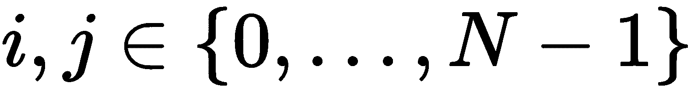并将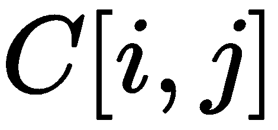的值设置为*A*的*i*<sup xmlns:epub="http://www.idpf.org/2007/ops" class="calibre54">第</sup>行与【T20 B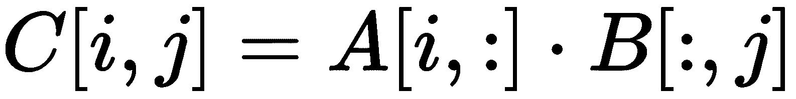的*j*第<sup xmlns:epub="http://www.idpf.org/2007/ops" class="calibre54">第</sup>列的点积。

换句话说，我们将输出矩阵*C*中的每个*i，j*元素设置如下：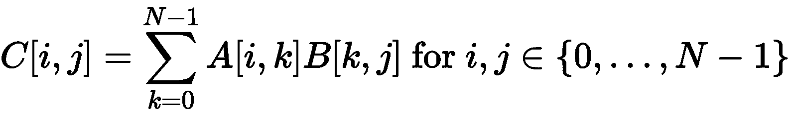

假设我们已经编写了一个内核来执行矩阵乘法，它接受两个表示输入矩阵的数组、一个额外的预分配浮点数组（输出将写入该数组）和一个表示每个矩阵的高度和宽度的整数（我们将假设所有矩阵都是相同大小和方形的）。这些矩阵都将以行式一维布局表示为一维`float *`数组。此外，这将实现为每个 CUDA 线程将处理输出矩阵中的单个行/列元组。

我们制作了一个小测试用例，并对照 CUDA 中矩阵乘法的输出进行检查，它在两个 4 x 4 矩阵上的断言检查失败，如下所示：

```py
test_a = np.float32( [xrange(1,5)] * 4 )
test_b = np.float32([xrange(14,10, -1)]*4 )
output_mat = np.matmul(test_a, test_b)

test_a_gpu = gpuarray.to_gpu(test_a)
test_b_gpu = gpuarray.to_gpu(test_b)
output_mat_gpu = gpuarray.empty_like(test_a_gpu)

matrix_ker(test_a_gpu, test_b_gpu, output_mat_gpu, np.int32(4), block=(2,2,1), grid=(2,2,1))

assert( np.allclose(output_mat_gpu.get(), output_mat) )
```

我们将立即运行此程序，并毫不奇怪地获得以下输出：

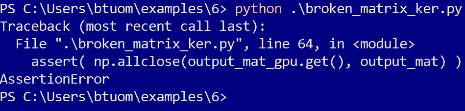

现在让我们看一下 CUDA C 代码，它由一个内核和一个设备函数组成：

```py
ker = SourceModule('''
// row-column dot-product for matrix multiplication
__device__ float rowcol_dot(float *matrix_a, float *matrix_b, int row, int col, int N)
{
 float val = 0;

 for (int k=0; k < N; k++)
 {
     val += matrix_a[ row + k*N ] * matrix_b[ col*N + k];
 }
 return(val);
}

// matrix multiplication kernel that is parallelized over row/column tuples.

__global__ void matrix_mult_ker(float * matrix_a, float * matrix_b, float * output_matrix, int N)
{
 int row = blockIdx.x + threadIdx.x;
 int col = blockIdx.y + threadIdx.y;

 output_matrix[col + row*N] = rowcol_dot(matrix_a, matrix_b, col, row, N);
}
''')
```

我们的目标是在我们的 CUDA 代码中智能地放置`printf`调用，以便我们能够监控内核和设备函数中的许多适当的值和变量；我们还应该确保在每次`printf`调用时将线程和块编号与这些值一起打印出来。

让我们从内核的入口点开始。我们看到两个变量，`row`和`col`，所以我们应该马上检查它们。设置好后，我们把下面的一行放在右边（因为这是在二维上并行的，所以我们应该打印`threadIdx`和`blockIdx`的*x*和*y*值）：

```py
printf("threadIdx.x,y: %d,%d blockIdx.x,y: %d,%d -- row is %d, col is %d.\\n", threadIdx.x, threadIdx.y, blockIdx.x, blockIdx.y, row, col);
```

再次运行代码，我们得到以下输出：

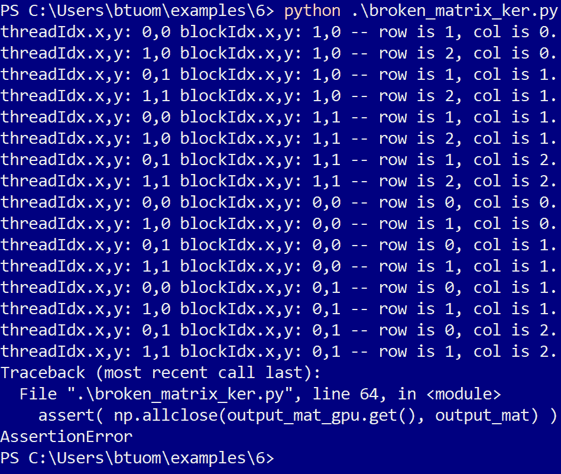

有两件事情非常突出：行和列元组有重复的值（每个单独的元组只应表示一次），行和列的值永远不会超过 2，当它们都应该达到 3 时（因为此单元测试使用 4 x 4 矩阵）。这应该向我们表明，我们计算行和列的值是错误的；事实上，我们忘记了用`blockIdx`值乘以`blockDim`值来找到目标行/列值。我们按如下方式解决此问题：

```py
int row = blockIdx.x*blockDim.x + threadIdx.x;
int col = blockIdx.y*blockDim.y + threadIdx.y;
```

但是，如果我们再次运行该程序，仍然会出现断言错误。让我们保留原始的`printf`调用，这样我们可以在继续时监视这些值。我们看到内核中有一个对设备函数的调用，`rowcol_dot`，所以我们决定研究一下。让我们首先通过在开始处进行`printf`调用来确保变量被正确地传递到设备函数中：

```py
printf("threadIdx.x,y: %d,%d blockIdx.x,y: %d,%d -- row is %d, col is %d, N is %d.\\n", threadIdx.x, threadIdx.y, blockIdx.x, blockIdx.y, row, col, N);
```

当我们运行我们的程序时，会出现更多的行，然而，我们会看到一行写着-`threadIdx.x,y: 0,0 blockIdx.x,y: 1,0 -- row is 2, col is 0.`，另一行写着-`threadIdx.x,y: 0,0 blockIdx.x,y: 1,0 -- row is 0, col is 2, N is 4`。通过`threadIdx`和`blockIdx`值，我们可以看到这是同一块中的同一个线程，但是`row`和`col`值是相反的。事实上，当我们查看`rowcol_dot`设备函数的调用时，我们看到`row`和`col`确实与设备函数声明中的调用相反。我们修复了这个问题，但是当我们再次运行程序时，我们会得到另一个断言错误。

让我们在`for`循环中的设备函数中放置另一个`printf`调用；当然，这是*点积*，即在矩阵`A`的行与矩阵`B`的列之间执行点积。我们将检查所乘矩阵的值，以及`k`；我们还将只查看第一个线程的值，否则我们将得到一个不连贯的混乱输出：

```py
if(threadIdx.x == 0 && threadIdx.y == 0 && blockIdx.x == 0 && blockIdx.y == 0)
            printf("Dot-product loop: k value is %d, matrix_a value is %f, matrix_b is %f.\\n", k, matrix_a[ row + k*N ], matrix_b[ col*N + k]);

```

在继续之前，让我们看看为单元测试设置的`A`和`B`矩阵的值：


我们看到，当我们在列之间切换时，这两个矩阵都会发生变化，但当我们在行之间切换时，这两个矩阵是不变的。因此，根据矩阵乘法的性质，在我们的`for`循环中，矩阵`A`的值应该在`k`之间变化，而`B`的值应该保持不变。让我们再次运行程序并检查相关输出：


因此，我们似乎没有以正确的方式访问矩阵的元素；记住这些矩阵是以行格式存储的，我们修改索引，以便以正确的方式访问它们的值：

```py
val += matrix_a[ row*N + k ] * matrix_b[ col + k*N];
```

再次运行该程序不会产生断言错误。恭喜，您刚刚使用唯一的`printf`调试了 CUDA 内核！

# 用 CUDA-C 填补空白

现在，我们将学习如何编写完整的 CUDA-C 程序的基础知识。我们将从小处开始，将上一节调试的小矩阵乘法测试程序的*固定*版本翻译成纯 CUDA-C 程序，然后使用 NVIDIA 的`nvcc`编译器从命令行编译成本机 Windows 或 Linux 可执行文件（我们将在下一节中了解如何使用 Nsight IDE，因此我们现在只使用文本编辑器和命令行来完成这项工作）。再次鼓励读者在阅读过程中查看我们从 Python 翻译的代码，这些代码在存储库中的`matrix_ker.py`文件中提供。

现在，让我们打开我们最喜欢的文本编辑器，创建一个名为`matrix_ker.cu`的新文件。扩展将表明这是一个 CUDA-C 程序，可以使用`nvcc`编译器编译。

CUDA-C program and library source code filenames always use the `.cu` file extension. 

让我们从开头开始，因为 Python 在库程序的开头使用了`import`关键字，我们回忆起 C 语言使用的`#include`。在继续之前，我们需要包括一些导入库。

让我们从这些开始：

```py
#include <cuda_runtime.h>
#include <stdio.h>
#include <stdlib.h>
```

让我们简单地思考一下我们需要它们做什么：`cuda_runtime.h`是一个头文件，它包含我们的程序所需的所有特定 CUDA 数据类型、函数和结构的声明。对于我们编写的任何纯 CUDA-C 程序，我们都需要将其包括在内。`stdio.h`当然为我们提供了主机的所有标准 I/O 功能，如`printf`，并且我们需要`stdlib.h`在主机上使用`malloc`和`free`动态内存分配功能。

Remember to always put `#include <cuda_runtime.h>` at the beginning of every pure CUDA-C program!

现在，在我们继续之前，我们记住，我们最终必须使用正确的已知输出检查内核的输出，就像我们使用 NumPy 的`allclose`函数所做的那样。不幸的是，我们没有一个标准的或易于使用的 C 语言数值数学库，就像 Python 使用 NumPy 时一样。通常情况下，如果是简单的函数，那么编写自己的等价函数就更容易了，如本例所示。这意味着我们现在必须明确地将我们自己的等同于 NumPy 的`allclose`。我们将这样做：我们将使用 C 中的`#define`宏来设置一个名为`_EPSILON`的值，该值将作为一个常量，指示输出和预期输出之间的最小值被视为相同，我们还将设置一个名为`_ABS`的宏，它将告诉我们两个数字之间的绝对差。我们的做法如下：

```py
#define _EPSILON 0.001
#define _ABS(x) ( x > 0.0f ? x : -x )
```

我们现在可以创建自己版本的`allclose`。这将包含两个浮点指针和一个整数值`len`。我们在两个数组中循环并检查它们：如果任何点的差异超过`_EPSILON`，我们将返回-1，否则返回 0 表示两个数组确实匹配。

我们注意到一件事：由于我们使用的是 CUDA-C，我们在定义函数之前加上了`__host__`，以表明此函数将在 CPU 上运行，而不是在 GPU 上运行：

```py
__host__ int allclose(float *A, float *B, int len)
{

  int returnval = 0;

  for (int i = 0; i < len; i++)
  {
    if ( _ABS(A[i] - B[i]) > _EPSILON )
    {
      returnval = -1;
      break;
    }
  }

  return(returnval);
}
```

现在，我们可以完全按照 Python 版本中显示的方式剪切和粘贴设备和内核函数：

```py

__device__ float rowcol_dot(float *matrix_a, float *matrix_b, int row, int col, int N)
{
  float val = 0;

  for (int k=0; k < N; k++)
  {
        val += matrix_a[ row*N + k ] * matrix_b[ col + k*N];
  }

  return(val);
}

__global__ void matrix_mult_ker(float * matrix_a, float * matrix_b, float * output_matrix, int N)
{

    int row = blockIdx.x*blockDim.x + threadIdx.x;
    int col = blockIdx.y*blockDim.y + threadIdx.y;

  output_matrix[col + row*N] = rowcol_dot(matrix_a, matrix_b, row, col, N);
}
```

再次，与`__host__`相反，请注意 CUDA 设备函数前面有`__device__`，而 CUDA 内核前面有`__global__`

现在，就像在任何 C 程序中一样，我们需要编写`main`函数，该函数将在主机上运行，我们将在主机上设置测试用例，并从中显式地将 CUDA 内核启动到 GPU 上。同样，与 vanilla C 不同，我们必须明确指定这也是在 CPU 上使用`__host__`运行的：

```py
__host__ int main()
{
```

我们要做的第一件事就是选择并初始化我们的 GPU。我们对`cudaSetDevice`进行如下操作：

```py
cudaSetDevice(0);
```

`cudaSetDevice(0)` will select the default GPU. If you have multiple GPUs installed in your system, you can select and use them instead with `cudaSetDevice(1)`, `cudaSetDevice(2)`, and so on.

现在我们将在 Python 中设置`N`，以指示矩阵的高度/宽度。因为我们的测试用例将只包含 4 x 4 矩阵，所以我们将其设置为`4`。由于我们将使用动态分配的数组和指针，因此我们还必须设置一个值，该值将指示测试矩阵所需的字节数。矩阵将由*N*x*N*浮点组成，我们可以使用 C 中的`sizeof`关键字确定浮点所需的字节数：

```py
int N = 4;
int num_bytes = sizeof(float)*N*N;
```

我们现在建立了测试矩阵；这些将与我们在 Python 测试程序中看到的`test_a`和`test_b`矩阵完全对应（注意我们如何使用`h_`前缀来指示这些数组存储在主机上，而不是设备上）：

```py

 float h_A[] = { 1.0, 2.0, 3.0, 4.0, \
                 1.0, 2.0, 3.0, 4.0, \
                 1.0, 2.0, 3.0, 4.0, \
                 1.0, 2.0, 3.0, 4.0 };

 float h_B[] = { 14.0, 13.0, 12.0, 11.0, \
                 14.0, 13.0, 12.0, 11.0, \
                 14.0, 13.0, 12.0, 11.0, \
                 14.0, 13.0, 12.0, 11.0 };
```

我们现在设置另一个数组，它将指示先前测试矩阵的矩阵乘法的预期输出。我们必须显式地计算它，并将这些值放入我们的 C 代码中。最后，我们将在程序结束时将其与 GPU 输出进行比较，但我们只需设置它并将其排除在外：

```py
float h_AxB[] = { 140.0, 130.0, 120.0, 110.0, \
                 140.0, 130.0, 120.0, 110.0, \
                 140.0, 130.0, 120.0, 110.0, \
                 140.0, 130.0, 120.0, 110.0 };
```

现在，我们为将在 GPU 上运行的数组声明一些指针，为此，我们将复制`h_A`和`h_B`的值，并将指针复制到 GPU 的输出。请注意我们是如何使用标准浮点指针的。另外，请注意前缀`d_`-这是另一个标准 CUDA-C 约定，表示设备上将存在这些前缀：

```py
float * d_A;
float * d_B;
float * d_output;
```

现在，我们将在设备上为`d_A`和`d_B`分配一些内存，使用`cudaMalloc`，这与 C 中的`malloc`几乎相同；在本书中，PyCUDA`gpuarray`函数`empty`或`to_gpu`一直在无形中呼吁我们在 GPU 上分配内存阵列：

```py
cudaMalloc((float **) &d_A, num_bytes);
cudaMalloc((float **) &d_B, num_bytes);
```

让我们考虑一下它是如何工作的：在 C 函数中，我们可以通过在变量前面加一个符号（`&`）来获得它的地址；如果您有一个整数，`x`，我们可以通过`&x`获取其地址。`&x`将是指向整数的指针，因此其类型将为`int *`。我们可以使用它将参数值设置为 C 函数，而不是仅使用纯返回值。

由于`cudaMalloc`通过参数而不是返回值设置指针（与常规`malloc`相反），因此我们必须使用与符号运算符，它将是指向指针的指针，因为它是指向浮点指针的指针，如此处所示（`float **`。因为`cudaMalloc`可以分配任何类型的数组，所以我们必须用括号显式地类型转换这个值。最后，在第二个参数中，我们必须指出要在 GPU 上分配多少字节；我们之前已经将`num_bytes`设置为保存由浮点数组成的 4x4 矩阵所需的字节数，因此我们将其插入并继续。

我们现在可以通过两次调用函数`cudaMemcpy`将值从`h_A`和`h_B`分别复制到`d_A`和`d_B`，如下所示：

```py
cudaMemcpy(d_A, h_A, num_bytes, cudaMemcpyHostToDevice);
cudaMemcpy(d_B, h_B, num_bytes, cudaMemcpyHostToDevice);
```

`cudaMemcpy` always takes a destination pointer as the first argument, a source pointer as the second, the number of bytes to copy as the third argument, and a final parameter. The last parameter will indicate if we are copying from the host to the GPU with `cudaMemcpyHostToDevice` , from the GPU to the host with `cudaMemcpyDeviceToHost`, or between two arrays on the GPU with `cudaMemcpyDeviceToDevice`.  

现在，我们将分配一个数组，通过另一次调用`cudaMalloc`在 GPU 上保存矩阵乘法的输出：

```py
cudaMalloc((float **) &d_output, num_bytes);
```

最后，当我们想要检查内核的输出时，我们必须在主机上设置一些内存来存储 GPU 的输出。让我们设置一个常规的 C 浮点指针，并像通常那样使用`malloc`分配内存：

```py
float * h_output;
h_output = (float *) malloc(num_bytes);
```

现在，我们几乎可以启动内核了。CUDA 使用名为`dim3`的数据结构来指示内核启动的块和网格大小；我们将这样设置，因为我们需要尺寸为 2 x 2 的网格和尺寸为 2 x 2 的块：

```py
dim3 block(2,2,1);
dim3 grid(2,2,1);
```

我们现在已经准备好启动我们的内核；我们使用三个三角形括号向 CUDA-C 编译器指示内核应在其上启动的块和网格大小：

```py
matrix_mult_ker <<< grid, block >>> (d_A, d_B, d_output, N);
```

当然，在我们将内核的输出复制回主机之前，我们必须确保内核已经完成执行。我们通过调用`cudaDeviceSynchronize`来实现这一点，这将阻止主机向 GPU 发出更多命令，直到内核完成执行：

```py
cudaDeviceSynchronize();
```

现在，我们可以将内核的输出复制到主机上分配的阵列：

```py
cudaMemcpy(h_output, d_output, num_bytes, cudaMemcpyDeviceToHost);
```

我们再次同步：

```py
cudaDeviceSynchronize();
```

在检查输出之前，我们意识到我们不再需要在 GPU 上分配的任何阵列。我们通过在每个阵列上调用`cudaFree`来释放此内存：

```py
cudaFree(d_A);
cudaFree(d_B);
cudaFree(d_output);
```

我们已经完成了 GPU，所以我们称之为`cudaDeviceReset`：

```py
cudaDeviceReset();
```

现在，我们最终使用本章开头编写的`allclose`函数检查复制到主机上的输出。如果实际输出与预期输出不匹配，我们打印一个错误并返回`-1`，否则，我们打印它匹配并返回 0。然后我们在程序的`main`函数上加上一个右括号：

```py
if (allclose(h_AxB, h_output, N*N) < 0)
 {
     printf("Error! Output of kernel does not match expected output.\n");
     free(h_output);
     return(-1);
 }
 else
 {
     printf("Success! Output of kernel matches expected output.\n");
     free(h_output);
     return(0);
 }
}
```

Notice that we make one final invocation to the standard C free function since we have allocated memory to `h_output `, in both cases. 

现在，我们保存文件，并使用`nvcc matrix_ker.cu -o matrix_ker`从命令行将其编译为 Windows 或 Linux 可执行文件。这将输出一个二进制可执行文件，`matrix_ker.exe`（在 Windows 中）或`matrix_ker`（在 Linux 中）。现在让我们尝试编译并运行它：


祝贺您，您刚刚创建了第一个纯 CUDA-C 程序！（此示例在存储库中的`7`下的`matrix_ker.cu`中提供。）

# 使用 nsightide 进行 CUDA-C 开发和调试

现在让我们学习如何使用 Nsight IDE 开发 CUDA-C 程序。我们将看到如何导入我们刚刚编写的程序，并从 Nsight 中编译和调试它。请注意，Nsight 的 Windows 版本和 Linux 版本之间存在差异，因为它实际上是 Windows 下 VisualStudioIDE 和 Linux 下 EclipseIDE 的插件。我们将在以下两个小节中介绍这两个方面；请随意跳过任何不适用于您的操作系统。

# 在 Windows 中与 Visual Studio 一起使用 Nsight

打开 Visual Studio，单击文件，然后选择新建|项目。。。。设置项目类型的窗口将弹出：选择 NVIDIA 下拉项，然后选择 CUDA 9.2：

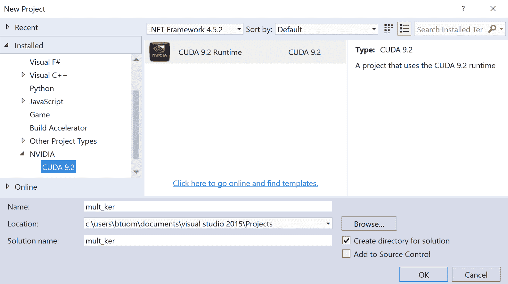

为项目指定适当的名称，然后单击“确定”。项目应出现在解决方案资源管理器窗口中，其中包含一个简单的预制 CUDA 测试程序，该程序由一个源文件`kernel.cu`组成，该源文件由一个简单的并行添加内核和测试代码组成。如果要查看此程序是否编译并运行，请单击顶部标记的本地 Windows 调试器处的绿色向右箭头。终端应该弹出一些来自内核的文本输出，然后立即关闭。

If you have problems with a Windows Terminal-based application closing after you run it from Visual Studio, try adding `getchar();` to the end of the main function, which will keep the Terminal open until you press a key. (Alternatively, you can also use a debugger breakpoint at the end of the program.)

现在，让我们添加我们刚刚编写的 CUDA-C 程序。在解决方案资源管理器窗口中，右键单击`kernel.cu`，然后单击`kernel.cu`上的删除。现在，右键单击项目名称，选择“添加”，然后选择“现有项”。我们现在可以选择一个现有的文件，因此找到`matrix_ker.cu`的路径并将其添加到项目中。单击 IDE 顶部标记为 Local Windows Debugger 的绿色箭头，程序应再次在 Windows 终端中编译和运行。因此，我们现在可以在 Visual Studio 中设置并编译一个完整的 CUDA 程序，只需执行这些步骤

现在让我们看看如何调试 CUDA 内核。让我们首先在内核`matrix_mult_ker`的入口点向代码添加一个断点，在这里我们设置`row`和`col`的值。我们可以通过单击窗口行号左侧的灰色列来添加此断点；对于我们添加的每个断点，都应该出现一个红点。（您可以忽略 Visual Studio 编辑器可能放置在代码下的任何红色扭曲线条；这是因为 CUDA 不是 Visual Studio 的*母语*语言）：

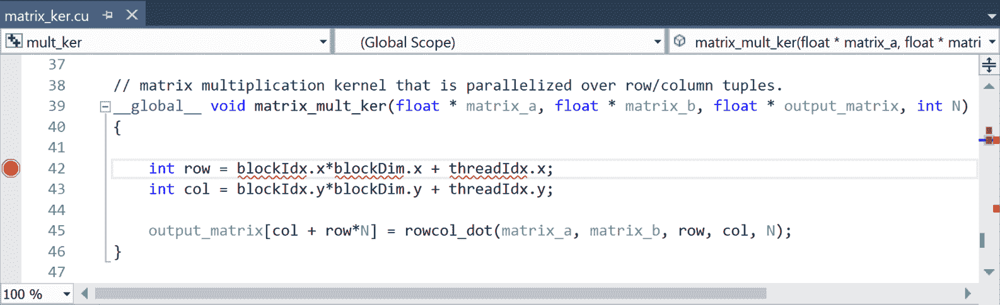

我们现在可以开始调试了。从顶部菜单中，选择 Nsight 下拉菜单，然后选择 Start CUDA Debugging。这里可能有两个选项，启动 CUDA 调试（下一代）和启动 CUDA 调试（旧版）。哪一个并不重要，但下一代可能会有问题，这取决于你的 GPU；在这种情况下，选择 Legacy。

程序应该启动，调试器应该在我们刚刚设置的内核断点处停止。让我们按*F10*跳过该行，现在看看`row`变量是否设置正确。让我们看看变量资源管理器中的“局部变量”窗口：

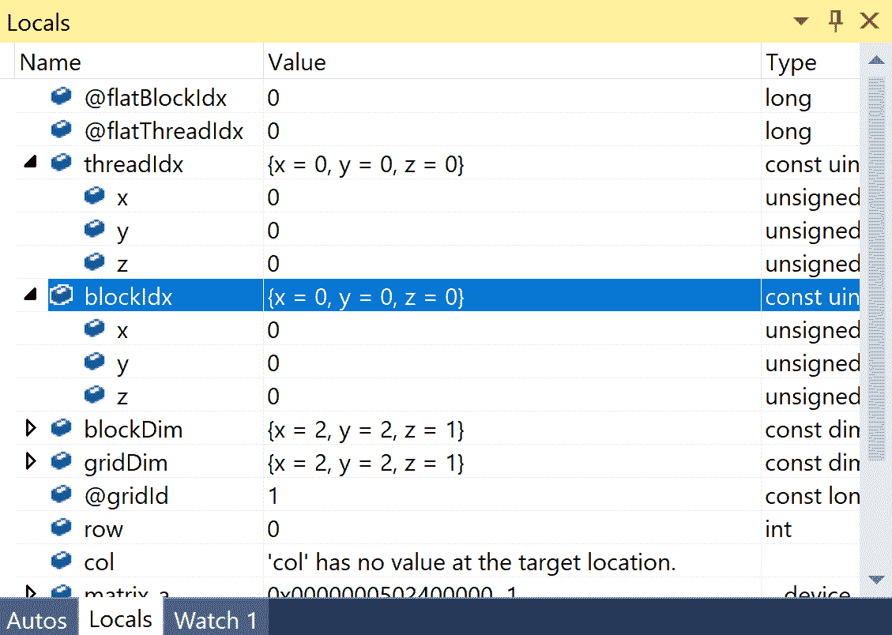

通过检查`threadIdx`和`blockIdx`的值，我们可以看到我们当前处于网格中第一个块的第一个线程中；`row`设置为`0`，确实对应正确的值。现在，让我们检查一些不同线程的 row 值。为此，我们必须在 IDE 中切换**线程焦点**；我们通过单击上面的 Nsight 下拉菜单，然后选择 Windows | CUDA Debug Focus。。。。应出现一个新菜单，允许您选择新线程和块。在菜单中将线程从 0,0,0 更改为 1,0,0，然后单击确定：

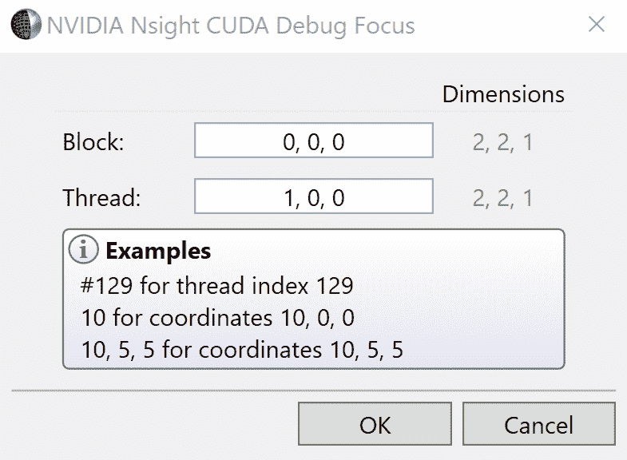

当您再次检查变量时，您应该看到此线程的`row`设置了正确的值：

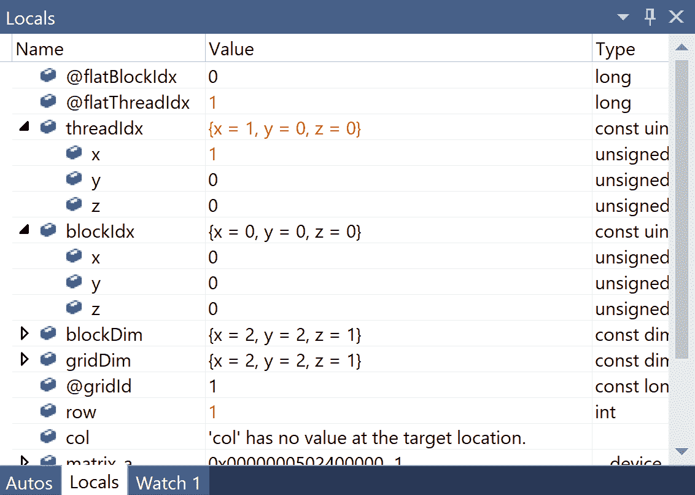

简而言之，这就是在 Visual Studio 中使用 Nsight 进行调试的方式。我们现在已经掌握了如何在 Windows 中从 Nsight/Visual Studio 调试 CUDA 程序的基本知识，并且我们可以使用所有常规约定，就像使用任何其他 IDE 调试常规 Windows 程序一样（设置断点、启动调试器、继续/恢复、单步执行、单步执行和单步执行）。也就是说，主要区别在于您必须知道如何在 CUDA 线程和块之间切换以检查变量，否则，情况几乎相同。

# 在 Linux 中与 Eclipse 一起使用 Nsight

现在我们将了解如何在 Linux 中使用 Nsight。您可以通过选择 Nsight 从桌面打开 Nsight，也可以通过`nsight`命令从命令行运行 Nsight。右侧的 IDE 将打开。从 IDE 顶部，单击文件，然后选择新建。。。从下拉菜单中选择新建 CUDA C/C++项目。将出现一个新窗口，从中选择 CUDA 运行时项目。为项目指定适当的名称，然后单击“下一步”。系统将提示您提供进一步的设置选项，但默认设置目前仍适用于我们的目的。（请务必在此处的第三和第四个屏幕中注意源文件夹和项目路径的位置。）您将进入最后一个屏幕，在该屏幕中可以按 Finish 创建项目：

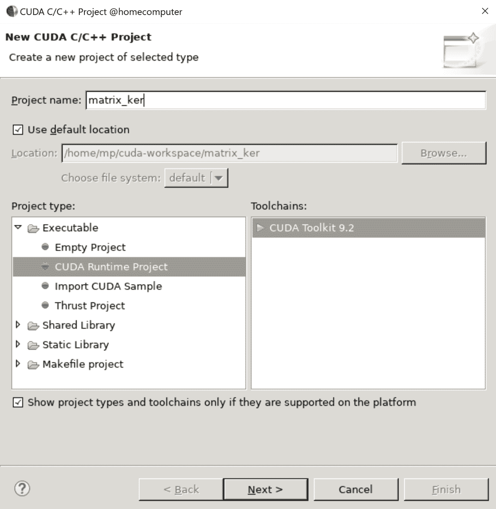

最后，您将看到一个项目视图，其中打开了新项目和一些占位符代码；从 CUDA9.2 开始，这将包括一个相互的内核示例。

我们现在可以导入代码了。您可以使用 Nsight 中的编辑器删除默认源文件中的所有代码并剪切粘贴，也可以手动从项目的源目录中删除该文件，手动将`matrix_ker.cu`文件复制到源目录中，然后选择 Nsight 中的源目录视图，然后按*F5*刷新源目录视图。您现在可以使用*Ctrl*+*B*构建项目，并使用*F11*运行它。我们程序的输出应该出现在 IDE 本身的 Console 子窗口中，如下所示：


我们现在可以在 CUDA 代码中设置断点；让我们在内核的入口点设置它，在这里设置行值。我们在 Eclipse 编辑器中将光标设置到该行上，然后按*Ctrl*+*Shift*+*B*进行设置

我们现在可以通过按*F11*（或单击错误图标）开始调试。程序应该在`main`功能的最开始暂停，所以按*F8*以*恢复*到第一个断点。您应该看到 CUDA 内核中的第一行在 IDE 中用箭头突出显示；让我们按*F6*跳过当前行，这将确保行已设置。

现在，我们可以轻松地在 CUDA 网格中的不同线程和块之间切换，以检查它们持有的当前值，如下所示：从 IDE 顶部，单击窗口下拉菜单，然后单击显示视图，然后选择 CUDA。应该打开一个包含当前运行内核的窗口，从这里可以看到该内核正在运行的所有块的列表。

单击第一个线程，从这里可以看到块中运行的所有单个线程：

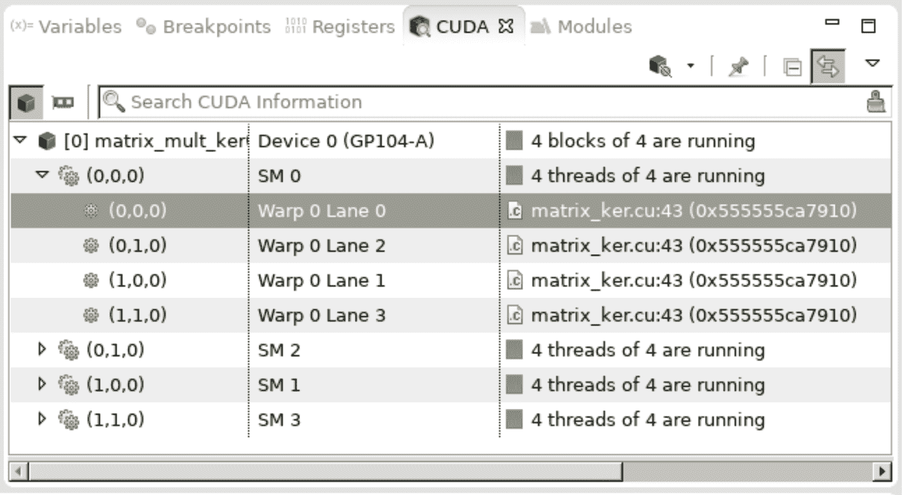

现在，我们可以通过单击此处的变量选项卡来查看与第一个块中第一个线程对应的变量，行应为 0，如预期的那样：


现在，我们可以通过再次转到 CUDA 选项卡，选择适当的线程，然后切换回，来检查不同线程的值。让我们保持在同一块中，但这次选择 thread（1，0，0），并再次检查 row 的值：

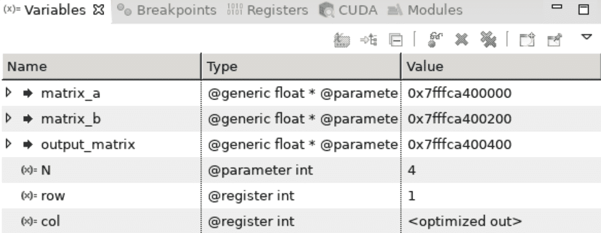

我们看到 row 的值现在是 1，正如我们所期望的那样

我们现在已经掌握了如何在 Linux 中从 Nsight/Eclipse 调试 CUDA 程序的基本知识，并且我们可以像调试常规 Linux 程序一样使用所有常规约定，就像调试任何其他 IDE 一样（设置断点、启动调试器、继续/恢复、跨过、跨入和退出）。也就是说，这里的主要区别是我们必须知道如何在 CUDA 线程和块之间切换以检查变量，否则，这几乎是一样的。

# 使用 Nsight 了解 CUDA 中的 warp lockstep 属性

现在，我们将使用 Nsight 逐步浏览一些代码，以帮助我们更好地理解一些 CUDA GPU 体系结构，以及如何处理内核中的**分支**。这将让我们了解如何编写更高效的 CUDA 内核。分支是指 GPU 如何处理 CUDA 内核中的控制流语句，如`if`、`else`或`switch`。特别是，我们感兴趣的是**分支分歧**在内核中是如何处理的，这就是当内核中的一个线程满足成为`if`语句的条件，而另一个线程不满足成为`else`语句的条件时会发生的情况：它们是分歧的，因为它们正在执行不同的代码段。

让我们编写一个小型 CUDA-C 程序作为实验：我们将从一个小内核开始，如果`threadIdx.x`值为偶数，则打印一个输出，如果`threadIdx.x`值为奇数，则打印另一个输出。然后我们编写一个`main`函数，该函数将在一个由 32 个不同线程组成的块上启动内核：

```py
#include <cuda_runtime.h>
#include <stdio.h>

__global__ void divergence_test_ker()
{
    if( threadIdx.x % 2 == 0)
        printf("threadIdx.x %d : This is an even thread.\n", threadIdx.x);
    else
        printf("threadIdx.x %d : This is an odd thread.\n", threadIdx.x);
}

__host__ int main()
{
    cudaSetDevice(0);
    divergence_test_ker<<<1, 32>>>();
    cudaDeviceSynchronize();
    cudaDeviceReset();
}
```

（此代码也可在存储库中以`divergence_test.cu`的形式获得。）

如果我们从命令行编译并运行它，我们可能会天真地期望偶数线程和奇数线程的字符串的交错序列；或者，由于所有线程都同时运行并进行分支，因此它们可能会随机交错，这是有意义的。

相反，每次运行此程序时，我们都会得到以下输出：


与偶数线程相对应的所有字符串将首先打印，而所有奇数字符串将第二次打印。也许 Nsight 调试器可以对此有所帮助；让我们像上一节一样，将这个小程序导入到 Nsight 项目中，在内核的第一个`if`语句处放置一个断点。然后我们将在上执行*步骤，以便调试器在第一条`printf`语句所在的位置停止。由于 Nsight 中的默认线程是（0,0,0），因此它应该满足第一条`if`语句，因此它将被卡在那里，直到调试器继续。*

让我们切换到一个奇数线程，比如（1,0,0），看看它现在在程序中的位置：

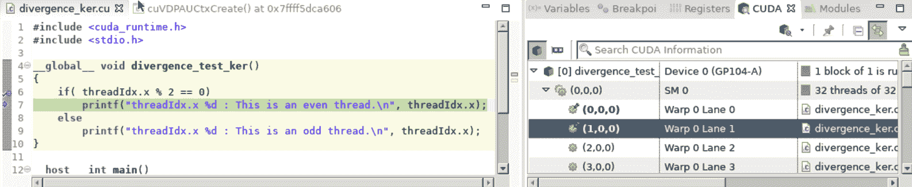

很奇怪！线程（1,0,0）也与线程（0,0,0）处于同一执行位置。事实上，如果我们检查这里的每一个其他奇数线程，它将被卡在一个`printf`语句的相同位置，所有奇数线程都应该跳过。

有什么好处？这被称为**翘曲锁步属性**。CUDA 架构中的**warp**是一个由 32 个“通道”组成的单元，GPU 在其中执行内核和网格，每个通道将执行一个线程。warps 的一个主要限制是，在单个 warp 上执行的所有线程必须在**锁定步骤**中通过相同的精确代码；这意味着并非每个线程都运行相同的代码，只是忽略了不适用于它的步骤。（这被称为锁步，因为它就像一群士兵齐声行进*锁步*，无论他们是否想行进！）

lockstep 属性意味着，如果一个 warp 上运行的一个线程在一个`if`语句中与所有 31 个其他线程发散，那么所有 31 个其他线程的执行都将延迟，直到这一个异常线程完成并从其单独的`if`发散返回。这是一个在编写内核时应该始终牢记的属性，也是为什么在 CUDA 编程中，分支分歧应该尽可能地最小化的一般规则。

# 使用 NVIDIA 公司的 NVPROF 分析器和可视化轮廓仪

最后，我们将简要介绍命令行 Nvidia`nvprof`分析器。与 nsightide 不同，我们可以自由使用我们已经编写的任何 Python 代码，我们不会被迫在这里编写完整的纯 CUDA-C 测试函数代码。

我们可以使用`nvprof program`命令对二进制可执行程序进行基本的评测；同样，我们可以使用`python`命令作为第一个参数，使用脚本作为第二个参数来分析 Python 脚本，如下所示：`nvprof python program.py`。让我们用`nvprof matrix_ker`描述一下我们前面编写的简单矩阵乘法 CUDA-C 可执行程序：


我们看到，这与我们在[第 1 章](01.html)*为什么要进行 GPU 编程中首次用于分析 Mandelbrot 算法的 Python cProfiler 模块的输出非常相似？*-直到现在，这只告诉我们所有已执行的 CUDA 操作。因此，当我们特别想在 GPU 上进行优化时，我们可以使用它，而不是关注在主机上执行的任何 Python 或其他命令。（如果添加命令行选项`--print-gpu-trace`，我们可以使用块和网格大小启动参数进一步分析每个 CUDA 内核操作。）

让我们再看一个技巧来帮助我们*可视化*一个程序所有操作的执行时间；我们将使用 Enter T0R 来转储一个文件，然后可以由 NVIDIA 可视化分析器读取，它将以图形方式显示给我们。让我们使用上一章中的示例`multi-kernel_streams.py`（可在`5`下的存储库中找到）。让我们回忆一下，这是我们介绍 CUDA streams 概念的一个示例，CUDA streams 允许我们同时执行和组织多个 GPU 操作。让我们将输出转储到一个带有`.nvvp`文件后缀和`-o`命令行选项的文件中，如下所示：`nvprof -o m.nvvp python multi-kernel_streams.py`。现在，我们可以将这个文件加载到 NVIDIA Visual Prror 中，用 AutoT6*^命令。

我们应该看到一个跨越所有 CUDA 流的时间线（请记住，此程序中使用的内核名为`mult_ker`：

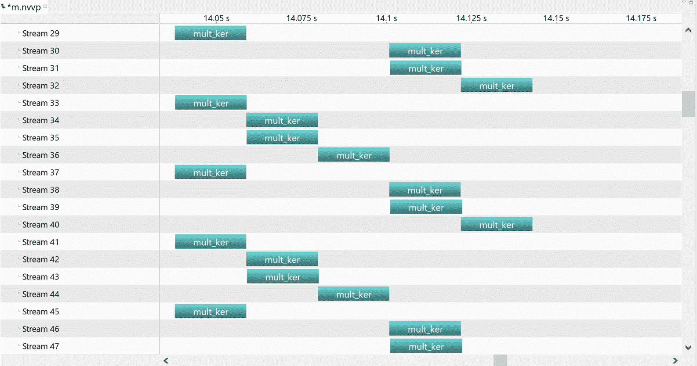

我们不仅可以看到所有内核启动，还可以看到内存分配、内存拷贝和其他操作。这有助于直观、直观地了解您的程序随着时间的推移是如何使用 GPU 的。

# 总结

在本章中，我们首先了解如何在 CUDA 内核中使用`printf`从各个线程输出数据；我们特别看到了这对于调试代码是多么有用。然后，我们在 CUDA-C 中填补了我们知识的一些空白，这样我们就可以编写完整的测试程序，并将其编译成适当的可执行二进制文件：这里有很多开销，我们以前没有注意到，我们必须仔细考虑。接下来，我们了解了如何在 nsightide 中创建和编译项目，以及如何使用它进行调试。我们看到了如何在 CUDA 内核中设置的任何断点处停止，并在各个线程之间切换以查看不同的局部变量。我们还使用 Nsight 调试器来了解 warp lockstep 属性，以及为什么在 CUDA 内核中避免分支分歧很重要。最后，我们有一个非常简短的概述 NVIDIA 命令行 AUT1 的分析器和视觉分析器，用于分析我们的 GPU 代码。

# 问题

1.  在我们编写的第一个 CUDA-C 程序中，在调用`cudaMalloc`在 GPU 上分配内存阵列后，我们没有使用`cudaDeviceSynchronize`命令。为什么没有这个必要？（提示：复习最后一章。）
2.  假设我们有一个内核，它在由两个块组成的网格上启动，每个块有 32 个线程。假设第一个块中的所有线程都执行一个`if`语句，而第二个块中的所有线程都执行相应的`else`语句。当第一个块中的线程实际执行时，第二个块中的所有线程都必须通过`if`语句中的命令“锁定步骤”吗？
3.  如果我们执行一段类似的代码，只在一个网格上执行，该网格由一个在 64 个线程上执行的块组成，其中前 32 个线程执行一个`if`语句，第二个 32 个线程执行一个`else`语句，会怎么样？
4.  `nvprof`探查器可以为我们测量哪些 Python 的 cProfiler 无法测量的内容？
5.  列出一些我们可能更喜欢使用`printf`调试 CUDA 内核的上下文，以及使用 Nsight 调试 CUDA 内核更容易的其他上下文。
6.  CUDA-C 中`cudaSetDevice`命令的目的是什么？
7.  为什么每次内核启动或 CUDA-C 中的内存拷贝后都要使用`cudaDeviceSynchronize`？