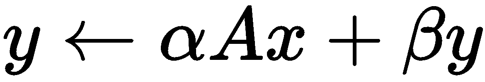
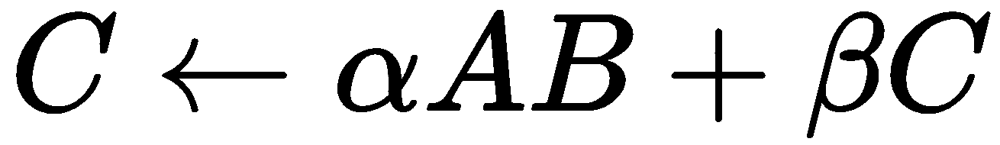
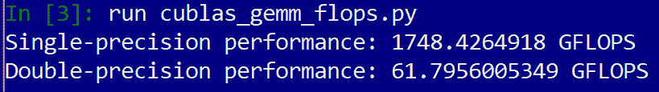
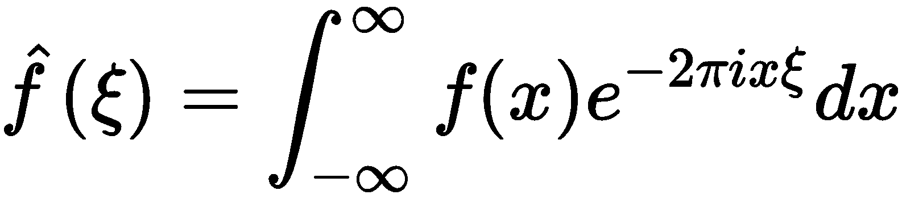
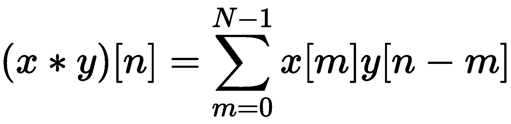
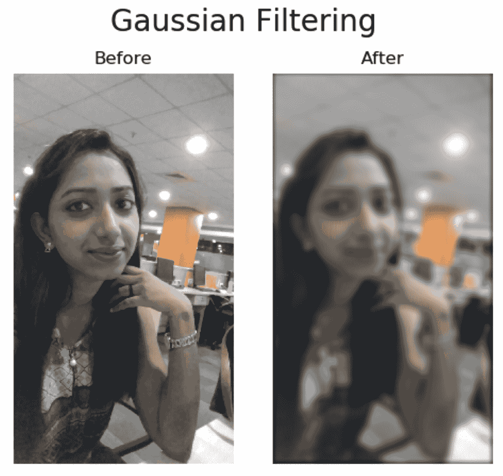
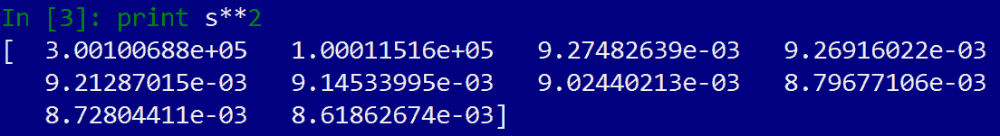
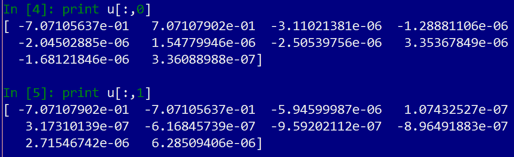

# 将 CUDA 库与 Scikit CUDA 一起使用

在本章中，我们将参观三个用于简化数值和科学计算的标准 CUDA 库。我们首先要看的是**cuBLAS**，这是 NVIDIA 为 CUDA 实现的**基本线性代数子程序**（**BLAS**规范。（cuBLAS 是 NVIDIA 对各种优化的、基于 CPU 的 BLAS 实现的回答，例如免费/开源 OpenBLAS 或英特尔专有的数学内核库。）我们将要研究的下一个库是**cuFFT**，它几乎可以执行**快速傅里叶变换**（**FFT 的每一种变化在 GPU 上的**。我们将了解如何在图像处理中使用 cuFFT 进行过滤。然后我们将了解**cuSolver**，它可以执行比 cuBLAS 中更复杂的线性代数运算，例如**奇异值分解**（**SVD**）或 Cholesky 分解。

到目前为止，我们主要处理的是一个 Python 模块，它充当我们通往 CUDA PyCUDA 的网关。虽然 PyCUDA 是一个功能强大、用途广泛的 Python 库，但它的主要目的是提供一个编写、编译和启动 CUDA 内核的网关，而不是提供 CUDA 库的接口。为此，幸运的是，有一个免费的 Python 模块可用，它为这些库提供了一个用户友好的包装器接口。这被称为 Scikit CUDA。

虽然您不必了解 PyCUDA，甚至不必了解 GPU 编程就能欣赏 Scikit CUDA，但它可以方便地与 PyCUDA 兼容；例如，Scikit CUDA 可以轻松地使用 PyCUDA 的`gpuarray`类进行操作，这使得您可以轻松地在我们自己的 CUDA 内核例程和 Scikit CUDA 之间传递数据。此外，大多数例程也将与 PyCUDA 的 stream 类一起工作，这将允许我们正确地将自己的定制 CUDA 内核与 Scikit CUDA 的包装器同步。

Please note that, besides these three listed libraries, Scikit-CUDA also provides wrappers for the proprietary CULA library, as well as for the open source MAGMA library. Both have a lot of overlap with the functionality provided by the official NVIDIA libraries. Since these libraries are not installed by default with a standard CUDA installation, we will opt to not cover them in this chapter. Interested readers can learn more about CULA and MAGMA at [http://www.culatools.com](http://www.culatools.com) and [http://icl.utk.edu/magma/](http://icl.utk.edu/magma/), respectively.  It is suggested that readers take a look at the official documentation for Scikit-CUDA, which is available here: [https://media.readthedocs.org/pdf/scikit-cuda/latest/scikit-cuda.pdf](https://media.readthedocs.org/pdf/scikit-cuda/latest/scikit-cuda.pdf).

本章的学习成果如下：

*   了解如何安装 Scikit CUDA
*   了解标准 CUDA 库的基本用途和差异
*   学习如何在基本线性代数中使用低级 cuBLAS 函数
*   了解如何使用 SGEMM 和 DGEMM 操作来测量浮点 GPU 的性能
*   了解如何使用 cuFFT 在 GPU 上执行 1D 或 2D FFT 操作
*   学习如何使用 FFT 创建 2D 卷积滤波器，并将其应用于简单的图像处理
*   了解如何使用 cuSolver 执行奇异值分解（SVD）
*   学习如何使用 cuSolver 的 SVD 算法执行基本主成分分析

# 技术要求

本章要求 Linux 或 Windows 10 PC 配备现代 NVIDIA GPU（2016 年起），并安装所有必要的 GPU 驱动程序和 CUDA 工具包（9.0 年起）。还需要一个包含 PyCUDA 模块的合适的 Python 2.7 安装（如 Anaconda Python 2.7）。

本章的代码也可以在 GitHub 上找到，可以在[上找到 https://github.com/PacktPublishing/Hands-On-GPU-Programming-with-Python-and-CUDA](https://github.com/PacktPublishing/Hands-On-GPU-Programming-with-Python-and-CUDA) 。

For more information about the prerequisites, check out the preface of this book. For more information about the software and hardware requirements, check out the README file at [https://github.com/PacktPublishing/Hands-On-GPU-Programming-with-Python-and-CUDA](https://github.com/PacktPublishing/Hands-On-GPU-Programming-with-Python-and-CUDA).

# 安装 Scikit CUDA

建议您直接从 GitHub 安装 Scikit CUDA 的最新稳定版本：[https://github.com/lebedov/scikit-cuda](https://github.com/lebedov/scikit-cuda)

将包解压到一个目录中，然后在这里打开命令行，在命令行中键入`python setup.py install`安装模块。然后，您可以运行单元测试，以确保使用`python setup.py test`执行了正确的安装。（建议 Windows 和 Linux 用户使用此方法。）或者，可以使用`pip install scikit-cuda`直接从 PyPI 存储库安装 Scikit CUDA。

# 具有立方的基本线性代数

我们将从学习如何使用 Scikit CUDA 的 cuBLAS 包装器开始本章。让我们花点时间讨论一下 BLAS。BLAS（基本线性代数子程序）是基本线性代数库的规范，该库在 20 世纪 70 年代首次标准化。BLAS 功能分为几个类别，称为*级别*

第 1 级 BLAS 函数由纯向量加和缩放操作（也称为*ax+y*操作或 AXPY）、点积和范数组成。第 2 级 BLAS 函数由一般矩阵向量操作（GEMV）组成，如向量的矩阵乘法，而第 3 级 BLAS 函数由“通用矩阵”（GEMM）操作，如矩阵乘法。最初，这些库在 20 世纪 70 年代完全用 FORTRAN 编写，因此您应该考虑到，在使用和命名方面存在一些看似过时的遗留问题，这对于今天的新用户来说可能很麻烦。

cuBLAS 是 NVIDIA 自己对 BLAS 规范的实现，它当然是经过优化的，以充分利用 GPU 的并行性。Scikit CUDA 为 cuBLAS 提供了与 PyCUDA`gpuarray`对象以及 PyCUDA 流兼容的包装器。这意味着我们可以通过 PyCUDA 将这些函数与我们自己定制的 CUDA-C 内核进行耦合和接口，并在多个流上同步这些操作。

# 1 级 AXPY 带 cuBLAS

让我们从一个基本的 1 级*ax+y*（或 AXPY）操作开始。让我们停下来回顾一下线性代数，思考一下这意味着什么。这里，*a*被认为是标量；也就是说，实数，例如-10、0、1.345 或 100。*x*和*y*被认为是某些向量空间中的向量。这意味着*x*和*y*是实数的 n 元组，因此在的情况下，这些值可以是`[1,2,3]`或等值`[-0.345, 8.15, -15.867]`*ax*表示*x*除以*a*的比例，所以如果 a 是 10，*x*是第一个先验值，那么*ax*是*x*的每个单独值乘以*a；*即`[10, 20, 30]`，最后是*之和 ax+y*意味着我们将两个向量的每个时隙中的每个单独值相加以生成一个新向量，如下所示（假设*y*是给定的第二个向量）-`[9.655, 28.15, 14.133]`

让我们现在在库布拉斯做这个。首先，让我们导入适当的模块：

```py
import pycuda.autoinit
from pycuda import gpuarray
import numpy as np
```

现在让我们导入 cuBLAS：

```py
from skcuda import cublas
```

我们现在可以设置向量数组并将它们复制到 GPU。请注意，我们使用的是 32 位（单精度）浮点数：

```py
a = np.float32(10)
x = np.float32([1,2,3])
y = np.float32([-.345,8.15,-15.867])
x_gpu = gpuarray.to_gpu(x)
y_gpu = gpuarray.to_gpu(y)
```

我们现在必须创建一个**cuBLAS 上下文**。这在本质上类似于我们在[第 5 章](05.html)*流、事件、上下文和并发*中讨论的 CUDA 上下文，只是这次它被明确用于管理 cuBLAS 会话。`cublasCreate`函数创建一个 cuBLAS 上下文，并将其作为其输出提供句柄。只要我们打算在本次会议中使用 cuBLAS，我们就需要保持此手柄：

```py
cublas_context_h = cublas.cublasCreate()
```

我们现在可以使用`cublasSaxpy`功能。`S`代表单精度，这是我们需要的，因为我们使用的是 32 位浮点数组：

```py
cublas.cublasSaxpy(cublas_context_h, x_gpu.size, a, x_gpu.gpudata, 1, y_gpu.gpudata, 1)
```

让我们讨论一下我们刚才做了什么。另外，让我们记住，这是对低级 C 函数的直接包装，因此输入看起来更像是 C 函数，而不是真正的 Python 函数。简而言之，这执行了一个“AXPY”操作，最终将输出数据放入`y_gpu`数组。让我们逐一检查每个输入参数。

第一个输入总是 CUDA 上下文句柄。然后我们必须指定向量的大小，因为这个函数最终将在 C 指针上运行；我们可以使用 gpuarray 的`size`参数来实现这一点。在将标量类型化为 NumPy`float32`变量之后，我们可以将`a`变量作为标量参数传递。然后，我们使用`gpudata`参数将`x_gpu`数组的底层 C 指针传递给该函数。然后我们将第一个数组的**步幅**指定为 1：步幅指定在每个输入值之间应该执行多少步。（相比之下，如果您使用的是行矩阵中某列的向量，则可以将步长设置为矩阵的宽度。）然后，我们将指针放在`y_gpu`数组中，并将其步长设置为 1。

我们已经完成了计算；现在我们必须明确地破坏我们的 cuBLAS 环境：

```py
cublas.cublasDestroy(cublas_context)
```

我们现在可以验证这是否与 NumPy 的`allclose`函数接近，如下所示：

```py
print 'This is close to the NumPy approximation: %s' % np.allclose(a*x + y , y_gpu.get())
```

再次注意，最后的输出被放入了`y_gpu`数组，它也是一个输入。

Always remember that BLAS and CuBLAS functions act in-place to save time and memory from a new allocation call. This means that an input array will also be used as an output!

我们刚才看到了如何使用`cublasSaxpy`函数执行`AXPY`操作。

让我们讨论突出的大写字母 s。正如我们前面提到的，它代表单精度，即 32 位实浮点值（`float32`。如果我们想在 64 位实浮点值的数组上操作（NumPy 和 PyCUDA 中的`float64`），那么我们将使用`cublasDaxpy`函数；对于 64 位单精度复数值（`complex64`，我们将使用`cublasCaxpy`，而对于 128 位双精度复数值（`complex128`，我们将使用`cublasZaxpy`。

We can tell what type of data a BLAS or CuBLAS function operates on by checking the letter preceding the rest of the function name. Functions that use single precision reals are always preceded with S, double precision reals with D, single precision complex with C, and double precision complex with Z.

# 其他 1 级 cuBLAS 功能

让我们看看其他一些 1 级函数。我们将不深入讨论它们的操作，但步骤与我们刚才介绍的步骤类似：创建一个 cuBLAS 上下文，使用适当的数组指针调用函数（通过 PyCUDA`gpuarray`中的`gpudata`参数访问），并相应地设置步长。要记住的另一件事是，如果函数的输出是单个值，而不是数组（例如，点积函数），则函数将直接将该值输出到主机，而不是必须从 GPU 中取出的内存数组中。（这里我们只讨论单精度实数版本，但其他数据类型的相应版本可以通过用适当的字母替换 S 来使用。）

我们可以在两个单精度实`gpuarray`、`v_gpu`和`w_gpu`之间执行点积。同样，1 的存在是为了确保我们在计算中使用步幅 1！再次回顾，点积是两个向量的逐点倍数之和：

```py
dot_output = cublas.cublasSdot(cublas_context_h, v_gpu.size, v_gpu.gpudata, 1, w_gpu.gpudata, 1)
```

我们也可以像这样执行向量的 L2 范数（回想一下，对于向量，*x*，这是它的 L2 范数，或长度，用公式计算）：

```py
l2_output = cublas.cublasSnrm2(cublas_context_h, v_gpu.size, v_gpu.gpudata, 1)
```

# cuBLAS 中的二级 GEMV

让我们看看如何进行`GEMV`矩阵向量乘法。这被定义为对*m*x*n*矩阵*A*、n 维向量*x*、*m*维向量*y*以及标量*α*和【T15β的以下操作：



在继续之前，让我们先看看函数的布局：

```py
cublasSgemv(handle, trans, m, n, alpha, A, lda, x, incx, beta, y, incy)  
```

让我们逐一检查这些输入：

*   `handle`指的是 cuBLAS 上下文句柄
*   `trans`关于矩阵的结构，我们可以指定是使用原始矩阵、直接转置还是共轭转置（对于复杂矩阵）。记住这一点很重要，因为此函数期望矩阵`A`以**列主**格式存储
*   `m`和`n`是我们想要使用的矩阵`A`的行数和列数
*   `alpha`是*α的浮点值。*
*   `A`是*m x n*矩阵*A.*
*   `lda`表示矩阵的前导维度，其中矩阵的总大小实际上为`lda`x`n`。这在列主格式中很重要，因为如果`lda`大于`m`，这可能会导致 cuBLAS 在尝试访问`A`的值时出现问题，因为该矩阵的底层结构是一维数组
*   然后我们有`x`和它的步幅`incx`；`x`是向量乘以`A`的基础 C 指针。记住，`x`的尺寸必须为`n`；即`A`的列数
*   `beta`，为*β*的浮点值。
*   最后，我们有`y`及其步幅`incy`作为最后的参数。我们应该记住，`y`的大小应该是`m`，或者是`A`的行数。

让我们通过生成一个 10 x 100 的随机值矩阵`A`和一个 100 个随机值的向量`x`来测试这一点。我们将`y`初始化为 10 个零的矩阵。我们将 alpha 设置为 1，beta 设置为 0，以获得无缩放的直接矩阵乘法：

```py
m = 10
n = 100
alpha = 1
beta = 0
A = np.random.rand(m,n).astype('float32')
x = np.random.rand(n).astype('float32')
y = np.zeros(m).astype('float32')
```

我们现在必须将`A`转换为**列主修**（或按列）格式。默认情况下，NumPy 将矩阵存储为**行主**（或按行），这意味着用于存储矩阵的底层一维数组将遍历第一行的所有值，然后遍历第二行的所有值，依此类推。您应该记住，转置操作将矩阵的列与其行交换。然而，结果将是转置矩阵下面的新一维数组将以列主格式表示原始矩阵。我们可以像这样复制`A`和`A.T.copy()`的转置矩阵，并将其以及`x`和`y`复制到 GPU：

```py
A_columnwise = A.T.copy()
A_gpu = gpuarray.to_gpu(A_columnwise) 
x_gpu = gpuarray.to_gpu(x)
y_gpu = gpuarray.to_gpu(y)
```

由于我们现在在 GPU 上正确存储了列矩阵，我们可以使用`_CUBLAS_OP`字典将`trans`变量设置为不进行转置：

```py
trans = cublas._CUBLAS_OP['N']
```

由于矩阵的大小与我们想要使用的行数完全相同，我们现在将`lda`设置为`m`。*x*和*y*向量的跨步也是 1。我们现在已经设置了所有需要的值，现在可以创建 CuBLAS 上下文并存储其句柄，如下所示：

```py
lda = m 
incx = 1
incy = 1
handle = cublas.cublasCreate()
```

我们现在可以启动我们的功能了。记住`A`、`x`和`y`实际上是 PyCUDA`gpuarray`对象，所以我们必须使用`gpudata`参数来输入这个函数。除此之外，这非常简单：

```py
cublas.cublasSgemv(handle, trans, m, n, alpha, A_gpu.gpudata, lda, x_gpu.gpudata, incx, beta, y_gpu.gpudata, incy)
```

现在，我们可以销毁 cuBLAS 上下文并检查返回值以确保其正确性：

```py
cublas.cublasDestroy(handle)
print 'cuBLAS returned the correct value: %s' % np.allclose(np.dot(A,x), y_gpu.get())
```

# cuBLAS 中用于测量 GPU 性能的 3 级 GEMM

现在我们来看看如何使用 CuBLAS 执行**通用矩阵乘法**（**GEMM**）。实际上，我们将尝试制作一些比我们在 cuBLAS 中看到的最后几个示例更实用的东西。我们将使用它作为 GPU 的性能指标，以确定它每秒可以执行的**浮点运算**（**触发器**）的数量，这将是两个独立的值：单精度情况和双精度情况。使用 GEMM 是评估触发器中计算硬件性能的标准技术，因为它比使用 MHz 或 GHz 的纯时钟速度更好地理解纯粹的计算能力。

If you need a brief review, recall that we covered matrix-matrix multiplication in depth in the last chapter. If you forgot how this works, it's strongly suggested that you review this chapter before you move on to this section. 

首先，让我们看看 GEMM 操作是如何定义的：



这意味着我们对*a*和*B*执行矩阵乘法，将结果按*α*进行缩放，然后将其添加到我们按*β进行缩放的*C*矩阵中，*将最终结果放入*C*中。

假设*a*是*m*x*k*（其中*m*是行，*k*是列）*矩阵，*B*矩阵，让我们考虑一下为了得到一个实值 GEMM 运算的最终结果，需要执行多少个浮点运算是一个*k*x*n*矩阵，C 是一个*m*x*n*矩阵。首先，我们来计算*AB*需要多少个运算。让我们取一个单独的纵列 T24，并将其乘以 T26，b，Ty27 Tr.：这将相当于乘以和 T30，k－1，t331。*m*行。*B*中有*n*列，因此计算*AB*将总计为*kmn+（k-1）mn=2kmn-mn*运算。现在，我们使用*alpha*来缩放*AB*，即*m**n*操作，因为这是矩阵*AB*的大小；类似地，通过*β*缩放*C*是另一个*m**n*操作。最后，我们将这两个结果矩阵相加，这是另一个*mn*操作。这意味着在给定的 GEMM 操作中，我们总共有*2kmn-mn+3mn=2kmn+2mn=2mn（k+1）*个浮点操作。*

现在我们要做的唯一一件事就是运行一个定时的 GEMM 操作，记录矩阵的不同大小，然后将*2kmn+2mn*除以总持续时间来计算我们 GPU 的失败次数。由此产生的数字将非常大，因此我们将用 GFLOP 来表示这一点，即每秒可以计算出几十亿（10<sup class="calibre54">9</sup>）的操作。我们可以通过将 FLOPS 值乘以 10<sup class="calibre54">-9</sup>来计算。

现在我们已经准备好开始编码了。让我们从导入语句以及`time`函数开始：

```py
import pycuda.autoinit
from pycuda import gpuarray
import numpy as np
from skcuda import cublas
from time import time
```

现在我们将为矩阵大小设置`m`、`n`和`k`变量。我们希望我们的矩阵相对较大，以便持续时间足够长，从而避免被 0 除的错误。对于 2018 年年中或之前发布的任何 GPU，以下值应足够：；具有更新卡的用户可以考虑增加这些值：

```py
m = 5000
n = 10000
k = 10000
```

现在我们将编写一个函数来计算单精度和双精度的 GFLOP。如果我们希望使用双精度，我们将把输入值设置为`'D'`，否则设置为`'S'`：

```py
def compute_gflops(precision='S'):

if precision=='S':
    float_type = 'float32'
elif precision=='D':
    float_type = 'float64'
else:
    return -1
```

现在，让我们生成一些具有适当精度的随机矩阵，用于计时。GEMM 操作的行为类似于我们以前看到的 GEMV 操作，因此在将它们复制到 GPU 之前，我们必须将它们转置。（因为我们只是在计时，所以这一步不是必需的，但记住这一点是很好的做法。）

我们将为 GEMM 设置一些其他必要的变量，其目的在这一点上应该是自解释的（`transa`、`lda`、`ldb`等等）：

```py
A = np.random.randn(m, k).astype(float_type)
B = np.random.randn(k, n).astype(float_type)
C = np.random.randn(m, n).astype(float_type)
A_cm = A.T.copy()
B_cm = B.T.copy()
C_cm = C.T.copy()
A_gpu = gpuarray.to_gpu(A_cm)
B_gpu = gpuarray.to_gpu(B_cm)
C_gpu = gpuarray.to_gpu(C_cm)
alpha = np.random.randn()
beta = np.random.randn()
transa = cublas._CUBLAS_OP['N']
transb = cublas._CUBLAS_OP['N']
lda = m
ldb = k
ldc = m
```

我们现在可以开始计时了！首先，我们将创建一个 cuBLAS 上下文：

```py
t = time()
handle = cublas.cublasCreate()
```

我们现在将启动 GEMM。请记住，实际情况有两种版本：`cublasSgemm`用于单精度，`cublasDgemm`用于双精度。我们可以使用 Python 的一个小技巧来执行适当的函数：我们将用带有适当参数的`cublas%sgemm`编写一个字符串，然后通过在字符串后面附加`% precision`将`%s`替换为 D 或 S。然后，我们将使用`exec`函数以 Python 代码的形式执行该字符串，如下所示：

```py
exec('cublas.cublas%sgemm(handle, transa, transb, m, n, k, alpha, A_gpu.gpudata, lda, B_gpu.gpudata, ldb, beta, C_gpu.gpudata, ldc)' % precision)
```

现在，我们可以销毁 cuBLAS 上下文并获得计算的最后时间：

```py
cublas.cublasDestroy(handle)
t = time() - t
```

然后，我们需要使用我们推导的方程计算 GFLOP，并将其作为该函数的输出返回：

```py
gflops = 2*m*n*(k+1)*(10**-9) / t 
return gflops
```

现在我们可以设置我们的主要功能。我们将在单精度和双精度情况下输出 GFLOP：

```py
if __name__ == '__main__':
    print 'Single-precision performance: %s GFLOPS' % compute_gflops('S')
    print 'Double-precision performance: %s GFLOPS' % compute_gflops('D')
```

现在让我们在运行此程序之前做一点家庭作业转到[https://www.techpowerup.com](https://www.techpowerup.com) 搜索您的 GPU，然后注意两件事：单精度浮点性能和双精度浮点性能。我现在使用的是 GTX 1050，它的清单声称它在单精度上有 1862 千兆次的性能，在双精度上有 58.20 千兆次的性能。现在让我们运行这个程序，看看这是否符合事实：



瞧，它确实是！

This program is also available as the `cublas_gemm_flops.py` file under the directory in this book's repository.

# 基于 cuFFT 的快速傅里叶变换

现在，让我们看看如何使用 cuFFT 进行一些基本的**快速傅里叶变换**（**FFT**），首先，让我们简要回顾一下傅里叶变换到底是什么。如果您参加过高等微积分或分析课程，您可能会看到傅里叶变换被定义为一个积分公式，如下所示：



这就是将*f*作为*x*上的时域函数。这给了我们一个“ξ”上相应的频域函数。这是一个非常有用的工具，几乎涉及到科学和工程的所有分支。

让我们记住，积分可以看作是一个和；同样，傅里叶变换也有相应的离散有限版本，称为**离散傅里叶变换**（**DFT**。这对有限长度的向量进行操作，并允许在频域中对其进行分析或修改。*n*维向量*x*的 DFT 定义如下：


换句话说，我们可以将一个向量*x*乘以复数*N*x*N*矩阵
（这里，*k*对应于行号，*N*对应于列号）来找到它的 DFT。我们还需要注意的是，我们可以从其 DFT 中检索到*x*（此处将*y*替换为*x*的 DFT，输出将是原始的*x*：


通常，对于长度为*N*的向量，计算矩阵向量运算的计算复杂度为 O（*N<sup class="calibre54">2</sup>*。然而，由于 DFT 矩阵中的对称性，通过使用 FFT，这总是可以减少到 O（*N log N*。让我们看看如何将 FFT 与 CuBLAS 结合使用，然后我们将继续讨论一个更有趣的示例。

# 一种简单的一维 FFT

让我们先看看如何使用 cuBLAS 计算简单的 1D FFT。首先，我们将简要讨论 Scikit CUDA 中的 CUFT 接口。

这里有两个子模块，我们可以通过`cufft`和`fft`访问 cuFFT 库。`cufft`包含一组用于 cuFFT 库的低级包装，而`fft`提供了一个更友好的用户界面；在本章中，我们将单独使用`fft`。

让我们从适当的导入开始，记住包括 Scikit CUDA`fft`子模块：

```py
import pycuda.autoinit
from pycuda import gpuarray
import numpy as np
from skcuda import fft
```

我们现在将设置一些随机数组并将其复制到 GPU。我们还将设置一个空 GPU 阵列，用于存储 FFT（请注意，我们使用实 float32 阵列作为输入，但输出将是 complex64 阵列，因为傅里叶变换始终是复数）：

```py
x = np.asarray(np.random.rand(1000), dtype=np.float32 )
x_gpu = gpuarray.to_gpu(x)
x_hat = gpuarray.empty_like(x_gpu, dtype=np.complex64)
```

现在，我们将为正向 FFT 变换设置一个 cuFFT 计划。这是 cuFFT 用来确定形状以及变换的输入和输出数据类型的对象：

```py
plan = fft.Plan(x_gpu.shape,np.float32,np.complex64)
```

我们还将为反向 FFT 计划对象设置一个计划。请注意，这一次我们从`complex64`到`float32`：

```py
inverse_plan = fft.Plan(x.shape, in_dtype=np.complex64, out_dtype=np.float32)
```

现在，我们必须将前向 FFT 从`x_gpu`转换为`x_hat`，将逆 FFT 从`x_hat`转换回`x_gpu`。注意，我们在逆 FFT 中设置了`scale=True`；我们这样做是为了指示 cuFFT 将逆 FFT 缩放 1/N：

```py
fft.fft(x_gpu, x_hat, plan)
fft.ifft(x_hat, x_gpu, inverse_plan, scale=True)
```

现在我们将检查`x_hat`与`x`的 NumPy FFT，以及`x_gpu`与`x`本身：

```py
y = np.fft.fft(x)
print 'cuFFT matches NumPy FFT: %s' % np.allclose(x_hat.get(), y, atol=1e-6)
print 'cuFFT inverse matches original: %s' % np.allclose(x_gpu.get(), x, atol=1e-6)
```

如果您运行此命令，您将看到`x_hat`与`y`不匹配，但令人费解的是`x_gpu`与`x`匹配。这怎么可能？好吧，让我们记住`x`是真实的；如果你看一下离散傅里叶变换是如何计算的，你可以从数学上证明，实向量的输出在 N/2 之后将作为复共轭重复。尽管 NumPy FFT 完全计算这些值，但 cuFFT 在看到输入为实时仅计算前一半输出，并将其余输出设置为`0`，从而节省了时间。您应该通过检查前面的变量来验证这种情况。

因此，如果我们将前面代码中的第一个 print 语句更改为仅比较 CuFFT 和 NumPy 之间的第一个 N/2 输出，那么这将返回 true：

```py
print 'cuFFT matches NumPy FFT: %s' % np.allclose(x_hat.get()[0:N//2], y[0:N//2], atol=1e-6)
```

# 使用 FFT 进行卷积

现在我们来看看如何使用 FFT 执行**卷积**。让我们回顾一下卷积到底是什么，首先：给定两个一维向量，*x*和*y*，它们的卷积定义如下：


我们对此很感兴趣，因为如果*x*是一个长而连续的信号，而*y*只有少量的局部非零值，那么*y*将在*x*上起到滤波器的作用；这本身有许多应用。首先，我们可以使用滤波器平滑信号*x*（这在数字信号处理和图像处理中很常见）。我们还可以使用它来采集信号*x*的样本，以表示信号或对其进行压缩（这在数据压缩或压缩传感领域很常见），或者使用滤波器来采集特征，以便在机器学习中进行信号或图像识别。这一思想构成了卷积神经网络的基础。

当然，计算机无法处理无限长的向量（至少目前还不能），因此我们将考虑**循环卷积**。在循环卷积中，我们处理两个长度为*n*的向量，其索引低于 0 或高于 n-1 将环绕到另一端；也就是说，*x*[-1】=*x*[n-1]、*x*[-2】=*x*[n-2]、*x*[n]=*x*[0]、*x*[n+1】=*x*[1]，等等。我们将*x*和*y*的循环卷积定义如下：



事实证明，我们可以很容易地使用 FFT 进行循环卷积；我们可以通过对*x*和*y*执行 FFT，逐点乘以输出，然后对最终结果执行逆 FFT 来实现这一点。这个结果称为**卷积定理**，也可以表示为：


我们将在两个维度上进行此操作，因为我们希望将结果应用于信号处理。虽然我们只看到了沿一维的 FFT 和卷积的数学，但二维卷积和 FFT 的工作原理与它们的一维对应项非常相似，只是有一些更复杂的索引。但是，我们会选择跳过这个，以便直接进入应用程序。

# 使用 cuFFT 进行二维卷积

现在我们将制作一个小程序，使用基于 cuFFT 的二维卷积对图像执行**高斯滤波**。高斯滤波是一种使用高斯滤波器平滑粗糙图像的操作。之所以这样命名，是因为它基于统计中的高斯（正态）分布。这就是高斯滤波器在标准偏差为σ的二维上的定义：


当我们用滤波器卷积离散图像时，我们有时将滤波器称为**卷积核**。通常，图像处理工程师会将其称为普通内核，但由于我们不想将其与 CUDA 内核混淆，因此我们将始终使用完整术语卷积内核。我们将使用离散版本的高斯滤波器作为卷积核。

让我们从适当的导入开始；请注意，我们将在这里使用 Scikit CUDA 子模块`linalg`。这将为我们提供比 cuBLAS 更高级别的接口。因为我们在这里处理图像，所以我们还将导入 Matplotlib 的`pyplot`子模块。还要注意，从第一行开始，我们将在这里使用 Python 3 样式的除法；这意味着，如果我们用`/`运算符除以两个整数，那么返回值将是一个不带类型转换的浮点（我们用`//`运算符进行整数除法）：

```py
from __future__ import division
import pycuda.autoinit
from pycuda import gpuarray
import numpy as np
from skcuda import fft
from skcuda import linalg
from matplotlib import pyplot as plt
```

让我们直接开始编写卷积函数。这将接收两个大小相同的 NumPy 阵列，`x`和`y`。我们将这些类型转换为 complex64 数组，如果它们的大小不同，则返回`-1`：

```py
def cufft_conv(x , y):
    x = x.astype(np.complex64)
    y = y.astype(np.complex64)

    if (x.shape != y.shape):
        return -1
```

现在，我们将设置 FFT 计划和反向 FFT 计划对象：

```py
plan = fft.Plan(x.shape, np.complex64, np.complex64)
inverse_plan = fft.Plan(x.shape, np.complex64, np.complex64)
```

现在我们可以将阵列复制到 GPU。我们还将设置一些大小合适的空数组来保存这些数组的 FFT，再加上一个额外的数组来保存最终卷积的输出，`out_gpu`：

```py
 x_gpu = gpuarray.to_gpu(x)
 y_gpu = gpuarray.to_gpu(y)

 x_fft = gpuarray.empty_like(x_gpu, dtype=np.complex64)
 y_fft = gpuarray.empty_like(y_gpu, dtype=np.complex64)
 out_gpu = gpuarray.empty_like(x_gpu, dtype=np.complex64)
```

我们现在可以执行 FFT：

```py
fft.fft(x_gpu, x_fft, plan)
fft.fft(y_gpu, y_fft, plan)
```

现在我们将使用`linalg.multiply`函数在`x_fft`和`y_fft`之间执行逐点（哈达玛）乘法。我们将设置`overwrite=True`以便将最终值写入`y_fft`：

```py
linalg.multiply(x_fft, y_fft, overwrite=True)
```

现在我们将调用逆 FFT，将最终结果输出到`out_gpu`。我们将此值传输到主机并返回：

```py
fft.ifft(y_fft, out_gpu, inverse_plan, scale=True)
conv_out = out_gpu.get()
return conv_out
```

我们还没有完成。我们的卷积核将比输入图像小得多，因此我们必须调整两个 2D 数组（卷积核和图像）的大小，使它们相等，并在它们之间执行逐点乘法。我们不仅要确保它们相等，还要确保对数组执行**零填充**，并适当地将卷积内核居中。零填充意味着我们在图像的侧面添加一个零缓冲区，以防止环绕错误。如果我们使用 FFT 执行卷积，请记住这是一个循环卷积，因此边缘将始终环绕。当我们完成卷积时，我们可以从图像外部移除缓冲区以获得最终输出图像。

让我们创建一个名为`conv_2d`的新函数，它包含一个卷积核`ker`和一个图像`img`。填充的图像大小将为（`2*ker.shape[0] + img.shape[0]`、`2*ker.shape[1] + img.shape[1]`。让我们先设置填充卷积内核。我们将创建一个这样大小的零的 2D 数组，然后将左上方的子矩阵设置为卷积核，如下所示：

```py
def conv_2d(ker, img):

    padded_ker = np.zeros( (img.shape[0] + 2*ker.shape[0], img.shape[1] + 2*ker.shape[1] )).astype(np.float32)
    padded_ker[:ker.shape[0], :ker.shape[1]] = ker
```

我们现在必须移动卷积核，使其中心精确地位于坐标（0,0）处。我们可以使用 NumPy`roll`命令来执行此操作：

```py
padded_ker = np.roll(padded_ker, shift=-ker.shape[0]//2, axis=0)
padded_ker = np.roll(padded_ker, shift=-ker.shape[1]//2, axis=1)
```

现在我们需要填充输入图像：

```py
padded_img = np.zeros_like(padded_ker).astype(np.float32)
padded_img[ker.shape[0]:-ker.shape[0], ker.shape[1]:-ker.shape[1]] = img
```

现在我们有两个大小相同的数组，它们的格式都是正确的。我们现在可以使用我们刚才在这里写的`cufft_conv`函数：

```py
out_ = cufft_conv(padded_ker, padded_img)
```

我们现在可以移除图像外部的零缓冲区。然后返回结果：

```py
output = out_[ker.shape[0]:-ker.shape[0], ker.shape[1]:-ker.shape[1]]

return output
```

我们还没有完成。让我们编写一些小函数来设置高斯滤波器，然后我们可以将其应用于图像。我们可以使用 lambda 函数用一行编写基本过滤器本身：

```py
gaussian_filter = lambda x, y, sigma : (1 / np.sqrt(2*np.pi*(sigma**2)) )*np.exp( -(x**2 + y**2) / (2 * (sigma**2) ))
```

现在我们可以编写一个函数，使用这个过滤器输出离散卷积核。卷积核的高度和长度将为`2*sigma + 1`，这是相当标准的：

Notice that we normalize the values of our Gaussian kernel by summing its values into `total_` and dividing it.

```py
def gaussian_ker(sigma):
    ker_ = np.zeros((2*sigma+1, 2*sigma+1))
    for i in range(2*sigma + 1):
        for j in range(2*sigma + 1):
            ker_[i,j] = gaussian_filter(i - sigma, j - sigma, sigma)
    total_ = np.sum(ker_.ravel())
    ker_ = ker_ */* total*_* return ker_
```

我们现在已经准备好在图像上进行测试了！作为我们的测试案例，我们将使用高斯滤波来模糊本书编辑器*Akshada Iyer*的彩色 JPEG 图像。（此图像位于 GitHub 存储库的`Chapter07`目录下，文件名为`akshada.jpg`），我们将使用 Matplotlib 的`imread`函数读取图像；默认情况下，它存储为 0 到 255 之间的无符号 8 位整数数组。我们将把它类型转换为一个浮点数组，并对其进行规范化，以便所有值都在 0 到 1 之间

Note to the readers of the print edition of this text: although the print edition of this text is in greyscale, this a color image. We will then set up an empty array of zeros that will store the blurred image:

```py
if __name__ == '__main__':
    akshada = np.float32(plt.imread('akshada.jpg')) / 255
    akshada_blurred = np.zeros_like(akshada)
```

让我们设置卷积内核。这里，标准偏差为 15 就足够了：

```py
ker = gaussian_ker(15)
```

我们现在可以模糊图像了。由于这是一幅彩色图像，我们必须对每个颜色层（红色、绿色和蓝色）分别应用高斯滤波；这由图像数组中的第三维索引：

```py
for k in range(3):
    akshada_blurred[:,:,k] = conv_2d(ker, akshada[:,:,k])
```

现在，让我们使用一些 Matplotlib 技巧并排查看前后图像：

```py
fig, (ax0, ax1) = plt.subplots(1,2)
fig.suptitle('Gaussian Filtering', fontsize=20)
ax0.set_title('Before')
ax0.axis('off')
ax0.imshow(akshada)
ax1.set_title('After')
ax1.axis('off')
ax1.imshow(akshada_blurred)
plt.tight_layout()
plt.subplots_adjust(top=.85)
plt.show()
```

我们现在可以运行程序并观察高斯滤波的效果：



This program is available in the `Chapter07` directory in a file called `conv_2d.py` in the repository for this book.

# 使用 Scikit CUDA 的 cuSolver

现在我们来看看如何使用 Scikit CUDA 的`linalg`子模块中的 cuSolver。同样，这为 cuBLAS 和 cuSolver 提供了一个高级接口，因此我们不必纠缠于小细节。

正如我们在导言中提到的，cuSolver 是一个库，用于执行比 cuBLAS 更高级的线性代数运算，例如奇异值分解、LU/QR/Cholesky 分解和特征值计算。由于 cuSolver 与 cuBLAS 和 cuFFT 一样，是另一个庞大的库，因此我们将只花时间研究数据科学和机器学习 SVD 中最基本的操作之一。

Please refer to NVIDIA's official documentation on cuSOLVER if you would like further information on this library: [https://docs.NVIDIA.com/cuda/cusolver/index.html](https://docs.nvidia.com/cuda/cusolver/index.html). 

# 奇异值分解（SVD）

SVD 取任意*m*x*n*矩阵*A*，然后返回三个矩阵-*U*、*∑*和*V*。这里，*U*是*m*x*m*酉矩阵，*∑*是*m*x*n*对角矩阵，*V*是*n*x*n*酉矩阵，我们的意思是矩阵的列构成正交基；通过*对角线*，我们的意思是矩阵中的所有值都是零，除了可能沿其对角线的值。

奇异值分解的意义在于，它将*A*分解为这些矩阵，因此我们有*A=U∑V<sup class="calibre54">T</sup>*；此外，沿*∑*对角线的值都将为正或零，称为奇异值。我们将很快看到这方面的一些应用，但您应该记住，SVD 的计算复杂性为 O 级（*mn<sup class="calibre54">2</sup>*）——对于大型矩阵，使用 GPU 绝对是一个好主意，因为该算法是可并行的。

现在我们来看看如何计算矩阵的奇异值分解。让我们做出适当的导入声明：

```py
import pycuda.autoinit
from pycuda import gpuarray
import numpy as np
from skcuda import linalg
```

我们现在将生成一个相对较大的随机矩阵，并将其传输到 GPU：

```py
a = np.random.rand(1000,5000).astype(np.float32)
a_gpu = gpuarray.to_gpu(a)
```

我们现在可以执行 SVD 了。这将有三个与我们刚才描述的矩阵对应的输出。第一个参数是我们刚刚复制到 GPU 的矩阵数组。然后，我们需要指定要使用 cuSolver 作为此操作的后端：

```py
U_d, s_d, V_d = linalg.svd(a_gpu,  lib='cusolver')
```

现在，让我们将这些阵列从 GPU 复制到主机：

```py
U = U_d.get()
s = s_d.get()
V = V_d.get()
```

`s`实际存储为一维数组；我们必须创建一个大小为 1000 x 5000 的零矩阵，并沿对角线复制这些值。我们可以通过 NumPy`diag`函数，再加上一些阵列切片来实现这一点：

```py
S = np.zeros((1000,5000))
S[:1000,:1000] = np.diag(s)
```

现在，我们可以在主机上使用 NumPy`dot`函数对这些值进行矩阵乘法，以验证它们是否与原始数组匹配：

```py
print 'Can we reconstruct a from its SVD decomposition? : %s' % np.allclose(a, np.dot(U, np.dot(S, V)), atol=1e-5)
```

由于我们只使用浮点 32，而且我们的矩阵相对较大，因此引入了一些数值误差；我们必须将“容差”级别（`atol`）设置得比通常的高一点，但它仍然足够小，足以验证两个阵列是否足够接近。

# 使用 SVD 进行主成分分析（PCA）

**主成分分析**（**PCA**是一种主要用于降维的工具。我们可以用它来查看数据集，并找出哪些维度和线性子空间最显著。虽然有几种方法可以实现这一点，但我们将向您展示如何使用 SVD 执行 PCA。

我们将按如下方式进行操作，我们将使用一个存在于 10 维中的数据集。首先，我们将创建两个在前面权重较大的向量，否则为 0：

```py
vals = [ np.float32([10,0,0,0,0,0,0,0,0,0]) , np.float32([0,10,0,0,0,0,0,0,0,0]) ]
```

然后我们将添加 9000 个额外向量：其中 6000 个向量将与前两个向量相同，只是添加了少量随机白噪声，其余 3000 个向量将只是随机白噪声：

```py
for i in range(3000):
    vals.append(vals[0] + 0.001*np.random.randn(10))
    vals.append(vals[1] + 0.001*np.random.randn(10))
    vals.append(0.001*np.random.randn(10))
```

我们现在将把`vals`列表键入一个`float32`NumPy 数组。我们取每行的平均值，然后从每行中减去这个值。（这是 PCA 的必要步骤。）然后我们转置该矩阵，因为 cuSolver 要求输入矩阵的行数少于或等于列数：

```py
vals = np.float32(vals)
vals = vals - np.mean(vals, axis=0)
v_gpu = gpuarray.to_gpu(vals.T.copy())
```

现在，我们将运行 cuSolver，就像以前一样，并从 GPU 复制输出值：

```py
U_d, s_d, V_d = linalg.svd(v_gpu, lib='cusolver')

u = U_d.get()
s = s_d.get()
v = V_d.get()
```

现在我们准备开始我们的调查工作。让我们打开 IPython，仔细看看`u`和`s`。首先，让我们看看 s；它的值实际上是**主值**的平方根，所以我们将对它们进行平方运算，然后看一下：



您会注意到，前两个主值的顺序为 10<sup class="calibre54">5</sup>，而其余分量的顺序为 10<sup class="calibre54">-3</sup>。这告诉我们，实际上只有一个二维子空间，甚至与这些数据相关，这并不奇怪。这些是第一和第二值，它们将对应于第一和第二主分量，即对应的向量。让我们来看一下这些向量，这些向量将存储在



您会注意到，这两个向量在前两个条目中的权重非常大，顺序为 10<sup class="calibre54">-1</sup>；其余条目的顺序均为 10<sup class="calibre54">-6</sup>或更低，且相对不相关。考虑到我们在前两个条目中的数据有多么偏颇，这是我们应该预料到的。简而言之，这就是 PCA 背后的理念。

# 总结

本章首先介绍如何使用 Scikit CUDA 的 cuBLAS 库包装器；在这里，我们必须记住很多细节，例如何时使用列主存储，或者输入数组是否会被覆盖。然后，我们将了解如何使用 Scikit CUDA 的 cuFFT 执行一维和二维 FFT，以及如何创建一个简单的卷积滤波器。然后，我们向您展示了如何将此应用于图像上的简单高斯模糊效果。最后，我们研究了如何使用 cuSolver 在 GPU 上执行奇异值分解（SVD），这通常是一个非常繁重的计算操作，但在 GPU 上并行性相当好。本章结束时，我们将介绍如何将 SVD 用于基本 PCA。

# 问题

1.  假设你得到一份工作，将旧的 FORTRAN BLAS 代码翻译成 CUDA。打开一个文件，会看到一个名为 SBLAH 的函数和另一个名为 ZBLEH 的函数。你能不查一下就知道这两个函数使用什么数据类型吗？
2.  您是否可以通过直接将矩阵`A`复制到 GPU，而无需在主机上进行转置以按列设置来改变 cuBLAS level-2 GEMV 示例？
3.  使用 cuBLAS 32 位实数点积（`cublasSdot`）实现矩阵向量乘法，使用一行矩阵和一个 STERE-1 向量。
4.  使用`cublasSdot`实现矩阵乘法。
5.  您能否在性能度量示例中实现一种精确度量 GEMM 操作的方法
6.  在 1D FFT 示例中，尝试将`x`类型转换为`complex64`数组，然后将 FFT 和逆 FFT 计划切换为两个方向的`complex64`值。然后在不检查数组前半部分的情况下确认`np.allclose(x, x_gpu.get())`是否为真。你为什么认为这现在行得通？
7.  请注意，在卷积示例中，模糊图像周围有一条暗边。为什么这是在模糊图像中，而不是在原始图像中？你能想出一种方法来缓解这种情况吗？