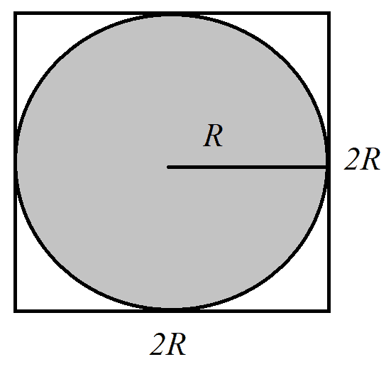
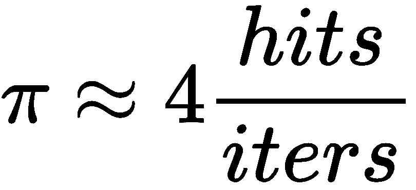
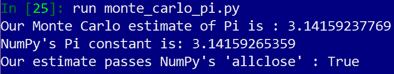
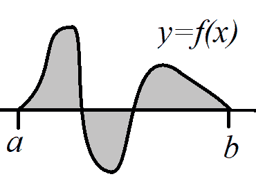
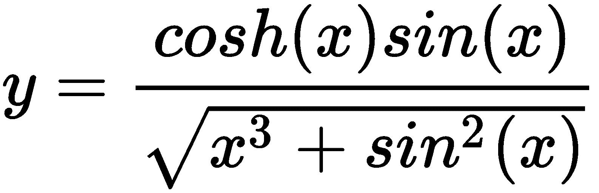
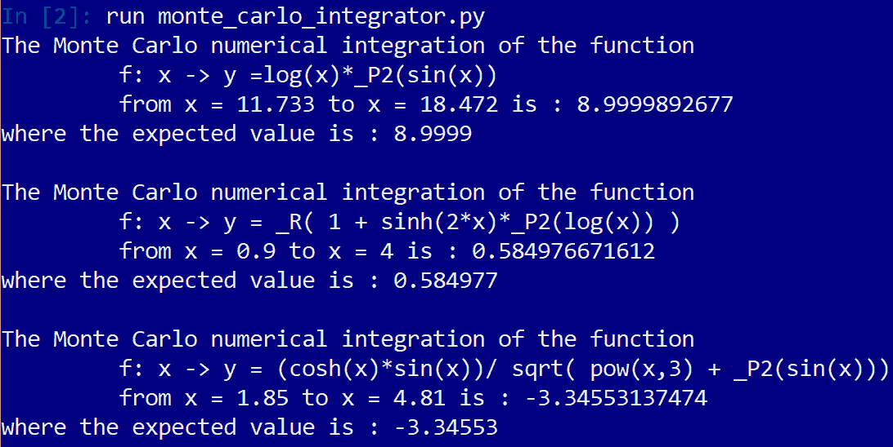
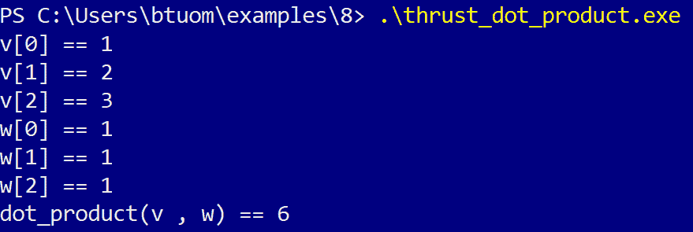

# 八、CUDA 设备功能库和 Thrust

在最后一章中，我们将通过 Scikit CUDA 包装器模块对 CUDA 中可用的库进行一个相当广泛的概述。现在，我们将介绍一些其他库，这些库必须直接从 CUDA C 内部使用，而无需像 Scikit CUDA 中那样的包装器的帮助。我们将从两个标准库开始，它们由我们可以从任何 CUDAC 内核库和 CUDAMathAPI 调用的设备函数组成。在学习如何使用这些库之后，我们将知道如何在蒙特卡罗集成的环境中使用这些库。蒙特卡罗积分是一种著名的随机方法，它从微积分中估计定积分的值。我们将首先看一个基本示例，说明如何使用 cuRAND 实现一个简单的蒙特卡罗方法来对 Pi 值进行基本估计（如众所周知的常数，π=3.14159…），然后我们将开始一个更雄心勃勃的项目，我们将构建一个 Python 类，它可以对任何任意数学函数执行一定的集成，并使用 Math API 创建这样的函数。我们还将研究如何在本课程的设计中有效地使用元编程的一些思想。

我们将在 C++Cub 库的帮助下，再看一些纯 CUDA 程序的编写。Thrust是一个提供 C++模板容器的库，类似于 C++标准模板库（STL）中的那些。这将使我们能够以更自然的方式操纵 C++中的 CUDA C 数组，该方法更接近 PycUDA 的 AutoT0T 和 STL 的向量容器。这将使我们不必经常使用指针，例如以前在 CUDA C 中困扰我们的*mallocs*和*frees*。

在本章中，我们将研究以下主题：

*   理解种子在生成伪随机数列表中的作用
*   在 CUDA 内核中使用 cuRAND 设备函数生成随机数
*   理解蒙特卡罗积分的概念
*   在 Python 中使用基于词典的字符串格式进行元编程
*   使用 CUDA Math API 设备函数库
*   理解函子是什么
*   在纯 CUDA C 中编程时使用Thrust向量容器

# 技术要求

本章要求 Linux 或 Windows 10 PC 配备现代 NVIDIA GPU（2016 年起），并安装所有必要的 GPU 驱动程序和 CUDA 工具包（9.0 年起）。还需要使用 PyCUDA 模块安装合适的 Python 2.7（如 Anaconda Python 2.7）。

本章的代码也可以在 GitHub 上找到，可以在[上找到 https://github.com/PacktPublishing/Hands-On-GPU-Programming-with-Python-and-CUDA.](https://github.com/PacktPublishing/Hands-On-GPU-Programming-with-Python-and-CUDA)

For more information about the prerequisites for this chapter, check the preface of this book. For the software and hardware requirements, check out the README at [https://github.com/PacktPublishing/Hands-On-GPU-Programming-with-Python-and-CUDA](https://github.com/PacktPublishing/Hands-On-GPU-Programming-with-Python-and-CUDA).

# cuRAND 设备函数库

让我们从库兰德开始。这是一个标准 CUDA 库，用于在 CUDA 内核中逐线程生成伪随机值，通过从内核中的每个线程调用设备函数来初始化和调用伪随机值。让我们再次强调，这是一个**伪随机**值序列，因为数字硬件总是确定性的，从不随机或任意，我们使用算法从初始**种子值**生成一个明显随机值序列。通常，我们可以将种子值设置为一个真正的随机值（例如以毫秒为单位的时钟时间），这将产生一个非常任意的*随机*值序列。这些生成的随机值与由同一种子生成的序列中的先前或未来值没有相关性，尽管在组合由不同种子生成的值时可能存在相关性和重复。因此，您必须小心，希望相互*随机*的值是由同一种子生成的。

让我们先来看一下`curand_init`的函数原型，我们将使用适当的种子对其进行初始化：

```py
__device__ void curand_init ( unsigned long long seed, unsigned long long sequence, unsigned long long offset, curandState_t *state)
```

这里，所有的输入都是无符号长的，在 C 中是一个无符号（非负值）64 位整数。首先，我们可以看到`seed`，这当然是种子值。一般来说，您将使用时钟值或一些变化来设置它。然后我们看到一个名为`sequence`的值，如前所述，cuRAND 生成的值只有在由同一种子值生成的情况下才是真正的数学上相互随机的。因此，如果我们有多个使用相同种子值的线程，我们使用`sequence`指示当前线程要使用长度为 2<sup class="calibre54">190</sup>的随机数的哪个子序列，而我们使用`offset`指示在该子序列内的哪个点开始；这将在每个线程中生成数值，这些数值在数学上都是相互随机的，没有相关性。最后，最后一个参数用于指向`curandState_t`对象的指针；这可以跟踪我们在伪随机数序列中的位置。

初始化类对象后，将通过调用相应的设备函数从相应的随机分布生成随机值。两种最常见的分布是均匀分布和正态分布（高斯分布）。均匀分布（`curand_uniform`，准确地说）是一个函数，它输出的值在给定范围内的概率都是相等的：也就是说，对于 0 到 1 的均匀分布，值有 10%的概率会落在 0 到 0.1 之间，或者 0.9 到 1 之间，或者落在彼此间隔为.1 的任意两点之间。正态分布（`curand_normal`，在 cuRAND 中）具有以特定平均值为中心的值，该值将根据众所周知的钟形曲线分布，钟形曲线由分布的标准偏差定义。（默认情况下，`curand_normal`的平均值为`0`，标准偏差为 1 in cuRAND，因此必须手动移动并缩放其他值。）cuRAND 支持的另一个众所周知的分布是泊松分布（`curand_poisson`，用于建模随机事件随时间的发生。

在下一节中，我们将主要研究如何在均匀分布的背景下使用 cuRAND，因为它们适用于蒙特卡罗积分。有兴趣了解如何在 cuRAND 中使用更多功能的读者，请查看 NVIDIA 的官方文档。

# 用蒙特卡罗方法估计π

首先，我们将应用 cuRAND 的新知识对著名的数学常数π或π进行估计，当然，这是永无止境的无理数 3.14159265358979。。。

然而，为了得到一个估计，我们需要花一点时间来思考这意味着什么。让我们考虑一个圆圈。请记住，圆的半径是指从圆心到圆中任何一点的长度；通常用*R*表示。直径定义为*D=2R*，周长*C*为圆的周长。然后将 Pi 定义为*π=C/D*。我们可以用欧几里得几何来找到圆的面积公式，结果是*a=πR<sup class="calibre54">2</sup>*。现在，让我们考虑一个半径为*R*的圆被外接圆成一个正方形，其所有边的长度为*2R*：



所以，我们当然知道广场的面积是*（2R）<sup class="calibre54">2</sup>=4R<sup class="calibre54">2</sup>*。让我们考虑 RT＝1ΩT7，这样我们就知道圆的面积正好是π，而正方形的面积正好是 4。让我们做一个进一步的假设，并声明圆和正方形都以笛卡尔平面的（0,0）为中心。现在，让我们在方块内取一个完全随机的值，（参见 T8×x，y），看看它是否落在圆中。我们怎样才能做到这一点？通过应用毕达哥拉斯公式：我们通过检查*x<sup class="calibre54">2</sup>+y<sup class="calibre54">2</sup>*是否小于或等于 1 来实现。让我们用*iters*指定随机点的总数，用*点击*指定点击次数。

让我们再考虑一下：在圆内拾取点的概率应该与圆的面积除以矩形的面积成比例；这里是π/4。但是，如果我们选择非常大的随机点值，请注意，我们将得到以下近似值：



这就是我们将如何估计π！在我们能够得出一个合理的 Pi 估计值之前，我们必须进行的迭代次数将非常高，但是请注意，这是多么好的并行化：我们可以检查不同线程中的“命中率”，在不同线程之间分割迭代的总次数。在一天结束时，我们可以将所有线程中的点击总数相加，以得到我们的估计值。

我们现在可以开始编写一个程序来进行蒙特卡罗估计。让我们首先导入 PyCUDA 程序所需的常用 Python 模块，并从 Symphy 中添加一个模块：

SymPy is used for perfect *symbolic* computations that are to be made in Python so that when we have very large integers, we can use the `Rational` function to make a much more accurate floating-point estimate of a division.

```py
import pycuda.autoinit
import pycuda.driver as drv
from pycuda import gpuarray
from pycuda.compiler import SourceModule
import numpy as np
from sympy import Rational
```

现在，当我们构建内核时，我们必须做一些与平常稍有不同的事情：我们需要在`SourceModule`中设置选项`no_extern_c=True`。这修改了代码是如何编译的，以便我们的代码可以正确地与 C++代码连接，正如 Curand 库所要求的那样。然后，我们开始编写内核并包含相应的头文件：

```py
ker = SourceModule(no_extern_c=True, source='''
#include <curand_kernel.h>
```

现在，让我们包含一个毕达哥拉斯距离的宏。由于我们只是检查该值是否等于或低于`1`，因此我们可以忽略平方根。我们将使用大量无符号 64 位整数，因此让我们制作另一个宏，以避免反复键入`unsigned long long`：

```py
#define _PYTHAG(a,b) (a*a + b*b)
#define ULL unsigned long long
```

我们现在可以设置内核了。根据 PyCUDA 的性质，这将被编译为接口，作为一个 BoaFIDE C 函数而不是 C++函数。我们用一个`extern "C"`块来实现这一点：

```py
extern "C" {
```

现在我们可以定义内核了。我们将有两个参数：一个用于`iters`，它是每个线程的总迭代次数，另一个用于保存每个线程的总命中次数的数组。我们需要一个`curandState`对象用于此：

```py
__global__ void estimate_pi(ULL iters, ULL * hits)
{
    curandState cr_state;
```

让我们将全局线程 ID 保存在一个名为`tid`的整数中：

```py
int tid = blockIdx.x * blockDim.x + threadIdx.x;
```

`clock()`是将当前时间输出到毫秒的设备功能。我们可以将`tid`添加到`clock()`的输出中，以获得每个线程的唯一种子。我们不需要使用不同的子序列或偏移量，所以让我们将它们都设置为 0。我们还将仔细地将此处的所有内容类型转换为 64 位无符号整数：

```py
curand_init( (ULL) clock() + (ULL) tid, (ULL) 0, (ULL) 0, &cr_state);
```

让我们设置`x`和`y`值以保持矩形中的随机点：

```py
float x, y;
```

然后，我们将迭代`iters`次，以查看循环中的命中率。我们使用`curand_uniform(&cr_state)`生成这些。请注意，我们可以在 0 到 1 之间生成它们，而不是从-1 到 1，因为在`_PYTHAG`宏中对它们进行平方运算将删除任何负值：

```py
for(ULL i=0; i < iters; i++)
 {
     x = curand_uniform(&cr_state);
     y = curand_uniform(&cr_state);

     if(_PYTHAG(x,y) <= 1.0f)
         hits[tid]++;
 }
```

我们现在可以结束并关闭我们的内核，以及带有另一个最后的`}`括号的`extern "C"`块：

```py
return;
}
}
''')
```

现在，让我们使用`get_function`将 Python 包装器函数添加到内核中。我们还将设置块和网格大小：每个块 32 个线程，每个网格 512 个块。让我们计算线程总数，并在 GPU 上设置一个数组来保存所有命中（当然初始化为 0）：

```py
pi_ker = ker.get_function("estimate_pi")
threads_per_block = 32
blocks_per_grid = 512
total_threads = threads_per_block * blocks_per_grid
hits_d = gpuarray.zeros((total_threads,),dtype=np.uint64)
```

让我们将每个线程的迭代总数设置为 2<sup class="calibre54">24</sup>：

```py
iters = 2**24
```

我们现在可以像往常一样启动内核：

```py
pi_ker(np.uint64(iters), hits_d, grid=(blocks_per_grid,1,1), block=(threads_per_block,1,1))
```

现在，让我们对数组中的命中数求和，这就得到了总的命中数。让我们还计算数组中所有线程的总迭代次数：

```py
total_hits = np.sum( hits_d.get() )
total = np.uint64(total_threads) * np.uint64(iters)
```

我们现在可以使用`Rational`进行估算，如下所示：

```py
est_pi_symbolic =  Rational(4)*Rational(int(total_hits), int(total) )
```

我们现在可以将其转换为浮点值：

```py
est_pi = np.float(est_pi_symbolic.evalf())
```

让我们对照 NumPy 的常量值`numpy.pi`检查我们的估计：

```py
print "Our Monte Carlo estimate of Pi is : %s" % est_pi
print "NumPy's Pi constant is: %s " % np.pi
print "Our estimate passes NumPy's 'allclose' : %s" % np.allclose(est_pi, np.pi)
```

我们现在完成了。让我们从 IPython 运行此程序并检查它（此程序也可以作为本书存储库中`Chapter08`下的`monte_carlo_pi.py`文件获得）：



# CUDA 数学 API

现在，我们来看看**CUDA 数学 API**。这是一个库，由与标准 C`math.h`库中类似的设备函数组成，可以从内核中的单个线程调用这些函数。这里的一个区别是单值和双值浮点运算是重载的，因此如果我们使用`sin(x)`，其中`x`是浮点，sin 函数将产生一个 32 位浮点作为输出，而如果`x`是 64 位双精度，那么`sin`的输出也将是一个 64 位值（通常，这是 32 位函数的专有名称，但结尾有一个`f`，如`sinf`。另外还有一个**固有的**函数是不精确的，但更快的数学函数被内置到 NVIDIA CUDA 硬件中；一般来说，它们与原始函数具有相似的名称，除了它们前面有两个下划线，因此，固有的 32 位正弦函数是 OutT7。

# 定积分研究综述

现在，我们将使用 Python 中的一些面向对象编程来建立一个类，我们可以使用蒙特卡罗方法来计算函数的定积分。让我们停下来谈谈我们的意思：假设我们有一个数学函数（就像你在微积分课上看到的那样），我们称之为*f（x）*。当我们在笛卡尔平面上绘制点*a*和*b*之间的曲线时，它可能看起来像这样：



现在，让我们回顾一下定积分到底意味着什么，让我们将此图中的第一个灰色区域表示为*I*，第二个灰色区域表示为*II*，第三个灰色区域表示为*III*。请注意，此处的第二个灰色区域低于零。这里的*f*的定积分，从*a*到*b*将是*I-II+III*的值，我们将在数学上表示为。一般来说，从*a*到*b*的定积分是所有总积分的总和由*f*函数和 y>0 位于*a*和*b*之间的 x 轴限定的“正”区域减去由*f*函数限定的所有“负”区域以及 y<0 位于*a*和*b*之间的 x 轴。

有许多方法可以计算或估计两点之间函数的定积分。你可能在微积分课上见过的一个例子是找到一个封闭形式的解：找到*f*、*f*的反导数，然后计算*f（b）-f（a）*。然而，在许多领域，我们无法找到精确的反导数，我们必须用数值方法确定定积分。这正是 Monte Carlo 积分背后的想法：我们在*a*和*b*之间的许多随机点上评估*f*，然后使用这些来估计定积分。

# 用蒙特卡罗方法计算定积分

我们现在将使用 CUDA Math API 来表示任意数学函数*f*，同时使用 cuRAND 库来实现蒙特卡罗积分。我们将通过**元编程**实现这一点：我们将使用 Python 从代码模板生成设备函数的代码，该代码模板将插入适当的蒙特卡罗内核进行集成

The idea here is that it will look and act similarly to some of the metaprogramming tools we've seen with PyCUDA, such as `ElementwiseKernel`.

让我们首先将适当的模块导入到我们的新项目中：

```py
import pycuda.autoinit
import pycuda.driver as drv
from pycuda import gpuarray
from pycuda.compiler import SourceModule
import numpy as np
```

我们将在 Python 中使用一种称为基于字典的字符串格式的技巧。在我们继续之前，让我们先看一分钟。假设我们正在编写一段 CUDAC 代码，并且我们不确定是否希望某个特定的变量集合是 float 还是 double；可能是这样的：`code_string="float x, y; float * z;"`。实际上，我们可能希望格式化代码，以便能够在浮动和双精度之间动态切换。让我们将字符串中的所有引用从`float`更改为`%(precision)s`-`code_string="%(precision)s x, y; %(precision)s * z;"`。我们现在可以设置一个合适的字典，将`%(presision)s`与`double`交换，即`code_dict = {'precision' : 'double'}`，并将新的双字符串与`code_double = code_string % code_dict`交换。让我们来看一看：


现在，让我们思考一下我们希望新的蒙特卡罗积分器如何工作。我们还需要一个字符串，它是一个使用 CUDA 数学 API 编写的数学方程，用于定义我们要集成的函数。然后，我们可以使用刚刚学习的字典技巧将这个字符串放入代码中，并使用它集成任意函数。我们还将根据用户的判断，使用模板在`float`和`double`精度之间切换。

我们现在可以开始我们的 CUDA C 代码：

```py
MonteCarloKernelTemplate = '''
#include <curand_kernel.h>
```

我们将保留以前的无符号 64 位整数宏`ULL`。让我们为 x 的倒数（`_R`和平方（`_P2`定义一些新的宏：

```py
#define ULL unsigned long long
#define _R(z) ( 1.0f / (z) )
#define _P2(z) ( (z) * (z) )
```

现在，让我们定义一个设备函数，方程字符串将插入其中。当我们必须交换字典中的文本时，我们将使用`math_function`值。我们将有另一个称为`p`的值，用于精度（可以是`float`或`double`。我们将此设备功能称为`f`。我们将在函数声明中添加一个`inline`，这将在从内核调用该函数时为我们节省一点分支时间：

```py
__device__ inline %(p)s f(%(p)s x)
{
    %(p)s y;
    %(math_function)s;
    return y;
}
```

现在，让我们考虑一下这将如何工作-我们声明一个名为`y`的 32 位或 64 位浮点值，调用`math_function`，然后返回`y`。`math_function`，只有当某个代码作用于输入参数`x`并将某个值设置为`y`，例如`y = sin(x)`，这才有意义。让我们记住这一点并继续。

我们现在开始编写蒙特卡罗积分内核。让我们记住，我们必须使用`extern "C"`关键字使 CUDA 内核在普通 C 中可见。然后我们将设置内核。

首先，我们将使用`iters`指示内核中的每个线程应该随机抽取多少样本；然后，我们用`lo`表示积分的下界（*b*），用`hi`表示积分的上界（*a*），并传入一个数组`ys_out`，以存储每个线程的部分积分集合（稍后我们将对`ys_out`求和，以从`lo`得到完整定积分的值）到主机端的`hi`，再次请注意我们如何将精度称为`p`：

```py
extern "C" {
__global__ void monte_carlo(int iters, %(p)s lo, %(p)s hi, %(p)s * ys_out)
{
```

我们需要一个`curandState`对象来生成随机值。我们还需要找到全局线程 ID 和线程总数。由于我们使用的是一维数学函数，因此在一维`x`中设置块和网格参数也是有意义的：

```py
curandState cr_state;
int tid = blockIdx.x * blockDim.x + threadIdx.x;
int num_threads = blockDim.x * gridDim.x;
```

现在我们将计算单个线程将处理的`lo`和`hi`之间的面积。我们将通过将集成的整个长度（即`hi - lo`）除以线程总数来实现这一点：

Again, note how we are using templating tricks so that this value can be multi-precision.

```py
%(p)s t_width = (hi - lo) / ( %(p)s ) num_threads;
```

回想一下，我们有一个名为`iters`的参数；这表示每个线程将采样多少个随机值。我们需要知道一点样品的密度是多少；也就是说，每单位距离的平均采样数。我们这样计算，记住将整数`iters`类型转换为浮点值：

```py
%(p)s density = ( ( %(p)s ) iters ) / t_width;
```

回想一下，我们用线程的数量来划分我们正在集成的区域。这意味着每个线程都有自己的起点和终点。由于我们公平地划分了每条螺纹的长度，因此我们计算如下：

```py
%(p)s t_lo = t_width*tid + lo;
 %(p)s t_hi = t_lo + t_width;
```

我们现在可以像以前一样初始化 cuRAND，确保每个线程都从其各自的种子生成随机值：

```py
curand_init( (ULL)  clock() + (ULL) tid, (ULL) 0, (ULL) 0, &cr_state);
```

在开始采样之前，我们需要设置一些额外的浮点值。`y`将保留从`t_lo`到`t_hi`的积分估计的最终值，`y_sum`将保留所有采样值的总和。我们还将使用`rand_val`变量保存我们生成的原始随机值，`x`存储我们将从中采样的区域的缩放随机值：

```py
%(p)s y, y_sum = 0.0f;
%(p)s rand_val, x;
```

现在，让我们循环到函数中的示例值，将这些值添加到`y_sum`中。需要注意的一点是`curand_uniform—`末尾的`%(p_curand)`s，该函数的 32 位浮点版本为`curand_uniform`，而 64 位版本为`curand_uniform_double`。我们将不得不在稍后使用`_double`或空字符串来交换它，这取决于我们在这里使用的精度级别。另外，请注意我们如何缩放`rand_val`，使`x`介于`t_lo`和`t_hi`之间，记住 cuRAND 中的随机均匀分布只产生 0 到 1 之间的值：

```py
for (int i=0; i < iters; i++)
{
    rand_val = curand_uniform%(p_curand)s(&cr_state);
    x = t_lo + t_width * rand_val;
    y_sum += f(x);
}
```

我们现在可以通过将`y_sum`除以密度来计算从`t_lo`到`t_hi`的次积分值：

```py
y = y_sum / density;
```

我们将这个值输出到数组中，并用最后一个括号关闭 CUDA 内核以及`extern "C"`。我们已经完成了 CUDA C 的编写，因此我们将以三重报价结束本节：

```py
ys_out[tid] = y;
}
}
'''
```

现在我们将做一些不同的事情，我们将建立一个类来处理定积分。我们叫它`MonteCarloIntegrator`。当然，我们将从编写构造函数开始，即`__init__`函数。我们将在这里输入对象引用`self`。让我们将`math_function`的默认值设置为`'y = sin(x)'`，默认精度为`'d'`，表示双精度。我们还将`lo`的默认值设置为 0，`hi`设置为π的 NumPy 近似值。最后，我们将得到每个线程将获取的随机样本数（`samples_per_thread`）的值，以及我们将启动内核的网格大小（`num_blocks`）。

让我们通过将文本字符串`math_function`存储在`self`对象中以供以后使用来启动此函数：

```py
def __init__(self, math_function='y = sin(x)', precision='d', lo=0, hi=np.pi, samples_per_thread=10**5, num_blocks=100):

        self.math_function = math_function
```

现在，让我们设置与我们选择的浮点精度相关的值，这将是我们以后需要的，特别是在设置模板字典时。我们还将在对象中存储`lo`和`hi`值。如果用户输入了无效的数据类型，或者如果`hi`实际上小于`lo`，我们还要确保引发异常错误：

```py
         if precision in [None, 's', 'S', 'single', np.float32]:
             self.precision = 'float'
             self.numpy_precision = np.float32
             self.p_curand = ''
         elif precision in ['d','D', 'double', np.float64]:
             self.precision = 'double'
             self.numpy_precision = np.float64
             self.p_curand = '_double'
         else:
             raise Exception('precision is invalid datatype!')

     if (hi - lo <= 0):
         raise Exception('hi - lo <= 0!')
     else:
         self.hi = hi
         self.lo = lo
```

现在，我们可以设置代码模板字典：

```py
MonteCarloDict = {'p' : self.precision, 'p_curand' : self.p_curand, 'math_function' : self.math_function}
```

现在，我们可以使用基于字典的字符串格式生成实际的最终代码，并进行编译。我们还可以通过在`SourceModule`中设置`options=['-w']`来关闭`nvcc`编译器的警告：

```py
self.MonteCarloCode = MonteCarloKernelTemplate % MonteCarloDict

self.ker = SourceModule(no_extern_c=True , options=['-w'], source=self.MonteCarloCode)
```

现在，我们将在对象中设置一个函数引用，该引用指向编译后的内核，使用`get_function`。在继续之前，让我们在对象中保存其余两个参数：

```py
self.f = self.ker.get_function('monte_carlo')
self.num_blocks = num_blocks
self.samples_per_thread = samples_per_thread
```

现在，虽然我们需要`MonteCarloIntegrator`对象的不同实例化来计算不同数学函数或浮点精度的定积分，但我们可能需要在不同的`lo`和`hi`边界上计算相同的积分，更改线程数/网格大小，或者改变我们在每个线程上采集的样本数量。谢天谢地，这些更改很容易进行，并且都可以在运行时进行

我们将建立一个特定的函数来计算给定对象的积分。我们将这些参数的默认值设置为调用构造函数期间存储的值：

```py
def definite_integral(self, lo=None, hi=None, samples_per_thread=None, num_blocks=None):
    if lo is None or hi is None:
        lo = self.lo
        hi = self.hi
    if samples_per_thread is None:
        samples_per_thread = self.samples_per_thread
    if num_blocks is None:
        num_blocks = self.num_blocks
        grid = (num_blocks,1,1)
    else:
        grid = (num_blocks,1,1)

    block = (32,1,1)
    num_threads = 32*num_blocks
```

我们可以通过设置一个空数组来存储部分子积分并启动内核来完成这个函数。然后我们需要对子积分求和以得到最终值，我们返回：

```py
self.ys = gpuarray.empty((num_threads,) , dtype=self.numpy_precision)

self.f(np.int32(samples_per_thread), self.numpy_precision(lo), self.numpy_precision(hi), self.ys, block=block, grid=grid)

self.nintegral = np.sum(self.ys.get() )

return np.sum(self.nintegral)
```

我们准备尝试一下。让我们用默认值设置一个类，它将把`y = sin(x)`从 0 积分到π。如果你还记得微积分，*sin（x）*的反导数是*-cos（x）*，所以我们可以这样计算定积分：


因此，我们应该得到一个接近 2 的数值。让我们看看我们得到了什么：


# 编写一些测试用例

现在，我们将最终了解如何使用 CUDA Math API 通过`math_function`参数为我们的类编写一些测试用例。如果您有使用 C/C++标准数学库的经验，那么这些操作将非常简单。同样，这些函数是重载的，因此当我们在单精度和双精度之间切换时，不必更改任何东西的名称。

我们已经看到了一个例子，即*y=sin（x）*。让我们试试更具雄心的东西：


我们将把这个函数从*a=*11.733 积分到*b=*18.472，然后检查我们的蒙特卡罗积分器的输出与另一个来源的已知积分值。这里，Mathematica 指出，这个定积分的值是 8.9999，所以我们将对此进行检查

现在，让我们考虑如何表示这个函数：*log*在这里指的是基数-*e*对数（也称为*ln*），这只是数学 API 中的`log(x)`。我们已经设置了一个用于平方运算的宏，因此我们可以将*sin<sup class="calibre54">2</sup>（x）*表示为`_P2(sin(x))`。现在我们可以用`y = log(x)*_P2(sin(x))`来表示整个函数。

让我们使用以下等式，从*a=.9*积分到*b=4*：


记住`_R`是我们为倒数设置的宏，我们可以用 Math API 编写函数，如下所示：

```py
'y = _R( 1 + sinh(2*x)*_P2(log(x)) )' 
```

在我们继续之前，让我们注意到 Mathematica 告诉我们这个定积分的值是.584977。

让我们再检查一个函数。让我们有点雄心勃勃地说：



我们可以将其表示为`'y = (cosh(x)*sin(x))/ sqrt( pow(x,3) + _P2(sin(x)))'`；自然地，`sqrt`是分母的平方根，`pow`允许我们取任意幂的值。当然，`sin(x)`是*sin（x）*和`cosh(x)`是*cosh（x）*。我们将其从*a*=1.85 积分到*b*=4.81；Mathematica 告诉我们这个积分的真值是-3.34553。

我们现在准备检查一些测试用例，并验证我们的蒙特卡罗积分是否有效！让我们遍历一个列表，其第一个值是一个字符串，表示函数（使用 Math API），第二个值表示积分下限，第三个值表示积分上限，最后一个值表示使用 Mathematica 计算的预期值：

```py
if __name__ == '__main__':

    integral_tests = [('y =log(x)*_P2(sin(x))', 11.733 , 18.472, 8.9999), ('y = _R( 1 + sinh(2*x)*_P2(log(x)) )', .9, 4, .584977), ('y = (cosh(x)*sin(x))/ sqrt( pow(x,3) + _P2(sin(x)))', 1.85, 4.81, -3.34553) ]
```

现在，我们可以遍历此列表，看看我们的算法与 Mathematica 相比运行得有多好：

```py
for f, lo, hi, expected in integral_tests:
    mci = MonteCarloIntegrator(math_function=f, precision='d', lo=lo, hi=hi)
    print 'The Monte Carlo numerical integration of the function\n \t f: x -> %s \n \t from x = %s to x = %s is : %s ' % (f, lo, hi, mci.definite_integral())
    print 'where the expected value is : %s\n' % expected
```

让我们现在就运行这个：



This is also available as the `monte_carlo_integrator.py` file under the `Chapter08` directory in this book's repository.

# CUDA Thrust图书馆

现在我们来看看 CUDA Thrust库。该库的中心功能是一个高级向量容器，它类似于 C++自己的向量容器。虽然这听起来很琐碎，但这将允许我们在 CUDAC 中编程，减少对指针、malloc 和 free 的依赖。与 C++向量容器一样，Thrust向量容器自动处理元素的大小和连接，并且具有 C++析构函数的魔力，当Thrust向量对象超出范围时，也可以自动处理。

Thrust实际上提供了两个向量容器：一个用于主机端，另一个用于设备端。主机侧Thrust矢量或多或少与 STL 矢量相同，主要区别在于它可以更容易地与 GPU 交互。让我们用适当的 CUDAC 编写一点代码，来了解它是如何工作的

让我们从 include 语句开始。我们将使用主机和设备侧向量的报头，并且我们也将包含 C++HOLt0 库，这将允许我们在终端上执行基本的 I/O 操作：

```py
#include <thrust/host_vector.h>
#include <thrust/device_vector.h>
#include <iostream>
```

让我们只使用标准的 C++命名空间（这样我们就不必在检查输出时键入 AutoT0**分辨率运算符）：

```py
using namespace std;
```

现在我们将实现我们的主要功能，并在主机端设置一个空Thrust矢量。同样，这些都是 C++模板，所以我们必须在声明时选择数据类型，并使用 GROUT T0 括号。我们将其设置为整数数组：

```py
int main(void)
{
 thrust::host_vector<int> v;
```

现在，让我们使用`push_back`将一些整数附加到`v`的末尾，这正是我们使用常规 STL 向量的方式：

```py
v.push_back(1);
v.push_back(2);
v.push_back(3);
v.push_back(4);
```

现在，我们将遍历向量中的所有值，并输出每个值：

The output here should be `v[0] == 1` through `v[3] == 4`.

```py
for (int i = 0; i < v.size(); i++)
    cout << "v[" << i << "] == " << v[i] << endl;
```

到目前为止，这似乎微不足道。让我们在 GPU 上设置一个Thrust矢量，然后从`v`复制内容：

```py
thrust::device_vector<int> v_gpu = v;
```

是的，这只是一条线，我们完成了。主机上`v`的所有内容将被复制到设备上的`v_gpu`中！（如果这并没有让您感到惊讶，请再看一看[第 6 章](06.html)、*调试和评测您的 CUDA 代码*，想想我们之前需要多少行代码。）

让我们尝试在新的 GPU 向量上使用`push_back`，看看是否可以将另一个值连接到它：

```py
v_gpu.push_back(5);
```

我们现在检查`v_gpu`的内容，如下：

```py
for (int i = 0; i < v_gpu.size(); i++)
    std::cout << "v_gpu[" << i << "] == " << v_gpu[i] << std::endl;
```

This part should output `v_gpu[0] == 1` through `v_gpu[4] == 5`.

再次感谢这些对象的析构函数，我们不必以释放任何已分配内存块的形式进行任何清理。我们现在可以从程序返回，我们完成了：

```py
    return 0;
}
```

# 在Thrust中使用函子

让我们看看如何在Thrust中使用称为**函子**的概念。在 C++中，一个 Ont2 的函数函子是一个看起来像函数的类或结构对象；这让我们可以使用一些看起来和行为都像函数的东西，但可以保存一些参数，而不必每次使用时都进行设置。

让我们用适当的 include 语句启动一个新的Thrust程序，并使用标准名称空间：

```py
#include <thrust/host_vector.h>
#include <thrust/device_vector.h>
#include <iostream>
using namespace std;
```

现在，让我们建立一个基本函子。我们将使用`struct`来表示这一点，而不是`class`。这将是一个加权乘法函数，我们将把权重存储在一个名为`w`的浮点中。我们将创建一个构造函数，该构造函数将权重设置为默认值`1`：

```py
struct multiply_functor {
 float w;
 multiply_functor(float _w = 1) : w(_w) {}
```

现在我们将用`operator()`关键字设置我们的函子；这将指示编译器将以下代码块视为此类型对象的`default`函数。请记住，这将作为一项设备功能在 GPU 上运行，因此我们在前面介绍了`__device__`。我们用括号表示输入，并输出适当的值，这只是一个缩放倍数。现在，我们可以用`};`来结束结构的定义：

```py
    __device__ float operator() (const float & x, const float & y) { 
        return w * x * y;
     }
};
```

现在，让我们用它来做一个基本的点积函数；回想一下，这需要两个数组之间的逐点乘法，然后是`reduce`类型的和。让我们先声明我们的函数并创建一个新的向量，`z`，它将保存逐点乘法的值：

```py
float dot_product(thrust::device_vector<float> &v, thrust::device_vector<float> &w ), thrust::device_vector<float> &z)
{
 thrust::device_vector<float> z(v.size());
```

我们现在将使用Thrust的`transform`操作，该操作将按点作用于`v`和`w`的输入，并输出到`z`。注意我们如何将函子输入到变换的最后一个槽中；通过像这样使用普通的闭括号，它将使用构造函数的默认值（w=1），因此这将作为正常的、非加权/缩放的点积：

```py
thrust::transform(v.begin(), v.end(), w.begin(), z.begin(), multiply_functor());
```

现在我们可以用Thrust的减缩函数求和`z`。让我们只返回值：

```py
return thrust::reduce(z.begin(), z.end());
}
```

我们完成了。现在，让我们编写一些测试代码，我们只需要向量`[1,2,3]`和`[1,1,1]`的点积，这对我们来说很容易检查。（这将是 6。）

让我们使用`push_back`设置第一个向量`v`：

```py
int main(void)
{
    thrust::device_vector<float> v;
    v.push_back(1.0f);
    v.push_back(2.0f);
    v.push_back(3.0f);
```

我们现在可以声明一个向量`w`，大小为`3`，我们可以使用Thrust的填充函数将其默认值设置为`1`，如下所示：

```py
thrust::device_vector<float> w(3);
thrust::fill(w.begin(), w.end(), 1.0f);
```

让我们检查一下，通过将值输出到`cout`来确保我们的值设置正确：

```py
for (int i = 0; i < v.size(); i++)
 cout << "v[" << i << "] == " << v[i] << endl;

for (int i = 0; i < w.size(); i++)
 cout << "w[" << i << "] == " << w[i] << endl;
```

现在，我们可以检查 dot 产品的输出，然后从程序返回：

```py
cout << "dot_product(v , w) == " << dot_product(v,w) << endl;
return 0;
}
```

让我们编译它（在 Linux 或 Windows 中通过使用`nvcc thrust_dot_product.cu -o thrust_dot_product`从命令行）并运行它：



The code for this is also available in the `thrust_dot_product.cu` file in the `Chapter08` directory in this book's repository.

# 总结

在本章中，我们研究了如何通过选择合适的种子来初始化 cuRAND 中的随机数流。由于计算机是确定性设备，它们只能生成伪随机数列表，因此我们的种子应该是真正随机的；通常，将线程 ID 添加到时钟时间（以毫秒为单位）对于大多数目的来说都足够好。

然后，我们研究了如何使用 cuRAND 的均匀分布对 Pi 进行基本估计。然后我们开始了一个更雄心勃勃的项目，创建一个 Python 类，可以计算任意函数的定积分；我们使用了元编程和 CUDA 数学 API 的一些思想来定义这些`arbitrary`函数。最后，我们简要介绍了 CUDA Thrust库，它通常用于在 Python 之外编写纯 CUDA C 程序。Thrust最显著地提供了一个类似于标准 c++的 T1 容器。这减少了在 CUDAC 中使用指针的一些认知开销。

最后，我们看了一个简单的例子，说明如何使用适当的函子来执行简单的`point-wise`和`reduce`操作，以实现简单的点积函数的形式。

# 问题

1.  尝试重写 Monte Carlo 积分示例（在`monte_carlo_integrator.py`中的`__main__`函数中）以使用 CUDA`instrinsic`函数。准确度与以前相比如何？
2.  我们在所有的例子中只使用了均匀分布。你能说出在 GPU 编程中使用正态（高斯）随机分布的一个可能用途或应用吗？
3.  假设我们使用两个不同的种子生成一个包含 100 个伪随机数的列表。我们是否应该将这些数据连接到一个包含 200 个数字的列表中？
4.  在上一个示例中，尝试在`multiply_functor`结构中的`operator()`函数定义中的`__device__`之前添加`__host__`。现在，看看是否可以使用此函子直接实现主机端的点积函数，而无需进一步修改。
5.  看看Thrust目录下的`strided_range.cu`文件。你能想到如何用这个来实现一个使用Thrust的通用矩阵乘法吗？
6.  定义函子时，`operator()`函数的重要性是什么？