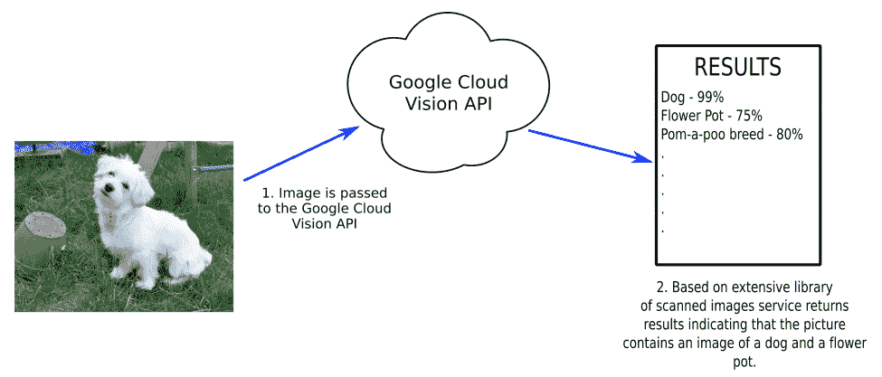
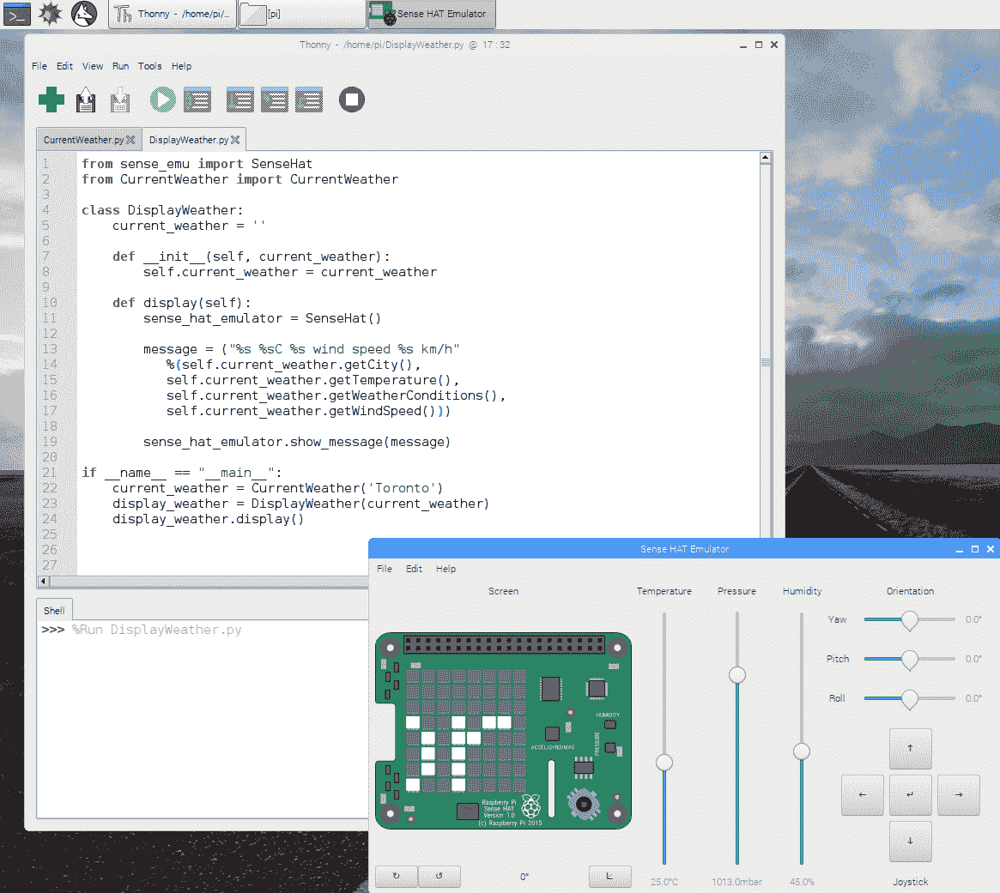

# 订阅 Web 服务

我们中的许多人认为互联网建立在其之上的技术是理所当然的。当我们访问我们最喜欢的网站时，我们很少关心我们正在浏览的网页是为我们的眼睛设计的。然而，下面是通信协议的互联网协议套件。机器还可以利用这些协议，通过 web 服务进行机器间通信。

在本章中，我们将继续我们通过**物联网**（**物联网**连接设备的旅程。我们将探讨 web 服务及其背后的各种技术。我们将用一些 Python 代码来结束本章，在这些代码中我们调用实时天气服务并实时提取信息。

本章将介绍以下主题：

*   物联网云服务
*   编写 Python 程序提取实时天气数据

# 先决条件

读者应具备 Python 编程语言的实用知识，以完成本章，并理解基本的面向对象编程。这将很好地服务于读者，因为我们将把代码分成对象。

# 项目概述

在这个项目中，我们将探索各种可用的 web 服务，并触及它们的核心优势。然后我们将编写调用 Yahoo！天气网络服务。最后，我们将使用 Raspberry Pi Sense 帽子模拟器显示实时天气数据。

本章应在上午或下午完成。

# 开始

为完成本项目，需要以下各项：

*   Raspberry Pi 3 型（2015 型或更新型）
*   USB 电源
*   计算机显示器（支持 HDMI）
*   USB 键盘
*   USB 鼠标
*   互联网接入

# 物联网云服务

我们可以使用许多云服务进行物联网开发。一些技术领域的大公司已经大力支持物联网，尤其是人工智能物联网。

以下是其中一些服务的详细信息。

# 亚马逊网络服务物联网

Amazon Web Services IoT 是一个云平台，允许连接的设备安全地与其他设备或云应用程序交互。这些都是随用随付的服务，不需要服务器，因此简化了部署和可扩展性。

AWS 物联网核心可能使用的**亚马逊网络服务****AWS**服务如下：

*   AWS Lambda
*   亚马逊运动
*   亚马逊 S3
*   亚马逊机器学习
*   亚马逊发电机
*   亚马逊云观察
*   AWS 云迹
*   亚马逊弹性搜索服务

AWS 物联网核心应用程序允许收集、处理和分析连接设备生成的数据，而无需管理基础设施。价格按发送和接收的邮件计算。

以下是如何使用 AWS 物联网的示意图。在这个场景中，来自汽车的路况数据被发送到云，并存储在 S3 云存储服务中。AWS 服务将此数据广播给其他车辆，警告他们潜在的危险道路状况：


# IBM 沃森平台

IBM Watson 是一个能够回答以自然语言发布的问题的系统。最初设计用于在电视游戏节目*Jeopardy 上比赛！*沃森是以 IBM 第一任首席执行官托马斯·沃森的名字命名的。2011 年，沃森承担了*危险！*冠军布拉德·拉特和肯·詹宁斯获胜。

使用 IBM Watson Developer 云的应用程序可以通过 API 调用创建。沃森处理物联网信息的潜力巨大。

坦率地说，Watson 是 IBM 的一台超级计算机，可以通过 API 调用通过 web 访问。

IBM Watson Assistant for Automotive 就是 Watson 在物联网中的一种应用，它是一种为汽车制造商提供的集成解决方案。通过这项技术，司机和乘客可以与外部世界进行互动，例如在餐馆预订房间和在日历上查看约会。汽车中的传感器可以集成，为 IBM Watson Assistant 提供汽车状态的信息，如轮胎压力。下图显示了一个场景，Watson 警告驾驶员轮胎气压过低，建议修理轮胎，然后在车库预约：


IBM Watson Assistant for Automotive 是作为白标签服务销售的，因此制造商可以为其贴上标签以满足其需求。IBM Watson Assistant for Automotive 的成功将取决于它与其他 AI Assistant 服务（如亚马逊的 Alexa 和谷歌的 AI Assistant）的竞争情况。与 Spotify for music 和 Amazon for shopping 等流行服务的集成也将在未来的成功中发挥作用。

# 谷歌云平台

虽然不像 AWS 物联网那样广泛和完善，但谷歌对物联网非常感兴趣。开发者可以通过使用谷歌云服务利用谷歌的处理、分析和机器智能技术。

以下是通过谷歌云服务提供的一些服务的列表：

*   **App 引擎**：应用托管服务
*   **BigQuery**：大型数据库分析服务
*   **Bigtable**：可扩展数据库服务
*   **云 AutoML**：允许开发者访问谷歌神经架构搜索技术的机器学习服务
*   **云机器学习引擎**：TensorFlow 模型的机器学习服务
*   **谷歌视频智能**：分析视频和创建元数据的服务
*   **云视觉 API**：使用机器学习返回图像数据的服务

下面是如何使用 Google Cloud Vision API 的示意图。狗站在倒置花盆旁边的图像通过 API 传递给服务。扫描图像，并使用机器学习在照片中识别对象。返回的 JSON 文件包含以百分比表示的结果：



谷歌专注于让事情变得简单快捷，这让开发者可以访问谷歌自己的全球私人网络。谷歌云平台的定价低于 AWS 物联网。

# 微软 Azure

Microsoft Azure（以前称为 Windows Azure）是 Microsoft 提供的基于云的服务，允许开发人员使用 Microsoft 的大量数据中心构建、测试、部署和管理应用程序。它支持许多不同的编程语言，这些语言都是特定于 Microsoft 的，并且来自外部第三方。

Azure Sphere 是 Microsoft Azure 框架的一部分，于 2018 年 4 月推出，是 Azure 的物联网解决方案。以下是可能使用 Azure Sphere（或 Azure IoT，如图所示）的场景。在这种情况下，位于远程工厂的机器人手臂由其他地方的手机应用程序监控：


您可能已经注意到，前面的示例可以使用任何竞争的云服务进行设置，这才是关键所在。通过相互竞争，服务变得更好、更便宜，因此更容易获得。

随着 IBM、亚马逊、谷歌和微软等大公司开始处理物联网数据，物联网的未来是无限的。

# 地下天气

尽管不像谷歌和 IBM 那样重量级，Weather Underground 提供了一个天气信息 web 服务，开发者可以将他们的应用程序绑定到其中。通过使用开发者帐户，可以构建利用当前天气条件的物联网应用程序。

At the time of writing this chapter, the Weather Underground network offered APIs for developers to use to access weather information. An end-of-service notice has been posted to the Weather Underground API site since. To keep up to date on the state of this service, visit [https://www.wunderground.com/weather/api/](https://www.wunderground.com/weather/api/).

# 从云中提取数据的基本 Python 程序

在[第 2 章](02.html)中*使用 Raspberry Pi*编写 Python 程序时，我们引入了一个名为`weather-api`的包，允许我们访问 Yahoo！天气网络服务。在本节中，我们将在我们自己的类中包装来自`weather-api`包的`Weather`对象。我们将为我们的类重用名称`CurrentWeather`。在测试完我们的`CurrentWeather`类之后，我们将使用 Raspbian 中的 Sense 帽子模拟器，并构建一个天气信息记录器。

# 访问 web 服务

我们将首先修改我们的`CurrentWeather`类来调用 Yahoo！通过`weather-api`包的天气：

1.  从应用程序菜单|编程| Thonny Python IDE 打开 Thonny。
2.  单击新建图标创建一个新文件。
3.  键入以下内容：

```py
from weather import Weather, Unit

class CurrentWeather:
     temperature = ''
     weather_conditions = ''
     wind_speed = ''
     city = ''

     def __init__(self, city):
         self.city = city
         weather = Weather(unit = Unit.CELSIUS)
         lookup = weather.lookup_by_location(self.city)
         self.temperature = lookup.condition.temp
         self.weather_conditions = lookup.condition.text
         self.wind_speed = lookup.wind.speed

     def getTemperature(self):
         return self.temperature

     def getWeatherConditions(self):
         return self.weather_conditions

     def getWindSpeed(self):
         return self.wind_speed

     def getCity(self):
         return self.city

if __name__=="__main__":
        current_weather = CurrentWeather('Montreal')
        print("%s %sC %s wind speed %s km/h"
        %(current_weather.getCity(),
        current_weather.getTemperature(),
        current_weather.getWeatherConditions(),
        current_weather.getWindSpeed()))
```

4.  将文件另存为`CurrentWeather.py`。
5.  运行代码。
6.  您应该可以看到 web 服务中的天气信息以 Thonny 格式打印到 shell 中。当我运行该程序时，我看到了以下内容：

```py
Toronto 12.0C Clear wind speed 0 km/h
```

7.  现在，让我们仔细看看代码，看看发生了什么。首先，我们从程序包中导入我们需要的资源：

```py
from weather import Weather, Unit
```

8.  然后我们定义我们的类名`CurrentWeather`，并将类变量（`temperature`、`weather_conditions`、`wind_speed`和`city`设置为初始值：

```py
class CurrentWeather:
     temperature = ''
     weather_conditions = ''
     wind_speed = ''
     city = ''
```

9.  在`init`方法中，我们根据传入该方法的`city`设置类变量。我们通过将一个变量`weather`实例化为`Weather`对象，并将`unit`设置为`CELSIUS`来实现这一点。`lookup`变量是根据我们传入的`city`名称创建的。从这里开始，我们只需根据从`lookup`中提取的值设置类变量（`temperature`、`weather_conditions`和`wind_speed`）。`weather-api`为我们完成了所有繁重的工作，因为我们能够使用点符号访问值。我们无需解析 XML 或 JSON 数据：

```py
def __init__(self, city):
    self.city = city
    weather = Weather(unit = Unit.CELSIUS)
    lookup = weather.lookup_by_location(self.city)
    self.temperature = lookup.condition.temp
    self.weather_conditions = lookup.condition.text
     self.wind_speed = lookup.wind.speed
```

10.  通过`init`方法中设置的类变量，我们使用方法调用返回这些类变量：

```py
def getTemperature(self):
    return self.temperature

def getWeatherConditions(self):
    return self.weather_conditions

def getWindSpeed(self):
    return self.wind_speed

def getCity(self):
    return self.city
```

11.  由于我们在 Thonny 中将`CurrentWeather.py`作为一个程序运行，因此我们可以使用`if __name__=="__main__"`方法和`CurrentWeather`类。请注意，`if __name__=="__main__"`方法与类名具有相同的缩进。如果不这样做，它就不会起作用。

With every module in Python, there is an attribute called `__name__`. If you were to check this attribute for a module you have imported into your program, you would get the name of the module returned. For example, if we were to put the line `print(Weather.__name__)` in the preceding code, we would get the name `Weather` returned. Checking for `__name__` in a file we are running returns the `__main__` value.

12.  在`if __name__=="__main__"`方法中，我们创建了一个名为`current_weather`的`CurrentWeather`类型的对象，传入城市名称`Montreal`。然后，我们使用适当的方法调用打印出`city`、`temperature`、`weather conditions`和`wind speed`的值：

```py
if __name__=="__main__":
    current_weather = CurrentWeather('Montreal')
    print("%s %sC %s wind speed %s km/h"
    %(current_weather.getCity(),
    current_weather.getTemperature(),
    current_weather.getWeatherConditions(),
    current_weather.getWindSpeed()))
```

# 使用 Sense-HAT 模拟器

现在，让我们使用 Raspberry Pi Sense 帽子模拟器来显示天气数据。我们将利用我们刚刚创建的`CurrentWeather`类。要查看 Sense HAT Emulator 中显示的天气信息，请执行以下操作：

1.  从应用程序菜单|编程| Thonny Python IDE 打开 Thonny
2.  单击新建图标创建一个新文件
3.  键入以下内容：

```py
from sense_emu import SenseHat
from CurrentWeather import CurrentWeather

class DisplayWeather:
    current_weather = ''

    def __init__(self, current_weather):
        self.current_weather = current_weather

    def display(self):
        sense_hat_emulator = SenseHat()

        message = ("%s %sC %s wind speed %s km/h"
           %(self.current_weather.getCity(),
           self.current_weather.getTemperature(),
           self.current_weather.getWeatherConditions(),
           self.current_weather.getWindSpeed()))

        sense_hat_emulator.show_message(message)

if __name__ == "__main__":
    current_weather = CurrentWeather('Toronto')
    display_weather = DisplayWeather(current_weather)
    display_weather.display()
```

4.  将文件另存为`DisplayWeather.py`
5.  从应用程序菜单|编程| Sense HAT Emulator 加载 Sense HAT Emulator
6.  定位 Sense HAT Emulator，以便可以看到显示
7.  运行代码

您应该会在 Sense HAT Emulator 显示屏上看到`Toronto`的天气信息，类似于以下屏幕截图：



那么，我们是如何做到这一点的呢？`init`和`message`方法是本程序的核心。我们通过设置类变量`current_weather`来初始化`DisplayWeather`类。一旦`current_weather`被设置，我们将通过`display`方法从中提取值，以构建一条我们称之为`message`的消息。然后我们也在`display`方法中创建一个`SenseHat`仿真器对象，并将其调用`sense_hat_emulator`。我们通过线路`sense_hat_emulator.show_message(message)`将信息传递给`SenseHat`仿真器的`show_message`方法：

```py
def __init__(self, current_weather):
    self.current_weather = current_weather

def display(self):
    sense_hat_emulator = SenseHat()

    message = ("%s %sC %s wind speed %s km/h"
           %(self.current_weather.getCity(),
           self.current_weather.getTemperature(),
           self.current_weather.getWeatherConditions(),
           self.current_weather.getWindSpeed()))

    sense_hat_emulator.show_message(message)
```

# 总结

本章首先讨论了一些可用的各种 web 服务。我们讨论了一些最大的信息技术公司在人工智能和物联网领域的工作。

亚马逊和谷歌都希望成为物联网设备连接的平台。亚马逊利用其丰富的资源，通过其亚马逊网络服务，为其产品提供重要的文档和支持。谷歌也不甘示弱，正在构建一个强大的物联网平台。哪个平台胜出还有待观察。

IBM 进军人工智能的中心是沃森，他们的危险！打冠军。对沃森来说，战胜最优秀的人类玩家当然不是最终的目标。然而，从这些追求中获得的知识和技术将进入我们今天只能想象的领域。沃森可能被证明是物联网世界的杀手级应用。

人们谈论最多的可能是天气。在本章中，我们使用`weather-api`包，通过使用内置于 Raspbian 操作系统中的 Raspberry Pi Sense HAT 仿真器，构建了一个天气信息代码。

在[第 5 章](05.html)中*用 Python*控制伺服系统，我们将探索通过伺服电机提供模拟显示与外界进行通信的其他方式。

# 问题

1.  什么是 IBM 沃森？
2.  对还是错？亚马逊的物联网网络服务允许从亚马逊访问其他基于云的服务。
3.  对还是错？沃森是《危险》游戏节目的冠军！
4.  对还是错？谷歌有自己的全球专用网络
5.  对还是错？当我们引入 web 服务数据时，我们需要更改函数的名称，例如`getTemperature`
6.  对还是错？最好在类中使用测试代码来隔离该类的功能
7.  在我们的代码中，`DisplayWeather`类的用途是什么？
8.  我们使用`SenseHat`对象的哪种方法在 Sense HAT Emulator 中显示天气信息？

# 进一步阅读

Google 搜索各种可用的 web 服务是一个很好的起点，可以扩展您对 web 服务的了解。