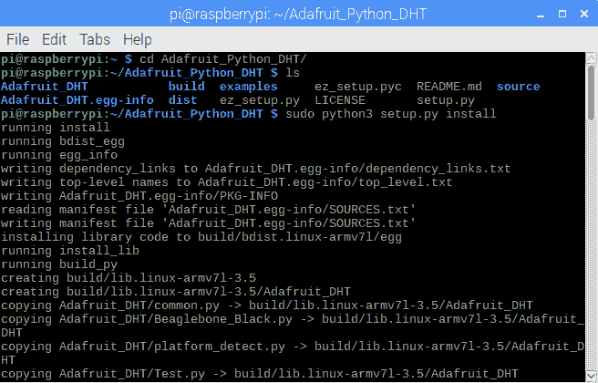
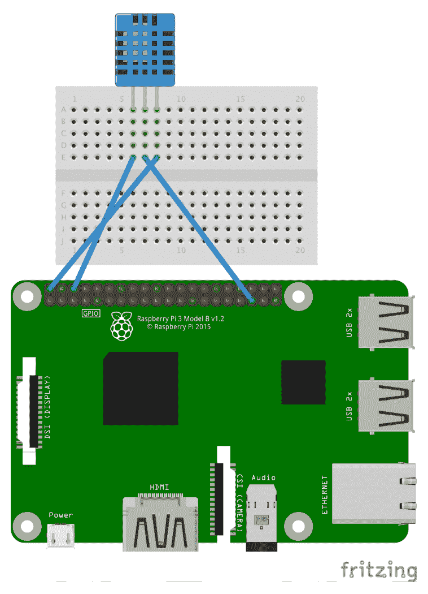
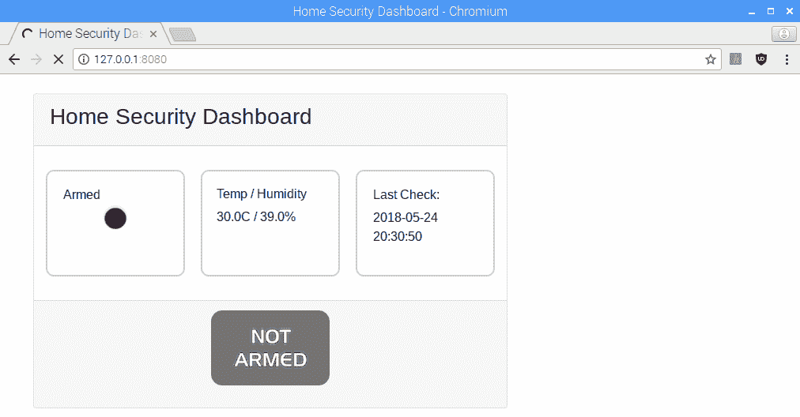
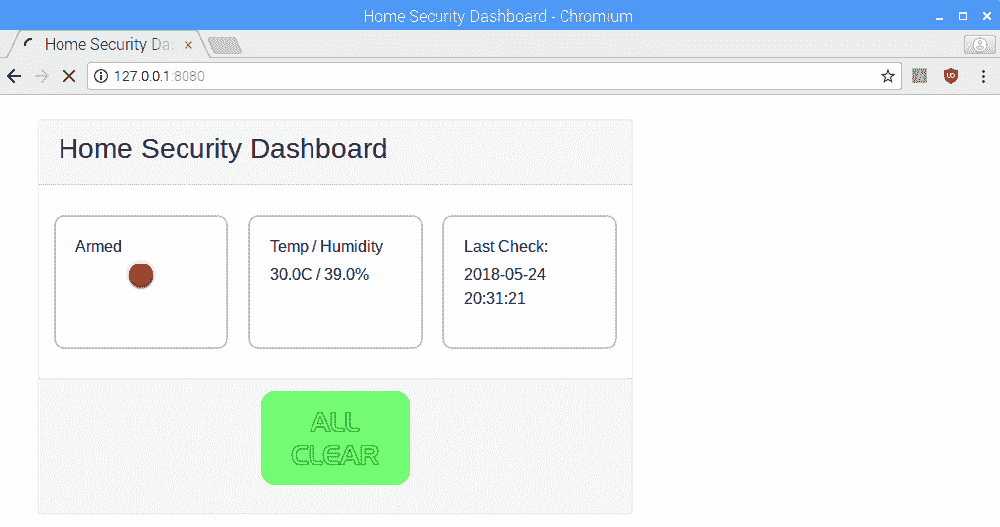

# 九、构建家庭安全仪表板

在[第 7 章](07.html)中*设置了一个 Raspberry Pi Web 服务器*中，我们介绍了 Web 框架 CherryPy。使用 CherryPy，我们能够将 Raspberry Pi 转换为 web 服务器。在[第 8 章](08.html)中*使用 Python*读取树莓 Pi GPIO 传感器数据，我们学习了如何从 GPIO 读取感官数据。

在本章中，我们将吸取前两章的经验教训，创建一个家庭安全仪表板。

本章将介绍以下主题：

*   使用 CherryPy 创建仪表板
*   在仪表板上显示感官数据

# 完成本章所需的知识

读者需要掌握 Python 编程语言的实用知识才能完成本章。还需要对 HTML（包括 CSS）有基本的了解。

# 项目概述

在本章中，我们将构建两个不同的家庭安全仪表盘。第一个涉及使用温度和湿度传感器，下一个涉及主动蜂鸣器。

这个项目需要几个小时才能完成。

# 开始

为完成本项目，需要以下各项：

*   Raspberry Pi 3 型（2015 型或更新型）
*   USB 电源
*   计算机显示器
*   USB 键盘
*   USB 鼠标
*   试验板
*   DHT11 温度传感器
*   闭锁按钮、开关或钥匙开关
*   PIR 传感器
*   主动蜂鸣器
*   树莓 Pi 相机模块

# 使用 CherryPy 创建仪表板

为了创建我们的家庭安全仪表板，我们将修改我们在[第 7 章](07.html)中编写的代码，*设置 Raspberry Pi Web 服务器*。这些修改包括从 GPIO 中添加感官数据[第 8 章](08.html)结束时，我们非常擅长这一点，*使用 Python*读取树莓派 GPIO 传感器数据。

其中两个输入，温度和湿度传感器和 Pi 摄像头，将需要额外的步骤，以便我们能够将它们集成到仪表板中。

# 使用 DHT11 查找温度和湿度

DHT11 温度和湿度传感器是一种低成本爱好者级传感器，能够提供基本测量。DHT11 有两种不同的版本，四针型号和三针型号。

我们将在项目中使用三针模型（见下图）：


我们用来读取 DHT11 数据的库`Adafruit DHT`库并没有预装在 Raspbian 上（截至撰写本文时）。要安装它，我们将克隆库的 GitHub 项目并从源代码构建它。

打开终端窗口，键入以下命令使用`git`并下载源代码（撰写时，`git`预装 Raspbian）：

```py
git clone https://github.com/adafruit/Adafruit_Python_DHT.git
```

您应该可以看到代码下载的进度。现在，使用以下命令更改目录：

```py
cd Adafruit_Python_DHT
```

您将在`source code`目录中。

使用以下命令生成项目：

```py
sudo python3 setup.py install
```

您应该看到终端中显示的进度：



如果您没有收到任何错误，`Adafruit DHT`库现在应该安装在您的 Raspberry Pi 上。要验证这一点，请打开 Thonny 并检查软件包：


现在，让我们把电路连接起来。将 DHT11 传感器连接至 Raspberry Pi，如下所示：

*   从 DHT11 接地到覆盆子 Pi 接地
*   DHT11 上的 VCC 至 Raspberry Pi 上的 5V DC
*   DHT11 至 GPIO 引脚 19 上的信号

有关更多信息，请参见以下烧结图：



DHT11 连接好后，就可以编写一些代码了：

1.  从应用程序菜单|编程| Thonny Python IDE 打开 Thonny
2.  单击新建以创建新文件
3.  在文件中键入以下内容：

```py
import Adafruit_DHT

dht_sensor = Adafruit_DHT.DHT11
pin = 19
humidity, temperature = Adafruit_DHT.read_retry(dht_sensor, pin)

print(humidity)
print(temperature)
```

4.  将文件另存为`dht-test.py`
5.  运行代码
6.  您应该看到类似以下内容：


让我们看一下代码。我们将从导入`Adafruit_DHT`库开始。然后我们创建一个新的`DHT11`对象，并将其命名为`dht_sensor`。`humidity`和`temperature`是根据`Adafruit_DHT`类上的`read_retry`方法设置的。

然后我们将`humidity`和`temperature`的值打印到 shell。

# 使用 Pi 相机拍照

在[第 3 章](03.html)中*使用 GPIO 连接到外部世界*中，我们试用了特殊的 Raspberry Pi 摄像头模块，并编写了打开摄像头预览的代码。是时候把相机投入使用了。

通过 CSI 摄像头端口将 Raspberry Pi 摄像头模块安装到 Raspberry Pi 上（如果尚未启用，请确保在 Raspberry Pi 配置屏幕中启用摄像头）。让我们编写一些代码：

1.  从应用程序菜单|编程| Thonny Python IDE 打开 Thonny
2.  单击新建以创建新文件
3.  在文件中键入以下内容：

```py
from picamera import PiCamera
from time import sleep

pi_cam = PiCamera()

pi_cam.start_preview()
sleep(5)
pi_cam.capture('/home/pi/myimage.png')
pi_cam.stop
```

4.  将文件另存为`pi-camera-test.py`
5.  运行代码

此程序导入`PiCamera`并在创建名为`pi_cam`的新`PiCamera`对象之前休眠。`start_preview`方法向我们展示了摄像机在全屏上看到的东西。

捕获方法创建一个名为`myimage.png`的新图像文件，并将其存储在默认目录`/home/pi`中。

在拍照之前，我们有`5`秒的时间来定位相机。

以下是我工作区域的照片，使用 Raspberry Pi 摄像头拍摄：


# 使用 CherryPy 创建仪表板

在[第 7 章](07.html)中*设置 Raspberry Pi Web 服务器*中，我们使用带`WeatherDashboardHTML.py`文件的引导框架创建了天气仪表板。我们将重新访问该代码，并为我们的家庭安全仪表板修改它

要创建家庭安全仪表板，请执行以下操作：

1.  从应用程序菜单|编程| Thonny Python IDE 打开 Thonny
2.  单击新建以创建新文件
3.  在文件中键入以下内容：

```py
import cherrypy
from SecurityData import SecurityData

class SecurityDashboard:

    def __init__(self, securityData):
        self.securityData = securityData

    @cherrypy.expose
    def index(self):
        return """
               <!DOCTYPE html>
                <html lang="en">

                <head>
                    <title>Home Security Dashboard</title>
                    <meta charset="utf-8">
                    <meta name="viewport"
                        content="width=device-width,
                        initial-scale=1">

                    <meta http-equiv="refresh" content="30">

                    <link rel="stylesheet"         
                        href="https://maxcdn.bootstrapcdn.com
                        /bootstrap/4.1.0/css/bootstrap.min.css">

                    <link rel="stylesheet" href="led.css">

                    <script src="https://ajax.googleapis.com
                        /ajax/libs/jquery/3.3.1/jquery.min.js">                
                    </script>

                    <script src="https://cdnjs.cloudflare.com
                        /ajax/libs/popper.js/1.14.0
                        /umd/popper.min.js">
                    </script>

                    <script src="https://maxcdn.bootstrapcdn.com
                        /bootstrap/4.1.0/js/bootstrap.min.js">
                    </script>

                    <style>
                        .element-box {
                            border-radius: 10px;
                            border: 2px solid #C8C8C8;
                            padding: 20px;
                        }

                        .card {
                            width: 600px;
                        }

                        .col {
                            margin: 10px;
                        }
                    </style>
                </head>

                <body>
                    <div class="container">
                        <br/>
                        <div class="card">
                             <div class="card-header">
                                <h3>Home Security Dashboard</h3>
                             </div>
                             <div class="card-body">
                                <div class="row">
                                    <div class="col element-box">
                                        <h6>Armed</h6>
                                        <div class = """ +     
                                            self.securityData
                                            .getArmedStatus() + 
                                        """>
                                        </div>
                                    </div>
                                    <div class="col element-box">
                                        <h6>Temp / Humidity</h6>
                                        <p>""" + self.securityData
                                            .getRoomConditions() 
                                        + """</p>
                                    </div>
                                    <div class="col element-box">
                                        <h6>Last Check:</h6>
                                        <p>""" + self
                                            .securityData.getTime() 
                                         + """</p>
                                    </div>
                                </div>
                            </div>
                            <div class="card-footer" 
                                       align="center">

                                
                                <p>""" + self.securityData
                                    .getDetectedMessage() + """</p>
                            </div>
                        </div>
                    </div>
                </body>

                </html>
               """

if __name__=="__main__":
    securityData = SecurityData()
    conf = {
        '/led.css':{
            'tools.staticfile.on': True,
            'tools.staticfile.filename': '/home/pi/styles/led.css'
            },
        '/intruder.png':{
            'tools.staticfile.on': True,
            'tools.staticfile.filename':                            
                '/home/img/intruder.png'
            },
        '/all-clear.png':{
            'tools.staticfile.on': True,
            'tools.staticfile.filename': '/home/pi/images
                /all-clear.png'
            },
        '/not-armed.png':{
            'tools.staticfile.on': True,
            'tools.staticfile.filename': '/home/pi
              img/not-armed.png'
            }
    }
    cherrypy.quickstart(SecurityDashboard(securityData),'/',conf)
```

4.  将文件另存为`security-dashboard.py`

不要运行代码，因为我们仍然需要创建`SecurityData`类。

如您所见，为了创建`security-dashboard.py`，我们对`WeatherDashboardHTML.py`做了一些修改。在运行代码之前，让我们指出一些更改。

最明显的变化是`SecurityData`类的使用。可以想象，此类将用于获取仪表板的数据：

```py
from SecurityData import SecurityData
```

我们使用以下行每隔`30`秒自动刷新页面（我们没有自动刷新天气仪表板，因为天气数据不会经常更改）：

```py
<meta http-equiv="refresh" content="30">
```

对于我们的家庭安全仪表板，我们使用了一些 CSS 魔法来表示闪烁的 LED。这是通过添加`led.css`文件来实现的：

```py
<link rel="stylesheet" href="led.css">
```

对于数据字段，我们将从`SecurityData`对象访问方法。我们将在下一节中详细介绍这些方法。对于我们的主要部分，我们将创建一个名为`conf`的字典：

```py
if __name__=="__main__":
    securityData = SecurityData()
    conf = {
        '/led.css':{
            'tools.staticfile.on': True,
            'tools.staticfile.filename': '/home/pi/styles/led.css'
            },
        '/intruder.png':{
            'tools.staticfile.on': True,
            'tools.staticfile.filename':                            
                '/home/img/intruder.png'
            },
        '/all-clear.png':{
            'tools.staticfile.on': True,
            'tools.staticfile.filename': '/home/pi/images
                /all-clear.png'
            },
        '/not-armed.png':{
            'tools.staticfile.on': True,
            'tools.staticfile.filename': '/home/pi
              img/not-armed.png'
            }
    }
    cherrypy.quickstart(SecurityDashboard(securityData),'/',conf)

```

我们使用`conf`字典将配置数据传递给`cherrypy quickstart`方法。此配置数据允许我们在 CherryPy 服务器上使用静态文件`led.css`、`intruder.png`、`all-clear.png`和`not-armed.png`。

前面提到了 CSS 文件`led.css`。其他三个文件是仪表板中使用的自描述图像。

In order to use static files or directories with CherryPy, you must create and then pass in configuration information. An absolute path (as opposed to a relative path) must be part of the configuration information.

配置信息表明 CSS 和图像文件分别位于名为`styles`和`images`的目录中。这些目录都位于`/home/pi`目录中。

以下是`images`目录中文件的屏幕截图（请确保将您的文件放置在正确的目录中）：


# 在仪表板上显示感官数据

为了提供仪表板数据，我们将创建一个名为`SecurityData.py`的新 Python 文件，在其中存储`SecurityData`类。在我们这么做之前，让我们先建立我们的电路。

# 带温度传感器的家庭安全仪表板

我们将用 DHT11 温度和湿度传感器、PIR 传感器和锁定按钮（或钥匙开关）构建我们的第一个家庭安全仪表板版本。以下是我们家庭安全仪表板的 Fritzing 示意图：


电路连接如下：

*   从 DHT11 接地至接地
*   DHT11 上的 VCC 至 5V 直流电
*   DHT11 至 GPIO 引脚 19 上的信号
*   从 PIR 传感器接地至接地
*   PIR 传感器上的 VCC 至 5V DC
*   PIR 传感器上的信号至 GPIO 引脚 4
*   锁定按钮的一端连接到 GPIO 引脚 8
*   锁定按钮的另一端接地
*   Pi 摄像头模块至 CSI 端口（未显示）

以下是我们赛道的照片。需要注意的一点是 DHT11 传感器的单独试验板（更容易安装在微型试验板上），以及代替闭锁按钮的钥匙开关：


现在是编写代码的时候了：

1.  从应用程序菜单|编程| Thonny Python IDE 打开 Thonny
2.  单击新建以创建新文件

3.  在文件中键入以下内容：

```py
from gpiozero import MotionSensor
from gpiozero import Button
from datetime import datetime
from picamera import PiCamera
import Adafruit_DHT

class SecurityData:
    humidity=''
    temperature=''
    detected_message=''

    dht_pin = 19
    dht_sensor = Adafruit_DHT.DHT11
    switch = Button(8)
    motion_sensor = MotionSensor(4)
    pi_cam = PiCamera()

    def getRoomConditions(self):
        humidity, temperature = Adafruit_DHT
            .read_retry(self.dht_sensor, self.dht_pin)

        return str(temperature) + 'C / ' + str(humidity) + '%'

    def getDetectedMessage(self):
        return self.detected_message

    def getArmedStatus(self):
        if self.switch.is_pressed:
            return "on"
        else:
            return "off"

    def getSecurityImage(self):

        if not(self.switch.is_pressed):
            self.detected_message = ''
            return "/not-armed.png"

        elif self.motion_sensor.motion_detected:
            self.pi_cam.resolution = (500, 375)
            self.pi_cam.capture("/home/img/intruder.png")
            self.detected_message = "Detected at: " + 
                self.getTime()
            return "/intruder.png"

        else:
            self.detected_message = ''
            return "/all-clear.png"

    def getTime(self):
        return datetime.now().strftime('%Y-%m-%d %H:%M:%S')

if __name__ == "__main__":

    while True:
        security_data = SecurityData()
        print(security_data.getRoomConditions())
        print(security_data.getArmedStatus())
        print(security_data.getTime())
```

4.  将文件另存为`SecurityData.py`
5.  运行代码

您应该得到一个到外壳的输出，指示房间中的`temperature`和`humidity`电平，`on`或`off`指示开关的位置以及当前时间。尝试打开和关闭开关，查看输出值是否发生变化。

在运行仪表板代码（`security-dashboard.py`之前，让我们先回顾一下`SecurityData`类。正如我们所看到的，代码的第一部分是我们已经熟悉的标准样板代码。`getRoomConditions`和`getDetectedMessage`方法要么是不言自明的，要么是我们已经介绍过的。

我们的`getArmedStatus`方法有一个小技巧来保持我们的代码简单紧凑：

```py
def getArmedStatus(self):
    if self.switch.is_pressed:
        return "on"
    else:
        return "off"
```

我们可以看到，`getArmedStatus`返回`on`或`off`，而不是像大多数使用二进制返回的方法那样返回`True`或`False`。我们这样做是为了仪表板代码的武装部分。

下面是由`SecurityDashboard`类的`index`方法生成的 HTML 代码：

```py
<div class="col element-box">
    <h6>Armed</h6>
    <div class = """ + self.securityData.getArmedStatus() + """>
    </div>
</div>
```

正如我们所看到的，`getArmedStatus`方法是在构建 div 标记而不是 CSS 类名的过程中调用的。单词`on`和`off`指的是我们`led.css`文件中的 CSS 类。当`on`返回时，我们得到一个闪烁的红色 LED 类型图形。当`off`返回时，我们得到一个黑点。

因此，闭锁开关（或按键开关）的位置通过`SecurityData`类的`getArmedStatus`方法确定 div 标签是否具有`on`的 CSS 类名或`off`的 CSS 类名。

我们的代码通过`getSecurityImage`方法变得非常有趣：

```py
def getSecurityImage(self):

        if not(self.switch.is_pressed):
            self.detected_message = ''
            return "/not-armed.png"

        elif self.motion_sensor.motion_detected:
            self.pi_cam.resolution = (500, 375)
            self.pi_cam.capture("/home/img/intruder.png")
            self.detected_message = "Detected at: " + 
                self.getTime()
            return "/intruder.png"

        else:
            self.detected_message = ''
            return "/all-clear.png"
```

我们的第一个条件语句检查电路是否已启用（开关处于`on`位置）。如果未启用，那么我们需要做的就是将检测到的消息设置为 nothing，并返回对`not-armed.png`文件的引用（`/not-armed.png`是在`security-dashboard.py`文件中设置的配置信息中定义的）。

如果我们查看`SecurityDashboard`类（`security-dashboard.py`文件）中的代码，我们可以看到在生成的 HTML 代码底部附近调用了`getSecurityImage`方法：

```py
<div class="card-footer" align="center">
    
    <p>""" + self.securityData.getDetectedMessage() + """</p>
</div>
```

如果我们电路中的开关不是`on`，我们将在仪表板页脚中得到以下内容，后面没有说明（空白`detected_message`值）：


我们代码中的第二个条件语句在开关为`on`且检测到运动时到达。在这种情况下，我们设置 Pi 相机的分辨率，然后拍照。

We probably could have set the resolution of the Pi camera during the instantiation of the class, and this would probably have made more sense. However, putting this line here makes it easier to adjust the resolution prior to completing the code, as the line exists in the method we are focusing on.

我们调用文件`intruder.png`并将其存储在`security-dashboard.py`文件中的配置代码可以找到它的位置。

我们还基于当前时间创建一个`detected_message`值。此消息将为我们从 Pi 摄像机获取的图像提供时间戳。

最后的`else:`语句是我们返回`/all-clear.png`的地方。当我们的代码到达这一点时，我们知道开关是`on`，并且没有检测到任何运动。我们将在仪表板的页脚处看到以下图像：


与`NOT ARMED`消息一样，`ALL CLEAR`之后不会有描述。我们将仅在开关为`on`且 PIR 传感器未检测到任何运动时看到此图（`motion_detected`为`false`。

现在，让我们运行仪表板代码。如果您尚未执行此操作，请单击红色按钮停止`SecurityData`程序。单击`security-dashboard.py`文件的选项卡，然后单击运行。等待几秒钟，让 CherryPy 开始运行。

打开 web 浏览器，然后导航到以下地址：

```py
http://127.0.0.1:8080
```

当开关处于`off`位置时，您应看到以下仪表板屏幕：



如我们所见，武装部分下方的 LED 为黑色，我们在页脚处收到一条`NOT ARMED`信息。我们还可以看到显示了`temperature`和`humidity`，即使系统未启用。

最后一个复选框显示代码最后一次检查开关状态的时间。如果您等待 30 秒，您将看到页面刷新时显示相同的信息。

现在，打开开关，向后站，使 PIR 传感器不会检测到您。您应该会看到类似于以下内容的屏幕：



您会注意到，防护部分的 LED 现在变为闪烁的红色，`temperature`和`humidity`读数相同或略有不同，上次检查已更新为当前时间，`ALL CLEAR`消息显示在页脚中。

让我们看看是否能抓到入侵者。将 Pi 摄像机指向门口，等待 PIR 传感器触发：


看来我们抓到了入侵者！

# 快速响应的家庭安全仪表板

您可能已经注意到，刷新页面需要很长时间。当然，这是由于刷新时间为 30 秒，以及 DHT11 读取值所需的较长时间。

让我们改变我们的代码，使它更快，并给它一个蜂鸣器吓跑入侵者。

用一个连接到 GPIO 引脚 17 的蜂鸣器替换 DHT11（我们不需要这个简单的更改的烧结图）。

我们首先创建`SecurityDataQuick`数据类：

1.  从应用程序菜单|编程| Thonny Python IDE 打开 Thonny
2.  单击新建以创建新文件
3.  在文件中键入以下内容：

```py
from gpiozero import MotionSensor
from gpiozero import Button
from datetime import datetime
from picamera import PiCamera
from gpiozero import Buzzer
from time import sleep

class SecurityData:
    alarm_status=''
    detected_message=''

    switch = Button(8)
    motion_sensor = MotionSensor(4)
    pi_cam = PiCamera()
    buzzer = Buzzer(17)

    def sound_alarm(self):
        self.buzzer.beep(0.5,0.5, 5, True)
        sleep(1)

    def getAlarmStatus(self):

        if not(self.switch.is_pressed):
            self.alarm_status = 'not-armed'
            return "Not Armed"

        elif self.motion_sensor.motion_detected:
            self.alarm_status = 'motion-detected'
            self.sound_alarm()
            return "Motion Detected"

        else:
            self.alarm_status = 'all-clear'
            return "All Clear"

    def getDetectedMessage(self):
        return self.detected_message

    def getArmedStatus(self):
        if self.switch.is_pressed:
            return "on"
        else:
            return "off"

    def getSecurityImage(self):

        if self.alarm_status=='not-armed':
            self.detected_message = ''
            return "/not-armed.png"

        elif self.alarm_status=='motion-detected':
            self.pi_cam.resolution = (500, 375)
            self.pi_cam.capture("/home/img/intruder.png")

            self.detected_message = "Detected at: " + 
                self.getTime()

            return "/intruder.png"

        else:
            self.detected_message = ''
            return "/all-clear.png"

    def getTime(self):
        return datetime.now().strftime('%Y-%m-%d %H:%M:%S')

if __name__ == "__main__":

    while True:
        security_data = SecurityData()
        print(security_data.getArmedStatus())
        print(security_data.getTime())

```

4.  将文件另存为`SecurityDataQuick.py`
5.  运行代码

在 shell 中，我们应该看到开关和当前时间的值。单击红色按钮停止程序。

正如我们所看到的，已经发生了一些变化。我们没有做的一个更改是更改类名。将其保持为`SecurityData`意味着以后仪表盘代码的更改更少。

我们为`GPIO Zero`蜂鸣器添加了库，并删除了与 DHT11 传感器相关的任何代码。我们还创建了一个名为`sound_buzzer`的新方法，我们将在检测到入侵者时调用该方法。

添加了一个名为`alarm_status`的新变量，并使用了相应的`getAlarmStatus`方法。我们已经将我们类的核心逻辑移到了这个方法（远离`getSecurityImage`，因为在这里我们检查开关和 PIR 传感器的状态。变量`alarm_status`在其他地方用于确定是否要拍摄照片。如果检测到入侵者，我们也会用这种方法发出警报。

由于添加了新方法，我们更改了`getSecurityImage`。通过在`getSecurityImage`方法中使用`alarm_status`，我们不需要检查传感器的状态。如果检测到入侵者，我们现在可以使用`getSecurityImage`进行拍照。

现在是更改仪表板代码的时候了：

1.  从应用程序菜单|编程| Thonny Python IDE 打开 Thonny
2.  单击新建以创建新文件
3.  在文件中键入以下内容：

```py
import cherrypy
from SecurityDataQuick import SecurityData

class SecurityDashboard:

def __init__(self, securityData):
    self.securityData = securityData

@cherrypy.expose
def index(self):
    return """
        <!DOCTYPE html>
        <html lang="en">

        <head>
            <title>Home Security Dashboard</title>
            <meta charset="utf-8">

            <meta name="viewport" content="width=device-
        width, initial-scale=1">

            <meta http-equiv="refresh" content="2">

            <link rel="stylesheet" href="https://maxcdn.bootstrapcdn.com
        /bootstrap/4.1.0/css/bootstrap.min.css">

            <link rel="stylesheet" href="led.css">

            <script src="https://ajax.googleapis.com
        /ajax/libs/jquery/3.3.1/jquery.min.js">
            </script>

            <script src="https://cdnjs.cloudflare.com
        /ajax/libs/popper.js/1.14.0
        /umd/popper.min.js">
            </script>

            <script src="https://maxcdn.bootstrapcdn.com
        /bootstrap/4.1.0/js/bootstrap.min.js">
            </script>

            <style>
                .element-box {
                    border-radius: 10px;
                    border: 2px solid #C8C8C8;
                    padding: 20px;
                }

                .card {
                    width: 600px;
                }

                .col {
                    margin: 10px;
                }
            </style>
        </head>

        <body>
            <div class="container">
                <br />
                <div class="card">
                    <div class="card-header">
                        <h3>Home Security Dashboard</h3>
                    </div>
                    <div class="card-body">
                        <div class="row">
                            <div class="col element-box">
                                <h4>Armed</h4>

                                <div class=""" + self
        .securityData
        .getArmedStatus() 
        + """>
                                </div>
                            </div>

                            <div class="col element-box">
                                <h4>Status</h4>
                                <p>""" + self.securityData
                                    .getAlarmStatus()
                                    + """</p>
                            </div>

                            <div class="col element-box">
                                <h4>Last Check:</h4>

                                <p>""" + self.securityData
                                    .getTime() + """
                                </p>
                            </div>
                        </div>
                    </div>
                    <div class="card-footer" align="center">
                        
                        <p>""" + self.securityData
                            .getDetectedMessage() + """</p>
                    </div>
                </div>
            </div>
        </body>

        </html>
    """

if __name__=="__main__":
    securityData = SecurityData()
    conf = {
        '/led.css':{
        'tools.staticfile.on': True,
        'tools.staticfile.filename': '/home/pi/styles/led.css'
        },
        '/intruder.png':{
        'tools.staticfile.on': True,
        'tools.staticfile.filename': '/home/pi
      img/intruder.png'
        },
        '/all-clear.png':{
        'tools.staticfile.on': True,
        'tools.staticfile.filename': '/home/pi
      img/all-clear.png'
        },
        '/not-armed.png':{
        'tools.staticfile.on': True,
        'tools.staticfile.filename': '/home/pi
      img/not-armed.png'
        }
    }
    cherrypy.quickstart(SecurityDashboard(securityData),'/',conf)

```

4.  将文件另存为`SecurityDataQuick.py`
5.  运行代码
6.  导航回 web 浏览器并刷新仪表板页面

我们的仪表板现在应该与以下屏幕截图匹配：


我们的仪表板应该每两秒刷新一次，而不是 30 秒，并且在启用模式下检测到运动时，蜂鸣器应该鸣响。

让我们看一下代码。我们的仪表板的变化是不言自明的。然而，值得注意的是，对仪表板中间框的更改：

```py
<div class="col element-box">
    <h4>Status</h4>
    <p>""" + self.securityData.getAlarmStatus() + """</p>
</div>
```

我们通过`getAlarmStatus`方法将房间`temperature`和`humidity`替换为开关和 PIR 传感器的状态。通过此更改，我们可以使用`getAlarmStatus`方法作为`initialization`方法，其中我们设置`SecurityData`类变量`alarm_status`的状态。

If we really wanted to be sticklers about it, we could change our code so that we initialize the `SecurityData` class with the values of the switch and PIR sensor. As it stands, `SecurityData` is more of a utility type class where certain methods must be called before others. We'll let it slide for now.

# 总结

正如我们所看到的，用 Raspberry Pi 构建安全应用程序非常简单。虽然我们可以在同一个 Raspberry Pi 上查看仪表板和托管传感器，但设置 Raspberry Pi 以将仪表板提供给网络（甚至 internet）中的其他计算机并不太困难。在[第 10 章](10.html)*发布到网络服务*中，我们将进一步与
感官数据交互，并将其发布到互联网上。

# 问题

1.  对还是错？DHT11 传感器是一种昂贵且高度精确的温度和湿度传感器
2.  对还是错？DHT11 传感器可以检测来自太阳的紫外线
3.  是真是假？运行 DHT11 所需的代码预装有 Raspbian
4.  如何设置 Pi 摄像头模块的分辨率？
5.  如何设置 CherryPy 以便它可以访问本地静态文件？
6.  如何设置网页的自动刷新？
7.  对还是错？通过使用 CSS，我们能够模拟闪烁的 LED
8.  `SecurityData`课程的目的是什么？
9.  我们发现谁或什么是入侵者？
10.  如果我们想成为一丝不苟的人，我们将如何改变我们的`SecurityData`课程？

# 进一步阅读

我们的代码中使用的刷新方法是有效的，但有点笨拙。我们的仪表盘可以通过使用 AJAX 代码来改进，在 AJAX 代码中，字段是更新的，而不是页面。有关更多信息，请参阅 CherryPy 文档。