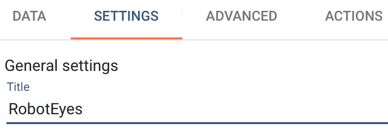
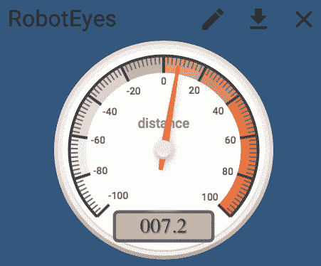
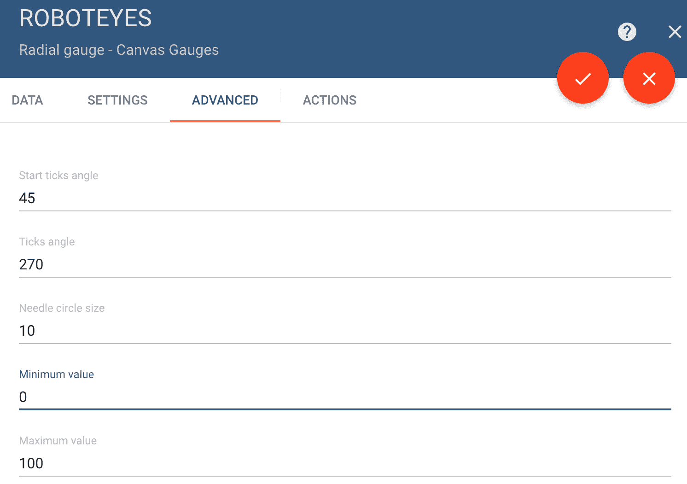
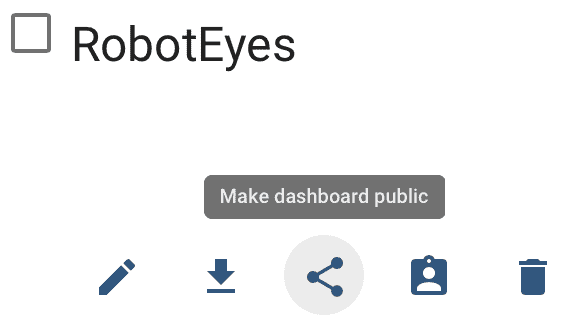
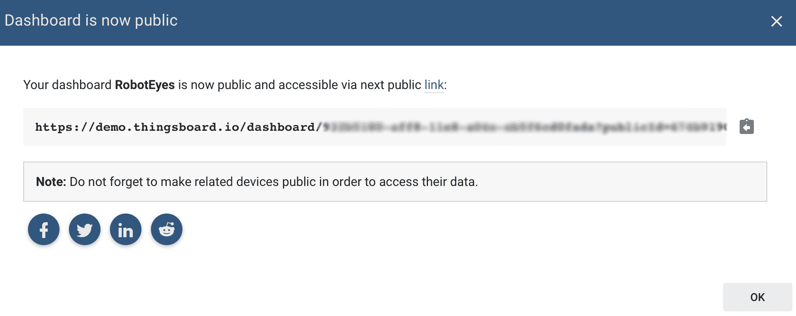
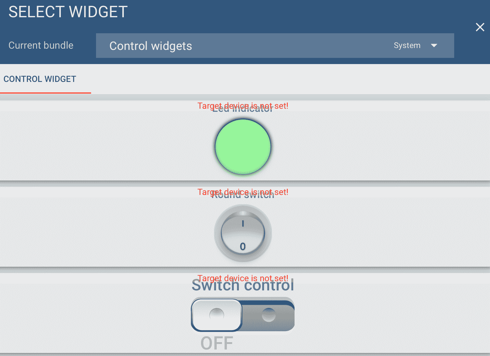
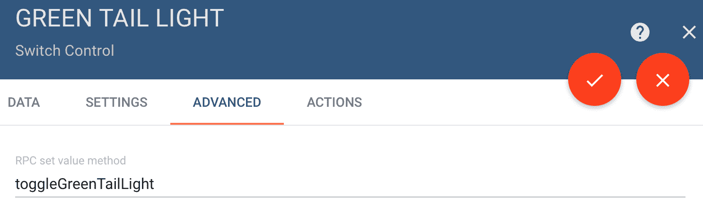

# 十六、通过 Web 服务调用控制机器人车

有一天，无人驾驶汽车将主宰我们的街道和高速公路。虽然感觉信息和控制算法将位于汽车本身，但我们将有能力（这可能是一项立法要求）从其他地方控制汽车。控制无人驾驶汽车需要将汽车的感官信息以速度、GPS 位置等形式发送到控制站。相反，来自控制站的信息将以交通和方向的形式发送给汽车。

在本章中，我们将探讨 T.A.R.A.S.发送感官信息和 T.A.R.A.S.接收控制信息。

本章将介绍以下主题：

*   从云端读取机器人车的数据
*   使用 Python 程序通过云控制机器人车

# 完成本章所需的知识

要完成本章，您应该拥有一辆完整的 T.a.R.a.S 机器人车，如[第 13 章](13.html)、*介绍覆盆子 Pi 机器人车*中所述。与本书的其他章节一样，需要掌握 Python 的实用知识，以及对面向对象编程的基本理解。

# 项目概述

本章中的项目将涉及通过互联网与 T.A.R.A.S.沟通。在我们在控制 T.a.R.a.S.的仪表板上创建开关之前，我们将更深入地了解我们在[第 15 章](15.html)*中创建的仪表板模拟拨号盘，将机器人车的感官输入连接到网络*。这些项目大约需要 2 小时才能完成

# 技术要求

为完成本项目，需要以下各项：

*   Raspberry Pi 3 型（2015 型或更新型）
*   USB 电源
*   计算机显示器
*   USB 键盘
*   USB 鼠标
*   一套完整的 T.A.R.A.S 机器人车套件（参见[第 13 章](13.html)、*介绍树莓派机器人车*）

# 从云端读取机器人车的数据

在[第 15 章](15.html)中*将机器人车的感知输入连接到网络*中，我们能够通过网站[将距离感知数据发送到云 https://thingsboard.io/](https://thingsboard.io/) 。我们以显示距离值的模拟仪表结束。在本节中，我们将通过定制模拟小部件来深入了解它。

# 更改测距仪的外观

这就是我们改变测距仪外观的方式：

1.  登录你的 ThingsBoard 帐户
2.  单击仪表板
3.  点击 ROBOTEYES 标题

4.  单击屏幕右下角的橙色铅笔图标
5.  您会注意到距离模拟拨号盘已更改（请参见以下屏幕截图）
6.  首先，在拨号盘的右上角有三个新图标
7.  在右下角，颜色也变为浅灰色
8.  您可以通过将鼠标悬停在右下角来调整小部件的大小
9.  您还可以在仪表板上移动小部件
10.  右上角的 X 允许您从仪表板中删除此小部件
11.  带下划线箭头的图标允许您将小部件作为`.json`文件下载。此文件可用于将小部件导入 ThingsBoard 上的另一个仪表板
12.  单击小部件上的铅笔图标可生成从右侧滑出的菜单：


13.  正如您在前面的屏幕截图中所看到的，菜单选项包括数据、设置、高级和操作。默认值是数据
14.  单击“设置”选项卡
15.  在标题下，将名称更改为`RobotEyes`：



16.  单击“显示标题”复选框
17.  单击背景色下的白色圆圈：


18.  您将看到“颜色选择”对话框：


19.  将顶部更改为`rgb(50,87,126)`
20.  单击橙色复选框接受更改
21.  您会注意到测距仪有一些外观上的变化（请参见以下屏幕截图）：



# 更改测距仪上的量程

看看距离模拟仪表，很明显，负数对我们的应用没有多大意义。让我们把范围定为`0`到`100`：

1.  单击小部件上的铅笔图标
2.  单击高级选项卡

3.  将最小值更改为`0`，将最大值更改为`100`：



4.  单击右上角的橙色复选框接受对小部件的更改
5.  关闭 ROBOTEYES 对话框
6.  单击右下角的橙色复选框以接受对仪表板的更改
7.  您会注意到，距离模拟仪表现在显示的范围为`0`到`100`：


# 查看帐户外部的仪表板

最后一个技巧是，我们将在账户外显示仪表板（我们在[第 10 章](10.html)、*发布到 Web 服务*中也这样做了）。这也允许我们将仪表板发送给朋友。那么，我们为什么要在帐户之外查看仪表板呢？物联网的核心理念是，我们可以从一个地方获取信息，并将其展示在其他地方，也许是世界的另一边。通过使我们的仪表板在我们的帐户之外可访问，我们允许在任何地方设置仪表板，而无需共享我们的帐户信息。想象一下世界上某个地方的一个大电脑屏幕，屏幕的一小部分显示了我们的仪表板。显示来自 T.A.R.A.S.的距离信息可能不是很多人感兴趣的，但概念才是重要的。

要共享我们的仪表板，请执行以下操作：

1.  在 ThingsBoard 应用程序中，单击仪表板选项
2.  单击 RobotEyes 仪表板下的中间图标：



3.  您将看到类似于以下内容的对话框（URL 已部分模糊）：



4.  单击 URL 旁边的图标将 URL 复制到剪贴板
5.  要测试 URL，请将其粘贴到计算机上完全不同的浏览器中（或通过电子邮件发送给朋友并让他们打开）
6.  你应该能够看到仪表盘与我们的距离模拟仪表

# 使用 Python 程序通过云控制机器人车

能够在仪表板上看到感官数据令人印象深刻。但是，如果我们想从仪表板中实际控制某些东西，该怎么办？在本节中，我们将这样做。我们将首先构造一个简单的开关来控制 T.a.R.a.S.上的 LED。然后我们将对此进行扩展，让 T.A.R.A.S 通过互联网上的一个按钮来跳舞。

让我们首先将仪表板的名称从`RobotEyes`更改为`RobotControl`：

1.  在 ThingsBoard 应用程序中，单击仪表板选项
2.  单击 RobotEyes 仪表板下的铅笔图标：


3.  点击橙色铅笔图标
4.  将瓷砖从`RobotEyes`改为`RobotControl`：


5.  单击橙色复选框以接受更改
6.  退出侧面对话框

现在，让我们从 ThingsBoard 仪表板控制 T.A.R.A.s 上的 LED。

# 向仪表板添加开关

为了控制 LED，我们需要创建一个开关：

1.  单击机器人控制面板
2.  点击橙色铅笔图标
3.  单击+图标
4.  单击 Createwwidget 图标
5.  选择控件小部件并单击开关控件：



6.  在目标设备下，选择机器人控制
7.  单击“设置”选项卡：


8.  将标题更改为`Green Tail Light`并点击显示标题
9.  单击高级选项卡
10.  将 RPC 设定值方法更改为`toggleGreenTailLight`：



11.  单击橙色复选标记图标接受对小部件的更改
12.  关闭侧边对话框
13.  单击橙色复选标记图标接受对仪表板的更改

那么，我们刚才在这里做了什么？我们在仪表板上添加了一个开关，该开关将发布一个名为`toggleGreenTailLight`的方法，该方法将返回一个`true`或`false`的值（默认返回值为`this is a switch`

现在我们有了开关，让我们在 Raspberry Pi 上编写一些代码来响应它。

# 控制 T.A.R.A.S.上的绿色 LED

为了控制 T.A.R.A.S 上的绿色 LED，我们需要为 T.A.R.A.S 上的 Raspberry Pi 编写一些代码。我们需要仪表板的访问令牌（参见[第 15 章](15.html)*将机器人车的感官输入连接到网络*，了解如何获取该令牌）：

1.  从应用程序菜单|编程| Thonny Python IDE 打开 Thonny
2.  单击新建图标创建一个新文件
3.  键入以下内容：

```py
import paho.mqtt.client as mqtt
from gpiozero import LED
import json

THINGSBOARD_HOST = 'demo.thingsboard.io'
ACCESS_TOKEN = '<<access token>>'
green_led=LED(21)

def on_connect(client, userdata, rc, *extra_params):
   print('Connected with result code ' + str(rc))
    client.subscribe('v1/devices/me/rpc/request/+')

def on_message(client, userdata, msg):
    data = json.loads(msg.payload.decode("utf-8")) 

    if data['method'] == 'toggleGreenTailLight':
        if data['params']:
            green_led.on()
        else:
            green_led.off()

client = mqtt.Client()
client.on_connect = on_connect
client.on_message = on_message
client.username_pw_set(ACCESS_TOKEN)
client.connect(THINGSBOARD_HOST, 1883, 60)

client.loop_forever()
```

4.  将文件另存为`control-green-led-mqtt.py`
5.  运行代码
6.  回到我们的 ThingsBoard 仪表板（如果你没有在 t.a.R.a.S.上使用除 Raspberry Pi 之外的其他计算机，现在正是这样做的好时机）
7.  点击开关打开它
8.  您应该看到 T.A.R.A.S 上的绿色 LED 随着开关打开和关闭

那么，我们刚才在这里做了什么？使用 ThingsBoard 网站上的样板代码，我们构建了一个**消息查询遥测传输**（**MQTT**客户端，该客户端监听仪表板并在收到`toggleGreenTailLight`方法时做出响应。我们通过在`on_connect`方法中订阅`'v1/devices/me/rpc/request/+'`来实现这一点。我们在[第 10 章](10.html)中使用了 MQTT，*发布到 Web 服务*中也使用了 MQTT。然而，由于这段代码几乎只是 MQTT 代码，所以让我们更仔细地研究一下。

MQTT is a lightweight messaging protocol based on a `publisher` and `subscriber` method, perfect for use in the Internet of Things. A good way to understand publishers and subscribers is to relate them to newspapers of the past. The publisher was the entity that produced the newspaper; the subscribers were the people that bought and read the newspaper. The publisher did not know, or even have to know, how many subscribers it had in order to print the newspaper (not taking the cost of publishing into account). Think of the giant newspapers that published every day, not knowing how many people would buy their newspaper. So, the publisher can have many subscribers and, conversely, the subscriber can subscribe to many publishers, as a reader could read many different newspapers.

我们首先导入代码所需的库：

```py
import paho.mqtt.client as mqtt
from gpiozero import LED
import json

THINGSBOARD_HOST = 'demo.thingsboard.io'
ACCESS_TOKEN = '<<access token>>'
green_led=LED(21)
```

这里需要注意的是`json`和`pho.mqtt.client`库，它们是与 MQTT 服务器通信所需的。`THINGSBOARD_HOST`和`ACCESS_TOKEN`是连接到正确的服务器和服务所需的标准变量。当然，还有`GPIO Zero LED`类，它将`green_led`变量设置为 GPIO 引脚`21`（恰好是 T.A.R.A.S 上的绿色尾灯）。

`on_connect`方法打印出连接信息，然后从 ThingsBoard 仪表板订阅将我们连接到`rpc`方法的服务：

```py
def on_connect(client, userdata, rc, *extra_params):
    print('Connected with result code ' + str(rc))
    client.subscribe('v1/devices/me/rpc/request/+')
```

正是`on_message`方法允许我们真正修改代码以达到我们的目的：

```py
def on_message(client, userdata, msg):
    data = json.loads(msg.payload.decode("utf-8")) 

    if data['method'] == 'toggleGreenTailLight':
        if data['params']:
            green_led.on()
        else:
            green_led.off()
```

我们首先从我们的`msg`变量中收集`data`并使用`json.loads`方法将其转换为`json`文件。`method`声明`on_message(client, userdata, msg)`也是 ThingsBoard 网站上的标准样板代码。我们真正关心的只是得到`msg`值。

第一个`if`语句`if data['method'] == 'toggleGreenTailLight'`检查我们的`msg`是否使用了我们在 ThingsBoard 仪表板上的开关设置的`toggleGreenTailLight`方法。一旦我们知道`msg`包含此方法，我们提取`data`中的另一个键值对，使用`if data['params']`检查`True`值。因此，换句话说，我们返回调用`on_message`方法的`json`文件将类似于`{'params': True, 'method': 'toggleGreenTailLight'}`。这基本上是一个包含两个键值对的 Python 字典。这似乎令人困惑，但最简单的思考方式是将其想象为一个方法（`json`版本（`toggleGreenTailLight`）和一个返回值（`True`）。

真正理解发生了什么的一种方法是在`on_message`方法的`print data`内部，在`data = json.loads(msg.payload.decode("utf-8"))`之后放一个`print`语句。因此，该方法类似于以下内容：

```py
def on_message(client, userdata, msg):
    data = json.loads(msg.payload.decode("utf-8")) 
    print(data)
    .
    .
    .

```

当`params`返回的值为`True`时，我们只需使用标准 GPIO 零代码打开 LED。当`params`返回的值不是`True`（或`False`，因为只有两个值可能）时，我们会关闭 LED。

通过互联网看到 LED 灯的开关非常令人印象深刻。然而，这还不够。让我们利用前面章节中使用的一些代码，让 T.A.R.A.s 起舞。这一次，我们将利用互联网让它起舞。

# 利用互联网让 T.A.R.A.S 跳舞

为了让 T.A.R.A.S 再次起舞，我们需要确保[第 14 章](14.html)*中使用 Python*控制机器人车的代码与我们将要编写的代码位于同一目录中。

我们将首先在仪表板上创建一个舞蹈开关：

1.  按照前面的步骤 1 到步骤 9 将开关添加到仪表板以创建开关
2.  将标题更改为“舞蹈切换”，然后单击“显示标题”
3.  单击高级选项卡
4.  将`RPC set value method`更改为`dance`
5.  单击橙色复选标记图标接受对小部件的更改
6.  关闭侧边对话框
7.  单击橙色复选标记图标接受对仪表板的更改

现在我们有了开关，让我们修改代码：

1.  从应用程序菜单|编程| Thonny Python IDE 打开 Thonny
2.  单击新建图标创建一个新文件
3.  从步骤 4 中键入以下内容：

```py
import paho.mqtt.client as mqtt
import json
from RobotDance import RobotDance

THINGSBOARD_HOST = 'demo.thingsboard.io'
ACCESS_TOKEN = '<<access token>>'
robot_dance = RobotDance()

def on_connect(client, userdata, rc, *extra_params):
    print('Connected with result code ' + str(rc))
    client.subscribe('v1/devices/me/rpc/request/+')

def on_message(client, userdata, msg):
    data = json.loads(msg.payload.decode("utf-8")) 

    if data['method'] == 'dance':
        if data['params']:
            robot_dance.lets_dance_incognito()

client = mqtt.Client()
client.on_connect = on_connect
client.on_message = on_message
client.username_pw_set(ACCESS_TOKEN)
client.connect(THINGSBOARD_HOST, 1883, 60)

client.loop_forever()
```

4.  将文件另存为`internet-dance.py`
5.  运行代码

现在转到仪表板，轻弹舞蹈开关（不幸的是，这是一个开关而不是按钮）。T.A.R.A.S 应该像在[第 14 章](14.html)中一样开始跳舞，*使用 Python*控制机器人车。

那么，我们刚才做了什么？嗯，我们使用了简单的代码，对其进行了一些修改，通过面向对象编程的强大功能，我们能够让 T.a.R.a.S 跳舞，而不需要更改甚至不需要检查我们的旧`RobotDance`代码（OOP 不是最好的东西吗，因为无论你认为最好的东西是什么？）。

对于 MQTT 代码，我们所要做的就是将`import`添加到`RobotDance`类中，去掉冗余的 GPIO 零导入，去掉对 LED 的任何引用（因为这会导致冲突），然后修改`on_message`方法以查找`dance`作为方法。

`RobotDance`类类型的`robot_dance`对象完成所有工作。当我们在这个对象上调用`lets_dance_incognito`方法时，它会将`RobotWheels`、`RobotBeep`、`TailLights`和`RobotCamera`类中用于移动的方法付诸实施。最终的结果是通过互联网上的一个开关让 T.a.R.a.S 跳舞。

# 总结

在本章中，我们进一步研究了用于距离感测信息的仪表板模拟仪表。我们对它进行了美容修饰，然后改变了范围并将其公开。然后我们将注意力转向通过互联网控制 T.A.R.A.S。通过使用一个简单的程序，我们能够打开 T.a.R.a.S.上的绿色 LED。使用仪表板开关。我们掌握了这些知识，修改了代码，通过另一个仪表板开关让 T.A.R.A.S 跳舞。

在[第 17 章](17.html)*构建 JavaScript 客户端*中，我们将继续编写 JavaScript 客户端，通过互联网控制 T.a.R.a.S

# 问题

1.  无人驾驶汽车需要中央车站提供什么类型的信息？
2.  对/错？无法更改 ThingsBoard 仪表板中小部件的背景色。
3.  如何更改仪表板模拟仪表的量程？
4.  对/错？从`print(data)`行返回的信息人类无法读取。
5.  我们调用`RobotDance`类中的哪种方法让 T.A.R.A.S 跳舞？
6.  对/错？我们需要处理`json`数据的库称为`jason`。
7.  如何在仪表板上创建开关？
8.  对/错？T.A.R.A.S 上的绿色 LED 连接到 GPIO 引脚 14。
9.  对/错？发布服务器只能有一个订阅服务器。
10.  使用`on_message`方法从`msg`返回多少个键值对？

# 进一步阅读

因为我们只是简单地提到了 ThingsBoard，所以最好在[查看他们的文档 https://thingsboard.io/docs/guides/](https://thingsboard.io/docs/guides/) 。