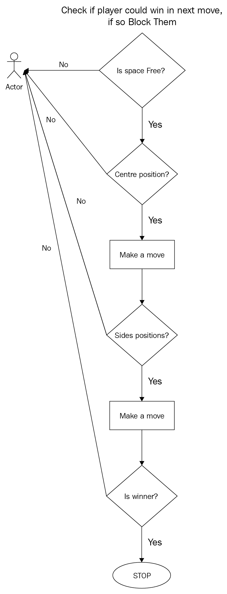

# 数据结构和功能

在本章中，我们将详细介绍数据结构和函数的概念，这是 Python 的两个主要构建块。正态变量是存储任何类型的奇异数据单元的好方法，但是对于数据数组，我们应该始终使用数据结构。Python 有大量可用的数据结构，您可以使用这些数据结构来表示和操作数据集，甚至可以将它们组合在一起以生成自己的数据结构。我们已经看到了内置的数据类型，例如整数、布尔值、浮点数、字符串和字符。它们被称为内置的，因为它们与 Python 吻合。现在，我们将探讨内置的数据结构，如列表、字典、元组和集合。这些内置数据类型的组合会产生独立实现的数据结构。例如，如果我们把不同的整数放在一个地方，它们就是数字数组。Python 称之为列表，这是广泛使用的数据结构。

为了成为熟练的程序员，在深入研究数据结构和算法之前，我们首先必须了解核心编程范式，如变量、数字、模块和内置函数。这本书没有什么不同。我们已经介绍了 Python 的基础知识；现在，是深入研究数据结构以及用于访问和操作数据的方法的时候了。在上一章中，我们用条件和循环修改了我们的游戏。现在，让我们扩展 Python 的知识，包括数据结构和函数的广泛概念，以便我们可以进一步完善我们的游戏。

本章将介绍以下主题：

*   为什么我们需要数据结构？
*   Python 列表、字典、集合和元组的四个结构支柱
*   功能
*   将 AI 添加到井字游戏中
*   游戏测试和可能的修改

# 技术要求

以下是您需要正确理解本章的要求：

*   Python 空闲
*   本章的代码资产可在[中找到 https://github.com/PacktPublishing/Learning-Python-by-building-games/tree/master/Chapter04](https://github.com/PacktPublishing/Learning-Python-by-building-games/tree/master/Chapter04)

请查看以下视频以查看代码的运行情况：

[http://bit.ly/2oNoxOL](http://bit.ly/2oNoxOL)

# 为什么我们需要数据结构？

作为程序员或计算机科学家，我们总是在寻找优化代码的方法。优化是为了提高代码效率和质量而细化代码的一种方法。数据结构是在计算机中组织数据的精明方法，因此更容易检索和访问数据，从而实现代码优化。

到目前为止，我们已经学习了如何使用条件来生成条件，以及如何使用正常变量生成流控件。然而，现实世界的数据并不局限于一个单位。我们可能会收集大量的数据，这些数据将具有最高级别的复杂性。它可能包含数千个整数、数百个布尔数或这些的组合。因此，用赋值语句将它们存储到单个正常变量中是不可能的。请看以下示例：


在前面的代码中，我们尝试将两个值赋给单个变量。它产生了一个语法错误。我们甚至尝试将两个字符串值放入单个变量`a`，但它执行了串联，并将其指定为单个值。因此，在正态变量中存储多个值是不可能的。但是，我们可以轻松地将此普通变量转换为数据结构，如以下代码片段所示：

```py
>>> a = 8 , 9
>>> a
(8,9)
>>> type(a) 
<class 'tuple'>
```

我们已经将普通的`a`变量转换为元组，元组是 Python 的内置数据结构。我们将在接下来的章节中详细介绍这一点。

此变量只能存储单个数据单元，但如果执行多个赋值，则前面的值将被覆盖。但是，如果要在一个占位符中保留所有数据，可以使用数据结构。

作为程序员，我们的主要责任是对输入数据集执行某种操作。输入可以是任何东西，比如电子邮件或密码，也可以是进入谷歌地图系统或位置的请求，我们可以使用这些数据使用算法执行某种计算。此外，haversine 算法（参考以下 URL 了解更多关于该算法的信息：[https://rosettacode.org/wiki/Haversine_formula](https://rosettacode.org/wiki/Haversine_formula) 提供您所在位置与目的地之间的准确距离。因此，输入数据的范围很广，但主要任务是对其进行操作。我们的系统和处理器的功能不足以同时处理数 TB 的数据。因此，选择合适的数据结构是程序员可以进行的主要优化。如果我们能够以任何有组织的形式将这些输入存储到更快的数据结构中，我们甚至可以轻松地执行复杂的任务。数据结构只是为如此复杂的数据提供结构的地方或存储器，但诸如获取和操作之类的过程是使用算法执行的。

还有疑问吗？为了理解数据结构和算法，让我们以一个库为例来说明问题。首先，想象一个我们在图书馆中没有适当管理的场景。书籍未正确放置在相关章节中。现在，在一个特定的章节中搜索一本书是无用的，因为它不会在那里。最好的情况是你可能在几分钟内找到你的书，但最坏的情况是你可能需要搜索整个图书馆才能找到一本关于历史的书。但是，如果图书馆的组织和管理得当，你将能够直接进入存放历史书籍的相关部分，并仅在该部分中搜索你的书籍。在这里，库表示数据结构，而书是您正在搜索的数据。每当您需要数据时，您都会转到数据结构，如果它得到了正确的管理，您将能够轻松地检索到它。定义如何搜索书籍的步骤称为算法。

理论已经够多了，让我们通过编码和学习 Python 数据结构的四大支柱——**列表**、**字典**、**集合**和**元组来动手吧。**

# Python 的四大结构支柱——列表、字典、集合和元组

在[第 2 章](02.html)*学习 Python 的基础知识*中，我们学习了字符串，我们称它们为不可变数据类型，因为它们不允许赋值操作。这在以下代码中显示：

```py
>>> name = "Python"
>>> name[0] = 'hey'
TypeError: 'str' object does not support item assignment
```

然而，数据结构必须是灵活的，这意味着我们应该能够从任何位置存储和提取数据元素。因此，Python 的大多数内置数据结构都是可变的，这意味着它们可以通过适当的索引进行更改和操作。四种数据结构的适当类别如下：

*   **列表和元组**：可变数据结构
*   **字典**：映射数据结构
*   **集合**：可变无序数据结构

每个类别都因其独特性而存在，在接下来的部分中，您将看到区分它们的优劣是多么容易。但是，请记住，他们在某些方面都是优秀的；这取决于我们选择一种适合这种情况的数据结构。例如，我们说字典是数据结构之王，但我们可能会遇到这样一种情况，即元组可能是存储数据的更快的方式，这通常是我们使用诸如 SQLite 和 MySQL 之类的数据库用 Python 编写程序时的情况。现在，让我们来看看 Python 的这些内置数据结构，从一个基本可变的数据结构开始，它被称为列表。

# 列表

就像字符串是一个字符序列一样，列表也是一个值序列。值可以是任何类型的组合。列表中的值称为该列表的项。列表是可变且有序的数据结构，可以使用索引提取列表元素。与字符串一样，我们可以使用切片技术从列表中提取多个元素。列表因存储同质数据类型而臭名昭著，但它们也支持异构数据类型。我们不仅限于使用单一方法创建列表；有多种方法可以做到这一点。让我们看一下在 Python 中创建列表的一些基本方法：

```py
>>> first_list = []  
>>> type(first_list)
<class 'list'>
```

创建列表的最简单方法是使用方括号-`[]`。可以在这些括号内添加多个元素，有多种方法：

*   首先，我们可以在列表声明时将元素添加到列表中，如下例所示：

```py
      >>> numbers = [1,2,3,4,5,6,7,8,9]
```

*   还可以使用 Python 中的内置方法将元素添加到列表中。例如，`append`方法可用于将元素插入列表中。元素添加到列表的最后一个位置，如下所示：

```py
      >>> numbers.append(10)
      >>> print(numbers)
      [1,2,3,4,5,6,7,8,9,10]
```

我们还可以创建一个包含多种类型值的列表，如以下示例所示：

```py
>>> [3,7,9,"odd",True]
[3,7,9,"odd",True]
```

在这里，我们制作了一个包含数字、字符串和布尔值的列表。因此，我们将异构数据类型存储在单个列表中。我们还可以在一个列表中添加多个列表，这些列表称为嵌套列表。顾名思义，一个列表嵌套在另一个列表中，如下例所示：

```py
>>> [1,2,3,[4,5,6],7,["hey","Python"]]
```

在前面的示例中，我们创建了一个包含六个元素的列表。我们在主列表中有整数和两个完整列表（`[4,5,6]`和`["hey","Python"]`。因此，这些类型的列表称为嵌套列表。

每当您将这些列表分配给变量时，变量类型最终将成为列表类型。现在，变量的类型已从内置数据类型（如`int`、`str`或`bool`更改为内置数据结构，即列表。

另一种创建列表的方法是使用内置 Python 方法`list()`方法，但在前面的过程中是多余的，因为我们必须将整个列表作为此列表方法的参数传递。这被称为类型铸造方法。如果要将任何其他数据结构转换为列表，我们使用`list()`方法，如下例所示：

```py
>>> list([1,2,3,4,5])
[1,2,3,4,5]
```

在`list()`方法中，我们必须以包含元素的列表的形式传递参数，元素用方括号括起来。您一定已经猜到了，Python 中可用的每个内置数据结构都必须有一个内置方法才能创建其数据结构。我们使用`dict()`方法创建字典，`set()`方法创建集合，`tuple()`方法创建元组的方式与`list()`方法创建列表的方式相同。

由于我们已经揭示了创建一个简单但功能强大的数据结构的不同方法，在本节中命名为`list`，让我们看看如何访问和操作其存储的数据。

# 访问列表元素

如果您还记得我们访问字符串元素的方式，那么您也可以在列表的情况下复制这个过程。我们在列表中使用方括号来表示列表中的位置，以便提取特定元素并与之交互。我们称之为索引，它添加在`[]`括号符号内。创建新列表时也是如此。列表的索引从 0 开始，以单位数字递增，同时也从左向右遍历。与字符串一样，列表也支持负索引：

```py
>>> winner_names = ["Chandler","Joey","Monica","Racheal","Ross"]
>>> winner_names[0] #0 is first index
'Chandler'
>>> winner_names[-1] #-1 is last element
'Ross'
```

当我们试图将元素分配给字符串时，它是无效的。与字符串不同，列表为列表提供重新分配的项。因此，我们可以说列表是可变的，这意味着它们是可变的和可修改的。此功能使列表成为所有数据结构中最简单、最灵活的数据结构。我们可以使用 append 方法分配元素，我们在上一节中看到了这个方法，但是这个方法只允许我们将元素添加到列表的末尾。如果要将元素添加到任何特定位置，可以显式地告诉 Python 解析器通过索引和赋值语句来执行此操作。

例如，如果要在列表的两个元素之间添加`loves`，可以执行以下操作：

```py
>>> msg = ["Joey","Monica","Racheal"]
>>> msg[1] = "loves"
>>> msg
['Joey','loves','Racheal']
```

因此，我们可以看到位置 1 处的元素`Monica`已被`loves`替换，这表明我们可以更改元素的顺序，并将任何其他元素重新分配到列表中。

在处理数据结构时，最好假设地观察它们。我们可以将它们视为映射过程，其中列表上的每个元素都映射到某些索引。索引是位置，每当我们通过索引回溯列表时，我们都能够访问这些索引的元素。即使有嵌套列表，即单个列表中的一个或多个列表，它们也将映射到索引，如以下示例所示：

```py
>>> web_dev = [["Django","Flask"],["Laravel","Symfony"],"Nodejs","GOLang"]
>>> web_dev[0]
['Django','Flask']
>>> web_dev[1]
['Laravel','Symfony']
```

我们知道方括号用于访问列表的元素，但如果我们想访问嵌套列表的元素，我们必须添加另一个方括号，以指定访问这些元素所需的索引级别，如下例所示：

```py
>>> web_dev[0][0]
'Django'
>>> web_dev[1][1]
'Symfony'
```

我们可以使用`in`关键字检查元素是否在列表中。语句结果中使用的语法给出了一个布尔值，即`True`或`False`：

```py
>>> names = ["John","Jack","Cody"]
>>> "Cody" in names
True
>>> "Harry" in names
False
```

访问列表元素更容易，但有时如果在计算适当的索引时出错，可能会产生意外的结果。因此，必须从索引 0 中计算列表的元素。如果将索引放在不映射到任何值的方括号内，则会遇到错误，称为`IndexError`，如下例所示：

```py
>>> odd = [1,3,5,7,9]
>>> odd[20]
IndexError: list index out of range
```

`IndexError`消息很好地解释了我们为什么会遇到这个错误。名为奇数的列表的索引在 4 处停止。然而，我们通过了 20，这是一个没有映射到值的位置，或者简单地说，我们在这个位置没有任何元素。因此，在使用列表时，我们必须跟踪插入值的每个位置，以便不会遇到任何异常。但是，我们有一个解决方案来防止这种情况，只需调用异常处理伙伴！这就是您需要调用的，以便处理这些异常，从而使我们的代码正常运行，而不是崩溃。

既然我们已经学习了如何使用索引技术访问这些元素，那么让我们深入了解如何遍历整个列表，这是访问整个列表的一部分。首先也是最重要的是，你必须注意循环。因为我们要处理的列表中存储了多个数据项，这意味着要访问多个数据，很多时候我们只需要回忆一下如果我们想重复做事情通常会使用的方法。没有什么比循环更适合这种情况了。因此，如果您想要读取列表的整个元素，`for`循环是最合适的方法；例如：

```py
>>> for number in [1,2,3,4]:
         print(number)
1
2
3
4
```

我们还可以在`for`循环中更新和完善我们的列表。下面的例子是我们迄今为止所了解的最重要的例子之一；确保你掌握了其中的每一条细微信息：

```py
>>> even_num, odd_num = [], []
>>> for i in range(0,10):
        if i % 2 == 0:
            even_num.append(i)
        else:
            odd_num.append(i)

>>> print(even_num)
[0,2,4,6,8]
>>> print(odd_num)
[1,3,5,7,9]
```

和往常一样，让我们将前面的代码分成若干段。首先，我们声明了两个空列表，这将是偶数和奇数的输出列表。然后，我们使用循环来访问列表中的元素。语句范围（0，10）将生成一个包含从 0 到 9 的数字的列表。这里，10 是排除位置。因此，我们一个接一个地循环了整个元素列表。如果您在理解递归编程的概念方面有任何困难，请回忆一下*循环字典*部分。在每次迭代中获取列表中的每个元素之后，我们进入循环体并检查将确定元素是否为偶数的条件。如果它是偶数，我们附加它，这意味着我们将该元素插入到`even_num`列表中，对于奇数我们也会做类似的事情。

哇，你知道你刚才做了什么吗？您使用了一个简单但功能强大的数据结构，并执行了线性搜索。虽然我们还有很多话题要讨论，但这是迄今为止我们做的最好的事情。现在，准备好学习更多关于列表操作和方法的知识。

# 列出操作和方法

你能回忆起前一章中 Python 的类型转换方法吗？这无疑是将一种数据类型转换为另一种数据类型的最佳方式。我们已经研究了字符串、它的切片技术和方法。然而，我们逐渐意识到它是不变的。这个限制非常强大，我们无法更改该字符串的任何元素。然而，现在我们来到了最灵活的数据结构，它的名字叫`list`。那么，为什么不把字符串转换成一个列表，这样我们就可以使它也可变了。让我们使用以下示例来阐明这一点：

```py
>>> name = "python"
>>> type(name)
<class 'str'>
>>> name = list(name) #list() method converts any data type to list
>>> type(name)
<class 'list'>
>>> name[0] = 'c'
>>> name
['c', 'p', 'y', 't', 'h', 'o', 'n']
```

现在，我们可以随意操作前面的列表；可能使用内置的方法。但是，除了赋值之外，大多数操作与字符串的操作非常相似。我们在字符串部分学到了很多东西，比如切片、加法和乘法运算，甚至还有一些字符串方法。字符串和列表操作非常相似，它们甚至以相同的索引 0 开始。也就是说，Python 为字符串和列表提供的内置方法并不十分相似，为什么会如此呢？它们是不同类型的数据或结构。

您可以使用列表进行算术运算，例如加法和乘法。但是请记住，加法只能在两个列表之间进行，而乘法必须在列表和任何整数之间进行，如以下示例所示：

```py
>>> even = [0,2,4,6,8]
>>> odd = [1,3,5,7,9]
>>> number = even + odd
>>> number
[0,1,2,3,4,5,6,7,8,9]
```

```py
>>> ["john"] * 3
['john','john','john']
```

在第一个示例中，我们使用加法运算符在列表之间执行连接。在第二个示例中，我们将列表乘以 3，可以在该列表的内容中观察到乘法的效果。在我们的例子中，`john`被乘以三，产生了三个`john`值。

Python 提供的内置方法用于操作列表的值。它们通过创建列表的对象对列表进行操作。让我们不要在这里谈论对象而混淆自己；我们为此专门设立了一章。

有很多内置方法可以操作列表结构，但我们将在这里介绍最重要的方法。我发现它们很有用，因为大多数开发人员在执行大型项目时只使用其中的一小部分。但是，如果您想了解更多信息，最好浏览一下文档页面。

我们已经看到了如何使用`append`方法将元素插入列表。此方法将元素添加到列表的末尾。但是如果您想在列表中插入多个元素，我们可以使用`extend`方法，如下例所示：

```py
>>> list_1 = [1,2,3]
>>> list_1.append(4)
>>> list_1
[1,2,3,4]
>>> list_2 = [5,6,7]
>>> list_1.extend(list_2)
>>> list_1
[1,2,3,4,5,6,7]
```

在前面的代码中，`extend`方法将列表作为参数，并附加正在调用的列表的所有元素。当我们打印`list_2`时，我们会看到列表将保持不变。

与向列表中添加元素的方法相同，我们还有一个可以从列表中删除元素的方法。实际上，有两种方法可以用来删除元素。一种方法是将参数作为索引传递，而另一种方法是将参数作为需要删除的元素直接传递。当我们使用`pop`方法时，我们必须传递需要从列表中删除的元素的索引；但是当我们使用`remove`方法时，我们必须将元素传递给它，以便指定需要删除这个特定元素。以下面的代码片段为例：

```py
>>> fruits = ["Apple","Banana","Orange","Mango"]
>>> fruits.pop(1)
"Banana"
>>> fruits
["Apple","Orange","Mango"]
>>> fruits = ["Apple","Banana","Orange","Mango"]
>>> fruits.remove('Orange')
>>> fruits
["Apple","Banana","Mango"]
```

还有一种方法可以删除列表中的元素，那就是使用简单的`del`关键字。警告：如果您写入`>>> del fruits`，整个列表将被删除。确保明确指定需要删除的元素。特定元素的获取方式与使用方括号访问元素的方式类似，如下例所示：

```py
>>> fruits = ["Apple","Banana","Orange","Mango"]
>>> del fruits[-1]
>>> fruits
["Apple","Banana","Orange"]
```

Python 中有许多内置函数，可以对列表执行算术和逻辑运算。使用这些函数不可避免地会使代码更清晰易读，我们可以在一行中执行许多任务。Python 列表的一些重要内置函数如下所示：

```py
>>> prime = [2,3,5,7,11,13,17]
>>> sum(prime) 
58
>>> min(prime)
2
>>> max(prime)
17
>>> len(prime)
7
```

这里，`sum`函数将给出列表元素之间相加的结果。此方法仅适用于整数和浮点值。接下来，min 和 max 函数分别给出列表的最小值和最大值。另一个重要的函数是`len()`，它将告诉我们列表的长度。此`len`功能适用于任何对象。此外，我们可以将其与字符串一起使用，以查找列表中的字符数。

有时，您可能只希望提取列表的特定部分或片段，例如，仅提取包含 1000 个项目的列表中存储的前四个项目。在这种情况下，您必须使用切片技术，这将在下一节中介绍。

# 切分列表

在学习切片列表的技术之前，让我们回顾一下如何切片字符串的各个部分。我们使用方括号操作符指定切片的起点和终点。列表的情况非常类似，如下例所示：

```py
>>> book = "Python Games"
#lets extract Games
>>> book[7:]
'Games'
```

可以通过在方括号内添加开始索引和停止索引来对列表进行切片。在前面的示例中，停止索引元素从结果切片中排除。让我们举一个简单的例子，可以对列表中的元素进行切片：

```py
>>> info = ["I","Love","Python","Java","NodeJS","C"]
>>> info[:3:]
["I","Love","Python"]
```

`info[:3:]`语句中给出的第二个冒号是可选的。第一个分号分隔两个块作为开始和结束位置，但如果不想添加`step`，则第二个冒号将是不必要的。要了解更多关于`[start:stop:step]`的信息，请查看[第 2 章](02.html)*学习 Python 基础知识*中的*字符串切片技术*部分。以以下代码为例：

```py
>>> info[:3] #same result as previous
["I", "Love", "Python"]
```

在前面的代码`>>> info[:3:]`中，我们在方括号内添加了一个冒号（`:`分隔符）来指定列表的索引。第一个冒号之前的空格是切片的起始索引；在这里，我们传递了空索引，这意味着它是默认的，并且它将从该列表的开头开始切片。我们将索引 3 传递给第一个冒号后的下一个占位符，以便为切片过程指定结束索引。这里，索引 3 处的元素是`Java`，但它处于排除位置，这意味着它将从列表的开头开始切片，直到索引 2 处的元素。第二个冒号后的最后一个占位符指定切片中需要包括的步骤。它的值为空，这意味着它是默认值；，因此，我们得到的结果不会跳过这些索引之间的任何元素。它的工作方式与字符串切片技术相同。

现在，让我们通过检查字符串对象的缺陷来了解列表的需求。在下一节**中，我们将看到列表如何被认为比字符串更优越、更普遍。**

# 字符串和列表对象

到目前为止，我们已经涵盖了关于列表的多个主题；我们看到了如何为自己创建一个，以及如何使用内置方法添加、删除和操作列表元素。现在，让我们谈谈字符串和列表对象的另一个重要概念。每当我们创建任何字符串时，都会创建一个对象并将其存储在特定的内存引用中。对于在程序中创建的任何字符串，Python 解析器都会为它们创建一个对象，如下例所示：

```py
>>> name_1 = "Python"
>>> name_2 = "Python"
>>> name_1 is name_2
True
```

在前面的例子中，`name_1`和`name_2`都指向同一个对象。因此，我们可以说它们是等价的、相同的。使用相同的`Python`字符串创建了两个变量。这两个赋值操作不会创建两个对象；而是创建单个对象并将其映射到全局名称空间。我们可以看到，这两个具有相同内容的变量创建了一个对象：


但对于列表，即使内容相同，它们也会创建两个不同的对象，如下例所示：

```py
>>> list_1 = ['a',1,2]
>>> list_2 = ['a',1,2]
>>> list_1 is list_2
False
```

您可以清楚地看到，我们在前面的代码中得到了一个结果`False`，这意味着这两个列表是两个不同的对象。虽然它们的内容相似，但它们并不相似。因此，每当我们创建列表变量时，我们将它们称为列表对象，其内容就是该对象的值。

最后，我们在本节中介绍了基本的、强大的`list`数据结构。虽然我们还没有发现`list`的威力，但我们一直在[第 2 章](02.html)中使用它，学习 Python 的基础知识。你还记得我们用`list`来代表 tic tac 趾板游戏的位置吗？因此，我们可以得出这样的结论：即使我们拥有更健壮、更复杂的数据结构，如字典、树和队列，列表也被视为数据结构的女王，因为它们在简单结构中保存复杂数据类型方面很有用。现在，让我们了解一下被视为数据结构之王的**字典**。

# 辞典

任何新数据结构的发现都是因为前面的数据结构中存在缺陷。让我们回顾一下清单中的缺点。我们在列表结构中存储了按一定顺序排列的元素，必须使用索引来检索这些值。然而，这些指数都是虚构的。每当你想处理这个列表时，你都需要记住序列的顺序，否则你会遇到一个`IndexError`异常。

现在，让我们进一步了解 Python 中可用的坚固的数据结构。词典，顾名思义，涉及以一种与我们的牛津词典非常相似的方式处理数据结构。在现实世界的字典中，我们有键和值对。关键字是指要在词典中搜索的单词，而 value 是指该单词的含义。与牛津字典类似，我们的字典数据结构中有键和值对，我们统称它们为元素或项。对于列表，我们也有键和值对。键是虚构的，它是索引，值是该列表的元素，如以下示例所示：

```py
>>> my_list = ["python","java"]
```

这里，`python`字符串是值，索引 0 是键。对于列表，键仅为整数。对于字典，键可以是任何类型。我们需要在字典结构中显式指定键。在每个键和值对之间，我们需要放置一个冒号（`:`。让我们创建一个字典来澄清问题：

```py
>>> my_dict = {}
>>> type(my_dict)
<class 'dict'>
```

我们使用方括号`[]`来创建列表。但现在，我们将使用大括号`{}`来创建字典。我们必须使用`key:value`对向字典中添加项目。让我们创建一个简单的字典，其中包含人名作为关键字，年龄作为值：

```py
>>> info = {"Monica" : 32, "Joey" : 29, "Ross" : 55 }
>>> info
{'Monica': 32, 'Ross': 55, 'Joey': 29} 
```

您可以将字典想象为一组索引和一组值之间的映射器。在这里，索引可以是任何类型，与列表的整数不同。在我们的`info`字典中，我们将键作为字符串集，将值作为整数。

现在，让我们观察前面代码中打印的`info`字典。我们可以清楚地看到，输出序列的打印顺序与输入序列的打印顺序不同。元素位置已交换。在这种情况下，元素较少，这可能不是问题。但是，如果我们创建一个包含 1000 个项目的字典，您将清楚地看到输出字典的顺序与输入字典的顺序不同。在我们的示例中，我们在字典的末尾添加了`Ross`键，但在打印同一个字典时，我们在第二个位置添加了`Ross: 55`。因此，您可能会想，在访问该词典的元素时会有什么不同吗？一点也不！字典不按顺序排列，不像列表那样。要访问字典的元素，我们必须使用键作为标识符。访问字典的元素与列表的元素非常相似，但我们没有将索引放在方括号内，而是将键放在其中。例如，如果您想要获取`Monica`的年龄，我们使用以下代码：

```py
>>> info["Monica"]
32
>>> info["Joey"]
29
>>> info["Chandler"]
KeyError: 'Chandler'
```

我们将得到`KeyError`，而不是`IndexError`，它指定字典中没有具有名为`Chandler`键的元素。因此，访问列表可能是一种开销，因为我们必须跟踪该列表的每个可能索引。对于长度较小的列表来说，这不会是一个问题，但是想象一下一个包含 10000 个或更多元素的列表。为了克服这一开销，最好使用字典，因为它们更容易访问，并且遇到异常的机会也很小。话虽如此，字典也不是完美的数据结构，在接下来的章节中，我们将看到为什么大多数人更喜欢列表而不是字典。

还有另一种创建字典的方法，即使用`dict()`方法。让我们看看它是如何使用的：

```py
>>> info = dict()
>>> info
{}
```

我们使用内置的`dict()`方法创建了一个空字典。现在，让我们看看如何向该字典添加元素：

```py
>>> info["Python"] = 1990
>>> info["C"] = 1973
>>> info["Java"] = 1970
>>> info
['Python': 1990, 'C': 1973, 'Java': 1970]
```

既然我们已经了解了如何使用两种方法创建自己的字典，那么让我们看看如何获取该字典的每个元素。由于我们的数据结构可能包含许多值，我们必须使用循环对其进行迭代。在下一节中，我们将研究如何循环使用字典。

# 查字典

由于字典包含有限数量的键和值，我们可以使用`for`循环对其进行迭代。一个`for`循环将遍历字典的键。可以使用方括号`[]`提取特定密钥的值，并在其中传递密钥。让我们看看它是如何工作的：

```py
>>> info = {'Python': 1990, 'C': 1973, 'Java': 1970}
>>> for key in info:
        print(key,info[key])

Python 1990
C 1973
Java 1970   
```

在前面的代码中，`info[key]`将提取该键的值。`for`循环将遍历字典的键，迭代`key`变量将在每次迭代中存储字典的键。但是，如果我们想要提取 for 循环中的键和值，我们将得到`ValueError`。让我们看看我的意思：

```py
>>> for key,value in info:
        print(key,value)
ValueError: too many values to unpack (expected 2)
```

我们得到前面的错误是因为字典不是可编辑的。但是，我们可以将其转换为另一种数据结构，例如元组或列表，以便直接在`for`循环的定义中获取键和值。我们将把这个字典转换成一个元组，这将在下一节关于元组的内容中介绍。

Python 提供了一系列内置方法，以便根据需要操作字典。例如，如果要删除某个项或将某个项插入字典，则不必使用自定义逻辑来实现它；相反，Python 为此提供了内置函数。在下一节中，我们将介绍一些最重要的字典方法。

# 字典方法

向字典中添加元素更容易，我们已经看到了几个这样的例子。现在，让我们看看如何使用`pop()`方法从字典中删除元素。对于作为`pop()`键给出的参数，此方法从该字典中删除并返回一个元素。让我们看一个简单的例子：

```py
>>> info = {'Python': 1990, 'C': 1973, 'Java': 1970}
>>> info.pop('C')
1973 
>>> info
{'Python':1990, 'Java': 1970}
```

如果您想要检索密钥的特定值，我们可以使用`get`方法：

```py
>>> info.get('Python')
1990
```

我们可以在字典中调用`values`方法，它将返回一个表示字典所有值的对象视图。与`values()`类似，我们可以使用`keys()`方法打印字典对象，它将代表字典的所有键：

```py
>>> info.values()
dict_values([1990, 1970])
>>> info.keys()
dict_keys(['Python', 'Java'])
```

我们也可以使用`len()`方法，返回字典中存储的项数，如下例所示：

```py
>>> len(info)
2
```

如果要打印词典的浅表副本，可以使用`copy()`方法，如下例所示：

```py
>>> old = { "Zero" : 0 , "One" : 1}
>>> new = old.copy()
>>> new
{'Zero': 0, 'One': 1}
```

现在，我们看了一些示例，这些示例为我们提供了创建自己的词典的知识，并向我们展示了如何使用各种词典方法访问它们。现在，让我们探讨另一种不变的数据结构——元组。

# 多元组

元组在处理方面与列表非常相似，但它们是不可变的，而列表是可变的或可变的。我们可以在元组中以类似于列表的方式存储值序列。就像我们使用`[]`创建列表，`{}`创建字典一样，我们使用`use()`创建元组。存储在元组中的值可以是任何类型，并且这些值中的每一个都通过索引以与列表相同的方式进行映射。元组的第一个元素的索引为零，它开始以 1 递增，同时从左向右遍历。元组的优点之一是它们是可重用的。因此，我们可以将不可 iterable 数据结构（如字典）转换为元组，以便在循环声明中提取键和值对。

让我们创建一个简单的元组：

```py
>>> numbers = (1,2,3,4,5)
>>> type(numbers)
<class 'tuple'>
```

我们还可以使用 Python 中的内置方法来创建元组。我们可以使用`tuple()`方法创建空元组：

```py
>>> numbers = tuple()
>>> numbers
()
>>> numbers = tuple('abcde')
>>> numbers
('a','b','c','d','e')
```

如果要创建包含单个元素的元组，则必须在添加该元素后添加逗号，否则 Python 会将其视为内置数据类型，如整数或字符串，如以下代码所示：

```py
>>> odd = (1,)
>>> type(odd)
<class 'tuple'>
>>> even = (2)
>>> type(even)
<class 'int'>
```

创建元组的另一种方法是在每个项之间添加逗号：

```py
>>> numbers = 1,2,3,4,5,6,7
>>> type(numbers)
<class 'tuple'>
```

我们对列表执行的大多数操作也适用于元组。为了访问元组的元素，我们使用方括号操作符并将索引传递给它，如下例所示：

```py
>>> numbers[0]
1
>>> numbers[-1]
7
```

切片操作也可以用与列表相同的方式对元组执行。此操作将产生一系列可以从元组中提取的值。请看以下示例：

```py
>>> numbers[3:]
(4,5,6,7)
>>> numbers[::2]
(1,3,5,7)
```

元组不支持项分配，这使其成为不可变的数据结构，如以下示例所示：

```py
>>> names = ("Jack","Cody","Hannah")
>>> names[0] = "Perry"
TypeError: 'tuple' object does not support item assignment
```

现在，您已经了解了字典和元组，让我们看看如何将它们从一个转换为另一个。由于所有可用的数据结构都不完美，因此存在一些陷阱；因此，以下章节将是我们迄今为止所涵盖的最重要章节之一。这就是我们将在字典和元组之间执行转换的地方。

# 元组和字典

字典不是完美的可编辑性，这意味着我们不能使用`for`循环直接从字典中提取键和值。我们只能从字典中提取密钥，但如果您想提取`key:value`对，我们必须将其转换为另一个可编辑的数据结构。让我们看一个示例并观察结果，它显示了从字典到列表的转换：

```py
>>> person_address = {"Carl": "London", "Montana": "Edinburgh"}
>>> list(person_address)
["Carl","Montana"]
```

将词典直接转换为列表不会保留词典的值。它给出一个只包含字典键的对象。由于缺少值，此信息无效。让我们尝试将其转换为元组，并查看结果：

```py
>>> tuple(person_address)
("Carl","Montana")
```

除了使用`tuple()`方法将字典转换为元组之外，还有另一种有效的方法。我们可以使用`items()`方法执行相同的任务。这用于返回包含嵌套元组中键和值存储位置列表的 dictionary 对象，如以下示例所示：

```py
>>> person_address.items()
dict_items([('Carl', 'London'), ('Montana', 'Edinburgh')])
```

现在，我们可以使用`for`循环在该对象中进行迭代，并在其声明的同一步骤中获取键和值，如下例所示：

```py
>>> for key,value in person_address.items():
        print(key,value)
Carl London
Montana Edinburgh
```

到目前为止，我们已经介绍了三种强大的数据结构：列表、字典和元组。接下来是**s****ets**；一种无序结构，被认为是可写和可变的，但不存储重复的元素。

# 设置

让我们通过将此数据结构与众所周知的数学概念（即集合）进行比较，使事情变得简单。在数学中，集合被认为是不同实体的集合，这些实体通常被视为对象。数字 1、2 和 3 是独立的对象，但当它们组合在一起时，会形成一个大小为 3 的集合。它们在 Python 中没有什么不同。Python 中的集合是对象的集合，既不排序也不索引。

可以使用两种不同的方法创建 Python 集：

*   第一种类似于词典的创建方式；我们将以对象本身的权限传递对象，而不是键对和值对，如下例所示：

```py
      >>> num = {1,2,3,4,5}
      >>> type(num)
      <class 'set'>
```

*   另一种方法是使用 Python 内置方法，即`set()`，在这里您必须以列表的形式传递对象序列，如以下示例所示：

```py
      >>> set(['a','b','c'])
      {'c','a','b'}
```

在前面的代码中，我们可以看到大括号内的元素是无序的。创建集合时传递的对象顺序不会保留。它们也不支持集合中的重复项。如果同一元素在集合中重复多次，则只保留一个元素，其他所有元素将从结构中删除，如以下示例所示：

```py
>>> {"laptop","mobile","mouse","laptop","mobile"}
{'mouse', 'laptop', 'mobile'}
```

与列表和元组不同，集合也是非索引的。如果要访问集合的元素，不能使用索引技术，因为它会抛出一个`TypeError`：

```py
>>> names = {"Ariana","Smith","David"}
>>> names[0]
TypeError: 'set' object is not subscriptable
```

由于集合是可重用的，我们只能通过循环访问它们。适当的循环将是 for 循环，因为我们在使用它时不必担心终止点：

```py
>>> names = {"Ariana","Smith","David"}
>>> for name in names:
        print(name)

Ariana
Smith
David
```

现在我们已经了解了如何创建和访问我们自己的集合，让我们深入研究可用的集合的基本方法，以便我们可以操纵它们的结构。

# 设置方法

集合是可变的，但一旦它们被创建，您就不能更改它们的项；相反，您可以从该集中添加或删除项目。它非常类似于列表，但它是有序的。现在，让我们从 Python 集合最常用的方法开始本主题：

*   我们可以将单个和多个项目添加到列表中，有两种方法。`add()`方法在任何时候都只会在集合中插入一个项目。另一方面，`update()`方法将同时向集合中添加多个项目。元素的添加将是无序的，它们可以插入到任何位置：

```py
      >>> favorite = {"Java","C","C#"}
      >>> favorite.add("Python")
      >>> favorite
      {'Java','C#','Python','C'}

      >>> #for update method
      >>> favorite.update(["Python","JavaScript","R"])
      >>> favorite
      {'Python','Java','R','C#','C','JavaScript'}
```

*   删除集合元素的方法有很多种。可采用`remove()`、`discard()`、`pop()`等方法。如果要从集合中删除的项不存在，`remove()`会抛出一个名为`KeyError`的异常，但在`discard()`方法的情况下，我们的代码不会出现任何错误，如下例所示：

```py
      >>> favorite.remove('C')
      >>> favorite
      {'Python','R',"JavaScript','Java','C#'}

      >>> favorite.remove("NodeJS")
      KeyError: 'NodeJS'

      >>> favorite.discard("NodeJS")
      >>> #no error
```

*   我们也可以使用`pop()`方法从集合中删除元素。`pop()`将仅从集合中删除最后一个元素。但是，我们不知道哪一个元素将是集合中的最后一个元素，因为它是无序的且没有索引的。因此，使用`pop()`将是危险的，因为我们不知道具体项目的移除。`pop()`将返回一个从集合中移除的项目，如下例所示：

```py
      >>> favorite.pop()
      'R'
```

*   如果要从集合中删除每个元素，可以使用两种方法，但这些操作的结果略有不同。`del`关键字可以与集合的名称一起使用，以删除集合的整个元素以及集合的结构。另一方面，`clear()`方法用于清空集合，但其结构不会被完全移除：

```py
      >>> favorite.clear()
      >>> favorite
      set()
      >>> del favorite
      >>> favorite
      NameError: name 'favorite' is not defined
```

*   我们还可以执行诸如并集、集合之间的交集之类的运算，就像我们在数学中所做的那样。union 操作返回一个集合，该集合包含原始集合中的所有元素以及指定集合中的所有项。该集合将删除重复的项目。如果任何项目存在于多个集合中，则只会在结果集合中添加一次。通过用逗号分隔多个集合，可以在多个集合之间执行并集：

```py
      >>> set_1 = {1,2,3}
      >>> set_2 = {3,4,5}
      >>> set_1.union(set_2)
      {1,2,3,4,5}
      >>> set_3 = {4,5,6,7}
      >>> set_1.union(set_2,set_3)
      {1,2,3,4,5,6,7}
```

*   我们有`intersection()`方法，它将产生一组在多个集合之间通用的项目，如下例所示：

```py
      >>> set_1 = {'a','b','c'}
      >>> set_2 = {'b','c','d'}
      >>> set_1.intersection(set_2)
      {'b','c'}
```

在前面的部分中，我们介绍了 Python 的基础知识。到目前为止，我们已经建立了一个强大的核心编程基础，但我们还没有能力建立一个先进的游戏。

在接下来的章节中，我们将深入探讨最重要的概念，不仅是 Python，而且是一般编程，即**函数**。在这一部分之后，您将拥有程序编程能力，这将有助于我们涵盖从那时起我们将构建的所有高级游戏。

# 功能

首先，让我们回顾到目前为止所学的所有主题，并观察过程编程函数以及为什么首先需要它们。我们学习了如何使用变量、数字、模块、条件和循环创建多行语句。然而，我们并没有就此止步；我们介绍了 Python 的所有基本数据结构，如列表、字典、元组和集合。这种编程模式将产生大量的代码行，有时我们可能需要一次又一次地调用相同的代码。请看以下示例：

```py
>>> 3 + 5
8
>>> 6 + 7
13
```

在前面的代码中，我们添加了两个数字。每次执行加法时，我们都需要写入两个数字，后跟加法运算符。与其对许多加法操作执行相同的任务，为什么不制作一条可以执行加法的语句，并将该语句放入我们可以多次调用它的范围内呢？此范围表示功能。我们可以通过调用这些函数多次调用该语句的执行。让我们创建一个可以添加任意两个数字的函数：

```py
>>> def add(a,b):
        print(a + b)
```

在前面的代码中，我们用`add`定义了函数。`def`关键字和名称一起用于指定 Python 解析器以创建函数。在函数的范围内，我们可以添加多个语句。现在，我们可以调用这个`add`函数来执行任意数字之间的加法，而不是每次手动添加两个数字。因此，这部分代码可用于可以添加任意两位数字的操作。第一个任务是声明函数，这就是我们刚才所做的；下一个任务是调用该函数。在调用该函数之前，不会执行该函数内部的任何操作。您必须使用相同的函数名才能调用该函数。现在，如果您想要执行一个`add`操作，您需要使用相同的签名`add`调用它，并将两个值作为参数传递给它。如果您传递一个数字，它将作为参数传递给该函数调用：

```py
>>> add(4,5)
9
>>> add(10,11)
21
```

在前面的结果中，括号内的每个数字都传递给函数参数：a 和 b。在第一次操作中，`add(4,5)`，4 作为值传递给变量 a，5 作为值传递给变量 b。

让我们将这些功能与下面的咖啡机进行比较。我们将咖啡豆、糖和水等原材料输入咖啡机，咖啡机将处理这些材料，并为我们提供咖啡。与咖啡机一样，函数也将包含值的原始参数作为输入。这些参数将用于处理，处理在函数内部完成，并为我们提供有意义的结果。有时，函数不返回任何内容；我们称之为`void`：


我们看了两个例子，其中我们按名称调用函数，但它们的声明是由 Python 内部执行的。例如，以`print()`方法为例。我们使用此功能向终端上的用户打印任何消息，但我们没有使用`def`关键字定义它；我们之所以称之为它，是因为它是一个内置函数。因此，如果您正在使用任何函数，例如`print()`、`input()`或`type()`，则通过在括号内传递参数来调用该函数。通过浏览官方 Python 文档，您可以看到`print()`的实现，或者任何其他 Python 内置方法。调用`input()`或`print()`时，我们将字符串作为参数传递到其括号内。让我们看一个函数调用的示例：

```py
>>> type('a')
<class 'str'>
```

在前面的代码中，我们使用`type`调用了函数。参数在函数的括号内传递。我们可以通过括号内的表达式传递任意多的参数，但必须确保只传递所需的位置参数。在函数声明中，如果我们在调用时创建了一个具有两个参数的函数，那么我们应该传递相同数量的参数。否则，它将抛出一个错误，如下例所示：

```py
>>> def add(a,b):
        print(a+b)
>>> add(3)
TypeError: add() missing 1 required positional argument: 'b'

>>> add(3,4,5)
TypeError: add() takes 2 positional arguments but 3 were given
```

因此，我们可以得出这样的结论：函数接受一个参数，基于该参数执行一些语句，然后返回一个结果。在我们的`add(a,b)`函数中，我们在函数内部打印结果，但我们没有在函数范围内打印结果，而是使用`return`关键字从函数返回一个`result`：

```py
>>> def add(a,b):
        c = a + b
        return c

>>> result = add(3,5)
>>> result
8
```

因此，我们有两种类型的函数。打印函数范围内的结果，而不是从函数返回通常无效的结果。虽然 Python 没有 void 函数的命名法，但其他编程语言调用这些 void 函数，这意味着它们不返回任何内容。另一种类型将产生函数的返回值。这些返回值应该在调用函数时捕获，就像在代码中一样：`result = add(3,5)`。`result`的值是函数的返回值。

您可能会遇到函数必须返回多个值的情况。我们可以使用元组结构从函数返回多个值。让我们来看看下面的简单例子：

```py
>>> def result(a,b):
        print("Before Swapping: ")
        print(a,b)
        print("After Swapping: ")
        return b,a
>>> result(4,5)
Before Swapping: 
4 5
After Swapping: 
(5, 4)
```

我们将在下一节中了解*默认参数*的概念。了解这一点将有助于我们构建更灵活的功能，因此这是一个重要的主题。

# 默认参数

在函数调用期间，我们通常将一个值作为位置参数传递给相应的参数。然而，如果我们通过传递比所需少一个或多一个的错误，我们的程序将遇到异常。因此，最好将某些参数指定为默认参数：

```py
>>> def msg(str1,str2):
        print("I love {} and hate {}".format(str1,str2))

>>> msg("Python")
TypeError: msg() missing 1 required positional argument: 'str2'
```

现在，让我们看看默认参数的威力。在使用它们之前，您应该记住默认参数必须放在参数顺序的末尾。创建默认参数的语法为`argument_name = value`。在上例中，如果要将`str1`作为默认参数，则应将其置于`str2`之后，否则会从 Python 解释器中得到语法错误，如下例所示：

```py
>>> def msg(str1 = "Python",str2):
        print("I love {} and hate {}".format(str1,str2))

SyntaxError: non-default argument follows default argument
```

正如错误消息澄清的那样，我们不能为左位置参数指定默认参数。它们后面应该跟有非默认参数，如下例所示：

```py
>>> def msg(str1,str2 = "Java"):
        print("I love {} and hate {}".format(str1,str2))

>>> msg("Python")
I love Python and hate Java
```

在前面的示例中，请看一看调用函数时只包含一个参数的部分。现在，这个参数是一个位置参数。由于它位于位置 1，它将被传递给函数的第一个参数。因此，`Python`值将传递给`str1`参数。在`Python`值之后，我们没有传递任何内容。我们没有遇到`TypeError`，而是得到了一个合适的结果。这就是默认参数的威力。但是，如果在函数调用时将另一个值传递给该默认参数，则默认参数值将被新值覆盖：

```py
>>> msg("Python","C")
I love Python and hate C
```

到目前为止，我们能够使用一些位置参数（如 a 和 b）调用该函数。但是如果我们要做一个可以加 200 个数字的函数呢？调用像`add(a,b,c,d,..)`这样的函数是不可能的，其中每个变量代表一个数字。我们也会缺少变量，因为对于 200 个数字，我们必须保持 200 个变量。因此，最有效的方法是将所有这些参数打包成一个参数，并将其作为单个参数传递给函数。然后，函数将解压缩该变量并执行相关操作。我们可以使用列表数据结构作为变量来存储这些多个值。在下一节中，我们将了解如何打包和解包普通参数和关键字参数。

# 打包和解包参数

让我们举一个简单的例子来帮助我们理解为什么我们首先需要打包和解包的方法。在本例中，我们将添加数字：

```py
>>> def add(a,b):
        result = a + b
        return result

>>> print(add(4,5))
9
```

我们的代码适用于更少的数字，可能最多 10 个值。只需少量增加数量，就可以进行少量修改，但这很好。但是，如果我们有 100 个数字呢？将这些数字跟踪到变量中是不可能的，也是无效的。我们的代码看起来也不专业。现在，Python 的疯狂特性来了，它的名字是打包参数。这里，我们讨论的是参数，也就是正常的参数，比如列表和元组。我们可以制作一个包含多个数字的列表。让我们看看如何创建一个函数，该函数可以使用打包参数的情况添加多个数字：

```py
>>> def add(*args):
        result = 0
        for item in arg:
                   result = result + item
        print(result)

>>> add(1,2,3,4,9,4,2,5,5,8)
43
```

让我们观察一下我们在这里编写的代码。`*arg`约定用于包装参数。这里，`args`指的是参数，这是 Python 中参数的默认命名约定，但只要遵循变量命名模式的规则和约定，就可以对其进行任何命名。一个星号（`*`）是必不可少的，它表明我们正在打包到一个参数中。我们正在将每件物品包装到`args`；因此，`args`将构建为一个列表。我们知道列表是可编辑的，这允许我们使用 for 循环在其中循环。现在，在调用函数时，我们不必担心任何位置参数，甚至不必担心包含值的参数。在函数调用期间传递的每个数据段都将使用此方法打包到列表中。现在，我们不局限于使用为指定的位置参数赋值的参数。我们可以对每种数据类型，甚至是结构执行这些打包参数技术。

解包参数的工作方式也与打包类似。我们在参数旁边使用一个星号来指定我们正在使用解包技术。在这里，参数必须是列表、字符串或表示项集合的另一个结构。请看以下示例：

```py
>>> print(*"Python")
P y t h o n
```

因为参数是作为字符串（`Python`传递的，所以我们将其解包，以便每个元素都单独打印，并带有一些空格。您还可以按如下方式解压缩列表结构的元素：

```py
>>> numbers = [1,2,3,4]
>>> print(*numbers)
1 2 3 4
```

所以，我们可以使用一个星号来打包和解包普通参数，但是为了打包和解包关键字参数，我们必须使用一个双星号。用于打包和解包关键字参数的语法为`**kwargs`。请记住，普通参数使用单星号，关键字参数使用双星号。`args`表示参数，`kwargs`是关键字参数的命名约定。在下一节中，我们将看到一些打包和解包关键字参数的示例。

# 打包和解包关键字参数

关键字参数引用字典。字典不能以类似于列表或元组等常规参数的方式进行打包和解包。字典包含键和值对；因此，它们不能以正常方式进行包装和拆包。为了区别于普通参数，我们使用了双星号。`**kwargs`用于将字典中的所有元素打包到单个参数中。然而，我们知道字典是不可写的，或者换句话说，我们不能在字典内循环并直接获取键和值对。为了检索键和值对，我们需要使用`items()`方法将`kwargs`转换为元组。我们在前一节中看到了它的实现。让我们看一个如何实现打包关键字参数的简单示例：

```py
#code is written as script
pack_keyword_args.py

def about(name,age,like):
    info = "I am {}. I am {} years old and I like {}. ".format(name,age,like)
    return info

dictionary = {"name": "Ross", "age": 55, "like": "Python"}
print(about(**dictionary))

>>>
I am Ross. I am 55 years old and I like Python
```

在前面的示例中，我们做了两件事：我们制作了一个字典，使用`**dictionary`将其打包到单个参数中，并将每个值传递给函数的位置参数。在字典定义中，字典的键必须与生成函数时使用的参数相同，即`name`、`age`和`like`。即使是单一的打字错误也会导致`TypeError`。

现在，是时候介绍解包关键字参数了。语法将类似，其中包含一个双星号，后跟字典名或`kwargs`。由于我们正在解包，我们必须添加`**kwargs`作为函数的参数，因为解包必须在函数内部完成。让我们看一个简单的例子来阐明这一点：

```py
#unpacking_key_args.py
def about(**kwargs):
    for key, value in kwargs.items():
          print("{} is {}".format(key,value))

about(Python = "Easy", Java = "Hard")

>>> #output
Python is Easy
Java is Hard
```

在调用`about`函数时，我们向参数传递了一个值，就像我们通常在普通函数中传递的一样。例如，`Python`是参数，其值为 string。现在，该值被传递给`about`函数的参数。但是，函数括号内没有名称为`Python`或`Java`的参数。取而代之的是`**kwargs`，它将把这些`argument_name = value`格式转换成字典。这是一种包装论点的形式。现在，在函数内部，我们必须解压缩它。此时，我们知道`kwargs`是一本字典，这是不可编辑的。如果不将其转换为元组或列表，我们无法获取其`key:value`对。将字典转换为元组的一种简单方法是使用`items()`方法。现在，使用`items()`方法将字典转换为元组对象后，`kwargs`如下所示：

```py
>>> kwargs.items()
dict_items([('Python', 'Easy'), ('Java', 'Hard')])
```

现在，我们围绕 tuple 对象的这些项进行循环，每个对象都包含一个键和一个由逗号分隔的值。因此，对于每个迭代，我们都会得到键和值对，并通过正确格式化来打印它。

现在，我们拥有的知识不仅可以帮助我们创建自己的功能，还可以根据需要修改它们。如果您想使您的程序更具可重用性和健壮性，则必须使用诸如打包和解包参数之类的方法。在了解了函数式编程的广泛概念之后，现在是时候探索 Python 中的三个重要函数了：匿名函数、递归函数和内置函数。让我们逐一看一看。我们将从*匿名函数*开始。

# 匿名函数

顾名思义，这些函数没有任何名称或签名。与我们使用`add(a,b)`函数的名称在两个数字之间执行加法操作的方式相同，对于匿名函数，此`add`签名无效。如果您还记得我们使用`def`关键字创建普通函数的方式，那么对于匿名函数，我们使用`lambda`关键字。因此，匿名函数也称为 lambda 函数。在创建任何函数时，我们需要记住两件事：参数和表达式。参数是函数的独立和特定输入，而表达式则嵌入在函数体中。对于`lambda`函数，我们可以传递任意数量的参数，但只能传递一个表达式。这意味着`lambda`功能只能执行一项操作。

让我们做一个简单的`lambda`函数，以便轻松掌握这些信息：

```py
>>> square = lambda x: x**2
>>> square(8)
64
```

在本例中，`square`是结果的容器。由于`lambda`函数不包含唯一的签名或名称，因此我们应该使用此容器将参数作为值传递，即`square`。此处，`lambda`函数使用的语法如下：

```py
lambda arguments: expression
```

注意`arguments`和`expression`名称；我们不能在`lambda`函数中添加多个语句。如果我们试图在`lambda`函数中执行多条语句，我们将遇到以下错误：

```py
>>> result = lambda x, y: x//y, x%y
Traceback (most recent call last):
  File "<pyshell#0>", line 1, in <module>
    result = lambda x, y: x//y, x%y
NameError: name 'x' is not defined
```

我们传递了`x,y`，即多个参数，完全有效，但是`lambda`没有执行两个表达式`x//y`和`x%y`。在接下来的章节中，我们将使用这些`lambda`函数创建游戏。由于本章有很多内容要介绍，而且篇幅已经不多了，我想在这里结束这个话题；然而，我强烈建议你们多练习这些类型的函数。您始终可以使用 Python 文档提供帮助

让我们看看另一种类型的函数：**递归**-一种计算机编程技术，涉及使用在步骤中调用自身的过程、子例程、函数或算法，具有终止条件，当满足终止条件时，程序也会终止。

# 递归函数

在本节中，我们将揭示另一种编程范式，称为递归编程。递归是一种编程方法，函数将多次调用自身，直到满足特定条件。在函数体内部，我们将调用相同的函数本身，这使它成为递归。这有点类似于嵌套条件句，在单个条件句中有另一个范围的`if..else`。

递归应该有一个基或终止条件，以便为程序指定停止标准。如果没有基本条件，我们的递归程序将无法正常运行。如果在程序执行点不满足基本条件，递归程序将导致无限循环。让我们跳到一个简单的编程示例来观察递归的工作原理：

```py
>>> def factorial(number):
        if number == 1:
            return 1
        else:
            return number*factorial(number-1)

>>> factorial(4)
24
```

让我们探索前面的示例，以发现有关递归编程的有趣事实。打印任意数字的阶乘是一个简单的例子，我们可以在学习递归编程时参考。在前面的程序中，我们有一个基本或终止条件：当数字为 1 时，我们返回 1。这不是一个随机的陈述；相反，它是一种寻找阶乘数的数学模式。请看以下示例：

```py
To find factorial of 5= 5! = 5*4*3*2*1! = 5*4*3*2*1 = 120
```

对于任何数字，找到阶乘的过程在我们遇到一个阶乘后结束。因此，这是一个基本条件，只要我们的程序触发它，我们就可以终止我们的程序。在程序的`else`部分的范围内，我们再次调用阶乘函数，但使用不同的参数。你可以观察一个例子，我们发现一个五的阶乘；每次我们进入下一步时，我们都将该数字减少 1，并将其与当前数字相乘，这表示以下语句：

`>>> number*factorial(number-1)`。这种情况称为递归情况，它导致递归。

因此，有两种使用 Python 生成逻辑的方法：使用循环和条件的基本逻辑，或者使用递归。有时，使用全新的逻辑很难得到解决方案，在这种情况下，我们尝试递归。尽管递归代码看起来更简单、更干净，但与其他代码相比，它是一个昂贵的调用，因为它在计算过程中占用了大量的时间和空间。现在，让我们讨论一种使用内置函数执行操作的更快、更便宜的方法。我们已经涵盖了很多内置功能，比如`max()`、`min()`和`len()`。因此，本节将更容易理解

# 内置函数

Python 附带了多个内置函数，可供我们直接在程序中使用。我们不应该导入它们，也不应该做任何额外的努力来执行它们。例如，我们有`print()`。我们以前在不知不觉中使用过很多内置函数，但它们也是函数的一种。唯一的区别是它们是由 Python 创建者制作的。它们速度快，更重要的是，使用它们可以使我们的代码更简单、更干净。试想一下：使用我们自己的自定义方法添加两个数字可能至少需要三行代码，但使用内置函数，我们可以使用`sum()`函数在一行中完成。

您可以通过浏览 Python 官方文档来检查每个内置函数。其次，我们还可以获得包含 Python shell 中内置函数列表的信息。您可以键入以下`>>> dir(__builtins__)`命令，以获得包含 68 个内置函数的列表。我们已经看到了其中一些最重要的，例如，`type()`方法和类型铸造技术。它们都是使用内置函数实现的。

我不会在本节中介绍所有内置函数，因为这不是本书的真正动机；相反，我们将直接进入下一个主题，这将是一个有趣的主题，因为我们将使用到目前为止所了解的函数和数据结构修改我们的 tic-tac-toe 游戏。但是，我强烈建议您通过自己学习一些内置函数，向前迈出谨慎的一步。它们可能还不重要，但它们肯定会在你职业生涯的某个时候派上用场。

现在我们已经了解了数据结构和功能，我们将使用它们来修改先前构建的 tic-tac-toe 游戏，为其添加智能。我们将在下一节介绍这一点。

# 为我们的游戏添加智能

在本章中，我们做了多次修改，例如添加条件和循环，以增强代码结构和处理。然而，这还不是完美的。在本节中，我们将使用我们在本章中学习的函数和数据结构修改我们的 tic-tac-toe 游戏。

由于该函数将通过消除代码的重复并对其进行调试来缩短代码的长度，因此在以后的阶段对代码进行更改也将更容易；您可以简单地重定向到特定函数，而不是遍历整个程序。因此，在将游戏板打印到终端时，这两个功能将对我们有所帮助。如果您还记得我们在上一章中编写的代码，那么印制板布局的代码被反复使用。现在，我们可以创建一个函数，其中包含我们需要的所有代码，这样我们就可以打印电路板的布局，并且我们可以在代码中的任何时间和任何地方调用它

我们的代码的下一个实现将包含我们的 tic-tac-toe 游戏的智能。在这之前，如果你运行你的井字游戏，你会发现它可以由两个玩家玩。但是，两个玩家应该使用同一台电脑，他们应该通过切换回合来玩电脑。现在，我们将添加计算机智能，使其可以作为一名玩家玩我们的游戏。我们正在做一个游戏，玩家可以和电脑玩。

和往常一样，我们将从头脑风暴开始讨论游戏的要点，并收集有关游戏布局和模型的关键信息。

# 集思广益和信息收集

术语*人工智能*在科技界臭名昭著，但如果你考察一下它的深度，就会发现是一系列模块和条件决定了代理的流动。在这里，代理可以是做出决策的任何东西，比如机器、人和机器人。所有这些代理都执行能够产生最理想结果的操作。在我们的 tic-tac-toe 游戏中，代理是一个计算机玩家，它应该采取能够在游戏中击败我们的玩家的行动。我们有一个专门的章节来学习 AI 和它的 rational 代理，在我们学习完基本的游戏编程之后，我们将讨论这些内容。然而，在本节中，我们将创建一个简单的 AI，它可以决定最有利的移动，以击败人类玩家，甚至在大多数情况下以平局结束游戏。

为了增加系统的智能性，我们将采用程序编程的方法。不要被过程编程这个术语弄得不知所措，它只是一种制作和使用函数来实现目标的方法。您必须记住的一点是，每个函数只能执行一个任务。例如，我们可以制作`print_board()`函数，每次调用它时只打印游戏的布局。这个`print_board()`功能不会接受用户的输入，也不会让任何玩家成为赢家。因此，应仅通过执行一个模块化任务来保持功能的存在。我们还可以制作`is_winner()`功能，检查是否有玩家获胜。

下图显示了如何为我们的游戏制作一个简单的算法。在这里，我们可以看到如何检查 tic tac 趾板上的位置，以便计算机的下一步操作将产生最佳结果；更接近于赢得比赛的东西，或者在最坏的情况下，使比赛成为平局而不是电脑输球：


下图显示了我们需要完成的步骤，以便实现算法的第二部分，我们将跟踪人类玩家的每个占用位置，并检查他们是否能够在下一步中获胜。如果他们能赢，我们将封锁这些阵地。我们还将占据中锋和边锋位置，这样人类玩家就不会轻易赢得比赛：



现在，我们已经形成了基本算法，这样我们就可以开始编写代码，在游戏中实现基本智能。我们将在下一节*智能模型的实现*中使用这些知识，以解决智能模型问题。

# 智能模型的实现

首先，让我们使用函数优化代码；让我们创建一个名为`printBoard()`的函数。该函数将包含几行代码，用于打印我们的井字游戏的棋盘布局：

```py
#tic_tac_toe_AI.py

def printBoard(board):
    print('   |   |')
    print(' ' + board[7] + ' | ' + board[8] + ' | ' + board[9])
    print('   |   |')
    print('---------------')
    print('   |   |')
    print(' ' + board[4] + ' | ' + board[5] + ' | ' + board[6])
    print('   |   |')
    print('---------------')
    print('   |   |')
    print(' ' + board[1] + ' | ' + board[2] + ' | ' + board[3])
    print('   |   |')
```

前面的代码将打印电路板的布局；如果要执行函数中的语句，必须调用它。在这里，我们必须使用`board`参数来调用它，它是包含板的所有位置的列表，也就是说，十个空位置，`['  '] *10`。让我们调用此函数并观察结果：

```py
>>> board = [' ']*10
>>> #calling the function:
>>> printBoard(board)

      |    |
      |    |
      |    |
-----------------
      |    |
      |    |
      |    | 
-----------------
      |    |
      |    |
      |    |
```

现在，是时候制作一个函数来检查是否有玩家是赢家了。我们在这里没有提出任何全新的逻辑；相反，我们将前面章节中的所有语句都放在函数的范围内。现在，每当任何用户在棋盘上移动时，我们都可以调用此函数来检查该特定玩家是否是赢家。因此，函数可以消除代码的重复或重复。让我们使用`isWinner()`方法检查是否有用户满足成为赢家的条件：

```py
#tic_tac_toe_AI.py
#after printBoard(board) function

def isWinner(board, current_player):
    return ((board[7] == current_player and board[8] == current_player and board[9] == current_player) or
    (board[4] == current_player and board[5] == current_player and board[6] == current_player) or
    (board[1] == current_player and board[2] == current_player and board[3] == current_player) or 
    (board[7] == current_player and board[4] == current_player and board[1] == current_player) or
    (board[8] == current_player and board[5] == current_player and board[2] == current_player) or
    (board[9] == current_player and board[6] == current_player and board[3] == current_player) or
    (board[7] == current_player and board[5] == current_player and board[3] == current_player) or
    (board[9] == current_player and board[5] == current_player and board[1] == current_player))
```

在前面的代码中，`isWinner`函数的参数为`board`，包含棋盘布局和玩家字母的位置；无论是`X`还是`O`。我们正在重用我们在上一章中编写的代码，只是做了一些小的修改。此方法将返回一个 Bool 类型`True`或`False`，玩家每次在游戏中做出新动作时，我们都会调用它。我们正在使用此方法检查线路板布局的整行、整列和对角线位置，如果有用户占用它，将返回`True`或`False`。

在 tic tac toe 游戏中，我们以位置的形式移动玩家，并将玩家角色的`X`或`O`分配给它。我们在上一章看到了它的实施。在这里，我们将创建一个单独的函数，为位置赋值。在下面的代码中，棋盘代表包含位置的游戏布局；`current_player`为`X`或`O`，且`move`为用户输入：

```py
def makeMove(board, current_player, move):
    board[move] = current_player
```

现在，是时候让电脑玩我们的游戏了。让我们回忆一下我们在上一节中所做的算法。我们将进行多项检查：计算机是否能在下一步中获胜，以及人类玩家是否能在下一步中获胜。如果是这样，我们将阻止获胜的位置。我们不能在真正的棋盘布局游戏中执行这些操作，因为我们不希望填充棋盘布局。因此，我们将复制电路板布局，以便在新的克隆电路板布局中执行这些检查操作。让我们创建一个复制原始电路板布局的函数：

```py
def boardCopy(board):
     cloneBoard = []
     for pos in board:
         cloneBoard.append(pos)

     return cloneBoard
```

克隆原始板后，我们必须检查是否有可用空间供计算机移动。让我们创建一个函数来检查电路板布局中的可用空间：

```py
def isSpaceAvailable(board, move):
     return board[move] == ' '
```

`isSpaceAvailable`返回布尔类型：`True`或`False`。如果通过的线路板布局上有移动，则返回`True`。如果该位置已被任何玩家占用，则返回`False`。

现在，是时候进入我们主题的主要部分了：让电脑玩我们的游戏。让我们创建一个名为`makeComputerMove()`的函数，并将 board 参数和`computerPlayer`字符传递给它。在这里，board 代表我们包含所有位置的 board 布局，`computerPlayer`是一个字符，可以是`X`或`O`：

```py
#tic_tac_toe_AI.py

 def makeComputerMove(board, computerPlayer):
     #part 1 
     for pos in range(1,10):
         #pos is for position of board layout
         clone = boardCopy(board)
         if isSpaceAvailable(clone, pos):
             makeMove(clone, computerPlayer, pos)
             if isWinner(clone, computerPlayer):
                return pos
```

在前面的代码`#part1`中，我们检查了计算机是否能在下一步中获胜。首先，我们循环进入电路板布局的整个位置，并使用`boardCopy`功能复制电路板。在那之后，我们通过了从 1 到 10 的每个位置来检查空间可用性。我们使用`isWinner`功能检查了这个动作是否会让电脑玩家成为赢家，如果是这样的话，我们会返回这个特定的动作作为位置。这部分代码使我们的电脑播放器足够智能，可以根据其有利的预测来决定下一步行动。

在为我们的电脑播放器添加智能的过程中，下一步是跟踪人类播放器的动作。这样，我们就可以在棋盘上做出明智的举动，这样玩家就不会轻易赢得比赛。此外，如果人类玩家占据了棋盘一行的两个位置，我们可以采取行动阻止第三个位置。让我们写下`makeComputerMove()`函数的`#part2`。为了检查人类玩家是否会赢，我们必须像人类一样玩游戏，但实际上是这样。我们可以在不影响原始棋盘的情况下执行此操作，因为我们可以在棋盘副本中作为人进行游戏。现在，为了检查人类玩家是否会赢，我们必须得到一个玩家字母，即`X`或`O`。我们可以设置一个条件来检查人类玩家是`X`还是`O`。收到这封信后，我们可以在棋盘游戏的副本上虚拟地扮演一个人，但请记住，我们是为电脑播放器编码的：

```py
def makeComputerMove(board, computerPlayer):
     if computerPlayer == 'X':
         humanPlayer = 'O'
     else:
         humanPlayer = 'X'

     #add part1 code here
     #now check if human player will win on next move or not in part2:
     #part2
     for pos in range(1,10):
         clone = boardCopy(board)
         if isSpaceAvailable(clone, pos):
             makeMove(clone, humanPlayer, pos)
             if isWinner(clone, humanPlayer):
                return pos
```

我们刚刚编写的代码将为计算机播放器添加一个智能移动。我们让电脑像人一样玩井字游戏，但实际上是这样。我们正在检查人类是否会在下一步中获胜。如果是，我们将返回该移动，以便计算机将其字母放置在该位置，阻止人类赢得游戏。

在头脑风暴和信息收集过程中，我们制作了一个流程图来跟踪将智能嵌入计算机播放器的活动。我们执行了其中两个：检查最佳移动以获胜，以及阻止人类玩家的下一个最佳移动。我们也可以通过做一个初始动作使电脑玩家变得更聪明，这是人类玩家通常会做的。例如，当我们玩“井字游戏”时，我们从中间位置开始，因为我们认为这是最好的开始位置。那么，为什么不让电脑也这么做呢？让我们编写一些代码，计算机将检查电路板上中心位置的可用性，并相应地保留该位置：

```py
def makeComputerMove(board, computerPlayer):
     #add part1
     #add part2
     #Occupy center position if it is available
     #part3
     if isSpaceAvailable(board, 5):
         return 5   
```

我们也可以通过检查角球位置的可用性，使这台电脑播放器更加智能。板上的转角位置为`[1,3,7,9]`。因为我们的板上有四个角，所以我们保留了跟踪它们的列表。现在，让我们创建一个新的`getRandomMove()`函数，该函数将板和移动作为参数。“移动”参数将采用列表的形式，例如角点位置：

```py
#tic_tac_toe_AI.py
 import random
 def getRandomMove(board, moves):
     availableMoves = []
     for move in moves:
         if isSpaceAvailable(board, move):
             availableMoves.append(move)

     if availableMoves.__len__() != 0:
         return random.choice(availableMoves)
     else:
         return None       
```

前面的代码中有很多内容，所以让我们将其分解为更简单的部分。首先，该方法将采取列表形式的动作，即`[1,2,3,4,5]`；其中，使用此函数只需选择一个元素。然而，这个列表中的元素不仅仅是数字；它们是板布局的移动或位置。因此，我们必须检查该列表中每个移动的可用空间。如果有可用的空间，我们将该移动添加到一个名为`availableMoves`的新列表中。过滤完成后，我们执行条件检查是否有任何可用的移动。

`>>> availableMoves.__len__() != 0`表达式与`len(availableMoves)`相同，它将返回列表的长度。我们将这些实现称为（`__len__()`）数据模型，接下来将有一章专门介绍它们。如果`availableMoves`的长度为零，我们将返回`None`。但是如果它不是零，我们将执行一个表达式。让我们将此表达式分解为多个片段：

*   `import random`：如果您还记得[第 2 章](02.html)*学习 Python 基础知识的主题*我们导入数学模块以执行平方根和阶乘等数学计算，我们使用`import math`命令导入数学模块。现在，我们正在导入一个随机模块，这意味着我们可以使用该模块中定义的方法。从随机模块调用方法的语法为`random.method_name()`。
*   `random.choice()`：选择方法将从调用它的元素列表中选择一个随机元素。例如，执行以下命令将从传递给它的值范围中给出一个随机值：

```py
      >>> import random
      >>> random.choice([1, 2, 4, 5, 6])
      5
      >>> random.choice([1, 2, 4, 5, 6])
      2
```

3.  我们将`availableMoves`传递给它，以便`choice`方法可以随机选择任何一个动作。这对于我们的游戏来说是至关重要的，因为有时计算机必须随机做出决定。

现在，让我们在`makeComputerMove`函数中调用这个`getRandomMove`函数。如果你看一下`makeComputerMove`函数的代码，我们添加了一条语句，帮助计算机占据中心位置。转角位置呢？它们也是井字游戏的重要阵地。如果我们占据棋盘的中间和角落位置，我们的电脑将有很大的机会赢得比赛。因此，我们必须加强我们的代码，这将使电脑玩家捕捉角落的位置。由于转角位置为`[1, 3, 7, 9]`，我们必须将其作为列表参数传递给`getRandomMove`函数，我们刚刚创建了该函数：

```py
#tic_tac_toe_AI.py
 def makeComputerMove(board, computerPlayer):
     #add part1
     #add part2
     #add part3
     #code to occupy corner positions
     move = getRandomMove(board, [1, 3, 7, 9])
     if move is not None:
         return move

     #moves for remaining places ==> [2, 4, 6, 8]
     return getRandomMove(board, [2, 4, 6, 8])
```

在前面的代码中，我们添加了可以在任意角点位置随机移动的代码。我们已经介绍了球员在中间位置`position [5]`和角落位置`[1,3,7,9]`的动作；现在，我们只剩下侧面的位置，`[2,4,6,8]`。我们调用了`getRandomMove`函数，该函数将从通过的列表中选择任意一个随机移动。

在前面的章节中，我们学到了很多东西，比如循环、条件等。在下一节中，我们将编写一些代码，用它们来控制程序流。我们称之为**主功能**。

# 用 main 函数控制程序流程

我们已经编写了一系列函数，比如`makeComputerMove`、`isWinner`等等，但它们没有在任何地方被调用。我们知道在调用函数之前，函数不会执行其中的代码。因此，我们将创建新的函数，它将处理程序的流程。我们通常把它命名为 main 函数，但是你可以随便给它命名。我们在前几章中编写的代码，例如用于主游戏循环或切换玩家回合的代码，将嵌入此主函数中。唯一需要显式调用的函数是这个主函数。现在让我们创建一个：

```py
#tic_tac_toe_AI.py
 def main():
     while True:
         board = [' '] * 10
         player, computer = 'X', 'O'
         turn = "human"
         print("The " + turn + " will start the game")
         isGameRunning = True

         while isGameRunning:
             if turn == "human":
                 printBoard(board)
                 move = ' '
                 while move not in '1 2 3 4 5 6 7 8 9'.split() or not 
                  isSpaceAvailable(board, int(move)):
                     print('What is your next move? (choose between 1-9)')
                     move = int(input())
                  makeMove(board, player, move)
                  if isWinner(board, player):
                      printBoard(board)
                      print("You won the game!")
                      isGameRunning = False
             else:
                 #computer turn       
```

前面的代码我们已经写过多次了，比如在打印棋盘、切换玩家和创建赢家时。区别在于，在这里，我们使用的是函数。我们有一个与一个函数相关的任务，比如`isWinner`，它检查一个玩家是否是赢家，而不是编写一整段代码来检查赢家，我们只编写一次并在我们的主函数中使用它。您可以看到，我们已经编写了一些代码，将用户的输入作为棋盘游戏的移动值。我们可以创建一个函数来获取用户的输入。让我们现在就开始，让主函数更清晰、更可读：

```py
def makePlayerMove(board):
     move = ' '
     while move not in '1 2 3 4 5 6 7 8 9'.split() or not 
      isSpaceAvailable(board, int(move)):
         print('What is your next move? (choose between 1-9)')
         move = int(input().strip())
         return move
```

现在，让我们将这个新创建的函数添加到主函数中。我们还将完成代码的`else`部分，让电脑玩我们的游戏：

```py
def main():
     while True:
         board = [' '] * 10
         player, computer = 'X', 'O'
         turn = 'human'
         print("The " + turn + " will start the game")
         isGameRunning = True

         while isGameRunning:
             if turn == 'human':
                 printBoard(board)
                 move = makePlayerMove(board)
                 makeMove(board, player, move)
                 if isWinner(board, player):
                     printBoard(board)
                     print("You won the game!")
                     isGameRunning = False
                 else:
                     printBoard(board)
                     turn = 'computer'
             else:
                 move = makeComputerMove(board, computer)
                 makeMove(board, computer, move)
                 if isWinner(board, computer):
                     printBoard(board)
                     print('You loose!')
                     isGameRunning = False
                 else:
                     turn = 'human'

 main() #calling main function
```

现在，让我们运行我们的游戏，与我们定制的 AI 代理进行游戏。下图显示了我们游戏的输出，并显示了新的 tic tac 趾板布局。这是通过对`printBoard`的函数调用实现的：


下图描述了人类玩家与计算机 AI 进行游戏的情况。你可以看到人类被电脑玩家打败了：


现在，我们已经做了一个吸引人的布局，足以吸引任何玩家玩这个游戏。但是，可以进行一些修改，这将在下一节中介绍。

# 游戏测试和可能的修改

我们在本章中所做的游戏可以在计算机上玩。在游戏中使用 AI 是为了解决游戏在与环境交互时可能遇到的所有情况。在我们的 tic-tac-toe 游戏中，与国际象棋或围棋相比，我们没有太多的招式，因此制作 AI 代理更容易。我们能够通过制造一个能够做出两个聪明动作的 AI 来与人类竞争，比如检查下一个最好的动作来获胜，或者通过模拟阻止人类获胜。如果你想知道什么是模拟，你必须回忆一下我们刚刚实现的算法，以检查人类玩家是否会在下一步中获胜。此外，电脑播放器在克隆板上扮演着人类玩家的角色，并像人类一样进行虚拟游戏。这被称为模拟，我们让计算机模拟真实世界的过程或系统行为。

在通过模拟预测出最佳动作后，我们的程序将为我们的电脑播放器返回可能的最佳下一步动作。让我们进一步推断这项技术。我们在游戏中所做的就是制作一个人工智能，可以模拟环境来预测下一个最佳动作。同样的技术也应用于所有人工智能应用，例如，自动驾驶汽车；我们在计算机中模拟了一个环境，在这个环境中，汽车是一个代理，我们将根据障碍物做出左转或右转的决定。Tic-tac-toe 在与环境交互时非常简单，因为它的动作或情况较少，但编程自动驾驶汽车模拟需要我们确认在道路上驾驶汽车时可能出现的各种情况。因此，我们可以得出结论，AI 是关于创建一个程序，在该程序中，代理必须考虑所有可能遇到的情况，而与环境交互，并对每一种情况作出反应。

我们的竞争对手足够聪明，让玩家更难赢得比赛，但人类也拥有让电脑玩家瘫痪的终极力量。人类玩家不会让电脑轻易获胜。因此，大多数时候，我们的比赛将以平局结束。然而，如果你运行这个游戏，你会发现我们还没有解决这些问题。现在，每当我们的游戏打成平局，我们的游戏将不停地要求用户输入，而不是停止游戏。相反，我们必须给用户一条信息，告诉他们，再试一次，并帮助用户再次玩我们的游戏。为了检查平局情况，我们必须检查棋盘是否已满。当董事会席位被完全占据，没有人是赢家时，我们有一个平局的条件。我们可以创建另一个功能来检查电路板是否已满：

```py
def isBoardOccupied(board):
    for pos in range(1,10):
        if isSpaceAvailable(board,pos):
            return False
    return True
```

前面的`isBoardOccupied()`函数将根据检查返回一个 Bool 类型，即`True`或`False`，这将确定电路板是否已满。如果电路板已满，则返回`True`，如果未满，则返回`False`。我们正在使用上一节中创建的`isSpaceAvailable()`函数，该函数将检查电路板上是否有空白。现在，让我们用这个新函数优化代码：

```py
def main():
     while True:
         # add the code here from part1
         while isGameRunning:
             if turn == 'human':
                 move = makePlayerMove(board)
                 makeMove(board, player, move)
                 if isWinner(board, player):
                     printBoard(board)
                     print("You won the game!")
                     isGameRunning = False
                 else:
                     if isBoardOccupied(board):
                        print("Game is a tie")
                        break
                     else:
                        turn = 'computer'

             else:
                 move = makeComputerMove(board, computer)
                 makeMove(board, computer, move)
                 if isWinner(board, computer):
                     printBoard(board)
                     print('You loose!')
                     isGameRunning = False
                 else:
                     if isBoardOccupied(board):
                        print("Game is tie")
                        break
                     else:
                        turn = 'human'

 main() #calling main function
```

# 总结

本章简洁明了，包含了从数据结构到函数的丰富信息。这些主题是任何复杂程序的构建块，等等，我们将在下一章开始介绍的每个游戏中使用它们。本章从学习数据结构的必要性开始，我们深入研究了 Python 的基本数据结构，如列表、字典、元组和集合。我们介绍了创建和操作这些数据结构的方法。

我们学习了创建用户定义函数、调用它们和记录它们的方法。我们还看到，函数就像机器一样，您可以在其中输入原始数据，并将输出作为有意义的信息返回。我们看到了使用位置参数和默认参数向函数输入数据的方法。然后，我们研究了通过打包和解包普通参数和关键字参数来修改函数的方法，以便从中获得最佳性能。

我们还使用函数和数据结构进一步修改了我们的游戏，我们制作了简单的算法，可以解决游戏中可能出现的不同情况。我们让电脑播放器足够聪明，可以打败人类播放器。然后，我们还制作了一个模拟环境，在这个环境中，代理可以测试和训练自己，以便预测下一个可能的最佳移动。虽然我们的游戏制作简单，但在我们真正开始编写模块化代码之前，它为我们提供了关于需要进行的过程的广泛想法，例如头脑风暴、设计、编写要点和分析。

最后，我们介绍了过程编程，即使用函数构建程序。在下一章中，我们将从诅咒的角度介绍过程编程。我们将使用终端独立、屏幕绘制和基于文本的终端创建程序。我们将使用诅咒事件和屏幕画师制作一个蛇游戏，然后使用诅咒属性来制作玩蛇游戏的逻辑。

你对跳到下一章感到兴奋吗？它将带你通过一个冒险的旅行游戏编程与诅咒模块，我们将学习如何处理用户事件和游戏控制台与它。在此之前，我强烈建议您参考官方 Python 文档，了解 Python 内置的数据结构和模块；在没有任何额外帮助的情况下与他们一起练习。到目前为止，我们所学到的知识将贯穿本书的各个章节，所以现在是时候修改我们迄今为止所学的主题了。