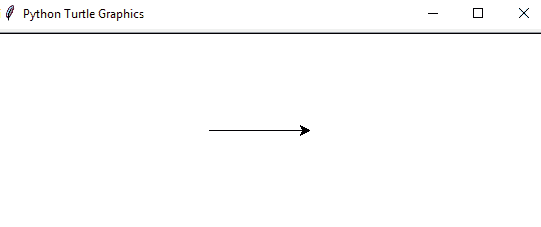
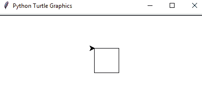
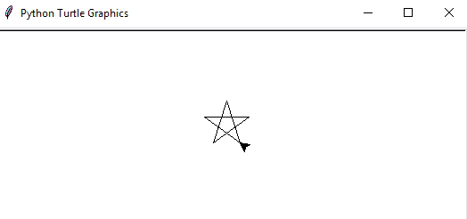

# 龟类-屏幕上的绘图

不久前，程序员，尤其是游戏程序员，在构建程序时会面临许多复杂的问题。难怪！当时，互联网门户没有足够的帮助，包括没有堆栈溢出，但更重要的是，没有程序员可以使用的通用工具；他们必须先创建一个并在程序中使用它。他们创建的工具将处理一些游戏细节（声音和图形的特定驱动程序）。由于可用资源有限，程序员不得不使用汇编语言创建游戏，这将是处理能力、显示、声音和控制例程的权衡。即使在调试时也会遇到最坏的情况。他们需要复杂而昂贵的机器来复制他们的程序，他们还需要日志和调试扩展。本章的主要目标是让我们熟悉使用 turtle 的二维（2D）空间绘图，以及 turtle 的事件处理方法，并创建简单的 2D 空闲动画。

在撰写本文时，我们在游戏行业取得了巨大的进步。我们已经创建了允许我们使用任何编程语言来制作游戏的工具，比如 Python 和 C（低 CPU 要求的游戏）。由于设备驱动程序的通信，所有低级例程都被高级软件隐藏。Python 等高级语言是抽象的；它们减少了对较低级别功能的访问。我们可以将多个对象分组为类，这些类可以继承另一个类的特征，从而消除代码的重复。Python 提供了诸如 turtle 和 Pygame 之类的模块，其中包含一系列用于设计游戏角色和处理用户事件的方法。在本章中，我们将学习海龟模块。从本章开始构建的每一个东西都将使用前几章的技术，并添加一些显著的特征。

本章将介绍以下主题：

*   海龟概述
*   技术要求
*   海龟命令简介
*   海龟事件
*   用海龟画图

# 技术要求

本节将介绍基本的 Python 图形编程模块及其工作原理。因此，您需要具备以下资源：

*   Python 3.5 或更高版本；参见[第 1 章](01.html)、*了解 Python–设置 Python 和编辑器*
*   Python 空闲
*   文本编辑器
*   键盘
*   鼠标（笔记本电脑的触摸板无法工作）

本章文件可在此处找到：[https://github.com/PacktPublishing/Learning-Python-by-building-games/tree/master/Chapter08](https://github.com/PacktPublishing/Learning-Python-by-building-games/tree/master/Chapter08)

请查看以下视频以查看代码的运行情况：

[http://bit.ly/2pAmrCs](http://bit.ly/2pAmrCs)

# 了解海龟模块

就像计算机的不同组件对于提供更好的计算体验同样重要一样，我们也需要计算机的不同组件协同工作以提供更好的游戏体验。计算机的视频卡负责计算屏幕的视觉图像，然后将图像信号模块化，然后将其发送到监视器。需要输入设备（如鼠标、键盘和操纵杆）根据程序处理用户事件。声卡需要处理音频信号，然后将其发送到扬声器等输出设备。在游戏编程的早期，程序员需要分别阅读这些设备的技术手册，并单独编写代码。这意味着他们之间的沟通需要一年的时间，即使是简单的游戏。然而，随着技术的进步，特别是驱动程序的进步，程序员们不再需要手动在这些设备和操作系统之间进行通信了。

尽管我们开发了一个名为 drivers 的简单程序，作为与不同设备通信的通用接口，但不同的硬件和版本不兼容使得程序员在开发可以跨多个平台玩的游戏时生活更加困难。幸运的是，我们有 Python，这是一种能够熟练地编写独立于平台的程序的语言。Turtle 是 Python 模块，它提供了可用于创建图片和数据包的绘图板。据信，海龟模块是 90 年代另一种流行编程语言的姐妹——*徽标——*有一个虚构的海龟图标和一支笔，用来在屏幕上画画。Python 的标准库*turtle*与 Logo 编程语言类似。为了使用海龟模块，我们必须导入它。导入它更容易，因为它作为标准 Python 库打包，并且不需要手动安装。以下步骤说明如何创建任何 turtle 应用程序：

1.  使用`import`命令导入海龟模块。如果忽略这一步，就不会有任何接口来控制海龟。

2.  创造一只乌龟来控制它。此步骤用于实例化 turtle 以创建新的 turtle 控制器，例如，`game = turtle.Turtle()`。
3.  创建控件后，我们使用新的 turtle 来绘制，并通过调用 turtle 模块的方法在绘制屏幕中执行多个任务。
4.  我们需要显式调用一个重要的方法，它保持游戏屏幕，即`turtle.done()`。此方法将暂停程序。您需要手动关闭窗口才能关闭应用程序。

在 turtle 包中，当我们运行通过调用 turtle 模块的方法生成的程序时，将出现一个新窗口，其中包含一支笔，以及由 turtle 命令绘制的形状。让我们了解一些重要的海龟命令。

# 海龟命令简介

turtle 模块以方法的形式提供了多个命令，可以独立使用。有一些方法可以使钢笔前后移动，还有一些方法可以创建形状。查看下表以了解最重要的海龟命令。您可以在他们的官方 Python 文档页面上详细了解它们：

| **方法** | **参数** | **说明** |
| --- | --- | --- |
| `Turtle()` | 没有一个 | 创建并返回一个新的 turtle 对象。 |
| `forward()` | 距离 | 将海龟向前移动指定的量。 |
| `backward()` | 距离 | 将海龟向后移动指定的量。 |
| `right()` | 角 | 顺时针转动海龟。 |
| `left()` | 角 | 逆时针转动海龟。 |
| `penup()` | 没有一个 | 拿起乌龟的笔。 |
| `pendown()` | 没有一个 | 放下乌龟的笔。 |
| `up()` | 没有一个 | 拿起乌龟的笔。 |
| `down()` | 没有一个 | 放下乌龟的笔。 |
| `color()` | 颜色名称 | 改变海龟笔的颜色。 |
| `fillcolor()` | 颜色名称 | 更改海龟将用于填充多边形的颜色。 |
| `heading()` | 没有一个 | 返回当前标题。 |
| `position()` | 没有一个 | 返回当前位置。 |
| `goto()` | *x*、*y*（位置） | 将海龟移动到位置*x*、*y*。 |
| `begin_fill()` | 没有一个 | 记住填充多边形的起点。 |
| `end_fill()` | 没有一个 | 关闭多边形并用当前填充颜色填充它。 |
| `dot()` | 没有一个 | 将点保留在当前位置。 |
| `stamp()` | 没有一个 | 在当前位置留下海龟形状的印象。 |
| `shape()` | 形状名称 | 应该是*箭头*、*经典*、*海龟、*或*圆圈*。 |

在上表中，我们可以通过观察方法名称的字面意义来猜测调用这些方法的结果。例如，`forward(amount)`方法将使用指定为参数的量向前移动笔。所有这些方法都被用来在海龟的画布上绘制不同的形状。观察第一种`>>> Turtle()`方法。这将返回 turtle 对象，必须使用它才能调用这些方法。例如，我们将制作一个程序，在屏幕上画一条线。以下是此示例的代码：

```py
import turtle

pacman = turtle.Turtle()
pacman.forward(100)

turtle.done()
```

通过运行前面的代码，我们可以观察到以下输出：



与 pythonshell 一样，新屏幕（如前一个屏幕）也会弹出，这代表了海龟绘图板。最初，附在想象中的海龟上的笔将位于绘图板的中心。来自 turtle 对象的任何方法调用都必须操纵笔的移动。上述代码可通过以下步骤进行解释：

1.  首先，我们必须导入 turtle，这是确保驻留在 turtle 类中的所有命令都可供我们使用的第一步。
2.  第二步是创建一个海龟控制器，我们称之为 pacman。
3.  然后，我们从 pacman 面对的点移动 100 像素。最初，*pacman*海龟控制器面朝右侧；因此，笔从中心向右移动了 100 个像素，形成了一条直线。
4.  最后，`turtle.done()`将暂停海龟绘图板屏幕，以便我们可以清楚地观察输出。为了关闭 turtle 屏幕，我们必须手动关闭 Python shell 或 turtle 图形屏幕。

我们刚刚学习了如何创建一条直线，但是这些直线看起来很无聊，并且没有给程序添加任何美学效果。现在是学习如何使用另一种方法的时候了，这将使笔转向另一个方向。例如，我们可能希望将笔的方向从原来的方向更改为另一个方向：

```py
import turtle

pacman = turtle.Turtle()

pacman.forward(50)
pacman.right(90)     

pacman.forward(50)
pacman.right(90)

pacman.forward(50)
pacman.right(90)

pacman.forward(50)
pacman.right(90)

turtle.done()
```

我们已经熟悉了`forward`方法，同时我们还介绍了`right()`方法。如果您查看前面的方法表，您将看到`right`方法和角度已作为参数传递。因此，该方法将执行一些旋转，并伴随着所传递的角度。因为我们将其传递 90 度，所以此方法将创建一个 90 度顺时针旋转。如果要逆时针旋转画笔，我们必须调用 left 方法并指定旋转角度。在前面的程序中，我们将其旋转了 90 度。所有角度均为 90 度的几何形状为正方形或矩形。然而，我们知道`forward`方法将产生一条直线，这与几何形状的边相同。通过`forward`方法创建的边的长度将相等，即 50，这将作为参数通过`forward`方法传递。有了所有这些证据，我们可以肯定地期望在海龟板上画出正方形。让我们运行前面的代码来观察输出。如预期，将绘制方形形状：



仔细看看前面的代码；你看到代码重复了吗？显然，`forward`和`left`方法的调用是多次进行的，这最终违反了 DRY 原则。这种顿悟不是在不实践 Python 范式的情况下产生的。因此，我们可以说实践是区分好程序员和坏程序员的关键。现在，回想一下我们需要什么来消除代码的冗余；我们应该使用循环或函数。我们将在这里使用一个循环：

```py
import turtle

pacman = turtle.Turtle()
for i in range(4):
    pacman.forward(50)
    pacman.right(90)

turtle.done()
```

我想我们在阅读和理解这段代码时不会有任何问题。正如我们在[第 3 章](03.html)、*流量控制-为游戏*构建决策者中提到的，我们可以创建一个具有一系列功能的迭代级别。因为我们需要运行这些方法四次，所以我们使用 range 函数创建了四次迭代。任何需要重复的内容都在 for 循环的范围内缩进四个块。

在本例中需要注意的一点是，我们有多种方法来处理绘图屏幕中笔的移动。到目前为止，我们学习到的两个海龟指令是`forward(amount)`，它将海龟朝着它所面对的方向向前移动一定量；以及`right(degree)`，它使海龟顺时针旋转一定程度。请注意，`right`和`left`命令不会在屏幕上写入任何内容；相反，它们仅用于旋转。

按照我们迄今为止所学的所有模式，我们可以预测`backward`方法将使笔从其所面对的原始方向向后移动一定量。我建议您尝试修改前面的代码，使用`backward`重构 forward 方法，使用`left`重构`right`，并相应地观察结果。我想在这里花点时间来结束这个话题，但不涉及其他功能，因为我们将在接下来的章节中制作游戏时逐一介绍它们。我们将使用海龟模块制作多个游戏，例如蛇游戏、乒乓游戏和 Flappy Bird。现在，我们将探索将输入设备（如鼠标和键盘）连接到游戏的方法，以便玩家可以与海龟环境交互。

# 探索海龟事件

正如我们在前几章中提到的，处理用户事件是创建任何游戏的主要构建块之一。事件表示在游戏过程中需要随时执行的动作。你有没有想过低级别的程序是如何处理这些事件的？当用户使用键盘或鼠标执行任何事件时，该请求存储在类似队列的结构中。队列结构很重要，因为处理这些事件的顺序必须是先到先得的。然后，根据用户操作的行为，由程序处理事件。渲染和动作处理这两项任务由程序独立执行。例如，在反恐游戏中，用户可以用枪射击，即使敌人不在他们身边。在这里，事件是用户按下一个键开火，渲染任务是在玩家周围繁殖敌人。这两个任务不是独立执行的，除非我们编写程序来实现它们。在本节中，我们将学习如何将用户操作作为输入，并相应地进行处理。处理用户操作意味着为存储在队列结构中的操作提供服务。

大多数事件都是基于鼠标或键盘的使用，但有些事件必须由程序自动预测并进行相应处理，如`ontimer(fun, time)`方法。此方法接受两个参数：函数和时间（以毫秒为单位）。此方法设置一个计时器，在`time`之后以毫秒为单位调用`fun`函数。让我们制作一个简单的程序来理解这一点：

```py
import turtle
star = turtle.Turtle()

exit = False
def main():
    if not exit:
        for i in range(100):
 star.forward(i)
 star.right(144)
main()
turtle.mainloop()
```

最后一行代码（`turtle.mainloop()`）只执行循环时执行的相同操作。除非用户明确退出窗口屏幕，否则不会终止对`main`函数的调用。当程序有一个 while 循环时，可以观察到它的重要性，while 循环用于监听传入的连接，但我们不希望计算机一直关注一种情况：

```py
def draw_objects():
    #statements
    draw_objects() #may be you want to call it within the time interval 
                    of 100ms

draw_objects()
turtle.mainloop()
```

前面的代码与 while 循环的工作方式完全相同，但现在 Python 解析器并不致力于只持续执行一个任务。相反，对于每 100 毫秒，将执行`draw_objects()`任务，对于剩余的 99.99 毫秒，Python 解析器可以自由执行任何其他任务。

有趣的是，前面的代码表示任何海龟程序的正确结果。虽然调用不同的函数会在屏幕上生成不同的角色，但使用 turtle 的主要目的是在屏幕上渲染游戏角色。让我们将前面的代码分解为以下几点：

*   前两个步骤表示导入海龟并创建海龟控制器，这将允许我们通过它调用所有的`turtle`方法。
*   我们已经创建了一个`main`函数，在它里面，我们有一些代码来创建星形模式。迭代次数为 100 次，这意味着我们将在输出屏幕上打印 100 颗星，但请记住，它们的间隔很近。

在屏幕上正确渲染字符的最佳方法是使用`ontimer`方法。让我们用`ontimer`方法修改相同的程序。让我们看看如何在程序中使用它：

```py
import turtle
star = turtle.Turtle()

exit = False
def main():
    if not exit:
            star.forward(50)
            star.right(144)
    turtle.ontimer(main,500)
main()
```

与以前不同的是，前面的程序不会打印多个星星；相反，它只打印一个。然而，`ontimer`方法消除了调用 for 循环的开销，因为它将计时器设置为一次又一次地调用相同的函数。在这个程序中，我们传递了`main`函数和 500 作为参数，这意味着`main`函数应该每`500`毫秒调用一次。运行上述程序将产生以下输出：



是时候学习如何处理键盘和鼠标事件了。和往常一样，有些方法已定义为处理键盘事件，有些方法已定义为处理鼠标事件。但是，在处理用户事件之前，turtle 必须启动一个侦听器，该侦听器持续保持清醒以侦听任何事件。这样的侦听器控制器是使用`listen`方法创建的，即`>>> turtle.listen()`。下表描述了用于处理键盘事件的方法：

| **方法名称** | **参数** | **说明** |
| `turtle.onkeypress(function, key = None)` | **函数**：没有参数或`None`的函数。**键**：字符串或符号形式的键，例如`q`或`space`。 | 它用于将函数绑定到键盘上按下的任何按键事件。如果未指定任何键，则任何键都有效。 |
| `turtle.onkeyrelease(function, key)` | **函数**：没有参数或`None`的函数。**键**：字符串`a`或符号`enter`形式的键。 | 它用于将函数绑定到由键操作执行的键释放事件。如果函数为`None`，则删除事件绑定。 |

让我们制作一个简单的程序，以便掌握使用这些方法处理键盘操作的想法：

```py
import turtle
star = turtle.Turtle()
def main():
    for i in range(30):
        star.forward(100)
 star.right(144)
turtle.onkeypress(main,"space")
turtle.listen()
turtle.mainloop()
```

让我们运行程序并观察输出。按下*F5*键后，您将看到两个屏幕，其中一个屏幕的中心是海龟图形板和笔。现在，按键盘上的*空格键*。你一按它，它就开始在屏幕上画一颗星星。

在`main`函数中，我们添加了一些代码，这些代码将成为一颗星星。但是，正如您所看到的，`main`函数没有被显式调用，正如我们在调用函数时通常所做的那样；相反，它是使用`onkeypress`方法调用的。此方法将键绑定到函数，并且每当按下该键时，将自动调用该函数。如果从前面的代码中删除最后一行，侦听器控制器将无法工作。`listen`方法用于制作一个控制器，用于不间断地监听这些类型的动作。

以类似的方式，我们可以调用`onkeyrelease`方法。将前面代码中的`onkeypress`替换为`onkeyrelease`并观察输出。输出将是相同的。`onkeyrelease`方法用于将要调用的函数与密钥的密钥释放事件绑定。

类似地，处理鼠标事件的方式也没有太大区别，它们也由方法调用处理。下表描述了可用于处理鼠标事件的方法：

| **方法** | **参数** | **说明** |
| `onclick(function, button = 1, add = None)` | **函数**：调用函数时使用两个参数（*x，y*）表示鼠标或指针点击位置的坐标。**按钮**：代表鼠标按钮`default = 1`，表示鼠标左键。**添加**：用于添加多个绑定。如果`True`通过，则会添加一个新绑定，否则会坚持当前绑定。 | 将函数绑定到鼠标单击事件。如果用户单击海龟画布的任何位置，则单击位置的坐标将用于调用函数。 |
| `onrelease(function, button = 1, add = None)` | **函数**：调用一个函数时有两个参数（*x，y*），表示海龟在绘图板上点击位置的坐标。**按钮**：`Default = 1`表示使用鼠标左键。它用于为鼠标按钮添加数字。**新增**：根据`True`或`False`的值决定是否新增绑定。 | 将函数绑定到鼠标按钮释放事件。 |
| `ondrag(function, button = 1, add = None)` | **函数**：一个具有两个参数的函数，表示点击点在游戏屏幕中的坐标。**按钮**：添加一个数字，表示鼠标按钮侦听器。 | 将函数绑定到当前 turtle 控制器上的鼠标移动事件。如果函数为`None`，则当前绑定将被删除。 |

让我们制作一个简单的程序来掌握使用上述方法处理鼠标事件的想法：

```py
import turtle
pacman = turtle.Turtle()
def move(x,y):
    pacman.forward(180)
    print(x,y)

turtle.onclick(move) #calling move method
#turtle.onclick(None) #to remove event-binding   
```

您可以看到，只使用 move 函数调用了`onclick`方法，而 move 函数又使用表示画布上单击点的*x*和*y*坐标调用 move 方法。在单击绘图画布之前，运行上述程序不会在屏幕上绘制任何线条。当您单击屏幕上的任何一点时，您将看到其坐标打印在 Python shell 中，画布上会出现一条直线。我们将在下一章介绍剩余的`turtle`方法，以及如何制作一些迷你游戏。在此之前，我们将尝试使用`turtle`模块和我们目前所了解的 Python 设计模式制作一些形状。

# 用海龟画图

对人类来说，制作形状的过程似乎是一项枯燥乏味的任务，但对计算机来说却并非如此。想象一下，在考虑角度和侧面的同时，用精确的几何尺寸制作一个六边形。这个过程本身压倒了我们大多数人。另一方面，人们认为计算机工作勤奋；我们可以随意扔任务，它会优雅地执行它们。

如前所述，绘制任何形状时，两个关键信息是每边的角度和长度。我们可以制作变量来存储它们，以便在需要时在程序中引用它们。对于任何形状，都会有不同数量的边。例如，三角形有三条边，而六边形有六条边。我们需要在程序中明确指定边数。在本节中，我们将制作两种形状，六边形和星形，并添加一些颜色。本节的主要目的是帮助您了解如何使用编程范例以及特定模块来制作吸引人的游戏。

以下步骤列表描述了逐个创建两个形状所需的路线图。我们将创建的第一个形状是六边形：一个有六条边的形状，具有自定义长度。之后，我们将再次制作星形图案，但这次，我们将向其添加颜色属性：

*   **六边形**：我们将通过定义特定的变量来创建此形状，例如边的数量、内角和边的长度。之后，我们将使用 for 循环创建六次迭代，因为我们必须调用线渲染方法六次（因为六边形有六条边）。我们将使用`forward`方法画一条直线，`right`方法将海龟顺时针旋转一个特定角度：

```py
      import turtle 

      hexagon = turtle.Turtle()

      num_of_sides = 6
      length_of_sides = 70
      angle = 360.0 / num_of_sides 

      for i in range(num_of_sides):
          hexagon.forward(length_of_sides)
          hexagon.right(angle)

      turtle.done()
```

*   您可以看到使用`turtle`模块在画布上绘制形状是多么方便。我们已经熟悉这些方法和循环的使用，以消除多行代码的重复；因此，掌握我们在这里编写的代码并不难
*   **星星**：用海龟做星星形状比使用任何其他模块都容易。我们已经使用了两种方法`turtle`，即`forward`和`left`。但在本节中，我们将使用`turtle`模块提供的`color`方法对星形进行着色。我们将首先定义调色板，即不同的颜色名称，并调用方法`begin_fill`和`begin_end`，将颜色添加到形状中。下表显示了可用于为海龟形状着色的三种方法：

| **方法** | **参数** | **说明** |
| `color(*args)` | Args 表示颜色的名称。当前颜色用于使用`forward`或`backward`方法绘制线条。颜色名称可以表示为`single value: color(“blue”)`、`double value: color(“black”,”green”)`或`rgb`浮点值。 | 用于更改海龟笔的颜色。 |
| `begin_fill()` | 没有一个 | 此方法将记住填充多边形的起点。 |
| `end_fill()` | 没有一个 | 它将关闭海龟画布中绘制的形状，并用当前填充颜色填充。 |

例如，我们将编写一个程序，使用这些方法为星形图案着色。我们将使用红色和黄色的颜色组合，使明星更具吸引力。我们一直在使用`import turtle`命令使`turtle`方法可供程序使用。不用这样做，我们可以使用`from turtle import *`命令导入海龟的所有内容。现在，我们不需要用`>>> turtle.forward(100)`调用`turtle`方法，而是可以直接调用它，即`forward(100)`。让我们编写一个程序来创建这样的星形图案：

```py
from turtle import *

color('red', 'yellow')
begin_fill()
while True:
    forward(200)
    left(170)
    if abs(pos()) < 1:
        break
end_fill()
done()
```

我只是喜欢海龟和蟒蛇一起工作的方式。能够将每个函数绑定到 Python 的编程范例，使得`turtle`模块能够有效地使用。在前面的代码中，我们可能不会与第一行代码有任何混淆，它只是从`turtle`模块中导入所有内容—每个属性和成员。我们使用`color`方法制作了一个红色和黄色的调色板。在主循环中，我们将遇到两种方法，我们从本章开始就一直在使用这两种方法。此外，我们还添加了一个条件来指示海龟笔的停止点。使用`abs()`方法返回数字的绝对值，即`>>> abs(-4)`，得到 4。在`abs()`函数中，我们调用了`turtle`模块的`pos()`方法，将海龟的位置作为两个元素列表返回。我们检查了当前位置，如果它小于 1，例如 0，那么它必须表示中心位置，因为（0,0）表示中心位置。如果我们在迭代后遇到中心位置，这意味着我们可以终止程序，因为在这一点上，我们必须已经画了一颗星星。如果我们继续，乌龟笔将在同一位置上画另一颗星，从而覆盖旧的一颗星。

因此，为了防止这种连续的迭代，我们添加了一个条件行：`if abs(pos()) < 1`。

执行前面的程序会产生以下输出。这里您必须记住的一点是，从调色板开始，我们使用红色笔绘制星星，完成后，我们使用黄色填充星星形状的内部：


现在，您已经了解了使用`turtle`方法创建形状和着色的所有方法，我们将在这里结束本章。在接下来的章节中，我们将通过制作简单的迷你游戏（如 Snake、Pong 和 Flappy Bird），使用本章中学习的概念，例如创建模式和处理用户事件。

# 总结

Python*海龟*模块是构建 2D 迷你游戏的强大平台。它包含了多种方法，以方便游戏人物的设计过程。在本章中，我们编写了一系列程序，并处理了用户事件。本章首先介绍了`turtle`模块的关键功能，并为任何可以使用 Python`turtle`模块制作的游戏构建了一个通用原型。本章教我们如何使用`turtle`模块制作 2D 画布的动画。除了设置游戏角色的动画外，我们还学习了如何通过处理用户事件来创建在游戏界面和用户控制器之间进行通信的界面。

完成本章后，您将能够使用`turtle`模块创建简单的 2D 游戏。您还可以处理鼠标和键盘提供的用户操作，这允许我们制作用户交互游戏。现在您已经学习了如何使用 2D Turtle 画布创建简单动画，您可以创建任何几何图形；在进入下一章之前，再多尝试几次。

在本章中我们没有涉及任何游戏，因为为了使用`turtle`模块创建游戏，我们需要首先探索向量创建向量、存储向量、查找向量的大小、向量加法、否定、对角线运动等等。我们将在下一章介绍所有这些概念。

向量无疑是任何游戏开发者工具包中最重要的主题。向量是数学术语，表示屏幕上出现的游戏角色的大小和方向。“幅值”表示角色所在点的当前坐标的模数，而“方向”表示游戏角色前进的路线。现在正是你玩转`turtle`模块，掌握处理用户事件和构建吸引人的形状和角色的想法的最佳时机。