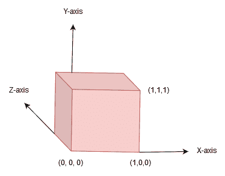

# 十四、了解 PyOpenGL

几何形状和图形在游戏开发中起着至关重要的作用。当涉及到高级图形技术的发展时，我们往往忽略了它们的重要性。然而，许多流行的游戏仍然使用这些形状和图形来渲染游戏角色。数学概念，如变换、矢量运动以及放大和缩小功能，在游戏对象的操纵方面会增加权重。Python 有几个模块支持这种操作。在本章中，我们将学习一个如此强大的 Python 特性——PyOpenGL 模块。

在探索 PyOpenGL 时，我们将学习如何使用基本体（即顶点和边）创建复杂的几何形状。我们将从安装 PythonPyOpenGL 开始，并使用它开始绘图。我们将用它制作几个对象，例如三角形和立方体。我们不会使用 pygame 来创建这样的形状；相反，我们将使用纯数学概念来定义顶点和边的直角坐标点。我们还将探讨不同的 PyOpenGL 方法，例如剪裁和透视。我们将介绍其中的每一个，以了解如何使用 PyOpenGL 创建吸引人的游戏角色。

本章结束时，您将熟悉创建基本体的传统方法和数学方法。这种创建形状的方式为程序员和设计师提供了操纵游戏对象和角色的能力。您还将学习如何在游戏中实现放大和缩小功能，以及如何通过绘制几何图元来使用颜色属性。

本章将介绍以下主题：

*   理解 PyOpenGL
*   用 PyOpenGL 制作对象
*   理解 PyOpenGL 方法
*   了解颜色属性

# 技术要求

您需要以下要求列表来完成本章：

*   建议使用 Pygame 编辑器（IDLE）3.5+版。
*   您将需要 Pycharm IDE（有关安装过程，请参阅[第 1 章](01.html)、*了解 Python–设置 Python 和编辑器*。
*   本章的代码资产可以在本书的 GitHub 存储库中找到：[https://github.com/PacktPublishing/Learning-Python-by-building-games/tree/master/Chapter14](https://github.com/PacktPublishing/Learning-Python-by-building-games/tree/master/Chapter14)

请查看以下视频以查看代码的运行情况：

[http://bit.ly/2oJMfLM](http://bit.ly/2oJMfLM)

# 理解 PyOpenGL

在过去，包含三维场景的图形程序已经用 3D 加速硬件处理过，这是每个游戏程序员都想要的。尽管按照今天的标准，这是正常的，但硬件与几年前不一样。大多数游戏的图形都必须使用低处理设备中的软件进行渲染。因此，除了创建这样的场景外，渲染还需要相当长的时间，最终会使游戏变慢。游戏界面（也称为图形卡）的出现，在游戏行业掀起了一场革命；程序员现在只需要制作界面、动画和自主游戏逻辑，而不需要考虑处理能力。因此，90 后制作的游戏具有更丰富的游戏性和人工智能（多人游戏）。

众所周知，图形卡可以处理三维功能，例如渲染和优化场景。然而，为了使用这些特性，我们需要一个在项目和这些接口之间进行通信的编程接口。我们在本章中要用到的**A****应用程序编程接口**（**API**）就是 OpenGL。OpenGL 是一种跨平台（程序在任何机器上运行）API，通常用于渲染 2D 和 3D 图形。API 类似于用于促进与图形处理单元交互的库，它通过使用硬件加速渲染来加速图形渲染方法。它作为图形驱动程序的一部分预先安装在大多数机器上，不过您可以使用*GL view**实用程序*检查其版本。在我们开始编写程序以便使用 PyOpenGL 绘制几何形状和图形之前，我们需要将其安装到我们的机器上。

# 安装 PyOpenGL

即使 OpenGL 已经存在于您的系统中，您也需要单独安装 PyOpenGL 模块，以便所需的 OpenGL 驱动程序和 Python 框架能够相互通信。Pycharm IDE 提供了一个服务，可以定位 Python 解释器并安装 PyOpenGL，从而消除了手动安装的开销。按照以下步骤在 Pycharm IDE 中安装 PyOpenGL：

1.  单击顶部导航栏中的文件，然后单击设置。然后，将鼠标悬停在左侧导航窗口上，并选择项目：解释器选项。
2.  选择当前的项目 Python 解释器，即 Python 3.8+（后跟项目名称），然后从解释器下拉菜单旁边的菜单屏幕中按添加（+）按钮。
3.  在搜索栏中搜索 PyOpenGL，然后按 InstallPackage 按钮。

或者，如果您想在外部安装 PyOpenGL，可以将其作为 pythonegg 文件下载。

A *Python egg* is a logical structure embodying the release of a specific version of a Python project, comprising its code, resources, and metadata. There are multiple formats that can be used to physically encode a Python egg, and others can be developed. However, a key principle of Python eggs is that they should be discoverable and importable. That is, it should be possible for a Python application to easily and efficiently find out what eggs are present on a system and ensure that the desired eggs' contents are importable.

这些类型的文件捆绑在一起，创建 Python 模块，通过简单的安装过程，可以从**Python 企业应用程序工具包**（**PEAK**）下载这些模块。要下载 Python egg 文件，您必须下载 Python`easy_install`模块。转到[http://peak.telecommunity.com/DevCenter/EasyInstall 然后下载并运行`ez_setup.py`文件。成功安装 easy install 后，在命令 shell/Terminal 中运行以下命令以安装 PyOpenGL：](http://peak.telecommunity.com/DevCenter/EasyInstall)

```py
easy_install PyOpenGL
```

Easy install is not only used for installing PyOpenGL—you can download or upgrade a large range of Python modules with its help. For example, the `easy_install` SQLObject is used to install SQL PyPi packages.

通常，当我们需要使用包时，我们需要将它们导入到我们的项目中。在这种情况下，您可以制作一个演示项目（`demo.py`来开始测试 OpenGL 项目。为了能够使用诸如代码可维护性和调试之类的功能，我们将使用 Pycharm IDE 而不是 Python 的内置 IDE 创建一个 PyOpenGL 项目。打开任何新项目并按照以下步骤检查 PyOpenGL 是否正在运行：

1.  首先，使用以下命令导入每个 PyOpenGL 类：

```py
      from OpenGL.GL import *
```

2.  现在，使用以下命令导入所需的 OpenGL 函数：

```py
      from OpenGL.GLU import *
```

3.  接下来，您应该将`pygame`导入到您的项目中：

```py
      from pygame.locals import *
```

4.  使用`pygame`命令初始化项目的显示：

```py
      import pygame
      from pygame.locals import *
      window_screen = pygame.display.set_mode((640, 480), 
        HWSURFACE|OPENGL|DOUBLEBUF)
```

5.  运行项目并分析结果。如果出现新屏幕，您可以继续制作项目。但是，如果提示显示未安装 PyOpenGL，请确保遵循前面的安装过程。

前面的四行很容易理解。让我们逐一讨论。第一步非常简单，它告诉解释器导入 PyOpenGL 及其多个类，这些类可以用于不同的函数。以这种方式导入可以减少逐个导入每个 PyOpenGL 类的工作量。第一次导入是必需的，因为此行导入以`gl`关键字开头的不同 OpenGL 函数。例如，我们可以使用一个命令，例如`glVertex3fv()`，它可以用来绘制不同的 3D 形状（我们将在后面介绍）。

使用 import 语句的下一行，即`from OpenGL.GLU import *`，以便我们可以使用以`glu`开头的命令，例如`gluPerspective()`。这些类型的命令在更改显示屏的视图及其渲染的对象时非常有用。例如，我们可以使用这样的`glu`命令进行裁剪和剪裁等转换。

与 PyOpenGL 库类似，GLU 是一个 Python 库，用于探索相关数据集内部或之间的关系。它们主要用于在显示屏幕上进行更改，同时影响渲染对象的形状和尺寸。要了解更多关于 GLU 内部的信息，请查看其官方文档页面：[http://pyopengl.sourceforge.net/pydoc/OpenGL.GLU.html](http://pyopengl.sourceforge.net/pydoc/OpenGL.GLU.html) 。

下一行只是将`pygame`导入到我们的项目中。虽然使用 OpenGL 创建的曲面是 3D 的，但它需要`pygame`模块进行渲染。在使用来自`gl`或`glu`模块的任何命令之前，我们需要调用`pygame`模块，使用`set_mode()`功能创建一个显示（感受`pygame`模块的威力）。当使用 OpenGL 库的`set_mode`功能时，`pygame`模块创建的显示将是 3D 而不是 2D。之后，我们告诉 Python 解释器创建一个 OpenGL 曲面，并将其作为`window_screen`对象返回。在`set_mode`函数中传递的元组（`height`、`width`）表示曲面大小。

在最后一步中，我希望您关注可选参数，如下所示：

*   `HWSURFACE`：在硬件中创建曲面。它主要用于创建加速 3D 显示屏，但仅用于全屏。
*   `OPENGL`：就 OpenGL 渲染曲面的创建向 pygame 提出建议。
*   `DOUBLEBUF`：表示双缓冲，pygame 推荐用于`HWSURFACE`和`OPENGL`。它减少了闪烁（屏幕中燃烧和闪烁颜色不稳定的现象）。

还有几个可选参数，如下所示：

*   `FULLSCREEN`：这将使屏幕显示呈现为全屏视图。
*   `RESIZABLE`：这允许我们调整窗口屏幕的大小。
*   `NOFRAME`：这将使窗口屏幕无边界、可控等。有关 pygame 可选参数的更多信息，请访问[https://www.pygame.org/docs/ref/display.html#pygame.display.set_mode](https://www.pygame.org/docs/ref/display.html#pygame.display.set_mode) 。

现在我们已经开始在机器上安装 PyOpenGL 并为屏幕对象设置窗口，我们可以开始绘制对象和原语了。

# 用 PyOpenGL 制作对象

OpenGL 主要用于绘制不同的几何形状或基本体，所有这些都可以用于创建 3D 画布的场景。我们可以制作多面形状（多边形），例如三角形、四边形或六边形。一些信息，例如顶点和边，应该提供给原语，以便 PyOpenGL 可以相应地渲染它们。由于与顶点和边相关的信息对于每个形状都是不同的，因此我们有不同的函数来创建不同的基本体。这与 pygame 的 2D 函数（`pygame.draw`不同，pygame 的 2D 函数用于使用同一个函数创建多个形状。例如，三角形有三个顶点和三条边，而四边形有四个顶点。

如果你有数学背景，顶点和边的知识对你来说是小菜一碟。但对于那些不是的人来说，任何几何形状的顶点都是两条或多条线相交的角或点。例如，三角形有三个顶点。在下图中，**A**、**B**和**C**是三角形 ABC 的顶点。类似地，边是边界上将一个顶点连接到另一个顶点的线段。在以下三角形中，AB、BC 和 AC 是三角形 ABC 的边：


要使用 PyOpenGL 绘制此类几何图形，我们首先需要调用一些基本的 OpenGL 原语，如下所示：

1.  首先，使用您想要绘制的任何原语调用`glBegin()`函数。例如，`glBegin(GL_TRIANGLES)`应该被调用来通知解释器我们将要绘制的三角形。
2.  关于顶点（A、B、C）的下一条信息对于绘制形状至关重要。我们使用`glVertex()`函数发送有关顶点的信息。
3.  除了有关顶点和边的信息外，您还可以使用`glColor()`功能提供其他信息，例如形状的颜色。
4.  在提供足够的基本信息之后，您可以调用`glEnd()`方法来通知 OpenGL 已经提供了足够的信息。然后，它可以开始绘制指定的形状，如`glBegin`方法提供的常量所示。

以下代码是使用 PyOpenGL 绘制三角形的伪代码（请参考上图了解 PyOpenGL 函数的操作）：

```py
#Draw a geometry for the scene
def Draw():
 #translation (moving) about 6 unit into the screen and 1.5 unit to left
     glTranslatef(-1.5,0.0,-6.0)
     glBegin(GL_TRIANGLES) #GL_TRIANGLE is constant for TRIANGLES 
     glVertex3f( 0.0, 1.0, 0.0) #first vertex 
     glVertex3f(-1.0, -1.0, 0.0) #second vertex 
     glVertex3f( 1.0, -1.0, 0.0) #third vertex 
     glEnd() 
```

下图显示了三角形的法线。法线是一个数学术语，表示单位向量（大小为 1，方向请参考[第 10 章](10.html)，*升级乌龟贪食蛇游戏*，了解更多关于向量的信息）。这段信息（法线）非常重要，因为它告诉 PyOpenGL 每个顶点所在的位置。例如，`glVertex3f(0, 1, 0)`将在*y*轴上放置一个顶点。因此，（*x*、*y*、*z*表示*x*-轴、*y*-轴、*z*轴上的震级，如下所示：


现在我们知道了如何创建基本的三角形原语，让我们看看下表来理解可以使用 PyopGunl 绘制的其他不同类型的图元：

| **常数关键词** | **形状** |
| `GL_POINTS` | 在屏幕上绘制点或点 |
| `GL_LINES` | 绘制线（单个线） |
| `GL_TRIANGLES` | 画三角形 |
| `GL_QUADS` | 绘制四边形（四边形） |
| `GL_POLYGON` | 绘制多边形（任何边或顶点） |

我们现在可以使用基本体常数绘制任何基本体，只要我们有关于它们顶点的信息。让我们创建以下四边形：



以下是用于绘制前面的立方体图元的伪代码：

```py
glBegin(GL_QUADS)
glColor(0.0, 1.0, 0.0) # vertex at y-axis
glVertex(1.0, 1.0, 0.0) # Top left
glVertex(1.0, 1.0, 0.0) # Top right
glVertex(1.0, 1.0, 0.0) # Bottom right
glVertex(1.0, 1.0, 0.0) # Bottom left
glEnd()
```

在前一行代码中，我们首先定义了`GL_QUADS`常量，以告知 PyOpenGL 我们正在绘制的原语的名称。然后，我们使用`glColor`方法添加颜色属性。类似地，我们使用`glVertex`方法定义了立方体的四个主要顶点。作为参数传递给`glVertex`方法的坐标表示平面中的*x*、*y、*和*z*轴。

现在，我们已经能够使用 PyOpenGL 绘制不同的几何形状，让我们了解 PyOpenGL 的不同渲染函数/Premier，以便我们可以制作其他复杂的结构。

# 理解 PyOpenGL 方法

众所周知，计算机屏幕具有二维视图（其高度和宽度）。为了显示由 OpenGL 创建的三维场景，场景必须经过几个矩阵变换，通常称为投影。这允许在 2D 视图中渲染 3D 场景。在各种变换方法中，有两种常用于投影（剪裁和归一化）。这些矩阵变换应用于三维坐标系，并简化为二维坐标系。`GL_PROJECTION`矩阵经常用于执行与投影相关的变换。投影变换的数学推导是另一回事，我们永远不会使用它们，但是理解它是如何工作的对任何游戏程序员来说都很重要。让我们来看看`GL_PROJECTION`是如何工作的：

*   **剪辑**：**将场景顶点坐标转换为场景剪辑坐标。剪裁是一个调整场景长度的过程，以便从`viewport`（窗口显示）剪裁某些部分。**
***   **归一化**：**此过程称为**归一化设备坐标**（**NDC**），通过除以剪裁坐标的`w`分量，将剪裁坐标转换为设备坐标。例如，通过与 w<sub>c</sub>进行比较来测试剪辑坐标 x<sub>c</sub>、y<sub>c</sub>和 z<sub>c</sub>。不在-w<sub>c</sub>到+w<sub>c</sub>范围内的顶点将被丢弃。此处下标*c*表示剪裁坐标系。****

 ****因此，更容易推断矩阵变换的过程，包括`GL_PROJECTION`包括两个步骤：剪裁，紧接着归一化为设备坐标。下图说明了如何进行剪裁：


我们可以清楚地观察到，剪裁过程（有时称为消隐）仅在剪裁坐标中执行，该坐标由 2D 视口的大小定义。为了找出哪些剪辑坐标被丢弃，我们需要看一个例子。假设*x*、*y*和*z*是剪裁坐标，它们的值与*w*（*x*、*y*的坐标进行比较，这决定了屏幕中是否保留了任何顶点（或部分形状）。如果任何坐标低于-w<sub>c</sub>的值且高于+w<sub>c</sub>的值，则丢弃该顶点。在上图中，顶点 A 位于+w<sub>c</sub>上方，而顶点 B 和 c 位于-w<sub>c</sub>下方，因此这两个顶点都被丢弃。此外，顶点 D 和 E 位于（-w<sub>c</sub>、+w<sub>c</sub>的值范围内，因此它们保留在视图中。w<sub>c</sub>的值由视口的宽度决定。因此，OpenGL（`GL_PROJECTION`）的投影矩阵采用 3D 坐标并进行投影，从而将其转换为 2D 坐标，并可渲染到 2D 计算机显示屏上。虽然有些信息可能会丢失，但它被认为是将三维场景渲染为二维屏幕的最有效方法之一。

我们还没有完成，但在执行投影后，我们必须将 3D 场景转换为 2D，这需要使用另一种称为`GL_MODELVIEW`的 OpenGL 矩阵变换。然而，这种转变的步骤是完全不同的。首先进行矩阵变换，将坐标系乘以*视距*。

为了将它们转换为 2D 组件，为每个组件提供了*z*-组件。为了理解模型视图矩阵，我们必须理解作为其组成部分的两个矩阵：模型矩阵和视图矩阵。模型矩阵在模型世界中执行若干变换，例如旋转、缩放和平移，而视图矩阵则调整相对于摄影机位置的场景。视图矩阵关注对象在观看场景的玩家眼中的外观，类似于第一个玩家角色屏幕/视点。

现在我们已经了解了 OpenGL 的转换矩阵，让我们制作一个简单的程序（`resize.py`，可以相应地调整显示的大小：

1.  从导入 OpenGL 开始：

```py
      from OpenGL.GL import *
      from OpenGL.GLU import *
```

2.  制作一个简单的函数`change_View()`，它采用显示屏的大小，如下所示：

```py
      def change_View():
          pass
```

3.  在`change_View()`函数中增加*步骤 3*到*步骤 6*中所述的代码。向`ViewPort`添加一个函数调用，该函数调用获取显示的初始值和大小，如下所示：

```py
      glViewport(0, 0 , WIDTH, HEIGHT)
```

4.  现在，是添加投影矩阵的时候了。要添加`GL_PROJECTION`，我们需要调用`glMatrixMode()`方法，该方法检查被调用矩阵的模式，如下所示：

```py
      glMatrixMode(GL_PROJECTION) #first step to apply projection matrix
```

5.  应用投影矩阵后，应立即调用两个重要方法，即`glLoadIdentity()`和`gluPerspective()`，为投影矩阵设置“试金石”：

```py
      aspect_ratio = float(width/height)
      glLoadIdentity()
      gluPerspective(40., aspect_ratio, 1., 800.)
```

6.  设置投影矩阵后，下一步是设置模型视图矩阵。通过`glMatrixMode()`方法调用`GL_MODELVIEW`变换矩阵，可以激活模型视图矩阵模式：

```py
      glMatrixMode(GL_MODELVIEW)
      glLoadIdentity()
```

前面的六个步骤向我们展示了如何调整显示屏的大小，其中 3D 场景显示在 2D 显示屏中。*步骤 1*和*步骤 2*的重点是导入 openGL。在*步骤 3*中，我们调用了`glViewport()`方法，并传递了一个范围从（`0`、`0`）到（`width`、`height`）的参数，通知 OpenGL 我们要使用整个屏幕来显示场景。下一步调用`glMatrixMode()`方法，该方法告诉 OpenGL 每个矩阵变换将在每个后续函数调用中应用投影矩阵。

*步骤 5*调用了两个新的方法，作为`glLoadIdentity()`签名状态，用于使投影矩阵标识，这意味着投影矩阵的所有坐标都应该更改为`1`。最后，我们调用另一种方法，`gluPerspective()`，它设置分类/标准投影矩阵。您可能已经注意到，`gluPerspective()`方法以`glu`开头，而不是以`gl`开头；因此，从 GLU 库调用此函数。通过`gluPerspective`方法传递四个浮点参数，即摄影机视点的场透视、纵横比和两个剪裁平面点（近和远）。因此，通过`gluPerspective`功能进行剪裁。要观察剪裁是如何完成的，请参考我们在本主题开头讨论的星形几何形状示例。

现在，是时候通过制作一个与 PyOpenGL 结构交互的程序来测试我们所学到的东西了。我们还将定义另一个属性，使对象更具吸引力。这被称为*c**颜色属性*。我们将定义一个立方体，以及关于顶点和边的数学信息。

# 了解颜色属性

在现实世界中，有大量与物体相关的颜色，但计算机设备不具备足够的智能或能力来区分和捕获所有颜色。因此，以数字形式容纳每种可能的颜色几乎是不可能的。因此，科学家为我们提供了一种表示不同颜色的方法：*RGB*图案。这是三种主要颜色成分的组合：红色、绿色和蓝色。结合这些成分，我们可以创造几乎所有可能的颜色。每个组件的值范围为 0 到 255；更改每个组件的代码会产生新的颜色。

OpenGL 中使用的颜色属性与真实世界中的颜色反射属性非常相似。我们观察到的物体的颜色实际上不是它的颜色；相反，它是物体反射的颜色。物体可以具有波长的某些特性，在这些特性中，物体可以吸收某种颜色，也可以反射不同的颜色。例如，除了绿色，树木吸收阳光。我们感知并假设它是绿色的，但实际上物体没有颜色。光反射的概念在 OpenGL 中得到了很好的应用。我们通常定义一个可能有明确颜色代码的光源。此外，我们还将定义对象的颜色代码，然后将其与光源相乘。生成的色码或灯光是对象反射的结果，被视为对象的颜色。

在 OpenGL 中，颜色以元组的形式给出，元组包含四个组件，其中三个是红色、绿色和蓝色。第四个组件表示 alpha 信息，表示对象的透明度级别。我们没有为 RGB 组件提供 0 到 255 的值，而是在 OpenGL 中提供 0 到 1 的值。例如，黄色是红色和绿色的组合，因此其 alpha 信息为（1，1，0）。参见[https://community.khronos.org/t/color-tables/22518](https://community.khronos.org/t/color-tables/22518) 了解有关 OpenGL 颜色代码的更多信息。

OpenGL 的颜色属性中提供以下功能：

*   `glClearColor()`：此功能设置清晰的颜色，即填充未绘制区域的部分颜色。颜色代码的值可以作为包含 0 到 1 的值的元组给出。例如，`glClearColor(1.0, 1.0, 1.0, 0.0)`表示填充白色。
*   `glShadeModel()`：此功能启用 OpenGL 的照明功能。通常，传递给`glShadeModel`的参数是`GL_FLAT`，用于着色立方体和棱锥体等形状的面或边。如果要对曲线对象而不是面对象进行着色，可以使用`GL_SMOOTH`。
*   `glEnable()`：这实际上不是一个与颜色属性相关的方法，而是用来启用颜色属性的。例如，`glEnable(GL_COLOR_MATERIAL)`将启用*材料*，这允许我们与表面和光源进行交互。此外，通过调整设置，材质的属性主要用于使任何对象更轻、更锐利。

现在我们已经熟悉了颜色属性的概念和创建颜色属性的方法，让我们制作一个简单的程序，使用 PyOpenGL 的颜色属性绘制一个立方体。

# 头脑风暴网格

在我们开始编写代码之前，头脑风暴一点，获取必要的信息，这样我们就可以创建一个程序，这始终是一个很好的实践。因为我们要创建一个程序来渲染一个立方体——一个有八个顶点、12 条边和六个面的曲面，所以我们需要明确定义这些信息。我们可以将这些属性中的每一个定义为单个元组中的嵌套元组。

以一个顶点为参考，我们可以同时得到其他顶点的位置。让我们假设立方体在（`1`、`-1`、`-1`处有一个顶点。现在，假设立方体的所有边的长度为 1 个单位，我们可以得到顶点的坐标。以下代码显示立方体顶点的列表：

```py
cube_Vertices = (
    (1, -1, -1),
    (1, 1, -1),
    (-1, 1, -1),
    (-1, -1, -1),
    (1, -1, 1),
    (1, 1, 1),
    (-1, -1, 1),
    (-1, 1, 1),
    )
```

类似地，有 12 条边（边是从一个顶点到另一个顶点绘制的线）。因为有八个顶点（0 到 7），所以让我们编写一些代码，使用八个顶点定义 12 条边。以下代码中作为元组传递的标识符表示从一个顶点到另一个顶点绘制的边或边。例如，tuple（`0`、`1`表示从顶点 0 到顶点 1 绘制的边：

```py
cube_Edges = (
    (0,1),
    (0,3),
    (0,4),
    (2,1),
    (2,3),
    (2,7),
    (6,3),
    (6,4),
    (6,7),
    (5,1),
    (5,4),
    (5,7),
    )
```

最后，必须提供的最后一条信息是关于曲面的。立方体有六个面，每个面包含四个顶点和四条边。我们可以提供如下信息：

```py
cube_Surfaces = (
 (0,1,2,3),
 (3,2,7,6),
 (6,7,5,4),
 (4,5,1,0),
 (1,5,7,2),
 (4,0,3,6) 
 )
```

Note that the order in which the vertices, edges, and surface are provided matters. For example, in the `cube_Surfaces` data structure, if you swapped the second item of the tuple with the first one, the shape of the cube will deteriorate. This is because each piece of information is linked with vertex information, that is, surface (`0`, `1`, `2`, `3`) contains the first, second, third, and fourth vertices.

现在，我们已经完成了头脑风暴并收集了一些关于我们将要绘制的形状的有用信息，是时候开始使用 PyOpenGL 及其库（通常称为*GLU 库*来渲染立方体了。

# 理解 GLU 库

现在我们已经收集了关于形状的边、边和顶点的信息，我们可以开始对模型进行编码了。我们已经研究了如何使用 OpenGL 使用`glBegin()`和`glVertex3fv()`等方法绘制形状。让我们使用它们并创建一个可以绘制立方体结构的函数：

1.  从导入 OpenGL 和 GLU 库开始。导入库后，将头脑风暴时定义的顶点、边和曲面的相关信息添加到同一文件中：

```py
      from OpenGL.GL import *
      from OpenGL.GLU import *
```

2.  接下来，定义函数并获取曲面和顶点。这个过程很简单,；我们将从绘制立方体的曲面开始。我们应该使用`GL_QUADS`属性来绘制四边形曲面（混淆？请参阅本章*使用 OpenGL 制作对象*部分了解更多信息）：

```py
      def renderCube():
          glBegin(GL_QUADS)
          for eachSurface in cube_Surfaces:
              for eachVertex in eachSurface:
                  glColor3fv((1, 1, 0)) #yellow color code
                  glVertex3fv(cube_Surfaces[eachVertex])
          glEnd()
```

3.  最后，在`renderCube()`方法中，编写一些可以绘制线段的代码。`GL_LINES`参数用于绘制线段：

```py
     glBegin(GL_LINES)
       for eachEdge in cube_Edges:
           for eachVertex in eachEdge:
               glVertex3fv(cube_Vertices[eachVertex])
       glEnd()
```

这三行程序足以创建甚至复杂的几何形状。现在，您可以对这些多维数据集执行多个操作。例如，可以使用鼠标轨迹板执行诸如对象旋转之类的操作。我们知道，处理此类用户事件需要一个`pygame`模块。因此，让我们定义一个负责事件处理的函数，以及 PyOpenGL 的一些特性。以`import pygame`语句开始您的代码，并添加以下代码：

```py
def ActionHandler():
    pygame.init()
    screen = (800, 500)
    pygame.display.set_mode(screen, DOUBLEBUF|OPENGL) #OPENGL is essential

    #1: ADD A CLIPPING TRANSFORMATION
    gluPerspective(85.0, (screen[0]/screen[1]), 0.1, 50) 

    # 80.0 -> field view of camera 
    #screen[0]/screen[1] -> aspect ration (width/height)
    #0.1 -> near clipping plane
    #50 -> far clipping plane
    glRotatef(18, 2, 0, 0) #start point
```

前面的代码片段很容易理解，因为我们从本章开始就一直在这样做。在这里，我们使用了`pygame`模块，该模块使用 OpenGL 场景或界面设置游戏屏幕。我们添加了一个转换矩阵，它使用`gluPerspective()`函数执行剪裁。最后，我们在实际旋转之前添加了立方体的初始位置（我们可能在开始的位置）。

现在，我们已经介绍了 OpenGL 的基本入门知识，让我们使用 pygame 的事件处理方法来操作多维数据集的结构，如下所示：

```py
while True:

        for anyEvent in pygame.event.get():
            if anyEvent.type == pygame.QUIT:
                pygame.quit()
                quit()

            if anyEvent.type == pygame.MOUSEBUTTONDOWN:
                print(anyEvent)
                print(anyEvent.button) #printing mouse event

                #mouse button 4 and 5 are at the left side of the mouse
                #mouse button 4 is used as forward and backward navigation
                if anyEvent.button == 4: 
 glTranslatef(0.0,0.0,1.0) #produces translation 
                      of (x, y, z)
 elif anyEvent.button == 5:
 glTranslatef(0.0,0.0,-1.0)
```

在处理基于鼠标按钮导航的事件之后，让我们使用 PyOpenGL 提供的一些方法来渲染多维数据集。我们将使用`glRotatef()`等方法执行矩阵变换。在我们处理事件的位置之后编写以下代码：

```py

        glRotatef(1, 3, 1, 1) 
#The glRotatef is used to perform matrix transformation which performs a rotation 
#of counterclockwise with an angle of degree about origin through the point #provided as (x, y, z). 
        #-----------------------------------------------------------------
        #indicates the buffer that needs to be cleared
        #GL_COLOR_BUFFER_BIT: enabled for color drawing
        #GL_DEPTH_BUFFER_BIT: depth buffer which needs to be cleared

        glClear(GL_COLOR_BUFFER_BIT|GL_DEPTH_BUFFER_BIT)

        #render cube
        renderCube()
        pygame.display.flip()
        pygame.time.wait(12)

#call main function only externally
ActionHandler()
```

前面代码中突出显示的部分表示调整大小转换，这最终导致使用放大和缩小功能。现在，您可以运行该程序并观察在 pygame 屏幕中央以黄色呈现的立方体。尝试使用外部鼠标和导航按钮（按钮 4 和 5）放大和缩小。您还可以观察剪裁在项目中的使用方式：每当我们将立方体制作得太大以至于超出剪裁平面时，立方体的某些部分就会从视口中删除。

这样我们就可以将两个功能强大的 Python 游戏模块*pygame*和*PyOpenGL*结合起来，制作 3D 场景和界面。我们只简单介绍了创建一些形状的方法以及如何转换它们。现在，您需要了解更多关于 PyOpenGL 的信息，并尝试通过提供丰富的纹理和内容来制作一款更加用户友好、更具吸引力的游戏。

# 总结

在本章中，我们讨论了许多有趣的话题，主要是关于曲面和几何形状。尽管我们在本章中使用了术语*矩阵*，但我们并没有使用数学方法来执行矩阵计算，因为 Python 内置了执行此类操作的所有功能。不过，我们应该记住一句古老的格言，*游戏程序员不需要拥有数学博士学位*，因为如果我们想制作游戏，了解基本的数学水平就足够了。在这里，我们只学习了平移、缩放和旋转，如果我们想要制作 3D 场景，这些就足够了。我们没有因为使用数学方法学习翻译或缩放的概念而陷入困境，相反，我们学习了使用编程方法。

我们开始学习如何使用 pygame 的`setting`方法设置 OpenGL 显示屏。由于 OpenGL 是一个广泛而深刻的研究领域，不可能在一章中涵盖所有内容。因此，我们只介绍了如何加载/存储三维模型，以及如何通过应用剪裁、旋转和调整大小变换将三维模型应用于 OpenGL 渲染曲面。我们还研究了颜色属性，并将它们与 PyOpenGL 和 pygame 一起使用。本章的主要目的是让您更容易理解如何使用 OpenGL 3D 场景创建 3D 形状，同时提供关键的几何信息，如顶点、边和曲面。现在，您将能够使用 OpenGL 创建 3D 形状、图形和视觉效果。您现在还知道了如何区分 OpenGL 的颜色属性与任何其他颜色模式。

在下一章中，我们将学习另一个重要模块，它的名称为*Pymunk*。这是一个非常强大的物理库，为游戏角色添加物理功能。我们将学习当我们需要谈论真实世界环境时使用的不同术语，例如速度和加速度，它们用于处理碰撞和游戏角色的移动。在学习这些概念的同时，我们还将制作一个愤怒的小鸟游戏，我们将在各种平台上部署它。****