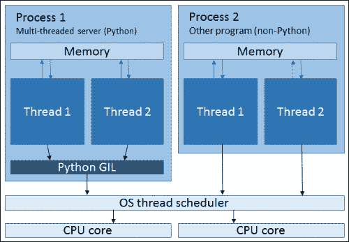
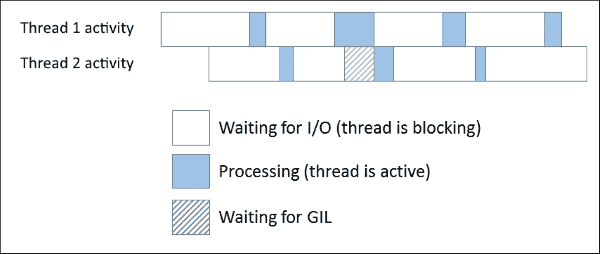

# 第 8 章客户端和服务器应用程序

在上一章中，我们研究了使用套接字接口在设备之间交换数据。在本章中，我们将使用套接字构建网络应用程序。套接字遵循计算机网络的主要模式之一，即**客户机/服务器**模式。我们将重点关注构建服务器应用程序。我们将介绍以下主题：

*   设计一个简单的协议
*   构建 echo 服务器和客户端
*   构建聊天服务器和客户端
*   多线程和事件驱动服务器体系结构
*   `eventlet`和`asyncio`图书馆

本章中的示例最好在 Linux 或 Unix 操作系统上运行。Windows sockets 实现有一些特性，这些特性可能会产生一些错误条件，我们在这里将不介绍这些情况。请注意，Windows 不支持我们将在一个示例中使用的`poll`接口。如果您确实使用 Windows，那么您可能需要在控制台中使用*ctrl*+*break*来终止这些进程，而不是使用*ctrl*-*c*，因为 Windows 命令提示符中的 Python 不会响应*ctrl*-【T12 c】当它阻塞套接字发送或接收时，这将在本章中非常常见！（如果你和我一样，不幸尝试在没有*中断*键的 Windows 笔记本电脑上测试这些，那么请准备好熟悉 Windows 任务管理器的**结束任务**按钮）。

# 客户端和服务器

客户机/服务器模型中的基本设置是一个设备，即运行服务并耐心等待客户机连接并向服务发出请求的服务器。24 小时营业的杂货店可能是现实世界的类比。商店等待顾客进来，当顾客进来时，他们会要求某些产品，购买后离开。商店可能会为自己做广告，让人们知道在哪里可以找到它，但实际的交易发生在顾客参观商店时。

一个典型的计算示例是web 服务器。服务器在 TCP 端口上侦听需要其网页的客户端。当客户端（例如 web 浏览器）需要服务器托管的网页时，它会连接到服务器，然后请求该网页。服务器回复页面内容，然后客户端断开连接。服务器通过主机名进行自我宣传，客户端可以使用主机名发现 IP 地址，以便连接到该地址。

在这两种情况下，都是客户机发起任何交互—服务器完全响应该交互。因此，在客户端和服务器上运行的程序的需求是完全不同的。

客户端程序通常面向用户和服务之间的接口。它们检索和显示服务，并允许用户与之交互。编写服务器程序的目的是无限期地保持运行、保持稳定、高效地向请求服务的客户机提供服务，并潜在地处理大量同时连接，同时对任何一个客户机的体验影响最小。

在本章中，我们将通过编写一个简单的 echo 服务器和客户机，然后将其升级到聊天服务器，该服务器可以处理与多个客户机的会话，来研究这个模型。Python 中的`socket`模块非常适合此任务。

# 回声协议

在我们编写第一个客户机和服务器程序之前，我们需要决定它们将如何相互交互，也就是说，我们需要为它们的通信设计一个协议。

我们的 echo 服务器应该侦听，直到客户端连接并发送字节字符串，然后我们希望它将该字符串回显到客户端。我们只需要一些基本规则就可以做到这一点。这些规则如下：

1.  通信将通过 TCP 进行。
2.  客户端将通过创建到服务器的套接字连接来启动回显会话。
3.  服务器将接受连接并侦听客户端发送的字节字符串。
4.  客户端将向服务器发送字节字符串。
5.  一旦发送字节字符串，客户端将侦听服务器的回复
6.  当服务器从客户端接收到字节字符串时，它会将字节字符串发送回客户端。
7.  当客户端从服务器接收到字节字符串时，它将关闭其套接字以结束会话。

这些步骤非常简单。这里缺少的元素是服务器和客户端如何知道何时发送了完整的消息。请记住，应用程序将 TCP 连接视为无穷无尽的字节流，因此我们需要确定该字节流中的什么将作为消息结束的信号。

## 框架

这个问题被称为**成帧**，我们可以采取几种方法来处理它。以下介绍了主要问题：

1.  将每个连接只发送一条消息作为协议规则，一旦发送了消息，发送方将立即关闭套接字。
2.  使用固定长度的消息。接收器将读取字节数，并知道它们拥有整个消息。
3.  用消息的长度作为消息的前缀。接收方将首先从流中读取消息的长度，然后读取指定的字节数以获取消息的其余部分。
4.  使用特殊字符分隔符指示消息的结尾。接收方将扫描传入流以查找分隔符，消息将包含到分隔符的所有内容。

对于非常简单的协议，选项 1 是一个很好的选择。它易于实现，并且不需要对接收到的流进行任何特殊处理。但是，它需要为每条消息设置和拆除套接字，当服务器同时处理多条消息时，这可能会影响性能。

选项 2 同样易于实现，但只有当我们的数据以整洁、固定长度的块形式出现时，它才能有效地利用网络。例如，在聊天服务器中，消息长度是可变的，因此我们必须使用特殊字符（如空字节）将消息填充到块大小。这只适用于我们确信填充字符永远不会出现在实际消息数据中的情况。另外还有一个问题是如何处理比块长度长的消息。

方案 3 通常被认为是最佳方法之一。尽管编码可能比其他选项更复杂，但实现仍然相当简单，并且可以有效利用带宽。与消息长度相比，包含每条消息的长度所带来的开销通常是最小的。它还避免了对所接收数据的任何额外处理的需要，这可能是选项 4 的某些实现所需要的。

选项 4 是带宽效率最高的选项，当我们知道消息中只使用有限的字符集（如 ASCII 字母数字字符）时，它是一个很好的选择。如果是这种情况，那么我们可以选择一个分隔符字符，比如空字节，它永远不会出现在消息数据中，然后当遇到这个字符时，接收到的数据可以很容易地被分解成消息。实现通常比选项 3 简单。虽然可以对任意数据使用此方法，即分隔符也可以作为有效字符出现在消息中，但这需要使用字符转义，这需要对数据进行额外的一轮处理。因此，在这些情况下，使用长度前缀通常更简单。

对于 echo 和 chat 应用程序，我们将使用 UTF-8 字符集发送消息。在 UTF-8 中，除了空字节本身之外，空字节不用于任何字符，因此它是一个很好的分隔符。因此，我们将使用方法 4，将空字节作为分隔符来框显消息。

因此，我们的第 8 条规则将变成：

> *消息将以 UTF-8 字符集编码传输，并以空字节终止。*

现在，让我们编写回声程序。

# 一个简单的回音服务器

当我们阅读本章时，我们会发现自己重用了几段代码，因此为了避免重复，我们将设置一个模块，其中包含有用的函数，可以在执行过程中重用。创建一个名为`tincanchat.py`的文件，并在其中保存以下代码：

```py
import socket

HOST = ''
PORT = 4040

def create_listen_socket(host, port):
    """ Setup the sockets our server will receive connection requests on """
    sock = socket.socket(socket.AF_INET, socket.SOCK_STREAM)
    sock.setsockopt(socket.SOL_SOCKET, socket.SO_REUSEADDR, 1)
    sock.bind((host, port))
    sock.listen(100)
    return sock

def recv_msg(sock):
    """ Wait for data to arrive on the socket, then parse into messages using b'\0' as message delimiter """
    data = bytearray()
    msg = ''
    # Repeatedly read 4096 bytes off the socket, storing the bytes
    # in data until we see a delimiter
    while not msg:
        recvd = sock.recv(4096)
        if not recvd:
            # Socket has been closed prematurely
            raise ConnectionError()
        data = data + recvd
        if b'\0' in recvd:
            # we know from our protocol rules that we only send
            # one message per connection, so b'\0' will always be
            # the last character
            msg = data.rstrip(b'\0')
    msg = msg.decode('utf-8')
    return msg

def prep_msg(msg):
    """ Prepare a string to be sent as a message """
    msg += '\0'
    return msg.encode('utf-8')

def send_msg(sock, msg):
    """ Send a string over a socket, preparing it first """
    data = prep_msg(msg)
    sock.sendall(data)
```

首先，我们定义一个默认接口和一个要监听的端口号。在`HOST`变量中指定的空`''`接口告诉`socket.bind()`监听所有可用接口。如果只想限制对计算机的访问，则将代码开头的`HOST`变量的值更改为`127.0.0.1`。

我们将使用`create_listen_socket()`设置服务器侦听连接。这段代码对于我们的几个服务器程序是相同的，因此重用它是有意义的。

我们的 echo 服务器和客户端将使用`recv_msg()`功能从套接字接收消息。在我们的 echo 协议中，我们的程序在等待接收消息时不需要做任何事情，所以这个函数只是在循环中调用`socket.recv()`，直到它接收到整个消息。根据我们的成帧规则，它将在每次迭代中检查累积的数据，以查看是否接收到空字节，如果是，那么它将返回接收到的数据，剥离空字节并从 UTF-8 对其进行解码。

`send_msg()`和`prep_msg()`功能一起工作，用于构建和发送消息。我们已经将空字节终止和 UTF-8 编码分离为`prep_msg()`，因为稍后我们将单独使用它们。

## 处理接收到的数据

注意，关于字符串编码，我们正在仔细地使用这些发送和接收函数。Python3 字符串是 Unicode，而我们通过网络接收的数据是字节。我们要做的最后一件事是在剩下的程序代码中处理这些的混合，所以我们要在程序的边界处仔细地编码和解码数据，在那里数据进入和离开网络。这将确保我们代码的其余部分中的任何函数都可以假定它们将使用 Python 字符串，这将使我们以后的工作更加容易。

当然，并非我们希望通过网络发送或接收的所有数据都是文本。例如，图像、压缩文件和音乐无法解码为 Unicode 字符串，因此需要另一种处理方式。通常这将涉及将数据加载到一个类中，例如一个**Python 图像库**（**PIL**）图像，如果我们要以某种方式操作对象。

在对接收到的数据执行完全处理之前，这里可以对其进行基本检查，以快速标记数据的任何问题。此类检查的一些示例如下：

*   检查接收数据的长度
*   检查文件的前几个字节是否有幻数，以确认文件类型
*   检查更高级别协议头的值，例如`HTTP`请求中的`Host`头

如果存在明显的问题，这种检查将允许我们的应用程序快速失败。

## 服务器本身

现在，让我们编写我们的echo 服务器。打开一个名为`1.1-echo-server-uni.py`的新文件，并在其中保存以下代码：

```py
import tincanchat

HOST = tincanchat.HOST
PORT = tincanchat.PORT

def handle_client(sock, addr):
    """ Receive data from the client via sock and echo it back """
    try:
        msg = tincanchat.recv_msg(sock)  # Blocks until received
                                         # complete message
        print('{}: {}'.format(addr, msg))
        tincanchat.send_msg(sock, msg)  # Blocks until sent
    except (ConnectionError, BrokenPipeError):
        print('Socket error')
    finally:
        print('Closed connection to {}'.format(addr))
        sock.close()

if __name__ == '__main__':
    listen_sock = tincanchat.create_listen_socket(HOST, PORT)
    addr = listen_sock.getsockname()
    print('Listening on {}'.format(addr))

    while True:
        client_sock, addr = listen_sock.accept()
        print('Connection from {}'.format(addr))
        handle_client(client_sock, addr)
```

这是服务器所能做到的最简单的事情！首先，我们通过`create_listen_socket()`呼叫设置监听插座。第二，我们进入主循环，在那里我们永远监听来自客户端的传入连接，阻塞`listen_sock.accept()`。当客户端连接进入时，我们调用`handle_client()`函数，该函数根据我们的协议处理客户端。我们为这段代码创建了一个单独的函数，部分是为了保持主循环整洁，部分是因为我们希望在以后的程序中重用这组操作。

那是我们的服务器，现在我们只需要做一个客户端来与它对话。

# 一个简单的 echo 客户端

创建一个名为`1.2-echo_client-uni.py`的文件并在其中保存以下代码：

```py
import sys, socket
import tincanchat

HOST = sys.argv[-1] if len(sys.argv) > 1 else '127.0.0.1'
PORT = tincanchat.PORT

if __name__ == '__main__':
    while True:
        try:
            sock = socket.socket(socket.AF_INET,
                                 socket.SOCK_STREAM)
            sock.connect((HOST, PORT))
            print('\nConnected to {}:{}'.format(HOST, PORT))
            print("Type message, enter to send, 'q' to quit")
            msg = input()
            if msg == 'q': break
            tincanchat.send_msg(sock, msg)  # Blocks until sent
            print('Sent message: {}'.format(msg))
            msg = tincanchat.recv_msg(sock)  # Block until
                                             # received complete
                                             # message
            print('Received echo: ' + msg)
        except ConnectionError:
            print('Socket error')
            break
        finally:
            sock.close()
            print('Closed connection to server\n')
```

如果我们在与运行客户机的机器不同的机器上运行服务器，那么我们可以将服务器的 IP 地址或主机名作为命令行参数提供给客户机程序。如果我们不这样做，那么它将默认尝试连接到本地主机。

代码的第三行和第四行检查服务器地址的命令行参数。一旦我们确定了要连接到哪个服务器，我们就进入主循环，该循环将一直循环，直到我们通过输入`q`作为消息终止客户端。在主循环中，我们首先创建到服务器的连接。其次，我们提示用户输入要发送的消息，然后使用`tincanchat.send_msg()`功能发送消息。然后我们等待服务器的回复。收到回复后，我们打印它，然后根据协议关闭连接。

尝试一下我们的客户机和服务器。使用以下命令在终端中运行服务器：

```py
$ python 1.1-echo_server-uni.py
Listening on ('0.0.0.0', 4040)

```

在另一个终端中，运行客户端并注意，如果需要连接到另一台计算机，则需要指定服务器，如下所示：

```py
$ python 1.2-echo_client.py 192.168.0.7
Type message, enter to send, 'q' to quit

```

并排运行终端是个好主意，因为您可以同时看到程序的行为。

在客户机中键入几条消息，然后查看服务器是如何接收和发送这些消息的。断开与客户端的连接还应在服务器上提示通知。

# 并发 I/O

如果您喜欢冒险，那么您可能已经尝试过同时使用多个客户端连接到我们的服务器。如果您尝试从他们两人发送消息，那么您会发现它并没有像我们希望的那样工作。如果你还没试过，那就试试吧。

客户端上的工作回显会话应如下所示：

```py
Type message, enter to send. 'q' to quit
hello world
Sent message: hello world
Received echo: hello world
Closed connection to server

```

但是，当尝试使用第二个连接的客户端发送消息时，我们将看到如下内容：

```py
Type message, enter to send. 'q' to quit
hello world
Sent message: hello world

```

发送消息时，客户端将挂起，并且不会得到回显回复。您可能还注意到，如果我们使用第一个连接的客户端发送消息，那么第二个客户端将得到其响应。那么，这是怎么回事？

问题是服务器一次只能侦听来自一个客户端的消息。当第一个客户端连接时，服务器在`tincanchat.recv_msg()`中的`socket.recv()`调用处阻塞，等待第一个客户端发送消息。发生这种情况时，服务器无法接收来自其他客户端的消息，因此，当其他客户端发送消息时，该客户端也会阻塞，等待服务器发送回复。

这是一个稍微做作的例子。这种情况下的问题可以通过在建立到服务器的连接之前请求用户输入来在客户端轻松解决。但是，在我们的完整聊天服务中，客户端需要能够在等待用户输入的同时监听来自服务器的消息。这在我们目前的程序设置中是不可能的。

这个问题有两种解决方案。我们可以使用多个线程或进程，也可以使用**非阻塞**套接字以及**事件驱动**架构。我们将从**多线程**开始研究这两种方法。

# 多线程、多处理

Python 有 API，允许我们编写多线程和多处理应用程序。多线程和多处理背后的原理只是复制代码并在其他线程或进程中运行它们。操作系统自动跨可用 CPU 内核调度线程和进程，以便为所有线程和进程提供公平的处理时间分配。这有效地允许程序同时运行多个操作。此外，当线程或进程阻塞时（例如，当等待 IO 时），操作系统可以取消线程或进程的优先级，并且 CPU 内核可以分配给具有实际计算任务的其他线程或进程。

以下概述了线程和进程之间的关系：



线程存在于进程中。一个进程可以包含多个线程，但它始终至少包含一个线程，有时称为**主线程**。同一进程中的线程共享内存，因此线程之间的数据传输只是引用共享对象的一种情况。进程不共享内存，因此必须使用其他接口（如文件、套接字或特殊分配的共享内存区域）在进程之间传输数据。

当线程有操作要执行时，它们会要求操作系统线程调度程序在 CPU 上分配一些时间，调度程序会根据不同的参数将等待的线程分配给 CPU 内核，这些参数因操作系统而异。同一进程中的线程可以同时在不同的 CPU 核上运行。

尽管前面的图表中显示了两个进程，但由于这些进程属于不同的应用程序，因此这里不进行多进程处理。显示第二个进程是为了说明 Python 线程和大多数其他程序中的线程之间的关键区别。这种差异就是 GIL 的存在。

## 穿线与 GIL

CPython 解释器（Python的标准版本，可从[www.Python.org](http://www.python.org)下载）包含一个名为**全局解释器锁**（**GIL**的东西。GIL 的存在是为了确保 Python 进程中一次只能运行一个线程，即使存在多个 CPU 核。拥有 GIL 的原因是它使 Python 解释器的底层 C 代码更易于编写和维护。这样做的缺点是，使用多线程的 Python 程序无法利用多核进行并行计算。

这是引起许多争论的原因；然而，对我们来说，这并不是什么大问题。即使存在 GIL，操作系统仍会取消阻塞 I/O 的线程优先级，并将其放在后台，因此有计算工作要做的线程可以运行。下图是这方面的简化说明：



**等待 GIL**状态是一个线程已经发送或接收了一些数据，因此准备脱离阻塞状态，但另一个线程有 GIL，因此准备就绪的线程被迫等待。在许多网络应用程序中，包括 echo 和聊天服务器，等待 I/O 的时间远远高于处理数据的时间。只要我们没有太多的连接（我们将在稍后讨论事件驱动体系结构时讨论这种情况），GIL 引起的线程争用就相对较低，因此线程仍然是这些网络服务器应用程序的合适体系结构。

考虑到这一点，我们将在 echo 服务器中使用多线程而不是多处理。共享数据模型将简化允许聊天客户端彼此交换消息所需的代码，并且因为我们受 I/O 限制，所以不需要并行计算的进程。在这种情况下不使用进程的另一个原因是进程在操作系统资源方面更为“重”，所以创建一个新进程比创建一个新线程需要更长的时间。进程也会占用更多内存。

需要注意的一点是如果您需要在网络服务器应用程序中执行密集计算（可能需要在通过网络发送之前压缩一个大文件），那么您应该研究在单独的进程中运行此操作的方法。由于 GIL 实现的特殊性，当多个 CPU 内核可用时，即使在主要是 I/O 绑定的进程中有一个计算密集型线程，也会严重影响所有 I/O 绑定线程的性能。有关更多详细信息，请浏览以下信息框中链接到的 David Beazley 演示文稿：

### 注

进程和线程是不同的野兽，如果你不清楚它们之间的区别，那么值得一读。一个很好的起点是维基百科关于线程的文章，可以在[上找到 http://en.wikipedia.org/wiki/Thread_（计算）](http://en.wikipedia.org/wiki/Thread_(computing))。

本杰明·埃尔布的论文*第 4 章*中给出了该主题的详细概述，可在[上查阅 http://berb.github.io/diploma-thesis/community/](http://berb.github.io/diploma-thesis/community/) 。

关于GIL 的更多信息，包括将其保存在 Python 中的原因，可以在[的官方 Python 文档中找到 https://wiki.python.org/moin/GlobalInterpreterLock](https://wiki.python.org/moin/GlobalInterpreterLock) 。

你也可以在 Nick Coghlan 的 Python 3 问答中阅读更多关于这个主题的内容，可以在[上找到 http://python-notes.curiousefficiency.org/en/latest/python3/questions_and_answers.html#but-但修复 gil 肯定比修复 unicode](http://python-notes.curiousefficiency.org/en/latest/python3/questions_and_answers.html#but-but-surely-fixing-the-gil-is-more-important-than-fixing-unicode)更重要。

最后，David Beazley 对 GIL 在多核系统上的性能做了一些有趣的研究。在线提供两个重要的演示文稿。他们提供了与本章相关的良好技术背景。这些可在[找到 http://pyvideo.org/video/353/pycon-2010--understanding-the-python-gil---82](http://pyvideo.org/video/353/pycon-2010--understanding-the-python-gil---82) 和[处 https://www.youtube.com/watch?v=5jbG7UKT1l4](https://www.youtube.com/watch?v=5jbG7UKT1l4) 。

# 多线程回声服务器

多线程方法的一个好处是 OS为我们处理线程切换，这意味着我们可以继续以过程式的方式编写程序。因此，我们只需要对服务器程序进行一些小的调整，使其具有多线程，从而能够同时处理多个客户机。

创建一个名为`1.3-echo_server-multi.py`的新文件，并向其中添加以下代码：

```py
import threading
import tincanchat

HOST = tincanchat.HOST
PORT = tincanchat.PORT

def handle_client(sock, addr):
    """ Receive one message and echo it back to client, then close
        socket """
    try:
        msg = tincanchat.recv_msg(sock)  # blocks until received
                                         # complete message
        msg = '{}: {}'.format(addr, msg)
        print(msg)
        tincanchat.send_msg(sock, msg)  # blocks until sent
    except (ConnectionError, BrokenPipeError):
        print('Socket error')
    finally:
        print('Closed connection to {}'.format(addr))
        sock.close()

if __name__ == '__main__':
    listen_sock = tincanchat.create_listen_socket(HOST, PORT)
    addr = listen_sock.getsockname()
    print('Listening on {}'.format(addr))

    while True:
        client_sock,addr = listen_sock.accept()
        # Thread will run function handle_client() autonomously
        # and concurrently to this while loop
        thread = threading.Thread(target=handle_client,
                                  args=[client_sock, addr],
                                  daemon=True)
        thread.start()
        print('Connection from {}'.format(addr))
```

您可以看到，我们刚刚导入了一个额外的模块，并修改了主循环，以便在单独的线程中运行`handle_client()`函数，而不是在主线程中运行它。对于每个连接的客户机，我们创建一个新线程，该线程只运行`handle_client()`函数。当线程阻塞接收或发送时，操作系统会检查其他线程是否已脱离阻塞状态，如果有，则会切换到其中一个线程。

注意，我们已经将线程构造函数调用中的`daemon`参数设置为`True`。如果我们点击*ctrl*-*c*，程序将退出，而无需先明确关闭所有线程。

如果您尝试使用多个客户端的 echo 服务器，那么您将看到连接并发送消息的第二个客户端将立即得到响应。

# 聊天服务器的设计

我们有一个工作的 echo服务器，它可以同时处理多个客户端，所以我们非常接近拥有一个功能强大的聊天客户端。但是，我们的服务器需要将它接收到的消息广播给所有连接的客户端。听起来很简单，但要做到这一点，我们需要克服两个问题。

首先，我们的协议需要彻底修改。如果我们从客户的角度考虑需要发生什么，那么我们就不能再依赖于简单的工作流程：

客户端连接>客户端发送>服务器发送>客户端断开连接。

客户机现在可以随时接收消息，而不仅仅是在他们自己向服务器发送消息时。

第二，我们需要修改服务器以向所有连接的客户端发送消息。由于我们使用多个线程来处理客户机，这意味着我们需要在线程之间建立通信。有了这一点，我们就进入了并发编程的世界，应该谨慎地、深思熟虑地对待它。虽然线程的共享状态是有用的，但它的简单性也具有欺骗性。让多个控制线程异步访问和更改相同的资源是竞争条件和微妙的死锁错误的完美滋生地。虽然对并发编程的全面讨论远远超出了本文的范围，但我们将介绍一些简单的原则，这些原则有助于保持您的理智。

# 聊天协议

我们的协议更新的主要目的是指定客户端必须能够接受发送给他们的所有消息，无论何时发送。

理论上，解决这一问题的一个解决方案是，我们的客户机本身设置一个侦听套接字，以便服务器可以在有新消息要传递时连接到它。在现实世界中，这种解决方案很少适用。客户端几乎总是受到某种防火墙的保护，防火墙阻止任何新的入站连接连接到客户端。为了让我们的服务器连接到客户机上的端口，我们需要确保将任何介入防火墙配置为允许我们的服务器连接。这一要求将使我们的软件对大多数用户的吸引力大大降低，因为已经有聊天解决方案不需要这一点。

如果我们不能假设服务器可以连接到客户机，那么我们需要通过只使用客户机发起的到服务器的连接来满足我们的需求。我们有两种方法可以做到这一点。首先，默认情况下，我们可以让客户端在断开连接的状态下运行，然后让它们定期连接到服务器，下载任何等待的消息，然后再次断开连接。或者，我们可以让客户端连接到服务器，然后保持连接打开。然后，他们可以连续监听连接并在一个线程中处理服务器发送的新消息，同时在另一个线程中接受用户输入并通过同一连接发送消息。

您可以将这些场景识别为在某些电子邮件客户端中可用的**拉**和**推**选项。它们被称为 pull 和 push，因为这些操作在客户机上是如何显示的。客户端从服务器提取数据，或者服务器将数据推送到客户端。

使用这两种方法中的任何一种都有优点和缺点，决定取决于应用程序的需要。Pull 会降低服务器上的负载，但会增加客户端接收消息的延迟。虽然这对于许多应用程序（如电子邮件）来说都很好，但在聊天服务器中，我们通常希望即时更新。虽然我们可以非常频繁地进行轮询，但这会在客户端、服务器和网络上施加不必要的负载，因为连接会被反复设置和断开。

推送更适合聊天服务器。由于连接持续保持打开状态，网络通信量仅限于初始连接设置和消息本身。此外，客户端几乎立即从服务器获取新消息。

因此，我们将使用推送方法，现在我们将编写聊天协议，如下所示：

1.  通信将通过 TCP 进行。
2.  客户端将通过创建到服务器的套接字连接来启动聊天会话。
3.  服务器将接受连接，侦听来自客户端的任何消息，并接受它们。
4.  客户端将在连接上侦听来自服务器的任何消息，并接受它们。
5.  服务器将从客户端向所有其他连接的客户端发送任何消息。
6.  消息将以 UTF-8 字符集进行编码以便传输，并以空字节终止。

# 处理持久连接上的数据

我们的持续连接方法提出的一个新问题是，我们不能再假设我们的`socket.recv()`调用将只包含一条消息的数据。在我们的 echo 服务器中，由于我们是如何定义协议的，我们知道一旦我们看到一个空字节，我们收到的消息就完成了，发送方不会再发送任何内容。也就是说，我们在上一次`socket.recv()`通话中读到的所有内容都是该信息的一部分。

在我们的新设置中，我们将重复使用相同的连接来发送无限数量的消息，这些消息不会与我们将从每个`socket.recv()`中提取的数据块同步。因此，很可能来自一个`recv()`调用的数据将包含来自多条消息的数据。例如，如果我们发送以下信息：

```py
caerphilly,
illchester,
brie
```

然后在电线上，它们会像这样：

```py
caerphilly\0illchester\0brie\0

```

然而，由于网络传输的变幻莫测，一组连续的`recv()`呼叫可能会以如下方式接收它们：

```py
recv 1: caerphil
recv 2: ly\0illches
recv 3: ter\0brie\0

```

请注意，`recv 1`和`recv 2,`一起包含完整的消息，但它们也包含下一条消息的开头。显然，我们需要更新解析。一个选项是从套接字一次读取一个字节的数据，即使用`recv(1)`，并检查每个字节是否为空字节。不过，这是一种非常低效的使用网络套接字的方法。我们希望在呼叫`recv()`时读取尽可能多的数据。相反，当我们遇到不完整的消息时，我们可以缓存多余的字节，并在下次调用`recv()`时使用它们。为此，将这些函数添加到`tincanchat.py`文件中：

```py
def parse_recvd_data(data):
    """ Break up raw received data into messages, delimited
        by null byte """
    parts = data.split(b'\0')
    msgs = parts[:-1]
    rest = parts[-1]
    return (msgs, rest)

def recv_msgs(sock, data=bytes()):
    """ Receive data and break into complete messages on null byte
       delimiter. Block until at least one message received, then
       return received messages """
    msgs = []
    while not msgs:
        recvd = sock.recv(4096)
        if not recvd:
            raise ConnectionError()
        data = data + recvd
        (msgs, rest) = parse_recvd_data(data)
    msgs = [msg.decode('utf-8') for msg in msgs]
    return (msgs, rest)
```

从现在开始，我们将在之前使用`recv_msg()`的地方使用。那么，我们在这里干什么？从快速扫描`recv_msgs()`开始，您可以看到它类似于`recv_msg()`。我们重复调用`recv()`并像以前一样累积接收到的数据，但现在我们将使用`parse_recvd_data()`解析它，期望它可能包含多条消息。当`parse_recvd_data()`在接收到的数据中发现一个或多个完整的消息时，它会将它们拆分成一个列表并返回它们，如果在最后一个完整的消息之后还剩下什么，那么它会使用`rest`变量另外返回该消息。然后，`recv_msgs()`函数对来自 UTF-8 的消息进行解码，并返回它们和`rest`变量。

`rest`值很重要，因为我们下次调用它时会将其反馈给`recv_msgs()`，并且它将作为`recv()`调用数据的前缀。这样，上次`recv_msgs()`调用的剩余数据就不会丢失。

因此，在前面的示例中，解析消息的过程如下所示：

<colgroup><col style="text-align: left"> <col style="text-align: left"> <col style="text-align: left"> <col style="text-align: left"> <col style="text-align: left"> <col style="text-align: left"></colgroup> 
| 

`recv_msgs call`

 | 

`data` 论点

 | 

`recv` 结果

 | 

累计`data`

 | 

`msgs`

 | 

`rest`

 |
| --- | --- | --- | --- | --- | --- |
| 1. | - | `'caerphil'` | `'caerphil'` | `[]` | `b''` |
| 1. | - | `'ly\0illches'` | `'caerphilly\0illches'` | `['caerphilly']` | `'illches'` |
| 2. | `'illches'` | `'ter\0brie\0'` | `'illchester\0brie\0'` | `['illchester', 'brie']` | `b''` |

在这里，我们可以看到第一个`recv_msgs()`调用在第一次迭代后没有返回。它再次循环，因为`msgs`仍然为空。这就是为什么呼叫号码是 1、1 和 2。

# 多线程聊天服务器

因此，让我们使用它并编写我们的聊天服务器。创建一个名为`2.1-chat_server-multithread.py`的新文件，并将以下代码放入其中：

```py
import threading, queue
import tincanchat

HOST = tincanchat.HOST
PORT = tincanchat.PORT

send_queues = {}
lock = threading.Lock()

def handle_client_recv(sock, addr):
    """ Receive messages from client and broadcast them to
        other clients until client disconnects """
    rest = bytes()
    while True:
        try:
            (msgs, rest) = tincanchat.recv_msgs(sock, rest)
        except (EOFError, ConnectionError):
            handle_disconnect(sock, addr)
            break
        for msg in msgs:
            msg = '{}: {}'.format(addr, msg)
            print(msg)
            broadcast_msg(msg)

def handle_client_send(sock, q, addr):
    """ Monitor queue for new messages, send them to client as
        they arrive """
    while True:
        msg = q.get()
        if msg == None: break
        try:
            tincanchat.send_msg(sock, msg)
        except (ConnectionError, BrokenPipe):
            handle_disconnect(sock, addr)
            break

def broadcast_msg(msg):
    """ Add message to each connected client's send queue """
    with lock:
        for q in send_queues.values():
            q.put(msg)

def handle_disconnect(sock, addr):
    """ Ensure queue is cleaned up and socket closed when a client
        disconnects """
    fd = sock.fileno()
    with lock:
        # Get send queue for this client
        q = send_queues.get(fd, None)
    # If we find a queue then this disconnect has not yet
    # been handled
    if q:
        q.put(None)
        del send_queues[fd]
        addr = sock.getpeername()
        print('Client {} disconnected'.format(addr))
        sock.close()

if __name__ == '__main__':
    listen_sock = tincanchat.create_listen_socket(HOST, PORT)
    addr = listen_sock.getsockname()
    print('Listening on {}'.format(addr))

    while True:
        client_sock,addr = listen_sock.accept()
        q = queue.Queue()
        with lock:
            send_queues[client_sock.fileno()] = q
        recv_thread = threading.Thread(target=handle_client_recv,
                                       args=[client_sock, addr],
                                       daemon=True)
        send_thread = threading.Thread(target=handle_client_send,
                                       args=[client_sock, q,
                                             addr],
                                       daemon=True)
        recv_thread.start()
        send_thread.start()
        print('Connection from {}'.format(addr))
```

我们现在每个客户端使用两个线程。一个线程处理接收到的消息，另一个线程处理发送消息的任务。这里的想法是将一个块可能发生的每个地方分解成它自己的线程。这将为每个客户机提供最低的延迟，但这是以系统资源为代价的。我们正在减少我们可能同时处理的潜在客户数量。我们还可以使用其他模型，比如每个客户端都有一个线程，它接收消息，然后自己将消息发送给所有连接的客户端，但我选择了对延迟进行优化。

为了便于分离线程，我们将接收代码和发送代码分别分解为`handle_client_recv()`函数和`handle_client_send()`函数。

我们的`handle_client_recv`线程负责接收来自客户端的消息，我们的`handle_client_send`线程负责向客户端发送消息，但是接收到的消息如何从接收线程发送到发送线程？这就是`queue`、`send_queue`、`dict`和`lock`对象的作用。

## 排队

`Queue`是**先进先出**（**FIFO**管道。您可以使用`put()`方法向其添加项目，然后使用`get()`方法将其拉出。关于`Queue`对象的重要的一点是它们是完全**线程安全的**。Python 中的对象通常不是线程安全的，除非在其文档中明确指定。线程安全意味着对象上的操作保证为**原子**，也就是说，它们将始终完成，而不会有任何机会让另一个线程到达该对象并执行它意想不到的操作。

等等，你可能会问，早些时候，你不是说过因为 GIL，操作系统在任何给定时刻每个进程只运行一个 Python 线程吗？如果是这样，那么两个线程如何同时对一个对象执行操作呢？这是一个公平的问题。实际上，Python 中的大多数操作都是由操作系统级的许多操作组成的，线程是在操作系统级调度的。一个线程可以在一个对象上启动一个操作，比如通过将一个项目附加到一个`list`——当线程完成其操作系统级操作的一半时，操作系统可以切换到另一个线程，该线程也开始附加到同一个`list`。由于`list`对象在被线程这样滥用时无法保证其行为（它们不是线程安全的），因此接下来可能会发生任何事情，这不太可能是有用的结果。这种情况可以称为**竞态**。

线程安全对象消除了这种可能性，因此它们绝对应该是线程间共享状态的首选对象。

回到我们的服务器，`Queues`的另一个有用行为是，如果在空的`Queue`上调用`get()`，那么它将阻塞，直到有东西添加到`Queue`中。我们在发送线程中利用了这一点。请注意，我们是如何进入无限循环的，第一个操作是对`Queue`的`get()`方法调用。线程将在那里阻塞并耐心等待，直到有东西添加到其`Queue`中。您可能已经猜到了，我们的接收线程将消息添加到队列中。

我们在创建每个发送线程时为其创建一个`Queue`对象，然后将队列存储在`send_queues`目录中。为了让我们的接收线程广播新消息，他们只需要将消息添加到`send_queues`中的每个`Queue`，这是我们在`broadcast_msgs()`函数中所做的。我们等待的发送线程随后将解除阻止，从其`Queue`中选择消息，然后将其发送到客户端。

我们还添加了一个`handle_disconnect()`函数，每当客户端断开连接或发生套接字错误时都会调用该函数。此函数可确保清理与已关闭连接关联的队列，并确保从服务器端正确关闭套接字。

## 锁

对比我们对`Queues`对象的使用和对`send_queues`的使用。`Dict`对象不是线程安全的，不幸的是，Python 中没有线程安全的关联数组类型。因为我们需要分享这个`dict`，所以每当我们访问它时，我们都需要采取额外的预防措施，这就是`Lock`的用武之地。`Lock`对象是**同步原语**的一种类型。这些是使用功能构建的特殊对象，有助于管理线程，并确保它们不会被彼此的访问绊倒。

`Lock`被锁定或解锁。线程可以通过调用`acquire()`来锁定线程，或者在我们的程序中，将其用作上下文管理器。如果一个线程已经获取了锁，而另一个线程也试图获取锁，那么第二个线程将阻塞`acquire()`调用，直到第一个线程释放锁或退出上下文。可以尝试一次获取锁的线程数量没有限制——除第一个线程外，所有线程都将被阻塞。通过使用锁包装对非线程安全对象的所有访问，我们可以确保没有两个线程同时对该对象进行操作。

因此，每次我们在`send_queues`中添加或删除某个内容时，我们都会将其包装在`Lock`上下文`.`中，注意我们在迭代`send_queues`时也在保护它。即使我们没有改变它，我们也要确保在使用它的过程中它不会被修改。

尽管我们在使用锁和线程安全原语时非常小心，但我们并没有防范所有可能的线程相关陷阱。因为线程同步机制本身是阻塞的，所以仍然有可能创建死锁，即两个线程同时阻塞另一个线程锁定的对象。管理线程通信的最佳方法是将对共享状态的所有访问限制在尽可能小的代码区域内。在这个服务器的情况下，这个模块可以作为一个类进行修改，提供最少数量的公共方法。它也可以被记录下来，这样它就不鼓励任何内部状态的改变。这将使这段线程严格限制在这个类中。

# 多线程聊天客户端

现在我们有了一个全新的、全接收和广播聊天服务器，我们只需要一个客户端就可以了。我们之前提到过，在尝试同时侦听网络数据和用户输入时，我们的过程客户端会遇到问题。好了，现在我们已经知道了如何使用线程，我们可以尝试解决这个问题了。创建一个名为`2.2-chat_client-multithread.py`的新文本文件，并在其中保存以下代码：

```py
import sys, socket, threading
import tincanchat

HOST = sys.argv[-1] if len(sys.argv) > 1 else '127.0.0.1'
PORT = tincanchat.PORT

def handle_input(sock):
    """ Prompt user for message and send it to server """    
    print("Type messages, enter to send. 'q' to quit")
    while True:
        msg = input()  # Blocks
        if msg == 'q':
            sock.shutdown(socket.SHUT_RDWR)
            sock.close()
            break
        try:
            tincanchat.send_msg(sock, msg)  # Blocks until sent
        except (BrokenPipeError, ConnectionError):
            break

if __name__ == '__main__':
    sock = socket.socket(socket.AF_INET, socket.SOCK_STREAM)
    sock.connect((HOST, PORT))
    print('Connected to {}:{}'.format(HOST, PORT))

    # Create thread for handling user input and message sending
    thread = threading.Thread(target=handle_input,
                              args=[sock],
                              daemon=True)
    thread.start()
    rest = bytes()
    addr = sock.getsockname()
    # Loop indefinitely to receive messages from server
    while True:
        try:
            # blocks
            (msgs, rest) = tincanchat.recv_msgs(sock, rest)
            for msg in msgs:
                print(msg)
        except ConnectionError:
            print('Connection to server closed')
            sock.close()
            break
```

我们已经更新了我们的客户端，通过创建一个新的线程来处理用户输入和发送消息，同时在主线程中处理接收消息，从而遵守我们的新聊天协议。这允许客户端处理用户输入，同时接收消息。

请注意，这里没有共享状态，因此我们不必巧妙地使用`Queues`或同步原语。

让我们试试我们的新节目。启动多线程聊天服务器，然后启动至少两个客户端。如果可以的话，在终端中运行它们，这样您就可以一次看到所有这些。现在，尝试从客户端发送一些消息，看看它们是如何发送到所有其他客户端的。

# 事件驱动服务器

对于许多目的来说，线程都很好，特别是，因为我们仍然可以使用熟悉的过程性、阻塞 IO 风格进行编程。但它们有一个缺点，即在同时管理大量连接时会遇到困难，因为它们需要为每个连接维护一个线程。每个线程都会消耗内存，在线程之间切换会产生一种称为**上下文切换**的 CPU 开销。虽然这些对于少量线程来说不是问题，但当有许多线程需要管理时，它们会影响性能。多处理也有类似的问题。

线程和多处理的替代方法是使用**事件驱动**模型。在这个模型中，我们没有让操作系统为我们自动在活动线程或进程之间切换，而是使用一个线程向操作系统注册阻塞对象，如套接字。当这些对象准备好离开阻塞状态时，例如套接字接收到一些数据，操作系统通知我们的程序；我们的程序可以在非阻塞模式下访问这些对象，因为它知道这些对象处于可立即使用的状态。在非阻塞模式下对对象的调用总是立即返回。我们围绕一个循环构建应用程序，在这个循环中，我们等待操作系统通知我们阻塞对象上的活动，然后处理该活动，然后返回等待。该循环称为**事件循环**。

这种方法提供了与线程和多处理相当的性能，但没有内存或上下文切换开销，因此允许在同一硬件上进行更大的扩展。能够有效处理大量并发连接的工程应用程序的挑战历来被称为**c10k 问题**，指的是在单个线程中处理一万个并发连接。在事件驱动体系结构的帮助下，这个问题得到了解决，尽管这个术语仍然经常用来指处理许多并发连接时的扩展挑战。

### 注

在现代硬件上，实际上也可以使用多线程方法处理一万个并发连接，有关一些数字，请参见此堆栈溢出问题[https://stackoverflow.com/questions/17593699/tcp-ip-solving-the-c10k-with-the-thread-per-client-approach](https://stackoverflow.com/questions/17593699/tcp-ip-solving-the-c10k-with-the-thread-per-client-approach) 。

现代的挑战是“c10m 问题”，即一千万并发连接。解决这一问题需要一些剧烈的软件甚至操作系统架构的改变。虽然这不太可能在短期内用 Python 实现，但在[中可以找到关于该主题的有趣（但不幸的是不完整）的一般介绍 http://c10m.robertgraham.com/p/blog-page.html](http://c10m.robertgraham.com/p/blog-page.html) 。

下图显示了事件驱动服务器中进程和线程的关系：


尽管为了完整起见，这里显示了 GIL 和 OS 线程调度器，但对于事件驱动服务器，它们对性能没有影响，因为服务器只使用一个线程。I/O 处理的调度由应用程序完成。

# 一个低级事件驱动的聊天服务器

因此，事件驱动的体系结构有一些巨大的好处，关键是对于低级实现，我们需要以完全不同的风格编写代码。让我们编写一个事件驱动的聊天服务器来说明这一点。

注意，这个例子在 Windows 上根本不起作用，因为 Windows 缺少我们将在这里使用的`poll`接口。有一个较旧的界面，称为`select`，Windows 确实支持该界面，但它的速度较慢，使用起来更复杂。不过，如果我们在 Windows 上运行的话，我们后面看到的事件驱动框架会自动切换到`select`。

在 Linux 操作系统上有一个名为`epoll`的`poll`的更高性能替代品，但是它的使用也更复杂，因此为了简单起见，我们将在这里使用`poll`。同样，如果`epoll`可用，我们后面讨论的框架会自动利用它。

最后，与直觉相反，Python 的`poll`接口位于一个名为`select`的模块中，因此我们将在程序中导入`select`。

创建一个名为`3.1-chat_server-poll.py`的文件，并在其中保存以下代码：

```py
import select
import tincanchat
from types import SimpleNamespace
from collections import deque

HOST = tincanchat.HOST
PORT = tincanchat.PORT
clients = {}

def create_client(sock):
    """ Return an object representing a client """
    return SimpleNamespace(
                    sock=sock,
                    rest=bytes(),
                    send_queue=deque())

def broadcast_msg(msg):
    """ Add message to all connected clients' queues """
    data = tincanchat.prep_msg(msg)
    for client in clients.values():
        client.send_queue.append(data)
        poll.register(client.sock, select.POLLOUT)

if __name__ == '__main__':
    listen_sock = tincanchat.create_listen_socket(HOST, PORT)
    poll = select.poll()
    poll.register(listen_sock, select.POLLIN)
    addr = listen_sock.getsockname()
    print('Listening on {}'.format(addr))

    # This is the event loop. Loop indefinitely, processing events
    # on all sockets when they occur
    while True:
        # Iterate over all sockets with events
        for fd, event in poll.poll():
            # clear-up a closed socket
            if event & (select.POLLHUP | 
                        select.POLLERR |
                        select.POLLNVAL):
                poll.unregister(fd)
                del clients[fd]

            # Accept new connection, add client to clients dict
            elif fd == listen_sock.fileno():
                client_sock,addr = listen_sock.accept()
                client_sock.setblocking(False)
                fd = client_sock.fileno()
                clients[fd] = create_client(client_sock)
                poll.register(fd, select.POLLIN)
                print('Connection from {}'.format(addr))

            # Handle received data on socket
            elif event & select.POLLIN:
                client = clients[fd]
                addr = client.sock.getpeername()
                recvd = client.sock.recv(4096)
                if not recvd:
                    # the client state will get cleaned up in the
                    # next iteration of the event loop, as close()
                    # sets the socket to POLLNVAL
                    client.sock.close()
                    print('Client {} disconnected'.format(addr))
                    continue
                data = client.rest + recvd
                (msgs, client.rest) = \
                                tincanchat.parse_recvd_data(data)
                # If we have any messages, broadcast them to all
                # clients
                for msg in msgs:
                    msg = '{}: {}'.format(addr, msg)
                    print(msg)
                    broadcast_msg(msg)

            # Send message to ready client
            elif event & select.POLLOUT:
                client = clients[fd]
                data = client.send_queue.popleft()
                sent = client.sock.send(data)
                if sent < len(data):
                    client.sends.appendleft(data[sent:])
                if not client.send_queue:
                    poll.modify(client.sock, select.POLLIN)
```

这个程序的关键是`poll`对象，我们在执行开始时创建它。这是内核轮询服务的一个接口，它允许我们注册套接字，以便操作系统监视并通知我们何时可以使用它们。

我们通过调用`poll.register()`方法注册一个套接字，将套接字作为一个参数以及我们希望内核注意的活动类型一起传递。我们可以通过指定各种`select.POLL*`常数来监控几个条件。我们在这个程序中使用`POLLIN`和`POLLOUT`来分别监视套接字何时准备好接收和发送数据。在侦听套接字上接受新的传入连接将被视为读取。

一旦套接字在`poll`中注册，操作系统将监视它并记录套接字何时准备好执行我们请求的活动。当我们调用`poll.poll()`时，它会返回一个列表，其中列出了所有已准备好供我们使用的套接字。对于每个套接字，它还返回一个指示套接字状态的`event`标志。我们可以使用此事件标志来判断是否可以读取（`POLLIN`事件）或写入套接字（`POLLOUT`事件），或者是否发生了错误（`POLLHUP`、`POLLERR`、`POLLNVAL`事件）。

为了利用这一点，我们进入事件循环，反复调用`poll.poll()`，遍历它返回的就绪对象，并根据它们的`event`标志对它们进行操作。

因为我们只在一个线程中运行，所以我们不需要在多线程服务器中使用任何同步机制。我们只是用一个普通的`dict`来跟踪我们的客户。如果您以前没有遇到过，那么我们在`create_client()`函数中使用的`SimpleNamespace`对象只是一种新的习惯用法，用于创建带有`__dict__`的空对象（这是必需的，因为`Object`实例没有`__dict__`，因此它们不会接受任意属性）。在此之前，我们可能使用以下方法为我们提供了一个可以为其指定任意属性的对象：

```py
class Client:
  pass
client = Client()
```

Python 版本 3.3 和更高版本为我们提供了新的、更明确的`SimpleNamespace`对象。

我们可以在此服务器上运行多线程客户端。服务器仍然使用相同的网络协议，两个程序的架构不会影响通信。尝试一下，验证它是否按预期工作。

这种使用`poll`和非阻塞套接字的编程风格通常被称为**非阻塞**和**异步**，因为我们在非阻塞模式下使用套接字，控制线程根据需要反应性地处理 I/O，而不是在完成之前锁定到单个 I/O 通道。但是，您应该注意，我们的程序并不是完全非阻塞的，因为它仍然阻塞`poll.poll()`调用。在 I/O 绑定的系统中，这几乎是不可避免的，因为当什么都没有发生时，您必须在某处等待 I/O 活动。

# 框架

如您所见，使用这些较低级别的线程和`poll`API 编写服务器非常复杂，特别是考虑到生产系统中预期的各种事情，例如日志记录和全面的错误处理，由于简单，我们的示例中没有包括这些内容。

许多人已经遇到了这些问题，有几个库和框架可以用来完成编写网络服务器的部分工作。

# 基于 eventlet 的聊天服务器

`eventlet`库为事件驱动编程提供了一个高级 API，但它的风格模仿了我们在多线程服务器中使用的过程式、阻塞式 IO 风格。结果是，我们可以有效地使用我们的多线程聊天服务器代码，对其进行一些小的修改以使用`eventlet`，并立即获得事件驱动模型的好处！

`eventlet`库在 PyPi 中提供，可与`pip`一起安装，如下图：

```py
$ pip install eventlet
Downloading/unpacking eventlet

```

### 注

如果`poll`不可用，则`eventlet`库会自动返回`select`，因此它将在 Windows 上正常运行。

安装后，创建一个名为`4.1-chat_server-eventlet.py`的新文件，并在其中保存以下代码：

```py
import eventlet
import eventlet.queue as queue
import tincanchat

HOST = tincanchat.HOST
PORT = tincanchat.PORT
send_queues = {}

def handle_client_recv(sock, addr):
    """ Receive messages from client and broadcast them to
        other clients until client disconnects """
    rest = bytes()
    while True:
        try:
            (msgs, rest) = tincanchat.recv_msgs(sock)
        except (EOFError, ConnectionError):
            handle_disconnect(sock, addr)
            break
        for msg in msgs:
            msg = '{}: {}'.format(addr, msg)
            print(msg)
            broadcast_msg(msg)

def handle_client_send(sock, q, addr):
    """ Monitor queue for new messages, send them to client as
        they arrive """
    while True:
        msg = q.get()
        if msg == None: break
        try:
            tincanchat.send_msg(sock, msg)
        except (ConnectionError, BrokenPipe):
            handle_disconnect(sock, addr)
            break

def broadcast_msg(msg):
    """ Add message to each connected client's send queue """
    for q in send_queues.values():
        q.put(msg)

def handle_disconnect(sock, addr):
    """ Ensure queue is cleaned up and socket closed when a client
        disconnects """
    fd = sock.fileno()
    # Get send queue for this client
    q = send_queues.get(fd, None)
    # If we find a queue then this disconnect has not yet
    # been handled
    if q:
        q.put(None)
        del send_queues[fd]
        addr = sock.getpeername()
        print('Client {} disconnected'.format(addr))
        sock.close()

if __name__ == '__main__':
    server = eventlet.listen((HOST, PORT))
    addr = server.getsockname()
    print('Listening on {}'.format(addr))

    while True:
        client_sock,addr = server.accept()
        q = queue.Queue()
        send_queues[client_sock.fileno()] = q
        eventlet.spawn_n(handle_client_recv,
                         client_sock,
                         addr)
        eventlet.spawn_n(handle_client_send,
                         client_sock,
                         q,
                         addr)
        print('Connection from {}'.format(addr))
```

我们可以用我们的多线程客户端测试这一点，以确保它按预期工作。

如您所见，它与我们的多线程服务器几乎相同，只是做了一些更改，以便使用`eventlet`。请注意，我们已经删除了同步代码和`send_queues`周围的`lock`。我们仍然在使用队列，尽管它们是`eventlet`库的队列，因为我们希望保留`Queue.get()`的阻塞行为。

### 注

在[的 eventlet 站点上有更多使用 eventlet 编程的示例 http://eventlet.net/doc/examples.html](http://eventlet.net/doc/examples.html) 。

# 基于异步 IO 的聊天服务器

`asyncio`标准库模块是 Python 3.4 中的新模块，它致力于将异步 I/O 的一些标准化引入标准库。`asyncio`库使用基于共同例程的编程风格。它提供了一个强大的循环类，我们的程序可以将准备好的任务（称为协同例程）提交给它，以便异步执行。事件循环处理围绕阻塞 I/O 调用的任务调度和性能优化。

它内置了对基于套接字的网络的支持，这使得构建基本服务器成为一项简单的任务。让我们看看如何做到这一点。创建一个名为`5.1-chat_server-asyncio.py`的新文件，并在其中保存以下代码：

```py
import asyncio
import tincanchat

HOST = tincanchat.HOST
PORT = tincanchat.PORT
clients = []

class ChatServerProtocol(asyncio.Protocol):
  """ Each instance of class represents a client and the socket 
       connection to it. """

    def connection_made(self, transport):
        """ Called on instantiation, when new client connects """
           self.transport = transport
        self.addr = transport.get_extra_info('peername')
        self._rest = b''
        clients.append(self)
        print('Connection from {}'.format(self.addr))

    def data_received(self, data):
        """ Handle data as it's received. Broadcast complete
        messages to all other clients """
        data = self._rest + data
        (msgs, rest) = tincanchat.parse_recvd_data(data)
        self._rest = rest
        for msg in msgs:
            msg = msg.decode('utf-8')
            msg = '{}: {}'.format(self.addr, msg)
            print(msg)
            msg = tincanchat.prep_msg(msg)
            for client in clients:
                client.transport.write(msg)  # <-- non-blocking

    def connection_lost(self, ex):
        """ Called on client disconnect. Clean up client state """
        print('Client {} disconnected'.format(self.addr))
        clients.remove(self)

if __name__ == '__main__':
    loop = asyncio.get_event_loop()
    # Create server and initialize on the event loop
    coroutine = loop.create_server(ChatServerProtocol,
                                  host=HOST,
                                  port=PORT)
    server = loop.run_until_complete(coroutine)
    # print listening socket info
    for socket in server.sockets:
        addr = socket.getsockname()
        print('Listening on {}'.format(addr))
    # Run the loop to process client connections
    loop.run_forever()
```

同样，我们可以用我们的多线程客户端来测试它，以确保它按照我们预期的方式工作。

让我们逐步了解代码，因为它与我们以前的服务器有很大的不同。我们首先在`asyncio.Protocol`抽象类的子类中定义服务器行为。我们需要覆盖三种方法`connection_made()`、`data_received()`和`connection_lost()`。通过使用这个类，我们可以实例化在事件循环上调度的新服务器，它将侦听套接字并根据这三个方法的内容进行操作。我们在主节中通过`loop.create_server()`调用进一步执行此实例化。

当新客户端连接到我们的套接字时，调用`connection_made()`方法，这相当于`socket.accept()`接收连接。它接收的`transport`参数是一个可写流对象，也就是说，它是一个`asyncio.WriteTransport`实例。我们将使用它将数据写入套接字，因此我们通过将其分配给`self.transport`属性来保留它。我们还使用`transport.get_extra_info('peername')`抓取客户端的主机和端口。这是交通工具的等价物`socket.getpeername()`。然后我们设置一个`rest`属性来保存`tincanchat.parse_recvd_data()`调用的剩余数据，然后我们将我们的实例添加到全局`clients`列表中，以便其他客户端可以向它广播。

`data_received()`方法是动作发生的地方。每当`Protocol`实例的套接字接收到任何数据时，就会调用此函数。这相当于`poll.poll()`返回`POLLIN`事件，然后我们在套接字上执行`recv()`。调用此方法时，将从套接字接收的数据作为`data`参数传递给该方法，然后使用`tincanchat.parse_recvd_data()`进行解析，就像我们之前所做的那样。

然后，我们迭代所有接收到的消息，并通过调用客户机传输对象上的`write()`方法，将每个消息发送给`clients`列表中的每个客户机。这里需要注意的重要一点是，`Transport.write()`调用是非阻塞的，因此会立即返回。发送刚刚被提交到事件循环，计划很快完成。因此，广播本身完成得很快。

当客户端断开连接或连接丢失时调用`connection_lost()`方法，相当于返回空结果的`socket.recv()`或`ConnectionError`。在这里，我们只是从`clients`全局列表中删除客户机。

在主模块代码中，我们获取一个事件循环，然后创建一个`Protocol`服务器的实例。对`loop.run_until_complete()`的调用在事件循环上运行我们服务器的初始化阶段，设置侦听套接字。然后我们调用`loop.run_forever()`，这将启动服务器侦听传入的连接。

# 更多关于框架的信息

在上一个示例中，我打破了通常的过程形式，使用了面向对象的方法，原因有两个。首先，尽管可以使用`asyncio`编写一个纯过程式的服务器，但它需要对联合例程有比我们在这里所能提供的更深入的理解。如果您感到好奇，那么您可以浏览一个示例 co-routine 样式的 echo 服务器，该服务器位于[的`asyncio` 文档中 https://docs.python.org/3/library/asyncio-stream.html#asyncio-tcp 回显服务器流](https://docs.python.org/3/library/asyncio-stream.html#asyncio-tcp-echo-server-streams)。

第二个原因是，这种基于类的方法通常是在整个系统中更易于管理的模型。

事实上，Python 3.4 中有一个名为`selectors`的新模块，它提供了一个 API，用于基于`select`模块（包括`poll`中的 IO 原语）快速构建面向对象的服务器。文档和示例见[https://docs.python.org/3.4/library/selectors.html](https://docs.python.org/3.4/library/selectors.html) 。

还有其他第三方事件驱动框架可用，流行的有 Tornado（[www.tornadoweb.org](http://www.tornadoweb.org)和 circuits（[）https://github.com/circuits/circuits](https://github.com/circuits/circuits) ）。如果您打算为项目选择一个框架，那么这两种方法都值得进行比较研究。

此外，如果不提到 Twisted 框架，就不会完整地讨论 Python 异步 I/O。在 Python3 之前，这一直是任何严肃的异步 I/O 工作的解决方案。它是一个事件驱动引擎，支持大量的网络协议、良好的性能以及一个庞大而活跃的社区。不幸的是，它还没有完成到 Python3 的跳转（迁移进度的视图见[https://rawgit.com/mythmon/twisted-py3-graph/master/index.html](https://rawgit.com/mythmon/twisted-py3-graph/master/index.html) ）。因为在本书中我们将重点放在 Python 3 上，所以我们决定不详细介绍它。然而，一旦它实现了，Python3 将拥有另一个非常强大的异步框架，这对于您的项目来说是非常值得研究的。

# 推进我们的服务器

我们可以做很多事情来改进我们的服务器。对于多线程系统，通常有一种机制来限制在任何时候使用的线程数。这可以通过保持活动线程的计数并在其超过阈值时立即关闭来自客户端的任何新传入连接来实现。

对于我们所有的服务器，我们还希望添加一个日志记录机制。为此，我强烈推荐标准库`logging`模块，它的文档是完整的，并且充满了好的示例。如果您以前没有使用过基础教程，那么它是一个很好的起点，可以在[找到 https://docs.python.org/3/howto/logging.html#logging-基础教程](https://docs.python.org/3/howto/logging.html#logging-basic-tutorial)。

我们还希望更全面地处理错误。由于我们的意图是服务器应该在最少干预的情况下长时间运行，因此我们希望确保只有严重异常才会导致进程退出。我们还希望确保在处理一个客户端时发生的错误不会影响其他连接的客户端。

最后，添加聊天程序的一些基本功能可能会很有趣：让用户输入姓名，姓名将显示在其他客户端上的消息旁边；增加聊天室；以及向套接字连接添加 TLS 加密以提供隐私和安全性。

# 总结

我们研究了如何开发网络协议，同时考虑了连接顺序、线路上数据的帧以及这些选择对客户端和服务器程序架构的影响等方面。

我们研究了网络服务器和客户端的不同体系结构，通过编写一个简单的 echo 服务器并将其升级为多客户端聊天服务器，展示了多线程和事件驱动模型之间的差异。我们讨论了线程和事件驱动体系结构的性能问题。最后，我们研究了`eventlet`和`asyncio`框架，它们可以在使用事件驱动方法时大大简化编写服务器的过程。

在本书的下一章也是最后一章中，我们将研究如何将本书中的几个线程结合起来，以编写服务器端 web 应用程序。