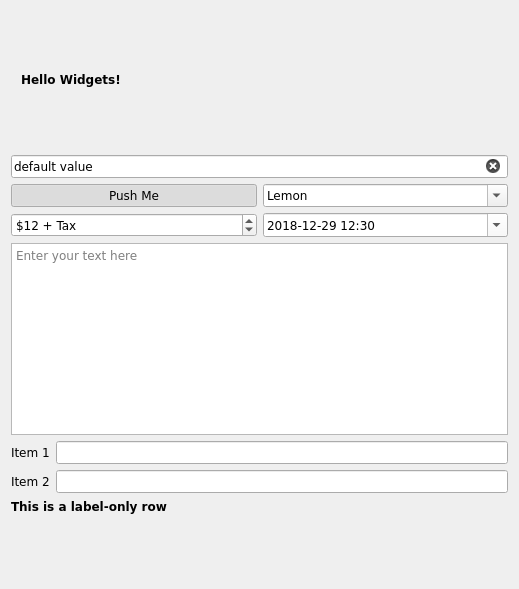
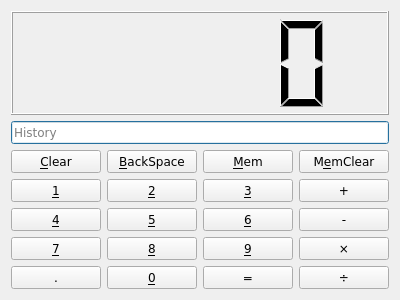

# 二、使用 QtWidget 构建窗体

应用开发的第一步是原型化应用的 GUI。PyQt 提供了广泛的可随时使用的小部件，使之非常容易。最重要的是，我们可以在完成后将原型代码直接移动到实际应用中。

在本章中，我们将熟悉以下主题的基本窗体设计：

*   创建基本的 QtWidgets 小部件
*   放置和排列小部件
*   验证小部件
*   构建日历应用 GUI

# 技术要求

要完成本章，您需要从[第 1 章](01.html)、*开始学习 PyQt*，再加上[中的示例代码 https://github.com/PacktPublishing/Mastering-GUI-Programming-with-Python/tree/master/Chapter02](https://github.com/PacktPublishing/Mastering-GUI-Programming-with-Python/tree/master/Chapter02) 。

查看以下视频以查看代码的运行：[http://bit.ly/2M2R26r](http://bit.ly/2M2R26r)

# 创建基本的 QtWidgets 小部件

`QtWidgets`模块包含几十个小部件，有些简单标准，有些复杂独特。在本节中，我们将介绍八种最常见的小部件及其基本用法。

在开始本节之前，从[第 1 章](01.html)、*PyQt 入门*中复制一份您的申请模板，并将其保存到名为`widget_demo.py`的文件中。在我们阅读这些示例时，您可以将它们添加到您的`MainWindow.__init__()`方法中，以查看对象是如何工作的。

# QWidget

`QWidget`是所有其他小部件的父类，因此它拥有的任何属性和方法也将在任何其他小部件中可用。`QWidget`对象本身可以用作其他小部件的容器、填充空白区域的填充物，或者用作顶级窗口的基类。

创建小部件非常简单，如下所示：

```py
        # inside MainWindow.__init__()
        subwidget = qtw.QWidget(self)
```

请注意，我们已将`self`作为参数传递。如果我们正在创建一个小部件，以放置在另一个小部件类上或在另一个小部件类中使用，那么最好将对父小部件的引用作为第一个参数传递。指定父窗口小部件将确保在父窗口小部件处于活动状态时销毁和清理子窗口小部件，并将其可见性限制在父窗口小部件内部。

正如您在[第 1 章](01.html)、*PyQt*入门中所了解的，PyQt 还允许我们为小部件的任何属性指定值。

例如，我们可以使用`toolTip`属性设置此小部件的工具提示文本（当小部件用鼠标悬停时将弹出）：

```py
        subwidget = qtw.QWidget(self, toolTip='This is my widget')
```

阅读关于 Ty0T0}的 C++文档（在 OntT6 中找到）https://doc.qt.io/qt-5/qwidget.html ），并注意类的属性。请注意，每个属性都有一个指定的数据类型。在这种情况下，`toolTip`需要`QString`。无论何时需要`QString`，我们都可以使用常规 Unicode 字符串，因为 PyQt 为我们翻译它。对于更深奥的数据类型，如`QSize`或`QColor`，我们需要创建适当的对象。但是，请注意，这些转换是在后台进行的，因为 Qt 不能原谅数据类型。

例如，此代码会导致错误：

```py
        subwidget = qtw.QWidget(self, toolTip=b'This is my widget')
```

这将导致`TypeError`，因为 PyQt 不会将`bytes`对象转换为`QString`。因此，请确保检查小部件的属性或方法调用所需的数据类型，并使用兼容类型。

# QWidget 作为顶级窗口

当在没有父对象的情况下创建`QWidget`并调用其`show()`方法时，它将成为顶级窗口。当我们使用它作为顶级窗口时，比如我们使用`MainWindow`实例时，我们可以设置一些特定于窗口的属性。下表显示了其中一些：

| 所有物 | 参数类型 | 描述 |
| --- | --- | --- |
| `windowTitle` | 一串 | 窗口的标题。 |
| `windowIcon` | `QIcon` | 窗口的图标。 |
| `modal` | 布尔值 | 窗口是否为模态。 |
| `cursor` | `Qt.CursorShape` | 此小部件悬停时使用的光标。 |
| `windowFlags` | `Qt.WindowFlags` | 操作系统应如何处理窗口（对话框、工具提示、弹出窗口）。 |

`cursor`的参数类型是枚举的一个示例。枚举只是一个命名值的列表，Qt 在属性被限制为一组描述性值的任何地方定义枚举。`windowFlags`的参数是一个标志的示例。标志与枚举类似，只是它们可以组合（使用管道操作符`|`），以便可以传递多个标志。

在本例中，enum 和 flag 都是在`QtCore`模块中找到的`Qt`名称空间的一部分。因此，例如，要在小部件悬停时将光标设置为箭头光标，您需要在`Qt`中找到指向箭头光标的正确常量，并将小部件的`cursor`属性设置为该值。要在窗口上设置标志，指示操作系统它是`sheet`和`popup`窗口，您需要在`Qt`中找到表示这些窗口标志的常数，将它们与管道组合，并将其作为`windowFlags`的值传递。

创建这样一个`QWidget`窗口可能如下所示：

```py
window = qtw.QWidget(cursor=qtc.Qt.ArrowCursor)
window.setWindowFlags(qtc.Qt.Sheet|qtc.Qt.Popup)
```

在本书的其余部分中，当我们学习配置 Qt 小部件时，我们将遇到更多的标志和枚举。

# QLabel

`QLabel`是配置为显示简单文本和图像的`QWidget`对象。

创建一个如下所示：

```py
        label = qtw.QLabel('Hello Widgets!', self)
```

请注意，这次将父窗口小部件指定为第二个参数，而第一个参数是标签的文本。

一些常用的`QLabel`属性如下所示：

| 所有物 | 论点 | 描述 |
| --- | --- | --- |
| `text` | 一串 | 要在标签上显示的文本。 |
| `margin` | 整数 | 文本周围的空间（以像素为单位）。 |
| `indent` | 整数 | 空格（以像素为单位）以缩进文本。 |
| `wordWrap` | 布尔值 | 是否要换行。 |
| `textFormat` | `Qt.TextFormat` | 强制纯文本或富文本，或自动检测。 |
| `pixmap` | `QPixmap` | 要显示的图像而不是文本。 |

标签的文本存储在其`text`属性中，因此可以使用相关的访问器方法访问或更改它，如下所示：

```py
        label.setText("Hi There, Widgets!")
        print(label.text())
```

`QLabel`可以显示纯文本、富文本或图像。Qt 中的富文本使用类似 HTML 的语法；默认情况下，标签将自动检测字符串是否包含任何格式标记，并相应地显示适当类型的文本。例如，如果我们想将标签加粗并在文本周围添加边距，我们可以这样做：

```py
        label = qtw.QLabel('<b>Hello Widgets!</b>', self, margin=10)
```

我们将在[第 6 章](06.html)、*设置 Qt 应用样式、*和[第 11 章](11.html)、*使用 QTextDocument*创建富文本中了解更多关于使用图像、富文本和字体的信息。

# QLineEdit

`QLineEdit`类是一个单行文本输入小部件，通常用于数据输入或登录窗体。`QLineEdit`可以无参数调用，也可以仅使用父窗口小部件，或者使用默认字符串值作为第一个参数，如下所示：

```py
        line_edit = qtw.QLineEdit('default value', self)
```

我们还可以传递一些属性：

| 所有物 | 论据 | 描述 |
| --- | --- | --- |
| `text` | 一串 | 盒子里的东西。 |
| `readOnly` | 布尔值 | 该字段是否可以编辑。 |
| `clearButtonEnabled` | 布尔值 | 是否添加清除按钮。 |
| `placeholderText` | 一串 | 字段为空时将显示的文本。 |
| `maxLength` | 整数 | 可以输入的最大字符数。 |
| `echoMode` | `QLineEdit.EchoMode` | 切换文本在输入时的显示方式（例如密码输入）。 |

让我们向行编辑小部件添加一些属性：

```py
        line_edit = qtw.QLineEdit(
            'default value',
            self,
            placeholderText='Type here',
            clearButtonEnabled=True,
            maxLength=20
        )
```

这将使用默认文本`'default value'`填充小部件。当字段为空时，它将显示一个占位符字符串`'Type here'`或一个小的`X`按钮，当字段中有文本时，该按钮将清除该字段。它还将可键入的字符数限制为`20`。

# QPushButton 和其他按钮

`QPushButton`是一个简单、可点击的按钮小部件。与`QLabel`和`QLineEdit`类似，可以使用第一个参数调用它，该参数指定按钮上的文本，如下所示：

```py
        button = qtw.QPushButton("Push Me", self)
```

我们可以在`QPushButton`上设置的一些更有用的属性包括：

| 所有物 | 论据 | 描述 |
| --- | --- | --- |
| `checkable` | 布尔值 | 按下按钮时按钮是否保持打开状态。 |
| `checked` | 布尔值 | 对于`checkable`按钮，是否检查该按钮。 |
| `icon` | `QIcon` | 要显示在按钮上的图标图像。 |
| `shortcut` | `QKeySequence` | 将激活按钮的键盘快捷键。 |

`checkable`和`checked`属性允许我们将此按钮用作反映开/关状态的切换按钮，而不仅仅是执行操作的单击按钮。所有这些属性都来自`QPushButton`类的父类`QAbstractButton`。这也是其他几个按钮类的父类，如下所示：

| 班 | 描述 |
| --- | --- |
| `QCheckBox` | 复选框可以是布尔型的开/关，也可以是三态的开/部分开/关。 |
| `QRadioButton` | 与复选框类似，但在具有相同父项的按钮中只能选中一个按钮。 |
| `QToolButton` | 用于工具栏小部件的特殊按钮。 |

虽然每个按钮都有一些独特的功能，但对于核心功能而言，这些按钮在创建和配置方面是相同的。

让我们使按钮可检查，默认情况下进行检查，并为其提供快捷方式：

```py
        button = qtw.QPushButton(
            "Push Me",
            self,
            checkable=True,
            checked=True,
            shortcut=qtg.QKeySequence('Ctrl+p')
        )
```

注意，`shortcut`选项要求我们传入一个`QKeySequence`，它是`QtGui`模块的一部分。这是一个很好的例子，说明了属性参数通常需要包装在某种实用程序类中。`QKeySequence`封装了一个组合键，在本例中为*Ctrl*键（或在 macOS 上为*命令*键）和*P*。

可以将键序列指定为字符串，如前面的示例，或者使用`QtCOre.Qt`模块中的枚举值。例如，我们可以将前面的内容写成`QKeySequence(qtc.Qt.CTRL + qtc.Qt.Key_P)`。

# QComboBox

**组合框**（也称为下拉或选择小部件）是一个小部件，单击时会显示选项列表，必须选择其中一个。`QCombobox`可以通过将其`editable`属性设置为`True`来选择性地允许自定义答案的文本输入。

让我们创建一个`QCombobox`对象，如下所示：

```py
        combobox = qtw.QComboBox(self)
```

现在，我们的`combobox`菜单上没有任何项目。`QCombobox`未提供使用构造函数中的选项初始化小部件的方法；相反，我们必须创建小部件，然后使用`addItem()`或`insertItem()`方法用选项填充其菜单，如下所示：

```py
        combobox.addItem('Lemon', 1)
        combobox.addItem('Peach', 'Ohh I like Peaches!')
        combobox.addItem('Strawberry', qtw.QWidget)
        combobox.insertItem(1, 'Radish', 2)
```

`addItem()`方法采用一个字符串作为标签和一个数据值。如您所见，该值可以是任何整数、字符串或 Python 类。可以使用`QCombobox`对象的`currentData()`方法为当前选定的项目检索此值。这通常是一个好主意，尽管不要求所有项目值都是相同的类型。

`addItem()`将始终在菜单末尾追加项目；要更早地插入它们，请使用`insertItem()`方法。它的工作原理完全相同，只是第一个参数采用了索引（整数值）。该项将插入列表中该索引处。如果我们想节省时间，并且我们的物品不需要`data`属性，我们也可以使用`addItems()`或`insertItems()`传递选项列表。

`QComboBox`的其他一些重要属性包括：

| 所有物 | 论据 | 描述 |
| --- | --- | --- |
| `currentData` | （任何事情） | 当前选定项的数据对象。 |
| `currentIndex` | 整数 | 当前选定项目的索引。 |
| `currentText` | 一串 | 当前选定项目的文本。 |
| `editable` | 布尔值 | `combobox`是否允许文本输入。 |
| `insertPolicy` | `QComboBox.InsertPolicy` | 应在列表中插入输入项目的位置。 |

`currentData`的数据类型为`QVariant`，这是一个特殊的 Qt 类，充当任何类型数据的容器。这些在 C++中更有用，因为它们在多个数据类型可能有用的情况下提供静态类型的解决方案。PyQt 自动将`QVariant`对象转换为最合适的 Python 类型，因此我们很少需要直接使用这种类型。

让我们更新我们的`combobox`，以便我们可以将项目添加到下拉列表的顶部：

```py
        combobox = qtw.QComboBox(
            self,
            editable=True,
            insertPolicy=qtw.QComboBox.InsertAtTop
        )
```

现在这个`combobox`将允许输入任何文本；文本将添加到列表框的顶部。新项目的`data`属性将是`None`，因此这实际上只适用于只处理可见字符串的情况。

# QSpinBox

通常，spinbox 是一种带有箭头按钮的文本条目，设计用于通过一组增量值*旋转*。`QSpinbox`专门用于处理整数或离散值（如组合框）。

一些有用的`QSpinBox`属性包括：

| 所有物 | 论据 | 描述 |
| --- | --- | --- |
| `value` | 整数 | 当前 spinbox 值，作为整数。 |
| `cleanText` | 一串 | 以字符串形式显示的当前 spinbox 值（不包括前缀和后缀）。 |
| `maximum` | 整数 | 框的最大整数值。 |
| `minimum` | 整数 | 框的最小值。 |
| `prefix` | 一串 | 要在显示值前面加上的字符串。 |
| `suffix` | 一串 | 要附加到显示值的字符串。 |
| `singleStep` | 整数 | 使用箭头时增加或减少值的大小。 |
| `wrapping` | 布尔值 | 使用箭头时是否从范围的一端环绕到另一端。 |

让我们在脚本中创建一个`QSpinBox`对象，如下所示：

```py
        spinbox = qtw.QSpinBox(
            self,
            value=12,
            maximum=100,
            minimum=10,
            prefix='$',
            suffix=' + Tax',
            singleStep=5
        )
```

此 spinbox 以值`12`开始，允许输入从`10`到`100`的整数，以`$<value> + Tax`格式显示。请注意，框的非整数部分不可编辑。还要注意，当递增和递减箭头移动`5`时，没有任何东西阻止我们输入一个不是`5`倍数的值。

`QSpinBox`将自动忽略非数字的击键，或将值置于可接受范围之外的击键。如果键入的值太低，当焦点从`spinbox`移动时，将自动更正为有效值；例如，如果您在前面的框中键入`9`并单击退出，它将自动更正为`90`。

`QDoubleSpinBox`与`QSpinBox`相同，但设计用于十进制或浮点数。

要将`QSpinBox`用于离散文本值而不是整数，您需要将其子类化并覆盖其验证方法。我们将在稍后的*验证小部件*部分中进行此操作。

# QDateTimeEdit

spinbox 的近亲是`QDateTimeEdit`，用于输入日期时间值。默认情况下，它显示为一个微调框，允许用户在日期时间值中的每个字段之间进行制表，并使用箭头递增/递减。小部件还可以配置为使用日历弹出窗口。

更有用的属性包括以下内容：

| 所有物 | 论据 | 描述 |
| --- | --- | --- |
| `date` | `QDate`或`datetime.date` | 日期值。 |
| `time` | `QTime`或`datetime.time` | 时间值。 |
| `dateTime` | `QDateTime`或`datetime.datetime` | 组合的日期时间值。 |
| `maximumDate`、`minimumDate` | `QDate`或`datetime.date` | 可输入的最大和最小日期。 |
| `maximumTime`、`minimumTime` | `QTime`或`datetime.time` | 可输入的最大和最小时间。 |
| `maximumDateTime`、`minimumDateTime` | `QDateTime`或`datetime.datetime` | 可输入的最大和最小日期时间。 |
| `calendarPopup` | 布尔值 | 是显示日历弹出窗口还是像旋转框一样工作。 |
| `displayFormat` | 一串 | 日期和时间的格式。 |

让我们这样创建日期时间框：

```py
       datetimebox = qtw.QDateTimeEdit(
            self,
            date=qtc.QDate.currentDate(),
            time=qtc.QTime(12, 30),
            calendarPopup=True,
            maximumDate=qtc.QDate(2030, 1, 1),
            maximumTime=qtc.QTime(17, 0),
            displayFormat='yyyy-MM-dd HH:mm'
        )
```

将使用以下属性创建此日期时间小部件：

*   将设置为当前日期的 12:30
*   聚焦时，它将显示日历弹出窗口
*   它将禁止 2030 年 1 月 1 日之后的日期
*   在最长日期 17:00（下午 5 点）之后，它将不允许时间
*   它将以年-月-日-小时-分钟格式显示日期时间

请注意，`maximumTime`和`minimumTime`仅分别影响`maximumDate`和`minimumDate`值。因此，尽管我们已经指定了 17:00 的最长时间，但只要是在 2030 年 1 月 1 日之前，就没有什么可以阻止您进入 18:00。同样的概念也适用于最短日期和时间。

日期时间的显示格式是使用包含每个项目的特定替换代码的字符串设置的。此处列出了一些更常见的代码：

| 密码 | 意思 |
| --- | --- |
| `d` | 每月的第二天。 |
| `M` | 月数。 |
| `yy` | 两位数的年份。 |
| `yyyy` | 四位数的年份。 |
| `h` | 小时 |
| `m` | 分钟 |
| `s` | 第二 |
| `A` | 上午/下午，如果使用，小时将切换为 12 小时。 |

日、月、小时、分钟和秒都默认省略前导零。要获得前导零，只需将字母加倍（例如，`dd`表示一天的前导零）。完整的代码列表可在[中找到 https://doc.qt.io/qt-5/qdatetime.html](https://doc.qt.io/qt-5/qdatetime.html) 。

请注意，所有时间、日期和日期时间都可以接受 Python 标准库的`datetime`模块以及 Qt 类型中的对象。因此，我们的盒子也可以这样创建：

```py
        import datetime
        datetimebox = qtw.QDateTimeEdit(
            self,
            date=datetime.date.today(),
            time=datetime.time(12, 30),
            calendarPopup=True,
            maximumDate=datetime.date(2020, 1, 1),
            minimumTime=datetime.time(8, 0),
            maximumTime=datetime.time(17, 0),
            displayFormat='yyyy-MM-dd HH:mm'
        )
```

您选择使用哪一个取决于个人偏好或情景需求。例如，如果您使用其他 Python 模块，`datetime`标准库对象将更加兼容。如果您只需要为小部件设置默认值，`QDateTime`可能更方便，因为您可能已经导入了`QtCore`。

如果您需要对日期和时间条目进行更多的控制，或者只是想将它们分开，那么 Qt 有`QTimeEdit`和`QDateEdit`小部件。它们就像这个小部件一样，只是它们只分别处理时间和日期。

# QTextEdit

虽然`QLineEdit`适用于单行字符串，`QTextEdit`为我们提供了输入多行文本的能力。`QTextEdit`不仅仅是一个简单的明文条目；这是一个成熟的所见即所得编辑器，可以配置为支持富文本和图像。

`QTextEdit`的一些更有用的属性如下所示：

| 所有物 | 论据 | 描述 |
| --- | --- | --- |
| `plainText` | 一串 | 框中的内容，以明文形式显示。 |
| `html` | 一串 | 框的内容，作为富文本。 |
| `acceptRichText` | 布尔值 | 该框是否允许富文本。 |
| `lineWrapColumnOrWidth` | 整数 | 将在其中包装文本的像素或列。 |
| `lineWrapMode` | `QTextEdit.LineWrapMode` | 换行是使用列还是像素。 |
| `overwriteMode` | 布尔值 | 覆盖是否被激活；`False`表示插入模式。 |
| `placeholderText` | 一串 | 字段为空时显示的文本。 |
| `readOnly` | 布尔值 | 字段是否为只读。 |

让我们创建一个文本编辑，如下所示：

```py
        textedit = qtw.QTextEdit(
            self,
            acceptRichText=False,
            lineWrapMode=qtw.QTextEdit.FixedColumnWidth,
            lineWrapColumnOrWidth=25,
            placeholderText='Enter your text here'
            )
```

这将创建一个纯文本编辑器，每行只允许键入`25`字符，当其为空时显示短语`'Enter your text here'`。

我们将在[第 11 章](11.html)中深入挖掘`QTextEdit`和富文本文档，*使用 QTextDocument*创建富文本。

# 放置和排列小部件

到目前为止，我们已经创建了很多小部件，但是如果您运行该程序，您将看不到任何小部件。虽然我们的小部件都属于父窗口，但它们还没有放在父窗口上。在本节中，我们将学习如何在应用窗口中排列小部件并将其设置为适当的大小。

# 布局类

布局对象定义子部件在父部件上的排列方式。Qt 提供了各种布局类，每个类都有适合不同情况的布局策略。

使用布局类的工作流如下所示：

1.  从适当的布局类创建布局对象
2.  使用`setLayout()`方法将布局对象分配给父窗口小部件的`layout`属性
3.  使用布局的`addWidget()`方法将小部件添加到布局中

您还可以使用`addLayout()`方法将布局添加到布局中，以创建更复杂的小部件排列。让我们参观一下 QT 所提供的一些基本布局课程。

# QHBoxLayout 和 QVBoxLayout

`QHBoxLayout`和`QVBoxLayout`都源于`QBoxLayout`，这是一个非常基本的布局引擎，只需将父级划分为水平或垂直框，并在添加小部件时按顺序放置它们。`QHBoxLayout`水平定向，小部件按添加顺序从左到右放置。`QVBoxLayout`垂直定向，小部件按添加顺序从上到下放置。

让我们在我们的`MainWindow`小部件上试试`QVBoxLayout`：

```py
        layout = qtw.QVBoxLayout()
        self.setLayout(layout)
```

一旦布局对象存在，我们就可以开始使用`addWidget()`方法将小部件添加到布局对象中：

```py
        layout.addWidget(label)
        layout.addWidget(line_edit)
```

如您所见，如果运行该程序，每行将添加一个小部件。如果我们想在一行中添加几个小部件，我们可以在布局中嵌套一个布局，如下所示：

```py
        sublayout = qtw.QHBoxLayout()
        layout.addLayout(sublayout)

        sublayout.addWidget(button)
        sublayout.addWidget(combobox)
```

在这里，我们在主垂直布局的下一个单元格中添加了一个水平布局，然后又在子布局中插入了三个小部件。这三个小部件在主布局的一行中并排显示。大多数应用布局都可以通过这种方式简单地嵌套方框布局来完成。

# QGridLayout

嵌套框布局覆盖了很多领域，但在某些情况下，您可能希望以统一的行和列排列小部件。这就是`QGridLayout`派上用场的地方。顾名思义，它允许您将小部件放置在类似于表的结构中。

创建网格布局对象，如下所示：

```py
        grid_layout = qtw.QGridLayout()
        layout.addLayout(grid_layout)
```

向`QGridLayout`添加小部件类似于`QBoxLayout`类的方法，但也需要传递坐标：

```py
        grid_layout.addWidget(spinbox, 0, 0)
        grid_layout.addWidget(datetimebox, 0, 1)
        grid_layout.addWidget(textedit, 1, 0, 2, 2)
```

以下是`QGridLayout.addWidget()`的论点，顺序如下：

1.  要添加的小部件
2.  行号（垂直坐标），从`0`开始
3.  列号（水平坐标），从`0`开始

4.  行跨度，或小部件将包含多少行（可选）
5.  列跨度，或小部件将包含多少列（可选）

因此，我们的`spinbox`小部件被放置在`0`行`0`列的左上角；我们的`datetimebox`在`0`行`1`列，右上角；我们的`textedit`在`1`行`0`列，它跨越两行两列。

请记住，网格布局在所有列上保持一致的宽度，在所有行上保持一致的高度。因此，如果您将一个非常宽的小部件放在第`2`行、第`1`列中，所有恰好位于第`1`列中的行中的所有小部件都将相应地拉伸。如果希望每个单元独立拉伸，请改用嵌套框布局。

# QFormLayout

在创建数据输入窗体时，通常在它们标记的输入小部件旁边有标签。Qt 为这种情况提供了一种方便的两列网格布局，称为`QFormLayout`。

让我们向 GUI 添加一个窗体布局：

```py
        form_layout = qtw.QFormLayout()
        layout.addLayout(form_layout)
```

使用`addRow()`方法可以轻松添加小部件：

```py
        form_layout.addRow('Item 1', qtw.QLineEdit(self))
        form_layout.addRow('Item 2', qtw.QLineEdit(self))
        form_layout.addRow(qtw.QLabel('<b>This is a label-only row</b>'))
```

这个方便的方法接受一个字符串和一个小部件，并自动为该字符串创建`QLabel`小部件。如果只传递一个小部件（如`QLabel`），则该小部件跨越两列。这对于标题或节标签很有用。

`QFormLayout`不仅仅是`QGridLayout`的便利，它还自动提供跨不同平台使用时的惯用行为。例如，在窗口上使用时，标签左对齐；在 macOS 上使用时，标签正确对齐，符合平台的设计指南。此外，当在窄屏幕（如移动设备）上查看时，布局会自动折叠为一列，标签位于输入上方。当你有两列窗体的时候，使用这种布局绝对值得。

# 控制小部件大小

如果您按当前的方式运行演示并将其展开以填充屏幕，您会注意到主布局的每个单元格都会均匀拉伸以填充屏幕，如下所示：



这并不理想。顶部的标签实际上不需要扩展，底部有大量浪费的空间。据推测，如果用户要扩展此窗口，他们会这样做，以便在输入小部件（如我们的`QTextEdit`）中获得更多空间。我们需要给 GUI 一些关于如何调整小部件大小的指导，以及在窗口从默认大小扩展或缩小时如何调整它们的大小。

在任何工具箱中，控制小部件的大小都可能有点令人困惑，但 Qt 的方法可能会特别令人困惑，所以让我们一步一步地进行。

我们可以使用`setFixedSize()`方法简单地为任何小部件设置一个固定大小，如下所示：

```py
        # Fix at 150 pixels wide by 40 pixels high
        label.setFixedSize(150, 40)
```

`setFixedSize`只接受像素值，在任何情况下，设置为固定大小的小部件都不能改变这些像素大小。以这种方式调整小部件大小的问题在于，它没有考虑到不同字体、不同文本大小或应用窗口大小或布局更改的可能性，这可能导致小部件对于其内容来说太小，或者不必要的大。我们可以通过设置`minimumSize`和`maximumSize`使其稍微灵活一些，如下所示：

```py
        # setting minimum and maximum sizes
        line_edit.setMinimumSize(150, 15)
        line_edit.setMaximumSize(500, 50)
```

如果您运行此代码并调整窗口大小，您会注意到`line_edit`在窗口扩展和收缩时具有更大的灵活性。但是，请注意，小部件不会收缩到其`minimumSize`以下，但它不一定会使用其`maximumSize`，即使房间可用。

因此，这还远远不够理想。与其关心每个小部件消耗多少像素，不如根据其内容和在界面中的角色合理地调整大小。Qt 使用*大小提示*和*大小策略*的概念来实现这一点。

大小提示是小部件的建议大小，由小部件的`sizeHint()`方法返回。这种规模可能基于各种动态因素；例如，`QLabel`小部件的`sizeHint()`值取决于它包含的文本的长度和包装。因为它是一个方法而不是一个属性，所以为一个小部件设置一个自定义的`sizeHint()`需要您对小部件进行子类化并重新实现该方法。幸运的是，这不是我们经常需要做的事情。

大小策略定义小部件如何响应与其大小提示相关的调整大小请求。这被设置为小部件的`sizePolicy`属性。大小策略在`QtWidgets.QSizePolicy.Policy`枚举中定义，并使用`setSizePolicy`访问器方法为小部件的水平和垂直维度分别设置。此处列出了可用的策略：

| 政策 | 描述 |
| --- | --- |
| 固定的 | 永远不要成长或萎缩。 |
| 最低限度 | 不要小于`sizeHint`。扩展没有用。 |
| 最大限度 | 不要超过`sizeHint`，必要时收缩。 |
| 首选 | 试着做`sizeHint`，但必要时收缩。扩展没有用。这是默认设置。 |
| 扩大 | 尽量保持`sizeHint`，必要时收缩，但尽可能地扩张。 |
| 最小扩张 | 不要比`sizeHint`小，但尽可能扩大。 |
| 忽略 | 完全忘记`sizeHint`吧，尽可能多地占用空间。 |

因此，例如，如果我们希望 spinbox 保持固定的宽度，以便它旁边的小部件可以扩展，我们可以这样做：

```py
      spinbox.setSizePolicy(qtw.QSizePolicy.Fixed,qtw.QSizePolicy.Preferred)
```

或者，如果我们希望我们的`textedit`小部件尽可能填满屏幕，但决不缩小到其`sizeHint()`值以下，我们应该如下设置其策略：

```py
        textedit.setSizePolicy(
            qtw.QSizePolicy.MinimumExpanding,
            qtw.QSizePolicy.MinimumExpanding
        )
```

当您有深度嵌套的布局时，调整小部件的大小可能有些不可预测；有时，能够覆盖`sizeHint()`很方便。在 Python 中，一种快速的方法是使用 Lambda 函数，如下所示：

```py
        textedit.sizeHint = lambda : qtc.QSize(500, 500)
```

注意，`sizeHint()`必须返回一个`QtCore.QSize`对象，而不仅仅是一个整数元组。

使用方框布局时控制小部件大小的最后一种方法是在将小部件添加到布局时设置`stretch`因子。Stretch 是`addWidget()`的第二个可选参数，用于定义每个小部件的比较拉伸。

本例显示了`stretch`系数的使用：

```py
        stretch_layout = qtw.QHBoxLayout()
        layout.addLayout(stretch_layout)
        stretch_layout.addWidget(qtw.QLineEdit('Short'), 1)
        stretch_layout.addWidget(qtw.QLineEdit('Long'), 2)
```

`stretch`仅适用于`QHBoxLayout`和`QVBoxLayout`类。

在本例中，我们添加了一个拉伸因子为`1`的线编辑，以及一个拉伸因子为`2`的线编辑。运行此命令时，您会发现第二行编辑的长度大约是第一行的两倍。

请记住，拉伸不会覆盖尺寸提示或尺寸策略，因此根据这些因素，拉伸比可能不完全符合规定。

# 容器小部件

我们已经看到，我们可以使用`QWidget`作为其他小部件的容器。Qt 还为我们提供了一些特殊的小部件，这些小部件是专门为包含其他小部件而设计的。我们来看看其中的两个：`QTabWidget`和`QGroupBox`。

# 求帮忙

`QTabWidget`在其他工具包中有时被称为**笔记本小部件**，允许我们通过选项卡选择多个*页面*。它们非常有用，可以将复杂的界面分解成更小的块，用户更容易接受。

`QTabWidget`的使用流程如下：

1.  创建`QTabWidget`对象
2.  在`QWidget`或其他小部件类上构建 UI 页面
3.  使用`QTabWidget.addTab()`方法将页面添加到选项卡小部件

让我们试试看；首先，创建选项卡小部件：

```py
        tab_widget = qtw.QTabWidget()
        layout.addWidget(tab_widget)
```

接下来，我们将在*放置和排列小部件*部分下构建的`grid_layout`移动到容器小部件：

```py
        container = qtw.QWidget(self)
        grid_layout = qtw.QGridLayout()
        # comment out this line:
        #layout.addLayout(grid_layout)
        container.setLayout(grid_layout)
```

最后，让我们将`container`小部件添加到一个新选项卡：

```py
        tab_widget.addTab(container, 'Tab the first')
```

`addTab()`的第二个参数是将出现在选项卡上的标题文本。后续选项卡可以添加更多对`addTab()`的调用，如下所示：

```py
        tab_widget.addTab(subwidget, 'Tab the second')
```

`insertTab()`方法也可用于在端点以外的位置添加新选项卡。

`QTabWidget`有一些我们可以自定义的属性，如下所示：

| 所有物 | 论据 | 描述 |
| --- | --- | --- |
| `movable` | 布尔值 | 选项卡是否可以重新排序。默认为`False`。 |
| `tabBarAutoHide` | 布尔值 | 只有一个选项卡时，选项卡栏是隐藏还是显示。 |
| `tabPosition` | `QTabWidget.TabPosition` | 选项卡显示在小部件的哪一侧。默认值为北（顶部）。 |
| `tabShape` | `QTabWidget.TabShape` | 标签的形状。它可以是圆形或三角形。 |
| `tabsClosable` | 布尔值 | 是否在选项卡上显示关闭按钮。 |
| `useScrollButtons` | 布尔值 | 有多个选项卡时是使用滚动按钮还是展开。 |

让我们修改我们的`QTabWidget`，在小部件的左侧有可移动的三角形标签：

```py
        tab_widget = qtw.QTabWidget(
            movable=True,
            tabPosition=qtw.QTabWidget.West,
            tabShape=qtw.QTabWidget.Triangular
        )
```

`QStackedWidget`与 tab 小部件类似，只是它不包含用于切换页面的内置机制。如果您想构建自己的选项卡切换机制，您可能会发现它很有用。

# QGroupBox

`QGroupBox`提供一个贴有标签和边框（取决于平台样式）的面板。将相关输入分组到窗体上非常有用。我们创建`QGroupBox`就像创建`QWidget`容器一样，只是它可以有边框和框的标题，例如：

```py
        groupbox = qtw.QGroupBox('Buttons')
        groupbox.setLayout(qtw.QHBoxLayout())
        groupbox.layout().addWidget(qtw.QPushButton('OK'))
        groupbox.layout().addWidget(qtw.QPushButton('Cancel'))
        layout.addWidget(groupbox)
```

在这里，我们创建一个带有`Buttons`标题的分组框。我们给它一个水平布局，并添加了两个按钮小部件。

请注意，在本例中，我们没有像之前那样为布局提供自己的句柄，而是创建了一个匿名的`QHBoxLayout`，然后使用小部件的`layout()`访问器方法检索对它的引用以添加小部件。在某些情况下，您可能更喜欢这种方法。

组框相当简单，但它有几个有趣的属性：

| 所有物 | 论点 | 描述 |
| --- | --- | --- |
| `title` | 一串 | 标题文本。 |
| `checkable` | 布尔值 | groupbox 是否有用于启用/禁用其内容的复选框。 |
| `checked` | 布尔值 | 是否选中（启用）可检查的组框。 |
| `alignment` | `QtCore.Qt.Alignment` | 标题文本的对齐方式。 |
| `flat` | 布尔值 | 盒子是平的还是有框架。 |

`checkable`和`checked`属性对于希望用户能够禁用窗体的整个部分的情况非常有用（例如，如果订单的帐单地址部分与发货地址相同，则禁用该部分）。

让我们重新配置我们的`groupbox`，如下所示：

```py
        groupbox = qtw.QGroupBox(
            'Buttons',
            checkable=True,
            checked=True,
            alignment=qtc.Qt.AlignHCenter,
            flat=True
        )
```

请注意，现在可以通过简单的复选框切换禁用按钮，并且框架具有不同的外观。

如果您只是想要一个没有标签或复选框功能的有边框的小部件，`QFrame`类可能是更好的选择。

# 验证小部件

虽然 Qt 为日期和数字等提供了大量现成的输入小部件，但有时我们可能会发现，我们需要一个对其输入值具有非常特定约束的小部件。可以使用`QValidator`类创建此类输入约束。

工作流程如下所示：

1.  通过子类化`QtGui.QValidator`创建自定义验证器类
2.  用我们的验证逻辑覆盖`validate()`方法
3.  将自定义类的实例分配给小部件的`validator`属性

一旦分配给可编辑的小部件，`validate()`方法将在用户每次更新小部件的值时调用（例如，`QLineEdit`中的每次击键），并确定输入是否被接受。

# 创建 IPv4 条目小部件

为了演示小部件验证，让我们创建一个小部件来验证**互联网协议版本 4**（**IPv4**地址。IPv4 地址的格式必须为 4 个整数，每个整数介于`0`和`255`之间，每个数字之间有一个点。

让我们从创建验证器类开始。在`MainWindow`类之前添加该类：

```py
class IPv4Validator(qtg.QValidator):
    """Enforce entry of IPv4 Addresses"""
```

接下来，我们需要重写这个类的`validate()`方法。`validate()`接收两条信息：一条包含建议输入的字符串和输入发生时的索引。它必须返回一个值，指示输入是`Acceptable`、`Intermediate`还是`Invalid`。如果输入是可接受的或中间的，则将被接受。如果无效，将被拒绝。

用于指示输入状态的值为`QtValidator.Acceptable`、`QtValidator.Intermediate`或`QtValidator.Invalid`。

在 Qt 文档中，我们被告知验证器类应该只返回 state 常量。然而，在 PyQt 中，实际上需要返回一个包含状态、字符串和位置的元组。不幸的是，这似乎没有很好的文档记录，如果您忘记了这一点，那么错误根本就不是直观的。

让我们开始构建 IPv4 验证逻辑，如下所示：

1.  拆分点字符上的字符串：

```py
            def validate(self, string, index):
                octets = string.split('.')
```

2.  如果超过`4`段，则该值无效：

```py
            if len(octets) > 4:
                state = qtg.QValidator.Invalid
```

3.  如果任何填充的段不是数字字符串，则该值无效：

```py
            elif not all([x.isdigit() for x in octets if x != '']):
                state = qtg.QValidator.Invalid
```

4.  如果不是每个填充的段都可以转换为 0 到 255 之间的整数，则该值无效：

```py
            elif not all([0 <= int(x) <= 255 for x in octets if x != '']):
                state = qtg.QValidator.Invalid
```

5.  如果我们进行了这么多的检查，那么该值要么是中间值，要么是有效值。如果少于四段，则为中间段：

```py
            elif len(octets) < 4:
                state = qtg.QValidator.Intermediate
```

6.  如果存在任何空段，则该值为中间值：

```py
            elif any([x == '' for x in octets]):
                state = qtg.QValidator.Intermediate
```

7.  如果该值已通过所有这些测试，则该值是可接受的。我们可以返回元组：

```py
            else:
                state = qtg.QValidator.Acceptable
            return (state, string, index)
```

要使用该验证器，我们只需要创建一个实例并将其分配给一个小部件：

```py
        # set the default text to a valid value
        line_edit.setText('0.0.0.0')
        line_edit.setValidator(IPv4Validator())
```

如果现在运行演示，您将看到行编辑现在将您限制为有效的 IPv4 地址。

# 对离散值使用 QSpinBox

正如您在前面的*创建基本 QtWidgets*部分中所了解的，`QSpinBox`可以用于字符串值的离散列表，就像组合框一样。`QSpinBox`有一个内置的`validate()`方法，其工作原理与`QValidator`类的方法类似，用于将输入约束到小部件。要使 spinbox 使用离散字符串列表，我们需要子类化`QSpinBox`并重写`validate()`和其他两种方法`valueFromText()`和`textFromValue()`。

让我们创建一个自定义 spinbox 类，用于从列表中选择项目；在`MainWindow`类之前，输入以下内容：

```py
class ChoiceSpinBox(qtw.QSpinBox):
    """A spinbox for selecting choices."""

    def __init__(self, choices, *args, **kwargs):
        self.choices = choices
        super().__init__(
            *args,
            maximum=len(self.choices) - 1,
            minimum=0,
            **kwargs
        )
```

我们正在子类化`qtw.QSpinBox`并重写构造函数，以便传入一个选择列表或元组，并将其存储为`self.choices`。然后我们调用`QSpinBox`构造函数；请注意，我们设置了`maximum`和`minimum`，这样它们就不能超出我们的选择范围。我们还传递了任何额外的位置或关键字参数，以便我们可以利用所有其他`QSpinBox`属性设置。

接下来，让我们重新实现`valueFromText()`，如下所示：

```py
    def valueFromText(self, text):
        return self.choices.index(text)
```

此方法的目的是在给定与所显示选项之一匹配的字符串时，能够返回整数索引值。我们只是返回传入的任何字符串的列表索引。

接下来，我们需要重新实现赠品方式`textFromValue()`：

```py
    def textFromValue(self, value):
        try:
            return self.choices[value]
        except IndexError:
            return '!Error!'
```

此方法的目的是将整数索引值转换为匹配选项的文本。在本例中，我们只是返回给定索引处的字符串。如果小部件以某种方式传递了超出范围的值，我们将以字符串形式返回`!Error!`。由于此方法用于确定设置特定值时框中显示的内容，因此如果该值超出范围，则会清楚地显示错误情况。

最后，我们需要关注`validate()`。正如我们对`QValidator`类所做的那样，我们需要创建一个方法，该方法接受建议的输入和编辑索引，并返回一个包含验证状态、字符串值和索引的元组。

我们将这样编码：

```py
    def validate(self, string, index):
        if string in self.choices:
            state = qtg.QValidator.Acceptable
        elif any([v.startswith(string) for v in self.choices]):
            state = qtg.QValidator.Intermediate
        else:
            state = qtg.QValidator.Invalid
        return (state, string, index)
```

在我们的方法中，如果在`self.choices`中找到输入字符串，我们将返回`Acceptable`；如果任何选项以输入字符串（包括空白字符串）开头，我们将返回`Intermediate`，或者在任何其他情况下返回`Invalid`。

创建此类后，我们可以在`MainWindow`类中创建一个小部件：

```py
        ratingbox = ChoiceSpinBox(
            ['bad', 'average', 'good', 'awesome'],
            self
        )
        sublayout.addWidget(ratingbox)
```

`QComboBox`对象和具有文本选项的`QSpinBox`对象之间的一个重要区别是，spinbox 项缺少`data`属性。只能返回文本或索引。它最适合用于月、星期或其他有意义地转换为整数值的顺序列表。

# 构建日历应用 GUI

是时候把我们学到的东西付诸行动，真正构建一个简单、功能强大的 GUI 了。我们的目标是构建一个简单的日历应用，如下所示：


我们的界面还不能正常工作；现在，我们将只关注如何创建和布置组件，如屏幕截图所示。我们将用两种方法来实现这一点：一次只使用代码，第二次使用 Qt 设计器。

这两种方法中的任何一种都是有效的，并且工作得很好，不过正如您将看到的，每种方法都有优点和缺点。

# 在代码中构建 GUI

通过复制[第 1 章](01.html)、*PyQt 入门*中的应用模板，创建一个名为`calendar_form.py`的新文件。

然后我们将配置主窗口；在`MainWindow`构造函数中，从以下代码开始：

```py
        self.setWindowTitle("My Calendar App")
        self.resize(800, 600)
```

这段代码将把我们的窗口标题设置为合适的，并为我们的窗口设置一个 800 x 600 的固定大小。请注意，这只是初始大小，如果用户愿意，可以调整窗体大小。

# 创建小部件

现在，让我们创建所有小部件：

```py
        self.calendar = qtw.QCalendarWidget()
        self.event_list = qtw.QListWidget()
        self.event_title = qtw.QLineEdit()
        self.event_category = qtw.QComboBox()
        self.event_time = qtw.QTimeEdit(qtc.QTime(8, 0))
        self.allday_check = qtw.QCheckBox('All Day')
        self.event_detail = qtw.QTextEdit()
        self.add_button = qtw.QPushButton('Add/Update')
        self.del_button = qtw.QPushButton('Delete')
```

这些都是我们将在 GUI 中使用的小部件。我们已经介绍了其中的大部分，但是有两个新的：`QCalendarWidget`和`QListWidget`。

`QCalendarWidget`正是你所期望的：一个完全互动的日历，可以用来查看和选择日期。尽管它有许多可以配置的属性，但是对于我们的需要，默认配置是可以的。我们将使用它来允许用户选择要查看和编辑的日期。

`QListWidget`用于显示、选择和编辑列表中的项目。我们将使用它来显示在特定日期保存的事件列表。

在继续之前，我们需要为`event_category`组合框配置一些要选择的项目。这是这个盒子的设计图：

*   当未选择任何内容时，将其作为占位符读取`Select category…`
*   包括一个名为`New…`的选项，该选项可能允许用户输入一个新类别
*   默认包括一些常用类别，如`Work`、`Meeting`、`Doctor`

为此，请添加以下内容：

```py
        # Add event categories
        self.event_category.addItems(
            ['Select category…', 'New…', 'Work',
             'Meeting', 'Doctor', 'Family']
            )
        # disable the first category item
        self.event_category.model().item(0).setEnabled(False)
```

`QComboBox`实际上没有占位符文本，所以我们在这里使用一个技巧来模拟它。我们像往常一样使用`addItems()`方法添加了组合框项目。接下来，我们使用`model()`方法检索其数据模型，该方法返回一个`QStandardItemModel`实例。数据模型保存组合框中所有项目的列表。我们可以使用模型的`item()`方法访问给定索引下的实际数据项（本例中为`0`），并使用其`setEnabled()`方法将其禁用。

简而言之，我们通过禁用组合框中的第一个条目来模拟占位符文本。

我们将在[第 5 章](05.html)*中了解更多关于 widget 数据模型的信息，该章节使用模型视图类创建数据接口。*

# 构建布局

我们的窗体需要一些嵌套的布局才能将所有内容放置到位。让我们分解我们建议的设计，并确定如何创建此布局：

*   应用分为左侧的日历和右侧的窗体。这建议使用`QHBoxLayout`作为主布局。
*   右边的窗体是一个垂直的组件堆栈，建议我们使用`QVBoxLayout`来安排右边的内容。

*   右下角的事件窗体可以大致放在一个网格中，这样我们就可以在那里使用`QGridLayout`。

我们将首先创建主布局并在日历中添加：

```py
        main_layout = qtw.QHBoxLayout()
        self.setLayout(main_layout)
        main_layout.addWidget(self.calendar)
```

我们希望日历小部件填充布局中的任何额外空间，因此我们将相应地设置其大小策略：

```py
        self.calendar.setSizePolicy(
            qtw.QSizePolicy.Expanding,
            qtw.QSizePolicy.Expanding
        )
```

现在，让我们在右侧创建垂直布局，并添加标签和事件列表：

```py
        right_layout = qtw.QVBoxLayout()
        main_layout.addLayout(right_layout)
        right_layout.addWidget(qtw.QLabel('Events on Date'))
        right_layout.addWidget(self.event_list)
```

如果有更多的垂直空间，我们希望事件列表填充所有可用空间。因此，我们将其大小策略设置为：

```py
        self.event_list.setSizePolicy(
            qtw.QSizePolicy.Expanding,
            qtw.QSizePolicy.Expanding
        )
```

GUI 的下一部分是事件窗体及其标签。我们可以在这里使用另一个标签，但设计建议将这些窗体字段分组在这个标题下，因此`QGroupBox`更合适。

那么，让我们创建一个带有`QGridLayout`的分组框来保存我们的活动窗体：

```py
        event_form = qtw.QGroupBox('Event')
        right_layout.addWidget(event_form)
        event_form_layout = qtw.QGridLayout()
        event_form.setLayout(event_form_layout)
```

最后，我们需要将剩下的小部件添加到网格布局中：

```py
        event_form_layout.addWidget(self.event_title, 1, 1, 1, 3)
        event_form_layout.addWidget(self.event_category, 2, 1)
        event_form_layout.addWidget(self.event_time, 2, 2,)
        event_form_layout.addWidget(self.allday_check, 2, 3)
        event_form_layout.addWidget(self.event_detail, 3, 1, 1, 3)
        event_form_layout.addWidget(self.add_button, 4, 2)
        event_form_layout.addWidget(self.del_button, 4, 3)
```

我们将网格划分为三列，并使用可选的 column span 参数将标题和详细信息字段放在所有三列中。

现在我们完成了！此时，您可以运行脚本并查看已完成的窗体。当然，它还没有做任何事情，但这是我们的[第 3 章](03.html)*用信号和插槽*处理事件的主题。

# 在 Qt 设计器中构建 GUI

让我们尝试构建相同的 GUI，但这次我们将使用 Qt 设计器构建它。

# 第一步

首先，按照[第 1 章](01.html)、*PyQt 入门*中的说明启动 Qt 设计器，然后基于小部件创建一个新窗体，如下所示：


现在，单击小部件，我们将使用右侧的属性面板配置其属性：

1.  将对象名称更改为`MainWindow`
2.  在**几何体**下，将宽度更改为`800`，将高度更改为`600`
3.  将窗口标题更改为`My Calendar App`

接下来，我们将开始添加小部件。滚动左侧的小部件框，找到**日历小部件**，然后将其拖到主窗口上。选择日历并编辑其属性：

1.  将名称更改为`calendar`
2.  将横向和纵向尺寸策略更改为`Expanding`

要设置主布局，请右键单击主窗口（不在日历上），然后选择布局**水平布局**。这将向主窗口小部件添加一个`QHBoxLayout`。请注意，在主窗口上至少有一个小部件出现之前，您无法执行此操作，这就是我们首先添加日历小部件的原因。

# 构建右面板

现在，我们将为窗体的右侧添加垂直布局。将垂直布局拖动到日历小部件的右侧。然后将标签小部件拖动到垂直布局中。确保标签按层次结构作为垂直布局的子级而不是同级列出：


如果您在将小部件拖动到未展开的布局时遇到问题，也可以将其拖动到**对象检查器**面板中的层次结构中。

双击标签上的文本并将其更改为“日期事件”。

接下来，将列表小部件拖到垂直布局上，使其显示在标签下。将其重命名为`event_list`并检查其属性，以确保其大小策略设置为`Expanding`。

# 构建事件窗体

在小部件框中找到组框，并将其拖动到列表小部件下。双击文本并将其更改为`Event`。

将线编辑拖到组框上，确保它在对象检查器中显示为组框的子对象。将对象名称更改为`event_title`。

现在，右键单击组框并选择布局，然后选择**在网格中布局**。这将在组框中创建网格布局。

将组合框拖到下一行。将时间编辑拖到其右侧，然后将复选框拖到其右侧。分别命名为`event_category`、`event_time`和`allday_check`。双击复选框文本并将其更改为`All Day`。

要向组合框添加选项，请右键单击该框并选择**编辑项**。这将打开一个对话框，我们可以在其中输入我们的项目，因此单击+按钮添加与第一个一样的`Select Category…`，然后添加`New…`，然后添加一些随机类别（例如`Work`、`Doctor`、`Meeting`。

不幸的是，我们无法使用 Qt 设计器禁用第一项。当我们在应用中使用窗体时，我们必须处理这个问题，我们将在[第 3 章](03.html)*使用信号和插槽处理事件*中讨论。

请注意，添加这三个小部件将行编辑推到了右侧。我们需要修复该小部件上的列跨度。单击“线编辑”，抓住右边缘上的控制柄，向右拖动它，直到它扩展到组框的宽度。

现在，抓取一个文本编辑并将其拖动到其他小部件下。请注意，它被压缩到第一列中，因此与“线编辑”一样，将其向右拖动，直到填充整个宽度。将文本编辑重命名为`event_detail`。

最后，将两个按钮小部件拖动到窗体底部。确保将它们拖到第二列和第三列，使第一列为空。将它们重命名为`add_button`和`del_button`，将文本分别更改为`Add/Update`和`Delete`。

# 预览窗体

将窗体保存为`calendar_form.ui`，然后按*Ctrl*+*R*进行预览。您应该看到一个功能齐全的窗体，如原始屏幕截图所示。要实际使用此文件，我们必须将其转换为 Python 代码并将其导入到实际脚本中。我们将在[第 3 章](03.html)*使用信号和插槽处理事件*中介绍这一点，在我们对窗体做了一些额外的修改之后。

# 总结

在本章中，我们介绍了 Qt 中最流行的小部件类。您学习了如何创建它们、自定义它们以及将它们添加到窗体中。我们讨论了控制小部件大小的各种方法，并在 Python 代码和 Qt Designer WYSIWYG 应用中实践了构建一个简单的应用窗体。

在下一章中，我们将学习如何使此窗体在探索 Qt 的核心通信和事件处理系统时真正发挥作用。将您的日历窗体放在手边，因为我们将对其进行更多修改，并从中生成一个功能性应用。

# 问题

尝试以下问题来测试您在本章中的知识：

1.  您将如何创建一个全屏、没有窗口框架且使用沙漏光标的`QWidget`？
2.  您被要求为计算机库存数据库设计一个数据输入窗体。选择用于以下每个字段的最佳小部件：
    *   **电脑制造**：贵公司购买的八个品牌之一
    *   **处理器速度**：以 GHz 为单位的 CPU 速度
    *   **内存量**：RAM 的量，以 MB 为单位
    *   **主机名**：计算机的主机名
    *   **视频制作**：视频硬件是 Nvidia、AMD 还是 Intel
    *   **OEM 许可证**：计算机是否使用**原始设备制造商**（**OEM**许可证）

3.  数据输入窗体包括一个需要`XX-999-9999X`格式的`inventory number`字段，其中`X`是从`A`到`Z`的大写字母，不包括`O`和`I`，而`9`是从`0`到`9`的数字。您可以创建一个验证程序类来验证这个输入吗？
4.  Check out the following calculator form—what layouts may have been used to create it?

    

5.  参考前面的计算器窗体，调整窗体大小时，如何使按钮网格占用额外的空间？
6.  计算器窗体中最上面的小部件是一个`QLCDNumber`小部件。你能在这个小部件上找到 Qt 文档吗？它有什么独特的特性？你什么时候可以用？
7.  从模板代码开始，用代码构建计算器窗体。
8.  在 Qt 设计器中构建计算器窗体。

# 进一步阅读

有关本章所涵盖主题的更多信息，请参阅以下资源：

*   `QWidget`属性文档列出了`QWidget`的所有属性，这些属性由其所有子类在[处继承 https://doc.qt.io/qt-5/qwidget.html#properties](https://doc.qt.io/qt-5/qwidget.html#properties)
*   `Qt`名称空间文档在[列出了 Qt 中使用的许多全局枚举 https://doc.qt.io/qt-5/qt.html#WindowState-枚举](https://doc.qt.io/qt-5/qt.html#WindowState-enum)
*   Qt 布局管理教程在[提供了布局和大小的详细信息 https://doc.qt.io/qt-5/layout.html](https://doc.qt.io/qt-5/layout.html)
*   `QDateTime`文档提供了有关在[使用 Qt 中的日期和时间的更多信息 https://doc.qt.io/qt-5/qdatetime.html](https://doc.qt.io/qt-5/qdatetime.html)
*   有关`QCalendarWidget`的更多信息，请访问[https://doc.qt.io/qt-5/qcalendarwidget.html](https://doc.qt.io/qt-5/qcalendarwidget.html)