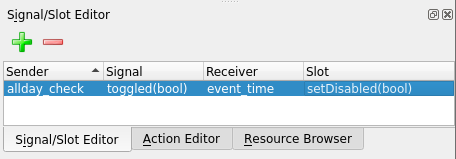

# 使用信号和插槽处理事件

将小部件组合成美观的表单是设计应用程序的良好第一步，但要使 GUI 发挥任何作用，它需要连接到实际执行某些操作的代码。为了在 PyQt 中实现这一点，我们需要了解 Qt 最重要的特性之一，**信号和插槽**。

在本章中，我们将介绍以下主题：

*   信号和插槽基础
*   创建自定义信号和插槽
*   自动化我们的日历表单

# 技术要求

除了[第 1 章](01.html)、*PyQt*入门中列出的基本要求外，您还需要[第 2 章](02.html)、*中的日历表单代码和 Qt 设计器文件，用 QtWidgets*构建综合表单。您还可以从我们的 GitHub 存储库下载示例代码，网址为[https://github.com/PacktPublishing/Mastering-GUI-Programming-with-Python/tree/master/Chapter03](https://github.com/PacktPublishing/Mastering-GUI-Programming-with-Python/tree/master/Chapter03) 。

查看以下视频以查看代码的运行：[http://bit.ly/2M5OFQo](http://bit.ly/2M5OFQo)

# 信号和插槽基础

**信号**是对象的特殊属性，可响应**事件**发出。事件可以是诸如用户操作、超时或异步方法调用完成之类的事件。

**插槽**是可以接收信号并响应信号的对象方法。我们将信号连接到插槽，以便配置应用程序对事件的响应。

从`QObject`派生的所有类（占 Qt 中大多数类，包括所有`QWidget`类）都可以发送和接收信号。每个不同的类都有适合该类功能的一组信号和插槽。

例如，`QPushButton`有一个`clicked`信号，每当用户点击按钮时就会发出该信号。`QWidget`类有一个`close()`插槽，如果它是顶级窗口，则会导致其关闭。我们可以这样将两者连接起来：

```py
self.quitbutton = qtw.QPushButton('Quit')
self.quitbutton.clicked.connect(self.close)
self.layout().addWidget(self.quitbutton)
```

如果您将此代码复制到我们的应用程序模板并运行它，您会发现单击退出按钮关闭窗口并结束程序。将信号连接到 PyQt5 中的插槽的语法为`object1.signalName.connect(object2.slotName)`。

在创建对象时，还可以通过将插槽作为关键字参数传递给信号来建立连接。例如，前面的代码可以重写如下：

```py
self.quitbutton = qtw.QPushButton('Quit', clicked=self.close)
self.layout().addWidget(self.quitbutton)
```

C++和旧版本的 PYQT 对信号和时隙使用了非常不同的语法，使用的是胡 T0T 和 OutT1 包装器函数。这些在 PyQt5 中不存在，所以如果您正在学习较旧的教程或非 Python 文档，请记住这一点。

信号还可以携带插槽可以接收的数据。例如，`QLineEdit`有一个`textChanged`信号，它将输入的文本与信号一起发送到小部件中。行编辑还有一个接受字符串参数的`setText()`槽。我们可以这样连接：

```py
self.entry1 = qtw.QLineEdit()
self.entry2 = qtw.QLineEdit()
self.layout().addWidget(self.entry1)
self.layout().addWidget(self.entry2)
self.entry1.textChanged.connect(self.entry2.setText)
```

在本例中，我们将`entry1`的`textChanged`信号连接到`entry2`的`setText()`插槽。这意味着无论何时`entry1`中的文本发生变化，它都会用输入的文本向`entry2`发出信号；`entry2`将自己的文本设置为接收到的字符串，使其镜像在`entry1`中输入的内容。

在 PyQt5 中，插槽不必是正式的 Qt 插槽方法；它可以是任何 Python 可调用的，例如自定义方法或内置函数。例如，让我们将`entry2`小部件的`textChanged`连接到旧的`print()`：

```py
self.entry2.textChanged.connect(print)
```

现在，您将看到对`entry2`的每个更改都会打印到控制台上。`textChanged`信号基本上在每次发射时都会调用`print()`，传递信号携带的文本。

信号甚至可以连接到其他信号，例如：

```py
self.entry1.editingFinished.connect(lambda: print('editing finished'))
self.entry2.returnPressed.connect(self.entry1.editingFinished)
```

我们已经将`entry2`小部件的`returnPressed`信号连接到`entry1`小部件的`editingFinished`信号，而`returnPressed`信号又连接到一个`lambda`函数，该函数打印消息。当您将一个信号连接到另一个信号时，事件和数据将从一个信号传递到下一个信号。最终结果是触发`entry2`上的`returnPressed`会导致`editingFinished`由`entry1`发出，而`entry1`又会运行`lambda`功能。

# 信号和插槽连接的限制

虽然 PyQt 提供了惊人的灵活性，允许我们将信号连接到任何可调用的 Python，但您需要记住一些规则和限制。C++与 Python 不同，它是一个静态的 Type 静态类型的 Ty4 T4 语言，这意味着变量和函数参数必须被赋予一个类型（Apple T0T，OutT1，Ont2，或者许多其他类型中的一个），并且存储在变量中或传递给该函数的任何值都必须具有匹配类型。这称为**型安全**。

本机 Qt 信号和插槽是类型安全的。例如，假设我们尝试将一个行编辑的`textChanged`信号连接到按钮的`clicked`信号，如下所示：

```py
self.entry1.textChanged.connect(self.quitbutton.clicked)
```

这不起作用，因为`textChanged`发出一个字符串，`clicked`发出（因此期望接收）一个布尔值。如果运行此操作，将出现如下错误：

```py
QObject::connect: Incompatible sender/receiver arguments
        QLineEdit::textChanged(QString) --> QPushButton::clicked(bool)
Traceback (most recent call last):
  File "signal_slots_demo.py", line 57, in <module>
    mw = MainWindow()
  File "signal_slots_demo.py", line 32, in __init__
    self.entry1.textChanged.connect(self.quitbutton.clicked)
TypeError: connect() failed between textChanged(QString) and clicked()
```

Slots can have multiple implementations, each with its own **signature**, allowing the same slot to take different argument types. This is called an **overloaded** slot. As long as our signal signature matches any of the overloaded slots, we can make the connection and Qt will work out which one we're connecting to.

当连接到 Python 函数的插槽时，我们不必担心参数类型，因为 Python 是**动态类型的**（尽管我们需要确保我们的 Python 代码对传递给它的任何对象都做了正确的事情）。但是，与对 Python 函数的任何调用一样，我们确实需要确保传入足够的参数以满足函数签名。

例如，让我们在`MainWindow`类中添加一个方法，如下所示：

```py
def needs_args(self, arg1, arg2, arg3):
        pass
```

此实例方法需要三个参数（`self`自动传递）。让我们尝试将按钮的`clicked`信号连接到它：

```py
self.badbutton = qtw.QPushButton("Bad")
self.layout().addWidget(self.badbutton)
self.badbutton.clicked.connect(self.needs_args)
```

此代码不反对连接本身，但当您单击按钮时，程序会因以下错误而崩溃：

```py
TypeError: needs_args() missing 2 required positional arguments: 'arg2' and 'arg3'
Aborted (core dumped)
```

由于`clicked`信号只发送一个参数，因此函数调用不完整，并引发异常。这可以通过将`arg2`和`arg3`放入关键字参数（通过添加默认值）或通过创建包装函数以其他方式填充值来解决。

顺便说一句，插槽接受的参数少于信号发送的参数的相反情况不是问题。Qt 只是从信号中删除额外的数据。

例如，将`clicked`连接到一个没有参数的方法是没有问题的，如下所示：

```py
        # inside __init__()
        self.goodbutton = qtw.QPushButton("Good")
        self.layout().addWidget(self.goodbutton)
        self.goodbutton.clicked.connect(self.no_args)
        # ...

    def no_args(self):
        print('I need no arguments')
```

# 创建自定义信号和插槽

为按钮单击和文本更改设置回调是信号和插槽的常见且非常明显的用途，但这实际上只是开始。在其核心，信号和插槽机制可以看作是应用程序中任意两个对象在保持**松散耦合**的同时进行通信的一种方式。

Loose coupling refers to keeping the amount of information two objects need to know about each other to a minimum. It's an essential trait to preserve when designing large, complex applications because it isolates code and prevents inadvertent breakage. The opposite is tight coupling, where one object's code depends heavily on the internal structures of another.

为了充分利用这一功能，我们需要学习如何创建自己的自定义信号和插槽。

# 使用自定义信号在窗口之间共享数据

假设您有一个弹出窗体窗口的程序。当用户完成表单填写并提交表单时，我们需要将输入的数据返回到主应用程序类进行处理。我们有几种方法可以做到这一点；例如，主应用程序可以监视弹出窗口的**提交**按钮上的点击事件，然后在销毁对话框之前从其字段中获取数据。但这种方法要求主窗体了解弹出对话框的所有小部件，对弹出窗口的任何重构都有可能破坏主应用程序窗口中的代码。

让我们尝试使用信号和插槽的另一种方法。打开[第一章](01.html)、*PyQt 入门*中我们的应用模板的新副本，开始一个名为`FormWindow`的新类，如下所示：

```py
class FormWindow(qtw.QWidget):

    submitted = qtc.pyqtSignal(str)
```

我们在这个类中定义的第一件事是一个名为`submitted`的自定义信号。要定义自定义信号，我们需要调用`QtCore.pyqtSignal()`函数。`pyqtSignal()`的参数是我们的信号将携带的数据类型，在本例中为`str`。我们可以在这里使用 Python PosiT4 对象，或者命名 C++数据类型的字符串（例如，Ty5 T5）。

现在我们通过定义`__init__()`方法来构建表单，如下所示：

```py
    def __init__(self):
        super().__init__()
        self.setLayout(qtw.QVBoxLayout())

        self.edit = qtw.QLineEdit()
        self.submit = qtw.QPushButton('Submit', clicked=self.onSubmit)

        self.layout().addWidget(self.edit)
        self.layout().addWidget(self.submit)
```

在这里，我们定义一个`QLineEdit`用于数据输入，一个`QPushButton`用于提交表单。按钮点击信号绑定到一个名为`onSubmit`的方法，我们将在下面定义该方法：

```py
    def onSubmit(self):
        self.submitted.emit(self.edit.text())
        self.close()
```

在这个方法中，我们调用`submitted`信号的`emit()`方法，传递`QLineEdit`的内容。这意味着将使用从`self.edit.text()`检索的字符串调用任何连接的插槽。

发出信号后，我们关闭`FormWindow`。

在我们的`MainWindow`构造函数中，让我们构建一个使用它的应用程序：

```py
    def __init__(self):
        super().__init__()
        self.setLayout(qtw.QVBoxLayout())

        self.label = qtw.QLabel('Click "change" to change this text.')
        self.change = qtw.QPushButton("Change", clicked=self.onChange)
        self.layout().addWidget(self.label)
        self.layout().addWidget(self.change)
        self.show()
```

在这里，我们创建了一个`QLabel`和`QPushButton`，并将它们添加到垂直布局中。单击时，该按钮将调用一个名为`onChange()`的方法。

`onChange()`方法如下：

```py
    def onChange(self):
        self.formwindow = FormWindow()
        self.formwindow.submitted.connect(self.label.setText)
        self.formwindow.show()
```

此方法创建我们的`FormWindow`实例。然后它将我们的定制信号`FormWindow.submitted`绑定到标签的`setText`插槽；`setText`以单个字符串作为参数，我们的信号发送单个字符串。

如果运行此应用程序，您将看到当您提交弹出表单窗口时，标签中的文本确实发生了更改。

这种设计的美妙之处在于`FormWindow`不需要知道任何关于`MainWindow`的信息，`MainWindow`只需要知道`FormWindow`有一个`submitted`信号，它会发出输入的字符串。只要相同的信号发出相同的数据段，我们就可以轻松地修改任何一个类的结构和内部，而不会给另一个类带来问题。

`QtCore`还包含一个`pyqtSlot()`函数，我们可以将其用作装饰器，以指示 Python 函数或方法将用作插槽。

例如，我们可以装饰我们的`MainWindow.onChange()`方法，将其声明为插槽：

```py
    @qtc.pyqtSlot()
    def onChange(self):
        # ...
```

这完全是可选的，因为我们可以使用任何可调用的 Python 作为插槽，尽管它确实让我们能够强制执行类型安全性。例如，如果我们想要要求`onChange()`始终接收字符串，我们可以这样装饰它：

```py
    @qtc.pyqtSlot(str)
    def onChange(self):
        # ...
```

如果您这样做并运行程序，您将看到我们连接`clicked`信号的尝试将失败：

```py
Traceback (most recent call last):
  File "form_window.py", line 47, in <module>
    mw = MainWindow()
  File "form_window.py", line 31, in __init__
    self.change = qtw.QPushButton("Change", clicked=self.onChange)
TypeError: decorated slot has no signature compatible with clicked(bool)
```

除了强制执行类型安全性之外，将方法声明为插槽还可以减少内存使用，并在速度上有一点提高。因此，虽然它是完全可选的，但对于只会用作插槽的方法来说，这可能是值得的。

# 过载信号和插槽

正如 C++信号和槽可以被重载以接受不同的参数签名一样，我们可以超载我们的自定义 PYQT 信号和时隙。例如，假设在弹出窗口中输入了一个有效的整数字符串，我们希望将其同时作为字符串和整数发出。

为此，我们首先必须重新定义信号：

```py
    submitted = qtc.pyqtSignal([str], [int, str])
```

我们不只是传递单个变量类型，而是传递两个变量类型列表。每个列表表示信号签名的参数列表。我们在这里注册了两个信号：一个只发送一个字符串，另一个发送一个整数和一个字符串。

在`FormWindow.onSubmit()`中，我们现在可以检查编辑行中的文本，并发送带有适当签名的信号：

```py
    def onSubmit(self):
        if self.edit.text().isdigit():
            text = self.edit.text()
            self.submitted[int, str].emit(int(text), text)
        else:
            self.submitted[str].emit(self.edit.text())
        self.close()
```

在这里，我们测试`self.edit`中的文本，看看它是否是有效的数字字符串。如果是，我们将其转换为`int`并发出带有整数和字符串版本文本的`submitted`信号。选择签名的语法是在信号名后面加上方括号，其中包含参数类型列表。

回到主窗口，我们将定义两种新方法来处理这些信号：

```py
    @qtc.pyqtSlot(str)
    def onSubmittedStr(self, string):
        self.label.setText(string)

    @qtc.pyqtSlot(int, str)
    def onSubmittedIntStr(self, integer, string):
        text = f'The string {string} becomes the number {integer}'
        self.label.setText(text)
```

我们已经创建了两个插槽，一个接受字符串，另一个接受整数和字符串。我们现在可以将`FormWindow`中的两个信号连接到适当的插槽，如下所示：

```py
    def onChange(self):
        self.formwindow = FormWindow()
        self.formwindow.submitted[str].connect(self.onSubmittedStr)
        self.formwindow.submitted[int, str].connect(self.onSubmittedIntStr)
```

运行脚本，您会发现现在输入一个数字字符串将打印与字母数字字符串不同的消息。

# 自动化我们的日历表单

为了了解信号和插槽使用在实际应用程序中的工作方式，让我们采用我们在[第 2 章](02.html)中构建的日历表单，*使用 QtWidgets*构建表单，并将其转换为工作日历应用程序。为此，我们需要进行以下更改：

*   应用程序需要一种方法来存储我们输入的事件。
*   全天复选框应在选中时禁用时间输入。
*   选择日历上的某一天应使用该天的事件填充事件列表。
*   在事件列表中选择事件应使用事件的详细信息填充表单。
*   如果选择了某个事件，则单击“添加/更新”应更新保存的事件详细信息，如果未选择，则单击“添加/更新”应添加新事件。
*   单击“删除”应删除所选事件。
*   如果未选择任何事件，则应禁用删除。
*   选择“新建…”作为类别将打开一个对话框，允许我们输入新类别。如果我们选择输入一个，它应该被选中。

我们将首先使用手工编码的表单来处理这个问题，然后讨论如何使用 Qt 设计器文件来处理相同的问题。

# 使用我们手工编码的表格

首先，将[第 2 章](02.html)*中的`calendar_form.py`文件*复制到名为`calendar_app.py`的新文件中，并在编辑器中打开。我们将开始编辑我们的`MainWindow`类，并将其充实成一个完整的应用程序。

为了处理事件的存储，我们只需在`MainWindow`中创建一个`dict`属性，如下所示：

```py
class MainWindow(qtw.QWidget):

    events = {}
```

我们不打算麻烦将数据持久化到磁盘，不过如果您愿意，您当然可以添加这样的功能。`dict`中的每个项目将使用`date`对象作为其键，并包含一个`dict`对象列表，其中包含该日期所有事件的详细信息。数据的布局如下所示：

```py
    events = {
        QDate:  {
            'title': "String title of event",
            'category': "String category of event",
            'time': QTime() or None if "all day",
            'detail':  "String details of event"
        }
    }
```

接下来，让我们深入研究表单自动化。最简单的更改是在单击全天复选框时禁用时间输入，因为这种自动化只需要处理内置信号和插槽。

在`__init__()`方法中，我们将添加以下代码：

```py
        self.allday_check.toggled.connect(self.event_time.setDisabled)
```

无论何时打开或关闭复选框，`QCheckBox.toggled`信号都会发出，并发出一个布尔值，指示复选框是（更改后）未选中（`False`还是已选中（`True`）。这很好地连接到了`setDisabled`，它将在`True`上禁用小部件或在`False`上启用小部件。

# 创建和连接回调方法

我们所需的自动化的其余部分不会映射到内置的 Qt 插槽，因此在我们可以连接更多信号之前，我们需要创建一些用于实现这些插槽的方法。我们将创建所有这些作为`MainWindow`类的方法。

在开始回调之前，我们将创建一个实用方法来清除表单，这是几个回调方法所需要的。看起来是这样的：

```py
    def clear_form(self):
        self.event_title.clear()
        self.event_category.setCurrentIndex(0)
        self.event_time.setTime(qtc.QTime(8, 0))
        self.allday_check.setChecked(False)
        self.event_detail.setPlainText('')
```

本质上，这个方法遍历表单中的字段，并将它们全部设置为默认值。不幸的是，这需要为每个小部件调用不同的方法，所以我们只需要详细说明。

现在让我们看一下回调方法。

# populate\u list（）方法

第一个实际的回调方法是`populate_list()`，如下所示：

```py
    def populate_list(self):
        self.event_list.clear()
        self.clear_form()
        date = self.calendar.selectedDate()
        for event in self.events.get(date, []):
            time = (
                event['time'].toString('hh:mm')
                if event['time']
                else 'All Day'
            )
            self.event_list.addItem(f"{time}: {event['title']}")
```

每当日历选择被更改时，就会调用它，它的任务是用当天的事件重新填充`event_list`小部件。它首先清除列表和表单。然后，它使用`selectedDate()`方法从日历小部件中检索所选日期。

然后，我们循环浏览所选日期的`self.events`字典的事件列表，构建一个包含时间和事件标题的字符串，并将其添加到`event_list`小部件中。请注意，我们的事件时间是一个`QTime`对象，因此要将其用作字符串，我们需要使用其`toString()`方法对其进行转换。

参见[中的`QTime`文档 https://doc.qt.io/qt-5/qtime.html](https://doc.qt.io/qt-5/qtime.html) 了解如何将时间值格式化为字符串的详细信息。

要连接此方法，回到`__init__()`中，我们添加以下代码：

```py
        self.calendar.selectionChanged.connect(self.populate_list)
```

只要在日历上选择了新的一天，`selectionChanged`信号就会发出。它不随信号发送任何数据，因此我们的回调不需要任何数据。

# populate\u form（）方法

下一个回调是`populate_form()`，当选择事件并填充事件详细信息表单时，将调用该回调。它是这样开始的：

```py
    def populate_form(self):
        self.clear_form()
        date = self.calendar.selectedDate()
        event_number = self.event_list.currentRow()
        if event_number == -1:
            return
```

在这里，我们首先清除表单，然后从日历中检索所选日期，从事件列表中检索所选事件。未选择事件时，`QListWidget.currentRow()`返回`-1`值；那样的话，我们就返回，表格留空。

该方法的其余部分如下所示：

```py
        event_data = self.events.get(date)[event_number]

        self.event_category.setCurrentText(event_data['category'])
        if event_data['time'] is None:
            self.allday_check.setChecked(True)
        else:
            self.event_time.setTime(event_data['time'])
        self.event_title.setText(event_data['title'])
        self.event_detail.setPlainText(event_data['detail'])
```

由于列表小部件上的项目显示顺序与它们存储在`events`字典中的顺序相同，因此我们可以使用所选项目的行号从所选日期的列表中检索事件。

一旦检索到数据，我们只需要将每个小部件设置为保存的值。

回到`__init__()`，我们将这样连接插槽：

```py
        self.event_list.itemSelectionChanged.connect(
            self.populate_form
        )
```

每当选择新项目时，`QListWidget`发出`itemSelectionChanged`。它不发送任何数据，所以我们的回调也不需要任何数据。

# save\u event（）方法

只要按下添加/更新按钮，`save_event()`回调就会被调用。它是这样开始的：

```py
    def save_event(self):
        event = {
            'category': self.event_category.currentText(),
            'time': (
                None
                if self.allday_check.isChecked()
                else self.event_time.time()
                ),
            'title': self.event_title.text(),
            'detail': self.event_detail.toPlainText()
            }
```

在这段代码中，我们现在调用访问器方法从小部件中检索值，并将它们分配给事件字典的相应键。

接下来，我们将检索所选日期的当前事件列表，并确定这是添加还是更新：

```py
        date = self.calendar.selectedDate()
        event_list = self.events.get(date, [])
        event_number = self.event_list.currentRow()

        if event_number == -1:
            event_list.append(event)
        else:
            event_list[event_number] = event
```

请记住，如果未选择任何项目，`QListWidget.currentRow()`将返回`-1`。在这种情况下，我们希望将新事件附加到列表中。否则，我们将使用新的事件字典替换所选事件：

```py
        event_list.sort(key=lambda x: x['time'] or qtc.QTime(0, 0))
        self.events[date] = event_list
        self.populate_list()
```

为了完成此方法，我们将使用时间值对列表进行排序。请记住，我们将`None`用于全天活动，因此将首先通过将它们替换为 0:00 的`QTime`进行排序。

排序后，我们用新排序的列表替换当前日期的事件列表，并用新列表重新填充`QListWidget`。

我们将通过将此代码添加到`__init__()`来连接`add_button`小部件的`clicked`事件：

```py
        self.add_button.clicked.connect(self.save_event)
```

# delete\u event（）方法

每次点击删除按钮都会调用`delete_event`方法，如下图：

```py
    def delete_event(self):
        date = self.calendar.selectedDate()
        row = self.event_list.currentRow()
        del(self.events[date][row])
        self.event_list.setCurrentRow(-1)
        self.clear_form()
        self.populate_list()
```

我们再次检索当前日期和当前选择的行，并使用它们在`self.events`中定位要删除的事件。从列表中删除项目后，我们通过将`currentRow`设置为`-1`将列表小部件设置为无选择。然后，我们清除表单并填充列表小部件。

请注意，我们不需要检查当前选择的行是否为`-1`，因为我们计划在未选择任何行时禁用删除按钮。

这个回调非常容易连接到`__init__()`中的`del_button`：

```py
        self.del_button.clicked.connect(self.delete_event)
```

# check\u delete\u btn（）方法

最后一次回调是最简单的，它如下所示：

```py
    def check_delete_btn(self):
        self.del_button.setDisabled(
            self.event_list.currentRow() == -1)
```

此方法仅检查事件列表小部件中当前是否没有选择的事件，并相应地启用或禁用删除按钮。

回到`__init__()`，我们连接到这个回调：

```py
        self.event_list.itemSelectionChanged.connect(
            self.check_delete_btn)
        self.check_delete_btn()
```

我们正在将此回调连接到`itemSelectionChanged`信号。请注意，我们已经将该信号连接到另一个插槽。信号可以毫无问题地连接到任意数量的插槽。我们也直接调用该方法，`del_button`将被禁用。

# 构建我们的新类别弹出表单

我们在应用程序中需要的最后一个功能是向组合框添加新类别的能力。我们需要实施的基本工作流程如下：

1.  当用户更改事件类别时，请检查他们是否选择了新建…
2.  如果是这样，请在新窗口中打开一个表单，让他们键入类别
3.  提交表单时，发出新类别的名称
4.  当发出该信号时，向组合框添加一个新类别并选择它
5.  如果用户选择不输入新类别，则默认组合框选择类别…

让我们从实现弹出表单开始。这与本章前面的表单示例类似，如下所示：

```py
class CategoryWindow(qtw.QWidget):

    submitted = qtc.pyqtSignal(str)

    def __init__(self):
        super().__init__(None, modal=True)
        self.setLayout(qtw.QVBoxLayout())
        self.layout().addWidget(
            qtw.QLabel('Please enter a new catgory name:'))
        self.category_entry = qtw.QLineEdit()
        self.layout().addWidget(self.category_entry)
        self.submit_btn = qtw.QPushButton(
            'Submit',
            clicked=self.onSubmit)
        self.layout().addWidget(self.submit_btn)
        self.cancel_btn = qtw.QPushButton(
            'Cancel',
            clicked=self.close
            )
        self.layout().addWidget(self.cancel_btn)
        self.show()

    @qtc.pyqtSlot()
    def onSubmit(self):
        if self.category_entry.text():
            self.submitted.emit(self.category_entry.text())
        self.close()
```

这个类与我们的`FormWindow`类相同，增加了一个标签和一个取消按钮。点击时，`cancel_btn`小部件将调用窗口的`close()`方法，导致窗口关闭而不发出任何信号。

回到`MainWindow`中，让我们实现一种向组合框添加新类别的方法：

```py
    def add_category(self, category):
        self.event_category.addItem(category)
        self.event_category.setCurrentText(category)
```

这个方法很简单；它只接收一个类别文本，将其添加到组合框的末尾，并将组合框选择设置为新类别。

现在我们需要编写一个方法，在选择 New…（新建…）时创建弹出表单的实例：

```py
    def on_category_change(self, text):
        if text == 'New…':
            dialog = CategoryWindow()
            dialog.submitted.connect(self.add_category)
            self.event_category.setCurrentIndex(0)
```

此方法获取类别已更改的`text`值，并检查其是否为新的…。如果是，我们创建`CategoryWindow`对象并将其`submitted`信号连接到`add_category()`方法。然后，我们将当前索引设置为`0`，这是我们的选择类别…选项。

现在，当显示`CategoryWindow`时，用户将单击取消，在这种情况下，窗口将关闭，组合框将被设置为选择类别……在`on_category_change()`离开的地方，或者用户将输入一个类别并单击提交，在这种情况下`CategoryWindow`将发出带有新类别的`submitted`信号。`add_category()`方法将接收该新类别，添加该类别，并将组合框设置为该类别。

我们的日历应用程序现在已经完成；点燃它，试试看！

# 使用 Qt 设计器.ui 文件

现在，让我们使用我们在[第 2 章](02.html)*中创建的 Qt 设计器文件，使用 QtWidgets*构建表单，备份并完成相同的过程。这将需要一种完全不同的方法，但最终产品将是相同的。

要完成本部分，您需要[第 2 章](02.html)中的`calendar_form.ui`文件、*带 QtWidgets 的建筑表单*以及类别窗口的第二个`.ui`文件。您可以根据自己的实践构建此表单，或者使用本章示例代码中包含的表单。如果您选择构建自己的对象，请确保按照上一节代码中的方式命名每个对象。

# Qt 设计器中的连接插槽

Qt Designer 将信号和插槽连接到 GUI 的能力有限。对于 Python 开发人员来说，它主要用于将内置的 Qt 信号连接到同一窗口中的小部件之间的内置 Qt 插槽。将信号连接到 Python 可调用函数或自定义 PyQt 信号实际上是不可能的。

在日历 GUI 中，我们有一个本机 Qt 信号插槽连接的示例，`allday_check`小部件连接到`event_time`小部件。让我们看看如何在 Qt Designer 中连接这些：

1.  在 Qt 设计器中打开`calendar_form.ui`文件
2.  在屏幕右下方，找到信号/插槽编辑器面板
3.  单击+图标以添加新连接
4.  在 Sender 下，打开弹出菜单并选择`allday_check`
5.  在信号下，选择切换（布尔）
6.  对于接收方，选择`event_time`
7.  最后，对于插槽，选择 setDisabled（bool）

生成的条目应如下所示：



如果您正在构建自己的`category_window.ui`文件，请确保还将取消按钮的`clicked`信号连接到类别窗口的`closed`插槽。

# 将.ui 文件转换为 Python

如果你要在文本编辑器中打开你的 AutoT0.file，你会发现它既不是 Python 也不是 C++，而是你设计的 GUI 的 XML 表示。PyQt 为我们提供了一些在 Python 应用程序中如何使用`.ui`文件的选择。

第一种方法是使用 PyQt 附带的`pyuic5`工具将 XML 转换为 Python。在`.ui`文件所在的目录中打开一个命令行窗口，并运行以下命令：

```py
$ pyuic5 calendar_form.ui
```

这将生成一个名为`calendar_form.py`的文件。如果在代码编辑器中打开此文件，您将看到它包含一个`Ui_MainWindow`类的单一类定义，如下所示：

```py
class Ui_MainWindow(object):
    def setupUi(self, MainWindow):
        MainWindow.setObjectName("MainWindow")
        MainWindow.resize(799, 600)
        # ... etc
```

注意，这个类不是`QWidget`甚至`QObject`的子类。这个类本身不会显示我们构建的窗口。相反，这个类将构建我们在另一个小部件中设计的 GUI，我们必须用代码创建它。

为此，我们将该类导入到另一个脚本中，创建一个`QWidget`作为容器，并使用我们的小部件容器作为参数调用`setupUi()`方法。

Don't be tempted to edit or add code to the generated Python file. If you ever want to update your GUI using Qt Designer, you'll lose all your edits when you generate the new file. Treat the generated code as if it were a third-party library.

首先将[第一章](01.html)*PyQt 入门*中的 PyQt 应用程序模板复制到带有`calendar_form.py`的目录中，并将其命名为`calendar_app.py`。

在文件顶部，按如下方式导入`Ui_MainWindow`类：

```py
from calendar_form import Ui_MainWindow
```

有几种方法可以使用这个类，但最干净的方法是使用**多继承**，将其添加为`MainWindow`的第二个父类。

更新`MainWindow`类定义如下：

```py
class MainWindow(qtw.QWidget, Ui_MainWindow):
```

请注意，我们窗口的基类（第一个父类）仍然是`QWidget`。该基类需要与我们最初设计表单时选择的基类相匹配（请参见[第 2 章](02.html)、*带 QtWidgets 的建筑表单*。

现在，在构造函数内部，我们可以调用`setupUi`，如下所示：

```py
    def __init__(self):
        super().__init__()
        self.setupUi(self)
```

如果此时运行应用程序，您将看到日历 GUI 都在那里，包括我们在`allday_check`和`event_time`之间的连接。然后，您可以将剩余的连接和修改添加到`MainWindow`构造函数中，如下所示：

```py
        # disable the first category item
        self.event_category.model().item(0).setEnabled(False)
        # Populate the event list when the calendar is clicked
        self.calendar.selectionChanged.connect(self.populate_list)
        # Populate the event form when an item is selected
        self.event_list.itemSelectionChanged.connect(
            self.populate_form)
        # Save event when save is hit
        self.add_button.clicked.connect(self.save_event)
        # connect delete button
        self.del_button.clicked.connect(self.delete_event)
        # Enable 'delete' only when an event is selected
        self.event_list.itemSelectionChanged.connect(
            self.check_delete_btn)
        self.check_delete_btn()
        # check for selection of "new…" for category
        self.event_category.currentTextChanged.connect(
            self.on_category_change)
```

此类的回调方法与我们在仅代码示例中定义的回调方法相同。继续，把这些复制到`MainWindow`课上。

使用`pyuic5`创建的`Ui_`类的另一种方法是将其实例化为容器小部件的属性。我们将在分类窗口中尝试这一点；将此类添加到文件的顶部：

```py
class CategoryWindow(qtw.QWidget):

    submitted = qtc.pyqtSignal(str)

    def __init__(self):
        super().__init__()
        self.ui = Ui_CategoryWindow()
        self.ui.setupUi(self)
        self.show()
```

将`Ui_CategoryWindow`对象创建为`CategoryWindow`的属性后，调用其`setupUi()`方法在`CategoryWindow`上构建 GUI。然而，我们对小部件的所有引用现在都在`self.ui`名称空间下。例如，`category_entry`不是`self.category_entry`而是`self.ui.category_entry`。虽然这种方法稍显冗长，但如果您正在构建一个特别复杂的类，它可能有助于避免名称冲突。

# 自动信号和插槽连接

再看看`pyuic5`生成的`Ui_`类，注意`setupUi`中的最后一行代码：

```py
        QtCore.QMetaObject.connectSlotsByName(MainWindow)
```

`connectSlotsByName()`是一种通过将信号匹配到`on_object_name_signal()`格式中命名的方法来自动连接信号和插槽的方法，其中`object_name`匹配`PyQt`对象的`objectName`属性，`signal`是其内置信号之一的名称。

例如，在我们的`CategoryWindow`中，我们希望创建一个在点击`submit_btn`时运行的回调（如果您创建了自己的`.ui`文件，请确保您将提交按钮命名为`submit_btn`。如果我们将回调命名为`on_submit_btn_clicked()`，这将自动发生。

代码如下所示：

```py
    @qtc.pyqtSlot()
    def on_submit_btn_clicked(self):
        if self.ui.category_entry.text():
            self.submitted.emit(self.ui.category_entry.text())
        self.close()
```

如果我们得到了匹配的名字，我们就不必在任何地方显式地调用`connect()`；回拨将自动接通。

You can use `connectSlotsByName()` with hand-coded GUIs as well; you just need to explicitly set each widget's `objectName` property so that the method has something to match the name against. Variable names alone won't work.

# 使用.ui 文件而不进行转换

如果您不介意在运行时产生一点转换开销，您实际上可以避免手动转换`.ui`文件的步骤，方法是使用 PyQt 的`uic`库（以`pyuic5`为基础）在程序中动态转换它们。

让我们用我们的`MainWindow`GUI 试试这个。首先，对您导入的`Ui_MainWindow`和`uic`进行注释，如下所示：

```py
#from calendar_form import Ui_MainWindow
from PyQt5 import uic
```

然后，在`MainWindow`类定义之前，调用`uic.loadUiType()`，如下所示：

```py
MW_Ui, MW_Base = uic.loadUiType('calendar_form.ui')
```

`loadUiType()`获取`.ui`文件的路径，并返回一个元组，其中包含生成的 UI 类及其所基于的 Qt 基类（在本例中为`QWidget`。

然后我们可以使用这些作为`MainWindow`类的父类，如下所示：

```py
class MainWindow(MW_Base, MW_Ui):
```

这种方法的缺点是额外的转换时间，但它还有更简单的构建和更少的文件维护的额外好处。这是在早期开发期间采取的一种很好的方法，在早期开发期间，您可能会频繁地迭代 GUI 设计。

# 总结

在本章中，您了解了 Qt 的对象间通信特性、信号和插槽。您学习了如何使用它们来自动化表单行为、将功能连接到用户事件以及在应用程序中的不同窗口之间进行通信。

在下一章中，我们将学习`QMainWindow`，一个简化构建通用应用程序组件的类。您将学习如何快速创建菜单、工具栏和对话框，以及如何保存设置。

# 问题

尝试以下问题来测试您对本章的知识：

1.  查看下表，确定实际可以建立哪些连接，以及哪些连接会导致错误。您可能需要在文档中查找这些信号和插槽的签名：

| # | 信号 | 狭槽 |
| --- | --- | --- |
| 1. | `QPushButton.clicked` | `QLineEdit.clear` |
| 2. | `QComboBox.currentIndexChanged` | `QListWidget.scrollToItem` |
| 3. | `QLineEdit.returnPressed` | `QCalendarWidget.setGridVisible` |
| 4. | `QLineEdit.textChanged` | `QTextEdit.scrollToAnchor` |

2.  在信号绑定（即连接到插槽）之前，`emit()`方法不存在于信号对象上。重写第一个`calendar_app.py`文件中的`CategoryWindow.onSubmit()`方法，以防止`submitted`被解除绑定。

3.  您在 Qt 文档中找到一个对象，该对象的插槽需要一个`QString`作为参数。您可以连接发送 Python 的`str`的自定义信号吗？
4.  您在 Qt 文档中找到一个对象，该对象的插槽需要一个`QVariant`作为参数。您可以将哪些内置 Python 类型发送到此插槽？
5.  您正在尝试创建一个对话框窗口，该窗口需要时间，并在用户完成值编辑后发出。您正在尝试使用自动插槽连接，但您的代码没有任何作用。确定缺失的内容：

```py
    class TimeForm(qtw.QWidget):

        submitted = qtc.pyqtSignal(qtc.QTime)

        def __init__(self):
        super().__init__()
        self.setLayout(qtw.QHBoxLayout())
        self.time_inp = qtw.QTimeEdit(self)
        self.layout().addWidget(self.time_inp)

        def on_time_inp_editingFinished(self):
        self.submitted.emit(self.time_inp.time())
        self.destroy()
```

6.  您已经在 Qt Designer 中为计算器应用程序创建了一个`.ui`文件，并且您试图让它在代码中工作，但它不工作。在下面的源代码中，您做错了什么？

```py
    from calculator_form import Ui_Calculator

    class Calculator(qtw.QWidget):
        def __init__(self):
            self.ui = Ui_Calculator(self)
            self.ui.setupGUI(self.ui)
            self.show()
```

7.  您正在尝试创建一个新的按钮类，单击该类时会发出一个整数值；不幸的是，当你点击按钮时，什么也没有发生。查看以下代码并尝试使其正常工作：

```py
    class IntegerValueButton(qtw.QPushButton):

        clicked = qtc.pyqtSignal(int)

        def __init__(self, value, *args, **kwargs):
            super().__init__(*args, **kwargs)
            self.value = value
            self.clicked.connect(
                lambda: self.clicked.emit(self.value))
```

# 进一步阅读

查看这些资源以了解更多信息：

*   PyQt 关于信号和插槽支持的文档可在[中找到 http://pyqt.sourceforge.net/Docs/PyQt5/signals_slots.html](http://pyqt.sourceforge.net/Docs/PyQt5/signals_slots.html)
*   PyQt 关于使用 Qt Designer 的文档可在[中找到 http://pyqt.sourceforge.net/Docs/PyQt5/designer.html](http://pyqt.sourceforge.net/Docs/PyQt5/designer.html)