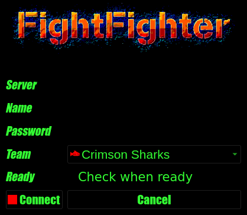

# 六、设置 Qt 应用的样式

默认情况下，很容易欣赏 Qt 轻松提供的干净、原生外观。但对于不太商业化的应用，纯灰色小部件和 bog 标准字体并不总是设置正确的基调。即使是最单调的实用程序或数据输入应用偶尔也会从添加图标或明智地调整字体以增强可用性中获益。幸运的是，Qt 的灵活性允许我们自己掌握应用的外观和感觉。

在本章中，我们将介绍以下主题：

*   使用字体、图像和图标
*   配置颜色、样式表和样式
*   创建动画

# 技术要求

在本章中，您将需要[第 1 章](01.html)、*PyQt 入门*中列出的所有要求，以及[第 4 章](04.html)、*中的 Qt 应用模板以及*中的 QMainWindow 构建应用。

此外，您可能需要使用 PNG、JPEG 或 GIF 图像文件；您可以在[处使用示例代码中包含的代码 https://github.com/PacktPublishing/Mastering-GUI-Programming-with-Python/tree/master/Chapter06](https://github.com/PacktPublishing/Mastering-GUI-Programming-with-Python/tree/master/Chapter06) 。

查看以下视频以查看代码的运行：[http://bit.ly/2M5OJj6](http://bit.ly/2M5OJj6)

# 使用字体、图像和图标

我们将通过定制应用的字体、显示一些静态图像以及包括动态图标来开始设计 Qt 应用的样式。但是，在此之前，我们需要创建一个可以使用的**图形用户界面**（**GUI**。我们将创建一个游戏大厅对话框，用于登录一个名为**战斗斗士**的虚拟多人游戏。

为此，请打开应用模板的新副本，并将以下 GUI 代码添加到`MainWindow.__init__()`：

```py
        self.setWindowTitle('Fight Fighter Game Lobby')
        cx_form = qtw.QWidget()
        self.setCentralWidget(cx_form)
        cx_form.setLayout(qtw.QFormLayout())
        heading = qtw.QLabel("Fight Fighter!")
        cx_form.layout().addRow(heading)

        inputs = {
            'Server': qtw.QLineEdit(),
            'Name': qtw.QLineEdit(),
            'Password': qtw.QLineEdit(
                echoMode=qtw.QLineEdit.Password),
            'Team': qtw.QComboBox(),
            'Ready': qtw.QCheckBox('Check when ready')
        }
        teams = ('Crimson Sharks', 'Shadow Hawks',
                  'Night Terrors', 'Blue Crew')
        inputs['Team'].addItems(teams)
        for label, widget in inputs.items():
            cx_form.layout().addRow(label, widget)
        self.submit = qtw.QPushButton(
            'Connect',
            clicked=lambda: qtw.QMessageBox.information(
                None, 'Connecting', 'Prepare for Battle!'))
        self.reset = qtw.QPushButton('Cancel', clicked=self.close)
        cx_form.layout().addRow(self.submit, self.reset)
```

这是您现在应该熟悉的相当标准的 QtGUI 代码；我们将输入放在一个`dict`对象中，并在循环中将它们添加到布局中，从而节省了几行代码，但在其他方面，这相对简单。根据您的操作系统和主题设置，该对话框可能类似于以下屏幕截图：


正如你所见，这是一个不错的形式，但它有点乏味。那么，让我们来探讨一下是否可以改进这种风格。

# 设置字体

我们要解决的第一件事是字体。每个`QWidget`类都有一个`font`属性，我们可以在构造函数中设置，也可以使用`setFont()`访问器设置。`font`的值必须是`QtGui.QFont`对象。

以下是如何创建和使用`QFont`对象：

```py
        heading_font = qtg.QFont('Impact', 32, qtg.QFont.Bold)
        heading_font.setStretch(qtg.QFont.ExtraExpanded)
        heading.setFont(heading_font)
```

一个`QFont`对象包含描述文本在屏幕上绘制方式的所有属性。构造函数可以接受以下任何参数：

*   表示字体系列的字符串
*   表示点大小的浮点或整数
*   表示重量的`QtGui.QFont.FontWeight`常数
*   指示字体是否应为斜体的布尔值

字体的其他方面，例如`stretch`属性，可以使用关键字参数或访问器方法进行配置。我们还可以创建一个没有参数的`QFont`对象，并通过编程方式对其进行配置，如下所示：

```py
        label_font = qtg.QFont()
        label_font.setFamily('Impact')
        label_font.setPointSize(14)
        label_font.setWeight(qtg.QFont.DemiBold)
        label_font.setStyle(qtg.QFont.StyleItalic)

        for inp in inputs.values():
            cx_form.layout().labelForField(inp).setFont(label_font)
```

在小部件上设置字体不仅会影响小部件，还会影响其所有子部件。因此，我们可以通过在`cx_form`上设置字体来配置整个窗体的字体，而不是在单个小部件上设置字体。

# 处理丢失的字体

现在，如果所有平台和**操作系统**（**操作系统**）都附带了无数同名字体，那么这就是您需要了解的`QFont`的全部内容。不幸的是，事实并非如此。大多数系统只有少数内置字体，其中只有少数是跨平台通用的，甚至是跨平台的不同版本。因此，Qt 有一个回退机制来处理丢失的字体。

例如，假设我们要求 Qt 使用不存在的字体系列，如下所示：

```py
        button_font = qtg.QFont(
            'Totally Nonexistant Font Family XYZ', 15.233)
```

Qt 不会在此调用中抛出错误，甚至不会注册警告。相反，在找不到请求的字体系列后，它将返回到其`defaultFamily`属性，该属性使用操作系统或桌面环境中设置的默认字体。

`QFont`对象不会告诉我们这已经发生了；如果查询信息，它只会告诉您配置了什么：

```py
        print(f'Font is {button_font.family()}')
        # Prints: "Font is Totally Nonexistent Font Family XYZ"
```

要了解实际使用的字体设置，我们需要将`QFont`对象传递给`QFontInfo`对象：

```py
        actual_font = qtg.QFontInfo(button_font).family()
        print(f'Actual font used is {actual_font}')
```

如果您运行该脚本，您将看到，很可能您的默认屏幕字体实际上正在这里使用：

```py
$ python game_lobby.py
Font is Totally Nonexistent Font Family XYZ
Actual font used is Bitstream Vera Sans
```

虽然这确保了用户不会在窗口中没有任何文本，但如果我们能够更好地了解 Qt 应该使用哪种字体，那就太好了。

我们可以通过设置字体的`styleHint`和`styleStrategy`属性来实现，如下所示：

```py
        button_font.setStyleHint(qtg.QFont.Fantasy)
        button_font.setStyleStrategy(
            qtg.QFont.PreferAntialias |
            qtg.QFont.PreferQuality
        )
```

`styleHint`为 Qt 提供了一个可依赖的通用类别，在本例中，该类别为`Fantasy`类别。此处的其他选项包括`SansSerif`、`Serif`、`TypeWriter`、`Decorative`、`Monospace`和`Cursive`。这些选项对应的内容取决于操作系统和桌面环境配置。

`styleStrategy`属性通知 Qt 更多与所选字体功能相关的技术首选项，如抗锯齿、OpenGL 兼容性，以及大小是否将精确匹配或四舍五入到最接近的非缩放大小。策略选项的完整列表可在[中找到 https://doc.qt.io/qt-5/qfont.html#StyleStrategy-枚举](https://doc.qt.io/qt-5/qfont.html#StyleStrategy-enum)。

设置这些属性后，再次检查字体以查看是否有任何更改：

```py
        actual_font = qtg.QFontInfo(button_font)
        print(f'Actual font used is {actual_font.family()}'
              f' {actual_font.pointSize()}')
        self.submit.setFont(button_font)
        self.cancel.setFont(button_font)
```

根据您的系统配置，您将看到与以前不同的结果：

```py
$ python game_lobby.py
Actual font used is Impact 15
```

在这个系统中，`Fantasy`被解释为`Impact`的意思，`PreferQuality`策略标志迫使最初奇数的 15.233 分大小成为一个漂亮的回合`15`。

此时，根据系统上可用的字体，应用应如下所示：


字体也可以与应用捆绑在一起；参见本章*使用 Qt 资源文件*一节。

# 添加图像

Qt 提供了许多与在应用中使用图像相关的类，但是，对于简单地在 GUI 中显示图片，最合适的类是`QPixmap`。`QPixmap`是一个显示优化图像类，可加载多种常用图像格式，包括 PNG、BMP、GIF 和 JPEG。

要创建一个，我们只需要传递一个图像文件的路径：

```py
        logo = qtg.QPixmap('logo.png')
```

加载后，`QPixmap`对象可以在`QLabel`或`QButton`对象中显示，如下所示：

```py
        heading.setPixmap(logo)
```

请注意，标签只能显示字符串或像素贴图，但不能同时显示两者。

`QPixmap`对象针对显示进行了优化，只提供最低限度的编辑功能；但是，我们可以进行简单的转换，例如缩放：

```py
        if logo.width() > 400:
            logo = logo.scaledToWidth(
                400, qtc.Qt.SmoothTransformation)
```

在本例中，我们使用了 pixmap 的`scaledToWidth()`方法，使用平滑变换算法将徽标的宽度限制为`400`像素。

`QPixmap`对象如此有限的原因是它们实际上存储在显示服务器的内存中。`QImage`类类似，但将数据存储在应用内存中，因此可以更广泛地对其进行编辑。我们将在[第 12 章](12.html)中进一步探讨本课程，使用 QPaint 创建*2D 图形。*

`QPixmap`还提供了生成简单彩色矩形的便捷功能，如下所示：

```py
        go_pixmap = qtg.QPixmap(qtc.QSize(32, 32))
        stop_pixmap = qtg.QPixmap(qtc.QSize(32, 32))
        go_pixmap.fill(qtg.QColor('green'))
        stop_pixmap.fill(qtg.QColor('red'))
```

通过在构造函数中指定大小并使用`fill()`方法，我们可以创建一个简单的彩色矩形 pixmap。这对于显示色样或用作快速脏图像替代非常有用。

# 使用图标

现在考虑工具栏或程序菜单上的图标。当菜单项被禁用时，您希望图标以某种方式变灰。同样，如果用户使用鼠标光标将鼠标悬停在按钮或项目上，您可能希望它高亮显示。为了封装这种依赖于状态的图像显示，Qt 提供了`QIcon`类。`QIcon`对象包含一组映射到小部件状态的 pixmaps。

以下是如何创建`QIcon`对象：

```py
        connect_icon = qtg.QIcon()
        connect_icon.addPixmap(go_pixmap, qtg.QIcon.Active)
        connect_icon.addPixmap(stop_pixmap, qtg.QIcon.Disabled)
```

创建图标对象后，我们使用其`addPixmap()`方法将`QPixmap`对象分配给小部件状态。这些状态包括`Normal`、`Active`、`Disabled`和`Selected`。

`connect_icon`图标现在在禁用时为红色方块，在启用时为绿色方块。让我们将其添加到提交按钮，并添加一些逻辑来切换按钮的状态：

```py
        self.submit.setIcon(connect_icon)
        self.submit.setDisabled(True)
        inputs['Server'].textChanged.connect(
            lambda x: self.submit.setDisabled(x == '')
        )
```

如果此时运行脚本，您将看到在提交按钮中出现红方块，直到`Server`字段包含数据，此时它会自动切换为绿色。注意，我们不必告诉图标对象本身切换状态；一旦分配给小部件，它将跟踪小部件状态的任何更改。

图标可以与`QPushButton`、`QToolButton`和`QAction`对象一起使用；`QComboBox`、`QListView`、`QTableView`和`QTreeView`项目；以及大多数其他你有理由期望有图标的地方。

# 使用 Qt 资源文件

在程序中使用图像文件的一个重要问题是确保程序能够在运行时找到它们。传递到`QPixmap`构造函数或`QIcon`构造函数的路径被解释为绝对路径（即，如果它们以驱动器号或路径分隔符开头），或相对于当前工作目录（您无法控制）。例如，尝试从代码目录以外的其他位置运行脚本，如下所示：

```py
$ cd ..
$ python ch05/game_lobby.py
```

你会发现你的照片都不见了！`QPixmap`在找不到文件时不会抱怨，只是没有显示任何内容。如果没有图像的绝对路径，则只有在脚本从路径相对的确切目录运行时，才能找到图像。

不幸的是，指定绝对路径意味着您的程序只能在文件系统上的一个位置工作，如果您计划将其分发到多个平台，这是一个主要问题。

PyQt 以**PyQt 资源文件**的形式为我们提供了解决此问题的方法，我们可以使用**PyQt 资源编译器**工具创建该文件。基本程序如下：

1.  编写一个 XML 格式的**Qt 资源集合**文件（`.qrc`，其中包含我们想要包含的所有文件的路径
2.  运行`pyrcc5`工具将这些文件序列化并压缩为 Python 模块中包含的数据
3.  将生成的 Python 模块导入到我们的应用脚本中
4.  现在我们可以使用一种特殊的语法来引用我们的资源

让我们逐步完成这个过程，假设我们有一些 PNG 格式的团队徽章，我们希望将其包含在我们的程序中。我们的第一步是创建`resources.qrc`文件，它看起来像下面的代码块：

```py
<RCC>
  <qresource prefix="teams">
    <file>crimson_sharks.png</file>
    <file>shadow_hawks.png</file>
    <file>night_terrors.png</file>
    <file alias="blue_crew.png">blue_crew2.png</file>
  </qresource>
</RCC>
```

我们已将此文件与脚本中列出的图像文件放在同一目录中。请注意，我们添加了一个`prefix`值`teams`。前缀允许您将资源组织到类别中。此外，请注意，最后一个文件指定了一个别名。在我们的程序中，我们可以使用此别名而不是文件的实际名称来访问此资源。

现在，在命令行中，我们将运行`pyrcc5`，如下所示：

```py
$ pyrcc5 -o resources.py resources.qrc
```

这里的语法是`pyrcc5 -o outputFile.py inputFile.qrc`。此命令应生成包含资源数据的 Python 文件。如果您花点时间打开文件并检查它，您会发现它主要只是分配给`qt_resource_data`变量的一个大`bytes`对象。

回到主脚本中，我们只需要以与任何其他 Python 文件相同的方式导入此文件：

```py
import resources
```

该文件不必被称为`resources.py`；事实上，任何名字都可以。您只需要导入它，文件中的代码将确保 Qt 可以使用这些资源。

现在导入了资源文件，我们可以使用资源语法指定 pixmap 路径：

```py
        inputs['Team'].setItemIcon(
            0, qtg.QIcon(':/teams/crimson_sharks.png'))
        inputs['Team'].setItemIcon(
            1, qtg.QIcon(':/teams/shadow_hawks.png'))
        inputs['Team'].setItemIcon(
            2, qtg.QIcon(':/teams/night_terrors.png'))
        inputs['Team'].setItemIcon(
            3, qtg.QIcon(':/teams/blue_crew.png'))
```

本质上，语法是`:/prefix/file_name_or_alias.extension`。

因为我们的数据存储在 Python 文件中，所以我们可以将其放在 Python 库中，它将使用 Python 的标准导入解析规则来定位该文件。

# Qt 资源文件和字体

资源文件不限于图像；事实上，它们可以用于包含几乎任何类型的二进制文件，包括字体文件。例如，假设我们希望在程序中包含我们最喜欢的字体，以确保它在所有平台上都正确显示。

与图像一样，我们首先在`.qrc`文件中包含字体文件：

```py
<RCC>
  <qresource prefix="teams">
    <file>crimson_sharks.png</file>
    <file>shadow_hawks.png</file>
    <file>night_terrors.png</file>
    <file>blue_crew.png</file>
  </qresource>
  <qresource prefix="fonts">
    <file>LiberationSans-Regular.ttf</file>
  </qresource>
</RCC>
```

在这里，我们添加了一个前缀`fonts`，并包含了对`LiberationSans-Regular.ttf`文件的引用。对该文件运行`pyrcc5`后，字体被绑定到我们的`resources.py`文件中。

要在代码中使用此字体，我们首先将其添加到字体数据库中，如下所示：

```py
        libsans_id = qtg.QFontDatabase.addApplicationFont(
            ':/fonts/LiberationSans-Regular.ttf')
```

`QFontDatabase.addApplicationFont()`将传递的字体文件插入应用的字体数据库，并返回 ID 号。然后，我们可以使用该 ID 号来确定字体的系列字符串；可以传递给`QFont`，如下所示：

```py
        family = qtg.QFontDatabase.applicationFontFamilies(libsans_id)[0]
        libsans = qtg.QFont(family)
        inputs['Team'].setFont(libsans)
```

在将字体与应用一起分发之前，请确保检查字体上的许可证！请记住，并非所有字体都可以自由重新分发。

我们的状态看起来更像现在的比赛；运行该应用，其外观应类似于以下屏幕截图：


# 配置颜色、样式表和样式

字体和图标已经改善了我们窗体的外观，但是现在是时候抛弃那些制度性的灰色色调，用一些颜色来代替它们了。在本节中，我们将介绍 Qt 为定制应用颜色提供的三种不同方法：操作**调色板**、使用**样式表**和覆盖**应用样式**。

# 使用调色板自定义颜色

由`QPalette`类表示的调色板是映射到颜色角色和颜色组的颜色和笔刷的集合。

让我们解开这句话：

*   这里，**颜色**是文字颜色值，由`QColor`对象表示
*   **画笔**将特定颜色与样式（如图案、渐变或纹理）相结合，并由`QBrush`类表示
*   **颜色角色**表示小部件使用颜色的方式，例如在前景、背景或边框中
*   **颜色组**表示小部件的交互状态；可以是`Normal`、`Active`、`Disabled`或`Inactive`

当在屏幕上绘制小部件时，Qt 的绘制系统会参考调色板来确定用于渲染每个小部件的颜色和笔刷。要定制它，我们可以创建自己的调色板并将其分配给小部件。

首先，我们需要得到一个`QPalette`对象，如下所示：

```py
        app = qtw.QApplication.instance()
        palette = app.palette()
```

虽然我们可以直接创建一个`QPalette`对象，但 Qt 文档建议我们在运行的`QApplication`实例上调用`palette()`来检索当前配置样式的调色板副本。

您随时可以通过调用`QApplication.instance()`来检索您的`QApplication`对象的副本。

现在我们有了调色板，让我们开始覆盖一些规则：

```py
        palette.setColor(
            qtg.QPalette.Button,
            qtg.QColor('#333')
        )
        palette.setColor(
            qtg.QPalette.ButtonText,
            qtg.QColor('#3F3')
        )
```

`QtGui.QPalette.Button`和`QtGui.QPalette.ButtonText`是颜色角色常量，正如您可能猜到的，它们分别代表所有 Qt 按钮类的背景色和前景色。我们正在用新的颜色覆盖它们。

要覆盖特定按钮状态的颜色，我们需要传入一个颜色组常量作为第一个参数：

```py
        palette.setColor(
            qtg.QPalette.Disabled,
            qtg.QPalette.ButtonText,
            qtg.QColor('#F88')
        )
        palette.setColor(
            qtg.QPalette.Disabled,
            qtg.QPalette.Button,
            qtg.QColor('#888')
        )
```

在本例中，我们正在更改按钮处于`Disabled`状态时使用的颜色。

要应用此新调色板，我们必须将其分配给小部件，如下所示：

```py
        self.submit.setPalette(palette)
        self.cancel.setPalette(palette)
```

`setPalette()`将提供的调色板分配给小部件以及所有子小部件。因此，我们可以创建一个调色板并将其分配给`QMainWindow`类，从而将其应用于所有对象，而不是将其分配给单个小部件。

# 使用 QBrush 对象

如果我们想要比纯色更华丽的东西，那么我们可以使用`QBrush`物体。笔刷能够在图案、渐变或纹理（即基于图像的图案）中填充颜色。

例如，让我们创建一个绘制白色点画填充的笔刷：

```py
        dotted_brush = qtg.QBrush(
            qtg.QColor('white'), qtc.Qt.Dense2Pattern)
```

`Dense2Pattern`是 15 种可用模式之一。（您可以参考[https://doc.qt.io/qt-5/qt.html#BrushStyle-枚举](https://doc.qt.io/qt-5/qt.html#BrushStyle-enum)获取完整列表。）其中大多数是不同程度的点画、交叉阴影或交替线条图案。

图案有其用途，但基于渐变的笔刷对于现代造型可能更有趣。但是，创建一个更复杂，如以下代码所示：

```py
        gradient = qtg.QLinearGradient(0, 0, self.width(), self.height())
        gradient.setColorAt(0, qtg.QColor('navy'))
        gradient.setColorAt(0.5, qtg.QColor('darkred'))
        gradient.setColorAt(1, qtg.QColor('orange'))
        gradient_brush = qtg.QBrush(gradient)
```

要在画笔中使用渐变，首先必须创建渐变对象。在这里，我们创建了一个`QLinearGradient`对象，它实现了一个基本的线性渐变。参数是渐变的开始和结束坐标，我们将其指定为主窗口的左上角（0，0）和右下角（宽度，高度）。

Qt 还提供了`QRadialGradient`和`QConicalGradient`类的附加渐变选项。

创建对象后，我们使用`setColorAt()`指定颜色停止。第一个参数是一个介于 0 和 1 之间的浮点值，用于指定开始和结束之间的百分比，第二个参数是渐变应位于该点的`QColor`对象。

创建渐变后，我们将其传递给`QBrush`构造函数，以创建一个使用渐变绘制的笔刷。

我们现在可以使用`setBrush()`方法将画笔应用于调色板，如下所示：

```py
        window_palette = app.palette()
        window_palette.setBrush(
            qtg.QPalette.Window,
            gradient_brush
        )
        window_palette.setBrush(
            qtg.QPalette.Active,
            qtg.QPalette.WindowText,
            dotted_brush
        )
        self.setPalette(window_palette)
```

与`QPalette.setColor()`一样，我们可以指定画笔，指定或不指定特定的颜色组。在这种情况下，无论主窗口的状态如何，我们的渐变笔刷都将用于绘制主窗口，但我们的虚线笔刷将仅在小部件处于活动状态（即当前活动窗口）时使用。

# 使用 Qt 样式表（QS）自定义外观

对于使用过 web 技术的开发人员来说，使用调色板、画笔和颜色对象设计应用的样式可能显得冗长而不直观。幸运的是，Qt 为您提供了一种称为 QSS 的替代方案，它与 web 开发中使用的**级联样式表**（**CSS**）非常相似。这是一种将一些简单的更改应用于我们的小部件的简单方法。

您可以按如下方式使用 QS：

```py
        stylesheet = """
        QMainWindow {
            background-color: black;
        }
        QWidget {
            background-color: transparent;
            color: #3F3;
        }
        QLineEdit, QComboBox, QCheckBox {
            font-size: 16pt;
        }"""
        self.setStyleSheet(stylesheet)
```

在这里，样式表只是一个包含样式指令的字符串，我们可以将其分配给小部件的`styleSheet`属性。

任何使用过 CSS 的人都应该熟悉以下语法：

```py
WidgetClass {
    property-name: value;
    property-name2: value2;
}
```

如果此时运行该程序，您会发现（取决于您的系统主题），它可能类似于以下屏幕截图：



在这里，除了文本和图像，界面大部分都变黑了。特别是我们的按钮和复选框，与背景无法区分。那么，为什么会发生这种情况？

好的，当您将 QSS 样式添加到一个小部件类中时，样式更改会一直延续到它的所有子类。由于我们采用了`QWidget`样式，所以所有其他`QWidget`派生类（如`QCheckbox`和`QPushButton`都继承了这种样式。

让我们通过覆盖这些子类的样式来解决这个问题，如下所示：

```py
        stylesheet += """
        QPushButton {
            background-color: #333;
        }
        QCheckBox::indicator:unchecked {
            border: 1px solid silver;
            background-color: darkred;
        }
        QCheckBox::indicator:checked {
            border: 1px solid silver;
            background-color: #3F3;
        }
        """
        self.setStyleSheet(stylesheet)
```

与 CSS 一样，将样式应用于更具体的类会覆盖更一般的情况。例如，我们的`QPushButton`背景色覆盖`QWidget`背景色。

注意，冒号与`QCheckBox`一起使用——QSS 中的双冒号允许我们引用小部件的子元素。在这种情况下，这是`QCheckBox`类的指示符部分（与其标签部分相反）。我们还可以使用一个冒号来引用小部件状态，因为在本例中，我们根据复选框是否被选中来设置不同的样式。

如果您只想将更改限制为特定类而不是其任何子类，只需在名称中添加句点（`.`，如下所示：

```py
        stylesheet += """
        .QWidget {
           background: url(tile.png);
        }
        """
```

前面的示例还演示了如何在 QS 中使用图像。就像在 CSS 中一样，我们可以提供一个包装在`url()`函数中的文件路径。

如果您已使用`pyrcc5`序列化图像，QSS 也会接受资源路径。

如果您想将一种样式应用于某个特定的小部件，而不是整个小部件类，那么有两种方法可以实现。

第一种方法是依赖`objectName`属性，如下所示：

```py
        self.submit.setObjectName('SubmitButton')
        stylesheet += """
        #SubmitButton:disabled {
            background-color: #888;
            color: darkred;
        }
        """
```

在我们的样式表中，对象名称前面必须有

`#`将其标识为对象名而不是类的符号。

在单个小部件上设置样式的另一种方法是调用 t

他使用小部件的`setStyleSheet()`方法和一些样式表指令，如下所示：

```py
        for inp in ('Server', 'Name', 'Password'):
            inp_widget = inputs[inp]
            inp_widget.setStyleSheet('background-color: black')
```

如果我们想将样式直接应用到我们正在调用的小部件，我们不需要指定类名或对象名；我们可以简单地传入属性和值。

进行了所有这些更改后，我们的应用现在看起来更像一个游戏 GUI：


# QSS 的缺点

如您所见，QSS 是一种非常强大的样式化方法，任何从事过 web 开发的开发人员都可以使用它；然而，它确实有一些缺点。

QSS 是调色板和样式对象的抽象，必须转换为实际系统。这使得大型应用的速度变慢，也意味着没有可以检索和编辑的默认样式表——每次都是从头开始。

正如我们已经看到的，QS 应用于高级小部件时可能会产生不可预测的结果，因为它是通过类层次结构继承的。

最后，请记住，QSS 是 CSS 2.0 的一个适度子集，它有一些添加或更改，而不是 CSS。因此，过渡、动画、flexbox 容器、相对单位和其他现代 CSS 产品完全不存在。因此，虽然 web 开发人员可能会发现其基本语法很熟悉，但有限的选项集可能令人沮丧，其不同的行为令人困惑。

# 使用 QStyle 自定义外观

选项板和样式表在定制 Qt 应用的外观方面可能需要很长的路要走，在大多数情况下，这就是您所需要的。要真正深入了解 Qt 应用外观的核心，我们需要了解样式系统。

Qt 应用的每个运行实例都有一个样式，负责告诉图形系统如何绘制每个小部件或 GUI 组件。样式是动态的和可插入的，因此不同的操作系统平台具有不同的样式，用户可以安装自己的 Qt 样式以在 Qt 应用中使用。这就是 Qt 应用在不同操作系统上具有本机外观的方式。

在[第 1 章](01.html)*PyQt 入门*中，我们了解到`QApplication`在创建时应该传递一份`sys.argv`副本，以便它可以处理一些特定于 Qt 的参数。其中一个参数是`-style`，它允许用户为其 Qt 应用设置自定义样式。

例如，让我们运行[第 3 章](03.html)中的日历应用，*使用信号和插槽处理事件，*使用`Windows`样式：

```py
$ python3 calendar_app.py -style Windows
```

现在使用`Fusion`样式进行尝试，如下所示：

```py
$ python3 calendar_app.py -style Fusion
```

请注意外观上的差异，尤其是在输入控件中。

大写与样式有关；**windows**不是有效样式，而**windows**是！

下表显示了常见操作系统平台上可用的样式：

| 操作系统 | 风格 |
| --- | --- |
| 视窗 10 | `windowsvista`、`Windows`和`Fusion` |
| 马科斯 | `macintosh`、`Windows`和`Fusion` |
| Ubuntu 18.04 | `Windows`和`Fusion` |

在许多 Linux 发行版上，可以从软件包存储库中获得其他 Qt 样式。可通过调用`QtWidgets.QStyleFactory.keys()`获取当前安装的样式列表。

样式也可以在应用内部设置。为了检索样式类，我们需要使用`QStyleFactory`类，如下所示：

```py
if __name__ == '__main__':
    app = qtw.QApplication(sys.argv)
    windows_style = qtw.QStyleFactory.create('Windows')
    app.setStyle(windows_style)
```

`QStyleFactory.create()`将尝试查找具有给定名称的已安装样式并返回`QCommonStyle`对象；如果找不到请求的样式，则返回`None`。然后可以使用样式对象设置我们的`QApplication`对象的`style`属性。（值为`None`只会导致它使用默认值。）

如果您计划在应用内部设置样式，最好在绘制任何小部件之前尽早设置，以避免出现视觉故障。

# 定制 Qt 样式

构建 Qt 风格是一个复杂的过程，需要深入理解 Qt 的小部件和绘制系统，很少有开发人员需要创建一个。然而，我们可能希望覆盖运行样式的某些方面，以完成一些通过操纵调色板或样式表无法完成的事情。我们可以通过子类化`QtWidgets.QProxyStyle`来实现这一点。

代理样式是一种覆盖，我们可以使用它覆盖正在运行的实际样式的方法。这样，不管用户选择什么样的实际样式，都将使用代理样式的方法（在实现的地方）。

例如，让我们创建一个代理样式，强制所有屏幕文本为大写，如下所示：

```py
class StyleOverrides(qtw.QProxyStyle):

    def drawItemText(
        self, painter, rect,
        flags, palette, enabled,
        text, textRole
    ):
        """Force uppercase in all text"""
        text = text.upper()
        super().drawItemText(
            painter, rect, flags,
            palette, enabled, text,
            textRole
        )
```

`drawItemText()`是在必须将文本绘制到屏幕时在样式上调用的方法。它接收许多参数，但我们最关心的是要绘制的`text`参数。我们将截取这段文字，并在将所有参数传递回`super().drawTextItem()`之前将其大写。

该代理样式可以像其他样式一样应用于我们的`QApplication`对象：

```py
if __name__ == '__main__':
    app = qtw.QApplication(sys.argv)
    proxy_style= StyleOverrides()
    app.setStyle(proxy_style)
```

如果此时运行程序，您将看到所有文本现在都是大写的。任务完成了！

# 绘图小部件

现在让我们尝试一些更具雄心的东西。让我们将所有`QLineEdit`输入框更改为绿色圆形矩形轮廓。那么，我们如何以代理方式进行这项工作呢？

第一步是找出我们试图修改的小部件的哪个元素。这些可以作为`QStyle`类的枚举常量找到，它们分为三个主要类：

*   `PrimitiveElement`，包括基本的非交互 GUI 元素，如框架或背景
*   `ControlElement`，包括按钮或标签等交互元素
*   `ComplexControl`，包括组合框、滑块等复杂的交互元素

每一类项目均采用不同的方法`QStyle`绘制；在本例中，我们需要修改`PE_FrameLineEdit`元素，它是一个基本元素（如`PE_`前缀所示）。这种类型的元素由`QStyle.drawPrimitive()`绘制，因此我们需要在代理样式中重写该方法。

将此方法添加到`StyleOverrides`中，如下所示：

```py
    def drawPrimitive(
        self, element, option, painter, widget
    ):
        """Outline QLineEdits in Green"""
```

要控制元素的绘图，我们需要向其`painter`对象发出命令，如下所示：

```py
        self.green_pen = qtg.QPen(qtg.QColor('green'))
        self.green_pen.setWidth(4)
        if element == qtw.QStyle.PE_FrameLineEdit:
            painter.setPen(self.green_pen)
            painter.drawRoundedRect(widget.rect(), 10, 10)
        else:
            super().drawPrimitive(element, option, painter, widget)
```

画师对象和绘图将在[第 12 章](12.html)*使用 QPainter 创建 2D 图形*中全面介绍，但现在，请理解，如果`element`参数与`QStyle.PE_FrameLineEdit`匹配，前面的代码将绘制一个绿色圆角矩形。否则，它会将参数传递给超类的`drawPrimitive()`方法。

请注意，在绘制矩形后，我们不会调用超类方法。如果我们这样做了，那么超类将在绿色矩形的顶部绘制其样式定义的小部件元素。

正如您在本例中所看到的，虽然使用`QProxyStyle`比使用调色板或样式表要复杂得多，但它确实让我们几乎可以无限地控制小部件的显示方式。

无论您是使用 QS 还是使用样式和选项板来重新设置应用的样式；但是，强烈建议您坚持其中一种。否则，样式修改可能会相互冲突，并在不同平台和桌面设置之间产生不可预测的结果。

# 创建动画

没有什么比动画片的雅致使用更能为 GUI 增添复杂的优势了。动态 GUI 元素在颜色、大小或位置变化之间平滑褪色，可以为任何界面添加现代感。

Qt 的动画框架允许我们使用`QPropertyAnimation`类在我们的小部件上创建简单的动画。在这一节中，我们将探索如何使用这个类来为游戏大厅添加一些动画。

由于 Qt 样式表覆盖了另一个基于小部件和调色板的样式，因此需要注释掉所有样式表代码，这些动画才能正常工作。

# 基本属性动画

一个`QPropertyAnimation`对象用于为小部件的单个 Qt 属性设置动画。该类自动在两个数值特性值之间创建一系列插值步骤，并随时间应用更改。

例如，让我们设置徽标的动画，使其从左向右滚动。可以从添加特性动画对象开始，如下所示：

```py
        self.heading_animation = qtc.QPropertyAnimation(
            heading, b'maximumSize')
```

`QPropertyAnimation`需要两个参数：要设置动画的小部件（或其他类型的`QObject`类）和指示要设置动画的属性的`bytes`对象（请注意，这是一个`bytes`对象，而不是字符串）。

接下来，我们需要按如下方式配置动画对象：

```py
        self.heading_animation.setStartValue(qtc.QSize(10, logo.height()))
        self.heading_animation.setEndValue(qtc.QSize(400, logo.height()))
        self.heading_animation.setDuration(2000)
```

至少，我们需要为属性设置一个`startValue`值和一个`endValue`值。当然，这些值必须是属性所需的数据类型。我们也可以以毫秒为单位设置`duration`（默认为 250）。

一旦配置好，我们只需要告诉动画开始，如下所示：

```py
        self.heading_animation.start()
```

有一些要求限制了`QPropertyAnimation`对象的功能：

*   要设置动画的对象必须是`QObject`子类。这包括所有小部件，但不包括一些 Qt 类，如`QPalette`。
*   要设置动画的属性必须是 Qt 属性（而不仅仅是 Python 成员变量）。
*   属性必须具有只需要单个值的读写访问器方法。例如，`QWidget.size`可以设置动画，但`QWidget.width`不能，因为没有`setWidth()`方法。
*   属性值必须是以下类型之一：`int`、`float`、`QLine`、`QLineF`、`QPoint`、`QPointF`、`QSize`、`QSizeF`、`QRect`、`QRectF`或`QColor`。

不幸的是，对于大多数小部件来说，这些限制排除了一些我们可能想要设置动画的方面，特别是颜色。幸运的是，我们可以解决这个问题。

# 设置颜色动画

正如您在本章前面所了解的，小部件颜色不是小部件的属性，而是调色板的属性。调色板无法设置动画，因为`QPalette`不是`QObject`的子类，而且`setColor()`需要的不仅仅是一个值。

然而，颜色是我们想要动画化的东西；为了实现这一点，我们需要将我们的小部件子类化，并将其颜色设置为 Qt 属性。

让我们用一个按钮；在脚本顶部启动一个新类，如下所示：

```py
class ColorButton(qtw.QPushButton):

    def _color(self):
        return self.palette().color(qtg.QPalette.ButtonText)

    def _setColor(self, qcolor):
        palette = self.palette()
        palette.setColor(qtg.QPalette.ButtonText, qcolor)
        self.setPalette(palette)
```

在这里，我们有一个`QPushButton`子类，其中包含调色板`ButtonText`颜色的访问器方法。但是，请注意，这些是 Python 方法；为了给这个属性设置动画，我们需要`color`是一个实际的 Qt 属性。为了纠正这个问题，我们将使用`QtCore.pyqtProperty()`函数包装访问器方法，并在底层 Qt 对象上创建一个属性。

您可以按如下方式执行此操作：

```py
    color = qtc.pyqtProperty(qtg.QColor, _color, _setColor)
```

我们使用的属性名称将是 Qt 属性的名称。传递的第一个参数是属性所需的数据类型，接下来的两个参数是 getter 和 setter 方法。

`pyqtProperty()`也可以用作装饰，如下所示：

```py
    @qtc.pyqtProperty(qtg.QColor)
    def backgroundColor(self):
        return self.palette().color(qtg.QPalette.Button)

    @backgroundColor.setter
    def backgroundColor(self, qcolor):
        palette = self.palette()
        palette.setColor(qtg.QPalette.Button, qcolor)
        self.setPalette(palette)
```

注意，在这种方法中，两个方法必须使用我们要创建的属性名进行相同的命名。

现在我们的属性已经就位，我们需要将常规的`QPushButton`对象替换为`ColorButton`对象：

```py
        # Replace these definitions
        # at the top of the MainWindow constructor
        self.submit = ColorButton(
            'Connect',
            clicked=lambda: qtw.QMessageBox.information(
                None,
                'Connecting',
                'Prepare for Battle!'))
        self.cancel = ColorButton(
            'Cancel',
            clicked=self.close)
```

通过这些更改，我们可以设置颜色值的动画，如下所示：

```py
        self.text_color_animation = qtc.QPropertyAnimation(
            self.submit, b'color')
        self.text_color_animation.setStartValue(qtg.QColor('#FFF'))
        self.text_color_animation.setEndValue(qtg.QColor('#888'))
        self.text_color_animation.setLoopCount(-1)
        self.text_color_animation.setEasingCurve(
            qtc.QEasingCurve.InOutQuad)
        self.text_color_animation.setDuration(2000)
        self.text_color_animation.start()
```

这很有魅力。我们还在此处添加了两个附加配置设置：

*   `setLoopCount()`将设置动画重新启动的次数。`-1`的值将使其永远循环。
*   `setEasingCurve()`更改沿其插值的曲线。我们选择了`InOutQuad`，这会减慢动画的开始和结束速度。

现在，当您运行脚本时，请注意颜色从白色逐渐变为灰色，然后立即循环回白色。如果我们希望动画从一个值移动到另一个值，然后平滑地再次返回，我们可以使用 AUTYT0ED 方法在动画的中间放置一个值：

```py
        self.bg_color_animation = qtc.QPropertyAnimation(
            self.submit, b'backgroundColor')
        self.bg_color_animation.setStartValue(qtg.QColor('#000'))
        self.bg_color_animation.setKeyValueAt(0.5, qtg.QColor('darkred'))
        self.bg_color_animation.setEndValue(qtg.QColor('#000'))
        self.bg_color_animation.setLoopCount(-1)
        self.bg_color_animation.setDuration(1500)
```

在本例中，我们的“开始”和“结束”值是相同的，并且我们已将 0.5（动画的 50%）的值添加到第二种颜色。此动画将从黑色淡入深红色，然后再次淡出。您可以根据需要添加任意多的键值，并制作相当复杂的动画。

# 使用动画组

当我们向 GUI 添加越来越多的动画时，我们可能会发现有必要将它们分组，以便我们可以将动画作为一个组进行控制。这可以使用动画组类`QParallelAnimationGroup`和`QSequentialAnimationGroup`来完成。

这两个类都允许我们向组中添加多个动画，并作为一个组启动、停止、暂停和恢复动画。

例如，让我们将按钮动画分组如下：

```py
        self.button_animations = qtc.QParallelAnimationGroup()
        self.button_animations.addAnimation(self.text_color_animation)
        self.button_animations.addAnimation(self.bg_color_animation)
```

无论何时调用`QParallelAnimationGroup`的`start()`方法，都会并行播放所有动画。相反，`QSequentialAnimationGroup`将按照添加的顺序一次播放一个动画，如下代码块所示：

```py
        self.all_animations = qtc.QSequentialAnimationGroup()
        self.all_animations.addAnimation(self.heading_animation)
        self.all_animations.addAnimation(self.button_animations)
        self.all_animations.start()
```

通过将动画组添加到其他动画组（如我们在此处所做的），我们可以将复杂的动画编排到一个对象中，该对象可以同时启动、停止或暂停。

注释掉所有其他动画`start()`调用并启动脚本。请注意，按钮动画仅在标题动画完成后开始。

我们将在*第 12 章*中探讨`QPropertyAnimation`的更多用法，*二维图形与 QPainter*的关系。

# 总结

在本章中，我们学习了如何定制 PyQt 应用的外观。我们还学习了如何操作屏幕字体和添加图像。此外，我们还学习了如何以能够适应路径更改的方式打包图像和字体资源。我们还探讨了如何使用调色板和样式表更改应用的颜色和外观，以及如何覆盖样式方法以实现几乎无限的样式更改。最后，我们使用 Qt 的动画框架探索了小部件动画，并学习了如何将自定义 Qt 属性添加到我们的类中，以便我们可以为它们设置动画。

在下一章中，我们将使用`QtMultimedia`库探索多媒体应用的世界。您将学习如何使用相机拍摄照片和视频，如何显示视频内容，以及如何录制和播放音频。

# 问题

尝试以下问题来测试您在本章中的知识：

1.  您正准备分发文本编辑器应用，并希望确保用户在默认情况下使用单间距字体，无论他们使用什么平台。您可以使用哪两种方法来完成此任务？
2.  尽可能地使用`QFont`模仿以下文本：


3.  你能解释一下`QImage`、`QPixmap`和`QIcon`之间的区别吗？
4.  您已经为应用定义了以下`.qrc`文件，运行`pyrcc5`，并在脚本中导入了资源库。您将如何将此图像加载到`QPixmap`中？

```py
   <RCC>
      <qresource prefix="foodItems">
        <file alias="pancakes.png">pc_img.45234.png</file>
      </qresource>
   </RCC>
```

5.  使用`QPalette`时，您将如何使用`tile.png`图像平铺`QWidget`对象的背景？
6.  您正试图使用 QSS 使删除按钮变成粉红色，但它不起作用。你的代码有什么问题？

```py
   deleteButton = qtw.QPushButton('Delete')
   form.layout().addWidget(deleteButton)
   form.setStyleSheet(
      form.styleSheet() + 'deleteButton{ background-color: #8F8; }'
   )
```

7.  哪个样式表字符串会将`QLineEdit`小部件的背景色变为黑色？

```py
   stylesheet1 = "QWidget {background-color: black;}"
   stylesheet2 = ".QWidget {background-color: black;}"
```

8.  构建一个带有组合框的简单应用，该组合框允许您将 Qt 样式更改为系统上安装的任何样式。包括一些其他小部件，以便您可以看到它们在不同样式中的外观。
9.  您对学习如何设计 PyQt 应用感到非常高兴，并希望创建一个`QProxyStyle`类，该类将强制 GUI 中的所有 pixmaps 成为`smile.gif`。你会怎么做？提示：您需要研究`QStyle`的一些其他绘图方法，而不是本章中讨论的方法。
10.  以下动画不起作用；找出它不起作用的原因：

```py
    class MyWidget(qtw.QWidget):
        def __init__(self):
            super().__init__()
            animation = qtc.QPropertyAnimation(
                self, b'windowOpacity')
            animation.setStartValue(0)
            animation.setEndValue(1)
            animation.setDuration(10000)
            animation.start()
```

# 进一步阅读

有关更多信息，请参阅以下内容：

*   有关字体解析方式的详细说明，请参见[的`QFont`文档 https://doc.qt.io/qt-5/qfont.html#details](https://doc.qt.io/qt-5/qfont.html#details)
*   C++中的 QT 样式示例 https://doc.qt.io/qt-5/qtwidgets-widgets-styles-example.html 演示如何创建全面的 Qt 代理样式
*   [的 Qt 动画框架概述 https://doc.qt.io/qt-5/animation-overview.html](https://doc.qt.io/qt-5/animation-overview.html) 提供了有关如何使用属性动画及其限制的其他详细信息