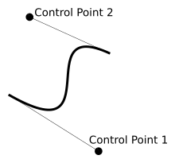
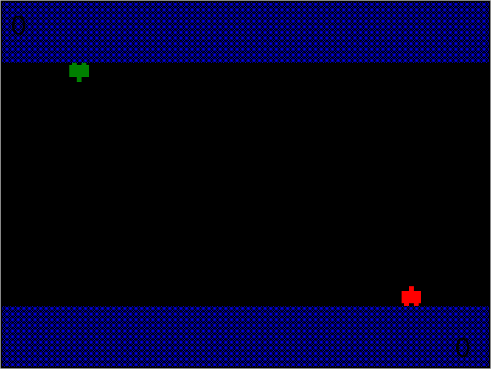

# 使用 QPaint 创建二维图形

我们已经看到，Qt 提供了大量具有广泛样式和定制功能的小部件。然而，有时我们需要直接控制屏幕上绘制的内容；例如，我们可能想要编辑一个图像，创建一个独特的小部件，或者构建一个交互式动画。Qt 中所有这些任务的核心是一个谦逊、勤奋的对象，称为`QPainter`。

在本章中，我们将分三部分探讨 Qt 的**二维**（**二维**）图形功能：

*   使用`QPainter`进行图像编辑
*   带有`QPainter`的自定义小部件
*   使用`QGraphicsScene`设置二维图形动画

# 技术要求

本章要求您在本书中一直使用的基本 Python 和 PyQt5 设置。您也可以从[下载示例代码 https://github.com/PacktPublishing/Mastering-GUI-Programming-with-Python/tree/master/Chapter12](https://github.com/PacktPublishing/Mastering-GUI-Programming-with-Python/tree/master/Chapter12) 。

您还需要`psutil`库，可以使用以下命令从 PyPI 安装该库：

```py
$ pip install --user psutil
```

最后，手头上有一些图像可以用于示例数据，这将很有帮助。

查看以下视频以查看代码的运行：[http://bit.ly/2M5xzlL](http://bit.ly/2M5xzlL)

# 使用 QPainter 进行图像编辑

可以使用`QPainter`对象在`QImage`对象上绘制，在 Qt 中编辑图像。在[第 6 章](06.html)中*设计 Qt 应用程序的样式*中，您了解了`QPixmap`对象，这是一个表示图形图像的显示优化对象。`QImage`对象是一个类似的对象，它优化为编辑而不是显示。为了演示如何使用`QPainter`绘制`QImage`对象，我们将构建一个经典的 meme 生成器应用程序。

# 模因生成器 GUI

从[第 4 章](04.html)、*使用 QMainWindow 构建应用程序、*创建一份 Qt 应用程序模板副本，并将其命名为`meme_gen.py`。我们将首先为 meme 生成器构建 GUI 表单。

# 编辑表格

在创建实际表单之前，我们将通过创建一些自定义按钮类来稍微简化代码：用于设置颜色的`ColorButton`类、用于设置字体的`FontButton`类和用于选择图像的`ImageFileButton`类。

`ColorButton`课程开始时是这样的：

```py
class ColorButton(qtw.QPushButton):

   changed = qtc.pyqtSignal()

    def __init__(self, default_color, changed=None):
        super().__init__()
        self.set_color(qtg.QColor(default_color))
        self.clicked.connect(self.on_click)
        if changed:
            self.changed.connect(changed)
```

此按钮继承了`QPushButton`，但做了一些更改。我们定义了一个`changed`信号来跟踪按钮值的变化，并添加了一个关键字选项，以便可以使用关键字连接该信号，就像内置信号一样。

我们还添加了指定默认颜色的功能，该颜色将传递给`set_color`方法：

```py
    def set_color(self, color):
        self._color = color
        pixmap = qtg.QPixmap(32, 32)
        pixmap.fill(self._color)
        self.setIcon(qtg.QIcon(pixmap))
```

此方法将传递的颜色值存储在实例变量中，然后生成给定颜色的`pixmap`对象，用作按钮图标（我们在[第 6 章](06.html)、*样式化 Qt 应用程序*中看到了此技术）。

按钮的`clicked`信号连接到`on_click()`方式：

```py
    def on_click(self):
        color = qtw.QColorDialog.getColor(self._color)
        if color:
            self.set_color(color)
            self.changed.emit()
```

此方法打开`QColorDialog`，允许用户选择一种颜色，如果选择了一种，则设置其颜色并发出`changed`信号。

`FontButton`类将与前一类几乎相同：

```py
class FontButton(qtw.QPushButton):

    changed = qtc.pyqtSignal()

    def __init__(self, default_family, default_size, changed=None):
        super().__init__()
        self.set_font(qtg.QFont(default_family, default_size))
        self.clicked.connect(self.on_click)
        if changed:
            self.changed.connect(changed)

    def set_font(self, font):
        self._font = font
        self.setFont(font)
        self.setText(f'{font.family()} {font.pointSize()}')
```

与颜色按钮类似，它定义了一个可以通过关键字连接的`changed`信号。它采用默认族和大小，用于使用`set_font()`方法生成存储在按钮的`_font`属性中的默认`QFont`对象。

`set_font()`方法还会将按钮的字体和文本更改为所选的系列和大小。

最后，`on_click()`方法处理按钮点击：

```py
    def on_click(self):
        font, accepted = qtw.QFontDialog.getFont(self._font)
        if accepted:
            self.set_font(font)
            self.changed.emit()
```

与颜色按钮类似，我们显示一个`QFontDialog`对话框，如果用户选择字体，则相应地设置按钮的字体。

最后，`ImageFileButton`类与前两类非常相似：

```py
class ImageFileButton(qtw.QPushButton):

    changed = qtc.pyqtSignal()

    def __init__(self, changed=None):
        super().__init__("Click to select…")
        self._filename = None
        self.clicked.connect(self.on_click)
        if changed:
            self.changed.connect(changed)

    def on_click(self):
        filename, _ = qtw.QFileDialog.getOpenFileName(
            None, "Select an image to use",
            qtc.QDir.homePath(), "Images (*.png *.xpm *.jpg)")
        if filename:
            self._filename = filename
            self.setText(qtc.QFileInfo(filename).fileName())
            self.changed.emit()
```

这里唯一的区别是该对话框现在是一个`getOpenFileName`对话框，允许用户选择 PNG、XPM 或 JPEG 文件。

`QImage` can actually handle a wide variety of image files. You can find these at [https://doc.qt.io/qt-5/qimage.html#reading-and-writing-image-files](https://doc.qt.io/qt-5/qimage.html#reading-and-writing-image-files) or by calling `QImageReader.supportedImageFormats()`. We've shortened the list here for brevity.

现在创建了这些类，让我们构建一个表单来编辑 meme 的属性：

```py
class MemeEditForm(qtw.QWidget):

    changed = qtc.pyqtSignal(dict)

    def __init__(self):
        super().__init__()
        self.setLayout(qtw.QFormLayout())
```

此表单与我们在前几章中创建的表单非常相似，但是，在提交表单时不使用`submitted`信号，而是在任何表单项发生更改时触发`changed`信号。这将允许我们实时显示任何更改，而无需按下按钮。

我们的第一个控件是设置源图像的文件名：

```py
        self.image_source = ImageFileButton(changed=self.on_change)
        self.layout().addRow('Image file', self.image_source)
```

我们将把每个小部件上的`changed`信号（或类似的东西）链接到一个名为`on_change()`的方法，该方法将收集表单中的数据并发出`MemeEditForm`的`changed`信号。

但是，首先，让我们添加字段来控制文本本身：

```py
        self.top_text = qtw.QPlainTextEdit(textChanged=self.on_change)
        self.bottom_text = qtw.QPlainTextEdit(textChanged=self.on_change)
        self.layout().addRow("Top Text", self.top_text)
        self.layout().addRow("Bottom Text", self.bottom_text)
        self.text_color = ColorButton('white', changed=self.on_change)
        self.layout().addRow("Text Color", self.text_color)
        self.text_font = FontButton('Impact', 32, changed=self.on_change)
        self.layout().addRow("Text Font", self.text_font)
```

我们的模因将在图像的顶部和底部绘制单独的文本，我们使用`ColorButton`和`FontButton`类为文本的颜色和字体创建输入。再一次，我们将从每个小部件连接一个合适的`changed`信号到一个`on_changed()`实例方法。

让我们通过添加控件为文本绘制背景框来完成表单 GUI：

```py
        self.text_bg_color = ColorButton('black', changed=self.on_change)
        self.layout().addRow('Text Background', self.text_bg_color)
        self.top_bg_height = qtw.QSpinBox(
            minimum=0, maximum=32,
            valueChanged=self.on_change, suffix=' line(s)')
        self.layout().addRow('Top BG height', self.top_bg_height)
        self.bottom_bg_height = qtw.QSpinBox(
            minimum=0, maximum=32,
            valueChanged=self.on_change, suffix=' line(s)')
        self.layout().addRow('Bottom BG height', self.bottom_bg_height)
        self.bg_padding = qtw.QSpinBox(
            minimum=0, maximum=100, value=10,
            valueChanged=self.on_change, suffix=' px')
        self.layout().addRow('BG Padding', self.bg_padding)
```

这些字段允许用户在文本后面添加不透明背景，以防图像颜色太鲜艳而无法阅读。这些控件允许您更改顶部和底部背景的行数、框的颜色和填充。

这会处理表单布局，所以现在我们将处理`on_change()`方法：

```py
    def get_data(self):
        return {
            'image_source': self.image_source._filename,
            'top_text': self.top_text.toPlainText(),
            'bottom_text': self.bottom_text.toPlainText(),
            'text_color': self.text_color._color,
            'text_font': self.text_font._font,
            'bg_color': self.text_bg_color._color,
            'top_bg_height': self.top_bg_height.value(),
            'bottom_bg_height': self.bottom_bg_height.value(),
            'bg_padding': self.bg_padding.value()
        }

    def on_change(self):
        self.changed.emit(self.get_data())
```

首先，我们定义一个`get_data()`方法，该方法将表单小部件中的`dict`值对象组合起来并返回它们。如果我们需要显式地从表单中提取数据，而不是依赖于信号，这将非常有用。`on_change()`方法检索该`dict`对象并用`changed`信号将其发射。

# 主 GUI

创建表单小部件后，现在让我们组装主 GUI。

让我们从`MainView.__init__()`开始：

```py
        self.setWindowTitle('Qt Meme Generator')
        self.max_size = qtc.QSize(800, 600)
        self.image = qtg.QImage(
            self.max_size, qtg.QImage.Format_ARGB32)
        self.image.fill(qtg.QColor('black'))
```

我们将首先设置一个窗口标题，然后为生成的 meme 图像定义一个最大大小。我们将使用它来创建`QImage`对象。因为我们在程序启动时没有图像文件，所以我们将生成一个最大大小的黑色占位符图像，我们使用`fill()`方法，就像我们使用 pixmaps 一样。但是，在创建空白的`QImage`对象时，我们需要指定用于生成图像的图像格式。在本例中，我们使用的是 ARGB32 格式，该格式可用于生成具有透明度的全彩图像。

我们将在创建主 GUI 布局时使用此图像：

```py
        mainwidget = qtw.QWidget()
        self.setCentralWidget(mainwidget)
        mainwidget.setLayout(qtw.QHBoxLayout())
        self.image_display = qtw.QLabel(pixmap=qtg.QPixmap(self.image))
        mainwidget.layout().addWidget(self.image_display)
        self.form = MemeTextForm()
        mainwidget.layout().addWidget(self.form)
        self.form.changed.connect(self.build_image)
```

这个 GUI 是一个简单的两面板布局，左边有一个`QLabel`对象用于显示我们的 meme 图像，右边有`MemeTextForm()`方法用于编辑它。我们已经将表单的`changed`信号连接到名为`build_image()`的`MainWindow`方法，该方法将包含我们的主绘图逻辑。注意我们不能直接在`QLabel`对象中显示`QImage`对象；我们必须先把它转换成一个`QPixmap`对象。

# 用 QImage 绘图

现在我们的 GUI 已经就绪，是时候创建`MainView.build_image()`。此方法将包含所有图像处理和绘制方法。

我们将首先添加以下代码：

```py
    def build_image(self, data):
        if not data.get('image_source'):
            self.image.fill(qtg.QColor('black'))
        else:
            self.image.load(data.get('image_source'))
            if not (self.max_size - self.image.size()).isValid():
                # isValid returns false if either dimension is negative
                self.image = self.image.scaled(
                    self.max_size, qtc.Qt.KeepAspectRatio)
```

我们的首要任务是建立我们模因的基本形象。如果表单数据中没有`image_source`值，那么我们将用黑色填充`QImage`对象，为剩下的绘图提供一个空白画布。如果我们确实有图像源，那么我们可以通过将其文件路径传递到`QImage.load()`来加载所选图像。如果我们加载的图像大于最大尺寸，我们将希望缩小它，使其小于最大宽度和高度，同时保持相同的纵横比。

A quick way to check whether the image is too large in either dimension is to subtract its size from our maximum size. If either the width or the height is larger than the maximum, then one of the dimensions will be negative, which makes the `QSize` object produced by the subtraction expression invalid.

`QImage.scaled()`方法将返回一个新的`QImage`对象，该对象已缩放到提供的`QSize`对象。通过指定`KeepAspectRatio`，我们的宽度和高度将分别缩放，以便生成的尺寸与原始尺寸具有相同的纵横比。

既然我们有了自己的形象，我们就可以开始在上面画画了。

# QPainter 对象

终于，我们见到了`QPainter`班！`QPainter`可以被认为是一个生活在屏幕内的小机器人，我们可以向它提供画笔和钢笔，并发出绘图命令。

让我们来创作我们的绘画`robot`：

```py
        painter = qtg.QPainter(self.image)
```

画师的构造函数被传递到它将在其上绘制的对象的引用。要绘制的对象必须是`QPaintDevice`的子类；在本例中，我们将传递一个`QImage`对象，它就是这样一个类。传递的对象将是画家的画布，当我们发出绘制命令时，画家将在画布上绘制。

要了解基本绘画是如何工作的，让我们从顶部和底部背景块开始。我们将首先找出需要绘制的矩形的边界：

```py
        font_px = qtg.QFontInfo(data['text_font']).pixelSize()
        top_px = (data['top_bg_height'] * font_px) + data['bg_padding']
        top_block_rect = qtc.QRect(
            0, 0, self.image.width(), top_px)
        bottom_px = (
            self.image.height() - data['bg_padding']
            - (data['bottom_bg_height'] * font_px))
        bottom_block_rect = qtc.QRect(
            0, bottom_px, self.image.width(), self.image.height())
```

`QPainter`使用的坐标从油漆表面的左上侧开始。因此，坐标`(0, 0)`为屏幕的左上方，`(width, height)`为屏幕的右下方。

为了计算顶部矩形的高度，我们将所需的行数乘以所选字体的像素高度（我们从`QFontInfo`中获得；有关使用`QFontInfo`的更多信息，请参见[第 6 章](06.html)、*样式化 Qt 应用程序、*。最后，我们加入了填充量。我们以一个矩形结束，该矩形从原点（`(0, 0)`开始，并在方框图像的全宽和全高处的点上结束。这些坐标用于创建表示长方体区域的`QRect`对象。

对于底部框，我们需要从图像的底部开始计算；这意味着我们必须首先计算矩形的高度，然后从长方体的高度中减去它。然后，我们构造一个矩形，从左边的坐标开始，一直延伸到右下角。

`QRect` coordinates must always be defined from upper-left to bottom-right.

现在我们有了矩形，让我们画它们：

```py
        painter.setBrush(qtg.QBrush(data['bg_color']))
        painter.drawRect(top_block_rect)
        painter.drawRect(bottom_block_rect)
```

`QPainter`具有许多绘图功能，用于创建直线、圆、多边形和其他形状。在本例中，我们使用`drawRect()`，它绘制了一个矩形。为了定义这个矩形的填充，我们将画家的`brush`属性设置为`QBrush`对象，该对象设置为我们选择的背景色。画家的`brush`值决定了它将填充任何形状的颜色和图案。

除`drawRect()`外，`QPainter`还包含其他一些绘图方法，如下所示：

| 方法 | 用于绘图 |
| --- | --- |
| `drawEllipse()` | 圆和椭圆 |
| `drawLine()` | 直线 |
| `drawRoundedRect()` | 圆角矩形 |
| `drawPolygon()` | 任何多边形 |
| `drawPixmap()` | `QPixmap`物体 |
| `drawText()` | 文本 |

要在图像上放置我们的模因文本，我们需要使用`drawText()`：

```py
        painter.setPen(data['text_color'])
        painter.setFont(data['text_font'])
        flags = qtc.Qt.AlignHCenter | qtc.Qt.TextWordWrap
        painter.drawText(
            self.image.rect(), flags | qtc.Qt.AlignTop, data['top_text'])
        painter.drawText(
            self.image.rect(), flags | qtc.Qt.AlignBottom,
            data['bottom_text'])
```

在我们绘制文本之前，我们需要给画家一个`QPen`对象来定义文本颜色，一个`QFont`对象来定义使用的字体。画家的`QPen`决定了画家绘制的文本、形状轮廓、线条和点的颜色。

为了控制文本在图像上的绘制位置，我们可以使用`drawText()`的第一个参数，这是一个定义文本边界框的`QRect`对象。但是，因为我们不知道要处理多少行文本，所以我们将使用整个图像作为边界框，并使用垂直对齐来确定文本是写在顶部还是底部。

使用`QtCore.Qt.TextFlag`和`QtCore.Qt.AlignmentFlag`枚举中的标志值配置对齐和换行等行为。在本例中，我们为顶部和底部文本指定中心对齐和换行，然后在`drawText()`调用中添加垂直对齐选项。

`drawText()`的最后一个参数是实际文本，我们从`dict`数据中提取。

现在我们已经绘制了文本，我们需要做的最后一件事是在图像显示标签中设置图像：

```py
        self.image_display.setPixmap(qtg.QPixmap(self.image))
```

此时，您应该能够启动程序并创建图像。去试试吧！

# 拯救我们的形象

在创建了一个时髦的 meme 图像后，我们的用户可能想保存它，以便将其上传到他们最喜欢的社交媒体网站。为了实现这一点，让我们回到`MainWindow.__init_()`并创建一个工具栏：

```py
        toolbar = self.addToolBar('File')
        toolbar.addAction("Save Image", self.save_image)
```

当然，您可以使用菜单选项或其他小部件来执行此操作。在任何情况下，我们都需要定义此操作调用的`save_image()`方法：

```py
    def save_image(self):
        save_file, _ = qtw.QFileDialog.getSaveFileName(
            None, "Save your image",
            qtc.QDir.homePath(), "PNG Images (*.png)")
        if save_file:
            self.image.save(save_file, "PNG")
```

要将`QImage`文件保存到磁盘，我们需要使用文件路径字符串和定义图像格式的第二个字符串调用其`save()`方法。在本例中，我们将使用`QFileDialog.getSaveFileName()`检索一个保存位置，并将其保存为`PNG`格式。

如果运行 meme generator，您会发现它类似于以下屏幕截图：


作为一个额外的练习，试着想出一些你想利用模因的其他东西，并将此功能添加到代码中。

# 带有 QPainter 的自定义小部件

`QPainter`不仅仅是一个专门的图像绘制工具；它实际上是为 Qt 中的所有小部件绘制所有图形的主力。换句话说，您在 PyQt 应用程序中看到的每个小部件的每个像素都是由一个`QPainter`对象绘制的。我们可以控制`QPainter`来创建一个纯定制的小部件。

为了探索这个想法，让我们创建一个 CPU 监视器应用程序。获取 Qt 应用程序模板的新副本并将其命名为`cpu_graph.py`，然后我们开始。

# 构建图形窗口

我们的 CPU 监视器将使用面积图显示实时 CPU 活动。图形将通过颜色渐变增强，该渐变将以不同于较低值的颜色显示较高的值。该图一次仅显示配置的值数，当从右侧添加新值时，将旧值滚动到窗口小部件的左侧。

为了实现这一点，我们需要构建一个自定义小部件。我们将其命名为`GraphWidget`，并按如下方式开始：

```py
class GraphWidget(qtw.QWidget):
    """A widget to display a running graph of information"""

    crit_color = qtg.QColor(255, 0, 0)  # red
    warn_color = qtg.QColor(255, 255, 0)  # yellow
    good_color = qtg.QColor(0, 255, 0)  # green

    def __init__(
        self, *args, data_width=20,
        minimum=0, maximum=100,
        warn_val=50, crit_val=75, scale=10,
        **kwargs
    ):
        super().__init__(*args, **kwargs)
```

自定义小部件从一些类属性开始定义*良好*、*警告*和*临界*值的颜色。如果您愿意，请随意更改。

我们的构造函数采用许多关键字参数，如下所示：

*   `data_width`：一次显示多少个值
*   `minimum`和`maximum`：要显示的最小值和最大值
*   `warn_val`和`crit_val`：这是颜色变化的阈值
*   `Scale`：表示每个数据点使用多少像素

下一步是将所有这些值保存为实例属性：

```py
        self.minimum = minimum
        self.maximum = maximum
        self.warn_val = warn_val
        self.scale = scale
        self.crit_val = crit_val
```

为了存储我们的值，我们需要类似 Python`list`的东西，但只限于固定数量的项。Python 的`collections`模块为此提供了完美的对象：`deque`类。

让我们在代码块顶部导入此类：

```py
from collections import deque
```

`deque`类可以接受`maxlen`参数，这将限制其长度。当新项目被添加到`deque`类中，将其推到`maxlen`值之外时，旧项目将从列表的开始处删除，以使其处于限制之下。这非常适合我们的图形，因为我们一次只想在图形中显示固定数量的数据点。

我们将创建`deque`类，如下所示：

```py
        self.values = deque([self.minimum] * data_width, maxlen=data_width)
        self.setFixedWidth(data_width * scale)
```

`deque`可以将`list`作为参数，用于初始化其数据。在本例中，我们使用包含最小值的`data_width`项的`list`对其进行初始化，并将`deque`类的`maxlen`值设置为`data_width`。

You can create a list of *N* items quickly in Python by multiplying a list of 1 item by *N*, as we've done here; for example, `[2] * 4` will create a list of `[2, 2, 2, 2]`.

我们通过将小部件的固定宽度设置为`data_width * scale`来完成`__init__()`方法，它表示我们想要显示的像素总数。

接下来，我们需要一个方法向我们的`deque`类添加一个新值，我们将其称为`add_value()`：

```py
    def add_value(self, value):
        value = max(value, self.minimum)
        value = min(value, self.maximum)
        self.values.append(value)
        self.update()
```

该方法首先将我们的值限制在最小值和最大值之间，然后将其附加到`deque`对象。这具有额外的效果，即从`deque`对象的开头弹出第一项，使其保持在`data_width`值。

最后，我们调用`update()`，这是一个`QWidget`方法，告诉小部件重新绘制自己。下一步我们将处理这个绘图过程。

# 绘制小部件

`QWidget`类与`QImage`一样，是`QPaintDevice`的一个子类；因此，我们可以使用`QPainter`对象直接绘制到小部件上。当小部件收到重新绘制自身的请求时（类似于我们调用`update()`的方式），它将调用其`paintEvent()`方法。我们可以使用自己的绘图命令覆盖此方法，以定义小部件的自定义外观。

让我们按如下方式开始该方法：

```py
    def paintEvent(self, paint_event):
        painter = qtg.QPainter(self)
```

将使用一个参数调用`paintEvent()`，即`QPaintEvent`对象。此对象包含有关请求重新绘制的事件的信息–最显著的是，需要重新绘制的区域和矩形。对于一个复杂的小部件，我们可以使用此信息只重新绘制请求的部分。对于我们的简单小部件，我们将忽略这些信息，只是重新绘制整个内容。

我们已经定义了一个指向小部件本身的 painter 对象，因此我们向 painter 发出的任何命令都将在小部件上绘制。让我们从创建背景开始：

```py
        brush = qtg.QBrush(qtg.QColor(48, 48, 48))
        painter.setBrush(brush)
        painter.drawRect(0, 0, self.width(), self.height())
```

就像我们在 meme 生成器中所做的那样，我们定义了一个笔刷，将它交给我们的画家，然后绘制一个矩形。

Notice that we're using an alternate form of `drawRect()` here, which takes coordinates directly instead of a `QRect` object.  Many of the `QPainter` object's drawing functions have alternate versions that take slightly different types of arguments for flexibility.

接下来，让我们画一些虚线来显示警告和临界阈值的位置。为此，我们需要将原始数据值转换为小部件上的*y*坐标。由于这需要经常发生，让我们创建一个方便的方法将值转换为*y*坐标：

```py
    def val_to_y(self, value):
        data_range = self.maximum - self.minimum
        value_fraction = value / data_range
        y_offset = round(value_fraction * self.height())
        y = self.height() - y_offset
        return y
```

要将一个值转换为*y*坐标，我们需要首先确定该值所代表的数据范围的分数。然后，我们将该分数乘以小部件的高度，以确定它距离小部件底部的像素数。然后，由于像素坐标从顶部向下计数，我们必须从小部件的高度减去偏移量来确定*y*坐标。

回到`paintEvent()`中，我们用这个方法画一条警告阈值线：

```py
        pen = qtg.QPen()
        pen.setDashPattern([1, 0])
        warn_y = self.val_to_y(self.warn_val)
        pen.setColor(self.warn_color)
        painter.setPen(pen)
        painter.drawLine(0, warn_y, self.width(), warn_y)
```

因为我们在画一条线，我们需要设置画家的`pen`属性。`QPen.setDashPattern()`方法允许我们通过传递一个`1`和`0`值列表来定义线条的虚线模式，表示绘制或未绘制的像素。在这种情况下，我们的模式将在绘制的像素和空像素之间交替。

创建笔后，我们使用新的转换方法将`warn_val`值转换为*y*坐标，并将笔的颜色设置为`warn_color`。我们将配置好的笔交给我们的画师，并指示它在我们计算的*y*坐标处画一条横过小部件宽度的线。

同样的方法可用于绘制我们的临界阈值线：

```py
        crit_y = self.val_to_y(self.crit_val)
        pen.setColor(self.crit_color)
        painter.setPen(pen)
        painter.drawLine(0, crit_y, self.width(), crit_y)
```

我们可以重用我们的`QPen`对象，但请记住，任何时候我们对钢笔或画笔进行更改时，都必须将其重新指定给画家。画师被传递钢笔或画笔的副本，因此我们在将对象分配给画师后对其所做的更改不会隐式传递给所使用的钢笔或画笔。

在[第 6 章](06.html)中*为 Qt 应用程序设置样式*您学习了如何制作渐变对象并将其应用于`QBrush`对象。我们希望在此应用程序中使用渐变来绘制数据值，以便高值在顶部为红色，中值为黄色，低值为绿色。

让我们定义一个`QLinearGradient`渐变对象，如下所示：

```py
        gradient = qtg.QLinearGradient(
            qtc.QPointF(0, self.height()), qtc.QPointF(0, 0))
```

此渐变将从小部件的底部（`self.height()`到顶部（`0`）。记住这一点很重要，因为在定义颜色停止点时，`0`位置表示渐变的开始（在小部件的底部），而`1`位置表示渐变的结束（在顶部）。

我们将按如下方式设置颜色停止：

```py
        gradient.setColorAt(0, self.good_color)
        gradient.setColorAt(
            self.warn_val/(self.maximum - self.minimum),
            self.warn_color)
        gradient.setColorAt(
            self.crit_val/(self.maximum - self.minimum),
            self.crit_color)
```

与我们计算*y*坐标的方式类似，这里，我们通过将警告值和临界值除以最小值和最大值之间的差值来确定数据范围的分数。这个分数是`setColorAt()`第一个参数所需要的。

现在我们有了渐变，让我们设置画师来绘制数据：

```py
        brush = qtg.QBrush(gradient)
        painter.setBrush(brush)
        painter.setPen(qtc.Qt.NoPen)
```

为了使我们的面积图看起来平滑而内聚，我们不希望图表部分有任何轮廓。为了阻止`QPainter`勾勒形状，我们将笔设置为一个特殊常数：`QtCore.Qt.NoPen`。

为了创建我们的面积图，每个数据点将由一个四边形表示，其中右上角将是当前数据点，左上角将是前一个数据点。宽度将等于我们在构造函数中设置的`scale`属性。

因为每个数据点都需要一个*之前的*值，所以我们需要从一点簿记开始：

```py
        self.start_value = getattr(self, 'start_value', self.minimum)
        last_value = self.start_value
        self.start_value = self.values[0]
```

我们需要做的第一件事是确定一个起始值。由于我们需要在当前值之前有一个值*，所以我们的第一项需要一个开始绘制的位置。首先，我们将创建一个名为`start_value`的实例变量，它在对`paintEvent`的调用之间保持并存储值。然后我们将其分配给`last_value`，这是一个局部变量，用于记住循环每次迭代的前一个值。最后，我们将*下一个*调用`paintEvent`的起始值更新为`deque`对象的第一个值。*

现在，让我们开始循环数据并计算每个点的`x`和`y`值：

```py
        for indx, value in enumerate(self.values):
            x = (indx + 1) * self.scale
            last_x = indx * self.scale
            y = self.val_to_y(value)
            last_y = self.val_to_y(last_value)
```

多边形的两个*x*坐标将是（`1`值的索引乘以比例，`2`比例乘以值的索引加上一。对于*y*值，我们将当前值和最后一个值传递给我们的转换方法。这四个值将使我们能够绘制一个四边形，表示从一个数据点到下一个数据点的变化。

为了画出那个形状，我们将使用一种叫做`QPainterPath`的物体。在数字图形中，**路径**是由单独的线段或形状组合而成的对象。`QPainterPath`对象允许我们通过在代码中分别绘制每一面来创建一个独特的形状。

让我们开始使用我们计算的`x`和`y`数据绘制路径对象：

```py
            path = qtg.QPainterPath()
            path.moveTo(x, self.height())
            path.lineTo(last_x, self.height())
            path.lineTo(last_x, last_y)
            path.lineTo(x, y)
```

要绘制路径，我们首先创建一个`QPainterPath`对象。然后我们使用它的`moveTo()`方法来设置绘图的起点。然后，我们使用`lineTo()`方法连接路径的四个角，在点之间绘制一条直线。我们的终点和起点之间的最后一个连接是自动建立的。

请注意，此时我们实际上并没有在屏幕上绘图；我们只是定义了一个对象，我们的画家可以使用当前的画笔在屏幕上绘制。

让我们画这个对象：

```py
            painter.drawPath(path)
            last_value = value
```

通过绘制路径并将最后一个值更新为当前值，我们完成了该方法。当然，这条由直线构成的道路相当单调，我们可以用画家的`drawPolygon()`方法来完成。使用`QPainterPath`对象的真正功能是利用其一些非线性绘图方法。

例如，如果我们希望图表平滑、圆润而不是锯齿状，那么我们可以使用**三次贝塞尔曲线**而不是直线绘制最后一条线（即形状的顶部）：

```py
            #path.lineTo(x, y)
            c_x = round(self.scale * .5) + last_x
            c1 = (c_x, last_y)
            c2 = (c_x, y)
            path.cubicTo(*c1, *c2, x, y)
```

三次 Bezier 曲线使用两个控制点定义其曲线。每个控制点*向其拉动*一段线路，第一个控制点拉动线路的前半部分，第二个控制点拉动线路的后半部分：



我们将第一个控制点设置为最后一个*y*值，第二个控制点设置为当前*y*值，这两个控制点都位于开始和结束*x*值之间的中间。这使我们在向上的斜坡上有一条*S*曲线，在向下的斜坡上有一条反向的*S*曲线，从而产生了较软的峰谷。

在应用程序中设置`GraphWidget`对象后，可以尝试在曲线和直线命令之间切换以查看差异。

# 使用 GraphWidget

我们的图形小部件已经完成，所以让我们开始`MainWindow`并使用它。

首先创建小部件并使其成为中心小部件：

```py
        self.graph = GraphWidget(self)
        self.setCentralWidget(self.graph)
```

接下来，让我们创建一个方法来读取当前的 CPU 使用情况并将其发送到`GraphWidget`。为此，我们需要从`psutil`库中导入`cpu_percent`函数：

```py
from psutil import cpu_percent
```

现在，我们可以编写图形更新方法，如下所示：

```py
    def update_graph(self):
        cpu_usage = cpu_percent()
        self.graph.add_value(cpu_usage)
```

`cpu_percent()`函数返回一个从 0 到 100 的整数，反映计算机上当前的 CPU 利用率。这非常适合直接发送到我们的`GraphWidget`，默认范围为 0 到 100。

现在我们只需要定期调用这个方法来更新图形；返回`MainWindow.__init__()`中，添加以下代码：

```py
        self.timer = qtc.QTimer()
        self.timer.setInterval(1000)
        self.timer.timeout.connect(self.update_graph)
        self.timer.start()
```

这只是一个`QTimer`对象，您在[第 10 章](10.html)中了解到，*使用 QTimer 和 QThread 进行多线程处理，*设置为每隔一秒调用`update_graph()`。

如果您现在运行应用程序，您应该得到如下结果：


请注意我们的贝塞尔曲线创建的平滑峰值。如果您切换回直线代码，您将看到这些峰值变尖。

如果您的 CPU 太强大，无法提供有趣的活动图，请尝试对`update_graph()`进行以下更改，以便更好地测试小部件：

```py
    def update_graph(self):
        import random
        cpu_usage = random.randint(1, 100)
        self.graph.add_value(cpu_usage)
```

这只会吐出介于`1`和`100`之间的随机值，应该会导致一些相当混乱的结果。

看到这个 CPU 图形的实时动画可能会让你对 Qt 的动画功能感到好奇。在下一节中，我们将学习如何使用`QPainter`结合 Qt 图形视图框架在 Qt 中创建 2D 动画。

# 使用 QGraphicscene 设置二维图形动画

在`QPaintDevice`对象上绘画对于简单的小部件和图像编辑非常有效，但是在我们想要绘制大量 2D 对象并可能实时为其设置动画的情况下，我们需要一个功能更强大的对象。Qt 提供图形视图框架，这是一个基于项的模型视图框架，用于合成复杂的二维图形和动画。

为了探索这个框架是如何运作的，我们将创建一个名为**坦克**的游戏。

# 第一步

这款坦克游戏将是一款双人格斗游戏，模仿上世纪 80 年代经典游戏系统中的简单动作游戏。一名玩家将在屏幕顶部，一名在屏幕底部，两辆坦克将不断地从左向右移动，而每个玩家都试图用一颗子弹射杀另一个。

首先，将 Qt 应用程序模板复制到一个名为`tankity_tank_tank_tank.py`的新文件中。从文件顶部的`import`语句开始，我们将添加几个常量：

```py
SCREEN_WIDTH = 800
SCREEN_HEIGHT = 600
BORDER_HEIGHT = 100
```

这些常量将在整个游戏代码中用于计算大小和位置。事实上，我们将在`MainWindow.__init__()`中立即使用其中两个：

```py
        self.resize(qtc.QSize(SCREEN_WIDTH, SCREEN_HEIGHT))
        self.scene = Scene()
        view = qtw.QGraphicsView(self.scene)
        self.setCentralWidget(view)
```

这就是我们要添加到`MainWindow`中的所有代码。将窗口调整为宽度和高度常量后，我们将创建两个对象，如下所示：

*   第一个是`Scene`对象。这是我们将要创建的自定义类，从`QGraphicsScene`派生。`QGraphicsScene`是此模型视图框架中的模型，表示包含各种图形项的 2D 场景。
*   第二个是`QGraphicsView`对象，它是框架的视图组件。这个小部件的工作只是渲染场景并向用户显示它。

我们的`Scene`对象将包含游戏的大部分代码，因此我们将在下一步构建该部分。

# 大吵大闹

`Scene`类将是我们游戏的主要舞台，并将管理游戏中涉及的所有对象，如坦克、子弹和墙壁。它还将显示分数并跟踪其他游戏逻辑。

让我们按如下方式开始：

```py
class Scene(qtw.QGraphicsScene):

    def __init__(self):
        super().__init__()
        self.setBackgroundBrush(qtg.QBrush(qtg.QColor('black')))
        self.setSceneRect(0, 0, SCREEN_WIDTH, SCREEN_HEIGHT)
```

我们在这里做的第一件事是通过设置`backgroundBrush`属性将场景绘制为黑色。该属性自然地采用`QBrush`对象，它将使用该对象填充场景的背景。我们还将描述场景大小的`sceneRect`属性设置为`QRect`对象，设置为我们的宽度和高度常量。

要开始在场景中放置对象，我们可以使用其多种添加方法之一：

```py
        wall_brush = qtg.QBrush(qtg.QColor('blue'), qtc.Qt.Dense5Pattern)
        floor = self.addRect(
            qtc.QRectF(0, SCREEN_HEIGHT - BORDER_HEIGHT,
                       SCREEN_WIDTH, BORDER_HEIGHT),
            brush=wall_brush)
        ceiling = self.addRect(
            qtc.QRectF(0, 0, SCREEN_WIDTH, BORDER_HEIGHT),
            brush=wall_brush)
```

在这里，我们使用`addRect()`在场景中绘制了两个矩形，一个横穿底部，一个横穿顶部，一个横穿天花板。与`QPainter`类一样，`QGraphicsScene`也有添加椭圆、像素贴图、直线、多边形、文本和其他类似项的方法。然而，与画家不同的是，`QGraphicsScene`方法不仅仅在屏幕上绘制像素；相反，它们创建`QGraphicsItem`类（或子类）的项。我们可以随后查询或操作创建的项。

例如，我们可以添加一些文本项来显示我们的分数，如下所示：

```py
        self.top_score = 0
        self.bottom_score = 0
        score_font = qtg.QFont('Sans', 32)
        self.top_score_display = self.addText(
            str(self.top_score), score_font)
        self.top_score_display.setPos(10, 10)
        self.bottom_score_display = self.addText(
            str(self.bottom_score), score_font)
        self.bottom_score_display.setPos(
            SCREEN_WIDTH - 60, SCREEN_HEIGHT - 60)
```

在这里，在创建文本项之后，我们正在处理它们的属性，并使用`setPos()`方法设置每个文本项的位置。

我们还可以更新项目中的文本；例如，让我们创建更新分数的方法：

```py
    def top_score_increment(self):
        self.top_score += 1
        self.top_score_display.setPlainText(str(self.top_score))

    def bottom_score_increment(self):
        self.bottom_score += 1
        self.bottom_score_display.setPlainText(str(self.bottom_score))
```

如果你认为`QPainter`类似于在纸上绘画，那么在`QGraphicsScene`类中添加`QGraphicsItems`类似于在法兰绒图形上放置毛毡形状。这些物品是场景中的*，但它们不是场景的一部分，因此可以更改或移除。*

# 创建坦克

我们的游戏将有两个坦克，一个在屏幕顶部，一个在底部。这些将绘制在`Scene`对象上，并设置动画，以便玩家可以左右移动它们。在[第 6 章](06.html)中*对 Qt 应用程序进行样式化*中，您了解到可以使用`QPropertyAnimation`进行动画制作，但是*只有在被动画的属性属于`QObject`的后代时才可以使用*。`QGraphicsItem`不是*的`QObject`后代，但`QGraphicsObject`对象将两者结合起来，为我们提供了一个可以设置动画的图形项目。*

因此，我们需要将`Tank`类构建为`QGraphicsObject`的子类：

```py
class Tank(qtw.QGraphicsObject):

    BOTTOM, TOP = 0, 1
    TANK_BM = b'\x18\x18\xFF\xFF\xFF\xFF\xFF\x66'
```

这个类首先定义两个常量，`TOP`和`BOTTOM`。这些将用于表示我们是在屏幕顶部还是底部创建水箱。

`TANK_BM`是一个`bytes`对象，包含坦克图形的 8×8 位图的数据。我们很快就会看到它是如何工作的。

但是，首先，让我们开始构造：

```py
    def __init__(self, color, y_pos, side=TOP):
        super().__init__()
        self.side = side
```

我们的储罐将被赋予一种颜色、一个*y*坐标和一个`side`值，该值将为`TOP`或`BOTTOM`。我们将使用此信息来定位和定向油箱。

接下来，让我们使用`bytes`字符串为我们的坦克创建位图：

```py
        self.bitmap = qtg.QBitmap.fromData(
            qtc.QSize(8, 8), self.TANK_BM)
```

对于单色图像，`QBitmap`对象是`QPixmap`的特例。通过将大小和`bytes`对象传递给`fromData()`静态方法，我们可以生成一个简单的位图对象，而不需要单独的图像文件。

要理解这是如何工作的，请考虑{ To.T0}字符串。因为我们将它解释为一个 8×8 的图形，所以这个字符串中的每个字节（8 位）对应于图形的一行。

如果要将每一行转换为二进制数，并将它们每行排列一个字节，则如下所示：

```py
00011000
00011000
11111111
11111111
11111111
11111111
11111111
01100110
```

由这些创建的形状本质上就是此位图将采用的形状。当然，8x8 图形将非常小，因此我们应该放大它。另外，这个坦克显然是朝上的，所以如果我们是最上面的坦克，我们需要把它翻过来。

我们可以使用`QTransform`对象来完成这两件事：

```py
        transform = qtg.QTransform()
        transform.scale(4, 4)  # scale to 32x32
        if self.side == self.TOP:  # We're pointing down
            transform.rotate(180)
        self.bitmap = self.bitmap.transformed(transform)
```

`QTransform`对象表示要在`QPixmap`或`QBitmap`上进行的一组转换。创建 transform 对象后，我们可以设置要应用的各种变换，从缩放操作开始，如果水箱位于顶部，则添加一个`rotate`变换。`QTransform`对象可以传递给位图`transformed()`方法，该方法返回一个新的`QBitmap`对象，并应用转换。

位图是单色的，默认情况下，它以黑色绘制。要绘制其他颜色，我们需要将`QPen`（不是画笔！）对象设置为所需的颜色。让我们使用`color`参数创建如下：

```py
        self.pen = qtg.QPen(qtg.QColor(color))
```

`QGraphicsObject`对象的实际外观是通过重写`paint()`方法确定的。让我们按如下方式创建此项：

```py
    def paint(self, painter, option, widget):
        painter.setPen(self.pen)
        painter.drawPixmap(0, 0, self.bitmap)
```

`paint()`的第一个参数是`QPainter`对象，Qt 创建并指定该对象用于绘制该对象。我们只需要对画家应用命令，画家将按照我们的意愿绘制图像。我们首先将`pen`属性设置为我们创建的笔，然后使用画家的`drawPixmap()`方法绘制位图。

请注意，我们传递给`drawPixmap()`的坐标不是指`QGraphicsScene`类的坐标，而是指`QGraphicsObject`对象本身的边界矩形内的坐标。因此，我们需要确保我们的对象返回一个合适的边界矩形，以便正确绘制图像。

为此，我们需要覆盖`boundingRect()`方法：

```py
    def boundingRect(self):
        return qtc.QRectF(0, 0, self.bitmap.width(),
                          self.bitmap.height())
```

在本例中，我们希望我们的`boundingRect()`方法返回一个与位图大小相同的矩形。

回到`Tank.__init__()`，让我们定位我们的坦克：

```py
        if self.side == self.BOTTOM:
            y_pos -= self.bitmap.height()
        self.setPos(0, y_pos)
```

`QGraphicsObject.setPos()`方法允许您使用像素坐标将对象定位在其指定`QGraphicsScene`上的任何位置。由于像素坐标始终从对象的左上角开始计数，因此如果对象位于屏幕底部，我们需要调整对象的*y*坐标，将其升高自己的高度，以便水箱的*底部*距离顶部`y_pos`像素。

The position of an object always indicates the position of its upper-left corner.

现在我们想给我们的坦克注入活力；每个油箱将沿*x*轴来回移动，当碰到屏幕边缘时反弹。

让我们创建一个`QPropertyAnimation`方法来实现这一点：

```py
        self.animation = qtc.QPropertyAnimation(self, b'x')
        self.animation.setStartValue(0)
        self.animation.setEndValue(SCREEN_WIDTH - self.bitmap.width())
        self.animation.setDuration(2000)
```

`QGraphicsObject`对象具有`x`和`y`属性，这些属性定义了其在场景中的*x*和*y*坐标，因此设置对象动画就像将属性动画指向这些属性一样简单。我们将为`x`制作动画，从`0`开始，到屏幕宽度结束；然而，为了防止坦克偏离边缘，我们需要从值中减去位图的宽度。最后，我们将持续时间设置为两秒。

属性动画可以向前或向后运行。因此，要启用左右移动，我们只需切换动画运行的方向。让我们创建一些方法来实现这一点：

```py
    def toggle_direction(self):
        if self.animation.direction() == qtc.QPropertyAnimation.Forward:
            self.left()
        else:
            self.right()

    def right(self):
        self.animation.setDirection(qtc.QPropertyAnimation.Forward)
        self.animation.start()

    def left(self):
        self.animation.setDirection(qtc.QPropertyAnimation.Backward)
        self.animation.start()
```

切换方向只是将动画对象的`direction`属性设置为`Forward`或`Backward`，然后调用`start()`应用它。

回到`__init__()`中，让我们使用`toggle_direction()`方法创建*反弹*：

```py
        self.animation.finished.connect(self.toggle_direction)
```

为了让游戏更有趣，我们还应该在屏幕的另一端启动坦克：

```py
        if self.side == self.TOP:
            self.toggle_direction()
        self.animation.start()
```

设置动画后，我们通过调用`start()`启动动画。这将处理坦克动画；现在是装载武器的时候了。

# 创造子弹

在这个游戏中，每辆坦克一次只能在屏幕上有一颗子弹。这简化了我们的游戏代码，但也使游戏相对具有挑战性。

为了实现这些项目符号，我们将创建另一个名为`Bullet`的`QGraphicsObject`对象，该对象将设置动画以沿*y*轴移动。

下面让我们开始我们的`Bullet`课程：

```py
class Bullet(qtw.QGraphicsObject):

    hit = qtc.pyqtSignal()

    def __init__(self, y_pos, up=True):
        super().__init__()
        self.up = up
        self.y_pos = y_pos
```

bullet 类首先定义一个`hit`信号，表示它击中了敌人的坦克。构造函数使用一个`y_pos`参数定义项目符号的起点，并使用一个布尔值指示项目符号是向上还是向下移动。这些参数保存为实例变量。

接下来，让我们定义项目符号的外观，如下所示：

```py
    def boundingRect(self):
        return qtc.QRectF(0, 0, 10, 10)

    def paint(self, painter, options, widget):
        painter.setBrush(qtg.QBrush(qtg.QColor('yellow')))
        painter.drawRect(0, 0, 10, 10)
```

我们的子弹将只是一个 10×10 的黄色正方形，使用画家的`drawRect()`方法创建。这对于复古游戏来说是合适的，但是，为了好玩，让我们让它更有趣一点。为此，我们可以将一个称为`QGraphicsEffect`的类应用于`QGraphicsObject`。`QGraphicsEffect`类可以对对象实时应用视觉效果。我们通过创建`QGraphicEffect`类的一个子类的实例并将其分配给 bullet 的`graphicsEffect`属性来实现这一点，如下所示：

```py
        blur = qtw.QGraphicsBlurEffect()
        blur.setBlurRadius(10)
        blur.setBlurHints(
            qtw.QGraphicsBlurEffect.AnimationHint)
 self.setGraphicsEffect(blur)
```

此代码添加到`Bullet.__init__()`中，创建模糊效果并将其应用于我们的`QGraphicsObject`类。请注意，这是在对象级别应用的，而不是在绘制级别，因此它应用于我们绘制的任何像素。我们已经将模糊半径调整为 10 像素，并添加了`AnimationHint`对象，它告诉我们应用于动画对象的效果，并激活某些性能优化。

说到动画，让我们按如下方式创建子弹的动画：

```py
        self.animation = qtc.QPropertyAnimation(self, b'y')
        self.animation.setStartValue(y_pos)
        end = 0 if up else SCREEN_HEIGHT
        self.animation.setEndValue(end)
        self.animation.setDuration(1000)
```

动画配置为子弹从其当前`y_pos`参数到屏幕顶部或底部需要 1 秒，这取决于子弹是向上还是向下射击。不过，我们还没有开始动画，因为我们不希望子弹在射出之前开始移动。

射击将以`shoot()`方式进行，如下所示：

```py
    def shoot(self, x_pos):
        self.animation.stop()
        self.setPos(x_pos, self.y_pos)
        self.animation.start()
```

当玩家射击子弹时，我们首先停止可能发生的任何动画。由于一次只允许使用一颗子弹，快速射击只会导致子弹重新开始（虽然这不太现实，但会使游戏更具挑战性）。

然后，子弹被重新定位到*x*坐标，并进入`shoot()`方法和坦克的*y*坐标。最后，动画开始。这个想法是当玩家射击时，我们将通过坦克的当前*x*坐标，子弹将沿直线从该位置向上或向下飞行。

让我们回到`Tank`类并添加一个`Bullet`对象。在`Tank.__init__()`中，添加以下代码：

```py
        bullet_y = (
            y_pos - self.bitmap.height()
            if self.side == self.BOTTOM
            else y_pos + self.bitmap.height()
        )
        self.bullet = Bullet(bullet_y, self.side == self.BOTTOM)
```

所以我们不会用自己的子弹击中自己的坦克，我们希望子弹从底部坦克的正上方或顶部坦克的正下方开始，这是我们在第一个陈述中计算的。因为我们的坦克不会上下移动，这个位置是一个常数，我们可以把它传递给子弹的构造师。

为了让坦克发射子弹，我们将在`Tank`类中创建一个名为`shoot()`的方法：

```py
    def shoot(self):
        if not self.bullet.scene():
            self.scene().addItem(self.bullet)
        self.bullet.shoot(self.x())
```

我们需要做的第一件事是，如果子弹尚未添加（或已移除），则将其添加到场景中。我们可以通过检查 bullet 的`scene`属性来确定这一点，如果对象不在场景中，该属性将返回`None`。

然后，我们通过坦克的*x*坐标调用子弹的`shoot()`方法。

# 碰撞检测

如果子弹击中目标时什么也没发生，那就没什么用了。为了让子弹击中坦克时发生什么，我们需要实现**碰撞检测**。我们将在`Bullet`类中实现这一点，要求它在移动时检查是否命中任何对象。

首先在`Bullet`中创建一个名为`check_colllision()`的方法：

```py
    def check_collision(self):
        colliding_items = self.collidingItems()
        if colliding_items:
            self.scene().removeItem(self)
            for item in colliding_items:
                if type(item).__name__ == 'Tank':
                    self.hit.emit()
```

`QGraphicsObject.collidingItems()`返回其边界矩形与此项重叠的任何`QGraphicsItem`对象的列表。这不仅包括我们的`Tank`对象，还包括我们在`Scene`类中创建的`floor`和`ceiling`项，甚至包括其他坦克的`Bullet`对象。如果我们的子弹碰到了这些物品中的任何一个，我们需要将其从现场移除；为此，我们调用`self.scene().removeItem(self)`来消除子弹。

然后，我们需要检查我们碰撞的物品是否是`Tank`物体。我们只需检查命中对象的类型和名称即可完成此操作。如果我们撞到坦克，我们就会发出`hit`信号。（由于子弹的移动方式，我们可以安全地假设它是另一辆坦克。）

每次`Bullet`对象移动时都需要调用此方法，因为每次移动都可能导致碰撞。幸运的是，`QGraphicsObject`方法有一个`yChanged`信号，每次其*y*坐标变化时都会发出该信号。

因此，回到`Bullet.__init__()`方法中，我们可以添加一个连接，如下所示：

```py
        self.yChanged.connect(self.check_collision)
```

我们的坦克和子弹物体现在准备好了，让我们回到`Scene`物体，结束我们的游戏。

# 结束比赛

回到`Scene.__init__()`，让我们创建两个坦克：

```py
        self.bottom_tank = Tank(
            'red', floor.rect().top(), Tank.BOTTOM)
        self.addItem(self.bottom_tank)

        self.top_tank = Tank(
            'green', ceiling.rect().bottom(), Tank.TOP)
        self.addItem(self.top_tank)
```

底部水箱位于地板顶部，顶部水箱位于天花板底部。现在我们可以将他们子弹的`hit`信号连接到正确的分数递增方法：

```py
        self.top_tank.bullet.hit.connect(self.top_score_increment)
        self.bottom_tank.bullet.hit.connect(self.bottom_score_increment)
```

至此，我们的游戏即将结束：



当然，有一个非常重要的方面仍然缺少控制！

我们的坦克将由键盘控制；我们将为最下面的玩家分配移动箭头键和开火返回键，而最上面的玩家将获得移动的*A*和*D*以及开火的空格键。

要处理击键，我们需要覆盖`Scene`对象的`keyPressEvent()`方法：

```py
    def keyPressEvent(self, event):
        keymap = {
            qtc.Qt.Key_Right: self.bottom_tank.right,
            qtc.Qt.Key_Left: self.bottom_tank.left,
            qtc.Qt.Key_Return: self.bottom_tank.shoot,
            qtc.Qt.Key_A: self.top_tank.left,
            qtc.Qt.Key_D: self.top_tank.right,
            qtc.Qt.Key_Space: self.top_tank.shoot
        }
        callback = keymap.get(event.key())
        if callback:
            callback()
```

当用户在`Scene`对象聚焦时按下一个键时，就会调用`keyPressEvent()`。这是唯一一个参数，它是一个`QKeyEvent`对象，其`key()`方法从`QtCore.Qt.Key`枚举返回一个常量，告诉我们按下了哪个键。在这个方法中，我们创建了一个`dict`对象，它将某些关键常量映射到坦克对象上的方法。每当我们收到一个击键，我们就会尝试获取一个回调方法，如果成功，我们就会调用该方法。

游戏现在可以开始了！抓起一个朋友（最好是你不介意与之共享键盘的人）并启动它。

# 总结

在本章中，您学习了在 PyQt 中使用 2D 图形的所有知识。我们学习了如何使用`QPainter`对象编辑图像和创建自定义小部件。然后，您学习了如何结合使用`QGraphicsScene`方法和`QGraphicsObject`类来创建可以使用自动逻辑或用户输入控制的动画场景。

在下一章中，我们将在探索 OpenGL 3D 图形与 PyQt 的结合使用时，为图形添加一个额外的维度。您将学习 OpenGL 编程的一些基础知识，以及如何将其集成到 PyQt 应用程序中。

# 问题

尝试以下问题来测试您在本章中的知识：

1.  向此方法添加代码，以便在图片底部用蓝色书写您的姓名：

```py
       def create_headshot(self, image_file, name):
           image = qtg.QImage()
           image.load(image_file)
           # your code here

           # end of your code
           return image
```

2.  给定一个名为`painter`的`QPainter`对象，编写一行代码，在画家绘制设备的左上角绘制一个 80×80 像素的八角形。您可以参考[中的文档 https://doc.qt.io/qt-5/qpainter.html#drawPolygon](https://doc.qt.io/qt-5/qpainter.html#drawPolygon) 用于指导。

3.  您正在创建一个自定义小部件，但无法理解文本为何显示为黑色。以下是您的`paintEvent()`方法；看看你是否能解决这个问题：

```py
   def paintEvent(self, event):
       black_brush = qtg.QBrush(qtg.QColor('black'))
       white_brush = qtg.QBrush(qtg.QColor('white'))
       painter = qtg.QPainter()
       painter.setBrush(black_brush)
       painter.drawRect(0, 0, self.width(), self.height())
       painter.setBrush(white_brush)
       painter.drawText(0, 0, 'Test Text')
```

4.  油炸模因是模因的一种风格，它使用极端压缩、饱和和其他处理使模因图像故意看起来低质量。在 meme 生成器中添加一个功能，可以选择将 meme 油炸。您可以尝试减少颜色位深度，调整图像中颜色的色调和饱和度。
5.  您希望设置一个在屏幕上水平移动的圆的动画。更改以下代码以设置圆的动画：

```py
   scene = QGraphicsScene()
   scene.setSceneRect(0, 0, 800, 600)
   circle = scene.addEllipse(0, 0, 10, 10)
   animation = QPropertyAnimation(circle, b'x')
   animation.setStartValue(0)
   animation.setEndValue(600)
   animation.setDuration(5000)
   animation.start()
```

6.  下面的代码尝试使用渐变笔刷设置一个`QPainter`对象。发现问题所在：

```py
   gradient = qtg.QLinearGradient(
       qtc.QPointF(0, 100), qtc.QPointF(0, 0))
   gradient.setColorAt(20, qtg.QColor('red'))
   gradient.setColorAt(40, qtg.QColor('orange'))
   gradient.setColorAt(60, qtg.QColor('green'))
   painter = QPainter()
   painter.setGradient(gradient)
```

7.  看看您是否可以对我们创建的游戏实施以下一些改进：

# 进一步阅读

有关更多信息，请参阅以下内容：

*   关于`QPainter`和 Qt 油漆系统的深入讨论，请参见[https://doc.qt.io/qt-5/paintsystem.html](https://doc.qt.io/qt-5/paintsystem.html)
*   Qt 图形视图框架的概述可在[中找到 https://doc.qt.io/qt-5/graphicsview.html](https://doc.qt.io/qt-5/graphicsview.html)
*   动画框架概述见[https://doc.qt.io/qt-5/animation-overview.html](https://doc.qt.io/qt-5/animation-overview.html)