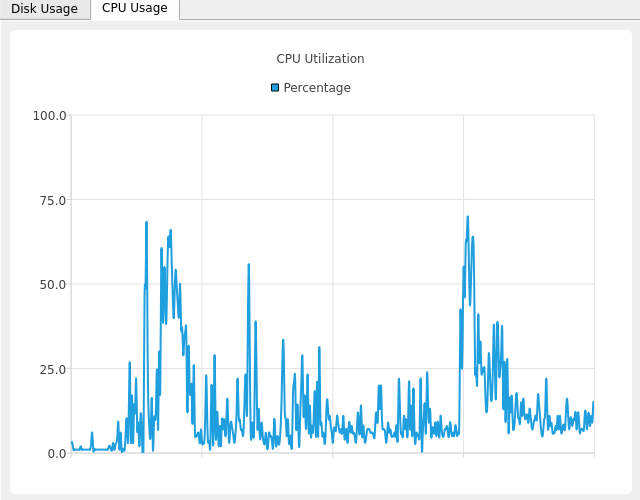

# 十四、使用`QtCharts`图嵌入数据图

世界上充满了数据。从服务器日志到财务记录，从传感器遥测到人口普查统计，程序员的任务是筛选原始数据并从中提取意义，这些数据似乎没有尽头。除此之外，没有什么比好的图表更有效地将一组原始数据提取为有意义的信息了。PyQt 提供了自己的`QtCharts`库，这是一个用于构建图表、图形和其他数据可视化的简单工具包。

在本章中，我们将在以下主题中探讨使用`QtCharts`进行数据可视化：

*   制作简单的图表
*   显示实时数据
*   Qt 图表的样式化

# 技术要求

除了我们在本书中一直使用的基本 PyQt 设置之外，您还需要为`QtCharts`库安装 PyQt 支持。此支持不是默认 PyQt 安装的一部分，但可以通过 PyPI 轻松安装，如下所示：

```py
$ pip install --user PyQtChart
```

您还需要`psutil`库，它可以从 PyPI 安装。我们已经在[第 12 章](12.html)中使用了该库，*使用 QPaint 创建 2D 图形，*因此，如果您已经阅读了该章，那么您应该已经拥有了它。如果没有，可以使用以下命令轻松安装：

```py
$ pip install --user psutil
```

最后，您可能想从[下载本章的示例代码 https://github.com/PacktPublishing/Mastering-GUI-Programming-with-Python/tree/master/Chapter14](https://github.com/PacktPublishing/Mastering-GUI-Programming-with-Python/tree/master/Chapter14) 。

查看以下视频以查看代码的运行：[http://bit.ly/2M5y67f](http://bit.ly/2M5y67f)

# 制作简单的图表

在[第 12 章](12.html)中*使用 QPaint 创建 2D 图形*中，我们使用 Qt 图形框架和`psutil`库创建了 CPU 活动图。虽然这种构建图表的方法效果很好，但创建一个缺乏简单细节（如轴标签、标题或图例）的基本图表需要大量工作。`QtChart`库也基于 Qt 图形框架，但简化了各种功能完整图表的创建。

为了演示它是如何工作的，我们将构建一个更完整的系统监控程序，其中包括从`psutil`库提供的数据中导出的几个图表。

# 设置 GUI

要开始我们的程序，请将 Qt 应用模板从[第 4 章](04.html)*使用 QMainWindow 构建应用*复制到名为`system_monitor.py`的新文件中。

在应用的顶部，我们需要导入`QtChart`库：

```py
from PyQt5 import QtChart as qtch
```

我们还需要`deque`类和`psutil`库，就像我们在[第 12 章](https://cdp.packtpub.com/mastering_gui_programming_with_python/wp-admin/post.php?post=37&action=edit#post_35)中需要它们一样，*使用 QPaint*创建 2D 图形：

```py
from collections import deque
import psutil
```

我们的程序将包含几个图表，每个图表都有自己的选项卡。因此，我们将在`MainWindow.__init__()`中创建一个 tab 小部件来保存所有图表：

```py
        tabs = qtw.QTabWidget()
        self.setCentralWidget(tabs)
```

既然 GUI 的主框架已经就绪，我们将开始创建图表类并将它们添加到 GUI 中。

# 构建磁盘使用率图表

我们将创建的第一个图表是一个条形图，用于显示计算机上每个存储分区使用的磁盘空间。每个检测到的分区将有一个指示其空间使用百分比的条。

让我们首先为图表创建一个类：

```py
class DiskUsageChartView(qtch.QChartView):

    chart_title = 'Disk Usage by Partition'

    def __init__(self):
        super().__init__()
```

该类是从`QtChart.QChartView`类中派生出来的子类；`QGraphicsView`的这个子类是一个可以显示`QChart`对象的小部件。与 Qt 图形框架一样，`QtChart`框架基于模型视图设计。在这种情况下，`QChart`对象类似于`QGraphicsScene`对象，它将连接到`QChartView`对象以进行显示。

让我们创建`QChart`对象，如下所示：

```py
        chart = qtch.QChart(title=self.chart_title)
        self.setChart(chart)
```

`QChart`对象接收一个标题，但在其他情况下，不需要很多配置；请注意，它也没有说明如何成为条形图。与您可能使用的其他图表库不同，`QChart`对象不确定我们正在创建的图表类型。它只是一个数据绘图的容器。

通过向图表添加一个或多个**系列**对象来确定图表的实际类型。系列表示图表上的一组打印数据。`QtChart`包含许多系列类，都是从`QAbstractSeries`派生的，每个系列类代表一种不同的图表样式。

其中一些类别如下：

| 班 | 图表类型 | 有益于 |
| --- | --- | --- |
| `QLineSeries` | 直线图 | 从连续数据中采样的点 |
| `QSplineSeries` | 线图，但带有曲线 | 从连续数据中采样的点 |
| `QBarSeries` | 条形图 | 按类别比较价值 |
| `QStackedBarSeries` | 堆积条形图 | 按类别比较细分值 |
| `QPieSeries` | 饼图 | 相对百分比 |
| `QScatterSeries` | 散点图 | 点集合 |

有关可用系列类型的完整列表，请参见[https://doc.qt.io/qt-5/qtcharts-overview.html](https://doc.qt.io/qt-5/qtcharts-overview.html) 。我们的图表将比较多个分区的磁盘使用率百分比，因此在这些选项中使用的最合理的系列类型似乎是`QBarSeries`类。每个分区将是一个*类别*，它将有一个与之关联的单一值（使用百分比）。

让我们创建`QBarSeries`类，如下所示：

```py
        series = qtch.QBarSeries()
        chart.addSeries(series)
```

创建序列对象后，我们可以使用`addSeries()`方法将其添加到图表中。正如您可能从该方法的名称中怀疑的那样，我们实际上可以将多个系列添加到图表中，并且它们不一定都是同一类型的。例如，我们可以在同一张图表中组合一个条形和线形系列。不过，在我们的例子中，我们只会有一个系列。

为了将数据添加到我们的系列中，我们必须创建一个称为**条集**的东西：

```py
        bar_set = qtch.QBarSet('Percent Used')
        series.append(bar_set)
```

Qt 条形图旨在显示类别中的数据，但也允许在这些类别中比较不同的数据集。例如，如果您想比较您公司的几种产品在美国各个城市的相对销售成功率，您可以将这些城市作为您的类别，并为每种产品创建一个条形图集。

在我们的例子中，类别将是系统上的分区，我们只希望看到每个分区的一组数据，即磁盘使用率百分比。

因此，我们将创建一个要附加到系列中的单条集：

```py
        bar_set = qtch.QBarSet('Percent Used')
        series.append(bar_set)
```

`QBarSet`构造函数接受单个参数，该参数表示数据集的标签。这个`QBarSet`对象就是我们要附加实际数据的对象。

那么，让我们继续检索数据：

```py
        partitions = []
        for part in psutil.disk_partitions():
            if 'rw' in part.opts.split(','):
                partitions.append(part.device)
                usage = psutil.disk_usage(part.mountpoint)
                bar_set.append(usage.percent)
```

此代码利用`pustil`的`disk_partitions()`函数列出系统上所有可写分区（我们对只读设备（如光盘驱动器）不感兴趣，因为它们的使用与此无关）。对于每个分区，我们使用`disk_usage()`函数检索有关磁盘使用情况的命名元组信息。这个元组的`percent`属性包含磁盘的使用百分比，因此我们将该值附加到我们的条集。我们还将分区的设备名附加到分区列表中。

此时，我们的图表包含一个数据系列，可以显示数据的条形图。然而，由于没有标记数据的**轴**，因此很难从图表中提取出多少意义。为了解决这个问题，我们需要创建两个轴对象来表示*x*和*y*轴。

我们将从*x*轴开始，如下所示：

```py
        x_axis = qtch.QBarCategoryAxis()
        x_axis.append(partitions)
        chart.setAxisX(x_axis)
        series.attachAxis(x_axis)
```

`QtCharts`提供不同类型的 axis 对象来处理不同的数据组织方法。我们的*x*轴由计算机上找到的每个分区的一个类别组成–因此，我们创建了一个`QBarCategoryAxis`对象来表示*x*轴。为了定义所使用的类别，我们将字符串列表传递给`append()`方法。

重要的是，类别的顺序与数据附加到条集的顺序相匹配，因为每个数据点都是根据其在序列中的位置进行分类的。

一旦创建，轴必须同时连接到图表和系列；这是因为图表需要了解轴对象，以便正确标记和缩放轴。这是通过将 axis 对象传递到图表的`setAxisX()`方法来实现的。该系列还需要了解 axis 对象，以便它能够正确缩放图表的绘图，我们通过将其传递给系列对象的`attachAxis()`方法来实现这一点。

我们的*y*轴代表一个百分比，因此我们需要一个轴类型来处理`0`和`100`之间的值。我们将使用`QValueAxis`对象进行此操作，如下所示：

```py
        y_axis = qtch.QValueAxis()
        y_axis.setRange(0, 100)
        chart.setAxisY(y_axis)
        series.attachAxis(y_axis)
```

`QValueAxis`表示显示数值比例的轴，允许我们为数值设置适当的范围。创建后，我们可以将其附加到图表和系列。

此时，我们可以在`MainView.__init__()`中创建图表视图对象的实例，并将其添加到选项卡小部件中：

```py
        disk_usage_view = DiskUsageChartView()
        tabs.addTab(disk_usage_view, "Disk Usage")
```

如果此时运行应用，则应显示分区使用率百分比：


根据您的操作系统和驱动器配置，您的显示器看起来会略有不同。前面的图表看起来不错，但我们可以做的一个小改进是在条形图上实际添加百分比标签，以便读者可以看到精确的数据值。这可以通过在`DiskUsageChartView.__init__()`中添加以下行来完成：

```py
        series.setLabelsVisible(True)
```

现在，当我们运行程序时，我们会得到标签条，如下所示：


好吧，看来这位作者是由于一个更大的硬盘驱动器！

# 显示实时数据

现在，我们已经看到创建静态图表是多么容易了，让我们来看看创建一个实时更新的图表的过程。基本上，过程是相同的，但我们需要定期用新数据更新图表的数据系列。为了演示这一点，让我们制作一个实时 CPU 使用率监视器。

# 构建 CPU 使用率图表

让我们在一个名为`CPUUsageView`的新类中启动 CPU 监视器：

```py
class CPUUsageView(qtch.QChartView):

    num_data_points = 500
    chart_title = "CPU Utilization"

    def __init__(self):
        super().__init__()
        chart = qtch.QChart(title=self.chart_title)
        self.setChart(chart)
```

正如我们对磁盘使用率图表所做的那样，我们将这个类基于`QChartView`并通过创建`QChart`对象来开始构造函数。我们还定义了一个标题，并且，正如我们在[第 12 章](12.html)中所做的一样，*使用 QPaint*创建二维图形，配置了一次显示的多个数据点。不过，这次我们将做更多的点，这样我们可以得到更详细的图表。

创建图表对象后，下一步是创建序列对象：

```py
        self.series = qtch.QSplineSeries(name="Percentage")
        chart.addSeries(self.series)
```

这一次，我们使用的是`QSplineSeries`对象；我们也可以使用`QLineSeries`，但样条曲线版本将使用三次样条曲线连接我们的数据点，以获得平滑的外观，这与我们在[第 12 章](12.html)*中使用贝塞尔曲线实现的效果类似*使用 QPaint*创建二维图形。*

接下来，我们需要用一些默认数据填充 series 对象，如下所示：

```py
        self.data = deque(
            [0] * self.num_data_points, maxlen=self.num_data_points)
        self.series.append([
            qtc.QPoint(x, y)
            for x, y in enumerate(self.data)
        ])
```

我们再次创建一个`deque`对象来存储数据点，并用零填充它。然后，我们通过使用列表理解从`deque`对象创建`QPoint`对象列表，将这些数据附加到我们的系列中。与`QBarSeries`类不同，数据直接附加到`QSplineSeries`对象；对于基于行的系列，没有什么类似于`QBarSet`类。

现在我们的系列已经设置好，让我们来研究轴：

```py
        x_axis = qtch.QValueAxis()
        x_axis.setRange(0, self.num_data_points)
        x_axis.setLabelsVisible(False)
        y_axis = qtch.QValueAxis()
        y_axis.setRange(0, 100)
        chart.setAxisX(x_axis, self.series)
        chart.setAxisY(y_axis, self.series)
```

因为我们的数据大部分是（*x*、*y*坐标），所以我们的两个轴都是`QValueAxis`对象。但是，我们的*x*轴坐标的值基本上没有意义（它只是`deque`对象中 CPU 使用值的索引），因此我们将通过将轴的`labelsVisible`属性设置为`False`来隐藏这些标签。

注意，这一次，我们将图表的*x*和*y*轴设置为`setAxisX()`和`setAxisY`时，将序列对象与轴一起传递。这样做也会自动将轴附加到序列，并为每个轴节省额外的方法调用。

因为我们在这里使用曲线，所以我们应该进行一次外观优化：

```py
        self.setRenderHint(qtg.QPainter.Antialiasing)
```

`QChartView`对象的`renderHint`属性可用于激活**抗锯齿**，这将提高样条曲线的平滑度。

我们图表的基本框架现在已经完成；我们现在需要的是一种收集数据和更新系列的方法。

# 更新图表数据

更新数据的第一步是创建一个调用`psutil.cpu_percent()`并更新`deque`对象的方法：

```py
    def refresh_stats(self):
        usage = psutil.cpu_percent()
        self.data.append(usage)
```

要更新图表，我们只需要更新序列中的数据。有两种方法可以做到这一点；例如，我们可以完全删除图表中的所有数据和`append()`新值。

更好的方法是`replace()`值，如下所示：

```py
        new_data = [
            qtc.QPoint(x, y)
            for x, y in enumerate(self.data)]
        self.series.replace(new_data)
```

首先，我们使用列表理解从我们的`deque`对象生成一组新的`QPoint`对象，然后将列表传递给序列对象的`replace()`方法，该方法交换所有数据。这种方法比清除所有数据并重新填充序列要快一些，尽管这两种方法都有效。

现在我们有了 refresh 方法，我们只需要定期调用它；回到`__init__()`，让我们添加一个计时器：

```py
        self.timer = qtc.QTimer(
            interval=200, timeout=self.refresh_stats)
        self.timer.start()
```

此计时器将每隔`200`毫秒调用`refresh_stats()`，更新序列，从而更新图表。

回到`MainView.__init__()`，让我们添加 CPU 图表：

```py
        cpu_view = CPUUsageView()
        tabs.addTab(cpu_view, "CPU Usage")
```

现在，您可以运行应用并单击 CPU 使用率选项卡以查看类似下图的图表：



尝试执行一些 CPU 密集型任务，为图表生成一些有趣的数据。

# 在图表周围平移和缩放

我们的刷新方法每秒被调用五次，对于这样一个小图表，本系列中的数据非常详细。像这样的密集图表是用户可能希望更详细地探索的内容。为了实现这一功能，我们可以利用`QChart`对象的方法对图表图像进行平移和缩放，并允许用户更好地查看数据。

要为`CPUUsageView`类配置交互控件，我们可以覆盖`keyPressEvent()`方法，就像我们在[第 12 章](12.html)中的游戏一样，*使用 QPaint*创建 2D 图形：

```py
    def keyPressEvent(self, event):
        keymap = {
            qtc.Qt.Key_Up: lambda: self.chart().scroll(0, -10),
            qtc.Qt.Key_Down: lambda: self.chart().scroll(0, 10),
            qtc.Qt.Key_Right: lambda: self.chart().scroll(-10, 0),
            qtc.Qt.Key_Left: lambda: self.chart().scroll(10, 0),
            qtc.Qt.Key_Greater: self.chart().zoomIn,
            qtc.Qt.Key_Less: self.chart().zoomOut,
        }
        callback = keymap.get(event.key())
        if callback:
            callback()
```

此代码与我们在坦克游戏中使用的代码类似。我们创建一个`dict`对象，将按键代码映射到回调函数，然后检查事件对象，查看是否按下了其中一个映射按键。如果是，那么我们称之为`callback`方法。

我们映射的第一个方法是`QChart.scroll()`。`scroll()`获取*x*和*y*值，并将图表在图表视图中移动该数量。这里，我们将箭头键映射到`lambda`函数，这些函数可以适当地滚动图表。

我们映射的其他方法是`zoomIn()`和`zoomOut()`。它们完全按照它们的名字，每一个放大或缩小两倍。如果我们想要自定义缩放量，那么我们可以交替调用`zoom()`方法，该方法采用一个浮点值来指示缩放因子。

如果您现在运行此程序，您会发现您可以使用箭头键移动图表，并使用尖括号进行放大或缩小（请记住在大多数键盘上按*Shift*以获得尖括号）。

# Qt 图表的样式化

虽然 Qt 图表在默认情况下看起来很好，但让我们面对现实吧，在风格方面，没有人愿意被默认设置所束缚。幸运的是，`QtCharts`提供了各种各样的选项来设计可视化的不同组件。

为了探索这些选项，我们将构建第三个图表来显示物理内存和交换内存的使用情况，然后根据我们自己的偏好设置它的样式。

# 构建内存图表

我们将启动此图表视图对象，就像启动前几节中的其他对象一样：

```py
class MemoryChartView(qtch.QChartView):

    chart_title = "Memory Usage"
    num_data_points = 50

    def __init__(self):
        super().__init__()
        chart = qtch.QChart(title=self.chart_title)
        self.setChart(chart)
        series = qtch.QStackedBarSeries()
        chart.addSeries(series)
        self.phys_set = qtch.QBarSet("Physical")
        self.swap_set = qtch.QBarSet("Swap")
        series.append(self.phys_set)
        series.append(self.swap_set)
```

这个类以类似于我们的磁盘使用率图表的方式开始–通过子类化`QChartView`，定义一个图表，定义一个系列，然后定义一些条形图集。不过，这次我们将使用`QStackedBarSeries`。堆叠的条形图与常规条形图类似，只是每个条形图集是垂直堆叠的，而不是并排放置。这种图表对于显示一系列的相对百分比非常有用，这正是我们要显示的。

在本例中，我们将有两个条集–一个用于物理内存使用，另一个用于交换内存使用，每个条集占总内存的百分比（物理和交换）。通过使用堆叠条，总内存使用量将由条高度表示，而各个段将显示该总内存的交换和物理组件。

为了保存数据，我们将再次使用默认数据设置一个`deque`对象，并将数据附加到条集：

```py
        self.data = deque(
            [(0, 0)] * self.num_data_points,
            maxlen=self.num_data_points)
        for phys, swap in self.data:
            self.phys_set.append(phys)
            self.swap_set.append(swap)
```

这一次，`deque`对象中的每个数据点需要有两个值：第一个用于物理数据，第二个用于交换。我们通过对每个数据点使用两元组序列来表示这一点。

下一步再次是设置轴：

```py
        x_axis = qtch.QValueAxis()
        x_axis.setRange(0, self.num_data_points)
        x_axis.setLabelsVisible(False)
        y_axis = qtch.QValueAxis()
        y_axis.setRange(0, 100)
        chart.setAxisX(x_axis, series)
        chart.setAxisY(y_axis, series)
```

在这里，就像 CPU 使用率图表一样，我们的*x*轴只是表示数据的一些毫无意义的索引号，所以我们将隐藏标签。另一方面，我们的*y*轴表示一个百分比，因此我们将其范围设置为`0`到`100`。

现在，我们将创建`refresh`方法来更新图表数据：

```py
    def refresh_stats(self):
        phys = psutil.virtual_memory()
        swap = psutil.swap_memory()
        total_mem = phys.total + swap.total
        phys_pct = (phys.used / total_mem) * 100
        swap_pct = (swap.used / total_mem) * 100

        self.data.append(
            (phys_pct, swap_pct))
        for x, (phys, swap) in enumerate(self.data):
            self.phys_set.replace(x, phys)
            self.swap_set.replace(x, swap)
```

`psutil`库有两个检查内存使用情况的功能：`virtual_memory()`，返回物理 RAM 的信息；和`swap_memory()`，返回交换文件使用情况的相关信息。我们正在应用一些基本的算法来计算交换和物理内存在总内存（交换和物理内存）中所占的百分比。然后，我们将此数据附加到`deque`对象，并对其进行迭代，以替换条形集合中的数据。

最后，我们将在`__init__()`中添加我们的计时器以调用刷新方法：

```py
        self.timer = qtc.QTimer(
            interval=1000, timeout=self.refresh_stats)
        self.timer.start()
```

图表视图类现在应该是功能齐全的，所以让我们将其添加到`MainWindow`类中并进行测试。

为此，请在`MainWindow.__init__()`中添加以下代码：

```py
        cpu_time_view = MemoryChartView()
        tabs.addTab(cpu_time_view, "Memory Usage")
```

如果此时运行该程序，则应具有每秒更新一次的工作内存使用监视器。它很好，但看起来太像了；所以，让我们把事情搞得有点时髦。

# 图表样式

为了给我们的记忆图表一个健康的个性剂量，让我们回到`MemoryChartView.__init__()`并开始添加代码来设计图表的各种元素。

我们可以进行的最简单但最有趣的更改之一是激活图表的内置动画：

```py
        chart.setAnimationOptions(qtch.QChart.AllAnimations)
```

`QChart`对象的`animationOptions`属性确定在创建或更新图表时将运行哪些内置图表动画。选项包括`GridAxisAnimations`，用于设置轴的绘制动画；`SeriesAnimations`，对系列数据进行动画更新；`AllAnimations`，我们在这里使用它来激活网格和系列动画；和`NoAnimations`，正如您可能猜到的，它用于关闭所有动画（当然，这是默认设置）。

如果现在运行该程序，您将看到网格和轴扫入到位，并且每个条形图都以平滑动画的形式从图表底部弹出。动画本身是为每个系列类型预设的；请注意，除了设置缓和曲线和持续时间，我们无法对其进行太多自定义：

```py
        chart.setAnimationEasingCurve(
            qtc.QEasingCurve(qtc.QEasingCurve.OutBounce))
        chart.setAnimationDuration(1000)
```

在这里，我们将图表的`animationEasingCurve`属性设置为具有*向外反弹*缓和曲线的`QtCore.QEasingCurve`对象。我们还将动画时间降低到了整整一秒。如果现在运行该程序，您将看到动画反弹并持续稍长时间。

我们可以做的另一个简单调整是启用图表的下拉阴影，如下所示：

```py
        chart.setDropShadowEnabled(True)
```

将`dropShadowEnabled`设置为`True`将在图表的绘图区域周围显示阴影，使其产生微妙的 3D 效果。

通过设置图表的`theme`属性，外观发生了更显著的变化，如下所示：

```py
        chart.setTheme(qtch.QChart.ChartThemeBrownSand)
```

虽然这被称为图表主题，但它主要影响用于绘图的颜色。Qt 5.12 有八个图表主题，可在[找到 https://doc.qt.io/qt-5/qchart.html#ChartTheme-枚举](https://doc.qt.io/qt-5/qchart.html#ChartTheme-enum)。在这里，我们配置了*棕沙*主题，它将利用地球音调进行数据绘图。

在我们的堆叠条形图中，这意味着堆栈的每个部分都将从主题中获得不同的颜色。

我们可以做的另一个非常明显的改变是设置图表的背景。这可以通过将`backgroundBrush`属性设置为自定义`QBrush`对象来实现：

```py
        gradient = qtg.QLinearGradient(
            chart.plotArea().topLeft(), chart.plotArea().bottomRight())
        gradient.setColorAt(0, qtg.QColor("#333"))
        gradient.setColorAt(1, qtg.QColor("#660"))
        chart.setBackgroundBrush(qtg.QBrush(gradient))
```

在本例中，我们创建了一个线性渐变，并使用它创建了一个`QBrush`对象作为背景（有关此方面的更多讨论，请参见[第 6 章](06.html)、*样式化 Qt 应用、*。

背景还有一个`QPen`对象，用于绘制绘图区域周围的边界：

```py
        chart.setBackgroundPen(qtg.QPen(qtg.QColor('black'), 5))
```

如果此时运行程序，您可能会发现文本有点难以阅读。不幸的是，没有一种简单的方法可以一次更新图表中所有文本的外观——我们需要逐段更新。我们可以从图表的标题文本开始，设置`titleBrush`和`titleFont`属性，如下所示：

```py
        chart.setTitleBrush(
            qtg.QBrush(qtc.Qt.white))
        chart.setTitleFont(qtg.QFont('Impact', 32, qtg.QFont.Bold))
```

无法通过`chart`对象修复文本的其余部分。为此，我们需要查看图表中其他对象的样式设置。

# 造型轴

图表轴上使用的标签的字体和颜色必须通过轴的对象设置：

```py
        axis_font = qtg.QFont('Mono', 16)
        axis_brush = qtg.QBrush(qtg.QColor('#EEF'))
        y_axis.setLabelsFont(axis_font)
        y_axis.setLabelsBrush(axis_brush)
```

这里，我们分别使用`setLabelsFont()`和`setLabelsBrush()`方法设置*y*轴字体和颜色。注意，我们也可以设置*x*轴标签的字体和颜色，但没有太多意义，因为我们没有显示*x*标签。

axis 对象还允许我们使用`gridLinePen`属性设置网格线的样式：

```py
        grid_pen = qtg.QPen(qtg.QColor('silver'))
        grid_pen.setDashPattern([1, 1, 1, 0])
        x_axis.setGridLinePen(grid_pen)
        y_axis.setGridLinePen(grid_pen)
```

在这里，我们设置了一个银色虚线`QPen`对象来绘制我们的*x*和*y*轴的网格线。顺便说一句，如果要更改图表上绘制的网格线数量，可以通过设置 axis 对象的`tickCount`属性来完成：

```py
        y_axis.setTickCount(11)
```

默认勾号计数为`5`，最小为`2`。请注意，这个数字包括顶线和底线，因此为了每 10%有一条网格线，我们将轴设置为`11`刻度。

为了帮助用户区分紧密排列的网格线，我们还可以在 axis 对象上启用**阴影**：

```py
        y_axis.setShadesVisible(True)
        y_axis.setShadesColor(qtg.QColor('#884'))
```

如您所见，如果运行应用，这将导致网格线之间的每个备用区域根据配置的颜色进行着色，而不是使用默认背景。

# 为传奇人物设计风格

在这张图表中，我们可能要修复的最后一件事是**图例**。这是图表的一部分，说明了哪种颜色与哪种条形设置相匹配。图例由一个`QLegend`对象表示，当我们添加条形集合或系列对象时，该对象由`QChart`对象自动创建和更新。

我们可以使用`legend()`访问器方法检索图表的`QLegend`对象：

```py
        legend = chart.legend()
```

默认情况下，图例没有背景，只是直接在图表背景上绘制。我们可以改变这一点以提高可读性，如下所示：

```py
        legend.setBackgroundVisible(True)
        legend.setBrush(
            qtg.QBrush(qtg.QColor('white')))
```

我们首先通过将`backgroundVisible`设置为`True`来打开背景，然后通过将`brush`属性设置为`QBrush`对象来为背景配置画笔。

文本的颜色和字体也可以配置，如下所示：

```py
        legend.setFont(qtg.QFont('Courier', 14))
        legend.setLabelColor(qtc.Qt.darkRed)
```

我们可以使用`setLabelColor()`设置标签颜色，或者使用`setLabelBrush()`方法使用刷子进行更精细的控制。

最后，我们可以配置用于指示颜色的标记的形状：

```py
        legend.setMarkerShape(qtch.QLegend.MarkerShapeCircle)
```

此处的选项包括`MarkerShapeCircle`、`MarkerShapeRectangle`和`MarkerShapeFromSeries`，最后一个选项选择适合所绘制序列的形状（例如，直线或样条曲线图为短线，散点图为点）。

此时，您的内存图表应该如下所示：


不错！现在，尝试您自己的颜色、画笔、笔和字体值，看看您可以创建什么！

# 总结

在本章中，您学习了如何使用`QtChart`可视化数据。您创建了一个静态表、一个动画实时表和一个具有自定义颜色和字体的奇特图表。您还学习了如何创建条形图、堆叠条形图和样条曲线图。

在下一章中，我们将探索在 Raspberry Pi 上使用 PyQt。您将学习如何安装 PyQt 的最新版本，以及如何使用 Pi 的独特功能将 PyQt 应用与电路和外部硬件连接起来。

# 问题

尝试以下问题来测试您对本章的知识：

1.  考虑以下对数据集的描述。为以下各项建议一种图表样式：
    *   按日期列出的 Web 服务器命中计数
    *   销售人员每月的销售数字
    *   公司部门过去一年支持票证的百分比
    *   一小块豆科植物的产量与植物的高度成反比，为几百株

2.  以下代码中未配置哪个图表组件，结果如何？

```py
   data_list = [
       qtc.QPoint(2, 3),
       qtc.QPoint(4, 5),
       qtc.QPoint(6, 7)]
   chart = qtch.QChart()
   series = qtch.QLineSeries()
   series.append(data_list)
   view = qtch.QChartView()
   view.setChart(chart)
   view.show()
```

3.  以下代码有什么问题？

```py
   mainwindow = qtw.QMainWindow()
   chart = qtch.QChart()
   series = qtch.QPieSeries()
   series.append('Half', 50)
   series.append('Other Half', 50)
   mainwindow.setCentralWidget(chart)
   mainwindow.show()
```

4.  您希望创建一个条形图，比较 Bob 和 Alice 本季度的销售数字。需要添加哪些代码？请注意，此处不需要轴：

```py
   bob_sales = [2500, 1300, 800]
   alice_sales = [1700, 1850, 2010]

   chart = qtch.QChart()
   series = qtch.QBarSeries()
   chart.addSeries(series)

   # add code here

   # end code
   view = qtch.QChartView()
   view.setChart(chart)
   view.show()
```

5.  给定一个名为`chart`的`QChart`对象，编写一些代码，使图表具有黑色背景和蓝色数据图。
6.  使用您用于`Memory Usage`图表的技术，在系统监视器脚本中设置其他两个图表的样式。尝试使用不同的画笔和画笔，看看是否可以找到其他要设置的属性。

7.  `QPolarChart`是`QChart`的一个子类，可用于构建极坐标图。调查 Qt 文档中极坐标图的使用情况，并查看是否可以创建相应数据集的极坐标图。
8.  `psutil.cpu_percent()`接受一个可选参数`percpu`，它将创建一个值列表，显示每个 CPU 核心的使用信息。更新应用以使用此选项，并在一个图表上分别显示每个 CPU 核心的活动。

# 进一步阅读

有关更多信息，请参阅以下链接：

*   `QtCharts`概述见[https://doc.qt.io/qt-5/qtcharts-index.html](https://doc.qt.io/qt-5/qtcharts-index.html)
*   有关`psutil`库的更多文档，请访问[https://psutil.readthedocs.io/en/latest/](https://psutil.readthedocs.io/en/latest/)
*   加州大学伯克利分校的这篇指南提供了一些指南，为不同类型的数据选择合适的情节：http://guides.lib.berkeley.edu/data-visualization/type