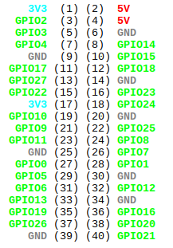
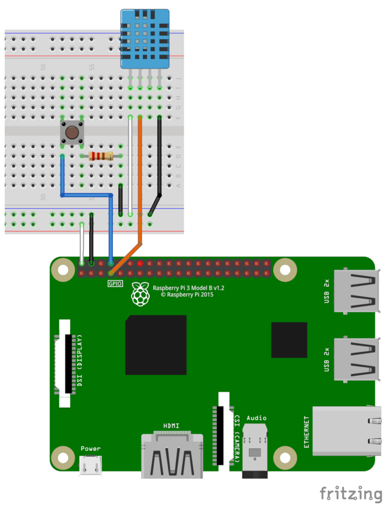

# 树莓皮

覆盆子 Pi 是过去十年中最成功、最令人兴奋的计算机之一。2012 年，一家英国非营利组织推出了一款基于微型**先进 RISC 机器**（**ARM**）的计算机，作为一种向孩子们传授计算机科学知识的方式，它已成为爱好者、修补工、开发人员和各类 IT 专业人士的普遍工具。由于 Python 和 PyQt 随时可用，并且在其默认操作系统上得到了很好的支持，Raspberry Pi 对于 PyQt 开发人员来说也是一个很好的工具。

在本章中，我们将在以下部分中介绍如何在 Raspberry Pi 上使用 PyQt5 进行开发：

*   在树莓皮上运行 PyQt5
*   用 PyQt 控制**通用输入/输出**（**GPIO**设备
*   用 GPIO 设备控制 PyQt

# 技术要求

为了遵循本章中的示例，您需要以下项目：

*   树莓皮最好是 3 型 B+或更新的
*   Pi 的电源、键盘、鼠标、显示器和网络连接
*   安装 Raspbian 10 或更高版本的 micro SD 卡；您可以参考[上的官方文件 https://www.raspberrypi.org/documentation/installation/](https://www.raspberrypi.org/documentation/installation/) 了解如何安装 Raspbian 的说明

At the time of writing, Raspbian 10 has not yet been released, though it is possible to upgrade Raspbian 9 to the testing version. You can refer to [Appendix B](19.html), *Upgrading Raspbian 9 to Raspbian 10,* of this book for instructions on how to upgrade if Raspbian 10 is not available.

要编程我们基于 GPIO 的项目，您还需要一些电子组件来与之接口。这些零件通常在电子启动器套件或当地的电子供应商店中提供。

第一个项目将需要以下项目：

*   试验板
*   三个相同的电阻器（220 至 1000 欧姆之间）
*   一个三色 LED
*   四根阴对阳跨接导线

第二个项目将需要以下项目：

*   试验板
*   一个 DHT11 或 DHT22 温度/湿度传感器
*   一个按钮开关
*   一个电阻器（该值不重要）
*   三根阴对阳跨接导线
*   Adafruit DHT 传感器库，可使用以下命令从 PyPI 获得：

```py
$ sudo pip3 install Adafruit_DHT
```

您可以参考位于[的 GitHub 存储库 https://github.com/adafruit/Adafruit_Python_DHT](https://github.com/adafruit/Adafruit_Python_DHT) 了解更多信息。

您还可以从[下载示例代码 https://github.com/PacktPublishing/Mastering-GUI-Programming-with-Python/tree/master/Chapter15](https://github.com/PacktPublishing/Mastering-GUI-Programming-with-Python/tree/master/Chapter15) 。

查看以下视频以查看代码的运行：[http://bit.ly/2M5xDSx](http://bit.ly/2M5xDSx)

# 在 Pi 上运行 PyQt5

Raspberry Pi 能够运行许多不同的操作系统，因此安装 Python 和 PyQt 完全取决于您选择的操作系统。在本书中，我们将重点介绍**Raspbian**——Pi 的官方（也是最常用的）操作系统。

Raspbian 基于 Debian GNU/Linux 的稳定版本，在发布时是 Debian 9（Stretch）。不幸的是，对于本书中的代码来说，适用于此 Debian 版本的 Python 和 PyQt5 版本太旧了。如果在阅读本书时，Raspbian 10 尚未发布，请参考[附录 B](19.html)、*将 Raspbian 9 升级为 Raspbian 10*，了解如何将 Raspbian 9 升级为 Raspbian 10。

Raspbian10 预装了 Python3.7，但我们需要自己安装 PyQt5。请注意，您不能使用`pip`在 Raspberry Pi 上安装 PyQt5，因为所需的 Qt 二进制文件无法从用于 ARM 平台（Pi 基于该平台）的 PyPI 获得。但是，可以从 Raspbian 软件存储库获得 PyQt5 的一个版本。这将*不是*PyQt5 的最新版本，而是在 Debian 开发过程中选择的一个版本，该版本最稳定，与发布版兼容。对于 Debian/Raspbian 10，此版本为 PyQt 5.11。

要安装它，首先确保您的设备已连接到 internet。然后，打开命令行终端并输入以下命令：

```py
$ sudo apt install python3-pyqt5
```

**高级打包工具**（**APT**实用程序将下载并安装 PyQt5 和所有必要的依赖项。请注意，此命令仅安装 PyQt5 for Python 3 的主要模块。某些模块，如`QtSQL`、`QtMultimedia`、`QtChart`和`QtWebEngineWidgets`是单独打包的，需要使用附加命令进行安装：

```py
$ sudo apt install python3-pyqt5.qtsql python3-pyqt5.qtmultimedia python3-pyqt5.qtchart python3-pyqt5.qtwebengine
```

为 PyQt5 打包了更多的可选库。要获得完整的列表，可以使用`apt search`命令，如下所示：

```py
$ apt search pyqt5
```

APT is the primary way in which software is installed, removed, and updated on Raspbian, Debian, and many other Linux distributions. While similar to `pip`, APT is used for the whole operating system.

# 在 Pi 上编辑 Python

尽管您可以在自己的计算机上编辑 Python 并将其复制到 Raspberry Pi 以执行，但您可能会发现直接在设备上编辑代码更方便。如果您最喜欢的代码编辑器或**集成开发环境**（**IDE**）不适用于 Linux 或 ARM，请不要担心；Raspbian 提供了几种备选方案：

*   **Thonny**Python IDE 预装了默认的 Raspbian 图像，非常适合本章中的示例
*   **空闲**，Python 的默认编程环境也是预装的
*   **Geany**是一款适用于多种语言的通用编程文本编辑器，也是预装的
*   传统的代码编辑器，如**Vim**和**Emacs**和 Python IDE，如**Spyder**、**Ninja IDE**和**Eric**，可以使用添加/删除软件工具（在程序菜单的首选项下找到）或使用`apt`命令

无论您选择何种应用程序或方法，请确保将文件备份到其他设备，因为 Raspberry Pi 的 SD 卡存储不是最可靠的。

# 在 Pi 上运行 PyQt5 应用程序

一旦在 Raspberry Pi 上安装了 Python 和 PyQt5，您就应该能够运行我们在本书中编写的任何应用程序。本质上，Pi 是一台运行 GNU/Linux 的计算机，本书中的所有代码都与之兼容。考虑到这一点，您*可以*简单地将其用作运行 PyQt 应用程序的小型节能计算机。

然而，树莓圆周率有自己的一些独特的特点，最显著的是，它的 GPIO 引脚。这些引脚使 Pi 能够以一种非常简单和易访问的方式与外部数字电路通信。Raspbian 预装了软件库，允许我们使用 Python 控制这些管脚。

为了充分利用该功能为我们提供的独特平台，我们将在本章的其余部分重点介绍使用 PyQt5 结合 Raspberry Pi 的 GPIO 功能来创建 GUI 应用程序，该应用程序以只有 Pi 这样的设备才能实现的方式与实际电路交互。

# 用 PyQt 控制 GPIO 设备

在我们的第一个项目中，我们将学习如何从 PyQt 应用程序控制外部电路。您将连接一个多色 LED，并使用`QColorDialog`控制其颜色。收集第一个项目的*技术要求*部分中列出的组件，让我们开始。

# 连接 LED 电路

让我们通过在试验板上连接电路的组件来开始这个项目。关闭 Pi 电源并断开电源，然后将其放在试验板附近。

It's always a good idea to shut down your Raspberry Pi and disconnect the power before connecting circuits to the GPIO pins. This will reduce the risk of destroying your Raspberry Pi in the event that you connect something incorrectly, or if you accidentally touch the component leads.

该电路的主要部件是三色 LED。尽管这些参数略有不同，但该部件最常见的引脚如下：


本质上，三色 LED 是将红色 LED、绿色 LED 和蓝色 LED 组合成一个封装。它提供单独的输入引线，分别向每种颜色发送电流，并提供第四根引线作为公共接地。通过向每个引脚输入不同的电压，我们可以混合红光、绿光和蓝光以创建多种颜色，就像我们在应用程序中混合这三种元素以创建 RGB 颜色一样。

将 LED 添加到您的试验板上，使每个引脚位于板中的单独一行。然后，按如下方式连接其余部件：


如上图所示，我们正在进行以下连接：

*   LED 上的接地引脚直接连接到 Raspberry Pi 左侧的第三个外部引脚
*   LED 上的红色针脚连接到一个电阻器，然后再连接到右侧的下一个针脚（即针脚 8）
*   LED 上的绿色引脚连接到另一个电阻器，然后该电阻器连接到右侧的下一个自由引脚（即引脚 10）
*   LED 上的蓝色引脚连接到最后一个电阻器，该电阻器连接到 Pi 右侧的下一个自由引脚（引脚 12）

仔细检查电路并确保已将导线连接到 Raspberry Pi 上的正确引脚非常重要。不是所有的 GPIO 引脚上的覆盆子 Pi 是相同的；其中一些是可编程的，而另一些是硬编码的。通过在终端中运行`pinout`命令，可以查看 Pi 上的管脚列表；您应该看到以下输出：



前面的屏幕截图显示了管脚的布局，就好像你拿着前面的 Pi，USB 端口放下一样。注意，有几个引脚标记为**GND**；这些始终是接地引脚，因此您可以将电路的接地连接到这些引脚中的任何一个。其他引脚标记为**5V**或**3V3**；它们始终分别为 5 伏或 3.3 伏。其余带有 GPIO 标签的管脚为可编程管脚。您的导线应连接到插脚**8**（**GPIO14**）、**10**（**GPIO15**）和**12**（**GPIO18**）。

仔细检查电路连接，然后启动覆盆子 Pi。是时候开始编码了！

# 编写驱动程序库

现在我们的电路连接好了，我们需要写一些代码来控制它。为此，我们将利用 Pi 上的`GPIO`库。从[第 4 章](04.html)、*使用 QMainWindow 构建应用程序、*创建 PyQt 应用程序模板的副本，并将其命名为`three_color_led_gui.py`。

我们将从导入`GPIO`库开始：

```py
from RPi import GPIO
```

我们首先要做的是创建一个 Python 类，它将作为我们电路的 API。我们将其命名为`ThreeColorLed`，然后按如下方式启动它：

```py
class ThreeColorLed():
    """Represents a three color LED circuit"""

    def __init__(self, red, green, blue, pinmode=GPIO.BOARD, freq=50):
        GPIO.setmode(pinmode)
```

我们的`__init__()`方法有五个参数：前三个参数是红色、绿色和蓝色 LED 连接的 pin 码；第四个参数是用于解释管脚编号的**管脚模式**；第五个参数是频率，我们将在后面讨论。首先，让我们谈谈 pin 模式。

如果您查看`pinout`命令的输出，您会注意到有两种方法可以使用整数描述 Pi 上的管脚。第一个是根据其在董事会中的位置，从 1 到 40。第二个是通过其 GPIO 编号（即，pin 描述中 GPIO 后面的编号）。`GPIO`库允许您使用任意一个数字指定管脚，但您必须通过将两个常量中的一个传递给`GPIO.setmode()`函数来告诉它您将使用哪种方法。`GPIO.BOARD`指定您正在使用位置号（例如 1 到 40），而`GPIO.BCM`表示您要使用 GPIO 名称。如您所见，我们在此默认使用`BOARD`。

Whenever you write a class that takes GPIO pin numbers as arguments, be sure to allow the user to specify the pin mode as well. The numbers themselves are meaningless without the context of the pin mode.

接下来，我们的`__init__()`方法需要设置输出引脚：

```py
        self.pins = {
            "red": red,
            "green": green,
            "blue": blue
            }
        for pin in self.pins.values():
            GPIO.setup(pin, GPIO.OUT)
```

GPIO 引脚可设置为`IN`或`OUT`模式，具体取决于您是要读取引脚的状态还是要写入引脚。在这个项目中，我们将从软件向电路发送信息，所以我们需要所有的引脚都处于`OUT`模式。在将 pin 码存储在`dict`对象中后，我们对其进行了迭代，并使用`GPIO.setup()`函数将其设置为适当的模式。

设置后，我们可以使用`GPIO.output()`功能告知单个 pin 变高或变低，如下所示：

```py
        # Turn all on and all off
        for pin in self.pins.values():
            GPIO.output(pin, GPIO.HIGH)
            GPIO.output(pin, GPIO.LOW)
```

这段代码只是简单地打开和立即关闭每个 pin（可能比您看到的要快）。我们可以使用这种方法将 LED 设置为几种简单的颜色；例如，我们可以通过设置红色引脚`HIGH`和其他`LOW`使其变为红色，或者通过设置蓝色和绿色引脚`HIGH`和红色`LOW`使其变为青色。当然，我们想生产更多种类的颜色，但我们不能通过简单地完全打开或关闭针脚来实现。我们需要一些方法在最小（0 伏）和最大（5 伏）之间平稳地改变每个引脚的电压。

不幸的是，树莓皮不能做到这一点。输出是数字的，而不是模拟的，因此它们只能完全打开或完全关闭。然而，我们可以使用一种称为**脉宽调制**（**PWM**的技术*模拟*电压变化。

# 脉宽调制

在你的房子里找一个具有合理响应能力的灯泡的电灯开关（LED 灯泡效果最好）。然后，试着每秒打开和关闭它们一次。现在越来越快地拨动开关，直到房间里的光线几乎保持不变。你应该注意到，房间里的灯光似乎比你一直开着灯时更暗，即使灯泡只是完全打开或完全关闭。

PWM 的工作原理是相同的，除了 Pi，我们可以快速地（当然是安静地）打开和关闭电压，使得打开和关闭之间的切换看起来是无缝的。此外，通过改变引脚在每个周期中打开的时间与关闭的时间之比，我们可以模拟在零电压和最大电压之间变化的电压。该比率称为**占空比**。

More information about the concept and use of pulse width modulation can be found at [https://en.wikipedia.org/wiki/Pulse-width_modulation](https://en.wikipedia.org/wiki/Pulse-width_modulation).

要在管脚上使用 PWM，我们必须首先在每个管脚上创建一个`GPIO.PWM`对象来设置它们：

```py
        self.pwms = dict([
             (name, GPIO.PWM(pin, freq))
             for name, pin in self.pins.items()
            ])
```

在本例中，我们使用列表理解生成另一个`dict`，其中包含每个管脚的名称以及一个`PWM`对象。`PWM`对象是通过传入一个管脚号和一个频率值来创建的。该频率将是引脚开关打开和关闭的速率。

一旦我们创建了`PWM`对象，我们需要启动它们：

```py
        for pwm in self.pwms.values():
            pwm.start(0)
```

`PWM.start()`方法开始将销从 on 弹到 off。传递给`start()`的参数表示占空比的百分比；这里，`0`意味着引脚将在 0%的时间内打开（因此，基本上，它是关闭的）。值 100 将使引脚始终完全接通，介于两者之间的值表示引脚每个周期接收的接通时间。

# 设置颜色

现在我们的引脚配置为 PWM，我们需要创建一种方法，允许我们通过传递红色、绿色和蓝色值将 LED 设置为特定颜色。大多数软件 RGB 颜色实现（包括`QColor`）将这些值指定为 8 位整数（0 到 255）。然而，我们的 PWM 值表示占空比，以百分比（0 到 100）表示。

因此，由于我们需要多次将数字从 0 到 255 的范围转换为 0 到 100 的范围，因此让我们从一个静态方法开始，该方法将进行这种转换：

```py
    @staticmethod
    def convert(val):
        val = abs(val)
        val = val//2.55
        val %= 101
        return val
```

此方法通过使用简单的算法，确保无论输入如何，都能获得有效的占空比：

*   首先，我们使用数字的绝对值来防止传递任何负值。
*   其次，我们将该值除以 2.55，得到它所代表的 255 的百分比。
*   最后，我们得到该数字的模数 101，因此高于 100 的百分比将循环并保持在范围内。

现在，让我们写下我们的`set_color()`方法，如下所示：

```py
    def set_color(self, red, green, blue):
        """Set color using RGB color values of 0-255"""
        self.pwms['red'].ChangeDutyCycle(self.convert(red))
        self.pwms['green'].ChangeDutyCycle(self.convert(green))
        self.pwms['blue'].ChangeDutyCycle(self.convert(blue))
```

`PWM.ChangeDutyCycle()`方法取 0 到 100 之间的值，并相应地调整引脚的占空比。在这种方法中，我们只需将输入 RGB 值转换为适当的比例，并将其传递到相应的 PWM 对象中。

# 清理

我们需要添加到类中的最后一个方法是清理方法。Raspberry Pi 上的 GPIO 引脚可以看作是一个状态机，其中每个引脚都有一个高或低的状态（即开或关）。当我们在程序中设置这些引脚时，这些引脚的状态将在程序退出后保持设置状态。

请注意，如果我们将不同的电路连接到 Pi，这可能会导致问题；在连接电路时，在错误的时刻将引脚设置为`HIGH`可能会损坏我们的一些组件。出于这个原因，我们想在退出程序时把所有的东西都关掉。

这可以使用`GPIO.cleanup()`功能完成：

```py
    def cleanup(self):
        GPIO.cleanup()
```

通过将此方法添加到我们的 LED 驱动程序类中，我们可以在每次使用后轻松清理 Pi 的状态。

# 创建 PyQt GUI

既然我们已经处理了 GPIO 方面的问题，那么让我们创建 PyQt GUI。在`MainWindow.__init__()`中，添加以下代码：

```py
        self.tcl = ThreeColorLed(8, 10, 12)
```

在这里，我们使用连接到试验板的 pin 码创建一个`ThreeColorLed`实例。请记住，该类默认使用`BOARD`数字，因此`8`、`10`和`12`是正确的值。如果要使用`BCM`数字，请确保在构造函数参数中指定此数字。

现在，让我们添加一个颜色选择器对话框：

```py
        ccd = qtw.QColorDialog()
        ccd.setOptions(
            qtw.QColorDialog.NoButtons
            | qtw.QColorDialog.DontUseNativeDialog)
        ccd.currentColorChanged.connect(self.set_color)
        self.setCentralWidget(ccd)
```

通常，我们通过调用`QColorDialog.getColor()`来调用颜色对话框，但在本例中，我们希望将对话框当作小部件来使用。因此，我们直接实例化一个，并设置`NoButtons`和`DontUseNativeDialog`选项。通过去掉按钮并使用 Qt 版本的对话框，我们可以防止用户取消或提交对话框。这允许我们将其视为常规小部件，并将其指定为主窗口的中心小部件。

我们已经将`currentColorChanged`信号（用户选择颜色时会发出）连接到一个名为`set_color()`的`MainWindow`方法。下面我们将添加以下内容：

```py
    def set_color(self, color):
        self.tcl.set_color(color.red(), color.green(), color.blue())
```

`currentColorChanged`信号包括一个表示所选颜色的`QColor`对象，因此我们可以使用`QColor`属性访问器简单地将其分解为红色、绿色和蓝色值，然后将该信息传递给`ThreeColorLed`对象的`set_color()`方法。

现在脚本完成了。你应该能够运行它并点亮你的 LED，试试看！

Note that the color you pick won't exactly match the color output for the LED due to differences in the relative brightness of different colored LEDs. However, they should be reasonably close.

# 用 GPIO 设备控制 PyQt

使用 GPIO 引脚从 Python 控制电路相当简单。只需使用适当的 pin 码和高低值调用`GPIO.output()`函数即可。然而，现在我们将看到相反的情况，即从 GPIO 输入控制或更新 PyQt GUI。

为了证明这一点，我们将建立一个温度和湿度读数。和前面一样，我们将从连接电路开始。

# 连接传感器电路

DHT 11 和 DHT 22 传感器均为温度和湿度传感器，可轻松与树莓 Pi 配合使用。两者都封装为四引脚组件，但实际使用的引脚只有三个。一些组件套件甚至将 DHT 11/22 安装在一个小 PCB 上，只有三个引脚用于输出。

在任何一种情况下，如果您看到的是 DHT 的前部（即格栅侧），则销从左到右如下所示：

*   输入电压为 5 伏或 3 伏
*   传感器输出
*   固定销（在 4 针配置上）
*   地

DHT 11 或 DHT 22 将同样适用于本项目。11 型比 22 型更小更便宜，但速度更慢，精确度更低。否则，它们在功能上是相同的。

将传感器插入试验板，使每个针脚位于自己的一行。然后，使用跨接导线将其连接到 Raspberry Pi，如以下屏幕截图所示：


传感器的电压输入引脚可以连接到任何一个 5V 引脚，接地可以连接到任何一个 GND 引脚。此外，数据管脚可以连接到 Pi 上的任何 GPIO 管脚，但在这种情况下，我们将使用管脚 7（再次，按照`BOARD`编号）。

仔细检查您的连接，确保一切正常，然后打开 Raspberry Pi，我们将开始编码。

# 创建传感器接口

要开始我们的传感器接口软件，首先，创建 Qt 应用程序模板的另一个副本，并将其命名为`temp_humid_display.py`。

我们要做的第一件事是导入必要的库，如下所示：

```py
import Adafruit_DHT
from RPi import GPIO
```

`Adafruit_DHT`将封装与 DHT 单元对话所需的所有复杂位，因此我们只需要使用高级功能来控制和读取设备中的数据。

在导入下面，让我们设置一个全局常量：

```py
SENSOR_MODEL = 11
GPIO.setmode(GPIO.BCM)
```

我们正在设置一个全局常数，指示我们正在使用的 DHT 模型；如果您有 DHT 22，则将该值设置为 22。我们还在设置 Pi 的 pin 模式。但是这次，我们将使用`BCM`模式来指定我们的 pin 码。Adafruit 库只接受`BCM`数字，因此在所有类中保持一致是有意义的。

现在，让我们为 DHT 启动传感器接口类：

```py
class SensorInterface(qtc.QObject):

    temperature = qtc.pyqtSignal(float)
    humidity = qtc.pyqtSignal(float)
    read_time = qtc.pyqtSignal(qtc.QTime)
```

这一次，我们将以`QObject`为基础，这样我们可以在从传感器读取值时发出信号，并在对象自身的线程中运行对象。DHT 装置有点慢，当我们请求读数时，可能需要整整一秒或更长的时间来响应。因此，我们希望在单独的执行线程中运行它的接口。正如您在[第 10 章](10.html)中所记得的，*使用 QTimer 和 QThread 进行多线程处理，*当我们可以使用信号和插槽与对象交互时，这很容易实现。

现在，我们添加`__init__()`方法，如下所示：

```py
    def __init__(self, pin, sensor_model, fahrenheit=False):
        super().__init__()
        self.pin = pin
        self.model = sensor_model
        self.fahrenheit = fahrenheit
```

构造函数将接受三个参数：连接到数据线的管脚、型号（11 或 22）和一个布尔值，该布尔值指示我们要使用华氏还是摄氏刻度。我们只是暂时将所有这些参数保存到实例变量中。

现在，我们要创建一种方法，告诉传感器读取读数：

```py
    @qtc.pyqtSlot()
    def take_reading(self):
        h, t = Adafruit_DHT.read_retry(self.model, self.pin)
        if self.fahrenheit:
            t = ((9/5) * t) + 32
        self.temperature.emit(t)
        self.humidity.emit(h)
        self.read_time.emit(qtc.QTime.currentTime())
```

正如您所见，`Adafruit_DHT`库消除了读取此传感器的所有复杂性。我们只需使用传感器的型号和 pin 号调用`read_entry()`，它就会返回一个包含湿度和温度值的元组。温度是以摄氏度为单位返回的，因此对于美国用户，我们正在进行一个计算，将其转换为华氏度，如果对象被配置为这样做的话。然后，我们发出三个信号，分别是温度、湿度和当前时间。

注意，我们已经使用`pyqtSlot`装饰器包装了这个函数。再次回顾[第 10 章](10.html)，*使用 QTimer 和 QThread 进行多线程处理，*这将消除将此类移动到其自身线程的一些复杂性。

这负责我们的传感器驱动程序类，所以现在，让我们构建 GUI。

# 显示读数

在本书中的这一点上，创建一个 PyQt GUI 来显示几个数字应该是小菜一碟。为了让事情变得有趣，创造一个时尚的外观，我们将使用一个我们还没有讨论过的小部件-`QLCDNumber`。

首先，在`MainWindow.__init__()`中创建一个基本小部件，如下所示：

```py
        widget = qtw.QWidget()
        widget.setLayout(qtw.QFormLayout())
        self.setCentralWidget(widget)
```

现在，让我们应用我们在[第 6 章](06.html)、*造型 Qt 应用*中学习的一些造型技巧：

```py
        p = widget.palette()
        p.setColor(qtg.QPalette.WindowText, qtg.QColor('cyan'))
        p.setColor(qtg.QPalette.Window, qtg.QColor('navy'))
        p.setColor(qtg.QPalette.Button, qtg.QColor('#335'))
        p.setColor(qtg.QPalette.ButtonText, qtg.QColor('cyan'))
        self.setPalette(p)
```

在这里，我们正在为这个小部件及其子部件创建一个定制的`QPalette`对象，给它一个颜色方案，让人想起蓝色背光 LCD 屏幕。

接下来，让我们创建小部件来显示读数：

```py
        tempview = qtw.QLCDNumber()
        humview = qtw.QLCDNumber()
        tempview.setSegmentStyle(qtw.QLCDNumber.Flat)
        humview.setSegmentStyle(qtw.QLCDNumber.Flat)
        widget.layout().addRow('Temperature', tempview)
        widget.layout().addRow('Humidity', humview)
```

`QLCDNumber`小部件是用于显示数字的小部件。它类似于八段式液晶显示器，如仪表板或数字时钟上的显示器。它的`segmentStyle`属性在两种不同的视觉风格之间切换；在本例中，我们使用的是`Flat`，它绘制用前景颜色填充的片段。

现在配置布局后，让我们创建一个传感器对象：

```py
        self.sensor = SensorInterface(4, SENSOR_MODEL, True)
        self.sensor_thread = qtc.QThread()
        self.sensor.moveToThread(self.sensor_thread)
        self.sensor_thread.start()
```

在这里，我们创建了一个连接到引脚 GPIO4（即引脚 7）的传感器，它传入我们前面定义的`SENSOR_MODEL`常数，并将华氏温度设置为`True`（如果您喜欢摄氏度，可以随意将其设置为`False`。之后，我们创建一个`QThread`对象，并将`SensorInterface`对象移动到该对象。

接下来，让我们连接信号和插槽，如下所示：

```py
        self.sensor.temperature.connect(tempview.display)
        self.sensor.humidity.connect(humview.display)
        self.sensor.read_time.connect(self.show_time)
```

`QLCDNumber.display()`插槽可以连接到任何发出数字的信号，因此我们直接连接温度和湿度信号。与`read_time`信号一起发送的`QTime`对象需要进行一些解析，因此我们将其连接到一个名为`show_time()`的`MainWindow`方法。

该方法类似于以下代码块：

```py
    def show_time(self, qtime):
        self.statusBar().showMessage(
            f'Read at {qtime.toString("HH:mm:ss")}')
```

此方法将利用`MainWindow`对象方便的`statusBar()`方法显示状态区域中最后一次温度读数的时间。

因此，它负责我们的 GUI 输出显示；我们现在需要一种方法来触发传感器读取读数。我们可以采取的一种方法是创建一个计时器来定期执行此操作：

```py
        self.timer = qtc.QTimer(interval=(60000))
        self.timer.timeout.connect(self.sensor.take_reading)
        self.timer.start()
```

在这种情况下，该计时器将每分钟调用`sensor.take_reading()`，确保我们的读数定期更新。

我们还可以在界面中添加`QPushButton`，用户可以根据需要获得新的读数：

```py
        readbutton = qtw.QPushButton('Read Now')
        widget.layout().addRow(readbutton)
        readbutton.clicked.connect(self.sensor.take_reading)
```

这相当简单，因为我们只需要将按钮的`clicked`信号连接到传感器的`take_reading`插槽。但是硬件控制呢？我们如何实现外部触发温度读数？我们将在下一节中对此进行探讨。

# 添加硬件按钮

从传感器读取值可能很有用，但更有用的是能够响应电路中发生的事件并采取相应措施。为了演示这个过程，我们将在电路中添加一个硬件按钮并监控其状态，这样我们就可以在按下按钮时读取温度和湿度读数。

# 扩展电路

首先，关闭 Raspberry Pi 电源，让我们向电路添加一些组件，如下图所示：



在这里，我们基本上添加了一个按钮和一个电阻器。该按钮需要在一侧连接到 Pi 上的引脚 8，在另一侧连接到接地的电阻器。为了保持接线清洁，我们还利用了试验板一侧的公共接地和公共电压轨，尽管这是可选的（如果愿意，您可以直接将东西连接到 Pi 上适当的 GND 和 5V 引脚）。

The push buttons that are often found in starter kits have four connectors—two for each side of the switch. Make sure that your connections are not connected until the button is pushed. If you find that they are always connected even without the button being pushed, then you probably need to rotate your button by 90 degrees in the circuit.

按下此电路中的按钮时，只需将 GPIO 引脚连接到接地，这将允许我们检测按钮按下。我们将在编写软件时更详细地了解它的工作原理。

# 实现按钮驱动程序

在脚本顶部启动一个新类，作为我们按钮的驱动程序：

```py
class HWButton(qtc.QObject):

    button_press = qtc.pyqtSignal()
```

再一次，我们使用`QObject`，这样我们可以发出 Qt 信号，当我们检测到按钮被按下时，我们就会这样做。

现在，让我们编写构造函数，如下所示：

```py
    def __init__(self, pin):
        super().__init__()
        self.pin = pin
        GPIO.setup(pin, GPIO.IN, pull_up_down=GPIO.PUD_UP)
```

调用`super().__init__()`后，我们的`__init__()`方法所做的第一件事是通过将`GPIO.IN`常数传递给`setup()`函数，将我们按钮的 GPIO 引脚配置为输入引脚。

我们在这里传递的`pull_up_down`值非常重要。由于我们连接这条电路的方式，只要按下按钮，针脚就会接地。但是当按钮没有按下时会发生什么呢？那么，在这种情况下，它处于一种称为**float**的状态，在这种状态下，输入将是不可预测的。为了在未按下按钮时保持插针处于可预测状态，`pull_up_down`参数将导致在未以其他方式连接时拉动插针`HIGH`或`LOW`。在我们的例子中，我们希望它被拉`HIGH`，因为我们的按钮将被拉`LOW`；传入`GPIO.PUD_UP`常量将完成此操作。

This could work in a reverse fashion as well; for example, we could have connected the other side of the button to 5V, and then set `pull_up_down` to `GPIO.PUD_DOWN` in the `setup()` function.

现在，我们需要弄清楚如何检测按钮何时被按下，这样我们才能发出信号。

完成此任务的一种简单方法是**轮询**。轮询只是意味着我们要定期检查按钮，如果上次检查有什么变化，就会发出信号。

为此，我们首先需要创建一个实例变量来保存按钮的最后一个已知状态：

```py
       self.pressed = GPIO.input(self.pin) == GPIO.LOW
```

我们可以通过调用带有 pin 码的`GPIO.input()`功能来检查按钮的当前状态。此功能将返回`HIGH`或`LOW`，指示引脚是在 5V 还是接地。如果 pin 为`LOW`，则表示按钮被按下。我们将把结果保存到`self.pressed`。

接下来，我们将编写一个方法来检查按钮状态的更改：

```py
    def check(self):
        pressed = GPIO.input(self.pin) == GPIO.LOW
        if pressed != self.pressed:
            if pressed:
                self.button_press.emit()
            self.pressed = pressed
```

此检查方法将采取以下步骤：

1.  首先，它将`input()`的输出与`LOW`常数进行比较，以查看按钮是否被按下
2.  然后，我们将按钮的当前状态与保存的状态进行比较，以查看按钮的状态是否已更改
3.  如果有，那么我们需要检查状态的变化是新闻还是发布
4.  如果是按压（`pressed`是`True`，则我们发出信号
5.  在任何一种情况下，我们都会用新状态更新`self.pressed`

现在，剩下的就是定期调用此方法以轮询更改；回到`__init__()`中，我们可以使用计时器进行此操作，如下所示：

```py
        self.timer = qtc.QTimer(interval=50, timeout=self.check)
        self.timer.start()
```

在这里，我们创建了一个每 50 毫秒超时一次的计时器，当它超时时调用`self.check()`。这通常足以捕捉到人类能够执行的最快的按钮。

轮询工作得很好，但是通过使用`GPIO`库的`add_event_detect()`函数，有一种更干净的方法可以做到这一点：

```py
        # Comment out timer code
        #self.timer = qtc.QTimer(interval=50, timeout=self.check)
        #self.timer.start()
        GPIO.add_event_detect(
            self.pin,
            GPIO.RISING,
            callback=self.on_event_detect)
```

`add_event_detect()`功能将开始监控另一个线程中的引脚是否存在`RISING`事件或`FALLING`事件，并在检测到此类事件时调用已配置的`callback`方法。

在这种情况下，我们只调用以下实例方法：

```py
    def on_event_detect(self, *args):
        self.button_press.emit()
```

我们可以将我们的`emit()`方法直接作为回调传递，但是`add_event_detect()`将以 pin 号作为参数调用回调函数，而`emit()`不会接受。

使用`add_event_detect()`的缺点是它引入了另一个线程，使用 Python`threading`库，这可能会导致 PyQt 事件循环出现微妙的问题。轮询是一种完全可行的替代方法，它允许您避免这种复杂性。

这两种方法都适用于我们的简单脚本，因此让我们回到`MainWindow.__init__()`来添加对按钮的支持：

```py
        self.hwbutton = HWButton(8)
        self.hwbutton.button_press.connect(self.sensor.take_reading)
```

我们需要做的就是创建一个具有正确管脚号的`HWButton`类实例，并将其`button_press`信号连接到传感器的`take_reading()`插槽。

现在，如果你启动 Pi 上的所有东西，当你按下按钮时，你应该能够看到一个更新。

# 总结

Raspberry Pi 是一项激动人心的技术，不仅因为它体积小、成本低、资源利用率低，还因为它使编程世界与现实电路的连接变得简单，并且以一种前所未有的方式实现。在本章中，您学习了如何配置 Raspberry Pi 以运行 PyQt 应用程序。您还学习了如何使用 PyQt 和 Python 控制电路，以及电路如何控制软件中的动作。

在下一章中，我们将使用`QtWebEngineWidgets`将万维网引入我们的 PyQt 应用程序中，这是一个基于 Chromium 的浏览器，位于 Qt 小部件中。我们将构建一个功能性浏览器，并了解 web 引擎库的详细信息。

# 问题

尝试回答以下问题以测试您在本章中的知识：

1.  您刚刚购买了一个预安装了 Raspbian 的 Raspberry Pi 来运行 PyQt5 应用程序。当您尝试运行应用程序时，尝试导入应用程序所依赖的`QtNetworkAuth`时会出现错误。可能是什么问题？

2.  您已经为旧式扫描仪设备编写了 PyQt 前端。您的代码通过名为`scanutil.exe`的专有驱动程序实用程序与扫描仪通信。它目前运行在 Windows10 个人电脑上，但你的雇主希望通过将其移动到 Raspberry Pi 来节省资金。这是个好主意吗？
3.  你买了一个新的传感器，想用树莓皮试一下。它有三个连接，分别标记为 Vcc、GND 和 Data。你怎么把它和树莓皮联系起来？你需要更多的信息吗？

4.  您正试图点亮连接到外部左侧第四个 GPIO 引脚的 LED。这个代码有什么问题？

```py
   GPIO.setmode(GPIO.BCM)
   GPIO.setup(8, GPIO.OUT)
   GPIO.output(8, 1)
```

5.  您正试图调暗连接到 GPIO 引脚 12 的 LED。以下代码有效吗？

```py
   GPIO.setmode(GPIO.BOARD)
   GPIO.setup(12, GPIO.OUT)
   GPIO.output(12, 0.5)
```

6.  您有一个带有数据引脚的运动传感器，当检测到运动时，该引脚会`HIGH`。连接到插脚`8`。以下是您的驱动程序代码：

```py
   class MotionSensor(qtc.QObject):

       detection = qtc.pyqtSignal()

       def __init__(self):
           super().__init__()
           GPIO.setmode(GPIO.BOARD)
           GPIO.setup(8, GPIO.IN)
           self.state = GPIO.input(8)

       def check(self):
           state = GPIO.input(8)
           if state and state != self.state:
               detection.emit()
           self.state = state
```

主窗口类创建一个`MotionSensor`对象，并将其`detection`信号连接到回调方法。但是，没有检测到任何东西。少了什么？

7.  创造性地结合本章中的两个电路；例如，您可以创建根据湿度和温度改变颜色的灯光。

# 进一步阅读

有关更多信息，请参阅以下内容：

*   有关树莓皮的`GPIO`库的更多文档，请访问[https://sourceforge.net/p/raspberry-gpio-python/wiki/Home/](https://sourceforge.net/p/raspberry-gpio-python/wiki/Home/)
*   Packt 提供了许多详细介绍覆盆子皮的书籍；您可以在[找到更多信息 https://www.packtpub.com/books/content/raspberry-pi](https://www.packtpub.com/books/content/raspberry-pi)