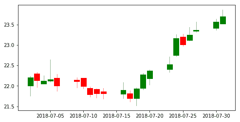
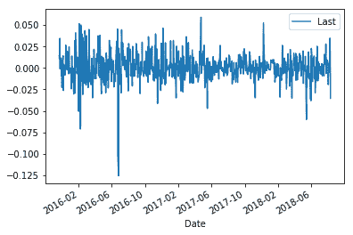
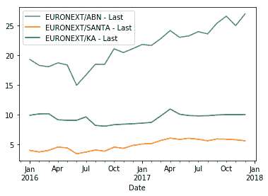
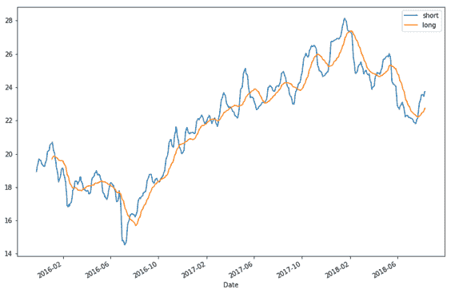
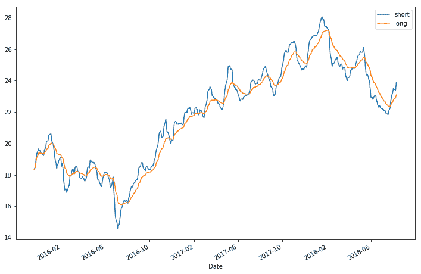

# 一、Python 金融分析概述

自从我上一本书*出版以来，Python 本身和许多第三方库都有了重大的升级。许多工具和功能已经被弃用，取而代之的是新的。本章将引导您了解如何获得可用的最新工具，以及如何准备将在本书其余部分中使用的环境。*

我们将对本书中涉及的大多数数据集使用 Quandl。Quandl 是一个服务于金融、经济和替代数据的平台。这些数据来源由各种数据发布者提供，包括联合国、世界银行、中央银行、贸易交易所、投资研究公司，甚至 Quandl 社区的成员。使用 PythonQuandl 模块，您可以轻松下载数据集并执行金融分析以获得有用的见解。

我们将使用`pandas`模块探索时间序列数据操作。`pandas`中的两个主要数据结构是 Series 对象和 DataFrame 对象。它们一起可用于绘制图表和可视化复杂信息。本章将介绍金融时间序列计算和分析的常用方法。

本章的目的是为您的工作环境奠定基础，图书馆将在本书中使用。多年来，与任何软件包一样，`pandas`模块也发生了巨大的变化，出现了许多突破性的变化。多年前编写的代码与较旧版本的`pandas`接口将不再有效，因为许多方法已被弃用。本书使用的`pandas`版本为 0.23。本书编写的代码与本版本`pandas`一致。

在本章中，我们将介绍以下内容：

*   为您的环境设置 Python、Jupyter、Quandl 和其他库
*   从 Quandl 下载数据集并绘制第一张图表
*   绘制最后的价格、数量和烛台图表
*   计算和绘制每日百分比和累积回报
*   绘制波动率、直方图和 Q-Q 图
*   可视化关联并生成关联矩阵
*   可视化简单移动平均线和指数移动平均线

# 获取 Python

在撰写本文时，最新的 Python 版本是 3.7.0。您可以从 Python 官方网站[下载 Windows、macOS X、Linux/UNIX 和其他操作系统的最新版本 https://www.python.org/downloads/](https://www.python.org/downloads/) 。按照安装说明在操作系统上安装基本 Python 解释器。

安装过程应该将 Python 添加到您的环境路径中。若要检查已安装 Python 的版本，请在使用 macOS X/Linux 的终端中键入以下命令，或在 Windows 上键入命令提示符：

```py
$ python --version
Python 3.7.0
```

For easy installation of Python libraries, consider using an all-in-one Python distribution such as Anaconda ([https://www.anaconda.com/download/](https://www.anaconda.com/download/)), Miniconda ([https://conda.io/miniconda.html](https://conda.io/miniconda.html)), or Enthought Canopy ([https://www.enthought.com/product/enthought-python-distribution/](https://www.enthought.com/product/enthought-python-distribution/)). Advanced users, however, may prefer to control which libraries get installed with their base Python interpreter.

# 准备虚拟环境

此时，建议设置 Python 虚拟环境。虚拟环境允许您管理特定项目所需的独立软件包安装，从而隔离在其他环境中安装的软件包。

要在终端窗口中安装虚拟环境软件包，请键入以下内容：

```py
$ pip install virtualenv
```

On some systems, Python 3 may use a different `pip` executable and may need to be installed via an alternate `pip` command; for example: `$ pip3 install virtualenv`.

要创建虚拟环境，请转到项目目录并运行`virtualenv`。例如，如果项目文件夹的名称为`my_project_folder`，请键入以下内容：

```py
$ cd my_project_folder
$ virtualenv my_venv
```

`virtualenv my_venv`将在当前工作目录中创建一个文件夹，其中包括先前安装的基本 Python 解释器的 Python 可执行文件，以及`pip`库的副本，您可以使用该副本安装其他软件包。

在使用新的虚拟环境之前，需要将其激活。在 macOS X 或 Linux 终端中，键入以下命令：

```py
$ source my_venv/bin/activate
```

在 Windows 上，激活命令如下所示：

```py
$ my_project_folder\my_venv\Scripts\activate
```

当前虚拟环境的名称现在将出现在提示符的左侧（例如，`(my_venv) current_folder$`），让您知道所选 Python 环境已激活。来自同一终端窗口的包安装将放置在`my_venv`文件夹中，与全局 Python 解释器隔离。

Virtual environments can help prevent conflicts should you have multiple applications using the same module but from different versions. This step (creating a virtual environment) is entirely optional as you can still use your default base interpreter to install packages.

# 运行 Jupyter 笔记本

Jupyter Notebook 是一个基于浏览器的交互式计算环境，用于跨各种编程语言创建、执行和可视化交互式数据。它以前被称为**IPython**笔记本。IPython 仍然作为 pythonshell 和 Jupyter 内核存在。Jupyter 是一款开源软件，所有人都可以免费使用和学习各种主题，从基本编程到高级统计或量子力学。

要安装 Jupyter，请在终端窗口中键入以下命令：

```py
$ pip install jupyter
```

安装后，使用以下命令启动 Jupyter：

```py
$ jupyter notebook 
... 
Copy/paste this URL into your browser when you connect for the first time, to login with a token: 
 http://127.0.0.1:8888/?token=27a16ee4d6042a53f6e31161449efcf7e71418f23e17549d
```

注意你的终端窗口。当 Jupyter 启动时，控制台将提供有关此运行状态的信息。您还应该看到一个 URL。将该 URL 复制到 web 浏览器中，以进入 Jupyter 计算界面。

由于 Jupyter 在您发出上述命令的目录中启动，因此 Jupyter 将列出工作目录中所有保存的笔记本。如果这是您第一次在目录中工作，则列表将为空。

要启动第一个笔记本，请选择 New，然后选择 Python3。新的 Jupyter 笔记本将在新窗口中打开。从今以后，本书中的大部分计算都将在 Jupyter 中进行。

# Python 增强建议

Python 编程语言中的任何设计考虑事项都记录为**Python 增强方案**（**PEP**）。已经写了数百个 PEP，但您应该熟悉的可能是**PEP****8**，这是 Python 开发人员编写更好、可读的代码的风格指南。政治公众人物的官方存储库为[https://github.com/python/peps](https://github.com/python/peps) 。

# 什么是政治公众人物？

PEP 是一组编号的设计文档，描述与 Python 相关的特性、流程或环境。每个 PEP 都在文本文件中仔细维护，其中包含特定功能的技术规范及其存在的理由。例如，政治公众人物 0 是所有政治公众人物的索引，而政治公众人物 1 则提供政治公众人物的目的和指南。作为软件开发人员，我们经常读代码多于写代码。为了创建清晰、简洁和可读的代码，我们应该始终使用样式指南作为编码约定。PEP8 是一套用于编写可呈现 Python 代码的风格指南。有关政治公众人物 8 的更多信息，请访问[https://www.python.org/dev/peps/pep-0008/](https://www.python.org/dev/peps/pep-0008/) 。

# 蟒蛇之禅

PEP20 体现了 Python 的 Zen，它是指导 Python 编程语言设计的 20 条软件原则的集合。要显示此复活节彩蛋，请在 Python shell 中键入以下命令：

```py
>> import this
The Zen of Python, by Tim Peters 

Beautiful is better than ugly. 
Explicit is better than implicit. 
Simple is better than complex. 
Complex is better than complicated. 
Flat is better than nested. 
Sparse is better than dense. 
Readability counts. 
Special cases aren't special enough to break the rules. 
Although practicality beats purity. 
Errors should never pass silently. 
Unless explicitly silenced. 
In the face of ambiguity, refuse the temptation to guess. 
There should be one-- and preferably only one --obvious way to do it. 
Although that way may not be obvious at first unless you're Dutch. 
Now is better than never. 
Although never is often better than *right* now. 
If the implementation is hard to explain, it's a bad idea. 
If the implementation is easy to explain, it may be a good idea. 
Namespaces are one honking great idea -- let's do more of those!
```

Only 19 of the 20 aphorisms are shown. Can you figure out what is the last one? I leave it to your imagination!

# Quandl 简介

Quandl 是一个服务于金融、经济和替代数据的平台。这些数据来源由各种数据发布者提供，包括联合国、世界银行、中央银行、贸易交易所和投资研究公司。

使用 Python Quandl 模块，您可以轻松地将金融数据集导入 Python。Quandl 提供免费数据集，其中一些是示例。访问高级数据产品需要付费访问。

# 为您的环境设置 Quandl

`Quandl`软件包需要最新版本的 NumPy 和`pandas`。此外，在本章的其余部分，我们将需要`matplotlib`。

要安装这些软件包，请在终端窗口中键入以下代码：

```py
$ pip install quandl numpy pandas matplotlib
```

多年来，`pandas`图书馆发生了许多变化。为较旧版本的`pandas`编写的代码可能无法与最新版本一起使用，因为存在许多不推荐使用的情况。我们将使用的`pandas`版本是 0.23。要检查您正在使用的`pandas`版本，请在 Python shell 中键入以下命令：

```py
>>> import pandas
>>> pandas.__version__'0.23.3'
```

当使用 Quandl 请求数据集时，需要一个**API**（简称**应用程序编程接口**）密钥。

如果您没有 Quandl 帐户，请执行以下步骤：

1.  打开浏览器并输入[https://www.quandl.com 地址栏中的](https://www.quandl.com/)。这将显示以下页面：


2.  选择“注册”，然后按照说明创建免费帐户。成功注册后，将显示 API 密钥。
3.  复制此密钥并将其安全地保存在其他位置，因为您稍后将需要此密钥。否则，您可以在帐户设置中再次检索此密钥。
4.  请记住检查您的电子邮件收件箱中是否有欢迎信息，并验证您的 Quandl 帐户，因为继续使用 API 密钥需要验证有效的 Quandl 帐户。

Anonymous users have a limit of 20 calls per 10 minutes and 50 calls per day. Authenticated free users have a limit of 300 calls per 10 seconds, 2,000 calls per 10 minutes, and a limit of 50,000 calls per day.

# 绘制时间序列图

分析时间序列数据的一种简单而有效的方法是将其可视化到一个图表上，从中我们可以推断出某些假设。本节将指导您完成从 Quandl 下载股票价格数据集并将其绘制在价格和成交量图上的过程。我们还将涵盖绘制烛台图，这将给我们比折线图更多的信息。

# 从 Quandl 检索数据集

将数据从 Quandl 提取到 Python 中相当简单。假设我们对泛欧交易所的荷兰银行集团感兴趣。Quandl 中的股票代码为`EURONEXT/ABN`。在 Jupyter 笔记本单元中，运行以下命令：

```py
In [ ]:
    import quandl

    # Replace with your own Quandl API key
    QUANDL_API_KEY = 'BCzkk3NDWt7H9yjzx-DY' 
    quandl.ApiConfig.api_key = QUANDL_API_KEY
    df = quandl.get('EURONEXT/ABN')
```

It is a good practice to store your Quandl API key in a constant variable. This way, should your API key change, you only need to update it in one place!

导入`quandl`包后，我们将 Quandl API 键存储在常量变量`QUANDL_API_KEY`中，该变量将在本章其余部分中重用。该常量值用于设置 Quandl 模块 API 密钥，每次导入`quandl`包只需执行一次。调用下一行的`quandl.get()`方法将 ABN 数据集从 Quandl 下载到我们的`df`变量中。请注意，`EURONEXT`是数据提供者泛欧交易所的缩写。

默认情况下，Quandl 将数据集检索到`pandas`数据帧中。我们可以检查数据帧的头部和尾部，如下所示：

```py
In [ ]: 
    df.head()
Out[ ]: 
                 Open   High     Low   Last      Volume      Turnover
    Date                                                             
    2015-11-20  18.18  18.43  18.000  18.35  38392898.0  7.003281e+08
    2015-11-23  18.45  18.70  18.215  18.61   3352514.0  6.186446e+07
    2015-11-24  18.70  18.80  18.370  18.80   4871901.0  8.994087e+07
    2015-11-25  18.85  19.50  18.770  19.45   4802607.0  9.153862e+07
    2015-11-26  19.48  19.67  19.410  19.43   1648481.0  3.220713e+07

In [ ]:
    df.tail()
Out[ ]:
                 Open   High    Low   Last     Volume      Turnover
    Date                                                           
    2018-08-06  23.50  23.59  23.29  23.34  1126371.0  2.634333e+07
    2018-08-07  23.59  23.60  23.31  23.33  1785613.0  4.177652e+07
    2018-08-08  24.00  24.39  23.83  24.14  4165320.0  1.007085e+08
    2018-08-09  24.40  24.46  24.16  24.37  2422470.0  5.895752e+07
    2018-08-10  23.70  23.94  23.28  23.51  3951850.0  9.336493e+07
```

By default, the `head()` and `tail()` commands will display the first and last five rows of the DataFrame, respectively. You can define the number of rows to display by passing a number in its argument. For example, `head(100)` will show the first 100 rows in the DataFrame.

在没有为`get()`方法设置任何额外参数的情况下，将检索整个时间序列数据集，每天从上一个工作日一直追溯到 2015 年 11 月。

为了可视化此数据帧，我们可以使用`plot()`命令绘制一个图形：

```py
In [ ]:
    %matplotlib inline
    import matplotlib.pyplot as plt

    df.plot();
```

最后一个命令输出一个简单的绘图：


`pandas`的`plot()`方法返回一个 Axes 对象。此对象的字符串表示形式与`plot()`命令一起打印在控制台上。要隐藏此信息，可以在最后一条语句的末尾添加分号（；）。或者，我们可以在单元格底部添加一个`pass`语句。或者，将绘图功能指定给变量也会抑制输出。

By default, the `plot()` command in `pandas` uses the `matplotlib` library to display graphs. If you are having errors, check to ensure this library is installed and `%matplotlib inline` is called once. You can customize the look and feel of your charts. Further information on the `plot` command in the `pandas` DataFrame is available in the `pandas` documentation at [https://pandas.pydata.org/pandas-docs/stable/generated/pandas.DataFrame.plot.html](https://pandas.pydata.org/pandas-docs/stable/generated/pandas.DataFrame.plot.html).

# 绘制价格和数量图表

当没有向`plot()`命令提供任何参数时，将使用目标数据帧的所有列在同一图形上绘制一个折线图。这就产生了一个杂乱的视图，并没有给我们提供太多的信息。为了有效地从这些数据中提取见解，我们可以绘制一个股票的金融图表，该图表显示了相对于其交易量的每日收盘价。为便于执行此操作，请键入以下命令：

```py
In [ ]:
    prices = df['Last']
    volumes = df['Volume']
```

前面的命令将我们感兴趣的数据分别存储到`closing_prices`和`volumes`变量中。我们可以通过`head()`和`tail()`命令查看生成的`pandas`系列数据类型的顶行和底行：

```py
In [ ]:
    prices.head()
Out[ ]:
    Date
    2015-11-20    18.35
    2015-11-23    18.61
    2015-11-24    18.80
    2015-11-25    19.45
    2015-11-26    19.43
    Name: Last, dtype: float64

In [ ]:
    volumes.tail()
Out[ ]:   
    Date
    2018-08-03    1252024.0
    2018-08-06    1126371.0
    2018-08-07    1785613.0
    2018-08-08    4165320.0
    2018-08-09    2422470.0
    Name: Volume, dtype: float64
```

要找出特定变量的类型，请使用`type()`命令。例如，`type(volumes)`生成`pandas.core.series.Series`，这告诉我们`volumes`变量实际上是一个`pandas`系列数据类型对象。

观察 2018 年至 2015 年的数据。我们现在可以绘制价格和数量图表：

```py
In [ ]:
    # The top plot consisting of daily closing prices
    top = plt.subplot2grid((4, 4), (0, 0), rowspan=3, colspan=4)
    top.plot(prices.index, prices, label='Last')
    plt.title('ABN Last Price from 2015 - 2018')
    plt.legend(loc=2)

    # The bottom plot consisting of daily trading volume
    bottom = plt.subplot2grid((4, 4), (3,0), rowspan=1, colspan=4)
    bottom.bar(volumes.index, volumes)
    plt.title('ABN Daily Trading Volume')

    plt.gcf().set_size_inches(12, 8)
    plt.subplots_adjust(hspace=0.75)
```

这将生成以下图表：


在第一行，`subplot2grid`命令和第一个参数`(4,4)`将整个图形划分为一个 4 x 4 的网格。第二个参数`(0,0)`指定给定的绘图将定位在图形的左上角。关键字参数`rowspan=3`表示绘图将占据网格上 4 个可用行中的 3 行，有效地高达图形的 75%。关键字参数`colspan=4`表示绘图将占用网格的所有 4 列，并使用其所有可用宽度。该命令返回一个`matplotlib`轴对象，我们将使用该对象绘制图形的上部。

在第二行，`plot()`命令呈现上部图表，日期和时间值在*x*轴上，价格在*y*轴上。在接下来的两行中，我们指定当前绘图的标题，以及放置在左上角的时间序列数据的图例。

接下来，我们执行相同的操作，在底部图表上呈现每日交易量，指定固定在图表左下角的 1 行 4 列网格空间。

In the `legend()` command, the `loc` keyword accepts an integer value as the location code of the legend. A value of `2` translates to an upper-left location. For a table of location codes, see the Legend documentation of `matplotlib` at [https://matplotlib.org/api/legend_api.html?highlight=legend#module-matplotlib.legend](https://matplotlib.org/api/legend_api.html?highlight=legend#module-matplotlib.legend).

为了使我们的图形看起来更大，我们调用`set_size_inches()`命令将图形设置为 9 英寸宽 6 英寸高，从而生成一个矩形图形。前面的`gcf()`命令仅表示**获取当前图形**。最后，调用带有`hspace`参数的`subplots_adjust()`命令，在顶部和底部子地块之间添加少量高度。

The command `subplots_adjust()` tunes the subplot layout. Acceptable parameters are `left`, `right`, `bottom`, `top`, `wspace`, and `hspace`. For further information on these, see the `matplotlib` documentation at [https://matplotlib.org/api/_as_gen/matplotlib.pyplot.subplots_adjust.html](https://matplotlib.org/api/_as_gen/matplotlib.pyplot.subplots_adjust.html).

# 绘制烛台图

烛台图是另一种流行的金融图表，它显示的信息比单一价格更多。烛台代表每个特定时间点的滴答声，包含四条重要信息：开放、高位、低位和收盘。

`matplotlib.finance`模块已被弃用。相反，我们可以使用另一个包，`mpl_finance`，它由提取的代码组成。要安装此软件包，请在终端窗口中键入以下命令：

```py
$ pip install mpl-finance
```

为了更紧密地可视化蜡烛，我们将使用 ABN 数据集的一个子集。在以下示例中，我们从 Quandl 查询 2018 年 7 月的每日价格作为数据集，并绘制烛台图，如下所示：

```py
In [ ]:
    %matplotlib inline
    import quandl
    from mpl_finance import candlestick_ohlc
    import matplotlib.dates as mdates
    import matplotlib.pyplot as plt

    quandl.ApiConfig.api_key = QUANDL_API_KEY
    df_subset = quandl.get('EURONEXT/ABN', 
                           start_date='2018-07-01', 
                           end_date='2018-07-31')

    df_subset['Date'] = df_subset.index.map(mdates.date2num)
    df_ohlc = df_subset[['Date','Open', 'High', 'Low', 'Last']]

    figure, ax = plt.subplots(figsize = (8,4))
    formatter = mdates.DateFormatter('%Y-%m-%d')
    ax.xaxis.set_major_formatter(formatter)
    candlestick_ohlc(ax, 
                     df_ohlc.values, 
                     width=0.8, 
                     colorup='green', 
                     colordown='red')
    plt.show()
```

这将生成一个烛台图，如以下屏幕截图所示：



You can specify the `start_date` and `end_date` parameters in the `quandl.get()` command to retrieve the dataset for the selected date range.

从 Quandl 检索到的价格放在名为`df_dataset`的变量中。由于`matplotlib`的绘图功能需要自己的格式，`mdates.date2num`命令转换包含日期和时间的索引值，并将其放置在名为`Date`的新列中。

烛台的日期、打开、高、低和关闭数据列被显式提取为`df_ohlc`变量中的数据帧。`plt.subplots()`创建一个宽 8 英寸、高 4 英寸的绘图图形。沿*x*轴的标签被格式化为人类可读的格式。

我们的数据现在可以通过调用`candlestick_ohlc()`命令绘制烛台图，烛台宽度为 0.8（或全天宽度的 80%）。收盘价高于开盘价的上涨点用绿色表示，收盘价低于开盘价的下跌点用红色表示。最后，我们添加了`plt.show()`命令来显示烛台图表。

# 对时间序列数据执行金融分析

在本节中，我们将可视化金融分析中使用的时间序列数据的一些统计特性。

# 标绘回报

衡量安全性能的一个经典指标是其前期回报。`pandas`中计算收益的一个简单方法是`pct_change`，其中针对数据帧中的每一行计算上一行的百分比变化。

在以下示例中，我们使用 ABN 股票数据绘制了一个简单的每日百分比回报图：

```py
In [ ]:
     %matplotlib inline
     import quandl

     quandl.ApiConfig.api_key = QUANDL_API_KEY
     df = quandl.get('EURONEXT/ABN.4')
     daily_changes = df.pct_change(periods=1)
     daily_changes.plot();
```

每日收益百分比的直线图如下所示：



在`quandl.get()`方法中，我们将股票代码后缀为`.4`，以指定仅检索数据集的第四列，其中包含最后的价格。在对`pct_change`的调用中，`period`参数指定要转换的时段数，以形成百分比变化，默认情况下为`1`。

Instead of using the postfix notation in the ticker symbol to specify the column of the dataset to download, we can pass the `column_index` parameter together with the index of the column. For example, `quandl.get('EURONEXT/ABN.4')` is the same as calling `quandl.get('EURONEXT/ABN', column_index=4)`.

# 绘制累积收益

为了了解我们的投资组合表现如何，我们可以对其在一段时间内的回报进行求和。`pandas`的`cumsum`方法返回数据帧上的累计和。

在下面的示例中，我们绘制了先前计算的 ABN 的`daily_changes`的累积总和：

```py
In [ ]:
    df_cumsum = daily_changes.cumsum()
    df_cumsum.plot();
```

这为我们提供了以下输出图：


# 绘制直方图

直方图告诉我们数据是如何分布的。在本例中，我们感兴趣的是荷兰银行的每日收益分布情况。我们在数据帧上使用`hist()`方法，数据帧的大小为 50：

```py
In [ ]:
    daily_changes.hist(bins=50, figsize=(8, 4));
```

直方图输出如下图所示：


当`pandas`数据帧中有多个数据列时，`hist()`方法将自动在各自的单独绘图上绘制每个直方图。

我们可以使用`describe()`方法总结数据集分布的中心趋势、分散度和形状：

```py
In [ ]:
    daily_changes.describe()
Out[ ]:
                 Last
    count  692.000000
    mean     0.000499
    std      0.016701
    min     -0.125527
    25%     -0.007992
    50%      0.000584
    75%      0.008777
    max      0.059123
```

从柱状图上看，收益率往往分布在平均值 0.0 左右，确切地说是`0.000499`。除了这个微小的向右倾斜外，数据看起来相当对称和正态分布。标准偏差为`0.016701`。百分位数告诉我们，25%的分数低于`-0.007992`，50%低于`0.000584`，75%低于`0.008777`。

# 标绘波动率

分析收益分布的一种方法是测量其标准差。**标准偏差**是平均值周围离散度的度量。过去收益的高标准差值表明股票价格变动的历史波动性很高。

`pandas`的`rolling()`方法帮助我们可视化一段时间内的特定时间序列操作。为了计算计算 ABN 数据集中收益百分比变化的标准偏差，我们使用`std()`方法，该方法返回可用于绘制图表的数据帧或序列对象。以下示例说明了这一点：

```py
In [ ]:
    df_filled = df.asfreq('D', method='ffill')
    df_returns = df_filled.pct_change()
    df_std = df_returns.rolling(window=30, min_periods=30).std()
    df_std.plot();
```

这为我们提供了以下波动曲线图：


我们的原始时间序列数据集不包括周末和公共假日，在使用`rolling()`方法时必须考虑到这一点。`df.asfreq()`命令将按每日频率重新索引时间序列数据，创建新索引以代替缺失的索引。值为`ffill`的`method`参数指定在重新索引期间，我们将向前传播最后一个有效的观察值，以代替缺失的值。

在`rolling()`命令中，我们将`window`参数的值指定为 30，这是用于计算统计数据的观察数。换句话说，每个周期的标准偏差是用 30 个样本量计算的。由于前 30 行的样本量不足以计算标准偏差，我们可以通过将`min_periods`指定为`30`来排除这些行。

选择的值 30 近似于每月收益的标准偏差。请注意，选择较宽的窗口周期表示测量的数据较少。

# 分位数图

Q-Q（分位数-分位数）图是概率分布图，其中两个分布的分位数相对绘制。如果分布是线性相关的，Q-Q 图中的点将位于一条直线上。与直方图相比，Q-Q 图有助于我们直观地看到直线外的点的正负偏斜，以及多余的峰度。

`scipy.stats`的`probplot()`帮助我们计算并显示概率图的分位数。还绘制了数据的最佳拟合线。在以下示例中，我们使用 ABN 股票数据集的最后一个价格，并计算每日百分比变化，以绘制 Q-Q 图：

```py
In [ ]:
    %matplotlib inline
    import quandl
    from scipy import stats
    from scipy.stats import probplot

    quandl.ApiConfig.api_key = QUANDL_API_KEY
    df = quandl.get('EURONEXT/ABN.4')
    daily_changes = df.pct_change(periods=1).dropna()

    figure = plt.figure(figsize=(8,4))
    ax = figure.add_subplot(111)
    stats.probplot(daily_changes['Last'], dist='norm', plot=ax)
    plt.show();
```

这为我们提供了以下 Q-Q 图：


当所有点正好沿红线落下时，数据的分布意味着与正态分布完全对应。我们的大部分数据在分位数-2 和+2 之间几乎完全相关。在这个范围之外，分布的相关性开始出现差异，尾部出现更多的负偏斜。

# 下载多个时间序列数据

在`quandl.get()`命令的第一个参数中，我们将单个 Quandl 代码作为字符串对象传递，以下载单个数据集。要下载多个数据集，我们可以传递一个 Quandl 代码列表。

在下面的例子中，我们对荷兰银行、桑坦德银行和卡斯银行三种银行股票的价格感兴趣。2016 年至 2017 年的两年期价格存储在`df`变量中，仅下载最后的价格：

```py
In [ ]:
    %matplotlib inline
    import quandl

    quandl.ApiConfig.api_key = QUANDL_API_KEY
    df = quandl.get(['EURONEXT/ABN.4', 
                     'EURONEXT/SANTA.4', 
                     'EURONEXT/KA.4'], 
                    collapse='monthly', 
                    start_date='2016-01-01', 
                    end_date='2017-12-31')
    df.plot();
```

生成以下绘图：



By default, `quandl.get()` returns daily prices. We may also specify other types of frequency for the dataset to download. In this example, we specified `collapse='monthly'` to download monthly prices.

# 显示相关矩阵

相关性是两个变量之间线性关系密切程度的统计关联。我们可以对两个时间序列数据集的返回值进行相关计算，得出一个介于-1 和 1 之间的值。相关值为 0 表示两个时间序列的收益彼此没有关系。接近 1 的高相关值表示两个时间序列数据的返回趋于一起移动。接近-1 的低值表示回报率倾向于相互反向移动。

在`pandas`中，`corr()`方法计算其提供的数据帧中列之间的相关性，并将这些值作为矩阵输出。在前面的示例中，我们在数据帧`df`中有三个可用的数据集。要输出返回的相关矩阵，请运行以下命令：

```py
In [ ]:
    df.pct_change().corr()
Out[ ]:
                           EURONEXT/ABN - Last ... EURONEXT/KA - Last
    EURONEXT/ABN - Last               1.000000 ...           0.096238
    EURONEXT/SANTA - Last             0.809824 ...           0.058095
    EURONEXT/KA - Last                0.096238 ...           1.000000
```

从相关矩阵输出中，我们可以推断，荷兰银行和桑坦德银行的股票在 2016 年至 2017 年的两年内高度相关，价值为`0.809824`。

默认情况下，`corr()`命令使用皮尔逊相关系数来计算成对相关。这相当于调用`corr(method='pearson')`。其他有效值分别为 Kendall Tau 和 Spearman 秩相关系数的`kendall`和`spearman`。

# 绘制相关性

通过`rolling()`命令也可以实现相关性的可视化。从 2016 年到 2017 年，我们将每天使用 Quandl 提供的 ABN 和 SANTA 的最新价格。这两个数据集被下载到数据框`df`中，其滚动相关性绘制如下：

```py
In [ ]:
    %matplotlib inline
    import quandl

    quandl.ApiConfig.api_key = QUANDL_API_KEY
    df = quandl.get(['EURONEXT/ABN.4', 'EURONEXT/SANTA.4'], 
                    start_date='2016-01-01', 
                    end_date='2017-12-31')

    df_filled = df.asfreq('D', method='ffill')
    daily_changes= df_filled.pct_change()
    abn_returns = daily_changes['EURONEXT/ABN - Last']
    santa_returns = daily_changes['EURONEXT/SANTA - Last']
    window = int(len(df_filled.index)/2)
    df_corrs = abn_returns\
        .rolling(window=window, min_periods=window)\
        .corr(other=santa_returns)
        .dropna()
    df_corrs.plot(figsize=(12,8));
```

相关图如以下屏幕截图所示：


`df_filled`变量包含一个数据帧，该数据帧的索引按每日频率重新索引，缺失值向前填充，以准备`rolling()`命令。数据帧`daily_changes`存储每日百分比收益，其列分别被提取到单独的序列对象`abn_returns`和`santa_returns`。`window`变量在两年数据集中存储每年的平均天数。此变量被提供到`rolling()`命令的参数中。参数`window`表示我们将进行一年的滚动关联。`min_periods`参数表示当只有完整样本量用于计算时，将计算相关性。在这种情况下，`df_corrs`数据集中没有第一年的相关值。最后，`plot()`命令显示 2017 年全年每日收益的一年滚动相关性图表。

# 简单移动平均线

时间序列数据分析的一个常见技术指标是移动平均数。`mean()`方法可用于计算`rolling()`命令中给定窗口的平均值。例如，5 天**简单移动平均线**（**SMA**）是过去五个交易日的平均价格，在一段时间内每天计算。同样，我们也可以计算长期 30 天简单移动平均线。这两个移动平均线可以一起用于生成交叉信号。

在以下示例中，我们下载荷兰银行的每日收盘价，计算短期和长期 SMA，并将其可视化到一个图上：

```py
In [ ]:
    %matplotlib inline
    import quandl
    import pandas as pd

    quandl.ApiConfig.api_key = QUANDL_API_KEY
    df = quandl.get('EURONEXT/ABN.4')

    df_filled = df.asfreq('D', method='ffill')
    df_last = df['Last']

    series_short = df_last.rolling(window=5, min_periods=5).mean()
    series_long = df_last.rolling(window=30, min_periods=30).mean()

    df_sma = pd.DataFrame(columns=['short', 'long'])
    df_sma['short'] = series_short
    df_sma['long'] = series_long
    df_sma.plot(figsize=(12, 8));
```

这将生成以下曲线图：



短期 SMA 采用 5 天平均值，长期 SMA 采用 30 天平均值。`min_periods`参数用于排除没有足够样本量计算 SMA 的第一行。`df_sma`变量是新创建的`pandas`数据帧，用于存储 SMA 计算。然后我们绘制一个 12 英寸乘 8 英寸的图表。从图中，我们可以看到短期 SMA 截取长期 SMA 的许多点。图表绘制者使用交叉点来识别趋势并生成信号。窗口期 5 和 10 纯粹是建议值；您可以调整这些值以找到自己的合适解释。

# 指数移动平均线

移动平均线计算中的另一种方法是**指数移动平均线**（**EMA**）。回想一下，简单移动平均线为窗口期内的价格分配相等的权重。然而，在 EMA 中，最新价格的权重高于旧价格。该权重是按指数分配的。

`pandas`数据帧的`ewm()`方法提供指数加权函数。`span`参数指定衰减行为的窗口周期。带有 EMA 的同一 ABN 数据集绘制如下：

```py
In [ ]:
    %matplotlib inline
    import quandl
    import pandas as pd

    quandl.ApiConfig.api_key = QUANDL_API_KEY
    df = quandl.get('EURONEXT/ABN.4')

    df_filled = df.asfreq('D', method='ffill')
    df_last = df['Last']

    series_short = df_last.ewm(span=5).mean()
    series_long = df_last.ewm(span=30).mean()

    df_sma = pd.DataFrame(columns=['short', 'long'])
    df_sma['short'] = series_short
    df_sma['long'] = series_long
    df_sma.plot(figsize=(12, 8));
```

这将生成以下绘图：



SMA 和 EMA 的图表模式基本相同。由于 EMA 对近期数据的权重高于对较旧数据的权重，因此它们对价格变化的反应比 SMA 更为积极。

Besides varying window periods, you can experiment with combinations of SMA and EMA prices to derive more insights!

# 总结

在本章中，我们使用 Python3.7 设置工作环境，并使用虚拟环境包管理单独的包安装。`pip`命令是一个方便的 Python 包管理器，可以轻松下载和安装 Python 模块，包括 Jupyter、Quandl 和`pandas`。Jupyter 是一个基于浏览器的交互式计算环境，用于执行 Python 代码和可视化数据。使用 Quandl 帐户，我们可以轻松获得高质量的时间序列数据集。这些数据源由各种数据发布者提供。数据集直接下载到`pandas`数据框对象中，该对象允许我们执行金融分析，例如绘制每日百分比收益、直方图、Q-Q 图、相关性、简单移动平均数和指数移动平均数。